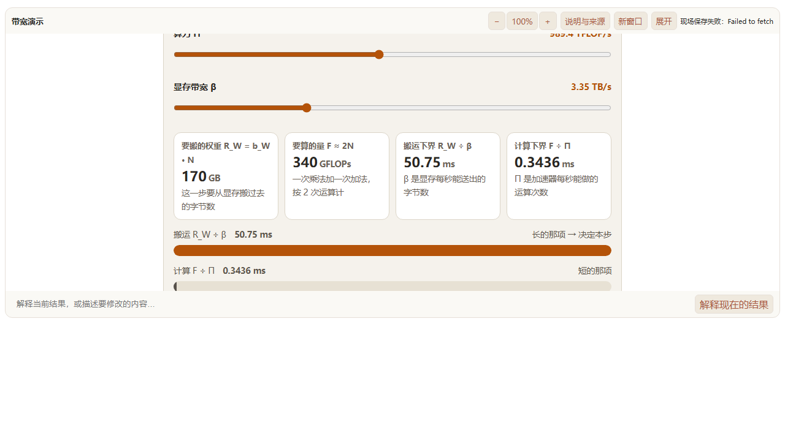

# 演示即时交互修复 — 2026-10-10

## 已确认范围

来源聊天 `01a124fa-9459-7241-b651-d9fb02a6e9f3` 已确认：滑块、数值和图表在浏览器立即更新；来源入口由宿主核对；保存和追问继续经过服务端校验。只修改本地，不上线。

`AgentPresentation`、`PresentationState`、来源引用沿用 CONTEXT.md 的既有定义。本次改变显示与服务器校验的时机，不增加领域对象。

## 执行步骤

- [x] 用线上第二版演示建立正式组件回归，证明旧版等待确认时无法显示。
- [x] 移除显示确认与旧值遮罩；保留初始化恢复、来源绑定、保存与追问。
- [x] 验证断网、连续调节、保存失败与来源操作，更新相关行为用例和文档。

## 判据

真实演示参数量从 70 调至 170 时，可见结果立即为 50.75 ms；没有旧值遮罩、焦点丢失或观察请求。断网只影响保存和追问。快照的参数与结果来自同一浏览器任务，异步恢复完成前不保存默认值。

## 实现与证据

`presentation-bridge.js` 删除 DOM 克隆、旧值遮罩、observe/accepted 往返及快照等待确认。初始化和异步恢复完成后发送 `ready`；动态来源标签仍由宿主桥生成，来源动作仍核对绑定。`AgentPresentation.vue` 直接接收本地就绪通知；原保存串行队列、错误提示和服务端校验保留。

线上原 HTML 固定为 `packages/web/playwright/fixtures/presentation-bandwidth.html`。回归使用真实 `AgentPresentation`、文档装配和网络客户端，测试路由控制响应与失败；既有浏览器集成用例使用真实 Rust 测试宿主验证保存、追问、来源及恢复。

- 红灯：旧实现遇到失败的 observe 请求，读数先隐藏，随后 iframe 被错误提示替换。
- 绿灯：断网后 20 次键盘连续调节从 70 到 170，每步可见数字与公式一致、焦点不丢；终值 50.75 ms。鼠标拖动同样更新，按钮权重减半为 10.45 ms。
- 保存失败只显示提示；延迟保存期间控件与图表继续更新。追问保留发送瞬间的参数和结果，失败时不发追问，重试成功。
- 动态未知来源不能打开，服务端拒绝含无效来源或内部定位文字的现场；脚本异常仍进入错误展示。
- 恢复测试发现测试宿主 `/reopen` 新建工作区但未选中聊天，导致 `PRESENTATION_SESSION_MISMATCH`。用既有选择会话 API 补齐测试流程后通过。

## 验证结果

- Playwright：桥接 7 项、真实宿主显示/来源 8 项、追问 2 项、恢复 1 项、线上原页交互 1 项，共 19 项通过。恢复用例修正测试流程后单独复跑通过。
- Vitest：组件、文档装配与消息归属 9 项通过。
- Rust：`presentation_state_save_failure_and_invalid_semantics_return_no_receipt` 通过，拒绝未交付版本、内部定位文字及存储失败。
- `pnpm --filter @understand-book/web typecheck` 通过。

浏览器复跑：先运行 `cargo test -p server --lib presentation_browser_host -- --ignored --nocapture --test-threads=1`，就绪后运行 `pnpm --filter @understand-book/web exec playwright test presentation-bridge.spec.ts presentation-immediate.spec.ts agent-presentation.spec.ts agent-presentation-follow-up.spec.ts agent-presentation-recovery.spec.ts --config playwright.ex10.config.ts --workers 1`。

## 已知问题

- 线上原演示仍有“实测低于下界”的文字笔误，应为“实测高于下界”。回归夹具保留现场原文；本次修改宿主交互链路。
- 生成内容本地显示后，服务端在保存、追问时检查现场文字和来源；公式与说明的正确性继续由制作预览和确定性计算验证。
- 本次只在本地验证，未部署。
