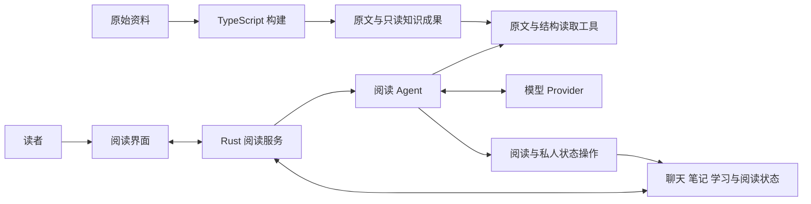

# 全书导读 从一次阅读任务理解 Understand Book

你正在阅读一本技术书。前一章介绍了一个概念，这一章又在另一个条件下使用它。你选中一段话，希望系统解释两者的关系，带你回到前面的定义，并把值得保留的理解记下来。第二天重新打开书时，你还希望知道上次读到了哪里、问过什么，以及哪些问题没有解决。

Understand Book 围绕这样的阅读过程组织原文、知识结构、Agent 和读者记录。理解这个项目，需要追踪一次任务怎样获得信息、怎样执行动作，以及任务结束之后哪些状态仍然存在。随着阅读深入，我们还会把材料规模、模型上下文、失败恢复和多人使用加入分析。

## 一次阅读任务包含哪些工作

先看“解释这一段，并联系前文”这句话。读者眼中的“这一段”有明确的指向，模型收到的却是一份请求。应用必须把当时的材料、位置和选区表达出来。前文中的概念也需要被找到；找到之后，要读取足够的原文，判断它是否与当前问题有关。回答中的来源还要能够回到读者正在使用的那一版材料。

如果任务进一步要求保存笔记，系统就需要执行一次真实的写入。笔记属于读者，会话记录需要保存本次交互，阅读器可能因为导航而改变位置。这些变化拥有各自的生命周期：视口随操作变化，聊天随追问增长，笔记在聊天结束后仍可使用。

由此可以建立观察项目的第一条线索：从读者意图开始，依次追踪信息、证据、动作和保存结果。每次遇到一个新模块，都问它承接了哪一项工作，以及后面的组件使用它提供的什么结果。

## 阅读之前和阅读当时

同一份材料可以支持许多不同的问题。章节位置、段落范围和概念出现的位置能够重复使用；每个问题需要哪些证据、怎样组织解释，则与当前任务有关。Understand Book 将这些工作分布在构建和阅读两个主要阶段。

构建阶段从输入材料出发，形成原文位置、语义抽取和结构整理成果。TypeScript 构建侧承担这部分工作。阅读阶段由 Rust 服务和运行时消费成果，根据问题调用工具、读取原文并执行阅读操作。Vue 界面承接读者的输入和展示，Tauri 提供桌面形态，MCP 为外部调用方提供相应的能力入口。

下面这张图表示主要工作关系。各工具的实际参数、状态归属和发布条件会在后续章节展开。

提前整理能够复用一部分工作，也会增加构建成本。阅读时按需取得内容能够减少无关输入，也可能引入更多定位和确认步骤。后面分析这些选择时，我们会分别计算准备工作、单次任务和多次使用的代价，再结合实际效果判断收益。

## 位置 证据与解释

原文位置是贯穿系统的一项基础。项目使用 LID 表示材料中有层级和顺序的位置，使构建侧整理的线索能够连接到原文，也使读取、引用、导航和批注具有共同的定位依据。

语义图和全书结构帮助系统决定去哪里看。读到的原文为具体解释提供依据。运行时还要管理本轮接受了哪些证据，以及最终显示的来源绑定到了哪里。三个环节各自回答一个问题：内容可能在哪里，本轮实际取得了什么，回答展示的引用对应哪段材料。

把这些关系理清之后，就能准确理解系统的能力边界。一个来源能够被解析和跳转，说明它有真实的原文位置；回答是否正确解释了这段材料，还需要检查内容本身。评测章节会分别讨论这些结果。

## 状态由谁持有

一个用户同时打开两本书时，系统需要保留两个阅读现场；两名用户阅读同一本材料时，可以共享材料成果，但各自拥有聊天和笔记。这些场景决定了状态怎样分层。

| 状态 | 主要归属 | 为什么需要这样区分 |
| --- | --- | --- |
| 已发布材料与语义成果 | 书籍及其发布版本 | 多个阅读任务能够使用同一份内容，旧引用仍指向原材料 |
| 阅读位置与窗口现场 | 一个读者的阅读现场 | 两个窗口能够各自阅读和导航 |
| 对话与聊天目标 | 对应聊天 | 追问和任务结果需要回到原会话 |
| 笔记与稳定画像 | 读者的私人数据 | 信息可以持续使用，并保留用户归属 |
| 教学会话与学习事实 | 读者的学习状态 | 学习过程可以跨多次交互延续 |
| 当前消息 证据和执行进展 | 一次 Run | 运行中的信息需要与当时的输入和动作保持关联 |

后续阅读源码时，可以沿着这张表寻找每项状态的创建、修改、保存和回收。许多看起来复杂的接口，目的就是把一次操作送到正确的状态所有者那里。

## 全书怎样逐步展开

第一篇从阅读任务建立整体结构，解释组件和状态归属。第二篇进入构建阶段，沿原文切分、语义抽取、全书结构、调度和发布追踪一份材料。第三篇回到读者的一次提问，深入工具、上下文、证据和交付。第四篇讨论阅读界面、长期记忆、会话恢复和可视化解释。第五篇加入并发、多人服务、部署与实测。第六篇通过真实演进和失败案例练习架构判断，并整理面试表达。

每一篇都会增加新的条件。最初只需要一份材料和一个问题，随后需要连续追问、保存成果、处理中断，再考虑多个读者共享服务。前面形成的判断也会随这些条件重新检验。例如，一轮请求可以使用临时消息列表，跨会话阅读就需要持久记录；单窗口可以使用一个当前视口，多窗口则需要显式的现场归属。

## 阅读与练习

第一次阅读时，先关注场景、数据流和设计理由。遇到陌生术语，可以回到它第一次承担具体工作的地方。第二次阅读时，再沿章末的源码入口找到关键符号，对照一个真实输入和输出。面试准备则从完整请求链路开始，把重要机制压缩为短答，再通过改变条件的追问展开。

读到某个设计选择时，可以尝试先提出自己的方案，再继续看项目采用的做法。比较时关注它们在相同任务下需要完成的工作、保留的状态和付出的代价。数据不足以支持强结论时，明确下一项能够改变判断的观察或实验。

本书希望帮助你形成这样的能力：能够解释现有系统，也能够在材料、模型或使用条件变化后，判断哪些设计仍然适用，哪些地方需要重新考虑。

需要快速回查时，可用[术语与状态归属](../appendices/A-术语与状态归属.md)辨认概念，用[源码阅读路线](../appendices/B-源码阅读路线.md)进入实际路径，再由[章节与面试问题对照](../appendices/F-章节与面试问题对照.md)返回完整论证。其余附录入口集中在[全书目录](../README.md#附录与回查入口)。

当前正文可以从[第 1 章的阅读任务](01-一本书怎样成为交互阅读环境.md)开始，接着阅读[第 2 章的构建与阅读分工](02-构建与阅读如何分工.md)、[第 3 章的数据身份与状态归属](03-数据身份与状态归属.md)。[第 4 章](04-原文定位与LID.md)和[第 5 章](05-语义抽取与来源锚定.md)用同一份教学材料展开原文与语义构建，[第 6 章](06-全书结构与语义候选召回.md)解释章节路线和跨章主题，[第 7 章](07-模型工作单元与执行调度.md)追踪这些工作怎样真正执行，[第 8 章](08-构建恢复与成果发布.md)连接中断恢复、阶段收口和阅读发布，再由[第 9 章](09-一次有证据的回答.md)进入读时回答。

## 源码选读

[项目入口](../../../README.md)提供整体定位和既有实测；[当前架构](../../架构.md)连接主要机制及其决策；[构建编排](../../../packages/core/src/build-orchestrator.ts)、[阅读 Agent](../../../crates/runtime/src/orchestrator.rs)和[服务入口](../../../crates/server/src/lib.rs)分别对应构建、决策和运行组织。阅读这些大文件时，先从本章涉及的工作进入，再沿具体调用向下追踪。
