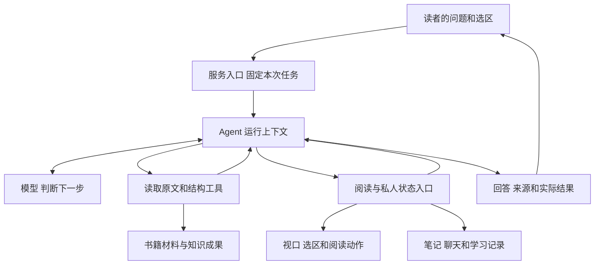

# 第 1 章 一本书怎样成为可以交互的阅读环境

读到一本技术书的中间，你发现作者又用了前面出现过的概念。这一次，结论似乎变了。你选中当前段落，提出请求：“解释这里与前面定义的区别，带我看原文，再把关键区别记下来。”

这句话包含几种不同的工作。解释需要理解两处材料；带你看原文需要改变阅读位置；记下来需要保存一份以后仍能找到的记录。到了第二天，你还可能接着问：“昨天说的条件，在这一节还成立吗？”系统于是需要保留已经讨论过什么，以及哪些操作真正完成了。

Understand Book 将这些工作组织在同一个阅读环境中。它把长文整理成可定位、可关联的材料，让 Agent 围绕具体问题取得证据，并通过阅读器和私人记录完成后续操作。理解整个项目，可以从这句话需要产生的结果开始。

## 从一句请求拆出可以观察的结果

最直接的做法，是把当前段落交给模型，请它解释。若问题只涉及这段话，这样做已经能够提供帮助。一旦问题出现“前面”“带我去看”“记下来”，输入和输出就都需要扩展。

“前面”要求系统在书中找到另一处材料；“去看”要求一个能够接收位置的阅读器；“记下来”要求一个保存入口。模型可以决定调用什么能力，具体结果要由这些能力产生。

| 读者要求 | 系统需要得到什么 | 怎样观察是否完成 |
| --- | --- | --- |
| 解释当前段落 | 与问题相关的原文和解释 | 回答是否保留了原文的条件，是否回答了疑问 |
| 联系前面的定义 | 相关位置及足够的前文 | 能否找到并读到那一定义，比较是否使用了完整语境 |
| 带我看来源 | 与实际材料绑定的位置 | 阅读器能否打开正确材料、定位并展示对应范围 |
| 把区别记下来 | 一条属于当前读者的记录 | 保存结果和笔记正文是否符合要求，后来能否再次读取 |
| 明天继续讨论 | 原聊天及相关的持久结果 | 能否恢复讨论依据，区分完成事项和未完成事项 |

这些结果相互联系，也可以分别失败。例如，解释内容大体正确，来源按钮却跳错了位置；笔记已经写入，但回答没有说明保存到了哪里。项目的实现因此需要同时处理信息取得、动作执行和结果交付。

这一点也决定了阅读项目的方式。遇到一个模块时，先问它让上表中的哪项结果成为可能，再追踪它接收和输出的数据。这样就能将接口放回实际任务中理解。

## “这里”怎样进入一次请求

读者指着屏幕说“这里”时，指代十分明确。模型收到的请求却需要用数据表达这个现场：问题文字、提问位置、所选原文及其对应范围。

在 [Web App 的 submitAgentMessage](../../../packages/web/src/App.vue) 中，界面先确定提问锚点：优先使用选区位置，其次使用当前选中的位置，再考虑视口顶部。随后创建运行时，会传入下面这些信息：

```typescript
    const result = await api.agentRunCreate(msg, {
      presentation_follow_up: presentationFollowUp,
      ...goalMeta,
      display_user: displayUser, question_anchor_lid: questionAnchorLid,
      question_quote: draft ? { ...draft } : null,
    });
```

`msg` 是这次要处理的问题，`question_anchor_lid` 表示问题发生的位置，`question_quote` 携带选区。它们承担不同作用：位置帮助找回阅读现场，选区表达用户实际指出的材料。用户可以没有选中文字而直接提问，此时 `question_quote` 为 null。

Server 中的 [AskQuote](../../../crates/server/src/lib.rs) 除了位置和引文，还可以带有选区范围、解析状态、原始选中文字与对应的规范原文。PDF 中“屏幕上选到了什么”和“它对应哪段书内原文”需要经过解析，这些字段为这种区别保留了表达空间。

接收请求后，服务端会校验输入，再接纳消息和安排执行。[本地准备入口 prepare_agent_chat](../../../crates/server/src/lib.rs) 与[网络运行准入](../../../crates/server/src/run_admission.rs)都使用 `validate_agent_input`。涉及规范选区时，服务端根据范围核对原文，后续流程消费通过校验的结果。

已经验证的选区可能足以回答当前问题；需要联系前文时，Agent 再获取其他材料。这样，读取工作随任务需要展开。第 9 章会进一步解释这些材料怎样进入本轮证据账本。

## 把任务交给可以执行的能力

有了问题和现场，接下来需要决定做什么。Agent 根据当前信息提出下一步行动，工具和状态入口执行具体工作，再把结果交回运行上下文。模型看到结果之后，可以继续查找、组织解释或者结束回答。

可以先用下面的关系图理解这个过程。箭头表示工作关系，实际调用顺序取决于任务和已有信息。



[Book](../../../crates/read-tools/src/lib.rs) 持有加载后的原文、定位树和知识成果。读取工具能从这里取得材料；模型对内容的分析，则发生在 Agent 和模型调用的协作中。查找到的概念关系帮助决定去哪里看，真正要引用的文字仍然需要回到原文。

[Reader](../../../crates/reader/src/lib.rs) 管理阅读现场。它的状态包括视口、打开的面板、选区和布局。改变阅读位置，需要进入这个对象对应的操作路径。解释中的一句“请看上一节”可以指导人阅读；自动把阅读器带到上一节，则还需要实际执行导航。

私人记录通过用户状态访问。[UserRuntime](../../../crates/server/src/user_runtime.rs) 持有记忆存储、聊天历史及相应的长期能力。把一段理解保存成笔记，意味着系统产生了可以再次读取的数据。回答中是否说出了“已保存”，不能替代这一写入结果。

这几个部分组成了一个能够完成阅读任务的最小结构：材料提供依据，模型作出选择，工具执行读取，状态入口完成操作，服务把实际结果交付给读者。后面的复杂机制，都可以沿着这条关系寻找它们承担的工作。

## 为什么需要保留多个时间尺度

假设第一次回答完成后，你接着问：“那么在数据量更大时呢？”这一次问题需要利用前一轮讨论，却不必把所有长期笔记都塞进请求。几天后再次阅读时，运行中的临时消息早已结束，保存过的笔记仍应存在。

项目因此分别表达一次运行、一段聊天和读者的长期记录。

一次 Run 管理当前执行需要的信息。[RunContext](../../../crates/runtime/src/run_context.rs) 包含消息、模型配置、取消信号、实际效果以及定位、证据和进展记录。它服务于“这一次问题怎样做完”。

聊天保存多轮交互，必要时还关联跨运行持续的 Goal。某次运行已经停止，任务仍可能留有待办；后续继续时，需要读到原要求和已经取得的结果。运行状态与任务状态由此拥有不同的生命周期。

笔记和学习记录属于更长的时间尺度。用户可以在一个聊天中保存笔记，之后关闭聊天，再从同一本书或相关入口使用它。Tutor 管理的学习过程也可能跨多次交互延续。具体的数据关系会在后面的状态与学习章节展开。

对于上下文，这意味着每次请求要根据当前任务组织输入；对于持久化，这意味着已经发生的事实需要有稳定保存位置。把一次模型请求的消息数组当作全部项目状态，很难同时满足这两个要求。

## 如何判断这个系统有没有帮助读者

完成系统结构之后，还需要判断它是否有效。一个容易取得的指标是“找到了相关段落”，但读者真正关心的是理解有没有变清楚、要求的操作有没有完成。

设系统找到了前面的定义，也给出了可点击来源，却忽略了定义中的一个前提。定位成功了，解释仍可能错误。再设解释正确、笔记保存接口也成功了，但笔记没有包含要求的关键区别，整项任务仍有缺口。

项目的评测材料因此分别观察证据召回、引用支持、完整回答和实际动作。[既有 Agent 评测协议](../../../evals/semantic/AGENT_EVAL.md)还将重启任务中的准备阶段与恢复阶段分开：如果重启前根本没有完成保存，就不能把重启后的缺失全部归因于存储恢复。

这种区分也适用于日常调试。面对一次失败，先找读者缺少的结果，再沿链路回溯：所需材料没有找到，原文没有读够，操作没有执行，还是结果没有正确交付。具体缺口会决定应该修改检索、提示、接口、状态处理中的哪一部分。

## 阅读范围与当前边界

本章建立的是当前工作区的职责关系。界面的不同入口可以采用不同的准入、并发和恢复安排；后面讨论网络服务时，再展开多用户和多窗口的规则。

已发布材料的可靠定位、一次操作的实际完成，以及读者是否真正理解，是需要分别评估的结果。现有开发集可以帮助定位任务失败，尚不能替代广泛的教学效果研究。涉及性能和成功率时，本书使用实验记录中的具体条件。

## 源码选读

| 入口 | 重点阅读 | 可以回答的问题 |
| --- | --- | --- |
| [App.vue](../../../packages/web/src/App.vue) | submitAgentMessage、sendAgent | 问题、位置和选区如何一起提交 |
| [Server](../../../crates/server/src/lib.rs) | AskQuote、validate_agent_input、prepare_agent_chat | 输入怎样成为可执行的任务 |
| [网络准入](../../../crates/server/src/run_admission.rs) | 输入校验与 PreparedAgentChat 的形成 | 网络入口怎样接纳相同的任务材料 |
| [RunContext](../../../crates/runtime/src/run_context.rs) | ReaderInputSnapshot、RunContext | 一次执行需要保留哪些信息 |
| [读取工具](../../../crates/read-tools/src/lib.rs)、[Reader](../../../crates/reader/src/lib.rs) | Book、ReaderState | 材料读取与阅读现场分别由谁管理 |

Server 中的 `agent_chat_selection_ranges_rebuild_canonical_quote` 展示按选区范围重建引文的用例。完整的来源与状态操作链路可以接着阅读[第 9 章](09-一次有证据的回答.md)。

## 用项目机制回答面试问题

**怎样用一段话介绍项目？**

Understand Book 把长文整理成可定位、可关联的知识底座，让阅读 Agent 围绕问题和选区取得原文依据，再通过阅读器与私人存储完成导航、笔记和持续讨论。工程上需要同时解决材料组织、模型执行、状态归属和可追踪交付，效果上分别评估引用支持与完整任务完成。

**已经接上模型，为什么还需要这些组件？**

先从任务要求回答。模型需要知道“这里”指向什么，需要取得未放进请求的材料，也需要调用程序才能改变阅读位置或保存笔记。组件的价值可以逐项对应到输入表达、材料读取、动作执行和结果保存，而后再解释各部分如何连接。

**如果模型回答很流畅，是否说明任务成功？**

沿本章开头的请求核对：比较是否基于两处完整语境，来源能否回到原文，笔记是否确实保存且包含关键区别。流畅度只描述输出的一种特征，任务验收要回到读者要求产生的结果。

现在已经知道系统要承担哪些工作，接下来的问题是工作应该发生在什么时候。同一本书可能被反复提问，每次都重新整理全部材料会付出重复成本。[第 2 章](02-构建与阅读如何分工.md)将从这个约束出发，解释构建与阅读的分工。
