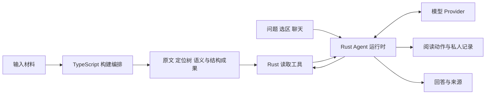

# 第 2 章 构建与阅读如何分工

第一次向一本书提问时，你可以把相关正文直接交给模型。第二次提问换了一个主题，又需要找到相关正文。到了第十次，系统开始重复处理许多相同的信息：章节在哪里，某个概念出现过几次，哪些段落在讨论同一件事。

这些信息中，有一部分由材料本身决定，可以提前整理。另一些只有在问题出现以后才能确定：这一次应该比较哪些条件，需要读多少原文，最后是否要保存笔记。Understand Book 将两类工作分别放在构建阶段和阅读阶段，让稳定成果服务于不断变化的任务。

这个分工同时影响数据格式、技术栈和成本。理解它，需要回答三个问题：提前做出的成果是什么，阅读时怎样使用，以及投入何时能够收回。

## 从重复处理材料，到重复使用成果

先考虑一种直接方案：每次问题到来，都将整份材料放进模型上下文，让模型自己找到需要的信息。如果材料较短、问题较少，这条路径有很低的准备门槛。材料变长后，一次请求需要容纳更多输入；如果超出可用上下文，还需要切分、检索或多轮阅读。

现在加入重复提问。即使模型每次都能处理全文，系统仍可能重复支付组织材料和定位的代价。当前问题只关心一个概念，输入却带上了许多与它无关的内容。缓存可能降低部分费用，但不会自动替系统确定每个问题的证据范围。

Understand Book 的构建侧把材料变成一套能够再次使用的成果。原文保存在 `source.txt`；位置树把层级和文本范围连接起来；语义节点、关系及全书结构提供从问题走向材料的线索。阅读时，Agent 根据问题选择入口，取得需要的原文，再继续判断是否已经读够。

这个分工保留了一个关键连接：提前得到的结构最终要能回到原文。概念之间的一条关系可以提示“去这里看看”，回答中的具体引文则要取自那里的实际文字。构建成果因此既要组织信息，也要保留定位依据。

## 构建阶段产出什么

项目中的构建已经包含多种工作。确定性处理将输入块映射成 LID 和范围；模型参与语义抽取；后续阶段整理全书结构以及适合材料类型的补充成果。每项工作是否进入本次计划，要结合材料类型、阅读目标和已有成果决定。

[build-orchestrator.ts](../../../packages/core/src/build-orchestrator.ts) 中的 `AutomaticBuildStage` 声明了这些阶段，包括 Pass1、Pass2、BookStructure，以及论文元数据、术语、形式对象和教学发布等。`routeAutomaticBuildSnapshot` 根据构建计划和现有状态组织后续工作，`nextAutomaticBuildAction` 再寻找下一项可执行动作。这个结构让构建能够逐步推进，并表达尚需输入或尚未满足的条件。

读者使用这些成果时，最先遇到的是原文和只读基座。[Book::load](../../../crates/read-tools/src/lib.rs) 的加载入口包含下面一段代码：

```rust
        let base_s = std::fs::read_to_string(std::path::Path::new(dir).join("base.json"))
            .map_err(|e| format!("读 base.json 失败: {e}"))?;
        let base: ReadOnlyBase =
            serde_json::from_str(&base_s).map_err(|e| format!("解析 base.json 失败: {e}"))?;
        let source = std::fs::read_to_string(std::path::Path::new(dir).join("source.txt"))
            .map_err(|e| format!("读 source.txt 失败(原文旁路缺失,book.text 不可用): {e}"))?;
```

这段代码直接表达了读取端最基础的依赖。`base.json` 提供结构化信息，`source.txt` 提供可以切片读取的正文。只有概念和摘要而缺少正文时，`book.text` 就无法按位置返回原文。

同一加载函数还读取公式语义、篇章索引、全书结构和论文材料等旁路文件。部分文件缺失时可以使用空集合或缺省值；已经存在但无法解析的文件则会返回错误。因此，“能够加载书籍”与“所有阅读或教学能力已经准备齐全”需要分别判断。发布清单中的能力和就绪信息承担后一类说明。

这个阶段的产物可以被很多问题复用。它们通常不需要知道下一位读者会问什么，也不持有这位读者的聊天和笔记。进入具体阅读任务后，系统才将公共材料与私人现场连接起来。

## 阅读阶段完成什么

阅读阶段接收问题、选区、聊天与当前现场，然后围绕任务取得材料。原文读取本身由确定性工具完成；需要先查什么、如何解释、是否继续读取，则由运行时与模型协作决定。

可以把整体关系画成两条相接的路径：



这里有两个值得区分的时间点。构建阶段发现“某个概念出现在哪些位置”，阅读阶段判断“这些位置是否足以解释当前问题”。后者可能需要上下文、反例或另一个章节。提前整理减少了部分查找工作，运行时仍然需要根据实际取得的材料作出判断。

阅读动作也发生在这个阶段。导航、保存笔记、继续聊天都依赖当前读者和当前任务，把它们提前固化进公共构建成果没有意义。相应的状态归属会在下一章展开。

## 为什么选择 TypeScript 与 Rust

跨语言分工首先需要一个足够清楚的交界面。在这个项目中，主要交界面是已经形成的材料成果：构建侧写出数据，读取侧按约定加载。相比让两种语言持续共享一组频繁变化的运行对象，这个方向明确的接口更容易说明各自责任。

[ADR-0021](../../adr/0021-实现技术栈-预构建ts-读时后端rust-前端待定-基座schema-rust权威ts-rs生成.md)记录了当时的选择。TypeScript/Node 便于衔接 Understand Anything 的构建经验、解析与模型编排生态；Rust 用于读取后端与运行时，并参考 Codex 的相关工程结构。基座类型以 Rust 定义为权威，通过 `ts-rs` 生成 TypeScript 类型，使生产者和消费者围绕同一套字段约定协作。

语言只能解释一部分设计。当前系统还包含界面、桌面宿主和外部能力入口，它们分别承接不同的使用方式。

| 部分 | 当前主要职责 | 与前后环节的连接 |
| --- | --- | --- |
| TypeScript 构建侧 | 组织输入处理、语义工作及构建推进 | 产生原文、基座和扩展成果 |
| Rust 读取工具 | 加载材料，执行原文及结构读取 | 为 Reader 与 MCP 等调用方提供共同读取能力 |
| Rust 服务与运行时 | 接纳任务，调用模型和工具，处理状态与交付 | 将问题、材料和实际动作连接起来 |
| Vue 界面 | 表达选区、问题与阅读操作，展示结果 | 通过服务接口获取数据并提交动作 |
| Tauri 桌面宿主 | 将阅读界面与本地服务组织为桌面应用 | 提供桌面启动及运行环境 |
| 模型 Provider 与 MCP | 前者承接模型调用；后者提供面向外部调用方的能力接口 | 分别连接模型执行和外部工具使用 |

这张表描述职责。模型调用并不只会出现在一个时间阶段：构建中的语义工作和阅读中的解释都可能需要模型，各自通过对应的执行安排完成。读取工具能够确定性返回原文，也不意味着整个阅读服务都不再依赖模型。

ADR-0021 中“前端待定”属于决策当时的状态。当前 Vue 与 Tauri 已经有实现。阅读架构文档时，需要将历史选择的理由和今天的组件状态分别对照。

## 提前准备在什么条件下划算

下面用一个教学模型分析重复使用的成本。假设材料在观察期间保持不变，两种方案都要达到相同的任务质量目标，并且所有成本已经换算成同一种计量单位。记：

- `B`：一次构建的成本。
- `D`：直接处理一次问题的平均成本。
- `R`：利用构建成果处理一次问题的平均成本。
- `q`：这份材料被处理的问题数量。

直接方案的总成本是 `qD`，提前构建方案的总成本是 `B + qR`。当 `D > R` 时，构建方案的成本优势要求：

`q > B / (D - R)`

这个式子的意义很具体：每次阅读节省的成本是 `D - R`，需要积累足够多次使用，才能覆盖最初投入。如果 `D ≤ R` 且构建成本为正，这个模型中就没有靠增加提问次数收回成本的交点；构建可能仍提供其他价值，但需要另行证明。

设教学算例中的 `B = 180`、`D = 12`、`R = 3`。这些数字是用于解释关系的成本单位，不是项目实测。

| 问题数量 q | 直接处理 qD | 提前构建 B + qR | 此时可以怎样判断 |
| --- | ---: | ---: | --- |
| 10 | 120 | 210 | 使用次数还不足以覆盖准备投入 |
| 20 | 240 | 240 | 达到模型中的成本交点 |
| 60 | 720 | 360 | 重复使用开始带来明显累计收益 |

共享材料会改变 `q` 的含义。一份公共发布被多位读者使用时，可复用投入由这些问题共同分摊；各人的解释、聊天和私人写入仍然产生各自的阅读成本。是否划算因此取决于材料总使用量，而不只取决于某一人的提问次数。

材料更新还会增加新的准备成本。如果观察期间发生多次修订，总投入应加入每次修订实际付出的 `U_j`。新版能够复用多少成果、哪些工作需要重做，会影响这些数值，不能直接沿用首次构建的结论。

最后还要单独看等待时间。已经准备好的书可以直接进入阅读；尚未构建的书需要先完成相应工作。累计费用更低，并不自动意味着第一次使用更快。Token、金额、运行时长也不能直接相加：成本比较先统一计量口径，延迟则按读者实际等待的路径计算。

## 用实测约束直觉

成本模型中的 `R` 取决于运行时实际做了多少工作。增加结构和语义线索，可能缩短定位，也可能让 Agent 多走几轮工具调用。更丰富的结构是否改善完整任务，需要看实验。

项目在 [2026-09-08 的同环消融报告](../../../evals/semantic/results/2026-09-08-la9-v2/report.md)中比较了 text、tree、graph 三种读时定位能力。三组使用 deepseek-v4-flash，共享生产 Agent 循环、基础提示、原文、判分和冻结预算。该轮 24 个任务的部分结果如下：

| 组别 | 完整成功 | 证据召回 | 引用支持 | 平均 Token |
| --- | ---: | ---: | ---: | ---: |
| text | 10/24 | 88.46% | 38.46% | 85,729.96 |
| tree | 11/24 | 88.46% | 34.62% | 101,842.04 |
| graph | 9/24 | 92.31% | 30.77% | 95,171.38 |

graph 组的证据召回更高，完整成功却更少。这说明在该轮任务中，找到更多所需证据还不足以让后续解释和交付完成得更好。tree 组较 text 组多成功一道题，也付出了更高的平均 Token。仅根据“增加了图”或“增加了树”，无法推出任务质量与成本的单向变化。

这组结果帮助理解架构中的一个取舍：构建侧提供可利用的能力，阅读侧还需要恰当地使用它们。收益需要沿“定位—阅读—解释—交付”整条链路观察。第 21 章会进一步分析判分、失败归因与不同实验之间的可比性。

## 发布、修订与当前边界

构建中的工作区可以不断形成新成果，读者使用的发布则需要保持明确身份。[PublishedLibrary](../../../crates/server/src/published_library.rs) 使用书籍与发布的组合引用管理已发布材料，清单记录能力和就绪信息。一次运行绑定所用发布后，就有了能够追溯的材料范围；后续补齐成果可以形成新的发布。

内容修订比补齐成果更进一步。原文发生变化时，旧引用、笔记和学习记录仍需要解释它们当初指向什么。[ADR-0146](../../adr/0146-portable-build-workspaces-and-incremental-book-updates.md)规定搬迁保持身份、内容改版形成关联前版的新基座，并规划增量复用与用户记录衔接。本书读取的版本记录为 U1—U2 已完成，U3—U11 待实施，因此完整的跨版本复用与迁移仍属于后续方案。

本章成本算例是教学推导；同环消融是指定版本、单书开发集的一轮历史结果。前者不提供项目费用估计，后者不代表当前版本或任意材料上的总体效果。基座能够加载也不等同于所有扩展能力已经完成发布。

## 源码选读

| 入口 | 重点阅读 | 可以回答的问题 |
| --- | --- | --- |
| [构建编排](../../../packages/core/src/build-orchestrator.ts) | AutomaticBuildStage、routeAutomaticBuildSnapshot、nextAutomaticBuildAction | 一个计划怎样决定后续构建工作 |
| [原文切分](../../../packages/core/src/segment.ts) | SourceBlock 到 LidNode 的映射 | 可重复使用的位置依据怎样产生 |
| [读取工具](../../../crates/read-tools/src/lib.rs) | Book::load、Book::text | 构建成果怎样变成可调用的原文读取能力 |
| [基座类型](../../../crates/base-schema/src/lib.rs) | ReadOnlyBase 与 TS 导出声明 | 两种语言如何共享成果格式 |
| [发布库](../../../crates/server/src/published_library.rs) | PublishedBookRef、PublicationManifest、PublishedBook | 读者究竟绑定哪份发布成果 |

## 用项目机制回答面试问题

**为什么将构建与阅读拆开？**

材料的位置、概念和结构可以被多次任务复用，具体证据选择、解释和私人操作则依赖当前问题。分工使可重复的准备工作提前完成，读时再按任务取得原文。是否更便宜，需要比较构建投入、读时节省、使用次数与更新频率；是否更有效，需要观察完整任务结果。

**为什么跨语言，复杂度会不会更高？**

跨语言会增加数据契约与调试成本。这里的主要接口是方向明确的材料成果，TypeScript 使用构建生态，Rust 承接读取和运行时，并由 Rust 类型生成 TypeScript 定义。应继续检查字段含义、单位和版本边界，类型生成只能解决其中一部分一致性问题。

**如果一本书只问两次，还应该完整预构建吗？**

先判断问题需要哪些能力，以及直接处理能否达到同样的质量。如果准备投入很高、可节省的读时工作很少，全面构建可能无法收回成本。可以据实际阅读目标选择所需工作，再用成功率和总成本判断。回答的关键是说明选择所依据的条件，并给出能够改变判断的数据。

**既然图结构的那次实验没有更高成功率，为什么还保留这类能力？**

该轮结果说明当时的完整链路没有将更高召回转化为更高成功率。下一步要看哪些任务因结构受益，哪些在读取、解释或交付中失败，再决定改进调用方式、收缩使用范围或调整构建投入。一个开发集结果可以否定特定条件下的收益假设，不能独自回答所有材料和任务是否需要关系结构。

构建与阅读通过材料成果连接起来之后，下一个问题是这些成果和状态怎样获得稳定身份。[第 3 章](03-数据身份与状态归属.md)将沿一份材料、两个窗口和一次尚未结束的运行，解释状态由谁持有、何时允许变化。
