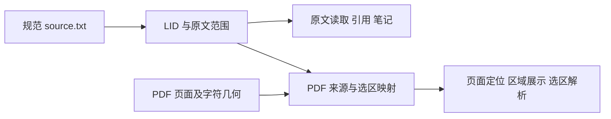

# 第 4 章 原文定位与 LID

设 Agent 在回答中引用了一段定义。读者点击来源，阅读器跳到那一段；随后选中其中一句话，保存为高亮。几天后重新打开，高亮仍然应该落在同一份材料的同一段文字上。

构建、引用、导航和批注发生在不同阶段，却需要对“这里”形成共同理解。上一章解释了材料身份和文本范围的单位，本章继续追问：这些位置最初怎样产生，为什么能够被其他组件重复使用？

Understand Book 先确定规范原文，再将它映射成带层级的源块和 LID。模型随后使用这些位置描述语义。沿着这个顺序，可以把原文对应关系与模型理解分别检查，也能在语义成果变化时保留明确的材料基础。

## 在切分之前，先确定切的是哪份文字

对 Markdown，最直接的路径是读取文本，用解析器识别标题、段落、列表项、代码、表格和公式。[md-adapter.ts](../../../packages/core/src/md-adapter.ts) 使用 Markdown 语法树上的位置，构造 `SourceBlock`。块中的 `text` 可以是用于展示的文字，`span` 则保留回到源串的范围。

标题能够说明这两者的区别。对于 `# 缓存`，展示文字可以是“缓存”，范围切片仍然包含 `#`。后续读取原文时，系统通过范围取得实际源串，因此保留标记的含义和只展示标题文字的含义可以并存。

EPUB 需要先把容器中的内容组织成规范文字。[epubToSource](../../../packages/core/src/epub-adapter.ts) 读取压缩包中的 `container.xml` 和 OPF，按 spine 顺序访问 XHTML，将标题、正文和资源块提取出来，再拼成 `source`。范围在拼接时记录，指向这份规范源串。它们描述的是项目保存的正文位置，不能直接拿去索引 EPUB 压缩包或原始 XHTML 字节。

已有 EPUB 工作区还有一个容易忽略的细节：规范正文可能已经不含 Markdown 标题标记。当前 [loadBookSource](../../../packages/core/src/book-source.ts) 识别到这种 `source.txt` 快照时，会从同目录 `base.json` 读取原有 LID 结构，并核对书籍身份。否则，把标题标记已经消失的纯文字重新当 Markdown 解析，就无法恢复原先的层级。

PDF-first 论文路径又多了一步。项目的 [ADR-0063](../../adr/0063-paper-pdf-first-reconciled-source-build-workbench.md)规定，Markdown 转换稿和 PDF 先经过来源对齐，接纳后的 `source.txt` 才成为共同的正文基础。原版 PDF 提供页面呈现和对照，LID、引文及笔记仍指向规范原文。当前[混合来源构建](../../../packages/core/src/hybrid-foundation-v2.ts)也从传入的规范正文产生块、位置树和 PDF 映射。

这些路径可以归纳为同一个接缝：先得到明确的 `source` 和与它对应的 `SourceBlock[]`，再进入确定性位置构建。不同格式如何形成规范正文，决定了后面的“原文”究竟指什么。

## 用一份短材料跟踪位置的产生

下面是一份为本书编写的教学材料。它将同时用于下一章的语义归并示例。每一行使用 LF 换行，末行之后保留一个换行；源串长度为 61 个 UTF-16 code unit。

```markdown
# 缓存

缓存复用已有结果。

## 失效

数据变化后应使缓存失效。

# 批处理

批处理合并请求，也可复用缓存。
```

将它交给 `markdownToBlocks`，再调用 `segment`，当前实现得到下面的位置树。范围采用上一章介绍的半开区间 `[start, end)`。

| LID | 类型 | 范围 | 对应内容或子节点 |
| --- | --- | --- | --- |
| 1 | chapter | [0, 36) | 1.1、1.2、1.3 |
| 1.1 | paragraph | [0, 4) | `# 缓存` |
| 1.2 | paragraph | [6, 15) | 缓存复用已有结果。 |
| 1.3 | section | [17, 36) | 1.3.1、1.3.2 |
| 1.3.1 | paragraph | [17, 22) | `## 失效` |
| 1.3.2 | paragraph | [24, 36) | 数据变化后应使缓存失效。 |
| 2 | chapter | [38, 60) | 2.1、2.2 |
| 2.1 | paragraph | [38, 43) | `# 批处理` |
| 2.2 | paragraph | [45, 60) | 批处理合并请求，也可复用缓存。 |

整棵树有 9 个节点，其中 3 个是容器，6 个是叶子。这个结果已用当前函数重放。注意“失效”节的 LID 是 `1.3`：同级编号计入了标题叶子和前面的正文叶子，它表达树中的位置，不负责复写书面标题中的章节编号。

当读取 `1.3.2` 时，系统根据 `[24, 36)` 返回那一段文字；读取容器 `1.3` 时，则可以取得标题到该节末尾的范围。导航、搜索结果和批注都能使用这套位置，再按用途选择容器、叶子或叶子中的更细范围。

## 标题为什么既有容器，又有叶子

一份标题承担两项工作：它建立下级内容的归属，本身又是需要展示和引用的文字。如果只把标题存成容器属性，正文覆盖统计就还需要另一条规则解释标题文字去了哪里；如果让容器和子节点都独占内容，又会重复计算。

[segment.ts](../../../packages/core/src/segment.ts) 采用的结构很明确：章与节是容器，标题文字成为容器的第一个叶子。遇到新标题时，栈根据标题级别退出已经结束的层级，再创建新容器。普通块成为当前容器的子叶子；没有标题时，也可以产生根级叶子。

节点创建过程中的三行代码决定了物化路径：

```typescript
    const path = [...parentPath, idx];
    const lid = path.join(".");
    const node: LidNode = { lid, path, kind, span: { ...span }, children: [] };
```

`idx` 是当前父节点下新分配的序号。`path` 保留数值分段，`lid` 是它的字符串表达。比较书序时，需要逐段比较数字，才能让 `1.3.9` 排在 `1.3.10` 前面。

全部块处理完后，程序从较深节点向上计算容器范围，使其包含子节点。这里的范围是一个连续的包含区间，所以容器切片也可能包含子块之间的空白。内容覆盖则只统计叶子，避免把容器和后代重复相加。

这种组织让层级读取和精确位置共用一棵树。它的稳定性依赖同一份规范正文和确定的解析规则；材料发生修订时，新增块可能改变后续路径。上一章的材料版本身份因此仍然必不可少。

## 怎样检查文字有没有在切分中丢失

切分完成后，可以直接核对每个位置是否回到源串。[checkPartitionInvariant](../../../packages/core/src/partition.ts) 检查 LID 唯一、子节点存在、同级数值顺序、父范围包含子范围，以及叶子之间的重叠和遗漏。

检查叶子覆盖时，程序按原文起点排序，让一个游标从头向后移动。两个叶子之间的空白可以作为间隔；如果间隔里还有非空白文字，就产生 `UNCLASSIFIED_CONTENT`。新的叶子起点落在已经覆盖的范围内，则产生 `LEAF_OVERLAP`。

教学材料中，`1.1` 在 4 结束，`1.2` 从 6 开始，中间两个换行构成合法间隔。若人为删掉 `1.2`，游标就会跨过“缓存复用已有结果。”，检查会发现未分类内容。

当前 `coverage` 的计算口径是：各叶子切片去掉空白后的长度之和，除以整份源串去掉空白后的长度。长度仍按 JavaScript 字符串单位计算。教学材料得到 `ok=true`、`coverage=1`、无违例。

覆盖率需要与违例一起看。两个错误可能同时造成遗漏与重复，使数量看起来接近完整；父范围或子引用也可能在覆盖之外出错。`ok` 来自实际违例集合，单独一个百分比不能替代这些关系判断。

这一层检查提供了一个具体保证：在所检查的规范文字和树结构之间，能够发现相应的分区错误。它还没有评价文字本身是否经过正确转换，也没有评价未来抽取出的概念是否准确。

## 位置树和模型输入窗口分别改变什么

接下来要让模型读取材料。若把每个叶子都单独发送，调用次数可能很多，段落之间的关系也会被拆散；若将整本书一次发送，又可能超出输入容量。于是需要第二种划分：把已有叶子组成处理窗口。

[splitWindows](../../../packages/core/src/window.ts) 消费已有 `LidNode[]`，用正文的近似 Token 数和叶子数量控制窗口大小。能够装下的子树作为一个单元加入；较大的子树继续下探；相邻小单元通过累加组成窗口。顶层节点之间会封口，因此本章例子即使使用宽松预算，仍形成两个窗口。

| 窗口 ID | 包含的叶子 LID | 对应内容 |
| --- | --- | --- |
| 0 | 1.1、1.2、1.3.1、1.3.2 | 缓存章及失效小节 |
| 1 | 2.1、2.2 | 批处理章 |

窗口对象保存 `leafLids`、估算 Token、源范围和 `overBudget` 标记。调小预算可以改变哪些叶子一起处理，却不需要重编位置树。构建侧产出的概念和关系，仍然锚定原有 LID。

单个叶子本身过长时，已有容器内部的分支会让它独立成窗并标记超预算。后续模型工作路由还可以按源片段处理一个 LID，并在结果中保留父 LID；相应机制位于 [pass1-reduction.ts](../../../packages/core/src/pass1-reduction.ts)，第 7 章再深入解释它的输入和归并合同。

因此，段落身份、传统窗口和实际模型工作单元是三个相关层次。位置回答“内容在哪里”，窗口组织相邻材料，工作单元再考虑本次模型执行的容量与成果衔接。模型更换或预算调整，主要影响后两者。

## 公式、图片和 PDF 怎样接回相同位置

技术材料中的资源也需要能够被定位。当前 `SourceBlock.assetKind` 可以表示 `code`、`table`、`image` 和 `formula`，`segment` 将它传递为相应的叶子类型。

Markdown 适配器根据解析结果识别这些块。它还会在可接受的行内公式边界上拆出公式叶子，让周围正文与公式分别保留源范围。格式异常时会形成来源复核建议，而非直接将每个疑似公式都当成可靠公式对象。EPUB 适配器也为代码、表格、图片和 MathML 保留不同的块类型。

这样，公式仍属于同一套原文位置体系。后续 `FormulaSemantics` 可以描述参数、组合含义与上下文联系；公式的数学解释不会改变其原文范围。图片的引用元数据及其他资源信息，也可以沿相应叶子连接到附件。

PDF 上的位置则需要额外的几何投影。[PdfSourceMapEntryV2](../../../packages/core/src/pdf-source-map.ts) 将 `lid`、`source_span` 与页面区域连接起来，并记录 `char_exact`、`region_exact`、`partial` 或 `unmapped` 等精度。页面坐标采用 PDF user space：左下角为原点、单位为 pt，坐标本身未应用页面旋转。



从引用跳到 PDF 时，系统沿 LID 找到页面区域；从 PDF 选区回到正文时，则需要将所选字符或区域解析为规范范围。页面号和矩形提供视觉位置，规范范围提供可读回的文字。这种分工让原版排版能够保留，也使引用和私人记录继续共享正文坐标。第 14 章会追踪界面中的完整交互。

## 当前边界与已知问题

[ADR-0008](../../adr/0008-LID切分-纯确定性-句级独立层-忠实块映射-分区不变式.md) 包含后续句级独立层的设计。本章对照的 `segment` 实现按源块、标题和资源形成节点，并没有在每个块下自动执行中文断句。早期文档里的“字节覆盖”也需要结合当前 UTF-16 范围和非空白长度口径理解。

本次重放确认了 `splitWindows` 的一个现存问题：没有标题的根级长段超过预算时，会被遗漏。输入为 `缓存` 重复 7,000 次，使用当前默认输入预算 12,000；分区检查通过，位置树包含一个叶子，但窗口结果为空。给相同长段加上标题后，则得到两个窗口，其中长段窗口标记为超预算。

原因在 `emitSubtree` 的超限分支：它只遍历子节点，根级叶子没有子节点，因而没有进入后续的单叶输出。这说明位置树覆盖与窗口覆盖必须分别判断。此问题已记录，本批书稿工作未修产品实现。

PDF 映射精度也需要按实际结果读取。存在页面区域并不自动意味着每个字符都能精确对应；来源转换的正确性、位置覆盖和语义解释分别由相关流程承担。本章的教学重放使用短 Markdown，未重新进行 EPUB 或 PDF 导入的端到端验证。

## 源码选读与面试追问

| 入口 | 重点阅读 | 可以解释的机制 |
| --- | --- | --- |
| [Markdown 适配](../../../packages/core/src/md-adapter.ts)、[EPUB 适配](../../../packages/core/src/epub-adapter.ts) | parseMarkdownSourceBlocks、epubToSource | 格式怎样变成规范源串与源块 |
| [切分](../../../packages/core/src/segment.ts) | segment、make、标题栈与范围回填 | 层级位置和标题叶子怎样产生 |
| [分区检查](../../../packages/core/src/partition.ts) | checkPartitionInvariant | 漏字、重叠和层级错误怎样被发现 |
| [窗口](../../../packages/core/src/window.ts) | splitWindows、emitSubtree | 既有位置怎样组成模型输入 |
| [混合来源](../../../packages/core/src/hybrid-foundation-v2.ts)、[PDF 类型](../../../packages/core/src/pdf-source-map.ts) | buildHybridFoundationV2Candidate、PdfSourceMapEntryV2 | 正文位置怎样连接页面几何 |

[segment.test.ts](../../../packages/core/test/segment.test.ts) 使用仓库中的 sample.md 检查标题首叶、原文回切和分区关系；本章另行重放了上面的缓存教学材料和根级长段边界。

**为什么不直接把模型的分块编号当引用位置？**

模型分块服务于本次处理，可能随预算和策略变化。引用、笔记和导航需要在同一份材料内共同使用的位置。项目先确定源块与 LID，再让模型回填这些位置，因此可以分别调整处理粒度和检查原文对应关系。

**修改模型上下文大小，是否需要重建所有 LID？**

通常先调整窗口和模型工作单元。LID 来自规范正文与解析结构，只要这两项没有变化，改变执行容量本身没有要求重新编号。需要重算哪些构建成果，则继续看它们对输入窗口和策略的依赖。

**分区检查通过，能否说明整本书都被模型读过？**

它证明的是所检查的位置分区关系。后面还要看窗口是否覆盖叶子、工作单元是否完成、成果是否接纳。根级长段的实际问题就是反例：位置层可以完整，后续窗口仍可能漏掉内容。

**PDF 高亮为什么还需要 LID 和范围？**

页面矩形负责显示区域，LID 和范围负责连接规范文字、引文和私人记录。将两者通过来源映射连接起来，系统才既能保留 PDF 页面体验，又能按同一份正文校验来源。

现在，模型输入中的每段文字已经有了可读回的位置。[第 5 章](05-语义抽取与来源锚定.md)将沿同一份教学材料，解释模型读出的概念、断言和关系怎样回到这些位置，并成为后续可使用的成果。
