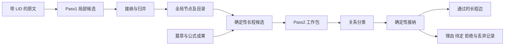

# 第 5 章 语义抽取与来源锚定

上一章的短材料已经有了位置树。读取 `1.2` 可以得到“缓存复用已有结果。”，读取 `1.3.2` 可以得到缓存失效的条件。但当读者问“缓存在哪里出现，后面的批处理怎样与它联系”时，只知道段落编号还不够。

系统需要进一步表达概念、主张和它们之间的关系。这里开始需要模型参与：它读到一段文字，判断正在讨论什么，提出语义对象，再将对象连接回已有位置。

这项工作有两个不同的难点。一个窗口只能看见局部材料，需要把多个窗口的结果组织到一起；模型提出的对象又可能有重复、错误位置或不足以成立的关系，需要知道哪些条件能由程序检查。本章沿“输入—抽取—归并—长程候选—接纳”的顺序展开。

## 先把位置带进模型实际看到的正文

如果只给模型一段没有位置标注的文本，事后要求它填写 LID，就缺少可供回填的依据。项目因此在构造输入时，将真实位置直接放在每个叶子前面。

[buildPass1Input](../../../packages/core/src/pass1-input.ts) 的实现很短：

```typescript
export function buildPass1Input(w: Window, byLid: Map<string, LidNode>, source: string): Pass1Input {
  const blocks = w.leafLids.map((lid) => {
    const n = byLid.get(lid)!;
    return `[${lid}] ${source.slice(n.span.start, n.span.end)}`;
  });
  return { windowId: w.id, lids: [...w.leafLids], text: blocks.join("\n\n") };
}
```

函数从窗口的 `leafLids` 取得节点，按范围切出原文，再添加位置标注。它没有请模型重新描述正文，也没有根据摘要生成一套新位置。

对上一章材料的窗口 0，实际组装结果是：

```text
[1.1] # 缓存

[1.2] 缓存复用已有结果。

[1.3.1] ## 失效

[1.3.2] 数据变化后应使缓存失效。
```

窗口 1 则包含 `2.1` 的标题和 `2.2` 的批处理段落。这样，模型提出“缓存在 `1.2` 出现”时，这个位置有明确的输入来源。

[Pass1 抽取器定义](../../../agents/pass1-local-extractor.md)要求只抽取当前输入中的节点和局部边，位置从标注中回填。当前自动构建还会根据实际模型容量把工作分成 whole、group、fragment 等形式；本章先讲这些形式共同产出的语义对象，工作单元的路由留到第 7 章。

## 概念的多次出现，与断言的具体出处

一个概念可以在多处出现。教学材料在定义、失效条件和批处理三个地方提到了缓存，将它们分别存成毫无关系的对象，会让“缓存出现在哪里”难以直接回答。

项目的 `GraphNode` 为实体和概念使用 `occurrences`，为断言使用单个 `source_lid`。实体或概念可以保留多处锚点；一个具体主张则指向表达它的那一处原文。

例如，下面是为演示归并而设定的两份抽取结果。它们是教学输入，未调用模型生成；归并结果则由当前程序实际计算。

| 输入窗口 | 节点 ID | 类型 | 教学输入中的锚点 |
| --- | --- | --- | --- |
| 0 | concept:cache | concept | occurrences = 1.2、1.3.2 |
| 0 | claim:1.3.2:invalidate | claim | source_lid = 1.3.2 |
| 1 | concept:cache | concept | occurrences = 2.2 |
| 1 | concept:batch | concept | occurrences = 2.2 |

这里的断言是“数据变化后应使缓存失效”。它与抽象概念“缓存”拥有不同的身份：前者表达一个带条件的主张，后者把多处讨论聚到同一个对象上。

节点 ID 也与 LID 分别承担工作。边的 `source` 和 `target` 使用节点 ID，表达对象之间的关系；节点的锚点使用 LID，说明这些对象在哪里有原文依据。关系图和位置树由此连接起来。

## 归并怎样保留有用结果

[mergeAndGate](../../../packages/core/src/merge.ts) 接收多份节点和边，以及位置树。它先按节点 ID 收集对象，再校验锚点，最后处理边。

实体或概念遇到相同 ID 时，程序取出现位置的并集。决定这个行为的是下面的分支片段：

```typescript
        ex.occurrences = [...new Set([...ex.occurrences, ...n.occurrences])]; // 并集
        ex.name = n.name; // keep-last
```

教学输入中的 4 个节点因此变成 3 个。`concept:cache` 保留 `1.2`、`1.3.2`、`2.2` 三处出现；失效断言仍然指向 `1.3.2`；批处理概念保留 `2.2`。节点数量减少，来源位置则被保留下来。

这个函数按 ID 归并。规范化名称的约定来自抽取器，函数本身没有进行语义实体消歧。同义对象用了不同 ID 时，程序不会自动知道它们相同；同一个 ID 被用于不同含义时，程序也不会凭名称理解差异。这类问题需要回到上游抽取与质量观察。

锚点校验采用尽量保留有效部分的方式。概念同时带有有效位置和不存在的位置时，只剔除不存在的那一项；没有任何有效出现位置，才丢弃节点。断言的单个来源无效时，整条断言失去依据。边引用了已经不在结果中的节点，则相应边被丢弃，其他有效节点继续保留。

边也有自己的去重口径。键包含端点、关系类型和方向；无向边的两端会在计算键时统一顺序，有向边保持顺序。重复边保留权重更高的一条。权重在这里用于确定保留结果，不能把较高权重理解成经过统计校准的正确概率。

函数同时返回归并和丢弃报告，使调用方知道哪些对象被合并、哪些来源被剔除。更靠前的当前任务接纳还有较严格的范围约束：[pass1-reduction.ts](../../../packages/core/src/pass1-reduction.ts) 的 `assertOutputEvidence` 会检查 whole/group 候选只使用已分配的 LID，边端点也必须存在于候选节点中。范围不符的候选可以在进入归并前被拒绝。

两层机制针对不同接缝：任务接纳约束这次工作允许提交什么，归并函数负责把已经提供的对象收拢成一致结果。讲解某个清理分支时，需要同时知道它前面的调用条件。

## 覆盖率、锚定率和语义正确性

上一章的切分覆盖率为 100%。本章教学抽取结果的 `anchorRate` 却只有 0.5。这个差异来自两个指标回答的问题不同。

位置分区检查原文内容是否被叶子范围覆盖；图谱锚定率则计算有存活语义节点直接锚定的叶子数，占全部叶子的比例。教学例子共 6 个叶子，语义节点覆盖 `1.2`、`1.3.2` 和 `2.2` 三个，因而结果是 `3 / 6 = 0.5`。三个标题叶子没有被这组教学对象单独锚定。

这个数值不能证明模型漏读了一半文字，也不能证明另一半文字被正确理解。一个节点可以使用真实 LID，却把段落含义解释错；一条边的两端都存在，也可能没有文本支持它所声称的关系。

因此，本章的验证关系可以按三层理解：位置层回答内容在哪里；结构接纳回答对象和引用是否满足合同；语义评估回答这些概念、主张和关系是否符合材料。它们各自提供信息，不能互相替代。

## 从局部节点形成全局入口

窗口 0 单独执行时，看不到批处理段落；窗口 1 单独执行时，也不一定知道前面完整的失效条件。跨窗口联系需要在局部成果汇集之后建立。

早期 [ADR-0010](../../adr/0010-语义边两遍抽取-双agent-硬屏障-全量目录优先-确定性投影-锚定基数分裂.md) 因此选择先完成 Pass1、归并节点，再形成全局目录供下一阶段使用。书籍不像代码那样天然有可解析的 import 图，这是当时采用全局目录的理由之一。

当前 [projectCatalog](../../../packages/core/src/catalog.ts) 仍然从已有节点直接投影出 `id`、`lid`、`type` 和 `name`。实体和概念的目录项取第一个 occurrence，断言取 `source_lid`；完整出现集合保留在节点中。[pass1-batch.ts](../../../skills/build/pass1-batch.ts) 在收口时使用这一投影。

教学例子得到三条目录项，其中缓存项的位置是 `1.2`。它提供进入概念的一个位置，不应被解释成缓存只在 `1.2` 出现。目录由节点投影，避免再让模型独立生成一份可能与节点不一致的名单。

全局材料已经存在，并不意味着要将所有节点都送入每一次长程判断。当前 Pass2 进一步将寻找候选和判断关系拆开：程序从已知信号生成候选，模型按关系合同分类，再由程序接纳结果。下面讨论的是这一现行路径。

## 当前 Pass2 怎样找到值得判断的候选

[buildLongRangeCandidates](../../../packages/core/src/pass2-build.ts) 首先建立几个索引：一个节点在哪些窗口出现，一个窗口中有哪些节点，以及某个 LID 对应哪些节点。

其中一条主要路径使用重复出现的节点连接窗口。若“缓存”在较早窗口和较晚窗口中都出现，程序以较早出现为源侧，再查看较晚窗口中的其他节点，形成候选。篇章功能可以提供定义到应用、前提到展开等提示；公式语义中的跨窗口上下文联系也能提供候选。

对本章的教学对象，当前函数实际产生一个候选：

| 字段 | 结果 |
| --- | --- |
| candidate_id | cand:concept:cache->concept:batch |
| source_node_id | concept:cache |
| target_node_id | concept:batch |
| source_lids | 1.2、1.3.2 |
| target_lids | 2.2 |
| seed_reasons | shared_node_bridge:concept:cache |
| relation_hints | 空集合 |

这个结果表达“这两个对象有理由被放在一起考察”。它尚未证明缓存与批处理之间应当建立哪一种关系。这里没有给出篇章或公式补充信息，所以也没有相应的关系提示。

当前实现的长程定义落在证据跨窗口上：至少一处源侧证据和一处目标侧证据属于不同窗口。同一章里的两个窗口也可以形成长程关系；章节距离或 LID 字符串看起来不同，都不能单独替代这个判断。

这一点还意味着，窗口配置会影响当前长程候选的分类边界。LID 可以保持不变，但哪些关系属于跨窗口，要结合当次构建的窗口划分理解。

## 工作包、关系判断与接纳

[buildPass2WorkPacket](../../../packages/core/src/pass2-orchestrate.ts) 以源窗口为单位组织工作包，其中包含源窗口正文、节点、篇章信息、公式信息、候选和关系类型合同。合同使用 `when`、`when_not`、`evidence`、`roles` 等字段说明某种关系在什么条件下成立。

例如，`builds_on` 将扩展或依赖某种机制的一方放在 source，将所依赖的基础放在 target；`prerequisite` 则把先修概念放在 source，把需要它的内容放在 target。关系名称相近，端点角色仍然需要分别判断。

候选中较早出现的一方，不会因此自动满足所有关系的 source 角色。教学候选“缓存 → 批处理”不能仅凭共现就标成 `applies`；该合同要求 source 是实际应用者，target 是被应用的概念。分类时要检查材料与端点角色是否共同成立。

[Pass2 分类器定义](../../../agents/pass2-longrange-linker.md) 要求只分类给定候选，输出 accepted、pending 和 rejected 三类结果。accepted 表达模型主张关系成立；pending 保留尚不足以进入基座的判断；rejected 则给出不成立或不值得保留的原因。

随后，[gatePass2BuildOutput](../../../packages/core/src/pass2-build.ts) 检查被提交为 accepted 的边：节点端点是否存在，两侧证据是否非空、是否被总证据集合覆盖，位置是否存在，以及是否满足作用域、类型、跨窗口和接纳阈值等条件。其中一段决定了弱推断与非长程结果不能直接进入基座：

```typescript
  if (edge.support_level === "weak_inference") return "weak_inference";
  if (!(edge.weight >= minWeight)) return "below_weight_threshold";
  if (!isCrossWindow(edge.source_evidence_lids, edge.target_evidence_lids, lidToWindowIndex)) return "not_cross_window";
```

通过的结果转成通用 `GraphEdge`。两侧证据、理由和支持级别保存在审计成果中；pending、rejected，以及未通过程序检查的 accepted 结果也分别进入审计记录。这样，读时使用的关系与构建时的判断记录各有适合的表达。



程序检查约束了结构和显式条件，关系理由的内容判断仍然需要原文。仅看字段齐全，无法确认模型已经充分读过两侧材料。当前工作包的具体证据交付边界见本章末尾。

## 篇章、公式与内容规则包怎样加入

一本技术书里的“定义”“例子”“警告”承担不同作用。论文中的“研究问题”“方法”“实验结果”也不应只当成普通主题词。项目通过内容规则与旁路成果表达这些差别。

[TechnicalLearningDiscourseItem](../../../packages/core/src/discourse-index.ts) 将一个 LID 与篇章模式、局部功能、修辞作用和关系连接起来。例如，一段是定义还是应用，会影响长程候选得到什么关系提示。

[FormulaSemantics](../../../packages/core/src/formula-semantics.ts) 则连接公式位置、参数解释、组合含义和上下文联系。对应接纳函数确认公式位置确实是公式节点，再根据允许的上下文检查证据；缺少必要的组合描述时，不产生完整语义对象。这样的结构将“公式在哪里”和“公式表达什么”连接起来，同时保留各自职责。

[buildProfiledPass1Input](../../../packages/core/src/pass1-profile-input.ts) 在通用带位置正文之外，按内容规则加入抽取要求。technical_learning 使用基础输入；paper 会加入论文子类型、关注对象和关系规则。论文对象仍然表达成通用实体、概念、断言及局部边，元数据和术语等成果使用各自的旁路文件。

这使项目能够改变抽取重点，而不必为每种材料重做位置与图谱的基本类型。规则包的质量仍要通过相应材料判断，例如综述中转述其他论文的结论，与当前材料自己验证过的结果，需要保留不同的来源含义。

Pass2 也已经成为构建计划中的可选增强。[ADR-0098](../../adr/0098-optional-pass2-enrichment-for-book-structure.md)修订了固定依赖关系：未启用 Pass2 时，BookStructure 可以使用空长程边输入；启用后再消费相应成果。当前构建路由将这一选择与计划关联。全书结构的形成会在下一章继续展开。

## 当前边界与已知问题

早期 ADR-0010 描述了全量目录优先及固定并发的方案。本章对照的现行 Pass2 使用确定性候选和源窗口工作包，是否执行还由计划选择；当前 Pass1 也有进一步的工作单元拆分与归并。历史数字和旧输入形式不应直接替代今天的调度行为。

当前 Pass2 工作包有一处明确的证据交付缺口：`buildPass2WorkPacket` 只把源窗口的原文放进 `source_window.text`，目标端在候选里主要以 LID 指针表达；`renderPass2ModelInput` 直接序列化该工作包，没有补入目标正文。在本章例子中，包内有窗口 0 的四段文字，却没有目标 `2.2` 的批处理原文。因此，仅凭这个包不足以完成双侧语义判断；具体执行若有额外回读，需要另行确认其输入与结果。本批未运行真实模型来验证补读行为。

Pass2 接纳函数检查了证据位置和结构条件，并不验证关系理由是否被两侧文字充分支持，也不证明候选发现覆盖了全部有价值的关系。候选缺失、端点角色不适配和语义误判，仍应在相关任务上观察。下一次改进应先定位是哪一种缺口，再选择补充输入、调整候选或改变判断方式。

本章的抽取节点是明确设定的教学输入。位置、输入组装、归并、目录和候选结果已经用当前函数重放；这次没有发生模型抽取调用，也没有将示例的锚定率作为项目质量实测。

## 源码选读与面试追问

| 入口 | 重点阅读 | 可以解释的机制 |
| --- | --- | --- |
| [输入组装](../../../packages/core/src/pass1-input.ts)、[抽取器定义](../../../agents/pass1-local-extractor.md) | buildPass1Input、节点与边的输出约定 | 模型看见的位置怎样成为来源锚点 |
| [归并](../../../packages/core/src/merge.ts)、[任务接纳](../../../packages/core/src/pass1-reduction.ts) | mergeAndGate、assertOutputEvidence | 全局收拢与任务范围检查怎样配合 |
| [目录投影](../../../packages/core/src/catalog.ts) | projectCatalog | 为什么目录与已有节点保持同源 |
| [长程候选及接纳](../../../packages/core/src/pass2-build.ts) | buildLongRangeCandidates、isCrossWindow、gatePass2BuildOutput | 候选怎样产生，哪些结果进入基座 |
| [工作包](../../../packages/core/src/pass2-orchestrate.ts)、[输入渲染](../../../packages/core/src/model-input-renderer.ts) | buildPass2WorkPacket、renderPass2ModelInput | 模型实际接收哪些材料 |
| [篇章](../../../packages/core/src/discourse-index.ts)、[公式](../../../packages/core/src/formula-semantics.ts)、[规则输入](../../../packages/core/src/pass1-profile-input.ts) | 篇章项、公式接纳与规则头 | 特定材料的理解要求怎样接入通用结构 |

[merge.test.ts](../../../packages/core/test/merge.test.ts) 覆盖同 ID 归并、悬空位置、边去重与锚定率；[pass2-build.test.ts](../../../packages/core/test/pass2-build.test.ts) 覆盖候选及 accepted/pending/rejected 的接纳分流；[pass2-orchestrate.test.ts](../../../packages/core/test/pass2-orchestrate.test.ts) 说明源窗口工作包的组成。上述测试本批为源码阅读，确定性教学重放另行执行。

**为什么实体或概念使用多锚点，断言使用单锚点？**

前者要把同一对象在不同位置的出现聚在一起，后者要保存一个具体主张的出处。这样既能回答概念出现在哪里，也能让某条断言回到表达它的原文。归并时继续按这两种身份分别处理。

**既然位置都真实存在，为什么还可能产生错误知识？**

存在性只能证明引用位置可解析。模型仍可能误解条件、混淆对象，或在只有主题重合时建立强关系。应将来源存在、输入实际交付、结构接纳与语义支持分别追踪。

**Pass2 为什么放在局部成果之后？**

跨窗口候选需要使用已经形成的节点出现集合，以及相关篇章和公式信息。先汇集这些成果，才能从全书范围寻找联系。是否值得运行 Pass2，则由阅读目标、已有能力和构建计划决定。

**把所有语义对象都放进一个巨大的模型请求，会更简单吗？**

输入组织可能更直接，但仍要处理容量、输出规模和来源绑定。当前分工允许局部任务先产出对象，再用明确候选约束长程判断；它也引入了候选召回和跨侧证据交付的责任。比较方案时，需要同时考虑这些责任与完整任务效果。

**怎样判断下一步应该改提示词还是改程序？**

先看失败发生在哪里。目标正文根本没有交付，应先处理输入；位置不属于任务范围，应处理接纳或上游输出；材料齐全但关系含义判断错误，再检查规则、提示和语义评估。书中的真实输入链比一个总分更能决定下一步行动。

语义节点和关系已经能连接分散的原文，但读者还需要知道一本书的重点、章节路线和跨章主题。[第 6 章](06-全书结构与语义候选召回.md)继续解释这些局部成果怎样被组织成全书结构，以及需要哪些候选召回能力。
