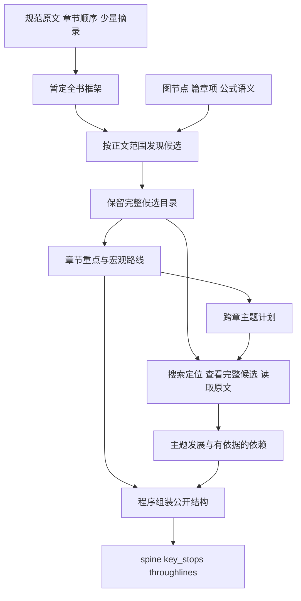

# 第 6 章 全书结构与语义候选召回

上一章已经把“缓存”在几处原文中的出现连接起来。现在，读者提出一个更大的问题：“我应该怎样学这本书？缓存这一概念在前后章节里分别解决什么问题？”

要回答这个问题，系统需要知道章节各自承担的任务，哪些内容值得停下来理解，以及同一个问题怎样跨章发展。一个概念有三处锚点，并没有直接给出学习顺序；两段文字都谈“复用”，也没有直接证明其中一段是另一段的前置知识。

BookStructure 在原文位置和语义成果之上组织这些信息。本章沿一个实际设计变化展开：当局部成果已经抽取出来，继续压缩摘要会丢掉什么？怎样保留细节，又让全书路线足够清楚？检索在其中承担哪一部分工作？

## 从概念分布走向阅读路线

目录提供材料的顺序和层级，语义图表达对象及其关系，全书结构则组织“怎样读”。三者共享来源位置，各有自己的输出。

当前 [BookStructureSidecar](../../../packages/core/src/book-structure.ts) 包含三个主要集合：

| 集合 | 保存的内容 | 支持的阅读问题 |
| --- | --- | --- |
| spine | 各单元的角色、摘要、宏观重点引用和 depends_on | 这一章解决什么问题，阅读前需要哪些章节？ |
| key_stops | 重点的身份、类型、位置，以及带来源的学习理由 | 哪些定义、公式、条件或例子值得仔细理解？ |
| throughlines | 跨章主题的名称、摘要、涉及单元和重点引用 | 一个问题在不同章节里怎样展开？ |

`depends_on` 位于 spine 的单元内。它表达阅读依赖；两个单元出现在同一条 throughline 中，只能说明它们共同参与这个主题。

沿用缓存材料，可以先保留“缓存复用已有结果”，再保留“数据变化后应使缓存失效”，随后在批处理一章连接到“也可复用缓存”。概念图帮助读者聚合这些位置；章节重点进一步说明每一处值得学什么；宏观路线可以只突出定义与应用，把失效条件留在完整章节重点中。

构建入口 [buildBookStructureUnitSources](../../../packages/core/src/book-structure.ts) 为各单元组装原文位置、相关图节点和边、篇章项、公式语义以及可用的 Pass2 成果。BookStructure 的候选学习点有自己的生成与接纳过程，不能直接把每个图节点都当作一个教学重点。

## 为什么不断总结会丢掉值得学的内容

一种自然做法是逐段总结，再把段落摘要合成章节摘要，最后合成全书摘要。随着输入变长，每一层都要决定哪些内容值得带入下一层。被前一层省略的条件，后一层通常已经看不到。

项目的 [BSR0 基线记录](../../performance/book-structure-bsr0.md)给出了具体案例。AI Infra 材料的“第 8 章 推理优化”原本包含连续批处理、KV 分页、前缀缓存等机制；旧章节卡已经压缩为 9 个候选，最终公开结构只留下 2 个重点：一处显存容量公式和一处有效吞吐公式。完整片段中仍有相关机制的说明，但它们没有保留到最终重点里。

最终结果取决于整个传递过程。信息经过了哪些中间产物、在哪一层被删除，决定了后续模型是否还有机会作出完整选择。

[BSR2 的局部实验](../../performance/book-structure-bsr2-codex.md)改用候选保留与引用选择。实验复用该章的章节卡、5 个完整片段、31 个候选和 12 段原文摘录，得到如下结果：

| 层次 | 数量 | 含义 |
| --- | ---:| --- |
| 可供组织的候选 | 31 | 原始候选继续保留，可供查看和后续使用 |
| 选入章节的重点 | 27 | 保留机制、成立条件和学习理由 |
| 进入宏观路线的重点 | 15 | 从章节重点中选择较短的阅读路线 |

其余 12 个已选重点没有因为宏观路线缩短而消失，4 个未选候选也仍在候选目录里。来源核对覆盖了 9 类预先列出的机制，包括连续批处理、分页与共享、前缀复用及投机解码等。实验范围与成本口径在本章末尾集中说明。

这次变化把两种工作分开了：模型判断应当选什么、怎样解释它；程序按引用携带已经存在的内容。[ADR-0151](../../adr/0151-book-structure-global-outline-and-semantic-retrieval.md)据此将技术学习材料的主线调整为全书框架、正文发现、章节选择和主题整理。

## 先建立方向，再完整发现正文候选

阅读一本长书时，全局方向有助于理解局部。只看一节关于“状态传输”的文字，很难判断它是在解释缓存命中、分布式推理还是故障恢复。先知道各章提出什么问题，能够给后续发现提供上下文。

当前技术学习路径先从规范章节和少量正文摘录生成暂定框架。[structureSourceOutline](../../../packages/core/src/book-structure-discovery.ts) 选取章节开头，以及可用的小结或另一段正文，形成短概览；[acceptStructureOutline](../../../packages/core/src/book-structure-planning.ts) 要求输出保持章节身份和原始顺序，并校验问题与发展说明引用了已交付的位置。章节标题由 Core 提供。例如，实验中“第 8 章”的单元 LID 是 `10`，展示章号和源身份各自保留。

这个框架为正文阅读提出暂定问题。接下来的发现仍需要覆盖正文，章节摘要和主题判断也应服从实际材料。



在 [build-orchestrator.ts](../../../packages/core/src/build-orchestrator.ts) 中，这条发现与组织路径由 `technical_learning` 内容类型启用。[structureDiscoverySources](../../../packages/core/src/book-structure-discovery.ts) 从每个叶子的规范范围取得完整文字，替换旧来源视图中的短预览；具体请求再按工作单元容量分配。完整覆盖记录的是各任务负责的正文范围，后面的检索 Top-K 不承担这个责任。

发现结果为每个候选分别保留含义 `meaning`、条件 `conditions`、学习理由 `reason` 和来源 `evidence_lids`。同一个 LID 中可以包含多个值得学习的意思，它们使用不同的局部身份。目录中的引用由贡献身份和局部身份组成，[structureCandidateRef](../../../packages/core/src/book-structure-candidates.ts) 的定义是：

```typescript
export const structureCandidateRef = (contribution: string, localId: string) => `${contribution}#${encodeURIComponent(localId)}`;
```

因此，“来自同一段”与“是同一个候选”有明确区别。后续选择能够准确指向某条含义，程序也能够发现同一个引用被赋予了相冲突的内容。

[readStructureCandidateCatalog](../../../packages/core/src/book-structure-generation.ts) 从当前任务对应的已接受成果收集候选；`collectStructureCandidates` 检查候选引用的位置是否属于该贡献的证据范围。原观察成果继续独立保留，章节概览的组装不会代替这份目录。

## 用引用选择，把重点与路线分开

有了候选目录之后，章节组织需要回答两个问题：本章应保留哪些学习点，全书路线应突出其中哪些点？当前选择结构直接表达这两个集合：

```typescript
export interface StructureChapterSelection {
  unit_lid: string;
  role: BookStructureSpineRole;
  summary: AnchoredText;
  accepted_stop_refs: string[];
  macro_stop_refs: string[];
}
```

这段定义来自 [book-structure-candidates.ts](../../../packages/core/src/book-structure-candidates.ts)。接纳函数要求宏观引用属于章节已选引用，引用不得重复，候选也必须属于当前单元。章节摘要另外接受证据范围检查。

章节组织采用有状态的浏览过程。[structureChapterInput](../../../packages/core/src/book-structure-planning.ts) 交付候选索引、需要展开的完整候选和请求读取的原文；`applyStructureChapterAction` 记录已交付的候选引用与证据。选择前必须浏览完整章节候选索引，避免只看第一页就宣布完成。

这里有一个细致的分工：完整浏览证明索引已经交付；章节重点引用从已有的已接受候选中选择；新写的章节摘要必须有本次组织过程交付的证据。程序没有要求每一个被选候选都重新读取原文。已有候选的来源与条件随引用继续保留，新的概括则需要自己的依据。

本书使用前两章的缓存材料做了一个确定性重放。候选及其学习理由是手工设定的教学输入，程序执行真实的收集、选择和组装函数：

| 教学候选 | 所属单元与来源 | 选入章节 | 进入宏观路线 |
| --- | --- | --- | --- |
| 缓存复用已有结果 | 缓存，1.2 | 是 | 是 |
| 数据变化后使缓存失效 | 缓存，1.3.2 | 是 | 否 |
| 批处理合并请求，也可复用缓存 | 批处理，2.2 | 是 | 是 |

实际结果为 3 个候选、3 个公开重点、2 个宏观引用。失效条件仍在公开重点的 `reason.text` 中。负责这一步的 [materializeStructureChapterSelections](../../../packages/core/src/book-structure-materialization.ts) 把候选的含义、条件与学习理由组合为重点说明，将 `macro_stop_refs` 写入对应 spine 单元的 `key_stop_ids`。

这个过程不需要模型把所有重点再抄写一遍。选择发生变化时，程序继续按候选身份取得原有内容；完成顺序与任务批次不参与候选身份。

## 检索怎样帮助发现，又怎样成为判断依据

全书候选可能很多。跨章主题如果每次都接收全部候选正文，会很快消耗模型输入容量。当前主题计划先使用章节摘要、问题和宏观路线种子，后续通过搜索、完整查看与原文读取补充材料。未进入宏观路线的候选仍留在检索目录中。

搜索首先返回位置和预览。模型可以据此决定下一步查看哪里；当它要把某个候选纳入主题，或为一个新解释引用材料时，再取得相应内容。

| 输入或动作 | 模型取得什么 | 证据记录的变化 |
| --- | --- | --- |
| 候选索引、搜索预览、原文位置目录 | 引用、简短含义和位置 | 不增加可用于新判断的证据范围 |
| inspect 的后续输入 | 完整已接受候选，或带来源的章节材料 | 将该材料携带的位置加入交付记录 |
| read 的后续输入 | 指定位置的原文摘录 | 将实际交付的原文位置加入记录 |
| select 或 resolve | 模型提交新的选择与解释 | 程序按当前记录检查引用范围 |

“后续输入”很关键。提出 inspect 请求只是在状态中登记接下来应展开什么；相应材料随后进入模型输入，下一次动作应用时才计入交付记录。[applyStructureThemeAction](../../../packages/core/src/book-structure-themes.ts) 从 `input.inspected` 和 `input.excerpts` 增加证据，没有从搜索预览增加证据。

缓存教学重放中，直接用索引预览为章节提交摘要，会得到 `chapter explanation cites undelivered evidence`。请求查看定义候选后，完整候选进入下一次输入，随后同一摘要被接受。这里交付的是已经接受、带有来源的子成果；它与再次交付原文字面内容有不同含义。

### 词法与语义候选怎样合并

[book-structure-retrieval.ts](../../../packages/core/src/book-structure-retrieval.ts) 为 BookStructure 构造独立检索视图。章节视图使用问题与概览；候选视图使用含义、条件和别名。用于向量计算的是短文本，完整词法字段和原材料位置另外保留。

例如，当前候选的向量投影分别取含义的前 48 个 Unicode 码点、条件串的前 24 个码点和别名串的前 12 个码点。完整 `meaning`、全部条件、别名与学习理由仍参与词法检索，完整候选仍可 inspect。短向量输入控制计算量，也可能漏掉后半段的重要条件，因此后面的语义判断仍要查看完整材料。

[retrieveHybrid](../../../packages/core/src/semantic-retrieval.ts) 先放入含义精确匹配和别名匹配，再交替补入词法命中与按相似度排列的语义候选，并按身份去重。BookStructure 当前每页交付 6 条，语义通道至多补入 12 条新的候选；词法条目不受这 12 条额度截断。空查询则浏览完整目录，不进行向量计算。

这种合并保留了直接名称查询的能力，也为措辞不同但可能相关的材料提供入口。返回的匹配原因用于解释候选为何出现，相似度留在诊断信息中。原文是否支持主题关系，需要后续判断。

### 为什么 Provider 由 Core 管理

Embedding 会产生计算、等待与可能的外部费用。[EmbeddingProvider](../../../packages/core/src/embedding-provider.ts) 因此显式提供文档和查询两个异步接口，并声明模型身份、维度、输入与批量上限、取消信号和可用的用量信息。[ADR-0149](../../adr/0149-构建期语义候选召回与Core-owned-Embedding-Provider.md)将这些调用放在 Core 的准备阶段，便于按当前计划约束实际执行。

[prepareStructureRetrieval](../../../packages/core/src/book-structure-retrieval.ts) 使用公共的准备与缓存能力，但采用自己的投影版本和缓存目录。保存的内容摘要用于判断哪些向量需要重算；相同查询与相同目录可以复用准备结果，翻页只读取已经排好的序列。

[prepareSemanticRetrieval](../../../packages/core/src/semantic-retrieval-preparation.ts) 区分 `lexical_only` 与 `semantic_required`。后者在非空查询缺少所需 Provider、输入超限或身份不一致时返回明确失败。结构组织路由遇到缺失或过期的准备结果，会报告待准备工作，实际调用由异步准备环节完成。

这样，查看当前待办或应用已保存动作时，能够明确知道是否需要新的检索计算。当前目录、请求、模式、Provider 与投影等依赖必须匹配，已有准备结果才可以使用。构建恢复的完整执行协议将在第 8 章展开。

## 跨章主题需要说明每一章增加了什么

“状态复用”可以贯穿很多章节，但这个名称本身还不足以帮助读者。

在模型上下文中，复用要解释旧状态为何保持有效；在单机推理中，要讨论分页、共享和写时复制；跨实例传输又增加了搬运时间、两端驻留与释放顺序；训练检查点需要保存相互一致的模型和优化器等状态；Agent 的任务恢复还涉及外部动作与已提交进度。它们共同涉及复用，成立条件却不同。[BSR0 的跨章主题基线](../../performance/book-structure-bsr0.md)正是按这些发展关系组织验收问题。

[planStructureThemes](../../../packages/core/src/book-structure-themes.ts) 为一个主题问题建立一项工作。工作中可以涉及多个章节，输入同时提供全局主题目录，便于说明它与其他主题的区别。模型随后通过检索扩展候选，以 `stages` 描述各章怎样推进问题。

主题结果的接纳同时检查内容归属与交付记录。每个发展阶段引用本章证据；摘要要覆盖涉及的每一个章节；作为主题成员的候选必须已经完整 inspect。某个章节可以承担多个阶段，但同一候选不能重复充当主题成员。

前置依赖另有字段。模型需要分别提交前置章节的依据 `prerequisite`、应用章节的依据 `application` 及解释理由。`checkResult` 检查双方属于主题中的不同章节，并分别校验引用范围。只有这项判断被接受，程序才把依赖写入 spine。

在缓存教学重放中，两个章节组成了一条主题；没有提交依赖判断时，两个单元的 `depends_on` 都保持为空。通过主题相似性组织内容，与确定“必须先学什么”是两次判断。

各主题完成后，`reconcileStructureThemes` 接收有限的修改与合并。合并必须保留原有成员和已经接受的依赖，使用相关主题已有的证据记录继续检查。随后若来源审阅指出某条主题的具体问题，`reopenStructureTheme` 可以定点重开它，沿用已交付材料和其他主题结果。

最终的 [materializeStructureThemes](../../../packages/core/src/book-structure-themes.ts) 在章节结构之上增加主题引用和经过判断的依赖。主题还能选中原候选目录中尚未进入章节重点的学习点，将它补入公开 `key_stops`，而宏观章节路线保持原来的选择。主题工作成果保存阶段说明和依赖理由；公开 throughline 投影包含名称、摘要、涉及单元和重点引用。

## 从局部实验到全书结果

2026 年 10 月完成的 [BSR7 全书实验](../../performance/book-structure-bsr7.md)将这条路径用于同一本 AI Infra 材料。正文发现覆盖 14 个单元、572 个片段和 9111 个 core 叶子，保留 2636 个候选。来源核对后的章节选择为 946 个重点、345 个宏观路线引用。

主题阶段分别采用词法加 Embedding 的 C 组和纯词法的 B 组。两组共享来源、候选目录、章节选择及主题计划；C 使用本地 MiniLM L12-v2，q8、CPU、384 维。

| 主题阶段指标 | C：词法加 Embedding | B：纯词法 |
| --- | ---:| ---:|
| 提交并接受的动作 | 39 | 46 |
| 序列化输入估算 tokens | 324899 | 371792 |
| 首次交付至最后接纳，ms | 4945835 | 4446630 |
| 最终公开重点 | 956 | 948 |
| 最终跨章主题 | 11 | 11 |
| 主题补入的重点 | 10 | 2 |
| 接受的前置依赖 | 9 | 7 |

两组最终结果均经过来源审阅与修订，宏观路线仍为 345 点。这个结果展示了候选保留的用途：主题工作能够从同一目录中补入章节选择没有带入的内容，而无需重新发现整本书。

来源审阅也找到了程序结构检查无法判断的问题。例如，有一个候选将每步约 5.47 GB 的总读取称为权重读取；原文实际包含约 4.26 GB 权重与 1.21 GB KV。它的位置真实，数值也有出处，但语义解释错误。正式章节选择剔除了该候选，发现目录与历史记录仍保留原结果。保留候选使修订有迹可循，正式选择决定当前交付什么。

## 已知边界与实验口径

本章的当前机制依据 2026-10-07 工作区，重点解释 `technical_learning` 路径。其他内容类型仍可能进入已有的结构归并分支。构建交付记录证明材料按协议进入了输入，引用检查证明所引位置属于已交付范围；语义是否成立、学习重点是否充分，需要来源核对和具体任务评估。

BSR2 复用了旧章节卡与完整片段，验证的是局部组织改造，未重新抽取整章。31、27、15 是该次实验中的不同集合大小，没有给出固定应选比例。缓存例子是手工候选驱动的确定性重放，同样不度量模型发现或选择的质量。

BSR7 的两名独立生成者使用了不同查询和动作，墙钟时间包含执行及审阅期间的停留。C 的动作与序列化输入估算较少，墙钟却更长。实际 Codex 模型调用数与输入、输出 tokens 在报告中仍为未知，不能据此算严格费用降幅或归因稳定提速。C 另外实际执行了 344 次 Embedding 调用，处理 2650 个文档输入和 12 个查询，记录 125159 个输入 tokens；这笔工作与生成模型用量分别计量。

报告还记录了两组使用保存成果进行的全书重放，重放期间模型与 Provider 调用为零。这个零只描述已有结果的重新接纳与验证。当前产品默认检索模式继续保留 `lexical_only`；BookStructure 的这次实验也没有自动改变其他语义召回消费者的验收结论。

## 源码选读与面试表达

阅读源码时，可以先跟一个候选走完选择与组装，再看主题如何补充它：

| 入口 | 关键符号 | 阅读时要回答的问题 |
| --- | --- | --- |
| [来源与发现](../../../packages/core/src/book-structure-discovery.ts) | structureSourceOutline、structureDiscoverySources | 暂定方向和完整正文分别怎样进入任务？ |
| [候选目录](../../../packages/core/src/book-structure-candidates.ts) | collectStructureCandidates、acceptStructureChapterSelection | 身份、条件、来源与两层选择怎样保留？ |
| [章节工作](../../../packages/core/src/book-structure-planning.ts) | structureChapterInput、applyStructureChapterAction | 完整浏览、材料展开和新摘要接纳怎样配合？ |
| [结构检索](../../../packages/core/src/book-structure-retrieval.ts)与[混合召回](../../../packages/core/src/semantic-retrieval.ts) | projectStructureRetrieval、structureRetrievalPage、retrieveHybrid | 搜索保留哪些信息，哪些内容要再查看？ |
| [检索准备](../../../packages/core/src/semantic-retrieval-preparation.ts) | prepareSemanticRetrieval、retrievalPreparationMatches | Provider 调用和已有排序的复用发生在哪里？ |
| [主题工作](../../../packages/core/src/book-structure-themes.ts) | checkResult、reconcileStructureThemes、materializeStructureThemes | 主题发展、前置依赖和公开投影怎样分工？ |
| [程序组装](../../../packages/core/src/book-structure-materialization.ts)与[组织路由](../../../packages/core/src/book-structure-organization.ts) | materializeStructureChapterSelections、routeStructureOrganization | 已接受选择怎样成为完整结构？ |

[章节规划测试](../../../packages/core/test/book-structure-planning.test.ts)覆盖预览不能直接支持新摘要、完整索引浏览和来源修订；[主题测试](../../../packages/core/test/book-structure-themes.test.ts)覆盖已查看成员、双侧依赖证据及未入宏观路线的候选仍可检索；[检索测试](../../../packages/core/test/book-structure-retrieval.test.ts)覆盖短投影、完整材料、分页复用与过期准备结果。本次写作阅读了相关用例，实际执行的是前述教学重放。

**为什么已经有知识图谱，还需要全书结构？**

图谱组织对象与关系，全书结构增加教学层面的判断：章节要回答什么，读者应在哪些位置停下来理解，一个问题跨章增加了哪些条件。它们共享来源，但表达不同层面的信息。

**为什么不让模型在最后统一润色并重写全部成果？**

已有含义、条件和来源在逐层重写中可能被缩短或改写。当前方案让模型提交需要的新判断与引用，程序携带已接受内容。这样能够保留来源、支持局部修改，并减少让模型重复搬运已有文字的工作。

**检索返回一条很相关的候选，为什么不能立即建立依赖？**

相关性提供查看材料的方向。前置依赖还需要说明前章的哪项知识被后章怎样使用，并分别取得两侧依据。主题成员关系本身没有这个含义。

**如果上下文容不下全部候选，应删掉后面的候选吗？**

先区分索引、完整候选与最终选择。当前章节索引可分页，完整材料可按需展开，宏观路线可以缩短而保留其他重点。容量约束应决定每次交付多少信息；最后保留什么，仍由教学判断和来源审阅决定。

**Embedding 组发现了更多重点，能否据此宣布方案更好？**

需要核对新增点的机制与条件、是否减少遗漏，以及额外调用和等待的代价。还要保持比较任务与候选条件一致，记录实际查询差异。数量能够提示进一步检查的方向，质量结论依赖具体来源与阅读任务。

全书结构现在有了可追踪的数据流。接下来的[第 7 章](07-模型工作单元与执行调度.md)把这些逻辑步骤放入实际执行：工作单元怎样形成，模型容量怎样约束输入与输出，执行器又怎样取得任务并提交结果。
