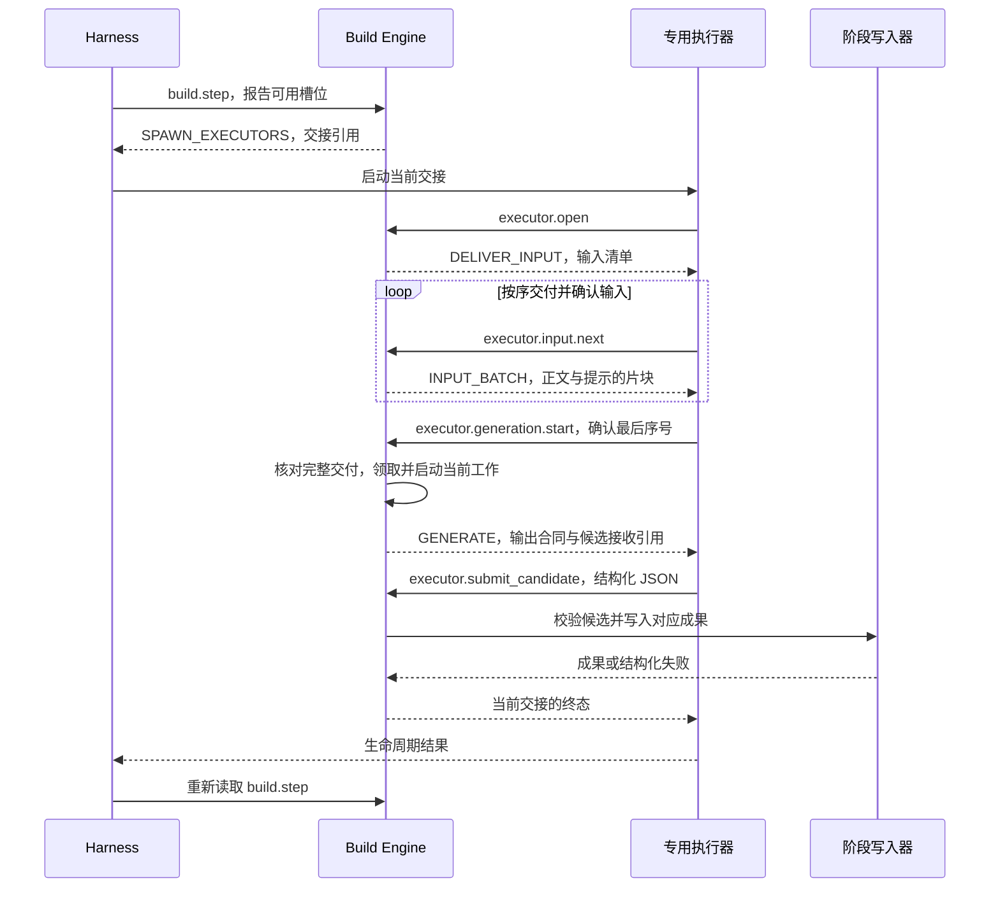

# 第 7 章 模型工作单元与执行调度

上一章已经说明，章节重点可以保留很多细节，宏观路线则从中选择较短的阅读顺序。但当模型真正提交结果时，又遇到了一个具体问题：训练系统一章选择了 114 个重点、44 个宏观引用，完整选择结果的估算大小为 2643 tokens，而当时候选提交只能容纳 1981 个估算 tokens。

输入已经读完，判断也已经形成，结果却无法通过交付通道。增加输入上下文无法直接解决这个问题。系统需要把内容身份、一次判断的工作量和交付方式分别组织起来。

本章从这些边界进入执行过程：先解释工作单元怎样形成，再追踪调度、领取、生成和提交。读完后，应当能够回答三个问题：为什么长段落可以拆开执行而不改变引用？为什么执行器启动后还不能立即生成？为什么子代理说“完成”，构建系统仍要重新读取状态？

## 内容的位置保持稳定，执行范围可以变化

第 4 章介绍的 LID 表示原文位置。模型容量却取决于输入长度、提示、输出预留和宿主限制。同一段原文，换一种抽取任务或执行配置后，可能需要不同的分组。

如果每次容量变化都重切 LID，读者原有的引用、批注和派生成果就会失去稳定位置。项目在 [ADR-0100](../../adr/0100-budget-routable-model-work-units-and-truthful-build-recovery.md) 中记录了一个真实触发点：EPUB 的一个 LID 正文估算为 6992 tokens，超过当时 profile sidecar 的 5000-token 路由限制。处理方向是保留原文身份，只拆模型输入范围。

[ModelInputSliceV1](../../../packages/core/src/model-input-slice.ts) 因而同时保存父 LID、片序号和两种范围：

| 范围 | 含义 | 覆盖要求 |
| --- | --- | --- |
| core_span_utf16 | 当前片负责处理的正文 | 各片合起来精确覆盖父段落，无缺口、无重叠 |
| context_span_utf16 | 当前片可见的正文，包括前后文 | 包含核心范围，可以与相邻片重复 |

前后文帮助模型理解跨切点的句意，责任范围则决定该片应处理哪些内容。范围继续使用 UTF-16 单位，来源锚点仍指向原 LID。

为了看清这一点，本书构造一个短小教学输入，把三句话放入同一个段落 `1.2`：

```text
缓存复用已有结果。数据变化后应使缓存失效。批处理合并请求。
```

源串长 29 个 UTF-16 单位，当前估算器给出 27 tokens。教学中将正文上限设为 14 个估算 tokens，每侧增加 1 个 UTF-16 单位的上下文；示意渲染器只依次拼接前文、核心和后文，不计实际任务的提示与字段开销。实际调用 `routeModelInputSlices` 得到：

| 片序号 | 核心范围 | 可见范围 | 核心文字 | 可见输入估算 tokens |
| --- | --- | --- | --- | ---:|
| 0 | [0, 9) | [0, 10) | 缓存复用已有结果。 | 10 |
| 1 | [9, 21) | [8, 22) | 数据变化后应使缓存失效。 | 13 |
| 2 | [21, 29) | [20, 29) | 批处理合并请求。 | 8 |

三个片的 `parent_lid` 都是 `1.2`，没有生成三个新的引用位置。核心长度之和为 29，缺口和核心重叠均为 0；可见范围有重复，使各片能够看到切点附近的文字。这个很小的限制用于展示算法，产品任务采用对应路由的实际预算与渲染方式。

`routeModelInputSlices` 先尝试整个 LID，超限后再寻找能够放入预算的边界。普通正文优先使用句子等边界；代码和表格按可用行边界处理；公式和图片的原子输入超限时返回阻塞。每个候选片都先经过实际提供的渲染器，再估算大小。[validateModelInputSliceCoverage](../../../packages/core/src/model-input-slice.ts) 检查核心范围的完整覆盖。

正式 Pass1 渲染还会显示父 LID、片序号、范围以及 `CONTEXT_BEFORE / CORE / CONTEXT_AFTER` 等信息，具体可读 [renderPass1SourceFragmentModelInput](../../../packages/core/src/model-input-renderer.ts)。因此，按原文长度算出的分片还需要经过输入格式这一层。

## 一个工作单元为什么要携带预算依据

片段只是输入的一种来源。模型也可能整理一组已经接受的成果，或者根据候选目录做章节选择。这些任务都需要一个可以被调度、重试和接纳的身份。

[WorkUnitDescriptorV4](../../../packages/core/src/stage-work-unit.ts) 将这项工作描述为一个工作单元。它记录目标、阶段、工作单元 ID、任务类型、输入依据、当前输入身份、策略、证据位置、依赖和预算依据。输入依据可以是源片段、语义投影，也可以是待归并的子成果。

这里的“工作单元”表示一次语义职责。例如，判断一个正文片段中的候选、选择某章的重点、处理一条主题，都可以成为工作单元。它与 LID、窗口以及后面的传输 chunk 分别承担不同工作。

预算依据回答“这个具体输入为什么可以交给当前执行配置”。只知道模型标称上下文长度，还不足以作出判断。输入中还有任务提示、交付协议，生成时也要为输出留空间。

用符号表示当前 [evaluateModelExecutionBudget](../../../packages/core/src/model-input-budget.ts) 的主要容量关系：

\[
B_{\text{effective}} = \min\left(S,\max\left(0,C-P-H-O-M\right)\right)
\]

其中，`S` 是该任务类型的正文上限，`C` 是执行配置使用的上下文容量下界，`P` 是语义提示的估算大小，`H` 是输入分块交付的额外开销，`O` 是输出预留，`M` 是安全余量。渲染后的正文估算必须落在这个有效上限内。

对应源码片段为：

```typescript
  const contextBodyLimit = executorContextFloorTokens
    - inspected.estimated_prompt_tokens
    - inputDeliveryOverheadTokens
    - outputReserveTokens
    - safetyMarginTokens;
  const effectiveBodyLimitTokens = Math.min(stageBodyLimitTokens, Math.max(0, contextBodyLimit));
```

这个计算先把提示与交付开销纳入，再保留输出和余量。任务自己的正文上限仍然有效，所以换一个更大的模型，也不一定改变该任务的路由结果。

函数还分别检查输入传输和候选传输，返回 `stage_limit`、`context_limit`、`input_transport` 或 `candidate_transport` 等原因。通过时保存输入、提示、路由和估算口径对应的预算依据；后续派发核对这份依据与当前任务绑定。

本书另用合成提示和工具封套调用了同一个执行预算函数。正文设为“缓存”重复 20 次，估算为 40 tokens：正常配置通过；只把阶段正文上限降到 30，得到 `stage_limit`；保持输入不变，把候选上限声明为 2643，得到 `candidate_transport`。两种失败由不同条件触发，应当采取不同处理。

## 输出预留与实际可提交容量

模型能够生成多少内容，与工具请求能够承载多少内容，需要分别计算。生成出的 JSON 还要放入提交协议，携带会话引用、候选接收引用和版本等字段。

[createCandidateTransportContract](../../../packages/core/src/executor-transport.ts) 从整个候选请求容量中扣除这部分封套开销。当前 Codex 配置的确定性计算结果为：

| 项目 | 估算 tokens 上限 | UTF-8 字节上限 |
| --- | ---:| ---:|
| 整个候选提交请求 | 2048 | 32768 |
| 外层协议预留 | 67 | 267 |
| 可承载的候选 JSON 值 | 1981 | 32501 |

两个单位同时约束提交。1981 来自当前协议形状和估算器，不能用它替代任意模型的真实 token 计数。

这就能解释开篇的失败。[BSR7 报告](../../performance/book-structure-bsr7.md)记录，训练系统章保留 114 个重点、44 个宏观引用，完整选择输出估算为 2643 tokens。虽然输出预留为 3500，但实际候选容量只有 1981。即使把摘要缩短到一个字符，引用等必要字段的估算下界仍为 2228，已经超过通道容量。

继续删摘要无法跨过这个下界。实际修订引入了有限的章节选择提交：每次 `select_stops` 最多提交 48 个引用，Core 保存草稿，最后一次选择提交摘要与宏观路线，再由 Core 注入完整章节引用并执行原来的选择检查。该次真实执行按 48、48、18 个引用分三次提交，再提交最终选择，完整 114/44 得以保留。

这次拆分作用于有明确含义的选择动作。114 个引用的归属、重复检查和最终子集条件仍由章节合同管理，不能把任意超长 JSON 切成几段，就当作已经完成同样的语义提交。实现位于 [continueStructureChapterSelection 与 applyStructureChapterAction](../../../packages/core/src/book-structure-planning.ts)，接入与历史任务保留由[章节分段提交测试](../../../packages/core/test/book-structure-chapter-selection.test.ts)覆盖。

## 调度批次决定一次承接多少工作

工作单元通过预算门后，还要组织成可以派发的批次。`dispatch` 保存一组有序工作单元引用和共同策略，调度器据此安排执行。

[planAutomaticBuildExecutorDispatches](../../../packages/core/src/automatic-build-dispatch.ts) 先核对工作单元的阶段、目标、预算依据与任务绑定，再从实际待办中选取尚需执行的单元。它按单元版本、类型、聚合角色和策略身份分组，然后根据单元数、输入估算总量和预测服务时长分批。

当前部分批次限制如下：

| 工作单元类型 | 每批最多单元数 | 每批输入估算总量上限 |
| --- | ---:| ---:|
| pass1_window、pass1_source_slice | 4 | 50000 |
| profile_sidecar_discourse | 4 | 6000 |
| structure_chapter、structure_chapter_selection | 1 | 20000 |
| structure_theme | 1 | 20000 |

这些是派发批次的限制。每一个单元仍须满足自己的输入、输出和传输要求。一个批次允许累计 50000 个输入 tokens，不表示可以把一个 50000-token 的单任务直接塞进去。

批次与并发也分开。一个批次可以组织多个有序任务；同时允许多少执行器运行，由可用槽位和当前活动情况决定。[selectAutomaticBuildDispatchRefill](../../../packages/core/src/automatic-build-dispatch.ts) 排除活动和已完成批次，只选择当前空位能够容纳的剩余工作。

这种分层也保留了清楚的进度口径：有多少语义工作尚未接受，有多少派发批次待运行，以及当前占用了多少宿主槽位。增加批次大小可以减少部分组织开销，但会延长一个执行序列；增加并发则消耗更多宿主容量，并且仍受阶段依赖限制。

## Engine 给出下一步，Harness 管理实际执行器

Build Engine 负责原文、计划、任务、预算、租约、候选接纳和成果状态。Harness 是实际承载模型和 Agent 循环的宿主，负责启动、等待和取消执行器。这里讨论的是语义生成模型；第 6 章的 Embedding 准备另有 Core 管理的调用入口。

当前控制入口 [automatic-build-driver.ts](../../../skills/build/automatic-build-driver.ts) 将下一步投影为四类动作：

| 动作 | 当前应做什么 | 继续依据 |
| --- | --- | --- |
| SPAWN_EXECUTORS | 按签发的交接引用启动执行器 | Engine 的当前派发与执行代次 |
| WAIT | 等待活动工作或指定退避时间 | 仍存在的执行器、租约或待处理状态 |
| NEEDS_USER | 展示当前需要用户决定的边界 | 精确请求及其可选处理方式 |
| DONE | 交付构建计划完成状态 | 当前计划要求的成果和阶段状态 |

控制动作中的 `opaque_handoff_ref` 是不透明交接引用。根 Agent 可以把它交给专用执行器，具体任务、语义输入和候选接收位置由 Engine 解析。根 Agent 因而不必在自己的上下文里搬运所有正文与候选。

当前公共交接还绑定了恢复代次。[issueAutomaticBuildOpaqueHandoff](../../../packages/core/src/automatic-build-executor-session.ts) 根据当前工作单元、语义尝试和租约代次签发交接；Codex 使用的当前公共记录为 V4，DSH 使用绑定执行配置的 V5。派发批次可以有多个单元，而一次当前交接的结果范围更小。提交这一单元后，执行器可以收到 `DONE/committed`，Driver 再根据持久状态决定是否签发下一项工作。

这点与早期交接连续处理整个批次的路径有所不同。[当前 V4 中间提交测试](../../../packages/core/test/automatic-build-executor-session.test.ts)明确构造了一个包含 3 个单元的 dispatch，第一项提交后就返回当前交接的 committed 终态。

## 四个工具怎样完成一次交接

专用执行器的主要协议由四个工具组成。可以沿下面的时序理解它们之间的依赖：



`executor.open` 解析交接，核对当前任务状态，返回输入清单。`executor.input.next` 随后分批交付语义提示和正文。每批有序号，执行器按协议确认已经收到的范围；重发同一请求有明确的重放语义。

这里的 chunk 是传输片块。它可能只是一个大输入在工具结果中的一部分，并不自动成为新的语义工作单元。执行器需要收齐本次工作所需的输入，才进入生成。分块交付解决单次工具结果装不下的问题；全部材料积累后的模型上下文仍受前面的执行预算约束。

[startAutomaticBuildExecutorGeneration](../../../packages/core/src/automatic-build-executor-session.ts) 要求最后一批已经提供，前面各批已经确认，最终序号与输入一致。完整交付后，它再检查当前任务与恢复身份，领取工作、记录输入观察，签发候选接收引用并返回 `GENERATE`。

候选接收引用把提交连接到具体会话、输入和输出合同。执行器将 JSON 值放进 `executor.submit_candidate`，由代码接收和写入；候选正文不会因为出现在子代理的最后一句话里就成为构建成果。

## 领取、开始运行与生成尝试

任务状态需要区分“已经被某个执行者占有”和“已经开始处理输入”。租约记录前者，启动记录说明后者。

[automatic-build-lease.ts](../../../packages/core/src/automatic-build-lease.ts) 中的活动状态判断很短：

```typescript
  if (!("lease" in inspection)) return "pending";
  return readAutomaticBuildStart(target, inspection.lease_ref, inspection.lease)
    ? "running"
    : "reserved";
```

租约保存所有者、任务、尝试及有效期限；启动后另有开始时间与运行期限。运行心跳只能续展已经开始的活动租约。它们共同回答“这项工作现在由谁负责，当前执行是否仍然有效”。

在本章的四工具路径中，输入交付期还没有消耗一次语义生成尝试。完整输入确认并进入 `generation.start` 后，Engine 才推进领取与启动。因此，工具连接在输入还没交完时中断，不能直接解释为“模型已经生成失败一次”。对应[执行器会话测试](../../../packages/core/test/automatic-build-executor-session.test.ts)检查了各批输入交付后仍无 attempt，以及 generation.start 后才出现第一次尝试。

执行身份还区分语义尝试与租约代次。前者记录一次候选生成责任，后者处理同一责任的执行接管。具体如何在租约过期、候选已写入或响应丢失后恢复，留到第 8 章；本章先保留这两个维度，避免把所有重连都当作新的语义失败。

## 候选通过写入器之后，完成才有可读取的依据

执行器提交候选后，Engine 先检查完整请求的大小和绑定，再把结构化值交给对应阶段的写入器。Pass1、BookStructure 等阶段各自执行格式、来源和任务合同的接纳规则。

[submitAutomaticBuildTaskCandidate](../../../skills/build/automatic-build.ts) 从租约取得任务绑定，并调用阶段写入器。[submitAutomaticBuildCandidate](../../../packages/core/src/automatic-build-mailbox.ts) 进一步核对该任务已有匹配的输入观察；写入器返回后，还检查成果文件确实存在，以及成果身份与当前任务相符，随后保存 committed 回执。

于是，完成有三个层次。当前交接结束是执行器生命周期事实；候选 committed 是某个工作单元的成果事实；控制层 `build.step` 返回 DONE，才表示当前构建计划完成。阶段质量、发布和关闭仍由 Engine 推进，子代理 final 不承担这些判断。

失败反馈也需要能够改变下一步。若写入器得到可纠正的字段错误，下一次生成可以收到 `code`、`json_pointer` 和 `expected`，指出哪里不符合合同。比如[现有测试](../../../packages/core/test/automatic-build-executor-session.test.ts)构造了 key-stop 的 `type` 填成 `application` 的情况：`application` 可以是章节角色，却不是这里允许的重点类型；反馈指出字段位置及允许值，后续尝试按原合同纠正。

[readAutomaticBuildCandidateRetryFeedback](../../../packages/core/src/automatic-build-task-store.ts) 只从同一尝试范围内的相关失败提取这类反馈。内部写入异常和可纠正候选错误分别记录。这样的区别使执行器能够修正自己的字段，同时保留需要由构建系统处理的故障原因。

## Codex 与 DeepSeek Harness 适配什么

换一个 Harness 时，源位置、候选格式和阶段接纳规则可以继续由同一个 Engine 管理；宿主的模型配置、子代理对象、工具传输与取消机制则需要相应适配。

当前 [build-execution-profile.ts](../../../packages/core/src/build-execution-profile.ts) 定义了两种固定身份的执行配置：

| 配置项 | Codex | DeepSeek Harness |
| --- | --- | --- |
| 配置身份 | codex_mcp_v3@1 | dsh_native_v4@1 |
| Session 响应版本 | V3 | V4 |
| transport profile 版本 | V2 | V3 |
| 每次输入交付批次最多片块 | 8 | 1 |
| 每批 MCP 序列化字节上限 | 65536 | 16384 |

这组字段来自项目的执行配置，描述它采用的传输合同。它们与模型实际上下文和输出能力分别绑定。调用者通过已发布的配置身份选择，不能临时填一个更大的容量数字来改变注册配置。

DSH 的[插件入口](../../../packages/dsh-plugin/src/index.ts)先与已安装 Engine 协商能力，再注册准备确认和前台继续执行入口。[build-control.ts](../../../packages/dsh-plugin/src/build-control.ts)负责计算实时可用容量，启动专用 child、等待终态、记录观察并释放资源。一个 child 完成后可以补位；达到本次调用边界时，先等自己拥有的工作收尾，再返回可继续的 invocation 引用。

模型路由和输出配置由 Harness 提供并按 invocation 保存，Engine 持续决定构建下一步。[ADR-0138](../../adr/0138-multi-harness-prebuild-and-deepseek-harness-adapter.md)将这种分工作为多宿主适配的基础。安装能力、确定性闭环和真实模型验收各自有证据范围，不能仅凭配置常量存在就宣布完整支持。

## 已知边界与验证范围

本章依据 2026-10-07 的工作区，公共自动构建协议为主要讲解范围。旧版本入口和私人产物另有分支。LID 分片算例从已经进入模型路由的源节点开始，第 4 章记录的根级超预算叶子在窗口阶段遗漏属于更前面的输入问题，本次写作未修复该实现。

项目当前 token 估算器按确定性文字权重计算，不是所有模型的真实 tokenizer。预算依据证明输入符合这一估算及配置合同；协议确认记录输入交付，不能证明模型已经理解全部内容；候选结构接纳也不等于语义质量已经得到证明。

114/44 的容量问题来自 BSR7 的既有真实记录，本次没有重跑模型生成。小段落切片、候选容量和两类预算失败则实际调用了当前确定性函数。教学渲染与封套已说明为合成输入，没有将它们冒充生产任务的容量测量。

[DSH 兼容报告](../../performance/dsh-prebuild-compatibility-20260925.md)记录，DH1—DH5 已有相应实现和确定性验收，技术书完整闭环使用脚本模型与真实源码 Engine；小型真实模型往返只验证较小范围。该报告仍保留 DH0 人工“要求修改”和 DH6 独立分发、真实模型完整构建等未完成项。本章据此介绍已实现的适配分工，不作完整发布支持声明。

## 源码选读与面试表达

| 入口 | 关键符号 | 阅读时要回答的问题 |
| --- | --- | --- |
| [模型输入片](../../../packages/core/src/model-input-slice.ts) | routeModelInputSlices、validateModelInputSliceCoverage | 责任范围和可见上下文怎样同时保留？ |
| [执行预算](../../../packages/core/src/model-input-budget.ts)与[传输合同](../../../packages/core/src/executor-transport.ts) | evaluateModelExecutionBudget、createCandidateTransportContract | 哪个限制导致这次工作放不下？ |
| [工作描述](../../../packages/core/src/stage-work-unit.ts)与[批次规划](../../../packages/core/src/automatic-build-dispatch.ts) | WorkUnitDescriptorV4、planAutomaticBuildExecutorDispatches | 输入身份怎样一路进入派发？ |
| [执行器会话](../../../packages/core/src/automatic-build-executor-session.ts) | openAutomaticBuildExecutorSessionV3、nextAutomaticBuildExecutorInput、startAutomaticBuildExecutorGeneration、submitAutomaticBuildExecutorCandidateV3 | 收到输入、开始生成和接受结果分别发生在哪里？ |
| [租约](../../../packages/core/src/automatic-build-lease.ts)与[候选提交](../../../packages/core/src/automatic-build-mailbox.ts) | inspectAutomaticBuildTaskActivity、startAutomaticBuildLease、submitAutomaticBuildCandidate | 所有权和成果回执怎样成为持久状态？ |
| [Driver](../../../skills/build/automatic-build-driver.ts)与[DSH 控制器](../../../packages/dsh-plugin/src/build-control.ts) | automaticBuildStep、createBuildControl | 构建决策与宿主生命周期由谁负责？ |

[切片测试](../../../packages/core/test/model-input-slice.test.ts)、[预算测试](../../../packages/core/test/model-input-budget.test.ts)和[派发测试](../../../packages/core/test/automatic-build-dispatch.test.ts)分别覆盖范围、容量和批次边界；[执行器会话测试](../../../packages/core/test/automatic-build-executor-session.test.ts)覆盖输入期无生成尝试、完整确认、字段纠错及当前交接终态。本次写作阅读了相关用例，未运行这些产品测试套件。

**为什么不按模型容量直接重新生成 LID？**

LID 服务引用、批注和来源身份，容量服务一次执行。保留父 LID、改变模型输入片，能够调整工作量并维持原有来源关系；核心范围的完整覆盖另由程序检查。

**为什么输入能放下，任务仍然可能被拒绝？**

生成输出、候选请求封套、单次工具结果及累计输入都有容量约束。应先定位失败属于哪一层，再改变相应分组或合同。章节引用过长时，保留选择含义的分段提交比反复缩短摘要更有效。

**批次更大、执行器更多，是否一定更快？**

批次改变一次承接的工作量，并发改变同时占用的资源。前者可能减少组织成本但延长序列，后者受宿主容量和阶段依赖约束。需要观察真实等待、任务时长及完成路径，不能只看启动了几个 Agent。

**为什么要收齐输入以后才开始计生成尝试？**

输入交付失败与模型候选失败需要不同的恢复动作。把 generation.start 放在完整交付之后，使一次语义尝试对应清楚的输入和输出责任；重连的影响也可以与重新生成分开记录。

**子代理说完成后，根 Agent 为什么还要读 Engine？**

子代理终态只说明该执行过程结束。候选是否接受、是否还有下一单元、阶段是否发布，都由持久构建状态决定。根 Agent 依据重新计算的下一步行动，才能保持对整体任务的准确判断。

执行现在已经形成一条可以追踪的链路：预算允许的工作被派发，输入完整交付，候选经过写入器形成回执。[第 8 章《构建恢复与成果发布》](08-构建恢复与成果发布.md)继续追问，当进程中断、输入变化或只完成部分任务时，哪些结果仍然有效，以及它们何时能够正式发布给阅读侧。
