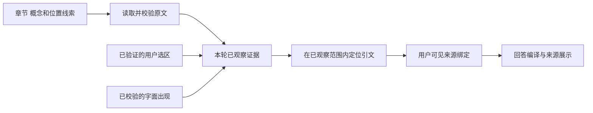

# 第 9 章 一次有证据的回答

设读者正在阅读一本技术书，选中一段话，提出这样的请求：“解释这里的结论与前面介绍的概念有什么关系，把关键区别记成一条笔记。”

要完成这项任务，系统需要理解当前选区，找到前文，取得足够的材料，形成解释，并执行笔记保存。读者还应能够从回答回到原文。随后的一次追问，则需要知道前一轮已经讨论了什么、实际保存了什么。

本章沿着这条任务链理解阅读 Agent。我们先看输入怎样固定，再看线索怎样成为证据，最后追踪回答、动作与历史保存。这个场景用于说明各机制的联系；模型在具体运行中可以根据已有信息选择不同的工具路径。

如果希望先建立全貌，可以依次阅读[第 1 章](01-一本书怎样成为交互阅读环境.md)、[第 2 章](02-构建与阅读如何分工.md)和[第 3 章](03-数据身份与状态归属.md)。其中第 3 章解释本章使用的发布身份、用户状态、阅读现场和 RunScope。

[第 4 章](04-原文定位与LID.md)和[第 5 章](05-语义抽取与来源锚定.md)进一步说明材料位置与语义线索怎样产生，[第 6 章](06-全书结构与语义候选召回.md)解释全书路线、候选召回和构建期交付记录。本章则从具体问题出发，追踪这些成果怎样成为本轮实际观察的证据。

[第 7 章](07-模型工作单元与执行调度.md)中的执行器会话负责构建任务的交付与接纳；本章的 Run 则服务读者的一轮提问。两者各自拥有任务状态，不能把构建的生成尝试直接当作读时 Agent 的采样轮次。

[第 8 章](08-构建恢复与成果发布.md)进一步说明这些成果怎样恢复、收口并形成阅读发布。本章从读者已经打开材料的现场开始，追踪所用发布中的内容如何成为当前回答的证据。

## 提问需要一个确定的阅读现场

“这里”和“前面”都依赖读者的阅读现场。单独把问题文字送给模型，会丢掉这些指代的依据。因此，处理一次提问首先需要确定材料、聊天、位置和选区。

在 Server 中，prepare_agent_chat 校验输入并接纳本轮消息，随后通过 RunScope 保存这次运行的归属。它包含用户、阅读现场及其 generation、聊天、回合、书籍引用、存在时的发布对象，以及提问时的阅读状态、引文和演示追问现场。运行据此知道后续结果应回到哪里。

这里的固定具有实际作用。读者发出问题后，模型可能需要一段时间才能回答；等待期间，读者仍然可以操作界面。如果后续工具总是读取宿主“此刻打开的书”或“此刻选中的聊天”，任务就可能从最初的问题滑到另一个现场。RunScope 保留原归属；需要修改阅读现场时，代码再检查当前现场是否仍与原运行一致。

这形成了两类访问。一类使用提问时固定的输入，让模型解释当时的问题；另一类操作当前权威状态，让笔记和阅读动作真正发生。两者通过明确的归属检查连接起来。

同一用户在另一个窗口打开一本书，是项目支持的正常使用。理解 RunScope 的价值，最直接的办法就是沿这种场景追踪：原运行持有哪份 Book，读取哪段输入，动作经过哪个现场检查，最终提交到哪个聊天。

## 一轮运行怎样持有自己的信息

提问被接纳以后，Runtime 使用 RunContext 持有本轮执行信息。消息、运行配置、模型能力、取消信号、已经发生的效果，以及定位、证据和进展记录，都从这里进入循环。

模型每次看到的是为当前采样组织的请求。它可以要求工具取得更多信息，也可以提出回答候选。工具执行之后，运行时把真实结果放回上下文，并更新相应记录，下一次采样据此继续判断。

这里可以把角色分工说得更精确一些：模型选择下一步有意义的行动，程序负责把这个选择送到正确的工具、维护状态并解释执行结果。例如，模型可以决定需要阅读前文，但原文来自 Book 的读取能力；模型可以提出保存笔记，但笔记是否已经保存，要看真实操作的返回结果。

工具发现也处在这个循环中。发现某项能力，使它能够在后续请求中被模型使用；实际执行仍然经过工具的参数、权限和状态边界。模型可见能力的变化与用户数据的变化拥有不同的发生时刻。

## 从位置线索到已观察证据

假设检索结果指出，前文某一节讨论了问题中的概念。这个结果为 Agent 提供了下一步方向。要解释当前段落与它的关系，通常还需要取得相应原文，了解定义所用的条件和上下文。

本轮证据账本 TurnEvidenceLedger 记录运行实际接纳的原文范围。observe_tool_evidence 根据不同工具的合同处理结果：book.text 的正文会与实际材料对应，query 或 synthesize 的引用需要解析到原文；book.search_text 的出现位置则以字面出现这一类证据被接纳。用户随问题提供的选区在通过校验后，也可以直接成为本轮证据。

因此，“本轮还没有调用检索工具”并不必然意味着缺少证据。如果读者提供的选区已经足够回答问题，运行可以使用它。相反，得到一个指向章节的定位结果，也不会自动证明本轮已经读过该章内容。

下图表示来源形成的主要依赖。不同入口可以汇入本轮证据，但引用最终需要回到实际材料。



字面出现与完整语境也有差别。检索发现某个词，能够帮助确认它在材料中的位置；要解释这个词在一段论证中的作用，仍可能需要读取周围内容。运行时记录证据的来源和范围，Agent 则要根据任务判断现有材料是否足够。

这样设计以后，定位能力和引用能力可以分别考察。一次检索可以很擅长找到相关位置，却仍因没有读取充分上下文而给出不完整解释；一次来源绑定可以准确回到原文，回答中的推论仍可能需要进一步检查。

## 引文怎样成为读者可以使用的来源

当模型希望在回答中展示来源时，会提交需要引用的连续原文。当前 source.present 的输入以 quote 表达引文，运行时在本轮已经观察的范围内寻找对应位置。

决定匹配范围的是 [TurnEvidenceLedger::prepare_present](../../../crates/runtime/src/orchestrator.rs) 中相邻的两行代码：

```rust
        let observed = self.observed_intervals(book);
        let mut matches = book.match_source_quote(quote, &observed)?;
```

先把本轮接纳的证据转成原文区间，再把这些区间传给引文匹配。第二行的 `&observed` 限定了查找范围。如果只在全书中找一句相同的文字，最多能确认书中存在这句话，不能说明本轮取得过它。当前接口把匹配限定在已经观察的范围内，让引用的资格与本轮实际取得的材料相连。

接下来的分支根据匹配到的位置数量处理：

| 匹配位置数 | 当前结果 | Agent 怎样继续 |
| --- | --- | --- |
| 0 | `SOURCE_NOT_OBSERVED` | 先从已有结果中纠正引文；所需内容尚未观察时，再读取原文 |
| 1 | 解析真实范围并返回可呈现来源 | 使用返回的来源绑定组织回答 |
| 多于 1 | `SOURCE_AMBIGUOUS` | 加入已有原文中更有区分度的上下文；材料不足时补读 |

重复引文是阅读材料中自然会出现的情况。同一术语定义可能在小结中再次出现，短句也可能在不同章节重复。直接选择第一个位置，会把准确的文字连接到错误的阅读上下文。当前实现让模型延长引文，或者补读能够区分位置的原文，再进行绑定。

得到来源绑定以后，模型可以在回答候选中引用它。compile_agent_answer 将候选文本转换为面向界面的结构，并检查来源标记是否属于本轮已有绑定。未知引用和不符合来源表达合同的内容会触发交付诊断。现有路径保留一次修复机会；再次无法通过时，系统交付相应的失败结果。

这一阶段将模型生成的表达与运行时掌握的引用事实连接起来。读者看到的来源标签、预览和跳转对象由真实材料派生，界面据此展示与导航。

流式输出也遵循同一条边界。模型可以逐步生成文字，用户可以较早看到通过展示规则的草稿；最终回答仍经过完整编译。草稿和最终接受的结果具有各自的状态，第 12 章会进一步分析它们与 SSE 事件、快照和历史提交的关系。

## 阅读动作怎样回到正确的状态

现在回到任务中的“保存一条笔记”。找到证据和形成解释以后，Agent 还需要执行一次用户要求的操作。

Runtime 通过 ResidentStatePort 访问 Reader 和私人数据。Server 的 RuntimeStatePort 在执行写入或阅读动作前检查运行归属，再操作当前权威实例。用户数据写入和阅读现场操作使用不同的检查范围：前者首先要属于原用户，后者还要确认原现场没有被替换。

这种访问方式与模型调用的时间尺度有关。模型等待可能持续较久，读取或更新一项本地状态则通常只占其中一小段。如果在整轮模型调用期间一直占有共享状态，读者操作就会被等待拖住。项目将模型等待放在锁外，在执行具体状态操作时短暂进入相应入口。

另一个需要考虑的方案是先复制 Reader 和 Memory，等模型完成后再整体写回。它简化了运行期间的访问，却会遇到读者同时操作的问题：复制之后新发生的变化可能被旧副本覆盖。按操作访问权威状态，使模型执行与读者操作能够在明确的边界上相接。

工具返回以后，运行记录实际效果。取消信号可以阻止后续工作继续推进；已经保存的笔记或已经发生的阅读操作则保留自己的事实。历史和界面应当据此说明发生过什么。

## 运行何时继续 何时停止

一次任务可能需要多次模型采样。多读了一段相关原文、找到了新的有效位置、完成了要求的操作，都可能使任务进一步接近交付。反复改变参数却没有取得新的结果，则需要不同的处理。

当前 OuterConfig 的默认 max_turns 为 None。普通 Resident 运行按实际进展持续执行，同时保留取消、无进展、上下文压缩失败和不可恢复错误等停止路径。显式有限调用配置和特定实验预算仍可施加各自的边界。

运行时的进展记录根据实际发生的事件变化。代码分别观察定位、证据、综合以及工具能力和效果等信息，再用于判断执行是否停滞。模型声称“我继续研究一下”没有改变这些事实；一次工具调用如果带来新的有效信息，则可能改变下一步能够做的事情。

上下文压力属于另一类条件。旧历史占用过多输入空间时，系统可以通过检查点压缩活动上下文，并继续同一任务。压缩改变后续模型请求如何表达历史，持久记录仍然承担保存实际交互的职责。

把这些因素分开之后，就能理解为什么一次运行可能因为没有进展停止，也可能在多次压缩之后继续。所需判断来自任务状态、实际观察和单次请求容量，单独累加采样轮数无法表达这些关系。

## 回答如何保存为可继续使用的结果

Server 在 finalize_user_agent_turn 中整理本轮终态、回答、来源绑定、错误和目标状态，再交给会话保存路径。对于已经使用新日志的用户，会话通过 session_runtime 完成相应提交。

新聊天采用按会话追加的 JSONL。SessionLog 将结构化事件写入文件，完成相应的写入确认，再发布内存投影。后续读取通过事件恢复消息、回合和关联状态；读取历史本身不会重新执行当时的工具。

一轮任务中的记录也可以在过程中增量保存。RunCheckpointSink 将消息、活动、效果和压缩检查点送到各自的提交入口。最终结束记录把本轮结果关联起来。这样，展示进度、恢复模型上下文和保存领域事实能够使用各自需要的表达。

聊天 Goal 还可能跨 Run 延续。某次运行停止之后，任务仍可能保留未完成事项；后来继续时，模型需要看到原要求和已经得到的结果。Server 根据运行结果判断是否满足通用完成条件，并与本轮历史一起提交目标状态。

具体恢复策略取决于中断发生的位置。尚未开始的排队任务、已经认领的任务和已经交付的效果具有不同事实。第 16 章会沿日志解释保存与读取，第 19 章再加入网络准入和调度的恢复关系。

## 用量与等待应该怎样分析

沿一条执行轨迹看成本，可以先区分三个量：本次模型请求需要容纳多少输入，整项任务累计使用了多少输入输出，以及读者等待多久。

考虑一个教学算例：四次请求的输入分别为 2000、4000、6000 和 8000 个 token。累计输入为 20000 个 token，最大的单次输入为 8000 个 token。这两个量来自同一条轨迹，但用途不同。

累计用量帮助核算任务成本，其中实际计费还要结合 Provider 的输入、输出和缓存口径。单次输入则需要与模型上下文容量、输出预留和其他请求内容一起判断。重复携带的旧上下文会多次进入累计统计，因此累计输入可以超过任一时刻实际持有的输入规模。

时间分析同样需要明确口径。一次 book.query 可能在工具内部继续调用模型。如果已经把这段内层推理记入模型耗时，又把整个工具调用耗时加一遍，就会重复计算。分析串行路径时，应当使用互不重叠的阶段时间；存在并行时，则沿依赖关系找出决定结束时刻的路径。

由此可以提出能够改变设计判断的问题：延迟主要发生在模型生成、工具执行还是排队？新增的一次检索是否取得了有用证据？更多采样是否提高了任务成功率？保存的结果是否满足了读者要求？第 21 章会结合项目的真实记录，把这些问题连接到效果和成本评测。

## 当前机制的保证与边界

来源绑定能够检查引文是否来自本轮已观察的材料，并把它连接到真实位置。原文是否充分支持回答中的推论，需要另行评估。这个区别决定了评测中为什么要分别观察来源定位、引用支持和完整任务成功。

目标完成检查也有具体粒度。[goal_turn_delivered](../../../crates/server/src/lib.rs) 首先排除运行未完成、带有 warning、缺少回答或缺少回答视图的结果，再逐项处理目标中的验证类型。其中两个分支是：

```rust
        runtime::goal::GoalVerification::Content => true,
        runtime::goal::GoalVerification::ReaderAction => !outcome.effects.is_empty(),
```

Content 分支在通过上述前置检查后直接返回 true，这一层没有另做语义判卷。ReaderAction 分支确认效果列表非空，但没有把每一项动作要求匹配到具体对象。假设任务要求保存一条比较笔记，仅凭某个阅读动作已经发生，还不能证明笔记正文包含了全部关键区别；需要继续查看保存操作的结果和实际笔记。

PresentationDelivery 分支则会检查回答挂载的演示及其版本是否在当前目标的成果引用里。[对应测试](../../../crates/server/src/agent_run_tests.rs)分别构造只有文字、只有候选或预览、交付后未挂载、挂载另一份演示，以及挂载本目标已交付版本等情况。不同结果使读者能够看清这个分支实际验证的对象。

会话日志和笔记、教学事实、呈现版本分属各自存储。日志可以记录关联和处理结果，整个任务跨这些存储的写入则需要分别分析。讨论恢复时，应当从已经提交的事实开始，判断哪些结果可直接读取、哪些执行已经中断。

## 源码选读

| 阅读顺序 | 文件与符号 | 应追踪的关系 |
| --- | --- | --- |
| 1 | [Server](../../../crates/server/src/lib.rs) 的 prepare_agent_chat；[RunScope](../../../crates/server/src/run_scope.rs) | 原输入、材料、聊天和现场怎样固定 |
| 2 | [RunContext 与状态端口](../../../crates/runtime/src/run_context.rs) | 本轮信息和权威状态怎样分工 |
| 3 | [Agent 循环](../../../crates/runtime/src/orchestrator.rs) 的 observe_tool_evidence、TurnEvidenceLedger::prepare_present、compile_agent_answer | 从工具结果到证据，再到来源与回答 |
| 4 | [运行协调](../../../crates/server/src/agent_run.rs) 的 RuntimeStatePort、RunCheckpointSink | 状态操作、过程记录和取消怎样连接 |
| 5 | Server 的 finalize_user_agent_turn、goal_turn_delivered；[会话提交](../../../crates/server/src/session_runtime.rs)；[日志](../../../crates/server/src/session_log.rs) | 终态、目标和持久记录怎样衔接 |

源码中的 source_presentation_rejects_context_route_state_error_and_unobserved_lid 测试展示了位置线索不能直接产生来源的情况；source_presentation_quote_requires_full_observation 约束了引文的观察范围；source_presentation_second_invalid_answer_fails_closed_after_one_repair 说明一次修复之后仍无法交付时的结果。[日志测试](../../../crates/server/src/session_log/tests.rs)中的 session_log_reopen_and_position_keep_frozen_prefix 则展示了后续追加如何与早先冻结的历史位置共存。

## 思考与面试表达

介绍这条链路时，可以先用一段简短回答建立全貌：

Understand Book 在提问时固定书籍、聊天和阅读现场，由 Agent 按任务读取原文并执行操作。原文先进入本轮证据账本，引文再绑定到真实来源，回答通过编译后保存。笔记等动作通过权威状态入口执行。系统分别验证来源能否追踪、动作是否发生和任务是否完成，并为追问与恢复保留实际结果。

需要深入解释时，沿“输入归属 → 原文观察 → 来源绑定 → 状态操作 → 回答与历史提交”展开。每一段说明它接收什么、改变什么，以及后续组件凭什么继续。下面的追问可以先自行作答，再对照参考思路。

1. **用户提供的选区已经包含完整答案，还需要检索吗？**

   先判断选区是否通过校验并足以支持当前解释。已验证选区可以直接进入本轮证据账本，检索不是每轮必经步骤。需要在回答中展示来源时，再将连续引文绑定成来源；最终回答仍经过编译和会话保存。三个判断分别针对材料是否足够、来源怎样呈现，以及交互结果如何保留。

2. **检索已经返回正确章节，为什么解释仍可能出错？**

   先看得到的是位置线索还是已读取正文，再检查是否读到了定义的条件和上下文，最后对照回答中的推论。来源绑定只能支持相应的定位与观察事实。即使原文与引文完全对应，把有条件的结论推广到所有情况也可能解释错误。排查时需要并排查看工具返回、已观察范围、来源绑定和最终表述。

3. **模型等待期间用户切换了阅读现场，原任务还能继续吗？**

   要按操作区分。解释原问题仍可以使用 RunScope 固定的材料和输入；改变当前 Reader 时，要通过原现场及其代际的检查。私人数据写入先确认用户归属，再经权威入口操作。若采用“复制整份状态，最后写回”的替代方案，还必须解决读者在等待期间新增修改被覆盖的问题。

4. **累计输入很大，但单次请求还有空间，是否应该停止？**

   累计输入用于计算整项任务消耗，单次输入用于判断当前请求能否容纳。仅凭累计量不能推导出上下文已经装满。当前默认没有固定采样轮数上限，运行还要看实际进展、取消与错误；显式配置的限制按其约定生效。再加入“连续无进展”后，应该检查进展记录是否触发停止，不能把重复调用当成任务正在推进。

5. **回答说“笔记已保存”，Goal 检查也通过了，怎样证明任务完成？**

   找到保存操作的真实返回结果和笔记对象，核对属主、关联材料以及正文是否包含要求的关键区别。当前 ReaderAction 通用检查只看效果列表是否非空；它没有在这个分支证明某一条笔记满足了全部语义要求。回答时应先指出已有检查保证到哪一步，再说明还要核对哪些事实。

这些追问分别改变材料、推论、现场、执行条件和验收对象。能够沿实际边界重新作出判断，才说明已经掌握了整条请求链。[第 10 章《工具与模型调用边界》](10-工具与模型调用边界.md)进一步拆开工具契约、能力发现和模型适配，解释模型作出的决定怎样到达正确的执行入口。该章同时对本章请求的原句做了局部重放，并在“已知边界与本轮验证”记录当前动作意图识别对保存分支的限制。
