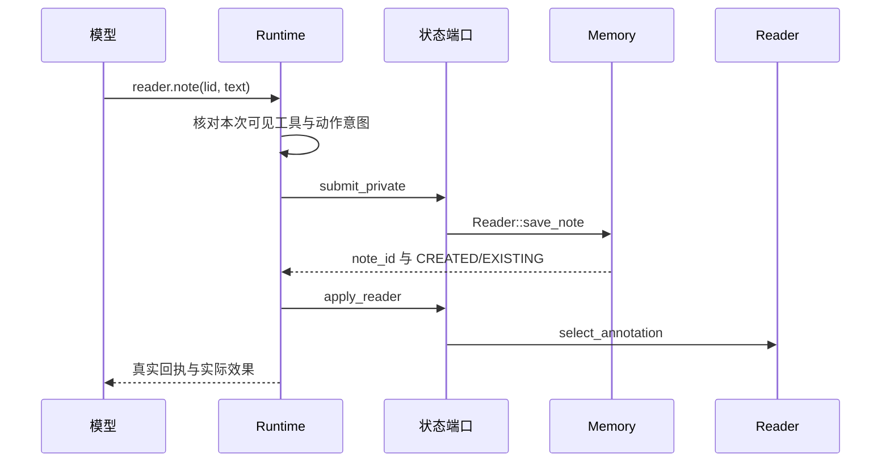
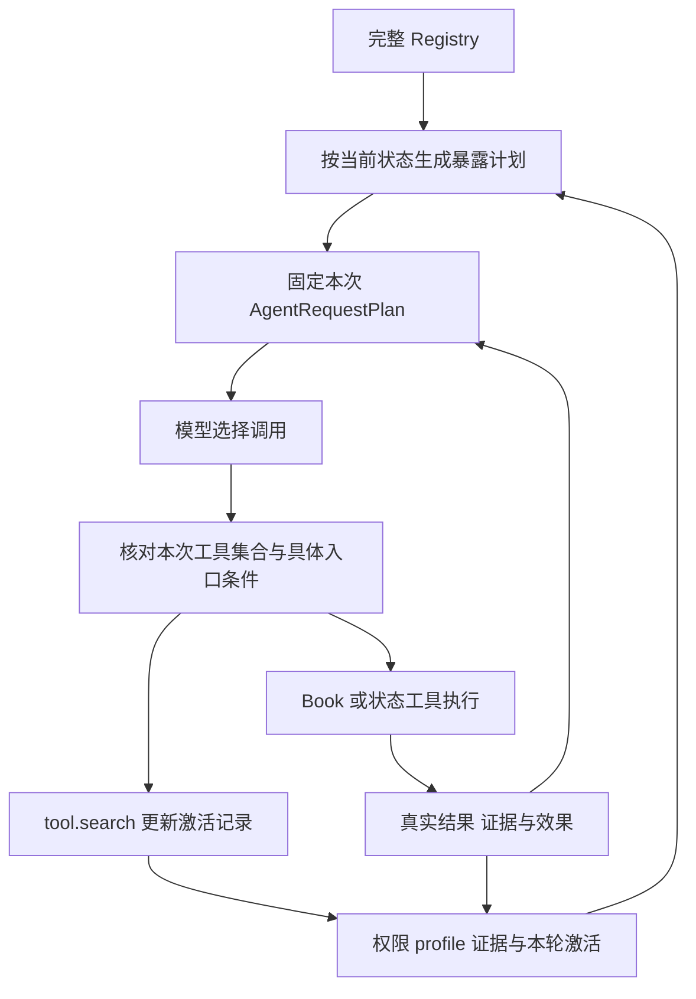

# 第 10 章 工具与模型调用边界

继续上一章的请求：“解释这里的结论与前面介绍的概念有什么关系，把关键区别记成一条笔记。”

我们已经知道，一次回答需要固定阅读现场、取得证据、形成来源并保存结果。现在把注意力移到模型作出决定的时刻：它怎样知道有哪些方法可用？它说“读取前文”时，谁负责找到执行入口？它说“保存好了”时，系统凭什么判断笔记真的存在？

直接把所有函数说明放进提示词，是一个容易想到的教学方案。随着能力增加，这种方案会把原文读取、路线规划、私人记忆、界面动作和演示制作混在一起。更关键的是，函数存在、模型看见函数、当前任务允许执行函数，是三个不同的事实。当前实现围绕这些区别组织工具边界。

本章沿“能力声明 → 本次暴露 → 模型选择 → 执行分派 → 真实结果”展开。这里的 Resident 是内置阅读 Agent，它服务读者的 Run；[第 7 章](07-模型工作单元与执行调度.md)的构建执行器负责交接模型工作单元，[第 8 章](08-构建恢复与成果发布.md)的发布器负责交付构建成果。三者可以使用模型，但各自拥有不同的任务、入口和完成条件。

## 10.1 先确定需要读材料，还是改变阅读状态

请求中的“这里”来自已经验证的选区，“前面介绍的概念”则可能还需要定位。假设前文位置已经确定，最小的一步是调用 `book.text`，取得那一段规范原文。若只知道概念名称，可以先找候选；若需要解决一个自足的关系问题，则可以交给 `book.query`。它们都服务于理解材料，却承担不同程度的工作。

| 当前缺口 | 合适的能力与典型工具 | 返回结果怎样帮助下一步 |
| --- | --- | --- |
| 已有位置，缺少正文 | `source_read`，`book.text` | 返回规范原文，供本轮证据账本接纳 |
| 要找某句话或符号出现在哪里 | `lexical_locate`，`book.search_text` | 返回字面出现位置，按任务决定是否补读上下文 |
| 概念名称有歧义 | `semantic_evidence`，`book.concept` | 返回候选、位置和预览，选定后再读取正文 |
| 要解释明确对象之间的关系 | `semantic_evidence`，`book.query` | 内层先解析对象，再围绕绑定取得证据并回答 |
| 已有一组位置，需要综合 | `synthesis`，`book.synthesize` | 围绕调用方给定的离散 LID 集合综合，不扩展检索 |
| 想了解全书组织，或者安排阅读路线 | `structural_index` / `navigation_plan`，`book.structure` / `book.guide_path` | 返回结构或路线，供定位、解释和导航选择使用 |
| 要实际保存笔记或跳转 | `reader_write`，`reader.note` / `reader.gotoLid` | 执行状态操作，返回笔记身份或 Reader 变化 |

这张表中最值得停下来思考的是最后两行。路线能够告诉 Agent“下一步可以读哪里”，但只有阅读动作才会改变界面位置。全书概述需要结构，不必同时授予跳转能力。[ADR-0113](../../adr/0113-open-natural-language-capability-routing-and-runtime-evidence-topology.md)正是围绕这个区别，把过去粗粒度的导航能力拆成只读结构、只读路线和 Reader 写入。

当前 [Book](../../../crates/read-tools/src/lib.rs) 持有规范正文、位置树和构建成果。`Book::text` 按节点保存的 UTF-16 范围读取原文；Reader 则负责阅读位置、选区和批注入口。保存笔记时，`Reader::save_note` 把书籍身份、LID、正文和落点交给 Memory 保存，并返回记忆层的 `note_id`。模型无法通过生成一个相同格式的身份，使这项写入自行发生。

为追踪保存分支，下面给读者增加一句明确的教学输入：“把要点保存为一条笔记。”假设目标是已定位的 `1.1`，模型提出：

```json
{"lid":"1.1","text":"这里填写根据已观察原文形成的比较要点。"}
```

这只是 `reader.note` 的教学参数。当前 [dispatch_state_tool](../../../crates/runtime/src/orchestrator.rs) 先通过 `submit_private` 保存笔记，再通过 `apply_reader` 选中对应批注。新建成功会产生 `AgentEffect::Note`；命中已有笔记时返回已有身份，而不会再记成新建效果。Agent 路径传入的层级是 `session`，后续“保留”为长期笔记的操作另有生命周期。



图中两次状态访问各有归属检查。私人笔记已经保存、原现场后来无法应用批注选中，可能同时成立；返回值会用 `reader_effect.status=not_applied` 说明后一项没有应用。这个行为延续[第 9 章](09-一次有证据的回答.md)的区分：应当查看实际回执，不能把一次工具调用压成一个不分层次的“成功”。

## 10.2 同一个 Book 能力怎样穿过三个入口

现在考虑读取 `1.1` 的原文。内置 Resident 使用 `book.text`，外部 MCP 调用方使用 `book_text`，REST 路由则使用 `/book/text`。三个名字最终都要表达同一项书籍读取工作。如果各入口独立定义参数，某处允许 `end_lid`、另一处只认识 `end`，调用方就会面对看似相同、实际漂移的工具。

[book-tool-contracts](../../../crates/book-tool-contracts/src/lib.rs) 用 `BookToolId` 表示能力身份，用 `SurfaceAliases` 保存不同表面的名字。`BookToolContract` 同时记录描述、适用条件、不适用条件和结果合同标识。输入的 Rust 类型则承担 JSON 解析和 Schema 生成的共同依据。

其中 `TextInput` 的完整声明很短：

```rust
#[derive(Debug, Clone, Serialize, Deserialize, JsonSchema, PartialEq, Eq)]
#[serde(deny_unknown_fields)]
pub struct TextInput {
    pub lid: String,
    #[serde(default, skip_serializing_if = "Option::is_none")]
    pub end_lid: Option<String>,
}
```

`lid` 必须提供，`end_lid` 可以省略，额外字段会被反序列化拒绝。`validate_input` 先按工具身份解析成对应类型，再执行语义检查；Text 分支进一步拒绝空字符串。JSON 结构和这一步语义检查并不代替对实际 Book 的读取。

REST 中的 `end` 是传输入口的写法。[bind_rest_book_input](../../../crates/server/src/lib.rs) 把它转换为 `end_lid`，再调用共同校验器。Resident 的 `dispatch_resident_book_tool` 和 MCP 的 `dispatch_mcp_tool` 也沿合同解析。对正常范围，三条路径随后调用同一个 `Book::text`，构造包含 `lid` 和 `text` 的结果。

| 能力身份或动作 | Resident 名称 | MCP 名称 | REST 合同别名 |
| --- | --- | --- | --- |
| Text | `book.text` | `book_text` | `text` |
| Query | `book.query` | `book_query` | `query` |
| Structure | `book.structure` | `book_structure` | `structure` |
| Manifest | 无 | `book_manifest` | `manifest` |
| Guide | 无 | `book_guide` | 无 |
| Reader 保存笔记 | `reader.note` | 无 | 不属于 Book 合同 |

表中的“无”是入口设计的结果。Book manifest 没有 Resident 别名，Visitor guide 也没有被改名后塞进 Resident。共同合同复用的是确实相同的能力，不要求所有调用方拥有相同能力面。

Resident 还需要把模型看到的说明连接到真正的执行器。[ToolRegistry](../../../crates/runtime/src/tool_registry.rs) 的一条注册包含 `ToolSpec`、`ToolHandlerId`、校验器、能力卡、输出策略和并行资格。`ToolSpec` 负责名称、描述与参数；Handler 负责决定进入哪条执行分支。Registry 构造时拒绝重复名称、无 Handler 的名称、缺少注册的可调用 Handler，以及 Book 描述或 Schema 漂移。

下面是 `ToolRegistry::try_new` 的真实摘录，前面已经完成名称和基本形状检查：

```rust
            if let ToolHandlerId::Book(id) = handler {
                if spec.description != contract_for(id).description {
                    return Err(ToolRegistryError::new(format!(
                        "Book tool description drift: {name}"
                    )));
                }
                if spec.parameters != input_schema(id) {
                    return Err(ToolRegistryError::new(format!(
                        "Book tool schema drift: {name}"
                    )));
                }
            }
```

这个检查解决的是装配一致性：模型说明必须对应 Registry 所认定的 Book 合同。结果合同标识描述返回对象的约定，Registry 的输出策略则帮助历史投影、定位信息和原文结果各走合适的处理路径。它们不会因为名字中都有“合同”，就自动形成一个覆盖所有结果语义的通用验证器。

能力卡 `ToolRoutingCard` 又向前走了一步。它声明工具提供什么能力、适用于什么范围和操作、会产生什么效果、需要哪些前提，以及相对成本。Book 工具的 `use_when` 和 `avoid_when` 直接来自共同合同。这样，发现路径可以理解“什么工作适合交给它”，不必另外维护一份脱离执行注册的说明表。

## 10.3 注册之后，为什么还要暴露与发现

完整 Registry 是系统能力全集的一种表达。一次局部解释只需要其中一部分。论文专用工具在技术书中没有合适的内容前提；来源呈现需要已有证据；读者只要求解释时，也不能因模型觉得方便就跳转页面。

[ToolExposurePlan::build](../../../crates/runtime/src/tool_exposure.rs) 因此结合内容 profile、运行权限、本轮证据、成果覆盖状态及先前激活记录，为每次采样生成可见工具集合。这里有三种分类：

| 分类 | 含义 | 还要考虑什么 |
| --- | --- | --- |
| Direct | 优先进入当前请求的能力 | 直接工具名额、Schema 字节预算和本次排除规则 |
| Deferred | 注册有效，等待明确需要的能力 | 本轮是否已激活，以及剩余 Schema 预算 |
| Hidden | 当前条件不允许暴露 | 权限、内容类型、证据或运行状态改变前不会通过发现获得 |

`book.text`、`book.search_text`、`book.query` 等核心读取能力属于 Direct；`memory.recall`、若干路线工具和 Reader 动作通常属于 Deferred；没有本轮已观察证据时，`source.present` 属于 Hidden。待取得证据后，下一次计划可以把来源工具放进 Direct。

分类还不是最终答案。每条计划记录另有 `exposed` 布尔值，以及 `DirectLimit`、`SchemaBudget`、`Activated` 等原因。正常含 `goal.update` 的注册表使用 9 个 Direct 名额；移除 Goal 的路径为 8，激活 Tutor 时另增加一个名额。已经激活的 Deferred 工具仍可加入，因此不能把这个数写成“整轮最多只能看见 9 个工具”。所有实际加入的工具共同接受字节预算约束。

### 用字节算一次暴露成本

`tool_schema_bytes` 计算逻辑对象 `{name, description, parameters}` 序列化后的 UTF-8 字节数。`projected_schema_bytes` 再计入数组括号和逗号。对非空集合，若各工具对象占用 `s₁…sₙ` 字节，则这个层次的总量为：

```text
SchemaBytes = Σsᵢ + (n - 1) + 2 = Σsᵢ + n + 1
```

这是暴露层的计量，不包含 Native HTTP 封套，也不等于模型 token 数。最终请求还要接受活动上下文预算检查。

下面是教学算例：按顺序考虑三个逻辑工具对象，大小分别设为 180、240、300 bytes，预算设为 600 bytes。它们是自设尺寸，没有从某次产品请求测量得来。本轮逐字抽取当前 `projected_schema_bytes` 运行，得到：

| 尝试加入 | 加入后的候选总量 | 对 600-byte 教学预算的判断 |
| --- | ---:| --- |
| 第一个对象 | 182 | 可以加入 |
| 第二个对象 | 423 | 可以加入 |
| 第三个对象 | 724 | 超出预算，保留前两个对象的 423 bytes |

因此，发现命中、写入激活集合、实际进入下一次请求仍是不同的步骤。下一次重新构造计划时，预算可以使某项已激活能力暂时没有暴露。

### 不知道工具名字，怎样表达需要

若模型想核对这段内容以前保存过什么笔记，它不必先猜中 `memory.recall`。[agent_prompt.rs](../../../crates/runtime/src/agent_prompt.rs) 的发现策略提供一个较小的能力目录，模型据此提出结构化需求。例如：

```json
{
  "task": "查找以前保存的相关阅读笔记",
  "required_capabilities": ["memory_read"],
  "scope": "document",
  "operation": "explain",
  "effect_mode": "read_only",
  "max_results": 1
}
```

这是传给 `tool.search` 的教学输入。当前 `CapabilityRequestV2` 的六个字段都必须提供。能力取自有限枚举，`max_results` 允许 1—6，任务文本最多 512 个 Unicode 标量值。模型负责把开放语言归约为“要做哪类工作”；系统随后判断这些能力是否适用于真实现场。

`stamp_task_need` 用 Runtime 的状态补全 `TaskNeed`：内容 profile、证据状态、权限和已识别的动作意图都来自当前运行。模型请求中的 `effect_mode` 表达它希望采用的模式，授权结果则由程序重新计算：

```rust
    let authorized_effect_mode = if request.effect_mode
        == ToolSearchEffectMode::ReaderMutationExplicitlyRequested
        && state.has_explicit_reader_mutation_intent()
        && context.permissions.allow_reader_write
    {
        ToolSearchEffectMode::ReaderMutationExplicitlyRequested
    } else {
        ToolSearchEffectMode::ReadOnly
    };
```

还要进一步核对具体动作。当前 `authorizes_reader_action` 区分保存笔记、高亮和导航：要求跳转不等于允许保存笔记，要求保存笔记也不等于允许高亮。这层判断使用用户问题产生的动作提示，不使用模型在 discovery 参数中自行声称的意图。

`effect_mode` 在这里主要区分是否请求 Reader 变化。它并不是全系统“无写入”的总开关：能力卡还分别声明 `MemoryWrite`、`PresentationWrite` 等效果，记忆权限也有自己的读写位。理解某项操作的权限时，需要同时看能力卡、运行权限和执行入口。

随后，`resolve_capabilities` 先按请求能力、scope、operation、暴露状态、效果及前提过滤，再在合法候选中用名称、描述和 `use_when` 排序。当前文本匹配复用 Unicode 归一化、CJK gram 和多字段权重；能力没有满足时，结果保留未满足项和阻塞原因。排序还先覆盖尚未满足的能力，再填入备选工具。它没有增加一次独立的分类模型调用，也没有把 `relative_cost` 字段实现成全局最便宜计划求解器。

### 发现结果为什么要等下一次采样

在默认允许读取记忆、尚未激活它的情况下，上面的需求能够找到 `memory.recall`。`search_and_activate` 将待激活名称写入本轮状态，结果以 `visible_from=next_sampling` 表达可见时机。这个结果不含保存过的笔记；笔记要等下一次合法调用才返回。

假设模型在同一个回复里同时输出 `tool.search` 和 `memory.recall`。虽然 Runtime 按顺序处理这两个调用，第二个调用仍然属于发现之前的那次模型决定，不能提前使用尚未展示的 Schema。[orchestrator.rs](../../../crates/runtime/src/orchestrator.rs) 保存本次真正送给 Provider 的工具名称，并在分派前执行以下过滤：

```rust
            let handler = registered
                .filter(|_| {
                    tool_exposure_plan.is_visible(&tc.name) && sampled_tool_names.contains(&tc.name)
                })
                .map(|registration| registration.handler);
```

因此，已经注册但未在这次采样中暴露的调用返回 `TOOL_NOT_EXPOSED`。下一次采样重新构造暴露计划后，`memory.recall` 才能使用刚刚激活的能力。现有 `tool_exposure_activation_applies_only_to_the_next_sampling` 用例正是按“同批发现并过早调用 → 下一次调用 → 终答”排列这条链；本轮阅读了该用例，没有执行整轮产品测试。



读原文还有独立的来源条件。`authorize_book_text` 使用 `TurnLocatorLedger` 核对 LID 来自哪里；工具在 Schema 中可见，不等于模型可以随意猜一个位置。得到合法定位、观察到正文、形成可呈现来源，仍然沿用上一章的分层。

本轮激活也不会永久继承。`redact_history` 把旧 discovery 结果投影为历史命中名称，并标记 `expired_after_prior_run`。后来的 Run 可以知道过去找过什么，但需要重新取得当前能力。至于这些历史回执如何进入模型上下文，第 11 章再继续追踪。

## 10.4 MCP 调用方与内置 Resident 各自拥有什么

到这里，“模型调用工具”还存在两种容易混淆的使用形态。

第一种是外部 Agent 通过 MCP 使用 Understand Book。外部调用方拥有自己的模型循环，服务端提供当前 Book 的能力。第二种是读者在产品中提问，由 Resident 在 Run 内继续采样、发现能力、维护证据并调用状态端口。相同 Book 合同把公共读取部分连接起来，外层控制权则在不同位置。

| 比较项 | 外部 MCP 调用方 | 内置 Resident |
| --- | --- | --- |
| 谁决定下一次外层行动 | 外部 Agent 的宿主 | 当前 Run 的模型与 Runtime 循环 |
| 能力目录来自哪里 | `tools/list` 的 MCP 合同投影，另含成果读取工具 | Registry 经当前暴露计划形成的 Schema 集合 |
| 普通 Book 读取 | 解析 MCP 别名后调用 Book | 解析 Resident Handler，经过本轮条件后调用 Book |
| 私人 Reader / Memory 操作 | 当前 Visitor 分派没有相应入口 | 通过本用户、本现场的状态端口执行 |
| 持续引导状态 | `book_guide` 的临时 VisitorSession | 聊天、Run、Goal 和 Tutor 各自维护状态 |

服务端的 [handle_jsonrpc_message](../../../crates/server/src/mcp.rs) 处理 `initialize`、`tools/list` 和 `tools/call`。一次普通原文调用的输入可以写成：

```json
{
  "jsonrpc": "2.0",
  "id": 7,
  "method": "tools/call",
  "params": {"name": "book_text", "arguments": {"lid": "1.1"}}
}
```

沿当前代码追踪，`handle_tools_call` 提取名称与参数，`dispatch_mcp_tool` 将 `book_text` 解析为 `BookToolId::Text`，共同合同解析参数，`route_book_text` 调用 Book，最后把返回对象放进 MCP 的文本内容和 `structuredContent`。`isError` 根据内部 Reply 状态生成；调用方仍需理解工具结果本身，例如 Query 返回的未解决状态不能仅凭传输成功就解释为问题已回答。

这条链不创建 Resident Run，也不凭调用方传来一个名字就转入 `reader.note`。[MCP 测试](../../../crates/server/src/mcp.rs)中的 `visitor_dispatch_has_no_reader_or_memory_branch` 明确覆盖了没有私人存储访问时仍能读取 Book、而 Reader 与 Memory 名称被拒绝的情况。

有状态的例外是 `book_guide`。它保存临时的 VisitorSession，包含声明的阅读意图、交换记录和路线游标；调用方可以继续或关闭这次引导。它使用自己的会话上下文，不读取 Resident 的私人画像，也不把游标变化写成产品 Reader 的跳转。这使外部 Agent 能够接续带读，而不必拥有内置聊天的全部状态。

Book MCP 还提供受当前成果快照约束的 artifact 读取能力。因此，“MCP 没有私人 Reader 写入口”不意味着它只能返回原文。准确的边界是：哪些合同被列出、哪个快照被绑定、分派代码实际能访问什么。构建插件中也会出现 MCP，但它交付的是第 7 章的构建工作；不能从相同协议名称推断出相同工具集。

这一划分也解释了模型成本。`book_text` 本身不需要模型；`book_query` 和 `book_synthesize` 可以在服务端调用模型完成内层语义工作。外部 Agent 使用 MCP 后，仍可能承担自己的外层采样和工具内部采样两部分成本。MCP 描述调用边界，不规定工具内部一定是零模型计算。

## 10.5 Native、ReAct 与 Provider 适配分别解决什么

现在让同一个 Resident 换用另一种模型后端。前面的工具合同、状态归属和证据规则应当继续成立；变化主要发生在“怎样把请求交给模型，以及怎样读懂模型返回的调用”这一段。

[ModelAdapter](../../../crates/runtime/src/lib.rs) 为外层循环提供 `chat(&AgentRequestPlan)`，返回统一的 `AssistantTurn`。内层 Query 等语义工作使用 `complete` 或结构化完成接口。外层并不因为一次 `book.query` 内部又调用了模型，就交出 Reader 状态的执行权。

统一调用对象 `ToolCall` 保存三个字段：调用身份、Runtime 工具名和 JSON 参数字符串。

```rust
pub struct ToolCall {
    pub id: String,
    pub name: String,
    pub arguments: String,
}
```

`id` 将工具结果与对应的模型调用配对。`name` 决定去 Registry 找哪个 Handler，`arguments` 则在进入具体能力时解析。Provider 可以用不同的响应格式表达决定，但进入 Runtime 后必须回到这个对象。

### Native 将逻辑调用投影为原生工具协议

`native_chat_request_projection` 把 `AgentRequestPlan.tools` 转成请求中的 function 工具 Schema，同时构造 Runtime 名称与 Provider 名称的双向映射。当前 `provider_tool_name` 会把点号等字符改为下划线，限制名称长度，并给碰撞名称添加后缀。

本轮直接运行该名称函数，按下表顺序得到：

| Runtime 输入名称 | Provider 输出名称 | 场景 |
| --- | --- | --- |
| `book.text` | `book_text` | 当前工具的名称转换 |
| `reader.note` | `reader_note` | 当前动作的名称转换 |
| `book_text` | `book_text_2` | 教学加入的碰撞名称，复用同一已用名称集合 |

这里的 `book_text` 看起来与 MCP 别名相同，但一次 Native 请求不会因此绕到 MCP 服务。Provider 响应返回后，Adapter 使用本次映射还原名称：

```rust
                let name = provider_to_internal
                    .get(&provider_name)
                    .cloned()
                    .unwrap_or(provider_name);
```

随后还是进入 Resident 的 Registry 和本次暴露检查。未知 Provider 名称不会因为这层转换而获得 Handler。当前 Native 接口还保留模型返回的私有 `ProviderContinuation`，并且只向同名模型续传对应状态；它不作为回答或书内证据。

### ReAct 把调用决定放进受约定的文本对象

当前 `ReActAdapter` 复用 Native 的 HTTP 传输基础，但外层调用投影不依赖原生 tools 字段。`build_react_system` 把本次可见工具、Schema 和调用规则写入英文兼容指令，要求输出一个 JSON 对象。模型可以用以下文本表达读取决定：

```json
{"tool_calls":[{"name":"book.text","arguments":{"lid":"1.1"}}]}
```

`parse_react_assistant_turn` 将参数对象序列化为字符串；若调用没有 id，则生成 `react_1` 等身份。终答使用 `final`，也接受 `answer` 别名。纯粹输出“我想调用 book.text”，或者给出缺少名称的调用，都不能形成合法的 `AssistantTurn`。

因此，本项目的 ReAct 首先是一种工具调用兼容格式。它没有要求程序从自由散文里猜下一步，也没有把一个新的任务调度器塞进 Adapter。解析完成后，工具依然经过与 Native 相同的 Registry、当前暴露集合、来源条件及状态端口。

| 适配事项 | Native | ReAct |
| --- | --- | --- |
| 工具说明在哪里 | 请求的 function tools | 兼容指令中的工具目录与 Schema |
| 模型怎样表达调用 | `message.tool_calls` | 文本 JSON 中的 `tool_calls` 或单个 `tool_call` |
| 工具结果怎样进入下一请求 | 按 `tool_call_id` 配对的 tool 消息 | 带调用身份和结果正文的文本消息 |
| 解析后的对象 | `AssistantTurn` / `ToolCall` | 同一组 Runtime 对象 |
| 是否决定实际写入权限 | 交给 Runtime 与具体入口 | 交给 Runtime 与具体入口 |

两者的取舍因而比较具体。Native 使用模型服务的结构化工具通道；ReAct 在文本通道中增加协议说明和解析工作，使外层循环能够复用。两条路径的可见能力和执行含义可以一致，协议可靠性、请求大小和模型表现则需要分别评测。

### Provider 配置与请求计划之间还有一层运行约定

`ProviderConfig` 确定模式、服务地址、密钥和模型；`ProviderRegistry` 根据配置创建 Adapter。[ModelRuntimeProfile](../../../crates/runtime/src/model_runtime.rs) 则描述应用打算怎样使用该模型：上下文容量、输出预留、Schema 预算、指令资产、压缩策略及协议能力。解析优先级是显式覆盖、目录匹配、默认回退。

这些数值是仓库中的运行配置。即便某个 profile 声明支持并行工具，当前 `AgentRequestPlan::from_messages` 仍把 `parallel_tool_calls` 设为 false；外层返回多个调用时，主循环按序处理。声明模型能力与启用应用执行策略应分别说明，不能仅凭一个能力位宣称工具已并行执行。

最终，每次采样拿到一个具体的 `AgentRequestPlan`：指令、输入、可见工具、tool choice、输出设置和活动上下文状态已经组合好。Adapter 对它做协议投影。这个边界使更换传输格式不必重写笔记保存和来源绑定，也把一个更深入的问题留了下来：历史越来越长时，这份请求应该保留哪些内容？

## 已知边界与本轮验证

本章依据 2026-10-07 的当前工作区，Git HEAD 为 `5e10516`，包含其后的未提交修改。ADR-0113 用于解释能力拆分与发现设计；当前代码已经进一步细分笔记、高亮和导航意图，并加入 Goal、Tutor、成果读取与演示能力。ADR 中关于最后一次有限工具批次的讨论，需要结合 ADR-0150 和当前默认无固定轮数上限理解。

**显式动作识别仍有可达的语言缺口。** 本轮逐字抽取 `classify_turn_intent`、它依赖的短语处理，以及 `authorizes_reader_action`，在最小 Rust 驱动中运行了以下输入。表中布尔值表示函数判定，不是模型任务成功率，也没有实际保存笔记。

| 输入 | 笔记授权 | 高亮授权 | 跳转授权 |
| --- | --- | --- | --- |
| 第 9 章原句：解释这里的结论与前面介绍的概念有什么关系，把关键区别记成一条笔记。 | false | false | false |
| 把要点记成一条笔记 | false | false | false |
| 把关键区别保存为一条笔记 | false | false | false |
| 把要点保存为一条笔记 | true | false | false |
| 不要保存笔记，只高亮这段 | false | true | false |
| 请跳转到原文 | false | false | true |
| 解释如何做笔记和高亮 | false | false | false |
| 书中说‘保存笔记’，是什么意思 | false | false | false |
| 带我读这一节 | false | false | true |

前两行中的“记成一条笔记”没有命中当前请求短语；第三行虽然含“保存”，但 `explicit_action` 对整个分句检查否定子串，“区别”中的“别”也会触发拒绝。这个结果直接限制了前章场景在当前版本中的保存分支：模型即使理解原句，也不能通过自填 discovery 意图获得这项授权。另据当前完整动作匹配，`reader.scroll` 虽已注册，却没有对应的授权分支，不能从现有提示集合取得执行资格。这些问题应在意图识别或动作映射处处理，本轮未改实现。

**注册校验尚未统一成为分派前的拒绝分支。** 当前循环计算 `schema_valid`，用它确定活动记录中的 `executed`，但后面的 Handler 分派没有统一的 `!schema_valid` 早退。Book 工具会在共同合同路径再次解析；其他分支的接纳范围取决于各自实现。例如，`memory.save` 的 Schema 要求 `citations` 是字符串数组，但 Handler 对非数组值会按没有 citations 处理，仍进入保存路径。按照当前分支静态推导，在其已暴露且其余条件满足时，形如 `citations: "1.1"` 的错误参数可能伴随实际保存，却把活动标为 Rejected。这个写入例本轮没有重放；源码已经足以说明不能把 `validate_arguments` 写成覆盖所有 Handler 的统一执行闸。修正方向是让拒绝决定实际控制分派，并与各工具返回错误保持一致。

**Text 合同没有完整校验范围顺序。** `validate_input(Text, …)` 检查字段与非空值，`Book::text` 随后直接使用 `source_u16[start..end]`。本轮在最小 Book 形状中逐字复用该方法，设置三段 `[0,2)`、`[2,4)`、`[4,6)`，规范正文为“甲乙丙丁戊己”，得到：

| 输入 | 实际方法结果 |
| --- | --- |
| `1.1` 到 `1.3` | 返回“甲乙丙丁戊己” |
| `1.3` 到 `1.1` | 触发切片 panic，由教学驱动捕获 |
| 不存在的 `9.9` | 返回节点查找错误 |

REST 的 `end` 和 MCP 的 `end_lid` 都能传入这种反向范围，并沿已回读的入口到达该方法。因此，参数类型正确、两个位置分别存在，还不足以保证能按工具错误合同返回结果。需要在共同读取入口校验区间顺序。本次没有启动真实 Server，也没有验证不同宿主对 panic 的处理方式。

本轮实际执行的是上述 9 组意图与动作判断、3 组字节计算、3 组名称转换和 3 组文本范围，共 18 组局部重放。文本例使用最小数据形状，未加载完整书籍。共同合同一致性、发现时序、MCP 私人状态隔离和 Native/ReAct 归一化的现有测试为源码阅读；没有重新执行产品测试套件、历史实验或真实模型。协议归一化也不构成不同 Provider 质量、延迟或费用相等的证据。

## 源码选读

| 阅读顺序 | 文件与关键符号 | 要追踪的判断 |
| --- | --- | --- |
| 1 | [Book 工具合同](../../../crates/book-tool-contracts/src/lib.rs)：BookToolContract、TextInput、validate_input | 同一能力怎样对应多个入口，输入在哪里解析？ |
| 2 | [注册表](../../../crates/runtime/src/tool_registry.rs)：ToolRegistry::try_new、ToolRegistration、routing_card_for | 模型说明、Handler、能力卡和校验器怎样相连？ |
| 3 | [暴露与发现](../../../crates/runtime/src/tool_exposure.rs)：ToolExposurePlan::build、stamp_task_need、resolve_capabilities、search_and_activate | 哪些条件决定当前可见，哪些字段只能由 Runtime 提供？ |
| 4 | [循环与分派](../../../crates/runtime/src/orchestrator.rs)：build_sample_request、dispatch_resident_book_tool、dispatch_state_tool | 本次 Schema 集合怎样约束模型决定，真实结果怎样返回？ |
| 5 | [Book](../../../crates/read-tools/src/lib.rs)：Book::text；[Reader](../../../crates/reader/src/lib.rs)：Reader::save_note | 读取的字节与保存的身份来自哪里？ |
| 6 | [MCP](../../../crates/server/src/mcp.rs)：tools_list_result、dispatch_mcp_tool、route_book_guide；[Server](../../../crates/server/src/lib.rs)：bind_rest_book_input | 共同合同与不同调用方的状态权限怎样并存？ |
| 7 | [模型适配](../../../crates/runtime/src/lib.rs)：ModelAdapter、native_chat_request_projection、parse_react_assistant_turn；[请求计划](../../../crates/runtime/src/model_runtime.rs)：AgentRequestPlan | 逻辑决定怎样穿过 Provider 格式，哪些规则仍由 Runtime 执行？ |

进一步阅读用例时，可以从 `book_tool_contract_has_schema_and_binding_parity`、`task_need_rejects_model_spoofing_and_stamps_runtime_authority`、`tool_exposure_activation_applies_only_to_the_next_sampling` 和 `visitor_dispatch_has_no_reader_or_memory_branch` 开始。它们分别把跨入口合同、状态权威、发现时序和调用方边界变成可观察的输入输出；本章发现的缺口则提醒我们，已有用例覆盖不能替代对当前实际路径的阅读。

## 思考与面试表达

介绍本章机制时，可以这样组织一段短答：

Understand Book 先用共同 Book 合同固定能力身份、参数和入口别名，再由 Resident Registry 连接工具说明、Handler 与能力卡。每次模型采样只暴露当前状态允许且预算容纳的工具；模型通过有限能力目录表达需要，Runtime 负责发现、权限和证据条件。Native 与 ReAct 把不同协议归一化成相同调用对象，Book 读取和私人动作仍交给实际执行入口。MCP 复用公共能力，但外部调用方拥有自己的循环，没有内置 Reader 和 Memory 的写入口。

需要接受追问时，可以围绕下面六个条件变化展开。

1. **工具已经注册，为什么模型仍不能调用？**

   先查当前计划的分类、`exposed` 和原因，再查本次实际请求的工具集合。它可能在等待 discovery，也可能因内容类型、证据、权限或预算没有暴露。若刚在同一批次发现，必须等下一次采样；可见以后还要经过定位来源和具体动作授权。

2. **为什么结构概述不应该自动带出跳转权限？**

   概述需要结构和原文来组织解释，跳转会改变读者的现场。当前能力卡把 StructuralIndex、NavigationPlan 和 ReaderWrite 分开，模型可以取得路线而不执行界面动作。用户后来明确要求跳转时，再按相应意图与 Reader 权限调用。

3. **MCP 与 Native 都出现 `book_text`，是不是同一条链？**

   MCP 的名称来自公共合同别名，走服务端 JSON-RPC 分派；Native 的名称来自一次模型请求的协议转换，响应后还原成 `book.text`，继续走 Resident。最终可以复用相同 Book 方法，但外层状态、调用权限和结果接纳不同。

4. **换成 ReAct，是否需要重写工具执行器？**

   当前 Adapter 负责把文本 JSON 解析成 `AssistantTurn` 和 `ToolCall`，外层仍使用原来的 Registry 与分派。需要重新考察的是模型能否稳定遵循格式、兼容指令的输入成本，以及失败如何返回；不能由对象类型相同推断两种协议效果相同。

5. **怎样证明“保存笔记”完成了？**

   查 `Reader::save_note` 的回执及真实笔记对象，区分 `CREATED` 与 `EXISTING`，再检查是否成功应用 Reader 选择。当前 Agent 笔记首先进入 session 层，长期保留另有动作。还要确认原始用户说法被当前意图识别覆盖；本章的原句重放正好展示了一个无法仅靠模型理解补齐的缺口。

6. **只给一个工具加上 Schema，能否宣称执行已经安全受控？**

   要沿数据流检查 Schema 是否真正控制拒绝分支、Handler 是否使用共同解析器、资源条件是否在实际对象上验证。本章的 `schema_valid` 分派缺口和反向 Text 范围展示了两个不同层次：一个是验证结果没有统一控制执行，另一个是类型合同未涵盖真实区间关系。修正应落在对应入口，而不是继续堆叠工具描述。

从这里进入[第 11 章《上下文组织与持续执行》](11-上下文组织与持续执行.md)：工具结果、能力激活和 Provider 消息配对都会改变下一次请求。下一章沿这份 `AgentRequestPlan` 继续追踪固定前缀、动态现场、历史回执与压缩检查点，解释长任务怎样继续获得足够且正确的信息。
