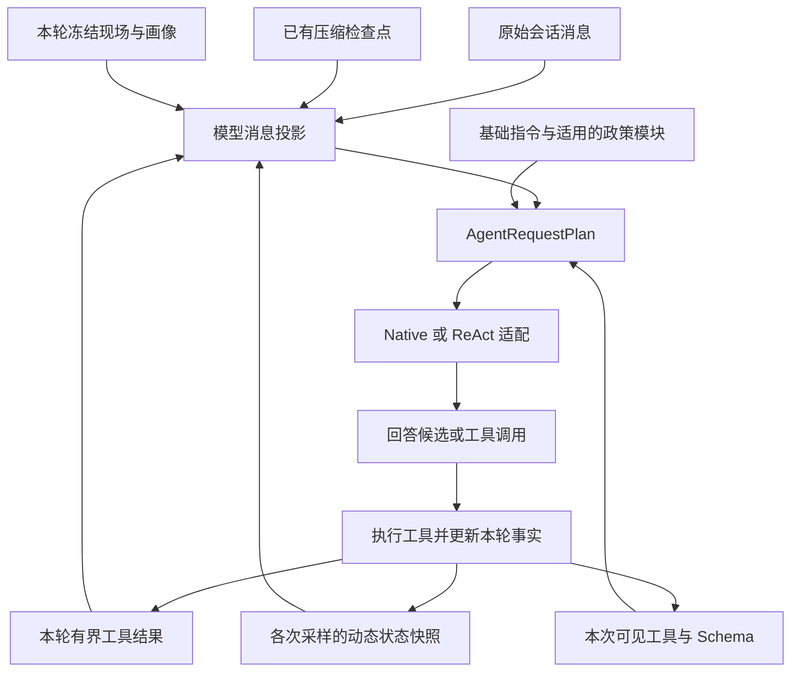

# 第 11 章 上下文组织与持续执行

上一章把一次阅读请求推进到了模型采样的边界。读者希望理解当前结论与前文概念的关系，并把要点保存下来；运行时已经确定可见工具，模型也已经提出读取原文的调用。现在，工具返回了正文。下一次采样应该看到什么？

把返回值追加到对话末尾，是最直接的做法。第一次读取时，它通常足够。随着任务继续，问题就出现了：前面读过的几段原文是否还要完整重发？读者画像会不会每次重复插入？工具已经发现，却尚未执行，历史里应该怎样表达？如果一轮任务持续很久，输入装不下时又应该保留什么？

本章沿同一项阅读任务回答这些问题。为观察历史增长，设读者在保存比较笔记之后继续追问：“前面这个定义还有哪些适用条件？结合刚才的解释接着讲。”这是延续既有场景的教学输入，具体模型可以选择不同的读取路径；第 10 章已经记录原句的动作识别边界，本章从合法工具调用已经进入执行路径的时刻继续。

我们需要同时处理两种延续：同一个 Run 内，模型依据刚取得的结果继续行动；下一个 Run 开始时，模型依据已有讨论继续理解用户要求。前者拥有本轮工具结果和证据账本，后者需要从历史恢复任务线索。它们共同使用请求投影，但拥有不同的信息生命周期。

## 11.1 下一次请求由哪些信息组成

先把“上下文”拆开。持久消息保存发生过的交互；本轮状态保存运行现在掌握的事实；模型请求则是程序为这一次采样组织的输入。三者相互关联，却没有完全相同的内容。

例如，读者画像在本轮开始时固定。后续采样需要参考它，但没有必要把同一份画像反复追加成新的聊天记录。又如，工具可能返回很长的原文，持久记录可以保留相应结果，模型这一轮实际接收的正文则受预算限制。理解这些区别，才能解释为什么请求中的消息数量不一定等于聊天历史中的消息数量。

[RunContext](../../../crates/runtime/src/run_context.rs) 持有 messages、模型运行配置、定位与证据账本、工具激活状态和活动结果账本。[build_sample_request](../../../crates/runtime/src/orchestrator.rs) 每次从这些状态重新形成工具暴露计划、指令模块和输入投影，然后构造上一章介绍的 AgentRequestPlan。对一次普通阅读请求，可以沿下面的关系看输入怎样汇合。



图中的“重新形成”不意味着每次都重新读取外部状态。冻结现场从本轮已接纳的输入取得，动态数据才按当前阶段更新。它也不意味着每次请求都从零丢弃历史：已有消息、历史回执和检查点会按规则进入同一个投影。

具体次序由 [messages_with_context_fragments](../../../crates/runtime/src/orchestrator.rs) 决定。它先应用已有检查点，再处理旧工具结果，随后覆盖本轮活动工具结果；没有检查点时单独插入冻结片段，最后放回各次采样的动态快照。其中相邻的两步是：

```rust
    messages = provider_history_projection(&messages, book);
    active_tool_results.project_messages(&mut messages);
```

次序表达了一个实际规则：已经结束的回合可以使用历史回执，当前 Run 的工具结果由当前活动账本决定。程序没有让一个历史结果仅凭出现在消息数组里，就重新获得“本轮刚读取”的身份。

接着，[AgentRequestPlan::from_messages](../../../crates/runtime/src/model_runtime.rs) 从首条 System 消息取出继承指令，按模型配置解析基础指令并接上政策模块，其余消息进入 input，可见工具进入 tools。它对组合后的消息与工具 Schema 估算输入量，并记录容量、输出预留与剩余空间。不同模型的协议要求在此后继续投影为真实请求。

因此，排查“模型为什么没有看到刚才的信息”，应先明确查看的是哪一层。聊天里有原文，只能说明它曾经进入相应记录；本次计划中的工具正文、回执和检查点，才说明这次采样实际使用了什么表达。

## 11.2 固定前缀、动态片段和当前工具结果

### 同一份现场怎样避免重复增长

假设解释任务需要连续读取三处原文。三次采样都需要知道读者背景，却不需要三份相同的画像。项目通过 [ContextFragmentLedger](../../../crates/runtime/src/context_fragment.rs) 为片段指定 key、revision、scope、role 和 sensitivity。相同 key 的新版本替换旧版本，首次插入顺序保留；相同版本和内容再次写入返回 Unchanged。

这里最有用的划分是生命周期。

| 片段范围 | 请求怎样使用它 | 本章场景中的意义 |
| --- | --- | --- |
| SessionStable | 进入稳定位置的片段投影 | 类型提供会话稳定信息的表达能力；具体是否使用仍看调用方 |
| TurnFrozen | 在本轮各次请求中重用同一份现场数据 | reader.profile_snapshot 在 Run 开始时构造，后续采样沿用 |
| Dynamic | 在具体采样位置形成状态快照 | 当前 Goal、教学状态、交付缺口与执行提示随决策更新 |

scope 是投影机制中的分类。冻结画像的实际行为还来自 Run 初始化：代码在进入循环前创建画像片段，此后重用。账本的 upsert 本身允许替换同 key 的内容，并没有把 TurnFrozen 实现成不可修改的内存对象。

固定位置的投影明确排除了 Dynamic。对应代码位于 [projected_messages](../../../crates/runtime/src/context_fragment.rs)：

```rust
        self.snapshot()
            .fragments
            .iter()
            .filter(|fragment| fragment.scope != FragmentScope::Dynamic)
            .map(ContextFragment::projected_message)
            .collect()
```

这让“读者是谁、提问时在哪里”与“当前还缺什么、现在处于哪一步”能够分别安排。前一类适合靠前并保持稳定；后一类需要靠近产生下一次决定的位置。

### 动态状态为什么追加在工具结果之后

一种容易实现的更新方式，是每次改写消息开头的“剩余步骤”和“当前状态”。但如果消息最前面不断变化，即使后面的大段历史完全相同，整个输入也不再保持相同前缀。更麻烦的是，回看某次决定时，很难判断模型当时看到的是旧状态还是新状态。

当前 [record_sampling](../../../crates/runtime/src/context_fragment.rs) 把一次决定需要的动态状态记录成 runtime_state_snapshot.v1，锚定在当时的原始消息数量上。提示明确说明最后一个状态快照具有当前权威，较早快照描述先前的决定。若动态片段原本是 User 角色的任务数据，它保留该角色；只有 System 角色的动态内容进入状态说明。

一次读取前后的逻辑顺序可以写成下面的教学示意。S1、S2 是运行时快照，A1、T1 分别是相配的工具调用与返回。

```text
第一次采样：基础指令 / 冻结片段 / 既有历史 / 当前问题 / S1
第二次采样：基础指令 / 冻结片段 / 既有历史 / 当前问题 / S1 / A1 / T1 / S2
```

S2 位于完整工具结果组之后。这样，模型在看到新状态时，也已经看到导致状态变化的调用与结果。旧快照保持原样，新快照表达当前情况。这里稳定的是相应消息片段；后面会看到，工具集变化和正文淘汰仍会改变整份请求。

压缩前缀之后，锚点还要能找到原位置。当前实现从保留下来的尾部反向定位，关键代码很短：

```rust
        let projected_count = messages.len();
        for (anchor, snapshot) in self.sampling_snapshots.iter().rev() {
            let insert_at = projected_count - (raw_message_count - anchor);
            messages.splice(insert_at..insert_at, snapshot.clone());
        }
```

这段 [project_sampling_snapshots](../../../crates/runtime/src/context_fragment.rs) 依赖一个重要前提：回合中压缩保留当前回合的完整后缀。压缩只缩短更早的前缀，锚点到尾部的距离就仍然成立。本轮用原始锚点 10、12 和压缩后四条消息的教学夹具重放，两个快照分别插入索引 2、5；这是局部投影结果，索引从 0 开始。

如果为了重算压缩后的请求，在同一个原始锚点再次构造计划，record_sampling 会复用这次决定的快照，避免重复插入。另一方面，若一个过早的终答被拒绝，下一次决定可能没有新增原始消息。retain_sampling_history 会清除“已记录本锚点”的标记，让真正的新决定获得新的状态。于是，“同一次计划重建”和“同一消息位置发生新决定”有了不同处理。

演示制作还有 sampling_guidance.v1：选中的阶段指导变化时才追加新选择，未变化时沿用；普通状态快照不会使已有指导失效。它与阶段设计数据分开，使来源于宿主的指导和模型生成的任务内容保留各自身份。具体演示阶段放到第 17 章分析。

### 原文返回后，模型究竟看见多少

现在让模型提出一次已经通过定位授权的读取。下面使用教学材料中的三个叶子 LID，说明真实调用路径的输入形状：

```json
{"lid":"1.1","end_lid":"1.3"}
```

Book 的执行入口先产生原始结果。循环随后调用 [ActiveToolResultLedger::project_result](../../../crates/runtime/src/tool_result.rs)，结合该工具的输出策略和本轮剩余正文空间形成 ToolResultDraft，再封装为 ToolResultEnvelope。模型接收到的对象包含 model_body、receipt、truncated、status，以及存在时的 continuation。

这里同时有单工具预算和全回合共享预算。当前 ACTIVE_TURN_TOOL_MODEL_BODY_BUDGET_BYTES 为 `48 * 1024`，计量对象是保留的 model_body 的 JSON 字节数。外围回执、调用参数、用户问题、状态快照和工具 Schema 各有自己的体积，整份请求还要经过活动上下文估算。

若 book.text 的结果超过允许长度，[project_text](../../../crates/runtime/src/tool_result.rs) 尝试沿原文叶子边界保留能放下的连续范围。例如，若只有 1.1—1.2 能容纳，正文只包含这段，evidence_arguments 也收窄为这段，continuation 指向尚未提供的 1.3。这个范围例子用于解释分支，不是本轮测得的具体书籍截断点。无法容纳一个完整叶子时，返回缩小范围的建议，并标明结果不完整。

执行循环用投影之后的正文接纳证据。决定这一点的真实调用是：

```rust
            observe_tool_evidence(
                &mut context.evidence_ledger,
                &tc.name,
                &projection.evidence_arguments,
                &model_body,
                book,
            );
```

这段代码位于 [工具结果处理](../../../crates/runtime/src/orchestrator.rs)。证据范围随模型实际接收的材料形成，原始大结果中被省略的内容不能仅因工具曾经计算过，就自动算作本轮已观察原文。于是，同一次调用的“执行得到多少”“展示给模型多少”和“接受为证据多少”可以分别追踪。

当前正文也不会永久驻留。一次成功采样返回之后，mark_projected_fresh_results_sampled 把已投影结果标记为 sampled。后续需要腾出空间时，[make_room_for](../../../crates/runtime/src/tool_result.rs) 只选择已经采样且仍保留正文的最早结果：

```rust
            let oldest = self
                .by_call_id
                .iter()
                .filter(|(_, result)| result.sampled && result.retain_model_body)
                .min_by_key(|(_, result)| result.sequence)
                .map(|(call_id, _)| call_id.clone());
```

本轮局部重放把 A、B 两份 model_body 的序列化大小各设为 20 KiB，合计 40 KiB，剩余 8 KiB。随后需要放入 20 KiB 的 C：

| 所处时刻 | 对 A、B 的处理 | 可用正文空间 |
| --- | --- | ---: |
| A、B 尚未进入下一次采样 | 不能淘汰它们；新结果需按剩余空间投影 | 8 KiB |
| A、B 已经采样，准备接纳 C | A 最早，先取消其正文保留 | 28 KiB |
| C 接纳完成 | 保留 B、C，A 在模型投影中只留下回执等元数据 | 8 KiB |

被淘汰结果的 model_body 变成 null。原始消息没有因此被改写，本轮证据账本也没有被清空。sampled 表示结果已经随请求进入一次成功返回的模型采样，并不测量模型是否真正理解了这段文字。程序在这里保证的是交付机会与空间次序。

## 11.3 历史回执怎样支持继续阅读

比较笔记保存后，读者追问定义的适用条件。新 Run 拥有新的冻结现场和本轮账本。此前的完整正文如果每次都原样携带，后续问题的输入会不断增长；如果全部删除，模型又会不知道已经讨论到哪里。

[provider_history_projection](../../../crates/runtime/src/orchestrator.rs) 选择最后一条 User 消息之前的历史部分，通过 history_projection_through 把旧 Tool 正文转换为 HistoricalToolReceipt，同时收窄旧工具调用的定位参数。调用 ID、结果的 tool_call_id 与角色仍然对应，所以“某次读取得到了某种结果”保留在协议结构中。

一个历史回执主要回答四个问题：调用了哪个工具，使用什么定位参数，返回成功还是错误，以及哪些证据范围或来源引用曾被接纳。它还保存结果摘要标识，用于关联原结果。这个标识不包含原文，也不能据此还原原文。

| 表达 | 后续模型能从中获得什么 | 下一步常见需要 |
| --- | --- | --- |
| 当前 model_body | 实际提供的文字、结构或状态 | 材料足够时继续解释 |
| HistoricalToolReceipt | 过去发生的调用、状态、定位与受限证据线索 | 需要具体措辞或条件时按位置补读 |
| CompactionCheckpoint | 跨多条历史整理的目标、进展、约束和待办 | 依据交接状态继续工作，必要时重新取得材料 |

回执的 accepted_evidence 由运行时按工具类型推导。当前实现对 book.search_text 的历史回执不恢复 accepted_evidence；字面出现定位与可直接用于解释的正文仍按不同合同处理。错误回执也不会获得成功结果的证据范围。不能把任意带 LID 的旧记录一概当作当前已读内容。

回到追问。假设上轮记录表明曾经读取 1.1—1.3，解释过定义与结论的关系，并保存了笔记。模型可以据此保持讨论方向，不必重新执行保存动作。但要回答“定义的适用条件”，若现有输入只剩回执，就应围绕已知位置取得相关原文。定位线索仍要通过本轮的定位来源规则；正文读回后，再进入本轮证据账本和来源绑定路径。

这也解释了为什么“按需回读”需要有用的定位信息。只留下“之前讨论过一个概念”会迫使模型重新广搜；保留工具名、位置和结果状态，可以把新的读取限定在真正缺失的细节上。省下的输入空间与新增的一次工具调用形成取舍，适合用后续实际任务的用量与正确率判断。

工具发现记录另有生命周期。[tool_exposure::redact_history](../../../crates/runtime/src/tool_exposure.rs) 将旧发现改成 tool_search_history.v1，标明 activation_status 为 expired_after_prior_run。当前 Run 的能力激活集重新建立，上一轮“发现过”只能作为线索。这与旧原文退为回执遵守同一原则：历史说明发生过什么，本轮能做什么和已观察什么由本轮状态决定。

ProviderContinuation 则属于另一种历史信息。它随 Assistant 消息保存，服务原模型协议续接；[assistant_source_content](../../../crates/runtime/src/compaction.rs) 提供给压缩器的是公开文本及工具调用，没有把私有续接内容加入摘要素材。模型切换或旧记录缺少必要续接字段时，[project_legacy_deepseek_history](../../../crates/runtime/src/model_runtime.rs) 将相应旧 Assistant/Tool 前缀投影为带角色标签的历史上下文。协议续接、任务交接和原文证据由此保持各自边界。

## 11.4 活动上下文预算、压缩与检查点

### 累计很多，为什么当前请求仍然装得下

第 9 章已经区分单次输入与累计用量。这里把判断落到请求计划。设模型配置中的窗口为 W，输出预留为 O，安全余量为 S，本次估计输入为 I，高水位比例为 r。当前 [ActiveContextBudget::from_plan](../../../crates/runtime/src/auto_compaction.rs) 对应以下关系：

```text
预留 R = O + S
压力 P = I + R
高水位 H = floor(W × r)
压缩输入目标 T = max(H - R, 0)
物理容量判断：I ≤ W - R
尝试压缩条件：P ≥ H
```

其中“物理容量”也是依据本地估算和配置得出的判断。实际代码使用饱和加减，并把比例限制在 0—1。高水位与输出、安全空间相接的部分是：

```rust
        let ratio = profile.compaction.high_watermark_ratio.clamp(0.0, 1.0);
        let high_watermark_tokens =
            ((profile.context_window_tokens as f64) * f64::from(ratio)).floor() as u32;
        let target_input_tokens = high_watermark_tokens.saturating_sub(reserved_tokens);
```

采用当前默认回退档案作教学算例：W=128,000、O=8,000、S=4,000、r=0.75。因此 R=12,000，H=96,000，T=84,000，能容纳的估计输入上限为 116,000。这些值来自项目的默认应用配置，不表示本书独立核实了某个厂商模型的规格。

| 估计输入 I | 压力 P | 是否达到高水位 | 是否仍满足容量判断 | 运行需要作出的判断 |
| ---: | ---: | --- | --- | --- |
| 78,000 | 90,000 | 否 | 是 | 正常继续 |
| 90,000 | 102,000 | 是 | 是 | 查找可压缩历史，提前释放空间 |
| 117,000 | 129,000 | 是 | 否 | 需要成功缩小请求，否则停止 |

三行已经使用实际预算方法局部重放。它们说明“应开始整理上下文”与“当前已无法容纳”是两个判断。第二行如果没有可压缩历史，代码仍允许继续；第三行则必须解决容量问题。

输入量本身来自 [estimate_request_tokens](../../../crates/runtime/src/model_runtime.rs)：序列化消息与工具 Schema，分别交给 estimate_text_tokens，再相加。当前启发式对码点不小于 0x2e80 的字符计 1，其余计 0.25，最后向上取整。局部重放中 `AB中` 得到估计值 2。实际请求还包含 JSON 字段和消息结构，因此不能只对读者问题数汉字来代替整个请求估算。

### 哪一段可以交给压缩器

压缩发生在两个时刻。进入新回合之前，程序先把新问题加入计划副本，测量将要发送的完整输入，但压缩素材仍来自旧历史；决定不需要压缩或成功安装检查点之后，才向运行时消息数组追加新问题。Server 对用户请求的接纳另有自己的记录，不能把这一步理解为用户此刻才发出问题。

回合中，则在下一次采样之前检查活动压力。此时 [prepare_compaction](../../../crates/runtime/src/compaction.rs) 保留当前整个用户回合，只选择更早、完整的回合。完整性要求工具调用与结果正确配对，并存在无工具调用的 Assistant 收尾；较早的单条 User 回合在后续 User 出现后也可以成为素材，但不会因此被认定已经回答。

为什么保留整个当前回合？因为这轮问题、刚取得的材料和正在执行的工具共同决定下一步。任意截掉一条 Tool 返回，可能留下无结果的调用；只留下工具结果，又可能失去调用依据。当前实现用完整回合边界控制切分，再由本轮工具正文预算解决其中一部分体积问题。

因此，压缩有自己的输入准备步骤。prepare_history_compaction 对可能进入压缩的全部工具结果生成确定性回执，再由 prepare_compaction 选择合法窗口。它不能直接拿普通 Provider 历史投影替代：新问题还没追加时，普通投影有意保留最后一轮的新鲜正文，而这轮已经完成的历史恰好可能是压缩素材。

### 让模型生成交接状态，让程序保存运行事实

“把上文总结一下”无法表达这里的完整要求。用户的保存动作尚未发生时，摘要不能顺手写成已完成；一段引用属于哪个历史来源，也必须保留关联。因此压缩器接收 CompactionRequest，素材带有 source_item_id，并区分必须表示和允许按限定理由省略的来源，还列出可用的证据引用与替代关系。

模型只生成 CompactionDraft 的十个分区：目标、进展、决策、用户约束、未完成义务、未解决歧义、关键事实、关键例子、下一步，以及 source_coverage。前九类条目都使用同一个短结构：

```rust
pub struct SourcedCheckpointItem {
    pub item_id: String,
    pub text: String,
    pub source_item_ids: Vec<String>,
    pub evidence_refs: Vec<EvidenceRef>,
}
```

这个 [SourcedCheckpointItem](../../../crates/runtime/src/compaction.rs) 将“摘要说了什么”与“它依据哪些历史条目”连接起来。source_coverage 再从输入一侧说明每个来源去了哪里。程序验证来源集合完整、目标条目存在、链接确实包含对应来源；证据引用必须在允许集合中，Superseded 还要有运行时提供的替代关系，必须保留的来源不能标成 NonTask。

随后运行时组装 CompactionCheckpoint，把窗口身份、历史版本、原样保留项、工具回执、效果引用和上下文版本放进最终对象。这些运行元数据来自准备阶段，模型没有获得改写它们的入口。检查点是派生的交接材料，当前规范指令和其后的原始内容具有更高的解释优先级。

若压缩输入本身过大，[generate_draft](../../../crates/runtime/src/compaction.rs) 按完整回合分块生成子草稿，再合并并展开回原来源编号。单个完整回合已经超过生成器限额时，返回 COMPACTION_SOURCE_TURN_TOO_LARGE；合并输入仍过大则返回 COMPACTION_HIERARCHICAL_MERGE_TOO_LARGE。当前实现有这一层分块和合并，不会无限递归地把材料切细。

### 生成成功还不等于可以安装

压缩路径需要依次回答三个问题：草稿是否合约有效，替换后是否真正缩小，以及检查点是否成功保存。下图概括当前顺序。


[call_generator](../../../crates/runtime/src/compaction.rs) 对结构或来源校验失败保留一次修复：维持原有 system 和素材前缀，在 user 输入尾部追加诊断，要求重新生成完整草稿。诊断加入后也要满足生成器输入限额。第二次仍失败就返回错误，没有把错误草稿静默改成合法对象。

[compact_with_adapter](../../../crates/runtime/src/compaction.rs) 还会比较确定性历史与检查点投影的估计大小。替换结果必须更小，并达到配置的目标；否则分别返回 COMPACTION_INSUFFICIENT_REDUCTION 或 COMPACTION_TARGET_NOT_REACHED。这一步计算的是该压缩投影，完整运行计划还包含冻结片段、动态快照和工具 Schema，因此安装后仍要重新检查整份请求。

安装的最后边界在 [maybe_auto_compact](../../../crates/runtime/src/orchestrator.rs)：它先对消息副本进行持久化准备，只有 sink.install 成功，才把准备后的消息同步回活动数组并切换 active_checkpoint。没有可压缩材料、生成失败或安装失败，都不会把这次预处理提前提交到活动消息。

[RunCheckpointSink](../../../crates/server/src/agent_run.rs) 把安装连接到对应用户与聊天的保存入口。这里的检查点恢复的是模型历史的表达，不重新执行笔记或阅读动作。会话事件如何保存、重启后如何重建，在第 16 章继续展开。

本轮用脚本化草稿驱动实际压缩模块重放：旧用户消息和旧回答进入 eligible_items，当前问题及未完成调用原样保留；成功投影顺序为“基础指令 → 冻结片段 → 检查点 → 当前问题 → 未完成调用”，原始历史字节不变。修改被覆盖的旧来源后再使用同一个检查点，被版本与来源校验拒绝。遗漏覆盖项后给出有效草稿，恰好两次生成即可修复；连续两份无效草稿则失败并保留原历史。

这些结果验证了交接结构和失败处理，实际模型的摘要质量另有边界，集中在章末说明。

## 11.5 缓存复用、累计用量与进展停止

### 输入更短与前缀更稳定，有时需要取舍

动态快照采用追加方式，使计数和状态更新不必改写前面的消息。这项选择的背景见[调用成本与 DeepSeek 适配记录](../../计划-调用成本与DeepSeek适配.md)：项目保留每次决策前的最新状态，同时希望维持已有消息前缀。当前 ContextFragmentLedger 已实现这一组织方式。

但让旧正文退为回执，会改变旧 Tool 消息；工具发现会改变 tools，历史压缩会更换大段输入，演示保存后的源码投影也可能缩短旧调用参数。它们释放空间或减少重发内容，却可能缩短可重复的前缀。只比较“本次输入比上次少了多少字节”，无法判定实际成本是否下降。

当前有两类观测可以配合使用。[AgentRequestAudit](../../../crates/runtime/src/agent_request_audit.rs) 记录协议无关计划的消息、工具体积和估计输入；[RequestTracker::observe](../../../crates/runtime/src/request_diagnostics.rs) 则比较同一 Run、同一调用用途下最终 Provider JSON 的前后变化。后者分别记录不变消息前缀、首个变化字段、工具变化和设置变化。

messages_append_only 只说明消息数组保持前缀且有所追加。即使它为 true，也要继续看 tools_changed 和 settings_changed。实际缓存量来自 [model_usage](../../../crates/runtime/src/provider_stream.rs) 解析的 Provider usage，缺失字段保留为未知。

项目已经有一份能说明这种取舍的历史观测。[2026-10-03 Linux 缓存观测报告](../../修复记录-Linux缓存观测.md) 记录了一次基于技术书选区生成富文本演示的任务，模型为 deepseek-v4-flash，共 18 次主问答模型调用，没有摘要压缩调用。报告给出的统计为：

| 历史记录中的指标 | 数值 |
| --- | ---: |
| 累计输入 | 1,277,397 token |
| 缓存输入 | 925,568 token |
| 未命中输入 | 351,829 token |
| 累计输入缓存命中率 | 72.4573% |
| 输出 | 80,335 token |

命中率按 `925568 / 1277397` 计算。不能对 18 个单次百分比简单求平均，因为每次输入规模不同。报告还指出，第 12、13、17 次合计贡献 247,443 个未命中 token，占未命中总量约 70.33%；第 13、17 次首先变化的是旧 Tool 正文，与 48 KiB 正文预算的淘汰路径对应。

报告同时记录了当时压缩预检查会提前清理活动消息的问题。当前 maybe_auto_compact 已改为先准备副本、安装成功后提交。历史中的故障帮助解释这条边界的必要性，不能据旧报告断言当前仍沿用相同错误路径。

这些数字来自既有真实任务报告，本章只回读报告并核对所引用数字的算术，没有重新发起演示任务或核对远端账单。它们支持的判断是：少数较早消息变化可能与大量未命中同时出现，诊断需要观察具体请求。它们不构成“所有任务都会达到这一缓存率”的预测，也没有隔离出服务端缓存策略的因果作用。

### 成本记录怎样与容量判断分开

设两个教学请求分别输入 1,000、9,000 token，缓存量为 900、4,500。单次命中率分别为 90% 和 50%，平均值是 70%；整项任务的缓存输入却是 5,400，总输入 10,000，正确的合计命中率为 54%。同样，即使累计输入达到几十万，也不能据此断言某一次请求超过窗口。

当前普通 Resident 的停止条件没有继续使用累计 usage 作为活动容量。OuterConfig 仍保留名为 token_budget 的旧配置字段，默认值为 120,000，但其注释和循环行为已经明确把累计用量留作遥测。默认 max_turns 为 None；显式有限调用和专用实验仍有各自边界。[ADR-0150](../../adr/0150-resident-unbounded-tool-loop-and-progress-stops.md) 记录了这一修订及多人服务累计限额的后续移除。

用量字段之间也需要避免重复相加。reasoning_output_tokens 在当前合同中属于 output_tokens 的子集；缓存输入属于总输入的子集。Provider 的流式 usage 若是累计快照，同一次调用后来的快照替换前一个。请求估计值、提供方报告的 token 数和实际货币账单是不同口径，解释成本时应保留各自来源。

### 空间足够，也可能应该停止

回到阅读任务。读取前文得到新的证据，形成来源，保存笔记，都是可以改变下一步的事实。如果模型不断重复读取相同范围，或者只改变参数顺序，输入仍然装得下，也没有理由一直执行。

[tool_progress_signature](../../../crates/runtime/src/orchestrator.rs) 组合当前证据范围、来源绑定、定位信息、能力激活、已完成能力、阅读现场、私人状态版本及效果等事实。ToolCallProgressGuard 把规范化后的工具参数与进展状态共同用于重复判断；因此相同调用在事实已经变化后，可以获得新的判断依据。

ProgressPhaseGuard 进一步观察整个批次前后是否有变化。当前连续无进展批次限额为 2；参数不断变化而事实不变，仍会累计停滞。定位失败可保留一次合法恢复机会，真正的状态变化重置停滞及恢复标记。本轮对这一状态机局部重放，确认第一次停滞不阻断、第二次阻断、恢复机会只可用一次，新进展使计数重新开始。

文字终答也参与这条判断。若任务还缺所要求的页面或阅读动作，只有“已经完成”的话语不会结束目标；没有新事实的终答会计入无进展。连续停滞后，工具循环进入禁用工具的收尾采样，解释已经完成的部分和实际停止原因，结果保留 incomplete 与 AGENT_NO_PROGRESS。容量不足、压缩失败、取消和显式轮数触顶各有自己的路径。

对这个设计，可以作如下分析：用采样次数控制运行很容易，却会把长而有效的任务与短而空转的任务混在一起；用实际状态变化判断进展更接近任务，但需要维护领域事实。当前进展信号仍然是一组程序可观察的代理量。它允许系统判断是否有新材料或效果，任务是否充分回答、笔记是否写得准确，还需要交付与质量判断。

## 已知边界与本轮验证

本章于 2026-10-07 回读当前实现，HEAD 为 `4e0b68e`。第 10 章保留其 `5e10516` 加当时工作区的依据；本章没有以新提交号替代前章核对，也没有修改产品代码。

当前边界集中在以下几处。

- **48 KiB 只约束活动工具正文。** 回执、用户与 Assistant 文本、调用参数、动态快照和 Schema 仍会增长。回合中语义压缩保留整个当前回合，因此一个很长的单 Run 可以在没有新的可压缩旧回合时耗尽容量。默认不限轮数与无限上下文并不等价。
- **检查点的来源结构校验不判断句子真假。** 本轮夹具没有发生任何写入，把草稿文本改成“笔记已经保存”，只要来源编号、覆盖和大小满足合同，实际模块仍接受它。prepare_compaction 当前把 required_semantic_states 初始化为空；强制某来源仍属未完成义务或歧义的入口 require_open_for_test 只用于测试。因此，不能从该项测试推断生产路径已经自动识别所有未完成事项。现有提示要求保持这些语义，但真实摘要质量仍依赖生成模型。
- **输入 token 是启发式估计。** 字符权重和协议无关 JSON 不等于每个 Provider 的实际分词与封装；图像等输入还走专门补充路径。预算计算用于本地决策，不能把估计 fits 写成服务端必然接受。正文算例限定于文本和相应配置。
- **缓存观测说明客户端输入变化与报告用量。** JSON 字节前缀不是模型的 token 前缀，旧消息变化也不能单独证明服务端为何未命中。历史 18 次调用的统计没有在本轮重新测量。
- **压缩与继续执行各有有限条件。** 单回合过大、分层合并仍过大、修复失败、不能达到缩减目标或安装失败，都有真实失败出口。当前代码没有实现无条件远程续接或无限层级压缩；ADR 中未来可替换生成器的方向保持为设计余地。

本轮实际执行了 20 组离线局部重放。context_fragment、model_runtime 和 compaction 使用当前文件中测试模块之前的实现；预算与工具结果账本、进展判断采用当前方法，驱动只补充必要类型及脚本化返回。没有调用真实模型，没有运行完整 Runtime、Server 或产品测试套件。

| 重放范围 | 组数 | 实际观察 |
| --- | ---: | --- |
| 片段更新、快照重建、前缀、压缩后锚点与指导角色 | 5 | 最新版本唯一；相同计划不重复；快照保留次序与数据角色 |
| 新鲜正文保护及已采样正文淘汰 | 2 | 未采样结果保留；最早已采样结果退为 null，原消息不变 |
| 三种活动预算与字符估计 | 4 | 90,000／102,000／129,000 的压力判断及 `AB中` 估计一致 |
| 压缩素材、投影、来源失效、一次修复与语义边界 | 8 | 当前后缀保留；错误覆盖与伪造证据被拒绝；结构合法不证明语义真实 |
| 连续停滞、恢复机会及新进展 | 1 | 两次停滞触发阻断，实际变化重置 |

现有 provider_history_projection_preserves_native_and_react_tool_pairing、tool_result_projection_active_fresh_bodies_share_one_turn_budget、compaction_checkpoint_install_projects_fixed_order_without_mutating_history、auto_compaction_precheck_redaction_is_committed_only_after_install、auto_compaction_ignores_cumulative_usage_when_active_request_fits 等用例，本轮阅读了正文来确认覆盖范围，没有重新执行这些产品用例。图表、摘录、链接与算例的书稿检查另记于 [SOURCES](../SOURCES.md#第-11-章续写验证记录)。

## 源码选读

| 顺序 | 实现入口 | 带着什么问题读 |
| --- | --- | --- |
| 1 | [orchestrator.rs](../../../crates/runtime/src/orchestrator.rs)：build_sample_request、messages_with_context_fragments | 下一次采样的输入怎样从历史、本轮状态与工具能力汇合 |
| 2 | [context_fragment.rs](../../../crates/runtime/src/context_fragment.rs)：record_sampling、retain_sampling_history、project_sampling_snapshots | 为什么状态更新不必重写消息前缀，压缩后怎样找回锚点 |
| 3 | [tool_result.rs](../../../crates/runtime/src/tool_result.rs)：project_text、ActiveToolResultLedger | 读取结果怎样缩小、继续，以及何时退为回执 |
| 4 | [model_runtime.rs](../../../crates/runtime/src/model_runtime.rs) 与 [auto_compaction.rs](../../../crates/runtime/src/auto_compaction.rs) | 估计输入、输出预留、高水位和实际容量怎样分开 |
| 5 | [compaction.rs](../../../crates/runtime/src/compaction.rs)：prepare_compaction、call_generator、compact_with_adapter、project_compaction_checkpoint_messages | 哪些消息可压缩，谁拥有来源与运行元数据，失败时保留什么 |
| 6 | [request_diagnostics.rs](../../../crates/runtime/src/request_diagnostics.rs) 与 [provider_stream.rs](../../../crates/runtime/src/provider_stream.rs) | 输入变化与实际用量各自能说明什么 |
| 7 | [ADR-0091](../../adr/0091-model-aware-agent-request-tool-exposure-and-active-context-budget.md)、[ADR-0150](../../adr/0150-resident-unbounded-tool-loop-and-progress-stops.md) | 为什么从累计用量、固定轮数转向活动请求与实际进展 |

## 思考与面试表达

介绍本章机制时，可以从一次工具返回说起：

Understand Book 为每次采样构造独立请求计划。稳定指令和本轮冻结现场靠前，动态状态按决定追加，本轮工具结果先提供有界正文，已采样结果可在预算压力下退为回执。更早的完整回合通过来源关联检查点整理，当前问题和调用后缀保留。程序对整份请求检查容量，以实际进展决定是否继续，同时单独记录累计用量和缓存情况。

下面的追问分别改变这条链路中的一个条件。

1. **工具返回了三节正文，为什么本轮证据可能只有前两节？**

   执行结果经过模型正文预算投影，证据接纳使用投影后的 model_body 和 evidence_arguments。后续范围由 continuation 表达。应查看模型实际收到的正文和证据账本，不能直接拿原始返回长度推断观察范围。

2. **把动态状态放在末尾，是否就保证了缓存命中？**

   这种组织保持了该部分历史前缀，但旧正文淘汰、工具定义和请求设置仍可能变化。先看最终请求诊断，再看 Provider 报告的缓存输入；两者结合才能解释这次调用，字节前缀不能代替服务端缓存指标。

3. **输入达到高水位，为什么还能继续采样？**

   高水位是提前整理的阈值。默认回退算例中，90,000 输入加 12,000 预留超过 96,000 高水位，仍小于 128,000 窗口。当前代码在无可压缩材料且仍满足容量判断时允许继续，真正装不下则返回容量错误。

4. **压缩失败时，能否先删掉最早一半消息继续？**

   当前合同需要保留用户任务、来源关联和工具配对，直接删除会绕过这些条件。实现先验证草稿和缩减结果，再安装检查点；失败保留原活动历史并报告原因。若要改变这一策略，需要重新说明哪些信息可以丢弃，以及如何保证任务仍可继续。

5. **每个来源都被覆盖，是否说明摘要没有遗漏任务？**

   覆盖说明来源在结构上有去向。文本可以把“待保存”错误写成“已保存”，仍引用同一个来源。本章局部重放验证了这个边界。应将结构验证、未完成状态建模和模型摘要质量分开，实际动作仍以权威写入结果为准。

6. **默认没有轮数上限，怎样避免一直循环？**

   容量通过活动请求预算和压缩处理，重复与停滞通过本轮事实判断。当前连续两批没有进展会触发停止，定位问题保留一次恢复机会；新的证据或效果使停滞重置。用户取消、压缩失败和不可恢复错误也会结束运行。模型说“继续处理”本身不构成进展。

接下来进入[第 12 章](12-来源与流式交付.md)。上下文组织使模型能够继续推理和执行，但生成中的文字还需要经过草稿展示、来源绑定、公开内容编译和最终接纳，才能成为读者实际得到的回答。
