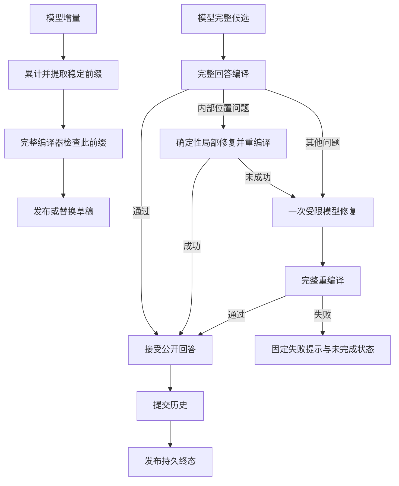
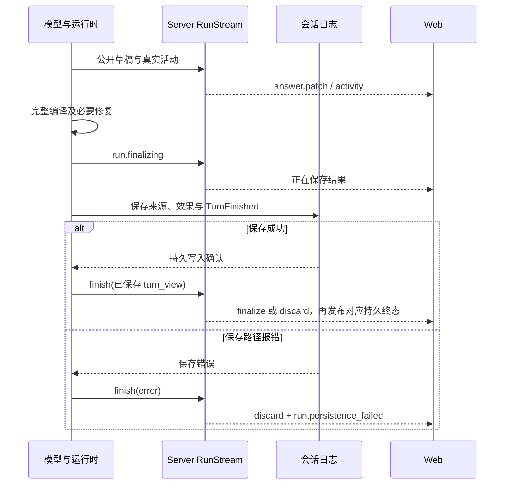

# 第 12 章 来源与流式交付

第 11 章把阅读任务推进到了下一次模型请求。读者继续追问：“前面这个定义还有哪些适用条件？结合刚才的解释接着讲。”运行时已经组织好历史和本轮材料，模型也已经读到相关原文。现在，第一段文字开始返回。

如果等整轮结束再显示，读者可能长时间只能看到“正在运行”。把每个模型片段立即贴到聊天区，又会遇到另一组问题：半个来源标记还不能点击，刚出现的解释可能只是下一次工具调用的前言，模型生成结束时历史也可能尚未保存。一个界面上已经完整显示的答案，重新打开聊天后却不存在，会破坏读者对交付结果的判断。

本章继续沿这次追问，回答一个具体问题：怎样在缩短等待的同时，让最终回答和来源保持一致？需要分清的不是“流式”和“非流式”两个开关，而是模型输出、公开草稿、来源绑定、观察恢复和持久接纳几条相接的边界。

## 12.1 模型流、运行活动与回答草稿

### 一次返回，同时产生两类可见信息

模型还在生成时，读者关心的不只有答案，也关心系统是否在工作。例如，运行正在读取一段原文，随后进入综合请求，再整理来源。这里的活动必须来自实际执行，而不能从模型说出的“我正在查询”推断。

当前实现将运行活动和回答草稿分开。[RunActivity](../../../crates/runtime/src/run_events.rs) 保存步骤身份、父步骤、工具或模型用途、开始时间、结果状态及用量；[AnswerPatch](../../../crates/runtime/src/answer_stream.rs) 保存某一版公开草稿的更新。模型等待属于 activity，读者看到的解释属于 draft。后者仍然可以替换或撤回。

| 运行中的对象 | 产生位置 | 它说明什么 | 后续消费者 |
| --- | --- | --- | --- |
| ModelDelta | Provider 响应解析 | 文本片段、工具参数、usage 或完成信号已经到达 | 观测适配器与相应投影器 |
| RunActivity | 模型和工具的真实执行点 | 某一步开始、成功、无结果、被拒绝、失败或取消 | 活动界面与运行摘要 |
| AnswerPatch | 公开回答投影 | 某个回答版本现在可以展示哪些内容 | Server 草稿快照与 Web 状态 |
| AgentAnswerView | 完整编译及交付路径 | Markdown、来源按钮和其他交付片段的确定结构 | 最终回答与持久历史投影 |

[ObservedAdapter](../../../crates/runtime/src/run_events.rs) 包住已有模型适配器，为请求生成活动，并记录首个非空文本片段和最近一次 usage。最终线协议请求通过 ModelDelta::Request 进入内存中的请求诊断，随后被截住；它不会被当成公开回答向下传递。Provider 的推理续接字段在流解析中另行组装，也没有变成 Text 事件。

第 10 章介绍过 Native 与 ReAct 的协议差异。这里两者继续共享观察边界：Native 的 content 可以直接成为候选正文；ReAct 或其他结构化输出则要从 JSON 中提取顶层 answer/final 字段。工具参数中恰好出现一个名叫 answer 的字段，不构成公开答案。

### 先收齐协议事实，再谈工具执行

[provider_stream::read_sse](../../../crates/runtime/src/provider_stream.rs) 把 Provider 的 SSE 数据帧组装成一次响应：正文累计进入 text，工具调用按 index 合并 id、name 和 arguments，usage 作为累计快照逐次发出。解析器要求正常完成理由；流截断、只有 DONE 而没有 finish reason、length 等未完成理由，以及完成后继续出现正文或工具内容，都有错误出口。

工具参数可以跨多个帧。例如先得到 `{`，后来才得到 `"lid":"1.1"}`。此时 ToolArguments 事件携带的是目前累计的字符串，观察者不会据半份参数启动 book.text。完整响应返回后，仍由第 10 章的统一分派路径处理调用与参数。

公开投影器对这两种输出采取不同动作。它的观察入口很短：

```rust
        match delta {
            ModelDelta::Text(text) => self.push(&text),
            ModelDelta::ToolArguments { .. } => self.discard(),
            _ => {}
        }
```

这段摘录来自 [AnswerProjector::observe](../../../crates/runtime/src/answer_stream.rs)。文字可以尝试成为草稿；工具参数一出现，就撤回这一候选回答。外层循环在完整返回带有工具调用或 Provider 出错时，也会调用 discard。于是，“我先比较两段原文。”即使曾经显示过，也不会因为它是一个完整句子而变成最终交付。

### 稳定边界解决的是片段问题

AnswerProjector 保留累计 raw，而不是分别检查每个片段。对于结构化输出，answer_field_prefix 解码顶层字符串的已到达前缀，并暂存尚未完整的转义；随后 stable_end 寻找适合公开的结尾。

当前稳定边界规则跟踪括号数量和反引号状态。中文句末标点及换行可以形成边界；英文句末标点还需要后面出现空白。处于未闭合括号或反引号之内时，程序继续等待。因此一个被拆成 `[[sou` 和 `rce:...]]` 的标记，不会因为某一个网络分片恰好结束就被认作完整来源。

找到稳定前缀之后，运行时把它交给与终答相同的编译器：

```rust
pub(crate) fn compile_answer_preview(
    raw: &str,
    bindings: &[SourceBinding],
    provenance: &AnswerProvenanceLedger,
) -> Option<AgentAnswerView> {
    compile_agent_answer(raw, bindings, provenance)
        .ok()
        .map(|answer| answer.view)
}
```

[compile_answer_preview](../../../crates/runtime/src/orchestrator.rs) 没有另设一套宽松的来源规则。前缀编译通过才发布；未通过时继续保留之前的合法草稿，等待后续片段或完整交付处理。

“稳定”在这里表示当前可以展示，并不表示后续绝不会改动。一个只有 Markdown、没有来源的旧视图，如果恰好是新视图的前缀，投影器可以只发送 append。涉及来源或其他结构变化时，它发送完整 replace。这样既减少普通连续文字的重复传输，也保留了重排公开视图的能力。

### 首字、首个草稿与完整结果，是三个时刻

项目分别记录 model_first_text_ms 和 answer_first_patch_ms。前者相对某次模型活动开始，后者相对 Run 开始，而且只在 patch 含有 view 时记录。一个 Run 可能先查询、再综合、再收尾，所以不能直接把这两个数相减解释为“展示编译耗时”。

用一组明确的教学时刻说明差异。假定 Run 从 0 秒开始，收尾模型请求在 1.0 秒开始，1.8 秒到达第一个非空文本片段，2.3 秒第一次发布草稿，8.0 秒生成结束，8.2 秒保存并发布终态。则这次请求的首文本等待为 0.8 秒，Run 的首草稿等待为 2.3 秒；相对于 8.2 秒才显示内容，首个可读结果提前了 5.9 秒。

这组时刻没有来自模型实测。它说明流式交付改善的是可读进展到达时间，而最终接纳仍然保留完整编译与保存阶段。实际测量还需要对齐同一次 Run、同一个模型步骤及其用途。

## 12.2 已观察证据怎样成为来源绑定

### 从读过的文字申请来源身份

现在回到读者要求解释的“适用条件”。为了看清数据流，设本轮已经通过合法读取观察到一段教学原文：

> 条件 A 限定了这个结论的适用范围。

模型准备把它放在解释后面，调用 source.present：

```json
{"quote":"条件 A 限定了这个结论的适用范围。"}
```

输入是连续引文。当前 [TurnEvidenceLedger::prepare_present](../../../crates/runtime/src/orchestrator.rs) 在本轮已观察区间中调用 Book::match_source_quote，得到精确证据范围，再调用 resolve_source。这个顺序避免模型自行选择一个看似可信的位置。

```rust
            1 => {
                let (evidence, _) = matches.pop().expect("one match");
                let resolved = book.resolve_source(&evidence, SOURCE_PRESENTATION_LOCALE, None)?;
                Ok((evidence, resolved))
            }
```

这一分支只处理唯一匹配。零个匹配返回 SOURCE_NOT_OBSERVED；多个匹配返回 SOURCE_AMBIGUOUS，并给出有界的已观察上下文，要求扩大引文以消除歧义。Book 的匹配先尝试精确文本；仅在没有精确匹配且引文含公式分隔符时，尝试限定的公式边界空白归一化。范围如何使用 UTF-16 单位，沿用第 4 章的原文定位约定。

第 9 章已经解释证据从哪里进入账本。本章需要保留的关键前提是：当前问题中的已验证选区、真正接纳的工具证据，与只包含位置的导航状态有不同资格。历史上读过某段文字，也不会自动把它变成这一次 Run 已观察的原文。

### 内部绑定与公开标签各保存什么

present_prepared 对同一证据范围复用已生成的引用；新范围则生成 source_ref_id，保存 SourceBinding，并根据当前集合处理标签歧义。实际引用 ID 是程序生成的 opaque 值，用户不需要解释它的字面含义。

内部绑定连接了三个方向：book_id 确定所属书，evidence_range 和 evidence_text_digest 用于重新核对原文，label_snapshot 与 preview_snapshot 用于保留当时的可读指代。工具返回给模型的结果只需要 source_ref_id、label 和 preview。内容摘要用于判断重新解析出的证据是否仍与历史绑定一致。

下面把 ID 简写为 source_ref_demo，并把标签设为“段落 · 适用条件”。这是本章重放使用的人工绑定，便于观察编译结果；实际项目中的 ID 和标签由已解析原文产生。

```json
{
  "source_ref_id": "source_ref_demo",
  "label": "段落 · 适用条件",
  "preview": "条件 A 限定了这个结论的适用范围。"
}
```

模型随后可以写出：

```text
条件 A 限定了结论的适用范围。[[source:source_ref_demo]]
```

这段候选还没有成为界面上的按钮。编译器会核对 ID 是否属于提供给本次编译的绑定，拆出正文与来源片段，并只保留回答实际使用的来源。

```json
{
  "parts": [
    {"kind": "markdown", "text": "条件 A 限定了结论的适用范围。"},
    {"kind": "sources", "source_ref_ids": ["source_ref_demo"]}
  ],
  "sources": [
    {"source_ref_id": "source_ref_demo", "label": "段落 · 适用条件"}
  ]
}
```

普通 UI 消费的是这个 AgentAnswerView。[RightRail.vue](../../../packages/web/src/components/RightRail.vue) 根据 part.kind 分别渲染 Markdown 与来源按钮，而不是重新猜测自由文本中哪个数字代表出处。相邻来源标记会形成一个来源组，同一 ID 在来源表中去重。

### 草稿中的来源也要有可解析的归属

来源按钮在最终保存前也可以出现。AnswerProjector 创建时把当次绑定交给 RunEvents，再交给 Server 的 RunStream。读者点击草稿来源时，[RunStream::source_binding](../../../crates/server/src/agent_stream.rs) 同时要求：运行仍为 pending，book_id 和 turn_id 相符，而且该 ref 确实出现在当前草稿 view 的 sources 中。

只存在于运行内部、尚未公开的绑定，不能通过这一入口被当作当前草稿来源。修复先清空旧视图，或工具调用使草稿撤回后，旧草稿中的 ref 也随之退出这个临时解析入口。

保存后，来源从会话中对应 turn 的绑定解析。[workspace_source_binding](../../../crates/server/src/lib.rs) 还核对当前出版引用与原回合归属；[route_agent_source_resolve](../../../crates/server/src/lib.rs) 使用保存的摘要重新解析原文。复验失败时，弹窗保留标签和短预览并标成失效，关闭“进入正文”；真正跳转的 source_open 路径也会拒绝过期来源。来源解析与跳转是两个动作，打开来源弹窗本身不会改变主阅读位置。

由此形成一条连续关系：当前已观察的原文产生绑定，当前公开草稿决定临时可见性，持久回合保存最终使用的绑定，之后的点击再回原文复验。

## 12.3 公开内容怎样编译与修复

### 回答的内容与来源身份分别检查

[compile_agent_answer](../../../crates/runtime/src/orchestrator.rs) 首先处理已绑定来源的有限格式归一化，再拆分来源标记，最后检查公开文字的来源属性。正文为空、来源标记出现在可见文字之前、标记不闭合或 ID 不属于本次绑定，都会产生编译问题。

程序对公开内容和内部位置的区分来自 AnswerProvenanceLedger。用户问题、历史公开对话和已验证证据正文可以形成公开文字来源；工具参数中的 lid、运行现场的位置字段则形成内部定位来源。一个数字如果原本出现在公开版本号里，不应仅因字面碰巧像 LID 就被删除。明示的 `LID 1.2.3` 等内部位置表达，仍走专门的检查。

这一机制解释了为什么不能在前端统一用正则删除所有点分数字。前端已经失去“这个数字从哪里来”的信息；运行时在观察输入与工具结果时保留来源属性，才能按上下文判断。

有限格式归一化也有明确的落点。例如模型已经拿到合法 ID，却在普通句末写成 `[source_ref_demo]`，normalize_bound_source_suffixes 可以把它转为标准标记。该函数只处理已绑定 ID 和有限句末形状，跳过代码围栏、引用块、缩进块及若干带引号的行。它没有为任意自由文本发明来源。

### 一个来源标记跨三次到达，会发生什么

以下重放使用上一节的教学绑定，直接驱动当前 AnswerProjector、编译函数和 RunStream。它将网络分片与公开变化放在同一张表里：

| 新到达的 Text | 累计候选的变化 | 草稿中可见的结果 |
| --- | --- | --- |
| `条件成立。[[sou` | 有完整句子，来源开头未闭合 | 只显示“条件成立。”，没有可点击来源 |
| `rce:source_ref_demo]]` | 标记已经闭合，但稳定结尾仍停在之前的句号 | 保持上一版正文，仍没有来源按钮 |
| 一个换行 | 稳定前缀包含完整标记 | replace 为带来源片段的视图，临时来源可解析 |
| ToolArguments | 这一响应进入工具调用分支 | discard，正文与临时来源一起退出草稿 |

第二行容易误解。标记闭合只解决了来源语法问题；当前 stable_end 仍然需要新的稳定结尾。若整个回答就在标记后结束，没有下一段或换行，最终完整编译会处理这段尾部。不能从“模型已把标记发完”推断浏览器当场就多出一个按钮。

### 修复是替换某一版回答

完整候选无法编译时，[deliver_agent_answer](../../../crates/runtime/src/orchestrator.rs) 先尝试确定性的 RAW_LID_LEAK 修复。只有问题全部属于这一类型、跨度可以定位并且替换后重新编译成功，才采用这个结果。能够匹配已绑定范围时使用对应标签，否则使用“相关原文”等通用措辞，避免为修一个内部编号重新生成整段解释。

其余问题才进入一次受限的模型修复。请求包含原问题、候选正文、违规位置、允许的来源及必要的当前任务信息；模型不能调用工具，也不能新建来源。修复结果仍须重新经过完整编译。Provider 失败、出现工具调用、没有正文或再次编译失败，最终交付固定失败提示，并把 outcome 标为 incomplete。

修复为什么不会和旧草稿混在一起？[RunEvents::answer_identity](../../../crates/runtime/src/run_events.rs) 使用两个层次的身份：

```rust
        if repair {
            state.answer_revision += 1;
        } else {
            state.answer_id += 1;
            state.answer_revision = 0;
        }
        (state.answer_id, state.answer_revision)
```

新的回答候选增加 message_id，修复沿用候选身份但增加 revision。修复投影器一建立，先发布这一新版本的 `replace + view: null`，清空旧草稿。之后才发布修复内容。Server 的 apply_patch 和 Web 的 reduceRun 都按这两个字段拒绝旧版本覆盖。

append 还要求身份与版本完全一致。它只是同一版草稿的延长，不能用来跨版本合并。事件是否重复交付则由下一节的 seq 处理；回答版本与传输顺序解决的是两类不同问题。

当前路径可以概括为：



这里采用当前实现的两层修复顺序。[ADR-0086](../../adr/0086-runtime-owned-user-visible-source-references.md) 解释了运行时掌握来源呈现权威的理由；早期文档中“未知 ref 或 LID 泄露触发一次修复”的概述，需要结合现在的确定性局部修复分支理解。

## 12.4 SSE、快照和重连怎样接在同一个位置

### 连接观察运行，不拥有运行

Provider 到 Runtime 的模型流，与 Server 到浏览器的运行事件流，是两个方向、两套内容。后者发送的是 model.started、tool.finished、answer.patch、run.finalizing 等项目事件。浏览器不接触半份工具参数，也不需要重新组装 Provider 响应。

[RunStream](../../../crates/server/src/agent_stream.rs) 保存一份当前快照及近期事件队列。发布事件时，在同一个 Mutex 内更新快照、增加 last_seq、建立带 seq 的事件并加入队列。普通构造器默认将事件队列限制为 256 KiB；网络服务使用配置的 event_bytes。

每个订阅线程从队列复制这一批事件，再在锁外写网络连接。连接中断只结束观察线程，不取消 Run，也不重新触发问题。这样慢连接不会把模型与工具的执行权握在自己手里。[ADR-0127](../../adr/0127-resident-agent-streaming-and-runtime-activity.md) 明确记录了这项取舍：控制动作走 HTTP，观察恢复走 SSE 和快照。

### 缺少一段事件时，恢复状态比补齐全部 token 更直接

客户端带上游标 k 后，服务器要判断能否连续提供 k 之后的事件。read_after 的判断包含两个条件：游标没有超前，并且它恰好等于最新序号，或者下一条所需事件仍在缓冲中。

```rust
        let covered = after.is_some_and(|seq| {
            seq <= snapshot.last_seq
                && (seq == snapshot.last_seq
                    || buffer
                        .events
                        .front()
                        .is_some_and(|(first, _)| seq + 1 >= first.seq))
        });
```

能够覆盖就返回 seq 大于 k 的事件；无法覆盖、第一次订阅或游标超前，则返回一条 run.snapshot，序号就是该快照的 last_seq。选择“快照 N”与“从 N 往后继续”的边界发生在同一把锁下，避免读到一份状态却使用另一个时刻的游标。

设教学缓冲只有 512 bytes。重放中连续写入 30 次 Reader 状态变化，旧游标 0 已经无法衔接，于是 read_after 返回唯一的 snapshot(30)。再写入一次状态变化后，从 30 读取，只得到 event(31)。读者恢复的是第 30 步已经形成的状态，后面继续消费新事实，无需逐条播放前 30 步。

这里的快照已经把 append 应用到完整草稿。重新连接的浏览器可以直接获得当前文字，不必找到那份草稿最早的 replace。来源表同样跟随已物化的视图保存。

### 同一个 seq，必须属于同一次观察代次

本地流可以使用纯数字游标。当前网络服务还使用 observation_epoch，将游标写成 `epoch:seq`。如果进程重启或建立新的观察缓冲，旧代次的游标会被解释为需要快照，而不是继续沿用旧序号。服务端在相应 run.snapshot 中附带 live_buffer_reset。

[multi_user_host.rs](../../../crates/server/src/multi_user_host.rs) 优先读取 Last-Event-ID，再考虑 after 查询参数。其 events 入口先核对用户、回合和原出版引用，随后选择活动流或持久终态快照；serve_authorized 在持续输出时继续使用相应观察许可。多人身份和调度细节留到第 19 章，这里只需要知道：游标本身不授予另一个聊天的观察权。

Web 的 [reduceRun](../../../packages/web/src/agent-run-state.ts) 普通路径拒绝不同 turn、旧代次，以及 `seq <= last_seq` 的事件。只有带新观察信息的 reset 快照可以重设序号，快照仍须属于同一 book/session/turn。于是，即使同一 append 事件再次到达，也不会把“第二句”追加两次。

本轮直接导入实际 reducer 重放：旧状态在 seq=90，新代次快照从 seq=0 开始，旧草稿被清除；随后收到旧代次事件仍被拒绝。另一个聊天的 reset 快照也不能替换当前状态。

### 快速到达不等于每片都立刻重绘

[useAgentRun](../../../packages/web/src/useAgentRun.ts) 把连续 answer.patch 合并到下一次 requestAnimationFrame 安装。活动或终态事件到达时，先 flushDraft，再安装新状态；这避免一份排队中的旧草稿晚于终态覆盖界面。RightRail 对已经完成的渲染块使用稳定内容保留，活动尾部继续增长。

重连时，客户端还查询原 Run 的状态。网络暂时不可达、身份失效和找不到原运行各有显示分支；这些分支都没有把原问题重新 POST 一遍。恢复观察、请求取消和重新提出问题，继续保持不同的用户动作。

## 12.5 接受回答、持久终态和未保存结果

### 编译通过之后，还欠一次保存

完整编译生成可接受回答，只完成公开内容边界。真正交付还要把它固定在原聊天、原 turn 中，与最终来源、活动摘要及已经发生的动作保持一致。

[execute_model](../../../crates/server/src/agent_run.rs) 在循环返回后发出 run.finalizing，收集消息、effects、trace 和 activities。这个状态仍然是 persistence_state=pending。随后 finalize_user_agent_turn 在候选会话中形成回合结果，移出并保存 source_bindings，验证交付引用，再进入 [session_runtime::finish](../../../crates/server/src/session_runtime.rs)。

当前 JSONL 路径先结清不确定写入，记录需要交付的效果、来源和演示关联，最后追加 TurnFinished。TurnFinished 带有 outcome、错误、运行摘要、来源绑定和历史修订等最终事实。底层 [SessionLog::append](../../../crates/server/src/session_log.rs) 的正常写入边界是：

```rust
        self.append_with(event, |file, bytes| {
            file.write_all(bytes)?;
            // File is unbuffered; flush documents the boundary and sync_all is
            // the durable acknowledgment before publishing the projection.
            file.flush()?;
            file.sync_all()
        })
```

日志投影在成功写入后更新，会话内存投影再跟随同一事件变化。部分事实可以先于终态保存，因此保存失败不能被解释为“这一轮什么都没发生”。JSONL 的重试、尾部处理和重启投影将在第 16 章展开。

### 最后显示的内容来自已接纳视图

协调器取得保存后的 turn_view，才调用 RunStream::finish。对于完成回合，finish 使用其中 outcome.answer_view 作为 canonical 视图，发布 finalize patch，随后发布运行终态并清除 draft。它不会把浏览器当前累计的草稿当成保存依据。

最近一次草稿可能缺少最后一个来源标记，也可能还没有体现局部修复；最终编译与保存后的视图才包含完整接纳结果。最终视图可以与最近一次草稿不同，替换是协议的一部分。

| 当前结果 | 运行终态事件 | execution_state | persistence_state | 草稿处理 |
| --- | --- | --- | --- | --- |
| 保存成功的完成回合 | run.completed | completed | saved | 用 canonical 视图 finalize，再清空 draft |
| 保存成功的执行失败 | run.failed | failed | saved | discard，展示已保存错误 |
| 保存成功的取消 | run.cancelled | cancelled | saved | discard，保留已发生动作 |
| 最终保存路径报错 | run.persistence_failed | ended | failed | discard，显示未保存状态 |

表中的“完成回合”是生命周期结果，不自动等于读者问题已经解决。来源修复失败会形成固定失败提示和 incomplete outcome，仍可能作为一条 Completed 回合保存。Goal 是否完成还要走另一个判断，这正是下一章的入口。

下面的时序图将网络草稿与保存后的终态接在一起：



### 重试保存，为什么不应再问一次模型

已经生成答案、甚至已经保存笔记之后，若最后保存回合失败，再次执行整轮会改变答案并可能重复动作。当前本地协调器保留 UnsavedRun 供检查；网络服务的 [RunAdmissions](../../../crates/server/src/run_admission.rs) 则在内存中保留 prepared、FinishedRun 和 stream，并将准入记录标为 unsaved。

网络 retry_save 取回这份结果，重新执行保存路径。核心调用仍是原来的 finished：

```rust
            match self.save_finished(&run.user, &run.prepared, &run.finished) {
                Ok(view) => {
                    run.stream.finish(Some(view), None);
                    self.update(&row, "settled", false)?;
                }
```

这段 [retry_save](../../../crates/server/src/run_admission.rs) 没有重新调用 execute_model。若终态已经落盘，只是其后的教学关联或回顾任务协调失败，save_finished 会识别已完成回合，再补齐后续保存步骤。客户端 retryResidentSave 成功后重新观察同一个 descriptor。

如果进程已经退出，内存中这份完整未保存结果不再存在。当前恢复路径依据持久事实报告中断或补齐已保存结果，不凭空重新生成原答案，也不自动重放已发生工具。原运行如何准入、排队和在重启后收口，将在第 16、19 章继续追踪。

## 已知边界与本轮验证

来源身份、公开格式和回答真实性有不同的保证。本轮人工绑定的预览明确写着“条件 A 限定了这个结论的适用范围”，把候选改成“这段原文证明条件可以全部忽略”，只要使用合法标记，编译器仍然接纳。这个实际观察说明：来源编译证明引用属于允许集合、文字符合当前呈现规则，不证明解释在语义上成立，也不强制每个主张都带来源。证据质量与回答效果需要另行评估。当前修复提示要求最小修改，但编译器没有验证修复前后的语义等价；ADR-0087 中允许自由重写的旧描述，也不能直接当作当前提示合同。

stable_end 是针对当前输出的轻量启发式，没有构造完整 Markdown 语法树。没有适合边界的长段落、未闭合结构或停在最后标记的回答，都可能较晚才公开；草稿通过当前检查，也仍可能因后续调用或修复而撤回。当前投影还会对增长后的完整稳定前缀重新编译，不能只根据增量网络字节推断本地处理成本。

256 KiB 限制的是近期事件队列的序列化体积。快照中的活动集合、完整草稿、effects 和绑定另有占用，单条恢复快照也可以大于队列限额。因此该常量不能写成整个 Run 的内存上限。慢观察者通过丢弃旧事件并读取状态恢复连续性，代价是不能依靠该缓冲永久重放所有逐片段过程。

持久状态还需要区分宿主路径。网络 save_finished 包括回合终态之后的教学和回顾协调；整个调用报错时仍会进入 TURN_UNSAVED，即使前面的 TurnFinished 已经写入。重试代码为此检查 already_saved。故“未保存”表示最终保存路径没有完整确认，不能推出磁盘上没有任何本轮事实。本地 UnsavedRun 与网络的原结果重试入口也不能等同为统一的跨进程自动续跑能力。

本轮于 2026-10-07 回读上述实现，HEAD 为 4e0b68e；相关产品文件读取时没有未提交修改。书中以下观察来自实际运行的离线局部驱动：

| 实际执行的分组 | 组数 | 主要观察 |
| --- | ---: | --- |
| 来源编译与公开来源属性 | 6 | 标记拆分和去重、非法引用拒绝、已绑定后缀归一化、数字碰撞、局部修复及语义边界 |
| 回答草稿投影 | 5 | 稳定前缀、顶层结构化字段、分片来源、工具撤回与修复版本 |
| Provider SSE 解析 | 4 | 文本完成、按 index 合并工具、未完成流拒绝及截断前 usage 仍可观察 |
| Server 观察缓冲 | 4 | snapshot(30) 接 event(31)、代次游标、保存后终态及取消与未保存的区分 |
| Web 状态合并 | 4 | 重复 append 去重、旧回答版本拒绝、代次重置与终态清理 |

共 23 组。Rust 驱动复制当前被调用的编译、来源属性、草稿、流解析和缓冲逻辑，省去 TypeScript 导出标注及未调用的外围入口，补充最小消息与事件配套类型；来源绑定是人工夹具，磁盘写入与模型修复没有在这个驱动中执行。Web 驱动直接导入当前 agent-run-state.ts。所有夹具都在书稿目录内临时运行。

已有产品测试还覆盖真实本地 HTTP、来源点击、终态写入故障及网络原结果重试。本轮阅读了相关用例，没有执行这些产品测试，没有调用真实模型，也没有重新验收 ADR-0127 所引用的 Linux 历史实验。实际重放、仅源码阅读和教学时刻分别记录在 [SOURCES](../SOURCES.md#第-12-章的具体依据)，避免把局部断言扩大为整条服务链路的实测。

## 源码选读

可以沿“文字到达后，接下来谁有权决定什么”阅读：

1. [provider_stream.rs](../../../crates/runtime/src/provider_stream.rs) 的 read_sse 与 [run_events.rs](../../../crates/runtime/src/run_events.rs) 的 ObservedAdapter：先区分传输片段、执行活动和用量快照。
2. [answer_stream.rs](../../../crates/runtime/src/answer_stream.rs) 的 AnswerProjector、stable_end、answer_field_prefix、apply_patch：观察累计前缀、撤回、替换和版本规则。
3. [orchestrator.rs](../../../crates/runtime/src/orchestrator.rs) 的 prepare_present、compile_agent_answer、repair_raw_lid_leaks、deliver_agent_answer：把已观察文字连到绑定、公开视图和修复。
4. [agent_stream.rs](../../../crates/server/src/agent_stream.rs) 的 read_after、source_binding、finish 与 [agent-run-state.ts](../../../packages/web/src/agent-run-state.ts) 的 reduceRun：对照两端如何恢复同一个状态。
5. [agent_run.rs](../../../crates/server/src/agent_run.rs)、[session_runtime.rs](../../../crates/server/src/session_runtime.rs) 与 [run_admission.rs](../../../crates/server/src/run_admission.rs)：找到 finalizing、TurnFinished 和 retry_save 的真实顺序。

## 面试回答与条件变化

**如果被问到“项目怎样做带来源的流式回答”，可以这样回答：**

“我们把 Provider 片段、运行活动、公开草稿和持久终答分开。Runtime 累计模型输出，提取顶层正文的稳定前缀，再通过与最终回答相同的来源编译器发布草稿。来源必须来自本轮已观察证据，并由运行时绑定成 opaque ref；工具调用或修复可以撤回旧草稿。Server 用有序事件和快照恢复观察，重连不会重新执行问题。最终回答完整编译并保存后，才用 canonical 视图发布终态。这样能提前显示可读内容，同时保留来源归属和保存状态的权威边界。”

这个回答可以通过以下条件变化继续展开。

1. **如果模型先说了一句话，随后才输出工具参数，前一句算最终答案吗？**

   它最多是曾经可展示的草稿。ToolArguments 会使投影器 discard，完整响应的工具分支也会撤回候选。工具执行仍由原来的循环处理，后续收尾建立新的回答身份。

2. **为什么已经读过原文，还要经过 source.present？**

   已观察账本说明本轮取得了哪些材料；source.present 从这批材料中确定要公开指向的精确范围，形成标签、预览与引用身份。最终编译只接受这些绑定。三个步骤分别回答“读过什么”“准备引用什么”“回答实际用了什么”。

3. **如果来源标记被网络拆开，单片检查是否足够？**

   不足。标记或位置表达可以跨片段形成，必须保留累计状态。当前投影先等稳定前缀，再编译整个前缀；最后一段还要经过完整终答编译。

4. **修复版本和 SSE 序号能否合成一个字段？**

   它们表达不同关系。message_id/revision 说明 patch 属于哪一版候选，seq 说明这一观察流中事实的顺序并去重。重连的新观察代次还需要 epoch，使重置后的低序号不会与旧连接混淆。

5. **缓冲已经淘汰了客户端缺失的事件，为什么仍能继续？**

   Server 持有已物化快照。它在同一锁下选出 snapshot(N) 和 N，客户端安装后从 N 之后继续。这个恢复承诺针对当前状态，不能用来宣称所有逐 token 历史都被持久保存。

6. **回答生成完成但保存失败，应该怎样处理？**

   先撤下草稿的完成语义，显示保存路径失败，并保留已经发生的效果。网络服务可以用原 FinishedRun 重试保存，无需再调用模型；进程重启后依照持久事实处理。再次生成答案和重试保存是不同操作。

7. **有合法来源，为什么还不能证明回答正确？**

   绑定核对身份、范围和公开表示，语义推论是否成立仍是另一个问题。本章用合法引用接纳错误解释的重放给出了直接反例。面试时应说明已实现保证与模型质量评估各自负责什么。

接下来进入[第 13 章](13-持续目标与教学过程.md)。一次 Run 已经形成可保存、可回看、有来源的交付，但读者可能仍在完成一个跨多轮的学习任务。下一章将把运行终态、聊天 Goal、工作计划与 Tutor 的教学过程接起来。
