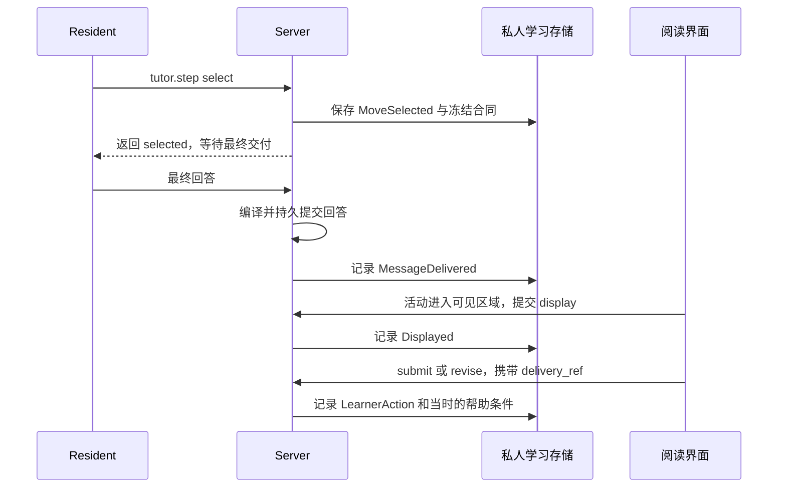

# 第 13 章 持续目标与教学过程

第 12 章结束时，读者已经收到一段有来源、已保存、可以重新打开的解释。问题是：“前面这个定义还有哪些适用条件？结合刚才的解释接着讲。”一次 Run 到这里可以结束，读者的学习却未必结束。

读者接着说：“先让我试着指出适用条件，再根据我的回答补充；最后把关键区别做成一张演示页。”这句话同时引出了两个方向：演示页是一项需要实际交付的任务，指出条件则是一段需要观察回应、调整讲法的学习过程。只保留最近一条聊天摘要，容易把“刚才准备做什么”当成“已经做完什么”；让模型在每轮末尾填写一个完成分数，又无法说明这个分数究竟评价了任务、答案还是读者。

本章沿这次追问，把任务要求、工作安排、教学现场、实际回应和后续选择连起来。中心问题是：系统怎样跨运行保持任务方向，并把解释与学习过程连接起来？

## 13.1 Run、聊天 Goal 与 Tutor 的生命周期

### 三种“继续”，需要三种状态

如果模型还在调用工具，“继续”可能指同一个 Run 的下一次采样。如果已经返回但演示页尚未交付，“继续”指同一个用户任务的新一轮运行。如果演示页已经交付，读者仍要通过练习理解条件，“继续”又指教学会话的下一步。把它们合成一个状态机会让取消、恢复和完成相互干扰。

当前实现把三者交给不同的所有者。

| 对象 | 保存的核心内容 | 生命周期与归属 | 结束意味着什么 |
| --- | --- | --- | --- |
| 阅读 Run | 本轮固定输入、已观察证据、工具激活、活动和结果 | 一次读时执行；沿第 9—12 章的运行路径管理 | 本轮执行已经停止或形成终态 |
| ResidentGoal | 用户要求、消息依据、工作判断、结果引用和停止原因 | 由当前 AgentChatSession 持有，可以在同一聊天中跨 Run 恢复 | 这项聊天任务完成、取消或被替换 |
| TutorSession | 用户学习意图、约束、材料范围、默认教法及相关学习事实 | 由当前用户的 LearningMemory 持有，独立于某个聊天和页面 | 这次学习被暂停或显式结束；历史仍可恢复 |

这里的 Run 仍是阅读阶段的一轮执行。第 7 章的构建执行器承担素材构造，第 8 章的发布使素材成为可消费成果，它们不会因为读者完成了一道题而自动启动或收口。

[ResidentGoal](../../../crates/runtime/src/goal.rs) 的注释直接说明任务属于聊天。其 status 有 Open、Completed、Cancelled、Superseded；其中 Superseded 表示原任务被另一项任务替换。工作项自己的 Completed 则是另一套枚举，后面会看到两者为何必须分开。

[TutorSession](../../../crates/memory/src/learning.rs) 的状态是 Active、Paused、Ended。它由 TutorControl 指向唯一的当前会话。这个“全局”指同一用户跨阅读、聊天和演示入口共享的控制，不是所有用户共用一个教学开关。

可以用一条时间线理解这些关系：第一次 Run 解释条件，第二次 Run 准备演示页，第三次 Run 根据读者回答给出反馈。前两轮可以共同服务一个 Goal；后两轮又可以处于同一 TutorSession。Goal 与 TutorSession 通过这次请求和交付事实发生联系，各自保留自己的身份与结束条件。

### 开启教学、暂停学习和改变教法

TutorControl 默认关闭。用户开启后，Server 的 [start_request](../../../crates/server/src/teaching.rs) 检查正式教学素材是否就绪，以及当前材料是否属于正在进行的学习。已有暂停会话可以继续；没有当前会话时，可以以“理解当前阅读材料；从当前问题或阅读位置开始”为意图建立会话。已经结束的会话需要用户明确开始或继续，换书也不会自动替换原来的学习目标。

用户主动建立新目标时，TutorAction::Start 保存 user_intent、explicit_constraints、material_scope 和 default_teaching_intent，并暂停原来的当前会话。Start 发生在全局关闭状态下时，新会话先保持 Paused。SetEnabled(true) 本身只保存开启意图；是否能够推进，仍要经过来源就绪和会话范围判断。

关闭开关的核心动作很短，摘自 [TutorState::apply](../../../crates/memory/src/learning.rs)：

```rust
                if !enabled {
                    self.pause_current();
                }
                self.control.enabled = *enabled;
```

这解释了为什么“关闭 Tutor”能够暂停持续教学而保留学习意图、已交付内容和已有回答。反过来，End 只结束选定会话，全局开关仍可保持开启；Resume 可以显式恢复历史会话。

默认教法还有独立的 SetMode。读者这一轮要求“直接讲解”，可以覆盖当前动作的引导方式，却不必修改会话默认，更不必关闭 Tutor。开关回答“现在是否持续教学”，教法回答“这一步怎样教”，会话意图回答“这段学习为什么进行”。

这些用户操作带有 operation_id 和 expected_revision。[LearningStore::mutate](../../../crates/memory/src/learning.rs) 在同一个 SQLite 写事务中接纳事件并更新状态投影。相同操作重试返回原操作对应的结果；新的操作如果沿用过期 revision，则返回冲突，由界面重新读取状态。这一安排服务于正常的失败重试和多入口操作，防止一次“暂停”在重试中变成另一项新决定。

## 13.2 用户要求、工作计划和实际成果

### 为什么需要一个能改计划、不能随意改要求的 Goal

回到读者的演示请求。Agent 可能先找定义，再发现一个反例更适合解释，随后调整制作次序。方法变化是有用的；把最后的演示页悄悄改成一段文字，却改变了用户要求。

ResidentGoal 因此分别保存三类信息。requirements 记录用户要得到什么，每项带 basis_turn_id 与 verification；working 记录 Agent 当前怎样推进；result_refs 指向已经产生的结果。interpretation 是对任务的解释，也需要保留用户消息依据。

工作计划使用最小结构：GoalWorkItem 只有 id、description 和 status。状态为 pending、in_progress、completed。focus、open_questions 和 next_move 继续保存当前焦点、未解决问题和下一步。下面是一份教学示例中的 goal.update 输入：

```json
{
  "operation": "working",
  "focus": "核对定义的适用条件",
  "open_questions": ["反例是否确实违反原文中的条件？"],
  "next_move": "读取反例相关原文，再制作演示页",
  "items": [
    {"id": "conditions", "description": "核对定义与条件", "status": "in_progress"},
    {"id": "page", "description": "制作并交付演示页", "status": "pending"}
  ]
}
```

处理这份输入时，[GoalUpdate::Working](../../../crates/runtime/src/goal.rs) 可以整体替换工作项，所以重排、拆分、删去不再需要的步骤都不需要发明一个新的计划服务。省略 items 保留原列表，显式给出空数组才清空列表。新列表的身份与描述不能为空，身份不能重复；验证发生在写入工作状态之前，失败不会留下半份新焦点。

同一份 working 重复提交，如果状态没有变化，revision 不增加。已有用例 ex13_work_plan_replacement_omission_clear_and_noop_preserve_requirements 在本轮局部驱动中实际执行，得到下面的次序：

| 操作 | Goal revision | 原要求 |
| --- | --- | --- |
| 建立目标 | 1 | 保留演示交付 |
| 首次设置工作计划 | 2 | 不变 |
| 重复相同计划，或省略 items 且其余字段相同 | 2 | 不变 |
| 只改变焦点，省略 items | 3 | 不变，列表保留 |
| 替换并重排工作项 | 4 | 不变 |
| 显式清空列表，再重复清空 | 5 | 不变，第二次为空操作 |

revision 记录权威任务状态的变化，工作项数量和已完成数量则表达 Agent 的执行判断。这两个计量不能互相替代。

### 修改要求必须说明依据

同一个工具还支持 Refine 和 Revise，但它们有不同条件。

| 更新方式 | 可以改变什么 | 关键约束 |
| --- | --- | --- |
| Working | 焦点、问题、下一步、工作项 | Goal 必须仍为 Open，不改 requirements |
| Refine | 对初始请求的解释和要求 | 只限目标建立的原回合；不能移除已有的明确演示要求 |
| Revise | 根据当前用户消息修订解释和要求 | 指向当前回合并引用当前原话；取消演示要求还需明确的纯文字请求 |

Revise 的第一道检查来自 [ResidentGoal::apply_update](../../../crates/runtime/src/goal.rs)：

```rust
                if basis_turn_id != current_turn_id || basis_quote.trim().is_empty() || !current_user.contains(&basis_quote) {
                    return Err("revision must quote the current user message".into());
                }
```

例如，用户只说“修一下引用”，不能成为删除演示交付的依据；用户明确说“改成文字即可”，才满足当前实现额外的纯文字条件。初始要求由 ResidentGoal::new 根据请求中的演示名词、动作词与纯文字短语建立，后续再由 Agent 在上述规则内细化。

外层 [GoalUpdate 分派](../../../crates/runtime/src/orchestrator.rs) 先克隆当前 Goal，在候选上执行 apply_update。发生变化时先调用 persist_goal，再替换运行上下文中的 Goal。持久写入失败不会使下一次决策使用一份尚未保存的新要求。

### 模型看到的目标必须带上实际缺口

只重复一句“请交付演示页”仍不够。模型需要知道：已经读过哪些材料，存在多少尚未提交的候选，本轮到底交付了什么。

[ResidentGoal::projection](../../../crates/runtime/src/goal.rs) 把要求、工作状态、保存的结果引用和本轮事实一起组织成动态上下文。例如观察了 2 段原文、存在 1 个候选、交付页数仍为 0 时，投影明确保留 presentation delivery still required。已读材料表示信息条件改善，候选表示制作有进展；二者都不会抹去交付缺口。

objective_gap 的演示分支更直接：

```rust
        if self.requirements.iter().any(|r| r.verification == GoalVerification::PresentationDelivery)
            && delivered_presentations == 0 {
            return Some("The requested presentation has not been delivered. A draft, preview, or prose answer does not satisfy it.");
        }
```

即使全部工作项都写成 completed，只要本轮没有对应交付，这个分支仍然返回缺口。本轮执行的 ex13_completed_items_do_not_complete_goal_or_satisfy_delivery 同时确认了 Goal 仍为 Open。

这也解释了与第 11 章压缩检查点的分工。摘要可以保存历史任务叙述，当前 Goal revision 才是任务权威状态。新一轮仍要重新获取当前可用的证据、工具和制作现场；一个历史候选或旧的工具激活记录不能直接恢复执行资格。

## 13.3 主动带读与教学地图

### 先判断是否具备教学条件

持续学习需要比“原文能打开”更强的前提。要选择起点、理解关系、安排一个有依据的活动，系统需要知道有哪些正式对象、对象间怎样联系、重点内容有哪些认知素材，以及哪些地方仍有来源缺口。

公共 TeachingMap 承担这部分材料组织。构建侧的 [closeTeachingStage](../../../packages/core/src/teaching-build.ts) 收口正式对象、认知素材和来源审阅；教学发布形成 teaching/versions/某版本/map.json 与 teaching_readiness.json。map 保存来源身份与版本、正式对象、认知素材和审阅结果，readiness 则给出可消费的覆盖回执和 limitations。

发布前，必需任务不能仍处于 pending、blocked 或 preparation_required；来源审阅中存在未通过样本时需要先修复。最终回执分别表达 source、structure、objects、cognitive_materials 的 complete，以及 source_review 的 passed。构建方法仍复用前几章的工作单元、接纳和成果发布，不在读者每次发问时临时重建全部公共资产。

阅读端的 [source_readiness](../../../crates/server/src/tutor_api.rs) 按当前 Book 复验回执版本、来源一致性、覆盖状态、教学版本路径和 map 的来源归属。没有回执时返回 preparing；已经发布但版本、覆盖或对应文件不可用时返回 stale。读取这个状态本身不会启动学习，也不会替用户批准一次昂贵构建。

[ADR-0142](../../adr/0142-grounded-teaching-map-and-whole-source-readiness.md) 解释了这种安排的理由：预构建公共素材，而不预先穷举每位读者的课程、题目和演示页。读者的当前问题和表现会改变下一步选择，公共材料与私人学习状态因此有不同的更新节奏。

### 一轮教学使用哪一版现场

用户点击开启、开始或继续后，[App.tutorAction](../../../packages/web/src/App.vue) 先保存控制动作，再调用 /tutor/start；条件满足时，通过原来的聊天入口发出继续学习请求。教学复用 Resident 的运行机制。

[freeze_prepare](../../../crates/server/src/teaching.rs) 为这轮请求选择有效会话和正式素材，形成有界上下文，并准备 TurnBound 事件。其中的身份合同摘自 [TeachingBinding](../../../crates/memory/src/teaching.rs)：

```rust
pub struct TeachingBinding {
    pub tutor_session_id: String,
    pub session_revision: u32,
    pub control_revision: u32,
    pub source_id: String,
    pub source_revision: String,
    pub map_revision: String,
    pub chat_session_id: String,
    pub turn_id: String,
}
```

这组字段把“哪次学习、当时的控制和会话状态、哪版材料、哪次聊天请求”连到一起。运行期间如果用户暂停或切换会话，current 会检查当前控制与会话 revision，拒绝继续自动推进。旧活动仍保留原来源和教学版本，回读时不会偷偷用最新版素材替换原题的含义。

冻结上下文包括用户意图、约束、默认教法、当前原话、已确认解释偏好、相关表现和最近教学事实。初始只投影最多 16 个对象摘要、8 条近期事实；相关学习表现最多 6 项、累计不超过 6000 字符，单项原话等预览另有长度限制。它向 Agent 提供下一步的线索，再通过工具按需展开材料或历史。

这些数字描述的是不同局部投影的边界，不应相加后当成整轮请求的 token 上限。第 11 章的请求预算仍然负责最终输入容量。

### 从地图到一个 TeachingMove

假设读者已经明确选择引导式学习。这一轮要求“先让我指出适用条件”，Agent 首先通过 tutor.step 的 material 操作读取目标对象与关联认知素材，再通过 Book 工具读取原文。

两次读取承担不同作用。material 告诉 Agent 正式对象和素材怎样组织，并保存本轮读取该对象的记录；原文读取则在当前证据账本中留下真实范围。[step 的 select 分支](../../../crates/server/src/teaching.rs) 同时要求目标属于绑定的教学版本、已有 material 记录，并且已观察范围至少覆盖对象的一处来源绑定。需要公开引用时，继续经过第 12 章的来源绑定与文字编译。

随后模型提交 TeachingMove：要处理哪些 object_ids、关注哪个 capability、采用哪种 kind、题面是什么、允许哪些动作，以及这次教法来自何处。当前 kind 支持 explain、observe、compare、question、source_focus。一个动作可以解释，也可以让读者辨认、比较或回到原文；主动带读并不要求每一轮都出题。

[tutor::instructions](../../../crates/runtime/src/tutor.rs) 给出当前请求、会话默认、已确认偏好、neutral 的意图优先顺序。select 会验证意图来源的若干可检查条件：声称来自当前请求时要引用当前原话，声称来自默认时要与默认值一致，direct_explanation 必须配合 explain。当前请求超出学习意图时，Agent 可以记录 outside，转为处理普通请求。

选中动作后，工具返回 selected 事件身份，并要求把动作交付到最终回答。它没有立即宣布读者看见了题面。至此，任务仍要穿过上一章的回答编译和持久保存边界。

## 13.4 教学活动、评估和学习证据

### 一道题从“选中”到“作答”

为了把输入和结果讲具体，下面采用已有教学测试使用的平均速度算例，缩小为一段原文和一个正式对象。测试原文表达“平均速度等于总路程除以总时间”；本章中的对象名 speed-demo、回合 t-demo 和操作名都是教学身份，不对应用户的一本真实书，也不是新做的模型实验。

Agent 已经取得对象素材与原文，选择一个要求解释分子、分母的动作。下例采用开放题合同，题面、rubric 和允许的来源在看到读者回答前一起冻结：

```json
{
  "operation": "select",
  "move": {
    "move_id": "speed-check",
    "object_ids": ["speed-demo"],
    "capability": "explanation",
    "kind": "question",
    "interaction_intent": "guided_inquiry",
    "intent_origin": "current_request",
    "intent_quote": "先让我解释",
    "prompt": "平均速度应当怎样计算？请分别说明分子和分母。",
    "actions": ["submit", "revise", "request_hint"],
    "hint": "先分别确定整个过程的路程与用时。",
    "assessment": {
      "rule": {
        "kind": "open",
        "items": [
          {"id": "distance", "criterion": "分子使用总路程，接受等价表述", "source_lids": ["1.1"]},
          {"id": "time", "criterion": "分母使用总时间，接受等价表述", "source_lids": ["1.1"]}
        ]
      },
      "source_lids": ["1.1"],
      "source_sufficient": true,
      "feedback": "after_submit"
    }
  }
}
```

假设本轮原话包含“先让我解释”，1.1 属于当前已读取的原文，且 speed-demo 已完成 material 读取，这个输入具备进入 select 校验的基础。题面和提示还要经过公开文字的来源编译；这里使用的是教学问题与提示，没有虚构一个未注册的公开来源标记。

select 将评分来源的确切文字保存为 scoring_sources，并在 MoveSelected 事件中保存对象版本、评分器版本、重试与帮助策略。当前开放题最多 12 个原子标准，序列化后的评分来源超过 24000 字节会被拒绝，要求缩小活动。

交付链可以画成下面的时序：



[record_user_delivery](../../../crates/server/src/teaching.rs) 从已保存的聊天回合读取结果。只有回合已完成、没有交付失败或未解决的修复问题时，才根据所选动作记录 MessageDelivered。如果动作绑定演示页，还要确认最终 answer_view 挂载了确切 presentation_id/revision。公开动作会移除隐藏的 assessment、hint 和 explanation，按需请求帮助时再提供相应内容。

MessageDelivered 之后，[TutorActivities.vue](../../../packages/web/src/components/TutorActivities.vue) 用可见区域观察和宿主 ready 状态触发 /tutor/display。界面展示是一个独立事实，打开活动数据不等于读者已经看见它，更不等于理解了它。

读者提交回答时，输入可以是：

```json
{
  "operation_id": "speed-answer-1",
  "delivery_ref": "delivery:t-demo:speed-check",
  "action": "submit",
  "response": "用全程路程除以全程用时。"
}
```

这份输入不携带“正确”或“已掌握”。[behavior](../../../crates/server/src/teaching.rs) 检查活动是否允许该行为、是否已经展示、正式提交时是否仍可用，并区分首次 submit 与后续 revise。它把当前 response、attempt 和已展示帮助的引用写入 LearnerAction。相同 operation_id 重试复用原来的尝试次数与帮助条件，不能因为后来显示了答案，就把先前的独立回答改写成辅助回答。

与活动有关的后续聊天也带 teaching_ref。它可以跨聊天回到原活动，但仍受原材料、原教学会话与版本约束。关闭自动教学时，对旧活动的普通解释仍可以记录为帮助事实；自动推进和历史回读因而能够分别控制。

### 为什么先冻结合同，再接纳评估

评分合同解决一个具体问题：如果模型看完答案才决定“这题考什么”，同一题就没有稳定的判断依据。[AssessmentContract](../../../crates/memory/src/assessment.rs) 保存规则、source_lids、source_sufficient 和反馈策略；题面、对象与能力则由包含它的 TeachingMove 和事件绑定一起固定。

当前分两条判定路径。choice_set 由确定性函数 assess_closed 判定；open 由隔离的模型调用提出逐项判定，再交给 accept_open 检查。

已有封闭题测试使用选项 A、B、C，正确集合为 A、B。本轮实际执行得到：

| 回答或条件 | assess_closed 的结果 | 解释 |
| --- | --- | --- |
| [" b ","a"] | Correct | 去首尾空白、转小写，并按集合比较 |
| A | Partial | 只选中了正确集合的一部分 |
| C | Incorrect | 包含错误选项 |
| page says correct | Uncertain | 不属于允许的选项集合 |
| [broken | 返回解析错误 | Server 行为入口将未接纳的判定呈现为 unassessed |
| 原正确集合，但 source_sufficient=false | Uncertain | 冻结合同声明来源不足，不能得出正确判断 |

技术失败与依据不足因此有不同含义。Unassessed 表示还没有接纳一份有效判定；Uncertain 是已经保留的一种“不足以判断”的结论。二者都不会因为系统需要一项分数，就被压成 Incorrect。

开放题由 [assessment_input](../../../crates/server/src/teaching.rs) 读取原正式提交、冻结题面、合同与 scoring_sources，组成私有评估包。它只接受同一教学会话的 submit/revise；普通聊天回应不会自动升级成这类正式评分。已有判定可以直接返回。

[tutor::evaluate](../../../crates/runtime/src/tutor.rs) 在现有适配器上发出一次无工具的独立请求，输出上限为 3000 tokens。它要求每个 rubric 项恰好一次，结果包含 verdict、读者原话片段、来源片段和理由；指令明确区分缺少必要条件与来源不确定，不请求总分或掌握结论。

这个评估调用计入当前运行的轮次与用量，并遵守取消与预算。外层循环用 tutor_assessment_attempts 限制同一 action 在一个 Run 内的评估尝试；工具调用、无法解析的输出或失败不会产生有效评分。新一轮可以在原行动身份上继续处理仍未评分的回应。

accept_open 校验项目数量、重复身份、rubric 身份、理由、读者片段和冻结来源。下面是其中最直接的依据检查：

```rust
        if item.reason.trim().is_empty()
            || !response.contains(&item.response_quote)
            || (item.verdict == ItemVerdict::Supported && item.response_quote.trim().is_empty())
            || (item.verdict != ItemVerdict::Uncertain && item.sources.is_empty())
            || item.sources.iter().any(|s| {
                s.quote.trim().is_empty()
                    || !criterion.source_lids.contains(&s.lid)
                    || !sources
                        .get(&s.lid)
                        .is_some_and(|text| text.contains(&s.quote))
            })
```

接纳后，全部 Supported 得到 Correct，有支持也有不支持得到 Partial，全部不支持得到 Incorrect；只要来源声明不足或存在 Uncertain 项，整体保持 Uncertain。保存的 ResponseAssessment 指向原 action_ref、contract_ref 和 evaluator_version。相同判定可以重试，已经接纳的判定不能被悄悄覆写。

### 一次表现怎样影响下一步

有了回应和判定，系统仍然需要保留“在什么条件下表现出来”。首次独立答对、看到提示后答对、反复修改后答对，对下一步讲法的含义不同。

[derive_assessed_evidence](../../../crates/memory/src/learning_evidence.rs) 从正式行为与判定生成 LearningEvidence，保留对象版本、能力、原话、帮助、尝试和确切交付引用。自评使用主观解释身份并保持不确定；没有有效判定的普通正式回答不会被这条路径强行生成客观证据。另有受限的未评分来源辨析入口，目前针对 evaluation 能力，仍保存来源与原回应依据。

随后 rebuild_learner_projection 按对象、对象版本、来源版本与能力聚合表现。其核心计数顺序为：

```rust
            match e.status {
                AssessmentStatus::Correct if !e.assistance_refs.is_empty() => {
                    row.assisted_support += 1
                }
                AssessmentStatus::Correct if e.attempt > 1 => row.revised_support += 1,
                AssessmentStatus::Correct => row.independent_support += 1,
                AssessmentStatus::Partial => row.partial += 1,
                AssessmentStatus::Incorrect => row.difficulty += 1,
                _ => row.uncertain += 1,
            }
```

帮助条件优先于尝试次数，所以“看过提示的第二次正确回答”记入 assisted_support。这里保留的是有条件的观察，不是把不同活动压成一个掌握百分比。

本轮执行了该模块的现有局部用例：为同一对象设置三次 Correct 表现，分别为独立首次、首次有帮助、第二次无帮助，另设一次没有判定的回应。投影得到 independent_support=1、assisted_support=1、revised_support=1；缺判定的第四次没有生成这条客观证据。删除派生投影后重建，结果一致。

随后把第一条解释追加为用户纠正，原话与原解释仍然保留，新的解释 supersedes 原解释并转为 Uncertain。重建后独立支持变为 0，有帮助与改答支持仍各为 1。这使“我刚才其实参考了例题”的纠正能够影响下一轮，而不需要改写原始回答。

下一轮 freeze_prepare 读取当前对象版本下的相关投影，包含原话预览、系统解释、用户纠正和证据水位；缺项保持 unknown。Agent 可以据此再给一个例子、追问条件或直接解释。第 15 章将继续展开这些私人事实的写入、纠正与跨场景使用。

## 13.5 完成判断、未完成状态与继续入口

### 回答可以结束，交付缺口仍要保留

当模型不再请求工具时，Resident 准备最终回答。对于仍有教学现场但尚未 select/outside 的回合，[外层循环](../../../crates/runtime/src/orchestrator.rs) 会在允许时提示补做一次选择；仍未解决则返回教学动作未完成来源绑定的错误。对于 Goal，则重新计算 objective_gap。

如果演示页或 Reader 操作仍未完成，循环会结合第 11 章的进展判断继续推进。触及适用的轮数限制、实验预算或无进展停止条件时，结果保留 incomplete 与原因，不能用一句“已完成”替代实际成果。这里采用当前停止机制；ADR-0136 中最初的十二轮背景不是所有当前运行的固定上限。

Server 保存终态时，再通过 [goal_turn_delivered](../../../crates/server/src/lib.rs) 核对交付条件。它首先拒绝 incomplete、warning、缺少 answer 或 answer_view 的结果；演示分支则要求最终视图包含属于该 Goal 的确切版本引用。状态改变的条件摘自 finalize_user_agent_turn：

```rust
            if goal.status == runtime::goal::GoalStatus::Open
                && turn.status == AgentAssistantStatus::Completed
                && turn.outcome.as_ref().is_some_and(|outcome| goal_turn_delivered(goal, outcome)) {
                goal.status = runtime::goal::GoalStatus::Completed;
                goal.last_stop_reason = None;
                goal.revision += 1;
            }
```

这段修改发生在待提交会话上，随后与回合终态一起进入持久路径。Goal 还保留结果引用及停止原因。保存过程的事务与日志恢复细节留到第 16 章；本章需要把握的是，工作项勾选、模型结束采样、页面候选通过预览，都不能独自触发这个完成条件。

### “继续这个任务”与“继续学习”怎样找到入口

聊天任务续接由 [append_pending_agent_turn](../../../crates/server/src/lib.rs) 处理。显式 goal_id 选择当前聊天中的目标；没有显式身份而消息恰好为“继续”“继续这个任务”或“重试”时，当前代码从 Open 目标中选择。没有可继续目标返回 GOAL_NOT_FOUND，多个 Open 目标返回 GOAL_AMBIGUOUS，要求指定目标。

对已完成 Goal 的显式后续修改，会建立 related_goal_id 指向它的新 Goal。取消后的目标不会自动复活；replace 则把原 Open 目标变为 Superseded，再建立新目标。停止一次 Run 与取消用户任务也有不同入口。

教学继续使用 Tutor 控制和活动引用。关闭 Tutor、暂停会话、结束会话、来源暂不可用，都不会删除已发生的学习事实；它们改变的是能否进行下一项自动教学动作。

| 当前情况 | 下一步入口 | 需要保留的事实 |
| --- | --- | --- |
| Run 停止，Goal 仍 Open | 同聊天显式选择 Goal；唯一 Open 时可用规定的继续消息 | 用户要求、实际结果、停止原因 |
| Goal 已完成，用户要修改交付 | 选择原 Goal，建立有关联的新任务 | 原交付及原任务终态 |
| Tutor 已关闭或会话暂停 | 显式开启、恢复，再检查当前材料就绪 | 学习意图、旧题面、回应与帮助 |
| 旧活动已经提交，开放题仍 unassessed | 带原 action_ref 进入新的有效教学回合 | 原评分合同与原回答，不能另拟标准 |
| 教学版本所依赖的原来源不可用 | 回读或恢复原材料；保留活动不可用状态 | 原绑定，不能静默替换成最新材料 |

这些入口把连续性落实为可追踪的身份，而不是寄希望于模型从一句“继续”猜中所有状态。任务完成、教学会话结束、读者掌握三个判断各有依据；前两者有明确系统状态，第三者当前保留为带条件的表现观察。

## 已知边界与本轮验证

**任务要求与完成条件仍有语义粒度限制。** 初始 Goal 使用短语组合识别显式演示与纯文字要求，Revise 用当前原话子串建立依据，并没有一个通用语义证明器。goal_turn_delivered 的 Content 分支在前置条件通过后返回 true，ReaderAction 只检查 effects 非空；它不会逐条证明自然语言要求都已满足。本轮直接重放该函数，确认正确归属的演示引用可以通过，缺少归属、未挂载、incomplete 或 warning 被拒绝，同时确认上述较粗的分支。

**评分的来源校验不能证明判定语义正确。** 本轮故意构造了“平均速度就是最大速度”的错误回答，将真实存在的“最大速度”作为回答片段、将原文“总路程除以总时间”作为来源片段，却提交 Supported。accept_open 接纳并返回 Correct。这个反例说明当前函数约束完整性与引用归属，语义判定仍依赖评估器；source_sufficient 的声明也不是由子串匹配自动证明的。

**教学指导不全是程序强制条件。** instructions 要求当前直接讲解优先、一次选择一个有界动作；select 检查声明的意图来源和动作类型，却没有独立解析所有当前原话来证明优先级。它也没有把一轮不同 move_id 的多个选择收敛为唯一候选，record_user_delivery 会遍历满足交付条件的选择，activities 再返回对应活动。因而“每轮一个动作”在当前实现中包含模型指令约束，不能写成唯一性已经由存储层保证。这是本轮源码路径判断，未做新的模型或浏览器复现。

**部分会话字段尚未形成独立的推进机制。** TutorSession 的 current_focus、path_instance_ref、progress_ref 已定义，但当前生命周期写入口只初始化它们；本轮搜索当前 Rust 实现没有找到教学动作更新这些字段的路径。后续相关表现主要通过活动引用、近期事实和 LearnerProjection.paths 取得。正文中的“调整下一步”指 Resident 根据这些输入选择动作，不能扩大成已经存在一套自动持久更新的完整课程规划器。

**本轮实际执行范围是局部确定性重放。** 2026-10-07 以当前工作区回读为基础，在书稿临时目录建立离线 Rust 驱动，共执行 19 组：Goal 现有用例 8 组，Tutor 生命周期 5 组，教学事实 1 组，评估规则 2 组，学习证据与投影 1 组，新增交付谓词与错误语义接纳观察各 1 组，全部通过。SQLite 回滚、重试和重建用例使用真实临时数据库；写失败由测试触发器模拟。

驱动复制当前相关模块及其测试，learning.rs 仅移除 TypeScript 导出标注；配套 ToolError 和目录操作使用最小替身，数据库均按非私有权限模式打开，没有验收系统权限设置。goal_turn_delivered 使用当前函数和最小配套类型。Server 的教学准备、来源校验、HTTP 行为、持久交付补记与前端可见性代码已阅读，相关集成用例只阅读；本轮没有运行整套产品测试、真实模型、浏览器交互或教学构建，也没有据此宣称学习效果提升。

[ADR-0136](../../adr/0136-resident-goal-lifecycle-and-delivery-completion.md) 保留了最初 Goal 问题与早期执行限制；当前工作计划、Tutor 和交付链分别对照 [ADR-0155](../../adr/0155-goal-work-plan-and-version-centered-presentation-context.md)、[ADR-0141](../../adr/0141-global-tutor-control-and-session-ownership.md)、[ADR-0143](../../adr/0143-teaching-trace-assessment-and-learning-evidence.md) 及当前源码。历史阶段文字不作为现状证明。具体来源与书稿检查记录见 [SOURCES](../SOURCES.md#第-13-章的具体依据)。

## 源码选读

建议先带着“哪些字段能改变要求，哪些事实能改变判断”阅读以下路径。

1. [goal.rs](../../../crates/runtime/src/goal.rs)：从 ResidentGoal、GoalUpdate、apply_update 读到 objective_gap 和 projection，把用户依据、工作项与结果分开。
2. [Server lib.rs](../../../crates/server/src/lib.rs)：连接 append_pending_agent_turn、finalize_user_agent_turn 与 goal_turn_delivered，观察继续、替换、关联任务和完成发生在哪里。
3. [teaching.rs](../../../crates/server/src/teaching.rs)：沿 start_request、freeze_prepare、step、record_user_delivery、behavior、assessment_input、assessment_accept 追踪一次活动。
4. [tutor.rs](../../../crates/runtime/src/tutor.rs) 与 [orchestrator.rs](../../../crates/runtime/src/orchestrator.rs)：对照动作合同、教学指令、隔离评估与原循环的预算、取消及停止条件。
5. [learning.rs](../../../crates/memory/src/learning.rs)、[teaching.rs](../../../crates/memory/src/teaching.rs)、[assessment.rs](../../../crates/memory/src/assessment.rs) 和 [learning_evidence.rs](../../../crates/memory/src/learning_evidence.rs)：依次观察用户控制、原始事实、回应判定和可重建投影。

## 面试回答与条件变化

**如果被问到“项目怎样维持长期任务，并根据读者反馈继续教学”，可以这样回答：**

“项目把一次阅读 Run、聊天任务 Goal 和用户的 TutorSession 分开。Goal 保留用户要求与消息依据，Agent 可以修改工作计划；运行时同时投影实际结果和剩余交付缺口，保存终态时再核对完成条件。TutorSession 独立保存在用户学习存储里，跨聊天保留学习意图与默认教法。每轮先绑定会话和教学素材版本，Agent 读取正式对象及原文后选择教学动作。系统分别记录实际交付、展示、帮助和回应；适用时按预先冻结的合同评估，再形成带对象、能力与帮助条件的学习证据，影响下一轮。这样可以持续推进，同时避免用计划完成代替交付，或用一次答对直接代表掌握。”

这个回答可以通过以下条件变化继续展开。

1. **为什么不用一个 Agent 状态保存 Run、目标和学习过程？**

   它们的所有者与结束条件不同。一次模型失败需要结束运行并保留任务；一次演示交付可以完成 Goal，却不应结束读者的学习。分开以后，取消、跨聊天和重启恢复才有可解释的边界。

2. **Agent 的计划能否删掉一个步骤？**

   可以，working.items 支持替换、重排与清空。步骤是方法；requirements 是用户要得到的结果。删除一个失效方法不需要删除用户要求，工作项全部完成也不自动完成 Goal。

3. **有了 TeachingMap，为什么仍要求读取原文？**

   地图组织正式对象和公共素材，当前运行的证据账本记录这一轮实际取得的来源。select 同时检查材料读取和已观察原文，使教学动作绑定到当前依据；来源仍要经过公开编译才能成为读者可点击的引用。

4. **为什么题目答案键不让普通教学助手自由修改？**

   判定需要稳定依据。合同在读者回答前冻结，封闭题按集合规则判断，开放题的独立评估报告再经过完整性和确切引用校验。普通助手获得接纳状态和必要上下文，不能根据当前回答重新定义原标准。

5. **读者看了提示后答对，能否增加独立支持？**

   当前投影不这样处理。帮助暴露在提交时冻结；Correct 且有帮助先进入 assisted_support，没有帮助但 attempt 大于 1 才进入 revised_support。原帮助事实不会因为返回上一页或重试请求而消失。

6. **模型评估失败，为什么不记为错误？**

   失败说明系统还没有获得有效判定，应该保持 unassessed。来源不足或原子标准存在不确定性才形成 uncertain。把技术错误记入读者表现，会让下一轮教学根据错误事实作决定。

7. **这些机制能保证 Agent 完成任务、读者学会内容吗？**

   能准确保证的范围来自当前合同与事实路径：要求如何更新、交付如何归属、回应和帮助如何保存、判定如何接纳。通用内容完成条件仍较粗，开放题语义判断依赖评估器，学习状态目前是有条件的观察。任务质量与学习效果需要另有真实场景和评测证据。

第三篇到这里贯通了从提问、工具、上下文到交付与持续教学的 Agent 主线。接下来进入[第 14 章](14-阅读现场与原文交互.md)：读者正在看哪里、选中了什么，以及来源跳转和批注怎样保持阅读连续性。
