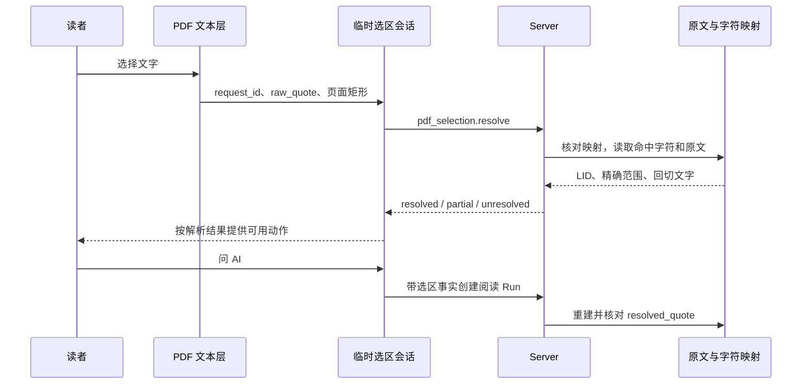

# 第 14 章 阅读现场与原文交互

第 13 章中，读者已经让 Agent 根据自己的回应继续讲解适用条件。现在读者回到正文，选中其中一句话，问：“这里为什么还需要这个条件？”回答给出一个来源，读者打开它，查看相邻段落，再返回刚才的问题，准备留下一条笔记。

这是一组很普通的操作，却经过了几种不同的位置。正文有书内地址，浏览器有滚动位置，选中的文字有起止范围，回答里的来源还有运行时建立的引用身份。假如系统只保存“当前 LID”，选区可能在滚动后变成另一句话；假如只保存 scrollTop，调整字号后又可能回到另一行。至于 PDF，屏幕上的一个矩形还不能直接回答它对应原文中的哪几个字符。

本章把这条操作链连起来：Reader 命令建立可执行的阅读状态，界面把状态投影为连续正文，选区经过原文映射成为问题输入，来源跳转保存返回点，批注再连接到长期记录。中心问题是：读者看到的位置、选中的文字和 Agent 使用的材料怎样对应？

## 14.1 Reader 命令和界面投影

### 同一次阅读，为什么会有多个“当前位置”

读者打开来源时，服务端需要知道应该跳到哪一段；浏览器需要知道应该把那段的哪一行摆到屏幕哪里；Agent 则需要知道这次问题针对什么材料。这三个任务使用同一份书，但需要的信息不同。

| 状态 | 当前实现中的主要载体 | 它回答的问题 |
| --- | --- | --- |
| 服务端阅读窗口 | Reader 的 top_idx、width、selection 和 revision | 哪些叶子处于逻辑窗口，刚才请求选择什么位置？ |
| 浏览器阅读位置 | segments、currentReadingLid、ScrollAnchor 或 PdfReadingAnchor | 已经加载哪些正文，哪段文字实际处于阅读区域？ |
| 问题选区 | AskDraft，提交后进入 question_quote | 读者发出这次问题时，明确指定了哪些原文范围？ |
| 来源返回点 | ReadingReturnPoint | 查完来源后，应该回到哪个位置、回答或笔记？ |

这些状态不能靠一个字段相互替代。[ReaderWorkspace](../../../crates/server/src/reader_workspace.rs) 持有当前 Book、Reader、聊天和现场代次；Reader 是其中的可变阅读场景。构建执行器负责生成素材，发布负责提供可读版本，阅读 Run 使用当前请求及其证据。它们与浏览器滚动也保持各自的生命周期。

### Reader 的窗口是叶子区间

当前 [Reader::new](../../../crates/reader/src/lib.rs) 从位置树中收集 children 为空的节点，按已有顺序形成 leaf_lids。width 是窗口中的叶子数量，不是屏幕像素高度，也不是锚点两侧各取多少段。

下面这段来自 Reader::viewport，决定窗口的实际边界与锚点：

```rust
        let lo = self.top_idx.min(self.leaf_lids.len() - 1);
        let hi = (lo + self.width).min(self.leaf_lids.len());
        let anchor_idx = lo + (hi - lo - 1) / 2;
        Viewport {
            anchor_lid: self.leaf_lids[anchor_idx].clone(),
            top_lid: self.leaf_lids[lo].clone(),
            bottom_lid: self.leaf_lids[hi - 1].clone(),
            width: self.width,
            visible_lids: self.leaf_lids[lo..hi].to_vec(),
        }
```

非空窗口是 `[lo, hi)`，anchor_lid 取这个区间靠前的中间叶子。goto_lid 接受一个真实 LID：如果它是叶子，就定位该叶；如果它是容器，就定位到以“该 LID 加点号”为前缀的第一个叶子。点号很重要，容器 2.1 的后代不能误匹配成 2.10。不存在的 LID 返回 LID_NOT_FOUND。

为了在书尾保留完整窗口，top_idx 最多取叶子总数减 width。因而“跳到某段”不保证返回的 top_lid 恰好等于目标。以下用十个叶子 1.1—1.10、width=3 做教学算例，行与行连续操作：

| 操作 | top_lid | bottom_lid | anchor_lid | selection |
| --- | --- | --- | --- | --- |
| 新建 Reader | 1.1 | 1.3 | 1.2 | 空 |
| scroll(+5) | 1.6 | 1.8 | 1.7 | 1.6 |
| goto_lid(1.10) | 1.8 | 1.10 | 1.9 | 1.10 |
| goto_lid(1) | 1.1 | 1.3 | 1.2 | 1 |

第三行最能说明 selection 的用途。浏览器如果只滚到 top_lid，会把请求的 1.10 显示成 1.8。[resolveReaderNavigationTarget](../../../packages/web/src/reader-navigation.ts) 因此保留真实叶子目标；从服务端状态同步一次成功的 Agent 导航时，resolveReaderStateNavigationTarget 优先将 selection 解析为叶子，再退回窗口顶部。容器身份可以留在 selection 中，实际正文定位另行解析。

### 一个命令怎样变成一次界面变化

读者点击目录后，[App.vue 的 doGoto](../../../packages/web/src/App.vue) 调用 api.goto，取得 ViewportEffect，再用 loadWindow 读取 visible_lids 的正文，替换当前缓冲，最后让 ReaderPane::scrollLidIntoView 对准目标元素。成功不是只修改一个标题：后端状态、正文数据和浏览器位置依次发生变化。

doGoto 为每次请求递增 readerNavigationRequest，同时记住 workspaceContextKey。等待网络与正文读取后，它检查请求是否仍最新、现场是否仍相同。来源返回还可以传入恢复令牌对应的判断。这些检查服务于一个实际约束：读者已经发出了新的导航时，旧导航的迟到结果不应该重新夺回页面。

goto_lid 与 scroll 还会把逻辑窗口中的可见叶子交给 enqueue_visible_read。这里进入的是阅读记账队列，导航响应不等待这批记录完成磁盘耐久化。它与第 9 章的证据账本有不同含义：窗口范围说明阅读状态，Agent 取得并验证的具体原文才构成本轮证据。

## 14.2 连续正文、视口和滚动锚点

### 屏幕滚动为什么不逐次调用 reader.scroll

现在读者从条件所在的段落向下读。若每滚动几像素就向后端发送一次叶子位移，网络窗口会与浏览器排版互相牵制：一段短文和一页代码都是一个叶子，像素距离却完全不同。

当前 [ReaderPane](../../../packages/web/src/components/ReaderPane.vue) 让浏览器原生滚动连续正文，并在接近缓冲边缘时请求更多 LID。App 的 onScrollEdge 按 leafOrder 取得上一批或下一批叶子，批量数来自 viewport.width；hydrateSegments 读取原文，并按节点类型补充公式或图片所需数据。已经加载的正文保留，mergeSegments 按 LID 去重后向前或向后合并。

向上追加尤其需要处理位置变化。假设读者眼前的一行距阅读区顶部 120 像素，前面插入了一千像素正文。维持旧 scrollTop 会让原来的行向下移动一千像素，读者看到的内容就变了。当前代码在加载前捕获锚点，合并后恢复它。下面是 [onScrollEdge](../../../packages/web/src/App.vue) 中真正执行合并的部分：

```ts
    const next = await hydrateSegments(nextLids);
    segments.value = mergeSegments(segments.value, next, direction === "down" ? "append" : "prepend");
    if (direction === "up") await readerPaneRef.value?.restoreScrollAnchor(anchor);
```

正文中的 data-lid 保留源块边界，视觉上可以是连续段落、行内公式与独立资产。LID 是定位的结构，不必全部变成显眼的段落编号。ReaderPane 还在阅读区内设置一个探测位置，找出经过该位置的 LID，更新 currentReadingLid。这样得到的当前阅读段可以随着原生滚动前进，而服务端逻辑窗口继续承担命令与同步职责。

### 为什么段落锚点还不够

向前插入正文，只保存“段落及其顶部偏移”通常已经有用。但读者放大字号时，同一长段会多出很多行。恢复段落顶部可以保证段落没丢，却不能保证读者仍看着刚才那个字。

[reader-text-anchor.ts](../../../packages/web/src/reader-text-anchor.ts) 为 ScrollAnchor 增加 textPosition：原文中的 start、end、text，以及该文字相对于阅读区顶部的 top。captureTextPosition 遍历真实文本节点，用 Range 的几何信息寻找靠近阅读探测线的字符，再通过 Markdown 与 DOM 映射找回源串范围。UTF-16 代理对一起保存，避免把一个表情符号拆成两个位置。

恢复时先确认原文范围仍代表同一段文字。textPositionTop 的开头很短：

```ts
  if (source.slice(position.start, position.end) !== position.text) return null;
  const map = createMarkdownDomSourceMap(source, root);
  const semantic = map.semanticRangesForSourceRange(position.start, position.end)[0];
  if (!semantic) return null;
```

之后它找到当前 DOM 中的对应 Range，取得新的位置。ReaderPane 用“新位置减旧位置”的差补偿 scrollTop；没有可用文字位置时，再使用段落锚点。几何恢复使用的是内容与屏幕之间的关系，单独保存百分比或绝对像素无法提供同样的依据。

本轮用可控几何数据实际重放了这个过程。教学源串是 `A中😀B`：表情符号占 UTF-16 区间 `[2,4)`。设阅读区顶部为 20 像素，字符原来的屏幕顶部为 140，锚点保存的 top 就是 120；重排后字符顶部变为 180，补偿量为 `180 - 20 - 120 = 40` 像素。当前函数返回这个结果。把对应原文改成别的字符后，旧文字锚点被拒绝；探测位置的过程也没有改变原生选区。这是受控 DOM 几何重放，其验收范围见章末。

字号调整还带来异步字体加载。[ReaderPane::applyTypography](../../../packages/web/src/components/ReaderPane.vue) 先捕获锚点，等待需要的字体，再应用排版与恢复位置。正在选中文字或输入法组合输入时，调整先延后；新的滚动、导航或现场切换使旧恢复失效。否则一次迟到的字体加载可能把读者主动滚到的新位置拉回去。

### 选中的可见文字怎样变成原文范围

同一套映射也服务于“问 AI”。DOM 文本不能直接当成 Markdown 源串的偏移。例如源串 `**bold** tail` 渲染后是“bold tail”，星号不再占可见字符。选择 tail 时，正确的原文区间是 `[9,13)`；选择整段可见文字时，当前映射返回 `[2,6)` 与 `[8,13)`，拼接出的确切引用为“bold tail”。中间的 Markdown 标记没有被伪装成读者选择的文字。

[createMarkdownDomSourceMap](../../../packages/web/src/markdown-source-map.ts) 先投影 DOM 的语义文字，再通过编辑序列与源串对齐。它分别处理普通文字、换行与公式原子，忽略带 data-reader-selection-ignore 的控件。KaTeX 的显示 DOM 很复杂，同一公式还可能同时存在视觉结构和辅助表达；映射将它作为一个语义原子，避免把一条公式计算成多份文字。

[useReaderSelection](../../../packages/web/src/useReaderSelection.ts) 取得原生 Range 时，要求选区两端都处于当前正文根节点，并排除输入框等编辑区域。App 的 selectionRanges 随后按选区跨过的 data-lid 元素计算每个 LID 内的源串区间；独立公式叶子采用整段公式范围。[rangeToMarkdown](../../../packages/web/src/selection.ts) 负责保留用户所选内容的可读 Markdown 表达，resolvedSelectionQuote 则从已经定位的原文区间拼接引用。两者承担不同职责。

点击“问 AI”时，askSelection 将这些范围与引文复制进 AskDraft，随后清除原生选区、切到提问界面。读者继续滚动不会重新解释这份草稿。发送问题时，submitAgentMessage 把草稿带入 question_quote，承接第 9—11 章的冻结输入与运行上下文。

## 14.3 PDF 选区解析与原文对应

### 从矩形走到确切引用

把相同操作搬到 PDF，第一步得到的是页面几何。浏览器选中了几行字，PDF 文本层返回 raw_quote 和若干屏幕矩形。它们可能跨页，也可能包含换行、连字符或公式的显示表达。

[PdfReaderPane::capturePdfSelection](../../../packages/web/src/components/PdfReaderPane.vue) 将选区矩形与各页相交，经 rectToPdfRegion 把屏幕坐标换成 PDF 页面坐标，发出带 request_id、raw_quote、rects 和 screen_rect 的事件。screen_rect 用来放置临时操作条；rects 中的 pageIndex 与 bbox 才进入服务端解析。组件此时没有自动执行来源跳转，也没有把选择行为直接保存为笔记。

下面是教学输入形状，其中页码和矩形坐标是示意值：

```json
{
  "raw_quote": "feed-\nforward",
  "rects": [
    {"pageIndex": 0, "bbox": [10, 20, 80, 32]},
    {"pageIndex": 0, "bbox": [10, 34, 55, 46]}
  ]
}
```

服务端 [route_pdf_selection_resolve](../../../crates/server/src/lib.rs) 首先核对当前成果是否提供选区解析能力，以及映射是否属于当前书和成果配置；然后按页读取字符映射，寻找矩形实际命中的字符。v2 映射只允许具有确切字符范围的条目参加字符解析：char_exact 可以使用，partial 只能使用它明确列出的精确子区间，region_exact 与 unmapped 不能凭页面区域推出字符引用。

命中项按页面与字符顺序整理，raw_quote 参与筛选和完整性判断。随后系统将连续源范围合并，按各 LID 的起点换算成段内 UTF-16 范围，并调用 Book 的真实文本读取形成 quote_markdown。这条路径与第 4 章建立的源坐标体系接上了：矩形是入口，书内范围与回切文字才是结果。



### 完整程度与恢复依据是两个维度

读者看到的 PDF 文本可能有排版换行，而规范正文使用空格；换行处的连字符也可能只属于排版。项目没有简单地要求 raw_quote 与规范正文逐字相同，也没有用一个相似度分数放宽所有差异。

当前 classify_pdf_selection_recovery 使用 pdf_selection_recovery.v2。它识别有限的排版空白、连字符和满足映射约束的公式表达差异；公式恢复还需要当前映射和完整命中支持。普通实质缺字、变量变化和歧义不因此被接纳。这里的 recovered 表示已用受约束的规则建立完整对应，不是“虽然不确定，也先算成功”。相关 Server 用例本轮已阅读，执行情况另列在验证记录。

解析最终返回的 status 判断如下，摘自 [route_pdf_selection_resolve](../../../crates/server/src/lib.rs)：

```rust
    let status = if ranges.is_empty() {
        "unresolved"
    } else if unmapped_hits > 0
        || rejected_hit_count > 0
        || hits.iter().any(|hit| hit.lid.is_none())
        || raw_quote_incomplete
        || degraded_precision
    {
        "partial"
    } else {
        "resolved"
    };
```

status 表示整个选择是否建立了足够对应；resolution_basis 只在 resolved 时说明依据是 exact 还是 recovered。当前界面的 [pdfSelectionCapabilities](../../../packages/web/src/pdf-selection-capabilities.ts) 据此提供动作：

| 选区结果 | 高亮 | 笔记 | 问 AI | 翻译 | 原生复制 |
| --- | --- | --- | --- | --- | --- |
| resolved，exact 或 recovered | 可用 | 可用 | 可用 | 可用 | 保留 |
| partial | 不提供 | 不提供 | 可用，引用以精确子区间为依据 | 可用，使用所选原始文字 | 保留 |
| unresolved | 不提供 | 不提供 | 不提供 | 不提供 | 仅保留这一途径 |

partial 情况仍有一部分材料可以用来提问。Agent 可以知道用户原本想问什么，同时区分可引用部分与未经验证的选择文字；高亮和笔记则需要稳定的完整选区，不能把未定位的部分一并画成确切记录。

### 临时选择怎样穿过异步请求

[usePdfSelectionDraft](../../../packages/web/src/pdf-selection-draft.ts) 管理 idle、resolving、ready、saving 和 error。每次选择都有 request_id。A 选区尚未返回时，读者又选择 B，即使 A 后到，当前会话也只接纳 B。取消、完成动作或建立新选择都会改变这个临时会话。

解析失败可以重试；保存动作失败会退回带原草稿的 ready，使读者还能继续处理；unresolved 及空范围不产生语义操作草稿。这个状态机解释了为什么“框选完成”与“笔记已保存”是两个时刻。界面上的浮动工具条是可取消的当前意图，长期记录要等明确动作成功后才成立。

选择进入问题时，Server 还会重新读取 ranges 对应的真实原文。validate_and_rebuild_selection_quote 检查非空、存在的 LID、合法的 UTF-16 区间，以及书序和不重叠要求；parse_question_quote 比较客户端提供的 resolved_quote 与重建值：

```rust
    if canonical_resolved_quote != resolved_quote {
        return Err(validation(
            "INVALID_SELECTION_CONTEXT",
            "question_quote resolved_quote 必须与 ranges 对应的书内原文一致",
        ));
    }
```

随后 verified_question_evidence 把通过验证的范围转成当前问题证据。agent_question_with_provenance 分别给出 resolved_quote 与 unverified_raw_quote，并限定原始选择不能直接成为引用或 PDF 几何。这样，读者问“这段是什么意思”时，已验证且足够的选区可以直接支持回答；需要选区外条件时，Agent 再读取补充原文。位置与证据在这里建立联系，而屏幕矩形本身没有变成证据结论。

## 14.4 来源跳转、批注和阅读连续性

### 查来源应该能够回到问题

第 12 章已经解释回答中的来源怎样由运行时绑定。本章从用户点击开始：在发起来源打开前，App 的 captureAgentSourceReturnPoint 记住当前阅读锚点和 turnId；来源打开后的 syncAfterAgentSourceOpen 把返回点压入栈，切到 Reader，再同步服务端导航后的窗口。若回答原来处于全屏或演示现场，相关显示状态暂时挂起。

批注中的来源也有一条轻量路径。openSourcePreview 先读取目标叶子前后各三段以内的邻近原文，展示临时预览。读者可以关闭预览留在原处，也可以明确进入正文。进入正文成功后，原来的位置及 origin、memId 才成为可返回的现场。这让“看一眼出处”不必总是打断正在进行的阅读或笔记编辑。

[ReadingReturnPoint](../../../packages/web/src/useReadingContinuity.ts) 同时保留两个方向：anchor 指向原文位置，turnId 或 origin、memId 指向读者离开时的界面。只保存前者，会回到正文却丢掉问题；只保存后者，则会看到同一回答但失去原来的阅读位置。

当前返回栈默认最多保存 16 个点，并按后进先出取出当前 contextKey 的记录。恢复动作还具有独立代次：

```ts
  function beginRestore(contextKey: string): ReadingRestoreToken {
    restoreGeneration += 1;
    return { contextKey, generation: restoreGeneration };
  }

  function isCurrent(token: ReadingRestoreToken): boolean {
    return token.generation === restoreGeneration;
  }
```

isCurrent 本身比较恢复代次，App 调用方另外比较 workspaceContextKey。两者共同约束“结果是否仍然属于这次恢复”。读者开始新的操作时，cancelRestore 使旧代次失效；切换现场时，invalidateContext 移除其他现场的返回点。

returnToAgentAnswer 的次序因此是：取返回点，建立恢复令牌，导航到锚点对应正文，再恢复细部位置，最后按来源回到 Reader、指定 Note 或原回答。已经明确返回失败的分支会把返回点放回，避免一次失败就丢失继续返回的入口。

### Markdown 和 PDF 怎样表达不同的返回位置

Markdown 使用 LID、块偏移和可用的文字位置。PDF 则保存 sourceKey、pageIndex、pageRatio、probeRatio、horizontalRatio、anchorLid 与可选 zoom。sourceKey 由当前 PDF 的材料与映射身份形成，防止把旧页位置应用到另一份 PDF；页面内比例用于在页面几何变化后定位同一处。

[PdfReaderPane::restoreReadingAnchor](../../../packages/web/src/components/PdfReaderPane.vue) 先检查来源身份，等 DOM 更新后取得目标页的实际几何，按页内位置与探测线比例补偿滚动，并在需要时恢复水平位置。组件初始恢复也会使用先前保存的 zoom。Markdown 与 PDF 切换时，App 分别捕获对应锚点；需要跨表面定位时才借助映射到的 LID。没有可用映射时，界面保留可解释的当前位置并提示当前能力边界。

这种结构保留了两种材料形态的差异：一份是可重排文字，另一份是有固定页几何的文档。共同 LID 连接书内语义，表面专用锚点负责恢复读者实际看到的位置。

### 批注既是长期记录，也是当前位置的投影

读者在刚才的条件旁保存高亮或笔记后，Reader 不需要成为另一份笔记数据库。[Reader::save_highlight](../../../crates/reader/src/lib.rs) 读取真实正文，按合法 UTF-16 范围截取内容，再委托 MemoryStore 保存；select_annotation 只更新场景选择与 revision。App 保存成功后重新读取书内记录，随后将它们投影到当前正文。

在 Markdown 正文中，当前 [ReaderPane](../../../packages/web/src/components/ReaderPane.vue) 使用紧凑标记和按需预览。标记不进入正文的选区文字，预览由单独的界面层显示；目标离开可视区域、记录不再存在或现场变化时，临时预览关闭。编辑动作交回 App 的编辑状态。这一设计减少了批注卡片直接插进长段落后引起的正文跳动。

PDF 的位置需要再投影一次。[buildPdfProjectionBatch](../../../packages/web/src/pdf-annotation-projection.ts) 把高亮范围和 Note 的选区范围送到 pdf_ranges.project，projectPdfAnnotations 再核对返回 LID 与范围，形成高亮矩形和笔记标记。选区型 Note 的引文保留全部精确范围，标记则放在最后一个范围的 terminal_rect；只有位置可精确投影时才绘制相应标记。无法定位的记录仍然是笔记数据，只是不能伪造一块正文几何。

此外，当前实现允许笔记显式放置到一个 Markdown 块或 PDF 区域。它用 note_placement 表达位置，与 selection_context 表达的确切选择分开；新 Note 在 Server 保存入口要求二者择一。一个区域可以承载读者的想法，却不因此获得该区域内任意文字的确切引文。笔记的身份、更新和私人归属将在第 15 章继续展开。

## 14.5 桌面和移动界面的现场管理

### 同一阅读现场怎样容纳不同屏幕

宽屏可以同时放目录、正文和助手，手机常常只能保留一个前景区域。若把切换布局实现为重新创建一套阅读组件，原生选区、滚动位置和编辑草稿都容易丢失。

[ReaderWorkspace.vue](../../../packages/web/src/components/ReaderWorkspace.vue) 保持统一的区域结构，让 resolveWorkspace 根据逻辑布局、可测量尺寸、显示偏好和当前交互生成投影。逻辑层说明哪些槽位打开、希望聚焦哪里；投影层决定此刻显示 single、compare 还是 wide。改变浏览器尺寸不需要改写书内笔记，也不等同于 Agent 发出新的 Reader 布局命令。

对照模式的宽度约束直接写在 [workspace-layout.ts](../../../packages/web/src/workspace-layout.ts) 中：

```ts
  const compareWidth = WORKSPACE_LIMITS.readerMinWidth
    + WORKSPACE_LIMITS.compareGap
    + WORKSPACE_LIMITS.assistantMinWidth;
  const wantsCompare = preference === "compare" || interaction.compareIntent;
  if (wantsCompare
      && containerWidth >= compareWidth
      && containerHeight >= WORKSPACE_LIMITS.compareMinHeight) {
```

当前最小阅读宽度是 400，助手宽度是 320，中间间距是 12，因此对照边界为 732 像素；高度至少 200。wide 另要求宽度至少 1024、高度至少 420，并在一般布局分支中先判断。下表来自本轮执行的布局用例，尺寸是确定性输入：

| 容器尺寸与意图 | 当前投影 | 原因 |
| --- | --- | --- |
| 731×390，请求对照 | single | 宽度不足 732 |
| 732×199，请求对照 | single | 高度不足 200 |
| 732×200，请求对照 | compare | 刚好满足对照边界 |
| 844×390，auto 且无对照意图 | single | 助手槽位打开不代表用户请求对照 |
| 1024×420，auto | wide | 同时满足宽屏宽度与高度 |
| 1200×800，focus | single | 专注偏好先于宽屏分支生效 |

专注阅读还需要能退出。toggleFocus 保存先前的偏好、前景区域与目录状态，退出时恢复；它不会靠重新挂载 Reader 来制造一套新现场。显示方式改变前，App 的 preserveDisplayReadingPosition 保存锚点；连续调整而读者没有主动移动时，它复用同一源字符，避免每次都重新选取行首而逐渐漂移。

### 正在输入和选择时，谁有优先权

移动端还有屏幕键盘。resolveWorkspace 同时观察输入焦点、可视高度变化和缩放：只有输入确实聚焦、可视高度不超过 420、布局高度损失至少 120，且 scale 接近 1 时，才进入 inputPriority。此时助手成为前景，导航采用紧凑形式。单纯窗口变矮或用户放大页面不会自动被当成键盘弹出。

Agent 请求聚焦助手时，读者可能正在正文里拖选文字，或者正在输入法组合输入。投影会将冲突焦点记为 deferredFocus，保留当前交互；已经处理过的焦点请求由 lastHandledFocusKey 标识，窗口尺寸变化不会再次播放同一请求。

隐藏区域也有位置问题。在窄屏上切到助手后，Reader 的当前几何可能不可测量。ReaderPane 因此保留最近可见时的锚点，requestWorkspaceTab 在切换前主动捕获一次。重新显示时，恢复过程使用内容锚点，而不是把隐藏节点返回的零尺寸当成一个新的阅读事实。

### 排版偏好、现场身份和领域数据

[reader-typography.ts](../../../packages/web/src/reader-typography.ts) 提供正文的字体、语言模式、字号、行高、字距和行宽设置。当前字号范围是 17—22，行高范围是 1.6—2；这些设置通过带 owner 的 localStorage 键保存在当前设备。useReaderTypography 在 owner 变化时重新读取偏好并清理打开的设置状态。它们属于用户在设备上的阅读选择，书内 Memory 与 Reader 逻辑布局各自继续保存自己的领域状态。

对于网络阅读，[sceneKey](../../../packages/web/src/network-context.ts) 包含 epoch、用户、workspace、generation、book 和 publication；App 的 workspaceContextKey 再结合当前书和聊天身份。来源返回、临时预览和文字恢复据此判断是否仍属于原现场。本地模式使用相应的本地现场、书和聊天信息，不能把网络 publication 字段强加到每个本地阅读入口。

[ADR-0148](../../adr/0148-reader-typography-annotations-and-motion.md) 把排版、批注和连续性作为同一阅读体验问题讨论，解释了为什么正文、界面文字、代码和数学表达需要各自的排版角色。当前实现也让 PDF 保留自己的字体与页面几何，正文排版设置不去重排 PDF 文本层。设计理由帮助理解约束，具体可用行为仍由本章回读的实现决定。

## 已知边界与本轮验证

本章于 2026-10-07 回读当前工作区，Git 基线为 4e0b68e。关键依据包括 Reader、App、正文与 PDF 组件、选区映射、Server 解析与问题验证、来源返回和布局投影。相同提交没有代替文件回读；本批只修改书稿。

**连续正文预加载存在迟到回填问题。** 当前 onScrollEdge 没有使用 doGoto 那样的请求序号或现场判断。本轮提取实际 onScrollEdge 与 mergeSegments，用延迟的正文读取重放：先从 `[1.1,1.2]` 加载后文 `[1.3,1.4]`，等待期间把窗口替换为 `[2.1,2.2]`，旧请求返回后得到 `[2.1,2.2,1.3,1.4]`。普通的“加载中点击另一个目录项”即可进入这一顺序。重放确认的是合并路径，替换窗口和网络延迟由驱动控制，没有宣称进行了真实浏览器操作。正文因此不能把导航路径的过期判断扩大为所有正文读取都已具备同样保障。

**跨 LID 高亮当前由多次写入组成。** confirmHighlight 和 highlightPdfSelection 对多个范围并行调用 api.highlight。若其中一次失败，前面成功的记录可能已经保存，不能把界面显示失败解释为整组选区没有任何写入。这是依据当前调用路径作出的判断；本轮未注入真实 HTTP 或磁盘故障，也没有把这组调用写成一个原子事务。

**文字锚点与连续缓冲都有明确适用范围。** 文字恢复依赖当前源串、可映射 DOM 和可测量几何；代码、图片、公式或不可定位文字会使用相应的块或页面位置。当前连续正文沿滚动方向追加和保留段落，不是有固定容量的回收窗口。[ADR-0112](../../adr/0112-pre-phr-reader-body-path-rollback.md) 记录了从 PHR 正文路径回退到稳定原生滚动路径的决定；旧实验中的有界回收不能被写成现有实现。Reader 文件顶部及部分注释还残留旧锚点描述，本章采用实际区间代码解释窗口。

本轮实际执行了 45 个离线局部用例。40 个为六份既有前端测试：导航 4、Markdown 原文映射 12、PDF 动作矩阵 4、PDF 草稿 6、返回状态 4、布局 10。另增加四个文字锚点用例，以及一个迟到预加载观察。已有测试中包含 App 连接关系的静态文本断言，其通过不等于完整界面事件链已经执行。

Markdown 映射使用当前渲染与映射函数；文字锚点用例在模拟 DOM 中显式提供字符几何，不依赖真实字体排版。Reader 的 Rust 窗口用例、PDF 恢复分类与范围路由、Server 选区重建等测试已阅读，本轮没有运行这些 Rust 集成路径。没有调用模型、渲染真实 PDF、重跑 PHR 实验或验收 Tauri、手机浏览器与长文阅读性能。链接、摘录、符号和算例的最终核对范围见 [SOURCES](../SOURCES.md#第-14-章续写验证记录)。

## 源码选读

可以沿一次实际操作分四步回读本章实现。

1. 从 [Reader](../../../crates/reader/src/lib.rs) 的 viewport、goto_lid、scroll 看逻辑窗口，再到 [App](../../../packages/web/src/App.vue) 的 doGoto、loadWindow、onScrollEdge，看窗口怎样变成正文缓冲。
2. 从 [ReaderPane](../../../packages/web/src/components/ReaderPane.vue) 的 captureScrollAnchor、restoreScrollAnchor 进入 [文字锚点](../../../packages/web/src/reader-text-anchor.ts) 与 [Markdown 映射](../../../packages/web/src/markdown-source-map.ts)，对照可见文字和源串偏移。
3. 从 [PDF 选区会话](../../../packages/web/src/pdf-selection-draft.ts) 追到 [Server](../../../crates/server/src/lib.rs) 的 route_pdf_selection_resolve、validate_and_rebuild_selection_quote、parse_question_quote，区分几何命中、恢复依据与当前问题证据。
4. 从 [返回状态](../../../packages/web/src/useReadingContinuity.ts)、[布局投影](../../../packages/web/src/workspace-layout.ts) 回到 App 的 returnToAgentAnswer，观察正文位置、前景区域和聊天身份如何一起恢复。

## 面试时怎样解释

**如果被问到“阅读 Agent 怎样知道读者正在指哪段内容，并保持阅读连续性”，可以这样回答：**

“项目把服务端 Reader 状态、浏览器位置和问题选区分开。Reader 用叶子区间执行跳转和窗口移动，前端用连续正文缓冲与内容锚点维护实际滚动。Markdown 选区经过 DOM 到源串的映射，PDF 选区经过页几何、字符映射和原文回切，得到 LID 内的 UTF-16 范围。问题提交时服务端重新核对引用，把确认的范围放进本轮证据；读者继续滚动不会改变已提交的选区。打开来源前再保存原文锚点及原回答或笔记身份，返回时恢复位置与界面，并用现场和恢复代次排除已经过期的工作。当前预加载和跨段写入仍有明确限制，需要与已经实现的保证分开解释。”

1. **为什么不能把 visible_lids 直接当成 Agent 已读证据？**

   它描述逻辑阅读窗口，不说明模型实际收到了哪些正文。当前问题的精确选区可以在验证后进入证据，其余来源仍由实际读取与运行时账本管理。

2. **为什么跳到书尾后，top_lid 与请求 LID 不同？**

   服务端为保留完整窗口而限制顶部索引。请求目标保留在 selection 中，前端再将它解析成实际叶子并滚到该元素，窗口边界和用户意图各有自己的表示。

3. **保存 scrollTop 为什么不足以应对字号变化？**

   字号改变会重排字符。当前实现保存源字符范围和相对屏幕偏移，重新定位同一字符后补偿位置；无法取得文字锚点时使用块级位置。

4. **PDF partial 为什么还能问 AI，却不能直接高亮？**

   partial 仍可能包含已经确认的子区间，足以作为一个带边界的问题输入。高亮要对应完整可保存的选择；把未定位部分一起画出来会把不确定映射表现成确切位置。

5. **来源返回为什么还要保存 turnId 或 memId？**

   原文锚点只负责恢复阅读位置。用户可能从回答、笔记或正文预览离开，返回还要找到原来的工作对象，否则只能回到一块文字，不能继续刚才的任务。

6. **窄屏切换是否应该改写后端布局状态？**

   屏幕尺寸首先影响界面投影。当前实现根据尺寸、输入和选择状态决定前景与可见区域，逻辑槽位和用户领域数据保持各自的含义。明确的 Reader 布局命令与临时显示调整要分开解释。

读者至此已经可以选、问、查、返回并保存。接下来进入[第 15 章](15-笔记记忆与学习事实.md)：这些即时操作中，哪些应成为跨聊天、跨书保留的私人事实，它们怎样更新和纠正，又怎样影响下一次阅读。
