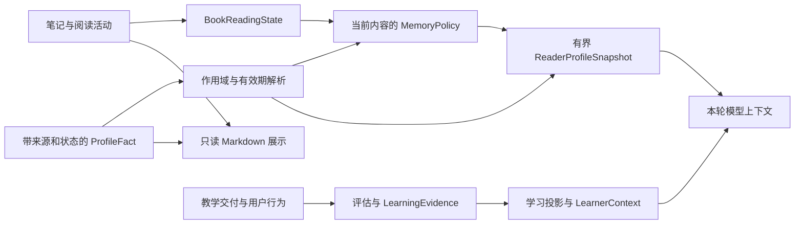

# 第 15 章 笔记 记忆与学习事实

第 14 章末，读者查完来源，返回原来的问题，准备写下一条笔记：“条件成立时才能使用结论。”过了一会儿，他又补充：“应该写成条件 A 与 B 同时成立。”随后，他对 Agent 说：“以后解释这类条件时，先给我一个反例。”

三句话都值得保留，但它们要求系统做的事不同。第一句产生一条属于这本书、带来源的笔记；第二句修改这条笔记；第三句表达一种解释偏好。若读者在一道题中借助提示答对了，系统还会得到另一种信息：在这次题面、这些帮助和这次尝试下，回答满足了评分标准。

把这些内容一起塞进“用户长期记忆”虽然容易，却会丢失最有价值的区别。下次 Agent 看到“先给反例”，应该把它当成偏好；看到“答对一次”，应该知道当时是否有帮助；看到笔记，则要知道它写在什么材料上，后来有没有被修改。本章的中心问题是：哪些信息需要跨聊天保留，怎样保持其来源和归属？

## 15.1 笔记、阅读记录、画像和教学事实

### 同一个读者，需要几种长期记录

从刚才的场景出发，可以先问每份数据将来要回答什么问题，再决定如何保存。

| 数据 | 本例中的内容 | 它直接支持的判断 | 当前主要载体 |
| --- | --- | --- | --- |
| 笔记与高亮 | 对条件的解释、标出的原文范围 | 读者保存了什么，附着在哪里 | MemoryDocument 中的 Record |
| 阅读活动 | 跳到某个 LID、提问、创建批注 | 哪些位置发生过哪些活动 | read、qa、note、highlight 记录与 BookReadingState |
| 用户画像 | “解释条件时先给反例” | 在什么范围内，应该怎样组织解释 | 带证据与状态的 ProfileFact |
| 教学事实与学习证据 | 题目实际交付、提示暴露、提交与评分 | 读者在明确条件下表现如何 | LearningStore 中的事件、评估与 LearningEvidence |

[MemoryStore](../../../crates/memory/src/lib.rs) 中的 Record 保存内容、类型、layer、book_id、anchor、citations 和来源聊天等信息。精确选区使用 selection_context，附在正文块或 PDF 区域上的笔记使用 note_placement。这些字段接续上一章的来源定位，使笔记正文和它的附着位置可以分别解释。

其中，layer 不是存储介质的选择器。Resident 创建的建议笔记可以处在 session 层，用户主动保留的笔记处在 long_term 层；两者都可以写入 memory.json。不能因为字段叫 session 就把记录理解为只在内存中存在，或者聊天结束后自然消失。当前保存方法没有按这个字段自动安排过期删除。

[BookReadingState](../../../crates/memory/src/reading_state.rs) 则按书聚合阅读活动。一次 qa 说明读者问过一个问题，一条 note 说明该处有笔记。兼容输出里仍保留 read_lids、focus_lids、puzzle_heat 等名称，但 puzzle_heat 的依据是 qa 记录数量。这个名字不能替代对行为含义的判断：反复追问可能来自困难，也可能来自深入探究。

### “关于读者的一句话”也要有类型和出处

普通 context 记录可以保存一段背景文字，而 [ProfileFact](../../../crates/memory/src/profile.rs) 进一步要求说明它是什么。payload 可以表达背景、能力自述、目标、解释偏好、约束或某个内容策略的扩展。scope 决定它属于全局还是某本书；applicability 决定它适用于所有内容、某类内容、论文子类型还是某个领域。这是两个独立维度。

例如，“以后读技术材料时先给反例”可以被表示成全局范围、适用于 technical_learning 的解释偏好；“读这本书时先给反例”则属于当前书。前者可以跨书使用，却不必影响每一种材料。

事实还保存 source、evidence、status、valid_until 和 supersedes。source 区分确定性行为、用户明确陈述和 Agent 推断；evidence 指向聊天轮次、记忆记录或书内位置。supersedes 则回答后来的纠正替代了哪条旧信息。信息在这些维度上仍然清楚，系统才能决定“可以存下来”和“可以用于这次回答”是否是同一件事。

### 物理存储也反映了任务差别

当前 [MemoryDocument](../../../crates/memory/src/document.rs) 是带版本的 JSON 文档，包含普通记录、画像事实、复核状态、排除依据和治理状态。它位于读者私人存储中，与构建后供阅读的 Book 数据分开。

教学过程使用 [LearningStore](../../../crates/memory/src/learning.rs) 管理的 SQLite 数据库。教学事件、冻结评估、学习证据和可重建投影共享这一私人学习存储；网络服务通过 [UserRuntime::open_service](../../../crates/server/src/user_runtime.rs) 分别打开该用户的 memory 与 learning 路径。

[ADR-0075](../../adr/0075-runtime-owned-evidence-backed-profile-memory.md) 提出的单一 memory.json 真相源，解释的是当时画像与普通记忆的设计。当前教学实现已经扩展到独立 SQLite。两者都属于读者私人状态，但不能据旧 ADR 把今天的学习事实都说成同一份 JSON，也不能把不同存储的写入说成一个共同事务。

## 15.2 私人数据的写入口

### 先让“保存这条笔记”成为一次明确操作

读者在界面按下保存时，[Server 的 save_user_note](../../../crates/server/src/lib.rs) 从当前 ReaderWorkspace 取得书的身份，并要求新笔记带一种来源：selection_context 或 note_placement，二者择一。附着型笔记的 anchor 和 citations 由位置派生；用户创建的笔记使用 long_term 层。

下面是一个教学输入，演示附着在正文块上的笔记形状。book_id 由服务端当前工作区提供；source-demo 是示意来源标识，真实请求必须使用当前材料的有效标识。

```json
{
  "type": "note",
  "content": "条件成立时才能使用结论",
  "note_placement": {
    "kind": "lid_block",
    "source_fingerprint": "source-demo",
    "lid": "1.1"
  }
}
```

MemoryStore::save_note 根据书、类型、锚点、内容以及具体来源字段计算内容身份。layer、保存时间和来源聊天不参与这一身份。于是用户重复点击保存，系统可以识别“仍是同一条内容与来源”。找到已有记录后，代码立即返回：

```rust
        if let Some(existing) = self
            .document
            .records
            .iter()
            .find(|record| record.mem_id == mem_id)
        {
            return Ok(NoteSaveOutcome {
                status: NoteSaveStatus::Existing,
                record: existing.clone(),
            });
        }
```

这个返回不会更新旧记录的时间、使用次数、来源聊天或修订号。它与通用 save 的 upsert 行为有意分开：通用保存可以替换同 ID 记录并增加 usage，严格笔记创建则把重复内容作为零变更结果。调用方因此能区分 CREATED 和 EXISTING。

Resident 的 [ReaderNote 分支](../../../crates/runtime/src/orchestrator.rs) 通过 Reader::save_note 创建 session 层笔记，只有 CREATED 才增加新建笔记的 AgentEffect。读者随后明确保留同一笔记时，Server 先得到 EXISTING，再调用 promote 把 session 变为 long_term。修改层级这件事由单独操作完成，重复创建本身仍然保持零变更。

通用 memory.save 也不能绕过这套新笔记入口：当前 Resident 分派会拒绝用普通内容保存方式创建缺少位置的 Note，要求使用 reader.note。第 10 章的工具授权决定动作能否进入执行入口，本章关注进入后保存什么以及怎样返回。

### 存储成功之后，才让内存接受新状态

如果只在内存中先改好笔记，再尝试落盘，失败后界面可能看到新内容，重新打开程序却又恢复旧内容。当前保存采用候选文档：先复制并修改候选，校验与持久化成功后，才替换 MemoryStore 正在使用的文档。关键顺序在 commit_document 中：

```rust
    fn commit_document(&mut self, candidate: MemoryDocument) -> Result<(), ToolError> {
        self.ensure_storage_available()?;
        candidate.validate().map_err(internal)?;
        persist_document_atomically(&self.path, &candidate, self.private_storage_enabled())?;
        self.document = candidate;
        Ok(())
    }
```

persist_document_atomically 将候选序列化到临时文件，完成同步，再通过旧文件备份和新文件切换提交。打开存储时还会处理相应的中断残留。对于本轮注入的写入路径失败，既有记录在内存和原磁盘文件中都保留；修改操作不会先删掉旧记录再尝试创建新记录。

保存还维护两个修订号。document_revision 表示整个记忆文档的变化，projection_revision 表示需要影响画像投影的变化。复核任务状态变化可以只推进前者，内容或画像变化通常同时推进两者。下一次投影不需要把“后台任务更新了一次状态”都当成读者事实变化。

读取位置是一种频繁的小事件。[enqueue_read 与 flush_pending_reads](../../../crates/memory/src/lib.rs) 将同一 book_id、LID 的多次触达合并，累计 touch_count 和最后时间，在一次候选提交中写入。失败后待写批次保留。这降低了每次移动都重写整个 JSON 的成本，同时使已提交活动与待写活动有各自的状态。

### “请记住我的偏好”怎样进入画像

偏好写入不能依赖主 Agent 恰好想起调用一个工具。[前台记忆意图处理](../../../crates/runtime/src/memory_intent.rs) 位于请求准备流程。ADR-0075 将这段职责称为 MemoryIntentGate，当前源码入口是 scan_memory_intent 与 evaluate_memory_intent：先识别明确的记住、纠正或忘记意图，需要时用结构化提取生成候选，再返回可应用操作、待澄清、敏感内容确认或拒绝结果。[Server 的 prepare_agent_chat](../../../crates/server/src/lib.rs) 所在准备链路据此处理操作，随后组装本轮画像快照。

真正改写存储的是 [MemoryOp](../../../crates/memory/src/operation.rs)。Remember 在同一候选文档中加入用户明确陈述的 ProfileFact 和保存其依据的 profile_evidence 记录。后者不参与普通 recall，也不能被普通 save、replace 或 delete 当作一般笔记修改。画像值与其依据一起提交，避免出现“偏好已经更新，却找不到这次记住请求”的半份结果。

普通聊天结束后，系统还可以通过 [ReviewJob](../../../crates/memory/src/review.rs) 复核增量轮次。模型执行由 [ReviewExecutor](../../../crates/runtime/src/memory_review.rs) 完成，候选进入存储时再检查作业范围、证据轮次、书归属和排除规则。commit_review_result 将新事实、意图观察、作业完成状态及 reviewed_through 水位放进同一个候选文档，成功后一起前进。

本地 [Host 的 ReviewSchedule](../../../crates/server/src/host.rs) 当前包含空闲 60 秒触发、八个未复核用户轮次触发，以及启动和重试分支。这是调度实现，不是用户说一句话就同步跑完全部推断的承诺。历史聊天的语义提取则走 [backfill](../../../crates/memory/src/backfill.rs)，由选定范围进入候选复核，历史提取得到的信息保持 pending，不能把旧聊天迁移等同于自动确认新画像。

### 谁说的，决定它以什么状态开始

同样一句“需要更多反例”，如果出自用户明确要求，与 Agent 从两次追问中推断出来，应该获得不同的使用资格。[initial_status](../../../crates/memory/src/profile.rs) 给出了当前交互中新事实的起点：

```rust
        (FactSource::UserStated, _) => Ok(FactStatus::Confirmed),
        (FactSource::AgentInferred, ProfileScope::Book { .. }) => Ok(FactStatus::Provisional),
        (FactSource::AgentInferred, ProfileScope::Global) => Ok(FactStatus::Pending),
```

确定性行为只能在书范围内形成 confirmed 事实。用户明确陈述可以在书内或全局 confirmed；Agent 的书内推断是 provisional 弱提示，全局推断必须先 pending。敏感信息还有单独规则：自动推断不能产生敏感画像，用户主动请求保留时需要相应确认，秘密类内容拒绝保存。

这套区分把长期使用权与提取能力分开。模型能够组织一条候选，并不意味着它有权把这条候选扩展为每本书都适用的用户属性。

## 15.3 从事实生成派生投影

### 下一个问题只需要相关的一小部分

现在读者打开新聊天，问：“再解释一下刚才两个条件的关系。”系统需要带入相关偏好与活动，但没有必要把所有笔记和聊天全文塞回模型。当前路径先从事实库解析适用事实，再由内容策略生成阅读状态候选，最后装入 [ReaderProfileSnapshot](../../../crates/memory/src/projection.rs)。



图中有两条进入本轮上下文的私人信息路径。通用画像解释偏好、背景与阅读活动；教学上下文解释当前对象和能力轴上的表现。两条路径各自带着出处与有效范围，Model 不需要从一段混合摘要中猜测哪些内容可信。

### 先选出适用事实，再决定放多少

resolve_profile_facts 先排除 pending、superseded、expired 以及在当前 now 下已经过期的事实，随后匹配 scope 与 applicability。对于同一语义键，它依次比较书内范围、适用性具体程度、来源权威、状态、更新时间和稳定 ID。

顺序很关键。当前实现先比较范围，再比较来源权威；所以某本书的 provisional 推断，可能优先于相同语义键的全局用户陈述。用户纠正相对普通陈述的优先级是在前面维度相同之后生效。不能用一句“用户说的永远优先”概括内部事实解析顺序。

例如，设三个教学事实都使用同一个解释偏好键：全局 confirmed 值为“详细讲解”，书 A 的 provisional 值为“多给例子”，另有一个全局 pending 值为“只给结论”。在书 A 中解析得到“多给例子”；在书 B 中得到“详细讲解”；pending 值不参与竞争。若用户当前明确要求“这一次只要结论”，快照的序列化规则另行声明当前消息优先于历史数据。事实选择和当前请求的优先级属于两个步骤。

确定适用内容之后，再控制容量。SnapshotBudgets 的默认值是：

```rust
        Self {
            global_core: 512,
            applicable_global: 384,
            book_state_core: 512,
            profile_projection: 384,
            pending_context: 256,
        }
```

前两栏分别装通用全局事实和适用于当前内容的全局事实，第三栏装书内核心事实，第四栏装内容策略候选，最后一栏可放尚未完成复核的有限用户上下文。合计为 2048 个估算 token 的条目预算。每栏独立选择完整条目，放不下的条目跳过，不截断到半句话。

这里使用 estimate_snapshot_tokens：基本汉字按每字符四个计量单位，其他字符按一个单位，再除以四向上取整。标题、规则等外围序列化文字还会占空间，因此 2048 不是整段提示词的 Provider 实测 token 上限。这个预算解决的是条目增长问题，其计量口径与第 11 章的实际模型上下文预算需要分别说明。

### 内容策略解释活动，核心保存使用规则

[MemoryPolicyRegistry](../../../crates/runtime/src/memory_policy.rs) 根据当前内容的策略标识与版本，产生可投影的状态和候选。technical_learning 可以把接触、重访、用户确认理解等活动组织成技术阅读状态，同时保留学习假设的弱提示身份；paper 可以围绕阅读模式、阶段及导读问题进展组织状态。若策略缺失或版本不匹配，则使用 neutral 策略，并在结果中保留回退原因与 orphaned 状态。

这些策略接收当前书的确定性活动与已经解析的事实。它们解释“这一类材料怎样使用这些信号”，事实的确认、纠正与遗忘仍由记忆核心负责。普通 context 记录也不会因为策略存在就自动成为正式画像。

[ProfileContextCache](../../../crates/runtime/src/profile_context.rs) 用 projection_revision 和完整 SnapshotRequest 作为缓存依据。切换书、当前上下文改变或投影修订变化时重新派生，快照不作为一条新的永久聊天消息保存。to_prompt_data 将值编码为引用数据，并写明只读数据与当前用户消息的优先关系。

旁边的 [reader-profile.md 与 reading-handbook.md](../../../crates/memory/src/markdown.rs) 是供人检查的单向展示。真相源提交后会尝试重建它们；展示写入失败不会把已经成功保存的事实回滚，文件状态可显示 current、stale、missing 或 unreadable。手工改这两个文件不会反向修改事实库。

这也是两个修订号的用途：文档管理活动可以继续变化，而派生快照与 Markdown 用 projection_revision 表达自己基于哪一版事实。修订匹配回答的是来源版本，时间有效性和后台复核进度还需要各自判断。

## 15.4 更新、纠正、撤销与过期信息

### 改一条笔记时，哪些身份应该改变

读者把“条件成立”改为“条件 A 与 B 同时成立”，内容已经变化。如果仍把原来的内容身份当作新内容的身份，后续重复保存与查找就会混淆。因此 [replace](../../../crates/memory/src/lib.rs) 重新计算 mem_id，在一个候选文档中把原位置的记录替换掉。

这次修改继承原来的书、层级、来源聊天及默认来源位置。修改正文时不传 selection_context，就继续使用原选区；显式传入新选区时，则重新推导锚点与 citations。附着在正文块上的笔记不能通过这个参数偷偷改成选区笔记。新身份若已经属于另一条记录，返回 MEMORY_REPLACE_CONFLICT，保留原状。

本轮用当前 MemoryStore 实际重放了下面这组教学序列。夹具起初没有记录，书为 book-a，位置为 1.1，来源为 source-demo；N1、N2 是表中对实际生成 ID 的简称。

| 操作 | 返回与身份 | 保存层级 | document_revision / projection_revision | 记录数 |
| --- | --- | --- | --- | --- |
| 创建 session 笔记“条件成立时才能使用结论” | CREATED，N1 | session | 1 / 1 | 1 |
| 以相同内容与来源再次创建，请求层级为 long_term | EXISTING，仍为原记录 N1 | session | 1 / 1 | 1 |
| 显式 promote：session → long_term | N1 不变 | long_term | 2 / 2 | 1 |
| replace：补全“条件 A 与 B 同时成立” | N2 替换 N1 | long_term | 3 / 3 | 1 |

第二行直接调用的是存储方法。真实用户保存入口得到 EXISTING 后，还会执行第三行的提升；这解释了“重复创建不变更”与“用户保留后成为长期笔记”怎样同时成立。重放同时断言来源聊天和附着位置得到继承，最后仍然只有一条记录。

位置修改也有专门操作。reanchor 为附着型笔记重新生成位置、锚点、citations 和身份，保留正文、层级、使用信息及原生成时间。新身份冲突或写入失败时，旧记录保留。它与“把解释写得更准确”的 replace 分开，使界面能够表达究竟是在改观点还是在调整附着位置。

### 纠正画像，要留下“替代关系”

假设读者之前说“详细解释”，现在改为“先给简短结论，需要时再展开”。新偏好需要生效，但系统也需要知道它为什么压过旧偏好。[MemoryOp::Correct](../../../crates/memory/src/operation.rs) 在同一个候选文档中创建新的用户陈述与依据，把原事实设为 superseded，并让新事实的 supersedes 指向原事实。

因此，纠正后的正常解析只使用新事实，旧值作为已经被替代的记录仍可解释这次变化。改变 scope 也采用类似方式：[治理入口的 ChangeScope](../../../crates/memory/src/governance.rs) 创建一个用户确认的后继事实，不在原事实上直接改归属。

治理请求还带 expected_document_revision 和 operation_id。对于没有处理过的请求，如果界面基于的文档版本已经过时，存储拒绝变更；如果同一 operation_id、同一请求已经成功，则先返回原回执，再考虑当前修订号。这样既能发现“拿旧页面覆盖新事实”，也能让丢失响应后的重试找到原结果。复用 operation_id 却改变请求内容会得到冲突。

界面的“撤销”也要落到这些具体操作。[buildUndoProfileAction](../../../packages/web/src/profile-memory.ts) 对新记住的事实生成 forget；对刚完成的纠正，则取旧事实的值，生成针对当前事实的一次新 correct。后者是再次明确表达旧值，不是把某个已经 superseded 的记录直接恢复成当前事实。

### 遗忘不能只隐藏一条事实

“这条信息不对，请改成另一条”和“请忘记这件事”有不同的保留要求。前者可以保存替代链，后者需要清除相关值。[reduce_forget](../../../crates/memory/src/operation.rs) 从目标事实沿 supersedes 关系找到整条相连纠正链，移除这些事实及其 profile_evidence 原文，剥离其他事实中已经被排除的依据，并重新计算依赖它们的全局候选。

留下的是不含原文的 EvidenceExclusion，作用是阻止同一依据在下一次后台复核时重新生成已经遗忘的画像。否则一个表面成功的删除，很可能在重新扫描旧聊天后又出现。

这个操作针对画像及其派生依据。原始聊天仍由会话存储保存；删除画像不等于删除聊天，也不等于删除某本书里的普通笔记。若用户要限制以后的自动收集，[CollectionRule](../../../crates/memory/src/governance.rs) 可以按匹配条件阻止复核与全局候选生成。规则不会自动清除已经存在的事实，用户后来明确要求记住一次信息也可以单独执行。

pending 候选可以确认或拒绝；拒绝使它失效。有效期则是另一条维度：valid_until 到达后，带 now 的解析不再采用该事实，即使其 status 尚未被改成 expired。状态迁移与时间过滤要分别解释，才能判断“已经不用于回答”和“存储中已经删掉”之间的区别。

### 学习证据的纠正为什么先变成 uncertain

回到第 13 章的练习。如果读者补充：“刚才那题我参考了示例”，不能简单把一条“独立答对”改成“已经掌握”。这个补充首先否定了原来的解释条件，却没有提供一次新的独立表现。

[LearningStore::correct_evidence](../../../crates/memory/src/learning_evidence.rs) 的处理非常直接：

```rust
        let mut next = self.evidence(id)?;
        next.evidence_id = format!("correction:{operation}");
        next.supersedes = Some(id.into());
        next.correction = Some(text.into());
        next.status = AssessmentStatus::Uncertain;
        next.interpretation = "原解释已被用户纠正，等待新的表现依据".into();
        next.interpreter_version = "learner.correction.v1".into();
        self.append_evidence(&next)
```

旧证据保留，新证据追加并指向旧证据。它没有改写当时实际交付的题面，也没有重新评分那次提交；改变的是系统现在怎样解释这份表现依据。

rebuild_learner_projection 从证据序列找出已经被替代的项，对剩余项按对象、对象版本、材料版本与能力轴聚合。答对且有帮助时计为 assisted_support；没有帮助但尝试次数大于一次时计为 revised_support；其余符合条件的正确回答才计为 independent_support。部分满足、未满足与不确定也分别计数。

本轮重新执行了现有学习证据用例：一条独立答对、一条有帮助答对、一条改答正确，以及一条没有评估结果的提交。最初只有前三条形成相应已评估证据，支持计数为 `(1,1,1)`。纠正独立答对的解释后，计数变为 `(0,1,1)`，uncertain 增加到 1。重复派生不会把旧证据重新计入。

投影自身在 SQLite 事务中读取并替换。本轮用既有测试中的数据库触发器让投影写入失败，旧投影仍然保留；移除触发器后重新构建得到纠正后的结果。清空派生表和重新打开数据库也能得到相同投影。这里验证的是可重建性和事务行为，原始交付没有因为投影失败而被改写。

[Server 的 refresh_learning](../../../crates/server/src/teaching.rs) 对比证据水位和解释器版本，需要时重新构建，再生成当前 LearnerContext。[ADR-0143](../../adr/0143-teaching-trace-assessment-and-learning-evidence.md) 所要求的“事实与判断分开”，由这条追加证据、替代解释、重建投影的路径落到代码中。

## 15.5 跨书使用与当前阅读现场

### 存在同一私人库中，不代表每次都读取全库

读者换到书 B，先前关于书 A 的笔记仍属于这个读者，但未必应该进入书 B 的回答。底层 [MemoryStore::recall](../../../crates/memory/src/lib.rs) 可以按 book、LID、type、layer 和文本子串过滤；不指定 book_id 时可以查询跨书记录。它采用确定性筛选和 ID 排序，没有在这个方法中执行语义向量召回。

Resident 暴露给本轮 Agent 的 memory.recall 则主动填入当前 Run 的书。实际分派中，查询开头是：

```rust
            let q = RecallQuery {
                book_id: Some(book.base.book_id.clone()),
                lid: sget("lid").map(String::from),
                mem_type: sget("type").map(String::from),
                layer: sget("layer").map(String::from),
                text: sget("text").map(String::from),
            };
```

因此，要准确解释“跨书记忆”，至少要区分三个层面：同一用户持有跨书事实，底层存储支持某种查询范围，当前工具实际允许什么查询。普通笔记的跨书存放与画像的跨书自动注入是两条路径。笔记中保留的 citations 也只是记录出处，不能直接替代第 9、12 章中本轮实际观察到的回答来源。

### 一个书内偏好怎样成为全局候选

最直接的路径是用户明确表达全局偏好。另一条路径是系统观察到多个书范围内的相同事实，再提出全局候选。[reconcile_global_promotions](../../../crates/memory/src/global_consolidation.rs) 按语义键、适用性与结构化 payload 聚合当前有效的书内事实；确定性行为、敏感信息和扩展 payload 不进入这条普通提升路径。

当前门槛是至少两本书、至少三个不同证据 ID。同一本书里反复出现三次，不满足跨书条件；两本书总共只有两个证据，也不足以生成候选。这里的“不同依据”由去重后的证据身份计数，并不证明这些观察在统计意义上互相独立。payload 的归组也是结构化相等，而不是再次让模型判断两种措辞是否等义。

满足条件之后，系统创建的仍是 AgentInferred、Global、Pending 事实。用户确认后它才进入一般快照。来源事实过期、被纠正或遗忘时，相关提升状态会重新计算；失去支持的派生全局事实可以被移除。跨书结论保留着与支持依据的联系，没有变成脱离来源的永久标签。

本轮执行的既有用例分别验证了同书重复不提升、两书三依据产生 pending 后经确认进入快照，以及来源变化引起的反向重算。这些结果说明规则如何工作，没有把人工测试事实写成真实读者行为实验。

### 后台 Run 仍要使用原来的归属

用户可能在 Agent 工作期间切换书或聊天。私人事实应写给启动 Run 的用户与书，界面动作又不能突然落到新打开的现场。[RunScope](../../../crates/server/src/run_scope.rs) 因此保存用户、工作区代次、书发布、聊天与 turn 等归属。检查用户归属和检查 Reader 现场是不同操作；private_user 使用原 Run 的 Book 及原聊天消息构造私人上下文，场景动作还要匹配工作区、代次、发布与选中聊天。

[UserRuntime](../../../crates/server/src/user_runtime.rs) 持有一个读者的 MemoryStore、私人学习库入口、聊天存储和画像缓存。visitor 构造没有 Resident 用户身份与私人历史写根。这接续了第 3、10 章的边界：共同的 Book 读取能力不意味着 MCP 调用方同时取得读者的私人画像。

学习上下文还有更细的范围。learner_context 只选择当前目标对象、当前材料版本和匹配对象版本的投影行；它保留能力轴、帮助、尝试和证据引用，并对条目数与字符量设限。在书 A 中得到的一次表现，不会仅凭相似的对象名称就成为书 B 的能力事实。

### 下次回答能解释自己带入了什么

模型收到画像快照，并不意味着可以证明某句话由这条偏好导致。当前 [ProfileUsageTrace](../../../crates/runtime/src/orchestrator.rs) 分开记录 snapshot_revision、injected_fact_ids、claimed_used_fact_ids 和 influences。前两项来自 Runtime 实际注入，后两项描述模型声称采用的事实和影响维度。

于是，系统至少可以回答：“本轮给模型提供了哪一版、哪些画像事实？”模型自述的使用情况可以辅助观察，但仍是较弱的使用声明。偏好最终是否改善解释，需要另行通过任务与效果评测判断。

经过这条链路，章首的三句话各有去处：笔记按内容和来源建立身份，编辑替换该记录，解释偏好通过有证据的事实进入适用快照。教学表现则继续沿交付、行为、评估和证据形成独立的条件化解释。跨聊天保留的价值，来自这些信息在下一次使用时仍然能够说清来历。

## 已知边界与本轮验证

本章于 2026-10-07 回读工作区，Git 基线为 4e0b68e。依据包括 MemoryStore、画像操作与投影、治理、后台复核、私人学习存储，以及 Server、Runtime 和界面相应入口。ADR-0075 用于解释画像设计，ADR-0143 用于解释教学事实与判断的分离；具体行为采用当前实现。相同 Git 提交没有代替文件回读。

**选区笔记入口尚未核对完整原文关系。** save_user_note 对选区逐一检查 LID 可读，MemoryStore 再检查范围非空、起止关系和锚点结构；它们没有执行提问入口使用的 validate_and_rebuild_selection_quote。本轮直接向存储传入 partial 选区、所填引文和 `[10000,10001)` 范围，记录被接纳且保留这些字段。存储本身不持有 Book，因此该重放确认的是结构接纳；Server 路径只验证 LID、未回切核对的判断来自源码阅读。公开保存接口可以接到越过原文长度的范围或不匹配的 resolved_quote，不能把第 14 章的问题引文校验保证扩大到笔记保存。本轮未调用真实 HTTP。

**Markdown 活跃事实没有按 valid_until 过滤。** active_markdown_facts 只筛选 confirmed 与 provisional。本轮创建一条 10:00 过期的偏好，用 11:00 的解析上下文得到零条适用事实，但重新生成的 reader-profile 与 handbook 仍包含该值。文件修订号即使是 current，也不代表展示满足同一时间有效性条件。这是已经局部重放的展示不一致，产品代码未修改。

**部分适用性维度尚未接入当前快照准备入口。** 存储解析支持 PaperSubtype 与 Domain，但 user_profile_snapshot_request 当前只填书、content_profile 和 now；前台意图准备也传入空的 subtype、domain。仅凭底层存在这些枚举，不能声称当前 Resident 已按论文子类型或领域自动匹配画像。这一限制依据实际连接代码确认。

**profile_status=current 不表示全部后台复核已经完成。** 当前 Server 在私人存储不可用，或本书有未完成作业且存在 last_error 时标记 stale；普通排队、尚未报错的作业不因此标记 stale。只有相应失败情形才补入受限 pending_context。这个字段表达当前实现选择的降级状态，不能用来证明复核水位已经追上全部用户轮次。

本轮实际执行 32 个离线局部用例，其中 28 个为当前 memory 模块的既有用例，覆盖笔记创建、提升、重定位和替换，写入失败，阅读活动合并，事实来源与范围，纠正和遗忘，治理重试，快照预算，跨书提升，复核提交与学习投影；另四个为笔记修订序列、作用域与预算算例和上述两个边界观察。边界输入被接纳、过期值仍展示，是重放得到的当前行为，不能记为功能正确。

验证在书稿临时目录复制当前模块及夹具运行，ToolError 使用相同字段的最小配套类型，learning.rs 只移除 TypeScript 导出标注以免生成产品文件。保存使用临时 JSON，学习投影使用真实临时 SQLite，测试存储以非私人模式打开。没有运行整套产品测试、真实模型、HTTP、浏览器或系统权限验收，也没有模拟真实断电。Runtime 与 Server 的连接关系按源码核对，最终链接、符号、摘录和算例检查见 [SOURCES](../SOURCES.md#第-15-章续写验证记录)。

## 源码选读

沿一次“保存、纠正、再次使用”的任务回读，可以分四步。

1. 从 [save_user_note](../../../crates/server/src/lib.rs) 进入 [MemoryStore](../../../crates/memory/src/lib.rs) 的 save_note、promote、replace、reanchor 和 commit_document，分别观察新建、层级、内容、位置与提交。
2. 从 [evaluate_memory_intent](../../../crates/runtime/src/memory_intent.rs) 进入 [MemoryOp](../../../crates/memory/src/operation.rs) 和 [画像治理](../../../crates/memory/src/governance.rs)，观察明确请求怎样形成带依据的变更，以及重试怎样找回回执。
3. 从 [事实解析](../../../crates/memory/src/profile.rs) 进入 [快照投影](../../../crates/memory/src/projection.rs)、[内容策略](../../../crates/runtime/src/memory_policy.rs) 和 [跨书提升](../../../crates/memory/src/global_consolidation.rs)，区分适用性、容量与确认状态。
4. 从 [学习证据](../../../crates/memory/src/learning_evidence.rs) 的 correct_evidence、rebuild_learner_projection，回到 [Server 教学入口](../../../crates/server/src/teaching.rs) 的 refresh_learning 与 learner_context，观察被纠正的旧解释怎样退出当前判断。

## 面试时怎样解释

**如果被问到“这个阅读 Agent 怎样维护长期记忆，并允许用户纠正”，可以这样回答：**

“我们先按未来用途区分数据。笔记保存内容与来源，阅读活动保存发生过的动作，画像事实保存带证据、作用域和确认状态的偏好或背景，教学证据保存具体任务与帮助条件下的表现。普通笔记和画像进入带修订号的私人 JSON，教学事实进入私人 SQLite。保存先构造候选，落盘成功再更新内存；修改笔记重新建立内容身份，纠正画像建立替代关系，遗忘会删除纠正链中的值并留下无原文的排除依据。每轮由 Runtime 按当前书、适用条件和预算生成画像快照，跨书推断先待确认。教学纠正采用追加证据和重建投影，所以不会把一次有帮助的答对直接改写成已经掌握。”

1. **为什么不能只给 Agent 一个 memory.save 工具？**

   工具是否被调用依赖模型当轮选择。当前实现把明确记住请求、普通聊天复核与快照消费放到 Runtime 和 Host 流程中，再用确定性操作维护证据、状态和提交边界。

2. **重复保存和内容修改为什么是不同操作？**

   重复创建同一内容与来源返回原记录，不应更新层级或时间；修改产生新内容身份，需要一次性替换旧记录并处理目标冲突。用户明确保留建议笔记则单独提升层级。

3. **画像已经写到 JSON，为什么还要有投影？**

   事实库服务保存和治理，模型只需要本轮相关、适用且容量有限的部分。投影还把来源状态、书内活动与内容策略组织成一致输入，避免每次依赖模型从全量记录中重新判断。

4. **用户纠正是不是总会压过其他记忆？**

   在当前事实解析中，先比较书内范围和适用性，再比较纠正、明确陈述等来源权威。当前用户消息又有独立的最高优先规则。回答时应说明具体层次，不能把多维解析说成一个简单分数。

5. **为什么“忘记”以后还保留一个 ID？**

   原值及其画像依据已经删除，留下无原文的证据排除标识，用于阻止后台从同一依据重新生成该事实。原始聊天的生命周期另由会话存储管理。

6. **两本书里都出现某个偏好，能否直接认定为全局偏好？**

   当前规则还要求三个不同依据，满足后也只生成 pending 的全局推断。用户确认才进入一般快照，支持来源发生变化还会触发重算。

7. **一次答对被纠正后，为什么把证据设为 uncertain？**

   纠正说明原解释已不可靠，却不自动提供新一次表现。系统追加替代证据，让旧解释退出投影，保留题面、回答和帮助记录，等待新的依据。

私人事实已经有了明确的保存和更新方式，聊天本身还需要能够持续增长、在中断后恢复，并连接这些事实与交付结果。接下来进入[第 16 章 会话日志与恢复](16-会话日志与恢复.md)，沿一份不断追加的会话日志继续追踪这些关系。
