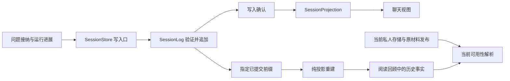

# 第 16 章 会话日志与恢复

第 15 章中，读者保存并修改了一条关于条件的笔记，又告诉 Agent：“以后解释这类条件时，先给我一个反例。”下一次打开聊天，他还想知道：这条偏好是在什么问题之后提出的，哪些原文真正进入了回答，Agent 建议的笔记后来有没有保留，还有哪个问题没有讲完。

这时，仅有笔记和画像还不够。它们说明当前保存了什么，聊天则需要说明事情怎样发生。尤其是在 Agent 已经调用工具、界面已经显示一部分回答，而进程突然停止的时候，系统必须区分三个事实：问题已经接纳，某项动作可能已经发生，最终回答是否已经可靠保存。

最直接的办法，是每次把整个聊天对象重新写成 JSON。它容易实现，也容易读取；但随着聊天增长，写入的主要部分会逐渐变成旧内容。另一种直接办法，是重启后重新执行未完成的问题。这样虽然可能重新得到回答，却也可能重复创建笔记或再次改变阅读现场。本章沿一次“继续解释条件，并留下阅读成果”的请求，回答怎样保存持续增长的聊天，并在中断后解释已经发生的事。

## 16.1 整份快照与增量保存的工作量

### 聊天越长，下一次保存应该付出什么成本

假设一次提交平均增加 k 字节，从空历史开始，一共提交 n 次。这里把消息、回执等新增内容合并为一个逻辑增量，暂时忽略字段名称和文件元数据。若第 i 次提交都重写当时全部历史，累计写入量为：

\[
W_{snapshot}=k\sum_{i=1}^{n}i=\frac{k n(n+1)}{2}
\]

若每次只追加本次增量，累计写入量则为：

\[
W_{append}=kn
\]

两者的比值是 `(n+1)/2`。这是累计写入量的教学模型，计数单位是提交，不是用户问题，也不是模型 token。以 k=4 KiB、1 MiB=1,048,576 字节计算：

| 提交次数 n | 逐次重写快照的累计写入 | 逐次追加的累计写入 | 前者相对于后者 |
| --- | ---: | ---: | ---: |
| 100 | 19.73 MiB | 0.39 MiB | 50.5 倍 |
| 1,000 | 1,955.08 MiB | 3.91 MiB | 500.5 倍 |
| 10,000 | 195,332.03 MiB | 39.06 MiB | 5,000.5 倍 |

例如，1,000 次提交分别对应 2,050,048,000 字节和 4,096,000 字节。若原来已有一份 B 字节的历史，之后又重写 n 次，还会额外重复写入 nB。把多个聊天一起放进同一快照，无关聊天也会进入这项成本。

因此，选择追加日志的直接理由是让普通新记录的落盘工作与新增内容相关。它没有自动消除请求准备、内存复制、历史比较和读取的成本，也没有把每次提交变成固定大小：一份新的压缩检查点，或者一次明确的历史后缀修订，仍然要保存自身携带的内容。

### JSONL 要改变保存单位

[ADR-0152](../../adr/0152-resident-linear-jsonl-session-log.md) 选择按聊天维护线性 JSONL：一行是一条会话事件，记录本次变化及其身份。它与把整个 AgentHistory 序列化后追加到下一行，有实质区别。后者只是换了扩展名，旧历史仍会反复出现。

当前 [session_runtime::progress](../../../crates/server/src/session_runtime.rs) 先比较已保存消息与本轮可持久化消息的公共前缀。如果旧消息仍是完整前缀，就只写 message.appended 的新增后缀；如果旧内容被清理或截断，则写 history.revised，明确从哪个消息位置开始替换。活动记录也按同一 turn、同一 step_id 比较，只有状态变化才追加。

决定差异范围的函数很短：

```rust
pub(crate) fn revision(before: &[Message], after: &[Message]) -> Option<MessageRevision> {
    let from = before.iter().zip(after).take_while(|(a, b)| a == b).count();
    (from != before.len() || from != after.len()).then(|| MessageRevision {
        from,
        suffix: after[from..].to_vec(),
    })
}
```

代码摘自 [session_runtime.rs](../../../crates/server/src/session_runtime.rs)。from 是原始消息数组的零基位置，与日志事件序号分别计数。假设已保存 `[system, user₁, assistant₁]`，本次消息是原数组再加 user₂，那么 from=3，只需追加 user₂；若失败处理把数组恢复到 `[system, user₁]`，from=2、suffix 为空，投影就从这个位置截断。

### 一次真实追加留下了什么证据

项目有一份与这个问题直接相关的历史记录。2026-10-02 的 Linux release `ex13-jl-20261002` 在隔离账号中，对已经保存的演示现场进行一次真实 Provider 追问，结果为 completed，回答中的 B=8 符合任务预期。原聊天文件为 39,631 字节，本次增加 19,280 字节，得到 58,911 字节；原有前缀和另外三个聊天文件保持不变。数字来自[发布记录](../../Linux上线-EX12-EX13-JL.md)及其[追加写入回执](../../performance/linux-ex13-jl-20261002/provider-smoke.json)。

这个实验观察的是一次完整运行带来的实际增量，里面可以有消息、活动、来源和终态等多条记录。它不是“每个问题固定增加 19,280 字节”的容量规则。与前面的教学公式结合，可以得出两个不同层次的结论：公式解释重复重写为什么会放大累计写入；这次历史观测说明，当时的真实运行确实保持了旧前缀和无关聊天文件。

## 16.2 按聊天追加 JSONL

### 先找到这次请求属于哪个聊天

读者的聊天由 [UserRuntime](../../../crates/server/src/user_runtime.rs) 持有，SessionStore 再按聊天 ID 管理 SessionLog。书决定内容范围，用户决定私人归属，聊天决定日志文件，turn 决定这一轮问题与结果。运行完成时使用原 AgentTurnRef 找回 session_id 和 turn_id，即使读者已经切换到别的书或聊天，结果仍写回原来的归属。

[SessionPaths](../../../crates/server/src/session_store.rs) 从原 history 路径的父目录派生保存位置：

```rust
        Self {
            root: parent.join("agent-sessions"),
            selection: parent.join("agent-chat-selection.json"),
            presentations: history.with_extension("presentations"),
        }
```

agent-sessions 目录下，每个聊天对应 `s_<编码后的聊天ID>.jsonl`。编码使用无填充的 URL-safe Base64，可以从文件名还原原 ID；它是路径表示，不是另一套聊天身份。聊天选择另存于 agent-chat-selection.json，只保存每本书当前选中的聊天。切换聊天于是只需更新这份小元数据，不必重写聊天正文。呈现成果继续使用原来的 presentations 路径，日志只保存它与聊天的关联。

这一划分也决定了恢复顺序。SessionStore::open 先读取各个日志并重建聊天，再修复选中项：指向不存在或不属于该书的聊天的选择会被清除，没有有效选择时从已有聊天中按更新时间等条件选取。聊天目录是会话是否存在的依据，选择文件只表达当前选中了谁。

### 一行同时说明版本、位置和含义

[SessionEvent](../../../crates/server/src/session_event.rs) 把共同字段放在外层：version、seq、at、可选 turn_id，以及展开为 kind/payload 的事件体。下面是一个教学性的空聊天起点，身份和标题是示意值。为阅读方便使用格式化 JSON；实际文件每条事件序列化成单行，并在末尾追加换行。

```json
{
  "version": 1,
  "seq": 1,
  "at": "2026-10-07T10:00:00+08:00",
  "kind": "session.created",
  "payload": {
    "session_id": "chat-demo",
    "book_id": "book-demo",
    "title": "条件与反例",
    "created_at": "2026-10-07T10:00:00+08:00",
    "messages": []
  }
}
```

session.created 建立基线。之后的问题接纳、消息增长、活动变化、来源绑定和回合完成都成为新的事件。每行有自己的 seq，使程序能够验证“这是上一条之后的下一条”，而不依赖时间戳是否精确、是否相同。

这里的 JSONL 也不是 SSE 的磁盘副本。第 12 章的 SSE 服务实时观察，传递草稿、活动与快照；本章的事件服务持久化和重建。一次工具动作可以产生几次公开通知，也可以对应几条会话事实，两边不要求一一对应。逐 token 保存草稿既没有必要，也不能替代最终的消息与结果合同。

### 先保存，再让投影视图向前走

[SessionLog::append](../../../crates/server/src/session_log.rs) 在序列化之前清理不应进入历史的大段制作内容和工具发现正文，随后写入单行事件。默认写路径的确认顺序是：

```rust
            file.write_all(bytes)?;
            // File is unbuffered; flush documents the boundary and sync_all is
            // the durable acknowledgment before publishing the projection.
            file.flush()?;
            file.sync_all()
```

上述过程成功后，append_with 才推进已提交字节位置，应用事件并清除不确定状态：

```rust
        self.committed_len += bytes.len() as u64;
        self.projection.apply(event);
        self.uncertain = None;
        Ok(())
```

两段均摘自 [session_log.rs](../../../crates/server/src/session_log.rs)。committed_len 是文件的字节位置，through_seq 是投影处理到的事件位置。它们一起回答“下次从哪里写”和“现在可以向调用方承认哪些事实”。写入失败时，两者不会因为内存里已经构造出候选结果而提前前进。

SessionStore 在日志确认后，再把同一条经过清理的增量应用到对外使用的 AgentHistory 视图。普通追加无需为此复制整份旧 transcript；处理不确定写入的 settle 路径则可以从日志投影重新取得完整会话。落盘权威与便于服务请求的内存对象保持了明确先后关系。

## 16.3 事件序号、冻结历史位置与纯投影

### 已经接纳的问题，应当看到哪一段历史

假设章首的下一次提问到达时，这个聊天已经提交到 seq=41。接纳新 turn 时，系统可以把“当时看到的历史”表示成位置 41，而无需把整份消息再嵌入第 42 条事件。

当前 [HistoryPosition](../../../crates/server/src/session_event.rs) 就表达这一点：

```rust
pub(crate) enum HistoryPosition {
    Committed { history_through_seq: u64 },
}
```

SessionStore::accept 先处理可能存在的不确定追加，再取得当前 through_seq。网络准入提供的 FrozenTurn 原来携带消息数组，保存时经 map_messages 转为这个已提交位置。FrozenTurn 中的用户、工作区代次、材料发布、问题、Reader 现场、Provider 绑定与教学准备等元数据仍然保留。被冻结的是执行输入的含义；对其中的大段历史，则用一个可回读的位置表达。

当 [run_admission::frozen_input](../../../crates/server/src/run_admission.rs) 需要恢复消息时，它读取 `log.at(history_through_seq)`，取得该位置的原始消息投影。消息压缩继续由 Runtime 既有路径处理，不能把测试辅助方法 frozen_messages 返回的压缩后消息，直接当成生产恢复入口的全部行为。

本例中的 41、42 是教学设定。关键关系是：turn.accepted 自己占据下一个事件位置，而它引用的是接纳之前已经确认的前缀。后来出现新的消息、Goal 更新或成果处置，不会倒流进这个冻结位置。

### 三种“位置”不能互换

| 位置 | 计数对象 | 本章中的用途 |
| --- | --- | --- |
| SessionEvent.seq / through_seq | 当前聊天中的持久事件 | 验证连续性、冻结输入、指定回顾截点 |
| MessageRevision.from | 当前原始消息数组的零基下标 | 替换或截断消息后缀 |
| SSE 的事件位置 | 当前运行观察流中的通知 | 重连、去重、衔接公开快照 |

文件偏移 committed_len 又属于字节坐标。若把 41 当成消息数组长度，或者把 SSE 的最后一个序号用作日志回顾位置，程序即使收到一个合法整数，也已经回答了错误的问题。

[SessionProjection::validate](../../../crates/server/src/session_event/projection.rs) 首先验证版本与连续性：

```rust
        if event.version != VERSION || event.seq != self.through_seq + 1 {
            return Err(invalid(
                "unsupported session event version or non-contiguous sequence",
            ));
        }
```

后续检查还要求日志从唯一基线开始，接纳的 turn 处于 pending，聊天中没有另一条 pending turn，用户轮次递增，冻结位置恰好等于接纳前的 through_seq。完成事件必须对应一个已存在的 pending turn，并携带合法终态。Goal 引用、来源所属书和成果处置身份也各有校验。

这些约束让事件不仅是“能解析的 JSON”。如果某条终态丢了必需的错误字段，或 Goal 引用指向不存在的修订，结构化反序列化之后仍然可能被拒绝。当前既有用例实际覆盖了失败终态与后缀修订一并接纳、Goal 状态及其引用共同提交的情况。

### 重建投影为什么不能再次调用工具

SessionProjection 持有当前会话、冻结输入以及供回顾使用的补充事实与序号索引。fold 执行 validate 和 apply；apply 按事件内容改变内存状态，不发起 Provider 请求，也不调用 Reader 或 MemoryStore 的写操作。

因此，对同一个已提交前缀重复折叠，得到的是同一份会话事实。日志中出现 reader.note 的调用消息，只说明保存过这个调用；重建聊天不会再次创建笔记。工具结果和已交付成果有各自的记录，重建时按记录恢复它们的解释。



history.revised 也遵守这条思路：它在日志中追加“从 from 开始使用这个后缀”的事实，投影据此截断并接上新消息，旧事件仍保留在文件里。原来的前缀仍可按旧 seq 重建。第 11 章的压缩检查点则是另一种事件，安装前要验证它与可持久化消息前缀匹配；旧消息发生不兼容修订时，投影会清除检查点，避免用旧覆盖关系解释新历史。

追加式保存和可修订视图由此可以共存：文件记录发生过哪些变更，当前视图表达这些变更依次生效后的结果。

## 16.4 消息、目标、来源与成果关联

### 沿一次请求观察各类记录

读者现在问：“给我一个条件不满足时的反例，把关键结论留成建议笔记。”系统接纳问题后，模型可能先读取正文，再组织反例并调用笔记动作，最后交付回答。下表按这条调用链说明关键记录；它是依据当前写入口组织的教学流程，省略中间活动变化，不是一次真实模型运行的原始日志。

| 任务推进到哪里 | 关键会话事件 | 后续可以回答的问题 |
| --- | --- | --- |
| 接纳问题并确定归属 | turn.accepted | 问了什么，属于哪个 turn，输入冻结在哪个前缀 |
| 保存用户消息、模型工具调用和工具结果 | message.appended | 这一轮实际留下了哪些协议消息 |
| 开始工具步骤或更新步骤状态 | activity.recorded | 当时推进到哪一步，哪一步未收口 |
| 更新持续目标 | goal.updated，或接纳/终态中的 goals | 哪个 Goal 的哪一版状态参与了这轮 |
| 关联实际教学回执 | teaching.linked | 这轮对应哪个 TutorSession、修订和回执 |
| 绑定回答来源 | sources.bound | 哪些已绑定原文可以从这个回答再次打开 |
| 记录 Reader 结果或演示版本 | effect.delivered | 哪个成果已经与这轮关联 |
| 收口回答与必要清理 | turn.finished | 最终完成、失败还是取消，消息后缀是否调整 |
| 读者随后保留或撤销成果 | effect.disposition_started、effect.disposed | 用户开始了什么处置，结果是否已确认 |

实际的保存时机可以在 [Runtime 工具循环](../../../crates/runtime/src/orchestrator.rs) 中看得更清楚。系统建立工具活动之后，先通过 checkpoint_sink.persist_progress 保存当前消息和活动，再进入工具分派。工具返回后，消息数组加入 Tool 结果，随后保存 effects 和新进展。Server 的 [RunCheckpointSink](../../../crates/server/src/agent_run.rs) 把这些调用接到 session_runtime。

这里的 checkpoint_sink 承担了运行中持久化的连接工作，并不意味着每一次 progress 都生成压缩摘要。消息、活动和压缩检查点各自有事件类型，只有 install 路径才处理 CompactionCheckpoint。

### 消息正文不足以表达结果身份

“我已经保存笔记了”是回答中的一句话。要让重启后的界面找到那条笔记，还需要稳定的 effect_id 与实际对象身份。类似地，演示回答需要 presentation_id 和 revision，来源需要 source_ref_id、证据范围与当时的展示快照，教学需要原 TutorSession 和实际回执。

[session_runtime::deliver_effects](../../../crates/server/src/session_runtime.rs) 用既有 effect_id 关联 Reader 结果，并跳过已记录的同一结果；完成处理从 answer_view 的 Presentation 部分提取版本引用。link_teaching 则只读取原 turn 对应的学习库回执，再追加缺少的关联。打开或重建聊天不会重新进行教学评估。

来源绑定独立于消息正文尤其重要。模型上下文可能被压缩，历史消息也可能经过清理，但回答的 source_bindings 仍属于这个 turn。当前 [来源与压缩重开用例](../../../crates/server/src/tests/session_runtime_tests.rs) 在安装检查点并重新打开存储后，验证原来源仍能解析；只被检索到、未绑定为来源的候选不能凭名称获得同样的入口。

本轮实际执行了这条用例。它验证的是来源身份与原文解析关系，不是在验证模型对原文的解释是否正确；后一个问题已经在第 9、12 章中分开讨论。

### 终态和必要清理必须一起落下

一次 Provider 失败可能要求去掉失败轮次的部分消息；正常完成则可能需要保存清理后的最后回答。如果先提交 failed，再单独写消息截断，进程可能停在两者之间。重启后的读者会看到终态已经失败，原始消息却仍保留不应继续使用的后缀。

当前 [TurnFinished](../../../crates/server/src/session_event.rs) 因此同时携带状态、结果或错误、运行摘要、来源绑定、Goal 引用与变化，以及可选 history_revision。session_runtime::finish 先据已有投影计算差异，再把必要修订放入同一条 turn.finished。事件通过校验并写入确认后，投影把两部分一起应用。

这个边界的大小值得看准：finish 在终态之前还可能追加来源或成果事件，工具动作本身也早已写入对应私人存储。把终态和它必需的消息清理放进一行，解决的是这两项事实一起生效的问题。它不把整轮多次模型采样、工具写入和各类存储变成一个事务。

### 保留与撤销：回执怎样跨过另一个存储

读者在回答之后按下“保留”，会进入 [effect_disposition::start](../../../crates/server/src/effect_disposition.rs)。系统先确认原聊天、turn、effect 与当前书的关系，并要求该 turn 已经结束，然后追加 disposition_started。接着 execute 调用既有 Reader 或 MemoryStore 操作，complete 再追加处置回执。

若处置的是高亮的保留，系统会预先生成结果笔记 ID，并把它写进开始记录。若处置的是建议笔记，则可以核对原对象是否已经进入 long_term。保存回执失败之后，再次请求同一个处置时，已有回执可以直接返回；只有开始记录时，reconcile 尝试用这些明确身份确认“保留”是否已经成功。

这使系统能处理一个常见的中间状态：存储里已经有保留结果，但日志中的完成回执尚未确认。当前核对只支持能够明确识别结果的保留路径，不能从“有一条相似文字”推断任意操作已经完成。无法确认时，回顾显示待核对，原动作不会因重建视图而自动重做。

如果先保留再撤销，撤销目标应当是保留结果的对象 ID。尤其是高亮保留形成一条笔记时，原高亮与新笔记有各自身份。当前用例验证了撤销删除保留所得笔记、原高亮仍存在；回顾记录依然能串起交付、开始保留、保留回执、开始撤销和撤销回执这五个事实。

## 16.5 持久化失败、重启和阅读回顾

### 文件末尾的半行和完整坏行有不同含义

先考虑最小故障：程序只写了某条事件的前半行就停止了。下一次打开日志时，[read_prefix](../../../crates/server/src/session_log.rs) 只处理以换行结束的记录：

```rust
        if n == 0 || bytes.last() != Some(&b'\n') {
            break;
        }
```

没有终止换行的尾部不进入投影。即使它恰好已是合法 JSON，只要没有这条记录的换行边界，也按未完成尾行处理。open 是只读的，不会为了打开聊天立刻改文件；下一次合法写入才从 committed_len 截断未完成尾部并写入新记录。

如果某行已经以换行结束，却包含坏 JSON、不连续 seq 或不支持的版本，情况不同。读取会报告文件和字节位置，不能把它当成普通尾行忽略。否则，中间丢失的一项事实可能被悄悄跳过，之后的完成或处置事件会被错误地解释为有效。

### “写入报错”不一定意味着一个字节也没写进去

另一个故障发生在整行已经写入之后，调用方却在 flush 或 sync 阶段得到错误。此时内存投影还不能向前走，磁盘尾部却可能已经包含完整事件。SessionLog 会保留 uncertain 中的原事件和原字节，下一次写入先解决它。

若尾部字节与原事件完全一致，重试再次同步文件并接纳这条记录；若只是没有换行的部分尾部，则截断后重写；若出现其他完整记录，则报错。已有不确定事件时，不能换成另一条事件越过去。已经提交的 seq 也只有在整条事件内容一致时才允许原样重试，并且不再追加第二行。

| 观察到的状态 | 当前处理 | 对视图的影响 |
| --- | --- | --- |
| 部分事件字节写入后失败 | 保留不确定状态，原事件重试时修复尾部 | 确认之前保持旧投影 |
| 整行写入后失败 | 原字节匹配后同步并接纳 | 接纳一次，不多出第二条事件 |
| 同一 seq、同一事件再次提交 | 读取并核对已提交内容 | 返回成功，不增加文件字节 |
| 同一 seq、内容不同 | 拒绝不匹配的重试 | 不覆盖旧事实 |
| 有换行的损坏或不连续记录 | 打开或追加失败并报告位置 | 不跳过该记录继续伪造完整历史 |

这些机制服务的是原结果保存重试。第 12 章中“回答生成完成，但保存失败”的状态，仍不能通过再次发起模型请求来消除。对于当前进程内尚未确认的完整尾行，读取回顾也不能顺手把它接纳；snapshot 只允许读取内存已确认的 through_seq。进程重新打开文件时，则依据文件中完整且校验通过的记录重新建立前缀，这是另一个恢复阶段。

### 进程重启后，哪些工作还能继续

日志能够重建事实，不代表任何 pending turn 都能继续执行。对没有网络准入记录负责的本地 pending turn，[session_runtime::recover](../../../crates/server/src/session_runtime.rs) 找出尚未配对结果的 tool call，补入带原 tool_call_id 的 INTERRUPTED 工具回执，再以失败终态收口。这里的回执说明“执行在结果保存之前停止”，没有声称工具一定没有产生副作用。

补回执的意义在于关闭协议中悬空的调用关系，使下次上下文能明确看到中断。它不会根据工具名称再次调用 reader.note。当前恢复用例执行两次 recover，第二次文件字节不再增长，同一 tool call 也只有一个补出的结果。

网络服务还持有独立的准入记录。[UserRuntime::open_service](../../../crates/server/src/user_runtime.rs) 读取这些 turn ID，把它们从通用 pending 恢复中排除，交给 [RunAdmissions::recover](../../../crates/server/src/run_admission.rs) 按派发状态处理：

| 网络准入的状态或条件 | 恢复处理的依据与方向 |
| --- | --- |
| 私人聊天中 turn 已有终态 | 核对并修复准入侧的保存状态 |
| claimed，执行曾经被领取 | 以 INTERRUPTED 收口，不重新执行原工具链 |
| preparing / queued，尚未领取 | 核对冻结输入、准备状态、取消标记及原发布权限，符合条件后完成准备并进入可调度状态 |
| 缺少输入、权限已失效或其他合同不再成立 | 保存相应失败结果，不用当前现场重新猜测旧输入 |

恢复函数自身不调用 Provider，也不重新走原来的问题准备函数。可调度的任务之后仍由正常调度入口领取执行。这就把“恢复排队请求”和“重放已执行动作”分开：前者有冻结输入和未领取状态作依据，后者的副作用可能已经发生。

并发占位、跨用户配额和调度公平性会在第 18、19 章继续讨论。本章需要抓住的是，聊天日志解释业务事实，准入存储解释任务是否已经被领取；两个事实共同决定重启后的下一步。

### 回顾只解释截至某个位置的事实

读者再次打开章首的聊天，选择“本次阅读回顾”。[session_recap](../../../crates/server/src/session_recap.rs) 先从指定聊天取得一个已提交截点，随后投影出讨论过的问题、引用的原文、留下的成果和待继续事项。每项依据携带 turn_id 与 event_seq，能够回到原问题或原成果。

其中，through_seq 表示历史截点，through_at 来自该前缀的会话更新时间，generated_at 表示这次生成回顾的时间。它们回答不同的问题。界面的 [SessionRecap](../../../packages/web/src/components/SessionRecap.vue) 保留这份快照，读者按“刷新回顾”后才纳入新记录。

回顾的问题状态来自 turn 的明确状态；待继续事项来自尚未回答完成的回合和仍为 Open 的 Goal。来源来自实际 source_bindings，成果来自 effect 及其处置回执。系统没有再请模型从全部文字中推断“读者大概理解了什么”，也不因为生成回顾而新增教学判断或长期记忆。

以刚才的保留、撤销为例，可以得到以下三个截点。这里 q、r、s 代表具体日志中由写入口分配的不同位置，满足 q<r<s。

| 回顾截点 | 已经包含的事实 | 展示状态 |
| --- | --- | --- |
| q | 建议成果已交付 | pending，待处理 |
| r | 已有保留开始记录，没有完成回执 | unconfirmed，待核对 |
| s | 保留回执已经成功 | kept，已保留，指向保留结果对象 |

后来撤销或删除成果，再请求截至 s 的回顾，历史状态仍然是 kept。随后 resolve 用当前 MemoryStore、原材料发布及原演示版本检查可用性：若对象已经不存在，就标记“原成果当前不可用”。历史事实和当前可用性因此可以同时成立。

网络回顾通过当前授权用户取得私人会话，并按每轮原 published_book_ref 加载材料；本地回顾则核对当前书及发布是否与该轮匹配。不能为了让旧来源看起来可打开，就悄悄改用另一本书或另一个发布。对应的对象不可用时，回顾仍保留事件依据，点击入口按可用性呈现。

这条链路最终回答了章首的问题：读者可以看到自己问过什么、引用过什么、留下了什么，以及哪些事情仍待继续。回答来自已经提交的身份与状态，后续删除、修改和中断也有各自的位置。

## 已知边界与本轮验证

本章于 2026-10-07 回读当前工作区，Git 基线为 4e0b68e。会话事件、日志、存储、运行连接、成果处置、回顾和网络准入以当前源码为准；ADR-0152/0153 用于说明决策，Linux 发布数据是 2026-10-02 的历史实验。相同提交没有代替对实际依赖文件的回读。

**追加节省的是普通提交的重复写入，当前读取和准备仍有增长成本。** SessionStore 启动会折叠日志；SessionLog::at 与原事件核对需要顺序读取；投影保存消息与补充事实。progress 仍复制可持久化消息并比较公共前缀，finish 也会构造候选消息。因而不能由追加字节较少推导出整个请求恒定时间、恒定内存，或已具备持久随机访问索引。长期历史归档与加载优化仍要依据实际使用数据。

**不同私人存储没有共同事务。** 工具已经修改记忆或学习库、日志回执尚未落下的间隙是真实存在的。当前使用原身份、明确回执和部分保留核对处理这些状态，无法确认的处置保持待核对。重启补出的 INTERRUPTED 是协议收口，不是“副作用未发生”的证明。单条完整记录及原结果重试，也不能扩大为跨日志、SQLite、记忆文件和呈现成果的全局 exactly-once 保证。

**新聊天存储不自动迁移旧 JSON 历史。** load_chat_storage 在有持久路径时从 agent-sessions 加载，原 agent-history.json 及旧备份保持原样。即使旧文件无法解析，新 JSONL 聊天仍可启动；这项行为有现有用例覆盖。新版列表与阅读回顾只覆盖新日志中的聊天，旧文件存在不等于已经出现在新版列表。

**回顾中的“中断”合并了全部 Failed 状态。** 当前 session_recap::status 把 AgentAssistantStatus::Failed 统一转为 interrupted，前端 [recapStatus](../../../packages/web/src/session-recap.ts) 显示“中断”。Provider 错误等正常失败也会走到这里，不能仅凭这个标签判断进程曾重启或崩溃；具体原因要回到原 turn 的 error。本轮执行的回顾用例使用 PROVIDER_ERROR 夹具，并断言得到 interrupted；中文标签按前端源码核对，未做浏览器验收。本轮未修改实现。回顾中的“已回答”也只表示回答已交付，不表示读者已理解或掌握。

**验证范围有明确边界。** 本轮直接执行当前 Server 库中五组定向既有用例，共 26 个，全部通过：事件投影 3、日志 8、聊天存储 5、运行连接 6、回顾 4。用例使用临时 JSONL、记忆文件及学习数据库，运行连接采用固定 ModelAdapter 响应或脚本化压缩草稿；同时覆盖内部路由返回，不启动真实 HTTP 服务。文件故障通过部分写入、完整写入后返回错误及无效保存路径等方式注入，没有模拟操作系统断电。

网络 RunAdmissions 的恢复连接和前端回顾展示按源码核对，本轮没有执行网络调度、浏览器或完整产品测试，也没有调用真实模型。历史 Linux 发布记录覆盖了一次真实追问、隔离读者、重启和原生备份恢复；其中 JL10 的 Windows 桌面整体、不同历史长度完整矩阵和持续使用场景仍未全部收口，不能把本章的 26 个通过用例记成整个发布验收完成。链接、摘录、符号和算例的核对见 [SOURCES](../SOURCES.md#第-16-章续写验证记录)。

## 源码选读

可以沿“问一个问题，留下结果，重启后回看”的顺序阅读。

1. 从 [SessionStore::accept、append、settle](../../../crates/server/src/session_store.rs) 进入 [SessionLog::append、open、at](../../../crates/server/src/session_log.rs)，观察冻结位置、单行写入确认和不确定结果的重试。
2. 阅读 [SessionEvent 与 HistoryPosition](../../../crates/server/src/session_event.rs)，再进入 [SessionProjection::validate、apply、fold](../../../crates/server/src/session_event/projection.rs)，区分事件合同和纯内存重建。
3. 从 [RunCheckpointSink](../../../crates/server/src/agent_run.rs) 沿 [session_runtime 的 progress、checkpoint、finish、recover](../../../crates/server/src/session_runtime.rs) 追踪工具前后保存、终态清理和中断收口，再对照 [RunAdmissions::recover](../../../crates/server/src/run_admission.rs) 理解网络入口的例外。
4. 从 [effect_disposition 的 start、execute、complete、reconcile](../../../crates/server/src/effect_disposition.rs) 进入 [session_recap 的 snapshot、project、resolve](../../../crates/server/src/session_recap.rs)，观察一次保留如何成为可按截点回看的事实，又怎样查询当前对象的可用性。

## 面试时怎样解释

**如果被问到“你们怎样保存 Agent 会话，并避免重启后重复执行工具”，可以这样回答：**

“我们按读者和聊天保存线性 JSONL，一条事件表达一次已确认的变化。接纳问题时记录 turn 身份和已提交历史位置，后续追加消息、活动、来源、Goal 与成果回执。日志先校验连续序号，写入并同步成功后才更新内存投影；部分尾行由后续写入修复，完整坏行报错，原事件重试通过身份和内容核对避免重复追加。重启折叠日志只重建状态，不调用模型和工具。已经领取执行的任务按中断收口，未领取且具有完整冻结输入的网络请求才可继续排队。回顾由某个已提交前缀生成，再单独检查当前来源和成果是否可用。”

1. **换成 JSONL 后，为什么不能说写入已经完全是 O(1)？**

   普通提交不再重复写入全部历史，但事件自身可变大，持久化需要同步，当前 progress 还会复制和比较消息。应区分磁盘新增字节、CPU 工作、内存和读取成本。

2. **为什么同时保存事件序号和字节位置？**

   事件序号定义逻辑前缀，供验证、冻结和回顾使用；字节位置定义已确认文件边界，供尾部核对和修复使用。两者单位不同，不能互换。

3. **完整写入之后报错，为什么直接重试追加会出问题？**

   调用方没收到确认不等于文件没有新增内容。若直接向末尾再写一次，会重复事件；当前保存原事件字节，先核对尾部，匹配时同步并接纳原记录。

4. **为什么失败终态里还要带消息修订？**

   失败可能要求清理后缀。把状态与必要清理放在同一事件，可以避免恢复出“已失败但仍持有未清理上下文”的中间视图。这仍不等于整轮工具调用共享事务。

5. **重启后发现 tool call 没有结果，能不能再执行一次？**

   缺少已保存结果无法证明副作用没发生。当前对已执行或本地悬空运行补中断回执并收口；只有未领取的网络排队请求，才依据冻结输入和准入状态继续调度。

6. **笔记后来删除了，旧回顾应该改成“没保留过”吗？**

   不应该。旧截点仍显示当时已确认的保留事实，当前可用性再说明对象已经不存在。过去发生的事实与现在能否打开是两个问题。

7. **怎样证明本轮改进降低了保存成本？**

   先限定指标为新增写入字节，观察旧前缀和无关聊天是否保持；再用不同历史长度的固定任务验证增长关系。项目已有一次真实追问的追加观测，本章另运行了日志与恢复的定向用例，尚不能据此声称完成完整性能矩阵或断电验收。

聊天现在能够记住一项成果何时交付、后来如何处置，还可以指向当时的演示版本。接下来进入[第 17 章](17-可探索解释与演示版本.md)，继续追踪解释页面怎样从候选经过预览成为可交付版本，又怎样接住读者的操作和下一次追问。
