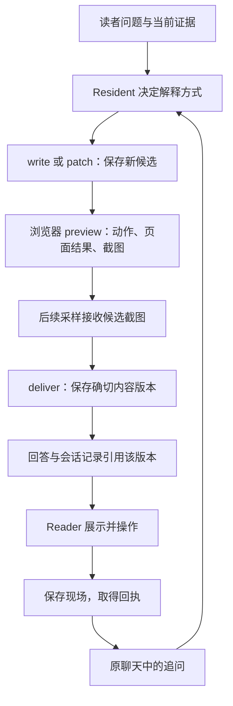

# 第 17 章 可探索解释与演示版本

第 16 章已经能够从聊天回顾中打开一项过去交付的演示。读者看到的不是 Agent 声称“我做过一个页面”，而是某次回答引用的一份确切内容。接下来，他调了一个参数，发现结果与直觉不同，于是问：“为什么现在会这样？把这个差别讲得更清楚，保留我刚才的设置。”

这个请求同时要求解释、读取现场和修改成果。若把它当作一次普通文本问答，Agent 可能不知道“现在”指什么；若每次都重新生成页面，读者又会失去刚才调整的参数、已经理解的上下文和旧答案。要把可操作的解释纳入阅读过程，系统必须为内容、观察、版本和现场分别建立身份。

本章沿“生成解释—预览关键关系—交付—操作后追问—修订同一对象”的过程展开。贯穿算例采用一个简化的学习率问题：两条路径每一步的损失完全相同，为什么一条从同侧接近最优点，另一条却不断跨过最优点？这个例子来自项目可探索解释设计中的金样板；下面的数值表是本章按给定公式重算的教学算例，不是新开展的读者学习实验。它让我们看到：选择图形和交互的理由，首先是补足理解所缺少的关系。

## 17.1 从解释任务到呈现方式

### 先确定读者没有看见什么

考虑一维损失函数：

\[
L(w)=(w-2)^2,\qquad w_0=0
\]

梯度下降按下面的规则更新参数：

\[
w_{k+1}=w_k-2\eta(w_k-2)
\]

令误差 \(e_k=w_k-2\)，就得到：

\[
e_{k+1}=(1-2\eta)e_k
\]

当学习率 η=0.2 时，误差每步乘以 0.6；η=0.8 时，误差每步乘以 −0.6。两者的误差绝对值相同，损失也相同，但误差符号的变化不同。

| 数学步 k | η=0.2 的 w | η=0.8 的 w | 两者共同的损失 |
| --- | ---: | ---: | ---: |
| 0 | 0 | 0 | 4 |
| 1 | 0.8 | 3.2 | 1.44 |
| 2 | 1.28 | 1.28 | 0.5184 |
| 3 | 1.568 | 2.432 | 0.186624 |

如果页面只画损失随步数变化的曲线，两条线会重合。图画得很精细，也没有呈现用户真正困惑的差别。沿参数轴显示当前位置、最优点和上一位置，再让用户前进一步，才能直接看见同侧接近与交替跨越。

这个推导也给出了一个反例。η=1.1 时，误差乘数为 −1.2，第一步 w=4.4，第二步 w=−0.88；对应损失从 4 增至 5.76，再增至 8.2944。页面可以让读者先预测下一位置，再揭示结果。交互的用途是检验“跨过最优点就一定发散”这一错误泛化，而不是增加一个看起来热闹的滑块。

[ADR-0139](../../adr/0139-explorable-explanation.md) 用对象连续性、动态对照、轨迹残影、不变量高亮、反例和预测后揭示描述这种解释方法。当前 Resident 使用的 [presentation-method](../../../skills/presentation/SKILL.md) 进一步要求：围绕当前问题选择表达方式，让每个图形和操作承担具体的解释工作，复杂内容先试做能够暴露表示问题的关键局部。

因此，是否制作页面是一次内容判断。稳定的概念区别可以用文字和静态对照说明；参数影响需要可重复计算；对象如何连续变化，才需要可定位的运动过程。同一篇解释可以组合这些方式。

### 页面成为阅读成果，需要哪些部分

沿上述任务，Agent 需要产出可运行的页面、文字说明、教学假设和来源。当前 [PresentationContent](../../../crates/runtime/src/presentation.rs) 将这些内容保存在一起：

```rust
pub struct PresentationContent {
    #[serde(default)]
    pub animation_assets: BTreeMap<String, AnimationAsset>,
    pub title: String,
    pub content_files: BTreeMap<String, String>,
    pub entrypoint: String,
    pub readable_content: String,
    pub source_bindings: Vec<SourceBinding>,
    pub assumptions: Vec<String>,
    pub state_contract: Value,
    pub initial_state: Value,
}
```

这里的 content_files 是逻辑文件表。例如 index.html 是页面入口，assets 下可以保存图形资源，plots 或 animations 下可以保存制作资源的代码与数据。它不是让模型任意指定宿主文件路径的接口。

readable_content 负责表达页面的文字、图形意义和动态结果，Reader 可以通过“说明与来源”单独显示。assumptions 则保存简化条件。在学习率例子中，“一维二次函数”和“固定学习率”应作为解释的条件保留下来；书中其他模型的结论不能只因为出现在同一页面，就自动适用于这个算例。

来源仍沿第 12 章的证据路径进入。模型通过 source.present 观察到的引用，或者所选旧版本已经持有的引用，才能成为候选的 SourceBinding。每次 write 还要明确列出 source_ref_ids。已观察某段原文与已将它附到这份候选，是两个不同步骤。

页面内部使用 data-source-ref 控件，由宿主提供来源标签和打开行为；readable_content 可以使用既有来源标记，经公开回答编译器生成可展示结构。页面自己写一个“来源”按钮，不会因此创造一条证据绑定。这使富回答能够沿用普通回答的来源体系。

### 同一个阅读循环，增加一种交付物

制作仍由原 Resident 循环决定下一步。presentation.author 提供 prepare、write、patch、preview、deliver 等操作，Server 负责保存和执行，Reader 负责交互与现场。它没有另起一个拥有独立任务目标的“页面 Agent”。

从一次阅读请求看，主要关系如下：



图中的最后一条边很重要。读者不必把页面当作一次性附件：现场回执能够把当前版本和操作结果重新交给同一条阅读讨论。若这份呈现属于教学过程，Tutor 还可以借助宿主活动表单接纳明确的学习动作。页面播放、按钮点击和参数变化本身，则仍是演示现场，不能直接替代第 13 章的学习证据。

## 17.2 候选、预览与已交付版本

### 一份 HTML 需要经过几个不同的确认

假设 Agent 已决定制作上述学习率解释。它先调用 write，提交标题、HTML、readable_content、来源列表、假设及初始状态。Server 的 [AuthorSession::author](../../../crates/server/src/presentation_author.rs) 组装所选资源、检查内容，并调用 create_presentation_candidate 保存候选。

此时工具返回 candidate_saved 和 candidate_id。该回执只说明内容已经有了可读取的落点。它没有说明页面能运行，没有证明图文一致，也没有把它放进用户已经收到的答案。

本章涉及的几种身份可以并列来看：

| 对象 | 主要身份 | 回答的问题 |
| --- | --- | --- |
| PresentationCandidate | candidate_id、created_by_turn_id、owner | 本次 Run 正在制作哪一份内容 |
| 预览记录 | candidate_id、environment_name、动作序号 | 在哪个环境、什么操作之后观察了什么 |
| AgentPresentation | PresentationRef、candidate_id、based_on | 保存下来的确切内容版本是什么 |
| PresentationState | values、visible_step、observed_result | 页面当时有哪些参数，显示了什么 |
| PresentationFollowUp | 内容引用、state_revision、saved_state_ref | 这次追问究竟绑定哪份已保存现场 |

候选保存后保持不变。patch 也不会就地改写旧候选，而是产生新的 candidate_id。这样，一张截图只能支持它实际观察过的那份内容；修改 HTML 后，系统不需要猜旧截图是否仍然适用。

候选还绑定创建它的 Run。当前 author 路径读取、搜索、修改或预览 candidate_id 时，会核对 created_by_turn_id。新 Run 可以沿确切版本读取旧成果，但不能把历史消息中的旧候选句柄恢复为本轮制作资格。

### 预览提供的是可归属的浏览器观察

对于最终候选，当前工程指导规定三个内容环境：

| 环境名 | 内容视口，CSS 像素 | 输入方式 | 主要暴露的布局约束 |
| --- | --- | --- | --- |
| narrow-content | 320×420 | touch | 窄屏换行、横向溢出、触控目标 |
| short-content | 640×240 | touch | 短屏中操作与结果的空间关系 |
| desktop-content | 960×720 | mouse | 桌面阅读顺序和整体布局 |

这些数值来自 [REQUIRED_PREVIEW_ENVIRONMENTS](../../../crates/runtime/src/presentation_preview.rs)。它们表示页面内容区域，不是整个浏览器窗口尺寸。

一次 preview 从新页面开始，最多执行四个动作。click 和 key 触发实际控件操作；scroll 按绝对 CSS 像素位置滚动，到底部时截在真实最大位置；seek 则定位连续场景。每次观察保留动作、实际滚动位置、DOM、布局指标、问题和截图。长页面因此可以先看顶部，再滚到解释的关键段落，而不必把整页压成一张难以辨认的长图。

[BrowserPreview](../../../crates/server/src/presentation_preview.rs) 通过 Chromium 协议加载候选、设置内容视口与触控模拟，等待实际绘制，再读取 DOM 与截图。当前确定性检查能够发现脚本错误、横向溢出、没有可操作盒子的控件，以及触控环境下小于 44×44 CSS 像素的目标。Server 另外核对页面公开文字、来源引用和资源依赖。

预览结果按候选和环境积累。显式视口路径中，三个环境全部取得干净观察，才得到 preview_ready_for_inspection；只有部分环境通过时返回 preview_environment_recorded，并列出还缺哪些环境。某个环境的新预览失败，会撤销它已有的通过记录。

对于学习率页，一次合适的观察不是“页面成功加载”就结束。Agent 应操作下一步、回退、改变学习率，并看清参数位置、损失、文字说明是否仍然对应。工程检查和后续截图观察在这里分工：程序发现能够明确计算的执行及几何问题，模型结合题意检查对象关系、图文含义和阅读顺序。

### 看过截图，要发生在下一次采样

浏览器工具返回图片后，模型还需要一次新的采样，才可能依据图片作出下一步决定。若允许在同一批调用中先 preview、再 deliver，后一个决定其实是在看图之前就产生的。

Runtime 对此保留了单独的门。下面是 [orchestrator](../../../crates/runtime/src/orchestrator.rs) 的实际分派摘录：

```rust
if let crate::presentation_author::AuthorRequest::Deliver { candidate_id } = &request {
    if !context.inspected_presentations.contains(candidate_id) {
        return Err(ToolError { error_code:"PRESENTATION_INSPECTION_REQUIRED".into(), category:"validation".into(), message:"Preview and inspect this candidate's screenshots in a subsequent sampling before delivery".into() });
    }
}
```

成功预览会进入 pending_previews，图片进入下一份模型请求；该采样成功返回后，Runtime 根据实际附带的图片及被容量限制省略的环境，更新 inspected_presentations。它判断的是候选图片是否进入了相应采样，不是把模型口头说“看过了”当作依据。

同样，render_plot 产生的图形也要先进入后续采样，才可以被 write 挂到候选中。图片观察是一种运行事实，而不是任意文本都能声明的状态。

当修改产生新候选时，新的 candidate_id 没有旧候选的预览和观察资格。Agent 要再次预览、接收图片，再请求交付。这解释了为什么小改动也不能简单复用此前的“通过”布尔值。

### 数值必须带着参数和数学步号一起读回来

在学习率页里，模型知道公式，并不意味着它已经确认页面当前算出了什么。历史问题正包括：页面数值正确，收尾文字却把数值配到了错误的步号。

preview 的 read_selector 用来读取指定结果区域。下面是本章的教学请求，candidate-example 和 #readout 表示正在制作的候选与页面自定义的结果区域：

```json
{
  "operation": "preview",
  "candidate_id": "candidate-example",
  "viewport": {"width": 320, "height": 420, "input": "touch"},
  "actions": [
    {"kind": "seek", "semantic_state": 2, "transition_progress": 0.5}
  ],
  "read_selector": "#readout"
}
```

当前实现要求选择器恰好匹配一个有渲染尺寸、非隐藏且含结果文字的区域。如果场景仍在播放，读取会被拒绝。返回内容将结果文字、page_state、当前控件、场景信息和 action_step 放在一起；有动作时，读取发生在最后一个动作之后。

此处 action_step=1 只表示本次预览执行了第一个动作。数学步号来自 semantic_state=2，视觉过渡位置则是 0.5。把三者混成“第一步的第 2.5 次迭代”，就丢失了每个字段的用途。

浏览器侧完整结果受 8 KiB 限制；超过限制时要求缩小读取范围。进入模型上下文后，[project_selected_result](../../../crates/runtime/src/tool_result.rs) 也把整条读取视为一个整体：容量足够就保留，容量不足就给出 PRESENTATION_READING_BUDGET 与继续读取建议。它不会只留下数值而截掉对应参数，因为那会改变数值的含义。

### 保存版本与答案交付如何接上

Server 的 deliver 还会检查自己的候选预览记录，然后调用 [persist_presentation_candidate](../../../crates/server/src/presentation_store.rs)。这一步将候选保存为不可变的内容版本，返回 PresentationRef：

```rust
pub struct PresentationRef {
    pub presentation_id: String,
    pub revision: u32,
}
```

同一个候选重复保存时，存储层返回已有版本引用；新的修订则在该对象已有版本的最大 revision 上加一。based_on 保留它真正采用的基底。例如对象已有 revision 1 和 2，读者明确要求修改 revision 1，那么新结果可以是 revision 3，based_on 仍指向 revision 1。新版本编号表达保存顺序，基底引用表达内容来源。

工具返回 version_saved 后，Runtime 将引用加入本轮已交付呈现集合，并在正常收尾时附到回答中；会话保存再承接第 16 章的成果与终态机制。当前工具回执明确说明，历史提交仍然待完成。

Reader 的 [delivered_version](../../../crates/server/src/presentation_api.rs) 会检查该引用是否已经出现在所属回合的回答或已交付成果记录里。仅仅在 versions 目录存在一个 JSON 文件，不足以成为历史中可打开的交付。这也允许一种重要恢复：成果交付事件已经提交，而最终终态保存中断时，回顾仍能指向那项实际交付的成果。

## 17.3 图表、二维交互和动画资源

### 表示所需的计算，决定制作路径

同样是“给我一个图”，实际需要的能力可能很不同。

| 当前解释需要 | 可用路径 | 交付后的计算性质 |
| --- | --- | --- |
| 说明对象位置、关系与少量原生控件 | HTML、内联 SVG/Canvas、JavaScript | 页面可以按当前参数实时计算和重画 |
| 给出固定数据的坐标图 | render_plot 与 Matplotlib | 图形内容固定，适合静态对照和定量标注 |
| 拖动物体，协调多个图形对象 | 显式选择 Konva 库 | 浏览器内保留对象与交互逻辑，可实时反馈 |
| 播放预先编排的短过程 | render_animation 与 Manim | 保存为固定视频，可定位播放，不能任意重算参数 |

学习率例子需要在 η 改变之后立即更新轨迹，用浏览器图形比较直接。如果某段解释只想用一个短片突出“误差符号翻转但长度缩小”，固定动画也可以承担这一局部。页面的其他部分仍可以保留文字、控件和静态图。

这个选择同时决定成本。原生页面只需要一套前端逻辑；静态绘图要启动 Python 并生成资源；动画还要渲染、解码和保存媒体。引入更重的工具，应当能够说明它改善了哪种关系的表达。

### 静态图先作为临时成果，再归属于版本

[render_plot](../../../crates/server/src/presentation_plot.rs) 使用 Matplotlib 的 Agg 后端，将代码与数据写入临时工作目录，生成 SVG 和 PNG。SVG 用于页面展示，PNG 用于模型观察；返回的 asset_ref 是当前制作 Run 持有的资源句柄。

write 通过 asset_refs 明确选择资源，并把 SVG、绘图代码和数据加入候选。因而“已经画过一张图”与“这份版本包含这张图”仍是两件事。未被候选采用的临时结果不会因为在本轮出现过，就自动成为交付物的一部分。

当前绘图默认 800×480，支持 320—1600 的宽度、240—1200 的高度，并设置代码、数据、输出大小与 20 秒执行时限。中文标签还会选择可用的中文字体；缺少合适字体时返回明确失败。对书稿读者来说，这些限制的意义是把一次工具工作收在可处理的范围内，而不是承诺任意绘图代码都能完成。

### 固定库要随版本保存

选择 libraries 中的 konva 后，[presentation_libraries::assemble](../../../crates/server/src/presentation_libraries.rs) 将宿主持有的 Konva 10.7.0 与许可证保存进逻辑文件表，并在业务脚本前插入相应引用。模型获得的是制作指导和库元数据，无需把整份压缩库反复写进自己的输出。

已有版本重开时，inline 使用的是那个版本保存的库内容。宿主后来更换随包库，不应悄悄改变旧页面。基于旧版本重新 write 时，则按本次明确选择的 libraries 重新组装；patch 保留基底的资源。这使“局部修改页面”与“重新选择依赖制作新修订”具有可解释的区别。

这种固定供给主要解决资源完整性和制作成本。它不是一种布局模板：是否需要时间线、拖动、轨迹残影或多视图，仍由当前解释任务决定。当前能力目录也明确，使用 Konva 不自动要求连续动画；需要保存自定义交互时，再选择 state 指导。

### 数学状态与过渡位置必须分开

在一个离散算法中，w₂ 和 w₃ 是两个确定状态；圆点从 w₂ 移到 w₃ 的中间画面，只是用于解释变化的视觉过程。若把插值位置写成算法真的产生了一个“第 2.5 次更新结果”，页面会凭空增加算法语义。

当前连续场景因此使用两个坐标：

- semantic_state 表示算法或解释的离散步骤。
- transition_progress 表示该步骤内的视觉过渡比例，范围为 [0,1)。

页面通过 window.presentationScene 暴露 seek 与 snapshot。预览要求 seek 停止自动播放，定位到指定场景，再在 DOM、布局和截图采集前后读取 snapshot。若步号或过渡位置不匹配、仍在播放，或者采集过程中状态变化，就分别记录位置、暂停或一致性问题。

当前 PreviewScenePosition 对步号设有 1000 的上界，也拒绝非有限数与越界过渡比例。这里约束的是工具允许检查的场景位置。页面仍要自己定义“第 2 步”的具体含义，并让参数、图形、说明和保存状态使用同一个约定。

### 固定动画也要能保存与继续阅读

[render_animation](../../../crates/server/src/presentation_animation.rs) 执行 Manim 制作支路，返回 MP4、封面、尺寸、时长、帧率和 cues，同时保留代码、数据及少量解码帧供观察。write 把明确采用的资源纳入版本；Reader 再将版本内逻辑媒体路径组装为可播放内容。

当前渲染默认 1280×720，尺寸需要为偶数；执行时限为 180 秒，单个 MP4 不超过 8 MiB，版本动画媒体合计不超过 24 MiB。工具会核对实际解码元数据与输出，而不只接受“渲染成功”的文字。

[共享媒体生命周期](../../../packages/web/src/presentation-media.js) 在页面离开可见区域、宿主隐藏或页面关闭时暂停视频；同一页面开始播放一个视频时，其他视频暂停。重新可见不会自动继续播放。视频时间及自定义播放状态的保存和恢复，仍要通过页面现场合同连接起来。

这里有两个执行环境。可信本地模式直接运行相应 Python 和浏览器；网络服务模式由 [presentation_sandbox](../../../crates/server/src/presentation_sandbox.rs) 提供独立工作任务，使用 Linux 的 systemd cgroup 与 bubblewrap 承担隔离和资源边界。临时目录和超时本身不能替代后一种隔离。二者的宿主调度与取消关系将在第 18—20 章展开。

## 17.4 页面现场、追问和同对象修订

### Reader 接管公开内容与来源

版本进入 Reader 后，[presentationDocument](../../../packages/web/src/presentation-document.ts) 将版本内逻辑资源组装进一个文档，加入共同样式、来源标签和 bridge。页面通过 sandbox="allow-scripts" 的 iframe 运行；资源、联网和表单行为由宿主的文档策略约束。

这个安排给页面足够的计算空间：它可以根据 η 和步号重新计算图形，也可以定义自己的阅读顺序。与此同时，来源打开、向原聊天发送问题、接纳教学活动等操作仍经过宿主。

页面变化后，[presentation-bridge](../../../packages/web/src/presentation-bridge.js) 收集公开文字、辅助标签、控件内容及来源引用，发送 observe。宿主通过 presentationObserve 交给 Server 验证，得到接受回执后才确认对应的观察版本。初次显示等待接纳；后续未接纳的语义变化会暂时被遮住，避免新文字先被当作有效内容展示。

不是每一次几何变化都必须产生服务器请求。bridge 会比较文字与引用的组合，纯位置变化通常不会改变它。但本地 MutationObserver 仍可能触发扫描和克隆，这一点要留到性能讨论中分别测量。

来源按钮也通过父窗口打开原文。生成页面只能引用版本已有的 source_ref_id，不能越过宿主自行宣布新的来源。对于 Tutor，页面的 requestTeachingAction 只是请求聚焦宿主活动表单，真正的学习动作仍由明确提交接纳。

### 追问之前，先把“现在”保存下来

继续学习率例子。读者将 η 调到 0.8，定位到某一步，再输入：“为什么损失与另一条路径相同？”如果仅发送这句话，后端很难知道读者究竟看到了哪组参数。

PresentationState 保存三个不同角度的内容：values 保存控件和页面自定义参数，visible_step 保存当前解释步骤，observed_result 保存当时可见的结果文字；source_ref_ids 则保留这次观察涉及的来源。

页面可以通过 window.presentation 注册 stateReader 和 stateRestorer，并在需要时调用 commitState。普通表单控件也由 bridge 捕获。当宿主请求 snapshot 时，bridge 先等待当前观察版本被接受，然后在一次同步读取中取得控件、自定义状态和实际可见结果：

```javascript
send({ kind: "state", request_id, state: {
  values: { controls, page: custom.values ?? null },
  visible_step: custom.visible_step ?? document.querySelector("[data-presentation-step]")?.getAttribute("data-presentation-step") ?? null,
  observed_result: visibleText(document.body).trim(), source_ref_ids: observation.source_ref_ids,
} });
```

这段摘录来自当前 bridge。它把输入与输出放在同一份观察里。例如，“η=0.8、数学步 k=1、w=3.2、损失 1.44”比孤立的“损失 1.44”具有清楚得多的解释条件。

[AgentPresentation.followUp](../../../packages/web/src/components/AgentPresentation.vue) 请求 snapshot 后，先等待 saveState 返回回执，再发出 follow-up 事件：

```typescript
const receipt = await saveState(snapshot);
if (current !== generation || error.value || props.busy) return;
emit("follow-up", message, receipt);
```

因此，现场保存失败时不会继续发送一条看似带有现场、实际无法回读的问题。界面会保留“追问未发送”的失败说明。保存操作还经过队列，当前页面切换后，旧操作不能继续冒充新页面的现场。

### 内容版本和现场版本分别增长

内容版本描述解释本身；现场版本描述读者如何操作这份解释。调一次参数不需要复制一份新 HTML，修改公式也不能覆盖旧现场所引用的内容。

当前回执的字段很短：

```rust
pub struct PresentationFollowUp {
    pub session_id: String,
    pub turn_id: String,
    pub reference: PresentationRef,
    pub state_revision: u32,
    pub saved_state_ref: String,
}
```

它由成功保存现场的路径生成。private presentation 存储将候选、内容版本和现场分开放置：candidates 下保存候选，versions 按 presentation_id/revision 保存内容，states 再按 presentation_id/内容 revision/现场 revision 保存观察。用户私有根与 owner 共同限定归属。

可以用一个教学序列看清它们如何组合：

| 时刻 | 内容 | 操作及保存 | 后续意义 |
| --- | --- | --- | --- |
| t₁ | P 的 revision 1 | 保存现场 1，η=0.2 | 得到一份现场回执 |
| t₂ | 仍为 revision 1 | 保存现场 2，η=0.8 | 追问 Q 绑定这份回执 |
| t₃ | 仍为 revision 1 | 保存现场 3，η=1.1 | 不改变 Q 的输入 |
| t₄ | 新交付 revision 2 | 页面增加带符号误差说明 | 旧回答仍引用 revision 1 |

[follow_up_context](../../../crates/server/src/presentation_api.rs) 根据 Q 的回执回读 revision 1 的现场 2，核对聊天、回合、版本和保存身份。它不会因为现场 3 更新，就把 Q 改成针对 η=1.1 的提问；也不会因为 revision 2 已经存在，就把旧问题换到新页面。

普通打开某个内容版本时，可以恢复该版本最新保存的现场；明确“回到提问时”则恢复回执指定的那一份。当前 restore 还会先保存读者此刻的现场，再加载旧回执。于是，“我现在看哪里”和“当时为什么问这个问题”都能保留下来。

[RightRail](../../../packages/web/src/components/RightRail.vue) 的演示工作区继续使用原聊天，presentationKey 由 turnId、presentation_id 和 revision 组成。工作区已经选定某个版本时，新成果不会自动替换正在讨论的页面。定位旧现场与恢复旧现场也由不同操作表达：前者选择对应内容，后者明确调用 restore。

### 修订必须选择确切基底

读者要求“把这个差别讲清楚”时，Agent 可能只需修改一段说明，也可能要重新组织整个页面。

局部修改可以先 search 找到对应函数或文字，再 read 邻近源码，最后 patch。当前 [presentation_source](../../../crates/server/src/presentation_source.rs) 的读取偏移按 Rust chars 计数，即 Unicode 标量值；这让中文源码的范围可以稳定回读，不会把 UTF-8 字节位置直接当成字符位置。search 是区分大小写的字面匹配，给出命中偏移、行号及附近源码。

补丁采用精确替换。每项 old_text 必须在当前更新串中恰好出现一次；多项编辑按顺序作用于局部副本，全部成功后才保存新候选。下面是决定是否接纳单项替换的实际代码：

```rust
let Some(at) = updated.find(&edit.old_text) else {
    return Err(format!(
        "Edit {index}: old_text not found; read/search the selected base and retry"
    ));
};
if updated.rfind(&edit.old_text) != Some(at) {
    return Err(format!(
        "Edit {index}: old_text matches more than once; include more surrounding source"
    ));
}
updated.replace_range(at..at + edit.old_text.len(), &edit.new_text);
```

如果页面两处都写了“损失相同”，只替换这个短语会被拒绝。Agent 应回读并加上能区分位置的上下文。若第一项替换成功、第二项找不到，修改仍停留在未保存的局部串里，不会留下半份新候选。

patch 保留资源、来源和未修改的内容字段；readable_content 可同时修订，避免页面与文字说明各说各话。重新 write 则适用于大范围改版和资源选择变化，需要明确指定 based_on、来源及采用的资源。

当前追问 Run 已经绑定现场回执时，write 默认必须以回执中的确切版本为 based_on。省略它不会静默新建另一个对象，改用最新 revision 也会被拒绝。只有明确 new_object=true，才表达独立新建；该标记又不能与 based_on 同时使用。对旧版本的 patch 同样核对确切基底。

### 继承参数要先确认含义没有改变

保留 η=0.8 很合理，但不能把所有旧字段不加区分地复制到新页面。若某字段从“秒”改成“毫秒”，相同数值会有完全不同的意义；若原数字改成文本模式，也不该仅凭字段名继承。

[inherit_parameters](../../../crates/server/src/presentation_author.rs) 按新 initial_state 的键逐项处理。只有新旧 state_contract 中的非空定义字符串完全相同，且新默认值与旧保存值同为布尔、数值或字符串时，才把保存值写入新初始参数。数组、对象和已经移除的键不会自动继承。

本轮运行的既有用例提供了一个清楚的对照：

| 参数 | 新页面的变化 | 新初始值采用什么 |
| --- | --- | --- |
| count | 定义仍为 integer evidence count 0..3 | 采用被冻结回执中的 1 |
| unit | 定义由 seconds 改成 milliseconds | 保留新默认值 100 |
| mode | 定义未变，但旧值是数字、新默认值是字符串 | 保留新默认值 text |
| shape | 新旧均为对象 | 保留新默认对象 |
| new | 新增字段 | 保留新默认值 5 |

用例在准备追问后又保存了一份 count=3 的较新现场，新候选仍继承被冻结的 1。以本轮候选为基底连续 patch 时，则保留该候选已经选好的 initial_state，不会每改一次源码又重新从页面最新现场取值。

这些规则只负责内容修订时的初始参数选择。同一版本重新打开时的现场恢复，仍由控件恢复和页面注册的 stateRestorer 完成。内容修订、打开页面和恢复提问现场，各有明确入口。

## 17.5 指导上下文、源码回读与制作成本

### 复杂解释需要交接设计，但不必另开 Agent

做一个简单文字修正，只需定位、修改、验证和交付。做一整篇解释则会遇到更长的依赖链：先定义对象，再说明条件，再给反例，最后让读者操作。如果模型只盯着当前局部，很容易把演示做完，却漏掉原任务的一半。

[ADR-0154](../../adr/0154-presentation-global-framework-and-staged-authoring.md) 将工作分成 global、local 和 review 三种制作职责。当前 [agent_prompt::presentation](../../../crates/runtime/src/agent_prompt/presentation.rs) 将它们编译为可选指导，仍交给同一个 Resident：

| 阶段 | 本次采样应处理的内容 | 与其他状态的关系 |
| --- | --- | --- |
| global | 解释关系、阅读顺序、全篇约定、关键局部 | 形成制作框架，完整任务范围留在 Goal |
| local | 试做关键关系，按观察修改，再展开全文 | framework 保留全篇联系，focus 指明当前重点 |
| review | 沿成品串读，核对要求、图文和关键操作 | 更新实际缺口，然后完成工程预览与交付 |

prepare 提交 phase、framework、focus 和 needs，更新当前 Run 的 PresentationAuthoringContext。它是完整替换：省略 framework 或 focus 会清除旧值，needs 则明确给出当前需要的技术参考。prepare 要单独调用，等下一次采样实际收到指导，再使用相应能力。Runtime 对 prepare 与 write 混在同一批的两种排列都予以拒绝。

复杂任务可以先交接一个“让同损失的两条轨迹显现不同方向”的局部 focus，用小候选暴露图形表示的问题，再扩展成完整解释。简单修订可直接选择 local，不必补做一套没有实际作用的全局设计。

这里要把三种文本分开。Goal requirements 保存用户要求，working.items 保存工作进展；framework 保存解释结构和对象约定，focus 保存当前制作重点；固定的工程及技术指导来自项目资源。把工作项全部标为 completed，也不能替代页面真正交付。

### 方法指导与动态设计处于不同位置

工具可见时，当前请求保留共同方法、工程合同与能力目录，再根据 phase 和 needs 选择阶段及参考内容。global 不装入局部技术参考；continuous_scene 隐含需要 state，manim 又会带入 continuous_scene 与 state。

动态 framework/focus 作为 user 角色的任务数据进入上下文，不进入固定 system 指令。它们不能授予新来源、激活历史候选或改变交付资格。本轮定向用例特意在 framework 中放入虚构来源和“旧候选可以交付”的文字，结果仍被真正的证据与候选门拒绝。

在采样组装上，[build_sample_request](../../../crates/runtime/src/orchestrator.rs) 将共同模块保留在 instructions 前部，阶段和参考的变化通过 ContextFragmentLedger 追加在相应采样位置。已有指导保持原位置，最新 selection state 指明当前有效阶段；仅调整设计文字，不会反复追加同一份固定指导。

成功交付清除本轮制作设计并停用阶段指导；新的制作动作再开始自己的上下文。这是一份运行内交接，不是已持久化的跨轮 PresentationBrief。[ADR-0133](../../adr/0133-agent-led-explorable-explanations-and-evolving-presentation-brief.md) 中用于长期保留设计意图的 Brief，仍属于条件性后续方向。

### 成品已有落点，历史不必反复携带整份源码

制作多轮之后，容量的主要消耗可能来自模型此前输出的 HTML，而不是新的问题。若每个采样都重复携带几十千字的页面，修一段标签也要付出很长的输入成本。

当前 [SavedAuthorCall 与 ActiveToolResultLedger](../../../crates/runtime/src/tool_result.rs) 只在 write/patch 成功返回 candidate_saved 后建立可回读落点。首次后续采样仍带完整调用与成功回执，让模型真正观察保存结果。采样成功之后，后续模型消息副本才将 html 和 readable_content 换成 saved_source 定位。

这个定位保留候选身份、入口文件和 read 参数。最近一次 patch 的精确 edits 也继续保留，直到以它为基底的后继候选成功保存并被采样观察，才把旧 edits 收敛成应用数量与读取定位。独立创建另一份作品不会使此前修改链自动退休。

这项投影不改原始消息、磁盘内容或工具回执，也不让候选跨 Run 复活。模型需要源码时仍可 read，当前活动工具正文继续接受第 11 章的容量管理。

追问已交付版本时也采用同一思路。[follow_up_context](../../../crates/server/src/presentation_api.rs) 注入确切回执、标题、假设、保存现场及 content_access 读取入口。整篇 readable_content 和 HTML 不自动塞进新请求；Agent 可按需读取文字说明，或者 search/read 具体函数。这样，“有能力回到完整成果”不再要求“每次都携带完整成果”。

### 请求变短与真实费用，需要分别观察

项目在 2026-10-02 的 [EX13.2 报告](../../performance/presentation-context-ex13/ex13-2/README.md) 中使用冻结的两次 write，分别含 18,486 和 31,850 个 HTML 字符，比较保存源码投影前后的末次请求：

| 同输入离线统计，UTF-8 字节 | 改动前 | 改动后 | 减少 |
| --- | ---: | ---: | ---: |
| 录制内容 | 128,457 | 52,654 | 75,803 |
| assistant 调用参数 | 79,731 | 3,928 | 75,803 |
| Native 序列化 | 128,150 | 52,347 | 75,803 |
| ReAct 序列化 | 145,423 | 62,994 | 82,429 |

例如，录制内容减少约 59.01%，调用参数减少约 95.07%。ReAct 的表示方式不同，序列化差值也不同。这组实验没有发送模型 HTTP 请求，usage 为 null；表中度量的是字节，不能把它直接写成 token、缓存命中或人民币节省。

另一项 [EX13.1 指导前缀实验](../../performance/presentation-context-ex13/ex13-1/README.md) 则说明了取舍：把阶段指导改为在后部追加，可以保留既有文本前缀，但历史会增长。该受控样本末次录制体积从 50,547 增至 67,009 字节。前缀更稳定与总输入更小，是两个不同目标；源码回读正用于处理后一部分负担。

随后进行的 [EX13.6 真实接续](../../performance/presentation-context-ex13/ex13-6/README.md) 提供了另一种证据。它从原聊天、未完成 Goal 和检查点恢复，对同一对象从 revision 1 修订到 revision 2，保留 27 个来源绑定，经过原生 patch、preview、后续图片观察和 deliver。独立浏览器重放覆盖三环境、每环境七条路径，记录了 78 张截图。

该次成功接续持续 379.231 秒，发生 20 次提供方调用；计入两次准备失败中的辅助请求，累计新增 22 次调用，输入加输出为 1,920,856 token。按当时报告记录的价格估算累计费用为 0.93951468 元；余额观察净减少 0.59 元，报告没有把两者视为同一项结算事实。本章引用这些历史口径，没有重新查询价格或运行该模型。

这个实验还补出了一个具体内容错误：页面读取量减半后，某处静态推导仍保留原式，而动态结果已经改变。最终补丁除原有 11 项修改外，再加入一项公式修正。它说明了为什么预览、独立算例和最终说明要互相核对，也说明“页面能运行”与“解释正确”之间仍有工作要做。

EX13.6 证明的是选定内容可以恢复、修订并沿原生路径交付。它没有构成新旧方案同输入的性能对照，也没有测量真实读者学习收益。后续发布和多平台连续使用的结果，要沿各自记录继续判断。

## 已知边界与本轮验证

本章按 2026-10-07 当前工作区阅读实现，Git 基线为 4e0b68e。关键调用、数据合同、资源组装和 Reader 现场路径都重新回读，历史 ADR 与 EX 实验作为有时间范围的设计及观测依据。以下边界集中说明其结论能支持到哪里。

1. **三环境合同仍有旧入口例外。** 当前 Server 的 preview_contract_complete 接受“legacy 回执，或者全部三个显式环境”。省略 viewport 的旧请求会产生 legacy 回执；Runtime 仍要求后续采样接收截图，但不会把这一入口再提升为三个环境。本轮既有用例确认了旧回执可交付。因此，三环境是当前工程指导和显式视口路径的要求，尚不能描述成所有受支持调用都无法绕过的统一门槛。

2. **预览门不验证数学和学习效果。** 公开内容编译检查来源、公开表达等合同，浏览器检查执行和可计算的几何问题；它们不独立证明公式、标签和 readable_content 一致。inspected_presentations 表示图片进入了后续成功采样，也不能证明模型逐处理解截图。数学正确性需要独立算例，学习效果需要真实读者表现。

3. **当前 patch 的补来源提示与请求合同不一致。** Server 在 UNKNOWN_SOURCE_REF 提示中建议 write.source_ref_ids 或 patch.source_ref_ids；但当前 AuthorRequest::Patch 没有 source_ref_ids 字段，而且拒绝未知字段。修改 readable_content 并新增引用时，这条建议会导向不被接纳的请求。当前可用路径是通过 write 明确携带完整来源列表；单纯布局或已有来源内的修改可继续 patch。该问题依据当前反序列化合同与错误分支确认，本轮未另外执行这一错误组合，也未修改产品。

4. **现场表示依赖页面合同。** 自定义参数和步骤要由页面实现 reader/restorer；缺少 restorer 时，Reader 会说明只恢复了普通控件。state_contract 的字符串相等和 JSON 类型相同，是参数继承的结构条件，不是语义或数值范围证明。页面更换了含义却没有更新定义，宿主无法仅凭字段判断出来。

5. **连续场景观察与平台性能不同。** seek 前后快照能检查定位和暂停一致性，不能替代真实播放的帧间隔、设备触控和浏览器适配验收。bridge 即使不新增宿主请求，也可能发生本地 DOM 扫描。动态图形成本、真实手机体验和表示效果需要各自的观测，本轮未重跑这些实验。

6. **设计交接与长期恢复有不同范围。** 当前 framework/focus 属于 Run 内数据，完整跨轮设计 Brief 尚未实现。历史源码投影只裁剪有可靠保存落点的内容；read 结果、最新补丁和当前必要后缀仍然占用容量。EX13 的离线字节结果和真实单次接续不能推导一般费用下降。

本轮直接执行了当前 Server 的 16 个定向用例和 Runtime 的 9 个定向用例，共 25 个通过。Server 覆盖精确版本重开、旧回执冻结、同对象修订、新建意图、参数继承、补丁原子性、来源列表、固定库以及两种预览回执条件；Runtime 覆盖视口与场景位置、prepare 时序、图片观察、设计权限、稳定指导与已保存源码投影。

这些用例使用真实临时存储和固定模型响应；Runtime 制作端口返回的是脚本化候选与图片观察，部分 Server 存储用例直接植入已有预览回执。它们验证相应状态与分派规则，没有启动真实浏览器、Matplotlib、Manim 或模型。一个需要 Chromium/Edge 的既有编辑用例按原设置忽略。前端 bridge、工作区和媒体生命周期为源码阅读，历史浏览器与模型数据为原报告引用。具体命令、引用检查和算例口径见[本章来源与验证记录](../SOURCES.md#第-17-章续写验证记录)。

## 面试时怎样解释本章

1. **为什么生成 HTML 后不能直接返回给读者？**

   HTML 只是一份候选。系统还要验证实际执行、关键操作、公开来源和布局，把截图送进后续模型采样，再保存确切版本并让回答引用它。候选、观察、版本和会话交付分别有身份，失败后才能知道哪一步已经发生。

2. **预览成功和模型看过预览，有什么区别？**

   前者由浏览器及 Server 根据实际观察建立；后者由 Runtime 根据图片是否进入后续成功采样建立。同一批 preview 和 deliver 不能证明后一个决定参考了刚产生的截图。它仍然只证明观察进入决策输入，不证明内容一定正确。

3. **同一个演示为什么同时有内容 revision 和 state_revision？**

   内容 revision 表示公式、说明、代码与资源；state_revision 表示读者对这份内容的操作现场。调参数不必复制 HTML，修改 HTML 也不能覆盖旧追问所指的参数和结果。

4. **怎样避免修改页面时把旧问题接到最新版本上？**

   追问先保存现场，再携带 PresentationFollowUp。Server 读取其中的确切内容和现场，修订默认要求相同 based_on；独立新建必须明确表达。新版本编号按对象已有最大编号递增，基底则单独记录。

5. **为什么有了视频还需要浏览器实时图形？**

   视频保存了固定计算和编排，可以暂停和定位，却不能在任意参数变化后重算。学习率、批大小等参数探索更适合实时图形；固定动画可以承担其中一段连续讲解。

6. **怎样在长制作任务中控制上下文成本？**

   固定共同指导保留在前部，阶段变化在后部追加；设计文字作为任务数据传递。已成功保存并被观察过的源码用可回读定位替换，最新修改上下文保留。效果要分别测序列化字节、token、缓存和实际费用。

7. **怎样证明一个可探索解释是好的？**

   先确认它能正确运行与恢复，再检查关键关系是否真正可见、公式与结果是否一致，最后用读者在新参数或新问题上的表现评估学习。三个层次各有证据，不能用播放完成或页面无错误替代后两层。

演示版本现在能够成为持续阅读的一部分：有确切内容，有可回读现场，有受约束的修改路径，也有制作成本的观测依据。这些步骤都可能等待模型、浏览器、Python 或磁盘。接下来进入[第 18 章](18-Rust宿主与并发边界.md)，回到 Rust 宿主，分析长时间任务怎样与读者操作并行推进，以及状态访问、取消和后台工作怎样划定边界。

