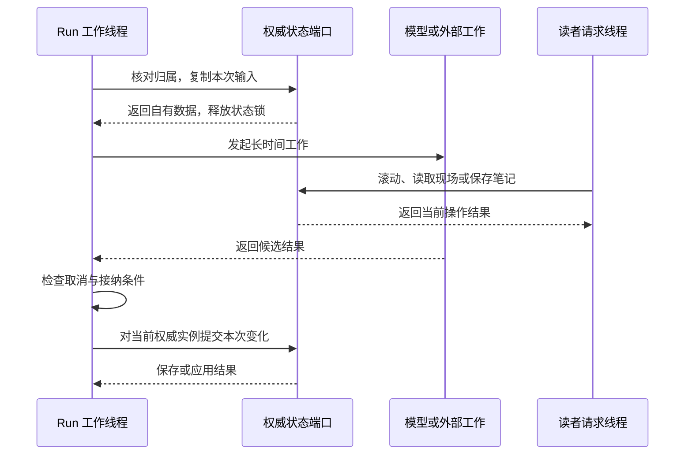

# 第 18 章 Rust 宿主与并发边界

第 17 章的学习率页面正在修订。Agent 已经读到旧版本和提问现场，接下来可能等待模型输出一段新代码，也可能等待浏览器完成预览，或者让 Python 生成图形。读者并不因此停止阅读：他还会滚动正文、打开来源、保存自己的笔记，也可能决定取消这次制作，切到另一段讨论。

这些事情要同时推进，难点并不只是“再开一个线程”。运行需要记得原问题，却不能把整个应用冻结在提问时；结果需要写回原聊天，却不能在收尾时覆盖读者刚刚做出的修改；取消需要到达正在工作的组件，却不能把已经保存的笔记当成从未发生。

本章围绕一个中心问题展开：**怎样让长时间模型调用与读者操作同时推进？** 我们先沿本地 HTTP 宿主追踪一次 Run，再说明相同执行核心怎样接到网络状态端口。用户身份、准入和公平调度在第 19 章展开；这里先弄清楚一次运行持有什么、等待什么、何时访问共享状态，以及什么时刻才算退出。

## 18.1 HTTP 宿主与运行协调

### HTTP 请求结束，运行可以继续

假设读者提交：“把刚才的振荡解释清楚，保留 η=0.8。”若请求处理函数从取得应用锁开始，一直持有它直到模型、预览和保存全部完成，那么其他线程即使收到了滚动请求，也只能在锁外排队。

这不是单纯的教学反例。[ADR-0127](../../adr/0127-resident-agent-streaming-and-runtime-activity.md) 记录了改造前整轮持有共享状态锁、模型完整返回后才展示的结构，也记录了两个被否决的方向：只在长锁内部推送文本，仍然阻塞阅读；复制 Reader 和 Memory，最后整体写回，又会覆盖期间产生的新操作。

当前 [start_server_with_memory_path](../../../crates/server/src/host.rs) 使用 tiny_http 接入请求，建立四个普通 HTTP 工作线程。本地应用以 Arc<Mutex<AppState>> 共享，RunCoordinator 另行管理一个活动运行的位置。这里有三个不同数量：普通请求线程数、活动 Resident Run 数和 SSE 观察连接数。它们不要求相等。

两种提交入口使用同一套准备与执行路径：

| 入口 | 调用方式 | HTTP 调用者等待到哪里 |
| --- | --- | --- |
| POST /agent/runs | RunCoordinator::start | 接纳成功后返回 202 和 book_id、session_id、turn_id |
| POST /agent/chat | RunCoordinator::run | 等待同一执行核心完成收尾，再返回结果 |
| GET /agent/runs/{id} | 读取运行快照 | 返回已有运行的观察状态 |
| GET /agent/runs/{id}/events | 订阅已有运行 | 持续接收 SSE 事件 |
| POST /agent/runs/{id}/cancel | 请求取消 | 返回当时的状态，不等待全部工作退出 |

start 中决定生命周期分离的代码很短：

```rust
let coordinator = self.clone();
std::thread::spawn(move || {
    coordinator.execute(prepared, cancellation, stream, adapter.as_ref(), on_exit);
});
```

摘录来自 [RunCoordinator::start](../../../crates/server/src/agent_run.rs)。prepared、取消令牌、流对象和本次适配器进入运行线程，提交请求可以随后返回。旧的 run 入口则在当前请求线程中调用 execute；它仍占用一个 HTTP 工作线程，但模型等待不占用 AppState 锁。

由此，关闭一条观察连接只结束观察，不会自动取消已经接纳的工作。读者重新连接时应当找到原 turn_id，而不是再提交一次同样的问题。第 12 章的快照和重连协议，正建立在这个运行生命周期之上。

### reserve 接纳的是一项有归属的工作

协调器不能先开线程，再让两个线程竞争决定谁拥有当前聊天。RunCoordinator::reserve 先锁住自己的 slot，检查 active、boundary 和 stopping：已有活动 Run、正在切换上下文或者宿主进入停止阶段时，返回 AGENT_RUN_BUSY。

可接纳时，reserve 通过 AppStatePort 进入 [prepare_agent_chat](../../../crates/server/src/lib.rs)。准备路径验证输入，预提交用户问题和回合，准备 Tutor 关联，捕获 RunScope，再复制这轮需要的消息。准备失败会直接返回，尚未安装活动 Run，也不会调用 Provider。

准备成功后，协调器建立共享取消令牌与 RunStream，把流的弱引用挂到当前现场，再把 ActiveRun 安装到 slot。活动位置保存的是运行归属、令牌和观察对象；它不需要把整份可变 AppState 一直借给运行。

“预提交”在这里有明确作用：模型开始工作之前，原问题已经属于一个确切回合。若后续模型失败、取消或保存异常，系统仍能指认是哪次已接纳工作没有正常交付。第 16 章已经解释相应日志，本章关注的是它位于运行派发之前。

### 执行结束与释放活动位置之间，还有收尾

execute 进入 [execute_observed](../../../crates/server/src/agent_run.rs)，由 execute_model 建立 RunContext、接通模型观察和取消，再执行原 Resident 循环。循环返回后，系统先收集消息、动作、轨迹和活动，发布 finalizing，然后进入原聊天的终态保存。

因此至少需要区分以下几个时刻：

| 时刻 | 已经成立的事实 | 还没有完成的工作 |
| --- | --- | --- |
| 问题已接纳 | 原用户、聊天和回合已经确定 | 模型与工具执行 |
| 循环已返回 | 已取得结果或错误，以及实际动作记录 | 终态保存与后续关联 |
| finalizing | 开始收尾，流仍是 pending | 持久化结果与公开终态 |
| 保存路径结束 | 可公布已保存视图，或明确保存失败 | 退出回调和活动位置释放 |
| RunGuard 析构 | active 清空，等待者被唤醒 | 本次运行已不再占有位置 |

正常保存后，协调器读取原书的 turn_view，交给 RunStream::finish。保存失败则保留 UnsavedRun，并发布 persistence_failed。两条路径都会走到执行退出；“结束并释放位置”与“结果已经保存”是两项事实。

RunGuard 覆盖 execute 的执行、保存、流终态和 on_exit。这样，取消请求刚刚返回时，新 Run 仍会得到忙碌响应；系统不会让后一个运行与前一个运行的收尾争用同一生命周期。on_exit 还通知后台复核调度器，前台 Resident 已经退出。

这套一个活动位置的协调器属于当前本地 Host。网络入口由 [RunAdmissions](../../../crates/server/src/run_admission.rs) 接纳和派发，复用 execute_model 与 run_precommitted_with_ports。不能从本地 slot 推断整个多人服务只能运行一个 Agent。

## 18.2 固定输入与短时状态访问

### 固定的是原问题，不是整个应用

继续上一章的现场序列：追问绑定内容 revision 1、现场回执 2、η=0.8。读者随后把页面参数改成 η=1.1，或者把正文滚到下一节。这些变化应当被保留，但不应偷偷改写原问题。

[RunScope::capture](../../../crates/server/src/run_scope.rs) 保存原用户、workspace_id、workspace_generation、聊天、turn、Book、书目录、存在时的不可变 publication、模型运行配置、选区以及演示追问引用。ReaderInputSnapshot 则保存 ReaderState 与提问相关的 minimap_context。PreparedAgentChat 另外持有本轮消息、用户问题、补入现场说明的模型消息、Goal 和 Tutor 输入。

把这些对象放在一张表中，才能看清“冻结输入”的范围：

| 数据 | 本次 Run 怎样取得 | 运行期间的变化怎样处理 |
| --- | --- | --- |
| 原书与发布 | RunScope 保留 Arc 和原目录 | 运行继续使用原材料引用 |
| 提问位置、选区与演示回执 | 准备时验证并保存 | 后来的滚动、参数修改不替换原输入 |
| 初始消息、Goal、Tutor、模型配置 | 准备结果进入 RunContext | 本轮消息和工作账本继续在运行内增长 |
| 笔记、画像和私人历史 | 操作时进入当前 UserRuntime | 使用当前权威实例，接纳期间的新修改 |
| 实时 Reader | 显式读取或动作时访问 | 检查现场是否仍然有效，再读写当前状态 |
| 候选、预览资格、临时图形 | 制作端口在本 Run 内持有 | 随实际制作结果更新，不覆盖现场所有权 |

这里没有把所有上下文都变成同一时刻的数据库快照。例如画像事实先在私人端口内读取；需要模型判断时退出端口，判断后再回到当前存储接纳。进入主循环前生成的 profile_snapshot 也有自己的取得时刻。应该准确说哪些字段固定，不能用“Run 已冻结”代替每个对象的时序。

RuntimeStatePort::reader_input 明确返回原快照：

```rust
fn reader_input(&mut self, _: &Book, _: &str) -> runtime::run_context::ReaderInputSnapshot {
    self.scope.reader_input.clone()
}
```

即使调用者此时传入另一段 question，它也不会重新读取正在变化的 Reader。需要了解最新现场时，Runtime 走 read_live_reader；“当时在哪里提问”和“现在阅读器在哪里”因此能同时存在。

### Rust 端口怎样把长等待排除在状态借用之外

当前 [AppStatePort](../../../crates/server/src/agent_run.rs) 用闭包表达一次状态访问。对实际 HTTP 宿主，其实现为：

```rust
impl AppStatePort for Arc<Mutex<AppState>> {
    fn with_app<R>(&self, operation: impl FnOnce(&mut AppState) -> R) -> R {
        operation(&mut self.lock().unwrap_or_else(|error| error.into_inner()))
    }
}
```

闭包执行期间持有 MutexGuard；闭包返回后释放。返回值没有暴露可继续使用的 AppState 可变借用。准备好的值、Book 的 Arc、模型输入和工具请求可以离开闭包，长时间工作随后执行。

这既利用了 Rust 的借用约束，也依赖调用点的组织。类型不会禁止某个闭包内部做慢磁盘 I/O，更不会自动证明它很快。当前代码真正避免的是让整轮模型调用拥有共享状态锁。

几个端口各有具体用途：

| 端口 | 对一次 Run 提供什么 | 当前接线 |
| --- | --- | --- |
| AppStatePort | 本地应用的一次受控访问 | Arc<Mutex<AppState>>；直接调用场景另用 BorrowedAppPort |
| UserStatePort | 当前用户的私人权威状态 | 本地从 AppState 取 user；NetworkUserPort 使用用户句柄 |
| ResidentStatePort | Runtime 所需的私人读写、实时 Reader、教学与制作操作 | Runtime 使用的共同合同 |
| RuntimeStatePort | 将共同合同接到本地权威状态和 RunScope | 每项操作选择检查归属或检查现场 |

网络侧的 [NetworkRunPort](../../../crates/server/src/workspace_registry.rs) 实现同一个 ResidentStatePort，但使用独立用户和现场句柄，并有自己的现场提交条件。执行核心不需要因此复制一套 Agent 循环。第 19 章再解释这些对象怎样登记、授权和调度。

BorrowedAppPort 使用 RefCell 包装已有的可变引用，它适合当前直接路由和测试调用。看到它不能反推 HTTP 模型执行一直持锁；真实 Host 对 /agent/chat 和 /agent/runs 有专门的协调器接线。

### 一次模型判断怎样分成取输入、等待、接纳

读者说“以后解释得详细一点”时，宿主需要判断记忆意图。当前 [run_precommitted_with_ports](../../../crates/server/src/lib.rs) 先在 with_user 中核对 Run 归属，取得 active_facts 等输入；闭包结束后才调用 evaluate_memory_intent。判断完成后，代码再次检查取消和访问条件，随后通过 with_user 应用 operation。

这个顺序可以用下面的时序表示。图中的模型阶段也可替换为独立教学评估；它不是一个持锁的整体。



Tutor 的 assess 分支也体现同样的组织：先由 tutor_assessment_input 取得包，锁外执行 evaluate，检查取消，再由 tutor_assessment_accept 接纳。长等待前后是两次状态访问，期间其他操作可以进入。

制作预览则更贴近本章开头的场景。[AuthorSession::author](../../../crates/server/src/presentation_author.rs) 先回读当前 Run 的候选：

```rust
let candidate = self.with_private(|state| {
    state.read_presentation_candidate(&self.turn_ref.session_id, &candidate_id)
})?;
```

候选作为自有值离开私人访问闭包，随后才组装 PreviewRequest、调用浏览器或沙箱。预览返回后检查取消，再更新本轮预览记录。render_plot 和 render_animation 的长执行同样不包在这个私人状态闭包中；write、patch、deliver 涉及保存时才进入相应权威入口。

本轮实际执行的受控 Provider 用例，在模型尚未放行时完成了 /reader/goto、/reader/note、/reader/state 和历史读取；运行结束后手工笔记、当前位置仍然保留。它证明模型等待没有垄断这些入口，也证明收尾没有用旧 Reader 或 Memory 副本覆盖并发修改。

## 18.3 权威写入口和取消传播

### 操作原书笔记与操作当前 Reader，有不同条件

锁能避免两个线程同时修改同一对象，却不能单独回答“这个对象是不是旧任务应当修改的对象”。因此 [RunScope](../../../crates/server/src/run_scope.rs) 把归属和现场分别检查。

check_owner 调用 check_user，核对当前 UserRuntime 的用户 ID，并确认原聊天中仍存在属于原书的 turn。private_context 再通过 private_user 形成原 Book、原目录和原聊天消息的操作上下文。它负责选择原归属；调用端口负责先做必要检查。

check_scene 则核对现场的 ID、代次、发布和选中聊天：

```rust
if w.id != self.workspace_id
    || w.generation != self.workspace_generation
    || w.publication.as_ref().map(|p| &p.reference) != self.publication.as_ref().map(|p| &p.reference)
    || w.selected_chat.as_deref() != Some(self.chat_session_id.as_str())
{
    return Err(ToolError {
        error_code: "WORKSPACE_STALE".into(),
        category: "conflict".into(),
        message: "The Run's reading workspace has changed".into(),
    });
}
```

check_workspace 先检查 owner，再检查 scene。普通滚动改变 Reader 的位置或 revision，并不等于更换 workspace generation；选择另一聊天或重新绑定发布会使现场换代。先切走再切回，旧代次仍不会复活。

因此，submit_private 只需进入当前用户存储并核对原归属；read_live_reader 和 apply_reader 则还要求原现场有效。应用 Reader 动作后，RuntimeStatePort 比较 Reader revision，确有变化才向活动流发布 reader.changed。

笔记和高亮还有一个容易忽略的分工。[Runtime 工具分派](../../../crates/runtime/src/orchestrator.rs) 先通过 submit_private 保存原书记录，再尝试把当前 Reader 的批注选择移到那里。现场已失效时，私人记录可以保存，界面动作返回 not_applied。把二者当成一个“全部成功或全部回滚”的操作，反而会误读实际结果。

本轮运行了第 3 章提到的旧 Run 用例：模型等待期间从内部替换现场，然后返回现场读取、导航、笔记和高亮调用。新 Reader 没有被旧任务移动；原书笔记、高亮和原聊天回答仍被保留。另一个用例先切换聊天再切回，确认原 ReaderInputSnapshot 不变，实时访问仍返回 WORKSPACE_STALE；换掉用户后，私人闭包也被拒绝。

### 取消首先是一条共享信号

读者点击取消时，[cancel_run](../../../crates/server/src/agent_run.rs) 找到原活动 Run，调用 cancellation.cancel，并让流进入 cancelling。CancellationToken 内部的 requested 是 Arc<AtomicBool>；它的克隆共享同一标志，还可以观察 host_stop。cancel 采用 Release 写入，检查采用 Acquire 读取。

这一步没有强制终止线程，也没有清空 slot。实际工作需要在自己的边界检查信号。execute_model 把同一个令牌安装到 RunContext，并通过 adapter.set_run_cancellation 传给底层适配器，然后用 ObservedAdapter 与 CancellableAdapter 包住调用。

[CancellableAdapter::chat](../../../crates/runtime/src/run_context.rs) 的实际代码展示了前后两个检查点：

```rust
fn chat(
    &self,
    request: &crate::AgentRequestPlan,
) -> Result<crate::AssistantTurn, crate::AdapterError> {
    self.check()?;
    let result = self.inner.chat(request);
    self.check()?;
    result
}
```

前一个检查防止取消后再启动请求；后一个检查防止等待期间发生取消，而迟到结果又继续触发工具。complete、结构化 completion 和 observed 入口沿用同样的约束，因此内层综合、画像判断、压缩及来源修复也使用这条取消连接。

Resident 循环还在采样返回、每个工具分派前等位置检查 context.cancellation。已经完成的笔记不被撤销，未执行的工具不再进入分派；对于已经写入消息、尚无工具回执的调用，close_cancelled_tool_calls 补上取消回执，以便后续会话保留平衡的调用协议。

本轮取消用例先保存一条 Agent 笔记，再让第二次模型响应停住。取消后释放响应，其中故意包含高亮调用：笔记仍在，高亮没有执行，也没有第三次采样。活动摘要记录了真实完成的笔记和取消的模型调用。这个顺序比单独检查一个 cancelled 布尔值更能说明取消的业务含义。

### 信号必须继续到达网络和子进程

只在模型外面加一层检查还不够。[NativeAdapter](../../../crates/runtime/src/lib.rs) 保存运行令牌，在每次 HTTP 发送尝试前检查；ReActAdapter 把令牌转发给内部 NativeAdapter。收到 SSE 后，[read_sse](../../../crates/runtime/src/provider_stream.rs) 在读一行之前和之后检查：

```rust
cancellation.check().map_err(|e| error(e.message))?;
let mut line = String::new();
let count = reader.read_line(&mut line).map_err(error)?;
cancellation.check().map_err(|e| error(e.message))?;
```

这能在流继续到达时尽快停止处理，也能阻止已取消请求因为连接错误再次发送。本轮 Runtime 用例在本机接到请求后取消令牌并断开连接，分别检查 Native 与 ReAct 都没有发起第二次连接。

同步 read_line 本身仍可能等待网络。上面两次检查不会从另一线程强制打断正在进行的阻塞读；非 SSE JSON 入口也要先完成响应读取再检查。本地 Resident HTTP 入口使用 [RESIDENT_PROVIDER_TIMEOUT](../../../crates/server/src/host_lifecycle.rs) 的 300 秒请求时限，但该数值属于一次请求，并不是取消按钮的响应承诺。Provider 内部真正用了多少推理时间，也不能只从宿主等待时长得出。

预览和 Python 工作使用不同的执行边界：

| 正在等待的工作 | 取消信号到达的位置 | 停止与资源回收 |
| --- | --- | --- |
| 本地 BrowserPreview | 启动等待、CDP 调用循环；建立连接后读取超时为 100 毫秒 | BrowserProcess 停止自己创建的进程树或进程组，并清理临时 profile |
| 本地 Matplotlib | 子进程等待循环，每轮检查令牌和 20 秒时限 | kill 并 wait 当前 Python 子进程；轮询间隔 50 毫秒 |
| 本地 Manim | 子进程等待循环及输出处理前 | 终止本次进程树或进程组并回收；轮询间隔 50 毫秒，执行时限 180 秒 |
| 网络 presentation Job | 等待资源许可时检查，执行时检查令牌、输出和期限 | Sandbox 停止本任务 systemd unit，再回收进程与输出读取线程 |

表中实现分别见 [预览](../../../crates/server/src/presentation_preview.rs)、[绘图](../../../crates/server/src/presentation_plot.rs)、[动画](../../../crates/server/src/presentation_animation.rs) 和 [沙箱](../../../crates/server/src/presentation_sandbox.rs)。这些间隔是代码中的检查节奏，不等于端到端取消延迟。网络 Execution::run 在等待许可时每 50 毫秒检查，执行监测循环每 25 毫秒检查；停止 unit 还要等待操作系统处理。

沙箱 worker 内部使用自己的默认令牌，父进程取消并不通过共享 Rust 内存跨进程传进去。真正跨过进程边界的是父侧 stop(unit)，其作用域包含 worker 的后代进程。这也是为什么解释取消时必须追到实际干活的组件。

### 切换上下文要等旧运行退出

读者选择另一本书时，本地 Host 的处理比普通滚动更严格。新聊天、选择聊天、打开书籍等入口，以及删除当前活动聊天，会经过 with_boundary。

with_boundary 先将 boundary 置为 true，禁止接纳新 Run；向旧 Run 请求取消，然后等待 active 清空。等待使用 Condvar，其间释放 slot 的互斥锁，也没有占用 AppState。旧运行退出后，才执行真正的上下文切换；BoundaryGuard 在操作结束后清除边界标志。

因此，切换请求可能仍在等待，但其他线程还能读取原现场。前面的内部替换用例验证的是作用域合同，不代表本地公开切书入口允许旧 Run 与新现场无限并行。

stop_and_wait 先设置 stopping，再复用上述边界。RunningServer::shutdown 等 Resident 执行和保存路径退出后，设置 Host 停止信号，停止后台调度、等待持有的工作线程，关闭观测写入并强制冲刷已读记录。本轮 shutdown 用例确认宿主返回前，原回合已经保存为 Cancelled。

这是一种协作式收尾：保存路径即使报错也需要完成退出并公开错误；正在进行的同步提交不会因取消信号被截断成“仿佛没有写过”。

## 18.4 运行活动、传输与后台工作

### 活动记录说明运行在等什么

读者等了五秒，可能是模型还没有返回，也可能是浏览器正在执行一个操作，还可能已经生成结果、只差保存。只显示一个旋转图标，无法区分这些状态。

[RunEvents](../../../crates/runtime/src/run_events.rs) 从实际执行生成活动。RunActivity 保存 step_id、parent_step_id、kind、name、status、started_ms、duration_ms，以及可取得的 usage 和首文本时间。开始时建立活动，结束时根据同一运行时钟计算持续时间，再把更新发布给观察者。

ObservedAdapter 为模型调用建立活动；工具分派为实际工具建立活动。工具内部的模型综合、查询等调用，通过 EventScope 归到工具步骤下面。例如 book.synthesize 是父步骤，synthesize 模型请求是子步骤。父工具持续三秒，其中模型用了两秒，不能相加后说该工具用了五秒。

工具请求在执行前被拒绝，也有单独语义。当前代码可以记录 Rejected 活动，但 started_ms 和 duration_ms 为空，不发布 tool.started。本轮受控用例故意提交未观察过的 source.present 引文，确认它没有被记成已经执行的来源操作。

RunEventFanout 将同一活动送给 RunStream 和观测端口；回答 patch 则进入流式回答路径。这样，活动描述“正在做哪一步”，草稿描述“已有哪部分可显示文字”，终态描述“这轮怎样结束及是否保存”。第 12 章讨论的三个层次在宿主中仍然分开。

### 慢观察者不会占住执行所需的状态锁

[RunStream](../../../crates/server/src/agent_stream.rs) 有自己的 Buffer 锁，内部保留运行快照和事件队列。update 在一次加锁中更新快照、递增 seq、把事件放入队列，并按序列化字节数淘汰旧事件。当前默认 EVENT_BYTES 为 256 KiB。

订阅方通过 read_after 获取一批自有事件；游标覆盖不到现有队列时，取得同一序号边界的快照。函数返回时 Buffer 锁已经释放，后面的事件编码、socket 写入和 flush 不持有这个锁，也不持有 AppState。

serve_checked 为观察连接建立独立线程，普通 HTTP 线程把请求交给它后继续接单。慢连接因此主要占用自己的传输线程；执行端继续更新内存观察状态。没有事件时，观察线程等待 Condvar，超时后发送 keepalive；等待本身也会释放 Buffer 锁。

本轮 SSE 用例在模型尚未返回时建立五个观察连接，然后成功读取 /reader/state。它还断开部分连接，以 Last-Event-ID 重连，确认收到后续事件，Provider 没有因此多出一次请求。这个结果验证的是接入、观察与执行的分离，不是吞吐量或无限连接能力。

执行端仍承担活动更新、快照维护和事件序列化成本。因此，分析慢请求时还要区分：网络写阻塞有没有反传到执行，与每次生成事件本身花了多少本地时间，是两个问题。

### 阅读活动为什么放到静默期合并保存

回到读者正在滚动的场景。如果一次窗口变化涉及二十个可见叶子，为每个叶子立即重写整份记忆文件，即使完全没有模型调用，正文也可能迟迟加载不出来。

[ADR-0106](../../adr/0106-asynchronous-coalesced-read-ledger-persistence.md) 记录了这类历史请求瀑布：二十叶边缘加载的主要等待发生在正文请求之前，原因是导航逐个同步提交已读事实。当前机制改变的是确认时机和提交次数，已读事实本身继续保留。

Reader 在导航时调用 [MemoryStore::enqueue_read](../../../crates/memory/src/lib.rs)，按 (book_id, lid) 合并触达次数并保留最近时间。这一步不执行磁盘提交。Host 的独立 worker 默认每 25 毫秒检查一次，待最近触达静默 250 毫秒后，进入原 Store 冲刷。

下面是 [flush_read_ledger_if_ready](../../../crates/server/src/host.rs) 取得 AppState 后的核心部分：

```rust
guard.user.check_owner(owner)?;
if !guard.user.store.pending_reads_ready(idle_for) {
    return Ok(0);
}
guard.user.store.flush_pending_reads()
```

worker 启动时固定 owner，每次冲刷核对用户身份；它没有另外打开一份 Store 去覆盖同一路径。flush_pending_reads 基于当前权威文档构造 candidate，把一批触达合并进去，提交成功才清空集合；失败保留原批次，并重设下一次静默等待的起点。

本轮实际用例依次登记 A 书的 1.1、1.2、1.1，冲刷前队列有两个位置，文件还未创建；冲刷后文档 revision 只增加一次，1.1 的触达次数为二，重开也能读到。另一用例制造临时文件路径故障，确认失败后批次仍在，解除故障后同一批可以成功保存。Reader 接线用例则确认记录的是实际可见真叶，容器位置不会直接被当成已读叶子。

本地切书会主动尝试冲刷；失败时保留批次，Host 继续重试。RunningServer 有序退出也强制尝试一次，不等待静默期。导航成功与这批已读记录已经耐久保存，由此具有不同的确认语义。

这一节描述本地 Host 的后台接线。网络 NetworkRunPort::apply_reader 当前还会在现场提交前调用 flush_pending_reads，不能把“导航都延迟 250 毫秒落盘”扩展成所有宿主的统一保证。

### 后台画像复核也要先取输入，再回到权威状态

阅读会话产生了新的画像候选，ReviewCoordinator 可以在后台复核。它与 Resident Run 共享用户存储，却不应把画像模型等待变成阅读锁等待。

当前 [ReviewCoordinator::run_one_at](../../../crates/server/src/host.rs) 先取得独立的 serial_gate，再在 AppState 中领取 job、复制 ReviewInput；离开状态锁后创建 executor 并执行；返回后重新核对 owner，把候选和实际 eligible_turn_ids 提交给当前 Store，失败则记录可重试状态。

serial_gate 横跨模型调用，但它只用于串行化复核执行，不是 AppState 锁。因而另一个复核 job 需要等待，读者的普通状态访问仍可进行。这个例子也说明，“模型调用期间持有一把锁”本身不足以判错：要看那把锁保护的资源，以及哪些操作需要它。

本轮受控 executor 用例停住第一次复核，期间完成 Reader 状态读取和前台已读写入，再改模型配置并启动第二次复核。结果确认最大并行复核数为一，两个 job 分别使用 model-a 和 model-b，前台写入没有被后续复核提交覆盖。

调度时机也有明确范围。scheduler_tick 在 Resident 活动时不开始这次调度；ReviewSchedule 支持启动恢复、累计八个未复核回合的阈值、到期重试，以及最近 Resident 活动后六十秒空闲触发。这里的六十秒是调度条件；本轮用假时钟检查边界，没有真的等待一分钟。已经开始的复核不会因为新 Resident 到来就自动取消，两者也不共用本地 RunCoordinator 的 slot。

切换上下文时，Host 还会请求 drain_boundary，默认最多等待复核十秒。超时后记录 REVIEW_DRAIN_TIMEOUT，并通过 stale 画像和 pending_context 暴露未处理部分，随后允许边界操作继续。等待超时并没有终止已经启动的复核线程；它完成后仍会回到原用户的权威状态提交。本轮用受控等待器模拟超时，确认过期状态可见、导航可用，放行 executor 后任务继续完成并清除相应错误。

## 18.5 用关键路径和实际等待分析瓶颈

### 先问正在等待哪一项资源

现在可以重新理解“这次解释花了九秒”。九秒是哪个起点到哪个终点？期间是模型推理、Provider 排队、网络读取、等待资源许可、浏览器执行，还是最后保存？没有这个区分，换异步框架、增加线程或缩短提示词都可能改错地方。

当前可取得的量与还需要补充测量的量如下：

| 量 | 起止边界或含义 | 可以怎样使用 |
| --- | --- | --- |
| 模型活动 duration_ms | ObservedAdapter 包围的一次调用 | 定位外部调用的墙钟时间；不能直接当作模型设备计算时间 |
| model_first_text_ms | 本次模型活动开始到首个非空正文片段 | 观察首文本等待；与首个可公开 answer patch 分开 |
| 工具活动 duration_ms | 工具开始到工具结束 | 看工具总体占时；存在子活动时避免重复相加 |
| 状态锁等待 | 申请锁到取得锁 | 判断争用，现有活动时长没有单列此指标 |
| 状态锁占用 | 取得锁到释放锁 | 判断哪次状态操作阻塞其他请求，需要对具体入口计时 |
| 磁盘提交时间 | 序列化、写入、同步及相关投影的选定边界 | 明确是否包含在持锁区间内，不能再次计入整轮总和 |
| 下行传输时间 | SSE/最终响应写出到客户端收到、安装 | 需要两端时刻；服务端模型活动不包含完整浏览器呈现延迟 |

“模型活动”还可能包含宿主侧资源等待。网络 [LimitedAdapter::call](../../../crates/server/src/service_limits.rs) 在真正调用 inner 之前先 acquire_model，并用 resource_wait 发布 waiting_model/running。它位于 execute_model 的观察包装之内，所以活动持续时间可以包含等待许可的时间。公平调度将在下一章展开；本章先记住，不能仅凭活动名称就把全部时长归给 Provider。

同理，一个服务端步骤耗时较长，不代表其他线程在同一期间都被阻塞。应沿关键路径分析任务总时长，再沿锁占用区间分析读者操作的排队，两者回答不同问题。

### 一个九秒运行，为什么不应锁住读者九秒

下面是依据本章调用结构构造的**教学算例**。假设一轮制作串行经过两次模型调用、一次预览、若干本地处理与保存；模型等待中已经包含相应上游网络时间，预览中的子进程细节合并为一项。表内阶段互不重叠，最后只计入尚未重叠的终态下行尾部。

| 串行阶段 | 墙钟时间，毫秒 | 其中占用共享状态锁，毫秒 | 其中共享状态内的磁盘提交，毫秒 |
| --- | ---: | ---: | ---: |
| 准备与问题接纳 | 12 | 12 | 8 |
| 第一次模型请求 | 2,000 | 0 | 0 |
| 浏览器预览 | 3,000 | 0 | 0 |
| 第二次模型请求 | 4,000 | 0 | 0 |
| 其余本地计算与状态访问 | 30 | 10 | 0 |
| 运行中进展提交合计 | 38 | 38 | 32 |
| 最终提交与收尾 | 20 | 20 | 15 |
| 终态下行尾部 | 15 | 0 | 0 |
| 合计 | 9,115 | 80 | 55 |

按这些假设，运行历时 9.115 秒，累计共享锁占用 0.080 秒，其中有 0.055 秒属于表内磁盘提交。55 毫秒是 80 毫秒的组成部分，80 毫秒又已经包含在 9.115 秒里，三列不能相加。

假设某个 Reader 请求本身需要三毫秒状态操作、五毫秒往返网络，在模型等待期间到达，而且有空闲 HTTP 线程、没有其他状态访问竞争，它可以约八毫秒完成。如果它遇到一次还剩四十毫秒的状态提交，则约需四十八毫秒。两个数字都来自教学假设，不能当作本项目实际响应分位数。

更一般地，可以把一次普通读者操作写成：

\[
T_{reader}=Q_{http}+W_{state}+S_{operation}+N_{return}
\]

Q 是等待请求处理资源，W 是等待共享状态，S 是实际操作，N 是返回传输。长模型调用不应直接进入 W；但如果 HTTP 工作线程全被其他长请求占用，它仍可能通过 Q 影响读者。因此，“模型不持 AppState 锁”解决了一项阻塞来源，没有消除所有排队。

再改变一个条件：两次模型请求均快一倍，总时长从 9.115 秒降到 6.115 秒，整体加速约 1.49 倍；三秒浏览器预览和其余部分仍在关键路径上。若实测最慢的是预览，就应进一步拆浏览器启动、页面执行和截图；若最慢的是 finalizing，就应查看会话提交及后续领域关联，而不是继续缩短模型输出。

### 通过等待顺序验证机制，通过计时验证性能

本轮没有为书稿调用真实模型，也没有测量锁延迟。我们选择的是能够区分机制的确定性观察：

| 受控顺序 | 若实现有误，会暴露什么 | 本轮结果 |
| --- | --- | --- |
| Provider 不放行，先做导航与手工笔记 | 整轮持锁，或结束时旧副本覆盖新操作 | 操作完成，位置与笔记保留 |
| 已保存笔记，下一模型请求暂停后取消，再返回工具 | 迟到工具继续执行，或取消抹去已发生动作 | 笔记保留，高亮和后续采样被阻止 |
| 请求切聊天，等待旧 Run 收尾期间读状态 | 边界等待持有 AppState，或切换过早 | 原现场可读，收尾后才切换 |
| 五个 SSE 观察连接仍未结束，再请求 Reader 状态 | 观察连接耗尽普通四线程接入 | Reader 请求完成；重连无新增采样 |
| 复核模型暂停，前台写入，再放行复核 | 复核长锁或旧文档覆盖当前 Store | 前台事实保留，复核串行提交 |
| 已读批次提交故障，再解除故障 | 失败时提前清空队列或重复计数 | 批次保留，原批次重试成功 |

这些用例回答“先后关系能否成立”。真实性能评测还需要记录每个边界的实际时间，并控制书籍、历史长度、机器、模型、网络、冷热缓存和并发请求。不能把测试套件运行了多少秒当成读者看到的端到端延迟，也不能把假时钟推进六十秒当成一次真实等待。

历史材料能提供另一种证据。[ADR-0106](../../adr/0106-asynchronous-coalesced-read-ledger-persistence.md) 基于当时 PHR9 的二十叶请求瀑布，将约 99% 的边缘加载等待定位到正文请求之前的同步已读提交。这是该次诊断记录，支持把高频提交移出导航路径的取舍；它不是当前工作区的重新测量，也不是所有阅读动作的通用比例。

因此，如果今天又出现卡顿，应该沿当前链路确认它停在请求排队、状态访问、Provider、制作工具还是提交。只有观察到相应区间成为关键部分，才有依据决定拆哪次锁内操作、合并哪次写入，或者调整哪项外部工作。现有实现已经把几个主要等待分开，使这种判断有了可追踪的入口。

## 已知边界与本轮验证

本章于 2026-10-07 回读当前工作区，Git 基线为 4e0b68e。实现、ADR 历史记录和教学算例分别使用各自的证据；本轮只修改书稿。

1. **按操作访问没有固定时间上界。** 本地状态闭包内仍可能读取候选、构造消息差异、写入记忆或追加并同步 JSONL；后台冲刷也在原 AppState 锁内提交。它们不会随着模型等待一起占锁，但慢磁盘和较长历史仍可能阻塞读者。本章没有测量持锁分位数。

2. **取消是协作式停止。** 同步模型网络读取和正在进行的文件提交不会被原子标志即时抢断。300 秒是本地 Resident 单次 Provider 请求配置，不是取消延迟或整轮截止时间；浏览器及子进程轮询间隔也不是完成回收的承诺。本轮受控 Provider 在收到取消后才被测试放行，不能用这些通过结果证明静默网络会立即退出。

3. **导航与已读耐久性采用不同确认。** 本地 pending_reads 尚未提交时退出或崩溃，可能丢失这批触达；强制冲刷失败会记录错误，不能因此宣称保存成功。网络 Reader 提交有自己的冲刷接线，需按入口分析。

4. **后台复核超时只结束等待。** drain_boundary 超时后，已运行的复核仍可能继续；普通调度的 Resident 标志也不抢占已经开始的复核。本地 serial_gate 串行化的是复核 job，不构成多人模型公平调度器。

5. **有界事件队列不等于整个运行有界。** 256 KiB 限制事件队列的序列化体积，快照中的活动、effects、来源绑定和 Run 内上下文另有成本。本地 SSE 为连接创建线程；本轮验证了五个连接时普通请求可用，没有进行大量慢连接或整体容量验收。

6. **作用域合同与公开切换流程分开验证。** 旧 Run 在现场失效后仍保存原书私人结果的用例，从内部替换现场；本地公开切换入口当前先请求停止并等待退出。网络状态分层、准入恢复和配额的完整行为留给第 19 章。

7. **现场失败会使已保存记录缺少效果摘要。** 当前 ReaderNote/ReaderHighlight 分派先保存私人记录，随后 apply_reader 失败时返回带 reader_effect.status=not_applied 的工具回执，同时将 effect 返回为 None。已保存笔记或高亮因此没有进入本轮 effects，也不会沿这条路径成为会话的成果关联。前述旧现场用例同时断言了记录存在与 effects 为空，确认了这个缺口；不是所有已发生写入都能从效果摘要枚举出来。本轮未修改实现。

本轮直接执行当前产品的 25 个定向既有用例：Server 21 个、Runtime 1 个、Memory 2 个、Reader 1 个，全部通过，无失败、无忽略。Server 中的 Run 用例启动了本机 HTTP Host 和受控假 Provider，使用固定响应与实际临时存储；复核使用受控 executor 和假时钟。Runtime 用例通过本机 TCP 连接分别验证 Native/ReAct 取消后的重试边界。

没有调用真实模型，没有启动真实浏览器、Matplotlib、Manim 或 Linux 网络沙箱，也没有运行整套产品测试。制作子进程取消、网络 LimitedAdapter 与 NetworkRunPort 的连接按源码核对；前端呈现与真实取消延迟没有在本轮验收。具体过滤项、日志和引用检查见[本章来源与验证记录](../SOURCES.md#第-18-章续写验证记录)。

## 面试时怎样解释本章

1. **模型调用这么慢，为什么读者还可以操作？**

   一次 Run 持有原问题、原材料和运行内上下文，模型在共享状态访问之外执行。需要读取或写入用户数据时，通过端口短暂访问当前权威实例。HTTP 接入、Run 和 SSE 观察有独立生命周期，所以模型等待不直接变成 Reader 的状态锁等待。

2. **为什么不复制 Reader 和 Memory，运行结束后统一写回？**

   等待期间用户还会滚动、写笔记，旧副本整体写回会覆盖这些变化。项目只复制运行输入和可独立处理的数据；真正的领域变化回到当前 Store 和 Reader，以本次操作提交。最终消息按原 session/turn 保存，现场仍有效时才更新对应现场消息。

3. **快照已经保存了用户和书籍，为什么还需要 generation？**

   快照说明任务开始时指向哪里，generation 说明现场期间有没有重绑。切走再切回也不能恢复旧任务对实时 Reader 的资格。私人笔记只要原用户、书籍、聊天和 turn 仍有效，仍有明确归属；导航还要满足现场检查。

4. **点击取消后，能立即开始下一次运行吗？**

   本地协调器先共享取消信号，运行在模型、工具和子进程边界处理它。活动位置保留到执行、保存路径和退出回调结束。已保存动作保留，迟到工具不再执行；需要平衡的未执行工具调用得到取消回执。取消请求返回与 Run 完全退出不是同一时刻。

5. **用了 Rust 和 Mutex，是否已经解决并发问题？**

   Rust 帮助约束借用，Mutex 串行化共享访问，但任务归属、锁范围、磁盘提交和取消仍要显式设计。项目用 RunScope 固定归属，用端口控制操作范围，用 RunCoordinator 管生命周期，再把取消接到实际传输和进程。锁内操作究竟多慢，仍需测量。

6. **SSE 怎样避免慢客户端拖住 Agent？**

   执行端更新有界事件队列和快照，观察线程取出自有事件后再写网络。socket 写入不持 AppState 或事件 Buffer 锁，游标失效时用原子快照边界恢复。断线只丢观察，重连不重发问题；连接线程和完整快照的容量则是另一项资源问题。

7. **同样是保存，为什么已读记录可以延后，回答终态却要先保存？**

   它们的确认语义不同。导航优先推进现场，把高频已读触达合并后提交；回答终态需要在重开历史中成立，所以正常终态来自持久写入后的视图。优化提交时机首先要判断用户操作承诺了什么，不能把所有写入统一改成后台任务。

8. **拿到一张慢运行轨迹，先看什么？**

   先确定端到端起止，按父子活动找关键路径，避免把内层模型时间再加到父工具上。再区分模型调用墙钟时间、资源等待、状态锁等待、锁占用、磁盘提交和下行传输。若读者卡而 Run 总时长正常，优先查请求资源和锁内操作；若读者操作流畅而制作很慢，再查模型和工具的串行依赖。

本章已经说明一次长运行怎样与读者操作共享宿主。加入第二个用户后，还要决定哪些私人状态必须独立、哪份公共材料可以共享、等待中的任务怎样接纳，以及谁先取得有限的模型和制作资源。接下来进入[第 19 章 多用户阅读与调度](19-多用户阅读与调度.md)，把这些并发边界放进完整的多人阅读服务。
