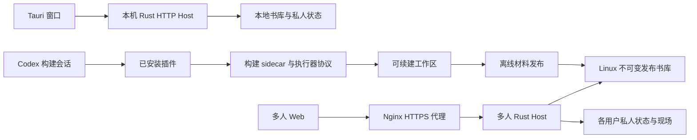

# 第 20 章 桌面 插件与 Linux 发布

上一章中，读者甲和乙已经能够共享一本书，分别保存聊天、笔记和阅读现场。现在把时间往前推一步：这本书最初在甲的 Windows 电脑上完成构建，随后发布到 Linux；甲希望把原来的私人资料迁过去，乙则从空白私人空间开始。几天后服务器需要升级，甲还希望保留升级前的恢复点。

这时，“代码能编译”距离“读者能继续使用原来的书”还有几层距离。桌面窗口能打开，不代表插件能找到执行器；服务器能监听，不代表浏览器加载了匹配的多人页面；备份命令返回成功，也不代表一个旧程序能够理解其中的新聊天格式。

本章回答：**不同使用形态怎样使用相互匹配的构建和阅读能力？** 我们沿安装、构建、材料发布、私人迁入和服务恢复推进。前几章已经讲清对象的归属和提交规则，这里要把它们落实到进程、产物、配置和目录之间。

## 20.1 Web 与 Tauri 外壳

### 桌面窗口为什么仍然连接 HTTP

甲双击 Understand Book 后，看见的是一个桌面窗口，但阅读业务并没有另外实现一套桌面后端。

[桌面入口](../../../apps/desktop/src-tauri/src/main.rs)在 setup 中读取书库设置，调用 start_server，取得实际监听 URL，再创建窗口：

```rust
WebviewWindowBuilder::new(app, "main", WebviewUrl::External(url))
    .title("Understand Book")
    .inner_size(1440.0, 920.0)
    .min_inner_size(960.0, 640.0)
    .build()
    .map_err(|error| format!("failed to create reader window: {error}"))?;
```

url 来自已经启动的 RunningServer。[ServerHostConfig::desktop](../../../crates/server/src/host.rs)使用 `127.0.0.1:0`，让操作系统分配本机端口；desktop_host 为 true，reader_only 为 false。没有命令行指定书籍时，先进入书库；指定了书籍则把它交给同一个 Host 加载。窗口不是凭一个预设端口猜测服务是否已经启动。

这使第 18 章的运行协调、取消与短时状态访问可以直接服务桌面阅读。Tauri 负责窗口、目录选择和本机设置等能力，普通阅读请求仍进入 Rust Host。退出时，RunEvent::Exit 取出 RunningServer，调用 shutdown；后者等待运行收口、停止后台线程、关闭观测并冲刷已读，而不是只把窗口从屏幕上移走。

资源定位也随运行形态变化。调试版的 web_dist 指向仓库内 `packages/web/dist`；发行版从应用资源目录读取 `resources/web-dist`。[tauri.conf.json](../../../apps/desktop/src-tauri/tauri.conf.json)把这些 Web 文件作为资源打包，同时声明构建引擎和 Book MCP 两个外部二进制。它们与嵌入桌面程序的 Rust Host 承担不同工作。

### 相同界面代码怎样进入不同宿主

把桌面程序所在目录复制到 Linux，不会自动得到上一章的多人服务。Web 本身也有入口选择。[main.ts](../../../packages/web/src/main.ts)中的决定只有一行：

```typescript
createApp(import.meta.env.VITE_MULTI_USER === "1" ? NetworkApp : App).mount("#app");
```

VITE_MULTI_USER 是构建时输入。普通 Web 构建进入 App；多人构建进入 NetworkApp，再通过登录和现场协议使用共享服务。部署时仅修改后端环境变量，不能把已经生成的普通页面变成多人页面。

沿甲乙的任务，可以把实际组合画成下面的关系：



图中贯通两端的是材料与协议。甲的构建工作区可以进入发布工具，甲的私人资料通过指定归属迁入；乙的窗口不会连接甲电脑上的本机 Host。共享 Web 组件与 Rust 业务代码节省了重复实现，但部署者仍要选择相应入口。

### 设置改变的对象是什么

桌面第一次启动时，[LibrarySettingsStore::initial_root](../../../apps/desktop/src-tauri/src/library_settings.rs)使用已保存路径；没有设置时，默认在 Documents 下的 UnderstandBook 中建立 `.understand-book`。选择普通父目录会补上这个子目录，直接选择已有 `.understand-book` 则使用它本身。

设置文件位于 `%LOCALAPPDATA%\UnderstandBook\settings.json`，保存书库根与 Reader Provider。apply_selection 先确定可用目录，再写设置；桌面命令随后调用 RunningServer::set_library_root，改变扫描和新建材料所用的根。这个动作没有遍历并搬迁原来的书，也没有把私人数据重归属给另一个用户。

Provider 保存同样经过明确入口：校验 mode、Base URL、model 和 Key，持久化后调用 set_provider_config。界面读取的 DesktopProviderStatus 只含 api_key_configured，不返回 Key。后续保存留空 Key 时，复用已有设置，缺少已有设置才尝试环境配置。环境文件提供初始配置，已持久化的有效设置在启动时覆盖它。

这些设计让目录和模型配置可以独立于安装目录变化。代价是必须区分三个位置：程序与 Web 资源在哪里，书库在哪里，用户设置在哪里。升级程序不应该靠删除这些目录来“恢复默认”；遇到书库不可用，也应回到目录设置，而不是把缺书误诊为插件安装失败。

## 20.2 插件、执行器和配置

### Reader 安装与插件安装为何分开提交

甲的电脑可以没有 Codex CLI，也可能在安装时离线。若 Reader 安装必须同时成功修改 Codex 配置，这些情况都会让本来可用的阅读程序无法交付。

当前 Windows Setup 采用 per-user NSIS 安装。[安装钩子](../../../apps/desktop/src-tauri/windows/installer-hooks.nsh)先登记程序目录，再询问是否安装 Codex 插件；同意后才运行 `UnderstandBook.exe --install-codex-plugin`。插件失败时显示待安装提示，Reader 保留，之后可以从桌面设置重试。用户关闭这次安装选择，也不会回滚 Reader。

[PluginManager](../../../apps/desktop/src-tauri/src/plugin_manager.rs)进一步区分“插件存在”与“本 Setup 有权维护它”。安装收据记录 plugin_name、marketplace_name、marketplace_source、codex_path，以及 marketplace_added_by_setup。install_with_runner 判断市场归属的关键部分是：

```rust
let matching_receipt = receipt
    .as_ref()
    .filter(|receipt| receipt_matches_install(receipt, &self.config.marketplace_name));
let owned_marketplace =
    matching_receipt.filter(|receipt| receipt.marketplace_added_by_setup);
```

receipt_matches_install 同时核对插件名和市场名。有匹配且由 Setup 创建的市场时，同源重试会刷新市场，换源会进入迁移；一个外部已安装插件不会因为被当前安装器发现，就自动变成 Setup 所有。新安装的收据写入失败时，代码会尝试撤销刚刚添加的插件和市场；换源失败则尝试恢复原市场。

卸载也沿收据执行。uninstall_owned 没有收据时保留外部插件；有收据时移除相应插件，只有 marketplace_added_by_setup 为 true 才移除市场。书库、外部登记工作区和记忆不是这份插件收据的删除对象。

因此，安装器处理的是两个可分别观察、重试的过程。读者要知道当前 Reader 可用、插件待安装，或插件由外部管理；不能只显示一个含义模糊的“全部成功”。收据在这里服务于所有权与恢复，不是模型执行回执。

### 薄插件怎样找到真正执行工作的程序

市场入口 [marketplace.json](../../../.agents/plugins/marketplace.json)发布 `plugins/understand-book`，没有把整个源码仓库作为插件安装。当前根与发行 [plugin.json](../../../plugins/understand-book/.codex-plugin/plugin.json)的版本都是 `0.1.0+codex.20261003012800`；桌面程序版本是 `0.2.0`。这两个数字属于不同产物，不能靠字符串相等判断兼容。

插件的 [.mcp.json](../../../plugins/understand-book/.mcp.json)声明两个 stdio 服务。Book MCP 提供阅读工具；共享 Build Executor MCP 只暴露 executor.open、executor.input.next、executor.generation.start、executor.submit_candidate 四个入口。第 7 章讲过这些入口怎样交付输入与接纳候选，这里关注它们究竟启动哪个程序。

[Book MCP 启动器](../../../scripts/start-book-mcp.cmd)先读取 UNDERSTAND_BOOK_MCP_BIN，再从 `HKCU\Software\UnderstandBook` 的 InstallDir 定位 book-mcp.exe。[执行器启动器](../../../scripts/start-build-executor-mcp.cmd)采用同样的两级定位，显式覆盖变量为 UNDERSTAND_BOOK_BUILD_EXE。找到程序后，实际命令固定为：

```bat
"%BUILD_EXECUTOR_BIN%" executor.mcp --bootstrap-version automatic_build_executor_bootstrap.v3 --protocol-generation automatic_build_executor_session.v3
```

这行没有把任意外部参数继续追加进去。插件负责解析安装位置和声明协议，真正的确定性引擎来自 Setup 携带的二进制。找不到程序时，启动器返回不可用诊断；把薄插件放进 Codex，并不顺带生成缺失的 sidecar。

[build-sidecar.mjs](../../../apps/desktop/scripts/build-sidecar.mjs)使用 Bun 把 sidecar-entry.ts 编译为 Windows x64 可执行文件，并把 Markdown、TOML 和 CMD 资源作为文本带入。[build-book-mcp.mjs](../../../apps/desktop/scripts/build-book-mcp.mjs)则以 Cargo release 构建 Rust 的 book_mcp，再复制到 Tauri externalBin 所需的带目标平台后缀文件名。两者技术栈不同，最终都通过安装目录被找到。

### 角色注册为什么还有单独一步

执行器 MCP 可用，并不表示当前 Codex 任务已经认识 understand_book_executor 这个角色。薄插件携带角色模板和注册脚本；发布约束明确不依赖插件内的 `agents/` 或 `.codex/agents/` 自动完成注册。

[register-executor-agent.ps1](../../../scripts/register-executor-agent.ps1)要求显式选择 personal 或 project。个人范围使用 CODEX_HOME 或用户目录下的 `.codex`；项目范围要求一个现有的绝对 WorkspaceRoot，再写入其 `.codex/agents`。它按已有目标的内容作出不同决定：

| 目标状态 | 注册行为 | 对正在进行的任务意味着什么 |
| --- | --- | --- |
| 尚不存在 | 写入发行模板，报告 absent | 回执要求新任务加载角色 |
| 已与当前模板相同 | 报告 same，不重复改写 | 仍报告 new_task_required |
| 是发行包附带的已知旧版 | 需要 MigrateKnownPredecessor；先保留固定备份，再替换 | 新角色合同在新任务中使用 |
| 是其他已有内容 | 拒绝覆盖 | 保留用户现有定义，不能当成发行模板继续 |
| 已知旧版的固定备份发生冲突 | 拒绝迁移 | 保留原目标和冲突备份供判断 |

本轮在独立临时项目实际执行了这些状态，共六组调用：首次、相同、未知内容、旧版未授权迁移、旧版显式迁移、备份冲突。验证了目标保留、备份字节以及 new_task_required；没有注册到真实个人配置或本项目配置。

角色模板继承模型设置，使用只读沙箱，并继承插件拥有的共享 MCP。这里的只读角色与四工具白名单表达工作分工；共享 MCP 并不认证调用者是不是指定角色。当前[编译产物冒烟](../../../apps/desktop/scripts/smoke-t7-executor-release.ts)也明确记录 capability_isolation 为 false。不能把“应由专用执行器调用”讲成已经实现跨角色的能力隔离。

### 版本固定要发生在安装来源上

假设甲今天构建 Setup，过几天才安装插件。如果市场来源只写仓库名，届时市场可能已指向新的插件脚本。Reader、sidecar 和启动协议便有机会来自不同快照。

[Windows 构建说明](../../Windows-Setup编译方法.md)给出的发布做法，是把 UNDERSTAND_BOOK_MARKETPLACE_SOURCE 固定到构建所用的提交，例如 `adaelon/undertand-book@已发布提交`。这个仓库拼写来自项目现有配置。更深一层，[assert-release-config.mjs](../../../apps/desktop/scripts/assert-release-config.mjs)只检查来源形式属于公开 Git 地址，并核对打包声明与构建顺序；它接受不带提交的仓库名，也不联网确认远端内容。因此，固定提交是发布流程承担的匹配条件，不能说成配置断言已经强制完成。

当前 [package:windows](../../../apps/desktop/package.json)先运行 Node/Bun 行为对照和 T7 执行器冒烟，再做插件与配置检查，随后进入 Tauri 构建。全新检出要先生成一次 sidecar，才能通过前面的产物检查；Tauri 的 beforeBuildCommand 后面还会构建 Web、重新生成 sidecar、构建并冒烟 Book MCP，再准备资源。目录中有一个旧 sidecar，与本轮源码匹配，是两件事。

## 20.3 Linux 阅读服务的组成

### 同一 release 要能解释浏览器、宿主和制作进程

甲把书交给 Linux 后，普通读者不需要安装桌面程序或构建插件。服务消费已经完成的阅读成果，提供应用登录、私人状态和共享运行资源。

[build-multi-reader.sh](../../../scripts/linux/build-multi-reader.sh)把这个组合写成一条构建链：

```bash
pnpm install --frozen-lockfile
VITE_MULTI_USER=1 pnpm -C packages/web build --outDir dist-multi
cargo build --locked --release -p server --bin server --bin manage_reader \
  --bin publish_book --bin reader_maintenance --bin presentation_worker -j 1
```

这里生成独立的 dist-multi，保留普通模式 dist。五个 Rust 入口分别承担在线服务、账号管理、材料发布、迁移恢复和受限制作，来自同一次源码构建。脚本先移除旧成功收据，只有前述命令全部成功，才写 multi-reader-build.txt，记录目录、时间、profile、commit 或源码副本状态与工具链。

项目运行单要求在最终 release 目录构建。当前 Server 的 workspace_root 仍由编译时 CARGO_MANIFEST_DIR 推导，部分构建与规划路径依赖这个源码位置。保持源码、产物、Web 和配置指向同一个 release，是项目采用的交付合同；它不表示每次多人阅读都要重新执行 TypeScript 构建。

[启动脚本](../../../scripts/linux/start-reader.sh)另作运行模式选择：默认 single-user 沿旧 reader-only 入口；multi-user 必须提供 SERVICE_ROOT 和 ORIGIN，再传给 `server --multi-user`。脚本使用的缺省后端地址是 `127.0.0.1:8788`；直接使用 Rust CLI 且省略 addr 时的缺省是 `127.0.0.1:8787`。正式模板明确填 8788，不能凭习惯混用两者。

Server 收到多人参数后，[multi_user_host::start](../../../crates/server/src/multi_user_host.rs)检查 loopback、HTTPS origin，打开带独占写锁的用户根，加载发布、现场、容量、沙箱与 Provider；start_with_access 先 recover，再开始监听和领取。启动不仅是 bind 成功，它还要把上一章的未结接单恢复到有确定含义的状态。

### 四类目录为什么不能混成一个应用文件夹

一台机器上的相邻目录，可能具有完全不同的升级和恢复语义。

| 对象 | 当前模板中的位置形态 | 更新时要保留的关系 |
| --- | --- | --- |
| release | `releases/某次发布/` | Server、维护工具、worker、dist-multi 与源码相互匹配 |
| 服务数据 | `data/multi-reader/` | control.sqlite、发布材料、各用户私人根和服务内配置共同构成恢复点 |
| 外部环境与代理 | EnvironmentFile、systemd unit、Nginx 配置及证书目录 | origin、后端、静态根和执行路径必须指向这次组合 |
| 制作运行时 | 独立的 Python 环境与浏览器路径 | 被沙箱配置引用，并在实际服务账号下可用 |

[多人 unit](../../../scripts/linux/understand-book-multi.service)的 WorkingDirectory 与 ExecStart，以及 [Nginx 模板](../../../scripts/linux/nginx-multi-reader.conf.example)的静态 root，均带待替换的 MU11_RELEASE。三处应指向同一最终目录。服务数据根单独由 [环境配置](../../../scripts/linux/multi-reader.env.example)提供，升级程序不需要把旧用户目录覆盖进新 release。

这个拆分也解释备份范围。服务根内的配置随服务快照保存；放在根外的 Provider EnvironmentFile、证书、unit 和 Python 环境不会因为备份了 control.sqlite 就自动进入快照。它们是恢复数据之后，重新组成可运行服务所需的外部条件。

### HTTPS、身份与 SSE 必须经过同一条入口

浏览器使用公开 HTTPS origin，后端监听本机 HTTP。Nginx 提供 TLS 和静态页面，把 `/api/` 原样代理给同一个 Rust 服务。Site::validate 检查 Host；写请求或携带 Origin 的请求还必须匹配配置 origin。因此，使用非默认 HTTPS 端口时，代理的 Host 也要带这个端口。

多人模板关闭旧 Basic Auth，保留应用 Cookie、Origin 与 CSRF 路径，并清除可能伪造上游身份的头。第 19 章的 Principal 仍由应用登录产生，而不是把某个代理头当成用户 ID。

缓存和流也分别处理：内容版本化的 `/assets/` 可以长期缓存；HTML 与 API 不缓存；`proxy_buffering off` 使 SSE 能逐批到达。PDF 的范围响应由模板的 proxy_force_ranges 参与实现，每次 API 请求仍经过上游授权。上一章已经区分后端可能返回完整 200 与代理支持 Range，发布验收应在浏览器实际经过的这条链路观察结果。

如果只在后端用一个读取请求得到 200，还不能判断证书、前端模式、登录、跨账号归属、PDF 与 SSE 是否正确组合。它们不是附加在业务之外的装饰，而是读者实际使用业务所经过的入口。

### 安装了 worker，为什么制作能力仍可能关闭

第 17 章的浏览器预览、Matplotlib 和 Manim，在网络服务中要进入受限制作环境。一个 worker 文件存在，并不等于该环境可执行。

[Sandbox::load](../../../crates/server/src/presentation_sandbox.rs)读取服务根的 presentation-sandbox.json，校验 Linux、worker、Python 和浏览器路径，再回收本实例遗留单元，执行 Probe。只有探针返回 isolated=true 才将 ready 置为 true。缺文件、无配置和探针失败有各自的 reason。

向前端投影能力时，代码使用同一个运行结果：

```rust
let ready = self.ready.load(Ordering::Acquire);
serde_json::json!({"authoring":ready,"plot":ready,"animation":ready,"preview":ready,
    "reason":if ready { "ready" } else if self.reason == "ready" { "execution_cleanup_failed" } else { self.reason }})
```

所以，页面应根据实际 capability 表示能否制作。配置载入发生在 Authorization 建立时；修改了 worker、运行时或权限后，需要重新启动宿主，重新取得探针结果。

[制作配置模板](../../../scripts/linux/presentation-sandbox.json.example)绑定同 release 的 presentation_worker 和独立运行时。生成任务由 systemd cgroup 与 bubblewrap 隔离；宿主账户获得所需管理能力，生成进程仍在受限环境中运行。这套部署条件在项目支持的网络制作场景中实际需要，不能由桌面本地预览成功代替。

停止服务也跨越进程边界。[main.rs](../../../crates/server/src/main.rs)的 Linux 信号处理器只设置原子通知，主线程随后调用 shutdown。多人 shutdown 先停止准入并向活动 Run 传播取消，再等待工作与观察线程，关闭观测并冲刷用户已读。unit 配置 SIGTERM、KillMode=mixed 与 180 秒停止期限。期限到达后的强制终止属于中断，重启再依靠日志与接单恢复；不能把它记录成有序保存成功。

## 20.4 材料发布、数据迁入、备份与恢复

### 先发布公共材料，再指定私人资料属于谁

甲交来的目录中，可能同时有原文、构建中间文件、学习事实和私人制作内容。把整个目录直接放进 Web 根，既无法稳定引用材料，也混淆了不同对象的归属。

[publish_book](../../../crates/server/src/bin/publish_book.rs)是离线管理入口。import 调用 PublishedLibrary::publish，复制被允许的正文、base、公开结构和清单依赖；原 PDF 被整理为发布内的 original.pdf。它复用既有阅读就绪判断，在暂存位置加载 Book、检查材料，生成新的 PublishedBookRef，最终移动、封存文件，再事务登记发布与默认指向。

这一过程没有把 `.build`、模型执行记录和私人树整体公开。发布成功也不会自动授权所有账号：grant 仍需要指定 user_id、book_id 与 publication_id。一个发布可以被甲乙共同读取，他们的笔记、聊天和学习过程分别保存在自己的根。

账号管理由 [manage_reader](../../../crates/server/src/bin/manage_reader.rs)完成。create 和 password 从 stdin 读取密码，其他操作负责启用、禁用和撤销登录会话。这两个管理程序和在线服务都先取得 ServiceWriter；当前管理方式是停服后的可信离线操作，普通读者 HTTP 没有发布本机任意目录或修改账号的对应能力。

### 迁移计划不是路径替换表

甲的旧 session 可能写着 Windows 目录，Linux 上实际可读的是另一份材料副本。把所有反斜杠替换成斜杠还不够：同名目录里的正文可能已变，笔记正文中也可能恰好包含一个路径。

[MigrationPlan 与 BookMapping](../../../crates/server/src/reader_maintenance.rs)把这几件事分开。下面是教学输入，所有路径和发布 ID 都是假定值，实际执行时应来自选定副本与发布回执：

```json
{
  "operation_id": "reader-import-1",
  "memory_dir": "/srv/legacy-copy/memory",
  "private_dir": "/srv/legacy-copy/private",
  "library_root": "/srv/legacy-copy/books",
  "service_root": "/srv/multi-reader",
  "user_id": "reader-a",
  "backup_dir": "/srv/backups/reader-import-1",
  "books": [{
    "legacy_dir": "C:\\books\\learning-rate",
    "source_dir": "/srv/legacy-copy/books/learning-rate",
    "publication": {
      "book_id": "learning-rate-book",
      "publication_id": "registered-publication-id"
    }
  }],
  "reviewed_files": []
}
```

legacy_dir 用来识别旧 session 或书库登记里的拼写，source_dir 是当前机器可读的完整副本，publication 指向此前实际登记的不可变材料。prepare 核对原 book_id、正文、来源关系、原 PDF、旧位置和学习事实引用，要求所有材料都有明确映射。它修改结构化目录字段与发布绑定，不把笔记或成果正文中的路径文字当成迁移指令。

migration_preview 先取得同一服务根写锁，以只读方式检查当前 control schema，报告文件、字节、记录数量、位置、映射及 pending_review。它不创建目标用户或迁入业务数据；取得锁本身可能创建锁文件。所有 private 辅助文件按显式清单审核，未知 memory 文件也要逐项列入 reviewed_files。原书库的未知辅助文件保存在备份，在线发布仍只使用已经登记的材料包。

目标账号必须尚未使用，既没有私人文件，也没有阅读现场。迁入不是两个活跃账号之间的合并算法。甲的资料给甲，乙保持自己的空空间；这一判断应在文件复制之前完成。

### 长复制怎样留下可继续的事实

正式 migrate 需要 `--stopped`。这个参数表示操作者已停止旧单人程序及其他不遵守新锁协议的写入者；新服务的文件锁不能证明旧程序已经停写。

迁入按以下顺序推进：

```text
固定计划与 operation
    ↓
maintenance.json 阻止正常服务打开目标根
    ↓
备份旧 memory、private、library、外部材料和迁入前服务根
    ↓
从快照生成期望文件，逐项复制并记录完成
    ↓
事务登记目标用户的材料授权和阅读检查点
    ↓
核对文件与映射 → operation complete → 移除维护标记
```

为什么先做快照，再从快照生成目标？因为中断后需要复用同一组输入。若每次续接都重新读一个已经变化的源目录，原 operation 就可能混合两个时点的数据。

同一计划重跑时，工具比较保存的 plan；账号、映射或审核清单变了就拒绝。目标中已存在的文件直接比较字节，相同则复用，冲突则停止；元数据提交后中断，也复用原 workspace_id。完成后若用户已经产生新写入，再执行旧导入计划会发现目标变化，不把新状态覆盖回迁入时刻。

正常服务入口的屏障来自 [ServiceWriter::acquire](../../../crates/server/src/control_store.rs)：

```rust
let writer = Self::acquire_maintenance(root)?;
if writer.root.join("maintenance.json").exists() {
    return Err(error("SERVICE_MAINTENANCE_INCOMPLETE", "conflict", "Resume the recorded offline maintenance before starting this root"));
}
Ok(writer)
```

操作系统锁阻止同时写，maintenance.json 则在进程已经退出之后继续表达“这个根尚未完成”。两者解决不同时间范围的问题。手工删标记只能绕过后一项判断，不能补齐缺失文件或未完成事务。

本轮 [MU9 用例](../../../crates/server/src/tests/mu9_tests.rs)实际在文件提交和元数据提交后注入失败，再继续原计划；旧文件、记忆 ID、学习证据和私人内容保持，A 能读到原笔记，B 仍为空。错误来源映射、变更的 PDF 绑定、缺失的学习材料和目标冲突也按预期被拒绝。

### 文件保留、聊天可见和接单恢复是三种结果

迁入工具能保存旧 agent-history.json，并为其中的回合补充 PublishedBookRef。但当前 [load_chat_storage](../../../crates/server/src/session_store.rs)从 agent-sessions 中的 JSONL 打开持久聊天，旧快照保持原样，不自动导入。

这个差别在本轮用例中是明确断言：旧聊天文件仍在，原回合字段仍在，打开目标用户后的 agent_history.sessions 却为空。它说明私人档案保全成功，不能再据此声称当前聊天列表已经恢复旧对话。较早 [MU9 操作说明](../../Linux多人阅读-MU9迁移恢复.md)中“旧 pending 沿 History 恢复”的叙述属于此前快照路径，应结合当前日志合同理解。

服务整体备份则有另一条当前路径。[jl7_backup_restores_new_chats_checkpoint_and_original_domain_objects](../../../crates/server/src/tests/mu6_tests.rs)创建真实 JSONL 聊天、来源、演示、笔记、教学关联和压缩检查点，备份后恢复到新根，逐项确认仍可读取。另一个用例同时保留旧 JSON 档案和 queued 接单：旧回合仍不进入当前历史，新的 queued 回合按原冻结输入恢复，重复请求仍指向原 turn。

所以，从旧资料迁入到新服务、从当前服务快照恢复、让旧程序读取导出数据，是三种不同合同。它们不能共用一个“历史恢复成功”的含糊结论。

### 为什么备份不能只复制 SQLite 主文件

服务根包含控制 SQLite、学习 SQLite、JSONL、记忆文件、演示版本和不可变发布。SQLite 已提交数据还可能在 WAL 中；只复制主文件会漏掉这部分数据。反过来，只保证数据库内部一致，也不能保证 JSONL 与对应私人对象处于同一个恢复时点。

backup_service 先取得整个服务根的独占写锁，再递归制作快照。遇到数据库时，copy_file 使用真实备份接口：

```rust
rusqlite::backup::Backup::new(&input, &mut output)?.run_to_completion(
    128,
    std::time::Duration::from_millis(10),
    None,
)?;
```

之后检查数据库完整性；数据库对应的 WAL、SHM 和 journal 不作为普通文件另抄一份。普通文件经临时文件复制与同步，service.lock 和 maintenance.json 不进入服务快照。最终记录文件清单、封存文件，再把暂存快照移到新目标。已有快照路径拒绝覆盖。

一致性来自两层：SQLite Backup API 取得数据库已提交状态，服务写锁让遵守协议的其他存储在复制期间不继续变化。本轮保留一个已提交 WAL 的连接，完成备份和恢复后仍能找到只在该提交中新建的用户，验证了主文件之外的数据也进入恢复点。

restore_service 只接受空的独立根，恢复过程中同样设置维护标记。它复制完整数据，重定位 book_publications.directory 的原服务根前缀，保持 book_id 和 publication_id；随后重新封存发布文件、移除标记。恢复中断可以按同一快照重来，原服务根与快照不被替换。

### 回滚程序之前，先问新写入放在哪里

若升级后没有新写入，可以重新选择原独立实例。若已有新聊天和笔记，直接切回升级前的数据根，会把这些事实从使用路径上丢掉。

当前优先方案是使用兼容当前数据 schema 的程序读取现根；必须回到旧单人形态时，export_user 显式导出一个账号到新目录。它拒绝该账号仍有 preparing、queued、claimed 或未保存回合的情况，复制该用户的 memory/private 与已授权发布，并根据服务端检查点重建本地 session 路径。导出目录没有其他用户根，也没有服务 control.sqlite。

export_user 不把新的 JSONL 反向转换成所有旧程序认识的快照格式。导出成功后，仍要让选定的旧程序在隔离入口读取它实际支持的对象。本轮验证了独立导出中的书、笔记、学习状态、位置和私人成果；真实旧二进制读取属于后面的历史发布证据。

维护命令也不自动改 systemd 或 Nginx。恢复目录可以先独立检查，确认材料引用、私人事实和接单状态，再由发布操作选择入口。把“恢复出数据”和“切换正在使用的数据”分开，使检查发生在影响读者之前。

## 20.5 版本组合和部署验证

### 哪一种证据能回答哪一种问题

甲发现“构建失败”时，可能缺 sidecar，也可能执行器协议不匹配；乙发现“演示不可用”时，可能是沙箱探针失败。一个总测试数量解释不了这些差异，关键在于验证实际跨过了哪个边界。

| 验证层次 | 项目中的具体入口 | 能支持的结论 |
| --- | --- | --- |
| 源码发布合同 | assert-plugin-release 的 source-contract-only | 根与发行 manifest、skill、角色模板、MCP 和启动器一致，所需协议标记存在 |
| 发行配置 | assert-release-config | 市场来源形式可用，externalBin、Web 资源及 beforeBuildCommand 顺序符合约定 |
| 打包后二进制 | smoke-book-mcp-plugin | 实际启动 Book MCP，列工具，通过 Reader session 找材料，执行固定文本搜索 |
| 编译执行器协议 | smoke-t7-executor-release | 实际 sidecar 的输入交付、开始生成、候选提交、重复与恢复等合同；候选由脚本提供 |
| 已安装插件组合 | 检查 installed-plugin-root，并经发行启动器执行 | 安装内容与发行内容匹配，启动器连接指定产物 |
| 操作系统与代理 | 实际 unit、Nginx、服务账号、浏览器与沙箱验收 | 部署路径、身份、流、制作和停止确实跨过目标平台边界 |
| 数据恢复 | 临时数据或实际恢复点上的 backup/restore/export | 所检验对象和版本在恢复后可读，原根与归属保持 |

例如，[Book MCP 冒烟](../../../apps/desktop/scripts/smoke-book-mcp-plugin.mjs)使用 `alpha beta alpha`，从临时 session 选择材料，期望查到两处 alpha，同时检查私人成果覆盖不可用时的明确错误。这能确认打包后的工具链路，不能证明模型会正确理解一本真实的书。

T7 脚本使用合成输入与固定候选，检查四工具协议、重复提交、过早生成、恢复代次和超大候选拒绝；只有传入已安装插件根，installed_launcher_executed 才为 true。仅运行 source-contract-only 会在启动这些二进制之前结束，也会跳过已安装缓存比较。版本号和源码合同因此是必要证据的一部分，而非替代产物运行。

### 一次真实发布怎样改变“已经验证”的含义

[2026-10-01 MU11 实施记录](../../performance/linux-multi-reader-mu11-20261001.md)提供了很具体的分阶段证据。早期隔离验证把 dev 构建的五个程序放进候选目录的 `target/release`，只是为了复用 launcher；记录明确说明目录名不等于优化构建。随后正式构建才生成 release 产物。[正式收据](../../performance/linux-multi-reader-mu11-20261001/production-build-receipt.txt)保存 profile=release、最终源码根与 working-tree-source-copy，基线是当时的 5e10516。

同一记录还揭示另一种可达失败：初次部署有在线服务，却遗漏 presentation-sandbox.json 与宿主的 systemd 权限，网络制作处于 not_configured。补齐同 release worker、独立运行时和宿主权限后，才在实际服务账号下验证浏览器、Python 渲染、取消和回收。[原始集成日志](../../performance/linux-multi-reader-mu11-20261001/production-render-integration.log)记载四个用例通过，测试进程耗时 57.27 秒。这个时间属于那次集成测试，不能解释成一次演示的制作延迟。

历史记录也曾用真实旧 release 在独立端口读取 export-user 导出的笔记。这比“导出目录存在”多验证了旧程序的读取合同，但仍只支持当时程序、当时数据和被检查对象的组合。

[现网运行说明](../../Linux多人阅读-现网运行说明.md)随后记录 EX13/JL 程序更新以及 BSR7 材料默认发布更新。这说明程序发布与书籍发布是两个时间轴：换了一份默认 Book，不等于更新了 Server；更新 Server，也不应让历史 Run 改绑新 publication。本章引用的是文件中的历史状态，没有访问远端来确认今天的服务、证书或能力。

### 恢复演练为什么会改变空间预算

做一个明确的教学算例。假定当前服务根占 8 GiB；普通文件不压缩、不去重，数据库备份大小也假定不变。计划同时保留在线根、一份完整快照，以及一份独立恢复演练根。

```text
保留总量 = 8 + 8 + 8 = 24 GiB
相对现有服务根，需要新增空间 = 8 + 8 = 16 GiB
```

当前实现会在目标父目录建立暂存快照，再改名为最终快照；改名不是再复制一份，所以不应机械地把暂存和最终快照各算一份完整数据。另一方面，以上 16 GiB 没有计入旧 release、Python 环境、迁入前旧资料、临时验证副本、数据库增量和持续新写入。迁入快照还可能同时包含旧书库与已登记发布，不能把它当作只备份一个 8 GiB 服务根。

这是容量假设，不是实测压缩比或磁盘性能。时间也有不同边界：停止等待、取得写锁、复制文件、SQLite 备份、同步提交、重新启动和浏览器验证分别耗时。离线备份持有服务根写资格，复制期间的停服成本不会因为模型执行在锁外就消失。选择维护窗口时，应先确定复制的数据范围，再测量对应路径，不能拿一次模型响应时间推算停机时间。

### 本轮实际跨过的边界

本轮直接执行了 12 个 Server 定向用例，全部通过。它们使用临时真实文件、SQLite 和当前 JSONL，包含受控错误返回后的重开；queued 恢复使用固定 Provider，当前对象恢复用例确认没有调用 Provider。未执行真实模型、进程强杀或掉电。

在 Windows 的 Git Bash 中，5 个既有 launcher 用例全部通过；两个构建脚本用例首轮一过一失败。失败发生在 source-copy 收据断言：Git Bash 把自己的 Git 放到夹具替身之前，识别到了真实仓库。诊断确认命令解析顺序后，仅对该失败用例恢复替身优先顺序，执行未修改的脚本，再验通过；原始失败保留。

此外实际通过插件源码合同检查、3 组发行配置输入和 6 组临时执行器注册。发行配置中的缺来源和本地路径都是预期拒绝；注册中的未知内容、未显式迁移与备份冲突也都是预期拒绝。它们不属于测试失败。

这些验证没有生成 Setup、安装真实插件、执行 Book MCP 或 T7 编译产物冒烟，也没有运行 Linux systemd、Nginx、真实浏览器或制作环境。相应脚本和历史结果已经回读，用途与实际执行范围分别保存在[来源与验证记录](../SOURCES.md#第-20-章续写验证记录)。

## 已知边界

1. **插件存在不证明组合兼容。** 发行配置检查不强制市场来源固定提交，source-contract-only 不检查安装缓存或二进制。当前 Windows 启动器与 Book MCP 打包路径也是平台专用的，不能从薄插件结构推导 Linux 上具有同样安装流程。

2. **插件安装的回滚是尝试恢复。** PluginManager 在部分失败路径忽略补偿命令的错误，返回“rolled back”类文案不足以证明外部 CLI 已全部恢复。另一个较窄的状态问题是：status 判断 Setup 归属只比较收据中的插件名，而 install 的匹配还比较市场名；配置切换到另一个市场且那里已有同名外部插件时，状态显示可能误称 Setup 安装。实际安装仍沿更完整的匹配分支处理。这两点按当前源码确认，本轮未执行真实市场故障或修改产品。

3. **角色分工与调用者认证不同。** 执行器角色继承共享 MCP，四工具合同不提供调用者角色认证；注册回执要求新任务加载，不能据注册成功声称当前任务的角色环境已刷新。桌面 Provider Key 当前按产品约定明文保存在私人设置文件，状态接口不回传它；它不应进入公开安装包或书稿示例。

4. **旧档案保全不等于当前聊天恢复。** legacy-import 保留并补绑定的旧 JSON 聊天不会自动转为 JSONL；当前用例明确得到空的旧聊天投影。export-user 也不承诺把新格式转换给任意旧程序。历史 MU9、MU11 的旧聊天可见性必须保留当时版本条件。

5. **一致性恢复依赖停写与完整组合。** ServiceWriter 只能约束遵守该协议的写入者，`--stopped` 不负责检测旧进程；快照清单记录路径和长度，不是对任意同长度内容改写的检测。快照文件封存和拒绝覆盖表达工具合同，管理员仍能改变文件权限。外部 Provider 环境、证书、运行时与程序 release 需要另外匹配。

6. **当前局部通过没有替代平台发布验收。** 本轮 Git Bash 重放不能证明 Linux unit、权限或代理已可用；Server 用例不覆盖 Unix 条件分支的权限断言。历史 MU11 也保留容量、完整混合负载、实体设备等未验范围。本章没有修改产品代码，没有把历史部署状态写成当前在线探测结果。

## 面试时怎样解释本章

1. **桌面版为什么仍然需要 HTTP Host？**

   Tauri 提供窗口和本机能力，阅读请求复用 Rust Host。setup 先启动本机随机端口，再用实际 URL 建窗口；退出沿运行协调和后台收口。这样桌面与 Web 能共用业务机制，但窗口生命周期仍要负责宿主退出。

2. **安装包已经装好，为什么构建 Agent 仍可能不可用？**

   Reader、插件安装和角色注册有分别的完成条件。插件还要通过启动器找到 Setup 中的 sidecar，并使用匹配的协议；专用角色需要注册且在新任务加载。应定位哪一步缺失，不能用“插件存在”替代整个构建链路可用。

3. **插件升级怎样避免拿走用户已有配置的所有权？**

   安装收据记录插件、市场、来源和市场是否由 Setup 创建。外部插件不自动被接管；由 Setup 创建的市场才进入自动换源路径。角色注册另按当前、已知旧版和未知内容区分，未知内容保留，已知旧版显式迁移并留备份。

4. **Linux 发布为什么要同时关心 Web 和五个 Rust 程序？**

   Web 构建时决定多人入口，在线服务负责身份和运行，维护工具负责同一 schema 下的管理，worker 负责受限制作。它们与静态根、unit 和沙箱路径组成实际版本；只替换一个 server 文件，不能证明其他协议与环境仍匹配。

5. **材料发布与程序发布有什么区别？**

   程序发布决定 Host、Web、工具和数据格式的实现；材料发布把一组阅读依赖封存为 PublishedBookRef。默认材料可以更新，旧现场和 Run 仍持原发布。发布材料也不自动迁入私人状态或授权所有用户。

6. **为什么迁移既有文件锁，又要有 maintenance.json？**

   文件锁阻止同时写，进程退出后会释放；维护标记继续阻止半完成的根被正常打开。工具从固定快照续接，核对目标文件和映射，完成后才移除标记。删除标记不能替代恢复。

7. **怎样备份 SQLite 与 JSONL 混合的数据？**

   先停止在线写入并取得服务根写锁；数据库使用 Backup API 纳入已提交 WAL，普通文件同步复制，最后发布完整快照。数据库内部一致性由 SQLite 提供，跨文件恢复时点由共同停写边界保证。恢复到独立根后再核对原发布、聊天和领域对象。

8. **新版本出问题，为什么不能直接切回旧目录？**

   新版可能已经接纳问题或保存笔记。直接指回旧数据根会让备份之后的事实消失。应保留现根，优先选兼容当前 schema 的程序；若回旧单人形态，先结清接单、显式导出一个账号，再由选定旧程序验证可读格式。

9. **怎样说明自己的部署验证没有夸大？**

   按实际跨越的边界说明证据：源码合同、编译产物、已安装启动器、真实平台、数据恢复分别是什么输入和结果。脚本化候选不证明模型质量，Git Bash 不证明 Linux 权限，历史 release 记录不证明今天在线状态；真实失败与补验条件一并保留。

本章把程序、协议、材料和私人数据落实到了可安装、可维护的组合。下一章进入[第 21 章 可观测性 成本与效果评测](21-可观测性成本与效果评测.md)：在这些组件已经连通之后，怎样判断时间和调用究竟花在哪里，模型是否真正完成了阅读任务，以及哪一项改进有证据支持。
