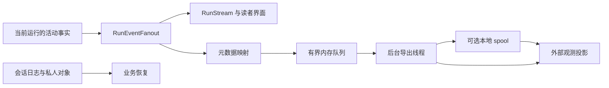

# 第 21 章 可观测性 成本与效果评测

上一章把程序、插件、材料和私人数据放进了可安装、可恢复的组合。现在，读者甲已经在 Linux 阅读服务里打开原来的书，要求 Agent 解释一个条件，并把解释保存成可继续探索的演示。页面出现“正在综合原文”，过了一段时间，答案和来源按钮终于显示出来。

这一次看似普通的等待，至少留下三个问题：时间花在模型、排队、工具还是保存上？多轮调用消耗了多少实际用量？最终结果是否满足了读者的要求？

只保存一句“请求成功，用时十秒”无法回答它们。HTTP 返回成功，可能只表示问题已接纳；模型返回完整文本，仍可能没有交付有效来源；答案保存成功，也不证明解释正确。反过来，外部观测平台暂时不可用，不应让已经生成的回答无法保存。

本章回答：**怎样知道系统把时间和调用花在哪里，以及是否完成了任务？** 我们先沿同一次运行建立计量边界，再把执行事实投影到观测系统，最后用任务合同和受控实验判断改进方向。

## 21.1 执行树、终态和用量口径

### 从“等了多久”回到“这段时间包含什么”

第 18 章已经区分模型等待与状态锁占用，第 19 章又加入运行准入和模型许可。现在需要让这些区别进入实际记录。

[run_events.rs](../../../crates/runtime/src/run_events.rs) 的 RunEvents 以一个 Instant 为起点，给活动分配 step_id。RunActivity 保存种类、用途、parent_step_id、状态、相对开始时间和持续时间。scope 临时设置父活动及用途，EventScope 退出后恢复原值。于是，外层采样可以是根下面的模型节点，book.synthesize 可以是工具节点，其中真正进行综合的模型调用再成为它的子节点。

这棵树表达执行包含关系。若一个工具用时五秒，其中内层模型用时四点五秒，工具时间已经包含这四点五秒。将两行相加得到九点五秒，会重复计算。

begin 的 started 参数还有一个很实际的作用：校验阶段就被拒绝的工具没有实际开始时间。finish 因而也不为它生成 duration_ms。一次非法原文范围请求可以留下 rejected 和错误码，但不能被解释成一次“耗时零毫秒的成功读取”。NoResult 则表示执行了查询而没有结果，和未执行的拒绝不同。

下面是**教学时间线**，所有时刻均为假设，不是一次项目实测。起点取读者提交请求，暂且假设所列前台步骤串行：

| 区间，秒 | 工作 | 该区间的含义 |
| --- | --- | --- |
| 0.00—0.40 | 接入、准备和运行排队 | 尚未进入本例的观测根 |
| 0.40—2.40 | 第一次外层模型活动 | 请求构造、许可等待、网络往返及模型响应的宿主可见时间 |
| 2.40—7.40 | 综合工具 | 包含读取、准备、内层模型及结果整理 |
| 2.60—7.10 | 综合工具中的模型活动 | 已包含在上一行，是子区间 |
| 7.40—10.40 | 第二次外层模型活动 | 组织最终解释及来源 |
| 10.40—10.60 | 终态提交和本例其余收尾 | 包括假定的磁盘提交等待 |
| 10.60—10.70 | 最后传输及浏览器安装结果 | 发生在宿主完成之后 |

宿主观测根的时长是 `10.60 − 0.40 = 10.20` 秒；读者看到完整结果的时间是 10.70 秒。直接累加四个活动得到 `2 + 5 + 4.5 + 3 = 14.5` 秒，其中内层模型被重复计入。模型活动自身合计 9.5 秒，只能叫模型调用边界内的累计时间，不能叫 GPU 计算时间。

这些区间也没有给出锁占用量。综合工具五秒不表示 AppState 被锁五秒，提交的 0.20 秒也不是全轮所有状态访问的总和。要回答锁是否成为瓶颈，需要观察实际闭包及锁的等待；要回答浏览器何时显示，需要前端时钟。不能从一棵宿主活动树反推出它没有记录的时间。

当前多人入口 [RunAdmissions::run_one](../../../crates/server/src/run_admission.rs)在取出准备好的任务、建立执行端口之后调用 start_run，因此这棵观测树不覆盖此前全部 queued 时间。模型活动的边界则包在 LimitedAdapter 外面；[LimitedAdapter::call](../../../crates/server/src/service_limits.rs)取得模型许可时会通知 [RunStream::resource_wait](../../../crates/server/src/agent_stream.rs)，所以某个模型节点的 duration_ms 可以包含等许可的时间。实时界面的 waiting_model 与该节点不是两个可直接相加的计时桶。

### 首个模型文本和首个可公开片段为什么分别记录

ObservedAdapter 截获 Provider 的 Text、Usage 和 Request 事件。model_first_text_ms 从该模型活动开始，计到第一个非空文本片段；answer_first_patch_ms 则从整个 Run 的事件起点，计到第一个公开回答 patch。

模型可能先调用工具，或者先生成还不能公开的结构片段。第一个 Text 到达时，读者未必已经看见回答。第 12 章的来源编译、稳定前缀和修复也会改变公开时间，所以两项指标必须分别保留。

观测到的 patch 是宿主发布的事件。浏览器接收、合并和绘制还在后面，服务端这个数字不是屏幕首字时间。在前面的教学时间线里，若最后一次模型活动在 7.90 秒产生首个文本，它的 model_first_text_ms 为 500；若本轮首个公开 patch 在 8.20 秒产生，answer_first_patch_ms 为 7800。两个值的起点和对象都不同。

### 一个终态为什么需要三个维度

[observation.rs](../../../crates/runtime/src/observation.rs)定义 execution_state、delivery_state、persistence_state。[business_states](../../../crates/server/src/observability/lifecycle.rs)将运行结果映射为前两个维度，调用者根据实际保存结果传入第三个维度。

| 场景 | 执行 | 公开交付 | 持久化 |
| --- | --- | --- | --- |
| 正常生成并保存 | completed | delivered | saved |
| 来源修复仍有问题，但终态记录成功写入 | completed | failed | saved |
| 结果已经形成，终态提交失败 | completed | delivered 或 failed，取决于来源交付 | failed |
| 取消后成功写入取消事实 | cancelled | not_delivered | saved |
| 只从未闭合观测记录恢复出的根 | interrupted | unknown | unknown |

当前 delivery_failed 检查最后一次来源修复是否仍有 issues；incomplete 单独放在 metadata 中。不能把 incomplete 直接当作 delivery_state，也不能把这张表中的 delivered 当作任务质量通过。业务交付是公开结果的状态，任务质量还需要检查内容与要求。

本地 [execute_observed](../../../crates/server/src/agent_run.rs)先执行，再经权威入口完成会话终态与相关收尾，最后调用 ObservationRun::finish。网络路径同样在 save_finished 返回之后记根终态。根的时长因而包含这段保存路径，但不包含之后所有网络传输，也不覆盖后台复核的整个生命周期。

本轮实际执行的[正式准入用例](../../../crates/server/src/tests/cache_observation_tests.rs)分别注入正常响应、Provider 失败和保存失败，确认完成与保存状态没有合并。外部模型使用本机固定响应，外部观测端使用捕获器；这验证的是当前连接，不是模型回答质量。

### 用量快照只能结算一次

流式 Provider 可能多次发送累计 usage。例如先收到总量 5，再收到总量 7，这一调用应记 7，不能记 12。[ObservedAdapter::complete_observed](../../../crates/runtime/src/run_events.rs)里的关键分支是：

```rust
crate::provider_stream::ModelDelta::Usage(snapshot) => {
    usage.replace(Some(snapshot.clone()));
}
```

chat 和结构化调用采用相同方式。即使流最终失败，最后已经收到的快照仍保留；本轮固定响应测试先发 5、再发 7、随后返回错误，实际得到失败活动及总量 7。chat 在没有收到快照时，可以从 AssistantTurn 的总量补一个只有 total_tokens 的记录。

TokenUsage 进一步区分 provider_reported、executor_reported、estimated、unavailable，以及 complete、partial、unavailable。当前 Resident 的转换只有在调用成功且输入、输出字段都存在时，才把用量完整性标为 complete；失败后的已知快照属于 partial。未知字段保持 None，不能填零。

还有两个容易重复计费的子项。cached_input_tokens 是输入中的缓存部分，reasoning_output_tokens 是输出中的思考部分；它们不应再加到输入、输出和 total_tokens 上。观测根本身保留 unknown 用量，实际模型节点携带各自的 Provider 数字；汇总时按调用身份结算模型节点，不能再把根和父工具当作额外调用。

金额需要另一层合同。做一个**虚构单价的教学算例**：假定输入 15,000 tokens，其中缓存输入 12,000；输出 2,000，其中思考输出 600。假定每百万缓存输入、非缓存输入、输出分别收费 0.2、2、4 个货币单位，没有另计项目：

```text
费用 = (12,000 × 0.2 + 3,000 × 2 + 2,000 × 4) / 1,000,000
     = 0.0164 个货币单位
总 tokens = 15,000 + 2,000 = 17,000
```

600 个思考输出不再次相加。这些单价不是任何模型当前报价。若三个实际调用中只有两个有 usage，可以报告这两个调用的已知小计和一个缺失项，但完整任务成本仍未知。网络 RunUsage 中的 known_total_tokens 正是已知累计量；它既不证明全量完整，也不是累计费用硬额度。

## 21.2 元数据观测与持久队列

### 同一事件为什么有两条出口

读者界面需要公开草稿、来源和实际效果；排查延迟通常只需要节点身份、用途、时间、状态和用量。把整个模型请求直接当成观测事件，会把这两个用途混在一起。

[RunEventFanout](../../../crates/server/src/agent_run.rs)明确分流：活动事件给实时流和观测端，answer_patch 与 source_bindings 给实时流，首 patch 时间与证据接纳计数给观测端。外部记录从专用 ObservationEnvelope 生成，其 inputs/outputs 为空，没有通用的“把任意运行对象全部序列化上传”路径。



图中业务恢复使用第 16 章的日志与领域对象。外部观测不负责重放笔记、恢复模型执行或判定哪份聊天是权威历史。

[ActivityMapper](../../../crates/server/src/observability/mapping.rs)把每个 step 映射为稳定 span_id，后续状态增加 revision；父节点使用 parent_span_id。工具名经过注册表判断，用途经过允许集合判断，错误只输出有限格式的代码。书籍与会话在当前宿主生命周期内转换为不透明引用，活动 label、问题、模型正文和工具参数不进入映射。

[RequestTracker](../../../crates/runtime/src/request_diagnostics.rs)观察最终 Provider 请求，在同一 Run、同一用途内比较前后两次请求，输出第一个变化的消息位置、角色、字段种类、字节数，以及工具和设置是否变化。这使“第十三次调用缓存下降”能进一步定位到客户端哪个输入发生变化。输出的字节前缀是 JSON 比较结果，不是模型 tokenizer 或服务端 KV 缓存的测量。

### 观测失败为什么不能阻塞回答

[ObservabilityConfig](../../../crates/server/src/observability/config.rs)默认 off。仅有全局 LANGSMITH_TRACING 或 Key 不会开启它；metadata 模式另需项目与凭据，正式配置要求 HTTPS。配置无效时宿主保持业务可用，并通过观测状态报告错误码。

生产线程执行映射、序列化和一次短时入队，不同步等待外部网络。[BoundedQueue::try_push](../../../crates/server/src/observability/queue.rs)的容量判断是：

```rust
if state.items.len() >= self.limits.max_items
    || state.bytes.saturating_add(item.encoded_bytes) > self.limits.max_bytes
{
    return Err(QueueDropReason::Capacity);
}
```

当前默认队列最多 1024 项、4 MiB 编码正文，单项最多 64 KiB，单 Run 最多映射 512 个活动 span。达到上限便拒绝该观测项并记丢弃，不等外部服务腾位置。这里限制的是队列编码量和活动映射数量，不是整个进程的 RSS，也不等于全部会话或模型上下文的上限。

这个选择牺牲观测完整性来维持业务路径。必须同时保留 dropped、coverage、last_error_code，避免把“没有看到某工具”解释成“某工具没有执行”。根创建未入队时，这次外部观测不能继续建立可靠的子树；子项被丢弃时，运行仍继续，根的最终更新尝试带上已知的入队丢弃计数。

### 持久队列怎样恢复一棵未闭合的树

设置 UB_OBSERVABILITY_SPOOL_DIR 后，导出线程在发送项目前将它写入 spool。当前默认上限为 64 MiB、4096 文件、24 小时保留期；容量治理按完整旧 trace 淘汰，隔离材料也参与容量计算。正文先同步到临时文件，再发布文件名。

这里的“持久”有明确起点：生产线程入队成功时，记录可能仍只在内存；后台取出并 persist 成功后，才具备重启恢复依据。它没有把业务响应改成等待观测 fsync 的同步路径。

[export_loop](../../../crates/server/src/observability/mod.rs)先确认父节点创建，再发送子节点；更新也要等对应创建被确认。重试复用同一 ID 与 revision，[HTTP 传输](../../../crates/server/src/observability/langsmith.rs)将重复创建的 409 视为已经确认，避免在响应不明时另造一棵树。认证拒绝会停止本次运行时继续发送，其他可重试错误采用有限尝试。重试最多三次，等待窗口、单请求超时与退出预算分别控制不同阶段，不能合成一个“必在一秒内完成”的保证。

重启打开 spool 时，代码读取可用记录、隔离损坏项，并按观察时间及依赖阶段排序。如果根只有开始而没有终态，synthesize_interrupted_updates 补的不是业务成功：

```rust
observation.elapsed_ms = None;
observation.duration_ms = None;
observation.timing_source = TimingSource::LastObserved;
observation.execution_state = Some(ExecutionState::Interrupted);
observation.delivery_state = Some(DeliveryState::Unknown);
observation.persistence_state = Some(PersistenceState::Unknown);
```

这段代码来自 [spool.rs](../../../crates/server/src/observability/spool.rs)。补记使用最后可见的观察时间，另记 interruption_detected_at，并标 reconstructed。若程序昨晚退出、今天重启，不能把整夜离线时间填成模型执行时长。也不能因为观测根没闭合，就断言业务 JSONL 没有保存；两个存储的完成边界不同。

目标项目、endpoint 或 workspace 变化时，默认隔离旧材料，只有显式选择 replay 才向新目标重放。off 模式配合已指定 spool 目录会清理其管理的观测材料，而不是暂停后留待自动续发。spool 是专用导出暂存位置，不承担业务备份职责。

### 构建和评测为什么另有投影合同

构建侧已经有生命周期事件与用量回执，没有必要把读取一份旧回执伪装成“刚刚执行了一次模型调用”。[projectPrebuildReceipts](../../../packages/observability/src/prebuild-projector.ts)以 durable_receipts 为来源，分别保留 work_unit_id、physical_attempt、semantic_attempt、lease_epoch 和 submit_revision。一次租约重领、一次语义重试、一次候选修订因此不会被压成同一个计数。

时间来自已有事件：执行器开始与终态都在时标 recorded，使用其他事件推得的区间标 derived，无可用区间标 unavailable。实际 Provider 用量、执行器自报和 estimate 字段也分开。缺少历史 usage，不能用“这次投影生成了数据”补成已知费用。

[exportPrebuildObservations](../../../packages/observability/src/prebuild-export.ts)使用独立 ExportLedger 固定外部 run_id，只在确认调用完成后推进 revision。读取和导出不修改源构建回执。本轮固定客户端用例实际确认：重复版本跳过，新版本更新同一 ID，缺时间或客户端失败不记确认。

评测又多一层语义。[eval-adapt](../../../packages/observability/src/eval-adapt.ts)按系统与样本转换它支持的本地报告形状，保留数据集、程序和评委版本、计量来源及配对身份；[eval-feedback](../../../packages/observability/src/eval-feedback.ts)把未知和不适用保留为字符串状态，不改成零分。导入[入口](../../../packages/observability/src/eval-import.ts)要求匹配比较组、数据集、系统集合和内容字段的显式授权，并检查真实开始、结束时间。只有 elapsed_ms 的旧结果仍能在本地分析，但不会凭导入时刻捏造一段历史执行。

外部实验提交结果不明时，导入账本标 uncertain，后续调用不会自动重发同一个实验。这里没有沿用运行 span 的重试策略，因为两个外部写入合同不同。本地评分仍是任务和评分规则的权威，外部面板只消费投影。

## 21.3 证据召回、引用支持、任务成功和实际动作

### 先明确读者究竟要求了什么

甲要求“解释条件，并保存可探索演示”，不能只检查文本里有没有出现条件名称。解释、来源、保存和可用成果是不同要求；某项做到了，也不能抵消另一项明确失败。

当前 [task-spec.mjs](../../../evals/semantic/task-spec.mjs)把旧题转成逐项要求，区分内容、准确、完整、解释、引用、动作和持久化。[分层评测决策](../../adr/0137-stratified-reading-evals-and-diagnostic-improvement.md)用 L1 定位提取、L2 解释与局部推导、L3 多证据整合、L4 情境诊断与迁移评价描述必要理解操作；single_turn、multi_turn、cross_session 另作交互条件。

重启后准确恢复一个原句，可以是 L1 加 cross_session；调用十次工具也不会自动变成 L4。能力分类来自任务要求，实际难度来自运行结果，不能用工程路径的复杂度代替理解层次。

正式产品输入只投影当前用户材料，金标准、参考证据与后续多轮脚本留在评测侧。这样才是在观察 Agent 如何完成问题；提前把答案或目标 LID 放入请求，会改变被测任务。

### 三个比例各自回答什么

[旧版 Agent 指标实现](../../../evals/semantic/agent-core.mjs)有三个相邻却不能互换的比例：

| 指标 | 分子与分母 | 它能回答的问题 |
| --- | --- | --- |
| evidence_recall | 被实际模型输入覆盖的必要参考证据组 / 全部必要参考组 | 参考依据是否真正进入过模型上下文 |
| citation_support | 正确且由有效交付引用支持的必要事实 / 全部必要事实 | 必要回答是否同时有正确内容和可用依据 |
| success_rate | 完整成功任务 / 全部任务 | 用户要求是否在该协议下整体兑现 |

observedEvidence 从实际请求的工具消息读取 accepted_evidence，再到 model_body 找能对应 canonical 原文的正文。只有 LID 或定位预览不算完整取证。reference 组是预先选定的代理依据，也没有穷尽所有正确替代段落。

来源必须实际进入最终 answer_view，并能经 source.resolve 得到有效原文。工具曾产生过一个 source_ref、答案裸写一个编号，均不能替代交付。旧自然事实判分还要求标注答句确实出现在回答里，不能让评委为它补答；加粗分隔符可以归一化，改了数值、词句或标点仍可能不通过。

用一个**教学样本**理解三者：三个必要证据组都进入模型，两个必要事实都答对，但只有一个事实附了有效引用。那么召回为 3/3，必要事实引用支持为 1/2，完整任务成功为 0/1。100% 召回不是成功率的同义词，内容正确也没有替读者完成查证路径。

### 当前评分怎样分开支持与定位

旧协议常把来源问题压进 grounding，容易混淆两种失败。某个来源弹窗的前后文确实包含必要公式，但高亮只有“损失”两个字：论断可以有原文支持，定位却让读者难以直接找到依据。

[task-quality-v2.mjs](../../../evals/semantic/task-quality-v2.mjs)把 citation 拆成 source_support 和 source_location。评委逐个实际论断给出 support、location 及 basis；basis 必须来自该候选实际交付的有效 C 来源，可以指定 highlight、before、after。公共 R 参考可用于核验内容，却不能替候选补一个没有交付的来源。

wire 协议要求评委给逐字 quote，由程序计算位置。resolveV2Basis 的关键部分是：

```javascript
const start = part.indexOf(basis.quote);
if (start < 0 || part.indexOf(basis.quote, start + 1) >= 0)
  throw new Error('Invalid source basis: quote missing or ambiguous in specified part');
return { source_id: basis.source_id, part: basis.part, start, end: start + basis.quote.length };
```

在执行这段之前，函数已确认来源有效、part 存在、quote 非空，而且评委没有自行填写 start/end。返回的位置按 JavaScript 字符串的 UTF-16 单位计算。原文不存在、同一部分重复歧义、引用公共 R 或把 after 的公式说成 highlight，都不能成为有效依据。

程序能保证依据位置可核验，语义是否足以支持论断仍需要判断。当前协议明确：来源视图完整，只表示保存的片段完整；若缺少决定比值方向的关键比较量，support 应为 unknown，不能从常识或答案自己的说法补齐。内容正确性与来源支持也分别判，不能只因某个 C 没有一句话，就断言答案内容错误。

任务汇总位于 [taskQualityReport](../../../evals/semantic/task-quality.mjs)：

```javascript
const task_result = audit.delivery === 'failed' || requirements.some(r => r.verdict === 'unmet') ? 'fail'
  : requirements.some(r => r.verdict === 'unknown') ? 'unresolved' : 'pass';
```

一个必要要求已经明确 unmet，另一项 unknown 不会把失败冲成未决；只有尚无已确认失败、却缺足够判断时才是 unresolved。评委超时、格式无效和未运行另有 score_status，不能直接写成模型内容错误。配对偏好采用两个候选顺序，顺序分歧留下 judgment_disagreement，不平均成一个假定胜者。

本轮固定评分用例实际确认了三种组合：支持通过而定位失败时任务失败；交付正常但评委超时时任务未决；来源缺必要前提时支持未知，而已经成立的内容准确项仍保持 met。它们验证评分程序的分账，不验证真实评委的语义能力。

### 动作必须由状态证明

“我已经跳转过去”只是一句话。navigationOK 要求实际请求里有成功的 reader.gotoLid 或 reader.scroll 回执，且最终视口覆盖目标原文。缺任何一项，都不能把自然语言声明算成跳转成功。

[agent-run.mjs](../../../evals/semantic/agent-run.mjs)的重启题更进一步：从空私人状态开始，让 Agent 自行保存；读取真实记录；停止进程；用同一私人根启动新进程；确认记录和位置；新建空聊天，再发送没有原答案的恢复要求。最后既检查原信息是否进入模型输入，也检查 Agent 是否正确复述。

评测器不替 Agent 写笔记。准备阶段失败也留在分母，不靠跳过难样本提高恢复率。生产正常记忆注入可以算观察，并不要求为留下漂亮轨迹而额外调用某个工具。

API 状态观察与真实界面又有区别。历史 [LA10](../../LA7-LA10实施与验收.md)曾通过浏览器连续操作发现：来源打开已改变视口，但漏存 session，重启回到旧位置；修复后才完成来源弹窗、显式跳转、保存和新聊天回放。后续脚本误等错接口、过早数 DOM 按钮也单独纠正，说明产品失败和验收程序失败都需要回到实际路径。

## 21.4 产品对照、同环消融与归因

### 先看一次完整产品比较

历史 [LA7 报告](../../../evals/semantic/results/2026-09-08-la7/summary.json)比较同一部书、同配置模型上的完整 Resident 与普通 Chunk RAG。Chunk 使用 1000 UTF-16 字符分块、150 重叠、BM25、最多 6000 字符正文和一次回答调用；Resident 使用当时的生产工具循环、证据账本及来源交付。

两者问题和模型相同，但提示、工具、上下文和执行能力不同。这是产品比较，不是只增加图谱的实验。以下数字是 **2026-09-08 的冻结程序与 natural-facts-v2-bold-normalization 口径**，本轮只回读和复算：

| 指标 | Chunk | Resident |
| --- | ---: | ---: |
| 共同问答完整成功 | 20/24 | 15/24 |
| 共同问答 Provider 请求 | 24 | 200 |
| 平均实际 tokens | 未知，1 次缺 usage | 97,359.25 |
| P95 完成延迟 | 7.57 秒 | 114.85 秒 |
| Resident 的必要参考组召回 | — | 100% |

这组结果已经足以否定“只要找到全部依据，就一定能完成任务”的推断。LA7 还记录 Agent 内容正确率为 16/24，实际跳转 4/4，而来源题的内容、引用与动作完整通过仅 1/4。不同层次的结果必须分别保留。

成本分账也改变了优化入口：该批内层 query/synthesize 和 compaction 均为零请求；来源修复占 30 请求、75,151 tokens，无工具终答占 4 请求、41,249 tokens。不能看到总调用多，就先归咎于内层综合或压缩。

其中 contrast-03 的标注器把答案分号改成句号，逐字校验拒绝；source-04 的实际回答和来源支持“不可微”，标注字段却填成 true。旧严格分数保持，但失败解释不能写成 Agent 不懂这些内容。后来的局部修复复验又使用另一份程序，不能把通过题拼回原来的全量成绩。

### 同一循环下，增加结构定位是否更好

要判断图或树带来的变化，需要收窄其他变量。[LA9-v2](../../../evals/semantic/results/2026-09-08-la9-v2/summary.json)在同一 Agent 循环中比较 Text、Tree、Graph，三组共用模型、提示、正文预算和停止条件，按题轮换顺序。Text 只使用原文与词法定位；Tree 加确定性章节树和邻接；Graph 再加概念与关系定位。

三组共同关闭高层 query/synthesize、profile、memory、artifact 和模型 sidecar，定位预览不提供正文；真正的原文必须经相同 book.text 和证据闸。冻结条件包括 12 轮、300 秒、8000 输出 tokens、120,000 累计实际 tokens、20,000 终答预留、12,000 UTF-16 唯一正文预算。这些是历史消融合同，不是今天默认 Resident 的限制；当前 [OuterConfig](../../../crates/runtime/src/orchestrator.rs)默认 max_turns 为 None。

| 组 | 完整成功 | 证据召回 | 引用支持 | P95，秒 | 平均实际 tokens |
| --- | ---: | ---: | ---: | ---: | ---: |
| Text | 10/24 | 88.46% | 38.46% | 115.79 | 85,729.96 |
| Tree | 11/24 | 88.46% | 34.62% | 88.31 | 101,842.04 |
| Graph | 9/24 | 92.31% | 30.77% | 91.90 | 95,171.38 |

只比较最后一列，会发现 Graph 比 Tree 便宜约 6.55%；同时完整成功从 11 降到 9，就不能叫相同效果下的成本优化。Tree 相对 Text 新增四题成功、失去三题成功，净增一题；Graph 相对 Tree 新增两题、失去四题，净少两题。配对变化比三个总分更能指明下一步看哪些轨迹。

Graph 的两道新增成功都实际先用了 book.concept，随后回读原文并交付来源，这支持它在那两次运行里提供了有用定位路径。但两题 Text 也通过，四道跨章题三组又全部未完整成功。因此该实验没有证明图谱普遍改善跨章理解，更不能归因于某条具体图边。

历史裁决是保留 LID 与证据闸，明确措辞优先词法，已知章节需要展开时按需使用树，概念候选按需要使用。没有为了得到更好的表面分数而扩大默认图谱使用或追加预算。

### 成本回收必须先满足可比条件

LA9 的历史[预构建记录](../../../evals/semantic/results/2026-09-08-la9-v2/prebuild.json)有 530 次尝试，但全部历史实际 Provider 用量不可用；各执行器区间还可能并行重叠。书目录的 34,814,058 字节包含原文、语义资产和构建历史，不是图谱独有的增量体积。

若用教学模型表示一次性额外构建成本为 B，每次阅读节省为 Δ，则在任务效果可比、模型单价和材料版本等条件固定时，候选回收次数可以写成 `B / Δ`。这批证据里 B 未知，也没有同成功水平下的正向 Δ，所以不能代入一组估计数，宣称“读多少次就回本”。

同理，P95 要保留任务分母。[percentile](../../../evals/semantic/core.mjs)使用 nearest-rank；24 个任务取排序后第 `ceil(24 × 0.95) = 23` 个，而不是只在成功样本里取一个更好看的尾部。失败和超时都留在完成延迟记录，启动、预构建及事后判分另计。

[runTimedProduct](../../../evals/semantic/eval-timing.mjs)对成功和失败采用同一个边界：墙钟记录起止，单调时钟测 elapsed_ms。多段重启或多轮任务的 elapsed_ms 可以是实际请求区间之和，不能从最早和最晚的墙钟时间反推它必然包含两段之间全部等待。导出与阅读报告时必须保留这层口径。

### 缓存观测说明了什么

[2026-10-03 Linux 记录](../../修复记录-Linux缓存观测.md)分析一轮真实演示请求的 18 次模型调用：累计输入 1,277,397、缓存输入 925,568、未命中输入 351,829、输出 80,335。加权输入缓存命中率为：

```text
925,568 / 1,277,397 ≈ 72.4573%
```

不能先算十八个百分比再做等权平均，因为每次输入大小不同。第 12、13、17 次合计贡献 247,443 个未命中 tokens，占全部未命中的约 70.33%。请求差异把这些变化连接到旧预检查清理和活动工具正文淘汰，给出了具体回读入口。

同一记录还有一次观测接线的修正：独立 canary 能成功上报，正式多人入口却没有创建 ObservationRun。后来接到真实 Host、准入、运行和保存路径，才确认该入口的观测链成立。当前源码已有这条接线，本轮正式准入用例也经过它；不能把较早“未接通”留作当前结论。

这些历史数字也不能证明修复后缓存率提高。前后任务不同，模拟 canary 的 1000 输入、800 缓存是固定夹具。要评价缓存改动，需要比较实际输入量、缓存量、输出量和同任务效果，单独提高百分比并不一定减少总费用。

## 21.5 从失败轨迹确定下一项改进

### 缺证据，还是有证据却没有交付好

一个任务失败后，最有价值的下一步往往不是再跑同一个问题，而是提出能区分原因的干预。

历史 [EV5—EV6](../../performance/agent-eval-ev5-ev6-20260925.md)选择 target-l2：原 Resident 的内容要求通过，来源要求失败。EV5 把前两次模型工具决策改成脚本化定位和读取，仍使用真实 book.search_text 找唯一范围，再把返回的 LID 交给真实 book.text。之后模型继续自然执行。这个干预问的是：“如果一开始合法获得必要原文，后续来源组织还会失败吗？”

[evidenceIntervention](../../../evals/semantic/diagnostic-core.mjs)没有把金标准答案写进用户问题，也没有伪造证据账本。但它改变了前两次决策和上下文，所以结果只能作为诊断。历史有效运行确实读到 660 个 UTF-16 字符的必要原文并交付可打开来源；评委却把冻结英文枚举写成中文释义，导致旧字面比较与其他维度冲突，最终复核记为评分未决。来源失败未重现，不等于整项诊断已通过。

EV6 则从两系统实际模型请求抽取各自真正见过的 canonical 原文，合并重复区间，以相同顺序和 6000 字符预算送入共同回答器。它问的是：“已有证据集合本身能否支持合格回答？”

历史中，Resident 的 1362 字符证据集合经共同回答器得到 pass；Chunk 的 5550 字符集合因同类枚举冲突保留未决。两种顺序的偏好都为 tie。这个结果支持优先检查 Resident 自然路径的引用绑定与终答组织，不支持宣称 Resident 检索一定更好。

“运行中曾看见依据”与“最后一次决策时仍保留依据”也要分开。共同回答器重新组织了一份输入，不能当作原 Agent 终答上下文的原样重放。第 11 章的正文降级、压缩和动态片段都可能改变后续可见信息。

### 先修量尺，再谈分数增长

EV3—EV4 的[历史首轮](../../performance/agent-eval-ev3-ev4-20260925.md)在 8 道单轮与两个同聊天多轮任务上得到 18 个系统样本：Chunk 6 通过、2 失败；Resident 1 通过、7 失败、2 未决。其中多项旧来源失败混合了支持和定位，不能概括成理解能力失败。

此后 CQ 系列修订来源与评分合同。[CQ8](../../performance/source-delivery-cq8-20260926.md)把模型猜数值区间改成逐字依据定位，重新校准已有人审的判例；第二版十个既有判例方向一致，但九个开发诊断只有七个标签完全一致，另外两案的分类差异保留。结构有效的评分与语义可靠的评分仍是两件事。

旧答案经新量尺复评，应生成新版本报告，保留全体样本和旧分数。它能说明量尺修正后的判断，不能把分数上涨当成重新生成答案后的能力提高。评委、协议或适用任务范围改变时，也不能自动继承旧校准许可。

### 一项实验可以以撤回候选完成

ADR-0137 的较早状态仍写 EV7 待实施，但[2026-09-26 EV7 记录](../../performance/agent-eval-ev7-20260926.md)已经记载完整实验与撤回结果。

该实验只修改收尾提示的一项范围表达，假设模型把“用户没有给实现细节”误当成“全书没有依据”，从而添加过强否定。旧版和候选使用固定程序，各跑开发迁移题、新题族、简单解释及应保留不确定性的控制题，共六对十二份首次回答，交错顺序，不根据结果追加试跑。

预定保留条件要求四对迁移题至少两对改善范围，并保留关键内容与来源。实际只有一对明确改善、两对持平、一对未决；候选还在缺参数控制题中增加了未经核验的章节事实。于是实验完成，候选撤回。当前 [agent_prompt.rs](../../../crates/runtime/src/agent_prompt.rs) 的 FINISH_POLICY_REVISION 仍为 v7，与该记录的恢复结论相符。

十二份回答都完成交付，65 条来源的位置核对通过，并没有改变这个裁决：位置正确和交付完整，没有代替范围与内容要求。历史语义核查由 Codex 逐份对照材料完成，不是新题族已经取得人审校准的正式自动评分。

这类结果对架构判断有直接价值。它说明一个具体假设下的提示改动没有足够收益，保留现状比继续修改直到“跑出成功”更能维持证据的含义。实验结束之后，新题族也已经参与观察，不能继续声称它从未被看见。

### 本轮验证及当前记录器缺口

本轮实际通过 15 个 Server、4 个 Runtime 定向用例，覆盖活动边界、末份用量、元数据映射、入队拒绝、spool 恢复，以及真实多人准入的成功、模型失败和保存失败。评测侧执行 23 个既有 Node 用例，覆盖计时、用途分账、实际证据、逐字依据与评分状态；观测包另选 8 个 TypeScript 用例，7 个未选中。所有外部响应均为固定或脚本化输入。

另一个书稿内重放直接调用当前 startProviderRecorder：本机返回合法 SSE，正文携带 total_tokens=13，转发后的字节保持一致，但 measuredUsage 得到一个缺失项和未知总量。[provider-recorder.mjs](../../../evals/semantic/provider-recorder.mjs)当前先 await upstream.arrayBuffer，再对整份响应做 JSON.parse；SSE 进入 non_json_response，因此没有抽取流帧里的 usage。整包缓冲也使这个代理不能作为真实首片段延迟的测量路径。

这与生产 [provider_stream.rs](../../../crates/runtime/src/provider_stream.rs)能读取 SSE 用量并不矛盾：两者是不同采集器。因此，旧报告的“缺 usage”只能说明该记录渠道没有得到数字，不能直接断言 Provider 从未发送。当前 measuredUsage 的保守汇总是：

```javascript
return { requests: records.length,
  total_tokens: records.length > 0 && records.every(r => Number.isFinite(r.usage?.total_tokens))
    ? records.reduce((n, r) => n + r.usage.total_tokens, 0) : null,
  missing_usage: records.filter(r => !Number.isFinite(r.usage?.total_tokens)).length };
```

未知总量没有补零是正确的；采集器适配仍是需要单独处理的实现缺口。本章只保留复现和结论，没有修改它。新增书稿重放一项，加上上述 50 个既有用例，共 51 项通过；详细日志及适用范围见[本章验证记录](../SOURCES.md#第-21-章续写验证记录)。没有运行真实模型、浏览器、付费评测或外部上传。

## 已知边界

1. **活动树不等于所有成本。** 观测根不覆盖全部接单排队，模型活动可以包含许可与网络等待，父子持续时间不能直接累加；浏览器绘制、锁等待和后台复核需要各自的观察。Provider 用量、估计 tokens、磁盘字节和网络字节不能互换。

2. **导出采用有限完整性。** 入队到 spool 落盘之间存在内存阶段，限额、退出和发送失败都可能丢记录。当前根终态确认后会清理整条 spool；此前个别子项发送失败，也不会因此获得无限重试。根中预先组装的 dropped_count 主要来自入队和映射拒绝，后台发送失败进入运行时全局统计，不能仅凭外部根的 coverage=complete 断言整树完整。

3. **退出预算不是抢断正在进行的网络请求。** 当前请求超时默认十秒，退出排空预算默认两秒；已经进入传输的调用不会因后来开始 shutdown 而自动改用更短超时，join 仍要等待它返回。队列到期清空的项也没有逐项增加 dropped，因此状态计数不能替代逐项完整性证明。本轮未测真实外网超时或掉电。

4. **观测没有提供完整业务审计或质量裁决。** 元数据不含问答正文，不能据此判断解释真假；业务日志恢复和观测补记分别进行。构建与评测各有投影合同，eval-adapt 当前接受旧 quality 报告形状，不能把新 task-v2 报告原样当作相同导入对象。跨宿主重启的不透明引用也不是永久业务主键。

5. **当前评测代理不能完整计量流式响应。** 整包缓冲与 JSON-only usage 提取已由本轮 SSE 固定响应确认。历史缺失保持未知，不据当前发现补造旧费用；本地完整请求记录也不同于允许外发的元数据，外部导入另有内容范围合同。

6. **历史效果有明确范围。** LA7、LA9、EV4、CQ、EV7 属于不同程序、题集或评分协议；单书、小样本、模型评委和开发负载限制推广。AGENT_EVAL 的默认十二轮文字已落后于当前实现，ADR 中 EV7 状态也落后于后续记录。引用可核验、答案合格、演示能播放与读者真正学会，仍需不同证据。本轮没有重跑历史实验或修改产品。

## 面试时怎样解释本章

1. **怎样排查一次 Agent 请求为什么慢？**

   先固定起止边界，再沿活动树区分顶层与嵌套调用。模型活动包含客户端可见等待，多人环境还可能包含许可等待；父工具已经包含子模型时间。用接单、执行、提交和前端时间回答不同问题，缺哪段观察就补哪段，不能从总耗时猜锁占用。

2. **为什么执行完成、交付成功和保存成功分开记？**

   模型与工具运行结束后，来源编译仍可能失败；结果形成后，终态落盘也可能失败。三维状态能准确定位重试和用户提示，完整任务质量再由要求和结果判断。观测重启补记只说明可见记录中断，不替业务日志作结论。

3. **怎样避免流式用量重复计费？**

   每个实际调用只保留最后一份累计 usage，再按调用身份汇总。缓存输入和思考输出是各自总量的子项；失败调用保留已知快照，缺失不补零。估计值用于容量规划，与 Provider 报告和真实账单分列。

4. **外部观测平台故障会怎样影响阅读？**

   生产路径只做元数据投影和有界入队，外部网络在后台。满队列会丢观测并记录状态，业务仍继续。spool 提供已落盘记录的重启重放，但入队尚未落盘的记录和此前失败子项有完整性边界；它不是业务日志的副本。

5. **为什么召回 100% 仍然可能失败？**

   召回只说明参考依据进入过模型输入，不能保证最后决策仍保留它、答案正确、来源交付完整或动作完成。LA7 的历史例子就是 100% 参考召回、15/24 完整成功。应按内容、来源、交付、动作和评分故障拆开看。

6. **如何避免把评委错误算成产品错误？**

   保存评分原始输出、协议版本和逐项依据，程序验证答句及来源位置。评委超时或格式错误保持评分状态；无已确认失败而判断不足时记未决。语义校准与结构校验分开，量尺改变后统一复评完整样本，不覆盖旧结果。

7. **完整 Agent 比 RAG 好，能说明图谱有效吗？**

   不能直接归因，因为提示、工具、上下文和循环合同同时不同。项目另做 Text/Tree/Graph 同环消融，固定预算并看新增及失去成功。历史 Graph 提高了参考召回，却没有提高完整成功，这支持按需使用定位能力，不能宣传普遍图谱收益。

8. **怎样从失败决定下一项改动？**

   先提出可区分的假设。充分证据干预观察后续交付，共同回答器观察已有证据集合的效用；它们不替换产品成绩。若怀疑提示，冻结单变量、配对和退化条件，保留首次结果。EV7 未达到预定改善门槛，撤回候选，就是有结论的实验。

9. **这本书实际验证到了哪一层？**

   当前源码的定向验证使用固定模型响应、本机 HTTP、临时文件、受控事件和评分夹具，51 项通过，并确认评测代理的 SSE 用量缺口。真实质量、缓存和部署结果引用有日期与条件的历史记录；本轮没有真实模型费用，也没有把程序断言当作学习效果。

第五篇至此完成：宿主让长任务与读者操作同时推进，多人服务限定归属与资源，发行流程组装可维护的程序和数据，而观测与评测帮助判断它是否值得继续改。下一章进入[第 22 章：关键决策及其演进](22-关键决策及其演进.md)，把这些机制放回需求和证据中，讨论当时为何这样选，以及什么变化值得重新作出选择。
