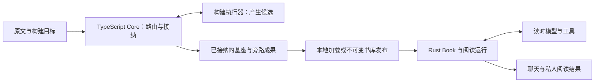

# 第 22 章 关键决策及其演进

上一章已经能沿一次运行回答三个问题：时间花在哪里，用量如何结算，结果是否满足任务。现在把镜头拉远一点。读者甲打开一本完成构建的书，让 Agent 解释跨章概念、制作演示并保存；读者乙同时在另一窗口提问。为什么这个过程由 TypeScript 构建、Rust 运行、JSON 文件交付、SQLite 接单和 JSONL 聊天日志共同支撑？为什么早期说不做向量索引，后来又出现 embedding？为什么去掉十二轮上限，却仍然强调停止？

这些问题不能用“Rust 快”“图谱准确”“事件日志可扩展”几句口号回答。每个选择都在承担一项具体责任，也在留下相应成本。同一个选择在单机插件、多人阅读和长期任务三个阶段，面对的条件可能已经不同。

本章回答：**在当时的需求和证据下，为什么选择当前结构？** 我们沿甲的任务回看五组决定：先把准备材料和阅读运行分开，再区分位置与语义，接着解释持续执行需要哪些状态，最后追到保存和多人归属。历史理由取自有日期的 ADR；当前行为回到实现；对替代方案的推演明确作为分析。

## 22.1 构建与读时的语言和边界

### 读一本书，为什么不要求构建执行器一直在线

甲打开书时，需要原文、章节结构、语义候选和已保存的私人状态。他不需要重新生成一遍整书抽取结果，也不需要知道那次构建由哪个 Harness 执行。最先需要稳定的，因而是准备工作与阅读工作之间的交付物。

[ADR-0001](../../adr/0001-本地plugin形态.md)在 2026-06-21 确定本地插件形态，理由是当时没有自建托管服务、容量和计费的需求。同一天的补充又澄清：插件启动的 localhost 阅读进程仍属于本地形态；预构建可以绑定 Claude Code 或 Codex，读时阅读器应与 Harness 脱钩，允许另选模型后端。

这一补充很关键。“本地插件”没有把所有后续阅读都锁进一次外部 Agent 会话。构建负责形成可消费材料，读时负责在材料上执行读者的当前任务。后来出现 Linux 多人入口，变化的是运行宿主、身份和部署；这条材料交付边界继续存在。

当前 [build-orchestrator.ts](../../../packages/core/src/build-orchestrator.ts)负责路由构建阶段、组织工作单元和接纳成果。以 technical_learning 的 BookStructure 为例，routeBookStructureProductionStage 根据 profile 选择发现和组织合同，已有候选、阶段状态与发布条件由 Core 持有。模型生成一个候选，不等于它已经成为读者正在使用的成果。

[publishAutomaticBuildArtifactSet](../../../packages/core/src/automatic-build-publication.ts)把候选文件写入暂存位置，调用候选校验，再逐项提升到正式位置并留下发布回执。它属于构建工作区内的成果发布。Linux 的 [PublishedLibrary](../../../crates/server/src/published_library.rs)还会登记一次不可变书库发布，这两个“发布”不能混成同一操作：前者收口构建成果，后者建立网络阅读可引用的材料版本。

读时 [Book::new](../../../crates/read-tools/src/lib.rs)消费已经装载的 ReadOnlyBase 与原文，构建自己的 LID 和节点索引。阅读请求不需要回到 TypeScript 执行器查询某个正在变化的构建对象。



图中并不是“一边有模型，另一边没有模型”。两边都可能调用模型。区别在于构建调用为可复用材料服务，读时调用为当前读者和当前任务服务；两者具有不同的输入、身份、重试和保存责任。

### 语言分工是交付边界上的选择

2026-06-22 的 [ADR-0021](../../adr/0021-实现技术栈-预构建ts-读时后端rust-前端待定-基座schema-rust权威ts-rs生成.md)在这条边界上选择 TypeScript/Node 预构建与 Rust 读时后端。记录中的理由包括：构建侧书籍解析、确定性文本处理与 Harness 编排的生态；读时侧希望借鉴 Codex 的运行循环、Provider 和记忆实现；冻结产物使跨语言接缝主要表现为材料交付，而不是在一次采样中频繁互调两套可变对象。

这是当时的技术选择依据，不能改写成“项目已经完整移植 Codex”，也不能当作 Rust 相对 TypeScript 的延迟实测。当前 [runtime 依赖](../../../crates/runtime/Cargo.toml)与[server 依赖](../../../crates/server/Cargo.toml)对应本项目自己的 crate 和运行实现；Server 使用 tiny_http 等实际组件。ADR 中列举的参考库、待选前端与增量设想，需要分别核对后续落地。

今天的前端入口 [main.ts](../../../packages/web/src/main.ts)已创建 Vue 应用，并按构建配置选择本地或多人界面。第 20 章的 Tauri 桌面宿主和 Linux Web 服务也已经存在。因而“前端待定”只能放在决策形成时的叙述中，不能作为当前架构状态。

这套分工付出的代价很具体：仓库需要维护 Cargo 与 Node 两条工具链，文件格式变化必须同时考虑生产方和消费方，发行过程要组合相容版本。它获得的是两侧独立运行与明确的材料边界。若只是为了让一次等待远程模型的请求更快，换语言并不能直接缩短 Provider 的计算和网络等待；第 18 章的关键路径分析仍然适用。

### 类型统一之后，为什么还要统一坐标单位

跨语言交付的真正风险不是文件扩展名，而是两侧用相同字段表达了不同含义。例如 start=3、end=4 究竟表示字节、Unicode 码点，还是 JavaScript 字符串单位？

[base-schema](../../../crates/base-schema/src/lib.rs)把 Span 定义在 Rust，再生成 TypeScript 类型。下面是实际声明：

```rust
#[derive(Debug, Clone, PartialEq, Serialize, Deserialize, TS, JsonSchema)]
#[ts(export, export_to = "../../../packages/core/src/generated/")]
pub struct Span {
    pub start: usize,
    pub end: usize,
}
```

生成的 [Span.ts](../../../packages/core/src/generated/Span.ts)使用 number。两侧共享的语义是 UTF-16 code unit 的半开区间；Rust 的 Book 在加载时把原文转成 `Vec<u16>`，text 按同一单位切片。

用一个**教学源串** `A😀中B` 看这个约束。它有四个 Unicode 码点、五个 UTF-16 单位、九个 UTF-8 字节。“中”的 UTF-16 区间是 `[3,4)`，UTF-8 字节区间是 `[5,8)`。若字段形状完全正确，却把前一组下标交给字节切片，仍然会读错。

因此，Rust 权威类型和生成代码减少的是字段漂移；它们不自动证明区间次序、原文覆盖、来源支持或模型语义正确。当前候选接纳、来源校验和读取合同继续承担这些责任。JSON 在这里是可检查、可分发的交付格式；是否改成二进制，应由材料加载的真实瓶颈决定，不能仅由“二进制通常更快”推出。

## 22.2 原文身份、语义图和检索方式

### “找到哪一段”和“这段说明什么”为什么分开

甲要求解释跨章概念。一个合理的系统需要先找到可能相关的段落，再读取原文、判断条件和关系，最后把选定来源交给读者。前一个位置选择错了，可以换检索策略；已经交付的笔记和引用却不能随着每次策略调整失去落点。

这正是 [ADR-0123](../../adr/0123-lid-foundation-and-reliable-agent-completion.md)在 2026-09-08 明确保留 LID 坐标层、让图谱投入接受增量收益检验的原因。因整套 Agent 表现不好就删除 LID，会破坏原文寻址和私人锚点；因为 LID 有用就保留全部语义复杂度，又把位置真实性误当成了任务效果。

当前 Book 的 `lid_idx` 和 `node_idx` 分别连接位置节点与图谱节点。concept_candidates 提供概念候选，text 取原文，来源账本和公开编译再确认本轮可使用的引用。链路中的三项事实因此各有边界：有位置，表示可以寻址；看过原文，表示本轮有可用材料；用它支持回答，仍需要语义选择和实际交付。

第 21 章的历史 LA9-v2 提供了一个有用的反例：Text、Tree、Graph 同环对照的完整成功分别为 10/24、11/24、9/24；Graph 参考召回更高，却没有带来更高的完整成功。这个结果支持检查图谱的具体使用范围，不支持“所有语义结构都应删除”，更不支持“定位坐标没有价值”。它是当时单书、固定程序与预算下的实验，今天仍应保留这些条件。

### 早期不做 embedding，后来为何又做

2026-06-21 的 [ADR-0002](../../adr/0002-图谱中心-砍向量索引.md)否决向量索引，重点并非 cosine 运算本身。当时本地插件的条件下，生成 embedding 需要新增外部服务、凭据与数据传输，或者安装本地模型并承担计算。已有图谱与词法定位能否满足阅读任务，是先要验证的问题。ADR 同时留下了回头条件：若转述查询的召回不足，再评估可选增强。

这份早期记录还提出“图谱给出关系，比相似更贴近引用支持”的判断。结合后续实现，应将它理解为设计假设：模型抽出的边也可能错误，只有端点存在并不能证明关系成立。引用仍须回到原文和回答中的具体主张，不能由图边名称直接授予可信度。

到 2026-09-30，[ADR-0149](../../adr/0149-构建期语义候选召回与Core-owned-Embedding-Provider.md)针对另一个明确问题重新引入 embedding：构建期 T5A 正式对象的跨块对齐。不同块可能用不同措辞描述同一候选，旧 catalog substring 查询会漏掉应该拿来比较的对象。新增召回把候选交给 Agent 比较，Core 仍要求参与对象、已读原文和引用覆盖符合接纳条件。

这是对旧决定的限定修订。它没有宣布所有读时查询改成向量 RAG，没有让相似度自动合并对象，也没有增加一个独立顶层检索构建阶段。随后 [ADR-0151](../../adr/0151-book-structure-global-outline-and-semantic-retrieval.md)让 BookStructure 成为另一消费者，共用 Provider、缓存、融合和准备机制，却保留自己的候选含义与证据规则。

可以把当前责任沿一次候选处理拆开：

| 环节 | 产出 | 没有随之获得的权力 |
| --- | --- | --- |
| 词法或语义召回 | 可能相关的候选身份与位置 | 不决定对象相同，不决定主题依赖 |
| inspect、read | 完整对象或实际原文材料 | 不自动接纳某次合并或新主张 |
| Agent 提交 action | 对关系、身份或章节取舍的判断 | 不直接写入最终公共结构 |
| Core 接纳与组装 | 符合当前合同的状态和成果 | 不证明开放语义判断绝对正确 |

### 为什么 Provider 由 Core 准备，而不是藏在搜索按钮后面

构建进度读取、剩余工作预览和候选接纳都会访问检索状态。如果任意一次“查看下一步”都能隐式调用 embedding，费用、取消和恢复就失去了可解释的边界。

当前 [prepareBuildRetrieval](../../../packages/core/src/automatic-build-retrieval.ts)位于已授权的异步准备路径。入口先核对确认状态与配置：

```typescript
if (plan.status !== "confirmed" || !retrievalConfigurationMatches(plan, runtime)) throw new Error("retrieval authorization mismatch");
```

这行之前的调用者还要确认当前可达阶段，之后还会检查消费者、数据范围、Provider 身份、预算和取消。书稿不能只截取这一行，就把整套授权描述成一个布尔开关。

[retrievalPreparationMatches](../../../packages/core/src/semantic-retrieval-preparation.ts)则用完整依赖决定已有准备结果能否复用：

```typescript
return prepared?.version === "prepared_formal_object_retrieval.v1" && isDeepStrictEqual(prepared.dependencies, dependencies);
```

依赖包括当前目录记录、query、模式、Provider 身份、投影版本与策略。相同准备可供分页与读取复用；目录或查询改变时重新判断。模型 action 的复用与向量缓存也分别处理，不能因为旧页面看起来相同，就把旧目录的完整后状态覆盖回来。

[retrieveHybrid](../../../packages/core/src/semantic-retrieval.ts)先按当前 canonical key 过滤与去重，保留 exact/alias，再交替补入词法与语义候选，最后分页。默认每页六项，semantic_top_k=12 限制语义新增贡献，不把所有精确命中截成十二项。空查询保留完整目录浏览，也不需要 embedding。

BookStructure 的 [projectStructureRetrieval](../../../packages/core/src/book-structure-retrieval.ts)进一步区分短向量文本、完整词法字段和原文位置。候选含义、条件和别名的向量投影分别取有限前缀，但完整字段仍可搜索和展开。投影压缩服务召回成本，不删除正式候选内容；搜索预览也不会扩大已交付证据范围。

本轮六项 Core 定向用例实际确认了这些区别：精确与别名优先、无效或重复 key 不占候选通道、分页复用准备、只改完整词法字段时刷新候选但复用未变向量、未确认计划零调用、词法及空浏览零调用。全部使用固定向量和临时材料，验证的是管线合同。

### 为什么“召回变好”没有直接改变默认模式

[SR6 历史记录](../../performance/semantic-retrieval-20260930.md)提供了一个非常具体的决策证据。固定 28 条记录、8 个查询的排名比较中，A/B 的 recall@6 为 12.5%，加入留存真实向量的 C 为 100%；但是两轮完整身份对齐并没有得到三组可比的完成结果，长材料验收也未完成。记录给出的发布结论仍是保持 lexical_only。

这不是否认排名增益，而是承认“把对象找出来”和“在完整循环中正确处理身份”之间仍有工作。未完成组的身份质量保持未知，不能从一张排序表补造出来。

BookStructure 的 BSR7 又是另一份证据：它完成了特定书籍的两组全书结构交付，按当时用户选择以 embedding 组为主成果，词法组保留对照。该[报告](../../performance/book-structure-bsr7.md)同时保留实际模型 usage 未知、生成者查询不同等限制，因此不能外推为一般费用下降，也不自动改写 T5A 的验收状态或产品默认。

真正被保留下来的架构判断是：公共原文和候选内容有稳定身份；召回策略可以替换；每个消费者用自己的任务效果决定是否启用。把某一实验的成功扩散成所有路径的默认依赖，会越过这三个边界。

## 22.3 轮数限制、活动上下文和任务进展

### 第十三次调用为什么不能天然代表失败

回到甲的任务。解释需要读取若干段原文，演示还要经历制作、预览、观察和修订。若第十二次采样刚好完成一个有效修正，第十三次已经有明确下一步，仅凭次数结束会中断有用工作。反过来，模型可能两次就陷入同样的空答，此时把上限从十二调到六十四，只会让错误重复更久。

[ADR-0150](../../adr/0150-resident-unbounded-tool-loop-and-progress-stops.md)在 2026-09-30 修订默认轮数硬闸：普通 Resident 默认持续执行；任务交付、取消、实际无进展、上下文处理失败和不可恢复错误分别决定如何结束。显式有限调用配置与实验预算继续保留。

当前 OuterConfig 的 max_turns 是 `Option<usize>`，默认 None。实际检查很短：

```rust
fn turn_limit_reached(self, turns: usize) -> bool {
    self.max_turns.is_some_and(|limit| turns >= limit)
}
```

这段代码位于 [orchestrator.rs](../../../crates/runtime/src/orchestrator.rs)。它表达的是“调用者设置限制时才检查”，没有表达“不再需要停止条件”。旁边保留的 token_budget 字段属于旧调用配置；不能只看到默认值 120_000，就把它重新解释成当前普通运行的累计 Token 停机线。

本轮实际执行 unbounded_default_continues_past_twelve_samplings_to_completion。固定模型脚本先定位，再读取十四段，最后回答，共十六次采样、十五条工具轨迹，得到非 incomplete 的终态。它证明当前控制流允许有进展的长任务越过十二轮；它没有测量真实模型在长任务中的成功率。

### “还在忙”与“发生了可用变化”有何区别

如果只取消轮数判断，另一个问题马上出现：模型反复说“演示已完成”，却没有交付任何页面，循环为什么还会继续？

当前 tool_progress_signature 从运行事实组装进展：定位项、已接纳正文范围、来源绑定、能力激活、综合与阶段事实、私人投影、Reader 状态、实际效果和制作上下文。ToolCallProgressGuard 用规范化参数和进展状态识别重复调用；ProgressPhaseGuard 记录连续没有状态变化的批次。仅调换 JSON 参数顺序不会因此产生新进展。

连续无进展阈值当前为两个批次。遇到符合条件的定位错误时，还有受限的合法恢复路径，允许一次定位或经授权的回读来恢复工作；真正发生变化才重置停滞状态。停止之后的无工具收尾继续受协议与交付检查约束，不能无限再开一轮工具循环。

文字终答缺少必要页面或 Reader 操作时，也进入同一个无进展判断。否则，工具路径受约束，文字路径却可以不断重试，默认不限轮数就会留下一个明显缺口。本轮另外四个 unbounded 用例实际确认：重复文字不冒充交付；真实定位和导航可以恢复推进；工具停滞说明实际原因；文字与未变工具共同累计停滞。

这里的进展仍是工程判据。新增一条合法证据，不自动证明推理质量更好；状态变化可以给执行提供继续的理由，却不能取代第 21 章的任务评分。默认持续执行也没有由此获得总时长或总费用保证。

### 为什么累计用量不能作为上下文容量

长任务要持续，下一次请求必须能装进模型窗口。但“已经花了多少 tokens”与“这次要发送多少 tokens”不是一个量。

做一个**教学算例**：十二次调用，每次输入都为 20,000 tokens，则累计输入为 240,000。若大部分是重复前缀，它们仍分别进入了十二次账单记录；当前任意一次请求却只有 20,000 输入，而不是 240,000。输出预留、安全余量和其他输入尚需另外计算。仅凭累计值超过 120,000，就不能证明当前窗口装不下。

[ActiveContextBudget::from_plan](../../../crates/runtime/src/auto_compaction.rs)从当前 AgentRequestPlan 的估算输入出发，加输出预留与安全余量，判断容量和压缩水位。累计 Provider usage 留作观测。多人服务后来也按 ADR-0150 §3 删除累计调用数与 Token 停机逻辑，继续保留公平并发、取消、授权及单次输出约束。

这项选择的代价是默认运行没有累计费用硬上限。若以后确实需要用户指定费用或时间预算，应把预算作为独立产品合同：明确从何时计、包含哪些内层调用、缺失 usage 如何处理、停止后交付什么。不能把上下文水位偷偷当作费用预算，也不能把历史实验显式设置的预算推广成所有生产入口的规则。

### 历史、当前输入和可重新取得的正文为什么分层

甲已经生成并保存一个演示版本。下一轮只修改一个条件，若每次都把所有旧源码、预览过程和完整工具正文重新发送，会增加输入，也让当前缺陷淹没在过去过程里。

当前 [RunContext](../../../crates/runtime/src/run_context.rs)同时持有 messages、证据与定位账本、活动工具结果、制作状态和当前 Goal。它们没有被压成一段“聊天记录字符串”。[ActiveToolResultLedger](../../../crates/runtime/src/tool_result.rs)对当前轮工具的 model_body 共享 48 KiB 预算；过去工具正文可以降为保留状态、定位与来源信息的回执。这个容量约束的是特定投影正文，不是全部模型输入、全部历史或进程内存。

[ContextFragmentLedger::record_sampling](../../../crates/runtime/src/context_fragment.rs)把动态状态和指导变化放到相应采样位置。ADR-0155 对演示指导的修订正发生在这里：共同前缀稳定，新的阶段选择在后续采样追加，旧选择失效，任务设计数据保持自己的角色层次。这样既让模型看到新状态，也减少无理由改写很早的消息前缀。是否得到真实缓存或费用收益，仍要看 Provider 记录。

自动压缩继续处理可压缩的旧完整回合，当前问题和必要协议后缀保留。先生成并验证草稿，再安装检查点。maybe_auto_compact 的最后一段明确了提交顺序：

```rust
sink.install(&checkpoint, &persisted_messages)
    .map_err(|error| ToolError {
        error_code: COMPACTION_FAILED.into(),
        category: "internal".into(),
        message: error.message,
    })?;
messages.clone_from_slice(&persisted_messages);
*active_checkpoint = Some(checkpoint);
```

生成之前，清理在 messages 的副本上进行。如果只是预检查不适用、生成失败或安装失败，不能提前改写活动历史。本轮实际执行的预检查用例覆盖这几个分支，确认只有安装成功才提交变化。这里使用固定摘要适配器和脚本化安装端口，没有验证真实模型摘要的语义正确性。

演示源码裁剪也有同样前提：已经有成功保存、可重读的确切候选或版本，才在后续模型投影中用定位替代重复正文。它与删除原记录是两种操作。历史里的旧工具发现回执经 [redact_history](../../../crates/runtime/src/tool_exposure.rs)清理后，也不能在新 Run 中冒充仍然有效的能力激活。

### 工作计划为什么不升级成任务完成证明

长任务不仅要保存“模型看过什么”，还要保存“用户到底要什么”和“目前准备怎么做”。[ADR-0155](../../adr/0155-goal-work-plan-and-version-centered-presentation-context.md)把最小工作项放进既有 Goal，而没有再建一个 Todo 服务。

用户要求有用户消息依据，工作计划可以随观察拆分、重排、放弃或重新打开；演示 framework 则描述当前解释设计。三者生命周期不同。把“先做一个局部例子”误写成用户要求，之后模型就不能在发现更好方法时调整；把“全部步骤勾选”当作交付证明，又会让自报状态覆盖实际结果。

[ResidentGoal::apply_update](../../../crates/runtime/src/goal.rs)复用 working 更新和 revision。当前工作项完成不会自行改变 Goal 为 Completed；本轮对应测试把唯一工作项标 completed，Goal 仍为 Open，零页面交付时仍有目标缺口。持久工作计划帮助下一轮继续判断，但页面、动作、内容覆盖与来源仍要各自核验。

因此，从十二轮上限到持续执行，并不是只删掉一个 if。它依赖进展、活动输入、压缩、实际交付和跨 Run 任务归属共同成立。

## 22.4 会话保存与多用户状态

### 为什么模型上下文变化，不应决定聊天如何保存

甲连续追问一百次，聊天历史越来越长。若每次保存都重写该读者全部 AgentHistory，局部变化的磁盘工作会随全部历史增长。把文件扩展名换成 jsonl，却每行仍塞完整 messages，并没有消除这项重复。

[ADR-0152](../../adr/0152-resident-linear-jsonl-session-log.md)在 2026-10-01 选择每聊天一份顺序 JSONL，保存消息、活动、来源、Goal 与检查点的实际增量，按事件序号折叠当前状态。它同时否决会话分支树：当时产品需要顺序阅读、追问和恢复，没有编辑旧回合后并存多条后续历史的需求。

当前 [session_runtime::revision](../../../crates/server/src/session_runtime.rs)先找两份消息的公共前缀，差异只保留后缀：

```rust
pub(crate) fn revision(before: &[Message], after: &[Message]) -> Option<MessageRevision> {
    let from = before.iter().zip(after).take_while(|(a, b)| a == b).count();
    (from != before.len() || from != after.len()).then(|| MessageRevision {
        from,
        suffix: after[from..].to_vec(),
    })
}
```

单纯新增消息可保存追加事件，需要修订过去内容时显式保存修订；压缩安装记录新的模型输入投影，不把它误写成读者历史从未发生。SSE 则继续服务实时展示，不是每个字符都要写入业务日志。

用一个**忽略事件外壳、初始历史和修订的教学模型**估算：假设一百次保存，每次新增 2 KiB。

```text
整份快照累计写入 = 2 × (1 + 2 + … + 100) = 10,100 KiB
只追加新增内容   = 2 × 100                 =    200 KiB
两者之比         = 10,100 / 200             =   50.5
```

这说明重复写旧内容的增长关系，不是当前产品节省了 50.5 倍延迟。真实日志还有活动、回执、修订、同步落盘与恢复读取；revision 本身仍遍历公共前缀，运行还会复制消息。磁盘增量变小，不等于全链路 CPU、内存和首轮加载都变成常数。

[SessionLog::append](../../../crates/server/src/session_log.rs)在写入、flush 和 sync_all 成功后才发布新投影。不确定写入需要按原事件解决；读取历史只折叠事实，不重新运行其中的工具。当前 [load_chat_storage](../../../crates/server/src/session_store.rs)从 JSONL 加载新聊天，旧快照原样保留，没有长期双写两种聊天权威。

### 多用户首先改变谁有权写，而不是把对象搬到哪里

现在乙打开另一窗口。最容易想到的方案是给请求加 user_id，或把旧 AppState 放进某个共享缓存。但若两个人仍共享一个“当前 Reader”，乙翻页就可能改变甲的运行现场；若同一人的两个窗口各自读一份 Memory 后整体写回，后写者又可能覆盖先写者。

这些是状态归属问题，换成 Redis 并不会自动解决。[ADR-0147](../../adr/0147-linux-multi-reader-service-without-redis.md)明确选择服务、用户、现场和 Run 分层。当前 [UserRegistry](../../../crates/server/src/user_registry.rs)为同一用户复用一个 UserHandle，类型是 `Arc<Mutex<UserRuntime>>`；窗口只持有独立 ReaderWorkspace，运行再固定用户、聊天、现场代次、材料发布和输入。

同一用户在两本书上阅读，可以共享长期私人事实；两个窗口的滚动位置和演示滑块仍彼此独立。关闭一个窗口，不等于删除该用户的 Goal 或学习事实。把这几种“会话”拆开之后，才能合理决定哪些数据进数据库、哪些留在内存、哪些需要文件保存。

当前 [NetworkRunPort](../../../crates/server/src/workspace_registry.rs)也没有将整个用户状态交给运行随意克隆后写回。submit_private 回到原用户权威入口；read_live_reader 检查原现场；apply_reader 进一步核对 effect_revision，保证较新的用户动作优先。模型等待发生在这些操作之间，不能借一次快照取得长期写权限。

这让甲的任务可以继续依据原材料回答，同时避免迟到的 Reader 动作覆盖读者后来的选择。它也保留了第 18、19 章的跨存储限制：私人对象写入、Reader 检查点与聊天提交并不是一个共同事务，撤回某个现场投影不能等同于撤销已经保存的笔记。

### SQLite 与 JSONL 分别保存什么

首版多人服务面向同一台 Linux 上的小范围受邀读者。[ControlStore](../../../crates/server/src/control_store.rs)使用 SQLite 保存身份、授权、发布登记和运行接单等服务控制事实；私人聊天仍由 SessionStore 的 JSONL 保存，教学事实继续在 learning.db，记忆与演示继续沿原领域存储。

选择无 Redis 的理由因而不是“只有少量用户就永远不需要 Redis”，而是当前协调发生在一个 Rust 主服务内部。ServiceWriter 在打开服务存储前取得服务根的操作系统锁，ControlStore 配置 WAL、FULL 和外键；进程内注册表和有界调度承担当前并发控制。

SQLite 的事务不会跨到 JSONL、记忆和演示文件。接单因此有准备、领取、保存与对账过程，而不是给所有保存动作贴一个“原子”标签。当前恢复代码先看原聊天是否已经有终态：有则修索引；若接单已 claimed 而聊天仍 pending，按中断结束。关键分支是：

```rust
if row.state == "claimed" {
    self.end_pending(&mut user, &row, "INTERRUPTED", false)?;
    return self.update(&row, "settled", false);
}
```

这段来自 [RunAdmissions::recover](../../../crates/server/src/run_admission.rs)。只有尚未领取、输入完整且当前条件仍允许的工作，才沿准备与排队路径继续。模型或工具是否已经产生副作用不明时，换一个队列重新投递也不能证明安全续执行。

这一选择牺牲了“重启后每项任务都自动跑完”的表面连续性，保留了原事实和用户可判断的中断状态。若未来需要跨进程续执行，真正要新增的是工具幂等、检查点和副作用确认合同；分布式队列只能承担其中一部分传输与调度工作。

### 书籍默认版本为何不能自动替换旧运行

多人共享材料还带来另一个变化：管理员会发布新成果，读者的历史引用却必须继续可解释。

当前 [PublishedBookRef](../../../crates/server/src/published_library.rs)同时包含 book_id 和 publication_id。发布默认值决定之后的选书入口，已有现场和 Run 则保留原引用。这样，甲在旧版本上提问，管理员随后切换默认发布，答案仍能按旧材料完成和查证。

这项决定与 TypeScript/Rust 分工相呼应：共享的是已确认材料，不是正在改写的构建工作区；长期私人结果引用的是确切对象，不是“此刻默认书”的别名。内容改版与原文迁移是否能自动衔接，需要另有版本和迁移合同，不能只靠同名目录推断。

## 22.5 决策何时值得重新讨论

### 先找出哪一条前提变了

一个架构选择不必等到全面失败才允许修改，也不应因某个新组件流行就立即推翻。更有效的入口，是找出当初使它成立的前提，确认如今是否已经变化。

ADR-0001 留下“跨用户共享书库时重新评估服务端”的条件；后来的多人服务正好带来了这个需求。早期取消 embedding 留下了转述召回不足的回头条件；后来在构建候选对齐中收窄问题并验证。默认十二轮的修改则来自计数与任务进展不一致，而不是因为想把常数设得更大。

这些演进有一个共同点：修订某项机制时，先保留它周围仍然有用的身份和交付合同。加语义召回没有让相似度代替正式身份接纳；取消轮数上限没有取消停滞、容量和交付检查；改 JSONL 没有把跨聊天教学事实搬进聊天；增加多人宿主没有把所有读者共享成一个 Reader。

下表是基于当前实现的**重新讨论条件分析**，不是已经实施的新方案，也不是一份需要逐项升级的路线图。

| 当前选择 | 会改变判断的实际证据或需求 | 首先需要回答的问题 |
| --- | --- | --- |
| TS 构建、Rust 读时，以材料交付连接 | 真实工作要求两侧频繁共同修改同一对象，格式协调已成为主要成本 | 接缝为何变成双向；是否先调整职责，再考虑统一语言 |
| JSON 与常驻 Book | 大书的读取、解析或常驻内存进入实际关键路径 | 哪类文件、哪次加载占比最大；分块加载与二进制分别节省什么 |
| 词法默认、按消费者启用语义召回 | 同条件结果稳定改善完整任务，额外调用与依赖可接受 | 收益来自排序、提示还是后续判断；默认启用适用于哪些消费者 |
| 默认不限轮数、按进展持续执行 | 用户需要明确费用/时间承诺，或可观察进展长期偏离实际任务 | 预算如何覆盖内外层调用；新的停止依据能否保留有用长任务 |
| 顺序 JSONL 聊天 | 用户确需编辑旧问题并保存多个后续版本 | 分支身份、来源、Goal 与成果撤销怎样随分支变化 |
| 单主服务、SQLite 和进程内调度 | 多后端高可用、跨进程 Worker 或实测写争用成为需求 | 谁持有写入权，如何防重复副作用，哪些事实需要共享事务 |
| 可关闭的外部观测投影 | 已有统一观测平台，或导出吞吐成为实测瓶颈 | 是否只替换导出层，避免改变业务和评分权威 |

表中每一行都要求具体证据。新增一个用户不自动证明需要分布式协调；模型请求慢不自动证明需要改序列化；一次错误引用不自动证明需要更大的向量库。先定位约束，才能知道新组件到底要替代哪一项工作。

### 何时应该收缩，何时应该增加机制

甲的演示若来源位置正确却解释错误，增加引用范围并不能修复内容；若模型还没读到关键条件，改最终答案提示也未必解决。第 21 章将来源支持、定位、产品交付与评分故障分开，正是为了避免沿错误信号扩张架构。

同样，BSR 的候选保留不是把结构越做越大。它把已接受的正文与新判断分开：程序携带既有内容，模型输出选择和关系；宏观路线变短，不应顺带删除完整章节重点。若候选遗漏来自层层重写摘要，修正输入和组织方式比再增加一层审核更直接。

而某些需求确实需要增加机制。多人情况下，可信身份、对象授权和原归属写入不能靠提示词补齐；长任务情况下，可靠检查点和失败后保留原历史不能由一句“请继续”承担。增加的理由是有了新的状态责任，而不是组件本身显得成熟。

[ADR-0134](../../adr/0134-optional-langsmith-observability-and-evaluation.md)对观测的处理提供了另一个例子：需要排查运行，不意味着必须把 Agent 迁移到另一套框架。当前业务保留执行权威，外部系统接收派生元数据；改变观测后端可以主要落在导出适配器。业务结果、外部发送和质量裁决仍然分开。

### 用条件完整的证据结束一次讨论

“值得重新讨论”还不是“应该上线修改”。[ADR-0137](../../adr/0137-stratified-reading-evals-and-diagnostic-improvement.md)要求把产品比较、同环消融和诊断实验分账，保留新增成功、失去成功、未决和失败成本。更换评分协议后，也不能把旧输出的新分数当作新产品的能力增长。

上一章的 EV7 已经给出一次有结论的撤回：候选未达到事先约定的改善条件，还引入控制题问题，于是恢复原版。这个判断同样适用于本章的架构选项。一个实验确认“不值得替换”，也是完成了决策；不断追加条件直到得到想要的结果，反而会破坏证据的含义。

因此，准确解释项目时，可以沿一条具体链路陈述：当时要完成什么，直接方案遇到什么约束，当前机制把哪项责任放在何处，依据是什么，何种变化会让这个选择失效。能回答这些问题，才算理解了技术栈背后的架构判断。

## 已知边界与本轮验证

1. **决策记录有时间范围。** ADR-0021 的前端待定、参考库和完整增量设想不能直接当作现状；ADR-0147 的早期私人 JSON 快照描述已由 JSONL 后续选择修订；ADR-0137 中较早的 EV7 状态应结合第 21 章引用的后续实验。本文回读实现与对应历史，没有修改原决策记录。

2. **结构合同不证明开放语义。** 生成类型不能证明坐标有效；LID、图边、候选和来源位置不能单独证明解释正确。当前压缩校验可检查结构、来源与覆盖，但仍不能据此声称摘要语义完全正确；第 11 章已经记录了这一限制。

3. **持续执行没有总费用或总时间保证。** 实际进展指标不是任务质量评分，合法变化也可能没有学习收益。活动输入有限，当前不可压缩材料仍可能使请求无法继续；默认 unlimited 只表示没有固定采样次数上限。

4. **追加和单写者有各自范围。** JSONL 降低重复写入，不消除全量读取、消息比较和内存成本；服务根写入者锁约束遵守协议的进程，不能充当跨服务器协调。SQLite、JSONL、记忆和成果文件之间没有共同事务，claimed 的不明执行不会自动重放。

5. **验收按消费者、版本和运行条件保留。** SR6 的排名增益、BSR7 的特定书籍交付、LA9 的历史任务结果不能彼此代替。固定向量与脚本模型证明控制流合同，不能证明真实召回收益、费用下降或一般学习效果。

本轮直接执行当前 Runtime 八个定向用例，全部通过、无忽略；Core 三份测试文件按名称选择六项通过，另二十项未选中。Runtime覆盖十六次采样、文字与工具停滞、真实动作恢复、当前容量、压缩安装和工作计划；Core覆盖融合、准备复用、词法更新、确认边界和零调用浏览。全部使用临时存储、固定模型或向量响应。没有运行真实模型、Embedding Provider、浏览器或分布式容量实验，也没有重新跑前章已完成的 Server 矩阵；详细口径见[本章验证记录](../SOURCES.md#第-22-章续写验证记录)。

## 面试时怎样解释本章

1. **为什么构建用 TypeScript，读时用 Rust？**

   先解释两种任务的生命周期：构建形成可复用材料，读时执行当前读者任务。冻结产物让接缝以文件合同为主；ADR 基于构建生态与 Rust 运行实现参照做语言选择。代价是两条工具链和跨语言格式维护，不能把它表述为已经测得某个语言更快。

2. **Rust 定义类型，再生成 TypeScript，就能保证材料正确吗？**

   它减少字段漂移，但坐标单位、范围有效性和语义仍需合同。可用 `A😀中B` 说明 UTF-16 的 `[3,4)` 与 UTF-8 的 `[5,8)` 都指“中”，相同数字却不能跨单位使用。候选接纳和来源检查仍然必要。

3. **为什么先去掉向量索引，后来又引入 embedding？**

   早期本地插件避免新增模型、凭据与构建成本；后来发现构建期跨块候选存在转述召回缺口，只在明确消费者内增强召回。相似度不分配正式身份，Agent 比较、Core 接纳的责任不变；当前也没有据此让所有读时路径依赖向量。

4. **Graph 组历史结果不如 Text，为什么还保留 LID？**

   LID 承担原文位置和私人引用，Graph 是寻找材料的语义策略。策略收益需要同环实验，坐标合同不能由整套 Agent 的总分否定。可以缩小图谱默认使用范围，同时保留稳定寻址和证据交付。

5. **不限轮数如何避免死循环？**

   观察实际定位、证据、能力和动作等状态变化，识别重复参数与连续停滞；文字缺交付也纳入同一判断。取消、容量失败和不可恢复错误仍能停止。八个当前用例中包含十六次采样成功及重复文字停止，但这些不构成总费用保证。

6. **为什么有压缩还要区分历史和活动上下文？**

   历史保存发生过的事实，活动输入服务下一次采样，可重新取得的正文按需要展开。压缩检查点必须先验证并安装，失败保留原活动历史；已保存源码的定位投影也不能等同删除原对象。只有累计 tokens，无法判断下一次请求是否装得下。

7. **多人服务为什么没有直接上 Redis？**

   首版是单主服务上的受邀阅读，先解决一个用户一份私人权威、窗口独立、Run 固定归属，再由 SQLite 接单和进程内调度协调。Redis 不会自动解决这些归属问题。真正需要多后端或跨进程 Worker 时，还要先明确写入权和副作用恢复。

8. **为什么不在重启后自动重跑所有未完成 Run？**

   queued 且输入完整可以恢复准备；claimed 的工作可能已经保存笔记或执行其他动作。当前按原聊天终态对账，已提交只修索引，执行不明则中断，保留事实。要继续执行需要幂等和确认协议，不能只换一个持久队列。

9. **怎样判断一项旧决定应当推翻？**

   找到当时的约束是否变化，提出能区分原因的实验，比较完整任务结果及退化，而不是只看一个局部指标。保留仍成立的身份和交付合同；没有达到收益条件时，可以有依据地维持原选择。

本章把当前结构放回了需求与证据之中。下一章进入[第23章：真实失败与工程改进](23-真实失败与工程改进.md)，从实际发生的失败看：哪些问题属于产品机制，哪些来自执行交接或验收方法，以及修复怎样形成条件明确的回归。
