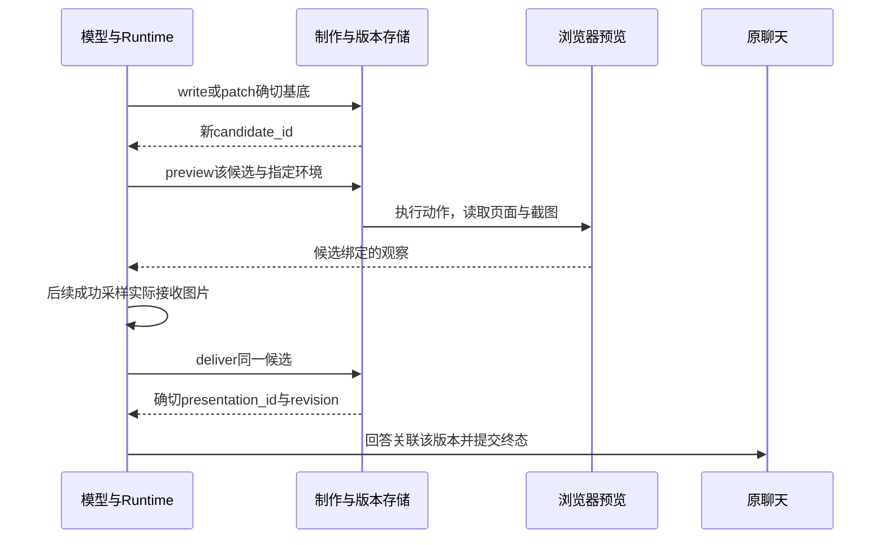

# 第 23 章 真实失败与工程改进

上一章解释了当前结构在什么约束下成立。这一章把问题收紧：当读者真的要求解释、跳转、保存和继续修订时，系统在哪一步没有做到？失败的证据怎样改变了下一次实现或验收？

Understand Book 的记录里有几种很容易误读的结果。原文已读到，回答仍没有有效来源；页面已经预览，计算旁注仍然错误；客户端等待超时，服务端其实已经开始工作；全部候选已经接纳，发布检查却仍报完整性失败。它们都表现为“任务没完成”，需要采取的改动却完全不同。

本章回答：**哪些可复现的失败改变了系统设计或验收方法？** 我们沿来源交付、阅读恢复、构建交接和演示修订四条实际链路展开，最后看一次没有达到预期、因而撤回候选的实验。这里的“可复现”包含两种依据：有条件和原始输出的历史运行，以及能够稳定触发具体分支的确定性输入。二者共同帮助定位问题，承担不同的证明责任。

## 23.1 召回命中与完整交付之间的缺口

### 原文已经出现，为什么问答仍然失败

2026-09-08 的 LA7 要验证前一批来源、动作和停止规则的修订是否真正改善任务。它固定程序，完成32道任务，其中24道共同问答分别运行 Resident Agent 与单次回答的 Chunk RAG。按当时的 `natural-facts-v2-bold-normalization` 评分，Agent 的证据参考锚组召回达到100%，完整问答成功却只有15/24；Chunk 为20/24。[LA7原始汇总与失败分析](../../LA7-LA10实施与验收.md)没有把这个差距藏进一个综合分数。

这里的100%不是“全书相关内容都找全了”。它表示题目预先指定的必要证据锚组被实际观察的原文覆盖。当前评测程序 [observedEvidence](../../../evals/semantic/agent-core.mjs)仍表达这项区别：先从真实模型请求提取工具消息，再检查 `receipt.accepted_evidence`，最后在该范围的 canonical 原文中匹配实际 `model_body`。只有位置元数据，不能证明整段文字已经进入模型输入。

然而，读到材料之后还要选择引文、绑定来源、把来源放在恰当论断后面，并完成用户要求的动作。LA7的 `source-02` 已经实际跳转，模型却没有调用 `source.present`；`source-03` 只交付“复权因子要用”这样一个短语，不足以支持完整结论。`contrast-04` 和 `formula-04` 已取得正文，但引文改写了数学符号或没有匹配原文，来源绑定失败。提高这几题的召回，并没有直接命中失败环节。

另一方面，也不能把所有未通过都归到产品。`contrast-03` 的答句与来源有正确结论，标注器却把分号改成句号，未通过逐字核对；`source-04` 的回答写的是“不可微”，标注字段却填成相反的布尔值。历史成绩继续保留失败，诊断则记录失败发生在标注环节。重新解释原因，不等于可以改写原成绩。

沿一次任务区分这些事实，可以得到以下对应关系：

| 已观察到的事实 | 它能够证明什么 | 下一项仍需确认的事实 |
| --- | --- | --- |
| 搜索返回位置或候选 | 有可继续访问的线索 | 必要原文是否真的进入模型输入 |
| 工具正文与已接纳范围匹配 | 本次取证确实覆盖了这些文字 | 这些材料是否足以支持答案中的主张 |
| 来源绑定能够解析 | 引用有合法身份与原文位置 | 高亮及前后文是否支持具体论断，定位是否清楚 |
| 模型返回了可编译答案 | 公开回答合同可以成立 | 内容、范围、动作和恢复要求是否完成 |
| Reader返回成功且状态符合目标 | 指定阅读动作已经发生 | 应保存的状态是否留下，重启后能否继续使用 |
| 必要要求均通过有效判断 | 在该任务合同下完整成功 | 是否可推广到其他材料、模型与运行条件 |

表中的先后是分析顺序，不是要求所有回答必须走同一套工具。当前证据账本还可以记录已验证选区和实际文字命中；短文字命中只授予相应观察范围，不能替代尚未读到的整段内容。普通解释也可以不要求导航。关键是按用户任务决定需要证明哪几项事实。

### 用两次干预把怀疑范围缩小

2026-09-25 的 EV4采用另一份分层阅读题集与评分协议。它的首轮结果不能与LA7拼成趋势线，但出现了一个适合继续定位的案例：`target-l2` 的 Resident 回答在内容、准确性、完整性与解释维度上为 `met`，来源要求却为 `unmet`。其中一处引号里的表述不在所引原文摘录内。[EV3—EV4记录](../../performance/agent-eval-ev3-ev4-20260925.md)还保留了评委输出无效和绝对评分范围未批准的样本，二者没有被算成产品交付错误。

[EV5—EV6](../../performance/agent-eval-ev5-ev6-20260925.md)随后围绕这道题问两个更窄的问题。第一个是：如果开头就合法取得必要原文，后面的引用组织是否仍然失败？EV5用脚本替换前两次工具决策，先调用真实 `book.search_text`，从返回结果复制位置，再调用真实 `book.text`；随后交还原模型。660个UTF-16字符的必要原文确实进入第三次模型请求，最终来源可打开，原来的来源失败项没有重现。

但完整结果没有因此记为通过。评委把冻结枚举 `denominator_falls_more` 写成了中文释义，程序的字面比较判为不满足，其他维度和理由却认为成立。复核将这次结果记为**评分无效、任务未决**。从这个探针能说的是“预供原文后，原来源症状未重现”，不能说“证据不足就是唯一根因”。脚本已经改变了早期决策和上下文。

第二个问题是：自然运行已经取得的证据，本身够不够用？EV6从两系统实际请求中抽取 canonical 原文，按原书顺序合并重叠区间，以共同回答提示和6000 UTF-16字符上限重新回答。Resident取得的1362字符得到 `pass`；Chunk的5550字符因同类枚举冲突保留未决，两种顺序的偏好均为 `tie`。

当前 [actualCanonicalEvidence与commonAnswerMessages](../../../evals/semantic/diagnostic-core.mjs)保留了这项实验的关键限制：取各自真实送入模型的材料，不用参考答案或未交付片段补齐。共同回答器会重新组织输入，因此它检验的是证据集合的效用，不能冒充自然Agent最后一次请求的原样重放。

这条证据链把下一项工作推向了来源绑定与终答组织。它没有证明图谱优于词法，也没有要求先扩大检索范围。失败定位的价值就在于：在改变架构以前，先确定哪一段链路仍有充分理由保留。

## 23.2 来源修复、阅读动作和恢复准备

### 一个冒号缺口，怎样形成有限修复

LA1—LA6最终固定版本中的 `formula-01` 给出了一个很小但真实的失败。答案把已绑定引用写成“依据书中的近似式 `[source_ref_id]`：”，旧规范化遗漏中英文冒号，导致公式来源没有进入正式引用。模型已经选好了来源，程序却没有认出这个确定的后缀形状。

[当时的修复记录](../../LA1-LA6实施与验收.md)先用该形状复现绑定数为零，再把两个冒号加入现有分隔符。当前 [normalize_bound_source_suffixes](../../../crates/runtime/src/orchestrator.rs)仍包含它们：

```rust
let is_suffix = suffix.is_empty()
    || suffix.starts_with([
        '。', '，', '；', '：', '.', ',', ';', ':', '!', '！', '?', '？',
    ])
    || suffix.starts_with("[[source")
    || suffix.starts_with("[source_ref_");
```

这段判断处于更严格的上下文内：只遍历当前已有绑定，要求前面已有可见内容，并避开代码、引述等形状。它修正表达形式，没有取得替模型选择证据的权力。

历史单题复验仍然失败了。修复后的真实模型在无工具收尾请求下输出工具调用，以 `FINALIZATION_TOOL_PROTOCOL_VIOLATION` 结束。格式回归已通过，完整任务未通过，两件事同时成立。若只展示“修复前零来源、修复后测试通过”，就会漏掉真正面向用户的结果。

LA7的另一项跟进则改变了错误反馈：旧接口在观察覆盖已成立、只是引文不匹配时，单独返回 `SOURCE_QUOTE_MISMATCH`，引导修正已有原文，而不是再做检索。该历史接口允许范围参数及相应处理。**今天不能照抄这份操作建议。** 当前 [TurnEvidenceLedger::prepare_present](../../../crates/runtime/src/orchestrator.rs)要求非空 `quote`，在本轮已观察区间中定位；唯一匹配才形成绑定，零匹配为 `SOURCE_NOT_OBSERVED`，多匹配为 `SOURCE_AMBIGUOUS`。当前要求连续逐字原文，仅接受实现规定的公式边界空白归一化，不能省略引文或猜位置来绕过匹配。

这项演进延续的是反馈的目的：指出究竟缺少观察、缺少唯一性，还是表达不符合合同。当前零匹配提示也明确要求先从已有工具结果纠正引文，只有缺少必要文字时才补读。较早的错误码本身不再代表今日全部分支。

### 修复成功之后，还要经过哪条交付路径

来源绑定并不是一个独立服务在事后替答案加脚注。当前主循环在分派前调用 `prepare_present` 检查证据，实际 `SourcePresent` 分支再调用 `present_prepared`；成功回执和后续观察进入运行上下文。普通终答与无工具收尾都使用 [deliver_agent_answer](../../../crates/runtime/src/orchestrator.rs)，最终交给同一 `compile_agent_answer` 形成公开视图。

编译先做已绑定后缀规范化，检查标记、归属和公开表达，保留真正用到的来源。若问题全部是可定位的内部LID泄露，先尝试确定性替换并重编译；其他编译问题最多调用一次无工具模型修复。修复请求只携带允许使用的绑定。没有绑定的来源，不能靠这次修复凭空产生。

因此，修复可以消除“已有正确选择没有成为可点击引用”的一类损耗，却不会裁决开放语义。即使合法引用后面接了错误解释，结构编译也可能通过。CQ8后来确认34条引用位置都正确，仍观察到三次自然回答中的两次从局部材料推出全书否定，正说明这条边界。

回答被编译接纳之后，[execute_model](../../../crates/server/src/agent_run.rs)还要整理结果、活动和已发生效果，并进入正在保存状态。本地路径由 `execute_observed` 提交原回合；网络路径由 [RunAdmissions::save_finished](../../../crates/server/src/run_admission.rs)提交。持久终态与当前草稿分开，最终展示取保存后的回合视图。

保存失败时再生成一次答案，会把已有动作一起重新执行。当前网络服务保留原 `FinishedRun`，重试仍使用这份结果：

```rust
match self.save_finished(&run.user, &run.prepared, &run.finished) {
    Ok(view) => {
        run.stream.finish(Some(view), None);
        self.update(&row, "settled", false)?;
    }
```

这段来自 `retry_save` 的内存结果分支。如果终态已经保存、只是后续教学关联等步骤失败，`save_finished` 会识别 `already_saved`，补齐后续工作。若进程已经退出，内存结果不能被凭空恢复；恢复代码按持久事实区分已保存、尚未领取和执行不明的状态。第12、16、19章分别展开了这些边界，本章关心的是：修复终答与保存原结果必须是两种操作。

### “已经跳转”怎样变成“重启后还能接着读”

LA10把问题从回答文本推进到真实前端连续使用。第一次选区解释失败，定位到 Markdown“问AI”入口丢了已有 `ranges/status/raw_quote/resolved_quote`，只传旧式位置和引文。Server无法把它当作已验证选区，模型重新检索后又遇到来源交付失败。修复复用了已有笔记入口的 `markdownSelectionContext`；当前 [App.vue的askSelection](../../../packages/web/src/App.vue)仍沿这条路径携带选区。

第二次回放保存笔记后，验收脚本等错了接口：它等待 `/memory/save`，段落笔记实际调用 `/reader/note`。这次改的是验收等待条件。第三次才发现另一项产品缺口：显式打开来源已把视口移到1.2.2，重启却回到1.1。`route_agent_source_open` 在Reader成功跳转后漏存session，历史修复加入保存；当前[本地来源打开入口](../../../crates/server/src/lib.rs)仍在成功的 `goto_lid` 后调用 `save_session`。

第四次连续场景覆盖选区解释、弹窗核对、显式打开、保存笔记、换进程和空新聊天恢复。末尾还曾因DOM尚未渲染误报没有来源按钮；修正等待后复用同一份持久回答，并核对回答未变，再实际打开两个来源。整条[LA10记录](../../LA7-LA10实施与验收.md)说明了为什么必须同时保存产品失败和验收程序失败：二者都会中断一次演示，但修复对象不同。

当前网络准入又把“具备恢复条件”前移到接单时。[complete_preparation](../../../crates/server/src/run_admission.rs)从冻结输入逐项复用原教学事件，记录 `TurnPrepared`，完成关联后才从 `preparing` 进入 `queued`。重启时已保存终态只做对账；已 `claimed` 而执行结果不明的回合按中断结束；未领取任务仍须检查原输入、授权及临时确认等条件，再完成准备。

这不是说LA10直接导致了后来全部多人协议，而是沿同一任务看责任如何延伸：动作发生、状态保存、恢复输入准备和恢复后正确回答，各有自己的事实。LA1—LA6的 `restart-03` 就曾在准备与位置持久化通过后，只交付“下一步将读取”的进度句，尽管 `incomplete=false`，任务仍失败。今天的回归也应保留这些分段条件，不能用一个Completed状态替代完整恢复。

## 23.3 构建交接、候选失败与持续进展

### 客户端超时了，生成是否已经开始

2026-09-30，旧全书结构路线完成14个单元的结果，展开五项全书局部拼接。三个执行器已经成功 `open`、`input.next`，随后各重试三次 `generation.start`，九次都被客户端120秒等待期限截断，没有候选提交。只看子执行器的最后一句话，很容易得出“引擎没有启动任务”的结论。

[构建控制恢复记录](../../performance/build-control-recovery-20260930.md)回到持久事实后发现：服务端已经写出首次 `GENERATE` 记录，只是比客户端期限晚。计时起点是请求进入函数时保存的 `accepted_at`，终点是启动记录文件实际写入时间，单位为秒：

| 拼接任务 | 修复前启动记录耗时 | 修复后同口径耗时 |
| --- | ---: | ---: |
| 0000 | 141.827 | 45.296 |
| 0001 | 151.173 | 45.577 |
| 0002 | 140.712 | 43.114 |

这些数字测量交接准备，不是模型生成速度。旧安装版本的一次启动至少三次求当前任务描述。普通章节可以限定局部范围，全书拼接却要重建整书章节和拼接路由；连已经成功的启动回复重放，也会经过这些重复读取。三路并发把这项成本放大到工具等待期限之外。

恢复还碰到第二个原因。一名执行器在已有成功调用后误报 `bootstrap_unavailable`，另两名只说中断而丢失超时原因。Driver已有的持久open检查正确拒绝把它当作零调用启动失败；但三个子执行器都结束以后，同一invocation仍重放旧交接。回归进一步发现，租约检查使用了未变化任务状态对应的历史transition时间，现实时间已经过期，判断中的时间却没有前进。

当时的修复分别针对这两条链路：一次请求内复用已经验证的任务描述；活动租约观察与恢复交接签发使用当前时间，初始派发仍保留稳定时间。新交接沿用原dispatch slot与 `semantic_attempt=1`，进入 `lease_epoch=2`。修复后的三次真实启动均低于120秒，后续五项局部拼接全部接纳。执行器误报仍作为历史事实留下，没有倒过来将其描述为正确诊断。

当前 [resolveDeliverySessionContext](../../../packages/core/src/automatic-build-executor-session.ts)解析一次task stage，并交给材料构造与 `startAutomaticBuildExecutorGeneration` 复用；新请求继续解析当前依赖和策略。[Driver的活动派发分支](../../../skills/build/automatic-build-driver.ts)仍使用新的时间观察恢复。当前技术学习BookStructure已有后续发现与组织路线，因此不能把这组三并发历史秒数当作今日所有构建路径的延迟。

本轮用固定输入实际执行了“同一invocation过期换发”“旧代次拒绝、代次二接续”“从已冻结输入启动而不再调用阶段渲染器”等当前用例。它们确认修复所依赖的状态规则仍成立；没有重新构建该本真实全书来测量耗时。

### 不要把交接失败计成候选内容失败

同一案例还解释了第7—8章为何把输入交付、语义尝试和租约代次分开。当前完整输入的最终序号与前序确认尚未收齐时，`generation.start`拒绝启动；进入生成之后，交接失联且租约过期，可以在同一语义尝试内接管。候选确实经过写入器并留下失败结果时，才可能进入下一次语义尝试。

[nextAutomaticBuildExecutionIdentity](../../../packages/core/src/automatic-build-task-store.ts)在同一合同范围内按这两类结果增加不同计数。若失败是可纠正字段错误，[readAutomaticBuildCandidateRetryFeedback](../../../packages/core/src/automatic-build-task-store.ts)向下一次生成提供 `code/json_pointer/expected`；输入或策略范围已改变，就不携带旧错误来约束新任务。

本轮实际执行的反馈用例用 `application` 模拟非法重点类型，给出字段路径及允许枚举，下一次生成收到反馈并提交成功。这是现有测试构造的故障，用于确认当前反馈通道；真实历史启动超时并没有产生这类字段错误。把两者都算成“模型失败一次”，既会误耗语义重试额度，也会让执行器修正一份尚未产生的候选。

当前V4/V5交接在一个工作单元提交后，可以直接返回 `DONE/committed`。它只关闭该次交接，Driver仍要重新读Engine状态。历史过程中已展开任务从581增到590、再增到595，正是依赖就绪后继续展开归并工作；分母不是提前知道的整书总量。进展应由新接纳成果、当前阶段和剩余依赖说明，不能累加子执行器的“完成”消息来预测全书完成率。

### 有3500输出预留，为什么1981就提交不进去

2026-10-02至03的 [BSR7](../../performance/book-structure-bsr7.md)遇到另一项可精确计算的失败。训练系统章需要保留114个重点、44个宏观引用，完整选择输出估算为2643 tokens；模型输出预留是3500，候选提交通道扣除协议封套后却只能承载1981。即使把摘要缩到一个字符，必要引用的估算下界仍为2228。

```text
完整选择：2643 > 1981
极短摘要后的下界：2228 > 1981
分段重点：48 + 48 + 18 = 114，另交最终摘要与44个宏观引用
```

这些是该次合同下的序列化估算，不是提供方实际Token账单。下界已经超过通道容量，继续要求模型“再简洁一些”不能解决问题；删掉重点则会改变用户要的完整结构。

历史记录保留三次拒绝，停止后从已接受动作22引入有限章节选择合同。当前 [continueStructureChapterSelection](../../../packages/core/src/book-structure-planning.ts)复制原工作状态，保留已经浏览、观察和请求中的材料，再建立 `selection_draft`。每个 `select_stops` 最多48个引用；它们必须属于本章、已经浏览，且不能重复。最终 `select` 由Core注入全部已接受草稿引用，再执行原章节选择与来源检查。

这次改动把一个过大的语义提交变成有明确中间状态的几个动作，而没有把任意JSON切碎后拼接。真实步骤193—196按48/48/18加final完成，114/44得到保留。本轮的[当前分段选择用例](../../../packages/core/test/book-structure-chapter-selection.test.ts)实际经过冻结任务、输入交付、writer、后续来源修订与组装，确认旧任务字节和证据账本保留。它使用小型合成材料，没有重新生成114个真实重点。

候选完整保留也不意味着每个候选语义都正确。BSR7原发现目录中仍有一项把每步5.47 GB总读取误称为权重读取；原文是约4.26 GB权重与1.21 GB KV。正式选择剔除了该项，原发现记录保留。工程正确性在这里表现为“能定位并修订有问题的选择”，而不是把历史候选改写到看不出曾经出错。

### 全部工作接纳之后，发布检查还可能检查错对象

9月30日那次旧路线继续到10月1日，最终接纳702/702项，待办为零，仍以 `quality_gate_failed/integrity_failed` 停止。调查确认没有缺失、过期或旧格式成果，预算证明与内容质量通过，问题在通用质量检查与BookStructure路由的对象不一致。

章节片段使用叶节点序号的 `core_range`，检查却要求字符切片覆盖；章节只有一个final贡献，检查按共同父位置把拼接和关系贡献一起算了进去；归约的完整来源范围，则被拿来与最后一次输入中较窄的直接引用范围比较。这三项都需要修正验收含义，不能通过重做702次生成来解决。

当前 [automatic-build-quality.ts](../../../packages/core/src/automatic-build-quality.ts)分别核对BookStructure叶覆盖、确切final身份和新鲜依赖的来源闭包。仅看贡献计数的一段，就能看见修订的对象：

```typescript
const contributors = input.stage === "book_structure"
  ? input.routing.public_contributors.filter(contributor => parentFinals.has(contributor.work_unit_id))
  : contributorsByParent.get(parent.parent_lid) ?? [];
```

历史回归同时保留缺叶、重叠、缺子成果、子成果改变、重复final和来源越界等反例，随后原工作区质量通过，经用户既有“修复后重试”选择完成发布。这是把校验对准正确合同，质量要求没有被删除。

质量通过之后，[publishAutomaticBuildArtifactSet](../../../packages/core/src/automatic-build-publication.ts)才负责候选文件校验、正式文件替换和发布回执；可捕获异常沿原备份回滚。[阶段收口](../../../packages/core/src/automatic-build-close.ts)还要核对实际文件与发布前后的质量、新鲜度，再回到 [nextAutomaticBuildAction](../../../packages/core/src/build-orchestrator.ts)计算下一步。因此，交接结束、候选接纳、恢复可继续与成果发布，分别有对应状态；其中任何一处失败，都不能由另一处的成功覆盖。

## 23.4 演示制作、上下文和实际结果

### 已经进入review，为什么仍然漏内容

[EX12.4](../../performance/presentation-staged-authoring-ex12-4.md)在2026-10-02围绕一份已有演示继续制作。原请求要求完整解释一节材料，包含练习和计算关系。初始阶段指导希望模型先形成全局框架，再制作关键局部、观察结果、展开全文并串读。

首批请求轨迹却显示，模型记录global后直接write，后续请求仍只有global指导。方法资产随后明确要求用独立 `prepare(local)` 交接，在下一次采样开始制作。v4虽然进入local，首个write仍一次输出44,113字符的完整长页，说明“可独立运行的HTML”被混同为“先写完整作品”。v5进一步把首个候选限定为关键关系及必要前提，终于出现局部原型、真实预览、扩展全文与review交接。

但完成阶段仍没有完成内容。v5的 `response-19` 确实调用 `prepare(review)`，`request-20` 也确实加载review指导，最终仍遗漏两项练习与1.3.4。报告曾把它误记为“没有主动review”，后来按实际请求纠正。根因判断由此改变：继续补一个阶段提示，无法解释已经进入该阶段仍发生的范围遗漏。

数学旁注给出了更直接的反例。某一版页面称加入状态读取项后，会“更早”转向计算受限；按它自己采用的模型，交点却满足：

$$
t_{\mathrm{read}}=\frac{R_W+B R_{\mathrm{state},1}}{\beta},\qquad
t_{\mathrm{compute}}=\frac{B F_1}{\Pi},\qquad
B^*=\frac{R_W}{\beta F_1/\Pi-R_{\mathrm{state},1}}.
$$

这里 $R_W$ 是每步固定权重读取字节，$R_{\mathrm{state},1}$ 是每请求每步状态读取字节，$F_1$ 是相应计算量；带宽 $\beta$ 用字节/秒、算力 $\Pi$ 用FLOP/秒。在其余量固定、分母为正时，增加非负状态项会减小分母，使交点后移；分母不为正时，不存在计算追平读取的正交点。这是对历史页面模型的代数核对，不是设备性能实测。

另一处练习把权重读取减半，动态计算已经变化，静态摘要却仍写原来的约105.5。依据冻结的[独立代入值](../../performance/presentation-staged-authoring-ex12-4/expected-calculations.json)，该练习条件下应从105.4797变为52.7399，显示为105.5与52.7。回归必须把控件、计算函数、可读正文和旁注放在同一次参数变化下检查，单看图能动不足以发现这个错误。

### 预览观察为什么需要跟着候选走

演示记录中既有内容问题，也有共同执行环境的问题。来源按钮曾被宿主CSS压到约29.06×36像素，与窄屏预览要求的44×44冲突；这项修复属于共同底座。还有候选在新修改后缺少某个环境的预览，或者截图没有进入后续采样，重复deliver最终停滞。把这些失败都解释成“新指导不够好”，会把页面、宿主和模型决策混在一起。

当前 [AuthorSession](../../../crates/server/src/presentation_author.rs)保存不可变候选，预览记录按候选和环境归属。Runtime在[实际主循环](../../../crates/runtime/src/orchestrator.rs)中维护 `pending_previews`、`unobserved_preview_environments` 和 `inspected_presentations`：图片进入后续成功采样且没有缺失环境，才记录观察资格；deliver检查的也是这个候选。新patch产生新候选，旧观察不能直接证明新结果。



网络制作通过 [presentation_sandbox::Execution::run](../../../crates/server/src/presentation_sandbox.rs)取得资源许可，把Preview任务交给受控执行环境；本地制作则直接走浏览器端口。沙箱负责执行资源与边界，来源编译负责公开内容合同，二者都不代替数学核对。图中的后续观察也只证明图片进入了成功采样，不证明模型理解了每一处画面。

### 从反复扩容，转向可回读的确切版本

原问题进入反馈修订时，两次压缩都遇到 `Provider unfinished response: length`：输出达到16,384，尚未形成完整摘要。针对当时Catalog Flash档案扩大摘要预留后，后续请求竟然仍为16,384。查到的原因在实验装配：适配器把归档 `CatalogMatch` 改成 `ExplicitOverride`，专用容量没有生效。修正后实际原问题摘要输出25,916并完成，证明旧上限确实不足；此前各批请求仍按原配置保留。

这又暴露了持续输入的问题。[ADR-0155](../../adr/0155-goal-work-plan-and-version-centered-presentation-context.md)把改进放在当前缺陷和已保存版本上：Goal工作项记录剩余任务；指导变化在后续采样追加；有可靠落点的旧源码改用读取定位。此前各次扩容，包括后来65,536的摘要上限，是相应阶段的处理条件，不能把它们写成“只要继续扩窗口，制作就会可靠”。

当前 [ContextFragmentLedger::record_sampling](../../../crates/runtime/src/context_fragment.rs)仅在指导选择变化时追加新的 `sampling_guidance`，任务设计数据保留自身角色层次。[SavedAuthorCall](../../../crates/runtime/src/tool_result.rs)则先检查write/patch成功返回 `candidate_saved`，首次后续采样仍带完整调用和成功回执；观察之后，才在模型消息副本中把HTML与可读正文替换为 `saved_source`。最近补丁的edits保留到后继修改已保存并被观察，再收敛为已应用数量与读取入口。

这些条件共同保证“减少重复”有一个可操作的前提：模型能够读回当前候选的完整源码，原记录没有消失。它们不授予新的预览或交付资格，也不把上轮候选变成新Run的有效句柄。

确切版本的需要来自另一次真实偏离。EX12.4的feedback3修好了部分内容，但write没有填写 `based_on`，结果生成新对象revision 1，而非旧对象revision 2。当前[write分支](../../../crates/server/src/presentation_author.rs)在有演示follow-up回执时，要求 `based_on` 与回执确切引用一致；若用户确实要另建作品，须显式 `new_object=true`。来源、原参数与修订对象因而可以沿同一身份追踪。

这一修订自身又引出了EX13.6的恢复失败。早期 `redact_history` 无条件给旧调用加 `new_object:null`，旧消息字节改变，已安装检查点的来源身份随之失配。当前 [presentation_author.rs](../../../crates/runtime/src/presentation_author.rs)只在原调用有该字段时保留：

```rust
if let Some(choice) = value.get("new_object") {
    locator["new_object"] = choice.clone();
}
```

修复没有重造摘要来源。本轮直接执行旧历史字节回归，原先不含该字段的记录经过裁剪后保持一致。这个案例说明，可选字段的默认语义相同，不代表它可以无条件加入已经作为恢复依据的序列化记录。

### 独立修正如何成为真正交付

EX12.4曾在本地修正11项内容并通过三环境操作，状态明确记为 `local_verified_not_native_delivered`，版本引用为null。当时Provider 402阻止了原生完成；离线页面正确，不能代替产品中已交付版本正确。

[EX13.6](../../performance/presentation-context-ex13/ex13-6/README.md)随后从feedback5的原聊天、未完成Goal和检查点恢复，读取feedback3的确切revision 1。验收准备又发现静态推导保留旧读取量，于原11项补丁之外增加一项公式修正。当前运行重新发现工具、读取材料与源码，经过patch、原生preview、后续模型图片观察、review和deliver，最终交付同一对象revision 2，保留27个来源。

独立浏览器再对确切revision 2重放三环境、每环境七条路径，覆盖原值、读取减半、控件聚焦与四档实测汇算，共78张截图。内容与“原修正内容加补充公式”逐字段一致。成功接续有20次提供方调用；计入两次准备失败中的辅助调用，累计22次。它们属于这一份有限接续，不能混入此前25次运行的对照，也不能由截图数量推导学习效果。

这条链路给验收增加的核心条件，是每项观察都指向实际修改的候选、实际交付的版本，以及明确的用户要求。阶段已经切换、页面能够运行、离线补丁正确，都是可用证据；最终任务成功需要把它们接到同一份成果上。

## 23.5 从单题修复到条件明确的回归

### 先修正“失败”的含义

前面的案例不断出现同一困难：当程序说一题失败时，产品、执行环境和评分程序究竟哪一部分需要改变？2026-09-26的 [CQ8](../../performance/source-delivery-cq8-20260926.md)把这个问题推进到了逐条论断。

一份历史长回答的公式已经存在于交付来源C4的后文，旧判断却将它当作没有交付。重新定位后，公式明确位于 C4.after 的 [7,89)。如果只看高亮正文，评委会漏读已交付材料；如果允许评委凭公共参考材料补齐，又会把实际没交付的依据当成已交付。两个方向都可能使改进建立在错误前提上。

当前 [task-quality-v2.mjs](../../../evals/semantic/task-quality-v2.mjs)先区分来源支持与定位，再让评委复制实际来源视图中的逐字依据。resolveV2Basis 接收 source_id、part、quote，在highlight、before或after中找唯一匹配，由程序计算UTF-16起止位置；不接受模型自己填写数值区间。语义判断仍由评委完成，确定性部分负责把判断落到可复查的原文。

这次修订同时保留了反例：高亮只有孤立术语时，前后文可以使支持成立，定位仍可能不满足；高亮已经表明具体定义或原则，对应公式紧随其后，则不能机械要求再挂一个独立公式来源。一条论断依赖两个互补前提，也要核对答案是否把读者引到两处依据。

历史记录中的第二版在原有十个人审判例上达到10/10一致；九个新增开发诊断中七个标签完全一致，另外两个仍有支持、定位或未知类别上的差异。两处差异没有把错误说法放行为有支持，却仍不能写成“九案全部正式校准通过”。那份长回答的公式误判得到纠正，其他缺引与全书否定仍在，整份答案没有因此改判通过。

当评分依据可以逐字核查后，CQ8三次自然回答的34条来源都能正确定位，但两次仍从局部材料推出全书否定。下一次实验因而不再追问“来源能否打开”，而是追问“什么使最后的范围表达失去约束”。

### 一个合理假设，为什么最后仍要撤回

[EV7](../../performance/agent-eval-ev7-20260926.md)先核对一个容易遗漏的事实：CQ8的范围正反例已经进入全部模型请求，失败也发生在普通业务循环，不是无工具收尾阶段。缺失提示注入和预算耗尽，不能解释这批症状。

剩下一个值得检验的假设：完成指导末尾笼统要求“证据不足就明确说明”，模型可能把用户未给出实施细节，混同为整本书没有支持材料。因此候选只替换这一条的首句，要求对尚未确立的具体结论说明缺失前提，并区分用户信息缺口和已读原文缺口。模型、工具、预算、原有范围例子及评分协议保持不变。这个解释在开跑前仍是假设，没有被写成已证实原因。

实验固定deepseek-v4-flash、temperature为0、每回合300秒，使用独立聊天和记忆。已有开发题两对、未用于调参的新题族两对，再加简单引文和必须保留不确定性的两个控制，共六对、十二份首次回答。新旧顺序按对交错；不因失败补跑，也不在看完输出后继续改这一个候选。

保留条件也先于结果确定：四对迁移题至少两对改善范围，不能以少答或拒答换改善；两题族范围失败数不能增加，关键内容与来源不能从旧版成功退化，两个控制均须满足要求。实际结果是：

| 对照任务 | 旧版与候选的关键差别 | 原记录判断 |
| --- | --- | --- |
| 开发题第一次 | 旧版范围合格；候选标题写“书中未给出”，正文又限定已读段落 | 未决 |
| 开发题第二次 | 旧版把具体团队情况说成书中没有；候选限定实际阅读范围 | 改善 |
| 新题族两次 | 两版均限定已读或已查范围 | 两对持平 |
| 简单引文 | 两版直接解释，零工具调用 | 控制通过 |
| 缺少参数 | 两版均保留比例未知；候选额外断言未读章节包含实施细节 | 保留新问题 |

四对迁移题只有一对明确改善，达不到预设门槛。即使把首对歧义按合格处理，改善数仍只有一对。缺参控制还说明，只检查答案有没有说“不确定”过于粗糙：模型可以保留数值未知，同时虚构另一章已经提供某些事实。

基线也并不完美。新题族的一份旧版答案遗漏了原反例的主动放开约束等前提，留下过强推论。记录保留这一点，没有为了撤回候选而把旧版描绘成完全正确。最终只撤回本次提示差异，恢复v7，保留此前CQ已有修复。当前 [FINISH_POLICY_REVISION](../../../crates/runtime/src/agent_prompt.rs)确实为v7；较早 [ADR-0137](../../adr/0137-stratified-reading-evals-and-diagnostic-improvement.md)中的“EV7待实施”已经被这份后续记录更新。

撤回也是完整的工程结果：它排除了当前条件下一个不值得保留的候选，留下十二份首次输出、退化和未决依据。它没有证明所有范围指导都无效；这批新题已经参与检验，后续再用它们也不能继续称为未见题。

### 同一个来源弹窗，为什么会支持两种不同判断

EV7还发生过一次值得单独解释的复核。候选说“这里读到的原文没有点名MSE”，交付来源C8的前文却包含MSE。只对照弹窗，似乎足以判定模型在说假话。

进一步检查实际工具正文，MSE并没有进入模型读到的正文，而是在来源视图自动展开的前文中出现。原句限定的是实际阅读范围，最终保留范围合格。这并不妨碍评委用完整交付视图判断答案有没有来源支持：一个问题问“读者收到了什么”，另一个问“本次模型看到了什么”，各自有对应记录。

这也是本章所有回归的共同要求。来源问题需要原回答、绑定和交付视图；阅读恢复需要动作与持久状态；构建恢复需要工作单元、候选失败和租约事实；演示修订需要确切版本与后续观察。保留与失败有关的条件，才能知道下一次通过是否回答了原问题。

确定性回归适合检查这些条件是否接对。它能够证明旧输入字节保留、过期交接换代、字段错误反馈抵达下一次生成，却不能代替真实模型对开放任务的表现。真实对照则要冻结题目、模型、提示、预算和判定，把首次失败、评分未决和撤回与成功一起保存。当前 [任务评分汇总](../../../evals/semantic/task-quality.mjs)也将产品交付与评分状态分别记录；已知必要项失败仍是失败，只有其余必要条件成立而判断缺失时，才保留任务未决。

## 已知问题与本轮验证

截至2026-10-07，本章对历史失败与当前机制逐项回读。仍需要集中保留以下边界：

1. **来源与任务语义的边界。** 当前绑定和编译保证可解析的引用与公开表达合同，不保证每个论断都有充分支持，也不证明整个自然语言任务完成。LA7、EV4、CQ8、EV7的题集、评分版本和运行条件不同；历史失败不能直接当作今日同题仍失败，局部通过也不能扩展为当前整体效果提升。
2. **演示预览与字段提示仍有缺口。** 当前 [preview_contract_complete](../../../crates/server/src/presentation_author.rs)仍接受legacy预览路径，不是所有入口都强制三个环境；第17章已用定向用例确认该行为，本轮按代码回读。来源编译错误提示仍建议补patch.source_ref_ids，但Patch结构不接受这个字段。两者仍属当前实现，不能因为EX13.6的三环境验收成功而略去。
3. **恢复和发布有明确状态范围。** 保存重试复用内存中的原结果，进程退出后依据持久终态处理；多个领域文件与会话日志没有共同事务。构建发布的可捕获异常回滚不等于断电原子性。这些边界沿用第8、16、19章，不将本轮交接测试扩大成完整灾难恢复验证。
4. **来源修复的用途统计已经落后于当前协议。** 本轮发现Runtime发出的是source_answer_repair.v4，而 [requestPurpose](../../../evals/semantic/provider-recorder.mjs)只识别v3。用当前源码中的签名重放后，该请求归入unclassified，没有归入source_repair；样例7个tokens仍保留在未分类组。修复调用并未消失，但按用途分析会漏计这一类。后续改动应使分类与当前实际修复合同一致，并保留这个输入作为回归。
5. **流式用量缺失还会影响评测预算。** 第21章已确认记录器只对整包做JSON解析，不能提取SSE usage。本轮进一步沿 [agent-run.mjs](../../../evals/semantic/agent-run.mjs)实际支持的可选tokenLimit检查：本地固定SSE每次明确返回7个tokens，设上限为1，第一次之后第二次请求仍被放行，记录用量为两个null。报告的measuredUsage正确保留未知，但请求前预算相加把缺失值按0处理，因而不能据此宣称实验累计用量受到硬限制。后续需提取受支持流式用量，并明确未知时不能确认剩余预算；本轮只记录问题。EX13.6独立接续脚本的费用预留规则是另一条路径，不能用来替这份代理证明预算有效。

本轮直接运行当前仓库中六个Core构建用例与一个Runtime历史裁剪用例，均通过。Core覆盖完整输入后才开始语义尝试、冻结输入复用、过期代次接续、字段错误反馈、同一invocation换发和有限分段选择；Runtime覆盖旧记录没有new_object时保持原字节。Core另91项、Runtime另460项按名称未选中。

另两项本地固定响应重放分别确认上述用途分类与流式预算缺口；断言成立表示问题复现，不能列为功能正确。原始命令、输出与书稿核对保存在[第23章验证记录](../SOURCES.md#第-23-章续写验证记录)。本轮没有调用真实模型、Embedding或浏览器，没有重跑前章Server矩阵，没有新增产品费用、容量或成功率实测，也没有修改产品实现和测试。

## 面试时怎样回答

**问：为什么100%召回仍不能证明Agent完成了任务？**

答：召回只回答预设证据是否进入了可观察范围。LA7的必要证据锚组召回达到100%，Agent问答成功仍只有15/24，因为引文组织、来源绑定、内容要求或动作仍可能失败。要把搜索命中、实际读取、支持、定位和任务动作分开测量，才能知道下一项改动应该放在哪里。

**问：你会怎样判断一次失败来自产品还是评测？**

答：先保留原任务和首次输出，再沿发生差异的环节核对。LA10中，来源打开后没有保存阅读位置是产品问题；笔记已写入而脚本等错接口是验收问题。CQ8中，后文公式已经交付却被判为缺失，也是评分问题。修正判定依据之后，原答案里其他失败仍要保留。

**问：客户端超时后，为什么不能直接再生成一次？**

答：客户端超时不证明服务端没有启动。9月30日的构建记录显示，启动事实在120秒之后已经落盘。应先查持久交接与租约：输入交付未完成、生成失联和候选被写入器拒绝是三种状态。过期交接可以在同一语义尝试下增加代次；只有明确的候选失败才应携带相应字段反馈进入下一次语义尝试。

**问：输出放不下时，项目做了什么有依据的改变？**

答：BSR7需要114个重点和44个宏观引用，候选容量只有1981 tokens，极短摘要后的估算下界仍为2228。这个矛盾不能靠继续缩短文字解决。改动把章节选择拆成有持久语义状态的48、48、18个重点，再交最终摘要，由Core注入已接纳引用并完成原校验；没有通过删重点伪造完整交付。

**问：一份演示预览通过后，还要验证什么？**

答：先确认观察属于最新候选，图片确实进入后续成功采样，最终交付的是同一对象的确切版本，再按用户任务检查正文、交互和计算。EX12曾经进入review却漏练习，减半控件更新却保留旧摘要；EX13.6才把补丁、三环境操作和原生revision 2接在一起。版本与执行正确，是内容正确的必要基础。

**问：提示实验没有改善，怎样讲出工程价值？**

答：说明假设、唯一变量、冻结的保留条件与实际结果。EV7六对十二份首次回答中，四对迁移题只有一对明确改善，还留下控制题的新断言问题，最终恢复v7。价值在于可复查地撤回不足以保留的改动，并明确后续要换什么假设；不能把一次局部好转包装成整体成功率提高。

**问：费用记录缺失时能否用请求数补算？**

答：请求数、耗时和Token各有分母。当前记录器不能从SSE提取usage，报告应保留未知；本轮还确认缺失值使可选Token上限不能可靠阻止后续请求。可以报告实际请求数和等待时间，但没有完整用量及当次计价条件，就不能声称模型费用下降。

失败为设计增加的，是更准确的责任和更具体的验收条件。下一章进入[第24章：从项目理解到面试表达](24-从项目理解到面试表达.md)，把本书已经核实的机制、取舍和结果组织成能接受追问的表述。
