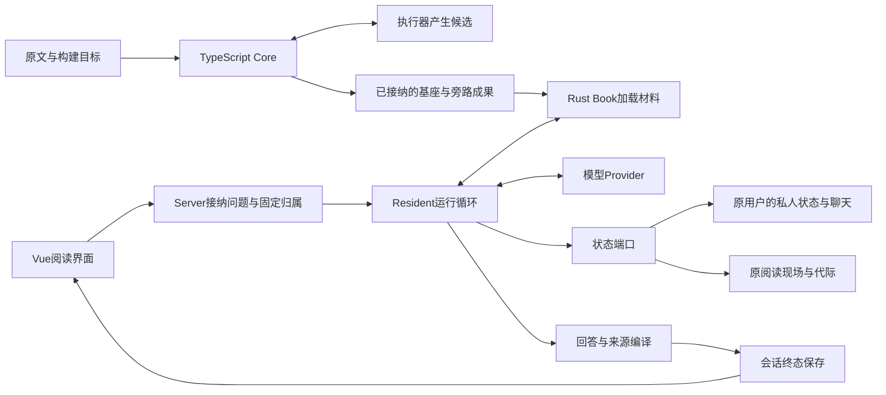

# 第 24 章 从项目理解到面试表达

前二十三章已经把材料、构建、阅读、状态、宿主和质量证据连接起来。到了面试现场，问题会换一种形式：用三分钟介绍项目；从白板画出一次请求；解释为什么没有直接使用现成的检索问答；说明数据在失败后怎样恢复；最后讲清哪些结果已经得到验证。

困难不在于记住更多模块名字。一段很长的功能介绍，可能仍然没有说清用户需要完成什么；一张完整的组件图，也可能解释不了模型等待时读者为何还能操作。真正能经受追问的表述，需要把任务、责任、取舍和证据放在同一条因果链上。

本章回答：**怎样准确讲出项目价值、技术难点与可验证结果？** 前四节将已核实的项目事实组织成口述、白板和条件变化题；最后一节解释结果应当怎样表达。这里的变化题是设计分析，历史实验仍保留各自条件。

## 24.1 三分钟项目介绍

### 先让对方理解读者要做什么

“这是一个使用Rust、TypeScript、知识图谱和MCP的Agent项目”，可以描述技术组成，却没有交代为什么需要这些组成。听者还不知道它服务一次检索、一次长任务，还是长期阅读；后续也就很难判断持久化、构建恢复和多用户隔离是否必要。

更有用的起点是一次阅读：读者选中一段难懂的原文，希望解释它与前文的关系，打开依据，保存笔记，稍后从原聊天继续。有些问题需要跨章查证，有些需要可操作的演示，有些只是把已经理解的结论留在正确位置。项目要使这些动作共享材料身份，同时保留各自的状态和结果。

[项目入口](../../../README.md)用“将长文整理为可定位、可关联的知识底座，支持AI按需查证与持续阅读”概括目标。第2章进一步解释了准备材料与使用材料的时间分工，第3章说明公共材料、私人状态和阅读现场的归属。这三个事实足以构成介绍的开头，不必先枚举全部工具。

### 一段能够继续展开的口述

下面是一段按三分钟组织的项目整体介绍，具体术语可随听者背景展开：

> Understand Book面向长文和书籍的持续阅读。读者可以围绕选区提问、追溯原文来源、保存笔记，也可以要求制作可交互的解释，再在原聊天里继续修订。它需要完成的不只是返回一段文字，还包括把依据、阅读动作和后续状态接在一起。
>
> 整体分成构建和阅读两个阶段。构建侧用TypeScript组织原文定位、语义抽取和全书结构，模型提出候选，由程序按合同接纳并发布可复用材料。阅读侧用Rust加载材料，Resident Agent根据问题选择工具、读取原文和组织回答；Vue提供阅读界面，本地桌面由Tauri承载，也有Linux多人阅读入口。
>
> 一个核心设计是把找到线索、实际读到原文和交付来源分开。图谱或检索可以帮助选择位置，引用则要在本轮已经观察的原文范围内匹配。回答编译把模型表述与真实绑定连接起来，读者才能打开相应依据。
>
> 另一个难点是长任务中的状态。一次运行固定原用户、材料、聊天和提问现场，模型等待放在共享状态锁外；工具执行时再进入正确的权威状态。最终回答、来源和效果进入会话日志，保存失败与模型执行失败分别处理，重试保存复用原结果。
>
> 项目也把评测作为设计的一部分。召回、来源支持、定位、动作和完整任务成功分开观察。历史实验并没有证明图谱在所有任务上优于简单检索，提示改动也有未达到保留条件而撤回的记录。因此，讲结果时需要说明任务、模型、预算和判定条件，再讨论哪项机制确实解决了哪类失败。

这段介绍依次回答了任务、分工、两项难点和验证方式。它没有靠增加功能数量争取可信度，而是给后续追问留下了入口：来源怎样限定已观察范围，状态怎样避免串到新窗口，保存失败怎样继续，实验为什么允许撤回。

口述中的技术事实分别可回到[构建编排](../../../packages/core/src/build-orchestrator.ts)、[Book加载](../../../crates/read-tools/src/lib.rs)、[运行循环](../../../crates/runtime/src/orchestrator.rs)、[运行归属](../../../crates/server/src/run_scope.rs)和[会话提交](../../../crates/server/src/session_runtime.rs)。桌面与多人组合见第20章；失败与实验见第23章。现场不必报出这些文件名，但准备时应能沿它们回答下一层问题。

### 岗位不同，展开的同一条线也不同

AI Agent方向更值得展开“下一次采样依据什么作决定”。可以从实际原文、工具发现、进展停止和活动上下文出发，解释模型选择与确定性接纳如何配合，再用来源或演示失败讨论开放语义的边界。

后端架构方向更值得展开“谁有权把结果变成事实”。可以从固定Run归属、按操作访问状态、准入与模型许可、持久日志和恢复分支出发，解释并发、重试与发布。两种介绍使用同一项目事实，只是深入的责任不同。

若听者只给一分钟，保留读者任务、构建与阅读分工，以及一个最能解释清楚的技术难点。若给十分钟，就沿这个难点进入源码条件和真实失败。把开场压缩成结论，再在追问中展开，比在开场塞入所有细节更容易维持准确性。

## 24.2 从白板画出架构和一条请求链

### 先画材料怎样被交付，再画状态归谁

白板的第一条边界可以从材料开始：左边是尚在变化的构建工作，右边是读者正在消费的已接纳成果。构建执行器生成候选，Core决定是否接纳、怎样继续和何时发布；阅读进程加载成果，不要求原执行器继续在线。

第二条边界放在读时内部：公共Book可以共享，用户的聊天和笔记归私人状态，窗口的位置与选中聊天归阅读现场，一次Run持有固定任务归属。不同生命周期画在不同位置，才能继续解释两个窗口或两位读者。



这是一张职责图，箭头没有承诺每条边都是HTTP请求。当前跨语言主边界是材料文件，Rust内部还有共享对象与端口调用；具体部署再补本地Host、网络准入、发布库和资源许可。[第2章](02-构建与阅读如何分工.md)与[第19章](19-多用户阅读与调度.md)分别展开这两层。

如果被问到MCP，可以把它接在共同Book能力旁边。当前外部调用方拥有自己的Agent循环，内置Resident拥有自己的Run、Goal和私人状态访问路径。Book MCP的Visitor分派没有私人Reader、Memory写入口；不能因为两者都叫“调用工具”，就把控制权和用户状态画成同一份。入口见[第10章](10-工具与模型调用边界.md)与[MCP分派](../../../crates/server/src/mcp.rs)。

### 沿“解释这里并记下关键前提”走一遍

设读者在材料A、聊天C、现场W中选中一段原文，请求：“解释它与前文的关系，把关键前提保存为笔记。”这是用于串联机制的场景，下面描述当前路径的职责，不冒充本轮执行过的模型记录。

接纳时先验证请求和选区，建立确切回合。`RunScope`保存原用户、Book、存在时的发布引用、聊天、回合、现场代际和提问输入；`PreparedAgentChat`带上本轮需要的消息与任务信息。本地由[prepare_agent_chat](../../../crates/server/src/lib.rs)和协调器接续，网络入口还通过[RunAdmissions](../../../crates/server/src/run_admission.rs)持久记录准备与派发状态。二者复用执行核心，不等于拥有相同的排队机制。

进入模型循环后，先看已验证选区是否足够。需要前文时，模型选择定位和原文读取工具；Registry与暴露计划决定当前可以调用什么，工具回执说明实际发生了什么。模型返回一个候选位置，不会自动让这一整节进入已观察证据。

来源形成时，最值得在白板旁写出的代码只有两行，来自[TurnEvidenceLedger::prepare_present](../../../crates/runtime/src/orchestrator.rs)：

```rust
let observed = self.observed_intervals(book);
let mut matches = book.match_source_quote(quote, &observed)?;
```

这段之前已经解析参数并拒绝空引文。匹配范围被限定为当前已观察区间；随后唯一匹配才解析来源，零匹配与多匹配分别反馈缺少匹配和歧义。回答编译继续检查公开标记与本轮绑定。它使读者能从回答回到原文，但“这段原文是否充分支持推论”仍是需要语义判断的问题。

保存笔记则走另一条权威路径。模型提供内容和目标，状态端口检查原用户与原任务，再调用实际私人存储。网络侧[NetworkRunPort::private](../../../crates/server/src/workspace_registry.rs)的核心顺序是：

```rust
self.authorized()?;
let user = self.user.lock().unwrap();
self.scope.check_user(&user)?;
operation(&self.scope.private_user(&user))
```

这里的锁只覆盖相应操作，不覆盖整段Provider等待。需要导航等现场动作时，还要检查现场代际及相关现场条件；不能将私人写入入口的成功推成任意旧Run都能控制当前窗口。归属检查具体展开在[第3章](03-数据身份与状态归属.md)和[第18章](18-Rust宿主与并发边界.md)。

最后，模型返回的文字经过来源编译与必要修复，Server整理实际效果和终态。当前JSONL路径把相应来源、成果关联和结束事件保存到原聊天，再用保存后的视图完成公开终态。模型流中的文字、可公开草稿和持久答案因此是三个时刻；第12章给出的[流式交付与保存路径](12-来源与流式交付.md)是这张图的最后一段。

读者随后点击来源，是一个新的显式Reader操作，来源绑定提供原文位置，服务端执行跳转并保存相应状态。稍后继续聊天，又是根据已保存消息、目标与当前输入开始下一次Run。不要把这两个后续操作画成前一个模型请求天然完成的副作用。

### 在白板上增加一次正常变化

现在让另一个窗口在模型等待期间翻页。公共Book仍可共享；它的Reader现场独立，原Run的输入没有被改写。如果原现场自身被重新绑定，旧Run的现场动作可能得到`WORKSPACE_STALE`；仍具有效归属与授权的原书私人写入，则有自己的检查范围。

再让终态保存失败。网络服务可以用内存中原来的`FinishedRun`重试保存，避免重新执行已经发生的笔记操作。如果进程已经退出，就不能假装那份未保存结果还存在；恢复代码依据持久事实区分已保存终态、尚未领取和执行不明的任务。当前`claimed`且没有终态的工作按中断收口，而不是自动再次运行。相关分支分别位于[retry_save与recover](../../../crates/server/src/run_admission.rs)。

这两次条件变化已经足以检验一张架构图是否有用。能否回答“这份结果回到哪个聊天”“这次导航还可不可以做”“重试是否会重新问模型”，比能否记住所有目录名更能说明理解程度。

## 24.3 关键设计的短答与深入追问

### 为什么需要Agent，简单检索回答能不能做

短答可以从任务开始：**单次解释需要保留简单检索基线；持续阅读还包含按需补读、导航、保存、制作和跨回合继续，Agent承担的是围绕当前任务选择与接续这些动作。**

深入时，将“能力范围”与“问答效果”分开。一次普通Chunk检索可以得到相关段落并生成很好的答案；增加图谱和多轮循环，会增加定位入口与动作能力，也会增加调用、上下文和交付失败的机会。是否值得，要看目标任务，而不能由组件数量判断。

历史[LA9-v2同环对照](../../LA7-LA10实施与验收.md)让Text、Tree、Graph使用共同循环和冻结预算，完整成功分别为10/24、11/24、9/24。它与“图谱可以提供跨章线索”不矛盾：线索能力存在，不保证任务整体收益。这个结果也解释了为什么应将原文寻址保留下来，同时让语义召回和具体消费者分别接受效果检验。

若被追问“现在会不会直接删掉图谱”，可以继续回答：先明确受影响消费者和用户任务，再比较改动是否保持来源、结构阅读与教学需要。第6章的构建候选召回、第10章的读时工具、第21章的产品对照有不同对象；不能把一个问答实验的结论直接传播为全部结构都应删除。

### 来源机制怎样约束模型，剩下什么问题

短答是：**模型提交连续引文，运行时在本轮已观察原文中定位并分配来源身份，回答编译只接受已有绑定；来源支持与答案语义继续单独评估。**

可以立即给出一个反例：引文准确地引用了一个条件命题，答案却省略条件、写成普遍结论。位置完全正确，表达仍然可能不成立。项目把来源支持和定位拆成两个判断，正是为了看见这种差异。[resolveV2Basis](../../../evals/semantic/task-quality-v2.mjs)让评分依据落到实际交付视图中的逐字片段，不能用公共参考替回答补交来源。

再进一步，模型声称“本次读到了什么”，应对照实际工具正文；读者“从来源弹窗收到了什么”，则可以包含自动展开的前后文。第23章的MSE复核给出了真实例子。把这两种观察混起来，既可能误判答案，也可能高估模型已经取得的证据。

因此，面试中的准确表达应当落在具体机制上：“限制来源身份与观察范围，并使判断可以回查。”是否减少某类语义错误，需要相应对照；合法引用本身不是无幻觉保证。

### 多个Agent为什么不会只靠彼此报完成推进构建

短答是：**执行器提出语义候选，Engine读取持久状态、接纳成果、计算后续动作；子执行器结束、候选提交成功和整个计划完成分属不同状态。**

当前[nextAutomaticBuildAction](../../../packages/core/src/build-orchestrator.ts)跳过已关闭阶段，处理必要准备与尚未完成的工作，待工作就绪后进入阶段收口。候选是否成立由相应writer检查；发布还要核对正式文件和阶段质量。根Agent不需要通过整理子Agent的自然语言汇报，重新发明一份成果账本。

构建恢复能够说明这项分工的收益。完整输入尚未交付时，不能记为模型生成失败；租约过期接管时，可以维持语义尝试、增加执行代次；写入器明确拒绝候选后，下一次生成才需要相应错误反馈。[nextAutomaticBuildExecutionIdentity](../../../packages/core/src/automatic-build-task-store.ts)中的两个计数正对应这些事实。

如果面试官把它概括成“所以任务恰好执行一次”，应把结论收回到实际合同：重复交接、候选接纳和结果重放分别有身份与状态规则；它们没有把所有外部动作变成一个跨系统事务。能解释失联时已经知道什么、还不知道什么，以及哪一步允许继续，才是恢复设计的重点。

### 持续运行怎样避免只是在不断消耗上下文

短答是：**任务进展、单次上下文容量和累计用量分别处理。普通Resident默认没有固定采样轮数上限，有实际进展才继续；活动请求通过预算与压缩控制大小，累计用量单独记录。**

`OuterConfig`的默认`max_turns=None`已经替代早期十二轮硬闸；当前[ProgressPhaseGuard](../../../crates/runtime/src/orchestrator.rs)观察实际状态变化。读到新的有效材料、完成动作或推进制作状态，与换一种说法重复“我继续”有不同后果。

容量则回到[ActiveContextBudget::from_plan](../../../crates/runtime/src/auto_compaction.rs)：本次估计输入加输出预留和安全余量，决定高水位与是否装得下。摘要安装成功之后，才把活动上下文推进到新状态；持久交互记录承担另一项责任。将累计十轮输入相加，再与一次模型窗口比较，会把费用口径和空间口径混淆。

工作计划还需要与完成要求分开。一个Goal工作项自报完成，不能替代真正交付演示；当前[goal_turn_delivered](../../../crates/server/src/lib.rs)会检查通用交付条件，但Content分支不逐条证明开放语义。因此，“长期目标已经建立”不等于系统有一个能够证明任意任务正确的完成判定器。

### 后端最关键的并发与恢复取舍是什么

短答是：**固定输入用于解释原问题，权威状态用于承接实际操作；模型等待在状态锁外，持久化确认与公开完成保持明确顺序。**

如果整轮持有共享状态，远程模型等待会阻塞读者操作；如果复制所有状态后最后整体写回，又可能覆盖等待期间的新变化。项目通过`RunScope`和状态端口把访问拆到具体操作上。代价是每次操作需要判断自己的归属和现场条件，保存失败也要保留中间事实。

JSONL解决的是聊天事实如何追加、重建与确认。[SessionLog::append_with](../../../crates/server/src/session_log.rs)在接受相同事件重试时核对序号和内容；遇到不确定写入时对照原字节，成功确认后才推进投影。这解释了“同一条记录可以安全重试”的实际范围。原文笔记、教学事件、SQLite准入与会话日志仍各有存储边界，不能只因为其中使用了SQLite就宣称整轮原子提交。

这里也能自然接到多人服务：同一用户共享一份私人权威状态，不同现场持有各自Reader；运行份额与每次模型调用的许可分别分配。下一节就通过改变这些条件，判断当前机制还能承担多少工作。

## 24.4 改变规模、模型和使用条件后的设计判断

### 材料扩大十倍，先问哪一种工作变多

这是条件变化分析。设材料长度扩大十倍，读者问题分布保持近似。一次全书构建需要处理更多原文和候选；一次局部解释却未必需要十倍上下文。构建准备、材料加载、候选检索与单次阅读应分别分析。

当前[Book::new](../../../crates/read-tools/src/lib.rs)持有UTF-16原文及位置、节点索引，已加载材料的内存与加载成本会受规模影响。构建侧还需要看工作单元是否仍符合输入预算，候选目录和归并是否出现更大的阶段工作。若失效发生在候选提交容量，增加模型上下文甚至未必触及限制；第23章的114个重点选择就是实例。

此时合理的下一步，是对真实大材料定位成本主要落在哪里：加载、序列化、阶段描述重建、检索还是模型处理。已有局部成果如何复用，要依据当前输入与合同匹配；改变原文后怎样迁移旧位置、私人批注和教学证据，则属于另一组身份问题。[ADR-0146](../../adr/0146-portable-build-workspaces-and-incremental-book-updates.md)当前只把U1—U2搬迁续建列为已实现，后续增量更新不能被提前说成产品已有能力。

因此，回答“十倍规模怎么办”不必先承诺换数据库。先区分变大的对象、对应预算和失效条件，才能决定分页、按需加载、减少重复处理或重新分解工作是否解决实际问题。

### 用户变多，模型许可怎样成为约束

多人系统不能只数HTTP连接。一个Run可能先后进行若干次业务采样、综合和压缩；模型许可控制实际调用，而活动Run份额控制同时推进的任务。当前[LimitedAdapter::call](../../../crates/server/src/service_limits.rs)在每次调用前取得许可，调用返回后释放；模型请求的用户轮转也不等于为每个任务承诺最长等待时间。

用一个**教学容量算例**分析这条边界。设每分钟接纳$\lambda$个任务，每任务平均发生$n$次模型调用，每次占有模型许可的平均时长为$\tau$秒，可用模型槽位为$K$。为单独分析模型许可，假设活动Run数量、用户份额和上游服务没有更低的容量限制，也忽略本地处理和制作等待。

每分钟需要的许可时间与可提供时间分别是：

$$
D=\lambda n\tau,\qquad A=60K,\qquad \rho=\frac{\lambda n\tau}{60K}.
$$

$D$与$A$的单位都是“许可秒/分钟”。这里的$\tau$从已经取得许可开始计时，不包含此前排队；如果直接使用含资源等待的模型活动墙钟时间，会把等待再算成服务需求。

假设许可配置为8，每分钟6个任务，每次调用占用12秒，则有：

| 教学条件 | 每分钟模型调用需求 | 许可时间需求 | 可提供许可时间 | 比例 |
| --- | ---: | ---: | ---: | ---: |
| 每任务平均5次调用 | 30次 | 360许可秒 | 480许可秒 | 75% |
| 每任务平均10次调用 | 60次 | 720许可秒 | 480许可秒 | 150% |

理想情况下，这8个槽位每分钟最多完成$8\times60/12=40$次调用。第二行每分钟需要60次调用，持续到达便会累积未完成工作。用户轮转能改变由谁先取得机会，不能把480许可秒变成720许可秒；扩大排队长度同样不会增加处理能力。

第一行也不能推出P95等待为零。请求可能集中到达，调用时长可能波动，不同用户还有各自份额。这个算例只回答平均工作量是否超出假设容量。项目当前默认模型槽位为2；表中8是明确选取的教学配置，并非默认值或实测承载结论。

由此可以给出有条件的扩容回答：先分解准入排队、模型许可等待、Provider调用、制作与存储时段。确认瓶颈后，再考虑调整相应容量，或者减少没有推进任务的额外调用。增加槽位还需受上游限额、实际费用与本地资源约束。

### 更换便宜模型，为什么不能只比较单价

同一个任务换模型后，可能改变工具协议可靠性、需要的补读次数、候选拒绝次数、输出长度和压缩频率。上表中每任务调用从5次变成10次，就说明更低的单次价格并不能单独解释系统占用与总费用。

当前[Provider适配](../../../crates/runtime/src/lib.rs)具有Native和ReAct等协议路径，模型运行配置又影响请求容量与输出安排。协议适配只解决调用表达和解析，不能证明两个模型能够以相同质量完成同一任务。

实际比较应保持材料、任务、工具权限与判定条件一致，记录自然运行的完整结果，再分析多出来的调用发生在哪个环节。来源交付、恢复和演示这样的任务，还需要对应成果与状态。如果用量缺失，就保留未知；第23章已确认当前评测代理不能从SSE提取usage，不能用请求数冒充实际Token账单。

更大窗口也需要同样判断。它增加可容纳输入，不会自动消除重复源码、过时指导或缺少交付对象的问题。第17、23章的演示路径将已保存源码改为可回读定位，并按候选跟踪观察，是对输入与状态责任的处理；窗口扩大只能改变其中的容量条件。

### 从单主服务走向多个写入实例，会改变什么

当前[ServiceWriter](../../../crates/server/src/control_store.rs)用服务根的操作系统锁维持单写者，私人状态与调度也有进程内权威。它可以支持当前多人使用，但不能直接推出两个服务实例同时写同一根目录的正确性。

若明确需要多实例共同写入，首先变化的是权威：谁领取任务、谁判断执行仍然有效、谁发布聊天顺序、谁持有用户写入责任，以及观察连接怎样找到原Run。共享一个数据库连接地址，不能自动回答所有领域文件和内存对象的归属。

可以分析按用户分区写入、把权威状态迁入事务存储、建立带租约的任务执行及独立观察路由等备选方向。这些属于未来方案分析。是否需要它们，应由容量、可用性和故障恢复目标决定；当前章节没有把任一方案写成已经实现的部署能力。

回答到这里，对条件变化的判断已经具备完整链条：先找出失效的原假设，再指出受影响的责任，最后提出能够验证的新边界。技术名词只在承担了这项责任之后才有意义。

## 24.5 结果依据与已知边界

### 让每一个结果带上它真正的分母

“召回达到100%”“恢复测试通过”“成功制作了演示”都是可以成立的话，但单独出现时，听者不知道被证明的是什么。需要补上的通常不是更多修饰，而是任务、条件、观察对象与结果。

例如，LA7的100%属于必要证据锚组召回；同一批共享问答中的Agent完整成功为15/24。准确表述可以是：“在2026-09-08的这份固定题集中，必要证据已覆盖，交付仍在来源组织和完整要求上失败，因此改进继续沿交付链定位。”这句话把两个指标放回各自位置，也给出了下一项工作的理由。依据见[LA7记录](../../LA7-LA10实施与验收.md)。

固定输入回归又有另一种表达。第23章在2026-10-07实际运行六个Core用例和一个Runtime用例，验证冻结输入、过期交接、字段反馈、分段选择及旧历史字节等行为。它能支持“这些明确分支在相应夹具下通过”，不能支持“真实模型成功率提高”。测试名称、实际选择和输出保存在[第23章验证记录](../SOURCES.md#第-23-章续写验证记录)。

在本书中，下面几种表述分别具有可追查的落点：

| 要表达的结果 | 所需的具体依据 | 能够回答的问题 |
| --- | --- | --- |
| 当前代码把来源限制在已观察区间 | 实际调用路径、引文合同和编译分支 | 今天怎样处理这类输入 |
| 过期交接在同一语义尝试下换代 | 当前用例的受控时间、初始状态、输出与断言 | 指定恢复分支是否按合同推进 |
| 某次演示完成同对象revision 2 | 原问题、候选与预览、后续采样、交付引用及实际页面 | 这份成果是否承接了该次修订 |
| 某候选不值得保留 | 冻结假设、对照条件、首次结果和事前保留门槛 | 为什么接受或撤回这一次改动 |
| 模型调用产生多少费用 | 完整有效用量、当次计价条件和范围 | 在这个口径下实际花费多少 |

同一份记录可以支持多项判断，但不能补出自己没有观察的量。执行进程耗时不是模型推理时间，活动耗时可能包含许可等待，候选Token估算不是Provider账单，截图数也不是学习效果。计量名与分母清楚以后，数据才真正进入工程讨论。

### 一个负结果怎样成为有价值的项目案例

面试中的案例不必以“指标提升”结尾。EV7适合解释如何在效果不够时结束一次改动：它有明确的范围表达假设，只改一个提示条目，冻结六对十二份首次回答；四对迁移题只有一对明确改善，两对持平，一对未决，最后恢复v7。

可直接这样表达：

> 2026-09-26的EV7实验检查一项范围提示改动。候选必须在四对迁移题中至少改善两对，同时保持内容、来源和控制题要求。实际只有一对明确改善，控制题还出现未经核实的章节断言，因此撤回候选，保留原有来源修复。这个结果说明该次改动没有达到保留条件，后续需要另立假设。

这段话的价值在于能继续回答追问：假设从哪条失败轨迹形成，为什么是单变量，未决样本怎样处理，撤回后留下什么。原始依据在[EV7报告](../../performance/agent-eval-ev7-20260926.md)，当前[完成指导版本](../../../crates/runtime/src/agent_prompt.rs)仍为v7。这里的“实验完成”与“产品效果提高”具有不同含义。

相应地，正结果也应保持范围。EX13.6确实接续原聊天，完成同一演示对象revision 2，并对确切版本重放浏览器路径；它支持那份内容、版本和操作的验收。[该记录](../../performance/presentation-context-ex13/ex13-6/README.md)并没有把所有书籍、所有模型或长期教学效果纳入同一次证明。

### 把准备材料组织成能回查的路径

实际练习时，可以选一条请求链连续讲述，再由一个失败进入设计取舍，最后改变一个条件。这样，同一份理解就能回答产品、Agent、后端和评测四类问题。

例如，从“解释选区并保存笔记”开始，解释来源为何要求本轮观察；转入“保存失败后怎样继续”，说明原结果重试与执行不明的区别；最后加上“另一窗口切换了材料”，解释私人状态和阅读现场为什么有不同有效性条件。这是一段相互依赖的推导，不需要临时拼接互不相干的术语。

下表保留最短的回查路线，适合发现哪一层尚未讲清时返回原章：

| 面试中需要展开的问题 | 先回到哪些章节 | 应能继续说明的事实 |
| --- | --- | --- |
| 项目解决什么，为什么分成构建与阅读 | [第1章](01-一本书怎样成为交互阅读环境.md)、[第2章](02-构建与阅读如何分工.md)、[第3章](03-数据身份与状态归属.md) | 用户任务、材料交付、公共与私人归属 |
| 原文、语义候选与全书结构怎样连接 | [第4章](04-原文定位与LID.md)、[第5章](05-语义抽取与来源锚定.md)、[第6章](06-全书结构与语义候选召回.md) | 坐标单位、来源范围、候选选择和消费边界 |
| 执行器失联或候选失败后怎样继续 | [第7章](07-模型工作单元与执行调度.md)、[第8章](08-构建恢复与成果发布.md)、[第23章](23-真实失败与工程改进.md) | 输入交接、语义尝试、租约代次、接纳与发布 |
| 一次有依据的Agent回答怎样形成 | [第9章](09-一次有证据的回答.md)、[第10章](10-工具与模型调用边界.md)、[第11章](11-上下文组织与持续执行.md)、[第12章](12-来源与流式交付.md) | 工具选择、实际观察、活动上下文、公开与持久终态 |
| 持续任务与长期阅读保存什么 | [第13章](13-持续目标与教学过程.md)、[第14章](14-阅读现场与原文交互.md)、[第15章](15-笔记记忆与学习事实.md)、[第16章](16-会话日志与恢复.md) | Goal、现场、私人事实、日志和恢复分工 |
| 演示为什么需要候选与确切版本 | [第17章](17-可探索解释与演示版本.md)、[第23章](23-真实失败与工程改进.md) | 预览、后续观察、交付、现场与继续修订 |
| 多窗口、多用户与部署如何衔接 | [第18章](18-Rust宿主与并发边界.md)、[第19章](19-多用户阅读与调度.md)、[第20章](20-桌面插件与Linux发布.md) | 状态权威、调度与许可、单写者、发行组合 |
| 怎样解释收益、退化与重新设计条件 | [第21章](21-可观测性成本与效果评测.md)、[第22章](22-关键决策及其演进.md)、[第23章](23-真实失败与工程改进.md) | 指标口径、对照条件、真实失败、撤回与架构约束 |

练习的判断可以很具体：如果去掉某个组件，你能否指出哪项任务或状态合同会受影响；如果一个结果未达预期，你能否找到它对应的输入和实际输出；如果换一个条件，你能否说明原结论为什么仍成立或为什么需要重验。答不出时，返回相应请求链，而不必先记更多口号。

## 已知边界与本轮验证

本章以2026-10-07实际回读的工作区组织项目表达，HEAD为4e0b68e。跨章引用保留原有读取日期；本章的回查索引不表示前二十三章已按一个新基线全部重审。

- **机制保证的范围。** 已观察来源与编译不证明每项语义正确；通用Goal完成条件不等于逐条内容验收。普通Resident默认持续执行也没有累计费用与总时长硬保证。
- **运行与恢复的范围。** 现场有效性和私人数据归属分别判断；领域存储、SQLite准入与会话日志没有共同事务。当前单主服务与进程内权威不能直接外推多实例写入；书籍增量迁移也不能由已完成的搬迁续建推得。
- **数据与表达的范围。** LA7、LA9、EV7与EX13.6保留各自任务、模型和条件。第23章记录器的用途错分及SSE用量缺口未在本轮修复；未知用量继续保持未知。三分钟口述稿未做真人计时，容量计算为教学模型，不是服务压测。
- **实际核对范围。** 本轮核对新增链接、关键实现符号、两段源码摘录、容量算例和历史数字，并核对相邻导航及书稿改动范围。没有新增行为疑问需要重复运行前章产品用例；本轮未运行产品测试、真实模型、Embedding或浏览器。具体依据与结果见[第24章验证记录](../SOURCES.md#第-24-章续写验证记录)。

能够清楚解释一个项目，最终表现为能把一句判断展开成真实链路：读者要完成什么，系统掌握哪些事实，哪条边界使下一步成立，以及怎样从结果发现原判断需要修订。这也是本书从第一次阅读请求一直保留到最后的主线。

实际查阅时，可以用[附录A](../appendices/A-术语与状态归属.md)确认术语，[附录B](../appendices/B-源码阅读路线.md)追踪源码，[附录C](../appendices/C-数据与接口速查.md)核对字段与单位；决策、实验和面试问题分别见[附录D](../appendices/D-决策与演进索引.md)、[附录E](../appendices/E-运行验证与实验入口.md)和[附录F](../appendices/F-章节与面试问题对照.md)。
