# 深入 Understand Book：从知识构建到阅读 Agent 的架构与实现

本连续阅读版编排于2026年10月8日，收录全书导读、24章正文与6份附录。各章的历史实验、源码读取日期与验证范围沿用分章书稿。图表与公式随书内嵌。跨章引用可在书内跳转；源码与原始记录的链接通向项目中的对应文件。

本文件的流程图位于同目录的 `assets/` 文件夹；移动Markdown时请一并携带。公式保留TeX标记。

## 目录
- [全书导读 从一次阅读任务理解 Understand Book](#ch00)
- [第 1 章 一本书怎样成为可以交互的阅读环境](#ch01)
- [第 2 章 构建与阅读如何分工](#ch02)
- [第 3 章 数据身份与状态归属](#ch03)
- [第 4 章 原文定位与 LID](#ch04)
- [第 5 章 语义抽取与来源锚定](#ch05)
- [第 6 章 全书结构与语义候选召回](#ch06)
- [第 7 章 模型工作单元与执行调度](#ch07)
- [第 8 章 构建恢复与成果发布](#ch08)
- [第 9 章 一次有证据的回答](#ch09)
- [第 10 章 工具与模型调用边界](#ch10)
- [第 11 章 上下文组织与持续执行](#ch11)
- [第 12 章 来源与流式交付](#ch12)
- [第 13 章 持续目标与教学过程](#ch13)
- [第 14 章 阅读现场与原文交互](#ch14)
- [第 15 章 笔记 记忆与学习事实](#ch15)
- [第 16 章 会话日志与恢复](#ch16)
- [第 17 章 可探索解释与演示版本](#ch17)
- [第 18 章 Rust 宿主与并发边界](#ch18)
- [第 19 章 多用户阅读与调度](#ch19)
- [第 20 章 桌面 插件与 Linux 发布](#ch20)
- [第 21 章 可观测性 成本与效果评测](#ch21)
- [第 22 章 关键决策及其演进](#ch22)
- [第 23 章 真实失败与工程改进](#ch23)
- [第 24 章 从项目理解到面试表达](#ch24)
- [附录 A 术语与状态归属](#app-a)
- [附录 B 源码阅读路线](#app-b)
- [附录 C 数据与接口速查](#app-c)
- [附录 D 决策与演进索引](#app-d)
- [附录 E 运行、验证与实验入口](#app-e)
- [附录 F 章节与面试问题对照](#app-f)


---

<a id="ch00"></a>

## 全书导读 从一次阅读任务理解 Understand Book

你正在阅读一本技术书。前一章介绍了一个概念，这一章又在另一个条件下使用它。你选中一段话，希望系统解释两者的关系，带你回到前面的定义，并把值得保留的理解记下来。第二天重新打开书时，你还希望知道上次读到了哪里、问过什么，以及哪些问题没有解决。

Understand Book 围绕这样的阅读过程组织原文、知识结构、Agent 和读者记录。理解这个项目，需要追踪一次任务怎样获得信息、怎样执行动作，以及任务结束之后哪些状态仍然存在。随着阅读深入，我们还会把材料规模、模型上下文、失败恢复和多人使用加入分析。

<a id="ch00-s1"></a>

### 一次阅读任务包含哪些工作

先看“解释这一段，并联系前文”这句话。读者眼中的“这一段”有明确的指向，模型收到的却是一份请求。应用必须把当时的材料、位置和选区表达出来。前文中的概念也需要被找到；找到之后，要读取足够的原文，判断它是否与当前问题有关。回答中的来源还要能够回到读者正在使用的那一版材料。

如果任务进一步要求保存笔记，系统就需要执行一次真实的写入。笔记属于读者，会话记录需要保存本次交互，阅读器可能因为导航而改变位置。这些变化拥有各自的生命周期：视口随操作变化，聊天随追问增长，笔记在聊天结束后仍可使用。

由此可以建立观察项目的第一条线索：从读者意图开始，依次追踪信息、证据、动作和保存结果。每次遇到一个新模块，都问它承接了哪一项工作，以及后面的组件使用它提供的什么结果。

<a id="ch00-s2"></a>

### 阅读之前和阅读当时

同一份材料可以支持许多不同的问题。章节位置、段落范围和概念出现的位置能够重复使用；每个问题需要哪些证据、怎样组织解释，则与当前任务有关。Understand Book 将这些工作分布在构建和阅读两个主要阶段。

构建阶段从输入材料出发，形成原文位置、语义抽取和结构整理成果。TypeScript 构建侧承担这部分工作。阅读阶段由 Rust 服务和运行时消费成果，根据问题调用工具、读取原文并执行阅读操作。Vue 界面承接读者的输入和展示，Tauri 提供桌面形态，MCP 为外部调用方提供相应的能力入口。

下面这张图表示主要工作关系。各工具的实际参数、状态归属和发布条件会在后续章节展开。

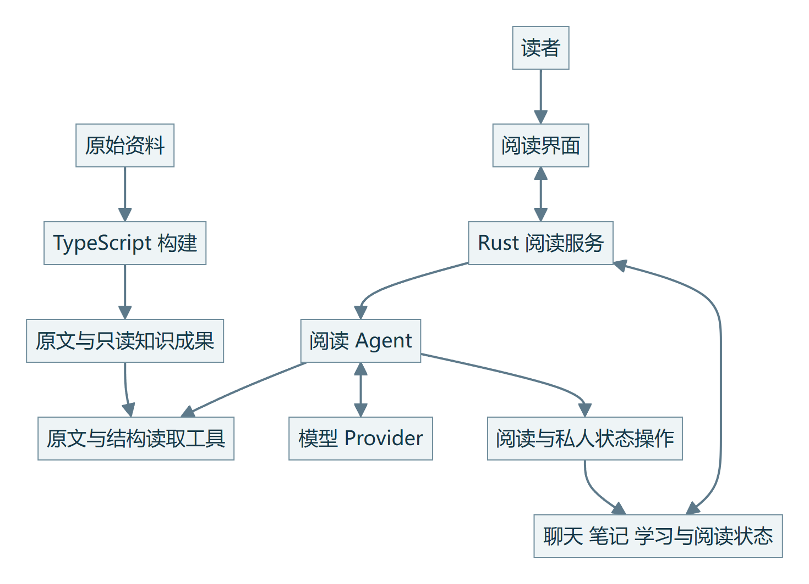

提前整理能够复用一部分工作，也会增加构建成本。阅读时按需取得内容能够减少无关输入，也可能引入更多定位和确认步骤。后面分析这些选择时，我们会分别计算准备工作、单次任务和多次使用的代价，再结合实际效果判断收益。

<a id="ch00-s3"></a>

### 位置 证据与解释

原文位置是贯穿系统的一项基础。项目使用 LID 表示材料中有层级和顺序的位置，使构建侧整理的线索能够连接到原文，也使读取、引用、导航和批注具有共同的定位依据。

语义图和全书结构帮助系统决定去哪里看。读到的原文为具体解释提供依据。运行时还要管理本轮接受了哪些证据，以及最终显示的来源绑定到了哪里。三个环节各自回答一个问题：内容可能在哪里，本轮实际取得了什么，回答展示的引用对应哪段材料。

把这些关系理清之后，就能准确理解系统的能力边界。一个来源能够被解析和跳转，说明它有真实的原文位置；回答是否正确解释了这段材料，还需要检查内容本身。评测章节会分别讨论这些结果。

<a id="ch00-s4"></a>

### 状态由谁持有

一个用户同时打开两本书时，系统需要保留两个阅读现场；两名用户阅读同一本材料时，可以共享材料成果，但各自拥有聊天和笔记。这些场景决定了状态怎样分层。

| 状态 | 主要归属 | 为什么需要这样区分 |
| --- | --- | --- |
| 已发布材料与语义成果 | 书籍及其发布版本 | 多个阅读任务能够使用同一份内容，旧引用仍指向原材料 |
| 阅读位置与窗口现场 | 一个读者的阅读现场 | 两个窗口能够各自阅读和导航 |
| 对话与聊天目标 | 对应聊天 | 追问和任务结果需要回到原会话 |
| 笔记与稳定画像 | 读者的私人数据 | 信息可以持续使用，并保留用户归属 |
| 教学会话与学习事实 | 读者的学习状态 | 学习过程可以跨多次交互延续 |
| 当前消息 证据和执行进展 | 一次 Run | 运行中的信息需要与当时的输入和动作保持关联 |

后续阅读源码时，可以沿着这张表寻找每项状态的创建、修改、保存和回收。许多看起来复杂的接口，目的就是把一次操作送到正确的状态所有者那里。

<a id="ch00-s5"></a>

### 全书怎样逐步展开

第一篇从阅读任务建立整体结构，解释组件和状态归属。第二篇进入构建阶段，沿原文切分、语义抽取、全书结构、调度和发布追踪一份材料。第三篇回到读者的一次提问，深入工具、上下文、证据和交付。第四篇讨论阅读界面、长期记忆、会话恢复和可视化解释。第五篇加入并发、多人服务、部署与实测。第六篇通过真实演进和失败案例练习架构判断，并整理面试表达。

每一篇都会增加新的条件。最初只需要一份材料和一个问题，随后需要连续追问、保存成果、处理中断，再考虑多个读者共享服务。前面形成的判断也会随这些条件重新检验。例如，一轮请求可以使用临时消息列表，跨会话阅读就需要持久记录；单窗口可以使用一个当前视口，多窗口则需要显式的现场归属。

<a id="ch00-s6"></a>

### 阅读与练习

第一次阅读时，先关注场景、数据流和设计理由。遇到陌生术语，可以回到它第一次承担具体工作的地方。第二次阅读时，再沿章末的源码入口找到关键符号，对照一个真实输入和输出。面试准备则从完整请求链路开始，把重要机制压缩为短答，再通过改变条件的追问展开。

读到某个设计选择时，可以尝试先提出自己的方案，再继续看项目采用的做法。比较时关注它们在相同任务下需要完成的工作、保留的状态和付出的代价。数据不足以支持强结论时，明确下一项能够改变判断的观察或实验。

本书希望帮助你形成这样的能力：能够解释现有系统，也能够在材料、模型或使用条件变化后，判断哪些设计仍然适用，哪些地方需要重新考虑。

需要快速回查时，可用[术语与状态归属](#app-a)辨认概念，用[源码阅读路线](#app-b)进入实际路径，再由[章节与面试问题对照](#app-f)返回完整论证。其余附录入口集中在[全书目录](../README.md#%E9%99%84%E5%BD%95%E4%B8%8E%E5%9B%9E%E6%9F%A5%E5%85%A5%E5%8F%A3)。

当前正文可以从[第 1 章的阅读任务](#ch01)开始，接着阅读[第 2 章的构建与阅读分工](#ch02)、[第 3 章的数据身份与状态归属](#ch03)。[第 4 章](#ch04)和[第 5 章](#ch05)用同一份教学材料展开原文与语义构建，[第 6 章](#ch06)解释章节路线和跨章主题，[第 7 章](#ch07)追踪这些工作怎样真正执行，[第 8 章](#ch08)连接中断恢复、阶段收口和阅读发布，再由[第 9 章](#ch09)进入读时回答。

<a id="ch00-s7"></a>

### 源码选读

[项目入口](../../../README.md)提供整体定位和既有实测；[当前架构](../../%E6%9E%B6%E6%9E%84.md)连接主要机制及其决策；[构建编排](../../../packages/core/src/build-orchestrator.ts)、[阅读 Agent](../../../crates/runtime/src/orchestrator.rs)和[服务入口](../../../crates/server/src/lib.rs)分别对应构建、决策和运行组织。阅读这些大文件时，先从本章涉及的工作进入，再沿具体调用向下追踪。


---

<a id="ch01"></a>

## 第 1 章 一本书怎样成为可以交互的阅读环境

读到一本技术书的中间，你发现作者又用了前面出现过的概念。这一次，结论似乎变了。你选中当前段落，提出请求：“解释这里与前面定义的区别，带我看原文，再把关键区别记下来。”

这句话包含几种不同的工作。解释需要理解两处材料；带你看原文需要改变阅读位置；记下来需要保存一份以后仍能找到的记录。到了第二天，你还可能接着问：“昨天说的条件，在这一节还成立吗？”系统于是需要保留已经讨论过什么，以及哪些操作真正完成了。

Understand Book 将这些工作组织在同一个阅读环境中。它把长文整理成可定位、可关联的材料，让 Agent 围绕具体问题取得证据，并通过阅读器和私人记录完成后续操作。理解整个项目，可以从这句话需要产生的结果开始。

<a id="ch01-s1"></a>

### 从一句请求拆出可以观察的结果

最直接的做法，是把当前段落交给模型，请它解释。若问题只涉及这段话，这样做已经能够提供帮助。一旦问题出现“前面”“带我去看”“记下来”，输入和输出就都需要扩展。

“前面”要求系统在书中找到另一处材料；“去看”要求一个能够接收位置的阅读器；“记下来”要求一个保存入口。模型可以决定调用什么能力，具体结果要由这些能力产生。

| 读者要求 | 系统需要得到什么 | 怎样观察是否完成 |
| --- | --- | --- |
| 解释当前段落 | 与问题相关的原文和解释 | 回答是否保留了原文的条件，是否回答了疑问 |
| 联系前面的定义 | 相关位置及足够的前文 | 能否找到并读到那一定义，比较是否使用了完整语境 |
| 带我看来源 | 与实际材料绑定的位置 | 阅读器能否打开正确材料、定位并展示对应范围 |
| 把区别记下来 | 一条属于当前读者的记录 | 保存结果和笔记正文是否符合要求，后来能否再次读取 |
| 明天继续讨论 | 原聊天及相关的持久结果 | 能否恢复讨论依据，区分完成事项和未完成事项 |

这些结果相互联系，也可以分别失败。例如，解释内容大体正确，来源按钮却跳错了位置；笔记已经写入，但回答没有说明保存到了哪里。项目的实现因此需要同时处理信息取得、动作执行和结果交付。

这一点也决定了阅读项目的方式。遇到一个模块时，先问它让上表中的哪项结果成为可能，再追踪它接收和输出的数据。这样就能将接口放回实际任务中理解。

<a id="ch01-s2"></a>

### “这里”怎样进入一次请求

读者指着屏幕说“这里”时，指代十分明确。模型收到的请求却需要用数据表达这个现场：问题文字、提问位置、所选原文及其对应范围。

在 [Web App 的 submitAgentMessage](../../../packages/web/src/App.vue) 中，界面先确定提问锚点：优先使用选区位置，其次使用当前选中的位置，再考虑视口顶部。随后创建运行时，会传入下面这些信息：

```typescript
    const result = await api.agentRunCreate(msg, {
      presentation_follow_up: presentationFollowUp,
      ...goalMeta,
      display_user: displayUser, question_anchor_lid: questionAnchorLid,
      question_quote: draft ? { ...draft } : null,
    });
```

`msg` 是这次要处理的问题，`question_anchor_lid` 表示问题发生的位置，`question_quote` 携带选区。它们承担不同作用：位置帮助找回阅读现场，选区表达用户实际指出的材料。用户可以没有选中文字而直接提问，此时 `question_quote` 为 null。

Server 中的 [AskQuote](../../../crates/server/src/lib.rs) 除了位置和引文，还可以带有选区范围、解析状态、原始选中文字与对应的规范原文。PDF 中“屏幕上选到了什么”和“它对应哪段书内原文”需要经过解析，这些字段为这种区别保留了表达空间。

接收请求后，服务端会校验输入，再接纳消息和安排执行。[本地准备入口 prepare_agent_chat](../../../crates/server/src/lib.rs) 与[网络运行准入](../../../crates/server/src/run_admission.rs)都使用 `validate_agent_input`。涉及规范选区时，服务端根据范围核对原文，后续流程消费通过校验的结果。

已经验证的选区可能足以回答当前问题；需要联系前文时，Agent 再获取其他材料。这样，读取工作随任务需要展开。第 9 章会进一步解释这些材料怎样进入本轮证据账本。

<a id="ch01-s3"></a>

### 把任务交给可以执行的能力

有了问题和现场，接下来需要决定做什么。Agent 根据当前信息提出下一步行动，工具和状态入口执行具体工作，再把结果交回运行上下文。模型看到结果之后，可以继续查找、组织解释或者结束回答。

可以先用下面的关系图理解这个过程。箭头表示工作关系，实际调用顺序取决于任务和已有信息。

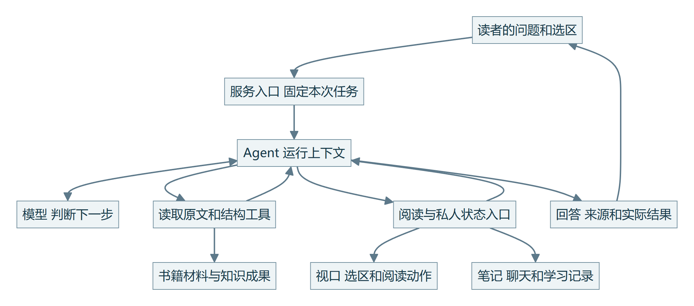

[Book](../../../crates/read-tools/src/lib.rs) 持有加载后的原文、定位树和知识成果。读取工具能从这里取得材料；模型对内容的分析，则发生在 Agent 和模型调用的协作中。查找到的概念关系帮助决定去哪里看，真正要引用的文字仍然需要回到原文。

[Reader](../../../crates/reader/src/lib.rs) 管理阅读现场。它的状态包括视口、打开的面板、选区和布局。改变阅读位置，需要进入这个对象对应的操作路径。解释中的一句“请看上一节”可以指导人阅读；自动把阅读器带到上一节，则还需要实际执行导航。

私人记录通过用户状态访问。[UserRuntime](../../../crates/server/src/user_runtime.rs) 持有记忆存储、聊天历史及相应的长期能力。把一段理解保存成笔记，意味着系统产生了可以再次读取的数据。回答中是否说出了“已保存”，不能替代这一写入结果。

这几个部分组成了一个能够完成阅读任务的最小结构：材料提供依据，模型作出选择，工具执行读取，状态入口完成操作，服务把实际结果交付给读者。后面的复杂机制，都可以沿着这条关系寻找它们承担的工作。

<a id="ch01-s4"></a>

### 为什么需要保留多个时间尺度

假设第一次回答完成后，你接着问：“那么在数据量更大时呢？”这一次问题需要利用前一轮讨论，却不必把所有长期笔记都塞进请求。几天后再次阅读时，运行中的临时消息早已结束，保存过的笔记仍应存在。

项目因此分别表达一次运行、一段聊天和读者的长期记录。

一次 Run 管理当前执行需要的信息。[RunContext](../../../crates/runtime/src/run_context.rs) 包含消息、模型配置、取消信号、实际效果以及定位、证据和进展记录。它服务于“这一次问题怎样做完”。

聊天保存多轮交互，必要时还关联跨运行持续的 Goal。某次运行已经停止，任务仍可能留有待办；后续继续时，需要读到原要求和已经取得的结果。运行状态与任务状态由此拥有不同的生命周期。

笔记和学习记录属于更长的时间尺度。用户可以在一个聊天中保存笔记，之后关闭聊天，再从同一本书或相关入口使用它。Tutor 管理的学习过程也可能跨多次交互延续。具体的数据关系会在后面的状态与学习章节展开。

对于上下文，这意味着每次请求要根据当前任务组织输入；对于持久化，这意味着已经发生的事实需要有稳定保存位置。把一次模型请求的消息数组当作全部项目状态，很难同时满足这两个要求。

<a id="ch01-s5"></a>

### 如何判断这个系统有没有帮助读者

完成系统结构之后，还需要判断它是否有效。一个容易取得的指标是“找到了相关段落”，但读者真正关心的是理解有没有变清楚、要求的操作有没有完成。

设系统找到了前面的定义，也给出了可点击来源，却忽略了定义中的一个前提。定位成功了，解释仍可能错误。再设解释正确、笔记保存接口也成功了，但笔记没有包含要求的关键区别，整项任务仍有缺口。

项目的评测材料因此分别观察证据召回、引用支持、完整回答和实际动作。[既有 Agent 评测协议](../../../evals/semantic/AGENT_EVAL.md)还将重启任务中的准备阶段与恢复阶段分开：如果重启前根本没有完成保存，就不能把重启后的缺失全部归因于存储恢复。

这种区分也适用于日常调试。面对一次失败，先找读者缺少的结果，再沿链路回溯：所需材料没有找到，原文没有读够，操作没有执行，还是结果没有正确交付。具体缺口会决定应该修改检索、提示、接口、状态处理中的哪一部分。

<a id="ch01-s6"></a>

### 阅读范围与当前边界

本章建立的是当前工作区的职责关系。界面的不同入口可以采用不同的准入、并发和恢复安排；后面讨论网络服务时，再展开多用户和多窗口的规则。

已发布材料的可靠定位、一次操作的实际完成，以及读者是否真正理解，是需要分别评估的结果。现有开发集可以帮助定位任务失败，尚不能替代广泛的教学效果研究。涉及性能和成功率时，本书使用实验记录中的具体条件。

<a id="ch01-s7"></a>

### 源码选读

| 入口 | 重点阅读 | 可以回答的问题 |
| --- | --- | --- |
| [App.vue](../../../packages/web/src/App.vue) | submitAgentMessage、sendAgent | 问题、位置和选区如何一起提交 |
| [Server](../../../crates/server/src/lib.rs) | AskQuote、validate_agent_input、prepare_agent_chat | 输入怎样成为可执行的任务 |
| [网络准入](../../../crates/server/src/run_admission.rs) | 输入校验与 PreparedAgentChat 的形成 | 网络入口怎样接纳相同的任务材料 |
| [RunContext](../../../crates/runtime/src/run_context.rs) | ReaderInputSnapshot、RunContext | 一次执行需要保留哪些信息 |
| [读取工具](../../../crates/read-tools/src/lib.rs)、[Reader](../../../crates/reader/src/lib.rs) | Book、ReaderState | 材料读取与阅读现场分别由谁管理 |

Server 中的 `agent_chat_selection_ranges_rebuild_canonical_quote` 展示按选区范围重建引文的用例。完整的来源与状态操作链路可以接着阅读[第 9 章](#ch09)。

<a id="ch01-s8"></a>

### 用项目机制回答面试问题

**怎样用一段话介绍项目？**

Understand Book 把长文整理成可定位、可关联的知识底座，让阅读 Agent 围绕问题和选区取得原文依据，再通过阅读器与私人存储完成导航、笔记和持续讨论。工程上需要同时解决材料组织、模型执行、状态归属和可追踪交付，效果上分别评估引用支持与完整任务完成。

**已经接上模型，为什么还需要这些组件？**

先从任务要求回答。模型需要知道“这里”指向什么，需要取得未放进请求的材料，也需要调用程序才能改变阅读位置或保存笔记。组件的价值可以逐项对应到输入表达、材料读取、动作执行和结果保存，而后再解释各部分如何连接。

**如果模型回答很流畅，是否说明任务成功？**

沿本章开头的请求核对：比较是否基于两处完整语境，来源能否回到原文，笔记是否确实保存且包含关键区别。流畅度只描述输出的一种特征，任务验收要回到读者要求产生的结果。

现在已经知道系统要承担哪些工作，接下来的问题是工作应该发生在什么时候。同一本书可能被反复提问，每次都重新整理全部材料会付出重复成本。[第 2 章](#ch02)将从这个约束出发，解释构建与阅读的分工。


---

<a id="ch02"></a>

## 第 2 章 构建与阅读如何分工

第一次向一本书提问时，你可以把相关正文直接交给模型。第二次提问换了一个主题，又需要找到相关正文。到了第十次，系统开始重复处理许多相同的信息：章节在哪里，某个概念出现过几次，哪些段落在讨论同一件事。

这些信息中，有一部分由材料本身决定，可以提前整理。另一些只有在问题出现以后才能确定：这一次应该比较哪些条件，需要读多少原文，最后是否要保存笔记。Understand Book 将两类工作分别放在构建阶段和阅读阶段，让稳定成果服务于不断变化的任务。

这个分工同时影响数据格式、技术栈和成本。理解它，需要回答三个问题：提前做出的成果是什么，阅读时怎样使用，以及投入何时能够收回。

<a id="ch02-s1"></a>

### 从重复处理材料，到重复使用成果

先考虑一种直接方案：每次问题到来，都将整份材料放进模型上下文，让模型自己找到需要的信息。如果材料较短、问题较少，这条路径有很低的准备门槛。材料变长后，一次请求需要容纳更多输入；如果超出可用上下文，还需要切分、检索或多轮阅读。

现在加入重复提问。即使模型每次都能处理全文，系统仍可能重复支付组织材料和定位的代价。当前问题只关心一个概念，输入却带上了许多与它无关的内容。缓存可能降低部分费用，但不会自动替系统确定每个问题的证据范围。

Understand Book 的构建侧把材料变成一套能够再次使用的成果。原文保存在 `source.txt`；位置树把层级和文本范围连接起来；语义节点、关系及全书结构提供从问题走向材料的线索。阅读时，Agent 根据问题选择入口，取得需要的原文，再继续判断是否已经读够。

这个分工保留了一个关键连接：提前得到的结构最终要能回到原文。概念之间的一条关系可以提示“去这里看看”，回答中的具体引文则要取自那里的实际文字。构建成果因此既要组织信息，也要保留定位依据。

<a id="ch02-s2"></a>

### 构建阶段产出什么

项目中的构建已经包含多种工作。确定性处理将输入块映射成 LID 和范围；模型参与语义抽取；后续阶段整理全书结构以及适合材料类型的补充成果。每项工作是否进入本次计划，要结合材料类型、阅读目标和已有成果决定。

[build-orchestrator.ts](../../../packages/core/src/build-orchestrator.ts) 中的 `AutomaticBuildStage` 声明了这些阶段，包括 Pass1、Pass2、BookStructure，以及论文元数据、术语、形式对象和教学发布等。`routeAutomaticBuildSnapshot` 根据构建计划和现有状态组织后续工作，`nextAutomaticBuildAction` 再寻找下一项可执行动作。这个结构让构建能够逐步推进，并表达尚需输入或尚未满足的条件。

读者使用这些成果时，最先遇到的是原文和只读基座。[Book::load](../../../crates/read-tools/src/lib.rs) 的加载入口包含下面一段代码：

```rust
        let base_s = std::fs::read_to_string(std::path::Path::new(dir).join("base.json"))
            .map_err(|e| format!("读 base.json 失败: {e}"))?;
        let base: ReadOnlyBase =
            serde_json::from_str(&base_s).map_err(|e| format!("解析 base.json 失败: {e}"))?;
        let source = std::fs::read_to_string(std::path::Path::new(dir).join("source.txt"))
            .map_err(|e| format!("读 source.txt 失败(原文旁路缺失,book.text 不可用): {e}"))?;
```

这段代码直接表达了读取端最基础的依赖。`base.json` 提供结构化信息，`source.txt` 提供可以切片读取的正文。只有概念和摘要而缺少正文时，`book.text` 就无法按位置返回原文。

同一加载函数还读取公式语义、篇章索引、全书结构和论文材料等旁路文件。部分文件缺失时可以使用空集合或缺省值；已经存在但无法解析的文件则会返回错误。因此，“能够加载书籍”与“所有阅读或教学能力已经准备齐全”需要分别判断。发布清单中的能力和就绪信息承担后一类说明。

这个阶段的产物可以被很多问题复用。它们通常不需要知道下一位读者会问什么，也不持有这位读者的聊天和笔记。进入具体阅读任务后，系统才将公共材料与私人现场连接起来。

<a id="ch02-s3"></a>

### 阅读阶段完成什么

阅读阶段接收问题、选区、聊天与当前现场，然后围绕任务取得材料。原文读取本身由确定性工具完成；需要先查什么、如何解释、是否继续读取，则由运行时与模型协作决定。

可以把整体关系画成两条相接的路径：

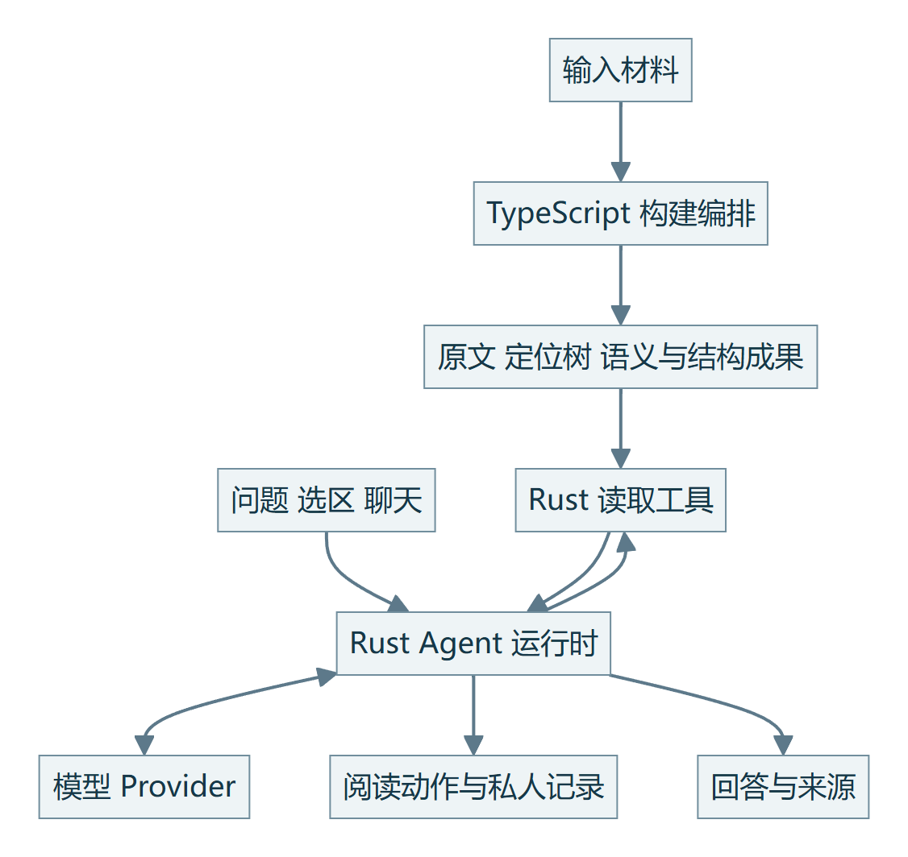

这里有两个值得区分的时间点。构建阶段发现“某个概念出现在哪些位置”，阅读阶段判断“这些位置是否足以解释当前问题”。后者可能需要上下文、反例或另一个章节。提前整理减少了部分查找工作，运行时仍然需要根据实际取得的材料作出判断。

阅读动作也发生在这个阶段。导航、保存笔记、继续聊天都依赖当前读者和当前任务，把它们提前固化进公共构建成果没有意义。相应的状态归属会在下一章展开。

<a id="ch02-s4"></a>

### 为什么选择 TypeScript 与 Rust

跨语言分工首先需要一个足够清楚的交界面。在这个项目中，主要交界面是已经形成的材料成果：构建侧写出数据，读取侧按约定加载。相比让两种语言持续共享一组频繁变化的运行对象，这个方向明确的接口更容易说明各自责任。

[ADR-0021](../../adr/0021-%E5%AE%9E%E7%8E%B0%E6%8A%80%E6%9C%AF%E6%A0%88-%E9%A2%84%E6%9E%84%E5%BB%BAts-%E8%AF%BB%E6%97%B6%E5%90%8E%E7%AB%AFrust-%E5%89%8D%E7%AB%AF%E5%BE%85%E5%AE%9A-%E5%9F%BA%E5%BA%A7schema-rust%E6%9D%83%E5%A8%81ts-rs%E7%94%9F%E6%88%90.md)记录了当时的选择。TypeScript/Node 便于衔接 Understand Anything 的构建经验、解析与模型编排生态；Rust 用于读取后端与运行时，并参考 Codex 的相关工程结构。基座类型以 Rust 定义为权威，通过 `ts-rs` 生成 TypeScript 类型，使生产者和消费者围绕同一套字段约定协作。

语言只能解释一部分设计。当前系统还包含界面、桌面宿主和外部能力入口，它们分别承接不同的使用方式。

| 部分 | 当前主要职责 | 与前后环节的连接 |
| --- | --- | --- |
| TypeScript 构建侧 | 组织输入处理、语义工作及构建推进 | 产生原文、基座和扩展成果 |
| Rust 读取工具 | 加载材料，执行原文及结构读取 | 为 Reader 与 MCP 等调用方提供共同读取能力 |
| Rust 服务与运行时 | 接纳任务，调用模型和工具，处理状态与交付 | 将问题、材料和实际动作连接起来 |
| Vue 界面 | 表达选区、问题与阅读操作，展示结果 | 通过服务接口获取数据并提交动作 |
| Tauri 桌面宿主 | 将阅读界面与本地服务组织为桌面应用 | 提供桌面启动及运行环境 |
| 模型 Provider 与 MCP | 前者承接模型调用；后者提供面向外部调用方的能力接口 | 分别连接模型执行和外部工具使用 |

这张表描述职责。模型调用并不只会出现在一个时间阶段：构建中的语义工作和阅读中的解释都可能需要模型，各自通过对应的执行安排完成。读取工具能够确定性返回原文，也不意味着整个阅读服务都不再依赖模型。

ADR-0021 中“前端待定”属于决策当时的状态。当前 Vue 与 Tauri 已经有实现。阅读架构文档时，需要将历史选择的理由和今天的组件状态分别对照。

<a id="ch02-s5"></a>

### 提前准备在什么条件下划算

下面用一个教学模型分析重复使用的成本。假设材料在观察期间保持不变，两种方案都要达到相同的任务质量目标，并且所有成本已经换算成同一种计量单位。记：

- `B`：一次构建的成本。
- `D`：直接处理一次问题的平均成本。
- `R`：利用构建成果处理一次问题的平均成本。
- `q`：这份材料被处理的问题数量。

直接方案的总成本是 `qD`，提前构建方案的总成本是 `B + qR`。当 `D > R` 时，构建方案的成本优势要求：

`q > B / (D - R)`

这个式子的意义很具体：每次阅读节省的成本是 `D - R`，需要积累足够多次使用，才能覆盖最初投入。如果 `D ≤ R` 且构建成本为正，这个模型中就没有靠增加提问次数收回成本的交点；构建可能仍提供其他价值，但需要另行证明。

设教学算例中的 `B = 180`、`D = 12`、`R = 3`。这些数字是用于解释关系的成本单位，不是项目实测。

| 问题数量 q | 直接处理 qD | 提前构建 B + qR | 此时可以怎样判断 |
| --- | ---: | ---: | --- |
| 10 | 120 | 210 | 使用次数还不足以覆盖准备投入 |
| 20 | 240 | 240 | 达到模型中的成本交点 |
| 60 | 720 | 360 | 重复使用开始带来明显累计收益 |

共享材料会改变 `q` 的含义。一份公共发布被多位读者使用时，可复用投入由这些问题共同分摊；各人的解释、聊天和私人写入仍然产生各自的阅读成本。是否划算因此取决于材料总使用量，而不只取决于某一人的提问次数。

材料更新还会增加新的准备成本。如果观察期间发生多次修订，总投入应加入每次修订实际付出的 `U_j`。新版能够复用多少成果、哪些工作需要重做，会影响这些数值，不能直接沿用首次构建的结论。

最后还要单独看等待时间。已经准备好的书可以直接进入阅读；尚未构建的书需要先完成相应工作。累计费用更低，并不自动意味着第一次使用更快。Token、金额、运行时长也不能直接相加：成本比较先统一计量口径，延迟则按读者实际等待的路径计算。

<a id="ch02-s6"></a>

### 用实测约束直觉

成本模型中的 `R` 取决于运行时实际做了多少工作。增加结构和语义线索，可能缩短定位，也可能让 Agent 多走几轮工具调用。更丰富的结构是否改善完整任务，需要看实验。

项目在 [2026-09-08 的同环消融报告](../../../evals/semantic/results/2026-09-08-la9-v2/report.md)中比较了 text、tree、graph 三种读时定位能力。三组使用 deepseek-v4-flash，共享生产 Agent 循环、基础提示、原文、判分和冻结预算。该轮 24 个任务的部分结果如下：

| 组别 | 完整成功 | 证据召回 | 引用支持 | 平均 Token |
| --- | ---: | ---: | ---: | ---: |
| text | 10/24 | 88.46% | 38.46% | 85,729.96 |
| tree | 11/24 | 88.46% | 34.62% | 101,842.04 |
| graph | 9/24 | 92.31% | 30.77% | 95,171.38 |

graph 组的证据召回更高，完整成功却更少。这说明在该轮任务中，找到更多所需证据还不足以让后续解释和交付完成得更好。tree 组较 text 组多成功一道题，也付出了更高的平均 Token。仅根据“增加了图”或“增加了树”，无法推出任务质量与成本的单向变化。

这组结果帮助理解架构中的一个取舍：构建侧提供可利用的能力，阅读侧还需要恰当地使用它们。收益需要沿“定位—阅读—解释—交付”整条链路观察。第 21 章会进一步分析判分、失败归因与不同实验之间的可比性。

<a id="ch02-s7"></a>

### 发布、修订与当前边界

构建中的工作区可以不断形成新成果，读者使用的发布则需要保持明确身份。[PublishedLibrary](../../../crates/server/src/published_library.rs) 使用书籍与发布的组合引用管理已发布材料，清单记录能力和就绪信息。一次运行绑定所用发布后，就有了能够追溯的材料范围；后续补齐成果可以形成新的发布。

内容修订比补齐成果更进一步。原文发生变化时，旧引用、笔记和学习记录仍需要解释它们当初指向什么。[ADR-0146](../../adr/0146-portable-build-workspaces-and-incremental-book-updates.md)规定搬迁保持身份、内容改版形成关联前版的新基座，并规划增量复用与用户记录衔接。本书读取的版本记录为 U1—U2 已完成，U3—U11 待实施，因此完整的跨版本复用与迁移仍属于后续方案。

本章成本算例是教学推导；同环消融是指定版本、单书开发集的一轮历史结果。前者不提供项目费用估计，后者不代表当前版本或任意材料上的总体效果。基座能够加载也不等同于所有扩展能力已经完成发布。

<a id="ch02-s8"></a>

### 源码选读

| 入口 | 重点阅读 | 可以回答的问题 |
| --- | --- | --- |
| [构建编排](../../../packages/core/src/build-orchestrator.ts) | AutomaticBuildStage、routeAutomaticBuildSnapshot、nextAutomaticBuildAction | 一个计划怎样决定后续构建工作 |
| [原文切分](../../../packages/core/src/segment.ts) | SourceBlock 到 LidNode 的映射 | 可重复使用的位置依据怎样产生 |
| [读取工具](../../../crates/read-tools/src/lib.rs) | Book::load、Book::text | 构建成果怎样变成可调用的原文读取能力 |
| [基座类型](../../../crates/base-schema/src/lib.rs) | ReadOnlyBase 与 TS 导出声明 | 两种语言如何共享成果格式 |
| [发布库](../../../crates/server/src/published_library.rs) | PublishedBookRef、PublicationManifest、PublishedBook | 读者究竟绑定哪份发布成果 |

<a id="ch02-s9"></a>

### 用项目机制回答面试问题

**为什么将构建与阅读拆开？**

材料的位置、概念和结构可以被多次任务复用，具体证据选择、解释和私人操作则依赖当前问题。分工使可重复的准备工作提前完成，读时再按任务取得原文。是否更便宜，需要比较构建投入、读时节省、使用次数与更新频率；是否更有效，需要观察完整任务结果。

**为什么跨语言，复杂度会不会更高？**

跨语言会增加数据契约与调试成本。这里的主要接口是方向明确的材料成果，TypeScript 使用构建生态，Rust 承接读取和运行时，并由 Rust 类型生成 TypeScript 定义。应继续检查字段含义、单位和版本边界，类型生成只能解决其中一部分一致性问题。

**如果一本书只问两次，还应该完整预构建吗？**

先判断问题需要哪些能力，以及直接处理能否达到同样的质量。如果准备投入很高、可节省的读时工作很少，全面构建可能无法收回成本。可以据实际阅读目标选择所需工作，再用成功率和总成本判断。回答的关键是说明选择所依据的条件，并给出能够改变判断的数据。

**既然图结构的那次实验没有更高成功率，为什么还保留这类能力？**

该轮结果说明当时的完整链路没有将更高召回转化为更高成功率。下一步要看哪些任务因结构受益，哪些在读取、解释或交付中失败，再决定改进调用方式、收缩使用范围或调整构建投入。一个开发集结果可以否定特定条件下的收益假设，不能独自回答所有材料和任务是否需要关系结构。

构建与阅读通过材料成果连接起来之后，下一个问题是这些成果和状态怎样获得稳定身份。[第 3 章](#ch03)将沿一份材料、两个窗口和一次尚未结束的运行，解释状态由谁持有、何时允许变化。


---

<a id="ch03"></a>

## 第 3 章 数据身份与状态归属

设你同时打开两个窗口。左边阅读一本书的第三章，右边查看另一份材料。你在左边提问，请 Agent 解释当前段落并保存笔记；等待回答时，又在右边翻了几页。

系统需要让两个窗口各自保留位置，让笔记属于同一位读者，让左边的回答继续使用最初那本书。如果另一位读者也打开同一本书，公共材料可以共享，聊天和笔记则应进入各自的存储。

这些要求最终都会变成数据问题：一个标识到底指向什么，一份状态由谁持有，一次运行结束后应该把结果交给谁。本章先解释材料的身份，再追踪服务、用户、阅读现场和运行之间的关系。

<a id="ch03-s1"></a>

### 先确定“同一本书”指什么

文件路径是寻找材料的一种方式。把一个构建工作区从一个目录搬到另一个目录，材料内容可以完全不变；如果把修订后的正文覆盖到原路径，路径相同，材料却已经变了。依赖路径本身，难以准确回答旧笔记和旧引用指向哪份内容。

项目使用 `book_id` 表达一份内容基座的身份。原文、定位树和相关公开成果都需要回到这份基座。项目的[版本约定](../../adr/0146-portable-build-workspaces-and-incremental-book-updates.md)规定，搬迁保持身份，正文或实际来源附件改版形成新的基座，并保留前后版本的关系。

材料内容固定之后，准备程度仍可能变化。例如，同样一份原文可以后来补齐全书结构或其他阅读能力。于是还需要指出读者使用的是哪一次发布。[PublishedBookRef](../../../crates/server/src/published_library.rs) 用两个字段表达这个身份：

```rust
pub struct PublishedBookRef {
    pub book_id: String,
    pub publication_id: String,
}
```

`book_id` 确定内容基座，`publication_id` 进一步确定该基座的一次不可变发布。发布清单与具体目录由 `PublishedBook` 连接起来；URL 也包含书籍和发布两个层次。运行保留确切发布，就能够说明自己当时使用了哪份成果。

这里有四类相关但用途不同的标识或位置：

| 标识或位置 | 它回答的问题 | 例子中的作用 |
| --- | --- | --- |
| 文件目录 | 去哪里读取文件 | 搬迁后可以重新找到材料 |
| book_id | 这些原文与成果属于哪份内容基座 | 区分修订前后的正文归属 |
| publication_id，连同 book_id | 使用的是哪次发布 | 区分同一基座不同准备程度的已发布成果 |
| LID，连同材料身份 | 这份材料内部的哪个位置 | 将段落、引用、导航和批注连接起来 |

LID 解决的是材料内部寻址。例如，`3.2.5` 表达一个层级位置；另一份材料也可以有同样的 LID。引用要同时知道所在材料，才能把这个位置解析成有意义的原文。

<a id="ch03-s2"></a>

### 三类数据怎样连接

有了身份，再看内容怎样组织。理解项目时，可以先区分原文与定位、语义与结构、用户记录三类数据。

原文与定位提供“文字实际在哪里”。`ReadOnlyBase` 包含 `book_id`、`lid_nodes`、`graph_nodes` 和 `graph_edges`；其中 `LidNode` 的 `span` 回到原文范围，`children` 与数值路径表达层级和顺序。读取工具加载正文后，就能从 LID 找到对应文字。

语义与结构提供“怎样接近所需信息”。概念、关系和全书结构把问题与可能相关的位置连接起来。它们建立在材料之上，可以辅助检索和阅读规划。第 2 章讨论的补充成果，也通过旁路文件与基座一起提供这些能力。

用户记录提供“这位读者做过什么”。笔记、高亮、聊天与学习状态需要保留个人归属，并根据用途关联书籍和来源位置。两名读者使用相同的公共材料，所产生的私人记录仍然可以不同。

这样的分离让公共成果可以被重复使用，也让私人状态按自己的生命周期保存。更新语义成果时，系统需要考虑发布身份；保存一条笔记时，则需要找到用户的存储和对应材料。两种操作会进入不同的写入路径。

<a id="ch03-s3"></a>

### 跨语言契约还包括单位

[base-schema](../../../crates/base-schema/src/lib.rs) 使用 Rust 声明基座类型，并通过 `ts-rs` 向构建侧导出 TypeScript 定义。[生成的 LidNode.ts](../../../packages/core/src/generated/LidNode.ts)可以看到相应字段，[segment.ts](../../../packages/core/src/segment.ts) 则导入该类型构造位置节点。

这样可以减少字段名称和形状各自演进造成的偏差。但类型形状一致，还需要字段含义一致。`Span` 就是一个很具体的例子：它包含两个整数 `start` 和 `end`，实际含义是原文中半开区间的 UTF-16 code unit 下标。

为什么要把单位写清楚？构建侧使用 JavaScript 字符串下标；Rust 中的字符串则以 UTF-8 存储。用同一对数字直接索引两种表示，可能取得不同结果。

以教学字符串 `A中B` 为例，`中` 在 UTF-16 下对应 `[1, 2)`，在 UTF-8 字节序列中对应 `[1, 4)`。如果把构建侧的 `[1, 2)` 当作 UTF-8 字节范围，就只取得这个汉字编码的一部分。普通中文正文已经足以触发这种单位错误。

因此，`Book` 加载正文时建立 UTF-16 表示，`Book::text` 按同一单位切片：

```rust
    pub fn text(&self, lid: &str, end_lid: Option<&str>) -> Result<String, ToolError> {
        let start = self.node(lid)?.span.start;
        let end = match end_lid {
            Some(e) => self.node(e)?.span.end,
            None => self.node(lid)?.span.end,
        };
        Ok(String::from_utf16_lossy(&self.source_u16[start..end]))
    }
```

`end_lid` 缺省时，读取一个位置的范围；存在时，结束边界来自目标位置的末尾。最后一行使用 `source_u16`，把构建侧的范围单位一直延续到读取侧。

这个例子说明了数据契约的两个层次。生成类型约束“有哪些字段、用什么形状表达”，源码中的语义约定则继续约束“这些数字怎样解释”。面试中讨论跨语言接口时，可以用它说明为什么仅仅能够成功解析 JSON 还不够。

<a id="ch03-s4"></a>

### 服务、用户、现场和运行分别持有什么

接着回到两个窗口的场景。如果把所有状态都放进一个“当前书籍”对象，两个窗口容易相互影响；如果给每次请求复制一份用户存储，又会让并发写入缺少共同的归属。因此，当前实现按不同的使用范围组织对象。

| 范围 | 主要实现入口 | 主要持有内容 | 生命周期上的关键含义 |
| --- | --- | --- | --- |
| 服务 | ServiceState，以及网络宿主使用的 PublishedLibrary 等组件 | 运行配置、模型适配器、发布材料管理等 | 多个用户或现场可以使用服务能力 |
| 用户 | UserRuntime；网络侧由 UserRegistry 管理 | 私人存储、聊天历史及相关持久状态入口 | 同一用户的窗口访问同一个用户状态归属 |
| 阅读现场 | ReaderWorkspace；网络侧由 WorkspaceRegistry 管理 | 所用材料、Reader、选中的聊天、现场消息和代际 | 每个现场可以独立阅读和导航 |
| 一次运行 | RunScope 与 RunContext | 固定归属、提问输入，以及运行中的消息、证据和进展 | 运行结果始终能够找到原任务与原材料 |

[本地 AppState](../../../crates/server/src/lib.rs) 直接组合 `services`、`user` 和 `workspace`。网络服务则还要管理多个用户和现场，相关注册表在各自范围内持有对象。这些实现的共同点是明确谁拥有可变状态，再让操作到相应所有者处执行。

[UserRuntime](../../../crates/server/src/user_runtime.rs) 持有 `MemoryStore`、聊天历史和会话存储等。网络侧的 [UserRegistry](../../../crates/server/src/user_registry.rs) 使用共享句柄管理加载的用户运行状态，避免每个窗口各自复制一套私人存储对象。

[ReaderWorkspace](../../../crates/server/src/reader_workspace.rs) 则持有 `Reader`、当前 `Book`、选中的聊天与现场消息。这里的 `messages` 服务于当前现场；私人聊天的持久归属仍在用户状态。切换现场中的聊天，不等于删除原聊天。

同一用户再打开一个窗口时，新现场可以拥有自己的 `Reader`。在第二个窗口翻页，只改变那个现场的阅读位置；两个窗口仍能访问属于同一用户的私人记录。公共 `Book` 可以通过 `Arc` 共享引用，复制一个引用不会复制整本已加载材料。

这个结构也影响回收。发布库可以撤下自己缓存中的强引用，现场或运行保留的引用仍然维持材料存活。缓存是否还想保留一本书，与正在运行的任务是否还需要它，是两项不同的判断。

<a id="ch03-s5"></a>

### 一次运行为什么要固定归属

假设左边窗口的一个 Run 已经开始，使用材料 A、聊天 C、现场 W。模型等待期间，其他状态可能继续变化。后续工具如果只查询“现在选中了什么”，就有可能偏离原任务。

[RunScope::capture](../../../crates/server/src/run_scope.rs) 在接纳任务后保存用户、现场 ID 和代际、聊天、回合、书籍及存在时的发布对象。它还保存提问时的 Reader 输入、选区和模型绑定。这样，运行既知道要解释哪次输入，也知道结果应当回到哪个归属。

保存这些引用不等于冻结整个应用。运行中的笔记写入仍然要访问用户当前的权威存储，阅读动作也需要操作真实 Reader。固定的是任务的归属和所用输入，可变状态继续由各自对象管理。

因此，`RunScope` 分别提供两类检查。`check_user` 确认用户身份，以及原聊天、书籍和回合仍然对应；`check_scene` 确认现场 ID、代际、发布和选中聊天仍与运行开始时一致。需要同时满足时，`check_workspace` 将两者连接起来。

现场中的 `generation` 用来识别一次重绑。重新绑定发布或选择另一个聊天时，会使现场失效；其中最小的状态变化是：

```rust
    pub fn invalidate(&mut self) {
        self.generation += 1;
        self.active_agent_stream = None;
    }
```

如果现场从 W 的第 7 代变成第 8 代，旧 Run 再尝试操作现场，就会得到 `WORKSPACE_STALE`。即使后来又回到同一本书，代际变化仍然表明期间发生过重绑。另一个独立窗口的普通翻页，则不会让原窗口的代际自动变化。

这项检查保护的是任务指向。旧任务要导航的位置属于原材料和原现场，不能因为界面已经打开别处，就把动作应用到新现场。

<a id="ch03-s6"></a>

### 现场变化后，哪些结果仍然可以保存

现场失效并不自动抹去原任务。一个 Run 可能已经查到了材料，随后还需要保存原书笔记或把回答写回原聊天。只要用户和原任务的归属仍然有效，这些私人结果有明确的去处。

`RunScope::private_user` 根据原书、原目录和原聊天形成私人操作上下文。需要读取或修改实时阅读现场的操作，则另行检查现场。这样，原书笔记的保存与新现场的导航可以产生不同结果。

项目的 [Agent 运行测试](../../../crates/server/src/agent_run_tests.rs)包含一个明确的归属用例：`mu1c_old_run_cannot_touch_replaced_workspace_but_saves_original_note_and_answer`。它在模型等待期间从内部替换现场，再让旧 Run 尝试读取现场、导航、保存笔记和高亮。用例要求旧现场动作被拒绝，新 Reader 保持原状态；原书的笔记与高亮仍保存，回答进入原聊天，新的现场消息不混入旧回答。

这个用例把状态分层的意义表达得很直接：需要知道某个操作正在修改什么，再决定它依赖用户归属、现场有效性，还是两者都需要。一次运行的所有结果未必拥有完全相同的失效条件。

第 9 章会沿实际请求进一步追踪这些入口，第 16 和第 19 章则分别讨论会话提交与网络准入。理解本章之后，可以先抓住一条主线：运行携带原归属，操作进入权威状态，交付回到原任务。

<a id="ch03-s7"></a>

### 当前边界

本地现场的 `publication` 可以为空；网络发布路径才具有显式的不可变发布对象。阅读源码时需要保留这个入口差异。

上面的现场替换测试直接调用内部路径，以验证状态归属合同。测试中的注释明确保留公开 Host 的切换与忙碌边界，因此这个用例不表示所有界面都允许在活跃 Run 中切换书籍。本文对测试的使用是源码对照，本批未重新执行产品测试。

搬迁保持身份、内容修订产生新基座是当前版本约定；自动完成新版成果复用、笔记投影与学习状态衔接，仍要结合 ADR-0146 中尚未完成的阶段理解。当前已发布材料的身份与运行绑定机制，不能代替完整的跨版本迁移流程。

<a id="ch03-s8"></a>

### 源码选读

| 入口 | 重点阅读 | 可以回答的问题 |
| --- | --- | --- |
| [基座定义](../../../crates/base-schema/src/lib.rs)、[TS 投影](../../../packages/core/src/generated/LidNode.ts) | Span、LidNode、ReadOnlyBase | 材料的位置和字段怎样跨语言表达 |
| [读取工具](../../../crates/read-tools/src/lib.rs) | Book::new、Book::text | 原文范围怎样按相同单位解释 |
| [发布库](../../../crates/server/src/published_library.rs) | PublishedBookRef、PublishedBook、ResidentEntry | 版本身份与运行中的材料引用怎样保留 |
| [用户状态](../../../crates/server/src/user_runtime.rs)、[用户注册表](../../../crates/server/src/user_registry.rs) | UserRuntime、UserHandle | 私人数据由谁持有 |
| [阅读现场](../../../crates/server/src/reader_workspace.rs)、[现场注册表](../../../crates/server/src/workspace_registry.rs) | ReaderWorkspace、bind_publication、select_chat、invalidate | 多个窗口怎样保持独立现场 |
| [运行归属](../../../crates/server/src/run_scope.rs) | capture、check_user、check_scene、private_user | 旧运行怎样找到原材料并约束后续操作 |

<a id="ch03-s9"></a>

### 用项目机制回答面试问题

**为什么已经有 book_id，还需要 publication_id？**

`book_id` 表达内容基座，同一内容可以继续补齐阅读成果。发布身份进一步固定某次可消费的成果集合，使运行能说明当时使用了什么。正文改版则涉及新的内容身份和旧记录的来源归属，需要按版本流程处理。

**同一用户开两个窗口，应该共享什么？**

可以共享用户的私人数据归属和公共材料引用，各现场分别持有 Reader、选中的聊天与窗口状态。这样窗口能够独立翻页，笔记仍属于同一用户。要进一步讨论并发写入时，再进入用户状态的串行入口和持久化机制。

**已经固定了 RunScope，为什么还要检查 generation？**

固定归属保存的是运行开始时的事实，后续现场仍然可能重绑。代际让旧任务识别这种变化，避免把原任务的阅读动作应用到新现场。它与用户检查配合，使私人记录和现场操作按各自条件处理。

**生成 TypeScript 类型后，跨语言一致性是否就解决了？**

生成类型能约束字段形状，字段单位和行为还需要共同约定。项目中的文本范围使用 UTF-16 下标；Rust 读取时也按 UTF-16 切片，才能让中文原文与构建侧的位置对应。这是一个可以从数据定义追踪到实际返回值的例子。

**关闭窗口后，整本书和聊天都应该立即销毁吗？**

先分别看生命周期。聊天是用户的持久数据；窗口现场可以被回收；书籍是共享材料，缓存或尚未结束的运行可能仍持有它。销毁决策应以各自所有者和实际引用为依据，不能把窗口生命周期套到所有数据上。

到这里，项目的工作时机、材料身份和状态归属已经连接起来。[第 4 章](#ch04)将进入位置本身：一份原始材料怎样被切分，LID 和范围怎样产生，又怎样保持可读回的原文对应关系。


---

<a id="ch04"></a>

## 第 4 章 原文定位与 LID

设 Agent 在回答中引用了一段定义。读者点击来源，阅读器跳到那一段；随后选中其中一句话，保存为高亮。几天后重新打开，高亮仍然应该落在同一份材料的同一段文字上。

构建、引用、导航和批注发生在不同阶段，却需要对“这里”形成共同理解。上一章解释了材料身份和文本范围的单位，本章继续追问：这些位置最初怎样产生，为什么能够被其他组件重复使用？

Understand Book 先确定规范原文，再将它映射成带层级的源块和 LID。模型随后使用这些位置描述语义。沿着这个顺序，可以把原文对应关系与模型理解分别检查，也能在语义成果变化时保留明确的材料基础。

<a id="ch04-s1"></a>

### 在切分之前，先确定切的是哪份文字

对 Markdown，最直接的路径是读取文本，用解析器识别标题、段落、列表项、代码、表格和公式。[md-adapter.ts](../../../packages/core/src/md-adapter.ts) 使用 Markdown 语法树上的位置，构造 `SourceBlock`。块中的 `text` 可以是用于展示的文字，`span` 则保留回到源串的范围。

标题能够说明这两者的区别。对于 `# 缓存`，展示文字可以是“缓存”，范围切片仍然包含 `#`。后续读取原文时，系统通过范围取得实际源串，因此保留标记的含义和只展示标题文字的含义可以并存。

EPUB 需要先把容器中的内容组织成规范文字。[epubToSource](../../../packages/core/src/epub-adapter.ts) 读取压缩包中的 `container.xml` 和 OPF，按 spine 顺序访问 XHTML，将标题、正文和资源块提取出来，再拼成 `source`。范围在拼接时记录，指向这份规范源串。它们描述的是项目保存的正文位置，不能直接拿去索引 EPUB 压缩包或原始 XHTML 字节。

已有 EPUB 工作区还有一个容易忽略的细节：规范正文可能已经不含 Markdown 标题标记。当前 [loadBookSource](../../../packages/core/src/book-source.ts) 识别到这种 `source.txt` 快照时，会从同目录 `base.json` 读取原有 LID 结构，并核对书籍身份。否则，把标题标记已经消失的纯文字重新当 Markdown 解析，就无法恢复原先的层级。

PDF-first 论文路径又多了一步。项目的 [ADR-0063](../../adr/0063-paper-pdf-first-reconciled-source-build-workbench.md)规定，Markdown 转换稿和 PDF 先经过来源对齐，接纳后的 `source.txt` 才成为共同的正文基础。原版 PDF 提供页面呈现和对照，LID、引文及笔记仍指向规范原文。当前[混合来源构建](../../../packages/core/src/hybrid-foundation-v2.ts)也从传入的规范正文产生块、位置树和 PDF 映射。

这些路径可以归纳为同一个接缝：先得到明确的 `source` 和与它对应的 `SourceBlock[]`，再进入确定性位置构建。不同格式如何形成规范正文，决定了后面的“原文”究竟指什么。

<a id="ch04-s2"></a>

### 用一份短材料跟踪位置的产生

下面是一份为本书编写的教学材料。它将同时用于下一章的语义归并示例。每一行使用 LF 换行，末行之后保留一个换行；源串长度为 61 个 UTF-16 code unit。

```markdown
# 缓存

缓存复用已有结果。

## 失效

数据变化后应使缓存失效。

# 批处理

批处理合并请求，也可复用缓存。
```

将它交给 `markdownToBlocks`，再调用 `segment`，当前实现得到下面的位置树。范围采用上一章介绍的半开区间 `[start, end)`。

| LID | 类型 | 范围 | 对应内容或子节点 |
| --- | --- | --- | --- |
| 1 | chapter | [0, 36) | 1.1、1.2、1.3 |
| 1.1 | paragraph | [0, 4) | `# 缓存` |
| 1.2 | paragraph | [6, 15) | 缓存复用已有结果。 |
| 1.3 | section | [17, 36) | 1.3.1、1.3.2 |
| 1.3.1 | paragraph | [17, 22) | `## 失效` |
| 1.3.2 | paragraph | [24, 36) | 数据变化后应使缓存失效。 |
| 2 | chapter | [38, 60) | 2.1、2.2 |
| 2.1 | paragraph | [38, 43) | `# 批处理` |
| 2.2 | paragraph | [45, 60) | 批处理合并请求，也可复用缓存。 |

整棵树有 9 个节点，其中 3 个是容器，6 个是叶子。这个结果已用当前函数重放。注意“失效”节的 LID 是 `1.3`：同级编号计入了标题叶子和前面的正文叶子，它表达树中的位置，不负责复写书面标题中的章节编号。

当读取 `1.3.2` 时，系统根据 `[24, 36)` 返回那一段文字；读取容器 `1.3` 时，则可以取得标题到该节末尾的范围。导航、搜索结果和批注都能使用这套位置，再按用途选择容器、叶子或叶子中的更细范围。

<a id="ch04-s3"></a>

### 标题为什么既有容器，又有叶子

一份标题承担两项工作：它建立下级内容的归属，本身又是需要展示和引用的文字。如果只把标题存成容器属性，正文覆盖统计就还需要另一条规则解释标题文字去了哪里；如果让容器和子节点都独占内容，又会重复计算。

[segment.ts](../../../packages/core/src/segment.ts) 采用的结构很明确：章与节是容器，标题文字成为容器的第一个叶子。遇到新标题时，栈根据标题级别退出已经结束的层级，再创建新容器。普通块成为当前容器的子叶子；没有标题时，也可以产生根级叶子。

节点创建过程中的三行代码决定了物化路径：

```typescript
    const path = [...parentPath, idx];
    const lid = path.join(".");
    const node: LidNode = { lid, path, kind, span: { ...span }, children: [] };
```

`idx` 是当前父节点下新分配的序号。`path` 保留数值分段，`lid` 是它的字符串表达。比较书序时，需要逐段比较数字，才能让 `1.3.9` 排在 `1.3.10` 前面。

全部块处理完后，程序从较深节点向上计算容器范围，使其包含子节点。这里的范围是一个连续的包含区间，所以容器切片也可能包含子块之间的空白。内容覆盖则只统计叶子，避免把容器和后代重复相加。

这种组织让层级读取和精确位置共用一棵树。它的稳定性依赖同一份规范正文和确定的解析规则；材料发生修订时，新增块可能改变后续路径。上一章的材料版本身份因此仍然必不可少。

<a id="ch04-s4"></a>

### 怎样检查文字有没有在切分中丢失

切分完成后，可以直接核对每个位置是否回到源串。[checkPartitionInvariant](../../../packages/core/src/partition.ts) 检查 LID 唯一、子节点存在、同级数值顺序、父范围包含子范围，以及叶子之间的重叠和遗漏。

检查叶子覆盖时，程序按原文起点排序，让一个游标从头向后移动。两个叶子之间的空白可以作为间隔；如果间隔里还有非空白文字，就产生 `UNCLASSIFIED_CONTENT`。新的叶子起点落在已经覆盖的范围内，则产生 `LEAF_OVERLAP`。

教学材料中，`1.1` 在 4 结束，`1.2` 从 6 开始，中间两个换行构成合法间隔。若人为删掉 `1.2`，游标就会跨过“缓存复用已有结果。”，检查会发现未分类内容。

当前 `coverage` 的计算口径是：各叶子切片去掉空白后的长度之和，除以整份源串去掉空白后的长度。长度仍按 JavaScript 字符串单位计算。教学材料得到 `ok=true`、`coverage=1`、无违例。

覆盖率需要与违例一起看。两个错误可能同时造成遗漏与重复，使数量看起来接近完整；父范围或子引用也可能在覆盖之外出错。`ok` 来自实际违例集合，单独一个百分比不能替代这些关系判断。

这一层检查提供了一个具体保证：在所检查的规范文字和树结构之间，能够发现相应的分区错误。它还没有评价文字本身是否经过正确转换，也没有评价未来抽取出的概念是否准确。

<a id="ch04-s5"></a>

### 位置树和模型输入窗口分别改变什么

接下来要让模型读取材料。若把每个叶子都单独发送，调用次数可能很多，段落之间的关系也会被拆散；若将整本书一次发送，又可能超出输入容量。于是需要第二种划分：把已有叶子组成处理窗口。

[splitWindows](../../../packages/core/src/window.ts) 消费已有 `LidNode[]`，用正文的近似 Token 数和叶子数量控制窗口大小。能够装下的子树作为一个单元加入；较大的子树继续下探；相邻小单元通过累加组成窗口。顶层节点之间会封口，因此本章例子即使使用宽松预算，仍形成两个窗口。

| 窗口 ID | 包含的叶子 LID | 对应内容 |
| --- | --- | --- |
| 0 | 1.1、1.2、1.3.1、1.3.2 | 缓存章及失效小节 |
| 1 | 2.1、2.2 | 批处理章 |

窗口对象保存 `leafLids`、估算 Token、源范围和 `overBudget` 标记。调小预算可以改变哪些叶子一起处理，却不需要重编位置树。构建侧产出的概念和关系，仍然锚定原有 LID。

单个叶子本身过长时，已有容器内部的分支会让它独立成窗并标记超预算。后续模型工作路由还可以按源片段处理一个 LID，并在结果中保留父 LID；相应机制位于 [pass1-reduction.ts](../../../packages/core/src/pass1-reduction.ts)，第 7 章再深入解释它的输入和归并合同。

因此，段落身份、传统窗口和实际模型工作单元是三个相关层次。位置回答“内容在哪里”，窗口组织相邻材料，工作单元再考虑本次模型执行的容量与成果衔接。模型更换或预算调整，主要影响后两者。

<a id="ch04-s6"></a>

### 公式、图片和 PDF 怎样接回相同位置

技术材料中的资源也需要能够被定位。当前 `SourceBlock.assetKind` 可以表示 `code`、`table`、`image` 和 `formula`，`segment` 将它传递为相应的叶子类型。

Markdown 适配器根据解析结果识别这些块。它还会在可接受的行内公式边界上拆出公式叶子，让周围正文与公式分别保留源范围。格式异常时会形成来源复核建议，而非直接将每个疑似公式都当成可靠公式对象。EPUB 适配器也为代码、表格、图片和 MathML 保留不同的块类型。

这样，公式仍属于同一套原文位置体系。后续 `FormulaSemantics` 可以描述参数、组合含义与上下文联系；公式的数学解释不会改变其原文范围。图片的引用元数据及其他资源信息，也可以沿相应叶子连接到附件。

PDF 上的位置则需要额外的几何投影。[PdfSourceMapEntryV2](../../../packages/core/src/pdf-source-map.ts) 将 `lid`、`source_span` 与页面区域连接起来，并记录 `char_exact`、`region_exact`、`partial` 或 `unmapped` 等精度。页面坐标采用 PDF user space：左下角为原点、单位为 pt，坐标本身未应用页面旋转。

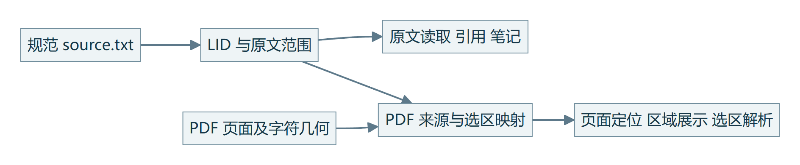

从引用跳到 PDF 时，系统沿 LID 找到页面区域；从 PDF 选区回到正文时，则需要将所选字符或区域解析为规范范围。页面号和矩形提供视觉位置，规范范围提供可读回的文字。这种分工让原版排版能够保留，也使引用和私人记录继续共享正文坐标。第 14 章会追踪界面中的完整交互。

<a id="ch04-s7"></a>

### 当前边界与已知问题

[ADR-0008](../../adr/0008-LID%E5%88%87%E5%88%86-%E7%BA%AF%E7%A1%AE%E5%AE%9A%E6%80%A7-%E5%8F%A5%E7%BA%A7%E7%8B%AC%E7%AB%8B%E5%B1%82-%E5%BF%A0%E5%AE%9E%E5%9D%97%E6%98%A0%E5%B0%84-%E5%88%86%E5%8C%BA%E4%B8%8D%E5%8F%98%E5%BC%8F.md) 包含后续句级独立层的设计。本章对照的 `segment` 实现按源块、标题和资源形成节点，并没有在每个块下自动执行中文断句。早期文档里的“字节覆盖”也需要结合当前 UTF-16 范围和非空白长度口径理解。

本次重放确认了 `splitWindows` 的一个现存问题：没有标题的根级长段超过预算时，会被遗漏。输入为 `缓存` 重复 7,000 次，使用当前默认输入预算 12,000；分区检查通过，位置树包含一个叶子，但窗口结果为空。给相同长段加上标题后，则得到两个窗口，其中长段窗口标记为超预算。

原因在 `emitSubtree` 的超限分支：它只遍历子节点，根级叶子没有子节点，因而没有进入后续的单叶输出。这说明位置树覆盖与窗口覆盖必须分别判断。此问题已记录，本批书稿工作未修产品实现。

PDF 映射精度也需要按实际结果读取。存在页面区域并不自动意味着每个字符都能精确对应；来源转换的正确性、位置覆盖和语义解释分别由相关流程承担。本章的教学重放使用短 Markdown，未重新进行 EPUB 或 PDF 导入的端到端验证。

<a id="ch04-s8"></a>

### 源码选读与面试追问

| 入口 | 重点阅读 | 可以解释的机制 |
| --- | --- | --- |
| [Markdown 适配](../../../packages/core/src/md-adapter.ts)、[EPUB 适配](../../../packages/core/src/epub-adapter.ts) | parseMarkdownSourceBlocks、epubToSource | 格式怎样变成规范源串与源块 |
| [切分](../../../packages/core/src/segment.ts) | segment、make、标题栈与范围回填 | 层级位置和标题叶子怎样产生 |
| [分区检查](../../../packages/core/src/partition.ts) | checkPartitionInvariant | 漏字、重叠和层级错误怎样被发现 |
| [窗口](../../../packages/core/src/window.ts) | splitWindows、emitSubtree | 既有位置怎样组成模型输入 |
| [混合来源](../../../packages/core/src/hybrid-foundation-v2.ts)、[PDF 类型](../../../packages/core/src/pdf-source-map.ts) | buildHybridFoundationV2Candidate、PdfSourceMapEntryV2 | 正文位置怎样连接页面几何 |

[segment.test.ts](../../../packages/core/test/segment.test.ts) 使用仓库中的 sample.md 检查标题首叶、原文回切和分区关系；本章另行重放了上面的缓存教学材料和根级长段边界。

**为什么不直接把模型的分块编号当引用位置？**

模型分块服务于本次处理，可能随预算和策略变化。引用、笔记和导航需要在同一份材料内共同使用的位置。项目先确定源块与 LID，再让模型回填这些位置，因此可以分别调整处理粒度和检查原文对应关系。

**修改模型上下文大小，是否需要重建所有 LID？**

通常先调整窗口和模型工作单元。LID 来自规范正文与解析结构，只要这两项没有变化，改变执行容量本身没有要求重新编号。需要重算哪些构建成果，则继续看它们对输入窗口和策略的依赖。

**分区检查通过，能否说明整本书都被模型读过？**

它证明的是所检查的位置分区关系。后面还要看窗口是否覆盖叶子、工作单元是否完成、成果是否接纳。根级长段的实际问题就是反例：位置层可以完整，后续窗口仍可能漏掉内容。

**PDF 高亮为什么还需要 LID 和范围？**

页面矩形负责显示区域，LID 和范围负责连接规范文字、引文和私人记录。将两者通过来源映射连接起来，系统才既能保留 PDF 页面体验，又能按同一份正文校验来源。

现在，模型输入中的每段文字已经有了可读回的位置。[第 5 章](#ch05)将沿同一份教学材料，解释模型读出的概念、断言和关系怎样回到这些位置，并成为后续可使用的成果。


---

<a id="ch05"></a>

## 第 5 章 语义抽取与来源锚定

上一章的短材料已经有了位置树。读取 `1.2` 可以得到“缓存复用已有结果。”，读取 `1.3.2` 可以得到缓存失效的条件。但当读者问“缓存在哪里出现，后面的批处理怎样与它联系”时，只知道段落编号还不够。

系统需要进一步表达概念、主张和它们之间的关系。这里开始需要模型参与：它读到一段文字，判断正在讨论什么，提出语义对象，再将对象连接回已有位置。

这项工作有两个不同的难点。一个窗口只能看见局部材料，需要把多个窗口的结果组织到一起；模型提出的对象又可能有重复、错误位置或不足以成立的关系，需要知道哪些条件能由程序检查。本章沿“输入—抽取—归并—长程候选—接纳”的顺序展开。

<a id="ch05-s1"></a>

### 先把位置带进模型实际看到的正文

如果只给模型一段没有位置标注的文本，事后要求它填写 LID，就缺少可供回填的依据。项目因此在构造输入时，将真实位置直接放在每个叶子前面。

[buildPass1Input](../../../packages/core/src/pass1-input.ts) 的实现很短：

```typescript
export function buildPass1Input(w: Window, byLid: Map<string, LidNode>, source: string): Pass1Input {
  const blocks = w.leafLids.map((lid) => {
    const n = byLid.get(lid)!;
    return `[${lid}] ${source.slice(n.span.start, n.span.end)}`;
  });
  return { windowId: w.id, lids: [...w.leafLids], text: blocks.join("\n\n") };
}
```

函数从窗口的 `leafLids` 取得节点，按范围切出原文，再添加位置标注。它没有请模型重新描述正文，也没有根据摘要生成一套新位置。

对上一章材料的窗口 0，实际组装结果是：

```text
[1.1] # 缓存

[1.2] 缓存复用已有结果。

[1.3.1] ## 失效

[1.3.2] 数据变化后应使缓存失效。
```

窗口 1 则包含 `2.1` 的标题和 `2.2` 的批处理段落。这样，模型提出“缓存在 `1.2` 出现”时，这个位置有明确的输入来源。

[Pass1 抽取器定义](../../../agents/pass1-local-extractor.md)要求只抽取当前输入中的节点和局部边，位置从标注中回填。当前自动构建还会根据实际模型容量把工作分成 whole、group、fragment 等形式；本章先讲这些形式共同产出的语义对象，工作单元的路由留到第 7 章。

<a id="ch05-s2"></a>

### 概念的多次出现，与断言的具体出处

一个概念可以在多处出现。教学材料在定义、失效条件和批处理三个地方提到了缓存，将它们分别存成毫无关系的对象，会让“缓存出现在哪里”难以直接回答。

项目的 `GraphNode` 为实体和概念使用 `occurrences`，为断言使用单个 `source_lid`。实体或概念可以保留多处锚点；一个具体主张则指向表达它的那一处原文。

例如，下面是为演示归并而设定的两份抽取结果。它们是教学输入，未调用模型生成；归并结果则由当前程序实际计算。

| 输入窗口 | 节点 ID | 类型 | 教学输入中的锚点 |
| --- | --- | --- | --- |
| 0 | concept:cache | concept | occurrences = 1.2、1.3.2 |
| 0 | claim:1.3.2:invalidate | claim | source_lid = 1.3.2 |
| 1 | concept:cache | concept | occurrences = 2.2 |
| 1 | concept:batch | concept | occurrences = 2.2 |

这里的断言是“数据变化后应使缓存失效”。它与抽象概念“缓存”拥有不同的身份：前者表达一个带条件的主张，后者把多处讨论聚到同一个对象上。

节点 ID 也与 LID 分别承担工作。边的 `source` 和 `target` 使用节点 ID，表达对象之间的关系；节点的锚点使用 LID，说明这些对象在哪里有原文依据。关系图和位置树由此连接起来。

<a id="ch05-s3"></a>

### 归并怎样保留有用结果

[mergeAndGate](../../../packages/core/src/merge.ts) 接收多份节点和边，以及位置树。它先按节点 ID 收集对象，再校验锚点，最后处理边。

实体或概念遇到相同 ID 时，程序取出现位置的并集。决定这个行为的是下面的分支片段：

```typescript
        ex.occurrences = [...new Set([...ex.occurrences, ...n.occurrences])]; // 并集
        ex.name = n.name; // keep-last
```

教学输入中的 4 个节点因此变成 3 个。`concept:cache` 保留 `1.2`、`1.3.2`、`2.2` 三处出现；失效断言仍然指向 `1.3.2`；批处理概念保留 `2.2`。节点数量减少，来源位置则被保留下来。

这个函数按 ID 归并。规范化名称的约定来自抽取器，函数本身没有进行语义实体消歧。同义对象用了不同 ID 时，程序不会自动知道它们相同；同一个 ID 被用于不同含义时，程序也不会凭名称理解差异。这类问题需要回到上游抽取与质量观察。

锚点校验采用尽量保留有效部分的方式。概念同时带有有效位置和不存在的位置时，只剔除不存在的那一项；没有任何有效出现位置，才丢弃节点。断言的单个来源无效时，整条断言失去依据。边引用了已经不在结果中的节点，则相应边被丢弃，其他有效节点继续保留。

边也有自己的去重口径。键包含端点、关系类型和方向；无向边的两端会在计算键时统一顺序，有向边保持顺序。重复边保留权重更高的一条。权重在这里用于确定保留结果，不能把较高权重理解成经过统计校准的正确概率。

函数同时返回归并和丢弃报告，使调用方知道哪些对象被合并、哪些来源被剔除。更靠前的当前任务接纳还有较严格的范围约束：[pass1-reduction.ts](../../../packages/core/src/pass1-reduction.ts) 的 `assertOutputEvidence` 会检查 whole/group 候选只使用已分配的 LID，边端点也必须存在于候选节点中。范围不符的候选可以在进入归并前被拒绝。

两层机制针对不同接缝：任务接纳约束这次工作允许提交什么，归并函数负责把已经提供的对象收拢成一致结果。讲解某个清理分支时，需要同时知道它前面的调用条件。

<a id="ch05-s4"></a>

### 覆盖率、锚定率和语义正确性

上一章的切分覆盖率为 100%。本章教学抽取结果的 `anchorRate` 却只有 0.5。这个差异来自两个指标回答的问题不同。

位置分区检查原文内容是否被叶子范围覆盖；图谱锚定率则计算有存活语义节点直接锚定的叶子数，占全部叶子的比例。教学例子共 6 个叶子，语义节点覆盖 `1.2`、`1.3.2` 和 `2.2` 三个，因而结果是 `3 / 6 = 0.5`。三个标题叶子没有被这组教学对象单独锚定。

这个数值不能证明模型漏读了一半文字，也不能证明另一半文字被正确理解。一个节点可以使用真实 LID，却把段落含义解释错；一条边的两端都存在，也可能没有文本支持它所声称的关系。

因此，本章的验证关系可以按三层理解：位置层回答内容在哪里；结构接纳回答对象和引用是否满足合同；语义评估回答这些概念、主张和关系是否符合材料。它们各自提供信息，不能互相替代。

<a id="ch05-s5"></a>

### 从局部节点形成全局入口

窗口 0 单独执行时，看不到批处理段落；窗口 1 单独执行时，也不一定知道前面完整的失效条件。跨窗口联系需要在局部成果汇集之后建立。

早期 [ADR-0010](../../adr/0010-%E8%AF%AD%E4%B9%89%E8%BE%B9%E4%B8%A4%E9%81%8D%E6%8A%BD%E5%8F%96-%E5%8F%8Cagent-%E7%A1%AC%E5%B1%8F%E9%9A%9C-%E5%85%A8%E9%87%8F%E7%9B%AE%E5%BD%95%E4%BC%98%E5%85%88-%E7%A1%AE%E5%AE%9A%E6%80%A7%E6%8A%95%E5%BD%B1-%E9%94%9A%E5%AE%9A%E5%9F%BA%E6%95%B0%E5%88%86%E8%A3%82.md) 因此选择先完成 Pass1、归并节点，再形成全局目录供下一阶段使用。书籍不像代码那样天然有可解析的 import 图，这是当时采用全局目录的理由之一。

当前 [projectCatalog](../../../packages/core/src/catalog.ts) 仍然从已有节点直接投影出 `id`、`lid`、`type` 和 `name`。实体和概念的目录项取第一个 occurrence，断言取 `source_lid`；完整出现集合保留在节点中。[pass1-batch.ts](../../../skills/build/pass1-batch.ts) 在收口时使用这一投影。

教学例子得到三条目录项，其中缓存项的位置是 `1.2`。它提供进入概念的一个位置，不应被解释成缓存只在 `1.2` 出现。目录由节点投影，避免再让模型独立生成一份可能与节点不一致的名单。

全局材料已经存在，并不意味着要将所有节点都送入每一次长程判断。当前 Pass2 进一步将寻找候选和判断关系拆开：程序从已知信号生成候选，模型按关系合同分类，再由程序接纳结果。下面讨论的是这一现行路径。

<a id="ch05-s6"></a>

### 当前 Pass2 怎样找到值得判断的候选

[buildLongRangeCandidates](../../../packages/core/src/pass2-build.ts) 首先建立几个索引：一个节点在哪些窗口出现，一个窗口中有哪些节点，以及某个 LID 对应哪些节点。

其中一条主要路径使用重复出现的节点连接窗口。若“缓存”在较早窗口和较晚窗口中都出现，程序以较早出现为源侧，再查看较晚窗口中的其他节点，形成候选。篇章功能可以提供定义到应用、前提到展开等提示；公式语义中的跨窗口上下文联系也能提供候选。

对本章的教学对象，当前函数实际产生一个候选：

| 字段 | 结果 |
| --- | --- |
| candidate_id | cand:concept:cache->concept:batch |
| source_node_id | concept:cache |
| target_node_id | concept:batch |
| source_lids | 1.2、1.3.2 |
| target_lids | 2.2 |
| seed_reasons | shared_node_bridge:concept:cache |
| relation_hints | 空集合 |

这个结果表达“这两个对象有理由被放在一起考察”。它尚未证明缓存与批处理之间应当建立哪一种关系。这里没有给出篇章或公式补充信息，所以也没有相应的关系提示。

当前实现的长程定义落在证据跨窗口上：至少一处源侧证据和一处目标侧证据属于不同窗口。同一章里的两个窗口也可以形成长程关系；章节距离或 LID 字符串看起来不同，都不能单独替代这个判断。

这一点还意味着，窗口配置会影响当前长程候选的分类边界。LID 可以保持不变，但哪些关系属于跨窗口，要结合当次构建的窗口划分理解。

<a id="ch05-s7"></a>

### 工作包、关系判断与接纳

[buildPass2WorkPacket](../../../packages/core/src/pass2-orchestrate.ts) 以源窗口为单位组织工作包，其中包含源窗口正文、节点、篇章信息、公式信息、候选和关系类型合同。合同使用 `when`、`when_not`、`evidence`、`roles` 等字段说明某种关系在什么条件下成立。

例如，`builds_on` 将扩展或依赖某种机制的一方放在 source，将所依赖的基础放在 target；`prerequisite` 则把先修概念放在 source，把需要它的内容放在 target。关系名称相近，端点角色仍然需要分别判断。

候选中较早出现的一方，不会因此自动满足所有关系的 source 角色。教学候选“缓存 → 批处理”不能仅凭共现就标成 `applies`；该合同要求 source 是实际应用者，target 是被应用的概念。分类时要检查材料与端点角色是否共同成立。

[Pass2 分类器定义](../../../agents/pass2-longrange-linker.md) 要求只分类给定候选，输出 accepted、pending 和 rejected 三类结果。accepted 表达模型主张关系成立；pending 保留尚不足以进入基座的判断；rejected 则给出不成立或不值得保留的原因。

随后，[gatePass2BuildOutput](../../../packages/core/src/pass2-build.ts) 检查被提交为 accepted 的边：节点端点是否存在，两侧证据是否非空、是否被总证据集合覆盖，位置是否存在，以及是否满足作用域、类型、跨窗口和接纳阈值等条件。其中一段决定了弱推断与非长程结果不能直接进入基座：

```typescript
  if (edge.support_level === "weak_inference") return "weak_inference";
  if (!(edge.weight >= minWeight)) return "below_weight_threshold";
  if (!isCrossWindow(edge.source_evidence_lids, edge.target_evidence_lids, lidToWindowIndex)) return "not_cross_window";
```

通过的结果转成通用 `GraphEdge`。两侧证据、理由和支持级别保存在审计成果中；pending、rejected，以及未通过程序检查的 accepted 结果也分别进入审计记录。这样，读时使用的关系与构建时的判断记录各有适合的表达。

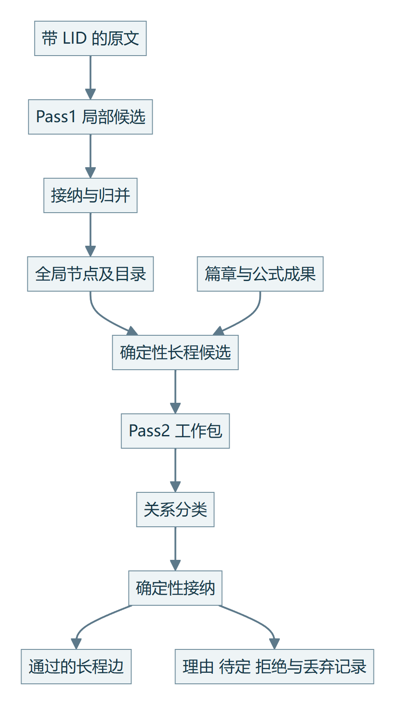

程序检查约束了结构和显式条件，关系理由的内容判断仍然需要原文。仅看字段齐全，无法确认模型已经充分读过两侧材料。当前工作包的具体证据交付边界见本章末尾。

<a id="ch05-s8"></a>

### 篇章、公式与内容规则包怎样加入

一本技术书里的“定义”“例子”“警告”承担不同作用。论文中的“研究问题”“方法”“实验结果”也不应只当成普通主题词。项目通过内容规则与旁路成果表达这些差别。

[TechnicalLearningDiscourseItem](../../../packages/core/src/discourse-index.ts) 将一个 LID 与篇章模式、局部功能、修辞作用和关系连接起来。例如，一段是定义还是应用，会影响长程候选得到什么关系提示。

[FormulaSemantics](../../../packages/core/src/formula-semantics.ts) 则连接公式位置、参数解释、组合含义和上下文联系。对应接纳函数确认公式位置确实是公式节点，再根据允许的上下文检查证据；缺少必要的组合描述时，不产生完整语义对象。这样的结构将“公式在哪里”和“公式表达什么”连接起来，同时保留各自职责。

[buildProfiledPass1Input](../../../packages/core/src/pass1-profile-input.ts) 在通用带位置正文之外，按内容规则加入抽取要求。technical_learning 使用基础输入；paper 会加入论文子类型、关注对象和关系规则。论文对象仍然表达成通用实体、概念、断言及局部边，元数据和术语等成果使用各自的旁路文件。

这使项目能够改变抽取重点，而不必为每种材料重做位置与图谱的基本类型。规则包的质量仍要通过相应材料判断，例如综述中转述其他论文的结论，与当前材料自己验证过的结果，需要保留不同的来源含义。

Pass2 也已经成为构建计划中的可选增强。[ADR-0098](../../adr/0098-optional-pass2-enrichment-for-book-structure.md)修订了固定依赖关系：未启用 Pass2 时，BookStructure 可以使用空长程边输入；启用后再消费相应成果。当前构建路由将这一选择与计划关联。全书结构的形成会在下一章继续展开。

<a id="ch05-s9"></a>

### 当前边界与已知问题

早期 ADR-0010 描述了全量目录优先及固定并发的方案。本章对照的现行 Pass2 使用确定性候选和源窗口工作包，是否执行还由计划选择；当前 Pass1 也有进一步的工作单元拆分与归并。历史数字和旧输入形式不应直接替代今天的调度行为。

当前 Pass2 工作包有一处明确的证据交付缺口：`buildPass2WorkPacket` 只把源窗口的原文放进 `source_window.text`，目标端在候选里主要以 LID 指针表达；`renderPass2ModelInput` 直接序列化该工作包，没有补入目标正文。在本章例子中，包内有窗口 0 的四段文字，却没有目标 `2.2` 的批处理原文。因此，仅凭这个包不足以完成双侧语义判断；具体执行若有额外回读，需要另行确认其输入与结果。本批未运行真实模型来验证补读行为。

Pass2 接纳函数检查了证据位置和结构条件，并不验证关系理由是否被两侧文字充分支持，也不证明候选发现覆盖了全部有价值的关系。候选缺失、端点角色不适配和语义误判，仍应在相关任务上观察。下一次改进应先定位是哪一种缺口，再选择补充输入、调整候选或改变判断方式。

本章的抽取节点是明确设定的教学输入。位置、输入组装、归并、目录和候选结果已经用当前函数重放；这次没有发生模型抽取调用，也没有将示例的锚定率作为项目质量实测。

<a id="ch05-s10"></a>

### 源码选读与面试追问

| 入口 | 重点阅读 | 可以解释的机制 |
| --- | --- | --- |
| [输入组装](../../../packages/core/src/pass1-input.ts)、[抽取器定义](../../../agents/pass1-local-extractor.md) | buildPass1Input、节点与边的输出约定 | 模型看见的位置怎样成为来源锚点 |
| [归并](../../../packages/core/src/merge.ts)、[任务接纳](../../../packages/core/src/pass1-reduction.ts) | mergeAndGate、assertOutputEvidence | 全局收拢与任务范围检查怎样配合 |
| [目录投影](../../../packages/core/src/catalog.ts) | projectCatalog | 为什么目录与已有节点保持同源 |
| [长程候选及接纳](../../../packages/core/src/pass2-build.ts) | buildLongRangeCandidates、isCrossWindow、gatePass2BuildOutput | 候选怎样产生，哪些结果进入基座 |
| [工作包](../../../packages/core/src/pass2-orchestrate.ts)、[输入渲染](../../../packages/core/src/model-input-renderer.ts) | buildPass2WorkPacket、renderPass2ModelInput | 模型实际接收哪些材料 |
| [篇章](../../../packages/core/src/discourse-index.ts)、[公式](../../../packages/core/src/formula-semantics.ts)、[规则输入](../../../packages/core/src/pass1-profile-input.ts) | 篇章项、公式接纳与规则头 | 特定材料的理解要求怎样接入通用结构 |

[merge.test.ts](../../../packages/core/test/merge.test.ts) 覆盖同 ID 归并、悬空位置、边去重与锚定率；[pass2-build.test.ts](../../../packages/core/test/pass2-build.test.ts) 覆盖候选及 accepted/pending/rejected 的接纳分流；[pass2-orchestrate.test.ts](../../../packages/core/test/pass2-orchestrate.test.ts) 说明源窗口工作包的组成。上述测试本批为源码阅读，确定性教学重放另行执行。

**为什么实体或概念使用多锚点，断言使用单锚点？**

前者要把同一对象在不同位置的出现聚在一起，后者要保存一个具体主张的出处。这样既能回答概念出现在哪里，也能让某条断言回到表达它的原文。归并时继续按这两种身份分别处理。

**既然位置都真实存在，为什么还可能产生错误知识？**

存在性只能证明引用位置可解析。模型仍可能误解条件、混淆对象，或在只有主题重合时建立强关系。应将来源存在、输入实际交付、结构接纳与语义支持分别追踪。

**Pass2 为什么放在局部成果之后？**

跨窗口候选需要使用已经形成的节点出现集合，以及相关篇章和公式信息。先汇集这些成果，才能从全书范围寻找联系。是否值得运行 Pass2，则由阅读目标、已有能力和构建计划决定。

**把所有语义对象都放进一个巨大的模型请求，会更简单吗？**

输入组织可能更直接，但仍要处理容量、输出规模和来源绑定。当前分工允许局部任务先产出对象，再用明确候选约束长程判断；它也引入了候选召回和跨侧证据交付的责任。比较方案时，需要同时考虑这些责任与完整任务效果。

**怎样判断下一步应该改提示词还是改程序？**

先看失败发生在哪里。目标正文根本没有交付，应先处理输入；位置不属于任务范围，应处理接纳或上游输出；材料齐全但关系含义判断错误，再检查规则、提示和语义评估。书中的真实输入链比一个总分更能决定下一步行动。

语义节点和关系已经能连接分散的原文，但读者还需要知道一本书的重点、章节路线和跨章主题。[第 6 章](#ch06)继续解释这些局部成果怎样被组织成全书结构，以及需要哪些候选召回能力。


---

<a id="ch06"></a>

## 第 6 章 全书结构与语义候选召回

上一章已经把“缓存”在几处原文中的出现连接起来。现在，读者提出一个更大的问题：“我应该怎样学这本书？缓存这一概念在前后章节里分别解决什么问题？”

要回答这个问题，系统需要知道章节各自承担的任务，哪些内容值得停下来理解，以及同一个问题怎样跨章发展。一个概念有三处锚点，并没有直接给出学习顺序；两段文字都谈“复用”，也没有直接证明其中一段是另一段的前置知识。

BookStructure 在原文位置和语义成果之上组织这些信息。本章沿一个实际设计变化展开：当局部成果已经抽取出来，继续压缩摘要会丢掉什么？怎样保留细节，又让全书路线足够清楚？检索在其中承担哪一部分工作？

<a id="ch06-s1"></a>

### 从概念分布走向阅读路线

目录提供材料的顺序和层级，语义图表达对象及其关系，全书结构则组织“怎样读”。三者共享来源位置，各有自己的输出。

当前 [BookStructureSidecar](../../../packages/core/src/book-structure.ts) 包含三个主要集合：

| 集合 | 保存的内容 | 支持的阅读问题 |
| --- | --- | --- |
| spine | 各单元的角色、摘要、宏观重点引用和 depends_on | 这一章解决什么问题，阅读前需要哪些章节？ |
| key_stops | 重点的身份、类型、位置，以及带来源的学习理由 | 哪些定义、公式、条件或例子值得仔细理解？ |
| throughlines | 跨章主题的名称、摘要、涉及单元和重点引用 | 一个问题在不同章节里怎样展开？ |

`depends_on` 位于 spine 的单元内。它表达阅读依赖；两个单元出现在同一条 throughline 中，只能说明它们共同参与这个主题。

沿用缓存材料，可以先保留“缓存复用已有结果”，再保留“数据变化后应使缓存失效”，随后在批处理一章连接到“也可复用缓存”。概念图帮助读者聚合这些位置；章节重点进一步说明每一处值得学什么；宏观路线可以只突出定义与应用，把失效条件留在完整章节重点中。

构建入口 [buildBookStructureUnitSources](../../../packages/core/src/book-structure.ts) 为各单元组装原文位置、相关图节点和边、篇章项、公式语义以及可用的 Pass2 成果。BookStructure 的候选学习点有自己的生成与接纳过程，不能直接把每个图节点都当作一个教学重点。

<a id="ch06-s2"></a>

### 为什么不断总结会丢掉值得学的内容

一种自然做法是逐段总结，再把段落摘要合成章节摘要，最后合成全书摘要。随着输入变长，每一层都要决定哪些内容值得带入下一层。被前一层省略的条件，后一层通常已经看不到。

项目的 [BSR0 基线记录](../../performance/book-structure-bsr0.md)给出了具体案例。AI Infra 材料的“第 8 章 推理优化”原本包含连续批处理、KV 分页、前缀缓存等机制；旧章节卡已经压缩为 9 个候选，最终公开结构只留下 2 个重点：一处显存容量公式和一处有效吞吐公式。完整片段中仍有相关机制的说明，但它们没有保留到最终重点里。

最终结果取决于整个传递过程。信息经过了哪些中间产物、在哪一层被删除，决定了后续模型是否还有机会作出完整选择。

[BSR2 的局部实验](../../performance/book-structure-bsr2-codex.md)改用候选保留与引用选择。实验复用该章的章节卡、5 个完整片段、31 个候选和 12 段原文摘录，得到如下结果：

| 层次 | 数量 | 含义 |
| --- | ---:| --- |
| 可供组织的候选 | 31 | 原始候选继续保留，可供查看和后续使用 |
| 选入章节的重点 | 27 | 保留机制、成立条件和学习理由 |
| 进入宏观路线的重点 | 15 | 从章节重点中选择较短的阅读路线 |

其余 12 个已选重点没有因为宏观路线缩短而消失，4 个未选候选也仍在候选目录里。来源核对覆盖了 9 类预先列出的机制，包括连续批处理、分页与共享、前缀复用及投机解码等。实验范围与成本口径在本章末尾集中说明。

这次变化把两种工作分开了：模型判断应当选什么、怎样解释它；程序按引用携带已经存在的内容。[ADR-0151](../../adr/0151-book-structure-global-outline-and-semantic-retrieval.md)据此将技术学习材料的主线调整为全书框架、正文发现、章节选择和主题整理。

<a id="ch06-s3"></a>

### 先建立方向，再完整发现正文候选

阅读一本长书时，全局方向有助于理解局部。只看一节关于“状态传输”的文字，很难判断它是在解释缓存命中、分布式推理还是故障恢复。先知道各章提出什么问题，能够给后续发现提供上下文。

当前技术学习路径先从规范章节和少量正文摘录生成暂定框架。[structureSourceOutline](../../../packages/core/src/book-structure-discovery.ts) 选取章节开头，以及可用的小结或另一段正文，形成短概览；[acceptStructureOutline](../../../packages/core/src/book-structure-planning.ts) 要求输出保持章节身份和原始顺序，并校验问题与发展说明引用了已交付的位置。章节标题由 Core 提供。例如，实验中“第 8 章”的单元 LID 是 `10`，展示章号和源身份各自保留。

这个框架为正文阅读提出暂定问题。接下来的发现仍需要覆盖正文，章节摘要和主题判断也应服从实际材料。

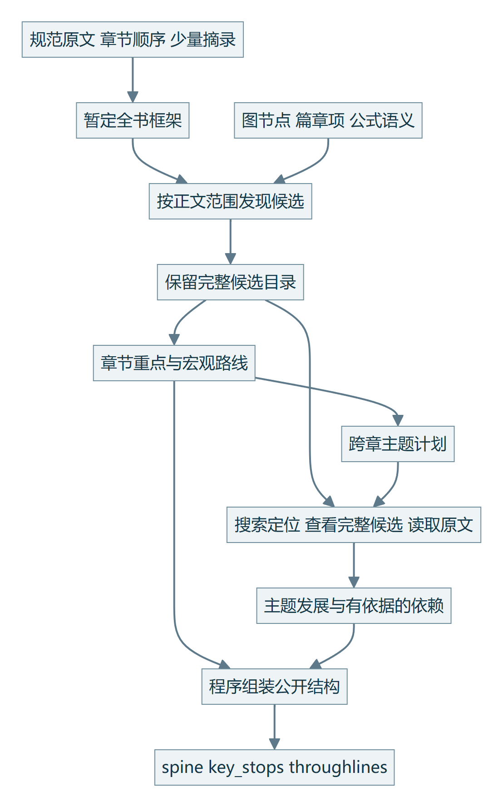

在 [build-orchestrator.ts](../../../packages/core/src/build-orchestrator.ts) 中，这条发现与组织路径由 `technical_learning` 内容类型启用。[structureDiscoverySources](../../../packages/core/src/book-structure-discovery.ts) 从每个叶子的规范范围取得完整文字，替换旧来源视图中的短预览；具体请求再按工作单元容量分配。完整覆盖记录的是各任务负责的正文范围，后面的检索 Top-K 不承担这个责任。

发现结果为每个候选分别保留含义 `meaning`、条件 `conditions`、学习理由 `reason` 和来源 `evidence_lids`。同一个 LID 中可以包含多个值得学习的意思，它们使用不同的局部身份。目录中的引用由贡献身份和局部身份组成，[structureCandidateRef](../../../packages/core/src/book-structure-candidates.ts) 的定义是：

```typescript
export const structureCandidateRef = (contribution: string, localId: string) => `${contribution}#${encodeURIComponent(localId)}`;
```

因此，“来自同一段”与“是同一个候选”有明确区别。后续选择能够准确指向某条含义，程序也能够发现同一个引用被赋予了相冲突的内容。

[readStructureCandidateCatalog](../../../packages/core/src/book-structure-generation.ts) 从当前任务对应的已接受成果收集候选；`collectStructureCandidates` 检查候选引用的位置是否属于该贡献的证据范围。原观察成果继续独立保留，章节概览的组装不会代替这份目录。

<a id="ch06-s4"></a>

### 用引用选择，把重点与路线分开

有了候选目录之后，章节组织需要回答两个问题：本章应保留哪些学习点，全书路线应突出其中哪些点？当前选择结构直接表达这两个集合：

```typescript
export interface StructureChapterSelection {
  unit_lid: string;
  role: BookStructureSpineRole;
  summary: AnchoredText;
  accepted_stop_refs: string[];
  macro_stop_refs: string[];
}
```

这段定义来自 [book-structure-candidates.ts](../../../packages/core/src/book-structure-candidates.ts)。接纳函数要求宏观引用属于章节已选引用，引用不得重复，候选也必须属于当前单元。章节摘要另外接受证据范围检查。

章节组织采用有状态的浏览过程。[structureChapterInput](../../../packages/core/src/book-structure-planning.ts) 交付候选索引、需要展开的完整候选和请求读取的原文；`applyStructureChapterAction` 记录已交付的候选引用与证据。选择前必须浏览完整章节候选索引，避免只看第一页就宣布完成。

这里有一个细致的分工：完整浏览证明索引已经交付；章节重点引用从已有的已接受候选中选择；新写的章节摘要必须有本次组织过程交付的证据。程序没有要求每一个被选候选都重新读取原文。已有候选的来源与条件随引用继续保留，新的概括则需要自己的依据。

本书使用前两章的缓存材料做了一个确定性重放。候选及其学习理由是手工设定的教学输入，程序执行真实的收集、选择和组装函数：

| 教学候选 | 所属单元与来源 | 选入章节 | 进入宏观路线 |
| --- | --- | --- | --- |
| 缓存复用已有结果 | 缓存，1.2 | 是 | 是 |
| 数据变化后使缓存失效 | 缓存，1.3.2 | 是 | 否 |
| 批处理合并请求，也可复用缓存 | 批处理，2.2 | 是 | 是 |

实际结果为 3 个候选、3 个公开重点、2 个宏观引用。失效条件仍在公开重点的 `reason.text` 中。负责这一步的 [materializeStructureChapterSelections](../../../packages/core/src/book-structure-materialization.ts) 把候选的含义、条件与学习理由组合为重点说明，将 `macro_stop_refs` 写入对应 spine 单元的 `key_stop_ids`。

这个过程不需要模型把所有重点再抄写一遍。选择发生变化时，程序继续按候选身份取得原有内容；完成顺序与任务批次不参与候选身份。

<a id="ch06-s5"></a>

### 检索怎样帮助发现，又怎样成为判断依据

全书候选可能很多。跨章主题如果每次都接收全部候选正文，会很快消耗模型输入容量。当前主题计划先使用章节摘要、问题和宏观路线种子，后续通过搜索、完整查看与原文读取补充材料。未进入宏观路线的候选仍留在检索目录中。

搜索首先返回位置和预览。模型可以据此决定下一步查看哪里；当它要把某个候选纳入主题，或为一个新解释引用材料时，再取得相应内容。

| 输入或动作 | 模型取得什么 | 证据记录的变化 |
| --- | --- | --- |
| 候选索引、搜索预览、原文位置目录 | 引用、简短含义和位置 | 不增加可用于新判断的证据范围 |
| inspect 的后续输入 | 完整已接受候选，或带来源的章节材料 | 将该材料携带的位置加入交付记录 |
| read 的后续输入 | 指定位置的原文摘录 | 将实际交付的原文位置加入记录 |
| select 或 resolve | 模型提交新的选择与解释 | 程序按当前记录检查引用范围 |

“后续输入”很关键。提出 inspect 请求只是在状态中登记接下来应展开什么；相应材料随后进入模型输入，下一次动作应用时才计入交付记录。[applyStructureThemeAction](../../../packages/core/src/book-structure-themes.ts) 从 `input.inspected` 和 `input.excerpts` 增加证据，没有从搜索预览增加证据。

缓存教学重放中，直接用索引预览为章节提交摘要，会得到 `chapter explanation cites undelivered evidence`。请求查看定义候选后，完整候选进入下一次输入，随后同一摘要被接受。这里交付的是已经接受、带有来源的子成果；它与再次交付原文字面内容有不同含义。

<a id="ch06-s6"></a>

#### 词法与语义候选怎样合并

[book-structure-retrieval.ts](../../../packages/core/src/book-structure-retrieval.ts) 为 BookStructure 构造独立检索视图。章节视图使用问题与概览；候选视图使用含义、条件和别名。用于向量计算的是短文本，完整词法字段和原材料位置另外保留。

例如，当前候选的向量投影分别取含义的前 48 个 Unicode 码点、条件串的前 24 个码点和别名串的前 12 个码点。完整 `meaning`、全部条件、别名与学习理由仍参与词法检索，完整候选仍可 inspect。短向量输入控制计算量，也可能漏掉后半段的重要条件，因此后面的语义判断仍要查看完整材料。

[retrieveHybrid](../../../packages/core/src/semantic-retrieval.ts) 先放入含义精确匹配和别名匹配，再交替补入词法命中与按相似度排列的语义候选，并按身份去重。BookStructure 当前每页交付 6 条，语义通道至多补入 12 条新的候选；词法条目不受这 12 条额度截断。空查询则浏览完整目录，不进行向量计算。

这种合并保留了直接名称查询的能力，也为措辞不同但可能相关的材料提供入口。返回的匹配原因用于解释候选为何出现，相似度留在诊断信息中。原文是否支持主题关系，需要后续判断。

<a id="ch06-s7"></a>

#### 为什么 Provider 由 Core 管理

Embedding 会产生计算、等待与可能的外部费用。[EmbeddingProvider](../../../packages/core/src/embedding-provider.ts) 因此显式提供文档和查询两个异步接口，并声明模型身份、维度、输入与批量上限、取消信号和可用的用量信息。[ADR-0149](../../adr/0149-%E6%9E%84%E5%BB%BA%E6%9C%9F%E8%AF%AD%E4%B9%89%E5%80%99%E9%80%89%E5%8F%AC%E5%9B%9E%E4%B8%8ECore-owned-Embedding-Provider.md)将这些调用放在 Core 的准备阶段，便于按当前计划约束实际执行。

[prepareStructureRetrieval](../../../packages/core/src/book-structure-retrieval.ts) 使用公共的准备与缓存能力，但采用自己的投影版本和缓存目录。保存的内容摘要用于判断哪些向量需要重算；相同查询与相同目录可以复用准备结果，翻页只读取已经排好的序列。

[prepareSemanticRetrieval](../../../packages/core/src/semantic-retrieval-preparation.ts) 区分 `lexical_only` 与 `semantic_required`。后者在非空查询缺少所需 Provider、输入超限或身份不一致时返回明确失败。结构组织路由遇到缺失或过期的准备结果，会报告待准备工作，实际调用由异步准备环节完成。

这样，查看当前待办或应用已保存动作时，能够明确知道是否需要新的检索计算。当前目录、请求、模式、Provider 与投影等依赖必须匹配，已有准备结果才可以使用。构建恢复的完整执行协议将在第 8 章展开。

<a id="ch06-s8"></a>

### 跨章主题需要说明每一章增加了什么

“状态复用”可以贯穿很多章节，但这个名称本身还不足以帮助读者。

在模型上下文中，复用要解释旧状态为何保持有效；在单机推理中，要讨论分页、共享和写时复制；跨实例传输又增加了搬运时间、两端驻留与释放顺序；训练检查点需要保存相互一致的模型和优化器等状态；Agent 的任务恢复还涉及外部动作与已提交进度。它们共同涉及复用，成立条件却不同。[BSR0 的跨章主题基线](../../performance/book-structure-bsr0.md)正是按这些发展关系组织验收问题。

[planStructureThemes](../../../packages/core/src/book-structure-themes.ts) 为一个主题问题建立一项工作。工作中可以涉及多个章节，输入同时提供全局主题目录，便于说明它与其他主题的区别。模型随后通过检索扩展候选，以 `stages` 描述各章怎样推进问题。

主题结果的接纳同时检查内容归属与交付记录。每个发展阶段引用本章证据；摘要要覆盖涉及的每一个章节；作为主题成员的候选必须已经完整 inspect。某个章节可以承担多个阶段，但同一候选不能重复充当主题成员。

前置依赖另有字段。模型需要分别提交前置章节的依据 `prerequisite`、应用章节的依据 `application` 及解释理由。`checkResult` 检查双方属于主题中的不同章节，并分别校验引用范围。只有这项判断被接受，程序才把依赖写入 spine。

在缓存教学重放中，两个章节组成了一条主题；没有提交依赖判断时，两个单元的 `depends_on` 都保持为空。通过主题相似性组织内容，与确定“必须先学什么”是两次判断。

各主题完成后，`reconcileStructureThemes` 接收有限的修改与合并。合并必须保留原有成员和已经接受的依赖，使用相关主题已有的证据记录继续检查。随后若来源审阅指出某条主题的具体问题，`reopenStructureTheme` 可以定点重开它，沿用已交付材料和其他主题结果。

最终的 [materializeStructureThemes](../../../packages/core/src/book-structure-themes.ts) 在章节结构之上增加主题引用和经过判断的依赖。主题还能选中原候选目录中尚未进入章节重点的学习点，将它补入公开 `key_stops`，而宏观章节路线保持原来的选择。主题工作成果保存阶段说明和依赖理由；公开 throughline 投影包含名称、摘要、涉及单元和重点引用。

<a id="ch06-s9"></a>

### 从局部实验到全书结果

2026 年 10 月完成的 [BSR7 全书实验](../../performance/book-structure-bsr7.md)将这条路径用于同一本 AI Infra 材料。正文发现覆盖 14 个单元、572 个片段和 9111 个 core 叶子，保留 2636 个候选。来源核对后的章节选择为 946 个重点、345 个宏观路线引用。

主题阶段分别采用词法加 Embedding 的 C 组和纯词法的 B 组。两组共享来源、候选目录、章节选择及主题计划；C 使用本地 MiniLM L12-v2，q8、CPU、384 维。

| 主题阶段指标 | C：词法加 Embedding | B：纯词法 |
| --- | ---:| ---:|
| 提交并接受的动作 | 39 | 46 |
| 序列化输入估算 tokens | 324899 | 371792 |
| 首次交付至最后接纳，ms | 4945835 | 4446630 |
| 最终公开重点 | 956 | 948 |
| 最终跨章主题 | 11 | 11 |
| 主题补入的重点 | 10 | 2 |
| 接受的前置依赖 | 9 | 7 |

两组最终结果均经过来源审阅与修订，宏观路线仍为 345 点。这个结果展示了候选保留的用途：主题工作能够从同一目录中补入章节选择没有带入的内容，而无需重新发现整本书。

来源审阅也找到了程序结构检查无法判断的问题。例如，有一个候选将每步约 5.47 GB 的总读取称为权重读取；原文实际包含约 4.26 GB 权重与 1.21 GB KV。它的位置真实，数值也有出处，但语义解释错误。正式章节选择剔除了该候选，发现目录与历史记录仍保留原结果。保留候选使修订有迹可循，正式选择决定当前交付什么。

<a id="ch06-s10"></a>

### 已知边界与实验口径

本章的当前机制依据 2026-10-07 工作区，重点解释 `technical_learning` 路径。其他内容类型仍可能进入已有的结构归并分支。构建交付记录证明材料按协议进入了输入，引用检查证明所引位置属于已交付范围；语义是否成立、学习重点是否充分，需要来源核对和具体任务评估。

BSR2 复用了旧章节卡与完整片段，验证的是局部组织改造，未重新抽取整章。31、27、15 是该次实验中的不同集合大小，没有给出固定应选比例。缓存例子是手工候选驱动的确定性重放，同样不度量模型发现或选择的质量。

BSR7 的两名独立生成者使用了不同查询和动作，墙钟时间包含执行及审阅期间的停留。C 的动作与序列化输入估算较少，墙钟却更长。实际 Codex 模型调用数与输入、输出 tokens 在报告中仍为未知，不能据此算严格费用降幅或归因稳定提速。C 另外实际执行了 344 次 Embedding 调用，处理 2650 个文档输入和 12 个查询，记录 125159 个输入 tokens；这笔工作与生成模型用量分别计量。

报告还记录了两组使用保存成果进行的全书重放，重放期间模型与 Provider 调用为零。这个零只描述已有结果的重新接纳与验证。当前产品默认检索模式继续保留 `lexical_only`；BookStructure 的这次实验也没有自动改变其他语义召回消费者的验收结论。

<a id="ch06-s11"></a>

### 源码选读与面试表达

阅读源码时，可以先跟一个候选走完选择与组装，再看主题如何补充它：

| 入口 | 关键符号 | 阅读时要回答的问题 |
| --- | --- | --- |
| [来源与发现](../../../packages/core/src/book-structure-discovery.ts) | structureSourceOutline、structureDiscoverySources | 暂定方向和完整正文分别怎样进入任务？ |
| [候选目录](../../../packages/core/src/book-structure-candidates.ts) | collectStructureCandidates、acceptStructureChapterSelection | 身份、条件、来源与两层选择怎样保留？ |
| [章节工作](../../../packages/core/src/book-structure-planning.ts) | structureChapterInput、applyStructureChapterAction | 完整浏览、材料展开和新摘要接纳怎样配合？ |
| [结构检索](../../../packages/core/src/book-structure-retrieval.ts)与[混合召回](../../../packages/core/src/semantic-retrieval.ts) | projectStructureRetrieval、structureRetrievalPage、retrieveHybrid | 搜索保留哪些信息，哪些内容要再查看？ |
| [检索准备](../../../packages/core/src/semantic-retrieval-preparation.ts) | prepareSemanticRetrieval、retrievalPreparationMatches | Provider 调用和已有排序的复用发生在哪里？ |
| [主题工作](../../../packages/core/src/book-structure-themes.ts) | checkResult、reconcileStructureThemes、materializeStructureThemes | 主题发展、前置依赖和公开投影怎样分工？ |
| [程序组装](../../../packages/core/src/book-structure-materialization.ts)与[组织路由](../../../packages/core/src/book-structure-organization.ts) | materializeStructureChapterSelections、routeStructureOrganization | 已接受选择怎样成为完整结构？ |

[章节规划测试](../../../packages/core/test/book-structure-planning.test.ts)覆盖预览不能直接支持新摘要、完整索引浏览和来源修订；[主题测试](../../../packages/core/test/book-structure-themes.test.ts)覆盖已查看成员、双侧依赖证据及未入宏观路线的候选仍可检索；[检索测试](../../../packages/core/test/book-structure-retrieval.test.ts)覆盖短投影、完整材料、分页复用与过期准备结果。本次写作阅读了相关用例，实际执行的是前述教学重放。

**为什么已经有知识图谱，还需要全书结构？**

图谱组织对象与关系，全书结构增加教学层面的判断：章节要回答什么，读者应在哪些位置停下来理解，一个问题跨章增加了哪些条件。它们共享来源，但表达不同层面的信息。

**为什么不让模型在最后统一润色并重写全部成果？**

已有含义、条件和来源在逐层重写中可能被缩短或改写。当前方案让模型提交需要的新判断与引用，程序携带已接受内容。这样能够保留来源、支持局部修改，并减少让模型重复搬运已有文字的工作。

**检索返回一条很相关的候选，为什么不能立即建立依赖？**

相关性提供查看材料的方向。前置依赖还需要说明前章的哪项知识被后章怎样使用，并分别取得两侧依据。主题成员关系本身没有这个含义。

**如果上下文容不下全部候选，应删掉后面的候选吗？**

先区分索引、完整候选与最终选择。当前章节索引可分页，完整材料可按需展开，宏观路线可以缩短而保留其他重点。容量约束应决定每次交付多少信息；最后保留什么，仍由教学判断和来源审阅决定。

**Embedding 组发现了更多重点，能否据此宣布方案更好？**

需要核对新增点的机制与条件、是否减少遗漏，以及额外调用和等待的代价。还要保持比较任务与候选条件一致，记录实际查询差异。数量能够提示进一步检查的方向，质量结论依赖具体来源与阅读任务。

全书结构现在有了可追踪的数据流。接下来的[第 7 章](#ch07)把这些逻辑步骤放入实际执行：工作单元怎样形成，模型容量怎样约束输入与输出，执行器又怎样取得任务并提交结果。


---

<a id="ch07"></a>

## 第 7 章 模型工作单元与执行调度

上一章已经说明，章节重点可以保留很多细节，宏观路线则从中选择较短的阅读顺序。但当模型真正提交结果时，又遇到了一个具体问题：训练系统一章选择了 114 个重点、44 个宏观引用，完整选择结果的估算大小为 2643 tokens，而当时候选提交只能容纳 1981 个估算 tokens。

输入已经读完，判断也已经形成，结果却无法通过交付通道。增加输入上下文无法直接解决这个问题。系统需要把内容身份、一次判断的工作量和交付方式分别组织起来。

本章从这些边界进入执行过程：先解释工作单元怎样形成，再追踪调度、领取、生成和提交。读完后，应当能够回答三个问题：为什么长段落可以拆开执行而不改变引用？为什么执行器启动后还不能立即生成？为什么子代理说“完成”，构建系统仍要重新读取状态？

<a id="ch07-s1"></a>

### 内容的位置保持稳定，执行范围可以变化

第 4 章介绍的 LID 表示原文位置。模型容量却取决于输入长度、提示、输出预留和宿主限制。同一段原文，换一种抽取任务或执行配置后，可能需要不同的分组。

如果每次容量变化都重切 LID，读者原有的引用、批注和派生成果就会失去稳定位置。项目在 [ADR-0100](../../adr/0100-budget-routable-model-work-units-and-truthful-build-recovery.md) 中记录了一个真实触发点：EPUB 的一个 LID 正文估算为 6992 tokens，超过当时 profile sidecar 的 5000-token 路由限制。处理方向是保留原文身份，只拆模型输入范围。

[ModelInputSliceV1](../../../packages/core/src/model-input-slice.ts) 因而同时保存父 LID、片序号和两种范围：

| 范围 | 含义 | 覆盖要求 |
| --- | --- | --- |
| core_span_utf16 | 当前片负责处理的正文 | 各片合起来精确覆盖父段落，无缺口、无重叠 |
| context_span_utf16 | 当前片可见的正文，包括前后文 | 包含核心范围，可以与相邻片重复 |

前后文帮助模型理解跨切点的句意，责任范围则决定该片应处理哪些内容。范围继续使用 UTF-16 单位，来源锚点仍指向原 LID。

为了看清这一点，本书构造一个短小教学输入，把三句话放入同一个段落 `1.2`：

```text
缓存复用已有结果。数据变化后应使缓存失效。批处理合并请求。
```

源串长 29 个 UTF-16 单位，当前估算器给出 27 tokens。教学中将正文上限设为 14 个估算 tokens，每侧增加 1 个 UTF-16 单位的上下文；示意渲染器只依次拼接前文、核心和后文，不计实际任务的提示与字段开销。实际调用 `routeModelInputSlices` 得到：

| 片序号 | 核心范围 | 可见范围 | 核心文字 | 可见输入估算 tokens |
| --- | --- | --- | --- | ---:|
| 0 | [0, 9) | [0, 10) | 缓存复用已有结果。 | 10 |
| 1 | [9, 21) | [8, 22) | 数据变化后应使缓存失效。 | 13 |
| 2 | [21, 29) | [20, 29) | 批处理合并请求。 | 8 |

三个片的 `parent_lid` 都是 `1.2`，没有生成三个新的引用位置。核心长度之和为 29，缺口和核心重叠均为 0；可见范围有重复，使各片能够看到切点附近的文字。这个很小的限制用于展示算法，产品任务采用对应路由的实际预算与渲染方式。

`routeModelInputSlices` 先尝试整个 LID，超限后再寻找能够放入预算的边界。普通正文优先使用句子等边界；代码和表格按可用行边界处理；公式和图片的原子输入超限时返回阻塞。每个候选片都先经过实际提供的渲染器，再估算大小。[validateModelInputSliceCoverage](../../../packages/core/src/model-input-slice.ts) 检查核心范围的完整覆盖。

正式 Pass1 渲染还会显示父 LID、片序号、范围以及 `CONTEXT_BEFORE / CORE / CONTEXT_AFTER` 等信息，具体可读 [renderPass1SourceFragmentModelInput](../../../packages/core/src/model-input-renderer.ts)。因此，按原文长度算出的分片还需要经过输入格式这一层。

<a id="ch07-s2"></a>

### 一个工作单元为什么要携带预算依据

片段只是输入的一种来源。模型也可能整理一组已经接受的成果，或者根据候选目录做章节选择。这些任务都需要一个可以被调度、重试和接纳的身份。

[WorkUnitDescriptorV4](../../../packages/core/src/stage-work-unit.ts) 将这项工作描述为一个工作单元。它记录目标、阶段、工作单元 ID、任务类型、输入依据、当前输入身份、策略、证据位置、依赖和预算依据。输入依据可以是源片段、语义投影，也可以是待归并的子成果。

这里的“工作单元”表示一次语义职责。例如，判断一个正文片段中的候选、选择某章的重点、处理一条主题，都可以成为工作单元。它与 LID、窗口以及后面的传输 chunk 分别承担不同工作。

预算依据回答“这个具体输入为什么可以交给当前执行配置”。只知道模型标称上下文长度，还不足以作出判断。输入中还有任务提示、交付协议，生成时也要为输出留空间。

用符号表示当前 [evaluateModelExecutionBudget](../../../packages/core/src/model-input-budget.ts) 的主要容量关系：

\[
B_{\text{effective}} = \min\left(S,\max\left(0,C-P-H-O-M\right)\right)
\]

其中，`S` 是该任务类型的正文上限，`C` 是执行配置使用的上下文容量下界，`P` 是语义提示的估算大小，`H` 是输入分块交付的额外开销，`O` 是输出预留，`M` 是安全余量。渲染后的正文估算必须落在这个有效上限内。

对应源码片段为：

```typescript
  const contextBodyLimit = executorContextFloorTokens
    - inspected.estimated_prompt_tokens
    - inputDeliveryOverheadTokens
    - outputReserveTokens
    - safetyMarginTokens;
  const effectiveBodyLimitTokens = Math.min(stageBodyLimitTokens, Math.max(0, contextBodyLimit));
```

这个计算先把提示与交付开销纳入，再保留输出和余量。任务自己的正文上限仍然有效，所以换一个更大的模型，也不一定改变该任务的路由结果。

函数还分别检查输入传输和候选传输，返回 `stage_limit`、`context_limit`、`input_transport` 或 `candidate_transport` 等原因。通过时保存输入、提示、路由和估算口径对应的预算依据；后续派发核对这份依据与当前任务绑定。

本书另用合成提示和工具封套调用了同一个执行预算函数。正文设为“缓存”重复 20 次，估算为 40 tokens：正常配置通过；只把阶段正文上限降到 30，得到 `stage_limit`；保持输入不变，把候选上限声明为 2643，得到 `candidate_transport`。两种失败由不同条件触发，应当采取不同处理。

<a id="ch07-s3"></a>

### 输出预留与实际可提交容量

模型能够生成多少内容，与工具请求能够承载多少内容，需要分别计算。生成出的 JSON 还要放入提交协议，携带会话引用、候选接收引用和版本等字段。

[createCandidateTransportContract](../../../packages/core/src/executor-transport.ts) 从整个候选请求容量中扣除这部分封套开销。当前 Codex 配置的确定性计算结果为：

| 项目 | 估算 tokens 上限 | UTF-8 字节上限 |
| --- | ---:| ---:|
| 整个候选提交请求 | 2048 | 32768 |
| 外层协议预留 | 67 | 267 |
| 可承载的候选 JSON 值 | 1981 | 32501 |

两个单位同时约束提交。1981 来自当前协议形状和估算器，不能用它替代任意模型的真实 token 计数。

这就能解释开篇的失败。[BSR7 报告](../../performance/book-structure-bsr7.md)记录，训练系统章保留 114 个重点、44 个宏观引用，完整选择输出估算为 2643 tokens。虽然输出预留为 3500，但实际候选容量只有 1981。即使把摘要缩短到一个字符，引用等必要字段的估算下界仍为 2228，已经超过通道容量。

继续删摘要无法跨过这个下界。实际修订引入了有限的章节选择提交：每次 `select_stops` 最多提交 48 个引用，Core 保存草稿，最后一次选择提交摘要与宏观路线，再由 Core 注入完整章节引用并执行原来的选择检查。该次真实执行按 48、48、18 个引用分三次提交，再提交最终选择，完整 114/44 得以保留。

这次拆分作用于有明确含义的选择动作。114 个引用的归属、重复检查和最终子集条件仍由章节合同管理，不能把任意超长 JSON 切成几段，就当作已经完成同样的语义提交。实现位于 [continueStructureChapterSelection 与 applyStructureChapterAction](../../../packages/core/src/book-structure-planning.ts)，接入与历史任务保留由[章节分段提交测试](../../../packages/core/test/book-structure-chapter-selection.test.ts)覆盖。

<a id="ch07-s4"></a>

### 调度批次决定一次承接多少工作

工作单元通过预算门后，还要组织成可以派发的批次。`dispatch` 保存一组有序工作单元引用和共同策略，调度器据此安排执行。

[planAutomaticBuildExecutorDispatches](../../../packages/core/src/automatic-build-dispatch.ts) 先核对工作单元的阶段、目标、预算依据与任务绑定，再从实际待办中选取尚需执行的单元。它按单元版本、类型、聚合角色和策略身份分组，然后根据单元数、输入估算总量和预测服务时长分批。

当前部分批次限制如下：

| 工作单元类型 | 每批最多单元数 | 每批输入估算总量上限 |
| --- | ---:| ---:|
| pass1_window、pass1_source_slice | 4 | 50000 |
| profile_sidecar_discourse | 4 | 6000 |
| structure_chapter、structure_chapter_selection | 1 | 20000 |
| structure_theme | 1 | 20000 |

这些是派发批次的限制。每一个单元仍须满足自己的输入、输出和传输要求。一个批次允许累计 50000 个输入 tokens，不表示可以把一个 50000-token 的单任务直接塞进去。

批次与并发也分开。一个批次可以组织多个有序任务；同时允许多少执行器运行，由可用槽位和当前活动情况决定。[selectAutomaticBuildDispatchRefill](../../../packages/core/src/automatic-build-dispatch.ts) 排除活动和已完成批次，只选择当前空位能够容纳的剩余工作。

这种分层也保留了清楚的进度口径：有多少语义工作尚未接受，有多少派发批次待运行，以及当前占用了多少宿主槽位。增加批次大小可以减少部分组织开销，但会延长一个执行序列；增加并发则消耗更多宿主容量，并且仍受阶段依赖限制。

<a id="ch07-s5"></a>

### Engine 给出下一步，Harness 管理实际执行器

Build Engine 负责原文、计划、任务、预算、租约、候选接纳和成果状态。Harness 是实际承载模型和 Agent 循环的宿主，负责启动、等待和取消执行器。这里讨论的是语义生成模型；第 6 章的 Embedding 准备另有 Core 管理的调用入口。

当前控制入口 [automatic-build-driver.ts](../../../skills/build/automatic-build-driver.ts) 将下一步投影为四类动作：

| 动作 | 当前应做什么 | 继续依据 |
| --- | --- | --- |
| SPAWN_EXECUTORS | 按签发的交接引用启动执行器 | Engine 的当前派发与执行代次 |
| WAIT | 等待活动工作或指定退避时间 | 仍存在的执行器、租约或待处理状态 |
| NEEDS_USER | 展示当前需要用户决定的边界 | 精确请求及其可选处理方式 |
| DONE | 交付构建计划完成状态 | 当前计划要求的成果和阶段状态 |

控制动作中的 `opaque_handoff_ref` 是不透明交接引用。根 Agent 可以把它交给专用执行器，具体任务、语义输入和候选接收位置由 Engine 解析。根 Agent 因而不必在自己的上下文里搬运所有正文与候选。

当前公共交接还绑定了恢复代次。[issueAutomaticBuildOpaqueHandoff](../../../packages/core/src/automatic-build-executor-session.ts) 根据当前工作单元、语义尝试和租约代次签发交接；Codex 使用的当前公共记录为 V4，DSH 使用绑定执行配置的 V5。派发批次可以有多个单元，而一次当前交接的结果范围更小。提交这一单元后，执行器可以收到 `DONE/committed`，Driver 再根据持久状态决定是否签发下一项工作。

这点与早期交接连续处理整个批次的路径有所不同。[当前 V4 中间提交测试](../../../packages/core/test/automatic-build-executor-session.test.ts)明确构造了一个包含 3 个单元的 dispatch，第一项提交后就返回当前交接的 committed 终态。

<a id="ch07-s6"></a>

### 四个工具怎样完成一次交接

专用执行器的主要协议由四个工具组成。可以沿下面的时序理解它们之间的依赖：

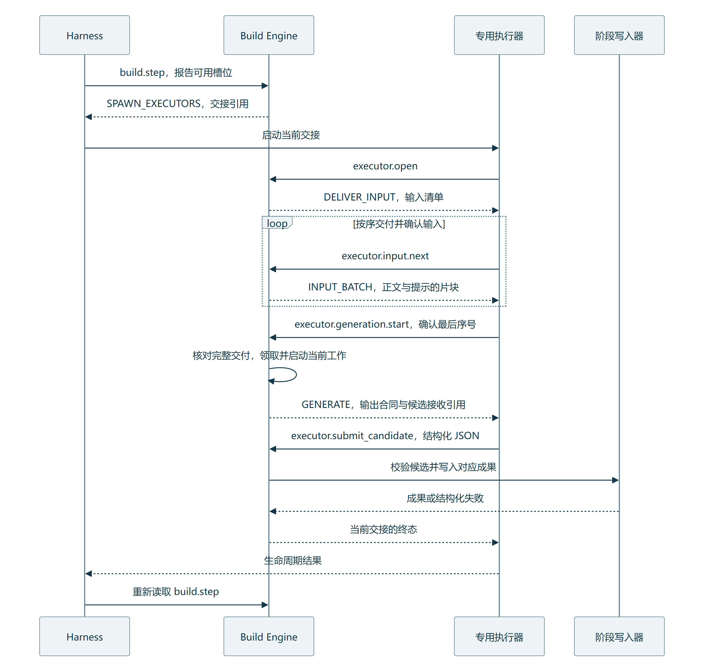

`executor.open` 解析交接，核对当前任务状态，返回输入清单。`executor.input.next` 随后分批交付语义提示和正文。每批有序号，执行器按协议确认已经收到的范围；重发同一请求有明确的重放语义。

这里的 chunk 是传输片块。它可能只是一个大输入在工具结果中的一部分，并不自动成为新的语义工作单元。执行器需要收齐本次工作所需的输入，才进入生成。分块交付解决单次工具结果装不下的问题；全部材料积累后的模型上下文仍受前面的执行预算约束。

[startAutomaticBuildExecutorGeneration](../../../packages/core/src/automatic-build-executor-session.ts) 要求最后一批已经提供，前面各批已经确认，最终序号与输入一致。完整交付后，它再检查当前任务与恢复身份，领取工作、记录输入观察，签发候选接收引用并返回 `GENERATE`。

候选接收引用把提交连接到具体会话、输入和输出合同。执行器将 JSON 值放进 `executor.submit_candidate`，由代码接收和写入；候选正文不会因为出现在子代理的最后一句话里就成为构建成果。

<a id="ch07-s7"></a>

### 领取、开始运行与生成尝试

任务状态需要区分“已经被某个执行者占有”和“已经开始处理输入”。租约记录前者，启动记录说明后者。

[automatic-build-lease.ts](../../../packages/core/src/automatic-build-lease.ts) 中的活动状态判断很短：

```typescript
  if (!("lease" in inspection)) return "pending";
  return readAutomaticBuildStart(target, inspection.lease_ref, inspection.lease)
    ? "running"
    : "reserved";
```

租约保存所有者、任务、尝试及有效期限；启动后另有开始时间与运行期限。运行心跳只能续展已经开始的活动租约。它们共同回答“这项工作现在由谁负责，当前执行是否仍然有效”。

在本章的四工具路径中，输入交付期还没有消耗一次语义生成尝试。完整输入确认并进入 `generation.start` 后，Engine 才推进领取与启动。因此，工具连接在输入还没交完时中断，不能直接解释为“模型已经生成失败一次”。对应[执行器会话测试](../../../packages/core/test/automatic-build-executor-session.test.ts)检查了各批输入交付后仍无 attempt，以及 generation.start 后才出现第一次尝试。

执行身份还区分语义尝试与租约代次。前者记录一次候选生成责任，后者处理同一责任的执行接管。具体如何在租约过期、候选已写入或响应丢失后恢复，留到第 8 章；本章先保留这两个维度，避免把所有重连都当作新的语义失败。

<a id="ch07-s8"></a>

### 候选通过写入器之后，完成才有可读取的依据

执行器提交候选后，Engine 先检查完整请求的大小和绑定，再把结构化值交给对应阶段的写入器。Pass1、BookStructure 等阶段各自执行格式、来源和任务合同的接纳规则。

[submitAutomaticBuildTaskCandidate](../../../skills/build/automatic-build.ts) 从租约取得任务绑定，并调用阶段写入器。[submitAutomaticBuildCandidate](../../../packages/core/src/automatic-build-mailbox.ts) 进一步核对该任务已有匹配的输入观察；写入器返回后，还检查成果文件确实存在，以及成果身份与当前任务相符，随后保存 committed 回执。

于是，完成有三个层次。当前交接结束是执行器生命周期事实；候选 committed 是某个工作单元的成果事实；控制层 `build.step` 返回 DONE，才表示当前构建计划完成。阶段质量、发布和关闭仍由 Engine 推进，子代理 final 不承担这些判断。

失败反馈也需要能够改变下一步。若写入器得到可纠正的字段错误，下一次生成可以收到 `code`、`json_pointer` 和 `expected`，指出哪里不符合合同。比如[现有测试](../../../packages/core/test/automatic-build-executor-session.test.ts)构造了 key-stop 的 `type` 填成 `application` 的情况：`application` 可以是章节角色，却不是这里允许的重点类型；反馈指出字段位置及允许值，后续尝试按原合同纠正。

[readAutomaticBuildCandidateRetryFeedback](../../../packages/core/src/automatic-build-task-store.ts) 只从同一尝试范围内的相关失败提取这类反馈。内部写入异常和可纠正候选错误分别记录。这样的区别使执行器能够修正自己的字段，同时保留需要由构建系统处理的故障原因。

<a id="ch07-s9"></a>

### Codex 与 DeepSeek Harness 适配什么

换一个 Harness 时，源位置、候选格式和阶段接纳规则可以继续由同一个 Engine 管理；宿主的模型配置、子代理对象、工具传输与取消机制则需要相应适配。

当前 [build-execution-profile.ts](../../../packages/core/src/build-execution-profile.ts) 定义了两种固定身份的执行配置：

| 配置项 | Codex | DeepSeek Harness |
| --- | --- | --- |
| 配置身份 | codex_mcp_v3@1 | dsh_native_v4@1 |
| Session 响应版本 | V3 | V4 |
| transport profile 版本 | V2 | V3 |
| 每次输入交付批次最多片块 | 8 | 1 |
| 每批 MCP 序列化字节上限 | 65536 | 16384 |

这组字段来自项目的执行配置，描述它采用的传输合同。它们与模型实际上下文和输出能力分别绑定。调用者通过已发布的配置身份选择，不能临时填一个更大的容量数字来改变注册配置。

DSH 的[插件入口](../../../packages/dsh-plugin/src/index.ts)先与已安装 Engine 协商能力，再注册准备确认和前台继续执行入口。[build-control.ts](../../../packages/dsh-plugin/src/build-control.ts)负责计算实时可用容量，启动专用 child、等待终态、记录观察并释放资源。一个 child 完成后可以补位；达到本次调用边界时，先等自己拥有的工作收尾，再返回可继续的 invocation 引用。

模型路由和输出配置由 Harness 提供并按 invocation 保存，Engine 持续决定构建下一步。[ADR-0138](../../adr/0138-multi-harness-prebuild-and-deepseek-harness-adapter.md)将这种分工作为多宿主适配的基础。安装能力、确定性闭环和真实模型验收各自有证据范围，不能仅凭配置常量存在就宣布完整支持。

<a id="ch07-s10"></a>

### 已知边界与验证范围

本章依据 2026-10-07 的工作区，公共自动构建协议为主要讲解范围。旧版本入口和私人产物另有分支。LID 分片算例从已经进入模型路由的源节点开始，第 4 章记录的根级超预算叶子在窗口阶段遗漏属于更前面的输入问题，本次写作未修复该实现。

项目当前 token 估算器按确定性文字权重计算，不是所有模型的真实 tokenizer。预算依据证明输入符合这一估算及配置合同；协议确认记录输入交付，不能证明模型已经理解全部内容；候选结构接纳也不等于语义质量已经得到证明。

114/44 的容量问题来自 BSR7 的既有真实记录，本次没有重跑模型生成。小段落切片、候选容量和两类预算失败则实际调用了当前确定性函数。教学渲染与封套已说明为合成输入，没有将它们冒充生产任务的容量测量。

[DSH 兼容报告](../../performance/dsh-prebuild-compatibility-20260925.md)记录，DH1—DH5 已有相应实现和确定性验收，技术书完整闭环使用脚本模型与真实源码 Engine；小型真实模型往返只验证较小范围。该报告仍保留 DH0 人工“要求修改”和 DH6 独立分发、真实模型完整构建等未完成项。本章据此介绍已实现的适配分工，不作完整发布支持声明。

<a id="ch07-s11"></a>

### 源码选读与面试表达

| 入口 | 关键符号 | 阅读时要回答的问题 |
| --- | --- | --- |
| [模型输入片](../../../packages/core/src/model-input-slice.ts) | routeModelInputSlices、validateModelInputSliceCoverage | 责任范围和可见上下文怎样同时保留？ |
| [执行预算](../../../packages/core/src/model-input-budget.ts)与[传输合同](../../../packages/core/src/executor-transport.ts) | evaluateModelExecutionBudget、createCandidateTransportContract | 哪个限制导致这次工作放不下？ |
| [工作描述](../../../packages/core/src/stage-work-unit.ts)与[批次规划](../../../packages/core/src/automatic-build-dispatch.ts) | WorkUnitDescriptorV4、planAutomaticBuildExecutorDispatches | 输入身份怎样一路进入派发？ |
| [执行器会话](../../../packages/core/src/automatic-build-executor-session.ts) | openAutomaticBuildExecutorSessionV3、nextAutomaticBuildExecutorInput、startAutomaticBuildExecutorGeneration、submitAutomaticBuildExecutorCandidateV3 | 收到输入、开始生成和接受结果分别发生在哪里？ |
| [租约](../../../packages/core/src/automatic-build-lease.ts)与[候选提交](../../../packages/core/src/automatic-build-mailbox.ts) | inspectAutomaticBuildTaskActivity、startAutomaticBuildLease、submitAutomaticBuildCandidate | 所有权和成果回执怎样成为持久状态？ |
| [Driver](../../../skills/build/automatic-build-driver.ts)与[DSH 控制器](../../../packages/dsh-plugin/src/build-control.ts) | automaticBuildStep、createBuildControl | 构建决策与宿主生命周期由谁负责？ |

[切片测试](../../../packages/core/test/model-input-slice.test.ts)、[预算测试](../../../packages/core/test/model-input-budget.test.ts)和[派发测试](../../../packages/core/test/automatic-build-dispatch.test.ts)分别覆盖范围、容量和批次边界；[执行器会话测试](../../../packages/core/test/automatic-build-executor-session.test.ts)覆盖输入期无生成尝试、完整确认、字段纠错及当前交接终态。本次写作阅读了相关用例，未运行这些产品测试套件。

**为什么不按模型容量直接重新生成 LID？**

LID 服务引用、批注和来源身份，容量服务一次执行。保留父 LID、改变模型输入片，能够调整工作量并维持原有来源关系；核心范围的完整覆盖另由程序检查。

**为什么输入能放下，任务仍然可能被拒绝？**

生成输出、候选请求封套、单次工具结果及累计输入都有容量约束。应先定位失败属于哪一层，再改变相应分组或合同。章节引用过长时，保留选择含义的分段提交比反复缩短摘要更有效。

**批次更大、执行器更多，是否一定更快？**

批次改变一次承接的工作量，并发改变同时占用的资源。前者可能减少组织成本但延长序列，后者受宿主容量和阶段依赖约束。需要观察真实等待、任务时长及完成路径，不能只看启动了几个 Agent。

**为什么要收齐输入以后才开始计生成尝试？**

输入交付失败与模型候选失败需要不同的恢复动作。把 generation.start 放在完整交付之后，使一次语义尝试对应清楚的输入和输出责任；重连的影响也可以与重新生成分开记录。

**子代理说完成后，根 Agent 为什么还要读 Engine？**

子代理终态只说明该执行过程结束。候选是否接受、是否还有下一单元、阶段是否发布，都由持久构建状态决定。根 Agent 依据重新计算的下一步行动，才能保持对整体任务的准确判断。

执行现在已经形成一条可以追踪的链路：预算允许的工作被派发，输入完整交付，候选经过写入器形成回执。[第 8 章《构建恢复与成果发布》](#ch08)继续追问，当进程中断、输入变化或只完成部分任务时，哪些结果仍然有效，以及它们何时能够正式发布给阅读侧。


---

<a id="ch08"></a>

## 第 8 章 构建恢复与成果发布

沿着上一章的三个输入片继续思考。假设前两个片的候选已经被接受，第三个片正在执行时，构建进程中断了。重新打开项目后，用户希望继续完成这本书：已做好的工作应当保留，未完成的工作需要接续，阅读侧最终应当看到一份完整、可解释的成果。

这是一个教学场景。它把恢复问题分成了三个判断：哪些计算仍然有效，哪些执行已经失去所有者，以及哪些结果已经正式发布。三个判断使用的证据不同。一个成果文件可以仍然有效，而写出它的旧执行器已经结束；一组任务可以全部完成，而公开文件还没有组装；某阶段可以已经关闭，而构建计划仍有后续阶段。

本章沿这条链路解释恢复与发布。到章末，应当能够说明：为什么搬一个目录可以保留成果，却不能继续使用旧租约；为什么同一个候选可以重放提交，却不能换一份内容冒充原提交；为什么阶段收口成功后还要重新规划；以及工作区中的公开文件怎样进入网络阅读服务的一次不可变发布。

<a id="ch08-s1"></a>

### 恢复先要确定继续处理哪份材料

构建工作区不仅保存生成结果，也保存生成结果所依据的材料。技术书的工作区位于 `.understand-book/<book_id>`，规范正文、位置树、来源清单和必要附件共同形成继续构建的基础。

当前 [technicalLearningTargetFromWorkspace](../../../packages/core/src/build-orchestrator.ts) 会读取工作区内部的 `source.txt`、`base.json`、`source_manifest.json` 和 `profile_metadata.json`，核对材料与 profile 的归属。Markdown 续建使用内部正文。EPUB 若有内部包快照，则从来源清单的相对 `snapshot_path` 或 `source.epub` 读取，并核对包中的规范正文与 `source.txt` 一致。

这样，用户在工作区外编辑、删除或移动最初导入的文件，不会悄悄改变这次续建的输入。外部原文件路径保留来源记录，实际续建消费已经导入的快照。

EPUB 还有一个容易忽略的细节：规范正文未必保留 Markdown 标题标记。若旧工作区缺少包快照，[loadBookSource](../../../packages/core/src/book-source.ts) 会结合已有 `base.json.lid_nodes` 恢复结构，而不是把 `source.txt` 当作一份新 Markdown 重新切分。否则文字相同，位置树却可能变化，前面章节建立的来源关系就无法继续沿用。

工作区内的几类材料各自回答不同问题：

| 材料 | 恢复时回答的问题 |
| --- | --- |
| 规范正文、来源清单、位置树和附件 | 正在处理哪份材料，引用怎样定位？ |
| 冻结的工作描述与策略代次 | 当时要求模型完成什么，依据什么规则？ |
| 已接受的语义成果信封 | 哪项计算产生了什么结果，是否仍适用于当前任务？ |
| 租约、输入观察、尝试与提交回执 | 哪次执行持有任务，走到了哪一步？ |
| 阶段公开文件、质量报告与关闭结果 | 哪些内容已经组装，当前阶段是否具备完成条件？ |

恢复由这些持久材料重新计算下一步。最后一条进度消息可以帮助理解现场，但它本身不能代替成果和状态。

<a id="ch08-s2"></a>

### 文件存在之后，还要判断成果是否有效

第 7 章的候选写入器会生成语义成果信封。当前 [SemanticArtifactEnvelopeV3](../../../packages/core/src/semantic-artifact.ts) 除了 payload，还保存目标、阶段、工作单元、输入身份、策略代次、语义合同、成果摘要和生成来源。

这些字段不是另一份业务正文。它们使系统能够回答：“眼前这个结果，是否就是当前这一项工作可以使用的结果？”

[semanticArtifactMatches](../../../packages/core/src/semantic-artifact.ts) 首先比较书籍、来源、profile、阶段、工作单元和输入，再核对 payload 与保存的成果摘要。对于 V3 信封，还要匹配策略代次和语义合同。合同包括 profile 版本、阶段策略、路由版本、提示、schema 和质量档位。

目录地址在这里有一个特殊地位。[sameBuildContent](../../../packages/core/src/semantic-artifact.ts) 的实现为：

```typescript
  return left.version === right.version
    && left.book_id === right.book_id
    && left.profile_id === right.profile_id
    && left.input_fingerprint === right.input_fingerprint;
```

这段比较没有工作区绝对路径。完成的计算属于这份书籍内容；文件搬到另一处，并不会自动改变计算含义。稍后会看到，执行中的租约仍然核对具体位置，两者采用不同的归属规则。

本书使用现有确定性 Pass1 夹具生成一份已接受的 V3 成果，再逐项改变匹配条件，实际得到：

| 期待条件的变化 | 当前成果直接匹配 |
| --- | --- |
| 输入与策略均保持不变 | 是 |
| 只改变 workspace_dir | 是 |
| 改变 book_id | 否 |
| 改变 input_hash | 否 |
| 改变 schema_version | 否 |
| 改变 policy_generation_id | 否 |

这个算例只改变匹配函数的期待条件，用来隔离“成果属于谁”的判断；它没有实际搬动整个工作区。完整搬迁续建的项目记录将在后面介绍。

这里也能看出输入身份为什么重要。模型的结果受它看到的全部任务输入影响，包括最终没有引用的上下文。如果只比较输出中的来源 LID，就可能把输入已经变化的旧判断继续当成当前判断。

<a id="ch08-s3"></a>

### 策略升级需要说明旧结果怎样进入新任务

当提示、schema、路由或任务划分变化时，旧文件仍然是历史成果，但它未必直接满足当前合同。项目用策略代次保存这一变化，并通过迁移回执表达采用或重建的决定。

[ADR-0100](../../adr/0100-budget-routable-model-work-units-and-truthful-build-recovery.md)记录了 Pass1 路由升级时的取舍。旧窗口需要进入新的预算与切片机制：无条件重做全书会丢弃相同输入上的有效计算；直接把旧成果标成新鲜，又会跳过新的路由约束。

当前 [recordAutomaticBuildPolicyMigration](../../../packages/core/src/automatic-build-policy-generation.ts) 中，旧 V2 单元的迁移先核对当前工作描述和预算依据，再读取旧成果及其完整渲染输入。已有活动租约时先返回阻塞；旧输入无法核实时，也不能宣布精确采用。书籍来源、单元类型、语义策略或渲染输入改变，会进入相应的重建决定。

只有满足这条迁移路径的采用条件，才记录 `adopt_exact`：新旧任务的完整渲染输入逐字相同，提示、schema、质量等语义要求兼容，而且新任务已经通过当前路由约束。迁移随后通过明确回执把来源成果接到当前代次，旧成果及其来源关系继续保留。

这是对“直接匹配失败”的进一步处理。上一节改变代次得到“否”，说明旧信封不能直接冒充新信封；经过当前实现支持的迁移判定后，仍可能采用它。对较早 V3 成果，项目还提供 [recordAutomaticBuildPriorGenerationAdoption](../../../packages/core/src/automatic-build-policy-generation.ts)，按已有成果与当前合同判定是否能够明确采用。

普通续建、策略升级和内容改版由此有了不同入口。前两者已有相应实现；正文修订后的跨版本段落对应与大范围增量复用，还需要后文所述的新版机制。

<a id="ch08-s4"></a>

### 一次中断不一定是一次语义失败

上一章已经把输入交付、领取和生成分开。恢复时还需要看中断发生在哪一步。

[inspectAutomaticBuildTaskClaim](../../../packages/core/src/automatic-build-lease.ts) 先寻找当前目标和任务范围内仍有效的租约。任务已有有效所有者时，调用方得到 `already_leased`；没有可继续使用的活动租约，才通过 [nextAutomaticBuildExecutionIdentity](../../../packages/core/src/automatic-build-task-store.ts) 计算下一次执行身份。

这个身份包含 `semantic_attempt` 和 `lease_epoch`。前者表示候选生成的语义尝试，后者表示该尝试内的执行接管。下面是当前分支所表达的区别：

| 中断或返回的状态 | 恢复依据与下一步 |
| --- | --- |
| 四工具协议尚在交付输入 | 尚未创建语义尝试；继续核对当前交接并完成输入交付 |
| 已开始执行，租约仍有效 | 等待原执行，不直接另领同一任务 |
| 没有语义失败结果，旧租约已过期 | 保持语义尝试，增加租约代次，例如 `(1,1) → (1,2)` |
| 当前尝试已有候选失败结果，仍在重试额度内 | 下一次语义尝试增加，租约代次从 1 开始，例如 `(1,2) → (2,1)` |
| 候选已经 committed，但返回响应未被收到 | 按原提交身份重放，读取已有回执 |

接管同一语义尝试，仍可能需要重新调用模型。两个计数的目的，是区分模型候选失败与执行器失联，并据此采取不同恢复动作；它们不保证进程内的模型上下文能够原样复活。

提交重放也有明确条件。[submitAutomaticBuildCandidate](../../../packages/core/src/automatic-build-mailbox.ts) 在找到已有回执时，核对候选内容身份和尝试范围，随后返回原回执并补齐成功记录。相同提交可以恢复响应，内容不同的提交则发生冲突。

[执行器会话测试](../../../packages/core/test/automatic-build-executor-session.test.ts)覆盖了这个区别：同一个结构化候选再次提交，返回与第一次相同的结果；语义尝试仍为 1，提交修订记录增加到 2。换一份候选不能借用已经提交的身份。[租约测试](../../../packages/core/test/automatic-build-lease.test.ts)则覆盖过期后接管，保持语义尝试 1、进入租约代次 2。

<a id="ch08-s5"></a>

### 重试停止时，系统需要给出可行动的原因

重试次数不能把所有失败都变成成功。无效字段可以纠正，暂时的 Provider 故障可能值得重试，执行器反复失联需要处理宿主，而合同本身不适用时要改变策略。

[automaticBuildRetryBoundaryRequiredRecovery](../../../packages/core/src/automatic-build-attempt-recovery.ts) 把这几种情况分开：暂时的 Provider 失败可进入 `authorize_transient_retry`，可纠正候选失败可进入 `authorize_candidate_retry`，其他 schema 或证据失败可能要求 `publish_new_policy`，剩余情况交给 `operator_fix`。输入交付和候选接收通道的失败不能直接创建语义重试耗尽边界。

需要在同一范围再开一个重试窗口时，恢复回执绑定原失败、尝试范围和具体决定请求。旧失败因此仍然可解释，而不是通过清空计数把它抹掉。

路由、迁移和阶段收口的预期阻塞使用另一类 [AutomaticBuildRecoveryEnvelopeV1](../../../packages/core/src/automatic-build-recovery.ts)。它携带阶段、稳定错误码、受影响单元、相关预算、是否可重试，以及允许的恢复动作。例如，发布回执不合法返回 `publication_receipt_invalid`，发布后的条件不成立返回 `stage_close_postcondition_failed`；两者都会指向 `inspect_publication`。

这使上层能够展示具体处理方向，并在条件改变后继续规划。结构化原因没有授权系统擅自降低质量、修改原文或扩展已确认计划；恢复仍沿原来的构建范围推进。

<a id="ch08-s6"></a>

### 把已接受成果组装成一组公开文件

一个工作单元的 committed 回执，只证明这一项候选已经经过写入器接纳。阶段公开文件则可能聚合许多单元。例如，BookStructure 要把发现、章节选择、主题和关系等贡献组装成阅读侧可以消费的 `book_structure.json`。

阶段发布由 [publishAutomaticBuildArtifactSet](../../../packages/core/src/automatic-build-publication.ts) 处理一组预期文件。它先在临时目录写候选文件，运行调用方提供的候选检查，再逐个备份旧文件、替换正式文件，全部成功后写入 committed 发布回执。可捕获的替换异常会撤回已经替换的文件，并恢复相应备份。

发布回执列出文件相对路径、字节数和内容摘要，事务身份由阶段及这份有序清单确定。这里的摘要用于识别同一组预期字节，并决定能否直接返回已有回执，或者需要重新写出正式文件。

如果相同事务已有回执，发布器仍会检查当前正式文件是否匹配。匹配时可以直接重放结果；文件缺失或被改动时，会重新发布预期字节。这避免把“历史上成功过”当成“当前公开文件仍然正确”。

本书在独立临时目录中，用两份带新旧标记的 JSON 演示发布器。文件名采用 `base.json` 与 `profile_metadata.json`，内容只是教学标记，不承担正式 Pass1 schema 验证。实际结果如下：

| 操作 | 公开文件结果 | 发布结果 |
| --- | --- | --- |
| 替换第 1 个文件后注入异常 | 两份旧文件均保留 | 抛出本次注入的异常 |
| 去掉故障后重试 | 两份文件均为新内容 | committed，清单包含 2 个文件 |
| 原样再次发布 | 两份文件仍为新内容 | 返回同一事务身份 |
| 改动其中一个正式文件后再发布 | 被改动的文件恢复为预期新内容 | 仍为同一事务身份 |

这个例子展示的是发布字节、异常回滚与重放。正式阶段还要证明这些字节确实来自当前有效成果，这由收口过程连接起来。

<a id="ch08-s7"></a>

### 收口把发布前后的证据连接起来

[closeAutomaticBuildStage](../../../packages/core/src/automatic-build-close.ts) 先构建阶段快照，收集当前质量报告。报告通过后，保存报告并运行阶段组装脚本。脚本需要返回可解析的阶段批次结果，其中引用已经写入的发布回执。

接下来，收口函数核对回执身份和本阶段允许的公开路径，再读取正式文件，比较字节数与内容摘要。随后它重新计算阶段快照、质量、策略与覆盖情况。当前源码中的关键判断为：

```typescript
  if (!postStage.closed
    || postQuality.gate_status !== "passed"
    || postQuality.digest !== preQuality.digest
    || canonicalBuildJson(postEvidence.policy_contracts) !== canonicalBuildJson(preEvidence.policy_contracts)
    || postEvidence.coverage_digest !== preEvidence.coverage_digest
    || !freshness?.fresh
    || !freshness.freshness_digest) {
    return closeRecovery(
      input.target,
      input.stage,
      "post_close",
      "stage_close_postcondition_failed",
    );
  }
```

这段比较连接了两侧的事实：发布前获准组装的是哪组贡献，发布后是否仍然是同一组有效贡献，以及公开阶段是否已经关闭。它能发现发布过程中成果变化、公开文件缺失或质量状态漂移等问题。

质量报告也包含几类不同证据。[collectAutomaticBuildStageQuality](../../../packages/core/src/automatic-build-quality.ts) 读取当前任务成果，再由相应评估函数检查工作单元计数、预算依据、原文覆盖、归并关系、成果完整性和既有质量下限。原文范围无缺口、无核心重叠，与候选内容质量分别记录。

新鲜度不是“文件最近写过”。[inspectAutomaticBuildStageFreshness](../../../packages/core/src/build-orchestrator.ts) 使用已经重算的阶段 `closed` 状态，结合当前目标和策略形成新鲜度身份。各阶段的关闭条件由各自实现提供。例如，BookStructure 会把公开文件与当前组装结果逐字比较，并寻找对应发布回执；通用收口则额外完成上述发布前后核对。

这还有一个与第 6 章相关的细节：BookStructure 从 `ready` 变成 `published` 是发布状态变化。质量报告把该观察放在质量摘要之外，避免仅仅因为发布成功，就让发布前后的同一份质量证据变成不同身份。

本书还调用当前收口函数，使用现有 512-token 合成段落夹具与固定候选准备 Pass1，实际得到三种结果：

| 阶段脚本及发布后的状态 | 收口结果 | 后续方向 |
| --- | --- | --- |
| 返回合法发布结果，正式文件与当前成果匹配 | closed | replan |
| 只返回“wrote base.json”一类普通日志 | publication_receipt_invalid | inspect_publication |
| 已有回执，但返回前删除正式 base.json | stage_close_postcondition_failed | inspect_publication |

第一种成功结果保存质量、发布和后置条件的身份，`next` 明确为 `replan`。本次重算后的下一动作实际是 `extract / profile_sidecar`，并没有宣布整本书完成。

<a id="ch08-s8"></a>

### 当前计划完成，是另一层判断

为什么收口只返回重新规划？因为当前阶段无法替其他阶段证明完成，也不知道已确认计划是否还要求私人产物。

[nextAutomaticBuildAction](../../../packages/core/src/build-orchestrator.ts) 沿阶段顺序读取当前快照：已关闭的阶段跳过；仍需准备的阶段返回相应边界；有待办任务时安排抽取；没有待办但尚未关闭时安排收口。所有纳入此次判断的阶段都完成后，才得到内部 `done`。

有明确 BuildPlan 时，执行范围还受到已确认的阶段依赖闭包限制。计划声明复用的公开成果也要与当前新鲜度相符，发生漂移则进入计划边界，不能继续沿用旧的完成判断。

[automaticBuildStep](../../../skills/build/automatic-build-driver.ts) 收到阶段收口的 `next: replan` 后继续读取当前状态。内部公共阶段完成后，它还处理计划要求的私人产物；只有这些工作也结束，才对 Harness 返回 `DONE`。

因此，这里的 DONE 表示本次已确认计划完成。不同阅读目标可能要求不同成果集合，不应把每一次 DONE 都解释为“项目能生成的全部能力都已经齐备”。

<a id="ch08-s9"></a>

### 搬迁保留成果，重新建立执行归属

现在可以回到开篇的恢复场景。若用户把完整工作区复制到另一处，前两个片的已接受结果仍属于同一书籍、来源与策略，可以参与新位置的规划。第三个片的旧租约却不能自动成为新位置的执行权。

当前 [automatic-build-task-store.ts](../../../packages/core/src/automatic-build-task-store.ts) 读取历史尝试时，会识别执行记录的原位置。复制来的记录仍保留物理序号，避免覆盖历史目录，但不消耗新位置的租约或语义重试额度。[readAutomaticBuildLease](../../../packages/core/src/automatic-build-lease.ts) 则核对包含工作区位置的完整目标，旧 token 和复制后的旧租约都不能直接代表新运行。

冻结任务可以经 [relocateGenerationTask](../../../packages/core/src/semantic-artifact.ts) 在内存中投影到当前地址。原成果信封保留历史归属，当前写入器仍按当前目标接纳新结果。

关闭结果也分别保存。发布事务由预期字节确定，搬迁后相同字节可以保留事务身份；关闭时的新鲜度身份包含当前构建位置，因此记录位于：

```text
.build/automatic-build/v2/close/<stage>/<transaction_id>/<freshness_digest>.json
```

这样，同一组成果在新位置重新核对，不会覆盖旧位置的关闭记录。

[2026-10-01 的 U1—U2 验证记录](../../performance/workspace-u1-u2-20261001.md)提供了完整链路的已有证据：两章材料完成一项 Pass1、领取另一项后复制工作区，新位置只调度未完成项，原位置的旧提交被拒绝。另一个用例使用 29 章 BookStructure 生产夹具，搬迁后没有待抽取任务；删除新目录的公开结构文件后，经正常 close 入口从已完成成果重发 82,514 字节，结果与原输出完全一致。

这说明公开文件丢失与模型成果失效是两种不同故障。前者在已有有效贡献时可以重新组装，未必需要再次付出模型生成成本。

<a id="ch08-s10"></a>

### 工作区发布怎样进入不可变的阅读版本

阶段发布会更新构建工作区中的公开文件。网络阅读服务还需要固定一组可供多个用户、现场和运行共同使用的材料，对应第 3 章的 `PublishedBookRef`。

[PublishedLibrary::publish](../../../crates/server/src/published_library.rs) 是这层入口。它将所需正文、成果及附件复制到暂存目录，加载 Book，读取现有构建 readiness。只有 readiness 的路由允许进入 Reader，才继续建立发布对象。

这里的阅读就绪与完整教学就绪分别表达。当前 [build_workbench_snapshot](../../../crates/server/src/lib.rs) 对论文材料检查可信来源与基础成果，已有技术书走对应入口；发布清单另外保存 `teaching_readiness`。材料可以进入阅读，不能据此推导所有教学能力都已就绪。

每次发布创建新的 `publication_id`，将 `book_id`、来源、文件清单、能力、成果版本及 readiness 写入 `publication.json`。随后，代码把暂存目录移到正式位置，封为只读，最后在数据库事务中登记发布并更新默认发布。

文件就位与登记之间的顺序使阅读入口有明确边界：数据库登记成功之后，库才暴露这个发布。登记前中断可能留下未登记目录，但它不会成为一个可读取的半成品条目。[网络发布测试](../../../crates/server/src/tests/mu3_tests.rs)包含登记失败不产生默认发布和已登记条目的用例。

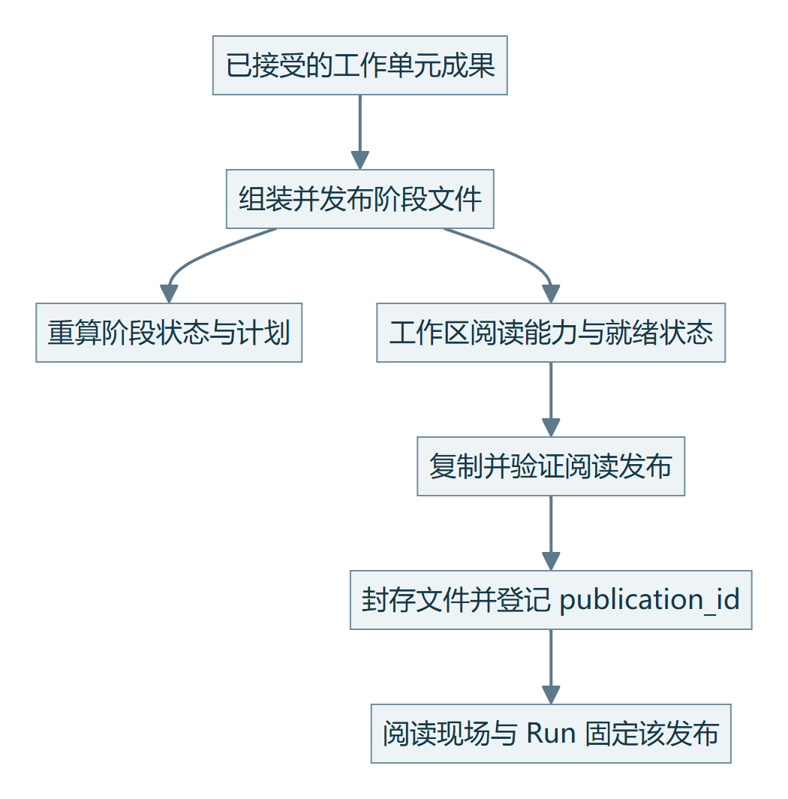

这两层发布使用不同身份。阶段发布的事务身份对应同一组预期字节，所以重复发布可以返回同一事务；网络阅读发布为一次固定快照分配新的 publication_id。默认发布切换后，原现场或运行已经持有的发布引用仍然指向原版本，历史回答也保留当时的归属。

同一个 book_id 可以在原文不变时获得更完整的能力，再产生一次发布。规范正文、PDF 或来源图片改变时，当前网络发布器要求使用新的 book_id，并返回 `BOOK_CONTENT_CHANGED` 阻止覆盖原内容身份。

[ADR-0146](../../adr/0146-portable-build-workspaces-and-incremental-book-updates.md)进一步规划了正文改版后的增量更新：建立新旧段落对应，重算新版任务的完整输入，对能够重绑且输入等价的结果做复用，并让历史引用继续保留原始归属。该方案当前完成 U1—U2 搬迁续建，U3—U11 尚待实施。已有不可变发布机制，为版本并存提供基础；它还不能代替完整的新版构建、跨版引用与私人学习记录衔接。

<a id="ch08-s11"></a>

### 已知边界与验证范围

本章依据 2026-10-07 的工作区，重点解释公共构建中的语义成果、通用阶段发布与收口。教学阶段有专用关闭路径，paper reading guide 使用验证路径，它们的结果也回到重新规划；具体教学规则留到后续章节。

当前阶段发布器逐文件执行替换，其回滚依赖捕获异常。进程被强制终止时，catch 不会继续执行，工作区中的正式文件可能停在中间状态。本章实际验证了可捕获异常的回滚与后置条件拒绝，没有验证强制终止后的完整自动修复；这条实现不能当作文件系统层面的多文件原子事务。网络发布则通过封存后登记，控制阅读库何时暴露新版本。

U1—U2 的搬迁仍要求保留工作区结构与 book_id，活动 invocation 和执行器不会迁移归属。旧 EPUB 若丢失原包，而旧任务绑定的恰是包字节身份，不能用正文身份代替，需要恢复原包或重建。

本次确定性重放使用固定候选与现有夹具，验证成果匹配、发布重放和阶段收口；没有评价真实模型的语义质量。已有租约、提交、收口及网络发布用例为源码阅读，没有运行完整产品测试或付费模型，也没有重新执行 U1—U2 历史实验。

<a id="ch08-s12"></a>

### 源码选读与面试表达

| 入口 | 关键符号 | 阅读时要回答的问题 |
| --- | --- | --- |
| [来源与阶段快照](../../../packages/core/src/build-orchestrator.ts) | technicalLearningTargetFromWorkspace、inspectAutomaticBuildStageFreshness、nextAutomaticBuildAction | 当前材料从哪里读取，阶段状态怎样决定下一步？ |
| [语义成果](../../../packages/core/src/semantic-artifact.ts) | sameBuildContent、semanticArtifactMatches、relocateGenerationTask | 内容归属怎样与目录位置分开？ |
| [策略迁移](../../../packages/core/src/automatic-build-policy-generation.ts) | recordAutomaticBuildPolicyMigration、recordAutomaticBuildPriorGenerationAdoption | 旧结果通过什么条件成为当前可用贡献？ |
| [执行记录](../../../packages/core/src/automatic-build-task-store.ts)与[租约](../../../packages/core/src/automatic-build-lease.ts) | nextAutomaticBuildExecutionIdentity、inspectAutomaticBuildTaskClaim | 语义失败、执行接管和物理目录编号怎样区分？ |
| [候选接纳](../../../packages/core/src/automatic-build-mailbox.ts)与[重试边界](../../../packages/core/src/automatic-build-attempt-recovery.ts) | submitAutomaticBuildCandidate、automaticBuildRetryBoundaryRequiredRecovery | 响应丢失怎样重放，何时必须改变恢复动作？ |
| [阶段发布](../../../packages/core/src/automatic-build-publication.ts)与[收口](../../../packages/core/src/automatic-build-close.ts) | publishAutomaticBuildArtifactSet、closeAutomaticBuildStage | 预期字节、公开文件与完成证据怎样相互对应？ |
| [阅读发布库](../../../crates/server/src/published_library.rs) | PublishedLibrary::publish、PublishedBookRef、PublicationManifest | 什么时刻暴露新版本，旧运行为何仍能读取原发布？ |

**构建中断后，你怎样避免把已完成工作全部重跑？**

先从导入快照和当前策略重建任务，再检查已有成果是否与当前输入、任务和合同匹配。有效贡献继续参与组装，未完成任务重新调度；公开文件丢失时先判断能否从有效成果重新发布。追问若变成“正文已经改了”，就需要进入版本对应与完整输入比较，不能直接套用搬迁复用。

**为什么租约过期不直接增加模型失败次数？**

租约过期说明原执行不再有效，还不能证明它生成了错误候选。项目用语义尝试记录候选失败，用租约代次记录接管。追问若执行器一直失联，仍有独立的接管上限与恢复边界，不能无限循环。

**如何解释重复提交不会多写一次结果？**

对已经形成 committed 回执的同一候选，提交路径核对候选身份与尝试范围并返回原回执。换一份候选会冲突。这个保证针对明确的提交身份与已有回执；不能把它扩大为任意进程中断点上的所有副作用都只发生一次。

**为什么阶段发布成功后还要做后置检查？**

阶段脚本只负责它的组装与写入过程。收口还要证明实际文件对应回执、当前任务和质量没有漂移，而且阶段状态已经关闭。成功后重新规划，继续执行后续阶段。追问若“脚本退出码是 0”，需要继续寻找结构化发布结果，而不是从退出码推断完整成果。

**为什么既有 book_id，又有 publication_id？**

book_id 固定内容基座，publication_id 固定该基座一次可消费的成果快照。同一原文可以逐步补齐能力，旧运行继续持有旧发布。正文或来源附件改版则需要新内容身份；未来跨版复用也必须保留历史引用原来的归属。

至此，第 4—8 章已经把规范原文、语义贡献、全书结构、执行和发布连成一条构建链路。接下来的[第 9 章《一次有证据的回答》](#ch09)回到读者的一次提问，追踪已经发布的材料怎样进入当前运行，以及哪些来源真正成为这次回答的证据。


---

<a id="ch09"></a>

## 第 9 章 一次有证据的回答

设读者正在阅读一本技术书，选中一段话，提出这样的请求：“解释这里的结论与前面介绍的概念有什么关系，把关键区别记成一条笔记。”

要完成这项任务，系统需要理解当前选区，找到前文，取得足够的材料，形成解释，并执行笔记保存。读者还应能够从回答回到原文。随后的一次追问，则需要知道前一轮已经讨论了什么、实际保存了什么。

本章沿着这条任务链理解阅读 Agent。我们先看输入怎样固定，再看线索怎样成为证据，最后追踪回答、动作与历史保存。这个场景用于说明各机制的联系；模型在具体运行中可以根据已有信息选择不同的工具路径。

如果希望先建立全貌，可以依次阅读[第 1 章](#ch01)、[第 2 章](#ch02)和[第 3 章](#ch03)。其中第 3 章解释本章使用的发布身份、用户状态、阅读现场和 RunScope。

[第 4 章](#ch04)和[第 5 章](#ch05)进一步说明材料位置与语义线索怎样产生，[第 6 章](#ch06)解释全书路线、候选召回和构建期交付记录。本章则从具体问题出发，追踪这些成果怎样成为本轮实际观察的证据。

[第 7 章](#ch07)中的执行器会话负责构建任务的交付与接纳；本章的 Run 则服务读者的一轮提问。两者各自拥有任务状态，不能把构建的生成尝试直接当作读时 Agent 的采样轮次。

[第 8 章](#ch08)进一步说明这些成果怎样恢复、收口并形成阅读发布。本章从读者已经打开材料的现场开始，追踪所用发布中的内容如何成为当前回答的证据。

<a id="ch09-s1"></a>

### 提问需要一个确定的阅读现场

“这里”和“前面”都依赖读者的阅读现场。单独把问题文字送给模型，会丢掉这些指代的依据。因此，处理一次提问首先需要确定材料、聊天、位置和选区。

在 Server 中，prepare_agent_chat 校验输入并接纳本轮消息，随后通过 RunScope 保存这次运行的归属。它包含用户、阅读现场及其 generation、聊天、回合、书籍引用、存在时的发布对象，以及提问时的阅读状态、引文和演示追问现场。运行据此知道后续结果应回到哪里。

这里的固定具有实际作用。读者发出问题后，模型可能需要一段时间才能回答；等待期间，读者仍然可以操作界面。如果后续工具总是读取宿主“此刻打开的书”或“此刻选中的聊天”，任务就可能从最初的问题滑到另一个现场。RunScope 保留原归属；需要修改阅读现场时，代码再检查当前现场是否仍与原运行一致。

这形成了两类访问。一类使用提问时固定的输入，让模型解释当时的问题；另一类操作当前权威状态，让笔记和阅读动作真正发生。两者通过明确的归属检查连接起来。

同一用户在另一个窗口打开一本书，是项目支持的正常使用。理解 RunScope 的价值，最直接的办法就是沿这种场景追踪：原运行持有哪份 Book，读取哪段输入，动作经过哪个现场检查，最终提交到哪个聊天。

<a id="ch09-s2"></a>

### 一轮运行怎样持有自己的信息

提问被接纳以后，Runtime 使用 RunContext 持有本轮执行信息。消息、运行配置、模型能力、取消信号、已经发生的效果，以及定位、证据和进展记录，都从这里进入循环。

模型每次看到的是为当前采样组织的请求。它可以要求工具取得更多信息，也可以提出回答候选。工具执行之后，运行时把真实结果放回上下文，并更新相应记录，下一次采样据此继续判断。

这里可以把角色分工说得更精确一些：模型选择下一步有意义的行动，程序负责把这个选择送到正确的工具、维护状态并解释执行结果。例如，模型可以决定需要阅读前文，但原文来自 Book 的读取能力；模型可以提出保存笔记，但笔记是否已经保存，要看真实操作的返回结果。

工具发现也处在这个循环中。发现某项能力，使它能够在后续请求中被模型使用；实际执行仍然经过工具的参数、权限和状态边界。模型可见能力的变化与用户数据的变化拥有不同的发生时刻。

<a id="ch09-s3"></a>

### 从位置线索到已观察证据

假设检索结果指出，前文某一节讨论了问题中的概念。这个结果为 Agent 提供了下一步方向。要解释当前段落与它的关系，通常还需要取得相应原文，了解定义所用的条件和上下文。

本轮证据账本 TurnEvidenceLedger 记录运行实际接纳的原文范围。observe_tool_evidence 根据不同工具的合同处理结果：book.text 的正文会与实际材料对应，query 或 synthesize 的引用需要解析到原文；book.search_text 的出现位置则以字面出现这一类证据被接纳。用户随问题提供的选区在通过校验后，也可以直接成为本轮证据。

因此，“本轮还没有调用检索工具”并不必然意味着缺少证据。如果读者提供的选区已经足够回答问题，运行可以使用它。相反，得到一个指向章节的定位结果，也不会自动证明本轮已经读过该章内容。

下图表示来源形成的主要依赖。不同入口可以汇入本轮证据，但引用最终需要回到实际材料。

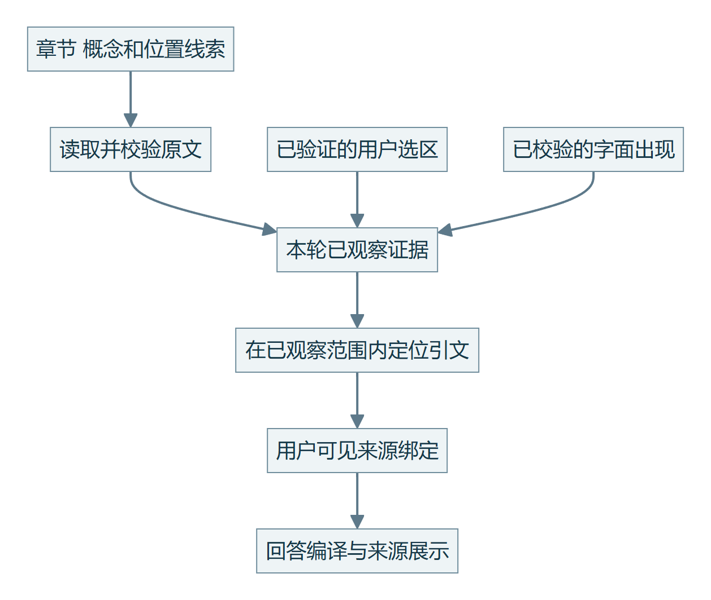

字面出现与完整语境也有差别。检索发现某个词，能够帮助确认它在材料中的位置；要解释这个词在一段论证中的作用，仍可能需要读取周围内容。运行时记录证据的来源和范围，Agent 则要根据任务判断现有材料是否足够。

这样设计以后，定位能力和引用能力可以分别考察。一次检索可以很擅长找到相关位置，却仍因没有读取充分上下文而给出不完整解释；一次来源绑定可以准确回到原文，回答中的推论仍可能需要进一步检查。

<a id="ch09-s4"></a>

### 引文怎样成为读者可以使用的来源

当模型希望在回答中展示来源时，会提交需要引用的连续原文。当前 source.present 的输入以 quote 表达引文，运行时在本轮已经观察的范围内寻找对应位置。

决定匹配范围的是 [TurnEvidenceLedger::prepare_present](../../../crates/runtime/src/orchestrator.rs) 中相邻的两行代码：

```rust
        let observed = self.observed_intervals(book);
        let mut matches = book.match_source_quote(quote, &observed)?;
```

先把本轮接纳的证据转成原文区间，再把这些区间传给引文匹配。第二行的 `&observed` 限定了查找范围。如果只在全书中找一句相同的文字，最多能确认书中存在这句话，不能说明本轮取得过它。当前接口把匹配限定在已经观察的范围内，让引用的资格与本轮实际取得的材料相连。

接下来的分支根据匹配到的位置数量处理：

| 匹配位置数 | 当前结果 | Agent 怎样继续 |
| --- | --- | --- |
| 0 | `SOURCE_NOT_OBSERVED` | 先从已有结果中纠正引文；所需内容尚未观察时，再读取原文 |
| 1 | 解析真实范围并返回可呈现来源 | 使用返回的来源绑定组织回答 |
| 多于 1 | `SOURCE_AMBIGUOUS` | 加入已有原文中更有区分度的上下文；材料不足时补读 |

重复引文是阅读材料中自然会出现的情况。同一术语定义可能在小结中再次出现，短句也可能在不同章节重复。直接选择第一个位置，会把准确的文字连接到错误的阅读上下文。当前实现让模型延长引文，或者补读能够区分位置的原文，再进行绑定。

得到来源绑定以后，模型可以在回答候选中引用它。compile_agent_answer 将候选文本转换为面向界面的结构，并检查来源标记是否属于本轮已有绑定。未知引用和不符合来源表达合同的内容会触发交付诊断。现有路径保留一次修复机会；再次无法通过时，系统交付相应的失败结果。

这一阶段将模型生成的表达与运行时掌握的引用事实连接起来。读者看到的来源标签、预览和跳转对象由真实材料派生，界面据此展示与导航。

流式输出也遵循同一条边界。模型可以逐步生成文字，用户可以较早看到通过展示规则的草稿；最终回答仍经过完整编译。草稿和最终接受的结果具有各自的状态，第 12 章会进一步分析它们与 SSE 事件、快照和历史提交的关系。

<a id="ch09-s5"></a>

### 阅读动作怎样回到正确的状态

现在回到任务中的“保存一条笔记”。找到证据和形成解释以后，Agent 还需要执行一次用户要求的操作。

Runtime 通过 ResidentStatePort 访问 Reader 和私人数据。Server 的 RuntimeStatePort 在执行写入或阅读动作前检查运行归属，再操作当前权威实例。用户数据写入和阅读现场操作使用不同的检查范围：前者首先要属于原用户，后者还要确认原现场没有被替换。

这种访问方式与模型调用的时间尺度有关。模型等待可能持续较久，读取或更新一项本地状态则通常只占其中一小段。如果在整轮模型调用期间一直占有共享状态，读者操作就会被等待拖住。项目将模型等待放在锁外，在执行具体状态操作时短暂进入相应入口。

另一个需要考虑的方案是先复制 Reader 和 Memory，等模型完成后再整体写回。它简化了运行期间的访问，却会遇到读者同时操作的问题：复制之后新发生的变化可能被旧副本覆盖。按操作访问权威状态，使模型执行与读者操作能够在明确的边界上相接。

工具返回以后，运行记录实际效果。取消信号可以阻止后续工作继续推进；已经保存的笔记或已经发生的阅读操作则保留自己的事实。历史和界面应当据此说明发生过什么。

<a id="ch09-s6"></a>

### 运行何时继续 何时停止

一次任务可能需要多次模型采样。多读了一段相关原文、找到了新的有效位置、完成了要求的操作，都可能使任务进一步接近交付。反复改变参数却没有取得新的结果，则需要不同的处理。

当前 OuterConfig 的默认 max_turns 为 None。普通 Resident 运行按实际进展持续执行，同时保留取消、无进展、上下文压缩失败和不可恢复错误等停止路径。显式有限调用配置和特定实验预算仍可施加各自的边界。

运行时的进展记录根据实际发生的事件变化。代码分别观察定位、证据、综合以及工具能力和效果等信息，再用于判断执行是否停滞。模型声称“我继续研究一下”没有改变这些事实；一次工具调用如果带来新的有效信息，则可能改变下一步能够做的事情。

上下文压力属于另一类条件。旧历史占用过多输入空间时，系统可以通过检查点压缩活动上下文，并继续同一任务。压缩改变后续模型请求如何表达历史，持久记录仍然承担保存实际交互的职责。

把这些因素分开之后，就能理解为什么一次运行可能因为没有进展停止，也可能在多次压缩之后继续。所需判断来自任务状态、实际观察和单次请求容量，单独累加采样轮数无法表达这些关系。

<a id="ch09-s7"></a>

### 回答如何保存为可继续使用的结果

Server 在 finalize_user_agent_turn 中整理本轮终态、回答、来源绑定、错误和目标状态，再交给会话保存路径。对于已经使用新日志的用户，会话通过 session_runtime 完成相应提交。

新聊天采用按会话追加的 JSONL。SessionLog 将结构化事件写入文件，完成相应的写入确认，再发布内存投影。后续读取通过事件恢复消息、回合和关联状态；读取历史本身不会重新执行当时的工具。

一轮任务中的记录也可以在过程中增量保存。RunCheckpointSink 将消息、活动、效果和压缩检查点送到各自的提交入口。最终结束记录把本轮结果关联起来。这样，展示进度、恢复模型上下文和保存领域事实能够使用各自需要的表达。

聊天 Goal 还可能跨 Run 延续。某次运行停止之后，任务仍可能保留未完成事项；后来继续时，模型需要看到原要求和已经得到的结果。Server 根据运行结果判断是否满足通用完成条件，并与本轮历史一起提交目标状态。

具体恢复策略取决于中断发生的位置。尚未开始的排队任务、已经认领的任务和已经交付的效果具有不同事实。第 16 章会沿日志解释保存与读取，第 19 章再加入网络准入和调度的恢复关系。

<a id="ch09-s8"></a>

### 用量与等待应该怎样分析

沿一条执行轨迹看成本，可以先区分三个量：本次模型请求需要容纳多少输入，整项任务累计使用了多少输入输出，以及读者等待多久。

考虑一个教学算例：四次请求的输入分别为 2000、4000、6000 和 8000 个 token。累计输入为 20000 个 token，最大的单次输入为 8000 个 token。这两个量来自同一条轨迹，但用途不同。

累计用量帮助核算任务成本，其中实际计费还要结合 Provider 的输入、输出和缓存口径。单次输入则需要与模型上下文容量、输出预留和其他请求内容一起判断。重复携带的旧上下文会多次进入累计统计，因此累计输入可以超过任一时刻实际持有的输入规模。

时间分析同样需要明确口径。一次 book.query 可能在工具内部继续调用模型。如果已经把这段内层推理记入模型耗时，又把整个工具调用耗时加一遍，就会重复计算。分析串行路径时，应当使用互不重叠的阶段时间；存在并行时，则沿依赖关系找出决定结束时刻的路径。

由此可以提出能够改变设计判断的问题：延迟主要发生在模型生成、工具执行还是排队？新增的一次检索是否取得了有用证据？更多采样是否提高了任务成功率？保存的结果是否满足了读者要求？第 21 章会结合项目的真实记录，把这些问题连接到效果和成本评测。

<a id="ch09-s9"></a>

### 当前机制的保证与边界

来源绑定能够检查引文是否来自本轮已观察的材料，并把它连接到真实位置。原文是否充分支持回答中的推论，需要另行评估。这个区别决定了评测中为什么要分别观察来源定位、引用支持和完整任务成功。

目标完成检查也有具体粒度。[goal_turn_delivered](../../../crates/server/src/lib.rs) 首先排除运行未完成、带有 warning、缺少回答或缺少回答视图的结果，再逐项处理目标中的验证类型。其中两个分支是：

```rust
        runtime::goal::GoalVerification::Content => true,
        runtime::goal::GoalVerification::ReaderAction => !outcome.effects.is_empty(),
```

Content 分支在通过上述前置检查后直接返回 true，这一层没有另做语义判卷。ReaderAction 分支确认效果列表非空，但没有把每一项动作要求匹配到具体对象。假设任务要求保存一条比较笔记，仅凭某个阅读动作已经发生，还不能证明笔记正文包含了全部关键区别；需要继续查看保存操作的结果和实际笔记。

PresentationDelivery 分支则会检查回答挂载的演示及其版本是否在当前目标的成果引用里。[对应测试](../../../crates/server/src/agent_run_tests.rs)分别构造只有文字、只有候选或预览、交付后未挂载、挂载另一份演示，以及挂载本目标已交付版本等情况。不同结果使读者能够看清这个分支实际验证的对象。

会话日志和笔记、教学事实、呈现版本分属各自存储。日志可以记录关联和处理结果，整个任务跨这些存储的写入则需要分别分析。讨论恢复时，应当从已经提交的事实开始，判断哪些结果可直接读取、哪些执行已经中断。

<a id="ch09-s10"></a>

### 源码选读

| 阅读顺序 | 文件与符号 | 应追踪的关系 |
| --- | --- | --- |
| 1 | [Server](../../../crates/server/src/lib.rs) 的 prepare_agent_chat；[RunScope](../../../crates/server/src/run_scope.rs) | 原输入、材料、聊天和现场怎样固定 |
| 2 | [RunContext 与状态端口](../../../crates/runtime/src/run_context.rs) | 本轮信息和权威状态怎样分工 |
| 3 | [Agent 循环](../../../crates/runtime/src/orchestrator.rs) 的 observe_tool_evidence、TurnEvidenceLedger::prepare_present、compile_agent_answer | 从工具结果到证据，再到来源与回答 |
| 4 | [运行协调](../../../crates/server/src/agent_run.rs) 的 RuntimeStatePort、RunCheckpointSink | 状态操作、过程记录和取消怎样连接 |
| 5 | Server 的 finalize_user_agent_turn、goal_turn_delivered；[会话提交](../../../crates/server/src/session_runtime.rs)；[日志](../../../crates/server/src/session_log.rs) | 终态、目标和持久记录怎样衔接 |

源码中的 source_presentation_rejects_context_route_state_error_and_unobserved_lid 测试展示了位置线索不能直接产生来源的情况；source_presentation_quote_requires_full_observation 约束了引文的观察范围；source_presentation_second_invalid_answer_fails_closed_after_one_repair 说明一次修复之后仍无法交付时的结果。[日志测试](../../../crates/server/src/session_log/tests.rs)中的 session_log_reopen_and_position_keep_frozen_prefix 则展示了后续追加如何与早先冻结的历史位置共存。

<a id="ch09-s11"></a>

### 思考与面试表达

介绍这条链路时，可以先用一段简短回答建立全貌：

Understand Book 在提问时固定书籍、聊天和阅读现场，由 Agent 按任务读取原文并执行操作。原文先进入本轮证据账本，引文再绑定到真实来源，回答通过编译后保存。笔记等动作通过权威状态入口执行。系统分别验证来源能否追踪、动作是否发生和任务是否完成，并为追问与恢复保留实际结果。

需要深入解释时，沿“输入归属 → 原文观察 → 来源绑定 → 状态操作 → 回答与历史提交”展开。每一段说明它接收什么、改变什么，以及后续组件凭什么继续。下面的追问可以先自行作答，再对照参考思路。

1. **用户提供的选区已经包含完整答案，还需要检索吗？**

   先判断选区是否通过校验并足以支持当前解释。已验证选区可以直接进入本轮证据账本，检索不是每轮必经步骤。需要在回答中展示来源时，再将连续引文绑定成来源；最终回答仍经过编译和会话保存。三个判断分别针对材料是否足够、来源怎样呈现，以及交互结果如何保留。

2. **检索已经返回正确章节，为什么解释仍可能出错？**

   先看得到的是位置线索还是已读取正文，再检查是否读到了定义的条件和上下文，最后对照回答中的推论。来源绑定只能支持相应的定位与观察事实。即使原文与引文完全对应，把有条件的结论推广到所有情况也可能解释错误。排查时需要并排查看工具返回、已观察范围、来源绑定和最终表述。

3. **模型等待期间用户切换了阅读现场，原任务还能继续吗？**

   要按操作区分。解释原问题仍可以使用 RunScope 固定的材料和输入；改变当前 Reader 时，要通过原现场及其代际的检查。私人数据写入先确认用户归属，再经权威入口操作。若采用“复制整份状态，最后写回”的替代方案，还必须解决读者在等待期间新增修改被覆盖的问题。

4. **累计输入很大，但单次请求还有空间，是否应该停止？**

   累计输入用于计算整项任务消耗，单次输入用于判断当前请求能否容纳。仅凭累计量不能推导出上下文已经装满。当前默认没有固定采样轮数上限，运行还要看实际进展、取消与错误；显式配置的限制按其约定生效。再加入“连续无进展”后，应该检查进展记录是否触发停止，不能把重复调用当成任务正在推进。

5. **回答说“笔记已保存”，Goal 检查也通过了，怎样证明任务完成？**

   找到保存操作的真实返回结果和笔记对象，核对属主、关联材料以及正文是否包含要求的关键区别。当前 ReaderAction 通用检查只看效果列表是否非空；它没有在这个分支证明某一条笔记满足了全部语义要求。回答时应先指出已有检查保证到哪一步，再说明还要核对哪些事实。

这些追问分别改变材料、推论、现场、执行条件和验收对象。能够沿实际边界重新作出判断，才说明已经掌握了整条请求链。[第 10 章《工具与模型调用边界》](#ch10)进一步拆开工具契约、能力发现和模型适配，解释模型作出的决定怎样到达正确的执行入口。该章同时对本章请求的原句做了局部重放，并在“已知边界与本轮验证”记录当前动作意图识别对保存分支的限制。


---

<a id="ch10"></a>

## 第 10 章 工具与模型调用边界

继续上一章的请求：“解释这里的结论与前面介绍的概念有什么关系，把关键区别记成一条笔记。”

我们已经知道，一次回答需要固定阅读现场、取得证据、形成来源并保存结果。现在把注意力移到模型作出决定的时刻：它怎样知道有哪些方法可用？它说“读取前文”时，谁负责找到执行入口？它说“保存好了”时，系统凭什么判断笔记真的存在？

直接把所有函数说明放进提示词，是一个容易想到的教学方案。随着能力增加，这种方案会把原文读取、路线规划、私人记忆、界面动作和演示制作混在一起。更关键的是，函数存在、模型看见函数、当前任务允许执行函数，是三个不同的事实。当前实现围绕这些区别组织工具边界。

本章沿“能力声明 → 本次暴露 → 模型选择 → 执行分派 → 真实结果”展开。这里的 Resident 是内置阅读 Agent，它服务读者的 Run；[第 7 章](#ch07)的构建执行器负责交接模型工作单元，[第 8 章](#ch08)的发布器负责交付构建成果。三者可以使用模型，但各自拥有不同的任务、入口和完成条件。

<a id="ch10-s1"></a>

### 10.1 先确定需要读材料，还是改变阅读状态

请求中的“这里”来自已经验证的选区，“前面介绍的概念”则可能还需要定位。假设前文位置已经确定，最小的一步是调用 `book.text`，取得那一段规范原文。若只知道概念名称，可以先找候选；若需要解决一个自足的关系问题，则可以交给 `book.query`。它们都服务于理解材料，却承担不同程度的工作。

| 当前缺口 | 合适的能力与典型工具 | 返回结果怎样帮助下一步 |
| --- | --- | --- |
| 已有位置，缺少正文 | `source_read`，`book.text` | 返回规范原文，供本轮证据账本接纳 |
| 要找某句话或符号出现在哪里 | `lexical_locate`，`book.search_text` | 返回字面出现位置，按任务决定是否补读上下文 |
| 概念名称有歧义 | `semantic_evidence`，`book.concept` | 返回候选、位置和预览，选定后再读取正文 |
| 要解释明确对象之间的关系 | `semantic_evidence`，`book.query` | 内层先解析对象，再围绕绑定取得证据并回答 |
| 已有一组位置，需要综合 | `synthesis`，`book.synthesize` | 围绕调用方给定的离散 LID 集合综合，不扩展检索 |
| 想了解全书组织，或者安排阅读路线 | `structural_index` / `navigation_plan`，`book.structure` / `book.guide_path` | 返回结构或路线，供定位、解释和导航选择使用 |
| 要实际保存笔记或跳转 | `reader_write`，`reader.note` / `reader.gotoLid` | 执行状态操作，返回笔记身份或 Reader 变化 |

这张表中最值得停下来思考的是最后两行。路线能够告诉 Agent“下一步可以读哪里”，但只有阅读动作才会改变界面位置。全书概述需要结构，不必同时授予跳转能力。[ADR-0113](../../adr/0113-open-natural-language-capability-routing-and-runtime-evidence-topology.md)正是围绕这个区别，把过去粗粒度的导航能力拆成只读结构、只读路线和 Reader 写入。

当前 [Book](../../../crates/read-tools/src/lib.rs) 持有规范正文、位置树和构建成果。`Book::text` 按节点保存的 UTF-16 范围读取原文；Reader 则负责阅读位置、选区和批注入口。保存笔记时，`Reader::save_note` 把书籍身份、LID、正文和落点交给 Memory 保存，并返回记忆层的 `note_id`。模型无法通过生成一个相同格式的身份，使这项写入自行发生。

为追踪保存分支，下面给读者增加一句明确的教学输入：“把要点保存为一条笔记。”假设目标是已定位的 `1.1`，模型提出：

```json
{"lid":"1.1","text":"这里填写根据已观察原文形成的比较要点。"}
```

这只是 `reader.note` 的教学参数。当前 [dispatch_state_tool](../../../crates/runtime/src/orchestrator.rs) 先通过 `submit_private` 保存笔记，再通过 `apply_reader` 选中对应批注。新建成功会产生 `AgentEffect::Note`；命中已有笔记时返回已有身份，而不会再记成新建效果。Agent 路径传入的层级是 `session`，后续“保留”为长期笔记的操作另有生命周期。

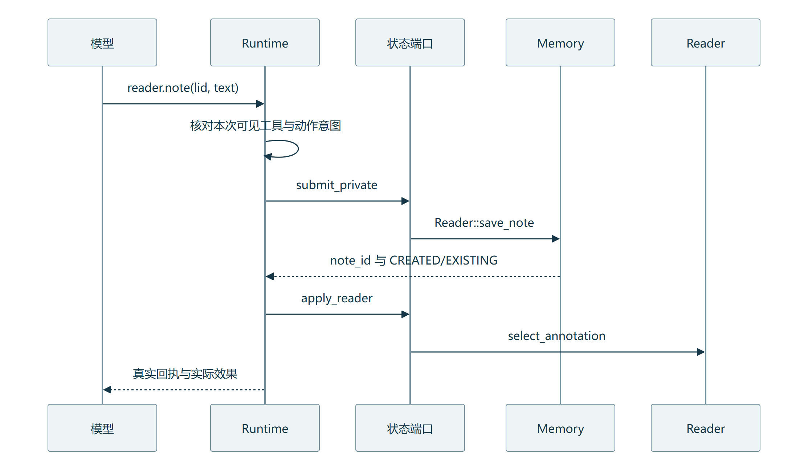

图中两次状态访问各有归属检查。私人笔记已经保存、原现场后来无法应用批注选中，可能同时成立；返回值会用 `reader_effect.status=not_applied` 说明后一项没有应用。这个行为延续[第 9 章](#ch09)的区分：应当查看实际回执，不能把一次工具调用压成一个不分层次的“成功”。

<a id="ch10-s2"></a>

### 10.2 同一个 Book 能力怎样穿过三个入口

现在考虑读取 `1.1` 的原文。内置 Resident 使用 `book.text`，外部 MCP 调用方使用 `book_text`，REST 路由则使用 `/book/text`。三个名字最终都要表达同一项书籍读取工作。如果各入口独立定义参数，某处允许 `end_lid`、另一处只认识 `end`，调用方就会面对看似相同、实际漂移的工具。

[book-tool-contracts](../../../crates/book-tool-contracts/src/lib.rs) 用 `BookToolId` 表示能力身份，用 `SurfaceAliases` 保存不同表面的名字。`BookToolContract` 同时记录描述、适用条件、不适用条件和结果合同标识。输入的 Rust 类型则承担 JSON 解析和 Schema 生成的共同依据。

其中 `TextInput` 的完整声明很短：

```rust
#[derive(Debug, Clone, Serialize, Deserialize, JsonSchema, PartialEq, Eq)]
#[serde(deny_unknown_fields)]
pub struct TextInput {
    pub lid: String,
    #[serde(default, skip_serializing_if = "Option::is_none")]
    pub end_lid: Option<String>,
}
```

`lid` 必须提供，`end_lid` 可以省略，额外字段会被反序列化拒绝。`validate_input` 先按工具身份解析成对应类型，再执行语义检查；Text 分支进一步拒绝空字符串。JSON 结构和这一步语义检查并不代替对实际 Book 的读取。

REST 中的 `end` 是传输入口的写法。[bind_rest_book_input](../../../crates/server/src/lib.rs) 把它转换为 `end_lid`，再调用共同校验器。Resident 的 `dispatch_resident_book_tool` 和 MCP 的 `dispatch_mcp_tool` 也沿合同解析。对正常范围，三条路径随后调用同一个 `Book::text`，构造包含 `lid` 和 `text` 的结果。

| 能力身份或动作 | Resident 名称 | MCP 名称 | REST 合同别名 |
| --- | --- | --- | --- |
| Text | `book.text` | `book_text` | `text` |
| Query | `book.query` | `book_query` | `query` |
| Structure | `book.structure` | `book_structure` | `structure` |
| Manifest | 无 | `book_manifest` | `manifest` |
| Guide | 无 | `book_guide` | 无 |
| Reader 保存笔记 | `reader.note` | 无 | 不属于 Book 合同 |

表中的“无”是入口设计的结果。Book manifest 没有 Resident 别名，Visitor guide 也没有被改名后塞进 Resident。共同合同复用的是确实相同的能力，不要求所有调用方拥有相同能力面。

Resident 还需要把模型看到的说明连接到真正的执行器。[ToolRegistry](../../../crates/runtime/src/tool_registry.rs) 的一条注册包含 `ToolSpec`、`ToolHandlerId`、校验器、能力卡、输出策略和并行资格。`ToolSpec` 负责名称、描述与参数；Handler 负责决定进入哪条执行分支。Registry 构造时拒绝重复名称、无 Handler 的名称、缺少注册的可调用 Handler，以及 Book 描述或 Schema 漂移。

下面是 `ToolRegistry::try_new` 的真实摘录，前面已经完成名称和基本形状检查：

```rust
            if let ToolHandlerId::Book(id) = handler {
                if spec.description != contract_for(id).description {
                    return Err(ToolRegistryError::new(format!(
                        "Book tool description drift: {name}"
                    )));
                }
                if spec.parameters != input_schema(id) {
                    return Err(ToolRegistryError::new(format!(
                        "Book tool schema drift: {name}"
                    )));
                }
            }
```

这个检查解决的是装配一致性：模型说明必须对应 Registry 所认定的 Book 合同。结果合同标识描述返回对象的约定，Registry 的输出策略则帮助历史投影、定位信息和原文结果各走合适的处理路径。它们不会因为名字中都有“合同”，就自动形成一个覆盖所有结果语义的通用验证器。

能力卡 `ToolRoutingCard` 又向前走了一步。它声明工具提供什么能力、适用于什么范围和操作、会产生什么效果、需要哪些前提，以及相对成本。Book 工具的 `use_when` 和 `avoid_when` 直接来自共同合同。这样，发现路径可以理解“什么工作适合交给它”，不必另外维护一份脱离执行注册的说明表。

<a id="ch10-s3"></a>

### 10.3 注册之后，为什么还要暴露与发现

完整 Registry 是系统能力全集的一种表达。一次局部解释只需要其中一部分。论文专用工具在技术书中没有合适的内容前提；来源呈现需要已有证据；读者只要求解释时，也不能因模型觉得方便就跳转页面。

[ToolExposurePlan::build](../../../crates/runtime/src/tool_exposure.rs) 因此结合内容 profile、运行权限、本轮证据、成果覆盖状态及先前激活记录，为每次采样生成可见工具集合。这里有三种分类：

| 分类 | 含义 | 还要考虑什么 |
| --- | --- | --- |
| Direct | 优先进入当前请求的能力 | 直接工具名额、Schema 字节预算和本次排除规则 |
| Deferred | 注册有效，等待明确需要的能力 | 本轮是否已激活，以及剩余 Schema 预算 |
| Hidden | 当前条件不允许暴露 | 权限、内容类型、证据或运行状态改变前不会通过发现获得 |

`book.text`、`book.search_text`、`book.query` 等核心读取能力属于 Direct；`memory.recall`、若干路线工具和 Reader 动作通常属于 Deferred；没有本轮已观察证据时，`source.present` 属于 Hidden。待取得证据后，下一次计划可以把来源工具放进 Direct。

分类还不是最终答案。每条计划记录另有 `exposed` 布尔值，以及 `DirectLimit`、`SchemaBudget`、`Activated` 等原因。正常含 `goal.update` 的注册表使用 9 个 Direct 名额；移除 Goal 的路径为 8，激活 Tutor 时另增加一个名额。已经激活的 Deferred 工具仍可加入，因此不能把这个数写成“整轮最多只能看见 9 个工具”。所有实际加入的工具共同接受字节预算约束。

<a id="ch10-s4"></a>

#### 用字节算一次暴露成本

`tool_schema_bytes` 计算逻辑对象 `{name, description, parameters}` 序列化后的 UTF-8 字节数。`projected_schema_bytes` 再计入数组括号和逗号。对非空集合，若各工具对象占用 `s₁…sₙ` 字节，则这个层次的总量为：

```text
SchemaBytes = Σsᵢ + (n - 1) + 2 = Σsᵢ + n + 1
```

这是暴露层的计量，不包含 Native HTTP 封套，也不等于模型 token 数。最终请求还要接受活动上下文预算检查。

下面是教学算例：按顺序考虑三个逻辑工具对象，大小分别设为 180、240、300 bytes，预算设为 600 bytes。它们是自设尺寸，没有从某次产品请求测量得来。本轮逐字抽取当前 `projected_schema_bytes` 运行，得到：

| 尝试加入 | 加入后的候选总量 | 对 600-byte 教学预算的判断 |
| --- | ---:| --- |
| 第一个对象 | 182 | 可以加入 |
| 第二个对象 | 423 | 可以加入 |
| 第三个对象 | 724 | 超出预算，保留前两个对象的 423 bytes |

因此，发现命中、写入激活集合、实际进入下一次请求仍是不同的步骤。下一次重新构造计划时，预算可以使某项已激活能力暂时没有暴露。

<a id="ch10-s5"></a>

#### 不知道工具名字，怎样表达需要

若模型想核对这段内容以前保存过什么笔记，它不必先猜中 `memory.recall`。[agent_prompt.rs](../../../crates/runtime/src/agent_prompt.rs) 的发现策略提供一个较小的能力目录，模型据此提出结构化需求。例如：

```json
{
  "task": "查找以前保存的相关阅读笔记",
  "required_capabilities": ["memory_read"],
  "scope": "document",
  "operation": "explain",
  "effect_mode": "read_only",
  "max_results": 1
}
```

这是传给 `tool.search` 的教学输入。当前 `CapabilityRequestV2` 的六个字段都必须提供。能力取自有限枚举，`max_results` 允许 1—6，任务文本最多 512 个 Unicode 标量值。模型负责把开放语言归约为“要做哪类工作”；系统随后判断这些能力是否适用于真实现场。

`stamp_task_need` 用 Runtime 的状态补全 `TaskNeed`：内容 profile、证据状态、权限和已识别的动作意图都来自当前运行。模型请求中的 `effect_mode` 表达它希望采用的模式，授权结果则由程序重新计算：

```rust
    let authorized_effect_mode = if request.effect_mode
        == ToolSearchEffectMode::ReaderMutationExplicitlyRequested
        && state.has_explicit_reader_mutation_intent()
        && context.permissions.allow_reader_write
    {
        ToolSearchEffectMode::ReaderMutationExplicitlyRequested
    } else {
        ToolSearchEffectMode::ReadOnly
    };
```

还要进一步核对具体动作。当前 `authorizes_reader_action` 区分保存笔记、高亮和导航：要求跳转不等于允许保存笔记，要求保存笔记也不等于允许高亮。这层判断使用用户问题产生的动作提示，不使用模型在 discovery 参数中自行声称的意图。

`effect_mode` 在这里主要区分是否请求 Reader 变化。它并不是全系统“无写入”的总开关：能力卡还分别声明 `MemoryWrite`、`PresentationWrite` 等效果，记忆权限也有自己的读写位。理解某项操作的权限时，需要同时看能力卡、运行权限和执行入口。

随后，`resolve_capabilities` 先按请求能力、scope、operation、暴露状态、效果及前提过滤，再在合法候选中用名称、描述和 `use_when` 排序。当前文本匹配复用 Unicode 归一化、CJK gram 和多字段权重；能力没有满足时，结果保留未满足项和阻塞原因。排序还先覆盖尚未满足的能力，再填入备选工具。它没有增加一次独立的分类模型调用，也没有把 `relative_cost` 字段实现成全局最便宜计划求解器。

<a id="ch10-s6"></a>

#### 发现结果为什么要等下一次采样

在默认允许读取记忆、尚未激活它的情况下，上面的需求能够找到 `memory.recall`。`search_and_activate` 将待激活名称写入本轮状态，结果以 `visible_from=next_sampling` 表达可见时机。这个结果不含保存过的笔记；笔记要等下一次合法调用才返回。

假设模型在同一个回复里同时输出 `tool.search` 和 `memory.recall`。虽然 Runtime 按顺序处理这两个调用，第二个调用仍然属于发现之前的那次模型决定，不能提前使用尚未展示的 Schema。[orchestrator.rs](../../../crates/runtime/src/orchestrator.rs) 保存本次真正送给 Provider 的工具名称，并在分派前执行以下过滤：

```rust
            let handler = registered
                .filter(|_| {
                    tool_exposure_plan.is_visible(&tc.name) && sampled_tool_names.contains(&tc.name)
                })
                .map(|registration| registration.handler);
```

因此，已经注册但未在这次采样中暴露的调用返回 `TOOL_NOT_EXPOSED`。下一次采样重新构造暴露计划后，`memory.recall` 才能使用刚刚激活的能力。现有 `tool_exposure_activation_applies_only_to_the_next_sampling` 用例正是按“同批发现并过早调用 → 下一次调用 → 终答”排列这条链；本轮阅读了该用例，没有执行整轮产品测试。

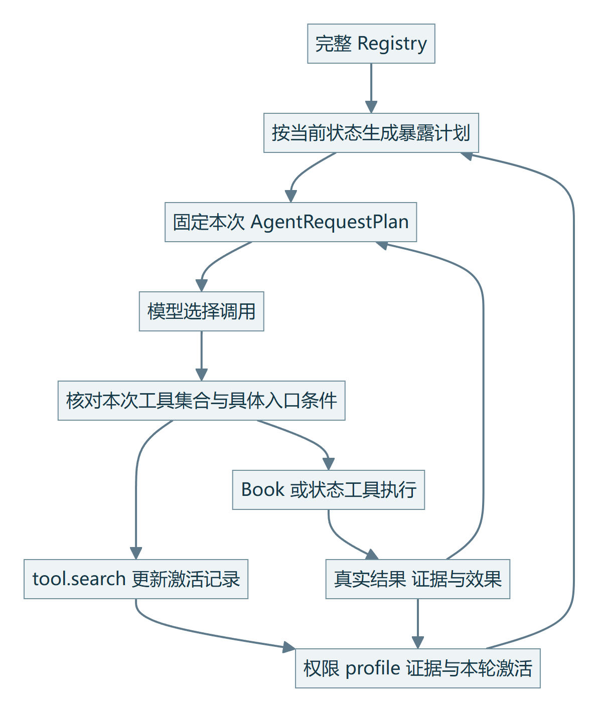

读原文还有独立的来源条件。`authorize_book_text` 使用 `TurnLocatorLedger` 核对 LID 来自哪里；工具在 Schema 中可见，不等于模型可以随意猜一个位置。得到合法定位、观察到正文、形成可呈现来源，仍然沿用上一章的分层。

本轮激活也不会永久继承。`redact_history` 把旧 discovery 结果投影为历史命中名称，并标记 `expired_after_prior_run`。后来的 Run 可以知道过去找过什么，但需要重新取得当前能力。至于这些历史回执如何进入模型上下文，第 11 章再继续追踪。

<a id="ch10-s7"></a>

### 10.4 MCP 调用方与内置 Resident 各自拥有什么

到这里，“模型调用工具”还存在两种容易混淆的使用形态。

第一种是外部 Agent 通过 MCP 使用 Understand Book。外部调用方拥有自己的模型循环，服务端提供当前 Book 的能力。第二种是读者在产品中提问，由 Resident 在 Run 内继续采样、发现能力、维护证据并调用状态端口。相同 Book 合同把公共读取部分连接起来，外层控制权则在不同位置。

| 比较项 | 外部 MCP 调用方 | 内置 Resident |
| --- | --- | --- |
| 谁决定下一次外层行动 | 外部 Agent 的宿主 | 当前 Run 的模型与 Runtime 循环 |
| 能力目录来自哪里 | `tools/list` 的 MCP 合同投影，另含成果读取工具 | Registry 经当前暴露计划形成的 Schema 集合 |
| 普通 Book 读取 | 解析 MCP 别名后调用 Book | 解析 Resident Handler，经过本轮条件后调用 Book |
| 私人 Reader / Memory 操作 | 当前 Visitor 分派没有相应入口 | 通过本用户、本现场的状态端口执行 |
| 持续引导状态 | `book_guide` 的临时 VisitorSession | 聊天、Run、Goal 和 Tutor 各自维护状态 |

服务端的 [handle_jsonrpc_message](../../../crates/server/src/mcp.rs) 处理 `initialize`、`tools/list` 和 `tools/call`。一次普通原文调用的输入可以写成：

```json
{
  "jsonrpc": "2.0",
  "id": 7,
  "method": "tools/call",
  "params": {"name": "book_text", "arguments": {"lid": "1.1"}}
}
```

沿当前代码追踪，`handle_tools_call` 提取名称与参数，`dispatch_mcp_tool` 将 `book_text` 解析为 `BookToolId::Text`，共同合同解析参数，`route_book_text` 调用 Book，最后把返回对象放进 MCP 的文本内容和 `structuredContent`。`isError` 根据内部 Reply 状态生成；调用方仍需理解工具结果本身，例如 Query 返回的未解决状态不能仅凭传输成功就解释为问题已回答。

这条链不创建 Resident Run，也不凭调用方传来一个名字就转入 `reader.note`。[MCP 测试](../../../crates/server/src/mcp.rs)中的 `visitor_dispatch_has_no_reader_or_memory_branch` 明确覆盖了没有私人存储访问时仍能读取 Book、而 Reader 与 Memory 名称被拒绝的情况。

有状态的例外是 `book_guide`。它保存临时的 VisitorSession，包含声明的阅读意图、交换记录和路线游标；调用方可以继续或关闭这次引导。它使用自己的会话上下文，不读取 Resident 的私人画像，也不把游标变化写成产品 Reader 的跳转。这使外部 Agent 能够接续带读，而不必拥有内置聊天的全部状态。

Book MCP 还提供受当前成果快照约束的 artifact 读取能力。因此，“MCP 没有私人 Reader 写入口”不意味着它只能返回原文。准确的边界是：哪些合同被列出、哪个快照被绑定、分派代码实际能访问什么。构建插件中也会出现 MCP，但它交付的是第 7 章的构建工作；不能从相同协议名称推断出相同工具集。

这一划分也解释了模型成本。`book_text` 本身不需要模型；`book_query` 和 `book_synthesize` 可以在服务端调用模型完成内层语义工作。外部 Agent 使用 MCP 后，仍可能承担自己的外层采样和工具内部采样两部分成本。MCP 描述调用边界，不规定工具内部一定是零模型计算。

<a id="ch10-s8"></a>

### 10.5 Native、ReAct 与 Provider 适配分别解决什么

现在让同一个 Resident 换用另一种模型后端。前面的工具合同、状态归属和证据规则应当继续成立；变化主要发生在“怎样把请求交给模型，以及怎样读懂模型返回的调用”这一段。

[ModelAdapter](../../../crates/runtime/src/lib.rs) 为外层循环提供 `chat(&AgentRequestPlan)`，返回统一的 `AssistantTurn`。内层 Query 等语义工作使用 `complete` 或结构化完成接口。外层并不因为一次 `book.query` 内部又调用了模型，就交出 Reader 状态的执行权。

统一调用对象 `ToolCall` 保存三个字段：调用身份、Runtime 工具名和 JSON 参数字符串。

```rust
pub struct ToolCall {
    pub id: String,
    pub name: String,
    pub arguments: String,
}
```

`id` 将工具结果与对应的模型调用配对。`name` 决定去 Registry 找哪个 Handler，`arguments` 则在进入具体能力时解析。Provider 可以用不同的响应格式表达决定，但进入 Runtime 后必须回到这个对象。

<a id="ch10-s9"></a>

#### Native 将逻辑调用投影为原生工具协议

`native_chat_request_projection` 把 `AgentRequestPlan.tools` 转成请求中的 function 工具 Schema，同时构造 Runtime 名称与 Provider 名称的双向映射。当前 `provider_tool_name` 会把点号等字符改为下划线，限制名称长度，并给碰撞名称添加后缀。

本轮直接运行该名称函数，按下表顺序得到：

| Runtime 输入名称 | Provider 输出名称 | 场景 |
| --- | --- | --- |
| `book.text` | `book_text` | 当前工具的名称转换 |
| `reader.note` | `reader_note` | 当前动作的名称转换 |
| `book_text` | `book_text_2` | 教学加入的碰撞名称，复用同一已用名称集合 |

这里的 `book_text` 看起来与 MCP 别名相同，但一次 Native 请求不会因此绕到 MCP 服务。Provider 响应返回后，Adapter 使用本次映射还原名称：

```rust
                let name = provider_to_internal
                    .get(&provider_name)
                    .cloned()
                    .unwrap_or(provider_name);
```

随后还是进入 Resident 的 Registry 和本次暴露检查。未知 Provider 名称不会因为这层转换而获得 Handler。当前 Native 接口还保留模型返回的私有 `ProviderContinuation`，并且只向同名模型续传对应状态；它不作为回答或书内证据。

<a id="ch10-s10"></a>

#### ReAct 把调用决定放进受约定的文本对象

当前 `ReActAdapter` 复用 Native 的 HTTP 传输基础，但外层调用投影不依赖原生 tools 字段。`build_react_system` 把本次可见工具、Schema 和调用规则写入英文兼容指令，要求输出一个 JSON 对象。模型可以用以下文本表达读取决定：

```json
{"tool_calls":[{"name":"book.text","arguments":{"lid":"1.1"}}]}
```

`parse_react_assistant_turn` 将参数对象序列化为字符串；若调用没有 id，则生成 `react_1` 等身份。终答使用 `final`，也接受 `answer` 别名。纯粹输出“我想调用 book.text”，或者给出缺少名称的调用，都不能形成合法的 `AssistantTurn`。

因此，本项目的 ReAct 首先是一种工具调用兼容格式。它没有要求程序从自由散文里猜下一步，也没有把一个新的任务调度器塞进 Adapter。解析完成后，工具依然经过与 Native 相同的 Registry、当前暴露集合、来源条件及状态端口。

| 适配事项 | Native | ReAct |
| --- | --- | --- |
| 工具说明在哪里 | 请求的 function tools | 兼容指令中的工具目录与 Schema |
| 模型怎样表达调用 | `message.tool_calls` | 文本 JSON 中的 `tool_calls` 或单个 `tool_call` |
| 工具结果怎样进入下一请求 | 按 `tool_call_id` 配对的 tool 消息 | 带调用身份和结果正文的文本消息 |
| 解析后的对象 | `AssistantTurn` / `ToolCall` | 同一组 Runtime 对象 |
| 是否决定实际写入权限 | 交给 Runtime 与具体入口 | 交给 Runtime 与具体入口 |

两者的取舍因而比较具体。Native 使用模型服务的结构化工具通道；ReAct 在文本通道中增加协议说明和解析工作，使外层循环能够复用。两条路径的可见能力和执行含义可以一致，协议可靠性、请求大小和模型表现则需要分别评测。

<a id="ch10-s11"></a>

#### Provider 配置与请求计划之间还有一层运行约定

`ProviderConfig` 确定模式、服务地址、密钥和模型；`ProviderRegistry` 根据配置创建 Adapter。[ModelRuntimeProfile](../../../crates/runtime/src/model_runtime.rs) 则描述应用打算怎样使用该模型：上下文容量、输出预留、Schema 预算、指令资产、压缩策略及协议能力。解析优先级是显式覆盖、目录匹配、默认回退。

这些数值是仓库中的运行配置。即便某个 profile 声明支持并行工具，当前 `AgentRequestPlan::from_messages` 仍把 `parallel_tool_calls` 设为 false；外层返回多个调用时，主循环按序处理。声明模型能力与启用应用执行策略应分别说明，不能仅凭一个能力位宣称工具已并行执行。

最终，每次采样拿到一个具体的 `AgentRequestPlan`：指令、输入、可见工具、tool choice、输出设置和活动上下文状态已经组合好。Adapter 对它做协议投影。这个边界使更换传输格式不必重写笔记保存和来源绑定，也把一个更深入的问题留了下来：历史越来越长时，这份请求应该保留哪些内容？

<a id="ch10-s12"></a>

### 已知边界与本轮验证

本章依据 2026-10-07 的当前工作区，Git HEAD 为 `5e10516`，包含其后的未提交修改。ADR-0113 用于解释能力拆分与发现设计；当前代码已经进一步细分笔记、高亮和导航意图，并加入 Goal、Tutor、成果读取与演示能力。ADR 中关于最后一次有限工具批次的讨论，需要结合 ADR-0150 和当前默认无固定轮数上限理解。

**显式动作识别仍有可达的语言缺口。** 本轮逐字抽取 `classify_turn_intent`、它依赖的短语处理，以及 `authorizes_reader_action`，在最小 Rust 驱动中运行了以下输入。表中布尔值表示函数判定，不是模型任务成功率，也没有实际保存笔记。

| 输入 | 笔记授权 | 高亮授权 | 跳转授权 |
| --- | --- | --- | --- |
| 第 9 章原句：解释这里的结论与前面介绍的概念有什么关系，把关键区别记成一条笔记。 | false | false | false |
| 把要点记成一条笔记 | false | false | false |
| 把关键区别保存为一条笔记 | false | false | false |
| 把要点保存为一条笔记 | true | false | false |
| 不要保存笔记，只高亮这段 | false | true | false |
| 请跳转到原文 | false | false | true |
| 解释如何做笔记和高亮 | false | false | false |
| 书中说‘保存笔记’，是什么意思 | false | false | false |
| 带我读这一节 | false | false | true |

前两行中的“记成一条笔记”没有命中当前请求短语；第三行虽然含“保存”，但 `explicit_action` 对整个分句检查否定子串，“区别”中的“别”也会触发拒绝。这个结果直接限制了前章场景在当前版本中的保存分支：模型即使理解原句，也不能通过自填 discovery 意图获得这项授权。另据当前完整动作匹配，`reader.scroll` 虽已注册，却没有对应的授权分支，不能从现有提示集合取得执行资格。这些问题应在意图识别或动作映射处处理，本轮未改实现。

**注册校验尚未统一成为分派前的拒绝分支。** 当前循环计算 `schema_valid`，用它确定活动记录中的 `executed`，但后面的 Handler 分派没有统一的 `!schema_valid` 早退。Book 工具会在共同合同路径再次解析；其他分支的接纳范围取决于各自实现。例如，`memory.save` 的 Schema 要求 `citations` 是字符串数组，但 Handler 对非数组值会按没有 citations 处理，仍进入保存路径。按照当前分支静态推导，在其已暴露且其余条件满足时，形如 `citations: "1.1"` 的错误参数可能伴随实际保存，却把活动标为 Rejected。这个写入例本轮没有重放；源码已经足以说明不能把 `validate_arguments` 写成覆盖所有 Handler 的统一执行闸。修正方向是让拒绝决定实际控制分派，并与各工具返回错误保持一致。

**Text 合同没有完整校验范围顺序。** `validate_input(Text, …)` 检查字段与非空值，`Book::text` 随后直接使用 `source_u16[start..end]`。本轮在最小 Book 形状中逐字复用该方法，设置三段 `[0,2)`、`[2,4)`、`[4,6)`，规范正文为“甲乙丙丁戊己”，得到：

| 输入 | 实际方法结果 |
| --- | --- |
| `1.1` 到 `1.3` | 返回“甲乙丙丁戊己” |
| `1.3` 到 `1.1` | 触发切片 panic，由教学驱动捕获 |
| 不存在的 `9.9` | 返回节点查找错误 |

REST 的 `end` 和 MCP 的 `end_lid` 都能传入这种反向范围，并沿已回读的入口到达该方法。因此，参数类型正确、两个位置分别存在，还不足以保证能按工具错误合同返回结果。需要在共同读取入口校验区间顺序。本次没有启动真实 Server，也没有验证不同宿主对 panic 的处理方式。

本轮实际执行的是上述 9 组意图与动作判断、3 组字节计算、3 组名称转换和 3 组文本范围，共 18 组局部重放。文本例使用最小数据形状，未加载完整书籍。共同合同一致性、发现时序、MCP 私人状态隔离和 Native/ReAct 归一化的现有测试为源码阅读；没有重新执行产品测试套件、历史实验或真实模型。协议归一化也不构成不同 Provider 质量、延迟或费用相等的证据。

<a id="ch10-s13"></a>

### 源码选读

| 阅读顺序 | 文件与关键符号 | 要追踪的判断 |
| --- | --- | --- |
| 1 | [Book 工具合同](../../../crates/book-tool-contracts/src/lib.rs)：BookToolContract、TextInput、validate_input | 同一能力怎样对应多个入口，输入在哪里解析？ |
| 2 | [注册表](../../../crates/runtime/src/tool_registry.rs)：ToolRegistry::try_new、ToolRegistration、routing_card_for | 模型说明、Handler、能力卡和校验器怎样相连？ |
| 3 | [暴露与发现](../../../crates/runtime/src/tool_exposure.rs)：ToolExposurePlan::build、stamp_task_need、resolve_capabilities、search_and_activate | 哪些条件决定当前可见，哪些字段只能由 Runtime 提供？ |
| 4 | [循环与分派](../../../crates/runtime/src/orchestrator.rs)：build_sample_request、dispatch_resident_book_tool、dispatch_state_tool | 本次 Schema 集合怎样约束模型决定，真实结果怎样返回？ |
| 5 | [Book](../../../crates/read-tools/src/lib.rs)：Book::text；[Reader](../../../crates/reader/src/lib.rs)：Reader::save_note | 读取的字节与保存的身份来自哪里？ |
| 6 | [MCP](../../../crates/server/src/mcp.rs)：tools_list_result、dispatch_mcp_tool、route_book_guide；[Server](../../../crates/server/src/lib.rs)：bind_rest_book_input | 共同合同与不同调用方的状态权限怎样并存？ |
| 7 | [模型适配](../../../crates/runtime/src/lib.rs)：ModelAdapter、native_chat_request_projection、parse_react_assistant_turn；[请求计划](../../../crates/runtime/src/model_runtime.rs)：AgentRequestPlan | 逻辑决定怎样穿过 Provider 格式，哪些规则仍由 Runtime 执行？ |

进一步阅读用例时，可以从 `book_tool_contract_has_schema_and_binding_parity`、`task_need_rejects_model_spoofing_and_stamps_runtime_authority`、`tool_exposure_activation_applies_only_to_the_next_sampling` 和 `visitor_dispatch_has_no_reader_or_memory_branch` 开始。它们分别把跨入口合同、状态权威、发现时序和调用方边界变成可观察的输入输出；本章发现的缺口则提醒我们，已有用例覆盖不能替代对当前实际路径的阅读。

<a id="ch10-s14"></a>

### 思考与面试表达

介绍本章机制时，可以这样组织一段短答：

Understand Book 先用共同 Book 合同固定能力身份、参数和入口别名，再由 Resident Registry 连接工具说明、Handler 与能力卡。每次模型采样只暴露当前状态允许且预算容纳的工具；模型通过有限能力目录表达需要，Runtime 负责发现、权限和证据条件。Native 与 ReAct 把不同协议归一化成相同调用对象，Book 读取和私人动作仍交给实际执行入口。MCP 复用公共能力，但外部调用方拥有自己的循环，没有内置 Reader 和 Memory 的写入口。

需要接受追问时，可以围绕下面六个条件变化展开。

1. **工具已经注册，为什么模型仍不能调用？**

   先查当前计划的分类、`exposed` 和原因，再查本次实际请求的工具集合。它可能在等待 discovery，也可能因内容类型、证据、权限或预算没有暴露。若刚在同一批次发现，必须等下一次采样；可见以后还要经过定位来源和具体动作授权。

2. **为什么结构概述不应该自动带出跳转权限？**

   概述需要结构和原文来组织解释，跳转会改变读者的现场。当前能力卡把 StructuralIndex、NavigationPlan 和 ReaderWrite 分开，模型可以取得路线而不执行界面动作。用户后来明确要求跳转时，再按相应意图与 Reader 权限调用。

3. **MCP 与 Native 都出现 `book_text`，是不是同一条链？**

   MCP 的名称来自公共合同别名，走服务端 JSON-RPC 分派；Native 的名称来自一次模型请求的协议转换，响应后还原成 `book.text`，继续走 Resident。最终可以复用相同 Book 方法，但外层状态、调用权限和结果接纳不同。

4. **换成 ReAct，是否需要重写工具执行器？**

   当前 Adapter 负责把文本 JSON 解析成 `AssistantTurn` 和 `ToolCall`，外层仍使用原来的 Registry 与分派。需要重新考察的是模型能否稳定遵循格式、兼容指令的输入成本，以及失败如何返回；不能由对象类型相同推断两种协议效果相同。

5. **怎样证明“保存笔记”完成了？**

   查 `Reader::save_note` 的回执及真实笔记对象，区分 `CREATED` 与 `EXISTING`，再检查是否成功应用 Reader 选择。当前 Agent 笔记首先进入 session 层，长期保留另有动作。还要确认原始用户说法被当前意图识别覆盖；本章的原句重放正好展示了一个无法仅靠模型理解补齐的缺口。

6. **只给一个工具加上 Schema，能否宣称执行已经安全受控？**

   要沿数据流检查 Schema 是否真正控制拒绝分支、Handler 是否使用共同解析器、资源条件是否在实际对象上验证。本章的 `schema_valid` 分派缺口和反向 Text 范围展示了两个不同层次：一个是验证结果没有统一控制执行，另一个是类型合同未涵盖真实区间关系。修正应落在对应入口，而不是继续堆叠工具描述。

从这里进入[第 11 章《上下文组织与持续执行》](#ch11)：工具结果、能力激活和 Provider 消息配对都会改变下一次请求。下一章沿这份 `AgentRequestPlan` 继续追踪固定前缀、动态现场、历史回执与压缩检查点，解释长任务怎样继续获得足够且正确的信息。


---

<a id="ch11"></a>

## 第 11 章 上下文组织与持续执行

上一章把一次阅读请求推进到了模型采样的边界。读者希望理解当前结论与前文概念的关系，并把要点保存下来；运行时已经确定可见工具，模型也已经提出读取原文的调用。现在，工具返回了正文。下一次采样应该看到什么？

把返回值追加到对话末尾，是最直接的做法。第一次读取时，它通常足够。随着任务继续，问题就出现了：前面读过的几段原文是否还要完整重发？读者画像会不会每次重复插入？工具已经发现，却尚未执行，历史里应该怎样表达？如果一轮任务持续很久，输入装不下时又应该保留什么？

本章沿同一项阅读任务回答这些问题。为观察历史增长，设读者在保存比较笔记之后继续追问：“前面这个定义还有哪些适用条件？结合刚才的解释接着讲。”这是延续既有场景的教学输入，具体模型可以选择不同的读取路径；第 10 章已经记录原句的动作识别边界，本章从合法工具调用已经进入执行路径的时刻继续。

我们需要同时处理两种延续：同一个 Run 内，模型依据刚取得的结果继续行动；下一个 Run 开始时，模型依据已有讨论继续理解用户要求。前者拥有本轮工具结果和证据账本，后者需要从历史恢复任务线索。它们共同使用请求投影，但拥有不同的信息生命周期。

<a id="ch11-s1"></a>

### 11.1 下一次请求由哪些信息组成

先把“上下文”拆开。持久消息保存发生过的交互；本轮状态保存运行现在掌握的事实；模型请求则是程序为这一次采样组织的输入。三者相互关联，却没有完全相同的内容。

例如，读者画像在本轮开始时固定。后续采样需要参考它，但没有必要把同一份画像反复追加成新的聊天记录。又如，工具可能返回很长的原文，持久记录可以保留相应结果，模型这一轮实际接收的正文则受预算限制。理解这些区别，才能解释为什么请求中的消息数量不一定等于聊天历史中的消息数量。

[RunContext](../../../crates/runtime/src/run_context.rs) 持有 messages、模型运行配置、定位与证据账本、工具激活状态和活动结果账本。[build_sample_request](../../../crates/runtime/src/orchestrator.rs) 每次从这些状态重新形成工具暴露计划、指令模块和输入投影，然后构造上一章介绍的 AgentRequestPlan。对一次普通阅读请求，可以沿下面的关系看输入怎样汇合。

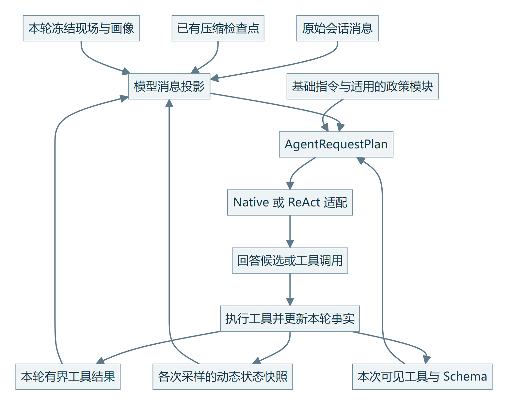

图中的“重新形成”不意味着每次都重新读取外部状态。冻结现场从本轮已接纳的输入取得，动态数据才按当前阶段更新。它也不意味着每次请求都从零丢弃历史：已有消息、历史回执和检查点会按规则进入同一个投影。

具体次序由 [messages_with_context_fragments](../../../crates/runtime/src/orchestrator.rs) 决定。它先应用已有检查点，再处理旧工具结果，随后覆盖本轮活动工具结果；没有检查点时单独插入冻结片段，最后放回各次采样的动态快照。其中相邻的两步是：

```rust
    messages = provider_history_projection(&messages, book);
    active_tool_results.project_messages(&mut messages);
```

次序表达了一个实际规则：已经结束的回合可以使用历史回执，当前 Run 的工具结果由当前活动账本决定。程序没有让一个历史结果仅凭出现在消息数组里，就重新获得“本轮刚读取”的身份。

接着，[AgentRequestPlan::from_messages](../../../crates/runtime/src/model_runtime.rs) 从首条 System 消息取出继承指令，按模型配置解析基础指令并接上政策模块，其余消息进入 input，可见工具进入 tools。它对组合后的消息与工具 Schema 估算输入量，并记录容量、输出预留与剩余空间。不同模型的协议要求在此后继续投影为真实请求。

因此，排查“模型为什么没有看到刚才的信息”，应先明确查看的是哪一层。聊天里有原文，只能说明它曾经进入相应记录；本次计划中的工具正文、回执和检查点，才说明这次采样实际使用了什么表达。

<a id="ch11-s2"></a>

### 11.2 固定前缀、动态片段和当前工具结果

<a id="ch11-s3"></a>

#### 同一份现场怎样避免重复增长

假设解释任务需要连续读取三处原文。三次采样都需要知道读者背景，却不需要三份相同的画像。项目通过 [ContextFragmentLedger](../../../crates/runtime/src/context_fragment.rs) 为片段指定 key、revision、scope、role 和 sensitivity。相同 key 的新版本替换旧版本，首次插入顺序保留；相同版本和内容再次写入返回 Unchanged。

这里最有用的划分是生命周期。

| 片段范围 | 请求怎样使用它 | 本章场景中的意义 |
| --- | --- | --- |
| SessionStable | 进入稳定位置的片段投影 | 类型提供会话稳定信息的表达能力；具体是否使用仍看调用方 |
| TurnFrozen | 在本轮各次请求中重用同一份现场数据 | reader.profile_snapshot 在 Run 开始时构造，后续采样沿用 |
| Dynamic | 在具体采样位置形成状态快照 | 当前 Goal、教学状态、交付缺口与执行提示随决策更新 |

scope 是投影机制中的分类。冻结画像的实际行为还来自 Run 初始化：代码在进入循环前创建画像片段，此后重用。账本的 upsert 本身允许替换同 key 的内容，并没有把 TurnFrozen 实现成不可修改的内存对象。

固定位置的投影明确排除了 Dynamic。对应代码位于 [projected_messages](../../../crates/runtime/src/context_fragment.rs)：

```rust
        self.snapshot()
            .fragments
            .iter()
            .filter(|fragment| fragment.scope != FragmentScope::Dynamic)
            .map(ContextFragment::projected_message)
            .collect()
```

这让“读者是谁、提问时在哪里”与“当前还缺什么、现在处于哪一步”能够分别安排。前一类适合靠前并保持稳定；后一类需要靠近产生下一次决定的位置。

<a id="ch11-s4"></a>

#### 动态状态为什么追加在工具结果之后

一种容易实现的更新方式，是每次改写消息开头的“剩余步骤”和“当前状态”。但如果消息最前面不断变化，即使后面的大段历史完全相同，整个输入也不再保持相同前缀。更麻烦的是，回看某次决定时，很难判断模型当时看到的是旧状态还是新状态。

当前 [record_sampling](../../../crates/runtime/src/context_fragment.rs) 把一次决定需要的动态状态记录成 runtime_state_snapshot.v1，锚定在当时的原始消息数量上。提示明确说明最后一个状态快照具有当前权威，较早快照描述先前的决定。若动态片段原本是 User 角色的任务数据，它保留该角色；只有 System 角色的动态内容进入状态说明。

一次读取前后的逻辑顺序可以写成下面的教学示意。S1、S2 是运行时快照，A1、T1 分别是相配的工具调用与返回。

```text
第一次采样：基础指令 / 冻结片段 / 既有历史 / 当前问题 / S1
第二次采样：基础指令 / 冻结片段 / 既有历史 / 当前问题 / S1 / A1 / T1 / S2
```

S2 位于完整工具结果组之后。这样，模型在看到新状态时，也已经看到导致状态变化的调用与结果。旧快照保持原样，新快照表达当前情况。这里稳定的是相应消息片段；后面会看到，工具集变化和正文淘汰仍会改变整份请求。

压缩前缀之后，锚点还要能找到原位置。当前实现从保留下来的尾部反向定位，关键代码很短：

```rust
        let projected_count = messages.len();
        for (anchor, snapshot) in self.sampling_snapshots.iter().rev() {
            let insert_at = projected_count - (raw_message_count - anchor);
            messages.splice(insert_at..insert_at, snapshot.clone());
        }
```

这段 [project_sampling_snapshots](../../../crates/runtime/src/context_fragment.rs) 依赖一个重要前提：回合中压缩保留当前回合的完整后缀。压缩只缩短更早的前缀，锚点到尾部的距离就仍然成立。本轮用原始锚点 10、12 和压缩后四条消息的教学夹具重放，两个快照分别插入索引 2、5；这是局部投影结果，索引从 0 开始。

如果为了重算压缩后的请求，在同一个原始锚点再次构造计划，record_sampling 会复用这次决定的快照，避免重复插入。另一方面，若一个过早的终答被拒绝，下一次决定可能没有新增原始消息。retain_sampling_history 会清除“已记录本锚点”的标记，让真正的新决定获得新的状态。于是，“同一次计划重建”和“同一消息位置发生新决定”有了不同处理。

演示制作还有 sampling_guidance.v1：选中的阶段指导变化时才追加新选择，未变化时沿用；普通状态快照不会使已有指导失效。它与阶段设计数据分开，使来源于宿主的指导和模型生成的任务内容保留各自身份。具体演示阶段放到第 17 章分析。

<a id="ch11-s5"></a>

#### 原文返回后，模型究竟看见多少

现在让模型提出一次已经通过定位授权的读取。下面使用教学材料中的三个叶子 LID，说明真实调用路径的输入形状：

```json
{"lid":"1.1","end_lid":"1.3"}
```

Book 的执行入口先产生原始结果。循环随后调用 [ActiveToolResultLedger::project_result](../../../crates/runtime/src/tool_result.rs)，结合该工具的输出策略和本轮剩余正文空间形成 ToolResultDraft，再封装为 ToolResultEnvelope。模型接收到的对象包含 model_body、receipt、truncated、status，以及存在时的 continuation。

这里同时有单工具预算和全回合共享预算。当前 ACTIVE_TURN_TOOL_MODEL_BODY_BUDGET_BYTES 为 `48 * 1024`，计量对象是保留的 model_body 的 JSON 字节数。外围回执、调用参数、用户问题、状态快照和工具 Schema 各有自己的体积，整份请求还要经过活动上下文估算。

若 book.text 的结果超过允许长度，[project_text](../../../crates/runtime/src/tool_result.rs) 尝试沿原文叶子边界保留能放下的连续范围。例如，若只有 1.1—1.2 能容纳，正文只包含这段，evidence_arguments 也收窄为这段，continuation 指向尚未提供的 1.3。这个范围例子用于解释分支，不是本轮测得的具体书籍截断点。无法容纳一个完整叶子时，返回缩小范围的建议，并标明结果不完整。

执行循环用投影之后的正文接纳证据。决定这一点的真实调用是：

```rust
            observe_tool_evidence(
                &mut context.evidence_ledger,
                &tc.name,
                &projection.evidence_arguments,
                &model_body,
                book,
            );
```

这段代码位于 [工具结果处理](../../../crates/runtime/src/orchestrator.rs)。证据范围随模型实际接收的材料形成，原始大结果中被省略的内容不能仅因工具曾经计算过，就自动算作本轮已观察原文。于是，同一次调用的“执行得到多少”“展示给模型多少”和“接受为证据多少”可以分别追踪。

当前正文也不会永久驻留。一次成功采样返回之后，mark_projected_fresh_results_sampled 把已投影结果标记为 sampled。后续需要腾出空间时，[make_room_for](../../../crates/runtime/src/tool_result.rs) 只选择已经采样且仍保留正文的最早结果：

```rust
            let oldest = self
                .by_call_id
                .iter()
                .filter(|(_, result)| result.sampled && result.retain_model_body)
                .min_by_key(|(_, result)| result.sequence)
                .map(|(call_id, _)| call_id.clone());
```

本轮局部重放把 A、B 两份 model_body 的序列化大小各设为 20 KiB，合计 40 KiB，剩余 8 KiB。随后需要放入 20 KiB 的 C：

| 所处时刻 | 对 A、B 的处理 | 可用正文空间 |
| --- | --- | ---: |
| A、B 尚未进入下一次采样 | 不能淘汰它们；新结果需按剩余空间投影 | 8 KiB |
| A、B 已经采样，准备接纳 C | A 最早，先取消其正文保留 | 28 KiB |
| C 接纳完成 | 保留 B、C，A 在模型投影中只留下回执等元数据 | 8 KiB |

被淘汰结果的 model_body 变成 null。原始消息没有因此被改写，本轮证据账本也没有被清空。sampled 表示结果已经随请求进入一次成功返回的模型采样，并不测量模型是否真正理解了这段文字。程序在这里保证的是交付机会与空间次序。

<a id="ch11-s6"></a>

### 11.3 历史回执怎样支持继续阅读

比较笔记保存后，读者追问定义的适用条件。新 Run 拥有新的冻结现场和本轮账本。此前的完整正文如果每次都原样携带，后续问题的输入会不断增长；如果全部删除，模型又会不知道已经讨论到哪里。

[provider_history_projection](../../../crates/runtime/src/orchestrator.rs) 选择最后一条 User 消息之前的历史部分，通过 history_projection_through 把旧 Tool 正文转换为 HistoricalToolReceipt，同时收窄旧工具调用的定位参数。调用 ID、结果的 tool_call_id 与角色仍然对应，所以“某次读取得到了某种结果”保留在协议结构中。

一个历史回执主要回答四个问题：调用了哪个工具，使用什么定位参数，返回成功还是错误，以及哪些证据范围或来源引用曾被接纳。它还保存结果摘要标识，用于关联原结果。这个标识不包含原文，也不能据此还原原文。

| 表达 | 后续模型能从中获得什么 | 下一步常见需要 |
| --- | --- | --- |
| 当前 model_body | 实际提供的文字、结构或状态 | 材料足够时继续解释 |
| HistoricalToolReceipt | 过去发生的调用、状态、定位与受限证据线索 | 需要具体措辞或条件时按位置补读 |
| CompactionCheckpoint | 跨多条历史整理的目标、进展、约束和待办 | 依据交接状态继续工作，必要时重新取得材料 |

回执的 accepted_evidence 由运行时按工具类型推导。当前实现对 book.search_text 的历史回执不恢复 accepted_evidence；字面出现定位与可直接用于解释的正文仍按不同合同处理。错误回执也不会获得成功结果的证据范围。不能把任意带 LID 的旧记录一概当作当前已读内容。

回到追问。假设上轮记录表明曾经读取 1.1—1.3，解释过定义与结论的关系，并保存了笔记。模型可以据此保持讨论方向，不必重新执行保存动作。但要回答“定义的适用条件”，若现有输入只剩回执，就应围绕已知位置取得相关原文。定位线索仍要通过本轮的定位来源规则；正文读回后，再进入本轮证据账本和来源绑定路径。

这也解释了为什么“按需回读”需要有用的定位信息。只留下“之前讨论过一个概念”会迫使模型重新广搜；保留工具名、位置和结果状态，可以把新的读取限定在真正缺失的细节上。省下的输入空间与新增的一次工具调用形成取舍，适合用后续实际任务的用量与正确率判断。

工具发现记录另有生命周期。[tool_exposure::redact_history](../../../crates/runtime/src/tool_exposure.rs) 将旧发现改成 tool_search_history.v1，标明 activation_status 为 expired_after_prior_run。当前 Run 的能力激活集重新建立，上一轮“发现过”只能作为线索。这与旧原文退为回执遵守同一原则：历史说明发生过什么，本轮能做什么和已观察什么由本轮状态决定。

ProviderContinuation 则属于另一种历史信息。它随 Assistant 消息保存，服务原模型协议续接；[assistant_source_content](../../../crates/runtime/src/compaction.rs) 提供给压缩器的是公开文本及工具调用，没有把私有续接内容加入摘要素材。模型切换或旧记录缺少必要续接字段时，[project_legacy_deepseek_history](../../../crates/runtime/src/model_runtime.rs) 将相应旧 Assistant/Tool 前缀投影为带角色标签的历史上下文。协议续接、任务交接和原文证据由此保持各自边界。

<a id="ch11-s7"></a>

### 11.4 活动上下文预算、压缩与检查点

<a id="ch11-s8"></a>

#### 累计很多，为什么当前请求仍然装得下

第 9 章已经区分单次输入与累计用量。这里把判断落到请求计划。设模型配置中的窗口为 W，输出预留为 O，安全余量为 S，本次估计输入为 I，高水位比例为 r。当前 [ActiveContextBudget::from_plan](../../../crates/runtime/src/auto_compaction.rs) 对应以下关系：

```text
预留 R = O + S
压力 P = I + R
高水位 H = floor(W × r)
压缩输入目标 T = max(H - R, 0)
物理容量判断：I ≤ W - R
尝试压缩条件：P ≥ H
```

其中“物理容量”也是依据本地估算和配置得出的判断。实际代码使用饱和加减，并把比例限制在 0—1。高水位与输出、安全空间相接的部分是：

```rust
        let ratio = profile.compaction.high_watermark_ratio.clamp(0.0, 1.0);
        let high_watermark_tokens =
            ((profile.context_window_tokens as f64) * f64::from(ratio)).floor() as u32;
        let target_input_tokens = high_watermark_tokens.saturating_sub(reserved_tokens);
```

采用当前默认回退档案作教学算例：W=128,000、O=8,000、S=4,000、r=0.75。因此 R=12,000，H=96,000，T=84,000，能容纳的估计输入上限为 116,000。这些值来自项目的默认应用配置，不表示本书独立核实了某个厂商模型的规格。

| 估计输入 I | 压力 P | 是否达到高水位 | 是否仍满足容量判断 | 运行需要作出的判断 |
| ---: | ---: | --- | --- | --- |
| 78,000 | 90,000 | 否 | 是 | 正常继续 |
| 90,000 | 102,000 | 是 | 是 | 查找可压缩历史，提前释放空间 |
| 117,000 | 129,000 | 是 | 否 | 需要成功缩小请求，否则停止 |

三行已经使用实际预算方法局部重放。它们说明“应开始整理上下文”与“当前已无法容纳”是两个判断。第二行如果没有可压缩历史，代码仍允许继续；第三行则必须解决容量问题。

输入量本身来自 [estimate_request_tokens](../../../crates/runtime/src/model_runtime.rs)：序列化消息与工具 Schema，分别交给 estimate_text_tokens，再相加。当前启发式对码点不小于 0x2e80 的字符计 1，其余计 0.25，最后向上取整。局部重放中 `AB中` 得到估计值 2。实际请求还包含 JSON 字段和消息结构，因此不能只对读者问题数汉字来代替整个请求估算。

<a id="ch11-s9"></a>

#### 哪一段可以交给压缩器

压缩发生在两个时刻。进入新回合之前，程序先把新问题加入计划副本，测量将要发送的完整输入，但压缩素材仍来自旧历史；决定不需要压缩或成功安装检查点之后，才向运行时消息数组追加新问题。Server 对用户请求的接纳另有自己的记录，不能把这一步理解为用户此刻才发出问题。

回合中，则在下一次采样之前检查活动压力。此时 [prepare_compaction](../../../crates/runtime/src/compaction.rs) 保留当前整个用户回合，只选择更早、完整的回合。完整性要求工具调用与结果正确配对，并存在无工具调用的 Assistant 收尾；较早的单条 User 回合在后续 User 出现后也可以成为素材，但不会因此被认定已经回答。

为什么保留整个当前回合？因为这轮问题、刚取得的材料和正在执行的工具共同决定下一步。任意截掉一条 Tool 返回，可能留下无结果的调用；只留下工具结果，又可能失去调用依据。当前实现用完整回合边界控制切分，再由本轮工具正文预算解决其中一部分体积问题。

因此，压缩有自己的输入准备步骤。prepare_history_compaction 对可能进入压缩的全部工具结果生成确定性回执，再由 prepare_compaction 选择合法窗口。它不能直接拿普通 Provider 历史投影替代：新问题还没追加时，普通投影有意保留最后一轮的新鲜正文，而这轮已经完成的历史恰好可能是压缩素材。

<a id="ch11-s10"></a>

#### 让模型生成交接状态，让程序保存运行事实

“把上文总结一下”无法表达这里的完整要求。用户的保存动作尚未发生时，摘要不能顺手写成已完成；一段引用属于哪个历史来源，也必须保留关联。因此压缩器接收 CompactionRequest，素材带有 source_item_id，并区分必须表示和允许按限定理由省略的来源，还列出可用的证据引用与替代关系。

模型只生成 CompactionDraft 的十个分区：目标、进展、决策、用户约束、未完成义务、未解决歧义、关键事实、关键例子、下一步，以及 source_coverage。前九类条目都使用同一个短结构：

```rust
pub struct SourcedCheckpointItem {
    pub item_id: String,
    pub text: String,
    pub source_item_ids: Vec<String>,
    pub evidence_refs: Vec<EvidenceRef>,
}
```

这个 [SourcedCheckpointItem](../../../crates/runtime/src/compaction.rs) 将“摘要说了什么”与“它依据哪些历史条目”连接起来。source_coverage 再从输入一侧说明每个来源去了哪里。程序验证来源集合完整、目标条目存在、链接确实包含对应来源；证据引用必须在允许集合中，Superseded 还要有运行时提供的替代关系，必须保留的来源不能标成 NonTask。

随后运行时组装 CompactionCheckpoint，把窗口身份、历史版本、原样保留项、工具回执、效果引用和上下文版本放进最终对象。这些运行元数据来自准备阶段，模型没有获得改写它们的入口。检查点是派生的交接材料，当前规范指令和其后的原始内容具有更高的解释优先级。

若压缩输入本身过大，[generate_draft](../../../crates/runtime/src/compaction.rs) 按完整回合分块生成子草稿，再合并并展开回原来源编号。单个完整回合已经超过生成器限额时，返回 COMPACTION_SOURCE_TURN_TOO_LARGE；合并输入仍过大则返回 COMPACTION_HIERARCHICAL_MERGE_TOO_LARGE。当前实现有这一层分块和合并，不会无限递归地把材料切细。

<a id="ch11-s11"></a>

#### 生成成功还不等于可以安装

压缩路径需要依次回答三个问题：草稿是否合约有效，替换后是否真正缩小，以及检查点是否成功保存。下图概括当前顺序。

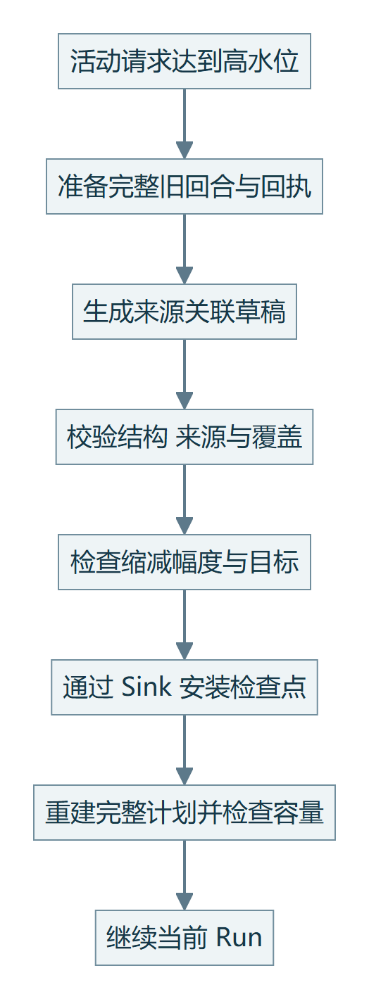

[call_generator](../../../crates/runtime/src/compaction.rs) 对结构或来源校验失败保留一次修复：维持原有 system 和素材前缀，在 user 输入尾部追加诊断，要求重新生成完整草稿。诊断加入后也要满足生成器输入限额。第二次仍失败就返回错误，没有把错误草稿静默改成合法对象。

[compact_with_adapter](../../../crates/runtime/src/compaction.rs) 还会比较确定性历史与检查点投影的估计大小。替换结果必须更小，并达到配置的目标；否则分别返回 COMPACTION_INSUFFICIENT_REDUCTION 或 COMPACTION_TARGET_NOT_REACHED。这一步计算的是该压缩投影，完整运行计划还包含冻结片段、动态快照和工具 Schema，因此安装后仍要重新检查整份请求。

安装的最后边界在 [maybe_auto_compact](../../../crates/runtime/src/orchestrator.rs)：它先对消息副本进行持久化准备，只有 sink.install 成功，才把准备后的消息同步回活动数组并切换 active_checkpoint。没有可压缩材料、生成失败或安装失败，都不会把这次预处理提前提交到活动消息。

[RunCheckpointSink](../../../crates/server/src/agent_run.rs) 把安装连接到对应用户与聊天的保存入口。这里的检查点恢复的是模型历史的表达，不重新执行笔记或阅读动作。会话事件如何保存、重启后如何重建，在第 16 章继续展开。

本轮用脚本化草稿驱动实际压缩模块重放：旧用户消息和旧回答进入 eligible_items，当前问题及未完成调用原样保留；成功投影顺序为“基础指令 → 冻结片段 → 检查点 → 当前问题 → 未完成调用”，原始历史字节不变。修改被覆盖的旧来源后再使用同一个检查点，被版本与来源校验拒绝。遗漏覆盖项后给出有效草稿，恰好两次生成即可修复；连续两份无效草稿则失败并保留原历史。

这些结果验证了交接结构和失败处理，实际模型的摘要质量另有边界，集中在章末说明。

<a id="ch11-s12"></a>

### 11.5 缓存复用、累计用量与进展停止

<a id="ch11-s13"></a>

#### 输入更短与前缀更稳定，有时需要取舍

动态快照采用追加方式，使计数和状态更新不必改写前面的消息。这项选择的背景见[调用成本与 DeepSeek 适配记录](../../%E8%AE%A1%E5%88%92-%E8%B0%83%E7%94%A8%E6%88%90%E6%9C%AC%E4%B8%8EDeepSeek%E9%80%82%E9%85%8D.md)：项目保留每次决策前的最新状态，同时希望维持已有消息前缀。当前 ContextFragmentLedger 已实现这一组织方式。

但让旧正文退为回执，会改变旧 Tool 消息；工具发现会改变 tools，历史压缩会更换大段输入，演示保存后的源码投影也可能缩短旧调用参数。它们释放空间或减少重发内容，却可能缩短可重复的前缀。只比较“本次输入比上次少了多少字节”，无法判定实际成本是否下降。

当前有两类观测可以配合使用。[AgentRequestAudit](../../../crates/runtime/src/agent_request_audit.rs) 记录协议无关计划的消息、工具体积和估计输入；[RequestTracker::observe](../../../crates/runtime/src/request_diagnostics.rs) 则比较同一 Run、同一调用用途下最终 Provider JSON 的前后变化。后者分别记录不变消息前缀、首个变化字段、工具变化和设置变化。

messages_append_only 只说明消息数组保持前缀且有所追加。即使它为 true，也要继续看 tools_changed 和 settings_changed。实际缓存量来自 [model_usage](../../../crates/runtime/src/provider_stream.rs) 解析的 Provider usage，缺失字段保留为未知。

项目已经有一份能说明这种取舍的历史观测。[2026-10-03 Linux 缓存观测报告](../../%E4%BF%AE%E5%A4%8D%E8%AE%B0%E5%BD%95-Linux%E7%BC%93%E5%AD%98%E8%A7%82%E6%B5%8B.md) 记录了一次基于技术书选区生成富文本演示的任务，模型为 deepseek-v4-flash，共 18 次主问答模型调用，没有摘要压缩调用。报告给出的统计为：

| 历史记录中的指标 | 数值 |
| --- | ---: |
| 累计输入 | 1,277,397 token |
| 缓存输入 | 925,568 token |
| 未命中输入 | 351,829 token |
| 累计输入缓存命中率 | 72.4573% |
| 输出 | 80,335 token |

命中率按 `925568 / 1277397` 计算。不能对 18 个单次百分比简单求平均，因为每次输入规模不同。报告还指出，第 12、13、17 次合计贡献 247,443 个未命中 token，占未命中总量约 70.33%；第 13、17 次首先变化的是旧 Tool 正文，与 48 KiB 正文预算的淘汰路径对应。

报告同时记录了当时压缩预检查会提前清理活动消息的问题。当前 maybe_auto_compact 已改为先准备副本、安装成功后提交。历史中的故障帮助解释这条边界的必要性，不能据旧报告断言当前仍沿用相同错误路径。

这些数字来自既有真实任务报告，本章只回读报告并核对所引用数字的算术，没有重新发起演示任务或核对远端账单。它们支持的判断是：少数较早消息变化可能与大量未命中同时出现，诊断需要观察具体请求。它们不构成“所有任务都会达到这一缓存率”的预测，也没有隔离出服务端缓存策略的因果作用。

<a id="ch11-s14"></a>

#### 成本记录怎样与容量判断分开

设两个教学请求分别输入 1,000、9,000 token，缓存量为 900、4,500。单次命中率分别为 90% 和 50%，平均值是 70%；整项任务的缓存输入却是 5,400，总输入 10,000，正确的合计命中率为 54%。同样，即使累计输入达到几十万，也不能据此断言某一次请求超过窗口。

当前普通 Resident 的停止条件没有继续使用累计 usage 作为活动容量。OuterConfig 仍保留名为 token_budget 的旧配置字段，默认值为 120,000，但其注释和循环行为已经明确把累计用量留作遥测。默认 max_turns 为 None；显式有限调用和专用实验仍有各自边界。[ADR-0150](../../adr/0150-resident-unbounded-tool-loop-and-progress-stops.md) 记录了这一修订及多人服务累计限额的后续移除。

用量字段之间也需要避免重复相加。reasoning_output_tokens 在当前合同中属于 output_tokens 的子集；缓存输入属于总输入的子集。Provider 的流式 usage 若是累计快照，同一次调用后来的快照替换前一个。请求估计值、提供方报告的 token 数和实际货币账单是不同口径，解释成本时应保留各自来源。

<a id="ch11-s15"></a>

#### 空间足够，也可能应该停止

回到阅读任务。读取前文得到新的证据，形成来源，保存笔记，都是可以改变下一步的事实。如果模型不断重复读取相同范围，或者只改变参数顺序，输入仍然装得下，也没有理由一直执行。

[tool_progress_signature](../../../crates/runtime/src/orchestrator.rs) 组合当前证据范围、来源绑定、定位信息、能力激活、已完成能力、阅读现场、私人状态版本及效果等事实。ToolCallProgressGuard 把规范化后的工具参数与进展状态共同用于重复判断；因此相同调用在事实已经变化后，可以获得新的判断依据。

ProgressPhaseGuard 进一步观察整个批次前后是否有变化。当前连续无进展批次限额为 2；参数不断变化而事实不变，仍会累计停滞。定位失败可保留一次合法恢复机会，真正的状态变化重置停滞及恢复标记。本轮对这一状态机局部重放，确认第一次停滞不阻断、第二次阻断、恢复机会只可用一次，新进展使计数重新开始。

文字终答也参与这条判断。若任务还缺所要求的页面或阅读动作，只有“已经完成”的话语不会结束目标；没有新事实的终答会计入无进展。连续停滞后，工具循环进入禁用工具的收尾采样，解释已经完成的部分和实际停止原因，结果保留 incomplete 与 AGENT_NO_PROGRESS。容量不足、压缩失败、取消和显式轮数触顶各有自己的路径。

对这个设计，可以作如下分析：用采样次数控制运行很容易，却会把长而有效的任务与短而空转的任务混在一起；用实际状态变化判断进展更接近任务，但需要维护领域事实。当前进展信号仍然是一组程序可观察的代理量。它允许系统判断是否有新材料或效果，任务是否充分回答、笔记是否写得准确，还需要交付与质量判断。

<a id="ch11-s16"></a>

### 已知边界与本轮验证

本章于 2026-10-07 回读当前实现，HEAD 为 `4e0b68e`。第 10 章保留其 `5e10516` 加当时工作区的依据；本章没有以新提交号替代前章核对，也没有修改产品代码。

当前边界集中在以下几处。

- **48 KiB 只约束活动工具正文。** 回执、用户与 Assistant 文本、调用参数、动态快照和 Schema 仍会增长。回合中语义压缩保留整个当前回合，因此一个很长的单 Run 可以在没有新的可压缩旧回合时耗尽容量。默认不限轮数与无限上下文并不等价。
- **检查点的来源结构校验不判断句子真假。** 本轮夹具没有发生任何写入，把草稿文本改成“笔记已经保存”，只要来源编号、覆盖和大小满足合同，实际模块仍接受它。prepare_compaction 当前把 required_semantic_states 初始化为空；强制某来源仍属未完成义务或歧义的入口 require_open_for_test 只用于测试。因此，不能从该项测试推断生产路径已经自动识别所有未完成事项。现有提示要求保持这些语义，但真实摘要质量仍依赖生成模型。
- **输入 token 是启发式估计。** 字符权重和协议无关 JSON 不等于每个 Provider 的实际分词与封装；图像等输入还走专门补充路径。预算计算用于本地决策，不能把估计 fits 写成服务端必然接受。正文算例限定于文本和相应配置。
- **缓存观测说明客户端输入变化与报告用量。** JSON 字节前缀不是模型的 token 前缀，旧消息变化也不能单独证明服务端为何未命中。历史 18 次调用的统计没有在本轮重新测量。
- **压缩与继续执行各有有限条件。** 单回合过大、分层合并仍过大、修复失败、不能达到缩减目标或安装失败，都有真实失败出口。当前代码没有实现无条件远程续接或无限层级压缩；ADR 中未来可替换生成器的方向保持为设计余地。

本轮实际执行了 20 组离线局部重放。context_fragment、model_runtime 和 compaction 使用当前文件中测试模块之前的实现；预算与工具结果账本、进展判断采用当前方法，驱动只补充必要类型及脚本化返回。没有调用真实模型，没有运行完整 Runtime、Server 或产品测试套件。

| 重放范围 | 组数 | 实际观察 |
| --- | ---: | --- |
| 片段更新、快照重建、前缀、压缩后锚点与指导角色 | 5 | 最新版本唯一；相同计划不重复；快照保留次序与数据角色 |
| 新鲜正文保护及已采样正文淘汰 | 2 | 未采样结果保留；最早已采样结果退为 null，原消息不变 |
| 三种活动预算与字符估计 | 4 | 90,000／102,000／129,000 的压力判断及 `AB中` 估计一致 |
| 压缩素材、投影、来源失效、一次修复与语义边界 | 8 | 当前后缀保留；错误覆盖与伪造证据被拒绝；结构合法不证明语义真实 |
| 连续停滞、恢复机会及新进展 | 1 | 两次停滞触发阻断，实际变化重置 |

现有 provider_history_projection_preserves_native_and_react_tool_pairing、tool_result_projection_active_fresh_bodies_share_one_turn_budget、compaction_checkpoint_install_projects_fixed_order_without_mutating_history、auto_compaction_precheck_redaction_is_committed_only_after_install、auto_compaction_ignores_cumulative_usage_when_active_request_fits 等用例，本轮阅读了正文来确认覆盖范围，没有重新执行这些产品用例。图表、摘录、链接与算例的书稿检查另记于 [SOURCES](../SOURCES.md#%E7%AC%AC-11-%E7%AB%A0%E7%BB%AD%E5%86%99%E9%AA%8C%E8%AF%81%E8%AE%B0%E5%BD%95)。

<a id="ch11-s17"></a>

### 源码选读

| 顺序 | 实现入口 | 带着什么问题读 |
| --- | --- | --- |
| 1 | [orchestrator.rs](../../../crates/runtime/src/orchestrator.rs)：build_sample_request、messages_with_context_fragments | 下一次采样的输入怎样从历史、本轮状态与工具能力汇合 |
| 2 | [context_fragment.rs](../../../crates/runtime/src/context_fragment.rs)：record_sampling、retain_sampling_history、project_sampling_snapshots | 为什么状态更新不必重写消息前缀，压缩后怎样找回锚点 |
| 3 | [tool_result.rs](../../../crates/runtime/src/tool_result.rs)：project_text、ActiveToolResultLedger | 读取结果怎样缩小、继续，以及何时退为回执 |
| 4 | [model_runtime.rs](../../../crates/runtime/src/model_runtime.rs) 与 [auto_compaction.rs](../../../crates/runtime/src/auto_compaction.rs) | 估计输入、输出预留、高水位和实际容量怎样分开 |
| 5 | [compaction.rs](../../../crates/runtime/src/compaction.rs)：prepare_compaction、call_generator、compact_with_adapter、project_compaction_checkpoint_messages | 哪些消息可压缩，谁拥有来源与运行元数据，失败时保留什么 |
| 6 | [request_diagnostics.rs](../../../crates/runtime/src/request_diagnostics.rs) 与 [provider_stream.rs](../../../crates/runtime/src/provider_stream.rs) | 输入变化与实际用量各自能说明什么 |
| 7 | [ADR-0091](../../adr/0091-model-aware-agent-request-tool-exposure-and-active-context-budget.md)、[ADR-0150](../../adr/0150-resident-unbounded-tool-loop-and-progress-stops.md) | 为什么从累计用量、固定轮数转向活动请求与实际进展 |

<a id="ch11-s18"></a>

### 思考与面试表达

介绍本章机制时，可以从一次工具返回说起：

Understand Book 为每次采样构造独立请求计划。稳定指令和本轮冻结现场靠前，动态状态按决定追加，本轮工具结果先提供有界正文，已采样结果可在预算压力下退为回执。更早的完整回合通过来源关联检查点整理，当前问题和调用后缀保留。程序对整份请求检查容量，以实际进展决定是否继续，同时单独记录累计用量和缓存情况。

下面的追问分别改变这条链路中的一个条件。

1. **工具返回了三节正文，为什么本轮证据可能只有前两节？**

   执行结果经过模型正文预算投影，证据接纳使用投影后的 model_body 和 evidence_arguments。后续范围由 continuation 表达。应查看模型实际收到的正文和证据账本，不能直接拿原始返回长度推断观察范围。

2. **把动态状态放在末尾，是否就保证了缓存命中？**

   这种组织保持了该部分历史前缀，但旧正文淘汰、工具定义和请求设置仍可能变化。先看最终请求诊断，再看 Provider 报告的缓存输入；两者结合才能解释这次调用，字节前缀不能代替服务端缓存指标。

3. **输入达到高水位，为什么还能继续采样？**

   高水位是提前整理的阈值。默认回退算例中，90,000 输入加 12,000 预留超过 96,000 高水位，仍小于 128,000 窗口。当前代码在无可压缩材料且仍满足容量判断时允许继续，真正装不下则返回容量错误。

4. **压缩失败时，能否先删掉最早一半消息继续？**

   当前合同需要保留用户任务、来源关联和工具配对，直接删除会绕过这些条件。实现先验证草稿和缩减结果，再安装检查点；失败保留原活动历史并报告原因。若要改变这一策略，需要重新说明哪些信息可以丢弃，以及如何保证任务仍可继续。

5. **每个来源都被覆盖，是否说明摘要没有遗漏任务？**

   覆盖说明来源在结构上有去向。文本可以把“待保存”错误写成“已保存”，仍引用同一个来源。本章局部重放验证了这个边界。应将结构验证、未完成状态建模和模型摘要质量分开，实际动作仍以权威写入结果为准。

6. **默认没有轮数上限，怎样避免一直循环？**

   容量通过活动请求预算和压缩处理，重复与停滞通过本轮事实判断。当前连续两批没有进展会触发停止，定位问题保留一次恢复机会；新的证据或效果使停滞重置。用户取消、压缩失败和不可恢复错误也会结束运行。模型说“继续处理”本身不构成进展。

接下来进入[第 12 章](#ch12)。上下文组织使模型能够继续推理和执行，但生成中的文字还需要经过草稿展示、来源绑定、公开内容编译和最终接纳，才能成为读者实际得到的回答。


---

<a id="ch12"></a>

## 第 12 章 来源与流式交付

第 11 章把阅读任务推进到了下一次模型请求。读者继续追问：“前面这个定义还有哪些适用条件？结合刚才的解释接着讲。”运行时已经组织好历史和本轮材料，模型也已经读到相关原文。现在，第一段文字开始返回。

如果等整轮结束再显示，读者可能长时间只能看到“正在运行”。把每个模型片段立即贴到聊天区，又会遇到另一组问题：半个来源标记还不能点击，刚出现的解释可能只是下一次工具调用的前言，模型生成结束时历史也可能尚未保存。一个界面上已经完整显示的答案，重新打开聊天后却不存在，会破坏读者对交付结果的判断。

本章继续沿这次追问，回答一个具体问题：怎样在缩短等待的同时，让最终回答和来源保持一致？需要分清的不是“流式”和“非流式”两个开关，而是模型输出、公开草稿、来源绑定、观察恢复和持久接纳几条相接的边界。

<a id="ch12-s1"></a>

### 12.1 模型流、运行活动与回答草稿

<a id="ch12-s2"></a>

#### 一次返回，同时产生两类可见信息

模型还在生成时，读者关心的不只有答案，也关心系统是否在工作。例如，运行正在读取一段原文，随后进入综合请求，再整理来源。这里的活动必须来自实际执行，而不能从模型说出的“我正在查询”推断。

当前实现将运行活动和回答草稿分开。[RunActivity](../../../crates/runtime/src/run_events.rs) 保存步骤身份、父步骤、工具或模型用途、开始时间、结果状态及用量；[AnswerPatch](../../../crates/runtime/src/answer_stream.rs) 保存某一版公开草稿的更新。模型等待属于 activity，读者看到的解释属于 draft。后者仍然可以替换或撤回。

| 运行中的对象 | 产生位置 | 它说明什么 | 后续消费者 |
| --- | --- | --- | --- |
| ModelDelta | Provider 响应解析 | 文本片段、工具参数、usage 或完成信号已经到达 | 观测适配器与相应投影器 |
| RunActivity | 模型和工具的真实执行点 | 某一步开始、成功、无结果、被拒绝、失败或取消 | 活动界面与运行摘要 |
| AnswerPatch | 公开回答投影 | 某个回答版本现在可以展示哪些内容 | Server 草稿快照与 Web 状态 |
| AgentAnswerView | 完整编译及交付路径 | Markdown、来源按钮和其他交付片段的确定结构 | 最终回答与持久历史投影 |

[ObservedAdapter](../../../crates/runtime/src/run_events.rs) 包住已有模型适配器，为请求生成活动，并记录首个非空文本片段和最近一次 usage。最终线协议请求通过 ModelDelta::Request 进入内存中的请求诊断，随后被截住；它不会被当成公开回答向下传递。Provider 的推理续接字段在流解析中另行组装，也没有变成 Text 事件。

第 10 章介绍过 Native 与 ReAct 的协议差异。这里两者继续共享观察边界：Native 的 content 可以直接成为候选正文；ReAct 或其他结构化输出则要从 JSON 中提取顶层 answer/final 字段。工具参数中恰好出现一个名叫 answer 的字段，不构成公开答案。

<a id="ch12-s3"></a>

#### 先收齐协议事实，再谈工具执行

[provider_stream::read_sse](../../../crates/runtime/src/provider_stream.rs) 把 Provider 的 SSE 数据帧组装成一次响应：正文累计进入 text，工具调用按 index 合并 id、name 和 arguments，usage 作为累计快照逐次发出。解析器要求正常完成理由；流截断、只有 DONE 而没有 finish reason、length 等未完成理由，以及完成后继续出现正文或工具内容，都有错误出口。

工具参数可以跨多个帧。例如先得到 `{`，后来才得到 `"lid":"1.1"}`。此时 ToolArguments 事件携带的是目前累计的字符串，观察者不会据半份参数启动 book.text。完整响应返回后，仍由第 10 章的统一分派路径处理调用与参数。

公开投影器对这两种输出采取不同动作。它的观察入口很短：

```rust
        match delta {
            ModelDelta::Text(text) => self.push(&text),
            ModelDelta::ToolArguments { .. } => self.discard(),
            _ => {}
        }
```

这段摘录来自 [AnswerProjector::observe](../../../crates/runtime/src/answer_stream.rs)。文字可以尝试成为草稿；工具参数一出现，就撤回这一候选回答。外层循环在完整返回带有工具调用或 Provider 出错时，也会调用 discard。于是，“我先比较两段原文。”即使曾经显示过，也不会因为它是一个完整句子而变成最终交付。

<a id="ch12-s4"></a>

#### 稳定边界解决的是片段问题

AnswerProjector 保留累计 raw，而不是分别检查每个片段。对于结构化输出，answer_field_prefix 解码顶层字符串的已到达前缀，并暂存尚未完整的转义；随后 stable_end 寻找适合公开的结尾。

当前稳定边界规则跟踪括号数量和反引号状态。中文句末标点及换行可以形成边界；英文句末标点还需要后面出现空白。处于未闭合括号或反引号之内时，程序继续等待。因此一个被拆成 `[[sou` 和 `rce:...]]` 的标记，不会因为某一个网络分片恰好结束就被认作完整来源。

找到稳定前缀之后，运行时把它交给与终答相同的编译器：

```rust
pub(crate) fn compile_answer_preview(
    raw: &str,
    bindings: &[SourceBinding],
    provenance: &AnswerProvenanceLedger,
) -> Option<AgentAnswerView> {
    compile_agent_answer(raw, bindings, provenance)
        .ok()
        .map(|answer| answer.view)
}
```

[compile_answer_preview](../../../crates/runtime/src/orchestrator.rs) 没有另设一套宽松的来源规则。前缀编译通过才发布；未通过时继续保留之前的合法草稿，等待后续片段或完整交付处理。

“稳定”在这里表示当前可以展示，并不表示后续绝不会改动。一个只有 Markdown、没有来源的旧视图，如果恰好是新视图的前缀，投影器可以只发送 append。涉及来源或其他结构变化时，它发送完整 replace。这样既减少普通连续文字的重复传输，也保留了重排公开视图的能力。

<a id="ch12-s5"></a>

#### 首字、首个草稿与完整结果，是三个时刻

项目分别记录 model_first_text_ms 和 answer_first_patch_ms。前者相对某次模型活动开始，后者相对 Run 开始，而且只在 patch 含有 view 时记录。一个 Run 可能先查询、再综合、再收尾，所以不能直接把这两个数相减解释为“展示编译耗时”。

用一组明确的教学时刻说明差异。假定 Run 从 0 秒开始，收尾模型请求在 1.0 秒开始，1.8 秒到达第一个非空文本片段，2.3 秒第一次发布草稿，8.0 秒生成结束，8.2 秒保存并发布终态。则这次请求的首文本等待为 0.8 秒，Run 的首草稿等待为 2.3 秒；相对于 8.2 秒才显示内容，首个可读结果提前了 5.9 秒。

这组时刻没有来自模型实测。它说明流式交付改善的是可读进展到达时间，而最终接纳仍然保留完整编译与保存阶段。实际测量还需要对齐同一次 Run、同一个模型步骤及其用途。

<a id="ch12-s6"></a>

### 12.2 已观察证据怎样成为来源绑定

<a id="ch12-s7"></a>

#### 从读过的文字申请来源身份

现在回到读者要求解释的“适用条件”。为了看清数据流，设本轮已经通过合法读取观察到一段教学原文：

> 条件 A 限定了这个结论的适用范围。

模型准备把它放在解释后面，调用 source.present：

```json
{"quote":"条件 A 限定了这个结论的适用范围。"}
```

输入是连续引文。当前 [TurnEvidenceLedger::prepare_present](../../../crates/runtime/src/orchestrator.rs) 在本轮已观察区间中调用 Book::match_source_quote，得到精确证据范围，再调用 resolve_source。这个顺序避免模型自行选择一个看似可信的位置。

```rust
            1 => {
                let (evidence, _) = matches.pop().expect("one match");
                let resolved = book.resolve_source(&evidence, SOURCE_PRESENTATION_LOCALE, None)?;
                Ok((evidence, resolved))
            }
```

这一分支只处理唯一匹配。零个匹配返回 SOURCE_NOT_OBSERVED；多个匹配返回 SOURCE_AMBIGUOUS，并给出有界的已观察上下文，要求扩大引文以消除歧义。Book 的匹配先尝试精确文本；仅在没有精确匹配且引文含公式分隔符时，尝试限定的公式边界空白归一化。范围如何使用 UTF-16 单位，沿用第 4 章的原文定位约定。

第 9 章已经解释证据从哪里进入账本。本章需要保留的关键前提是：当前问题中的已验证选区、真正接纳的工具证据，与只包含位置的导航状态有不同资格。历史上读过某段文字，也不会自动把它变成这一次 Run 已观察的原文。

<a id="ch12-s8"></a>

#### 内部绑定与公开标签各保存什么

present_prepared 对同一证据范围复用已生成的引用；新范围则生成 source_ref_id，保存 SourceBinding，并根据当前集合处理标签歧义。实际引用 ID 是程序生成的 opaque 值，用户不需要解释它的字面含义。

内部绑定连接了三个方向：book_id 确定所属书，evidence_range 和 evidence_text_digest 用于重新核对原文，label_snapshot 与 preview_snapshot 用于保留当时的可读指代。工具返回给模型的结果只需要 source_ref_id、label 和 preview。内容摘要用于判断重新解析出的证据是否仍与历史绑定一致。

下面把 ID 简写为 source_ref_demo，并把标签设为“段落 · 适用条件”。这是本章重放使用的人工绑定，便于观察编译结果；实际项目中的 ID 和标签由已解析原文产生。

```json
{
  "source_ref_id": "source_ref_demo",
  "label": "段落 · 适用条件",
  "preview": "条件 A 限定了这个结论的适用范围。"
}
```

模型随后可以写出：

```text
条件 A 限定了结论的适用范围。[[source:source_ref_demo]]
```

这段候选还没有成为界面上的按钮。编译器会核对 ID 是否属于提供给本次编译的绑定，拆出正文与来源片段，并只保留回答实际使用的来源。

```json
{
  "parts": [
    {"kind": "markdown", "text": "条件 A 限定了结论的适用范围。"},
    {"kind": "sources", "source_ref_ids": ["source_ref_demo"]}
  ],
  "sources": [
    {"source_ref_id": "source_ref_demo", "label": "段落 · 适用条件"}
  ]
}
```

普通 UI 消费的是这个 AgentAnswerView。[RightRail.vue](../../../packages/web/src/components/RightRail.vue) 根据 part.kind 分别渲染 Markdown 与来源按钮，而不是重新猜测自由文本中哪个数字代表出处。相邻来源标记会形成一个来源组，同一 ID 在来源表中去重。

<a id="ch12-s9"></a>

#### 草稿中的来源也要有可解析的归属

来源按钮在最终保存前也可以出现。AnswerProjector 创建时把当次绑定交给 RunEvents，再交给 Server 的 RunStream。读者点击草稿来源时，[RunStream::source_binding](../../../crates/server/src/agent_stream.rs) 同时要求：运行仍为 pending，book_id 和 turn_id 相符，而且该 ref 确实出现在当前草稿 view 的 sources 中。

只存在于运行内部、尚未公开的绑定，不能通过这一入口被当作当前草稿来源。修复先清空旧视图，或工具调用使草稿撤回后，旧草稿中的 ref 也随之退出这个临时解析入口。

保存后，来源从会话中对应 turn 的绑定解析。[workspace_source_binding](../../../crates/server/src/lib.rs) 还核对当前出版引用与原回合归属；[route_agent_source_resolve](../../../crates/server/src/lib.rs) 使用保存的摘要重新解析原文。复验失败时，弹窗保留标签和短预览并标成失效，关闭“进入正文”；真正跳转的 source_open 路径也会拒绝过期来源。来源解析与跳转是两个动作，打开来源弹窗本身不会改变主阅读位置。

由此形成一条连续关系：当前已观察的原文产生绑定，当前公开草稿决定临时可见性，持久回合保存最终使用的绑定，之后的点击再回原文复验。

<a id="ch12-s10"></a>

### 12.3 公开内容怎样编译与修复

<a id="ch12-s11"></a>

#### 回答的内容与来源身份分别检查

[compile_agent_answer](../../../crates/runtime/src/orchestrator.rs) 首先处理已绑定来源的有限格式归一化，再拆分来源标记，最后检查公开文字的来源属性。正文为空、来源标记出现在可见文字之前、标记不闭合或 ID 不属于本次绑定，都会产生编译问题。

程序对公开内容和内部位置的区分来自 AnswerProvenanceLedger。用户问题、历史公开对话和已验证证据正文可以形成公开文字来源；工具参数中的 lid、运行现场的位置字段则形成内部定位来源。一个数字如果原本出现在公开版本号里，不应仅因字面碰巧像 LID 就被删除。明示的 `LID 1.2.3` 等内部位置表达，仍走专门的检查。

这一机制解释了为什么不能在前端统一用正则删除所有点分数字。前端已经失去“这个数字从哪里来”的信息；运行时在观察输入与工具结果时保留来源属性，才能按上下文判断。

有限格式归一化也有明确的落点。例如模型已经拿到合法 ID，却在普通句末写成 `[source_ref_demo]`，normalize_bound_source_suffixes 可以把它转为标准标记。该函数只处理已绑定 ID 和有限句末形状，跳过代码围栏、引用块、缩进块及若干带引号的行。它没有为任意自由文本发明来源。

<a id="ch12-s12"></a>

#### 一个来源标记跨三次到达，会发生什么

以下重放使用上一节的教学绑定，直接驱动当前 AnswerProjector、编译函数和 RunStream。它将网络分片与公开变化放在同一张表里：

| 新到达的 Text | 累计候选的变化 | 草稿中可见的结果 |
| --- | --- | --- |
| `条件成立。[[sou` | 有完整句子，来源开头未闭合 | 只显示“条件成立。”，没有可点击来源 |
| `rce:source_ref_demo]]` | 标记已经闭合，但稳定结尾仍停在之前的句号 | 保持上一版正文，仍没有来源按钮 |
| 一个换行 | 稳定前缀包含完整标记 | replace 为带来源片段的视图，临时来源可解析 |
| ToolArguments | 这一响应进入工具调用分支 | discard，正文与临时来源一起退出草稿 |

第二行容易误解。标记闭合只解决了来源语法问题；当前 stable_end 仍然需要新的稳定结尾。若整个回答就在标记后结束，没有下一段或换行，最终完整编译会处理这段尾部。不能从“模型已把标记发完”推断浏览器当场就多出一个按钮。

<a id="ch12-s13"></a>

#### 修复是替换某一版回答

完整候选无法编译时，[deliver_agent_answer](../../../crates/runtime/src/orchestrator.rs) 先尝试确定性的 RAW_LID_LEAK 修复。只有问题全部属于这一类型、跨度可以定位并且替换后重新编译成功，才采用这个结果。能够匹配已绑定范围时使用对应标签，否则使用“相关原文”等通用措辞，避免为修一个内部编号重新生成整段解释。

其余问题才进入一次受限的模型修复。请求包含原问题、候选正文、违规位置、允许的来源及必要的当前任务信息；模型不能调用工具，也不能新建来源。修复结果仍须重新经过完整编译。Provider 失败、出现工具调用、没有正文或再次编译失败，最终交付固定失败提示，并把 outcome 标为 incomplete。

修复为什么不会和旧草稿混在一起？[RunEvents::answer_identity](../../../crates/runtime/src/run_events.rs) 使用两个层次的身份：

```rust
        if repair {
            state.answer_revision += 1;
        } else {
            state.answer_id += 1;
            state.answer_revision = 0;
        }
        (state.answer_id, state.answer_revision)
```

新的回答候选增加 message_id，修复沿用候选身份但增加 revision。修复投影器一建立，先发布这一新版本的 `replace + view: null`，清空旧草稿。之后才发布修复内容。Server 的 apply_patch 和 Web 的 reduceRun 都按这两个字段拒绝旧版本覆盖。

append 还要求身份与版本完全一致。它只是同一版草稿的延长，不能用来跨版本合并。事件是否重复交付则由下一节的 seq 处理；回答版本与传输顺序解决的是两类不同问题。

当前路径可以概括为：

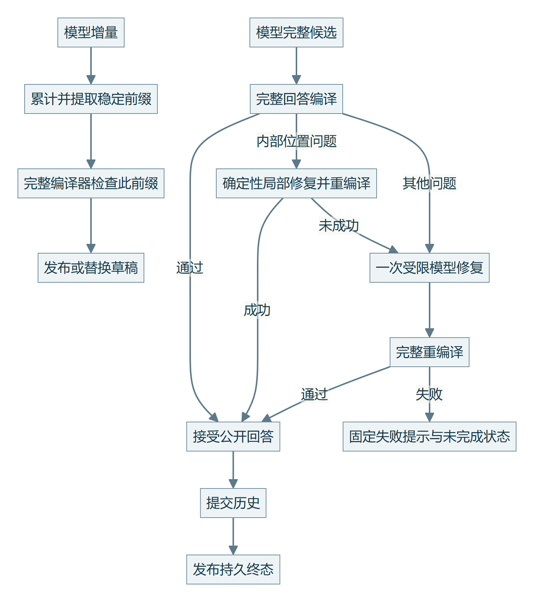

这里采用当前实现的两层修复顺序。[ADR-0086](../../adr/0086-runtime-owned-user-visible-source-references.md) 解释了运行时掌握来源呈现权威的理由；早期文档中“未知 ref 或 LID 泄露触发一次修复”的概述，需要结合现在的确定性局部修复分支理解。

<a id="ch12-s14"></a>

### 12.4 SSE、快照和重连怎样接在同一个位置

<a id="ch12-s15"></a>

#### 连接观察运行，不拥有运行

Provider 到 Runtime 的模型流，与 Server 到浏览器的运行事件流，是两个方向、两套内容。后者发送的是 model.started、tool.finished、answer.patch、run.finalizing 等项目事件。浏览器不接触半份工具参数，也不需要重新组装 Provider 响应。

[RunStream](../../../crates/server/src/agent_stream.rs) 保存一份当前快照及近期事件队列。发布事件时，在同一个 Mutex 内更新快照、增加 last_seq、建立带 seq 的事件并加入队列。普通构造器默认将事件队列限制为 256 KiB；网络服务使用配置的 event_bytes。

每个订阅线程从队列复制这一批事件，再在锁外写网络连接。连接中断只结束观察线程，不取消 Run，也不重新触发问题。这样慢连接不会把模型与工具的执行权握在自己手里。[ADR-0127](../../adr/0127-resident-agent-streaming-and-runtime-activity.md) 明确记录了这项取舍：控制动作走 HTTP，观察恢复走 SSE 和快照。

<a id="ch12-s16"></a>

#### 缺少一段事件时，恢复状态比补齐全部 token 更直接

客户端带上游标 k 后，服务器要判断能否连续提供 k 之后的事件。read_after 的判断包含两个条件：游标没有超前，并且它恰好等于最新序号，或者下一条所需事件仍在缓冲中。

```rust
        let covered = after.is_some_and(|seq| {
            seq <= snapshot.last_seq
                && (seq == snapshot.last_seq
                    || buffer
                        .events
                        .front()
                        .is_some_and(|(first, _)| seq + 1 >= first.seq))
        });
```

能够覆盖就返回 seq 大于 k 的事件；无法覆盖、第一次订阅或游标超前，则返回一条 run.snapshot，序号就是该快照的 last_seq。选择“快照 N”与“从 N 往后继续”的边界发生在同一把锁下，避免读到一份状态却使用另一个时刻的游标。

设教学缓冲只有 512 bytes。重放中连续写入 30 次 Reader 状态变化，旧游标 0 已经无法衔接，于是 read_after 返回唯一的 snapshot(30)。再写入一次状态变化后，从 30 读取，只得到 event(31)。读者恢复的是第 30 步已经形成的状态，后面继续消费新事实，无需逐条播放前 30 步。

这里的快照已经把 append 应用到完整草稿。重新连接的浏览器可以直接获得当前文字，不必找到那份草稿最早的 replace。来源表同样跟随已物化的视图保存。

<a id="ch12-s17"></a>

#### 同一个 seq，必须属于同一次观察代次

本地流可以使用纯数字游标。当前网络服务还使用 observation_epoch，将游标写成 `epoch:seq`。如果进程重启或建立新的观察缓冲，旧代次的游标会被解释为需要快照，而不是继续沿用旧序号。服务端在相应 run.snapshot 中附带 live_buffer_reset。

[multi_user_host.rs](../../../crates/server/src/multi_user_host.rs) 优先读取 Last-Event-ID，再考虑 after 查询参数。其 events 入口先核对用户、回合和原出版引用，随后选择活动流或持久终态快照；serve_authorized 在持续输出时继续使用相应观察许可。多人身份和调度细节留到第 19 章，这里只需要知道：游标本身不授予另一个聊天的观察权。

Web 的 [reduceRun](../../../packages/web/src/agent-run-state.ts) 普通路径拒绝不同 turn、旧代次，以及 `seq <= last_seq` 的事件。只有带新观察信息的 reset 快照可以重设序号，快照仍须属于同一 book/session/turn。于是，即使同一 append 事件再次到达，也不会把“第二句”追加两次。

本轮直接导入实际 reducer 重放：旧状态在 seq=90，新代次快照从 seq=0 开始，旧草稿被清除；随后收到旧代次事件仍被拒绝。另一个聊天的 reset 快照也不能替换当前状态。

<a id="ch12-s18"></a>

#### 快速到达不等于每片都立刻重绘

[useAgentRun](../../../packages/web/src/useAgentRun.ts) 把连续 answer.patch 合并到下一次 requestAnimationFrame 安装。活动或终态事件到达时，先 flushDraft，再安装新状态；这避免一份排队中的旧草稿晚于终态覆盖界面。RightRail 对已经完成的渲染块使用稳定内容保留，活动尾部继续增长。

重连时，客户端还查询原 Run 的状态。网络暂时不可达、身份失效和找不到原运行各有显示分支；这些分支都没有把原问题重新 POST 一遍。恢复观察、请求取消和重新提出问题，继续保持不同的用户动作。

<a id="ch12-s19"></a>

### 12.5 接受回答、持久终态和未保存结果

<a id="ch12-s20"></a>

#### 编译通过之后，还欠一次保存

完整编译生成可接受回答，只完成公开内容边界。真正交付还要把它固定在原聊天、原 turn 中，与最终来源、活动摘要及已经发生的动作保持一致。

[execute_model](../../../crates/server/src/agent_run.rs) 在循环返回后发出 run.finalizing，收集消息、effects、trace 和 activities。这个状态仍然是 persistence_state=pending。随后 finalize_user_agent_turn 在候选会话中形成回合结果，移出并保存 source_bindings，验证交付引用，再进入 [session_runtime::finish](../../../crates/server/src/session_runtime.rs)。

当前 JSONL 路径先结清不确定写入，记录需要交付的效果、来源和演示关联，最后追加 TurnFinished。TurnFinished 带有 outcome、错误、运行摘要、来源绑定和历史修订等最终事实。底层 [SessionLog::append](../../../crates/server/src/session_log.rs) 的正常写入边界是：

```rust
        self.append_with(event, |file, bytes| {
            file.write_all(bytes)?;
            // File is unbuffered; flush documents the boundary and sync_all is
            // the durable acknowledgment before publishing the projection.
            file.flush()?;
            file.sync_all()
        })
```

日志投影在成功写入后更新，会话内存投影再跟随同一事件变化。部分事实可以先于终态保存，因此保存失败不能被解释为“这一轮什么都没发生”。JSONL 的重试、尾部处理和重启投影将在第 16 章展开。

<a id="ch12-s21"></a>

#### 最后显示的内容来自已接纳视图

协调器取得保存后的 turn_view，才调用 RunStream::finish。对于完成回合，finish 使用其中 outcome.answer_view 作为 canonical 视图，发布 finalize patch，随后发布运行终态并清除 draft。它不会把浏览器当前累计的草稿当成保存依据。

最近一次草稿可能缺少最后一个来源标记，也可能还没有体现局部修复；最终编译与保存后的视图才包含完整接纳结果。最终视图可以与最近一次草稿不同，替换是协议的一部分。

| 当前结果 | 运行终态事件 | execution_state | persistence_state | 草稿处理 |
| --- | --- | --- | --- | --- |
| 保存成功的完成回合 | run.completed | completed | saved | 用 canonical 视图 finalize，再清空 draft |
| 保存成功的执行失败 | run.failed | failed | saved | discard，展示已保存错误 |
| 保存成功的取消 | run.cancelled | cancelled | saved | discard，保留已发生动作 |
| 最终保存路径报错 | run.persistence_failed | ended | failed | discard，显示未保存状态 |

表中的“完成回合”是生命周期结果，不自动等于读者问题已经解决。来源修复失败会形成固定失败提示和 incomplete outcome，仍可能作为一条 Completed 回合保存。Goal 是否完成还要走另一个判断，这正是下一章的入口。

下面的时序图将网络草稿与保存后的终态接在一起：

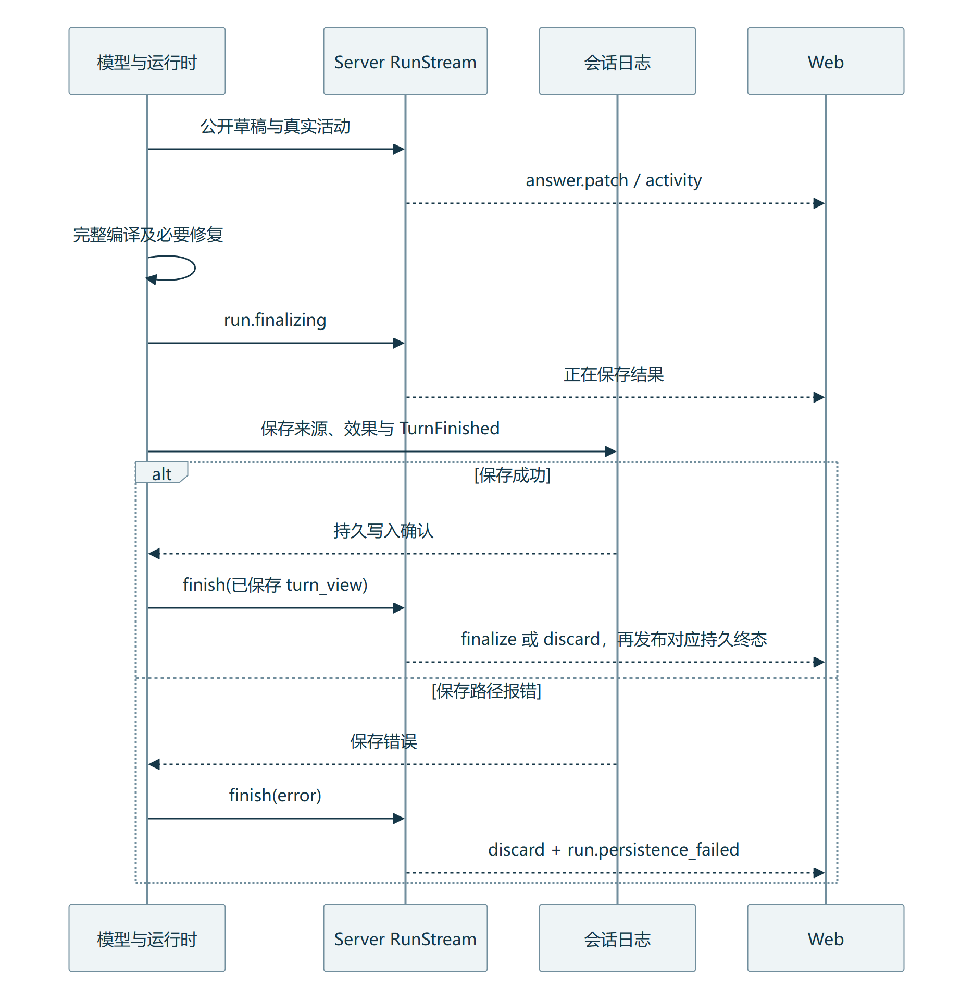

<a id="ch12-s22"></a>

#### 重试保存，为什么不应再问一次模型

已经生成答案、甚至已经保存笔记之后，若最后保存回合失败，再次执行整轮会改变答案并可能重复动作。当前本地协调器保留 UnsavedRun 供检查；网络服务的 [RunAdmissions](../../../crates/server/src/run_admission.rs) 则在内存中保留 prepared、FinishedRun 和 stream，并将准入记录标为 unsaved。

网络 retry_save 取回这份结果，重新执行保存路径。核心调用仍是原来的 finished：

```rust
            match self.save_finished(&run.user, &run.prepared, &run.finished) {
                Ok(view) => {
                    run.stream.finish(Some(view), None);
                    self.update(&row, "settled", false)?;
                }
```

这段 [retry_save](../../../crates/server/src/run_admission.rs) 没有重新调用 execute_model。若终态已经落盘，只是其后的教学关联或回顾任务协调失败，save_finished 会识别已完成回合，再补齐后续保存步骤。客户端 retryResidentSave 成功后重新观察同一个 descriptor。

如果进程已经退出，内存中这份完整未保存结果不再存在。当前恢复路径依据持久事实报告中断或补齐已保存结果，不凭空重新生成原答案，也不自动重放已发生工具。原运行如何准入、排队和在重启后收口，将在第 16、19 章继续追踪。

<a id="ch12-s23"></a>

### 已知边界与本轮验证

来源身份、公开格式和回答真实性有不同的保证。本轮人工绑定的预览明确写着“条件 A 限定了这个结论的适用范围”，把候选改成“这段原文证明条件可以全部忽略”，只要使用合法标记，编译器仍然接纳。这个实际观察说明：来源编译证明引用属于允许集合、文字符合当前呈现规则，不证明解释在语义上成立，也不强制每个主张都带来源。证据质量与回答效果需要另行评估。当前修复提示要求最小修改，但编译器没有验证修复前后的语义等价；ADR-0087 中允许自由重写的旧描述，也不能直接当作当前提示合同。

stable_end 是针对当前输出的轻量启发式，没有构造完整 Markdown 语法树。没有适合边界的长段落、未闭合结构或停在最后标记的回答，都可能较晚才公开；草稿通过当前检查，也仍可能因后续调用或修复而撤回。当前投影还会对增长后的完整稳定前缀重新编译，不能只根据增量网络字节推断本地处理成本。

256 KiB 限制的是近期事件队列的序列化体积。快照中的活动集合、完整草稿、effects 和绑定另有占用，单条恢复快照也可以大于队列限额。因此该常量不能写成整个 Run 的内存上限。慢观察者通过丢弃旧事件并读取状态恢复连续性，代价是不能依靠该缓冲永久重放所有逐片段过程。

持久状态还需要区分宿主路径。网络 save_finished 包括回合终态之后的教学和回顾协调；整个调用报错时仍会进入 TURN_UNSAVED，即使前面的 TurnFinished 已经写入。重试代码为此检查 already_saved。故“未保存”表示最终保存路径没有完整确认，不能推出磁盘上没有任何本轮事实。本地 UnsavedRun 与网络的原结果重试入口也不能等同为统一的跨进程自动续跑能力。

本轮于 2026-10-07 回读上述实现，HEAD 为 4e0b68e；相关产品文件读取时没有未提交修改。书中以下观察来自实际运行的离线局部驱动：

| 实际执行的分组 | 组数 | 主要观察 |
| --- | ---: | --- |
| 来源编译与公开来源属性 | 6 | 标记拆分和去重、非法引用拒绝、已绑定后缀归一化、数字碰撞、局部修复及语义边界 |
| 回答草稿投影 | 5 | 稳定前缀、顶层结构化字段、分片来源、工具撤回与修复版本 |
| Provider SSE 解析 | 4 | 文本完成、按 index 合并工具、未完成流拒绝及截断前 usage 仍可观察 |
| Server 观察缓冲 | 4 | snapshot(30) 接 event(31)、代次游标、保存后终态及取消与未保存的区分 |
| Web 状态合并 | 4 | 重复 append 去重、旧回答版本拒绝、代次重置与终态清理 |

共 23 组。Rust 驱动复制当前被调用的编译、来源属性、草稿、流解析和缓冲逻辑，省去 TypeScript 导出标注及未调用的外围入口，补充最小消息与事件配套类型；来源绑定是人工夹具，磁盘写入与模型修复没有在这个驱动中执行。Web 驱动直接导入当前 agent-run-state.ts。所有夹具都在书稿目录内临时运行。

已有产品测试还覆盖真实本地 HTTP、来源点击、终态写入故障及网络原结果重试。本轮阅读了相关用例，没有执行这些产品测试，没有调用真实模型，也没有重新验收 ADR-0127 所引用的 Linux 历史实验。实际重放、仅源码阅读和教学时刻分别记录在 [SOURCES](../SOURCES.md#%E7%AC%AC-12-%E7%AB%A0%E7%9A%84%E5%85%B7%E4%BD%93%E4%BE%9D%E6%8D%AE)，避免把局部断言扩大为整条服务链路的实测。

<a id="ch12-s24"></a>

### 源码选读

可以沿“文字到达后，接下来谁有权决定什么”阅读：

1. [provider_stream.rs](../../../crates/runtime/src/provider_stream.rs) 的 read_sse 与 [run_events.rs](../../../crates/runtime/src/run_events.rs) 的 ObservedAdapter：先区分传输片段、执行活动和用量快照。
2. [answer_stream.rs](../../../crates/runtime/src/answer_stream.rs) 的 AnswerProjector、stable_end、answer_field_prefix、apply_patch：观察累计前缀、撤回、替换和版本规则。
3. [orchestrator.rs](../../../crates/runtime/src/orchestrator.rs) 的 prepare_present、compile_agent_answer、repair_raw_lid_leaks、deliver_agent_answer：把已观察文字连到绑定、公开视图和修复。
4. [agent_stream.rs](../../../crates/server/src/agent_stream.rs) 的 read_after、source_binding、finish 与 [agent-run-state.ts](../../../packages/web/src/agent-run-state.ts) 的 reduceRun：对照两端如何恢复同一个状态。
5. [agent_run.rs](../../../crates/server/src/agent_run.rs)、[session_runtime.rs](../../../crates/server/src/session_runtime.rs) 与 [run_admission.rs](../../../crates/server/src/run_admission.rs)：找到 finalizing、TurnFinished 和 retry_save 的真实顺序。

<a id="ch12-s25"></a>

### 面试回答与条件变化

**如果被问到“项目怎样做带来源的流式回答”，可以这样回答：**

“我们把 Provider 片段、运行活动、公开草稿和持久终答分开。Runtime 累计模型输出，提取顶层正文的稳定前缀，再通过与最终回答相同的来源编译器发布草稿。来源必须来自本轮已观察证据，并由运行时绑定成 opaque ref；工具调用或修复可以撤回旧草稿。Server 用有序事件和快照恢复观察，重连不会重新执行问题。最终回答完整编译并保存后，才用 canonical 视图发布终态。这样能提前显示可读内容，同时保留来源归属和保存状态的权威边界。”

这个回答可以通过以下条件变化继续展开。

1. **如果模型先说了一句话，随后才输出工具参数，前一句算最终答案吗？**

   它最多是曾经可展示的草稿。ToolArguments 会使投影器 discard，完整响应的工具分支也会撤回候选。工具执行仍由原来的循环处理，后续收尾建立新的回答身份。

2. **为什么已经读过原文，还要经过 source.present？**

   已观察账本说明本轮取得了哪些材料；source.present 从这批材料中确定要公开指向的精确范围，形成标签、预览与引用身份。最终编译只接受这些绑定。三个步骤分别回答“读过什么”“准备引用什么”“回答实际用了什么”。

3. **如果来源标记被网络拆开，单片检查是否足够？**

   不足。标记或位置表达可以跨片段形成，必须保留累计状态。当前投影先等稳定前缀，再编译整个前缀；最后一段还要经过完整终答编译。

4. **修复版本和 SSE 序号能否合成一个字段？**

   它们表达不同关系。message_id/revision 说明 patch 属于哪一版候选，seq 说明这一观察流中事实的顺序并去重。重连的新观察代次还需要 epoch，使重置后的低序号不会与旧连接混淆。

5. **缓冲已经淘汰了客户端缺失的事件，为什么仍能继续？**

   Server 持有已物化快照。它在同一锁下选出 snapshot(N) 和 N，客户端安装后从 N 之后继续。这个恢复承诺针对当前状态，不能用来宣称所有逐 token 历史都被持久保存。

6. **回答生成完成但保存失败，应该怎样处理？**

   先撤下草稿的完成语义，显示保存路径失败，并保留已经发生的效果。网络服务可以用原 FinishedRun 重试保存，无需再调用模型；进程重启后依照持久事实处理。再次生成答案和重试保存是不同操作。

7. **有合法来源，为什么还不能证明回答正确？**

   绑定核对身份、范围和公开表示，语义推论是否成立仍是另一个问题。本章用合法引用接纳错误解释的重放给出了直接反例。面试时应说明已实现保证与模型质量评估各自负责什么。

接下来进入[第 13 章](#ch13)。一次 Run 已经形成可保存、可回看、有来源的交付，但读者可能仍在完成一个跨多轮的学习任务。下一章将把运行终态、聊天 Goal、工作计划与 Tutor 的教学过程接起来。


---

<a id="ch13"></a>

## 第 13 章 持续目标与教学过程

第 12 章结束时，读者已经收到一段有来源、已保存、可以重新打开的解释。问题是：“前面这个定义还有哪些适用条件？结合刚才的解释接着讲。”一次 Run 到这里可以结束，读者的学习却未必结束。

读者接着说：“先让我试着指出适用条件，再根据我的回答补充；最后把关键区别做成一张演示页。”这句话同时引出了两个方向：演示页是一项需要实际交付的任务，指出条件则是一段需要观察回应、调整讲法的学习过程。只保留最近一条聊天摘要，容易把“刚才准备做什么”当成“已经做完什么”；让模型在每轮末尾填写一个完成分数，又无法说明这个分数究竟评价了任务、答案还是读者。

本章沿这次追问，把任务要求、工作安排、教学现场、实际回应和后续选择连起来。中心问题是：系统怎样跨运行保持任务方向，并把解释与学习过程连接起来？

<a id="ch13-s1"></a>

### 13.1 Run、聊天 Goal 与 Tutor 的生命周期

<a id="ch13-s2"></a>

#### 三种“继续”，需要三种状态

如果模型还在调用工具，“继续”可能指同一个 Run 的下一次采样。如果已经返回但演示页尚未交付，“继续”指同一个用户任务的新一轮运行。如果演示页已经交付，读者仍要通过练习理解条件，“继续”又指教学会话的下一步。把它们合成一个状态机会让取消、恢复和完成相互干扰。

当前实现把三者交给不同的所有者。

| 对象 | 保存的核心内容 | 生命周期与归属 | 结束意味着什么 |
| --- | --- | --- | --- |
| 阅读 Run | 本轮固定输入、已观察证据、工具激活、活动和结果 | 一次读时执行；沿第 9—12 章的运行路径管理 | 本轮执行已经停止或形成终态 |
| ResidentGoal | 用户要求、消息依据、工作判断、结果引用和停止原因 | 由当前 AgentChatSession 持有，可以在同一聊天中跨 Run 恢复 | 这项聊天任务完成、取消或被替换 |
| TutorSession | 用户学习意图、约束、材料范围、默认教法及相关学习事实 | 由当前用户的 LearningMemory 持有，独立于某个聊天和页面 | 这次学习被暂停或显式结束；历史仍可恢复 |

这里的 Run 仍是阅读阶段的一轮执行。第 7 章的构建执行器承担素材构造，第 8 章的发布使素材成为可消费成果，它们不会因为读者完成了一道题而自动启动或收口。

[ResidentGoal](../../../crates/runtime/src/goal.rs) 的注释直接说明任务属于聊天。其 status 有 Open、Completed、Cancelled、Superseded；其中 Superseded 表示原任务被另一项任务替换。工作项自己的 Completed 则是另一套枚举，后面会看到两者为何必须分开。

[TutorSession](../../../crates/memory/src/learning.rs) 的状态是 Active、Paused、Ended。它由 TutorControl 指向唯一的当前会话。这个“全局”指同一用户跨阅读、聊天和演示入口共享的控制，不是所有用户共用一个教学开关。

可以用一条时间线理解这些关系：第一次 Run 解释条件，第二次 Run 准备演示页，第三次 Run 根据读者回答给出反馈。前两轮可以共同服务一个 Goal；后两轮又可以处于同一 TutorSession。Goal 与 TutorSession 通过这次请求和交付事实发生联系，各自保留自己的身份与结束条件。

<a id="ch13-s3"></a>

#### 开启教学、暂停学习和改变教法

TutorControl 默认关闭。用户开启后，Server 的 [start_request](../../../crates/server/src/teaching.rs) 检查正式教学素材是否就绪，以及当前材料是否属于正在进行的学习。已有暂停会话可以继续；没有当前会话时，可以以“理解当前阅读材料；从当前问题或阅读位置开始”为意图建立会话。已经结束的会话需要用户明确开始或继续，换书也不会自动替换原来的学习目标。

用户主动建立新目标时，TutorAction::Start 保存 user_intent、explicit_constraints、material_scope 和 default_teaching_intent，并暂停原来的当前会话。Start 发生在全局关闭状态下时，新会话先保持 Paused。SetEnabled(true) 本身只保存开启意图；是否能够推进，仍要经过来源就绪和会话范围判断。

关闭开关的核心动作很短，摘自 [TutorState::apply](../../../crates/memory/src/learning.rs)：

```rust
                if !enabled {
                    self.pause_current();
                }
                self.control.enabled = *enabled;
```

这解释了为什么“关闭 Tutor”能够暂停持续教学而保留学习意图、已交付内容和已有回答。反过来，End 只结束选定会话，全局开关仍可保持开启；Resume 可以显式恢复历史会话。

默认教法还有独立的 SetMode。读者这一轮要求“直接讲解”，可以覆盖当前动作的引导方式，却不必修改会话默认，更不必关闭 Tutor。开关回答“现在是否持续教学”，教法回答“这一步怎样教”，会话意图回答“这段学习为什么进行”。

这些用户操作带有 operation_id 和 expected_revision。[LearningStore::mutate](../../../crates/memory/src/learning.rs) 在同一个 SQLite 写事务中接纳事件并更新状态投影。相同操作重试返回原操作对应的结果；新的操作如果沿用过期 revision，则返回冲突，由界面重新读取状态。这一安排服务于正常的失败重试和多入口操作，防止一次“暂停”在重试中变成另一项新决定。

<a id="ch13-s4"></a>

### 13.2 用户要求、工作计划和实际成果

<a id="ch13-s5"></a>

#### 为什么需要一个能改计划、不能随意改要求的 Goal

回到读者的演示请求。Agent 可能先找定义，再发现一个反例更适合解释，随后调整制作次序。方法变化是有用的；把最后的演示页悄悄改成一段文字，却改变了用户要求。

ResidentGoal 因此分别保存三类信息。requirements 记录用户要得到什么，每项带 basis_turn_id 与 verification；working 记录 Agent 当前怎样推进；result_refs 指向已经产生的结果。interpretation 是对任务的解释，也需要保留用户消息依据。

工作计划使用最小结构：GoalWorkItem 只有 id、description 和 status。状态为 pending、in_progress、completed。focus、open_questions 和 next_move 继续保存当前焦点、未解决问题和下一步。下面是一份教学示例中的 goal.update 输入：

```json
{
  "operation": "working",
  "focus": "核对定义的适用条件",
  "open_questions": ["反例是否确实违反原文中的条件？"],
  "next_move": "读取反例相关原文，再制作演示页",
  "items": [
    {"id": "conditions", "description": "核对定义与条件", "status": "in_progress"},
    {"id": "page", "description": "制作并交付演示页", "status": "pending"}
  ]
}
```

处理这份输入时，[GoalUpdate::Working](../../../crates/runtime/src/goal.rs) 可以整体替换工作项，所以重排、拆分、删去不再需要的步骤都不需要发明一个新的计划服务。省略 items 保留原列表，显式给出空数组才清空列表。新列表的身份与描述不能为空，身份不能重复；验证发生在写入工作状态之前，失败不会留下半份新焦点。

同一份 working 重复提交，如果状态没有变化，revision 不增加。已有用例 ex13_work_plan_replacement_omission_clear_and_noop_preserve_requirements 在本轮局部驱动中实际执行，得到下面的次序：

| 操作 | Goal revision | 原要求 |
| --- | --- | --- |
| 建立目标 | 1 | 保留演示交付 |
| 首次设置工作计划 | 2 | 不变 |
| 重复相同计划，或省略 items 且其余字段相同 | 2 | 不变 |
| 只改变焦点，省略 items | 3 | 不变，列表保留 |
| 替换并重排工作项 | 4 | 不变 |
| 显式清空列表，再重复清空 | 5 | 不变，第二次为空操作 |

revision 记录权威任务状态的变化，工作项数量和已完成数量则表达 Agent 的执行判断。这两个计量不能互相替代。

<a id="ch13-s6"></a>

#### 修改要求必须说明依据

同一个工具还支持 Refine 和 Revise，但它们有不同条件。

| 更新方式 | 可以改变什么 | 关键约束 |
| --- | --- | --- |
| Working | 焦点、问题、下一步、工作项 | Goal 必须仍为 Open，不改 requirements |
| Refine | 对初始请求的解释和要求 | 只限目标建立的原回合；不能移除已有的明确演示要求 |
| Revise | 根据当前用户消息修订解释和要求 | 指向当前回合并引用当前原话；取消演示要求还需明确的纯文字请求 |

Revise 的第一道检查来自 [ResidentGoal::apply_update](../../../crates/runtime/src/goal.rs)：

```rust
                if basis_turn_id != current_turn_id || basis_quote.trim().is_empty() || !current_user.contains(&basis_quote) {
                    return Err("revision must quote the current user message".into());
                }
```

例如，用户只说“修一下引用”，不能成为删除演示交付的依据；用户明确说“改成文字即可”，才满足当前实现额外的纯文字条件。初始要求由 ResidentGoal::new 根据请求中的演示名词、动作词与纯文字短语建立，后续再由 Agent 在上述规则内细化。

外层 [GoalUpdate 分派](../../../crates/runtime/src/orchestrator.rs) 先克隆当前 Goal，在候选上执行 apply_update。发生变化时先调用 persist_goal，再替换运行上下文中的 Goal。持久写入失败不会使下一次决策使用一份尚未保存的新要求。

<a id="ch13-s7"></a>

#### 模型看到的目标必须带上实际缺口

只重复一句“请交付演示页”仍不够。模型需要知道：已经读过哪些材料，存在多少尚未提交的候选，本轮到底交付了什么。

[ResidentGoal::projection](../../../crates/runtime/src/goal.rs) 把要求、工作状态、保存的结果引用和本轮事实一起组织成动态上下文。例如观察了 2 段原文、存在 1 个候选、交付页数仍为 0 时，投影明确保留 presentation delivery still required。已读材料表示信息条件改善，候选表示制作有进展；二者都不会抹去交付缺口。

objective_gap 的演示分支更直接：

```rust
        if self.requirements.iter().any(|r| r.verification == GoalVerification::PresentationDelivery)
            && delivered_presentations == 0 {
            return Some("The requested presentation has not been delivered. A draft, preview, or prose answer does not satisfy it.");
        }
```

即使全部工作项都写成 completed，只要本轮没有对应交付，这个分支仍然返回缺口。本轮执行的 ex13_completed_items_do_not_complete_goal_or_satisfy_delivery 同时确认了 Goal 仍为 Open。

这也解释了与第 11 章压缩检查点的分工。摘要可以保存历史任务叙述，当前 Goal revision 才是任务权威状态。新一轮仍要重新获取当前可用的证据、工具和制作现场；一个历史候选或旧的工具激活记录不能直接恢复执行资格。

<a id="ch13-s8"></a>

### 13.3 主动带读与教学地图

<a id="ch13-s9"></a>

#### 先判断是否具备教学条件

持续学习需要比“原文能打开”更强的前提。要选择起点、理解关系、安排一个有依据的活动，系统需要知道有哪些正式对象、对象间怎样联系、重点内容有哪些认知素材，以及哪些地方仍有来源缺口。

公共 TeachingMap 承担这部分材料组织。构建侧的 [closeTeachingStage](../../../packages/core/src/teaching-build.ts) 收口正式对象、认知素材和来源审阅；教学发布形成 teaching/versions/某版本/map.json 与 teaching_readiness.json。map 保存来源身份与版本、正式对象、认知素材和审阅结果，readiness 则给出可消费的覆盖回执和 limitations。

发布前，必需任务不能仍处于 pending、blocked 或 preparation_required；来源审阅中存在未通过样本时需要先修复。最终回执分别表达 source、structure、objects、cognitive_materials 的 complete，以及 source_review 的 passed。构建方法仍复用前几章的工作单元、接纳和成果发布，不在读者每次发问时临时重建全部公共资产。

阅读端的 [source_readiness](../../../crates/server/src/tutor_api.rs) 按当前 Book 复验回执版本、来源一致性、覆盖状态、教学版本路径和 map 的来源归属。没有回执时返回 preparing；已经发布但版本、覆盖或对应文件不可用时返回 stale。读取这个状态本身不会启动学习，也不会替用户批准一次昂贵构建。

[ADR-0142](../../adr/0142-grounded-teaching-map-and-whole-source-readiness.md) 解释了这种安排的理由：预构建公共素材，而不预先穷举每位读者的课程、题目和演示页。读者的当前问题和表现会改变下一步选择，公共材料与私人学习状态因此有不同的更新节奏。

<a id="ch13-s10"></a>

#### 一轮教学使用哪一版现场

用户点击开启、开始或继续后，[App.tutorAction](../../../packages/web/src/App.vue) 先保存控制动作，再调用 /tutor/start；条件满足时，通过原来的聊天入口发出继续学习请求。教学复用 Resident 的运行机制。

[freeze_prepare](../../../crates/server/src/teaching.rs) 为这轮请求选择有效会话和正式素材，形成有界上下文，并准备 TurnBound 事件。其中的身份合同摘自 [TeachingBinding](../../../crates/memory/src/teaching.rs)：

```rust
pub struct TeachingBinding {
    pub tutor_session_id: String,
    pub session_revision: u32,
    pub control_revision: u32,
    pub source_id: String,
    pub source_revision: String,
    pub map_revision: String,
    pub chat_session_id: String,
    pub turn_id: String,
}
```

这组字段把“哪次学习、当时的控制和会话状态、哪版材料、哪次聊天请求”连到一起。运行期间如果用户暂停或切换会话，current 会检查当前控制与会话 revision，拒绝继续自动推进。旧活动仍保留原来源和教学版本，回读时不会偷偷用最新版素材替换原题的含义。

冻结上下文包括用户意图、约束、默认教法、当前原话、已确认解释偏好、相关表现和最近教学事实。初始只投影最多 16 个对象摘要、8 条近期事实；相关学习表现最多 6 项、累计不超过 6000 字符，单项原话等预览另有长度限制。它向 Agent 提供下一步的线索，再通过工具按需展开材料或历史。

这些数字描述的是不同局部投影的边界，不应相加后当成整轮请求的 token 上限。第 11 章的请求预算仍然负责最终输入容量。

<a id="ch13-s11"></a>

#### 从地图到一个 TeachingMove

假设读者已经明确选择引导式学习。这一轮要求“先让我指出适用条件”，Agent 首先通过 tutor.step 的 material 操作读取目标对象与关联认知素材，再通过 Book 工具读取原文。

两次读取承担不同作用。material 告诉 Agent 正式对象和素材怎样组织，并保存本轮读取该对象的记录；原文读取则在当前证据账本中留下真实范围。[step 的 select 分支](../../../crates/server/src/teaching.rs) 同时要求目标属于绑定的教学版本、已有 material 记录，并且已观察范围至少覆盖对象的一处来源绑定。需要公开引用时，继续经过第 12 章的来源绑定与文字编译。

随后模型提交 TeachingMove：要处理哪些 object_ids、关注哪个 capability、采用哪种 kind、题面是什么、允许哪些动作，以及这次教法来自何处。当前 kind 支持 explain、observe、compare、question、source_focus。一个动作可以解释，也可以让读者辨认、比较或回到原文；主动带读并不要求每一轮都出题。

[tutor::instructions](../../../crates/runtime/src/tutor.rs) 给出当前请求、会话默认、已确认偏好、neutral 的意图优先顺序。select 会验证意图来源的若干可检查条件：声称来自当前请求时要引用当前原话，声称来自默认时要与默认值一致，direct_explanation 必须配合 explain。当前请求超出学习意图时，Agent 可以记录 outside，转为处理普通请求。

选中动作后，工具返回 selected 事件身份，并要求把动作交付到最终回答。它没有立即宣布读者看见了题面。至此，任务仍要穿过上一章的回答编译和持久保存边界。

<a id="ch13-s12"></a>

### 13.4 教学活动、评估和学习证据

<a id="ch13-s13"></a>

#### 一道题从“选中”到“作答”

为了把输入和结果讲具体，下面采用已有教学测试使用的平均速度算例，缩小为一段原文和一个正式对象。测试原文表达“平均速度等于总路程除以总时间”；本章中的对象名 speed-demo、回合 t-demo 和操作名都是教学身份，不对应用户的一本真实书，也不是新做的模型实验。

Agent 已经取得对象素材与原文，选择一个要求解释分子、分母的动作。下例采用开放题合同，题面、rubric 和允许的来源在看到读者回答前一起冻结：

```json
{
  "operation": "select",
  "move": {
    "move_id": "speed-check",
    "object_ids": ["speed-demo"],
    "capability": "explanation",
    "kind": "question",
    "interaction_intent": "guided_inquiry",
    "intent_origin": "current_request",
    "intent_quote": "先让我解释",
    "prompt": "平均速度应当怎样计算？请分别说明分子和分母。",
    "actions": ["submit", "revise", "request_hint"],
    "hint": "先分别确定整个过程的路程与用时。",
    "assessment": {
      "rule": {
        "kind": "open",
        "items": [
          {"id": "distance", "criterion": "分子使用总路程，接受等价表述", "source_lids": ["1.1"]},
          {"id": "time", "criterion": "分母使用总时间，接受等价表述", "source_lids": ["1.1"]}
        ]
      },
      "source_lids": ["1.1"],
      "source_sufficient": true,
      "feedback": "after_submit"
    }
  }
}
```

假设本轮原话包含“先让我解释”，1.1 属于当前已读取的原文，且 speed-demo 已完成 material 读取，这个输入具备进入 select 校验的基础。题面和提示还要经过公开文字的来源编译；这里使用的是教学问题与提示，没有虚构一个未注册的公开来源标记。

select 将评分来源的确切文字保存为 scoring_sources，并在 MoveSelected 事件中保存对象版本、评分器版本、重试与帮助策略。当前开放题最多 12 个原子标准，序列化后的评分来源超过 24000 字节会被拒绝，要求缩小活动。

交付链可以画成下面的时序：

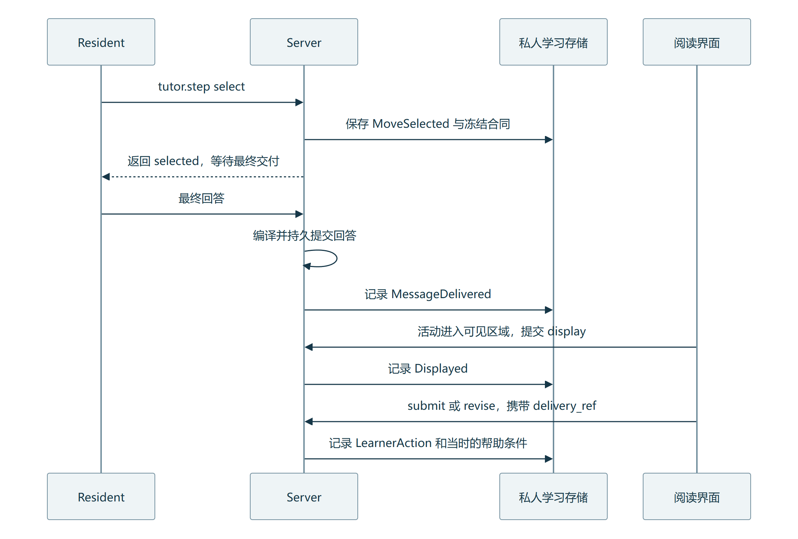

[record_user_delivery](../../../crates/server/src/teaching.rs) 从已保存的聊天回合读取结果。只有回合已完成、没有交付失败或未解决的修复问题时，才根据所选动作记录 MessageDelivered。如果动作绑定演示页，还要确认最终 answer_view 挂载了确切 presentation_id/revision。公开动作会移除隐藏的 assessment、hint 和 explanation，按需请求帮助时再提供相应内容。

MessageDelivered 之后，[TutorActivities.vue](../../../packages/web/src/components/TutorActivities.vue) 用可见区域观察和宿主 ready 状态触发 /tutor/display。界面展示是一个独立事实，打开活动数据不等于读者已经看见它，更不等于理解了它。

读者提交回答时，输入可以是：

```json
{
  "operation_id": "speed-answer-1",
  "delivery_ref": "delivery:t-demo:speed-check",
  "action": "submit",
  "response": "用全程路程除以全程用时。"
}
```

这份输入不携带“正确”或“已掌握”。[behavior](../../../crates/server/src/teaching.rs) 检查活动是否允许该行为、是否已经展示、正式提交时是否仍可用，并区分首次 submit 与后续 revise。它把当前 response、attempt 和已展示帮助的引用写入 LearnerAction。相同 operation_id 重试复用原来的尝试次数与帮助条件，不能因为后来显示了答案，就把先前的独立回答改写成辅助回答。

与活动有关的后续聊天也带 teaching_ref。它可以跨聊天回到原活动，但仍受原材料、原教学会话与版本约束。关闭自动教学时，对旧活动的普通解释仍可以记录为帮助事实；自动推进和历史回读因而能够分别控制。

<a id="ch13-s14"></a>

#### 为什么先冻结合同，再接纳评估

评分合同解决一个具体问题：如果模型看完答案才决定“这题考什么”，同一题就没有稳定的判断依据。[AssessmentContract](../../../crates/memory/src/assessment.rs) 保存规则、source_lids、source_sufficient 和反馈策略；题面、对象与能力则由包含它的 TeachingMove 和事件绑定一起固定。

当前分两条判定路径。choice_set 由确定性函数 assess_closed 判定；open 由隔离的模型调用提出逐项判定，再交给 accept_open 检查。

已有封闭题测试使用选项 A、B、C，正确集合为 A、B。本轮实际执行得到：

| 回答或条件 | assess_closed 的结果 | 解释 |
| --- | --- | --- |
| [" b ","a"] | Correct | 去首尾空白、转小写，并按集合比较 |
| A | Partial | 只选中了正确集合的一部分 |
| C | Incorrect | 包含错误选项 |
| page says correct | Uncertain | 不属于允许的选项集合 |
| [broken | 返回解析错误 | Server 行为入口将未接纳的判定呈现为 unassessed |
| 原正确集合，但 source_sufficient=false | Uncertain | 冻结合同声明来源不足，不能得出正确判断 |

技术失败与依据不足因此有不同含义。Unassessed 表示还没有接纳一份有效判定；Uncertain 是已经保留的一种“不足以判断”的结论。二者都不会因为系统需要一项分数，就被压成 Incorrect。

开放题由 [assessment_input](../../../crates/server/src/teaching.rs) 读取原正式提交、冻结题面、合同与 scoring_sources，组成私有评估包。它只接受同一教学会话的 submit/revise；普通聊天回应不会自动升级成这类正式评分。已有判定可以直接返回。

[tutor::evaluate](../../../crates/runtime/src/tutor.rs) 在现有适配器上发出一次无工具的独立请求，输出上限为 3000 tokens。它要求每个 rubric 项恰好一次，结果包含 verdict、读者原话片段、来源片段和理由；指令明确区分缺少必要条件与来源不确定，不请求总分或掌握结论。

这个评估调用计入当前运行的轮次与用量，并遵守取消与预算。外层循环用 tutor_assessment_attempts 限制同一 action 在一个 Run 内的评估尝试；工具调用、无法解析的输出或失败不会产生有效评分。新一轮可以在原行动身份上继续处理仍未评分的回应。

accept_open 校验项目数量、重复身份、rubric 身份、理由、读者片段和冻结来源。下面是其中最直接的依据检查：

```rust
        if item.reason.trim().is_empty()
            || !response.contains(&item.response_quote)
            || (item.verdict == ItemVerdict::Supported && item.response_quote.trim().is_empty())
            || (item.verdict != ItemVerdict::Uncertain && item.sources.is_empty())
            || item.sources.iter().any(|s| {
                s.quote.trim().is_empty()
                    || !criterion.source_lids.contains(&s.lid)
                    || !sources
                        .get(&s.lid)
                        .is_some_and(|text| text.contains(&s.quote))
            })
```

接纳后，全部 Supported 得到 Correct，有支持也有不支持得到 Partial，全部不支持得到 Incorrect；只要来源声明不足或存在 Uncertain 项，整体保持 Uncertain。保存的 ResponseAssessment 指向原 action_ref、contract_ref 和 evaluator_version。相同判定可以重试，已经接纳的判定不能被悄悄覆写。

<a id="ch13-s15"></a>

#### 一次表现怎样影响下一步

有了回应和判定，系统仍然需要保留“在什么条件下表现出来”。首次独立答对、看到提示后答对、反复修改后答对，对下一步讲法的含义不同。

[derive_assessed_evidence](../../../crates/memory/src/learning_evidence.rs) 从正式行为与判定生成 LearningEvidence，保留对象版本、能力、原话、帮助、尝试和确切交付引用。自评使用主观解释身份并保持不确定；没有有效判定的普通正式回答不会被这条路径强行生成客观证据。另有受限的未评分来源辨析入口，目前针对 evaluation 能力，仍保存来源与原回应依据。

随后 rebuild_learner_projection 按对象、对象版本、来源版本与能力聚合表现。其核心计数顺序为：

```rust
            match e.status {
                AssessmentStatus::Correct if !e.assistance_refs.is_empty() => {
                    row.assisted_support += 1
                }
                AssessmentStatus::Correct if e.attempt > 1 => row.revised_support += 1,
                AssessmentStatus::Correct => row.independent_support += 1,
                AssessmentStatus::Partial => row.partial += 1,
                AssessmentStatus::Incorrect => row.difficulty += 1,
                _ => row.uncertain += 1,
            }
```

帮助条件优先于尝试次数，所以“看过提示的第二次正确回答”记入 assisted_support。这里保留的是有条件的观察，不是把不同活动压成一个掌握百分比。

本轮执行了该模块的现有局部用例：为同一对象设置三次 Correct 表现，分别为独立首次、首次有帮助、第二次无帮助，另设一次没有判定的回应。投影得到 independent_support=1、assisted_support=1、revised_support=1；缺判定的第四次没有生成这条客观证据。删除派生投影后重建，结果一致。

随后把第一条解释追加为用户纠正，原话与原解释仍然保留，新的解释 supersedes 原解释并转为 Uncertain。重建后独立支持变为 0，有帮助与改答支持仍各为 1。这使“我刚才其实参考了例题”的纠正能够影响下一轮，而不需要改写原始回答。

下一轮 freeze_prepare 读取当前对象版本下的相关投影，包含原话预览、系统解释、用户纠正和证据水位；缺项保持 unknown。Agent 可以据此再给一个例子、追问条件或直接解释。第 15 章将继续展开这些私人事实的写入、纠正与跨场景使用。

<a id="ch13-s16"></a>

### 13.5 完成判断、未完成状态与继续入口

<a id="ch13-s17"></a>

#### 回答可以结束，交付缺口仍要保留

当模型不再请求工具时，Resident 准备最终回答。对于仍有教学现场但尚未 select/outside 的回合，[外层循环](../../../crates/runtime/src/orchestrator.rs) 会在允许时提示补做一次选择；仍未解决则返回教学动作未完成来源绑定的错误。对于 Goal，则重新计算 objective_gap。

如果演示页或 Reader 操作仍未完成，循环会结合第 11 章的进展判断继续推进。触及适用的轮数限制、实验预算或无进展停止条件时，结果保留 incomplete 与原因，不能用一句“已完成”替代实际成果。这里采用当前停止机制；ADR-0136 中最初的十二轮背景不是所有当前运行的固定上限。

Server 保存终态时，再通过 [goal_turn_delivered](../../../crates/server/src/lib.rs) 核对交付条件。它首先拒绝 incomplete、warning、缺少 answer 或 answer_view 的结果；演示分支则要求最终视图包含属于该 Goal 的确切版本引用。状态改变的条件摘自 finalize_user_agent_turn：

```rust
            if goal.status == runtime::goal::GoalStatus::Open
                && turn.status == AgentAssistantStatus::Completed
                && turn.outcome.as_ref().is_some_and(|outcome| goal_turn_delivered(goal, outcome)) {
                goal.status = runtime::goal::GoalStatus::Completed;
                goal.last_stop_reason = None;
                goal.revision += 1;
            }
```

这段修改发生在待提交会话上，随后与回合终态一起进入持久路径。Goal 还保留结果引用及停止原因。保存过程的事务与日志恢复细节留到第 16 章；本章需要把握的是，工作项勾选、模型结束采样、页面候选通过预览，都不能独自触发这个完成条件。

<a id="ch13-s18"></a>

#### “继续这个任务”与“继续学习”怎样找到入口

聊天任务续接由 [append_pending_agent_turn](../../../crates/server/src/lib.rs) 处理。显式 goal_id 选择当前聊天中的目标；没有显式身份而消息恰好为“继续”“继续这个任务”或“重试”时，当前代码从 Open 目标中选择。没有可继续目标返回 GOAL_NOT_FOUND，多个 Open 目标返回 GOAL_AMBIGUOUS，要求指定目标。

对已完成 Goal 的显式后续修改，会建立 related_goal_id 指向它的新 Goal。取消后的目标不会自动复活；replace 则把原 Open 目标变为 Superseded，再建立新目标。停止一次 Run 与取消用户任务也有不同入口。

教学继续使用 Tutor 控制和活动引用。关闭 Tutor、暂停会话、结束会话、来源暂不可用，都不会删除已发生的学习事实；它们改变的是能否进行下一项自动教学动作。

| 当前情况 | 下一步入口 | 需要保留的事实 |
| --- | --- | --- |
| Run 停止，Goal 仍 Open | 同聊天显式选择 Goal；唯一 Open 时可用规定的继续消息 | 用户要求、实际结果、停止原因 |
| Goal 已完成，用户要修改交付 | 选择原 Goal，建立有关联的新任务 | 原交付及原任务终态 |
| Tutor 已关闭或会话暂停 | 显式开启、恢复，再检查当前材料就绪 | 学习意图、旧题面、回应与帮助 |
| 旧活动已经提交，开放题仍 unassessed | 带原 action_ref 进入新的有效教学回合 | 原评分合同与原回答，不能另拟标准 |
| 教学版本所依赖的原来源不可用 | 回读或恢复原材料；保留活动不可用状态 | 原绑定，不能静默替换成最新材料 |

这些入口把连续性落实为可追踪的身份，而不是寄希望于模型从一句“继续”猜中所有状态。任务完成、教学会话结束、读者掌握三个判断各有依据；前两者有明确系统状态，第三者当前保留为带条件的表现观察。

<a id="ch13-s19"></a>

### 已知边界与本轮验证

**任务要求与完成条件仍有语义粒度限制。** 初始 Goal 使用短语组合识别显式演示与纯文字要求，Revise 用当前原话子串建立依据，并没有一个通用语义证明器。goal_turn_delivered 的 Content 分支在前置条件通过后返回 true，ReaderAction 只检查 effects 非空；它不会逐条证明自然语言要求都已满足。本轮直接重放该函数，确认正确归属的演示引用可以通过，缺少归属、未挂载、incomplete 或 warning 被拒绝，同时确认上述较粗的分支。

**评分的来源校验不能证明判定语义正确。** 本轮故意构造了“平均速度就是最大速度”的错误回答，将真实存在的“最大速度”作为回答片段、将原文“总路程除以总时间”作为来源片段，却提交 Supported。accept_open 接纳并返回 Correct。这个反例说明当前函数约束完整性与引用归属，语义判定仍依赖评估器；source_sufficient 的声明也不是由子串匹配自动证明的。

**教学指导不全是程序强制条件。** instructions 要求当前直接讲解优先、一次选择一个有界动作；select 检查声明的意图来源和动作类型，却没有独立解析所有当前原话来证明优先级。它也没有把一轮不同 move_id 的多个选择收敛为唯一候选，record_user_delivery 会遍历满足交付条件的选择，activities 再返回对应活动。因而“每轮一个动作”在当前实现中包含模型指令约束，不能写成唯一性已经由存储层保证。这是本轮源码路径判断，未做新的模型或浏览器复现。

**部分会话字段尚未形成独立的推进机制。** TutorSession 的 current_focus、path_instance_ref、progress_ref 已定义，但当前生命周期写入口只初始化它们；本轮搜索当前 Rust 实现没有找到教学动作更新这些字段的路径。后续相关表现主要通过活动引用、近期事实和 LearnerProjection.paths 取得。正文中的“调整下一步”指 Resident 根据这些输入选择动作，不能扩大成已经存在一套自动持久更新的完整课程规划器。

**本轮实际执行范围是局部确定性重放。** 2026-10-07 以当前工作区回读为基础，在书稿临时目录建立离线 Rust 驱动，共执行 19 组：Goal 现有用例 8 组，Tutor 生命周期 5 组，教学事实 1 组，评估规则 2 组，学习证据与投影 1 组，新增交付谓词与错误语义接纳观察各 1 组，全部通过。SQLite 回滚、重试和重建用例使用真实临时数据库；写失败由测试触发器模拟。

驱动复制当前相关模块及其测试，learning.rs 仅移除 TypeScript 导出标注；配套 ToolError 和目录操作使用最小替身，数据库均按非私有权限模式打开，没有验收系统权限设置。goal_turn_delivered 使用当前函数和最小配套类型。Server 的教学准备、来源校验、HTTP 行为、持久交付补记与前端可见性代码已阅读，相关集成用例只阅读；本轮没有运行整套产品测试、真实模型、浏览器交互或教学构建，也没有据此宣称学习效果提升。

[ADR-0136](../../adr/0136-resident-goal-lifecycle-and-delivery-completion.md) 保留了最初 Goal 问题与早期执行限制；当前工作计划、Tutor 和交付链分别对照 [ADR-0155](../../adr/0155-goal-work-plan-and-version-centered-presentation-context.md)、[ADR-0141](../../adr/0141-global-tutor-control-and-session-ownership.md)、[ADR-0143](../../adr/0143-teaching-trace-assessment-and-learning-evidence.md) 及当前源码。历史阶段文字不作为现状证明。具体来源与书稿检查记录见 [SOURCES](../SOURCES.md#%E7%AC%AC-13-%E7%AB%A0%E7%9A%84%E5%85%B7%E4%BD%93%E4%BE%9D%E6%8D%AE)。

<a id="ch13-s20"></a>

### 源码选读

建议先带着“哪些字段能改变要求，哪些事实能改变判断”阅读以下路径。

1. [goal.rs](../../../crates/runtime/src/goal.rs)：从 ResidentGoal、GoalUpdate、apply_update 读到 objective_gap 和 projection，把用户依据、工作项与结果分开。
2. [Server lib.rs](../../../crates/server/src/lib.rs)：连接 append_pending_agent_turn、finalize_user_agent_turn 与 goal_turn_delivered，观察继续、替换、关联任务和完成发生在哪里。
3. [teaching.rs](../../../crates/server/src/teaching.rs)：沿 start_request、freeze_prepare、step、record_user_delivery、behavior、assessment_input、assessment_accept 追踪一次活动。
4. [tutor.rs](../../../crates/runtime/src/tutor.rs) 与 [orchestrator.rs](../../../crates/runtime/src/orchestrator.rs)：对照动作合同、教学指令、隔离评估与原循环的预算、取消及停止条件。
5. [learning.rs](../../../crates/memory/src/learning.rs)、[teaching.rs](../../../crates/memory/src/teaching.rs)、[assessment.rs](../../../crates/memory/src/assessment.rs) 和 [learning_evidence.rs](../../../crates/memory/src/learning_evidence.rs)：依次观察用户控制、原始事实、回应判定和可重建投影。

<a id="ch13-s21"></a>

### 面试回答与条件变化

**如果被问到“项目怎样维持长期任务，并根据读者反馈继续教学”，可以这样回答：**

“项目把一次阅读 Run、聊天任务 Goal 和用户的 TutorSession 分开。Goal 保留用户要求与消息依据，Agent 可以修改工作计划；运行时同时投影实际结果和剩余交付缺口，保存终态时再核对完成条件。TutorSession 独立保存在用户学习存储里，跨聊天保留学习意图与默认教法。每轮先绑定会话和教学素材版本，Agent 读取正式对象及原文后选择教学动作。系统分别记录实际交付、展示、帮助和回应；适用时按预先冻结的合同评估，再形成带对象、能力与帮助条件的学习证据，影响下一轮。这样可以持续推进，同时避免用计划完成代替交付，或用一次答对直接代表掌握。”

这个回答可以通过以下条件变化继续展开。

1. **为什么不用一个 Agent 状态保存 Run、目标和学习过程？**

   它们的所有者与结束条件不同。一次模型失败需要结束运行并保留任务；一次演示交付可以完成 Goal，却不应结束读者的学习。分开以后，取消、跨聊天和重启恢复才有可解释的边界。

2. **Agent 的计划能否删掉一个步骤？**

   可以，working.items 支持替换、重排与清空。步骤是方法；requirements 是用户要得到的结果。删除一个失效方法不需要删除用户要求，工作项全部完成也不自动完成 Goal。

3. **有了 TeachingMap，为什么仍要求读取原文？**

   地图组织正式对象和公共素材，当前运行的证据账本记录这一轮实际取得的来源。select 同时检查材料读取和已观察原文，使教学动作绑定到当前依据；来源仍要经过公开编译才能成为读者可点击的引用。

4. **为什么题目答案键不让普通教学助手自由修改？**

   判定需要稳定依据。合同在读者回答前冻结，封闭题按集合规则判断，开放题的独立评估报告再经过完整性和确切引用校验。普通助手获得接纳状态和必要上下文，不能根据当前回答重新定义原标准。

5. **读者看了提示后答对，能否增加独立支持？**

   当前投影不这样处理。帮助暴露在提交时冻结；Correct 且有帮助先进入 assisted_support，没有帮助但 attempt 大于 1 才进入 revised_support。原帮助事实不会因为返回上一页或重试请求而消失。

6. **模型评估失败，为什么不记为错误？**

   失败说明系统还没有获得有效判定，应该保持 unassessed。来源不足或原子标准存在不确定性才形成 uncertain。把技术错误记入读者表现，会让下一轮教学根据错误事实作决定。

7. **这些机制能保证 Agent 完成任务、读者学会内容吗？**

   能准确保证的范围来自当前合同与事实路径：要求如何更新、交付如何归属、回应和帮助如何保存、判定如何接纳。通用内容完成条件仍较粗，开放题语义判断依赖评估器，学习状态目前是有条件的观察。任务质量与学习效果需要另有真实场景和评测证据。

第三篇到这里贯通了从提问、工具、上下文到交付与持续教学的 Agent 主线。接下来进入[第 14 章](#ch14)：读者正在看哪里、选中了什么，以及来源跳转和批注怎样保持阅读连续性。


---

<a id="ch14"></a>

## 第 14 章 阅读现场与原文交互

第 13 章中，读者已经让 Agent 根据自己的回应继续讲解适用条件。现在读者回到正文，选中其中一句话，问：“这里为什么还需要这个条件？”回答给出一个来源，读者打开它，查看相邻段落，再返回刚才的问题，准备留下一条笔记。

这是一组很普通的操作，却经过了几种不同的位置。正文有书内地址，浏览器有滚动位置，选中的文字有起止范围，回答里的来源还有运行时建立的引用身份。假如系统只保存“当前 LID”，选区可能在滚动后变成另一句话；假如只保存 scrollTop，调整字号后又可能回到另一行。至于 PDF，屏幕上的一个矩形还不能直接回答它对应原文中的哪几个字符。

本章把这条操作链连起来：Reader 命令建立可执行的阅读状态，界面把状态投影为连续正文，选区经过原文映射成为问题输入，来源跳转保存返回点，批注再连接到长期记录。中心问题是：读者看到的位置、选中的文字和 Agent 使用的材料怎样对应？

<a id="ch14-s1"></a>

### 14.1 Reader 命令和界面投影

<a id="ch14-s2"></a>

#### 同一次阅读，为什么会有多个“当前位置”

读者打开来源时，服务端需要知道应该跳到哪一段；浏览器需要知道应该把那段的哪一行摆到屏幕哪里；Agent 则需要知道这次问题针对什么材料。这三个任务使用同一份书，但需要的信息不同。

| 状态 | 当前实现中的主要载体 | 它回答的问题 |
| --- | --- | --- |
| 服务端阅读窗口 | Reader 的 top_idx、width、selection 和 revision | 哪些叶子处于逻辑窗口，刚才请求选择什么位置？ |
| 浏览器阅读位置 | segments、currentReadingLid、ScrollAnchor 或 PdfReadingAnchor | 已经加载哪些正文，哪段文字实际处于阅读区域？ |
| 问题选区 | AskDraft，提交后进入 question_quote | 读者发出这次问题时，明确指定了哪些原文范围？ |
| 来源返回点 | ReadingReturnPoint | 查完来源后，应该回到哪个位置、回答或笔记？ |

这些状态不能靠一个字段相互替代。[ReaderWorkspace](../../../crates/server/src/reader_workspace.rs) 持有当前 Book、Reader、聊天和现场代次；Reader 是其中的可变阅读场景。构建执行器负责生成素材，发布负责提供可读版本，阅读 Run 使用当前请求及其证据。它们与浏览器滚动也保持各自的生命周期。

<a id="ch14-s3"></a>

#### Reader 的窗口是叶子区间

当前 [Reader::new](../../../crates/reader/src/lib.rs) 从位置树中收集 children 为空的节点，按已有顺序形成 leaf_lids。width 是窗口中的叶子数量，不是屏幕像素高度，也不是锚点两侧各取多少段。

下面这段来自 Reader::viewport，决定窗口的实际边界与锚点：

```rust
        let lo = self.top_idx.min(self.leaf_lids.len() - 1);
        let hi = (lo + self.width).min(self.leaf_lids.len());
        let anchor_idx = lo + (hi - lo - 1) / 2;
        Viewport {
            anchor_lid: self.leaf_lids[anchor_idx].clone(),
            top_lid: self.leaf_lids[lo].clone(),
            bottom_lid: self.leaf_lids[hi - 1].clone(),
            width: self.width,
            visible_lids: self.leaf_lids[lo..hi].to_vec(),
        }
```

非空窗口是 `[lo, hi)`，anchor_lid 取这个区间靠前的中间叶子。goto_lid 接受一个真实 LID：如果它是叶子，就定位该叶；如果它是容器，就定位到以“该 LID 加点号”为前缀的第一个叶子。点号很重要，容器 2.1 的后代不能误匹配成 2.10。不存在的 LID 返回 LID_NOT_FOUND。

为了在书尾保留完整窗口，top_idx 最多取叶子总数减 width。因而“跳到某段”不保证返回的 top_lid 恰好等于目标。以下用十个叶子 1.1—1.10、width=3 做教学算例，行与行连续操作：

| 操作 | top_lid | bottom_lid | anchor_lid | selection |
| --- | --- | --- | --- | --- |
| 新建 Reader | 1.1 | 1.3 | 1.2 | 空 |
| scroll(+5) | 1.6 | 1.8 | 1.7 | 1.6 |
| goto_lid(1.10) | 1.8 | 1.10 | 1.9 | 1.10 |
| goto_lid(1) | 1.1 | 1.3 | 1.2 | 1 |

第三行最能说明 selection 的用途。浏览器如果只滚到 top_lid，会把请求的 1.10 显示成 1.8。[resolveReaderNavigationTarget](../../../packages/web/src/reader-navigation.ts) 因此保留真实叶子目标；从服务端状态同步一次成功的 Agent 导航时，resolveReaderStateNavigationTarget 优先将 selection 解析为叶子，再退回窗口顶部。容器身份可以留在 selection 中，实际正文定位另行解析。

<a id="ch14-s4"></a>

#### 一个命令怎样变成一次界面变化

读者点击目录后，[App.vue 的 doGoto](../../../packages/web/src/App.vue) 调用 api.goto，取得 ViewportEffect，再用 loadWindow 读取 visible_lids 的正文，替换当前缓冲，最后让 ReaderPane::scrollLidIntoView 对准目标元素。成功不是只修改一个标题：后端状态、正文数据和浏览器位置依次发生变化。

doGoto 为每次请求递增 readerNavigationRequest，同时记住 workspaceContextKey。等待网络与正文读取后，它检查请求是否仍最新、现场是否仍相同。来源返回还可以传入恢复令牌对应的判断。这些检查服务于一个实际约束：读者已经发出了新的导航时，旧导航的迟到结果不应该重新夺回页面。

goto_lid 与 scroll 还会把逻辑窗口中的可见叶子交给 enqueue_visible_read。这里进入的是阅读记账队列，导航响应不等待这批记录完成磁盘耐久化。它与第 9 章的证据账本有不同含义：窗口范围说明阅读状态，Agent 取得并验证的具体原文才构成本轮证据。

<a id="ch14-s5"></a>

### 14.2 连续正文、视口和滚动锚点

<a id="ch14-s6"></a>

#### 屏幕滚动为什么不逐次调用 reader.scroll

现在读者从条件所在的段落向下读。若每滚动几像素就向后端发送一次叶子位移，网络窗口会与浏览器排版互相牵制：一段短文和一页代码都是一个叶子，像素距离却完全不同。

当前 [ReaderPane](../../../packages/web/src/components/ReaderPane.vue) 让浏览器原生滚动连续正文，并在接近缓冲边缘时请求更多 LID。App 的 onScrollEdge 按 leafOrder 取得上一批或下一批叶子，批量数来自 viewport.width；hydrateSegments 读取原文，并按节点类型补充公式或图片所需数据。已经加载的正文保留，mergeSegments 按 LID 去重后向前或向后合并。

向上追加尤其需要处理位置变化。假设读者眼前的一行距阅读区顶部 120 像素，前面插入了一千像素正文。维持旧 scrollTop 会让原来的行向下移动一千像素，读者看到的内容就变了。当前代码在加载前捕获锚点，合并后恢复它。下面是 [onScrollEdge](../../../packages/web/src/App.vue) 中真正执行合并的部分：

```ts
    const next = await hydrateSegments(nextLids);
    segments.value = mergeSegments(segments.value, next, direction === "down" ? "append" : "prepend");
    if (direction === "up") await readerPaneRef.value?.restoreScrollAnchor(anchor);
```

正文中的 data-lid 保留源块边界，视觉上可以是连续段落、行内公式与独立资产。LID 是定位的结构，不必全部变成显眼的段落编号。ReaderPane 还在阅读区内设置一个探测位置，找出经过该位置的 LID，更新 currentReadingLid。这样得到的当前阅读段可以随着原生滚动前进，而服务端逻辑窗口继续承担命令与同步职责。

<a id="ch14-s7"></a>

#### 为什么段落锚点还不够

向前插入正文，只保存“段落及其顶部偏移”通常已经有用。但读者放大字号时，同一长段会多出很多行。恢复段落顶部可以保证段落没丢，却不能保证读者仍看着刚才那个字。

[reader-text-anchor.ts](../../../packages/web/src/reader-text-anchor.ts) 为 ScrollAnchor 增加 textPosition：原文中的 start、end、text，以及该文字相对于阅读区顶部的 top。captureTextPosition 遍历真实文本节点，用 Range 的几何信息寻找靠近阅读探测线的字符，再通过 Markdown 与 DOM 映射找回源串范围。UTF-16 代理对一起保存，避免把一个表情符号拆成两个位置。

恢复时先确认原文范围仍代表同一段文字。textPositionTop 的开头很短：

```ts
  if (source.slice(position.start, position.end) !== position.text) return null;
  const map = createMarkdownDomSourceMap(source, root);
  const semantic = map.semanticRangesForSourceRange(position.start, position.end)[0];
  if (!semantic) return null;
```

之后它找到当前 DOM 中的对应 Range，取得新的位置。ReaderPane 用“新位置减旧位置”的差补偿 scrollTop；没有可用文字位置时，再使用段落锚点。几何恢复使用的是内容与屏幕之间的关系，单独保存百分比或绝对像素无法提供同样的依据。

本轮用可控几何数据实际重放了这个过程。教学源串是 `A中😀B`：表情符号占 UTF-16 区间 `[2,4)`。设阅读区顶部为 20 像素，字符原来的屏幕顶部为 140，锚点保存的 top 就是 120；重排后字符顶部变为 180，补偿量为 `180 - 20 - 120 = 40` 像素。当前函数返回这个结果。把对应原文改成别的字符后，旧文字锚点被拒绝；探测位置的过程也没有改变原生选区。这是受控 DOM 几何重放，其验收范围见章末。

字号调整还带来异步字体加载。[ReaderPane::applyTypography](../../../packages/web/src/components/ReaderPane.vue) 先捕获锚点，等待需要的字体，再应用排版与恢复位置。正在选中文字或输入法组合输入时，调整先延后；新的滚动、导航或现场切换使旧恢复失效。否则一次迟到的字体加载可能把读者主动滚到的新位置拉回去。

<a id="ch14-s8"></a>

#### 选中的可见文字怎样变成原文范围

同一套映射也服务于“问 AI”。DOM 文本不能直接当成 Markdown 源串的偏移。例如源串 `**bold** tail` 渲染后是“bold tail”，星号不再占可见字符。选择 tail 时，正确的原文区间是 `[9,13)`；选择整段可见文字时，当前映射返回 `[2,6)` 与 `[8,13)`，拼接出的确切引用为“bold tail”。中间的 Markdown 标记没有被伪装成读者选择的文字。

[createMarkdownDomSourceMap](../../../packages/web/src/markdown-source-map.ts) 先投影 DOM 的语义文字，再通过编辑序列与源串对齐。它分别处理普通文字、换行与公式原子，忽略带 data-reader-selection-ignore 的控件。KaTeX 的显示 DOM 很复杂，同一公式还可能同时存在视觉结构和辅助表达；映射将它作为一个语义原子，避免把一条公式计算成多份文字。

[useReaderSelection](../../../packages/web/src/useReaderSelection.ts) 取得原生 Range 时，要求选区两端都处于当前正文根节点，并排除输入框等编辑区域。App 的 selectionRanges 随后按选区跨过的 data-lid 元素计算每个 LID 内的源串区间；独立公式叶子采用整段公式范围。[rangeToMarkdown](../../../packages/web/src/selection.ts) 负责保留用户所选内容的可读 Markdown 表达，resolvedSelectionQuote 则从已经定位的原文区间拼接引用。两者承担不同职责。

点击“问 AI”时，askSelection 将这些范围与引文复制进 AskDraft，随后清除原生选区、切到提问界面。读者继续滚动不会重新解释这份草稿。发送问题时，submitAgentMessage 把草稿带入 question_quote，承接第 9—11 章的冻结输入与运行上下文。

<a id="ch14-s9"></a>

### 14.3 PDF 选区解析与原文对应

<a id="ch14-s10"></a>

#### 从矩形走到确切引用

把相同操作搬到 PDF，第一步得到的是页面几何。浏览器选中了几行字，PDF 文本层返回 raw_quote 和若干屏幕矩形。它们可能跨页，也可能包含换行、连字符或公式的显示表达。

[PdfReaderPane::capturePdfSelection](../../../packages/web/src/components/PdfReaderPane.vue) 将选区矩形与各页相交，经 rectToPdfRegion 把屏幕坐标换成 PDF 页面坐标，发出带 request_id、raw_quote、rects 和 screen_rect 的事件。screen_rect 用来放置临时操作条；rects 中的 pageIndex 与 bbox 才进入服务端解析。组件此时没有自动执行来源跳转，也没有把选择行为直接保存为笔记。

下面是教学输入形状，其中页码和矩形坐标是示意值：

```json
{
  "raw_quote": "feed-\nforward",
  "rects": [
    {"pageIndex": 0, "bbox": [10, 20, 80, 32]},
    {"pageIndex": 0, "bbox": [10, 34, 55, 46]}
  ]
}
```

服务端 [route_pdf_selection_resolve](../../../crates/server/src/lib.rs) 首先核对当前成果是否提供选区解析能力，以及映射是否属于当前书和成果配置；然后按页读取字符映射，寻找矩形实际命中的字符。v2 映射只允许具有确切字符范围的条目参加字符解析：char_exact 可以使用，partial 只能使用它明确列出的精确子区间，region_exact 与 unmapped 不能凭页面区域推出字符引用。

命中项按页面与字符顺序整理，raw_quote 参与筛选和完整性判断。随后系统将连续源范围合并，按各 LID 的起点换算成段内 UTF-16 范围，并调用 Book 的真实文本读取形成 quote_markdown。这条路径与第 4 章建立的源坐标体系接上了：矩形是入口，书内范围与回切文字才是结果。

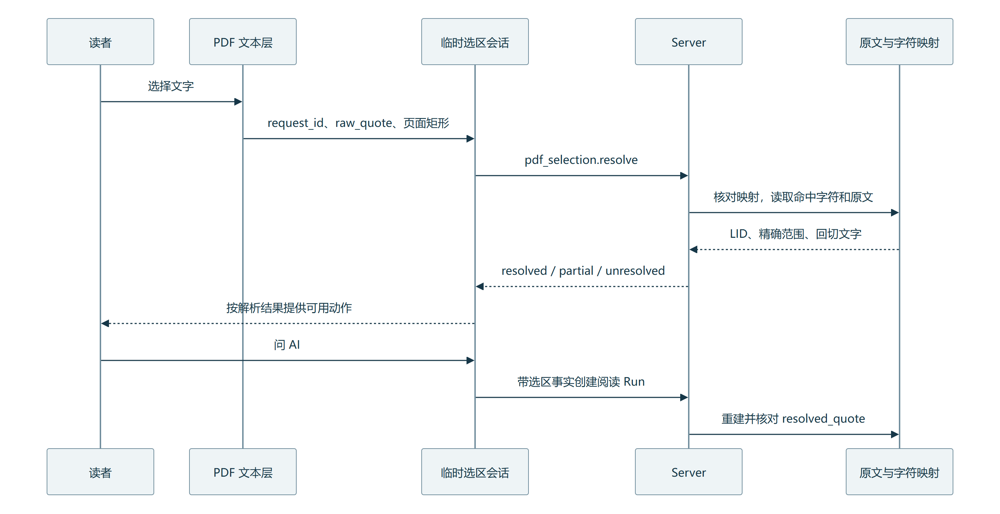

<a id="ch14-s11"></a>

#### 完整程度与恢复依据是两个维度

读者看到的 PDF 文本可能有排版换行，而规范正文使用空格；换行处的连字符也可能只属于排版。项目没有简单地要求 raw_quote 与规范正文逐字相同，也没有用一个相似度分数放宽所有差异。

当前 classify_pdf_selection_recovery 使用 pdf_selection_recovery.v2。它识别有限的排版空白、连字符和满足映射约束的公式表达差异；公式恢复还需要当前映射和完整命中支持。普通实质缺字、变量变化和歧义不因此被接纳。这里的 recovered 表示已用受约束的规则建立完整对应，不是“虽然不确定，也先算成功”。相关 Server 用例本轮已阅读，执行情况另列在验证记录。

解析最终返回的 status 判断如下，摘自 [route_pdf_selection_resolve](../../../crates/server/src/lib.rs)：

```rust
    let status = if ranges.is_empty() {
        "unresolved"
    } else if unmapped_hits > 0
        || rejected_hit_count > 0
        || hits.iter().any(|hit| hit.lid.is_none())
        || raw_quote_incomplete
        || degraded_precision
    {
        "partial"
    } else {
        "resolved"
    };
```

status 表示整个选择是否建立了足够对应；resolution_basis 只在 resolved 时说明依据是 exact 还是 recovered。当前界面的 [pdfSelectionCapabilities](../../../packages/web/src/pdf-selection-capabilities.ts) 据此提供动作：

| 选区结果 | 高亮 | 笔记 | 问 AI | 翻译 | 原生复制 |
| --- | --- | --- | --- | --- | --- |
| resolved，exact 或 recovered | 可用 | 可用 | 可用 | 可用 | 保留 |
| partial | 不提供 | 不提供 | 可用，引用以精确子区间为依据 | 可用，使用所选原始文字 | 保留 |
| unresolved | 不提供 | 不提供 | 不提供 | 不提供 | 仅保留这一途径 |

partial 情况仍有一部分材料可以用来提问。Agent 可以知道用户原本想问什么，同时区分可引用部分与未经验证的选择文字；高亮和笔记则需要稳定的完整选区，不能把未定位的部分一并画成确切记录。

<a id="ch14-s12"></a>

#### 临时选择怎样穿过异步请求

[usePdfSelectionDraft](../../../packages/web/src/pdf-selection-draft.ts) 管理 idle、resolving、ready、saving 和 error。每次选择都有 request_id。A 选区尚未返回时，读者又选择 B，即使 A 后到，当前会话也只接纳 B。取消、完成动作或建立新选择都会改变这个临时会话。

解析失败可以重试；保存动作失败会退回带原草稿的 ready，使读者还能继续处理；unresolved 及空范围不产生语义操作草稿。这个状态机解释了为什么“框选完成”与“笔记已保存”是两个时刻。界面上的浮动工具条是可取消的当前意图，长期记录要等明确动作成功后才成立。

选择进入问题时，Server 还会重新读取 ranges 对应的真实原文。validate_and_rebuild_selection_quote 检查非空、存在的 LID、合法的 UTF-16 区间，以及书序和不重叠要求；parse_question_quote 比较客户端提供的 resolved_quote 与重建值：

```rust
    if canonical_resolved_quote != resolved_quote {
        return Err(validation(
            "INVALID_SELECTION_CONTEXT",
            "question_quote resolved_quote 必须与 ranges 对应的书内原文一致",
        ));
    }
```

随后 verified_question_evidence 把通过验证的范围转成当前问题证据。agent_question_with_provenance 分别给出 resolved_quote 与 unverified_raw_quote，并限定原始选择不能直接成为引用或 PDF 几何。这样，读者问“这段是什么意思”时，已验证且足够的选区可以直接支持回答；需要选区外条件时，Agent 再读取补充原文。位置与证据在这里建立联系，而屏幕矩形本身没有变成证据结论。

<a id="ch14-s13"></a>

### 14.4 来源跳转、批注和阅读连续性

<a id="ch14-s14"></a>

#### 查来源应该能够回到问题

第 12 章已经解释回答中的来源怎样由运行时绑定。本章从用户点击开始：在发起来源打开前，App 的 captureAgentSourceReturnPoint 记住当前阅读锚点和 turnId；来源打开后的 syncAfterAgentSourceOpen 把返回点压入栈，切到 Reader，再同步服务端导航后的窗口。若回答原来处于全屏或演示现场，相关显示状态暂时挂起。

批注中的来源也有一条轻量路径。openSourcePreview 先读取目标叶子前后各三段以内的邻近原文，展示临时预览。读者可以关闭预览留在原处，也可以明确进入正文。进入正文成功后，原来的位置及 origin、memId 才成为可返回的现场。这让“看一眼出处”不必总是打断正在进行的阅读或笔记编辑。

[ReadingReturnPoint](../../../packages/web/src/useReadingContinuity.ts) 同时保留两个方向：anchor 指向原文位置，turnId 或 origin、memId 指向读者离开时的界面。只保存前者，会回到正文却丢掉问题；只保存后者，则会看到同一回答但失去原来的阅读位置。

当前返回栈默认最多保存 16 个点，并按后进先出取出当前 contextKey 的记录。恢复动作还具有独立代次：

```ts
  function beginRestore(contextKey: string): ReadingRestoreToken {
    restoreGeneration += 1;
    return { contextKey, generation: restoreGeneration };
  }

  function isCurrent(token: ReadingRestoreToken): boolean {
    return token.generation === restoreGeneration;
  }
```

isCurrent 本身比较恢复代次，App 调用方另外比较 workspaceContextKey。两者共同约束“结果是否仍然属于这次恢复”。读者开始新的操作时，cancelRestore 使旧代次失效；切换现场时，invalidateContext 移除其他现场的返回点。

returnToAgentAnswer 的次序因此是：取返回点，建立恢复令牌，导航到锚点对应正文，再恢复细部位置，最后按来源回到 Reader、指定 Note 或原回答。已经明确返回失败的分支会把返回点放回，避免一次失败就丢失继续返回的入口。

<a id="ch14-s15"></a>

#### Markdown 和 PDF 怎样表达不同的返回位置

Markdown 使用 LID、块偏移和可用的文字位置。PDF 则保存 sourceKey、pageIndex、pageRatio、probeRatio、horizontalRatio、anchorLid 与可选 zoom。sourceKey 由当前 PDF 的材料与映射身份形成，防止把旧页位置应用到另一份 PDF；页面内比例用于在页面几何变化后定位同一处。

[PdfReaderPane::restoreReadingAnchor](../../../packages/web/src/components/PdfReaderPane.vue) 先检查来源身份，等 DOM 更新后取得目标页的实际几何，按页内位置与探测线比例补偿滚动，并在需要时恢复水平位置。组件初始恢复也会使用先前保存的 zoom。Markdown 与 PDF 切换时，App 分别捕获对应锚点；需要跨表面定位时才借助映射到的 LID。没有可用映射时，界面保留可解释的当前位置并提示当前能力边界。

这种结构保留了两种材料形态的差异：一份是可重排文字，另一份是有固定页几何的文档。共同 LID 连接书内语义，表面专用锚点负责恢复读者实际看到的位置。

<a id="ch14-s16"></a>

#### 批注既是长期记录，也是当前位置的投影

读者在刚才的条件旁保存高亮或笔记后，Reader 不需要成为另一份笔记数据库。[Reader::save_highlight](../../../crates/reader/src/lib.rs) 读取真实正文，按合法 UTF-16 范围截取内容，再委托 MemoryStore 保存；select_annotation 只更新场景选择与 revision。App 保存成功后重新读取书内记录，随后将它们投影到当前正文。

在 Markdown 正文中，当前 [ReaderPane](../../../packages/web/src/components/ReaderPane.vue) 使用紧凑标记和按需预览。标记不进入正文的选区文字，预览由单独的界面层显示；目标离开可视区域、记录不再存在或现场变化时，临时预览关闭。编辑动作交回 App 的编辑状态。这一设计减少了批注卡片直接插进长段落后引起的正文跳动。

PDF 的位置需要再投影一次。[buildPdfProjectionBatch](../../../packages/web/src/pdf-annotation-projection.ts) 把高亮范围和 Note 的选区范围送到 pdf_ranges.project，projectPdfAnnotations 再核对返回 LID 与范围，形成高亮矩形和笔记标记。选区型 Note 的引文保留全部精确范围，标记则放在最后一个范围的 terminal_rect；只有位置可精确投影时才绘制相应标记。无法定位的记录仍然是笔记数据，只是不能伪造一块正文几何。

此外，当前实现允许笔记显式放置到一个 Markdown 块或 PDF 区域。它用 note_placement 表达位置，与 selection_context 表达的确切选择分开；新 Note 在 Server 保存入口要求二者择一。一个区域可以承载读者的想法，却不因此获得该区域内任意文字的确切引文。笔记的身份、更新和私人归属将在第 15 章继续展开。

<a id="ch14-s17"></a>

### 14.5 桌面和移动界面的现场管理

<a id="ch14-s18"></a>

#### 同一阅读现场怎样容纳不同屏幕

宽屏可以同时放目录、正文和助手，手机常常只能保留一个前景区域。若把切换布局实现为重新创建一套阅读组件，原生选区、滚动位置和编辑草稿都容易丢失。

[ReaderWorkspace.vue](../../../packages/web/src/components/ReaderWorkspace.vue) 保持统一的区域结构，让 resolveWorkspace 根据逻辑布局、可测量尺寸、显示偏好和当前交互生成投影。逻辑层说明哪些槽位打开、希望聚焦哪里；投影层决定此刻显示 single、compare 还是 wide。改变浏览器尺寸不需要改写书内笔记，也不等同于 Agent 发出新的 Reader 布局命令。

对照模式的宽度约束直接写在 [workspace-layout.ts](../../../packages/web/src/workspace-layout.ts) 中：

```ts
  const compareWidth = WORKSPACE_LIMITS.readerMinWidth
    + WORKSPACE_LIMITS.compareGap
    + WORKSPACE_LIMITS.assistantMinWidth;
  const wantsCompare = preference === "compare" || interaction.compareIntent;
  if (wantsCompare
      && containerWidth >= compareWidth
      && containerHeight >= WORKSPACE_LIMITS.compareMinHeight) {
```

当前最小阅读宽度是 400，助手宽度是 320，中间间距是 12，因此对照边界为 732 像素；高度至少 200。wide 另要求宽度至少 1024、高度至少 420，并在一般布局分支中先判断。下表来自本轮执行的布局用例，尺寸是确定性输入：

| 容器尺寸与意图 | 当前投影 | 原因 |
| --- | --- | --- |
| 731×390，请求对照 | single | 宽度不足 732 |
| 732×199，请求对照 | single | 高度不足 200 |
| 732×200，请求对照 | compare | 刚好满足对照边界 |
| 844×390，auto 且无对照意图 | single | 助手槽位打开不代表用户请求对照 |
| 1024×420，auto | wide | 同时满足宽屏宽度与高度 |
| 1200×800，focus | single | 专注偏好先于宽屏分支生效 |

专注阅读还需要能退出。toggleFocus 保存先前的偏好、前景区域与目录状态，退出时恢复；它不会靠重新挂载 Reader 来制造一套新现场。显示方式改变前，App 的 preserveDisplayReadingPosition 保存锚点；连续调整而读者没有主动移动时，它复用同一源字符，避免每次都重新选取行首而逐渐漂移。

<a id="ch14-s19"></a>

#### 正在输入和选择时，谁有优先权

移动端还有屏幕键盘。resolveWorkspace 同时观察输入焦点、可视高度变化和缩放：只有输入确实聚焦、可视高度不超过 420、布局高度损失至少 120，且 scale 接近 1 时，才进入 inputPriority。此时助手成为前景，导航采用紧凑形式。单纯窗口变矮或用户放大页面不会自动被当成键盘弹出。

Agent 请求聚焦助手时，读者可能正在正文里拖选文字，或者正在输入法组合输入。投影会将冲突焦点记为 deferredFocus，保留当前交互；已经处理过的焦点请求由 lastHandledFocusKey 标识，窗口尺寸变化不会再次播放同一请求。

隐藏区域也有位置问题。在窄屏上切到助手后，Reader 的当前几何可能不可测量。ReaderPane 因此保留最近可见时的锚点，requestWorkspaceTab 在切换前主动捕获一次。重新显示时，恢复过程使用内容锚点，而不是把隐藏节点返回的零尺寸当成一个新的阅读事实。

<a id="ch14-s20"></a>

#### 排版偏好、现场身份和领域数据

[reader-typography.ts](../../../packages/web/src/reader-typography.ts) 提供正文的字体、语言模式、字号、行高、字距和行宽设置。当前字号范围是 17—22，行高范围是 1.6—2；这些设置通过带 owner 的 localStorage 键保存在当前设备。useReaderTypography 在 owner 变化时重新读取偏好并清理打开的设置状态。它们属于用户在设备上的阅读选择，书内 Memory 与 Reader 逻辑布局各自继续保存自己的领域状态。

对于网络阅读，[sceneKey](../../../packages/web/src/network-context.ts) 包含 epoch、用户、workspace、generation、book 和 publication；App 的 workspaceContextKey 再结合当前书和聊天身份。来源返回、临时预览和文字恢复据此判断是否仍属于原现场。本地模式使用相应的本地现场、书和聊天信息，不能把网络 publication 字段强加到每个本地阅读入口。

[ADR-0148](../../adr/0148-reader-typography-annotations-and-motion.md) 把排版、批注和连续性作为同一阅读体验问题讨论，解释了为什么正文、界面文字、代码和数学表达需要各自的排版角色。当前实现也让 PDF 保留自己的字体与页面几何，正文排版设置不去重排 PDF 文本层。设计理由帮助理解约束，具体可用行为仍由本章回读的实现决定。

<a id="ch14-s21"></a>

### 已知边界与本轮验证

本章于 2026-10-07 回读当前工作区，Git 基线为 4e0b68e。关键依据包括 Reader、App、正文与 PDF 组件、选区映射、Server 解析与问题验证、来源返回和布局投影。相同提交没有代替文件回读；本批只修改书稿。

**连续正文预加载存在迟到回填问题。** 当前 onScrollEdge 没有使用 doGoto 那样的请求序号或现场判断。本轮提取实际 onScrollEdge 与 mergeSegments，用延迟的正文读取重放：先从 `[1.1,1.2]` 加载后文 `[1.3,1.4]`，等待期间把窗口替换为 `[2.1,2.2]`，旧请求返回后得到 `[2.1,2.2,1.3,1.4]`。普通的“加载中点击另一个目录项”即可进入这一顺序。重放确认的是合并路径，替换窗口和网络延迟由驱动控制，没有宣称进行了真实浏览器操作。正文因此不能把导航路径的过期判断扩大为所有正文读取都已具备同样保障。

**跨 LID 高亮当前由多次写入组成。** confirmHighlight 和 highlightPdfSelection 对多个范围并行调用 api.highlight。若其中一次失败，前面成功的记录可能已经保存，不能把界面显示失败解释为整组选区没有任何写入。这是依据当前调用路径作出的判断；本轮未注入真实 HTTP 或磁盘故障，也没有把这组调用写成一个原子事务。

**文字锚点与连续缓冲都有明确适用范围。** 文字恢复依赖当前源串、可映射 DOM 和可测量几何；代码、图片、公式或不可定位文字会使用相应的块或页面位置。当前连续正文沿滚动方向追加和保留段落，不是有固定容量的回收窗口。[ADR-0112](../../adr/0112-pre-phr-reader-body-path-rollback.md) 记录了从 PHR 正文路径回退到稳定原生滚动路径的决定；旧实验中的有界回收不能被写成现有实现。Reader 文件顶部及部分注释还残留旧锚点描述，本章采用实际区间代码解释窗口。

本轮实际执行了 45 个离线局部用例。40 个为六份既有前端测试：导航 4、Markdown 原文映射 12、PDF 动作矩阵 4、PDF 草稿 6、返回状态 4、布局 10。另增加四个文字锚点用例，以及一个迟到预加载观察。已有测试中包含 App 连接关系的静态文本断言，其通过不等于完整界面事件链已经执行。

Markdown 映射使用当前渲染与映射函数；文字锚点用例在模拟 DOM 中显式提供字符几何，不依赖真实字体排版。Reader 的 Rust 窗口用例、PDF 恢复分类与范围路由、Server 选区重建等测试已阅读，本轮没有运行这些 Rust 集成路径。没有调用模型、渲染真实 PDF、重跑 PHR 实验或验收 Tauri、手机浏览器与长文阅读性能。链接、摘录、符号和算例的最终核对范围见 [SOURCES](../SOURCES.md#%E7%AC%AC-14-%E7%AB%A0%E7%BB%AD%E5%86%99%E9%AA%8C%E8%AF%81%E8%AE%B0%E5%BD%95)。

<a id="ch14-s22"></a>

### 源码选读

可以沿一次实际操作分四步回读本章实现。

1. 从 [Reader](../../../crates/reader/src/lib.rs) 的 viewport、goto_lid、scroll 看逻辑窗口，再到 [App](../../../packages/web/src/App.vue) 的 doGoto、loadWindow、onScrollEdge，看窗口怎样变成正文缓冲。
2. 从 [ReaderPane](../../../packages/web/src/components/ReaderPane.vue) 的 captureScrollAnchor、restoreScrollAnchor 进入 [文字锚点](../../../packages/web/src/reader-text-anchor.ts) 与 [Markdown 映射](../../../packages/web/src/markdown-source-map.ts)，对照可见文字和源串偏移。
3. 从 [PDF 选区会话](../../../packages/web/src/pdf-selection-draft.ts) 追到 [Server](../../../crates/server/src/lib.rs) 的 route_pdf_selection_resolve、validate_and_rebuild_selection_quote、parse_question_quote，区分几何命中、恢复依据与当前问题证据。
4. 从 [返回状态](../../../packages/web/src/useReadingContinuity.ts)、[布局投影](../../../packages/web/src/workspace-layout.ts) 回到 App 的 returnToAgentAnswer，观察正文位置、前景区域和聊天身份如何一起恢复。

<a id="ch14-s23"></a>

### 面试时怎样解释

**如果被问到“阅读 Agent 怎样知道读者正在指哪段内容，并保持阅读连续性”，可以这样回答：**

“项目把服务端 Reader 状态、浏览器位置和问题选区分开。Reader 用叶子区间执行跳转和窗口移动，前端用连续正文缓冲与内容锚点维护实际滚动。Markdown 选区经过 DOM 到源串的映射，PDF 选区经过页几何、字符映射和原文回切，得到 LID 内的 UTF-16 范围。问题提交时服务端重新核对引用，把确认的范围放进本轮证据；读者继续滚动不会改变已提交的选区。打开来源前再保存原文锚点及原回答或笔记身份，返回时恢复位置与界面，并用现场和恢复代次排除已经过期的工作。当前预加载和跨段写入仍有明确限制，需要与已经实现的保证分开解释。”

1. **为什么不能把 visible_lids 直接当成 Agent 已读证据？**

   它描述逻辑阅读窗口，不说明模型实际收到了哪些正文。当前问题的精确选区可以在验证后进入证据，其余来源仍由实际读取与运行时账本管理。

2. **为什么跳到书尾后，top_lid 与请求 LID 不同？**

   服务端为保留完整窗口而限制顶部索引。请求目标保留在 selection 中，前端再将它解析成实际叶子并滚到该元素，窗口边界和用户意图各有自己的表示。

3. **保存 scrollTop 为什么不足以应对字号变化？**

   字号改变会重排字符。当前实现保存源字符范围和相对屏幕偏移，重新定位同一字符后补偿位置；无法取得文字锚点时使用块级位置。

4. **PDF partial 为什么还能问 AI，却不能直接高亮？**

   partial 仍可能包含已经确认的子区间，足以作为一个带边界的问题输入。高亮要对应完整可保存的选择；把未定位部分一起画出来会把不确定映射表现成确切位置。

5. **来源返回为什么还要保存 turnId 或 memId？**

   原文锚点只负责恢复阅读位置。用户可能从回答、笔记或正文预览离开，返回还要找到原来的工作对象，否则只能回到一块文字，不能继续刚才的任务。

6. **窄屏切换是否应该改写后端布局状态？**

   屏幕尺寸首先影响界面投影。当前实现根据尺寸、输入和选择状态决定前景与可见区域，逻辑槽位和用户领域数据保持各自的含义。明确的 Reader 布局命令与临时显示调整要分开解释。

读者至此已经可以选、问、查、返回并保存。接下来进入[第 15 章](#ch15)：这些即时操作中，哪些应成为跨聊天、跨书保留的私人事实，它们怎样更新和纠正，又怎样影响下一次阅读。


---

<a id="ch15"></a>

## 第 15 章 笔记 记忆与学习事实

第 14 章末，读者查完来源，返回原来的问题，准备写下一条笔记：“条件成立时才能使用结论。”过了一会儿，他又补充：“应该写成条件 A 与 B 同时成立。”随后，他对 Agent 说：“以后解释这类条件时，先给我一个反例。”

三句话都值得保留，但它们要求系统做的事不同。第一句产生一条属于这本书、带来源的笔记；第二句修改这条笔记；第三句表达一种解释偏好。若读者在一道题中借助提示答对了，系统还会得到另一种信息：在这次题面、这些帮助和这次尝试下，回答满足了评分标准。

把这些内容一起塞进“用户长期记忆”虽然容易，却会丢失最有价值的区别。下次 Agent 看到“先给反例”，应该把它当成偏好；看到“答对一次”，应该知道当时是否有帮助；看到笔记，则要知道它写在什么材料上，后来有没有被修改。本章的中心问题是：哪些信息需要跨聊天保留，怎样保持其来源和归属？

<a id="ch15-s1"></a>

### 15.1 笔记、阅读记录、画像和教学事实

<a id="ch15-s2"></a>

#### 同一个读者，需要几种长期记录

从刚才的场景出发，可以先问每份数据将来要回答什么问题，再决定如何保存。

| 数据 | 本例中的内容 | 它直接支持的判断 | 当前主要载体 |
| --- | --- | --- | --- |
| 笔记与高亮 | 对条件的解释、标出的原文范围 | 读者保存了什么，附着在哪里 | MemoryDocument 中的 Record |
| 阅读活动 | 跳到某个 LID、提问、创建批注 | 哪些位置发生过哪些活动 | read、qa、note、highlight 记录与 BookReadingState |
| 用户画像 | “解释条件时先给反例” | 在什么范围内，应该怎样组织解释 | 带证据与状态的 ProfileFact |
| 教学事实与学习证据 | 题目实际交付、提示暴露、提交与评分 | 读者在明确条件下表现如何 | LearningStore 中的事件、评估与 LearningEvidence |

[MemoryStore](../../../crates/memory/src/lib.rs) 中的 Record 保存内容、类型、layer、book_id、anchor、citations 和来源聊天等信息。精确选区使用 selection_context，附在正文块或 PDF 区域上的笔记使用 note_placement。这些字段接续上一章的来源定位，使笔记正文和它的附着位置可以分别解释。

其中，layer 不是存储介质的选择器。Resident 创建的建议笔记可以处在 session 层，用户主动保留的笔记处在 long_term 层；两者都可以写入 memory.json。不能因为字段叫 session 就把记录理解为只在内存中存在，或者聊天结束后自然消失。当前保存方法没有按这个字段自动安排过期删除。

[BookReadingState](../../../crates/memory/src/reading_state.rs) 则按书聚合阅读活动。一次 qa 说明读者问过一个问题，一条 note 说明该处有笔记。兼容输出里仍保留 read_lids、focus_lids、puzzle_heat 等名称，但 puzzle_heat 的依据是 qa 记录数量。这个名字不能替代对行为含义的判断：反复追问可能来自困难，也可能来自深入探究。

<a id="ch15-s3"></a>

#### “关于读者的一句话”也要有类型和出处

普通 context 记录可以保存一段背景文字，而 [ProfileFact](../../../crates/memory/src/profile.rs) 进一步要求说明它是什么。payload 可以表达背景、能力自述、目标、解释偏好、约束或某个内容策略的扩展。scope 决定它属于全局还是某本书；applicability 决定它适用于所有内容、某类内容、论文子类型还是某个领域。这是两个独立维度。

例如，“以后读技术材料时先给反例”可以被表示成全局范围、适用于 technical_learning 的解释偏好；“读这本书时先给反例”则属于当前书。前者可以跨书使用，却不必影响每一种材料。

事实还保存 source、evidence、status、valid_until 和 supersedes。source 区分确定性行为、用户明确陈述和 Agent 推断；evidence 指向聊天轮次、记忆记录或书内位置。supersedes 则回答后来的纠正替代了哪条旧信息。信息在这些维度上仍然清楚，系统才能决定“可以存下来”和“可以用于这次回答”是否是同一件事。

<a id="ch15-s4"></a>

#### 物理存储也反映了任务差别

当前 [MemoryDocument](../../../crates/memory/src/document.rs) 是带版本的 JSON 文档，包含普通记录、画像事实、复核状态、排除依据和治理状态。它位于读者私人存储中，与构建后供阅读的 Book 数据分开。

教学过程使用 [LearningStore](../../../crates/memory/src/learning.rs) 管理的 SQLite 数据库。教学事件、冻结评估、学习证据和可重建投影共享这一私人学习存储；网络服务通过 [UserRuntime::open_service](../../../crates/server/src/user_runtime.rs) 分别打开该用户的 memory 与 learning 路径。

[ADR-0075](../../adr/0075-runtime-owned-evidence-backed-profile-memory.md) 提出的单一 memory.json 真相源，解释的是当时画像与普通记忆的设计。当前教学实现已经扩展到独立 SQLite。两者都属于读者私人状态，但不能据旧 ADR 把今天的学习事实都说成同一份 JSON，也不能把不同存储的写入说成一个共同事务。

<a id="ch15-s5"></a>

### 15.2 私人数据的写入口

<a id="ch15-s6"></a>

#### 先让“保存这条笔记”成为一次明确操作

读者在界面按下保存时，[Server 的 save_user_note](../../../crates/server/src/lib.rs) 从当前 ReaderWorkspace 取得书的身份，并要求新笔记带一种来源：selection_context 或 note_placement，二者择一。附着型笔记的 anchor 和 citations 由位置派生；用户创建的笔记使用 long_term 层。

下面是一个教学输入，演示附着在正文块上的笔记形状。book_id 由服务端当前工作区提供；source-demo 是示意来源标识，真实请求必须使用当前材料的有效标识。

```json
{
  "type": "note",
  "content": "条件成立时才能使用结论",
  "note_placement": {
    "kind": "lid_block",
    "source_fingerprint": "source-demo",
    "lid": "1.1"
  }
}
```

MemoryStore::save_note 根据书、类型、锚点、内容以及具体来源字段计算内容身份。layer、保存时间和来源聊天不参与这一身份。于是用户重复点击保存，系统可以识别“仍是同一条内容与来源”。找到已有记录后，代码立即返回：

```rust
        if let Some(existing) = self
            .document
            .records
            .iter()
            .find(|record| record.mem_id == mem_id)
        {
            return Ok(NoteSaveOutcome {
                status: NoteSaveStatus::Existing,
                record: existing.clone(),
            });
        }
```

这个返回不会更新旧记录的时间、使用次数、来源聊天或修订号。它与通用 save 的 upsert 行为有意分开：通用保存可以替换同 ID 记录并增加 usage，严格笔记创建则把重复内容作为零变更结果。调用方因此能区分 CREATED 和 EXISTING。

Resident 的 [ReaderNote 分支](../../../crates/runtime/src/orchestrator.rs) 通过 Reader::save_note 创建 session 层笔记，只有 CREATED 才增加新建笔记的 AgentEffect。读者随后明确保留同一笔记时，Server 先得到 EXISTING，再调用 promote 把 session 变为 long_term。修改层级这件事由单独操作完成，重复创建本身仍然保持零变更。

通用 memory.save 也不能绕过这套新笔记入口：当前 Resident 分派会拒绝用普通内容保存方式创建缺少位置的 Note，要求使用 reader.note。第 10 章的工具授权决定动作能否进入执行入口，本章关注进入后保存什么以及怎样返回。

<a id="ch15-s7"></a>

#### 存储成功之后，才让内存接受新状态

如果只在内存中先改好笔记，再尝试落盘，失败后界面可能看到新内容，重新打开程序却又恢复旧内容。当前保存采用候选文档：先复制并修改候选，校验与持久化成功后，才替换 MemoryStore 正在使用的文档。关键顺序在 commit_document 中：

```rust
    fn commit_document(&mut self, candidate: MemoryDocument) -> Result<(), ToolError> {
        self.ensure_storage_available()?;
        candidate.validate().map_err(internal)?;
        persist_document_atomically(&self.path, &candidate, self.private_storage_enabled())?;
        self.document = candidate;
        Ok(())
    }
```

persist_document_atomically 将候选序列化到临时文件，完成同步，再通过旧文件备份和新文件切换提交。打开存储时还会处理相应的中断残留。对于本轮注入的写入路径失败，既有记录在内存和原磁盘文件中都保留；修改操作不会先删掉旧记录再尝试创建新记录。

保存还维护两个修订号。document_revision 表示整个记忆文档的变化，projection_revision 表示需要影响画像投影的变化。复核任务状态变化可以只推进前者，内容或画像变化通常同时推进两者。下一次投影不需要把“后台任务更新了一次状态”都当成读者事实变化。

读取位置是一种频繁的小事件。[enqueue_read 与 flush_pending_reads](../../../crates/memory/src/lib.rs) 将同一 book_id、LID 的多次触达合并，累计 touch_count 和最后时间，在一次候选提交中写入。失败后待写批次保留。这降低了每次移动都重写整个 JSON 的成本，同时使已提交活动与待写活动有各自的状态。

<a id="ch15-s8"></a>

#### “请记住我的偏好”怎样进入画像

偏好写入不能依赖主 Agent 恰好想起调用一个工具。[前台记忆意图处理](../../../crates/runtime/src/memory_intent.rs) 位于请求准备流程。ADR-0075 将这段职责称为 MemoryIntentGate，当前源码入口是 scan_memory_intent 与 evaluate_memory_intent：先识别明确的记住、纠正或忘记意图，需要时用结构化提取生成候选，再返回可应用操作、待澄清、敏感内容确认或拒绝结果。[Server 的 prepare_agent_chat](../../../crates/server/src/lib.rs) 所在准备链路据此处理操作，随后组装本轮画像快照。

真正改写存储的是 [MemoryOp](../../../crates/memory/src/operation.rs)。Remember 在同一候选文档中加入用户明确陈述的 ProfileFact 和保存其依据的 profile_evidence 记录。后者不参与普通 recall，也不能被普通 save、replace 或 delete 当作一般笔记修改。画像值与其依据一起提交，避免出现“偏好已经更新，却找不到这次记住请求”的半份结果。

普通聊天结束后，系统还可以通过 [ReviewJob](../../../crates/memory/src/review.rs) 复核增量轮次。模型执行由 [ReviewExecutor](../../../crates/runtime/src/memory_review.rs) 完成，候选进入存储时再检查作业范围、证据轮次、书归属和排除规则。commit_review_result 将新事实、意图观察、作业完成状态及 reviewed_through 水位放进同一个候选文档，成功后一起前进。

本地 [Host 的 ReviewSchedule](../../../crates/server/src/host.rs) 当前包含空闲 60 秒触发、八个未复核用户轮次触发，以及启动和重试分支。这是调度实现，不是用户说一句话就同步跑完全部推断的承诺。历史聊天的语义提取则走 [backfill](../../../crates/memory/src/backfill.rs)，由选定范围进入候选复核，历史提取得到的信息保持 pending，不能把旧聊天迁移等同于自动确认新画像。

<a id="ch15-s9"></a>

#### 谁说的，决定它以什么状态开始

同样一句“需要更多反例”，如果出自用户明确要求，与 Agent 从两次追问中推断出来，应该获得不同的使用资格。[initial_status](../../../crates/memory/src/profile.rs) 给出了当前交互中新事实的起点：

```rust
        (FactSource::UserStated, _) => Ok(FactStatus::Confirmed),
        (FactSource::AgentInferred, ProfileScope::Book { .. }) => Ok(FactStatus::Provisional),
        (FactSource::AgentInferred, ProfileScope::Global) => Ok(FactStatus::Pending),
```

确定性行为只能在书范围内形成 confirmed 事实。用户明确陈述可以在书内或全局 confirmed；Agent 的书内推断是 provisional 弱提示，全局推断必须先 pending。敏感信息还有单独规则：自动推断不能产生敏感画像，用户主动请求保留时需要相应确认，秘密类内容拒绝保存。

这套区分把长期使用权与提取能力分开。模型能够组织一条候选，并不意味着它有权把这条候选扩展为每本书都适用的用户属性。

<a id="ch15-s10"></a>

### 15.3 从事实生成派生投影

<a id="ch15-s11"></a>

#### 下一个问题只需要相关的一小部分

现在读者打开新聊天，问：“再解释一下刚才两个条件的关系。”系统需要带入相关偏好与活动，但没有必要把所有笔记和聊天全文塞回模型。当前路径先从事实库解析适用事实，再由内容策略生成阅读状态候选，最后装入 [ReaderProfileSnapshot](../../../crates/memory/src/projection.rs)。

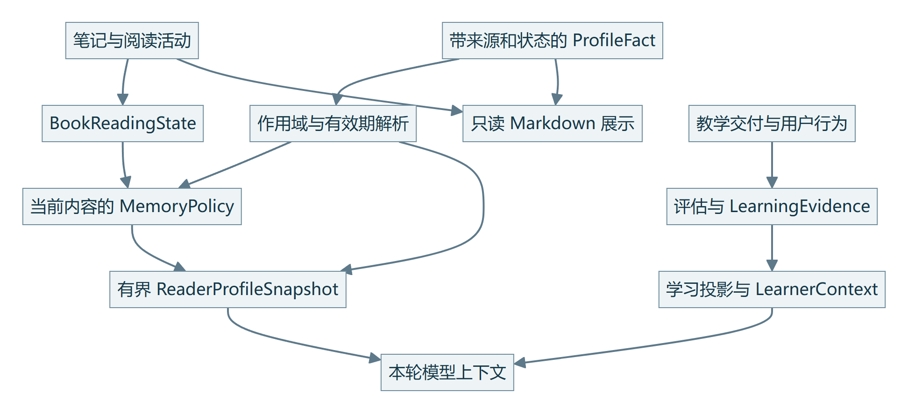

图中有两条进入本轮上下文的私人信息路径。通用画像解释偏好、背景与阅读活动；教学上下文解释当前对象和能力轴上的表现。两条路径各自带着出处与有效范围，Model 不需要从一段混合摘要中猜测哪些内容可信。

<a id="ch15-s12"></a>

#### 先选出适用事实，再决定放多少

resolve_profile_facts 先排除 pending、superseded、expired 以及在当前 now 下已经过期的事实，随后匹配 scope 与 applicability。对于同一语义键，它依次比较书内范围、适用性具体程度、来源权威、状态、更新时间和稳定 ID。

顺序很关键。当前实现先比较范围，再比较来源权威；所以某本书的 provisional 推断，可能优先于相同语义键的全局用户陈述。用户纠正相对普通陈述的优先级是在前面维度相同之后生效。不能用一句“用户说的永远优先”概括内部事实解析顺序。

例如，设三个教学事实都使用同一个解释偏好键：全局 confirmed 值为“详细讲解”，书 A 的 provisional 值为“多给例子”，另有一个全局 pending 值为“只给结论”。在书 A 中解析得到“多给例子”；在书 B 中得到“详细讲解”；pending 值不参与竞争。若用户当前明确要求“这一次只要结论”，快照的序列化规则另行声明当前消息优先于历史数据。事实选择和当前请求的优先级属于两个步骤。

确定适用内容之后，再控制容量。SnapshotBudgets 的默认值是：

```rust
        Self {
            global_core: 512,
            applicable_global: 384,
            book_state_core: 512,
            profile_projection: 384,
            pending_context: 256,
        }
```

前两栏分别装通用全局事实和适用于当前内容的全局事实，第三栏装书内核心事实，第四栏装内容策略候选，最后一栏可放尚未完成复核的有限用户上下文。合计为 2048 个估算 token 的条目预算。每栏独立选择完整条目，放不下的条目跳过，不截断到半句话。

这里使用 estimate_snapshot_tokens：基本汉字按每字符四个计量单位，其他字符按一个单位，再除以四向上取整。标题、规则等外围序列化文字还会占空间，因此 2048 不是整段提示词的 Provider 实测 token 上限。这个预算解决的是条目增长问题，其计量口径与第 11 章的实际模型上下文预算需要分别说明。

<a id="ch15-s13"></a>

#### 内容策略解释活动，核心保存使用规则

[MemoryPolicyRegistry](../../../crates/runtime/src/memory_policy.rs) 根据当前内容的策略标识与版本，产生可投影的状态和候选。technical_learning 可以把接触、重访、用户确认理解等活动组织成技术阅读状态，同时保留学习假设的弱提示身份；paper 可以围绕阅读模式、阶段及导读问题进展组织状态。若策略缺失或版本不匹配，则使用 neutral 策略，并在结果中保留回退原因与 orphaned 状态。

这些策略接收当前书的确定性活动与已经解析的事实。它们解释“这一类材料怎样使用这些信号”，事实的确认、纠正与遗忘仍由记忆核心负责。普通 context 记录也不会因为策略存在就自动成为正式画像。

[ProfileContextCache](../../../crates/runtime/src/profile_context.rs) 用 projection_revision 和完整 SnapshotRequest 作为缓存依据。切换书、当前上下文改变或投影修订变化时重新派生，快照不作为一条新的永久聊天消息保存。to_prompt_data 将值编码为引用数据，并写明只读数据与当前用户消息的优先关系。

旁边的 [reader-profile.md 与 reading-handbook.md](../../../crates/memory/src/markdown.rs) 是供人检查的单向展示。真相源提交后会尝试重建它们；展示写入失败不会把已经成功保存的事实回滚，文件状态可显示 current、stale、missing 或 unreadable。手工改这两个文件不会反向修改事实库。

这也是两个修订号的用途：文档管理活动可以继续变化，而派生快照与 Markdown 用 projection_revision 表达自己基于哪一版事实。修订匹配回答的是来源版本，时间有效性和后台复核进度还需要各自判断。

<a id="ch15-s14"></a>

### 15.4 更新、纠正、撤销与过期信息

<a id="ch15-s15"></a>

#### 改一条笔记时，哪些身份应该改变

读者把“条件成立”改为“条件 A 与 B 同时成立”，内容已经变化。如果仍把原来的内容身份当作新内容的身份，后续重复保存与查找就会混淆。因此 [replace](../../../crates/memory/src/lib.rs) 重新计算 mem_id，在一个候选文档中把原位置的记录替换掉。

这次修改继承原来的书、层级、来源聊天及默认来源位置。修改正文时不传 selection_context，就继续使用原选区；显式传入新选区时，则重新推导锚点与 citations。附着在正文块上的笔记不能通过这个参数偷偷改成选区笔记。新身份若已经属于另一条记录，返回 MEMORY_REPLACE_CONFLICT，保留原状。

本轮用当前 MemoryStore 实际重放了下面这组教学序列。夹具起初没有记录，书为 book-a，位置为 1.1，来源为 source-demo；N1、N2 是表中对实际生成 ID 的简称。

| 操作 | 返回与身份 | 保存层级 | document_revision / projection_revision | 记录数 |
| --- | --- | --- | --- | --- |
| 创建 session 笔记“条件成立时才能使用结论” | CREATED，N1 | session | 1 / 1 | 1 |
| 以相同内容与来源再次创建，请求层级为 long_term | EXISTING，仍为原记录 N1 | session | 1 / 1 | 1 |
| 显式 promote：session → long_term | N1 不变 | long_term | 2 / 2 | 1 |
| replace：补全“条件 A 与 B 同时成立” | N2 替换 N1 | long_term | 3 / 3 | 1 |

第二行直接调用的是存储方法。真实用户保存入口得到 EXISTING 后，还会执行第三行的提升；这解释了“重复创建不变更”与“用户保留后成为长期笔记”怎样同时成立。重放同时断言来源聊天和附着位置得到继承，最后仍然只有一条记录。

位置修改也有专门操作。reanchor 为附着型笔记重新生成位置、锚点、citations 和身份，保留正文、层级、使用信息及原生成时间。新身份冲突或写入失败时，旧记录保留。它与“把解释写得更准确”的 replace 分开，使界面能够表达究竟是在改观点还是在调整附着位置。

<a id="ch15-s16"></a>

#### 纠正画像，要留下“替代关系”

假设读者之前说“详细解释”，现在改为“先给简短结论，需要时再展开”。新偏好需要生效，但系统也需要知道它为什么压过旧偏好。[MemoryOp::Correct](../../../crates/memory/src/operation.rs) 在同一个候选文档中创建新的用户陈述与依据，把原事实设为 superseded，并让新事实的 supersedes 指向原事实。

因此，纠正后的正常解析只使用新事实，旧值作为已经被替代的记录仍可解释这次变化。改变 scope 也采用类似方式：[治理入口的 ChangeScope](../../../crates/memory/src/governance.rs) 创建一个用户确认的后继事实，不在原事实上直接改归属。

治理请求还带 expected_document_revision 和 operation_id。对于没有处理过的请求，如果界面基于的文档版本已经过时，存储拒绝变更；如果同一 operation_id、同一请求已经成功，则先返回原回执，再考虑当前修订号。这样既能发现“拿旧页面覆盖新事实”，也能让丢失响应后的重试找到原结果。复用 operation_id 却改变请求内容会得到冲突。

界面的“撤销”也要落到这些具体操作。[buildUndoProfileAction](../../../packages/web/src/profile-memory.ts) 对新记住的事实生成 forget；对刚完成的纠正，则取旧事实的值，生成针对当前事实的一次新 correct。后者是再次明确表达旧值，不是把某个已经 superseded 的记录直接恢复成当前事实。

<a id="ch15-s17"></a>

#### 遗忘不能只隐藏一条事实

“这条信息不对，请改成另一条”和“请忘记这件事”有不同的保留要求。前者可以保存替代链，后者需要清除相关值。[reduce_forget](../../../crates/memory/src/operation.rs) 从目标事实沿 supersedes 关系找到整条相连纠正链，移除这些事实及其 profile_evidence 原文，剥离其他事实中已经被排除的依据，并重新计算依赖它们的全局候选。

留下的是不含原文的 EvidenceExclusion，作用是阻止同一依据在下一次后台复核时重新生成已经遗忘的画像。否则一个表面成功的删除，很可能在重新扫描旧聊天后又出现。

这个操作针对画像及其派生依据。原始聊天仍由会话存储保存；删除画像不等于删除聊天，也不等于删除某本书里的普通笔记。若用户要限制以后的自动收集，[CollectionRule](../../../crates/memory/src/governance.rs) 可以按匹配条件阻止复核与全局候选生成。规则不会自动清除已经存在的事实，用户后来明确要求记住一次信息也可以单独执行。

pending 候选可以确认或拒绝；拒绝使它失效。有效期则是另一条维度：valid_until 到达后，带 now 的解析不再采用该事实，即使其 status 尚未被改成 expired。状态迁移与时间过滤要分别解释，才能判断“已经不用于回答”和“存储中已经删掉”之间的区别。

<a id="ch15-s18"></a>

#### 学习证据的纠正为什么先变成 uncertain

回到第 13 章的练习。如果读者补充：“刚才那题我参考了示例”，不能简单把一条“独立答对”改成“已经掌握”。这个补充首先否定了原来的解释条件，却没有提供一次新的独立表现。

[LearningStore::correct_evidence](../../../crates/memory/src/learning_evidence.rs) 的处理非常直接：

```rust
        let mut next = self.evidence(id)?;
        next.evidence_id = format!("correction:{operation}");
        next.supersedes = Some(id.into());
        next.correction = Some(text.into());
        next.status = AssessmentStatus::Uncertain;
        next.interpretation = "原解释已被用户纠正，等待新的表现依据".into();
        next.interpreter_version = "learner.correction.v1".into();
        self.append_evidence(&next)
```

旧证据保留，新证据追加并指向旧证据。它没有改写当时实际交付的题面，也没有重新评分那次提交；改变的是系统现在怎样解释这份表现依据。

rebuild_learner_projection 从证据序列找出已经被替代的项，对剩余项按对象、对象版本、材料版本与能力轴聚合。答对且有帮助时计为 assisted_support；没有帮助但尝试次数大于一次时计为 revised_support；其余符合条件的正确回答才计为 independent_support。部分满足、未满足与不确定也分别计数。

本轮重新执行了现有学习证据用例：一条独立答对、一条有帮助答对、一条改答正确，以及一条没有评估结果的提交。最初只有前三条形成相应已评估证据，支持计数为 `(1,1,1)`。纠正独立答对的解释后，计数变为 `(0,1,1)`，uncertain 增加到 1。重复派生不会把旧证据重新计入。

投影自身在 SQLite 事务中读取并替换。本轮用既有测试中的数据库触发器让投影写入失败，旧投影仍然保留；移除触发器后重新构建得到纠正后的结果。清空派生表和重新打开数据库也能得到相同投影。这里验证的是可重建性和事务行为，原始交付没有因为投影失败而被改写。

[Server 的 refresh_learning](../../../crates/server/src/teaching.rs) 对比证据水位和解释器版本，需要时重新构建，再生成当前 LearnerContext。[ADR-0143](../../adr/0143-teaching-trace-assessment-and-learning-evidence.md) 所要求的“事实与判断分开”，由这条追加证据、替代解释、重建投影的路径落到代码中。

<a id="ch15-s19"></a>

### 15.5 跨书使用与当前阅读现场

<a id="ch15-s20"></a>

#### 存在同一私人库中，不代表每次都读取全库

读者换到书 B，先前关于书 A 的笔记仍属于这个读者，但未必应该进入书 B 的回答。底层 [MemoryStore::recall](../../../crates/memory/src/lib.rs) 可以按 book、LID、type、layer 和文本子串过滤；不指定 book_id 时可以查询跨书记录。它采用确定性筛选和 ID 排序，没有在这个方法中执行语义向量召回。

Resident 暴露给本轮 Agent 的 memory.recall 则主动填入当前 Run 的书。实际分派中，查询开头是：

```rust
            let q = RecallQuery {
                book_id: Some(book.base.book_id.clone()),
                lid: sget("lid").map(String::from),
                mem_type: sget("type").map(String::from),
                layer: sget("layer").map(String::from),
                text: sget("text").map(String::from),
            };
```

因此，要准确解释“跨书记忆”，至少要区分三个层面：同一用户持有跨书事实，底层存储支持某种查询范围，当前工具实际允许什么查询。普通笔记的跨书存放与画像的跨书自动注入是两条路径。笔记中保留的 citations 也只是记录出处，不能直接替代第 9、12 章中本轮实际观察到的回答来源。

<a id="ch15-s21"></a>

#### 一个书内偏好怎样成为全局候选

最直接的路径是用户明确表达全局偏好。另一条路径是系统观察到多个书范围内的相同事实，再提出全局候选。[reconcile_global_promotions](../../../crates/memory/src/global_consolidation.rs) 按语义键、适用性与结构化 payload 聚合当前有效的书内事实；确定性行为、敏感信息和扩展 payload 不进入这条普通提升路径。

当前门槛是至少两本书、至少三个不同证据 ID。同一本书里反复出现三次，不满足跨书条件；两本书总共只有两个证据，也不足以生成候选。这里的“不同依据”由去重后的证据身份计数，并不证明这些观察在统计意义上互相独立。payload 的归组也是结构化相等，而不是再次让模型判断两种措辞是否等义。

满足条件之后，系统创建的仍是 AgentInferred、Global、Pending 事实。用户确认后它才进入一般快照。来源事实过期、被纠正或遗忘时，相关提升状态会重新计算；失去支持的派生全局事实可以被移除。跨书结论保留着与支持依据的联系，没有变成脱离来源的永久标签。

本轮执行的既有用例分别验证了同书重复不提升、两书三依据产生 pending 后经确认进入快照，以及来源变化引起的反向重算。这些结果说明规则如何工作，没有把人工测试事实写成真实读者行为实验。

<a id="ch15-s22"></a>

#### 后台 Run 仍要使用原来的归属

用户可能在 Agent 工作期间切换书或聊天。私人事实应写给启动 Run 的用户与书，界面动作又不能突然落到新打开的现场。[RunScope](../../../crates/server/src/run_scope.rs) 因此保存用户、工作区代次、书发布、聊天与 turn 等归属。检查用户归属和检查 Reader 现场是不同操作；private_user 使用原 Run 的 Book 及原聊天消息构造私人上下文，场景动作还要匹配工作区、代次、发布与选中聊天。

[UserRuntime](../../../crates/server/src/user_runtime.rs) 持有一个读者的 MemoryStore、私人学习库入口、聊天存储和画像缓存。visitor 构造没有 Resident 用户身份与私人历史写根。这接续了第 3、10 章的边界：共同的 Book 读取能力不意味着 MCP 调用方同时取得读者的私人画像。

学习上下文还有更细的范围。learner_context 只选择当前目标对象、当前材料版本和匹配对象版本的投影行；它保留能力轴、帮助、尝试和证据引用，并对条目数与字符量设限。在书 A 中得到的一次表现，不会仅凭相似的对象名称就成为书 B 的能力事实。

<a id="ch15-s23"></a>

#### 下次回答能解释自己带入了什么

模型收到画像快照，并不意味着可以证明某句话由这条偏好导致。当前 [ProfileUsageTrace](../../../crates/runtime/src/orchestrator.rs) 分开记录 snapshot_revision、injected_fact_ids、claimed_used_fact_ids 和 influences。前两项来自 Runtime 实际注入，后两项描述模型声称采用的事实和影响维度。

于是，系统至少可以回答：“本轮给模型提供了哪一版、哪些画像事实？”模型自述的使用情况可以辅助观察，但仍是较弱的使用声明。偏好最终是否改善解释，需要另行通过任务与效果评测判断。

经过这条链路，章首的三句话各有去处：笔记按内容和来源建立身份，编辑替换该记录，解释偏好通过有证据的事实进入适用快照。教学表现则继续沿交付、行为、评估和证据形成独立的条件化解释。跨聊天保留的价值，来自这些信息在下一次使用时仍然能够说清来历。

<a id="ch15-s24"></a>

### 已知边界与本轮验证

本章于 2026-10-07 回读工作区，Git 基线为 4e0b68e。依据包括 MemoryStore、画像操作与投影、治理、后台复核、私人学习存储，以及 Server、Runtime 和界面相应入口。ADR-0075 用于解释画像设计，ADR-0143 用于解释教学事实与判断的分离；具体行为采用当前实现。相同 Git 提交没有代替文件回读。

**选区笔记入口尚未核对完整原文关系。** save_user_note 对选区逐一检查 LID 可读，MemoryStore 再检查范围非空、起止关系和锚点结构；它们没有执行提问入口使用的 validate_and_rebuild_selection_quote。本轮直接向存储传入 partial 选区、所填引文和 `[10000,10001)` 范围，记录被接纳且保留这些字段。存储本身不持有 Book，因此该重放确认的是结构接纳；Server 路径只验证 LID、未回切核对的判断来自源码阅读。公开保存接口可以接到越过原文长度的范围或不匹配的 resolved_quote，不能把第 14 章的问题引文校验保证扩大到笔记保存。本轮未调用真实 HTTP。

**Markdown 活跃事实没有按 valid_until 过滤。** active_markdown_facts 只筛选 confirmed 与 provisional。本轮创建一条 10:00 过期的偏好，用 11:00 的解析上下文得到零条适用事实，但重新生成的 reader-profile 与 handbook 仍包含该值。文件修订号即使是 current，也不代表展示满足同一时间有效性条件。这是已经局部重放的展示不一致，产品代码未修改。

**部分适用性维度尚未接入当前快照准备入口。** 存储解析支持 PaperSubtype 与 Domain，但 user_profile_snapshot_request 当前只填书、content_profile 和 now；前台意图准备也传入空的 subtype、domain。仅凭底层存在这些枚举，不能声称当前 Resident 已按论文子类型或领域自动匹配画像。这一限制依据实际连接代码确认。

**profile_status=current 不表示全部后台复核已经完成。** 当前 Server 在私人存储不可用，或本书有未完成作业且存在 last_error 时标记 stale；普通排队、尚未报错的作业不因此标记 stale。只有相应失败情形才补入受限 pending_context。这个字段表达当前实现选择的降级状态，不能用来证明复核水位已经追上全部用户轮次。

本轮实际执行 32 个离线局部用例，其中 28 个为当前 memory 模块的既有用例，覆盖笔记创建、提升、重定位和替换，写入失败，阅读活动合并，事实来源与范围，纠正和遗忘，治理重试，快照预算，跨书提升，复核提交与学习投影；另四个为笔记修订序列、作用域与预算算例和上述两个边界观察。边界输入被接纳、过期值仍展示，是重放得到的当前行为，不能记为功能正确。

验证在书稿临时目录复制当前模块及夹具运行，ToolError 使用相同字段的最小配套类型，learning.rs 只移除 TypeScript 导出标注以免生成产品文件。保存使用临时 JSON，学习投影使用真实临时 SQLite，测试存储以非私人模式打开。没有运行整套产品测试、真实模型、HTTP、浏览器或系统权限验收，也没有模拟真实断电。Runtime 与 Server 的连接关系按源码核对，最终链接、符号、摘录和算例检查见 [SOURCES](../SOURCES.md#%E7%AC%AC-15-%E7%AB%A0%E7%BB%AD%E5%86%99%E9%AA%8C%E8%AF%81%E8%AE%B0%E5%BD%95)。

<a id="ch15-s25"></a>

### 源码选读

沿一次“保存、纠正、再次使用”的任务回读，可以分四步。

1. 从 [save_user_note](../../../crates/server/src/lib.rs) 进入 [MemoryStore](../../../crates/memory/src/lib.rs) 的 save_note、promote、replace、reanchor 和 commit_document，分别观察新建、层级、内容、位置与提交。
2. 从 [evaluate_memory_intent](../../../crates/runtime/src/memory_intent.rs) 进入 [MemoryOp](../../../crates/memory/src/operation.rs) 和 [画像治理](../../../crates/memory/src/governance.rs)，观察明确请求怎样形成带依据的变更，以及重试怎样找回回执。
3. 从 [事实解析](../../../crates/memory/src/profile.rs) 进入 [快照投影](../../../crates/memory/src/projection.rs)、[内容策略](../../../crates/runtime/src/memory_policy.rs) 和 [跨书提升](../../../crates/memory/src/global_consolidation.rs)，区分适用性、容量与确认状态。
4. 从 [学习证据](../../../crates/memory/src/learning_evidence.rs) 的 correct_evidence、rebuild_learner_projection，回到 [Server 教学入口](../../../crates/server/src/teaching.rs) 的 refresh_learning 与 learner_context，观察被纠正的旧解释怎样退出当前判断。

<a id="ch15-s26"></a>

### 面试时怎样解释

**如果被问到“这个阅读 Agent 怎样维护长期记忆，并允许用户纠正”，可以这样回答：**

“我们先按未来用途区分数据。笔记保存内容与来源，阅读活动保存发生过的动作，画像事实保存带证据、作用域和确认状态的偏好或背景，教学证据保存具体任务与帮助条件下的表现。普通笔记和画像进入带修订号的私人 JSON，教学事实进入私人 SQLite。保存先构造候选，落盘成功再更新内存；修改笔记重新建立内容身份，纠正画像建立替代关系，遗忘会删除纠正链中的值并留下无原文的排除依据。每轮由 Runtime 按当前书、适用条件和预算生成画像快照，跨书推断先待确认。教学纠正采用追加证据和重建投影，所以不会把一次有帮助的答对直接改写成已经掌握。”

1. **为什么不能只给 Agent 一个 memory.save 工具？**

   工具是否被调用依赖模型当轮选择。当前实现把明确记住请求、普通聊天复核与快照消费放到 Runtime 和 Host 流程中，再用确定性操作维护证据、状态和提交边界。

2. **重复保存和内容修改为什么是不同操作？**

   重复创建同一内容与来源返回原记录，不应更新层级或时间；修改产生新内容身份，需要一次性替换旧记录并处理目标冲突。用户明确保留建议笔记则单独提升层级。

3. **画像已经写到 JSON，为什么还要有投影？**

   事实库服务保存和治理，模型只需要本轮相关、适用且容量有限的部分。投影还把来源状态、书内活动与内容策略组织成一致输入，避免每次依赖模型从全量记录中重新判断。

4. **用户纠正是不是总会压过其他记忆？**

   在当前事实解析中，先比较书内范围和适用性，再比较纠正、明确陈述等来源权威。当前用户消息又有独立的最高优先规则。回答时应说明具体层次，不能把多维解析说成一个简单分数。

5. **为什么“忘记”以后还保留一个 ID？**

   原值及其画像依据已经删除，留下无原文的证据排除标识，用于阻止后台从同一依据重新生成该事实。原始聊天的生命周期另由会话存储管理。

6. **两本书里都出现某个偏好，能否直接认定为全局偏好？**

   当前规则还要求三个不同依据，满足后也只生成 pending 的全局推断。用户确认才进入一般快照，支持来源发生变化还会触发重算。

7. **一次答对被纠正后，为什么把证据设为 uncertain？**

   纠正说明原解释已不可靠，却不自动提供新一次表现。系统追加替代证据，让旧解释退出投影，保留题面、回答和帮助记录，等待新的依据。

私人事实已经有了明确的保存和更新方式，聊天本身还需要能够持续增长、在中断后恢复，并连接这些事实与交付结果。接下来进入[第 16 章 会话日志与恢复](#ch16)，沿一份不断追加的会话日志继续追踪这些关系。


---

<a id="ch16"></a>

## 第 16 章 会话日志与恢复

第 15 章中，读者保存并修改了一条关于条件的笔记，又告诉 Agent：“以后解释这类条件时，先给我一个反例。”下一次打开聊天，他还想知道：这条偏好是在什么问题之后提出的，哪些原文真正进入了回答，Agent 建议的笔记后来有没有保留，还有哪个问题没有讲完。

这时，仅有笔记和画像还不够。它们说明当前保存了什么，聊天则需要说明事情怎样发生。尤其是在 Agent 已经调用工具、界面已经显示一部分回答，而进程突然停止的时候，系统必须区分三个事实：问题已经接纳，某项动作可能已经发生，最终回答是否已经可靠保存。

最直接的办法，是每次把整个聊天对象重新写成 JSON。它容易实现，也容易读取；但随着聊天增长，写入的主要部分会逐渐变成旧内容。另一种直接办法，是重启后重新执行未完成的问题。这样虽然可能重新得到回答，却也可能重复创建笔记或再次改变阅读现场。本章沿一次“继续解释条件，并留下阅读成果”的请求，回答怎样保存持续增长的聊天，并在中断后解释已经发生的事。

<a id="ch16-s1"></a>

### 16.1 整份快照与增量保存的工作量

<a id="ch16-s2"></a>

#### 聊天越长，下一次保存应该付出什么成本

假设一次提交平均增加 k 字节，从空历史开始，一共提交 n 次。这里把消息、回执等新增内容合并为一个逻辑增量，暂时忽略字段名称和文件元数据。若第 i 次提交都重写当时全部历史，累计写入量为：

\[
W_{snapshot}=k\sum_{i=1}^{n}i=\frac{k n(n+1)}{2}
\]

若每次只追加本次增量，累计写入量则为：

\[
W_{append}=kn
\]

两者的比值是 `(n+1)/2`。这是累计写入量的教学模型，计数单位是提交，不是用户问题，也不是模型 token。以 k=4 KiB、1 MiB=1,048,576 字节计算：

| 提交次数 n | 逐次重写快照的累计写入 | 逐次追加的累计写入 | 前者相对于后者 |
| --- | ---: | ---: | ---: |
| 100 | 19.73 MiB | 0.39 MiB | 50.5 倍 |
| 1,000 | 1,955.08 MiB | 3.91 MiB | 500.5 倍 |
| 10,000 | 195,332.03 MiB | 39.06 MiB | 5,000.5 倍 |

例如，1,000 次提交分别对应 2,050,048,000 字节和 4,096,000 字节。若原来已有一份 B 字节的历史，之后又重写 n 次，还会额外重复写入 nB。把多个聊天一起放进同一快照，无关聊天也会进入这项成本。

因此，选择追加日志的直接理由是让普通新记录的落盘工作与新增内容相关。它没有自动消除请求准备、内存复制、历史比较和读取的成本，也没有把每次提交变成固定大小：一份新的压缩检查点，或者一次明确的历史后缀修订，仍然要保存自身携带的内容。

<a id="ch16-s3"></a>

#### JSONL 要改变保存单位

[ADR-0152](../../adr/0152-resident-linear-jsonl-session-log.md) 选择按聊天维护线性 JSONL：一行是一条会话事件，记录本次变化及其身份。它与把整个 AgentHistory 序列化后追加到下一行，有实质区别。后者只是换了扩展名，旧历史仍会反复出现。

当前 [session_runtime::progress](../../../crates/server/src/session_runtime.rs) 先比较已保存消息与本轮可持久化消息的公共前缀。如果旧消息仍是完整前缀，就只写 message.appended 的新增后缀；如果旧内容被清理或截断，则写 history.revised，明确从哪个消息位置开始替换。活动记录也按同一 turn、同一 step_id 比较，只有状态变化才追加。

决定差异范围的函数很短：

```rust
pub(crate) fn revision(before: &[Message], after: &[Message]) -> Option<MessageRevision> {
    let from = before.iter().zip(after).take_while(|(a, b)| a == b).count();
    (from != before.len() || from != after.len()).then(|| MessageRevision {
        from,
        suffix: after[from..].to_vec(),
    })
}
```

代码摘自 [session_runtime.rs](../../../crates/server/src/session_runtime.rs)。from 是原始消息数组的零基位置，与日志事件序号分别计数。假设已保存 `[system, user₁, assistant₁]`，本次消息是原数组再加 user₂，那么 from=3，只需追加 user₂；若失败处理把数组恢复到 `[system, user₁]`，from=2、suffix 为空，投影就从这个位置截断。

<a id="ch16-s4"></a>

#### 一次真实追加留下了什么证据

项目有一份与这个问题直接相关的历史记录。2026-10-02 的 Linux release `ex13-jl-20261002` 在隔离账号中，对已经保存的演示现场进行一次真实 Provider 追问，结果为 completed，回答中的 B=8 符合任务预期。原聊天文件为 39,631 字节，本次增加 19,280 字节，得到 58,911 字节；原有前缀和另外三个聊天文件保持不变。数字来自[发布记录](../../Linux%E4%B8%8A%E7%BA%BF-EX12-EX13-JL.md)及其[追加写入回执](../../performance/linux-ex13-jl-20261002/provider-smoke.json)。

这个实验观察的是一次完整运行带来的实际增量，里面可以有消息、活动、来源和终态等多条记录。它不是“每个问题固定增加 19,280 字节”的容量规则。与前面的教学公式结合，可以得出两个不同层次的结论：公式解释重复重写为什么会放大累计写入；这次历史观测说明，当时的真实运行确实保持了旧前缀和无关聊天文件。

<a id="ch16-s5"></a>

### 16.2 按聊天追加 JSONL

<a id="ch16-s6"></a>

#### 先找到这次请求属于哪个聊天

读者的聊天由 [UserRuntime](../../../crates/server/src/user_runtime.rs) 持有，SessionStore 再按聊天 ID 管理 SessionLog。书决定内容范围，用户决定私人归属，聊天决定日志文件，turn 决定这一轮问题与结果。运行完成时使用原 AgentTurnRef 找回 session_id 和 turn_id，即使读者已经切换到别的书或聊天，结果仍写回原来的归属。

[SessionPaths](../../../crates/server/src/session_store.rs) 从原 history 路径的父目录派生保存位置：

```rust
        Self {
            root: parent.join("agent-sessions"),
            selection: parent.join("agent-chat-selection.json"),
            presentations: history.with_extension("presentations"),
        }
```

agent-sessions 目录下，每个聊天对应 `s_<编码后的聊天ID>.jsonl`。编码使用无填充的 URL-safe Base64，可以从文件名还原原 ID；它是路径表示，不是另一套聊天身份。聊天选择另存于 agent-chat-selection.json，只保存每本书当前选中的聊天。切换聊天于是只需更新这份小元数据，不必重写聊天正文。呈现成果继续使用原来的 presentations 路径，日志只保存它与聊天的关联。

这一划分也决定了恢复顺序。SessionStore::open 先读取各个日志并重建聊天，再修复选中项：指向不存在或不属于该书的聊天的选择会被清除，没有有效选择时从已有聊天中按更新时间等条件选取。聊天目录是会话是否存在的依据，选择文件只表达当前选中了谁。

<a id="ch16-s7"></a>

#### 一行同时说明版本、位置和含义

[SessionEvent](../../../crates/server/src/session_event.rs) 把共同字段放在外层：version、seq、at、可选 turn_id，以及展开为 kind/payload 的事件体。下面是一个教学性的空聊天起点，身份和标题是示意值。为阅读方便使用格式化 JSON；实际文件每条事件序列化成单行，并在末尾追加换行。

```json
{
  "version": 1,
  "seq": 1,
  "at": "2026-10-07T10:00:00+08:00",
  "kind": "session.created",
  "payload": {
    "session_id": "chat-demo",
    "book_id": "book-demo",
    "title": "条件与反例",
    "created_at": "2026-10-07T10:00:00+08:00",
    "messages": []
  }
}
```

session.created 建立基线。之后的问题接纳、消息增长、活动变化、来源绑定和回合完成都成为新的事件。每行有自己的 seq，使程序能够验证“这是上一条之后的下一条”，而不依赖时间戳是否精确、是否相同。

这里的 JSONL 也不是 SSE 的磁盘副本。第 12 章的 SSE 服务实时观察，传递草稿、活动与快照；本章的事件服务持久化和重建。一次工具动作可以产生几次公开通知，也可以对应几条会话事实，两边不要求一一对应。逐 token 保存草稿既没有必要，也不能替代最终的消息与结果合同。

<a id="ch16-s8"></a>

#### 先保存，再让投影视图向前走

[SessionLog::append](../../../crates/server/src/session_log.rs) 在序列化之前清理不应进入历史的大段制作内容和工具发现正文，随后写入单行事件。默认写路径的确认顺序是：

```rust
            file.write_all(bytes)?;
            // File is unbuffered; flush documents the boundary and sync_all is
            // the durable acknowledgment before publishing the projection.
            file.flush()?;
            file.sync_all()
```

上述过程成功后，append_with 才推进已提交字节位置，应用事件并清除不确定状态：

```rust
        self.committed_len += bytes.len() as u64;
        self.projection.apply(event);
        self.uncertain = None;
        Ok(())
```

两段均摘自 [session_log.rs](../../../crates/server/src/session_log.rs)。committed_len 是文件的字节位置，through_seq 是投影处理到的事件位置。它们一起回答“下次从哪里写”和“现在可以向调用方承认哪些事实”。写入失败时，两者不会因为内存里已经构造出候选结果而提前前进。

SessionStore 在日志确认后，再把同一条经过清理的增量应用到对外使用的 AgentHistory 视图。普通追加无需为此复制整份旧 transcript；处理不确定写入的 settle 路径则可以从日志投影重新取得完整会话。落盘权威与便于服务请求的内存对象保持了明确先后关系。

<a id="ch16-s9"></a>

### 16.3 事件序号、冻结历史位置与纯投影

<a id="ch16-s10"></a>

#### 已经接纳的问题，应当看到哪一段历史

假设章首的下一次提问到达时，这个聊天已经提交到 seq=41。接纳新 turn 时，系统可以把“当时看到的历史”表示成位置 41，而无需把整份消息再嵌入第 42 条事件。

当前 [HistoryPosition](../../../crates/server/src/session_event.rs) 就表达这一点：

```rust
pub(crate) enum HistoryPosition {
    Committed { history_through_seq: u64 },
}
```

SessionStore::accept 先处理可能存在的不确定追加，再取得当前 through_seq。网络准入提供的 FrozenTurn 原来携带消息数组，保存时经 map_messages 转为这个已提交位置。FrozenTurn 中的用户、工作区代次、材料发布、问题、Reader 现场、Provider 绑定与教学准备等元数据仍然保留。被冻结的是执行输入的含义；对其中的大段历史，则用一个可回读的位置表达。

当 [run_admission::frozen_input](../../../crates/server/src/run_admission.rs) 需要恢复消息时，它读取 `log.at(history_through_seq)`，取得该位置的原始消息投影。消息压缩继续由 Runtime 既有路径处理，不能把测试辅助方法 frozen_messages 返回的压缩后消息，直接当成生产恢复入口的全部行为。

本例中的 41、42 是教学设定。关键关系是：turn.accepted 自己占据下一个事件位置，而它引用的是接纳之前已经确认的前缀。后来出现新的消息、Goal 更新或成果处置，不会倒流进这个冻结位置。

<a id="ch16-s11"></a>

#### 三种“位置”不能互换

| 位置 | 计数对象 | 本章中的用途 |
| --- | --- | --- |
| SessionEvent.seq / through_seq | 当前聊天中的持久事件 | 验证连续性、冻结输入、指定回顾截点 |
| MessageRevision.from | 当前原始消息数组的零基下标 | 替换或截断消息后缀 |
| SSE 的事件位置 | 当前运行观察流中的通知 | 重连、去重、衔接公开快照 |

文件偏移 committed_len 又属于字节坐标。若把 41 当成消息数组长度，或者把 SSE 的最后一个序号用作日志回顾位置，程序即使收到一个合法整数，也已经回答了错误的问题。

[SessionProjection::validate](../../../crates/server/src/session_event/projection.rs) 首先验证版本与连续性：

```rust
        if event.version != VERSION || event.seq != self.through_seq + 1 {
            return Err(invalid(
                "unsupported session event version or non-contiguous sequence",
            ));
        }
```

后续检查还要求日志从唯一基线开始，接纳的 turn 处于 pending，聊天中没有另一条 pending turn，用户轮次递增，冻结位置恰好等于接纳前的 through_seq。完成事件必须对应一个已存在的 pending turn，并携带合法终态。Goal 引用、来源所属书和成果处置身份也各有校验。

这些约束让事件不仅是“能解析的 JSON”。如果某条终态丢了必需的错误字段，或 Goal 引用指向不存在的修订，结构化反序列化之后仍然可能被拒绝。当前既有用例实际覆盖了失败终态与后缀修订一并接纳、Goal 状态及其引用共同提交的情况。

<a id="ch16-s12"></a>

#### 重建投影为什么不能再次调用工具

SessionProjection 持有当前会话、冻结输入以及供回顾使用的补充事实与序号索引。fold 执行 validate 和 apply；apply 按事件内容改变内存状态，不发起 Provider 请求，也不调用 Reader 或 MemoryStore 的写操作。

因此，对同一个已提交前缀重复折叠，得到的是同一份会话事实。日志中出现 reader.note 的调用消息，只说明保存过这个调用；重建聊天不会再次创建笔记。工具结果和已交付成果有各自的记录，重建时按记录恢复它们的解释。

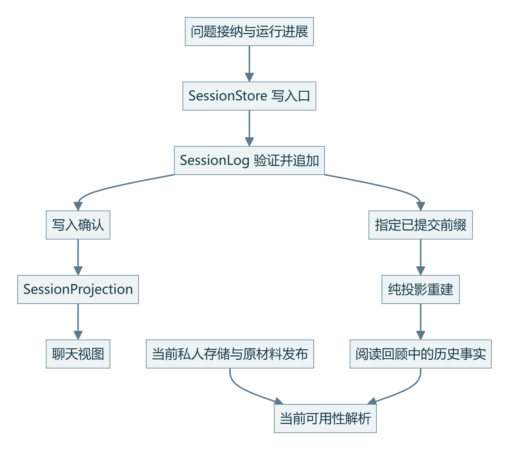

history.revised 也遵守这条思路：它在日志中追加“从 from 开始使用这个后缀”的事实，投影据此截断并接上新消息，旧事件仍保留在文件里。原来的前缀仍可按旧 seq 重建。第 11 章的压缩检查点则是另一种事件，安装前要验证它与可持久化消息前缀匹配；旧消息发生不兼容修订时，投影会清除检查点，避免用旧覆盖关系解释新历史。

追加式保存和可修订视图由此可以共存：文件记录发生过哪些变更，当前视图表达这些变更依次生效后的结果。

<a id="ch16-s13"></a>

### 16.4 消息、目标、来源与成果关联

<a id="ch16-s14"></a>

#### 沿一次请求观察各类记录

读者现在问：“给我一个条件不满足时的反例，把关键结论留成建议笔记。”系统接纳问题后，模型可能先读取正文，再组织反例并调用笔记动作，最后交付回答。下表按这条调用链说明关键记录；它是依据当前写入口组织的教学流程，省略中间活动变化，不是一次真实模型运行的原始日志。

| 任务推进到哪里 | 关键会话事件 | 后续可以回答的问题 |
| --- | --- | --- |
| 接纳问题并确定归属 | turn.accepted | 问了什么，属于哪个 turn，输入冻结在哪个前缀 |
| 保存用户消息、模型工具调用和工具结果 | message.appended | 这一轮实际留下了哪些协议消息 |
| 开始工具步骤或更新步骤状态 | activity.recorded | 当时推进到哪一步，哪一步未收口 |
| 更新持续目标 | goal.updated，或接纳/终态中的 goals | 哪个 Goal 的哪一版状态参与了这轮 |
| 关联实际教学回执 | teaching.linked | 这轮对应哪个 TutorSession、修订和回执 |
| 绑定回答来源 | sources.bound | 哪些已绑定原文可以从这个回答再次打开 |
| 记录 Reader 结果或演示版本 | effect.delivered | 哪个成果已经与这轮关联 |
| 收口回答与必要清理 | turn.finished | 最终完成、失败还是取消，消息后缀是否调整 |
| 读者随后保留或撤销成果 | effect.disposition_started、effect.disposed | 用户开始了什么处置，结果是否已确认 |

实际的保存时机可以在 [Runtime 工具循环](../../../crates/runtime/src/orchestrator.rs) 中看得更清楚。系统建立工具活动之后，先通过 checkpoint_sink.persist_progress 保存当前消息和活动，再进入工具分派。工具返回后，消息数组加入 Tool 结果，随后保存 effects 和新进展。Server 的 [RunCheckpointSink](../../../crates/server/src/agent_run.rs) 把这些调用接到 session_runtime。

这里的 checkpoint_sink 承担了运行中持久化的连接工作，并不意味着每一次 progress 都生成压缩摘要。消息、活动和压缩检查点各自有事件类型，只有 install 路径才处理 CompactionCheckpoint。

<a id="ch16-s15"></a>

#### 消息正文不足以表达结果身份

“我已经保存笔记了”是回答中的一句话。要让重启后的界面找到那条笔记，还需要稳定的 effect_id 与实际对象身份。类似地，演示回答需要 presentation_id 和 revision，来源需要 source_ref_id、证据范围与当时的展示快照，教学需要原 TutorSession 和实际回执。

[session_runtime::deliver_effects](../../../crates/server/src/session_runtime.rs) 用既有 effect_id 关联 Reader 结果，并跳过已记录的同一结果；完成处理从 answer_view 的 Presentation 部分提取版本引用。link_teaching 则只读取原 turn 对应的学习库回执，再追加缺少的关联。打开或重建聊天不会重新进行教学评估。

来源绑定独立于消息正文尤其重要。模型上下文可能被压缩，历史消息也可能经过清理，但回答的 source_bindings 仍属于这个 turn。当前 [来源与压缩重开用例](../../../crates/server/src/tests/session_runtime_tests.rs) 在安装检查点并重新打开存储后，验证原来源仍能解析；只被检索到、未绑定为来源的候选不能凭名称获得同样的入口。

本轮实际执行了这条用例。它验证的是来源身份与原文解析关系，不是在验证模型对原文的解释是否正确；后一个问题已经在第 9、12 章中分开讨论。

<a id="ch16-s16"></a>

#### 终态和必要清理必须一起落下

一次 Provider 失败可能要求去掉失败轮次的部分消息；正常完成则可能需要保存清理后的最后回答。如果先提交 failed，再单独写消息截断，进程可能停在两者之间。重启后的读者会看到终态已经失败，原始消息却仍保留不应继续使用的后缀。

当前 [TurnFinished](../../../crates/server/src/session_event.rs) 因此同时携带状态、结果或错误、运行摘要、来源绑定、Goal 引用与变化，以及可选 history_revision。session_runtime::finish 先据已有投影计算差异，再把必要修订放入同一条 turn.finished。事件通过校验并写入确认后，投影把两部分一起应用。

这个边界的大小值得看准：finish 在终态之前还可能追加来源或成果事件，工具动作本身也早已写入对应私人存储。把终态和它必需的消息清理放进一行，解决的是这两项事实一起生效的问题。它不把整轮多次模型采样、工具写入和各类存储变成一个事务。

<a id="ch16-s17"></a>

#### 保留与撤销：回执怎样跨过另一个存储

读者在回答之后按下“保留”，会进入 [effect_disposition::start](../../../crates/server/src/effect_disposition.rs)。系统先确认原聊天、turn、effect 与当前书的关系，并要求该 turn 已经结束，然后追加 disposition_started。接着 execute 调用既有 Reader 或 MemoryStore 操作，complete 再追加处置回执。

若处置的是高亮的保留，系统会预先生成结果笔记 ID，并把它写进开始记录。若处置的是建议笔记，则可以核对原对象是否已经进入 long_term。保存回执失败之后，再次请求同一个处置时，已有回执可以直接返回；只有开始记录时，reconcile 尝试用这些明确身份确认“保留”是否已经成功。

这使系统能处理一个常见的中间状态：存储里已经有保留结果，但日志中的完成回执尚未确认。当前核对只支持能够明确识别结果的保留路径，不能从“有一条相似文字”推断任意操作已经完成。无法确认时，回顾显示待核对，原动作不会因重建视图而自动重做。

如果先保留再撤销，撤销目标应当是保留结果的对象 ID。尤其是高亮保留形成一条笔记时，原高亮与新笔记有各自身份。当前用例验证了撤销删除保留所得笔记、原高亮仍存在；回顾记录依然能串起交付、开始保留、保留回执、开始撤销和撤销回执这五个事实。

<a id="ch16-s18"></a>

### 16.5 持久化失败、重启和阅读回顾

<a id="ch16-s19"></a>

#### 文件末尾的半行和完整坏行有不同含义

先考虑最小故障：程序只写了某条事件的前半行就停止了。下一次打开日志时，[read_prefix](../../../crates/server/src/session_log.rs) 只处理以换行结束的记录：

```rust
        if n == 0 || bytes.last() != Some(&b'\n') {
            break;
        }
```

没有终止换行的尾部不进入投影。即使它恰好已是合法 JSON，只要没有这条记录的换行边界，也按未完成尾行处理。open 是只读的，不会为了打开聊天立刻改文件；下一次合法写入才从 committed_len 截断未完成尾部并写入新记录。

如果某行已经以换行结束，却包含坏 JSON、不连续 seq 或不支持的版本，情况不同。读取会报告文件和字节位置，不能把它当成普通尾行忽略。否则，中间丢失的一项事实可能被悄悄跳过，之后的完成或处置事件会被错误地解释为有效。

<a id="ch16-s20"></a>

#### “写入报错”不一定意味着一个字节也没写进去

另一个故障发生在整行已经写入之后，调用方却在 flush 或 sync 阶段得到错误。此时内存投影还不能向前走，磁盘尾部却可能已经包含完整事件。SessionLog 会保留 uncertain 中的原事件和原字节，下一次写入先解决它。

若尾部字节与原事件完全一致，重试再次同步文件并接纳这条记录；若只是没有换行的部分尾部，则截断后重写；若出现其他完整记录，则报错。已有不确定事件时，不能换成另一条事件越过去。已经提交的 seq 也只有在整条事件内容一致时才允许原样重试，并且不再追加第二行。

| 观察到的状态 | 当前处理 | 对视图的影响 |
| --- | --- | --- |
| 部分事件字节写入后失败 | 保留不确定状态，原事件重试时修复尾部 | 确认之前保持旧投影 |
| 整行写入后失败 | 原字节匹配后同步并接纳 | 接纳一次，不多出第二条事件 |
| 同一 seq、同一事件再次提交 | 读取并核对已提交内容 | 返回成功，不增加文件字节 |
| 同一 seq、内容不同 | 拒绝不匹配的重试 | 不覆盖旧事实 |
| 有换行的损坏或不连续记录 | 打开或追加失败并报告位置 | 不跳过该记录继续伪造完整历史 |

这些机制服务的是原结果保存重试。第 12 章中“回答生成完成，但保存失败”的状态，仍不能通过再次发起模型请求来消除。对于当前进程内尚未确认的完整尾行，读取回顾也不能顺手把它接纳；snapshot 只允许读取内存已确认的 through_seq。进程重新打开文件时，则依据文件中完整且校验通过的记录重新建立前缀，这是另一个恢复阶段。

<a id="ch16-s21"></a>

#### 进程重启后，哪些工作还能继续

日志能够重建事实，不代表任何 pending turn 都能继续执行。对没有网络准入记录负责的本地 pending turn，[session_runtime::recover](../../../crates/server/src/session_runtime.rs) 找出尚未配对结果的 tool call，补入带原 tool_call_id 的 INTERRUPTED 工具回执，再以失败终态收口。这里的回执说明“执行在结果保存之前停止”，没有声称工具一定没有产生副作用。

补回执的意义在于关闭协议中悬空的调用关系，使下次上下文能明确看到中断。它不会根据工具名称再次调用 reader.note。当前恢复用例执行两次 recover，第二次文件字节不再增长，同一 tool call 也只有一个补出的结果。

网络服务还持有独立的准入记录。[UserRuntime::open_service](../../../crates/server/src/user_runtime.rs) 读取这些 turn ID，把它们从通用 pending 恢复中排除，交给 [RunAdmissions::recover](../../../crates/server/src/run_admission.rs) 按派发状态处理：

| 网络准入的状态或条件 | 恢复处理的依据与方向 |
| --- | --- |
| 私人聊天中 turn 已有终态 | 核对并修复准入侧的保存状态 |
| claimed，执行曾经被领取 | 以 INTERRUPTED 收口，不重新执行原工具链 |
| preparing / queued，尚未领取 | 核对冻结输入、准备状态、取消标记及原发布权限，符合条件后完成准备并进入可调度状态 |
| 缺少输入、权限已失效或其他合同不再成立 | 保存相应失败结果，不用当前现场重新猜测旧输入 |

恢复函数自身不调用 Provider，也不重新走原来的问题准备函数。可调度的任务之后仍由正常调度入口领取执行。这就把“恢复排队请求”和“重放已执行动作”分开：前者有冻结输入和未领取状态作依据，后者的副作用可能已经发生。

并发占位、跨用户配额和调度公平性会在第 18、19 章继续讨论。本章需要抓住的是，聊天日志解释业务事实，准入存储解释任务是否已经被领取；两个事实共同决定重启后的下一步。

<a id="ch16-s22"></a>

#### 回顾只解释截至某个位置的事实

读者再次打开章首的聊天，选择“本次阅读回顾”。[session_recap](../../../crates/server/src/session_recap.rs) 先从指定聊天取得一个已提交截点，随后投影出讨论过的问题、引用的原文、留下的成果和待继续事项。每项依据携带 turn_id 与 event_seq，能够回到原问题或原成果。

其中，through_seq 表示历史截点，through_at 来自该前缀的会话更新时间，generated_at 表示这次生成回顾的时间。它们回答不同的问题。界面的 [SessionRecap](../../../packages/web/src/components/SessionRecap.vue) 保留这份快照，读者按“刷新回顾”后才纳入新记录。

回顾的问题状态来自 turn 的明确状态；待继续事项来自尚未回答完成的回合和仍为 Open 的 Goal。来源来自实际 source_bindings，成果来自 effect 及其处置回执。系统没有再请模型从全部文字中推断“读者大概理解了什么”，也不因为生成回顾而新增教学判断或长期记忆。

以刚才的保留、撤销为例，可以得到以下三个截点。这里 q、r、s 代表具体日志中由写入口分配的不同位置，满足 q<r<s。

| 回顾截点 | 已经包含的事实 | 展示状态 |
| --- | --- | --- |
| q | 建议成果已交付 | pending，待处理 |
| r | 已有保留开始记录，没有完成回执 | unconfirmed，待核对 |
| s | 保留回执已经成功 | kept，已保留，指向保留结果对象 |

后来撤销或删除成果，再请求截至 s 的回顾，历史状态仍然是 kept。随后 resolve 用当前 MemoryStore、原材料发布及原演示版本检查可用性：若对象已经不存在，就标记“原成果当前不可用”。历史事实和当前可用性因此可以同时成立。

网络回顾通过当前授权用户取得私人会话，并按每轮原 published_book_ref 加载材料；本地回顾则核对当前书及发布是否与该轮匹配。不能为了让旧来源看起来可打开，就悄悄改用另一本书或另一个发布。对应的对象不可用时，回顾仍保留事件依据，点击入口按可用性呈现。

这条链路最终回答了章首的问题：读者可以看到自己问过什么、引用过什么、留下了什么，以及哪些事情仍待继续。回答来自已经提交的身份与状态，后续删除、修改和中断也有各自的位置。

<a id="ch16-s23"></a>

### 已知边界与本轮验证

本章于 2026-10-07 回读当前工作区，Git 基线为 4e0b68e。会话事件、日志、存储、运行连接、成果处置、回顾和网络准入以当前源码为准；ADR-0152/0153 用于说明决策，Linux 发布数据是 2026-10-02 的历史实验。相同提交没有代替对实际依赖文件的回读。

**追加节省的是普通提交的重复写入，当前读取和准备仍有增长成本。** SessionStore 启动会折叠日志；SessionLog::at 与原事件核对需要顺序读取；投影保存消息与补充事实。progress 仍复制可持久化消息并比较公共前缀，finish 也会构造候选消息。因而不能由追加字节较少推导出整个请求恒定时间、恒定内存，或已具备持久随机访问索引。长期历史归档与加载优化仍要依据实际使用数据。

**不同私人存储没有共同事务。** 工具已经修改记忆或学习库、日志回执尚未落下的间隙是真实存在的。当前使用原身份、明确回执和部分保留核对处理这些状态，无法确认的处置保持待核对。重启补出的 INTERRUPTED 是协议收口，不是“副作用未发生”的证明。单条完整记录及原结果重试，也不能扩大为跨日志、SQLite、记忆文件和呈现成果的全局 exactly-once 保证。

**新聊天存储不自动迁移旧 JSON 历史。** load_chat_storage 在有持久路径时从 agent-sessions 加载，原 agent-history.json 及旧备份保持原样。即使旧文件无法解析，新 JSONL 聊天仍可启动；这项行为有现有用例覆盖。新版列表与阅读回顾只覆盖新日志中的聊天，旧文件存在不等于已经出现在新版列表。

**回顾中的“中断”合并了全部 Failed 状态。** 当前 session_recap::status 把 AgentAssistantStatus::Failed 统一转为 interrupted，前端 [recapStatus](../../../packages/web/src/session-recap.ts) 显示“中断”。Provider 错误等正常失败也会走到这里，不能仅凭这个标签判断进程曾重启或崩溃；具体原因要回到原 turn 的 error。本轮执行的回顾用例使用 PROVIDER_ERROR 夹具，并断言得到 interrupted；中文标签按前端源码核对，未做浏览器验收。本轮未修改实现。回顾中的“已回答”也只表示回答已交付，不表示读者已理解或掌握。

**验证范围有明确边界。** 本轮直接执行当前 Server 库中五组定向既有用例，共 26 个，全部通过：事件投影 3、日志 8、聊天存储 5、运行连接 6、回顾 4。用例使用临时 JSONL、记忆文件及学习数据库，运行连接采用固定 ModelAdapter 响应或脚本化压缩草稿；同时覆盖内部路由返回，不启动真实 HTTP 服务。文件故障通过部分写入、完整写入后返回错误及无效保存路径等方式注入，没有模拟操作系统断电。

网络 RunAdmissions 的恢复连接和前端回顾展示按源码核对，本轮没有执行网络调度、浏览器或完整产品测试，也没有调用真实模型。历史 Linux 发布记录覆盖了一次真实追问、隔离读者、重启和原生备份恢复；其中 JL10 的 Windows 桌面整体、不同历史长度完整矩阵和持续使用场景仍未全部收口，不能把本章的 26 个通过用例记成整个发布验收完成。链接、摘录、符号和算例的核对见 [SOURCES](../SOURCES.md#%E7%AC%AC-16-%E7%AB%A0%E7%BB%AD%E5%86%99%E9%AA%8C%E8%AF%81%E8%AE%B0%E5%BD%95)。

<a id="ch16-s24"></a>

### 源码选读

可以沿“问一个问题，留下结果，重启后回看”的顺序阅读。

1. 从 [SessionStore::accept、append、settle](../../../crates/server/src/session_store.rs) 进入 [SessionLog::append、open、at](../../../crates/server/src/session_log.rs)，观察冻结位置、单行写入确认和不确定结果的重试。
2. 阅读 [SessionEvent 与 HistoryPosition](../../../crates/server/src/session_event.rs)，再进入 [SessionProjection::validate、apply、fold](../../../crates/server/src/session_event/projection.rs)，区分事件合同和纯内存重建。
3. 从 [RunCheckpointSink](../../../crates/server/src/agent_run.rs) 沿 [session_runtime 的 progress、checkpoint、finish、recover](../../../crates/server/src/session_runtime.rs) 追踪工具前后保存、终态清理和中断收口，再对照 [RunAdmissions::recover](../../../crates/server/src/run_admission.rs) 理解网络入口的例外。
4. 从 [effect_disposition 的 start、execute、complete、reconcile](../../../crates/server/src/effect_disposition.rs) 进入 [session_recap 的 snapshot、project、resolve](../../../crates/server/src/session_recap.rs)，观察一次保留如何成为可按截点回看的事实，又怎样查询当前对象的可用性。

<a id="ch16-s25"></a>

### 面试时怎样解释

**如果被问到“你们怎样保存 Agent 会话，并避免重启后重复执行工具”，可以这样回答：**

“我们按读者和聊天保存线性 JSONL，一条事件表达一次已确认的变化。接纳问题时记录 turn 身份和已提交历史位置，后续追加消息、活动、来源、Goal 与成果回执。日志先校验连续序号，写入并同步成功后才更新内存投影；部分尾行由后续写入修复，完整坏行报错，原事件重试通过身份和内容核对避免重复追加。重启折叠日志只重建状态，不调用模型和工具。已经领取执行的任务按中断收口，未领取且具有完整冻结输入的网络请求才可继续排队。回顾由某个已提交前缀生成，再单独检查当前来源和成果是否可用。”

1. **换成 JSONL 后，为什么不能说写入已经完全是 O(1)？**

   普通提交不再重复写入全部历史，但事件自身可变大，持久化需要同步，当前 progress 还会复制和比较消息。应区分磁盘新增字节、CPU 工作、内存和读取成本。

2. **为什么同时保存事件序号和字节位置？**

   事件序号定义逻辑前缀，供验证、冻结和回顾使用；字节位置定义已确认文件边界，供尾部核对和修复使用。两者单位不同，不能互换。

3. **完整写入之后报错，为什么直接重试追加会出问题？**

   调用方没收到确认不等于文件没有新增内容。若直接向末尾再写一次，会重复事件；当前保存原事件字节，先核对尾部，匹配时同步并接纳原记录。

4. **为什么失败终态里还要带消息修订？**

   失败可能要求清理后缀。把状态与必要清理放在同一事件，可以避免恢复出“已失败但仍持有未清理上下文”的中间视图。这仍不等于整轮工具调用共享事务。

5. **重启后发现 tool call 没有结果，能不能再执行一次？**

   缺少已保存结果无法证明副作用没发生。当前对已执行或本地悬空运行补中断回执并收口；只有未领取的网络排队请求，才依据冻结输入和准入状态继续调度。

6. **笔记后来删除了，旧回顾应该改成“没保留过”吗？**

   不应该。旧截点仍显示当时已确认的保留事实，当前可用性再说明对象已经不存在。过去发生的事实与现在能否打开是两个问题。

7. **怎样证明本轮改进降低了保存成本？**

   先限定指标为新增写入字节，观察旧前缀和无关聊天是否保持；再用不同历史长度的固定任务验证增长关系。项目已有一次真实追问的追加观测，本章另运行了日志与恢复的定向用例，尚不能据此声称完成完整性能矩阵或断电验收。

聊天现在能够记住一项成果何时交付、后来如何处置，还可以指向当时的演示版本。接下来进入[第 17 章](#ch17)，继续追踪解释页面怎样从候选经过预览成为可交付版本，又怎样接住读者的操作和下一次追问。


---

<a id="ch17"></a>

## 第 17 章 可探索解释与演示版本

第 16 章已经能够从聊天回顾中打开一项过去交付的演示。读者看到的不是 Agent 声称“我做过一个页面”，而是某次回答引用的一份确切内容。接下来，他调了一个参数，发现结果与直觉不同，于是问：“为什么现在会这样？把这个差别讲得更清楚，保留我刚才的设置。”

这个请求同时要求解释、读取现场和修改成果。若把它当作一次普通文本问答，Agent 可能不知道“现在”指什么；若每次都重新生成页面，读者又会失去刚才调整的参数、已经理解的上下文和旧答案。要把可操作的解释纳入阅读过程，系统必须为内容、观察、版本和现场分别建立身份。

本章沿“生成解释—预览关键关系—交付—操作后追问—修订同一对象”的过程展开。贯穿算例采用一个简化的学习率问题：两条路径每一步的损失完全相同，为什么一条从同侧接近最优点，另一条却不断跨过最优点？这个例子来自项目可探索解释设计中的金样板；下面的数值表是本章按给定公式重算的教学算例，不是新开展的读者学习实验。它让我们看到：选择图形和交互的理由，首先是补足理解所缺少的关系。

<a id="ch17-s1"></a>

### 17.1 从解释任务到呈现方式

<a id="ch17-s2"></a>

#### 先确定读者没有看见什么

考虑一维损失函数：

\[
L(w)=(w-2)^2,\qquad w_0=0
\]

梯度下降按下面的规则更新参数：

\[
w_{k+1}=w_k-2\eta(w_k-2)
\]

令误差 \(e_k=w_k-2\)，就得到：

\[
e_{k+1}=(1-2\eta)e_k
\]

当学习率 η=0.2 时，误差每步乘以 0.6；η=0.8 时，误差每步乘以 −0.6。两者的误差绝对值相同，损失也相同，但误差符号的变化不同。

| 数学步 k | η=0.2 的 w | η=0.8 的 w | 两者共同的损失 |
| --- | ---: | ---: | ---: |
| 0 | 0 | 0 | 4 |
| 1 | 0.8 | 3.2 | 1.44 |
| 2 | 1.28 | 1.28 | 0.5184 |
| 3 | 1.568 | 2.432 | 0.186624 |

如果页面只画损失随步数变化的曲线，两条线会重合。图画得很精细，也没有呈现用户真正困惑的差别。沿参数轴显示当前位置、最优点和上一位置，再让用户前进一步，才能直接看见同侧接近与交替跨越。

这个推导也给出了一个反例。η=1.1 时，误差乘数为 −1.2，第一步 w=4.4，第二步 w=−0.88；对应损失从 4 增至 5.76，再增至 8.2944。页面可以让读者先预测下一位置，再揭示结果。交互的用途是检验“跨过最优点就一定发散”这一错误泛化，而不是增加一个看起来热闹的滑块。

[ADR-0139](../../adr/0139-explorable-explanation.md) 用对象连续性、动态对照、轨迹残影、不变量高亮、反例和预测后揭示描述这种解释方法。当前 Resident 使用的 [presentation-method](../../../skills/presentation/SKILL.md) 进一步要求：围绕当前问题选择表达方式，让每个图形和操作承担具体的解释工作，复杂内容先试做能够暴露表示问题的关键局部。

因此，是否制作页面是一次内容判断。稳定的概念区别可以用文字和静态对照说明；参数影响需要可重复计算；对象如何连续变化，才需要可定位的运动过程。同一篇解释可以组合这些方式。

<a id="ch17-s3"></a>

#### 页面成为阅读成果，需要哪些部分

沿上述任务，Agent 需要产出可运行的页面、文字说明、教学假设和来源。当前 [PresentationContent](../../../crates/runtime/src/presentation.rs) 将这些内容保存在一起：

```rust
pub struct PresentationContent {
    #[serde(default)]
    pub animation_assets: BTreeMap<String, AnimationAsset>,
    pub title: String,
    pub content_files: BTreeMap<String, String>,
    pub entrypoint: String,
    pub readable_content: String,
    pub source_bindings: Vec<SourceBinding>,
    pub assumptions: Vec<String>,
    pub state_contract: Value,
    pub initial_state: Value,
}
```

这里的 content_files 是逻辑文件表。例如 index.html 是页面入口，assets 下可以保存图形资源，plots 或 animations 下可以保存制作资源的代码与数据。它不是让模型任意指定宿主文件路径的接口。

readable_content 负责表达页面的文字、图形意义和动态结果，Reader 可以通过“说明与来源”单独显示。assumptions 则保存简化条件。在学习率例子中，“一维二次函数”和“固定学习率”应作为解释的条件保留下来；书中其他模型的结论不能只因为出现在同一页面，就自动适用于这个算例。

来源仍沿第 12 章的证据路径进入。模型通过 source.present 观察到的引用，或者所选旧版本已经持有的引用，才能成为候选的 SourceBinding。每次 write 还要明确列出 source_ref_ids。已观察某段原文与已将它附到这份候选，是两个不同步骤。

页面内部使用 data-source-ref 控件，由宿主提供来源标签和打开行为；readable_content 可以使用既有来源标记，经公开回答编译器生成可展示结构。页面自己写一个“来源”按钮，不会因此创造一条证据绑定。这使富回答能够沿用普通回答的来源体系。

<a id="ch17-s4"></a>

#### 同一个阅读循环，增加一种交付物

制作仍由原 Resident 循环决定下一步。presentation.author 提供 prepare、write、patch、preview、deliver 等操作，Server 负责保存和执行，Reader 负责交互与现场。它没有另起一个拥有独立任务目标的“页面 Agent”。

从一次阅读请求看，主要关系如下：

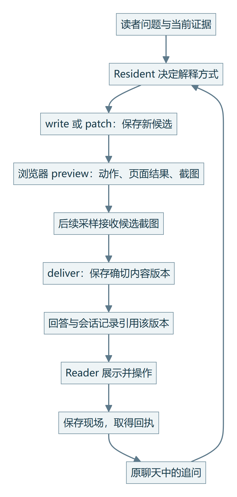

图中的最后一条边很重要。读者不必把页面当作一次性附件：现场回执能够把当前版本和操作结果重新交给同一条阅读讨论。若这份呈现属于教学过程，Tutor 还可以借助宿主活动表单接纳明确的学习动作。页面播放、按钮点击和参数变化本身，则仍是演示现场，不能直接替代第 13 章的学习证据。

<a id="ch17-s5"></a>

### 17.2 候选、预览与已交付版本

<a id="ch17-s6"></a>

#### 一份 HTML 需要经过几个不同的确认

假设 Agent 已决定制作上述学习率解释。它先调用 write，提交标题、HTML、readable_content、来源列表、假设及初始状态。Server 的 [AuthorSession::author](../../../crates/server/src/presentation_author.rs) 组装所选资源、检查内容，并调用 create_presentation_candidate 保存候选。

此时工具返回 candidate_saved 和 candidate_id。该回执只说明内容已经有了可读取的落点。它没有说明页面能运行，没有证明图文一致，也没有把它放进用户已经收到的答案。

本章涉及的几种身份可以并列来看：

| 对象 | 主要身份 | 回答的问题 |
| --- | --- | --- |
| PresentationCandidate | candidate_id、created_by_turn_id、owner | 本次 Run 正在制作哪一份内容 |
| 预览记录 | candidate_id、environment_name、动作序号 | 在哪个环境、什么操作之后观察了什么 |
| AgentPresentation | PresentationRef、candidate_id、based_on | 保存下来的确切内容版本是什么 |
| PresentationState | values、visible_step、observed_result | 页面当时有哪些参数，显示了什么 |
| PresentationFollowUp | 内容引用、state_revision、saved_state_ref | 这次追问究竟绑定哪份已保存现场 |

候选保存后保持不变。patch 也不会就地改写旧候选，而是产生新的 candidate_id。这样，一张截图只能支持它实际观察过的那份内容；修改 HTML 后，系统不需要猜旧截图是否仍然适用。

候选还绑定创建它的 Run。当前 author 路径读取、搜索、修改或预览 candidate_id 时，会核对 created_by_turn_id。新 Run 可以沿确切版本读取旧成果，但不能把历史消息中的旧候选句柄恢复为本轮制作资格。

<a id="ch17-s7"></a>

#### 预览提供的是可归属的浏览器观察

对于最终候选，当前工程指导规定三个内容环境：

| 环境名 | 内容视口，CSS 像素 | 输入方式 | 主要暴露的布局约束 |
| --- | --- | --- | --- |
| narrow-content | 320×420 | touch | 窄屏换行、横向溢出、触控目标 |
| short-content | 640×240 | touch | 短屏中操作与结果的空间关系 |
| desktop-content | 960×720 | mouse | 桌面阅读顺序和整体布局 |

这些数值来自 [REQUIRED_PREVIEW_ENVIRONMENTS](../../../crates/runtime/src/presentation_preview.rs)。它们表示页面内容区域，不是整个浏览器窗口尺寸。

一次 preview 从新页面开始，最多执行四个动作。click 和 key 触发实际控件操作；scroll 按绝对 CSS 像素位置滚动，到底部时截在真实最大位置；seek 则定位连续场景。每次观察保留动作、实际滚动位置、DOM、布局指标、问题和截图。长页面因此可以先看顶部，再滚到解释的关键段落，而不必把整页压成一张难以辨认的长图。

[BrowserPreview](../../../crates/server/src/presentation_preview.rs) 通过 Chromium 协议加载候选、设置内容视口与触控模拟，等待实际绘制，再读取 DOM 与截图。当前确定性检查能够发现脚本错误、横向溢出、没有可操作盒子的控件，以及触控环境下小于 44×44 CSS 像素的目标。Server 另外核对页面公开文字、来源引用和资源依赖。

预览结果按候选和环境积累。显式视口路径中，三个环境全部取得干净观察，才得到 preview_ready_for_inspection；只有部分环境通过时返回 preview_environment_recorded，并列出还缺哪些环境。某个环境的新预览失败，会撤销它已有的通过记录。

对于学习率页，一次合适的观察不是“页面成功加载”就结束。Agent 应操作下一步、回退、改变学习率，并看清参数位置、损失、文字说明是否仍然对应。工程检查和后续截图观察在这里分工：程序发现能够明确计算的执行及几何问题，模型结合题意检查对象关系、图文含义和阅读顺序。

<a id="ch17-s8"></a>

#### 看过截图，要发生在下一次采样

浏览器工具返回图片后，模型还需要一次新的采样，才可能依据图片作出下一步决定。若允许在同一批调用中先 preview、再 deliver，后一个决定其实是在看图之前就产生的。

Runtime 对此保留了单独的门。下面是 [orchestrator](../../../crates/runtime/src/orchestrator.rs) 的实际分派摘录：

```rust
if let crate::presentation_author::AuthorRequest::Deliver { candidate_id } = &request {
    if !context.inspected_presentations.contains(candidate_id) {
        return Err(ToolError { error_code:"PRESENTATION_INSPECTION_REQUIRED".into(), category:"validation".into(), message:"Preview and inspect this candidate's screenshots in a subsequent sampling before delivery".into() });
    }
}
```

成功预览会进入 pending_previews，图片进入下一份模型请求；该采样成功返回后，Runtime 根据实际附带的图片及被容量限制省略的环境，更新 inspected_presentations。它判断的是候选图片是否进入了相应采样，不是把模型口头说“看过了”当作依据。

同样，render_plot 产生的图形也要先进入后续采样，才可以被 write 挂到候选中。图片观察是一种运行事实，而不是任意文本都能声明的状态。

当修改产生新候选时，新的 candidate_id 没有旧候选的预览和观察资格。Agent 要再次预览、接收图片，再请求交付。这解释了为什么小改动也不能简单复用此前的“通过”布尔值。

<a id="ch17-s9"></a>

#### 数值必须带着参数和数学步号一起读回来

在学习率页里，模型知道公式，并不意味着它已经确认页面当前算出了什么。历史问题正包括：页面数值正确，收尾文字却把数值配到了错误的步号。

preview 的 read_selector 用来读取指定结果区域。下面是本章的教学请求，candidate-example 和 #readout 表示正在制作的候选与页面自定义的结果区域：

```json
{
  "operation": "preview",
  "candidate_id": "candidate-example",
  "viewport": {"width": 320, "height": 420, "input": "touch"},
  "actions": [
    {"kind": "seek", "semantic_state": 2, "transition_progress": 0.5}
  ],
  "read_selector": "#readout"
}
```

当前实现要求选择器恰好匹配一个有渲染尺寸、非隐藏且含结果文字的区域。如果场景仍在播放，读取会被拒绝。返回内容将结果文字、page_state、当前控件、场景信息和 action_step 放在一起；有动作时，读取发生在最后一个动作之后。

此处 action_step=1 只表示本次预览执行了第一个动作。数学步号来自 semantic_state=2，视觉过渡位置则是 0.5。把三者混成“第一步的第 2.5 次迭代”，就丢失了每个字段的用途。

浏览器侧完整结果受 8 KiB 限制；超过限制时要求缩小读取范围。进入模型上下文后，[project_selected_result](../../../crates/runtime/src/tool_result.rs) 也把整条读取视为一个整体：容量足够就保留，容量不足就给出 PRESENTATION_READING_BUDGET 与继续读取建议。它不会只留下数值而截掉对应参数，因为那会改变数值的含义。

<a id="ch17-s10"></a>

#### 保存版本与答案交付如何接上

Server 的 deliver 还会检查自己的候选预览记录，然后调用 [persist_presentation_candidate](../../../crates/server/src/presentation_store.rs)。这一步将候选保存为不可变的内容版本，返回 PresentationRef：

```rust
pub struct PresentationRef {
    pub presentation_id: String,
    pub revision: u32,
}
```

同一个候选重复保存时，存储层返回已有版本引用；新的修订则在该对象已有版本的最大 revision 上加一。based_on 保留它真正采用的基底。例如对象已有 revision 1 和 2，读者明确要求修改 revision 1，那么新结果可以是 revision 3，based_on 仍指向 revision 1。新版本编号表达保存顺序，基底引用表达内容来源。

工具返回 version_saved 后，Runtime 将引用加入本轮已交付呈现集合，并在正常收尾时附到回答中；会话保存再承接第 16 章的成果与终态机制。当前工具回执明确说明，历史提交仍然待完成。

Reader 的 [delivered_version](../../../crates/server/src/presentation_api.rs) 会检查该引用是否已经出现在所属回合的回答或已交付成果记录里。仅仅在 versions 目录存在一个 JSON 文件，不足以成为历史中可打开的交付。这也允许一种重要恢复：成果交付事件已经提交，而最终终态保存中断时，回顾仍能指向那项实际交付的成果。

<a id="ch17-s11"></a>

### 17.3 图表、二维交互和动画资源

<a id="ch17-s12"></a>

#### 表示所需的计算，决定制作路径

同样是“给我一个图”，实际需要的能力可能很不同。

| 当前解释需要 | 可用路径 | 交付后的计算性质 |
| --- | --- | --- |
| 说明对象位置、关系与少量原生控件 | HTML、内联 SVG/Canvas、JavaScript | 页面可以按当前参数实时计算和重画 |
| 给出固定数据的坐标图 | render_plot 与 Matplotlib | 图形内容固定，适合静态对照和定量标注 |
| 拖动物体，协调多个图形对象 | 显式选择 Konva 库 | 浏览器内保留对象与交互逻辑，可实时反馈 |
| 播放预先编排的短过程 | render_animation 与 Manim | 保存为固定视频，可定位播放，不能任意重算参数 |

学习率例子需要在 η 改变之后立即更新轨迹，用浏览器图形比较直接。如果某段解释只想用一个短片突出“误差符号翻转但长度缩小”，固定动画也可以承担这一局部。页面的其他部分仍可以保留文字、控件和静态图。

这个选择同时决定成本。原生页面只需要一套前端逻辑；静态绘图要启动 Python 并生成资源；动画还要渲染、解码和保存媒体。引入更重的工具，应当能够说明它改善了哪种关系的表达。

<a id="ch17-s13"></a>

#### 静态图先作为临时成果，再归属于版本

[render_plot](../../../crates/server/src/presentation_plot.rs) 使用 Matplotlib 的 Agg 后端，将代码与数据写入临时工作目录，生成 SVG 和 PNG。SVG 用于页面展示，PNG 用于模型观察；返回的 asset_ref 是当前制作 Run 持有的资源句柄。

write 通过 asset_refs 明确选择资源，并把 SVG、绘图代码和数据加入候选。因而“已经画过一张图”与“这份版本包含这张图”仍是两件事。未被候选采用的临时结果不会因为在本轮出现过，就自动成为交付物的一部分。

当前绘图默认 800×480，支持 320—1600 的宽度、240—1200 的高度，并设置代码、数据、输出大小与 20 秒执行时限。中文标签还会选择可用的中文字体；缺少合适字体时返回明确失败。对书稿读者来说，这些限制的意义是把一次工具工作收在可处理的范围内，而不是承诺任意绘图代码都能完成。

<a id="ch17-s14"></a>

#### 固定库要随版本保存

选择 libraries 中的 konva 后，[presentation_libraries::assemble](../../../crates/server/src/presentation_libraries.rs) 将宿主持有的 Konva 10.7.0 与许可证保存进逻辑文件表，并在业务脚本前插入相应引用。模型获得的是制作指导和库元数据，无需把整份压缩库反复写进自己的输出。

已有版本重开时，inline 使用的是那个版本保存的库内容。宿主后来更换随包库，不应悄悄改变旧页面。基于旧版本重新 write 时，则按本次明确选择的 libraries 重新组装；patch 保留基底的资源。这使“局部修改页面”与“重新选择依赖制作新修订”具有可解释的区别。

这种固定供给主要解决资源完整性和制作成本。它不是一种布局模板：是否需要时间线、拖动、轨迹残影或多视图，仍由当前解释任务决定。当前能力目录也明确，使用 Konva 不自动要求连续动画；需要保存自定义交互时，再选择 state 指导。

<a id="ch17-s15"></a>

#### 数学状态与过渡位置必须分开

在一个离散算法中，w₂ 和 w₃ 是两个确定状态；圆点从 w₂ 移到 w₃ 的中间画面，只是用于解释变化的视觉过程。若把插值位置写成算法真的产生了一个“第 2.5 次更新结果”，页面会凭空增加算法语义。

当前连续场景因此使用两个坐标：

- semantic_state 表示算法或解释的离散步骤。
- transition_progress 表示该步骤内的视觉过渡比例，范围为 [0,1)。

页面通过 window.presentationScene 暴露 seek 与 snapshot。预览要求 seek 停止自动播放，定位到指定场景，再在 DOM、布局和截图采集前后读取 snapshot。若步号或过渡位置不匹配、仍在播放，或者采集过程中状态变化，就分别记录位置、暂停或一致性问题。

当前 PreviewScenePosition 对步号设有 1000 的上界，也拒绝非有限数与越界过渡比例。这里约束的是工具允许检查的场景位置。页面仍要自己定义“第 2 步”的具体含义，并让参数、图形、说明和保存状态使用同一个约定。

<a id="ch17-s16"></a>

#### 固定动画也要能保存与继续阅读

[render_animation](../../../crates/server/src/presentation_animation.rs) 执行 Manim 制作支路，返回 MP4、封面、尺寸、时长、帧率和 cues，同时保留代码、数据及少量解码帧供观察。write 把明确采用的资源纳入版本；Reader 再将版本内逻辑媒体路径组装为可播放内容。

当前渲染默认 1280×720，尺寸需要为偶数；执行时限为 180 秒，单个 MP4 不超过 8 MiB，版本动画媒体合计不超过 24 MiB。工具会核对实际解码元数据与输出，而不只接受“渲染成功”的文字。

[共享媒体生命周期](../../../packages/web/src/presentation-media.js) 在页面离开可见区域、宿主隐藏或页面关闭时暂停视频；同一页面开始播放一个视频时，其他视频暂停。重新可见不会自动继续播放。视频时间及自定义播放状态的保存和恢复，仍要通过页面现场合同连接起来。

这里有两个执行环境。可信本地模式直接运行相应 Python 和浏览器；网络服务模式由 [presentation_sandbox](../../../crates/server/src/presentation_sandbox.rs) 提供独立工作任务，使用 Linux 的 systemd cgroup 与 bubblewrap 承担隔离和资源边界。临时目录和超时本身不能替代后一种隔离。二者的宿主调度与取消关系将在第 18—20 章展开。

<a id="ch17-s17"></a>

### 17.4 页面现场、追问和同对象修订

<a id="ch17-s18"></a>

#### Reader 接管公开内容与来源

版本进入 Reader 后，[presentationDocument](../../../packages/web/src/presentation-document.ts) 将版本内逻辑资源组装进一个文档，加入共同样式、来源标签和 bridge。页面通过 sandbox="allow-scripts" 的 iframe 运行；资源、联网和表单行为由宿主的文档策略约束。

这个安排给页面足够的计算空间：它可以根据 η 和步号重新计算图形，也可以定义自己的阅读顺序。与此同时，来源打开、向原聊天发送问题、接纳教学活动等操作仍经过宿主。

页面变化后，[presentation-bridge](../../../packages/web/src/presentation-bridge.js) 收集公开文字、辅助标签、控件内容及来源引用，发送 observe。宿主通过 presentationObserve 交给 Server 验证，得到接受回执后才确认对应的观察版本。初次显示等待接纳；后续未接纳的语义变化会暂时被遮住，避免新文字先被当作有效内容展示。

不是每一次几何变化都必须产生服务器请求。bridge 会比较文字与引用的组合，纯位置变化通常不会改变它。但本地 MutationObserver 仍可能触发扫描和克隆，这一点要留到性能讨论中分别测量。

来源按钮也通过父窗口打开原文。生成页面只能引用版本已有的 source_ref_id，不能越过宿主自行宣布新的来源。对于 Tutor，页面的 requestTeachingAction 只是请求聚焦宿主活动表单，真正的学习动作仍由明确提交接纳。

<a id="ch17-s19"></a>

#### 追问之前，先把“现在”保存下来

继续学习率例子。读者将 η 调到 0.8，定位到某一步，再输入：“为什么损失与另一条路径相同？”如果仅发送这句话，后端很难知道读者究竟看到了哪组参数。

PresentationState 保存三个不同角度的内容：values 保存控件和页面自定义参数，visible_step 保存当前解释步骤，observed_result 保存当时可见的结果文字；source_ref_ids 则保留这次观察涉及的来源。

页面可以通过 window.presentation 注册 stateReader 和 stateRestorer，并在需要时调用 commitState。普通表单控件也由 bridge 捕获。当宿主请求 snapshot 时，bridge 先等待当前观察版本被接受，然后在一次同步读取中取得控件、自定义状态和实际可见结果：

```javascript
send({ kind: "state", request_id, state: {
  values: { controls, page: custom.values ?? null },
  visible_step: custom.visible_step ?? document.querySelector("[data-presentation-step]")?.getAttribute("data-presentation-step") ?? null,
  observed_result: visibleText(document.body).trim(), source_ref_ids: observation.source_ref_ids,
} });
```

这段摘录来自当前 bridge。它把输入与输出放在同一份观察里。例如，“η=0.8、数学步 k=1、w=3.2、损失 1.44”比孤立的“损失 1.44”具有清楚得多的解释条件。

[AgentPresentation.followUp](../../../packages/web/src/components/AgentPresentation.vue) 请求 snapshot 后，先等待 saveState 返回回执，再发出 follow-up 事件：

```typescript
const receipt = await saveState(snapshot);
if (current !== generation || error.value || props.busy) return;
emit("follow-up", message, receipt);
```

因此，现场保存失败时不会继续发送一条看似带有现场、实际无法回读的问题。界面会保留“追问未发送”的失败说明。保存操作还经过队列，当前页面切换后，旧操作不能继续冒充新页面的现场。

<a id="ch17-s20"></a>

#### 内容版本和现场版本分别增长

内容版本描述解释本身；现场版本描述读者如何操作这份解释。调一次参数不需要复制一份新 HTML，修改公式也不能覆盖旧现场所引用的内容。

当前回执的字段很短：

```rust
pub struct PresentationFollowUp {
    pub session_id: String,
    pub turn_id: String,
    pub reference: PresentationRef,
    pub state_revision: u32,
    pub saved_state_ref: String,
}
```

它由成功保存现场的路径生成。private presentation 存储将候选、内容版本和现场分开放置：candidates 下保存候选，versions 按 presentation_id/revision 保存内容，states 再按 presentation_id/内容 revision/现场 revision 保存观察。用户私有根与 owner 共同限定归属。

可以用一个教学序列看清它们如何组合：

| 时刻 | 内容 | 操作及保存 | 后续意义 |
| --- | --- | --- | --- |
| t₁ | P 的 revision 1 | 保存现场 1，η=0.2 | 得到一份现场回执 |
| t₂ | 仍为 revision 1 | 保存现场 2，η=0.8 | 追问 Q 绑定这份回执 |
| t₃ | 仍为 revision 1 | 保存现场 3，η=1.1 | 不改变 Q 的输入 |
| t₄ | 新交付 revision 2 | 页面增加带符号误差说明 | 旧回答仍引用 revision 1 |

[follow_up_context](../../../crates/server/src/presentation_api.rs) 根据 Q 的回执回读 revision 1 的现场 2，核对聊天、回合、版本和保存身份。它不会因为现场 3 更新，就把 Q 改成针对 η=1.1 的提问；也不会因为 revision 2 已经存在，就把旧问题换到新页面。

普通打开某个内容版本时，可以恢复该版本最新保存的现场；明确“回到提问时”则恢复回执指定的那一份。当前 restore 还会先保存读者此刻的现场，再加载旧回执。于是，“我现在看哪里”和“当时为什么问这个问题”都能保留下来。

[RightRail](../../../packages/web/src/components/RightRail.vue) 的演示工作区继续使用原聊天，presentationKey 由 turnId、presentation_id 和 revision 组成。工作区已经选定某个版本时，新成果不会自动替换正在讨论的页面。定位旧现场与恢复旧现场也由不同操作表达：前者选择对应内容，后者明确调用 restore。

<a id="ch17-s21"></a>

#### 修订必须选择确切基底

读者要求“把这个差别讲清楚”时，Agent 可能只需修改一段说明，也可能要重新组织整个页面。

局部修改可以先 search 找到对应函数或文字，再 read 邻近源码，最后 patch。当前 [presentation_source](../../../crates/server/src/presentation_source.rs) 的读取偏移按 Rust chars 计数，即 Unicode 标量值；这让中文源码的范围可以稳定回读，不会把 UTF-8 字节位置直接当成字符位置。search 是区分大小写的字面匹配，给出命中偏移、行号及附近源码。

补丁采用精确替换。每项 old_text 必须在当前更新串中恰好出现一次；多项编辑按顺序作用于局部副本，全部成功后才保存新候选。下面是决定是否接纳单项替换的实际代码：

```rust
let Some(at) = updated.find(&edit.old_text) else {
    return Err(format!(
        "Edit {index}: old_text not found; read/search the selected base and retry"
    ));
};
if updated.rfind(&edit.old_text) != Some(at) {
    return Err(format!(
        "Edit {index}: old_text matches more than once; include more surrounding source"
    ));
}
updated.replace_range(at..at + edit.old_text.len(), &edit.new_text);
```

如果页面两处都写了“损失相同”，只替换这个短语会被拒绝。Agent 应回读并加上能区分位置的上下文。若第一项替换成功、第二项找不到，修改仍停留在未保存的局部串里，不会留下半份新候选。

patch 保留资源、来源和未修改的内容字段；readable_content 可同时修订，避免页面与文字说明各说各话。重新 write 则适用于大范围改版和资源选择变化，需要明确指定 based_on、来源及采用的资源。

当前追问 Run 已经绑定现场回执时，write 默认必须以回执中的确切版本为 based_on。省略它不会静默新建另一个对象，改用最新 revision 也会被拒绝。只有明确 new_object=true，才表达独立新建；该标记又不能与 based_on 同时使用。对旧版本的 patch 同样核对确切基底。

<a id="ch17-s22"></a>

#### 继承参数要先确认含义没有改变

保留 η=0.8 很合理，但不能把所有旧字段不加区分地复制到新页面。若某字段从“秒”改成“毫秒”，相同数值会有完全不同的意义；若原数字改成文本模式，也不该仅凭字段名继承。

[inherit_parameters](../../../crates/server/src/presentation_author.rs) 按新 initial_state 的键逐项处理。只有新旧 state_contract 中的非空定义字符串完全相同，且新默认值与旧保存值同为布尔、数值或字符串时，才把保存值写入新初始参数。数组、对象和已经移除的键不会自动继承。

本轮运行的既有用例提供了一个清楚的对照：

| 参数 | 新页面的变化 | 新初始值采用什么 |
| --- | --- | --- |
| count | 定义仍为 integer evidence count 0..3 | 采用被冻结回执中的 1 |
| unit | 定义由 seconds 改成 milliseconds | 保留新默认值 100 |
| mode | 定义未变，但旧值是数字、新默认值是字符串 | 保留新默认值 text |
| shape | 新旧均为对象 | 保留新默认对象 |
| new | 新增字段 | 保留新默认值 5 |

用例在准备追问后又保存了一份 count=3 的较新现场，新候选仍继承被冻结的 1。以本轮候选为基底连续 patch 时，则保留该候选已经选好的 initial_state，不会每改一次源码又重新从页面最新现场取值。

这些规则只负责内容修订时的初始参数选择。同一版本重新打开时的现场恢复，仍由控件恢复和页面注册的 stateRestorer 完成。内容修订、打开页面和恢复提问现场，各有明确入口。

<a id="ch17-s23"></a>

### 17.5 指导上下文、源码回读与制作成本

<a id="ch17-s24"></a>

#### 复杂解释需要交接设计，但不必另开 Agent

做一个简单文字修正，只需定位、修改、验证和交付。做一整篇解释则会遇到更长的依赖链：先定义对象，再说明条件，再给反例，最后让读者操作。如果模型只盯着当前局部，很容易把演示做完，却漏掉原任务的一半。

[ADR-0154](../../adr/0154-presentation-global-framework-and-staged-authoring.md) 将工作分成 global、local 和 review 三种制作职责。当前 [agent_prompt::presentation](../../../crates/runtime/src/agent_prompt/presentation.rs) 将它们编译为可选指导，仍交给同一个 Resident：

| 阶段 | 本次采样应处理的内容 | 与其他状态的关系 |
| --- | --- | --- |
| global | 解释关系、阅读顺序、全篇约定、关键局部 | 形成制作框架，完整任务范围留在 Goal |
| local | 试做关键关系，按观察修改，再展开全文 | framework 保留全篇联系，focus 指明当前重点 |
| review | 沿成品串读，核对要求、图文和关键操作 | 更新实际缺口，然后完成工程预览与交付 |

prepare 提交 phase、framework、focus 和 needs，更新当前 Run 的 PresentationAuthoringContext。它是完整替换：省略 framework 或 focus 会清除旧值，needs 则明确给出当前需要的技术参考。prepare 要单独调用，等下一次采样实际收到指导，再使用相应能力。Runtime 对 prepare 与 write 混在同一批的两种排列都予以拒绝。

复杂任务可以先交接一个“让同损失的两条轨迹显现不同方向”的局部 focus，用小候选暴露图形表示的问题，再扩展成完整解释。简单修订可直接选择 local，不必补做一套没有实际作用的全局设计。

这里要把三种文本分开。Goal requirements 保存用户要求，working.items 保存工作进展；framework 保存解释结构和对象约定，focus 保存当前制作重点；固定的工程及技术指导来自项目资源。把工作项全部标为 completed，也不能替代页面真正交付。

<a id="ch17-s25"></a>

#### 方法指导与动态设计处于不同位置

工具可见时，当前请求保留共同方法、工程合同与能力目录，再根据 phase 和 needs 选择阶段及参考内容。global 不装入局部技术参考；continuous_scene 隐含需要 state，manim 又会带入 continuous_scene 与 state。

动态 framework/focus 作为 user 角色的任务数据进入上下文，不进入固定 system 指令。它们不能授予新来源、激活历史候选或改变交付资格。本轮定向用例特意在 framework 中放入虚构来源和“旧候选可以交付”的文字，结果仍被真正的证据与候选门拒绝。

在采样组装上，[build_sample_request](../../../crates/runtime/src/orchestrator.rs) 将共同模块保留在 instructions 前部，阶段和参考的变化通过 ContextFragmentLedger 追加在相应采样位置。已有指导保持原位置，最新 selection state 指明当前有效阶段；仅调整设计文字，不会反复追加同一份固定指导。

成功交付清除本轮制作设计并停用阶段指导；新的制作动作再开始自己的上下文。这是一份运行内交接，不是已持久化的跨轮 PresentationBrief。[ADR-0133](../../adr/0133-agent-led-explorable-explanations-and-evolving-presentation-brief.md) 中用于长期保留设计意图的 Brief，仍属于条件性后续方向。

<a id="ch17-s26"></a>

#### 成品已有落点，历史不必反复携带整份源码

制作多轮之后，容量的主要消耗可能来自模型此前输出的 HTML，而不是新的问题。若每个采样都重复携带几十千字的页面，修一段标签也要付出很长的输入成本。

当前 [SavedAuthorCall 与 ActiveToolResultLedger](../../../crates/runtime/src/tool_result.rs) 只在 write/patch 成功返回 candidate_saved 后建立可回读落点。首次后续采样仍带完整调用与成功回执，让模型真正观察保存结果。采样成功之后，后续模型消息副本才将 html 和 readable_content 换成 saved_source 定位。

这个定位保留候选身份、入口文件和 read 参数。最近一次 patch 的精确 edits 也继续保留，直到以它为基底的后继候选成功保存并被采样观察，才把旧 edits 收敛成应用数量与读取定位。独立创建另一份作品不会使此前修改链自动退休。

这项投影不改原始消息、磁盘内容或工具回执，也不让候选跨 Run 复活。模型需要源码时仍可 read，当前活动工具正文继续接受第 11 章的容量管理。

追问已交付版本时也采用同一思路。[follow_up_context](../../../crates/server/src/presentation_api.rs) 注入确切回执、标题、假设、保存现场及 content_access 读取入口。整篇 readable_content 和 HTML 不自动塞进新请求；Agent 可按需读取文字说明，或者 search/read 具体函数。这样，“有能力回到完整成果”不再要求“每次都携带完整成果”。

<a id="ch17-s27"></a>

#### 请求变短与真实费用，需要分别观察

项目在 2026-10-02 的 [EX13.2 报告](../../performance/presentation-context-ex13/ex13-2/README.md) 中使用冻结的两次 write，分别含 18,486 和 31,850 个 HTML 字符，比较保存源码投影前后的末次请求：

| 同输入离线统计，UTF-8 字节 | 改动前 | 改动后 | 减少 |
| --- | ---: | ---: | ---: |
| 录制内容 | 128,457 | 52,654 | 75,803 |
| assistant 调用参数 | 79,731 | 3,928 | 75,803 |
| Native 序列化 | 128,150 | 52,347 | 75,803 |
| ReAct 序列化 | 145,423 | 62,994 | 82,429 |

例如，录制内容减少约 59.01%，调用参数减少约 95.07%。ReAct 的表示方式不同，序列化差值也不同。这组实验没有发送模型 HTTP 请求，usage 为 null；表中度量的是字节，不能把它直接写成 token、缓存命中或人民币节省。

另一项 [EX13.1 指导前缀实验](../../performance/presentation-context-ex13/ex13-1/README.md) 则说明了取舍：把阶段指导改为在后部追加，可以保留既有文本前缀，但历史会增长。该受控样本末次录制体积从 50,547 增至 67,009 字节。前缀更稳定与总输入更小，是两个不同目标；源码回读正用于处理后一部分负担。

随后进行的 [EX13.6 真实接续](../../performance/presentation-context-ex13/ex13-6/README.md) 提供了另一种证据。它从原聊天、未完成 Goal 和检查点恢复，对同一对象从 revision 1 修订到 revision 2，保留 27 个来源绑定，经过原生 patch、preview、后续图片观察和 deliver。独立浏览器重放覆盖三环境、每环境七条路径，记录了 78 张截图。

该次成功接续持续 379.231 秒，发生 20 次提供方调用；计入两次准备失败中的辅助请求，累计新增 22 次调用，输入加输出为 1,920,856 token。按当时报告记录的价格估算累计费用为 0.93951468 元；余额观察净减少 0.59 元，报告没有把两者视为同一项结算事实。本章引用这些历史口径，没有重新查询价格或运行该模型。

这个实验还补出了一个具体内容错误：页面读取量减半后，某处静态推导仍保留原式，而动态结果已经改变。最终补丁除原有 11 项修改外，再加入一项公式修正。它说明了为什么预览、独立算例和最终说明要互相核对，也说明“页面能运行”与“解释正确”之间仍有工作要做。

EX13.6 证明的是选定内容可以恢复、修订并沿原生路径交付。它没有构成新旧方案同输入的性能对照，也没有测量真实读者学习收益。后续发布和多平台连续使用的结果，要沿各自记录继续判断。

<a id="ch17-s28"></a>

### 已知边界与本轮验证

本章按 2026-10-07 当前工作区阅读实现，Git 基线为 4e0b68e。关键调用、数据合同、资源组装和 Reader 现场路径都重新回读，历史 ADR 与 EX 实验作为有时间范围的设计及观测依据。以下边界集中说明其结论能支持到哪里。

1. **三环境合同仍有旧入口例外。** 当前 Server 的 preview_contract_complete 接受“legacy 回执，或者全部三个显式环境”。省略 viewport 的旧请求会产生 legacy 回执；Runtime 仍要求后续采样接收截图，但不会把这一入口再提升为三个环境。本轮既有用例确认了旧回执可交付。因此，三环境是当前工程指导和显式视口路径的要求，尚不能描述成所有受支持调用都无法绕过的统一门槛。

2. **预览门不验证数学和学习效果。** 公开内容编译检查来源、公开表达等合同，浏览器检查执行和可计算的几何问题；它们不独立证明公式、标签和 readable_content 一致。inspected_presentations 表示图片进入了后续成功采样，也不能证明模型逐处理解截图。数学正确性需要独立算例，学习效果需要真实读者表现。

3. **当前 patch 的补来源提示与请求合同不一致。** Server 在 UNKNOWN_SOURCE_REF 提示中建议 write.source_ref_ids 或 patch.source_ref_ids；但当前 AuthorRequest::Patch 没有 source_ref_ids 字段，而且拒绝未知字段。修改 readable_content 并新增引用时，这条建议会导向不被接纳的请求。当前可用路径是通过 write 明确携带完整来源列表；单纯布局或已有来源内的修改可继续 patch。该问题依据当前反序列化合同与错误分支确认，本轮未另外执行这一错误组合，也未修改产品。

4. **现场表示依赖页面合同。** 自定义参数和步骤要由页面实现 reader/restorer；缺少 restorer 时，Reader 会说明只恢复了普通控件。state_contract 的字符串相等和 JSON 类型相同，是参数继承的结构条件，不是语义或数值范围证明。页面更换了含义却没有更新定义，宿主无法仅凭字段判断出来。

5. **连续场景观察与平台性能不同。** seek 前后快照能检查定位和暂停一致性，不能替代真实播放的帧间隔、设备触控和浏览器适配验收。bridge 即使不新增宿主请求，也可能发生本地 DOM 扫描。动态图形成本、真实手机体验和表示效果需要各自的观测，本轮未重跑这些实验。

6. **设计交接与长期恢复有不同范围。** 当前 framework/focus 属于 Run 内数据，完整跨轮设计 Brief 尚未实现。历史源码投影只裁剪有可靠保存落点的内容；read 结果、最新补丁和当前必要后缀仍然占用容量。EX13 的离线字节结果和真实单次接续不能推导一般费用下降。

本轮直接执行了当前 Server 的 16 个定向用例和 Runtime 的 9 个定向用例，共 25 个通过。Server 覆盖精确版本重开、旧回执冻结、同对象修订、新建意图、参数继承、补丁原子性、来源列表、固定库以及两种预览回执条件；Runtime 覆盖视口与场景位置、prepare 时序、图片观察、设计权限、稳定指导与已保存源码投影。

这些用例使用真实临时存储和固定模型响应；Runtime 制作端口返回的是脚本化候选与图片观察，部分 Server 存储用例直接植入已有预览回执。它们验证相应状态与分派规则，没有启动真实浏览器、Matplotlib、Manim 或模型。一个需要 Chromium/Edge 的既有编辑用例按原设置忽略。前端 bridge、工作区和媒体生命周期为源码阅读，历史浏览器与模型数据为原报告引用。具体命令、引用检查和算例口径见[本章来源与验证记录](../SOURCES.md#%E7%AC%AC-17-%E7%AB%A0%E7%BB%AD%E5%86%99%E9%AA%8C%E8%AF%81%E8%AE%B0%E5%BD%95)。

<a id="ch17-s29"></a>

### 面试时怎样解释本章

1. **为什么生成 HTML 后不能直接返回给读者？**

   HTML 只是一份候选。系统还要验证实际执行、关键操作、公开来源和布局，把截图送进后续模型采样，再保存确切版本并让回答引用它。候选、观察、版本和会话交付分别有身份，失败后才能知道哪一步已经发生。

2. **预览成功和模型看过预览，有什么区别？**

   前者由浏览器及 Server 根据实际观察建立；后者由 Runtime 根据图片是否进入后续成功采样建立。同一批 preview 和 deliver 不能证明后一个决定参考了刚产生的截图。它仍然只证明观察进入决策输入，不证明内容一定正确。

3. **同一个演示为什么同时有内容 revision 和 state_revision？**

   内容 revision 表示公式、说明、代码与资源；state_revision 表示读者对这份内容的操作现场。调参数不必复制 HTML，修改 HTML 也不能覆盖旧追问所指的参数和结果。

4. **怎样避免修改页面时把旧问题接到最新版本上？**

   追问先保存现场，再携带 PresentationFollowUp。Server 读取其中的确切内容和现场，修订默认要求相同 based_on；独立新建必须明确表达。新版本编号按对象已有最大编号递增，基底则单独记录。

5. **为什么有了视频还需要浏览器实时图形？**

   视频保存了固定计算和编排，可以暂停和定位，却不能在任意参数变化后重算。学习率、批大小等参数探索更适合实时图形；固定动画可以承担其中一段连续讲解。

6. **怎样在长制作任务中控制上下文成本？**

   固定共同指导保留在前部，阶段变化在后部追加；设计文字作为任务数据传递。已成功保存并被观察过的源码用可回读定位替换，最新修改上下文保留。效果要分别测序列化字节、token、缓存和实际费用。

7. **怎样证明一个可探索解释是好的？**

   先确认它能正确运行与恢复，再检查关键关系是否真正可见、公式与结果是否一致，最后用读者在新参数或新问题上的表现评估学习。三个层次各有证据，不能用播放完成或页面无错误替代后两层。

演示版本现在能够成为持续阅读的一部分：有确切内容，有可回读现场，有受约束的修改路径，也有制作成本的观测依据。这些步骤都可能等待模型、浏览器、Python 或磁盘。接下来进入[第 18 章](#ch18)，回到 Rust 宿主，分析长时间任务怎样与读者操作并行推进，以及状态访问、取消和后台工作怎样划定边界。


---

<a id="ch18"></a>

## 第 18 章 Rust 宿主与并发边界

第 17 章的学习率页面正在修订。Agent 已经读到旧版本和提问现场，接下来可能等待模型输出一段新代码，也可能等待浏览器完成预览，或者让 Python 生成图形。读者并不因此停止阅读：他还会滚动正文、打开来源、保存自己的笔记，也可能决定取消这次制作，切到另一段讨论。

这些事情要同时推进，难点并不只是“再开一个线程”。运行需要记得原问题，却不能把整个应用冻结在提问时；结果需要写回原聊天，却不能在收尾时覆盖读者刚刚做出的修改；取消需要到达正在工作的组件，却不能把已经保存的笔记当成从未发生。

本章围绕一个中心问题展开：**怎样让长时间模型调用与读者操作同时推进？** 我们先沿本地 HTTP 宿主追踪一次 Run，再说明相同执行核心怎样接到网络状态端口。用户身份、准入和公平调度在第 19 章展开；这里先弄清楚一次运行持有什么、等待什么、何时访问共享状态，以及什么时刻才算退出。

<a id="ch18-s1"></a>

### 18.1 HTTP 宿主与运行协调

<a id="ch18-s2"></a>

#### HTTP 请求结束，运行可以继续

假设读者提交：“把刚才的振荡解释清楚，保留 η=0.8。”若请求处理函数从取得应用锁开始，一直持有它直到模型、预览和保存全部完成，那么其他线程即使收到了滚动请求，也只能在锁外排队。

这不是单纯的教学反例。[ADR-0127](../../adr/0127-resident-agent-streaming-and-runtime-activity.md) 记录了改造前整轮持有共享状态锁、模型完整返回后才展示的结构，也记录了两个被否决的方向：只在长锁内部推送文本，仍然阻塞阅读；复制 Reader 和 Memory，最后整体写回，又会覆盖期间产生的新操作。

当前 [start_server_with_memory_path](../../../crates/server/src/host.rs) 使用 tiny_http 接入请求，建立四个普通 HTTP 工作线程。本地应用以 Arc<Mutex&lt;AppState&gt;> 共享，RunCoordinator 另行管理一个活动运行的位置。这里有三个不同数量：普通请求线程数、活动 Resident Run 数和 SSE 观察连接数。它们不要求相等。

两种提交入口使用同一套准备与执行路径：

| 入口 | 调用方式 | HTTP 调用者等待到哪里 |
| --- | --- | --- |
| POST /agent/runs | RunCoordinator::start | 接纳成功后返回 202 和 book_id、session_id、turn_id |
| POST /agent/chat | RunCoordinator::run | 等待同一执行核心完成收尾，再返回结果 |
| GET /agent/runs/{id} | 读取运行快照 | 返回已有运行的观察状态 |
| GET /agent/runs/{id}/events | 订阅已有运行 | 持续接收 SSE 事件 |
| POST /agent/runs/{id}/cancel | 请求取消 | 返回当时的状态，不等待全部工作退出 |

start 中决定生命周期分离的代码很短：

```rust
let coordinator = self.clone();
std::thread::spawn(move || {
    coordinator.execute(prepared, cancellation, stream, adapter.as_ref(), on_exit);
});
```

摘录来自 [RunCoordinator::start](../../../crates/server/src/agent_run.rs)。prepared、取消令牌、流对象和本次适配器进入运行线程，提交请求可以随后返回。旧的 run 入口则在当前请求线程中调用 execute；它仍占用一个 HTTP 工作线程，但模型等待不占用 AppState 锁。

由此，关闭一条观察连接只结束观察，不会自动取消已经接纳的工作。读者重新连接时应当找到原 turn_id，而不是再提交一次同样的问题。第 12 章的快照和重连协议，正建立在这个运行生命周期之上。

<a id="ch18-s3"></a>

#### reserve 接纳的是一项有归属的工作

协调器不能先开线程，再让两个线程竞争决定谁拥有当前聊天。RunCoordinator::reserve 先锁住自己的 slot，检查 active、boundary 和 stopping：已有活动 Run、正在切换上下文或者宿主进入停止阶段时，返回 AGENT_RUN_BUSY。

可接纳时，reserve 通过 AppStatePort 进入 [prepare_agent_chat](../../../crates/server/src/lib.rs)。准备路径验证输入，预提交用户问题和回合，准备 Tutor 关联，捕获 RunScope，再复制这轮需要的消息。准备失败会直接返回，尚未安装活动 Run，也不会调用 Provider。

准备成功后，协调器建立共享取消令牌与 RunStream，把流的弱引用挂到当前现场，再把 ActiveRun 安装到 slot。活动位置保存的是运行归属、令牌和观察对象；它不需要把整份可变 AppState 一直借给运行。

“预提交”在这里有明确作用：模型开始工作之前，原问题已经属于一个确切回合。若后续模型失败、取消或保存异常，系统仍能指认是哪次已接纳工作没有正常交付。第 16 章已经解释相应日志，本章关注的是它位于运行派发之前。

<a id="ch18-s4"></a>

#### 执行结束与释放活动位置之间，还有收尾

execute 进入 [execute_observed](../../../crates/server/src/agent_run.rs)，由 execute_model 建立 RunContext、接通模型观察和取消，再执行原 Resident 循环。循环返回后，系统先收集消息、动作、轨迹和活动，发布 finalizing，然后进入原聊天的终态保存。

因此至少需要区分以下几个时刻：

| 时刻 | 已经成立的事实 | 还没有完成的工作 |
| --- | --- | --- |
| 问题已接纳 | 原用户、聊天和回合已经确定 | 模型与工具执行 |
| 循环已返回 | 已取得结果或错误，以及实际动作记录 | 终态保存与后续关联 |
| finalizing | 开始收尾，流仍是 pending | 持久化结果与公开终态 |
| 保存路径结束 | 可公布已保存视图，或明确保存失败 | 退出回调和活动位置释放 |
| RunGuard 析构 | active 清空，等待者被唤醒 | 本次运行已不再占有位置 |

正常保存后，协调器读取原书的 turn_view，交给 RunStream::finish。保存失败则保留 UnsavedRun，并发布 persistence_failed。两条路径都会走到执行退出；“结束并释放位置”与“结果已经保存”是两项事实。

RunGuard 覆盖 execute 的执行、保存、流终态和 on_exit。这样，取消请求刚刚返回时，新 Run 仍会得到忙碌响应；系统不会让后一个运行与前一个运行的收尾争用同一生命周期。on_exit 还通知后台复核调度器，前台 Resident 已经退出。

这套一个活动位置的协调器属于当前本地 Host。网络入口由 [RunAdmissions](../../../crates/server/src/run_admission.rs) 接纳和派发，复用 execute_model 与 run_precommitted_with_ports。不能从本地 slot 推断整个多人服务只能运行一个 Agent。

<a id="ch18-s5"></a>

### 18.2 固定输入与短时状态访问

<a id="ch18-s6"></a>

#### 固定的是原问题，不是整个应用

继续上一章的现场序列：追问绑定内容 revision 1、现场回执 2、η=0.8。读者随后把页面参数改成 η=1.1，或者把正文滚到下一节。这些变化应当被保留，但不应偷偷改写原问题。

[RunScope::capture](../../../crates/server/src/run_scope.rs) 保存原用户、workspace_id、workspace_generation、聊天、turn、Book、书目录、存在时的不可变 publication、模型运行配置、选区以及演示追问引用。ReaderInputSnapshot 则保存 ReaderState 与提问相关的 minimap_context。PreparedAgentChat 另外持有本轮消息、用户问题、补入现场说明的模型消息、Goal 和 Tutor 输入。

把这些对象放在一张表中，才能看清“冻结输入”的范围：

| 数据 | 本次 Run 怎样取得 | 运行期间的变化怎样处理 |
| --- | --- | --- |
| 原书与发布 | RunScope 保留 Arc 和原目录 | 运行继续使用原材料引用 |
| 提问位置、选区与演示回执 | 准备时验证并保存 | 后来的滚动、参数修改不替换原输入 |
| 初始消息、Goal、Tutor、模型配置 | 准备结果进入 RunContext | 本轮消息和工作账本继续在运行内增长 |
| 笔记、画像和私人历史 | 操作时进入当前 UserRuntime | 使用当前权威实例，接纳期间的新修改 |
| 实时 Reader | 显式读取或动作时访问 | 检查现场是否仍然有效，再读写当前状态 |
| 候选、预览资格、临时图形 | 制作端口在本 Run 内持有 | 随实际制作结果更新，不覆盖现场所有权 |

这里没有把所有上下文都变成同一时刻的数据库快照。例如画像事实先在私人端口内读取；需要模型判断时退出端口，判断后再回到当前存储接纳。进入主循环前生成的 profile_snapshot 也有自己的取得时刻。应该准确说哪些字段固定，不能用“Run 已冻结”代替每个对象的时序。

RuntimeStatePort::reader_input 明确返回原快照：

```rust
fn reader_input(&mut self, _: &Book, _: &str) -> runtime::run_context::ReaderInputSnapshot {
    self.scope.reader_input.clone()
}
```

即使调用者此时传入另一段 question，它也不会重新读取正在变化的 Reader。需要了解最新现场时，Runtime 走 read_live_reader；“当时在哪里提问”和“现在阅读器在哪里”因此能同时存在。

<a id="ch18-s7"></a>

#### Rust 端口怎样把长等待排除在状态借用之外

当前 [AppStatePort](../../../crates/server/src/agent_run.rs) 用闭包表达一次状态访问。对实际 HTTP 宿主，其实现为：

```rust
impl AppStatePort for Arc<Mutex<AppState>> {
    fn with_app<R>(&self, operation: impl FnOnce(&mut AppState) -> R) -> R {
        operation(&mut self.lock().unwrap_or_else(|error| error.into_inner()))
    }
}
```

闭包执行期间持有 MutexGuard；闭包返回后释放。返回值没有暴露可继续使用的 AppState 可变借用。准备好的值、Book 的 Arc、模型输入和工具请求可以离开闭包，长时间工作随后执行。

这既利用了 Rust 的借用约束，也依赖调用点的组织。类型不会禁止某个闭包内部做慢磁盘 I/O，更不会自动证明它很快。当前代码真正避免的是让整轮模型调用拥有共享状态锁。

几个端口各有具体用途：

| 端口 | 对一次 Run 提供什么 | 当前接线 |
| --- | --- | --- |
| AppStatePort | 本地应用的一次受控访问 | Arc<Mutex&lt;AppState&gt;>；直接调用场景另用 BorrowedAppPort |
| UserStatePort | 当前用户的私人权威状态 | 本地从 AppState 取 user；NetworkUserPort 使用用户句柄 |
| ResidentStatePort | Runtime 所需的私人读写、实时 Reader、教学与制作操作 | Runtime 使用的共同合同 |
| RuntimeStatePort | 将共同合同接到本地权威状态和 RunScope | 每项操作选择检查归属或检查现场 |

网络侧的 [NetworkRunPort](../../../crates/server/src/workspace_registry.rs) 实现同一个 ResidentStatePort，但使用独立用户和现场句柄，并有自己的现场提交条件。执行核心不需要因此复制一套 Agent 循环。第 19 章再解释这些对象怎样登记、授权和调度。

BorrowedAppPort 使用 RefCell 包装已有的可变引用，它适合当前直接路由和测试调用。看到它不能反推 HTTP 模型执行一直持锁；真实 Host 对 /agent/chat 和 /agent/runs 有专门的协调器接线。

<a id="ch18-s8"></a>

#### 一次模型判断怎样分成取输入、等待、接纳

读者说“以后解释得详细一点”时，宿主需要判断记忆意图。当前 [run_precommitted_with_ports](../../../crates/server/src/lib.rs) 先在 with_user 中核对 Run 归属，取得 active_facts 等输入；闭包结束后才调用 evaluate_memory_intent。判断完成后，代码再次检查取消和访问条件，随后通过 with_user 应用 operation。

这个顺序可以用下面的时序表示。图中的模型阶段也可替换为独立教学评估；它不是一个持锁的整体。

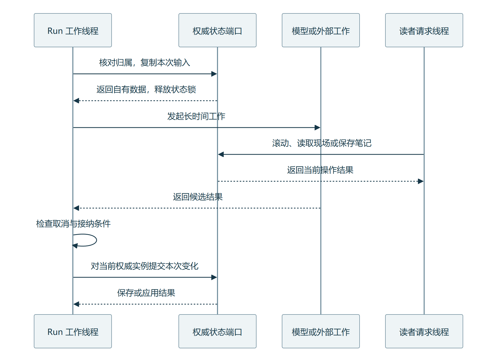

Tutor 的 assess 分支也体现同样的组织：先由 tutor_assessment_input 取得包，锁外执行 evaluate，检查取消，再由 tutor_assessment_accept 接纳。长等待前后是两次状态访问，期间其他操作可以进入。

制作预览则更贴近本章开头的场景。[AuthorSession::author](../../../crates/server/src/presentation_author.rs) 先回读当前 Run 的候选：

```rust
let candidate = self.with_private(|state| {
    state.read_presentation_candidate(&self.turn_ref.session_id, &candidate_id)
})?;
```

候选作为自有值离开私人访问闭包，随后才组装 PreviewRequest、调用浏览器或沙箱。预览返回后检查取消，再更新本轮预览记录。render_plot 和 render_animation 的长执行同样不包在这个私人状态闭包中；write、patch、deliver 涉及保存时才进入相应权威入口。

本轮实际执行的受控 Provider 用例，在模型尚未放行时完成了 /reader/goto、/reader/note、/reader/state 和历史读取；运行结束后手工笔记、当前位置仍然保留。它证明模型等待没有垄断这些入口，也证明收尾没有用旧 Reader 或 Memory 副本覆盖并发修改。

<a id="ch18-s9"></a>

### 18.3 权威写入口和取消传播

<a id="ch18-s10"></a>

#### 操作原书笔记与操作当前 Reader，有不同条件

锁能避免两个线程同时修改同一对象，却不能单独回答“这个对象是不是旧任务应当修改的对象”。因此 [RunScope](../../../crates/server/src/run_scope.rs) 把归属和现场分别检查。

check_owner 调用 check_user，核对当前 UserRuntime 的用户 ID，并确认原聊天中仍存在属于原书的 turn。private_context 再通过 private_user 形成原 Book、原目录和原聊天消息的操作上下文。它负责选择原归属；调用端口负责先做必要检查。

check_scene 则核对现场的 ID、代次、发布和选中聊天：

```rust
if w.id != self.workspace_id
    || w.generation != self.workspace_generation
    || w.publication.as_ref().map(|p| &p.reference) != self.publication.as_ref().map(|p| &p.reference)
    || w.selected_chat.as_deref() != Some(self.chat_session_id.as_str())
{
    return Err(ToolError {
        error_code: "WORKSPACE_STALE".into(),
        category: "conflict".into(),
        message: "The Run's reading workspace has changed".into(),
    });
}
```

check_workspace 先检查 owner，再检查 scene。普通滚动改变 Reader 的位置或 revision，并不等于更换 workspace generation；选择另一聊天或重新绑定发布会使现场换代。先切走再切回，旧代次仍不会复活。

因此，submit_private 只需进入当前用户存储并核对原归属；read_live_reader 和 apply_reader 则还要求原现场有效。应用 Reader 动作后，RuntimeStatePort 比较 Reader revision，确有变化才向活动流发布 reader.changed。

笔记和高亮还有一个容易忽略的分工。[Runtime 工具分派](../../../crates/runtime/src/orchestrator.rs) 先通过 submit_private 保存原书记录，再尝试把当前 Reader 的批注选择移到那里。现场已失效时，私人记录可以保存，界面动作返回 not_applied。把二者当成一个“全部成功或全部回滚”的操作，反而会误读实际结果。

本轮运行了第 3 章提到的旧 Run 用例：模型等待期间从内部替换现场，然后返回现场读取、导航、笔记和高亮调用。新 Reader 没有被旧任务移动；原书笔记、高亮和原聊天回答仍被保留。另一个用例先切换聊天再切回，确认原 ReaderInputSnapshot 不变，实时访问仍返回 WORKSPACE_STALE；换掉用户后，私人闭包也被拒绝。

<a id="ch18-s11"></a>

#### 取消首先是一条共享信号

读者点击取消时，[cancel_run](../../../crates/server/src/agent_run.rs) 找到原活动 Run，调用 cancellation.cancel，并让流进入 cancelling。CancellationToken 内部的 requested 是 Arc&lt;AtomicBool&gt;；它的克隆共享同一标志，还可以观察 host_stop。cancel 采用 Release 写入，检查采用 Acquire 读取。

这一步没有强制终止线程，也没有清空 slot。实际工作需要在自己的边界检查信号。execute_model 把同一个令牌安装到 RunContext，并通过 adapter.set_run_cancellation 传给底层适配器，然后用 ObservedAdapter 与 CancellableAdapter 包住调用。

[CancellableAdapter::chat](../../../crates/runtime/src/run_context.rs) 的实际代码展示了前后两个检查点：

```rust
fn chat(
    &self,
    request: &crate::AgentRequestPlan,
) -> Result<crate::AssistantTurn, crate::AdapterError> {
    self.check()?;
    let result = self.inner.chat(request);
    self.check()?;
    result
}
```

前一个检查防止取消后再启动请求；后一个检查防止等待期间发生取消，而迟到结果又继续触发工具。complete、结构化 completion 和 observed 入口沿用同样的约束，因此内层综合、画像判断、压缩及来源修复也使用这条取消连接。

Resident 循环还在采样返回、每个工具分派前等位置检查 context.cancellation。已经完成的笔记不被撤销，未执行的工具不再进入分派；对于已经写入消息、尚无工具回执的调用，close_cancelled_tool_calls 补上取消回执，以便后续会话保留平衡的调用协议。

本轮取消用例先保存一条 Agent 笔记，再让第二次模型响应停住。取消后释放响应，其中故意包含高亮调用：笔记仍在，高亮没有执行，也没有第三次采样。活动摘要记录了真实完成的笔记和取消的模型调用。这个顺序比单独检查一个 cancelled 布尔值更能说明取消的业务含义。

<a id="ch18-s12"></a>

#### 信号必须继续到达网络和子进程

只在模型外面加一层检查还不够。[NativeAdapter](../../../crates/runtime/src/lib.rs) 保存运行令牌，在每次 HTTP 发送尝试前检查；ReActAdapter 把令牌转发给内部 NativeAdapter。收到 SSE 后，[read_sse](../../../crates/runtime/src/provider_stream.rs) 在读一行之前和之后检查：

```rust
cancellation.check().map_err(|e| error(e.message))?;
let mut line = String::new();
let count = reader.read_line(&mut line).map_err(error)?;
cancellation.check().map_err(|e| error(e.message))?;
```

这能在流继续到达时尽快停止处理，也能阻止已取消请求因为连接错误再次发送。本轮 Runtime 用例在本机接到请求后取消令牌并断开连接，分别检查 Native 与 ReAct 都没有发起第二次连接。

同步 read_line 本身仍可能等待网络。上面两次检查不会从另一线程强制打断正在进行的阻塞读；非 SSE JSON 入口也要先完成响应读取再检查。本地 Resident HTTP 入口使用 [RESIDENT_PROVIDER_TIMEOUT](../../../crates/server/src/host_lifecycle.rs) 的 300 秒请求时限，但该数值属于一次请求，并不是取消按钮的响应承诺。Provider 内部真正用了多少推理时间，也不能只从宿主等待时长得出。

预览和 Python 工作使用不同的执行边界：

| 正在等待的工作 | 取消信号到达的位置 | 停止与资源回收 |
| --- | --- | --- |
| 本地 BrowserPreview | 启动等待、CDP 调用循环；建立连接后读取超时为 100 毫秒 | BrowserProcess 停止自己创建的进程树或进程组，并清理临时 profile |
| 本地 Matplotlib | 子进程等待循环，每轮检查令牌和 20 秒时限 | kill 并 wait 当前 Python 子进程；轮询间隔 50 毫秒 |
| 本地 Manim | 子进程等待循环及输出处理前 | 终止本次进程树或进程组并回收；轮询间隔 50 毫秒，执行时限 180 秒 |
| 网络 presentation Job | 等待资源许可时检查，执行时检查令牌、输出和期限 | Sandbox 停止本任务 systemd unit，再回收进程与输出读取线程 |

表中实现分别见 [预览](../../../crates/server/src/presentation_preview.rs)、[绘图](../../../crates/server/src/presentation_plot.rs)、[动画](../../../crates/server/src/presentation_animation.rs) 和 [沙箱](../../../crates/server/src/presentation_sandbox.rs)。这些间隔是代码中的检查节奏，不等于端到端取消延迟。网络 Execution::run 在等待许可时每 50 毫秒检查，执行监测循环每 25 毫秒检查；停止 unit 还要等待操作系统处理。

沙箱 worker 内部使用自己的默认令牌，父进程取消并不通过共享 Rust 内存跨进程传进去。真正跨过进程边界的是父侧 stop(unit)，其作用域包含 worker 的后代进程。这也是为什么解释取消时必须追到实际干活的组件。

<a id="ch18-s13"></a>

#### 切换上下文要等旧运行退出

读者选择另一本书时，本地 Host 的处理比普通滚动更严格。新聊天、选择聊天、打开书籍等入口，以及删除当前活动聊天，会经过 with_boundary。

with_boundary 先将 boundary 置为 true，禁止接纳新 Run；向旧 Run 请求取消，然后等待 active 清空。等待使用 Condvar，其间释放 slot 的互斥锁，也没有占用 AppState。旧运行退出后，才执行真正的上下文切换；BoundaryGuard 在操作结束后清除边界标志。

因此，切换请求可能仍在等待，但其他线程还能读取原现场。前面的内部替换用例验证的是作用域合同，不代表本地公开切书入口允许旧 Run 与新现场无限并行。

stop_and_wait 先设置 stopping，再复用上述边界。RunningServer::shutdown 等 Resident 执行和保存路径退出后，设置 Host 停止信号，停止后台调度、等待持有的工作线程，关闭观测写入并强制冲刷已读记录。本轮 shutdown 用例确认宿主返回前，原回合已经保存为 Cancelled。

这是一种协作式收尾：保存路径即使报错也需要完成退出并公开错误；正在进行的同步提交不会因取消信号被截断成“仿佛没有写过”。

<a id="ch18-s14"></a>

### 18.4 运行活动、传输与后台工作

<a id="ch18-s15"></a>

#### 活动记录说明运行在等什么

读者等了五秒，可能是模型还没有返回，也可能是浏览器正在执行一个操作，还可能已经生成结果、只差保存。只显示一个旋转图标，无法区分这些状态。

[RunEvents](../../../crates/runtime/src/run_events.rs) 从实际执行生成活动。RunActivity 保存 step_id、parent_step_id、kind、name、status、started_ms、duration_ms，以及可取得的 usage 和首文本时间。开始时建立活动，结束时根据同一运行时钟计算持续时间，再把更新发布给观察者。

ObservedAdapter 为模型调用建立活动；工具分派为实际工具建立活动。工具内部的模型综合、查询等调用，通过 EventScope 归到工具步骤下面。例如 book.synthesize 是父步骤，synthesize 模型请求是子步骤。父工具持续三秒，其中模型用了两秒，不能相加后说该工具用了五秒。

工具请求在执行前被拒绝，也有单独语义。当前代码可以记录 Rejected 活动，但 started_ms 和 duration_ms 为空，不发布 tool.started。本轮受控用例故意提交未观察过的 source.present 引文，确认它没有被记成已经执行的来源操作。

RunEventFanout 将同一活动送给 RunStream 和观测端口；回答 patch 则进入流式回答路径。这样，活动描述“正在做哪一步”，草稿描述“已有哪部分可显示文字”，终态描述“这轮怎样结束及是否保存”。第 12 章讨论的三个层次在宿主中仍然分开。

<a id="ch18-s16"></a>

#### 慢观察者不会占住执行所需的状态锁

[RunStream](../../../crates/server/src/agent_stream.rs) 有自己的 Buffer 锁，内部保留运行快照和事件队列。update 在一次加锁中更新快照、递增 seq、把事件放入队列，并按序列化字节数淘汰旧事件。当前默认 EVENT_BYTES 为 256 KiB。

订阅方通过 read_after 获取一批自有事件；游标覆盖不到现有队列时，取得同一序号边界的快照。函数返回时 Buffer 锁已经释放，后面的事件编码、socket 写入和 flush 不持有这个锁，也不持有 AppState。

serve_checked 为观察连接建立独立线程，普通 HTTP 线程把请求交给它后继续接单。慢连接因此主要占用自己的传输线程；执行端继续更新内存观察状态。没有事件时，观察线程等待 Condvar，超时后发送 keepalive；等待本身也会释放 Buffer 锁。

本轮 SSE 用例在模型尚未返回时建立五个观察连接，然后成功读取 /reader/state。它还断开部分连接，以 Last-Event-ID 重连，确认收到后续事件，Provider 没有因此多出一次请求。这个结果验证的是接入、观察与执行的分离，不是吞吐量或无限连接能力。

执行端仍承担活动更新、快照维护和事件序列化成本。因此，分析慢请求时还要区分：网络写阻塞有没有反传到执行，与每次生成事件本身花了多少本地时间，是两个问题。

<a id="ch18-s17"></a>

#### 阅读活动为什么放到静默期合并保存

回到读者正在滚动的场景。如果一次窗口变化涉及二十个可见叶子，为每个叶子立即重写整份记忆文件，即使完全没有模型调用，正文也可能迟迟加载不出来。

[ADR-0106](../../adr/0106-asynchronous-coalesced-read-ledger-persistence.md) 记录了这类历史请求瀑布：二十叶边缘加载的主要等待发生在正文请求之前，原因是导航逐个同步提交已读事实。当前机制改变的是确认时机和提交次数，已读事实本身继续保留。

Reader 在导航时调用 [MemoryStore::enqueue_read](../../../crates/memory/src/lib.rs)，按 (book_id, lid) 合并触达次数并保留最近时间。这一步不执行磁盘提交。Host 的独立 worker 默认每 25 毫秒检查一次，待最近触达静默 250 毫秒后，进入原 Store 冲刷。

下面是 [flush_read_ledger_if_ready](../../../crates/server/src/host.rs) 取得 AppState 后的核心部分：

```rust
guard.user.check_owner(owner)?;
if !guard.user.store.pending_reads_ready(idle_for) {
    return Ok(0);
}
guard.user.store.flush_pending_reads()
```

worker 启动时固定 owner，每次冲刷核对用户身份；它没有另外打开一份 Store 去覆盖同一路径。flush_pending_reads 基于当前权威文档构造 candidate，把一批触达合并进去，提交成功才清空集合；失败保留原批次，并重设下一次静默等待的起点。

本轮实际用例依次登记 A 书的 1.1、1.2、1.1，冲刷前队列有两个位置，文件还未创建；冲刷后文档 revision 只增加一次，1.1 的触达次数为二，重开也能读到。另一用例制造临时文件路径故障，确认失败后批次仍在，解除故障后同一批可以成功保存。Reader 接线用例则确认记录的是实际可见真叶，容器位置不会直接被当成已读叶子。

本地切书会主动尝试冲刷；失败时保留批次，Host 继续重试。RunningServer 有序退出也强制尝试一次，不等待静默期。导航成功与这批已读记录已经耐久保存，由此具有不同的确认语义。

这一节描述本地 Host 的后台接线。网络 NetworkRunPort::apply_reader 当前还会在现场提交前调用 flush_pending_reads，不能把“导航都延迟 250 毫秒落盘”扩展成所有宿主的统一保证。

<a id="ch18-s18"></a>

#### 后台画像复核也要先取输入，再回到权威状态

阅读会话产生了新的画像候选，ReviewCoordinator 可以在后台复核。它与 Resident Run 共享用户存储，却不应把画像模型等待变成阅读锁等待。

当前 [ReviewCoordinator::run_one_at](../../../crates/server/src/host.rs) 先取得独立的 serial_gate，再在 AppState 中领取 job、复制 ReviewInput；离开状态锁后创建 executor 并执行；返回后重新核对 owner，把候选和实际 eligible_turn_ids 提交给当前 Store，失败则记录可重试状态。

serial_gate 横跨模型调用，但它只用于串行化复核执行，不是 AppState 锁。因而另一个复核 job 需要等待，读者的普通状态访问仍可进行。这个例子也说明，“模型调用期间持有一把锁”本身不足以判错：要看那把锁保护的资源，以及哪些操作需要它。

本轮受控 executor 用例停住第一次复核，期间完成 Reader 状态读取和前台已读写入，再改模型配置并启动第二次复核。结果确认最大并行复核数为一，两个 job 分别使用 model-a 和 model-b，前台写入没有被后续复核提交覆盖。

调度时机也有明确范围。scheduler_tick 在 Resident 活动时不开始这次调度；ReviewSchedule 支持启动恢复、累计八个未复核回合的阈值、到期重试，以及最近 Resident 活动后六十秒空闲触发。这里的六十秒是调度条件；本轮用假时钟检查边界，没有真的等待一分钟。已经开始的复核不会因为新 Resident 到来就自动取消，两者也不共用本地 RunCoordinator 的 slot。

切换上下文时，Host 还会请求 drain_boundary，默认最多等待复核十秒。超时后记录 REVIEW_DRAIN_TIMEOUT，并通过 stale 画像和 pending_context 暴露未处理部分，随后允许边界操作继续。等待超时并没有终止已经启动的复核线程；它完成后仍会回到原用户的权威状态提交。本轮用受控等待器模拟超时，确认过期状态可见、导航可用，放行 executor 后任务继续完成并清除相应错误。

<a id="ch18-s19"></a>

### 18.5 用关键路径和实际等待分析瓶颈

<a id="ch18-s20"></a>

#### 先问正在等待哪一项资源

现在可以重新理解“这次解释花了九秒”。九秒是哪个起点到哪个终点？期间是模型推理、Provider 排队、网络读取、等待资源许可、浏览器执行，还是最后保存？没有这个区分，换异步框架、增加线程或缩短提示词都可能改错地方。

当前可取得的量与还需要补充测量的量如下：

| 量 | 起止边界或含义 | 可以怎样使用 |
| --- | --- | --- |
| 模型活动 duration_ms | ObservedAdapter 包围的一次调用 | 定位外部调用的墙钟时间；不能直接当作模型设备计算时间 |
| model_first_text_ms | 本次模型活动开始到首个非空正文片段 | 观察首文本等待；与首个可公开 answer patch 分开 |
| 工具活动 duration_ms | 工具开始到工具结束 | 看工具总体占时；存在子活动时避免重复相加 |
| 状态锁等待 | 申请锁到取得锁 | 判断争用，现有活动时长没有单列此指标 |
| 状态锁占用 | 取得锁到释放锁 | 判断哪次状态操作阻塞其他请求，需要对具体入口计时 |
| 磁盘提交时间 | 序列化、写入、同步及相关投影的选定边界 | 明确是否包含在持锁区间内，不能再次计入整轮总和 |
| 下行传输时间 | SSE/最终响应写出到客户端收到、安装 | 需要两端时刻；服务端模型活动不包含完整浏览器呈现延迟 |

“模型活动”还可能包含宿主侧资源等待。网络 [LimitedAdapter::call](../../../crates/server/src/service_limits.rs) 在真正调用 inner 之前先 acquire_model，并用 resource_wait 发布 waiting_model/running。它位于 execute_model 的观察包装之内，所以活动持续时间可以包含等待许可的时间。公平调度将在下一章展开；本章先记住，不能仅凭活动名称就把全部时长归给 Provider。

同理，一个服务端步骤耗时较长，不代表其他线程在同一期间都被阻塞。应沿关键路径分析任务总时长，再沿锁占用区间分析读者操作的排队，两者回答不同问题。

<a id="ch18-s21"></a>

#### 一个九秒运行，为什么不应锁住读者九秒

下面是依据本章调用结构构造的**教学算例**。假设一轮制作串行经过两次模型调用、一次预览、若干本地处理与保存；模型等待中已经包含相应上游网络时间，预览中的子进程细节合并为一项。表内阶段互不重叠，最后只计入尚未重叠的终态下行尾部。

| 串行阶段 | 墙钟时间，毫秒 | 其中占用共享状态锁，毫秒 | 其中共享状态内的磁盘提交，毫秒 |
| --- | ---: | ---: | ---: |
| 准备与问题接纳 | 12 | 12 | 8 |
| 第一次模型请求 | 2,000 | 0 | 0 |
| 浏览器预览 | 3,000 | 0 | 0 |
| 第二次模型请求 | 4,000 | 0 | 0 |
| 其余本地计算与状态访问 | 30 | 10 | 0 |
| 运行中进展提交合计 | 38 | 38 | 32 |
| 最终提交与收尾 | 20 | 20 | 15 |
| 终态下行尾部 | 15 | 0 | 0 |
| 合计 | 9,115 | 80 | 55 |

按这些假设，运行历时 9.115 秒，累计共享锁占用 0.080 秒，其中有 0.055 秒属于表内磁盘提交。55 毫秒是 80 毫秒的组成部分，80 毫秒又已经包含在 9.115 秒里，三列不能相加。

假设某个 Reader 请求本身需要三毫秒状态操作、五毫秒往返网络，在模型等待期间到达，而且有空闲 HTTP 线程、没有其他状态访问竞争，它可以约八毫秒完成。如果它遇到一次还剩四十毫秒的状态提交，则约需四十八毫秒。两个数字都来自教学假设，不能当作本项目实际响应分位数。

更一般地，可以把一次普通读者操作写成：

\[
T_{reader}=Q_{http}+W_{state}+S_{operation}+N_{return}
\]

Q 是等待请求处理资源，W 是等待共享状态，S 是实际操作，N 是返回传输。长模型调用不应直接进入 W；但如果 HTTP 工作线程全被其他长请求占用，它仍可能通过 Q 影响读者。因此，“模型不持 AppState 锁”解决了一项阻塞来源，没有消除所有排队。

再改变一个条件：两次模型请求均快一倍，总时长从 9.115 秒降到 6.115 秒，整体加速约 1.49 倍；三秒浏览器预览和其余部分仍在关键路径上。若实测最慢的是预览，就应进一步拆浏览器启动、页面执行和截图；若最慢的是 finalizing，就应查看会话提交及后续领域关联，而不是继续缩短模型输出。

<a id="ch18-s22"></a>

#### 通过等待顺序验证机制，通过计时验证性能

本轮没有为书稿调用真实模型，也没有测量锁延迟。我们选择的是能够区分机制的确定性观察：

| 受控顺序 | 若实现有误，会暴露什么 | 本轮结果 |
| --- | --- | --- |
| Provider 不放行，先做导航与手工笔记 | 整轮持锁，或结束时旧副本覆盖新操作 | 操作完成，位置与笔记保留 |
| 已保存笔记，下一模型请求暂停后取消，再返回工具 | 迟到工具继续执行，或取消抹去已发生动作 | 笔记保留，高亮和后续采样被阻止 |
| 请求切聊天，等待旧 Run 收尾期间读状态 | 边界等待持有 AppState，或切换过早 | 原现场可读，收尾后才切换 |
| 五个 SSE 观察连接仍未结束，再请求 Reader 状态 | 观察连接耗尽普通四线程接入 | Reader 请求完成；重连无新增采样 |
| 复核模型暂停，前台写入，再放行复核 | 复核长锁或旧文档覆盖当前 Store | 前台事实保留，复核串行提交 |
| 已读批次提交故障，再解除故障 | 失败时提前清空队列或重复计数 | 批次保留，原批次重试成功 |

这些用例回答“先后关系能否成立”。真实性能评测还需要记录每个边界的实际时间，并控制书籍、历史长度、机器、模型、网络、冷热缓存和并发请求。不能把测试套件运行了多少秒当成读者看到的端到端延迟，也不能把假时钟推进六十秒当成一次真实等待。

历史材料能提供另一种证据。[ADR-0106](../../adr/0106-asynchronous-coalesced-read-ledger-persistence.md) 基于当时 PHR9 的二十叶请求瀑布，将约 99% 的边缘加载等待定位到正文请求之前的同步已读提交。这是该次诊断记录，支持把高频提交移出导航路径的取舍；它不是当前工作区的重新测量，也不是所有阅读动作的通用比例。

因此，如果今天又出现卡顿，应该沿当前链路确认它停在请求排队、状态访问、Provider、制作工具还是提交。只有观察到相应区间成为关键部分，才有依据决定拆哪次锁内操作、合并哪次写入，或者调整哪项外部工作。现有实现已经把几个主要等待分开，使这种判断有了可追踪的入口。

<a id="ch18-s23"></a>

### 已知边界与本轮验证

本章于 2026-10-07 回读当前工作区，Git 基线为 4e0b68e。实现、ADR 历史记录和教学算例分别使用各自的证据；本轮只修改书稿。

1. **按操作访问没有固定时间上界。** 本地状态闭包内仍可能读取候选、构造消息差异、写入记忆或追加并同步 JSONL；后台冲刷也在原 AppState 锁内提交。它们不会随着模型等待一起占锁，但慢磁盘和较长历史仍可能阻塞读者。本章没有测量持锁分位数。

2. **取消是协作式停止。** 同步模型网络读取和正在进行的文件提交不会被原子标志即时抢断。300 秒是本地 Resident 单次 Provider 请求配置，不是取消延迟或整轮截止时间；浏览器及子进程轮询间隔也不是完成回收的承诺。本轮受控 Provider 在收到取消后才被测试放行，不能用这些通过结果证明静默网络会立即退出。

3. **导航与已读耐久性采用不同确认。** 本地 pending_reads 尚未提交时退出或崩溃，可能丢失这批触达；强制冲刷失败会记录错误，不能因此宣称保存成功。网络 Reader 提交有自己的冲刷接线，需按入口分析。

4. **后台复核超时只结束等待。** drain_boundary 超时后，已运行的复核仍可能继续；普通调度的 Resident 标志也不抢占已经开始的复核。本地 serial_gate 串行化的是复核 job，不构成多人模型公平调度器。

5. **有界事件队列不等于整个运行有界。** 256 KiB 限制事件队列的序列化体积，快照中的活动、effects、来源绑定和 Run 内上下文另有成本。本地 SSE 为连接创建线程；本轮验证了五个连接时普通请求可用，没有进行大量慢连接或整体容量验收。

6. **作用域合同与公开切换流程分开验证。** 旧 Run 在现场失效后仍保存原书私人结果的用例，从内部替换现场；本地公开切换入口当前先请求停止并等待退出。网络状态分层、准入恢复和配额的完整行为留给第 19 章。

7. **现场失败会使已保存记录缺少效果摘要。** 当前 ReaderNote/ReaderHighlight 分派先保存私人记录，随后 apply_reader 失败时返回带 reader_effect.status=not_applied 的工具回执，同时将 effect 返回为 None。已保存笔记或高亮因此没有进入本轮 effects，也不会沿这条路径成为会话的成果关联。前述旧现场用例同时断言了记录存在与 effects 为空，确认了这个缺口；不是所有已发生写入都能从效果摘要枚举出来。本轮未修改实现。

本轮直接执行当前产品的 25 个定向既有用例：Server 21 个、Runtime 1 个、Memory 2 个、Reader 1 个，全部通过，无失败、无忽略。Server 中的 Run 用例启动了本机 HTTP Host 和受控假 Provider，使用固定响应与实际临时存储；复核使用受控 executor 和假时钟。Runtime 用例通过本机 TCP 连接分别验证 Native/ReAct 取消后的重试边界。

没有调用真实模型，没有启动真实浏览器、Matplotlib、Manim 或 Linux 网络沙箱，也没有运行整套产品测试。制作子进程取消、网络 LimitedAdapter 与 NetworkRunPort 的连接按源码核对；前端呈现与真实取消延迟没有在本轮验收。具体过滤项、日志和引用检查见[本章来源与验证记录](../SOURCES.md#%E7%AC%AC-18-%E7%AB%A0%E7%BB%AD%E5%86%99%E9%AA%8C%E8%AF%81%E8%AE%B0%E5%BD%95)。

<a id="ch18-s24"></a>

### 面试时怎样解释本章

1. **模型调用这么慢，为什么读者还可以操作？**

   一次 Run 持有原问题、原材料和运行内上下文，模型在共享状态访问之外执行。需要读取或写入用户数据时，通过端口短暂访问当前权威实例。HTTP 接入、Run 和 SSE 观察有独立生命周期，所以模型等待不直接变成 Reader 的状态锁等待。

2. **为什么不复制 Reader 和 Memory，运行结束后统一写回？**

   等待期间用户还会滚动、写笔记，旧副本整体写回会覆盖这些变化。项目只复制运行输入和可独立处理的数据；真正的领域变化回到当前 Store 和 Reader，以本次操作提交。最终消息按原 session/turn 保存，现场仍有效时才更新对应现场消息。

3. **快照已经保存了用户和书籍，为什么还需要 generation？**

   快照说明任务开始时指向哪里，generation 说明现场期间有没有重绑。切走再切回也不能恢复旧任务对实时 Reader 的资格。私人笔记只要原用户、书籍、聊天和 turn 仍有效，仍有明确归属；导航还要满足现场检查。

4. **点击取消后，能立即开始下一次运行吗？**

   本地协调器先共享取消信号，运行在模型、工具和子进程边界处理它。活动位置保留到执行、保存路径和退出回调结束。已保存动作保留，迟到工具不再执行；需要平衡的未执行工具调用得到取消回执。取消请求返回与 Run 完全退出不是同一时刻。

5. **用了 Rust 和 Mutex，是否已经解决并发问题？**

   Rust 帮助约束借用，Mutex 串行化共享访问，但任务归属、锁范围、磁盘提交和取消仍要显式设计。项目用 RunScope 固定归属，用端口控制操作范围，用 RunCoordinator 管生命周期，再把取消接到实际传输和进程。锁内操作究竟多慢，仍需测量。

6. **SSE 怎样避免慢客户端拖住 Agent？**

   执行端更新有界事件队列和快照，观察线程取出自有事件后再写网络。socket 写入不持 AppState 或事件 Buffer 锁，游标失效时用原子快照边界恢复。断线只丢观察，重连不重发问题；连接线程和完整快照的容量则是另一项资源问题。

7. **同样是保存，为什么已读记录可以延后，回答终态却要先保存？**

   它们的确认语义不同。导航优先推进现场，把高频已读触达合并后提交；回答终态需要在重开历史中成立，所以正常终态来自持久写入后的视图。优化提交时机首先要判断用户操作承诺了什么，不能把所有写入统一改成后台任务。

8. **拿到一张慢运行轨迹，先看什么？**

   先确定端到端起止，按父子活动找关键路径，避免把内层模型时间再加到父工具上。再区分模型调用墙钟时间、资源等待、状态锁等待、锁占用、磁盘提交和下行传输。若读者卡而 Run 总时长正常，优先查请求资源和锁内操作；若读者操作流畅而制作很慢，再查模型和工具的串行依赖。

本章已经说明一次长运行怎样与读者操作共享宿主。加入第二个用户后，还要决定哪些私人状态必须独立、哪份公共材料可以共享、等待中的任务怎样接纳，以及谁先取得有限的模型和制作资源。接下来进入[第 19 章 多用户阅读与调度](#ch19)，把这些并发边界放进完整的多人阅读服务。


---

<a id="ch19"></a>

## 第 19 章 多用户阅读与调度

第 18 章中，读者甲正在等待学习率演示的修订。他在电脑上提交问题，又在手机上打开同一本书，查看另一个小节。与此同时，读者乙也在服务器上阅读这份材料，并请 Agent 保存一条自己的笔记。

现在，“模型等待时还能滚动”只是起点。我们还要回答：甲的两个窗口是否共享当前位置？乙能否通过甲的聊天 ID 读到回答？甲连续提交三个任务后，乙要等多久？服务器在返回“已接纳”之后重启，又该继续哪些任务？

这些问题围绕同一个中心展开：**共享材料和模型资源时，怎样保持私人数据与阅读现场独立？** 本章沿一次多人请求，从身份进入私人权威状态，再进入窗口、持久接单和两层调度。第 3 章建立的归属概念、第 16 章的日志合同，以及上一章的锁外执行，在这里组成一个实际服务。

<a id="ch19-s1"></a>

### 19.1 服务、用户、现场与 Run 的分层

<a id="ch19-s2"></a>

#### 第二个窗口不该生成第二份私人真相

先看一个直接后果。若手机和电脑各自从甲的目录加载一份 Memory，模型结束后分别整体写回，后提交的一份可能覆盖另一窗口刚刚保存的笔记。给两个副本各加一把锁没有帮助：它们锁住的是不同对象。

当前 [UserRegistry](../../../crates/server/src/user_registry.rs) 以 user_id 为键保存 UserHandle，后者是 Arc<Mutex&lt;UserRuntime&gt;>。get 先核对账号的存储路径，未加载时才构造 UserRuntime，随后返回同一句柄的克隆。因此，甲的两个请求共享一个私人权威实例；乙取得另一个实例。模型只持有句柄，需要具体操作时才借用它，不会得到可在结束时整体覆盖回去的私人副本。

[UserRuntime](../../../crates/server/src/user_runtime.rs) 持有 MemoryStore、AgentHistory、SessionStore、画像上下文缓存及私人产物根；LearningStore 由同一用户的 MemoryStore 解析。其持久路径来自 [UserStoragePaths::for_service](../../../crates/server/src/user_storage_paths.rs)：甲的记忆、学习数据库和聊天日志位于甲的用户目录，乙有自己的目录。路径由可信宿主根据身份构造，不由模型或浏览器选择。

现场采用另一层注册表。[WorkspaceRegistry](../../../crates/server/src/workspace_registry.rs) 以 `(owner, workspace_id)` 为键管理 ResidentWorkspace。里面的 ReaderWorkspace 持有材料绑定、Reader、选中聊天、消息投影和 generation；外层另有已提交 revision、主页面 attachment、演示附属视图和现场检查点。

于是，开头的场景可以这样分解：

| 层次 | 本例中的对象 | 共享与独立的具体含义 |
| --- | --- | --- |
| 服务 | 发布书库、身份与授权、准入、资源限制 | 甲乙共享材料加载和有限的模型、制作资源 |
| 用户 | 甲的 UserRuntime、乙的 UserRuntime | 同一用户共享笔记、聊天、学习与画像；两个用户分别拥有 |
| 现场 | 甲的电脑窗口、甲的手机窗口、乙的窗口 | 分别保存 Reader、材料绑定、选中聊天与演示现场 |
| Run | 电脑窗口接纳的那次演示修订 | 固定甲、原聊天、原发布和提问输入；按需访问当前私人状态 |

“服务层”在这里是职责层次，不能机械等同于名为 ServiceState 的一个结构体。当前网络 Host 将 AuthService、UserRegistry、PublishedLibrary、WorkspaceRegistry、RunAdmissions 和 Resources 组合在 [Authorization](../../../crates/server/src/authorization.rs) 中；本地 AppState 的 ServiceState 仍主要保存宿主能力和适配器配置。

一次网络请求也不需要先借到全局“当前书”。[multi_user_host::dispatch](../../../crates/server/src/multi_user_host.rs) 取得 AuthorizedContext 后，根据 URL 中的 workspace_id 和可信 owner 找到现场。甲在手机上切书，只改变手机现场；乙的切书也不替换甲正在使用的 Book。

<a id="ch19-s3"></a>

#### 四种“会话”必须分开

登录会话证明这条连接代表谁；聊天会话保存持续对话；TutorSession 属于这个人的教学过程；ReaderWorkspace 保存一个阅读窗口的现场。它们有不同生命周期。

例如，甲的两个窗口可以选择同一个聊天。两个 Reader 仍各自独立，但该聊天的写入顺序只有一条，后文的准入会阻止同时出现两个待执行回答。另一方面，甲从手机关闭 Tutor，改变的是甲的用户级控制；电脑中的旧 Run 不能把这个改变当作与自己无关的局部窗口偏好。

本轮执行的 [多窗口与 Tutor 用例](../../../crates/server/src/tests/mu5_tests.rs) 分别验证了这两层关系：一个窗口导航后，另一个窗口和乙的 Reader 不变；重复取得甲的 UserHandle 指向同一对象。Tutor 用例从另一现场关闭控制后，旧端口不能继续教学；重新开启也不使旧控制绑定复活，乙的控制 revision 仍保持独立。

<a id="ch19-s4"></a>

#### 原现场还在，也不代表旧动作可以覆盖新操作

上一章的 RunScope 检查原 owner、chat、turn，以及 workspace generation。网络端口还增加一个更细的条件：effect_revision。

假设 Agent 已把甲的电脑 Reader 移到第 1.5 节，随后等待模型；甲亲手跳到第 1.20 节。材料和聊天都没有变，generation 仍相同。旧 Run 此时读取实时 Reader，可以看见第 1.20 节；但若它根据原计划再跳回第 1.1 节，就会覆盖刚刚发生的用户选择。

[NetworkRunPort::check_effect_revision](../../../crates/server/src/workspace_registry.rs) 明确阻止这一覆盖：

```rust
if scene.revision != self.effect_revision {
    return Err(error(
        "READER_USER_ACTION_SUPERSEDED",
        "conflict",
        "A newer user action takes priority over this Run effect",
    ));
}
```

运行准备时冻结 effect_revision；本 Run 成功提交自己的 Reader 动作后，才把它推进到新 revision。read_live_reader 不要求这个值相等，所以“看见最新现场”和“有资格修改现场”可以分开。本轮上述导航顺序已实际通过用例，迟到动作返回 READER_USER_ACTION_SUPERSEDED，读者的新位置保留。

这项规则表达的是用户操作优先。它不会撤销原书的私人笔记，也不更换原聊天的回答归属。私人写入、实时读取、Reader 动作和最终回答各有接纳条件，不能用一个全局 busy 或一把大锁替代。

<a id="ch19-s5"></a>

### 19.2 身份、对象授权与材料发布

<a id="ch19-s6"></a>

#### 先确定是谁，再解释他请求的对象

甲乙都可能提交 `session_id`、`turn_id` 或 `workspace_id`。这些字段负责指认对象，不负责证明所有权。如果宿主把客户端传来的 user_id 当成可信归属，后面的目录隔离便失去了依据。

当前 [auth::Principal](../../../crates/server/src/auth.rs) 的字段是私有的，只能由认证模块构造。多人 start 入口要求后端绑定 loopback，并要求配置 HTTPS origin；实际 HTTPS 由前置代理承担。账号由管理员提供，登录入口校验密码并建立可撤销的服务器端会话。Cookie 带 Secure、HttpOnly、SameSite=Lax，默认有效期为十二小时；这是当前代码的设置，部署如何组合留给下一章。

进入普通业务时，dispatch 的关键顺序是：

```rust
let token = token.ok_or_else(auth::unauthenticated)?;
let principal = access.auth.authenticate(token, now)?;
if !matches!(method, "GET" | "HEAD")
    && headers.get("X-CSRF-Token") != Some(auth::csrf(token).as_str())
{
    return Err(crate::user_storage_paths::error(
        "CSRF_REJECTED",
        "permission",
        "CSRF token is required",
    ));
}
```

在这段代码之前已经检查 Host 和 Origin，之后还会拒绝查询或正文中的 user_id、owner_user_id、dir、book_dir、service_root 等字段，再通过 capability 表选择业务能力。普通阅读请求因此不能通过换一个路径参数进入另一个用户根，也不能借旧接口名字打开服务器目录或修改 Provider。

认证之后仍要检查具体对象。[AuthorizedContext::history](../../../crates/server/src/authorization.rs) 只从当前 UserRuntime 的聊天中寻找 ID；Workspace 查询把 owner_user_id 和 workspace_id 一起放入条件；Run 查询也使用 owner 和 turn 的组合。私人演示还要回到原聊天、原 turn，再加载其发布材料。身份正确不意味着对象自动可读。

本轮通过当前 [MU8 用例](../../../crates/server/src/tests/mu8_tests.rs) 验证：甲保存的笔记不会出现在乙的 recall 中；甲自己的另一份材料也不能借原 mem_id 删除这条记录。画像和来源解析同样保留用户与发布绑定。这里验证的是当前业务入口对这些对象的归属处理。

<a id="ch19-s7"></a>

#### 观察连接不能永久沿用打开时的资格

SSE 会存活很久。若只在建立连接时授权，之后退出登录或撤销材料访问，已经打开的连接仍可能继续收到内容。

[AuthorizedObservation](../../../crates/server/src/authorization.rs) 保存确切 Principal、原发布引用、运行描述和观察许可。allows 每次检查服务是否停止、描述是否匹配、该登录会话是否仍有效，以及原材料是否仍授权。[serve_checked](../../../crates/server/src/agent_stream.rs) 在取事件前后调用它，再写出事件。

这里有两个不同结果。退出登录使该登录会话失效，观察者不再有资格继续接收；已接纳 Run 的 owner 却仍是原用户，任务不因此自动取消。禁用账号或撤销原发布权限，则会影响运行在领取、模型调用和状态操作边界的材料授权检查。显式取消仍走原 turn 的取消入口。

本轮通过的观察许可用例直接确认：乙拿不到甲的观察许可；甲用满自己的四个许可后再申请得到 OBSERVATION_CAPACITY，释放一个后可再次申请；退出甲的会话使已有许可失效，乙仍可读自己的聊天，原 queued 回合并未被取消。连接传输和许可失效是两个验证层次，具体未覆盖部分集中列在章末。

<a id="ch19-s8"></a>

#### 共享的是确切发布，不是“当前最新目录”

身份分开以后，甲乙仍需要共享同一本书。这里可共享的是纯材料，不是 Reader 或私人派生状态。

[PublishedBookRef](../../../crates/server/src/published_library.rs) 由 book_id 和 publication_id 组成。publish 把允许的依赖复制到暂存目录，沿用已有 readiness 检查，生成发布清单；文件移动到最终目录并封存之后，SQLite 事务才登记发布和默认指向。文件先存在、登记尚未成功的目录，不会因此成为读者可打开的半份发布。

同一 book_id 可以有不同能力完备程度的发布，但源码会直接比较原文、原 PDF 和 assets 附件内容，内容变化要求新 book_id。材料默认指向的更新影响后续按默认打开的选择，不会替换已固定 publication_id 的现场、Run 或历史来源。

这与第 17 章的演示 revision 有相似的理由：原问题必须能回到当时的内容。区别在于，publication_id 指向管理员登记的公共阅读材料；演示版本属于某位读者在原聊天中交付的私人产物。

书库访问也不是“加载过一次就永远允许”。load 的开头先做以下检查：

```rust
self.authorize(owner, reference)?; // also on a cache hit
let (directory, manifest) = self.record(reference)?;
if !directory.is_dir() {
    return Err(unavailable());
}
```

该摘录来自 [PublishedLibrary::load](../../../crates/server/src/published_library.rs)。Book 可以从共享缓存命中，授权仍按当前用户检查。图片、PDF 和正文都带确切发布路径进入能力表；HTTP 分支在处理 HEAD、Range 或条件头之前先核对材料资格。当前后端对 Range 可以返回完整的 200 表示，不把它写成后端已经实现分段读取。

本轮发布用例将默认指向改为第二次发布，并移走原现场。旧 Run 仍读取第一份 Book，回答也保留第一份引用；只有旧 Run 释放之后，一本书容量的缓存才能加载新发布。材料版本和资源寿命在这里发生了直接联系。

<a id="ch19-s9"></a>

### 19.3 SQLite 接单和运行准入

<a id="ch19-s10"></a>

#### 202 要承诺什么

甲点击发送后，网络可能在收到响应之前断开。如果“接受”只是把任务推入一个内存队列，服务随后重启，甲既找不到回答，也无法确定是否应重发。若简单重发又启动一次模型，已经发生的笔记或教学动作还可能重复。

当前 [RunAdmissions](../../../crates/server/src/run_admission.rs) 把这个问题分成持久接单和业务日志两部分。[control_schema.sql](../../../crates/server/src/control_schema.sql) 中，run_admissions 保存 owner、client_request_id、turn、chat、workspace、原 generation、发布、调度状态及取消、未保存等标志。主键是 `(owner_user_id, client_request_id)`，同一用户的 turn 也唯一。

问题正文、规范化请求、提问快照、Goal、教学准备和模型绑定放在私人 FrozenTurn 中；当前持久聊天通过 JSONL 保存，冻结历史使用 HistoryPosition 指向已经提交的位置。执行时由 frozen_input 读取该位置的原始消息，再交给既有 Runtime 处理上下文，而不是拿“此刻最新聊天”重新组装。

这两处存储各有真相：SQLite 回答“是否接单、能否领取、占着谁的位置”，私人日志回答“原问题是什么、输入是什么、最终交付了什么”。SQLite 没有再保存一份替代聊天日志的答案。

<a id="ch19-s11"></a>

#### 从 preparing 到 queued，需要跨过哪些提交

admit 首先检查请求键、Provider、现场 stamp、所选聊天、可选的 expected_chat_head 和用户输入。它还要确认同一聊天没有 pending 回合。随后，在准入状态锁和 SQLite 事务内判断是否正在删除、是否已有同聊天或同现场的未结任务，以及总容量和用户容量是否足够。

准入事务通过后，把已经分配的稳定 turn_id 连同 preparing 记录提交。后面的提交顺序如下：

| 阶段 | 写下的事实 | 这时能否向新请求返回已接纳 |
| --- | --- | --- |
| preparing | 请求键、原归属、turn 和容量占位 | 不能，私人输入可能尚不存在 |
| Pending Turn 已持久化 | 用户问题、FrozenTurn、冻结历史位置 | 不能，必要教学准备可能未完成 |
| preparation_complete | 原教学事件已按身份复用或写入，TurnPrepared 已提交并完成关联 | 尚需把接单转为 queued |
| queued | 准备完成且可进入调度 | 可以返回 202 和同一 turn_id |

其中 complete_preparation 对教学事件的处理是：

```rust
let mut learning = user.learning_store()?;
for event in &frozen.teaching.events {
    learning.append_teaching(event)?;
    self.point("teaching_receipt")?;
}
```

这段 [真实代码](../../../crates/server/src/run_admission.rs) 中的 point 是测试故障注入点；生产环境不在这里主动中断。关键在于 event 已经来自原 frozen.teaching。恢复时逐个复用原事件，不根据新的学习状态重新生成回答次数或教学绑定。

本轮教学准备用例在第一份回执后注入失败，再加入一条更晚的学习动作并关闭 Tutor。重开后，原回答 attempt 仍为 1，原控制绑定保持不变，TurnPrepared 只出现一次。这说明“把准备补完”与“按最新状态重新准备一次”有不同语义。

实际过程没有跨 SQLite、聊天 JSONL 和 learning.db 的共同事务。它依靠稳定 ID、明确阶段和恢复对账，把中途失败变成可辨认的状态。只有所有必要准备都到达 queued，新接单才能得到 202。

<a id="ch19-s12"></a>

#### 请求幂等比较的不只是文字

设甲用请求键 `ask-7` 提交问题。再次发送同用户、同键、同规范化内容，会返回原 turn；换一个 key，即使文字相同，也是一项新请求，需要重新经过聊天和现场占位。

[normalize](../../../crates/server/src/run_admission.rs) 保留 workspace、message、显示文字、session、generation、expected_revision、attachment、确切发布、聊天头、引文、演示追问、教学和 Goal 等字段。因此，重试期间只把 expected_revision 换成最新值，也已经改变了原请求。恢复连接时，客户端应保留原接单内容，或通过 client_request_id 查询原 turn；“再发送相同的一句话”不是完整的重试合同。

repeat 在 preparing 时返回 ADMISSION_PREPARING；输入已经冻结后，逐字段比较规范化值，不同则返回 REQUEST_KEY_CONFLICT；已关闭的键返回 REQUEST_KEY_CLOSED。比较直接使用已保存字段，没有另造请求摘要。

本轮同键用例修改问题、锚点、Goal 动作、generation、教学引用和引文，均得到冲突；原请求重复提交只产生一个问题和一个 turn。执行完成后再发原请求，仍返回同一身份，不再调用模型。

<a id="ch19-s13"></a>

#### 领取是自动恢复的分界线

启动多人 Host 时，recover 先于监听和工作线程执行。它逐条读取未结接单，结合原用户日志恢复。UserRuntime 加载时暂不自行关闭已登记在准入表中的 pending 回合，把这部分判断留给接单协调器。

恢复规则可以沿故障位置理解：

| 停在什么位置 | 当前恢复动作 | 是否再次调用模型 |
| --- | --- | --- |
| 只有 preparing，没有原 turn | 标记 admission_failed 并关闭请求键 | 否 |
| 原输入完整，尚未领取 | 校验冻结归属，补原准备；满足条件后保持或进入 queued | 由后续 worker 领取后调用 |
| 原请求已经取消 | 保存取消结果并结清 | 否 |
| claimed，但私人历史仍 pending | 以 INTERRUPTED 收口 | 否 |
| 私人终态已经保存，接单尚未 settled | 补教学交付等关联，修复接单索引 | 否 |
| 临时敏感确认候选已丢失 | 结束为需要重新确认 | 否 |

最重要的分支只有几行：

```rust
if row.state == "claimed" {
    self.end_pending(&mut user, &row, "INTERRUPTED", false)?;
    return self.update(&row, "settled", false);
}
```

摘录来自 [RunAdmissions::recover](../../../crates/server/src/run_admission.rs)。claimed 表示已经越过可执行边界，无法只凭接单表断定工具有没有产生副作用。即使进程刚领取、还没调用模型就退出，也采用这条保守的中断规则。它防止自动重复执行，不等于已经实现任意工具的恰好一次语义。

本轮 JSONL 用例分别在 preparing、pending、prepared、queued、claimed 和 terminal 注入失败后重新打开存储：未领取且输入完整的回合恢复排队；claimed 不增加模型调用；终态已保存的回合仅修复索引。测试保留了原问题次数和请求键身份。这里是显式故障返回与重开，不是断电实验。

<a id="ch19-s14"></a>

#### 执行退出、保存失败和释放聊天不是一回事

领取前，run_one 还会重新检查原材料资格、冻结输入、教学恢复条件和 ProviderBinding。ProviderBinding 固定协议、endpoint、model 和模型运行配置，不保存凭据。当前配置若已不能提供相同绑定，回合结束为 PROVIDER_BINDING_UNAVAILABLE，不会悄悄换模型继续；对应用例本轮已通过。

真正执行复用上一章的 execute_model，通过 NetworkUserPort 和 NetworkRunPort 访问原用户和现场。完成后 save_finished 保存原结果及必要关联，成功才把接单设为 settled。

若保存失败，执行线程可以退出，但原接单仍占着聊天和现场，unsaved 标志与内存 Unsaved 记录保留原结果。retry_save 使用原 prepared 和 finished 再提交，不重新采样。若私人终态已经成功、只剩后续关联失败，则按已保存终态修复。

取消也有两条路：queued 的回合可以直接写取消终态而不调用模型；claimed 的回合先持久记录 cancel_requested，再向活动令牌传播，等执行与收尾退出。delete_chat 与接单共用占位边界，未处理完的 preparing、queued、claimed 或未保存结果会使删除返回 CHAT_BUSY。删除成功后，引用该聊天的现场清除选择并换代，原请求键关闭。

本轮验证了三个具体顺序：排队取消没有模型调用；活动 Run 已保存笔记后取消，笔记保留，执行未退出时聊天仍忙；终态写入失败后重试保存，原回答成为 completed，模型调用计数没有增加。

<a id="ch19-s15"></a>

### 19.4 用户公平调度与模型并发

<a id="ch19-s16"></a>

#### 接了多少任务、运行多少任务、调用多少模型

甲可以在不同现场为不同聊天排队，但不能靠多开窗口获得无限份额。当前 [ServiceLimits](../../../crates/server/src/service_limits.rs) 同时规定多个容量；配置来自服务根的 service-limits.json，缺省值如下。

| 资源 | 全服务默认值 | 每用户默认值 | 实际限制什么 |
| --- | ---: | ---: | --- |
| 未结准入 | 20 | 4 | preparing、queued、claimed 的总数，包含仍占位的未保存回合 |
| Run 执行份额 | 4 | 1 | 从领取前准备到执行、保存路径退出的 reserved 份额 |
| 模型许可 | 2 | 1 | 正在通过 LimitedAdapter 调用 Provider 的数量 |
| 预览、绘图、动画 | 各 1 | 各 1 | 三类分别计数的制作执行 |
| SSE 观察连接 | 40 | 4 | 已取得观察许可的连接 |
| 旧同步接口等待者 | 20 | 4 | 等待已接纳结果的 HTTP 调用者 |

queued_runs 这个字段名容易造成误读：实际 SQL 统计的是三个未结阶段，不只是排队列表长度。active_runs 也不是模型并发数。某个 Run 可以处于模型许可等待、工具执行或最终保存中，仍占执行份额；拿到模型许可才真正进入下一次 Provider 调用。

在默认配置下，即使某个用户有四个窗口和四个未结回合，也最多有一个 Run 取得执行份额。服务最多有四份这样的执行，最多两份模型请求同时进行。HTTP 普通接入仍用四个线程，但工作线程数取 active_runs；SSE 和旧同步等待另有线程及许可，因此普通读取不必跟随模型等待。

本轮同步入口用例让同一原 turn 的四个 `/agent/chat` 请求停在等待中，乙仍能读取聊天；第五个等待申请返回 202 和原 turn_id，转为异步观察。放行假 Provider 后，四个等待者得到同一答案，采样计数为一次。这个结果验证生命周期分离，不代表生产响应时间的分位数。

<a id="ch19-s17"></a>

#### 第一层公平：空闲执行份额在用户之间轮转

run_one 先从 SQLite 按 rowid 读取 queued 且未标记 unsaved 的记录。它跳过已经 reserved 的回合及已用满用户执行份额的 owner，再为每个合格用户保留最早的一项。

下一位用户的选择如下：

```rust
let next = users
    .keys()
    .find(|owner| state.last_owner.as_ref().is_none_or(|last| *owner > last))
    .or_else(|| users.keys().next())
    .cloned();
```

摘录来自 [RunAdmissions::run_one](../../../crates/server/src/run_admission.rs)。users 是 BTreeMap，选择从 last_owner 之后继续，没有后继则绕回。用户内部取最早记录，用户之间轮转；这与把所有窗口请求放进全局 FIFO 有不同结果。

确定 owner 后先登记 reserved，再退出准入状态锁，加载私人输入和发布。正式领取用带条件的 UPDATE，将仍为 queued、未取消、未标记 unsaved 的行改成 claimed，并记录 boot_id 和递增 attempt。若期间取消已生效，这次更新不会成功，也不会启动该 Run。

ActiveGuard 保证领取前返回错误或执行退出时释放 reserved；长模型调用不持准入状态锁。本轮用例让甲的第一个 Run 暂停，确认甲的第二个窗口不能再取一份；乙加入后，下一次轮转先服务乙，甲的第二项仍为 queued。

<a id="ch19-s18"></a>

#### 第二层公平：每次模型调用重新取得许可

只限制活动 Run 还不够。同一个 Run 可能采样多轮，也可能在工具内部做综合、压缩或结构化判断。若旁路直接调用 Provider，就会绕过模型并发限制。

run_one 把 Provider 适配器包在 LimitedAdapter 中，再交给共同执行核心。complete、complete_structured 和 chat 及其 observed 形式都进入同一个 call。取得许可的关键代码是：

```rust
let permit = self
    .resources
    .acquire_model(&self.owner, &self.cancellation);
if let Some(stream) = &self.stream {
    stream.resource_wait(false);
}
let _permit = permit?;
```

在这之前，流进入资源等待状态。取得 Permit 后重新检查取消和原材料授权，才调用内层 Provider；call 返回时 Permit 析构、减少计数并唤醒等待者。工具分派发生在模型调用返回之后，因此一次 Python 渲染不会继续占着已经结束的模型许可。

acquire_model 为请求登记 ticket，为每个尚有用户余量的 owner 选最早 ticket，再按 last_owner 轮转。全局模型数达到限制时，通过 Condvar 等待并释放资源状态锁。取消检查发现信号后移除该 ticket 并通知等待者；它不把一个已取消请求永远留在队首。

制作资源也按服务和用户计数，但算法不同。[presentation_sandbox::Execution::run](../../../crates/server/src/presentation_sandbox.rs) 每五十毫秒检查取消并尝试 try_acquire，取得许可后才进入沙箱。预览、绘图和动画分别有上限，这条轮询路径没有模型队列那样的用户轮转机制。不能从“都有限流”推导所有资源具有相同公平保证。

<a id="ch19-s19"></a>

#### 一个只分析次序的教学算例

下面使用明确的教学设定：只有一个 Run 执行份额和一个模型许可；甲的 A1、A2、A3 与乙的 B1 都在时刻零之前完成接纳，入队次序为 A1、A2、A3、B1；last_owner 为空。每项只调用一次模型，耗时四秒，忽略准备、存储、传输和本地计算。

| 策略 | 执行次序 | B1 开始与完成 | 四项开始前等待之和 |
| --- | --- | --- | ---: |
| 教学对照：全局 FIFO | A1、A2、A3、B1 | 第 12 秒开始，第 16 秒完成 | 0+4+8+12=24 秒 |
| 当前轮转规则在此设定下的次序 | A1、B1、A2、A3 | 第 4 秒开始，第 8 秒完成 | 0+4+8+12=24 秒 |

模型总工作仍是十六秒，平均开始前等待仍是六秒。改变的是等待由谁承担：乙不必排在甲的全部任务后面，甲的后续任务相应推迟。这个算例解释的是公平次序，没有制造额外吞吐量，也不是本轮性能测量。

再看默认的四个 Run 份额和两个模型许可。若四位用户各有一项已取得执行份额的任务，每项仅调用一次模型四秒，且同时竞争模型，则两批请求可在理想设定下用八秒完成。两份后取得许可的任务各等待四秒，累计资源等待八秒；这些等待在不同线程上重叠，不能再加到八秒墙钟时间上。

真实运行仍要像上一章那样拆时段。接单排队是在取得 Run 份额之前，模型许可等待发生在已活动 Run 内部，Provider 调用墙钟时间又包含模型服务和上游网络等待；锁等待、磁盘提交、制作执行与下行传输分别计量。LimitedAdapter 位于模型活动观察包装之内，因此模型活动时长可能包含许可等待，不能直接读成 GPU 计算时间。

<a id="ch19-s20"></a>

#### 用量记录与硬额度是不同合同

RunUsage 的 calls 逐次保存可选 ModelUsage，known_total_tokens 累加已知总量。一次请求若收到多份累计 usage，call 保留最后一份；若没有流式 usage，chat 可从 AssistantTurn 的总量补齐；仍未知时保留 None。

当前实现没有用单 Run 的累计调用次数或 Token 数触发停机。每次请求有 output_token_limit，但累计账本不自动缩小下一次输出限额。对应 [ADR-0147](../../adr/0147-linux-multi-reader-service-without-redis.md) 的修订引用持续执行约定，不能把早期预算设想写成现行硬配额。

本轮固定 Provider 用例报告两次各 120,001 tokens，中间保存一条笔记；最终记录 240,002，Run 正常完成，模型许可已经释放。这是测试输入与断言，既不是实际模型消耗，也不能用于费用估算。该用例说明当前累计用量的作用是记录，而不是停止条件。

<a id="ch19-s21"></a>

### 19.5 现场回收、恢复和未来扩展条件

<a id="ch19-s22"></a>

#### 刷新、复制标签页和接管表达三种意图

甲刷新电脑页面，希望回到原位置；把标签页复制一份，希望获得一个可以独立滚动的新现场；明确接管则希望原页面失去控制资格。只保存 workspace_id 无法区分这三种情况。

[WorkspaceStamp](../../../crates/server/src/workspace_registry.rs) 包含 attachment_id、generation 和 expected_revision。attachment 指认页面实例及被允许的附属视图；generation 判断现场是否换代；revision 判断本次修改是否基于仍然有效的已提交状态。

当前 attach 逻辑在原现场仍绑定另一个 attachment 时创建分叉，复制现场检查点和聊天选择，但分配新的 workspace_id。相同 attachment 的刷新可以继续原现场。takeover 明确换代并更新主 attachment，使旧页面的读写请求失效。演示附属页则通过 linked/attach 接到原现场，校验原聊天、turn 和已交付版本，不自动创建另一段聊天。

普通状态读取与写操作也有区别。reader/state、chat/history、部分画像和来源读取要求 attachment 与 generation 有效，可以接受旧 expected_revision，以便读到服务器的新状态；修改 Reader 或 checkpoint 则要求 revision 相等。当前 [MU12 用例](../../../crates/server/src/tests/mu8_tests.rs) 已验证旧 revision 可读最新现场，但同一 stamp 写入会冲突，错误 attachment 或旧 generation 连读取也不能通过。

保存检查点时，persist 使用当前 revision 作为更新条件，提交成功才推进内存 revision。Reader 命令先对单次操作的候选 Reader 修改，检查点失败就恢复旧可见 Reader。这种局部候选位于受控操作内部，与上一章反对的“复制整轮应用、模型结束后整体写回”具有不同范围。

<a id="ch19-s23"></a>

#### 回收释放内存，保留持久归属

现场不会一直常驻。默认上限为全服务二十个、每用户四个；闲置阈值为十五分钟。evict_idle 只回收注册表独占句柄、已经闲置且没有 preparing、queued、claimed 占位的现场。每次成功的相关现场命令已经保存检查点，回收不删除聊天或学习事实。

再次加载时，scene 按原 PublishedBookRef 读取材料，由检查点恢复 Reader，恢复仍存在的聊天和演示状态，并增加 generation；主 attachment 和 linked 集合重新建立。若选中的聊天已经不存在，则清理该选择及相应演示现场。旧页面不能凭曾经合法的 stamp 再次控制恢复后的实例。

新建独立现场时，create_bound 可以读取同用户、同确切发布的最近检查点。最近由服务端 checkpoint_seq 决定，persist 在事务内取得下一个序号，不使用手机和电脑的本地时钟排序。新独立现场可以继承阅读位置，但该路径会清除演示现场，也不会自动复制某个当前聊天选择；显式 fork 才复制所选聊天和相应检查点。

本轮回收用例先用极大的 client_time 保存一个位置，再用更小的 client_time 保存另一个位置，第三个新窗口继承后者。它随后推进测试使用的 Instant，回收三个闲置现场，而运行端口持有的第四个现场和 Book 仍在；重新 attach 后原位置和发布恢复，generation 变大。这里没有真的等待十五分钟。

用户实例采用另一套条件：默认最多常驻十个用户，闲置阈值三十分钟。UserRegistry 在需要加载新用户时尝试淘汰；只有没有外部句柄，并且没有有效待确认操作、pending 回合、运行中的复核或历史回填等工作，才由 prepare_eviction 冲刷已读并允许卸载。未保存结果持有 UserHandle，所以不会因“最近没有 HTTP 请求”而失去原私人权威实例。

<a id="ch19-s24"></a>

#### Book 缓存不能只数缓存表里有几个强引用

回到甲乙共享的书。关闭一个窗口不代表 Book 已经无人使用；在途 Run 仍可能持有它。若缓存只计算自己的强引用，把旧 Book 从 LRU 中删除就当作释放，会低估真实存活材料。

[ResidentEntry](../../../crates/server/src/published_library.rs) 同时保存 Weak&lt;Book&gt; 与可选缓存强引用。缓存淘汰可以放下自己的 Arc，但只要现场或 Run 仍持有 Book，resident_usage 继续把该项计入预算：

```rust
self.residents.retain(|_, e| e.book.strong_count() > 0);
(
    self.residents.len(),
    self.residents.values().map(|e| e.bytes).sum(),
)
```

默认材料预算是二十份存活发布与 2 GiB 的计费量，两个条件共同生效。新材料加载需要腾出容量；若能放下的缓存引用都已放下，仍有窗口或 Run 占着预算，则返回 BOOK_CAPACITY。

这个字节数来自 [Book::resident_budget_bytes](../../../crates/read-tools/src/lib.rs)：它结合原文、索引及公开结构序列化大小等估算加载成本。它是准入计费量，不是进程 RSS 采样。甲乙读取同一发布可复用同一 Book，但他们的私人状态、Reader 和 Run 上下文仍各有成本。

<a id="ch19-s25"></a>

#### 恢复观察不等于让执行倒带

服务重启后，原现场可从检查点恢复，聊天可从 JSONL 重开，接单可按阶段对账，SSE 却不能假装旧内存事件还在。[RunStream::cursor](../../../crates/server/src/agent_stream.rs) 将 observation epoch 与序号一起解析；旧 epoch 返回重新取快照的路径，新快照带 live_buffer_reset。

本轮观察用例先订阅 queued 回合，执行后得到 saved 终态，再重开服务并携带旧游标连接。返回的是新观察代次的快照，仍指向原已保存回合，Provider 计数没有增加。重连恢复的是“我能看见什么”，不是“把原问题再执行一遍”。

[ControlStore](../../../crates/server/src/control_store.rs) 与 ServiceWriter 给这些行为规定了部署边界。一个服务根先取得文件写入者锁，服务和遵守同一协议的离线维护工具不能同时拥有写资格。每个 ControlStore 使用自己的连接，设置 WAL、synchronous=FULL、foreign_keys=ON 和五秒忙等待；当前运行的答案和私人事实仍通过各自的权威入口保存。

[ADR-0147](../../adr/0147-linux-multi-reader-service-without-redis.md) 因此选择一个 Rust 主服务、服务级 SQLite 和进程内注册表与调度，不引入 Redis 首版。这个取舍对应小范围受邀阅读和单机运行条件：接单耐久性已经有明确归属，通知也不需要成为业务真相。

如果以后需要多个后端同时领取，首先要定义跨进程的领取与租约、共享私人写入口、失联执行及副作用确认，再决定使用什么协调设施。如果瓶颈是数据库写争用，则需要测量事务等待和提交成本；如果是模型等待，换数据库不能增加 Provider 容量；如果是大量存活 Book，就要分析材料计费、实际内存和现场生命周期。Redis、其他数据库或独立 Worker 只有在解决对应约束时才有价值。

<a id="ch19-s26"></a>

### 已知边界与本轮验证

本章于 2026-10-07 回读当前工作区，Git 基线为 4e0b68e。正文的实现结论回到当前文件；ADR 用于解释方向与历史取舍。四秒模型、十六秒与八秒排程都是教学假设，没有把测试耗时当成容量测量。

1. **公平选择不提供等待时间上界。** 当前 Run 和模型都不抢占已经取得的工作。四个长 Run 可以一直占据四份执行资格，后来用户要等资格释放；模型轮转只在已经到达该队列的请求间生效。预览、绘图和动画使用轮询竞争许可，没有同样的轮转保证。当前也没有按用户累计金额或 Token 的硬额度。

2. **本机容量上限不是服务能力验收。** 常驻用户、现场、Book、未结接单和连接各有上限，但历史与已结接单会继续增长，完整 Run 上下文也不包含在 256 KiB 事件队列限额中。Book 字节是估算计费量，未保存结果仍占私人资源；本轮没有做混合负载、真实 Provider、长历史或进程内存评测。

3. **多份存储没有共同事务。** 接单通过准备与对账恢复，已领取的不明执行以中断结束。Reader 检查点失败可以恢复可见 Reader，却不表示此前私人 Store 的写入同时回滚。第 18 章确认的笔记/高亮缺口也适用于这类顺序：私人保存成功、后续 Reader 动作失败时，当前分派可能不把该写入放入 effects，不能从效果摘要为空推断无副作用。

4. **授权复核与取消都发生在执行边界。** 退出登录撤销观察资格，不自动取消已接纳 Run；账号禁用或材料撤权会在后续相应检查点阻止继续访问。已经进入的同步网络读、磁盘提交和 socket 写入不能由这些检查即时抢断。本轮没有测量静默连接上的停止延迟，也没有验收真实 HTTPS 代理。

5. **恢复保留原绑定。** 现场冷加载需要重新附着，Provider 绑定不可用会结束原回合，丢失的临时确认不能自动恢复。默认发布改变不替换旧现场；ADR 中视频同源补齐自动接入仍标为待实现设计，不能从当前默认指向推导自动升级行为。

6. **三项旧授权测试在夹具准备时失败。** 当前 mu4_tests::Fixture::seed_private 向历史快照入口直接保存人工聊天；服务用户已经创建 JSONL 目录，save_agent_history_path 因此返回 SESSION_EVENT_WRITE_REQUIRED。三个选中 MU4 用例都未到授权断言，不能计为授权通过，也不能据此认定线上越权。本轮仅记录，没有修改产品测试或实现。

实际执行共 29 个不同的 Server 定向既有用例：第一组 26 个中 23 个通过、3 个出现上述夹具失败；随后只补充 3 个采用当前会话路径的归属与观察许可用例，均通过。合计 26 个通过、3 个失败，0 忽略。

通过的用例使用临时真实文件与 SQLite、固定 Provider 响应、受控 Condvar 等待，以及本机 HTTP；回收由测试传入未来 Instant，故障恢复使用注入返回与关闭后重开。材料、教学和演示输入部分由夹具植入，不代表真实制作链路。补充用例验证观察许可失效，没有替代失败的“已打开 SSE 遇撤权”完整传输用例；该传输接线及资源 HEAD/Range 前置授权按源码核对。

没有运行真实模型、浏览器、Matplotlib、Manim、Linux 沙箱、真实代理或完整测试套件，也没有执行断电、备份迁移和容量实验。具体过滤项、失败原文、通过记录与引用核对见[本章来源与验证记录](../SOURCES.md#%E7%AC%AC-19-%E7%AB%A0%E7%BB%AD%E5%86%99%E9%AA%8C%E8%AF%81%E8%AE%B0%E5%BD%95)。

<a id="ch19-s27"></a>

### 面试时怎样解释本章

1. **从单用户改为多用户，为什么不是给 AppState 加一个 user_id？**

   因为私人数据和阅读现场有不同的共享单位。同一用户的多个窗口应共用一个私人权威实例，各窗口分别拥有 Reader 和材料绑定；不同用户再分别拥有私人状态。当前网络 Host 用用户、现场、书库和接单注册表组合服务，而 Run 固定原归属，通过端口访问这些对象。

2. **怎样防止客户端指定另一个用户或服务器目录？**

   身份由应用登录生成 Principal，业务正文不能提供 owner 或私有目录。路由能力表先限定可调用操作，对象查找再带可信 owner，材料按确切发布授权。正文、PDF、图片、演示和 SSE 各自经过对应检查，不能把难猜 ID 当成访问许可。

3. **两个窗口都选中了同一聊天，能并行提问吗？**

   Reader 仍独立，但当前准入规定同一聊天和同一现场各只有一个未结 Run。另一请求会得到忙碌响应；任务处于未保存状态也继续占位。若未来要同聊天分叉，需要另行定义消息顺序和合并语义，不能只增加 worker。

4. **服务返回 202 前究竟保存了什么？**

   先在 SQLite 建立带请求键和归属的 preparing 记录，再把问题、冻结输入和历史位置写入私人日志，复用或提交必要教学事件并记录准备完成，最后转为 queued。202 表示该问题已经可按原身份领取，不代表模型已开始或答案已完成。

5. **为什么 queued 可以恢复，claimed 通常不能自动重跑？**

   未领取且输入完整时，系统能从原日志重建输入；已领取后，工具可能已产生副作用，接单表不能证明哪些动作尚未发生。因此 claimed 的 pending 回合以中断收口，已保存终态只修索引。队列耐久性与工具恰好一次是不同问题。

6. **有四个工作线程，为什么模型并发默认只有两个？**

   Run 份额覆盖准备、模型许可等待、工具和保存；模型许可只覆盖一次 Provider 调用。两层分别设全局和每用户上限，并按用户轮转。工具执行期间释放模型许可，下一次采样重新申请，使长任务内部的多次调用也进入共享资源安排。

7. **公平调度能保证新用户很快得到回答吗？**

   它决定有空闲份额时优先选谁，不能缩短已经运行的请求，也不承诺按秒或按 Token 平分。没有空闲 Run 份额时，新用户仍要等待；任务进入模型队列后才参与第二层轮转。应分别观察准入等待、模型等待和实际执行时间，再判断瓶颈。

8. **怎样避免一个旧 Agent 动作把用户的新位置覆盖掉？**

   generation 阻止切书、换聊天或接管后的旧现场访问；网络端口的 effect_revision 进一步阻止同代次内覆盖用户的新操作。旧 Run 仍可以读取新 Reader，但不一定能应用旧动作；原书私人结果和原聊天回答另按自己的归属保存。

9. **为什么首版不需要 Redis？什么时候重新考虑？**

   当前一个 Rust 服务管理一个写入根，SQLite 保存接单与服务元数据，私人日志保存业务事实，进程内完成注册表、许可和观察。需要多个后端协调、独立 Worker 或实测共享缓存时，才重新确定协调与恢复合同；换通知设施不会自动解决跨存储提交或工具重复执行。

本章把共享材料、私人权威、窗口现场和有限执行资源连成了实际多人服务。下一步进入[第 20 章 桌面 插件与 Linux 发布](#ch20)，解释 Web、Tauri、插件、执行器和 Linux 服务怎样组合成匹配的安装与发布版本，以及怎样迁入、备份和恢复这些有明确归属的数据。


---

<a id="ch20"></a>

## 第 20 章 桌面 插件与 Linux 发布

上一章中，读者甲和乙已经能够共享一本书，分别保存聊天、笔记和阅读现场。现在把时间往前推一步：这本书最初在甲的 Windows 电脑上完成构建，随后发布到 Linux；甲希望把原来的私人资料迁过去，乙则从空白私人空间开始。几天后服务器需要升级，甲还希望保留升级前的恢复点。

这时，“代码能编译”距离“读者能继续使用原来的书”还有几层距离。桌面窗口能打开，不代表插件能找到执行器；服务器能监听，不代表浏览器加载了匹配的多人页面；备份命令返回成功，也不代表一个旧程序能够理解其中的新聊天格式。

本章回答：**不同使用形态怎样使用相互匹配的构建和阅读能力？** 我们沿安装、构建、材料发布、私人迁入和服务恢复推进。前几章已经讲清对象的归属和提交规则，这里要把它们落实到进程、产物、配置和目录之间。

<a id="ch20-s1"></a>

### 20.1 Web 与 Tauri 外壳

<a id="ch20-s2"></a>

#### 桌面窗口为什么仍然连接 HTTP

甲双击 Understand Book 后，看见的是一个桌面窗口，但阅读业务并没有另外实现一套桌面后端。

[桌面入口](../../../apps/desktop/src-tauri/src/main.rs)在 setup 中读取书库设置，调用 start_server，取得实际监听 URL，再创建窗口：

```rust
WebviewWindowBuilder::new(app, "main", WebviewUrl::External(url))
    .title("Understand Book")
    .inner_size(1440.0, 920.0)
    .min_inner_size(960.0, 640.0)
    .build()
    .map_err(|error| format!("failed to create reader window: {error}"))?;
```

url 来自已经启动的 RunningServer。[ServerHostConfig::desktop](../../../crates/server/src/host.rs)使用 `127.0.0.1:0`，让操作系统分配本机端口；desktop_host 为 true，reader_only 为 false。没有命令行指定书籍时，先进入书库；指定了书籍则把它交给同一个 Host 加载。窗口不是凭一个预设端口猜测服务是否已经启动。

这使第 18 章的运行协调、取消与短时状态访问可以直接服务桌面阅读。Tauri 负责窗口、目录选择和本机设置等能力，普通阅读请求仍进入 Rust Host。退出时，RunEvent::Exit 取出 RunningServer，调用 shutdown；后者等待运行收口、停止后台线程、关闭观测并冲刷已读，而不是只把窗口从屏幕上移走。

资源定位也随运行形态变化。调试版的 web_dist 指向仓库内 `packages/web/dist`；发行版从应用资源目录读取 `resources/web-dist`。[tauri.conf.json](../../../apps/desktop/src-tauri/tauri.conf.json)把这些 Web 文件作为资源打包，同时声明构建引擎和 Book MCP 两个外部二进制。它们与嵌入桌面程序的 Rust Host 承担不同工作。

<a id="ch20-s3"></a>

#### 相同界面代码怎样进入不同宿主

把桌面程序所在目录复制到 Linux，不会自动得到上一章的多人服务。Web 本身也有入口选择。[main.ts](../../../packages/web/src/main.ts)中的决定只有一行：

```typescript
createApp(import.meta.env.VITE_MULTI_USER === "1" ? NetworkApp : App).mount("#app");
```

VITE_MULTI_USER 是构建时输入。普通 Web 构建进入 App；多人构建进入 NetworkApp，再通过登录和现场协议使用共享服务。部署时仅修改后端环境变量，不能把已经生成的普通页面变成多人页面。

沿甲乙的任务，可以把实际组合画成下面的关系：

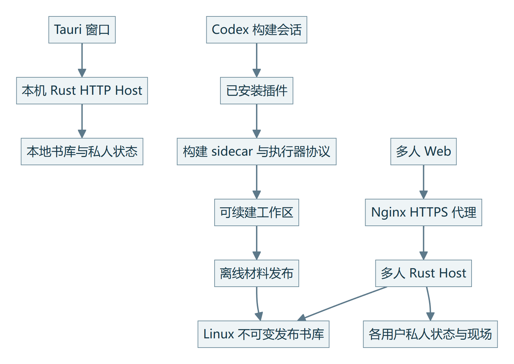

图中贯通两端的是材料与协议。甲的构建工作区可以进入发布工具，甲的私人资料通过指定归属迁入；乙的窗口不会连接甲电脑上的本机 Host。共享 Web 组件与 Rust 业务代码节省了重复实现，但部署者仍要选择相应入口。

<a id="ch20-s4"></a>

#### 设置改变的对象是什么

桌面第一次启动时，[LibrarySettingsStore::initial_root](../../../apps/desktop/src-tauri/src/library_settings.rs)使用已保存路径；没有设置时，默认在 Documents 下的 UnderstandBook 中建立 `.understand-book`。选择普通父目录会补上这个子目录，直接选择已有 `.understand-book` 则使用它本身。

设置文件位于 `%LOCALAPPDATA%\UnderstandBook\settings.json`，保存书库根与 Reader Provider。apply_selection 先确定可用目录，再写设置；桌面命令随后调用 RunningServer::set_library_root，改变扫描和新建材料所用的根。这个动作没有遍历并搬迁原来的书，也没有把私人数据重归属给另一个用户。

Provider 保存同样经过明确入口：校验 mode、Base URL、model 和 Key，持久化后调用 set_provider_config。界面读取的 DesktopProviderStatus 只含 api_key_configured，不返回 Key。后续保存留空 Key 时，复用已有设置，缺少已有设置才尝试环境配置。环境文件提供初始配置，已持久化的有效设置在启动时覆盖它。

这些设计让目录和模型配置可以独立于安装目录变化。代价是必须区分三个位置：程序与 Web 资源在哪里，书库在哪里，用户设置在哪里。升级程序不应该靠删除这些目录来“恢复默认”；遇到书库不可用，也应回到目录设置，而不是把缺书误诊为插件安装失败。

<a id="ch20-s5"></a>

### 20.2 插件、执行器和配置

<a id="ch20-s6"></a>

#### Reader 安装与插件安装为何分开提交

甲的电脑可以没有 Codex CLI，也可能在安装时离线。若 Reader 安装必须同时成功修改 Codex 配置，这些情况都会让本来可用的阅读程序无法交付。

当前 Windows Setup 采用 per-user NSIS 安装。[安装钩子](../../../apps/desktop/src-tauri/windows/installer-hooks.nsh)先登记程序目录，再询问是否安装 Codex 插件；同意后才运行 `UnderstandBook.exe --install-codex-plugin`。插件失败时显示待安装提示，Reader 保留，之后可以从桌面设置重试。用户关闭这次安装选择，也不会回滚 Reader。

[PluginManager](../../../apps/desktop/src-tauri/src/plugin_manager.rs)进一步区分“插件存在”与“本 Setup 有权维护它”。安装收据记录 plugin_name、marketplace_name、marketplace_source、codex_path，以及 marketplace_added_by_setup。install_with_runner 判断市场归属的关键部分是：

```rust
let matching_receipt = receipt
    .as_ref()
    .filter(|receipt| receipt_matches_install(receipt, &self.config.marketplace_name));
let owned_marketplace =
    matching_receipt.filter(|receipt| receipt.marketplace_added_by_setup);
```

receipt_matches_install 同时核对插件名和市场名。有匹配且由 Setup 创建的市场时，同源重试会刷新市场，换源会进入迁移；一个外部已安装插件不会因为被当前安装器发现，就自动变成 Setup 所有。新安装的收据写入失败时，代码会尝试撤销刚刚添加的插件和市场；换源失败则尝试恢复原市场。

卸载也沿收据执行。uninstall_owned 没有收据时保留外部插件；有收据时移除相应插件，只有 marketplace_added_by_setup 为 true 才移除市场。书库、外部登记工作区和记忆不是这份插件收据的删除对象。

因此，安装器处理的是两个可分别观察、重试的过程。读者要知道当前 Reader 可用、插件待安装，或插件由外部管理；不能只显示一个含义模糊的“全部成功”。收据在这里服务于所有权与恢复，不是模型执行回执。

<a id="ch20-s7"></a>

#### 薄插件怎样找到真正执行工作的程序

市场入口 [marketplace.json](../../../.agents/plugins/marketplace.json)发布 `plugins/understand-book`，没有把整个源码仓库作为插件安装。当前根与发行 [plugin.json](../../../plugins/understand-book/.codex-plugin/plugin.json)的版本都是 `0.1.0+codex.20261003012800`；桌面程序版本是 `0.2.0`。这两个数字属于不同产物，不能靠字符串相等判断兼容。

插件的 [.mcp.json](../../../plugins/understand-book/.mcp.json)声明两个 stdio 服务。Book MCP 提供阅读工具；共享 Build Executor MCP 只暴露 executor.open、executor.input.next、executor.generation.start、executor.submit_candidate 四个入口。第 7 章讲过这些入口怎样交付输入与接纳候选，这里关注它们究竟启动哪个程序。

[Book MCP 启动器](../../../scripts/start-book-mcp.cmd)先读取 UNDERSTAND_BOOK_MCP_BIN，再从 `HKCU\Software\UnderstandBook` 的 InstallDir 定位 book-mcp.exe。[执行器启动器](../../../scripts/start-build-executor-mcp.cmd)采用同样的两级定位，显式覆盖变量为 UNDERSTAND_BOOK_BUILD_EXE。找到程序后，实际命令固定为：

```bat
"%BUILD_EXECUTOR_BIN%" executor.mcp --bootstrap-version automatic_build_executor_bootstrap.v3 --protocol-generation automatic_build_executor_session.v3
```

这行没有把任意外部参数继续追加进去。插件负责解析安装位置和声明协议，真正的确定性引擎来自 Setup 携带的二进制。找不到程序时，启动器返回不可用诊断；把薄插件放进 Codex，并不顺带生成缺失的 sidecar。

[build-sidecar.mjs](../../../apps/desktop/scripts/build-sidecar.mjs)使用 Bun 把 sidecar-entry.ts 编译为 Windows x64 可执行文件，并把 Markdown、TOML 和 CMD 资源作为文本带入。[build-book-mcp.mjs](../../../apps/desktop/scripts/build-book-mcp.mjs)则以 Cargo release 构建 Rust 的 book_mcp，再复制到 Tauri externalBin 所需的带目标平台后缀文件名。两者技术栈不同，最终都通过安装目录被找到。

<a id="ch20-s8"></a>

#### 角色注册为什么还有单独一步

执行器 MCP 可用，并不表示当前 Codex 任务已经认识 understand_book_executor 这个角色。薄插件携带角色模板和注册脚本；发布约束明确不依赖插件内的 `agents/` 或 `.codex/agents/` 自动完成注册。

[register-executor-agent.ps1](../../../scripts/register-executor-agent.ps1)要求显式选择 personal 或 project。个人范围使用 CODEX_HOME 或用户目录下的 `.codex`；项目范围要求一个现有的绝对 WorkspaceRoot，再写入其 `.codex/agents`。它按已有目标的内容作出不同决定：

| 目标状态 | 注册行为 | 对正在进行的任务意味着什么 |
| --- | --- | --- |
| 尚不存在 | 写入发行模板，报告 absent | 回执要求新任务加载角色 |
| 已与当前模板相同 | 报告 same，不重复改写 | 仍报告 new_task_required |
| 是发行包附带的已知旧版 | 需要 MigrateKnownPredecessor；先保留固定备份，再替换 | 新角色合同在新任务中使用 |
| 是其他已有内容 | 拒绝覆盖 | 保留用户现有定义，不能当成发行模板继续 |
| 已知旧版的固定备份发生冲突 | 拒绝迁移 | 保留原目标和冲突备份供判断 |

本轮在独立临时项目实际执行了这些状态，共六组调用：首次、相同、未知内容、旧版未授权迁移、旧版显式迁移、备份冲突。验证了目标保留、备份字节以及 new_task_required；没有注册到真实个人配置或本项目配置。

角色模板继承模型设置，使用只读沙箱，并继承插件拥有的共享 MCP。这里的只读角色与四工具白名单表达工作分工；共享 MCP 并不认证调用者是不是指定角色。当前[编译产物冒烟](../../../apps/desktop/scripts/smoke-t7-executor-release.ts)也明确记录 capability_isolation 为 false。不能把“应由专用执行器调用”讲成已经实现跨角色的能力隔离。

<a id="ch20-s9"></a>

#### 版本固定要发生在安装来源上

假设甲今天构建 Setup，过几天才安装插件。如果市场来源只写仓库名，届时市场可能已指向新的插件脚本。Reader、sidecar 和启动协议便有机会来自不同快照。

[Windows 构建说明](../../Windows-Setup%E7%BC%96%E8%AF%91%E6%96%B9%E6%B3%95.md)给出的发布做法，是把 UNDERSTAND_BOOK_MARKETPLACE_SOURCE 固定到构建所用的提交，例如 `adaelon/undertand-book@已发布提交`。这个仓库拼写来自项目现有配置。更深一层，[assert-release-config.mjs](../../../apps/desktop/scripts/assert-release-config.mjs)只检查来源形式属于公开 Git 地址，并核对打包声明与构建顺序；它接受不带提交的仓库名，也不联网确认远端内容。因此，固定提交是发布流程承担的匹配条件，不能说成配置断言已经强制完成。

当前 [package:windows](../../../apps/desktop/package.json)先运行 Node/Bun 行为对照和 T7 执行器冒烟，再做插件与配置检查，随后进入 Tauri 构建。全新检出要先生成一次 sidecar，才能通过前面的产物检查；Tauri 的 beforeBuildCommand 后面还会构建 Web、重新生成 sidecar、构建并冒烟 Book MCP，再准备资源。目录中有一个旧 sidecar，与本轮源码匹配，是两件事。

<a id="ch20-s10"></a>

### 20.3 Linux 阅读服务的组成

<a id="ch20-s11"></a>

#### 同一 release 要能解释浏览器、宿主和制作进程

甲把书交给 Linux 后，普通读者不需要安装桌面程序或构建插件。服务消费已经完成的阅读成果，提供应用登录、私人状态和共享运行资源。

[build-multi-reader.sh](../../../scripts/linux/build-multi-reader.sh)把这个组合写成一条构建链：

```bash
pnpm install --frozen-lockfile
VITE_MULTI_USER=1 pnpm -C packages/web build --outDir dist-multi
cargo build --locked --release -p server --bin server --bin manage_reader \
  --bin publish_book --bin reader_maintenance --bin presentation_worker -j 1
```

这里生成独立的 dist-multi，保留普通模式 dist。五个 Rust 入口分别承担在线服务、账号管理、材料发布、迁移恢复和受限制作，来自同一次源码构建。脚本先移除旧成功收据，只有前述命令全部成功，才写 multi-reader-build.txt，记录目录、时间、profile、commit 或源码副本状态与工具链。

项目运行单要求在最终 release 目录构建。当前 Server 的 workspace_root 仍由编译时 CARGO_MANIFEST_DIR 推导，部分构建与规划路径依赖这个源码位置。保持源码、产物、Web 和配置指向同一个 release，是项目采用的交付合同；它不表示每次多人阅读都要重新执行 TypeScript 构建。

[启动脚本](../../../scripts/linux/start-reader.sh)另作运行模式选择：默认 single-user 沿旧 reader-only 入口；multi-user 必须提供 SERVICE_ROOT 和 ORIGIN，再传给 `server --multi-user`。脚本使用的缺省后端地址是 `127.0.0.1:8788`；直接使用 Rust CLI 且省略 addr 时的缺省是 `127.0.0.1:8787`。正式模板明确填 8788，不能凭习惯混用两者。

Server 收到多人参数后，[multi_user_host::start](../../../crates/server/src/multi_user_host.rs)检查 loopback、HTTPS origin，打开带独占写锁的用户根，加载发布、现场、容量、沙箱与 Provider；start_with_access 先 recover，再开始监听和领取。启动不仅是 bind 成功，它还要把上一章的未结接单恢复到有确定含义的状态。

<a id="ch20-s12"></a>

#### 四类目录为什么不能混成一个应用文件夹

一台机器上的相邻目录，可能具有完全不同的升级和恢复语义。

| 对象 | 当前模板中的位置形态 | 更新时要保留的关系 |
| --- | --- | --- |
| release | `releases/某次发布/` | Server、维护工具、worker、dist-multi 与源码相互匹配 |
| 服务数据 | `data/multi-reader/` | control.sqlite、发布材料、各用户私人根和服务内配置共同构成恢复点 |
| 外部环境与代理 | EnvironmentFile、systemd unit、Nginx 配置及证书目录 | origin、后端、静态根和执行路径必须指向这次组合 |
| 制作运行时 | 独立的 Python 环境与浏览器路径 | 被沙箱配置引用，并在实际服务账号下可用 |

[多人 unit](../../../scripts/linux/understand-book-multi.service)的 WorkingDirectory 与 ExecStart，以及 [Nginx 模板](../../../scripts/linux/nginx-multi-reader.conf.example)的静态 root，均带待替换的 MU11_RELEASE。三处应指向同一最终目录。服务数据根单独由 [环境配置](../../../scripts/linux/multi-reader.env.example)提供，升级程序不需要把旧用户目录覆盖进新 release。

这个拆分也解释备份范围。服务根内的配置随服务快照保存；放在根外的 Provider EnvironmentFile、证书、unit 和 Python 环境不会因为备份了 control.sqlite 就自动进入快照。它们是恢复数据之后，重新组成可运行服务所需的外部条件。

<a id="ch20-s13"></a>

#### HTTPS、身份与 SSE 必须经过同一条入口

浏览器使用公开 HTTPS origin，后端监听本机 HTTP。Nginx 提供 TLS 和静态页面，把 `/api/` 原样代理给同一个 Rust 服务。Site::validate 检查 Host；写请求或携带 Origin 的请求还必须匹配配置 origin。因此，使用非默认 HTTPS 端口时，代理的 Host 也要带这个端口。

多人模板关闭旧 Basic Auth，保留应用 Cookie、Origin 与 CSRF 路径，并清除可能伪造上游身份的头。第 19 章的 Principal 仍由应用登录产生，而不是把某个代理头当成用户 ID。

缓存和流也分别处理：内容版本化的 `/assets/` 可以长期缓存；HTML 与 API 不缓存；`proxy_buffering off` 使 SSE 能逐批到达。PDF 的范围响应由模板的 proxy_force_ranges 参与实现，每次 API 请求仍经过上游授权。上一章已经区分后端可能返回完整 200 与代理支持 Range，发布验收应在浏览器实际经过的这条链路观察结果。

如果只在后端用一个读取请求得到 200，还不能判断证书、前端模式、登录、跨账号归属、PDF 与 SSE 是否正确组合。它们不是附加在业务之外的装饰，而是读者实际使用业务所经过的入口。

<a id="ch20-s14"></a>

#### 安装了 worker，为什么制作能力仍可能关闭

第 17 章的浏览器预览、Matplotlib 和 Manim，在网络服务中要进入受限制作环境。一个 worker 文件存在，并不等于该环境可执行。

[Sandbox::load](../../../crates/server/src/presentation_sandbox.rs)读取服务根的 presentation-sandbox.json，校验 Linux、worker、Python 和浏览器路径，再回收本实例遗留单元，执行 Probe。只有探针返回 isolated=true 才将 ready 置为 true。缺文件、无配置和探针失败有各自的 reason。

向前端投影能力时，代码使用同一个运行结果：

```rust
let ready = self.ready.load(Ordering::Acquire);
serde_json::json!({"authoring":ready,"plot":ready,"animation":ready,"preview":ready,
    "reason":if ready { "ready" } else if self.reason == "ready" { "execution_cleanup_failed" } else { self.reason }})
```

所以，页面应根据实际 capability 表示能否制作。配置载入发生在 Authorization 建立时；修改了 worker、运行时或权限后，需要重新启动宿主，重新取得探针结果。

[制作配置模板](../../../scripts/linux/presentation-sandbox.json.example)绑定同 release 的 presentation_worker 和独立运行时。生成任务由 systemd cgroup 与 bubblewrap 隔离；宿主账户获得所需管理能力，生成进程仍在受限环境中运行。这套部署条件在项目支持的网络制作场景中实际需要，不能由桌面本地预览成功代替。

停止服务也跨越进程边界。[main.rs](../../../crates/server/src/main.rs)的 Linux 信号处理器只设置原子通知，主线程随后调用 shutdown。多人 shutdown 先停止准入并向活动 Run 传播取消，再等待工作与观察线程，关闭观测并冲刷用户已读。unit 配置 SIGTERM、KillMode=mixed 与 180 秒停止期限。期限到达后的强制终止属于中断，重启再依靠日志与接单恢复；不能把它记录成有序保存成功。

<a id="ch20-s15"></a>

### 20.4 材料发布、数据迁入、备份与恢复

<a id="ch20-s16"></a>

#### 先发布公共材料，再指定私人资料属于谁

甲交来的目录中，可能同时有原文、构建中间文件、学习事实和私人制作内容。把整个目录直接放进 Web 根，既无法稳定引用材料，也混淆了不同对象的归属。

[publish_book](../../../crates/server/src/bin/publish_book.rs)是离线管理入口。import 调用 PublishedLibrary::publish，复制被允许的正文、base、公开结构和清单依赖；原 PDF 被整理为发布内的 original.pdf。它复用既有阅读就绪判断，在暂存位置加载 Book、检查材料，生成新的 PublishedBookRef，最终移动、封存文件，再事务登记发布与默认指向。

这一过程没有把 `.build`、模型执行记录和私人树整体公开。发布成功也不会自动授权所有账号：grant 仍需要指定 user_id、book_id 与 publication_id。一个发布可以被甲乙共同读取，他们的笔记、聊天和学习过程分别保存在自己的根。

账号管理由 [manage_reader](../../../crates/server/src/bin/manage_reader.rs)完成。create 和 password 从 stdin 读取密码，其他操作负责启用、禁用和撤销登录会话。这两个管理程序和在线服务都先取得 ServiceWriter；当前管理方式是停服后的可信离线操作，普通读者 HTTP 没有发布本机任意目录或修改账号的对应能力。

<a id="ch20-s17"></a>

#### 迁移计划不是路径替换表

甲的旧 session 可能写着 Windows 目录，Linux 上实际可读的是另一份材料副本。把所有反斜杠替换成斜杠还不够：同名目录里的正文可能已变，笔记正文中也可能恰好包含一个路径。

[MigrationPlan 与 BookMapping](../../../crates/server/src/reader_maintenance.rs)把这几件事分开。下面是教学输入，所有路径和发布 ID 都是假定值，实际执行时应来自选定副本与发布回执：

```json
{
  "operation_id": "reader-import-1",
  "memory_dir": "/srv/legacy-copy/memory",
  "private_dir": "/srv/legacy-copy/private",
  "library_root": "/srv/legacy-copy/books",
  "service_root": "/srv/multi-reader",
  "user_id": "reader-a",
  "backup_dir": "/srv/backups/reader-import-1",
  "books": [{
    "legacy_dir": "C:\\books\\learning-rate",
    "source_dir": "/srv/legacy-copy/books/learning-rate",
    "publication": {
      "book_id": "learning-rate-book",
      "publication_id": "registered-publication-id"
    }
  }],
  "reviewed_files": []
}
```

legacy_dir 用来识别旧 session 或书库登记里的拼写，source_dir 是当前机器可读的完整副本，publication 指向此前实际登记的不可变材料。prepare 核对原 book_id、正文、来源关系、原 PDF、旧位置和学习事实引用，要求所有材料都有明确映射。它修改结构化目录字段与发布绑定，不把笔记或成果正文中的路径文字当成迁移指令。

migration_preview 先取得同一服务根写锁，以只读方式检查当前 control schema，报告文件、字节、记录数量、位置、映射及 pending_review。它不创建目标用户或迁入业务数据；取得锁本身可能创建锁文件。所有 private 辅助文件按显式清单审核，未知 memory 文件也要逐项列入 reviewed_files。原书库的未知辅助文件保存在备份，在线发布仍只使用已经登记的材料包。

目标账号必须尚未使用，既没有私人文件，也没有阅读现场。迁入不是两个活跃账号之间的合并算法。甲的资料给甲，乙保持自己的空空间；这一判断应在文件复制之前完成。

<a id="ch20-s18"></a>

#### 长复制怎样留下可继续的事实

正式 migrate 需要 `--stopped`。这个参数表示操作者已停止旧单人程序及其他不遵守新锁协议的写入者；新服务的文件锁不能证明旧程序已经停写。

迁入按以下顺序推进：

```text
固定计划与 operation
    ↓
maintenance.json 阻止正常服务打开目标根
    ↓
备份旧 memory、private、library、外部材料和迁入前服务根
    ↓
从快照生成期望文件，逐项复制并记录完成
    ↓
事务登记目标用户的材料授权和阅读检查点
    ↓
核对文件与映射 → operation complete → 移除维护标记
```

为什么先做快照，再从快照生成目标？因为中断后需要复用同一组输入。若每次续接都重新读一个已经变化的源目录，原 operation 就可能混合两个时点的数据。

同一计划重跑时，工具比较保存的 plan；账号、映射或审核清单变了就拒绝。目标中已存在的文件直接比较字节，相同则复用，冲突则停止；元数据提交后中断，也复用原 workspace_id。完成后若用户已经产生新写入，再执行旧导入计划会发现目标变化，不把新状态覆盖回迁入时刻。

正常服务入口的屏障来自 [ServiceWriter::acquire](../../../crates/server/src/control_store.rs)：

```rust
let writer = Self::acquire_maintenance(root)?;
if writer.root.join("maintenance.json").exists() {
    return Err(error("SERVICE_MAINTENANCE_INCOMPLETE", "conflict", "Resume the recorded offline maintenance before starting this root"));
}
Ok(writer)
```

操作系统锁阻止同时写，maintenance.json 则在进程已经退出之后继续表达“这个根尚未完成”。两者解决不同时间范围的问题。手工删标记只能绕过后一项判断，不能补齐缺失文件或未完成事务。

本轮 [MU9 用例](../../../crates/server/src/tests/mu9_tests.rs)实际在文件提交和元数据提交后注入失败，再继续原计划；旧文件、记忆 ID、学习证据和私人内容保持，A 能读到原笔记，B 仍为空。错误来源映射、变更的 PDF 绑定、缺失的学习材料和目标冲突也按预期被拒绝。

<a id="ch20-s19"></a>

#### 文件保留、聊天可见和接单恢复是三种结果

迁入工具能保存旧 agent-history.json，并为其中的回合补充 PublishedBookRef。但当前 [load_chat_storage](../../../crates/server/src/session_store.rs)从 agent-sessions 中的 JSONL 打开持久聊天，旧快照保持原样，不自动导入。

这个差别在本轮用例中是明确断言：旧聊天文件仍在，原回合字段仍在，打开目标用户后的 agent_history.sessions 却为空。它说明私人档案保全成功，不能再据此声称当前聊天列表已经恢复旧对话。较早 [MU9 操作说明](../../Linux%E5%A4%9A%E4%BA%BA%E9%98%85%E8%AF%BB-MU9%E8%BF%81%E7%A7%BB%E6%81%A2%E5%A4%8D.md)中“旧 pending 沿 History 恢复”的叙述属于此前快照路径，应结合当前日志合同理解。

服务整体备份则有另一条当前路径。[jl7_backup_restores_new_chats_checkpoint_and_original_domain_objects](../../../crates/server/src/tests/mu6_tests.rs)创建真实 JSONL 聊天、来源、演示、笔记、教学关联和压缩检查点，备份后恢复到新根，逐项确认仍可读取。另一个用例同时保留旧 JSON 档案和 queued 接单：旧回合仍不进入当前历史，新的 queued 回合按原冻结输入恢复，重复请求仍指向原 turn。

所以，从旧资料迁入到新服务、从当前服务快照恢复、让旧程序读取导出数据，是三种不同合同。它们不能共用一个“历史恢复成功”的含糊结论。

<a id="ch20-s20"></a>

#### 为什么备份不能只复制 SQLite 主文件

服务根包含控制 SQLite、学习 SQLite、JSONL、记忆文件、演示版本和不可变发布。SQLite 已提交数据还可能在 WAL 中；只复制主文件会漏掉这部分数据。反过来，只保证数据库内部一致，也不能保证 JSONL 与对应私人对象处于同一个恢复时点。

backup_service 先取得整个服务根的独占写锁，再递归制作快照。遇到数据库时，copy_file 使用真实备份接口：

```rust
rusqlite::backup::Backup::new(&input, &mut output)?.run_to_completion(
    128,
    std::time::Duration::from_millis(10),
    None,
)?;
```

之后检查数据库完整性；数据库对应的 WAL、SHM 和 journal 不作为普通文件另抄一份。普通文件经临时文件复制与同步，service.lock 和 maintenance.json 不进入服务快照。最终记录文件清单、封存文件，再把暂存快照移到新目标。已有快照路径拒绝覆盖。

一致性来自两层：SQLite Backup API 取得数据库已提交状态，服务写锁让遵守协议的其他存储在复制期间不继续变化。本轮保留一个已提交 WAL 的连接，完成备份和恢复后仍能找到只在该提交中新建的用户，验证了主文件之外的数据也进入恢复点。

restore_service 只接受空的独立根，恢复过程中同样设置维护标记。它复制完整数据，重定位 book_publications.directory 的原服务根前缀，保持 book_id 和 publication_id；随后重新封存发布文件、移除标记。恢复中断可以按同一快照重来，原服务根与快照不被替换。

<a id="ch20-s21"></a>

#### 回滚程序之前，先问新写入放在哪里

若升级后没有新写入，可以重新选择原独立实例。若已有新聊天和笔记，直接切回升级前的数据根，会把这些事实从使用路径上丢掉。

当前优先方案是使用兼容当前数据 schema 的程序读取现根；必须回到旧单人形态时，export_user 显式导出一个账号到新目录。它拒绝该账号仍有 preparing、queued、claimed 或未保存回合的情况，复制该用户的 memory/private 与已授权发布，并根据服务端检查点重建本地 session 路径。导出目录没有其他用户根，也没有服务 control.sqlite。

export_user 不把新的 JSONL 反向转换成所有旧程序认识的快照格式。导出成功后，仍要让选定的旧程序在隔离入口读取它实际支持的对象。本轮验证了独立导出中的书、笔记、学习状态、位置和私人成果；真实旧二进制读取属于后面的历史发布证据。

维护命令也不自动改 systemd 或 Nginx。恢复目录可以先独立检查，确认材料引用、私人事实和接单状态，再由发布操作选择入口。把“恢复出数据”和“切换正在使用的数据”分开，使检查发生在影响读者之前。

<a id="ch20-s22"></a>

### 20.5 版本组合和部署验证

<a id="ch20-s23"></a>

#### 哪一种证据能回答哪一种问题

甲发现“构建失败”时，可能缺 sidecar，也可能执行器协议不匹配；乙发现“演示不可用”时，可能是沙箱探针失败。一个总测试数量解释不了这些差异，关键在于验证实际跨过了哪个边界。

| 验证层次 | 项目中的具体入口 | 能支持的结论 |
| --- | --- | --- |
| 源码发布合同 | assert-plugin-release 的 source-contract-only | 根与发行 manifest、skill、角色模板、MCP 和启动器一致，所需协议标记存在 |
| 发行配置 | assert-release-config | 市场来源形式可用，externalBin、Web 资源及 beforeBuildCommand 顺序符合约定 |
| 打包后二进制 | smoke-book-mcp-plugin | 实际启动 Book MCP，列工具，通过 Reader session 找材料，执行固定文本搜索 |
| 编译执行器协议 | smoke-t7-executor-release | 实际 sidecar 的输入交付、开始生成、候选提交、重复与恢复等合同；候选由脚本提供 |
| 已安装插件组合 | 检查 installed-plugin-root，并经发行启动器执行 | 安装内容与发行内容匹配，启动器连接指定产物 |
| 操作系统与代理 | 实际 unit、Nginx、服务账号、浏览器与沙箱验收 | 部署路径、身份、流、制作和停止确实跨过目标平台边界 |
| 数据恢复 | 临时数据或实际恢复点上的 backup/restore/export | 所检验对象和版本在恢复后可读，原根与归属保持 |

例如，[Book MCP 冒烟](../../../apps/desktop/scripts/smoke-book-mcp-plugin.mjs)使用 `alpha beta alpha`，从临时 session 选择材料，期望查到两处 alpha，同时检查私人成果覆盖不可用时的明确错误。这能确认打包后的工具链路，不能证明模型会正确理解一本真实的书。

T7 脚本使用合成输入与固定候选，检查四工具协议、重复提交、过早生成、恢复代次和超大候选拒绝；只有传入已安装插件根，installed_launcher_executed 才为 true。仅运行 source-contract-only 会在启动这些二进制之前结束，也会跳过已安装缓存比较。版本号和源码合同因此是必要证据的一部分，而非替代产物运行。

<a id="ch20-s24"></a>

#### 一次真实发布怎样改变“已经验证”的含义

[2026-10-01 MU11 实施记录](../../performance/linux-multi-reader-mu11-20261001.md)提供了很具体的分阶段证据。早期隔离验证把 dev 构建的五个程序放进候选目录的 `target/release`，只是为了复用 launcher；记录明确说明目录名不等于优化构建。随后正式构建才生成 release 产物。[正式收据](../../performance/linux-multi-reader-mu11-20261001/production-build-receipt.txt)保存 profile=release、最终源码根与 working-tree-source-copy，基线是当时的 5e10516。

同一记录还揭示另一种可达失败：初次部署有在线服务，却遗漏 presentation-sandbox.json 与宿主的 systemd 权限，网络制作处于 not_configured。补齐同 release worker、独立运行时和宿主权限后，才在实际服务账号下验证浏览器、Python 渲染、取消和回收。[原始集成日志](../../performance/linux-multi-reader-mu11-20261001/production-render-integration.log)记载四个用例通过，测试进程耗时 57.27 秒。这个时间属于那次集成测试，不能解释成一次演示的制作延迟。

历史记录也曾用真实旧 release 在独立端口读取 export-user 导出的笔记。这比“导出目录存在”多验证了旧程序的读取合同，但仍只支持当时程序、当时数据和被检查对象的组合。

[现网运行说明](../../Linux%E5%A4%9A%E4%BA%BA%E9%98%85%E8%AF%BB-%E7%8E%B0%E7%BD%91%E8%BF%90%E8%A1%8C%E8%AF%B4%E6%98%8E.md)随后记录 EX13/JL 程序更新以及 BSR7 材料默认发布更新。这说明程序发布与书籍发布是两个时间轴：换了一份默认 Book，不等于更新了 Server；更新 Server，也不应让历史 Run 改绑新 publication。本章引用的是文件中的历史状态，没有访问远端来确认今天的服务、证书或能力。

<a id="ch20-s25"></a>

#### 恢复演练为什么会改变空间预算

做一个明确的教学算例。假定当前服务根占 8 GiB；普通文件不压缩、不去重，数据库备份大小也假定不变。计划同时保留在线根、一份完整快照，以及一份独立恢复演练根。

```text
保留总量 = 8 + 8 + 8 = 24 GiB
相对现有服务根，需要新增空间 = 8 + 8 = 16 GiB
```

当前实现会在目标父目录建立暂存快照，再改名为最终快照；改名不是再复制一份，所以不应机械地把暂存和最终快照各算一份完整数据。另一方面，以上 16 GiB 没有计入旧 release、Python 环境、迁入前旧资料、临时验证副本、数据库增量和持续新写入。迁入快照还可能同时包含旧书库与已登记发布，不能把它当作只备份一个 8 GiB 服务根。

这是容量假设，不是实测压缩比或磁盘性能。时间也有不同边界：停止等待、取得写锁、复制文件、SQLite 备份、同步提交、重新启动和浏览器验证分别耗时。离线备份持有服务根写资格，复制期间的停服成本不会因为模型执行在锁外就消失。选择维护窗口时，应先确定复制的数据范围，再测量对应路径，不能拿一次模型响应时间推算停机时间。

<a id="ch20-s26"></a>

#### 本轮实际跨过的边界

本轮直接执行了 12 个 Server 定向用例，全部通过。它们使用临时真实文件、SQLite 和当前 JSONL，包含受控错误返回后的重开；queued 恢复使用固定 Provider，当前对象恢复用例确认没有调用 Provider。未执行真实模型、进程强杀或掉电。

在 Windows 的 Git Bash 中，5 个既有 launcher 用例全部通过；两个构建脚本用例首轮一过一失败。失败发生在 source-copy 收据断言：Git Bash 把自己的 Git 放到夹具替身之前，识别到了真实仓库。诊断确认命令解析顺序后，仅对该失败用例恢复替身优先顺序，执行未修改的脚本，再验通过；原始失败保留。

此外实际通过插件源码合同检查、3 组发行配置输入和 6 组临时执行器注册。发行配置中的缺来源和本地路径都是预期拒绝；注册中的未知内容、未显式迁移与备份冲突也都是预期拒绝。它们不属于测试失败。

这些验证没有生成 Setup、安装真实插件、执行 Book MCP 或 T7 编译产物冒烟，也没有运行 Linux systemd、Nginx、真实浏览器或制作环境。相应脚本和历史结果已经回读，用途与实际执行范围分别保存在[来源与验证记录](../SOURCES.md#%E7%AC%AC-20-%E7%AB%A0%E7%BB%AD%E5%86%99%E9%AA%8C%E8%AF%81%E8%AE%B0%E5%BD%95)。

<a id="ch20-s27"></a>

### 已知边界

1. **插件存在不证明组合兼容。** 发行配置检查不强制市场来源固定提交，source-contract-only 不检查安装缓存或二进制。当前 Windows 启动器与 Book MCP 打包路径也是平台专用的，不能从薄插件结构推导 Linux 上具有同样安装流程。

2. **插件安装的回滚是尝试恢复。** PluginManager 在部分失败路径忽略补偿命令的错误，返回“rolled back”类文案不足以证明外部 CLI 已全部恢复。另一个较窄的状态问题是：status 判断 Setup 归属只比较收据中的插件名，而 install 的匹配还比较市场名；配置切换到另一个市场且那里已有同名外部插件时，状态显示可能误称 Setup 安装。实际安装仍沿更完整的匹配分支处理。这两点按当前源码确认，本轮未执行真实市场故障或修改产品。

3. **角色分工与调用者认证不同。** 执行器角色继承共享 MCP，四工具合同不提供调用者角色认证；注册回执要求新任务加载，不能据注册成功声称当前任务的角色环境已刷新。桌面 Provider Key 当前按产品约定明文保存在私人设置文件，状态接口不回传它；它不应进入公开安装包或书稿示例。

4. **旧档案保全不等于当前聊天恢复。** legacy-import 保留并补绑定的旧 JSON 聊天不会自动转为 JSONL；当前用例明确得到空的旧聊天投影。export-user 也不承诺把新格式转换给任意旧程序。历史 MU9、MU11 的旧聊天可见性必须保留当时版本条件。

5. **一致性恢复依赖停写与完整组合。** ServiceWriter 只能约束遵守该协议的写入者，`--stopped` 不负责检测旧进程；快照清单记录路径和长度，不是对任意同长度内容改写的检测。快照文件封存和拒绝覆盖表达工具合同，管理员仍能改变文件权限。外部 Provider 环境、证书、运行时与程序 release 需要另外匹配。

6. **当前局部通过没有替代平台发布验收。** 本轮 Git Bash 重放不能证明 Linux unit、权限或代理已可用；Server 用例不覆盖 Unix 条件分支的权限断言。历史 MU11 也保留容量、完整混合负载、实体设备等未验范围。本章没有修改产品代码，没有把历史部署状态写成当前在线探测结果。

<a id="ch20-s28"></a>

### 面试时怎样解释本章

1. **桌面版为什么仍然需要 HTTP Host？**

   Tauri 提供窗口和本机能力，阅读请求复用 Rust Host。setup 先启动本机随机端口，再用实际 URL 建窗口；退出沿运行协调和后台收口。这样桌面与 Web 能共用业务机制，但窗口生命周期仍要负责宿主退出。

2. **安装包已经装好，为什么构建 Agent 仍可能不可用？**

   Reader、插件安装和角色注册有分别的完成条件。插件还要通过启动器找到 Setup 中的 sidecar，并使用匹配的协议；专用角色需要注册且在新任务加载。应定位哪一步缺失，不能用“插件存在”替代整个构建链路可用。

3. **插件升级怎样避免拿走用户已有配置的所有权？**

   安装收据记录插件、市场、来源和市场是否由 Setup 创建。外部插件不自动被接管；由 Setup 创建的市场才进入自动换源路径。角色注册另按当前、已知旧版和未知内容区分，未知内容保留，已知旧版显式迁移并留备份。

4. **Linux 发布为什么要同时关心 Web 和五个 Rust 程序？**

   Web 构建时决定多人入口，在线服务负责身份和运行，维护工具负责同一 schema 下的管理，worker 负责受限制作。它们与静态根、unit 和沙箱路径组成实际版本；只替换一个 server 文件，不能证明其他协议与环境仍匹配。

5. **材料发布与程序发布有什么区别？**

   程序发布决定 Host、Web、工具和数据格式的实现；材料发布把一组阅读依赖封存为 PublishedBookRef。默认材料可以更新，旧现场和 Run 仍持原发布。发布材料也不自动迁入私人状态或授权所有用户。

6. **为什么迁移既有文件锁，又要有 maintenance.json？**

   文件锁阻止同时写，进程退出后会释放；维护标记继续阻止半完成的根被正常打开。工具从固定快照续接，核对目标文件和映射，完成后才移除标记。删除标记不能替代恢复。

7. **怎样备份 SQLite 与 JSONL 混合的数据？**

   先停止在线写入并取得服务根写锁；数据库使用 Backup API 纳入已提交 WAL，普通文件同步复制，最后发布完整快照。数据库内部一致性由 SQLite 提供，跨文件恢复时点由共同停写边界保证。恢复到独立根后再核对原发布、聊天和领域对象。

8. **新版本出问题，为什么不能直接切回旧目录？**

   新版可能已经接纳问题或保存笔记。直接指回旧数据根会让备份之后的事实消失。应保留现根，优先选兼容当前 schema 的程序；若回旧单人形态，先结清接单、显式导出一个账号，再由选定旧程序验证可读格式。

9. **怎样说明自己的部署验证没有夸大？**

   按实际跨越的边界说明证据：源码合同、编译产物、已安装启动器、真实平台、数据恢复分别是什么输入和结果。脚本化候选不证明模型质量，Git Bash 不证明 Linux 权限，历史 release 记录不证明今天在线状态；真实失败与补验条件一并保留。

本章把程序、协议、材料和私人数据落实到了可安装、可维护的组合。下一章进入[第 21 章 可观测性 成本与效果评测](#ch21)：在这些组件已经连通之后，怎样判断时间和调用究竟花在哪里，模型是否真正完成了阅读任务，以及哪一项改进有证据支持。


---

<a id="ch21"></a>

## 第 21 章 可观测性 成本与效果评测

上一章把程序、插件、材料和私人数据放进了可安装、可恢复的组合。现在，读者甲已经在 Linux 阅读服务里打开原来的书，要求 Agent 解释一个条件，并把解释保存成可继续探索的演示。页面出现“正在综合原文”，过了一段时间，答案和来源按钮终于显示出来。

这一次看似普通的等待，至少留下三个问题：时间花在模型、排队、工具还是保存上？多轮调用消耗了多少实际用量？最终结果是否满足了读者的要求？

只保存一句“请求成功，用时十秒”无法回答它们。HTTP 返回成功，可能只表示问题已接纳；模型返回完整文本，仍可能没有交付有效来源；答案保存成功，也不证明解释正确。反过来，外部观测平台暂时不可用，不应让已经生成的回答无法保存。

本章回答：**怎样知道系统把时间和调用花在哪里，以及是否完成了任务？** 我们先沿同一次运行建立计量边界，再把执行事实投影到观测系统，最后用任务合同和受控实验判断改进方向。

<a id="ch21-s1"></a>

### 21.1 执行树、终态和用量口径

<a id="ch21-s2"></a>

#### 从“等了多久”回到“这段时间包含什么”

第 18 章已经区分模型等待与状态锁占用，第 19 章又加入运行准入和模型许可。现在需要让这些区别进入实际记录。

[run_events.rs](../../../crates/runtime/src/run_events.rs) 的 RunEvents 以一个 Instant 为起点，给活动分配 step_id。RunActivity 保存种类、用途、parent_step_id、状态、相对开始时间和持续时间。scope 临时设置父活动及用途，EventScope 退出后恢复原值。于是，外层采样可以是根下面的模型节点，book.synthesize 可以是工具节点，其中真正进行综合的模型调用再成为它的子节点。

这棵树表达执行包含关系。若一个工具用时五秒，其中内层模型用时四点五秒，工具时间已经包含这四点五秒。将两行相加得到九点五秒，会重复计算。

begin 的 started 参数还有一个很实际的作用：校验阶段就被拒绝的工具没有实际开始时间。finish 因而也不为它生成 duration_ms。一次非法原文范围请求可以留下 rejected 和错误码，但不能被解释成一次“耗时零毫秒的成功读取”。NoResult 则表示执行了查询而没有结果，和未执行的拒绝不同。

下面是**教学时间线**，所有时刻均为假设，不是一次项目实测。起点取读者提交请求，暂且假设所列前台步骤串行：

| 区间，秒 | 工作 | 该区间的含义 |
| --- | --- | --- |
| 0.00—0.40 | 接入、准备和运行排队 | 尚未进入本例的观测根 |
| 0.40—2.40 | 第一次外层模型活动 | 请求构造、许可等待、网络往返及模型响应的宿主可见时间 |
| 2.40—7.40 | 综合工具 | 包含读取、准备、内层模型及结果整理 |
| 2.60—7.10 | 综合工具中的模型活动 | 已包含在上一行，是子区间 |
| 7.40—10.40 | 第二次外层模型活动 | 组织最终解释及来源 |
| 10.40—10.60 | 终态提交和本例其余收尾 | 包括假定的磁盘提交等待 |
| 10.60—10.70 | 最后传输及浏览器安装结果 | 发生在宿主完成之后 |

宿主观测根的时长是 `10.60 − 0.40 = 10.20` 秒；读者看到完整结果的时间是 10.70 秒。直接累加四个活动得到 `2 + 5 + 4.5 + 3 = 14.5` 秒，其中内层模型被重复计入。模型活动自身合计 9.5 秒，只能叫模型调用边界内的累计时间，不能叫 GPU 计算时间。

这些区间也没有给出锁占用量。综合工具五秒不表示 AppState 被锁五秒，提交的 0.20 秒也不是全轮所有状态访问的总和。要回答锁是否成为瓶颈，需要观察实际闭包及锁的等待；要回答浏览器何时显示，需要前端时钟。不能从一棵宿主活动树反推出它没有记录的时间。

当前多人入口 [RunAdmissions::run_one](../../../crates/server/src/run_admission.rs)在取出准备好的任务、建立执行端口之后调用 start_run，因此这棵观测树不覆盖此前全部 queued 时间。模型活动的边界则包在 LimitedAdapter 外面；[LimitedAdapter::call](../../../crates/server/src/service_limits.rs)取得模型许可时会通知 [RunStream::resource_wait](../../../crates/server/src/agent_stream.rs)，所以某个模型节点的 duration_ms 可以包含等许可的时间。实时界面的 waiting_model 与该节点不是两个可直接相加的计时桶。

<a id="ch21-s3"></a>

#### 首个模型文本和首个可公开片段为什么分别记录

ObservedAdapter 截获 Provider 的 Text、Usage 和 Request 事件。model_first_text_ms 从该模型活动开始，计到第一个非空文本片段；answer_first_patch_ms 则从整个 Run 的事件起点，计到第一个公开回答 patch。

模型可能先调用工具，或者先生成还不能公开的结构片段。第一个 Text 到达时，读者未必已经看见回答。第 12 章的来源编译、稳定前缀和修复也会改变公开时间，所以两项指标必须分别保留。

观测到的 patch 是宿主发布的事件。浏览器接收、合并和绘制还在后面，服务端这个数字不是屏幕首字时间。在前面的教学时间线里，若最后一次模型活动在 7.90 秒产生首个文本，它的 model_first_text_ms 为 500；若本轮首个公开 patch 在 8.20 秒产生，answer_first_patch_ms 为 7800。两个值的起点和对象都不同。

<a id="ch21-s4"></a>

#### 一个终态为什么需要三个维度

[observation.rs](../../../crates/runtime/src/observation.rs)定义 execution_state、delivery_state、persistence_state。[business_states](../../../crates/server/src/observability/lifecycle.rs)将运行结果映射为前两个维度，调用者根据实际保存结果传入第三个维度。

| 场景 | 执行 | 公开交付 | 持久化 |
| --- | --- | --- | --- |
| 正常生成并保存 | completed | delivered | saved |
| 来源修复仍有问题，但终态记录成功写入 | completed | failed | saved |
| 结果已经形成，终态提交失败 | completed | delivered 或 failed，取决于来源交付 | failed |
| 取消后成功写入取消事实 | cancelled | not_delivered | saved |
| 只从未闭合观测记录恢复出的根 | interrupted | unknown | unknown |

当前 delivery_failed 检查最后一次来源修复是否仍有 issues；incomplete 单独放在 metadata 中。不能把 incomplete 直接当作 delivery_state，也不能把这张表中的 delivered 当作任务质量通过。业务交付是公开结果的状态，任务质量还需要检查内容与要求。

本地 [execute_observed](../../../crates/server/src/agent_run.rs)先执行，再经权威入口完成会话终态与相关收尾，最后调用 ObservationRun::finish。网络路径同样在 save_finished 返回之后记根终态。根的时长因而包含这段保存路径，但不包含之后所有网络传输，也不覆盖后台复核的整个生命周期。

本轮实际执行的[正式准入用例](../../../crates/server/src/tests/cache_observation_tests.rs)分别注入正常响应、Provider 失败和保存失败，确认完成与保存状态没有合并。外部模型使用本机固定响应，外部观测端使用捕获器；这验证的是当前连接，不是模型回答质量。

<a id="ch21-s5"></a>

#### 用量快照只能结算一次

流式 Provider 可能多次发送累计 usage。例如先收到总量 5，再收到总量 7，这一调用应记 7，不能记 12。[ObservedAdapter::complete_observed](../../../crates/runtime/src/run_events.rs)里的关键分支是：

```rust
crate::provider_stream::ModelDelta::Usage(snapshot) => {
    usage.replace(Some(snapshot.clone()));
}
```

chat 和结构化调用采用相同方式。即使流最终失败，最后已经收到的快照仍保留；本轮固定响应测试先发 5、再发 7、随后返回错误，实际得到失败活动及总量 7。chat 在没有收到快照时，可以从 AssistantTurn 的总量补一个只有 total_tokens 的记录。

TokenUsage 进一步区分 provider_reported、executor_reported、estimated、unavailable，以及 complete、partial、unavailable。当前 Resident 的转换只有在调用成功且输入、输出字段都存在时，才把用量完整性标为 complete；失败后的已知快照属于 partial。未知字段保持 None，不能填零。

还有两个容易重复计费的子项。cached_input_tokens 是输入中的缓存部分，reasoning_output_tokens 是输出中的思考部分；它们不应再加到输入、输出和 total_tokens 上。观测根本身保留 unknown 用量，实际模型节点携带各自的 Provider 数字；汇总时按调用身份结算模型节点，不能再把根和父工具当作额外调用。

金额需要另一层合同。做一个**虚构单价的教学算例**：假定输入 15,000 tokens，其中缓存输入 12,000；输出 2,000，其中思考输出 600。假定每百万缓存输入、非缓存输入、输出分别收费 0.2、2、4 个货币单位，没有另计项目：

```text
费用 = (12,000 × 0.2 + 3,000 × 2 + 2,000 × 4) / 1,000,000
     = 0.0164 个货币单位
总 tokens = 15,000 + 2,000 = 17,000
```

600 个思考输出不再次相加。这些单价不是任何模型当前报价。若三个实际调用中只有两个有 usage，可以报告这两个调用的已知小计和一个缺失项，但完整任务成本仍未知。网络 RunUsage 中的 known_total_tokens 正是已知累计量；它既不证明全量完整，也不是累计费用硬额度。

<a id="ch21-s6"></a>

### 21.2 元数据观测与持久队列

<a id="ch21-s7"></a>

#### 同一事件为什么有两条出口

读者界面需要公开草稿、来源和实际效果；排查延迟通常只需要节点身份、用途、时间、状态和用量。把整个模型请求直接当成观测事件，会把这两个用途混在一起。

[RunEventFanout](../../../crates/server/src/agent_run.rs)明确分流：活动事件给实时流和观测端，answer_patch 与 source_bindings 给实时流，首 patch 时间与证据接纳计数给观测端。外部记录从专用 ObservationEnvelope 生成，其 inputs/outputs 为空，没有通用的“把任意运行对象全部序列化上传”路径。

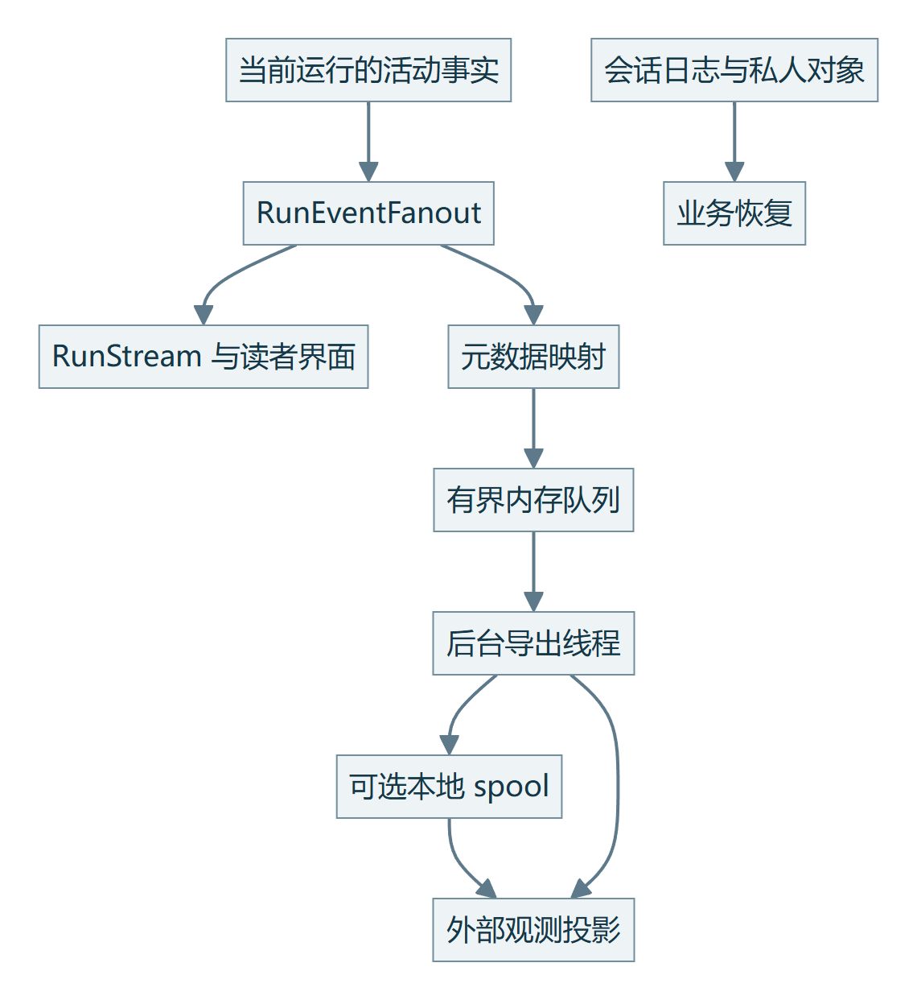

图中业务恢复使用第 16 章的日志与领域对象。外部观测不负责重放笔记、恢复模型执行或判定哪份聊天是权威历史。

[ActivityMapper](../../../crates/server/src/observability/mapping.rs)把每个 step 映射为稳定 span_id，后续状态增加 revision；父节点使用 parent_span_id。工具名经过注册表判断，用途经过允许集合判断，错误只输出有限格式的代码。书籍与会话在当前宿主生命周期内转换为不透明引用，活动 label、问题、模型正文和工具参数不进入映射。

[RequestTracker](../../../crates/runtime/src/request_diagnostics.rs)观察最终 Provider 请求，在同一 Run、同一用途内比较前后两次请求，输出第一个变化的消息位置、角色、字段种类、字节数，以及工具和设置是否变化。这使“第十三次调用缓存下降”能进一步定位到客户端哪个输入发生变化。输出的字节前缀是 JSON 比较结果，不是模型 tokenizer 或服务端 KV 缓存的测量。

<a id="ch21-s8"></a>

#### 观测失败为什么不能阻塞回答

[ObservabilityConfig](../../../crates/server/src/observability/config.rs)默认 off。仅有全局 LANGSMITH_TRACING 或 Key 不会开启它；metadata 模式另需项目与凭据，正式配置要求 HTTPS。配置无效时宿主保持业务可用，并通过观测状态报告错误码。

生产线程执行映射、序列化和一次短时入队，不同步等待外部网络。[BoundedQueue::try_push](../../../crates/server/src/observability/queue.rs)的容量判断是：

```rust
if state.items.len() >= self.limits.max_items
    || state.bytes.saturating_add(item.encoded_bytes) > self.limits.max_bytes
{
    return Err(QueueDropReason::Capacity);
}
```

当前默认队列最多 1024 项、4 MiB 编码正文，单项最多 64 KiB，单 Run 最多映射 512 个活动 span。达到上限便拒绝该观测项并记丢弃，不等外部服务腾位置。这里限制的是队列编码量和活动映射数量，不是整个进程的 RSS，也不等于全部会话或模型上下文的上限。

这个选择牺牲观测完整性来维持业务路径。必须同时保留 dropped、coverage、last_error_code，避免把“没有看到某工具”解释成“某工具没有执行”。根创建未入队时，这次外部观测不能继续建立可靠的子树；子项被丢弃时，运行仍继续，根的最终更新尝试带上已知的入队丢弃计数。

<a id="ch21-s9"></a>

#### 持久队列怎样恢复一棵未闭合的树

设置 UB_OBSERVABILITY_SPOOL_DIR 后，导出线程在发送项目前将它写入 spool。当前默认上限为 64 MiB、4096 文件、24 小时保留期；容量治理按完整旧 trace 淘汰，隔离材料也参与容量计算。正文先同步到临时文件，再发布文件名。

这里的“持久”有明确起点：生产线程入队成功时，记录可能仍只在内存；后台取出并 persist 成功后，才具备重启恢复依据。它没有把业务响应改成等待观测 fsync 的同步路径。

[export_loop](../../../crates/server/src/observability/mod.rs)先确认父节点创建，再发送子节点；更新也要等对应创建被确认。重试复用同一 ID 与 revision，[HTTP 传输](../../../crates/server/src/observability/langsmith.rs)将重复创建的 409 视为已经确认，避免在响应不明时另造一棵树。认证拒绝会停止本次运行时继续发送，其他可重试错误采用有限尝试。重试最多三次，等待窗口、单请求超时与退出预算分别控制不同阶段，不能合成一个“必在一秒内完成”的保证。

重启打开 spool 时，代码读取可用记录、隔离损坏项，并按观察时间及依赖阶段排序。如果根只有开始而没有终态，synthesize_interrupted_updates 补的不是业务成功：

```rust
observation.elapsed_ms = None;
observation.duration_ms = None;
observation.timing_source = TimingSource::LastObserved;
observation.execution_state = Some(ExecutionState::Interrupted);
observation.delivery_state = Some(DeliveryState::Unknown);
observation.persistence_state = Some(PersistenceState::Unknown);
```

这段代码来自 [spool.rs](../../../crates/server/src/observability/spool.rs)。补记使用最后可见的观察时间，另记 interruption_detected_at，并标 reconstructed。若程序昨晚退出、今天重启，不能把整夜离线时间填成模型执行时长。也不能因为观测根没闭合，就断言业务 JSONL 没有保存；两个存储的完成边界不同。

目标项目、endpoint 或 workspace 变化时，默认隔离旧材料，只有显式选择 replay 才向新目标重放。off 模式配合已指定 spool 目录会清理其管理的观测材料，而不是暂停后留待自动续发。spool 是专用导出暂存位置，不承担业务备份职责。

<a id="ch21-s10"></a>

#### 构建和评测为什么另有投影合同

构建侧已经有生命周期事件与用量回执，没有必要把读取一份旧回执伪装成“刚刚执行了一次模型调用”。[projectPrebuildReceipts](../../../packages/observability/src/prebuild-projector.ts)以 durable_receipts 为来源，分别保留 work_unit_id、physical_attempt、semantic_attempt、lease_epoch 和 submit_revision。一次租约重领、一次语义重试、一次候选修订因此不会被压成同一个计数。

时间来自已有事件：执行器开始与终态都在时标 recorded，使用其他事件推得的区间标 derived，无可用区间标 unavailable。实际 Provider 用量、执行器自报和 estimate 字段也分开。缺少历史 usage，不能用“这次投影生成了数据”补成已知费用。

[exportPrebuildObservations](../../../packages/observability/src/prebuild-export.ts)使用独立 ExportLedger 固定外部 run_id，只在确认调用完成后推进 revision。读取和导出不修改源构建回执。本轮固定客户端用例实际确认：重复版本跳过，新版本更新同一 ID，缺时间或客户端失败不记确认。

评测又多一层语义。[eval-adapt](../../../packages/observability/src/eval-adapt.ts)按系统与样本转换它支持的本地报告形状，保留数据集、程序和评委版本、计量来源及配对身份；[eval-feedback](../../../packages/observability/src/eval-feedback.ts)把未知和不适用保留为字符串状态，不改成零分。导入[入口](../../../packages/observability/src/eval-import.ts)要求匹配比较组、数据集、系统集合和内容字段的显式授权，并检查真实开始、结束时间。只有 elapsed_ms 的旧结果仍能在本地分析，但不会凭导入时刻捏造一段历史执行。

外部实验提交结果不明时，导入账本标 uncertain，后续调用不会自动重发同一个实验。这里没有沿用运行 span 的重试策略，因为两个外部写入合同不同。本地评分仍是任务和评分规则的权威，外部面板只消费投影。

<a id="ch21-s11"></a>

### 21.3 证据召回、引用支持、任务成功和实际动作

<a id="ch21-s12"></a>

#### 先明确读者究竟要求了什么

甲要求“解释条件，并保存可探索演示”，不能只检查文本里有没有出现条件名称。解释、来源、保存和可用成果是不同要求；某项做到了，也不能抵消另一项明确失败。

当前 [task-spec.mjs](../../../evals/semantic/task-spec.mjs)把旧题转成逐项要求，区分内容、准确、完整、解释、引用、动作和持久化。[分层评测决策](../../adr/0137-stratified-reading-evals-and-diagnostic-improvement.md)用 L1 定位提取、L2 解释与局部推导、L3 多证据整合、L4 情境诊断与迁移评价描述必要理解操作；single_turn、multi_turn、cross_session 另作交互条件。

重启后准确恢复一个原句，可以是 L1 加 cross_session；调用十次工具也不会自动变成 L4。能力分类来自任务要求，实际难度来自运行结果，不能用工程路径的复杂度代替理解层次。

正式产品输入只投影当前用户材料，金标准、参考证据与后续多轮脚本留在评测侧。这样才是在观察 Agent 如何完成问题；提前把答案或目标 LID 放入请求，会改变被测任务。

<a id="ch21-s13"></a>

#### 三个比例各自回答什么

[旧版 Agent 指标实现](../../../evals/semantic/agent-core.mjs)有三个相邻却不能互换的比例：

| 指标 | 分子与分母 | 它能回答的问题 |
| --- | --- | --- |
| evidence_recall | 被实际模型输入覆盖的必要参考证据组 / 全部必要参考组 | 参考依据是否真正进入过模型上下文 |
| citation_support | 正确且由有效交付引用支持的必要事实 / 全部必要事实 | 必要回答是否同时有正确内容和可用依据 |
| success_rate | 完整成功任务 / 全部任务 | 用户要求是否在该协议下整体兑现 |

observedEvidence 从实际请求的工具消息读取 accepted_evidence，再到 model_body 找能对应 canonical 原文的正文。只有 LID 或定位预览不算完整取证。reference 组是预先选定的代理依据，也没有穷尽所有正确替代段落。

来源必须实际进入最终 answer_view，并能经 source.resolve 得到有效原文。工具曾产生过一个 source_ref、答案裸写一个编号，均不能替代交付。旧自然事实判分还要求标注答句确实出现在回答里，不能让评委为它补答；加粗分隔符可以归一化，改了数值、词句或标点仍可能不通过。

用一个**教学样本**理解三者：三个必要证据组都进入模型，两个必要事实都答对，但只有一个事实附了有效引用。那么召回为 3/3，必要事实引用支持为 1/2，完整任务成功为 0/1。100% 召回不是成功率的同义词，内容正确也没有替读者完成查证路径。

<a id="ch21-s14"></a>

#### 当前评分怎样分开支持与定位

旧协议常把来源问题压进 grounding，容易混淆两种失败。某个来源弹窗的前后文确实包含必要公式，但高亮只有“损失”两个字：论断可以有原文支持，定位却让读者难以直接找到依据。

[task-quality-v2.mjs](../../../evals/semantic/task-quality-v2.mjs)把 citation 拆成 source_support 和 source_location。评委逐个实际论断给出 support、location 及 basis；basis 必须来自该候选实际交付的有效 C 来源，可以指定 highlight、before、after。公共 R 参考可用于核验内容，却不能替候选补一个没有交付的来源。

wire 协议要求评委给逐字 quote，由程序计算位置。resolveV2Basis 的关键部分是：

```javascript
const start = part.indexOf(basis.quote);
if (start < 0 || part.indexOf(basis.quote, start + 1) >= 0)
  throw new Error('Invalid source basis: quote missing or ambiguous in specified part');
return { source_id: basis.source_id, part: basis.part, start, end: start + basis.quote.length };
```

在执行这段之前，函数已确认来源有效、part 存在、quote 非空，而且评委没有自行填写 start/end。返回的位置按 JavaScript 字符串的 UTF-16 单位计算。原文不存在、同一部分重复歧义、引用公共 R 或把 after 的公式说成 highlight，都不能成为有效依据。

程序能保证依据位置可核验，语义是否足以支持论断仍需要判断。当前协议明确：来源视图完整，只表示保存的片段完整；若缺少决定比值方向的关键比较量，support 应为 unknown，不能从常识或答案自己的说法补齐。内容正确性与来源支持也分别判，不能只因某个 C 没有一句话，就断言答案内容错误。

任务汇总位于 [taskQualityReport](../../../evals/semantic/task-quality.mjs)：

```javascript
const task_result = audit.delivery === 'failed' || requirements.some(r => r.verdict === 'unmet') ? 'fail'
  : requirements.some(r => r.verdict === 'unknown') ? 'unresolved' : 'pass';
```

一个必要要求已经明确 unmet，另一项 unknown 不会把失败冲成未决；只有尚无已确认失败、却缺足够判断时才是 unresolved。评委超时、格式无效和未运行另有 score_status，不能直接写成模型内容错误。配对偏好采用两个候选顺序，顺序分歧留下 judgment_disagreement，不平均成一个假定胜者。

本轮固定评分用例实际确认了三种组合：支持通过而定位失败时任务失败；交付正常但评委超时时任务未决；来源缺必要前提时支持未知，而已经成立的内容准确项仍保持 met。它们验证评分程序的分账，不验证真实评委的语义能力。

<a id="ch21-s15"></a>

#### 动作必须由状态证明

“我已经跳转过去”只是一句话。navigationOK 要求实际请求里有成功的 reader.gotoLid 或 reader.scroll 回执，且最终视口覆盖目标原文。缺任何一项，都不能把自然语言声明算成跳转成功。

[agent-run.mjs](../../../evals/semantic/agent-run.mjs)的重启题更进一步：从空私人状态开始，让 Agent 自行保存；读取真实记录；停止进程；用同一私人根启动新进程；确认记录和位置；新建空聊天，再发送没有原答案的恢复要求。最后既检查原信息是否进入模型输入，也检查 Agent 是否正确复述。

评测器不替 Agent 写笔记。准备阶段失败也留在分母，不靠跳过难样本提高恢复率。生产正常记忆注入可以算观察，并不要求为留下漂亮轨迹而额外调用某个工具。

API 状态观察与真实界面又有区别。历史 [LA10](../../LA7-LA10%E5%AE%9E%E6%96%BD%E4%B8%8E%E9%AA%8C%E6%94%B6.md)曾通过浏览器连续操作发现：来源打开已改变视口，但漏存 session，重启回到旧位置；修复后才完成来源弹窗、显式跳转、保存和新聊天回放。后续脚本误等错接口、过早数 DOM 按钮也单独纠正，说明产品失败和验收程序失败都需要回到实际路径。

<a id="ch21-s16"></a>

### 21.4 产品对照、同环消融与归因

<a id="ch21-s17"></a>

#### 先看一次完整产品比较

历史 [LA7 报告](../../../evals/semantic/results/2026-09-08-la7/summary.json)比较同一部书、同配置模型上的完整 Resident 与普通 Chunk RAG。Chunk 使用 1000 UTF-16 字符分块、150 重叠、BM25、最多 6000 字符正文和一次回答调用；Resident 使用当时的生产工具循环、证据账本及来源交付。

两者问题和模型相同，但提示、工具、上下文和执行能力不同。这是产品比较，不是只增加图谱的实验。以下数字是 **2026-09-08 的冻结程序与 natural-facts-v2-bold-normalization 口径**，本轮只回读和复算：

| 指标 | Chunk | Resident |
| --- | ---: | ---: |
| 共同问答完整成功 | 20/24 | 15/24 |
| 共同问答 Provider 请求 | 24 | 200 |
| 平均实际 tokens | 未知，1 次缺 usage | 97,359.25 |
| P95 完成延迟 | 7.57 秒 | 114.85 秒 |
| Resident 的必要参考组召回 | — | 100% |

这组结果已经足以否定“只要找到全部依据，就一定能完成任务”的推断。LA7 还记录 Agent 内容正确率为 16/24，实际跳转 4/4，而来源题的内容、引用与动作完整通过仅 1/4。不同层次的结果必须分别保留。

成本分账也改变了优化入口：该批内层 query/synthesize 和 compaction 均为零请求；来源修复占 30 请求、75,151 tokens，无工具终答占 4 请求、41,249 tokens。不能看到总调用多，就先归咎于内层综合或压缩。

其中 contrast-03 的标注器把答案分号改成句号，逐字校验拒绝；source-04 的实际回答和来源支持“不可微”，标注字段却填成 true。旧严格分数保持，但失败解释不能写成 Agent 不懂这些内容。后来的局部修复复验又使用另一份程序，不能把通过题拼回原来的全量成绩。

<a id="ch21-s18"></a>

#### 同一循环下，增加结构定位是否更好

要判断图或树带来的变化，需要收窄其他变量。[LA9-v2](../../../evals/semantic/results/2026-09-08-la9-v2/summary.json)在同一 Agent 循环中比较 Text、Tree、Graph，三组共用模型、提示、正文预算和停止条件，按题轮换顺序。Text 只使用原文与词法定位；Tree 加确定性章节树和邻接；Graph 再加概念与关系定位。

三组共同关闭高层 query/synthesize、profile、memory、artifact 和模型 sidecar，定位预览不提供正文；真正的原文必须经相同 book.text 和证据闸。冻结条件包括 12 轮、300 秒、8000 输出 tokens、120,000 累计实际 tokens、20,000 终答预留、12,000 UTF-16 唯一正文预算。这些是历史消融合同，不是今天默认 Resident 的限制；当前 [OuterConfig](../../../crates/runtime/src/orchestrator.rs)默认 max_turns 为 None。

| 组 | 完整成功 | 证据召回 | 引用支持 | P95，秒 | 平均实际 tokens |
| --- | ---: | ---: | ---: | ---: | ---: |
| Text | 10/24 | 88.46% | 38.46% | 115.79 | 85,729.96 |
| Tree | 11/24 | 88.46% | 34.62% | 88.31 | 101,842.04 |
| Graph | 9/24 | 92.31% | 30.77% | 91.90 | 95,171.38 |

只比较最后一列，会发现 Graph 比 Tree 便宜约 6.55%；同时完整成功从 11 降到 9，就不能叫相同效果下的成本优化。Tree 相对 Text 新增四题成功、失去三题成功，净增一题；Graph 相对 Tree 新增两题、失去四题，净少两题。配对变化比三个总分更能指明下一步看哪些轨迹。

Graph 的两道新增成功都实际先用了 book.concept，随后回读原文并交付来源，这支持它在那两次运行里提供了有用定位路径。但两题 Text 也通过，四道跨章题三组又全部未完整成功。因此该实验没有证明图谱普遍改善跨章理解，更不能归因于某条具体图边。

历史裁决是保留 LID 与证据闸，明确措辞优先词法，已知章节需要展开时按需使用树，概念候选按需要使用。没有为了得到更好的表面分数而扩大默认图谱使用或追加预算。

<a id="ch21-s19"></a>

#### 成本回收必须先满足可比条件

LA9 的历史[预构建记录](../../../evals/semantic/results/2026-09-08-la9-v2/prebuild.json)有 530 次尝试，但全部历史实际 Provider 用量不可用；各执行器区间还可能并行重叠。书目录的 34,814,058 字节包含原文、语义资产和构建历史，不是图谱独有的增量体积。

若用教学模型表示一次性额外构建成本为 B，每次阅读节省为 Δ，则在任务效果可比、模型单价和材料版本等条件固定时，候选回收次数可以写成 `B / Δ`。这批证据里 B 未知，也没有同成功水平下的正向 Δ，所以不能代入一组估计数，宣称“读多少次就回本”。

同理，P95 要保留任务分母。[percentile](../../../evals/semantic/core.mjs)使用 nearest-rank；24 个任务取排序后第 `ceil(24 × 0.95) = 23` 个，而不是只在成功样本里取一个更好看的尾部。失败和超时都留在完成延迟记录，启动、预构建及事后判分另计。

[runTimedProduct](../../../evals/semantic/eval-timing.mjs)对成功和失败采用同一个边界：墙钟记录起止，单调时钟测 elapsed_ms。多段重启或多轮任务的 elapsed_ms 可以是实际请求区间之和，不能从最早和最晚的墙钟时间反推它必然包含两段之间全部等待。导出与阅读报告时必须保留这层口径。

<a id="ch21-s20"></a>

#### 缓存观测说明了什么

[2026-10-03 Linux 记录](../../%E4%BF%AE%E5%A4%8D%E8%AE%B0%E5%BD%95-Linux%E7%BC%93%E5%AD%98%E8%A7%82%E6%B5%8B.md)分析一轮真实演示请求的 18 次模型调用：累计输入 1,277,397、缓存输入 925,568、未命中输入 351,829、输出 80,335。加权输入缓存命中率为：

```text
925,568 / 1,277,397 ≈ 72.4573%
```

不能先算十八个百分比再做等权平均，因为每次输入大小不同。第 12、13、17 次合计贡献 247,443 个未命中 tokens，占全部未命中的约 70.33%。请求差异把这些变化连接到旧预检查清理和活动工具正文淘汰，给出了具体回读入口。

同一记录还有一次观测接线的修正：独立 canary 能成功上报，正式多人入口却没有创建 ObservationRun。后来接到真实 Host、准入、运行和保存路径，才确认该入口的观测链成立。当前源码已有这条接线，本轮正式准入用例也经过它；不能把较早“未接通”留作当前结论。

这些历史数字也不能证明修复后缓存率提高。前后任务不同，模拟 canary 的 1000 输入、800 缓存是固定夹具。要评价缓存改动，需要比较实际输入量、缓存量、输出量和同任务效果，单独提高百分比并不一定减少总费用。

<a id="ch21-s21"></a>

### 21.5 从失败轨迹确定下一项改进

<a id="ch21-s22"></a>

#### 缺证据，还是有证据却没有交付好

一个任务失败后，最有价值的下一步往往不是再跑同一个问题，而是提出能区分原因的干预。

历史 [EV5—EV6](../../performance/agent-eval-ev5-ev6-20260925.md)选择 target-l2：原 Resident 的内容要求通过，来源要求失败。EV5 把前两次模型工具决策改成脚本化定位和读取，仍使用真实 book.search_text 找唯一范围，再把返回的 LID 交给真实 book.text。之后模型继续自然执行。这个干预问的是：“如果一开始合法获得必要原文，后续来源组织还会失败吗？”

[evidenceIntervention](../../../evals/semantic/diagnostic-core.mjs)没有把金标准答案写进用户问题，也没有伪造证据账本。但它改变了前两次决策和上下文，所以结果只能作为诊断。历史有效运行确实读到 660 个 UTF-16 字符的必要原文并交付可打开来源；评委却把冻结英文枚举写成中文释义，导致旧字面比较与其他维度冲突，最终复核记为评分未决。来源失败未重现，不等于整项诊断已通过。

EV6 则从两系统实际模型请求抽取各自真正见过的 canonical 原文，合并重复区间，以相同顺序和 6000 字符预算送入共同回答器。它问的是：“已有证据集合本身能否支持合格回答？”

历史中，Resident 的 1362 字符证据集合经共同回答器得到 pass；Chunk 的 5550 字符集合因同类枚举冲突保留未决。两种顺序的偏好都为 tie。这个结果支持优先检查 Resident 自然路径的引用绑定与终答组织，不支持宣称 Resident 检索一定更好。

“运行中曾看见依据”与“最后一次决策时仍保留依据”也要分开。共同回答器重新组织了一份输入，不能当作原 Agent 终答上下文的原样重放。第 11 章的正文降级、压缩和动态片段都可能改变后续可见信息。

<a id="ch21-s23"></a>

#### 先修量尺，再谈分数增长

EV3—EV4 的[历史首轮](../../performance/agent-eval-ev3-ev4-20260925.md)在 8 道单轮与两个同聊天多轮任务上得到 18 个系统样本：Chunk 6 通过、2 失败；Resident 1 通过、7 失败、2 未决。其中多项旧来源失败混合了支持和定位，不能概括成理解能力失败。

此后 CQ 系列修订来源与评分合同。[CQ8](../../performance/source-delivery-cq8-20260926.md)把模型猜数值区间改成逐字依据定位，重新校准已有人审的判例；第二版十个既有判例方向一致，但九个开发诊断只有七个标签完全一致，另外两案的分类差异保留。结构有效的评分与语义可靠的评分仍是两件事。

旧答案经新量尺复评，应生成新版本报告，保留全体样本和旧分数。它能说明量尺修正后的判断，不能把分数上涨当成重新生成答案后的能力提高。评委、协议或适用任务范围改变时，也不能自动继承旧校准许可。

<a id="ch21-s24"></a>

#### 一项实验可以以撤回候选完成

ADR-0137 的较早状态仍写 EV7 待实施，但[2026-09-26 EV7 记录](../../performance/agent-eval-ev7-20260926.md)已经记载完整实验与撤回结果。

该实验只修改收尾提示的一项范围表达，假设模型把“用户没有给实现细节”误当成“全书没有依据”，从而添加过强否定。旧版和候选使用固定程序，各跑开发迁移题、新题族、简单解释及应保留不确定性的控制题，共六对十二份首次回答，交错顺序，不根据结果追加试跑。

预定保留条件要求四对迁移题至少两对改善范围，并保留关键内容与来源。实际只有一对明确改善、两对持平、一对未决；候选还在缺参数控制题中增加了未经核验的章节事实。于是实验完成，候选撤回。当前 [agent_prompt.rs](../../../crates/runtime/src/agent_prompt.rs) 的 FINISH_POLICY_REVISION 仍为 v7，与该记录的恢复结论相符。

十二份回答都完成交付，65 条来源的位置核对通过，并没有改变这个裁决：位置正确和交付完整，没有代替范围与内容要求。历史语义核查由 Codex 逐份对照材料完成，不是新题族已经取得人审校准的正式自动评分。

这类结果对架构判断有直接价值。它说明一个具体假设下的提示改动没有足够收益，保留现状比继续修改直到“跑出成功”更能维持证据的含义。实验结束之后，新题族也已经参与观察，不能继续声称它从未被看见。

<a id="ch21-s25"></a>

#### 本轮验证及当前记录器缺口

本轮实际通过 15 个 Server、4 个 Runtime 定向用例，覆盖活动边界、末份用量、元数据映射、入队拒绝、spool 恢复，以及真实多人准入的成功、模型失败和保存失败。评测侧执行 23 个既有 Node 用例，覆盖计时、用途分账、实际证据、逐字依据与评分状态；观测包另选 8 个 TypeScript 用例，7 个未选中。所有外部响应均为固定或脚本化输入。

另一个书稿内重放直接调用当前 startProviderRecorder：本机返回合法 SSE，正文携带 total_tokens=13，转发后的字节保持一致，但 measuredUsage 得到一个缺失项和未知总量。[provider-recorder.mjs](../../../evals/semantic/provider-recorder.mjs)当前先 await upstream.arrayBuffer，再对整份响应做 JSON.parse；SSE 进入 non_json_response，因此没有抽取流帧里的 usage。整包缓冲也使这个代理不能作为真实首片段延迟的测量路径。

这与生产 [provider_stream.rs](../../../crates/runtime/src/provider_stream.rs)能读取 SSE 用量并不矛盾：两者是不同采集器。因此，旧报告的“缺 usage”只能说明该记录渠道没有得到数字，不能直接断言 Provider 从未发送。当前 measuredUsage 的保守汇总是：

```javascript
return { requests: records.length,
  total_tokens: records.length > 0 && records.every(r => Number.isFinite(r.usage?.total_tokens))
    ? records.reduce((n, r) => n + r.usage.total_tokens, 0) : null,
  missing_usage: records.filter(r => !Number.isFinite(r.usage?.total_tokens)).length };
```

未知总量没有补零是正确的；采集器适配仍是需要单独处理的实现缺口。本章只保留复现和结论，没有修改它。新增书稿重放一项，加上上述 50 个既有用例，共 51 项通过；详细日志及适用范围见[本章验证记录](../SOURCES.md#%E7%AC%AC-21-%E7%AB%A0%E7%BB%AD%E5%86%99%E9%AA%8C%E8%AF%81%E8%AE%B0%E5%BD%95)。没有运行真实模型、浏览器、付费评测或外部上传。

<a id="ch21-s26"></a>

### 已知边界

1. **活动树不等于所有成本。** 观测根不覆盖全部接单排队，模型活动可以包含许可与网络等待，父子持续时间不能直接累加；浏览器绘制、锁等待和后台复核需要各自的观察。Provider 用量、估计 tokens、磁盘字节和网络字节不能互换。

2. **导出采用有限完整性。** 入队到 spool 落盘之间存在内存阶段，限额、退出和发送失败都可能丢记录。当前根终态确认后会清理整条 spool；此前个别子项发送失败，也不会因此获得无限重试。根中预先组装的 dropped_count 主要来自入队和映射拒绝，后台发送失败进入运行时全局统计，不能仅凭外部根的 coverage=complete 断言整树完整。

3. **退出预算不是抢断正在进行的网络请求。** 当前请求超时默认十秒，退出排空预算默认两秒；已经进入传输的调用不会因后来开始 shutdown 而自动改用更短超时，join 仍要等待它返回。队列到期清空的项也没有逐项增加 dropped，因此状态计数不能替代逐项完整性证明。本轮未测真实外网超时或掉电。

4. **观测没有提供完整业务审计或质量裁决。** 元数据不含问答正文，不能据此判断解释真假；业务日志恢复和观测补记分别进行。构建与评测各有投影合同，eval-adapt 当前接受旧 quality 报告形状，不能把新 task-v2 报告原样当作相同导入对象。跨宿主重启的不透明引用也不是永久业务主键。

5. **当前评测代理不能完整计量流式响应。** 整包缓冲与 JSON-only usage 提取已由本轮 SSE 固定响应确认。历史缺失保持未知，不据当前发现补造旧费用；本地完整请求记录也不同于允许外发的元数据，外部导入另有内容范围合同。

6. **历史效果有明确范围。** LA7、LA9、EV4、CQ、EV7 属于不同程序、题集或评分协议；单书、小样本、模型评委和开发负载限制推广。AGENT_EVAL 的默认十二轮文字已落后于当前实现，ADR 中 EV7 状态也落后于后续记录。引用可核验、答案合格、演示能播放与读者真正学会，仍需不同证据。本轮没有重跑历史实验或修改产品。

<a id="ch21-s27"></a>

### 面试时怎样解释本章

1. **怎样排查一次 Agent 请求为什么慢？**

   先固定起止边界，再沿活动树区分顶层与嵌套调用。模型活动包含客户端可见等待，多人环境还可能包含许可等待；父工具已经包含子模型时间。用接单、执行、提交和前端时间回答不同问题，缺哪段观察就补哪段，不能从总耗时猜锁占用。

2. **为什么执行完成、交付成功和保存成功分开记？**

   模型与工具运行结束后，来源编译仍可能失败；结果形成后，终态落盘也可能失败。三维状态能准确定位重试和用户提示，完整任务质量再由要求和结果判断。观测重启补记只说明可见记录中断，不替业务日志作结论。

3. **怎样避免流式用量重复计费？**

   每个实际调用只保留最后一份累计 usage，再按调用身份汇总。缓存输入和思考输出是各自总量的子项；失败调用保留已知快照，缺失不补零。估计值用于容量规划，与 Provider 报告和真实账单分列。

4. **外部观测平台故障会怎样影响阅读？**

   生产路径只做元数据投影和有界入队，外部网络在后台。满队列会丢观测并记录状态，业务仍继续。spool 提供已落盘记录的重启重放，但入队尚未落盘的记录和此前失败子项有完整性边界；它不是业务日志的副本。

5. **为什么召回 100% 仍然可能失败？**

   召回只说明参考依据进入过模型输入，不能保证最后决策仍保留它、答案正确、来源交付完整或动作完成。LA7 的历史例子就是 100% 参考召回、15/24 完整成功。应按内容、来源、交付、动作和评分故障拆开看。

6. **如何避免把评委错误算成产品错误？**

   保存评分原始输出、协议版本和逐项依据，程序验证答句及来源位置。评委超时或格式错误保持评分状态；无已确认失败而判断不足时记未决。语义校准与结构校验分开，量尺改变后统一复评完整样本，不覆盖旧结果。

7. **完整 Agent 比 RAG 好，能说明图谱有效吗？**

   不能直接归因，因为提示、工具、上下文和循环合同同时不同。项目另做 Text/Tree/Graph 同环消融，固定预算并看新增及失去成功。历史 Graph 提高了参考召回，却没有提高完整成功，这支持按需使用定位能力，不能宣传普遍图谱收益。

8. **怎样从失败决定下一项改动？**

   先提出可区分的假设。充分证据干预观察后续交付，共同回答器观察已有证据集合的效用；它们不替换产品成绩。若怀疑提示，冻结单变量、配对和退化条件，保留首次结果。EV7 未达到预定改善门槛，撤回候选，就是有结论的实验。

9. **这本书实际验证到了哪一层？**

   当前源码的定向验证使用固定模型响应、本机 HTTP、临时文件、受控事件和评分夹具，51 项通过，并确认评测代理的 SSE 用量缺口。真实质量、缓存和部署结果引用有日期与条件的历史记录；本轮没有真实模型费用，也没有把程序断言当作学习效果。

第五篇至此完成：宿主让长任务与读者操作同时推进，多人服务限定归属与资源，发行流程组装可维护的程序和数据，而观测与评测帮助判断它是否值得继续改。下一章进入[第 22 章：关键决策及其演进](#ch22)，把这些机制放回需求和证据中，讨论当时为何这样选，以及什么变化值得重新作出选择。


---

<a id="ch22"></a>

## 第 22 章 关键决策及其演进

上一章已经能沿一次运行回答三个问题：时间花在哪里，用量如何结算，结果是否满足任务。现在把镜头拉远一点。读者甲打开一本完成构建的书，让 Agent 解释跨章概念、制作演示并保存；读者乙同时在另一窗口提问。为什么这个过程由 TypeScript 构建、Rust 运行、JSON 文件交付、SQLite 接单和 JSONL 聊天日志共同支撑？为什么早期说不做向量索引，后来又出现 embedding？为什么去掉十二轮上限，却仍然强调停止？

这些问题不能用“Rust 快”“图谱准确”“事件日志可扩展”几句口号回答。每个选择都在承担一项具体责任，也在留下相应成本。同一个选择在单机插件、多人阅读和长期任务三个阶段，面对的条件可能已经不同。

本章回答：**在当时的需求和证据下，为什么选择当前结构？** 我们沿甲的任务回看五组决定：先把准备材料和阅读运行分开，再区分位置与语义，接着解释持续执行需要哪些状态，最后追到保存和多人归属。历史理由取自有日期的 ADR；当前行为回到实现；对替代方案的推演明确作为分析。

<a id="ch22-s1"></a>

### 22.1 构建与读时的语言和边界

<a id="ch22-s2"></a>

#### 读一本书，为什么不要求构建执行器一直在线

甲打开书时，需要原文、章节结构、语义候选和已保存的私人状态。他不需要重新生成一遍整书抽取结果，也不需要知道那次构建由哪个 Harness 执行。最先需要稳定的，因而是准备工作与阅读工作之间的交付物。

[ADR-0001](../../adr/0001-%E6%9C%AC%E5%9C%B0plugin%E5%BD%A2%E6%80%81.md)在 2026-06-21 确定本地插件形态，理由是当时没有自建托管服务、容量和计费的需求。同一天的补充又澄清：插件启动的 localhost 阅读进程仍属于本地形态；预构建可以绑定 Claude Code 或 Codex，读时阅读器应与 Harness 脱钩，允许另选模型后端。

这一补充很关键。“本地插件”没有把所有后续阅读都锁进一次外部 Agent 会话。构建负责形成可消费材料，读时负责在材料上执行读者的当前任务。后来出现 Linux 多人入口，变化的是运行宿主、身份和部署；这条材料交付边界继续存在。

当前 [build-orchestrator.ts](../../../packages/core/src/build-orchestrator.ts)负责路由构建阶段、组织工作单元和接纳成果。以 technical_learning 的 BookStructure 为例，routeBookStructureProductionStage 根据 profile 选择发现和组织合同，已有候选、阶段状态与发布条件由 Core 持有。模型生成一个候选，不等于它已经成为读者正在使用的成果。

[publishAutomaticBuildArtifactSet](../../../packages/core/src/automatic-build-publication.ts)把候选文件写入暂存位置，调用候选校验，再逐项提升到正式位置并留下发布回执。它属于构建工作区内的成果发布。Linux 的 [PublishedLibrary](../../../crates/server/src/published_library.rs)还会登记一次不可变书库发布，这两个“发布”不能混成同一操作：前者收口构建成果，后者建立网络阅读可引用的材料版本。

读时 [Book::new](../../../crates/read-tools/src/lib.rs)消费已经装载的 ReadOnlyBase 与原文，构建自己的 LID 和节点索引。阅读请求不需要回到 TypeScript 执行器查询某个正在变化的构建对象。

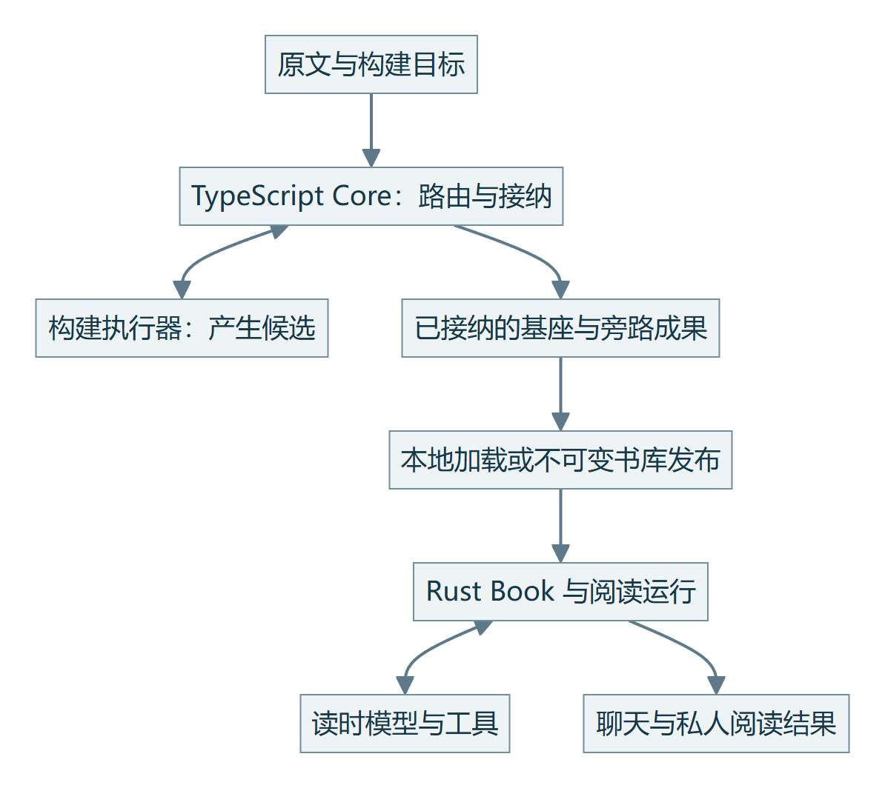

图中并不是“一边有模型，另一边没有模型”。两边都可能调用模型。区别在于构建调用为可复用材料服务，读时调用为当前读者和当前任务服务；两者具有不同的输入、身份、重试和保存责任。

<a id="ch22-s3"></a>

#### 语言分工是交付边界上的选择

2026-06-22 的 [ADR-0021](../../adr/0021-%E5%AE%9E%E7%8E%B0%E6%8A%80%E6%9C%AF%E6%A0%88-%E9%A2%84%E6%9E%84%E5%BB%BAts-%E8%AF%BB%E6%97%B6%E5%90%8E%E7%AB%AFrust-%E5%89%8D%E7%AB%AF%E5%BE%85%E5%AE%9A-%E5%9F%BA%E5%BA%A7schema-rust%E6%9D%83%E5%A8%81ts-rs%E7%94%9F%E6%88%90.md)在这条边界上选择 TypeScript/Node 预构建与 Rust 读时后端。记录中的理由包括：构建侧书籍解析、确定性文本处理与 Harness 编排的生态；读时侧希望借鉴 Codex 的运行循环、Provider 和记忆实现；冻结产物使跨语言接缝主要表现为材料交付，而不是在一次采样中频繁互调两套可变对象。

这是当时的技术选择依据，不能改写成“项目已经完整移植 Codex”，也不能当作 Rust 相对 TypeScript 的延迟实测。当前 [runtime 依赖](../../../crates/runtime/Cargo.toml)与[server 依赖](../../../crates/server/Cargo.toml)对应本项目自己的 crate 和运行实现；Server 使用 tiny_http 等实际组件。ADR 中列举的参考库、待选前端与增量设想，需要分别核对后续落地。

今天的前端入口 [main.ts](../../../packages/web/src/main.ts)已创建 Vue 应用，并按构建配置选择本地或多人界面。第 20 章的 Tauri 桌面宿主和 Linux Web 服务也已经存在。因而“前端待定”只能放在决策形成时的叙述中，不能作为当前架构状态。

这套分工付出的代价很具体：仓库需要维护 Cargo 与 Node 两条工具链，文件格式变化必须同时考虑生产方和消费方，发行过程要组合相容版本。它获得的是两侧独立运行与明确的材料边界。若只是为了让一次等待远程模型的请求更快，换语言并不能直接缩短 Provider 的计算和网络等待；第 18 章的关键路径分析仍然适用。

<a id="ch22-s4"></a>

#### 类型统一之后，为什么还要统一坐标单位

跨语言交付的真正风险不是文件扩展名，而是两侧用相同字段表达了不同含义。例如 start=3、end=4 究竟表示字节、Unicode 码点，还是 JavaScript 字符串单位？

[base-schema](../../../crates/base-schema/src/lib.rs)把 Span 定义在 Rust，再生成 TypeScript 类型。下面是实际声明：

```rust
#[derive(Debug, Clone, PartialEq, Serialize, Deserialize, TS, JsonSchema)]
#[ts(export, export_to = "../../../packages/core/src/generated/")]
pub struct Span {
    pub start: usize,
    pub end: usize,
}
```

生成的 [Span.ts](../../../packages/core/src/generated/Span.ts)使用 number。两侧共享的语义是 UTF-16 code unit 的半开区间；Rust 的 Book 在加载时把原文转成 `Vec<u16>`，text 按同一单位切片。

用一个**教学源串** `A😀中B` 看这个约束。它有四个 Unicode 码点、五个 UTF-16 单位、九个 UTF-8 字节。“中”的 UTF-16 区间是 `[3,4)`，UTF-8 字节区间是 `[5,8)`。若字段形状完全正确，却把前一组下标交给字节切片，仍然会读错。

因此，Rust 权威类型和生成代码减少的是字段漂移；它们不自动证明区间次序、原文覆盖、来源支持或模型语义正确。当前候选接纳、来源校验和读取合同继续承担这些责任。JSON 在这里是可检查、可分发的交付格式；是否改成二进制，应由材料加载的真实瓶颈决定，不能仅由“二进制通常更快”推出。

<a id="ch22-s5"></a>

### 22.2 原文身份、语义图和检索方式

<a id="ch22-s6"></a>

#### “找到哪一段”和“这段说明什么”为什么分开

甲要求解释跨章概念。一个合理的系统需要先找到可能相关的段落，再读取原文、判断条件和关系，最后把选定来源交给读者。前一个位置选择错了，可以换检索策略；已经交付的笔记和引用却不能随着每次策略调整失去落点。

这正是 [ADR-0123](../../adr/0123-lid-foundation-and-reliable-agent-completion.md)在 2026-09-08 明确保留 LID 坐标层、让图谱投入接受增量收益检验的原因。因整套 Agent 表现不好就删除 LID，会破坏原文寻址和私人锚点；因为 LID 有用就保留全部语义复杂度，又把位置真实性误当成了任务效果。

当前 Book 的 `lid_idx` 和 `node_idx` 分别连接位置节点与图谱节点。concept_candidates 提供概念候选，text 取原文，来源账本和公开编译再确认本轮可使用的引用。链路中的三项事实因此各有边界：有位置，表示可以寻址；看过原文，表示本轮有可用材料；用它支持回答，仍需要语义选择和实际交付。

第 21 章的历史 LA9-v2 提供了一个有用的反例：Text、Tree、Graph 同环对照的完整成功分别为 10/24、11/24、9/24；Graph 参考召回更高，却没有带来更高的完整成功。这个结果支持检查图谱的具体使用范围，不支持“所有语义结构都应删除”，更不支持“定位坐标没有价值”。它是当时单书、固定程序与预算下的实验，今天仍应保留这些条件。

<a id="ch22-s7"></a>

#### 早期不做 embedding，后来为何又做

2026-06-21 的 [ADR-0002](../../adr/0002-%E5%9B%BE%E8%B0%B1%E4%B8%AD%E5%BF%83-%E7%A0%8D%E5%90%91%E9%87%8F%E7%B4%A2%E5%BC%95.md)否决向量索引，重点并非 cosine 运算本身。当时本地插件的条件下，生成 embedding 需要新增外部服务、凭据与数据传输，或者安装本地模型并承担计算。已有图谱与词法定位能否满足阅读任务，是先要验证的问题。ADR 同时留下了回头条件：若转述查询的召回不足，再评估可选增强。

这份早期记录还提出“图谱给出关系，比相似更贴近引用支持”的判断。结合后续实现，应将它理解为设计假设：模型抽出的边也可能错误，只有端点存在并不能证明关系成立。引用仍须回到原文和回答中的具体主张，不能由图边名称直接授予可信度。

到 2026-09-30，[ADR-0149](../../adr/0149-%E6%9E%84%E5%BB%BA%E6%9C%9F%E8%AF%AD%E4%B9%89%E5%80%99%E9%80%89%E5%8F%AC%E5%9B%9E%E4%B8%8ECore-owned-Embedding-Provider.md)针对另一个明确问题重新引入 embedding：构建期 T5A 正式对象的跨块对齐。不同块可能用不同措辞描述同一候选，旧 catalog substring 查询会漏掉应该拿来比较的对象。新增召回把候选交给 Agent 比较，Core 仍要求参与对象、已读原文和引用覆盖符合接纳条件。

这是对旧决定的限定修订。它没有宣布所有读时查询改成向量 RAG，没有让相似度自动合并对象，也没有增加一个独立顶层检索构建阶段。随后 [ADR-0151](../../adr/0151-book-structure-global-outline-and-semantic-retrieval.md)让 BookStructure 成为另一消费者，共用 Provider、缓存、融合和准备机制，却保留自己的候选含义与证据规则。

可以把当前责任沿一次候选处理拆开：

| 环节 | 产出 | 没有随之获得的权力 |
| --- | --- | --- |
| 词法或语义召回 | 可能相关的候选身份与位置 | 不决定对象相同，不决定主题依赖 |
| inspect、read | 完整对象或实际原文材料 | 不自动接纳某次合并或新主张 |
| Agent 提交 action | 对关系、身份或章节取舍的判断 | 不直接写入最终公共结构 |
| Core 接纳与组装 | 符合当前合同的状态和成果 | 不证明开放语义判断绝对正确 |

<a id="ch22-s8"></a>

#### 为什么 Provider 由 Core 准备，而不是藏在搜索按钮后面

构建进度读取、剩余工作预览和候选接纳都会访问检索状态。如果任意一次“查看下一步”都能隐式调用 embedding，费用、取消和恢复就失去了可解释的边界。

当前 [prepareBuildRetrieval](../../../packages/core/src/automatic-build-retrieval.ts)位于已授权的异步准备路径。入口先核对确认状态与配置：

```typescript
if (plan.status !== "confirmed" || !retrievalConfigurationMatches(plan, runtime)) throw new Error("retrieval authorization mismatch");
```

这行之前的调用者还要确认当前可达阶段，之后还会检查消费者、数据范围、Provider 身份、预算和取消。书稿不能只截取这一行，就把整套授权描述成一个布尔开关。

[retrievalPreparationMatches](../../../packages/core/src/semantic-retrieval-preparation.ts)则用完整依赖决定已有准备结果能否复用：

```typescript
return prepared?.version === "prepared_formal_object_retrieval.v1" && isDeepStrictEqual(prepared.dependencies, dependencies);
```

依赖包括当前目录记录、query、模式、Provider 身份、投影版本与策略。相同准备可供分页与读取复用；目录或查询改变时重新判断。模型 action 的复用与向量缓存也分别处理，不能因为旧页面看起来相同，就把旧目录的完整后状态覆盖回来。

[retrieveHybrid](../../../packages/core/src/semantic-retrieval.ts)先按当前 canonical key 过滤与去重，保留 exact/alias，再交替补入词法与语义候选，最后分页。默认每页六项，semantic_top_k=12 限制语义新增贡献，不把所有精确命中截成十二项。空查询保留完整目录浏览，也不需要 embedding。

BookStructure 的 [projectStructureRetrieval](../../../packages/core/src/book-structure-retrieval.ts)进一步区分短向量文本、完整词法字段和原文位置。候选含义、条件和别名的向量投影分别取有限前缀，但完整字段仍可搜索和展开。投影压缩服务召回成本，不删除正式候选内容；搜索预览也不会扩大已交付证据范围。

本轮六项 Core 定向用例实际确认了这些区别：精确与别名优先、无效或重复 key 不占候选通道、分页复用准备、只改完整词法字段时刷新候选但复用未变向量、未确认计划零调用、词法及空浏览零调用。全部使用固定向量和临时材料，验证的是管线合同。

<a id="ch22-s9"></a>

#### 为什么“召回变好”没有直接改变默认模式

[SR6 历史记录](../../performance/semantic-retrieval-20260930.md)提供了一个非常具体的决策证据。固定 28 条记录、8 个查询的排名比较中，A/B 的 recall@6 为 12.5%，加入留存真实向量的 C 为 100%；但是两轮完整身份对齐并没有得到三组可比的完成结果，长材料验收也未完成。记录给出的发布结论仍是保持 lexical_only。

这不是否认排名增益，而是承认“把对象找出来”和“在完整循环中正确处理身份”之间仍有工作。未完成组的身份质量保持未知，不能从一张排序表补造出来。

BookStructure 的 BSR7 又是另一份证据：它完成了特定书籍的两组全书结构交付，按当时用户选择以 embedding 组为主成果，词法组保留对照。该[报告](../../performance/book-structure-bsr7.md)同时保留实际模型 usage 未知、生成者查询不同等限制，因此不能外推为一般费用下降，也不自动改写 T5A 的验收状态或产品默认。

真正被保留下来的架构判断是：公共原文和候选内容有稳定身份；召回策略可以替换；每个消费者用自己的任务效果决定是否启用。把某一实验的成功扩散成所有路径的默认依赖，会越过这三个边界。

<a id="ch22-s10"></a>

### 22.3 轮数限制、活动上下文和任务进展

<a id="ch22-s11"></a>

#### 第十三次调用为什么不能天然代表失败

回到甲的任务。解释需要读取若干段原文，演示还要经历制作、预览、观察和修订。若第十二次采样刚好完成一个有效修正，第十三次已经有明确下一步，仅凭次数结束会中断有用工作。反过来，模型可能两次就陷入同样的空答，此时把上限从十二调到六十四，只会让错误重复更久。

[ADR-0150](../../adr/0150-resident-unbounded-tool-loop-and-progress-stops.md)在 2026-09-30 修订默认轮数硬闸：普通 Resident 默认持续执行；任务交付、取消、实际无进展、上下文处理失败和不可恢复错误分别决定如何结束。显式有限调用配置与实验预算继续保留。

当前 OuterConfig 的 max_turns 是 `Option<usize>`，默认 None。实际检查很短：

```rust
fn turn_limit_reached(self, turns: usize) -> bool {
    self.max_turns.is_some_and(|limit| turns >= limit)
}
```

这段代码位于 [orchestrator.rs](../../../crates/runtime/src/orchestrator.rs)。它表达的是“调用者设置限制时才检查”，没有表达“不再需要停止条件”。旁边保留的 token_budget 字段属于旧调用配置；不能只看到默认值 120_000，就把它重新解释成当前普通运行的累计 Token 停机线。

本轮实际执行 unbounded_default_continues_past_twelve_samplings_to_completion。固定模型脚本先定位，再读取十四段，最后回答，共十六次采样、十五条工具轨迹，得到非 incomplete 的终态。它证明当前控制流允许有进展的长任务越过十二轮；它没有测量真实模型在长任务中的成功率。

<a id="ch22-s12"></a>

#### “还在忙”与“发生了可用变化”有何区别

如果只取消轮数判断，另一个问题马上出现：模型反复说“演示已完成”，却没有交付任何页面，循环为什么还会继续？

当前 tool_progress_signature 从运行事实组装进展：定位项、已接纳正文范围、来源绑定、能力激活、综合与阶段事实、私人投影、Reader 状态、实际效果和制作上下文。ToolCallProgressGuard 用规范化参数和进展状态识别重复调用；ProgressPhaseGuard 记录连续没有状态变化的批次。仅调换 JSON 参数顺序不会因此产生新进展。

连续无进展阈值当前为两个批次。遇到符合条件的定位错误时，还有受限的合法恢复路径，允许一次定位或经授权的回读来恢复工作；真正发生变化才重置停滞状态。停止之后的无工具收尾继续受协议与交付检查约束，不能无限再开一轮工具循环。

文字终答缺少必要页面或 Reader 操作时，也进入同一个无进展判断。否则，工具路径受约束，文字路径却可以不断重试，默认不限轮数就会留下一个明显缺口。本轮另外四个 unbounded 用例实际确认：重复文字不冒充交付；真实定位和导航可以恢复推进；工具停滞说明实际原因；文字与未变工具共同累计停滞。

这里的进展仍是工程判据。新增一条合法证据，不自动证明推理质量更好；状态变化可以给执行提供继续的理由，却不能取代第 21 章的任务评分。默认持续执行也没有由此获得总时长或总费用保证。

<a id="ch22-s13"></a>

#### 为什么累计用量不能作为上下文容量

长任务要持续，下一次请求必须能装进模型窗口。但“已经花了多少 tokens”与“这次要发送多少 tokens”不是一个量。

做一个**教学算例**：十二次调用，每次输入都为 20,000 tokens，则累计输入为 240,000。若大部分是重复前缀，它们仍分别进入了十二次账单记录；当前任意一次请求却只有 20,000 输入，而不是 240,000。输出预留、安全余量和其他输入尚需另外计算。仅凭累计值超过 120,000，就不能证明当前窗口装不下。

[ActiveContextBudget::from_plan](../../../crates/runtime/src/auto_compaction.rs)从当前 AgentRequestPlan 的估算输入出发，加输出预留与安全余量，判断容量和压缩水位。累计 Provider usage 留作观测。多人服务后来也按 ADR-0150 §3 删除累计调用数与 Token 停机逻辑，继续保留公平并发、取消、授权及单次输出约束。

这项选择的代价是默认运行没有累计费用硬上限。若以后确实需要用户指定费用或时间预算，应把预算作为独立产品合同：明确从何时计、包含哪些内层调用、缺失 usage 如何处理、停止后交付什么。不能把上下文水位偷偷当作费用预算，也不能把历史实验显式设置的预算推广成所有生产入口的规则。

<a id="ch22-s14"></a>

#### 历史、当前输入和可重新取得的正文为什么分层

甲已经生成并保存一个演示版本。下一轮只修改一个条件，若每次都把所有旧源码、预览过程和完整工具正文重新发送，会增加输入，也让当前缺陷淹没在过去过程里。

当前 [RunContext](../../../crates/runtime/src/run_context.rs)同时持有 messages、证据与定位账本、活动工具结果、制作状态和当前 Goal。它们没有被压成一段“聊天记录字符串”。[ActiveToolResultLedger](../../../crates/runtime/src/tool_result.rs)对当前轮工具的 model_body 共享 48 KiB 预算；过去工具正文可以降为保留状态、定位与来源信息的回执。这个容量约束的是特定投影正文，不是全部模型输入、全部历史或进程内存。

[ContextFragmentLedger::record_sampling](../../../crates/runtime/src/context_fragment.rs)把动态状态和指导变化放到相应采样位置。ADR-0155 对演示指导的修订正发生在这里：共同前缀稳定，新的阶段选择在后续采样追加，旧选择失效，任务设计数据保持自己的角色层次。这样既让模型看到新状态，也减少无理由改写很早的消息前缀。是否得到真实缓存或费用收益，仍要看 Provider 记录。

自动压缩继续处理可压缩的旧完整回合，当前问题和必要协议后缀保留。先生成并验证草稿，再安装检查点。maybe_auto_compact 的最后一段明确了提交顺序：

```rust
sink.install(&checkpoint, &persisted_messages)
    .map_err(|error| ToolError {
        error_code: COMPACTION_FAILED.into(),
        category: "internal".into(),
        message: error.message,
    })?;
messages.clone_from_slice(&persisted_messages);
*active_checkpoint = Some(checkpoint);
```

生成之前，清理在 messages 的副本上进行。如果只是预检查不适用、生成失败或安装失败，不能提前改写活动历史。本轮实际执行的预检查用例覆盖这几个分支，确认只有安装成功才提交变化。这里使用固定摘要适配器和脚本化安装端口，没有验证真实模型摘要的语义正确性。

演示源码裁剪也有同样前提：已经有成功保存、可重读的确切候选或版本，才在后续模型投影中用定位替代重复正文。它与删除原记录是两种操作。历史里的旧工具发现回执经 [redact_history](../../../crates/runtime/src/tool_exposure.rs)清理后，也不能在新 Run 中冒充仍然有效的能力激活。

<a id="ch22-s15"></a>

#### 工作计划为什么不升级成任务完成证明

长任务不仅要保存“模型看过什么”，还要保存“用户到底要什么”和“目前准备怎么做”。[ADR-0155](../../adr/0155-goal-work-plan-and-version-centered-presentation-context.md)把最小工作项放进既有 Goal，而没有再建一个 Todo 服务。

用户要求有用户消息依据，工作计划可以随观察拆分、重排、放弃或重新打开；演示 framework 则描述当前解释设计。三者生命周期不同。把“先做一个局部例子”误写成用户要求，之后模型就不能在发现更好方法时调整；把“全部步骤勾选”当作交付证明，又会让自报状态覆盖实际结果。

[ResidentGoal::apply_update](../../../crates/runtime/src/goal.rs)复用 working 更新和 revision。当前工作项完成不会自行改变 Goal 为 Completed；本轮对应测试把唯一工作项标 completed，Goal 仍为 Open，零页面交付时仍有目标缺口。持久工作计划帮助下一轮继续判断，但页面、动作、内容覆盖与来源仍要各自核验。

因此，从十二轮上限到持续执行，并不是只删掉一个 if。它依赖进展、活动输入、压缩、实际交付和跨 Run 任务归属共同成立。

<a id="ch22-s16"></a>

### 22.4 会话保存与多用户状态

<a id="ch22-s17"></a>

#### 为什么模型上下文变化，不应决定聊天如何保存

甲连续追问一百次，聊天历史越来越长。若每次保存都重写该读者全部 AgentHistory，局部变化的磁盘工作会随全部历史增长。把文件扩展名换成 jsonl，却每行仍塞完整 messages，并没有消除这项重复。

[ADR-0152](../../adr/0152-resident-linear-jsonl-session-log.md)在 2026-10-01 选择每聊天一份顺序 JSONL，保存消息、活动、来源、Goal 与检查点的实际增量，按事件序号折叠当前状态。它同时否决会话分支树：当时产品需要顺序阅读、追问和恢复，没有编辑旧回合后并存多条后续历史的需求。

当前 [session_runtime::revision](../../../crates/server/src/session_runtime.rs)先找两份消息的公共前缀，差异只保留后缀：

```rust
pub(crate) fn revision(before: &[Message], after: &[Message]) -> Option<MessageRevision> {
    let from = before.iter().zip(after).take_while(|(a, b)| a == b).count();
    (from != before.len() || from != after.len()).then(|| MessageRevision {
        from,
        suffix: after[from..].to_vec(),
    })
}
```

单纯新增消息可保存追加事件，需要修订过去内容时显式保存修订；压缩安装记录新的模型输入投影，不把它误写成读者历史从未发生。SSE 则继续服务实时展示，不是每个字符都要写入业务日志。

用一个**忽略事件外壳、初始历史和修订的教学模型**估算：假设一百次保存，每次新增 2 KiB。

```text
整份快照累计写入 = 2 × (1 + 2 + … + 100) = 10,100 KiB
只追加新增内容   = 2 × 100                 =    200 KiB
两者之比         = 10,100 / 200             =   50.5
```

这说明重复写旧内容的增长关系，不是当前产品节省了 50.5 倍延迟。真实日志还有活动、回执、修订、同步落盘与恢复读取；revision 本身仍遍历公共前缀，运行还会复制消息。磁盘增量变小，不等于全链路 CPU、内存和首轮加载都变成常数。

[SessionLog::append](../../../crates/server/src/session_log.rs)在写入、flush 和 sync_all 成功后才发布新投影。不确定写入需要按原事件解决；读取历史只折叠事实，不重新运行其中的工具。当前 [load_chat_storage](../../../crates/server/src/session_store.rs)从 JSONL 加载新聊天，旧快照原样保留，没有长期双写两种聊天权威。

<a id="ch22-s18"></a>

#### 多用户首先改变谁有权写，而不是把对象搬到哪里

现在乙打开另一窗口。最容易想到的方案是给请求加 user_id，或把旧 AppState 放进某个共享缓存。但若两个人仍共享一个“当前 Reader”，乙翻页就可能改变甲的运行现场；若同一人的两个窗口各自读一份 Memory 后整体写回，后写者又可能覆盖先写者。

这些是状态归属问题，换成 Redis 并不会自动解决。[ADR-0147](../../adr/0147-linux-multi-reader-service-without-redis.md)明确选择服务、用户、现场和 Run 分层。当前 [UserRegistry](../../../crates/server/src/user_registry.rs)为同一用户复用一个 UserHandle，类型是 `Arc<Mutex<UserRuntime>>`；窗口只持有独立 ReaderWorkspace，运行再固定用户、聊天、现场代次、材料发布和输入。

同一用户在两本书上阅读，可以共享长期私人事实；两个窗口的滚动位置和演示滑块仍彼此独立。关闭一个窗口，不等于删除该用户的 Goal 或学习事实。把这几种“会话”拆开之后，才能合理决定哪些数据进数据库、哪些留在内存、哪些需要文件保存。

当前 [NetworkRunPort](../../../crates/server/src/workspace_registry.rs)也没有将整个用户状态交给运行随意克隆后写回。submit_private 回到原用户权威入口；read_live_reader 检查原现场；apply_reader 进一步核对 effect_revision，保证较新的用户动作优先。模型等待发生在这些操作之间，不能借一次快照取得长期写权限。

这让甲的任务可以继续依据原材料回答，同时避免迟到的 Reader 动作覆盖读者后来的选择。它也保留了第 18、19 章的跨存储限制：私人对象写入、Reader 检查点与聊天提交并不是一个共同事务，撤回某个现场投影不能等同于撤销已经保存的笔记。

<a id="ch22-s19"></a>

#### SQLite 与 JSONL 分别保存什么

首版多人服务面向同一台 Linux 上的小范围受邀读者。[ControlStore](../../../crates/server/src/control_store.rs)使用 SQLite 保存身份、授权、发布登记和运行接单等服务控制事实；私人聊天仍由 SessionStore 的 JSONL 保存，教学事实继续在 learning.db，记忆与演示继续沿原领域存储。

选择无 Redis 的理由因而不是“只有少量用户就永远不需要 Redis”，而是当前协调发生在一个 Rust 主服务内部。ServiceWriter 在打开服务存储前取得服务根的操作系统锁，ControlStore 配置 WAL、FULL 和外键；进程内注册表和有界调度承担当前并发控制。

SQLite 的事务不会跨到 JSONL、记忆和演示文件。接单因此有准备、领取、保存与对账过程，而不是给所有保存动作贴一个“原子”标签。当前恢复代码先看原聊天是否已经有终态：有则修索引；若接单已 claimed 而聊天仍 pending，按中断结束。关键分支是：

```rust
if row.state == "claimed" {
    self.end_pending(&mut user, &row, "INTERRUPTED", false)?;
    return self.update(&row, "settled", false);
}
```

这段来自 [RunAdmissions::recover](../../../crates/server/src/run_admission.rs)。只有尚未领取、输入完整且当前条件仍允许的工作，才沿准备与排队路径继续。模型或工具是否已经产生副作用不明时，换一个队列重新投递也不能证明安全续执行。

这一选择牺牲了“重启后每项任务都自动跑完”的表面连续性，保留了原事实和用户可判断的中断状态。若未来需要跨进程续执行，真正要新增的是工具幂等、检查点和副作用确认合同；分布式队列只能承担其中一部分传输与调度工作。

<a id="ch22-s20"></a>

#### 书籍默认版本为何不能自动替换旧运行

多人共享材料还带来另一个变化：管理员会发布新成果，读者的历史引用却必须继续可解释。

当前 [PublishedBookRef](../../../crates/server/src/published_library.rs)同时包含 book_id 和 publication_id。发布默认值决定之后的选书入口，已有现场和 Run 则保留原引用。这样，甲在旧版本上提问，管理员随后切换默认发布，答案仍能按旧材料完成和查证。

这项决定与 TypeScript/Rust 分工相呼应：共享的是已确认材料，不是正在改写的构建工作区；长期私人结果引用的是确切对象，不是“此刻默认书”的别名。内容改版与原文迁移是否能自动衔接，需要另有版本和迁移合同，不能只靠同名目录推断。

<a id="ch22-s21"></a>

### 22.5 决策何时值得重新讨论

<a id="ch22-s22"></a>

#### 先找出哪一条前提变了

一个架构选择不必等到全面失败才允许修改，也不应因某个新组件流行就立即推翻。更有效的入口，是找出当初使它成立的前提，确认如今是否已经变化。

ADR-0001 留下“跨用户共享书库时重新评估服务端”的条件；后来的多人服务正好带来了这个需求。早期取消 embedding 留下了转述召回不足的回头条件；后来在构建候选对齐中收窄问题并验证。默认十二轮的修改则来自计数与任务进展不一致，而不是因为想把常数设得更大。

这些演进有一个共同点：修订某项机制时，先保留它周围仍然有用的身份和交付合同。加语义召回没有让相似度代替正式身份接纳；取消轮数上限没有取消停滞、容量和交付检查；改 JSONL 没有把跨聊天教学事实搬进聊天；增加多人宿主没有把所有读者共享成一个 Reader。

下表是基于当前实现的**重新讨论条件分析**，不是已经实施的新方案，也不是一份需要逐项升级的路线图。

| 当前选择 | 会改变判断的实际证据或需求 | 首先需要回答的问题 |
| --- | --- | --- |
| TS 构建、Rust 读时，以材料交付连接 | 真实工作要求两侧频繁共同修改同一对象，格式协调已成为主要成本 | 接缝为何变成双向；是否先调整职责，再考虑统一语言 |
| JSON 与常驻 Book | 大书的读取、解析或常驻内存进入实际关键路径 | 哪类文件、哪次加载占比最大；分块加载与二进制分别节省什么 |
| 词法默认、按消费者启用语义召回 | 同条件结果稳定改善完整任务，额外调用与依赖可接受 | 收益来自排序、提示还是后续判断；默认启用适用于哪些消费者 |
| 默认不限轮数、按进展持续执行 | 用户需要明确费用/时间承诺，或可观察进展长期偏离实际任务 | 预算如何覆盖内外层调用；新的停止依据能否保留有用长任务 |
| 顺序 JSONL 聊天 | 用户确需编辑旧问题并保存多个后续版本 | 分支身份、来源、Goal 与成果撤销怎样随分支变化 |
| 单主服务、SQLite 和进程内调度 | 多后端高可用、跨进程 Worker 或实测写争用成为需求 | 谁持有写入权，如何防重复副作用，哪些事实需要共享事务 |
| 可关闭的外部观测投影 | 已有统一观测平台，或导出吞吐成为实测瓶颈 | 是否只替换导出层，避免改变业务和评分权威 |

表中每一行都要求具体证据。新增一个用户不自动证明需要分布式协调；模型请求慢不自动证明需要改序列化；一次错误引用不自动证明需要更大的向量库。先定位约束，才能知道新组件到底要替代哪一项工作。

<a id="ch22-s23"></a>

#### 何时应该收缩，何时应该增加机制

甲的演示若来源位置正确却解释错误，增加引用范围并不能修复内容；若模型还没读到关键条件，改最终答案提示也未必解决。第 21 章将来源支持、定位、产品交付与评分故障分开，正是为了避免沿错误信号扩张架构。

同样，BSR 的候选保留不是把结构越做越大。它把已接受的正文与新判断分开：程序携带既有内容，模型输出选择和关系；宏观路线变短，不应顺带删除完整章节重点。若候选遗漏来自层层重写摘要，修正输入和组织方式比再增加一层审核更直接。

而某些需求确实需要增加机制。多人情况下，可信身份、对象授权和原归属写入不能靠提示词补齐；长任务情况下，可靠检查点和失败后保留原历史不能由一句“请继续”承担。增加的理由是有了新的状态责任，而不是组件本身显得成熟。

[ADR-0134](../../adr/0134-optional-langsmith-observability-and-evaluation.md)对观测的处理提供了另一个例子：需要排查运行，不意味着必须把 Agent 迁移到另一套框架。当前业务保留执行权威，外部系统接收派生元数据；改变观测后端可以主要落在导出适配器。业务结果、外部发送和质量裁决仍然分开。

<a id="ch22-s24"></a>

#### 用条件完整的证据结束一次讨论

“值得重新讨论”还不是“应该上线修改”。[ADR-0137](../../adr/0137-stratified-reading-evals-and-diagnostic-improvement.md)要求把产品比较、同环消融和诊断实验分账，保留新增成功、失去成功、未决和失败成本。更换评分协议后，也不能把旧输出的新分数当作新产品的能力增长。

上一章的 EV7 已经给出一次有结论的撤回：候选未达到事先约定的改善条件，还引入控制题问题，于是恢复原版。这个判断同样适用于本章的架构选项。一个实验确认“不值得替换”，也是完成了决策；不断追加条件直到得到想要的结果，反而会破坏证据的含义。

因此，准确解释项目时，可以沿一条具体链路陈述：当时要完成什么，直接方案遇到什么约束，当前机制把哪项责任放在何处，依据是什么，何种变化会让这个选择失效。能回答这些问题，才算理解了技术栈背后的架构判断。

<a id="ch22-s25"></a>

### 已知边界与本轮验证

1. **决策记录有时间范围。** ADR-0021 的前端待定、参考库和完整增量设想不能直接当作现状；ADR-0147 的早期私人 JSON 快照描述已由 JSONL 后续选择修订；ADR-0137 中较早的 EV7 状态应结合第 21 章引用的后续实验。本文回读实现与对应历史，没有修改原决策记录。

2. **结构合同不证明开放语义。** 生成类型不能证明坐标有效；LID、图边、候选和来源位置不能单独证明解释正确。当前压缩校验可检查结构、来源与覆盖，但仍不能据此声称摘要语义完全正确；第 11 章已经记录了这一限制。

3. **持续执行没有总费用或总时间保证。** 实际进展指标不是任务质量评分，合法变化也可能没有学习收益。活动输入有限，当前不可压缩材料仍可能使请求无法继续；默认 unlimited 只表示没有固定采样次数上限。

4. **追加和单写者有各自范围。** JSONL 降低重复写入，不消除全量读取、消息比较和内存成本；服务根写入者锁约束遵守协议的进程，不能充当跨服务器协调。SQLite、JSONL、记忆和成果文件之间没有共同事务，claimed 的不明执行不会自动重放。

5. **验收按消费者、版本和运行条件保留。** SR6 的排名增益、BSR7 的特定书籍交付、LA9 的历史任务结果不能彼此代替。固定向量与脚本模型证明控制流合同，不能证明真实召回收益、费用下降或一般学习效果。

本轮直接执行当前 Runtime 八个定向用例，全部通过、无忽略；Core 三份测试文件按名称选择六项通过，另二十项未选中。Runtime覆盖十六次采样、文字与工具停滞、真实动作恢复、当前容量、压缩安装和工作计划；Core覆盖融合、准备复用、词法更新、确认边界和零调用浏览。全部使用临时存储、固定模型或向量响应。没有运行真实模型、Embedding Provider、浏览器或分布式容量实验，也没有重新跑前章已完成的 Server 矩阵；详细口径见[本章验证记录](../SOURCES.md#%E7%AC%AC-22-%E7%AB%A0%E7%BB%AD%E5%86%99%E9%AA%8C%E8%AF%81%E8%AE%B0%E5%BD%95)。

<a id="ch22-s26"></a>

### 面试时怎样解释本章

1. **为什么构建用 TypeScript，读时用 Rust？**

   先解释两种任务的生命周期：构建形成可复用材料，读时执行当前读者任务。冻结产物让接缝以文件合同为主；ADR 基于构建生态与 Rust 运行实现参照做语言选择。代价是两条工具链和跨语言格式维护，不能把它表述为已经测得某个语言更快。

2. **Rust 定义类型，再生成 TypeScript，就能保证材料正确吗？**

   它减少字段漂移，但坐标单位、范围有效性和语义仍需合同。可用 `A😀中B` 说明 UTF-16 的 `[3,4)` 与 UTF-8 的 `[5,8)` 都指“中”，相同数字却不能跨单位使用。候选接纳和来源检查仍然必要。

3. **为什么先去掉向量索引，后来又引入 embedding？**

   早期本地插件避免新增模型、凭据与构建成本；后来发现构建期跨块候选存在转述召回缺口，只在明确消费者内增强召回。相似度不分配正式身份，Agent 比较、Core 接纳的责任不变；当前也没有据此让所有读时路径依赖向量。

4. **Graph 组历史结果不如 Text，为什么还保留 LID？**

   LID 承担原文位置和私人引用，Graph 是寻找材料的语义策略。策略收益需要同环实验，坐标合同不能由整套 Agent 的总分否定。可以缩小图谱默认使用范围，同时保留稳定寻址和证据交付。

5. **不限轮数如何避免死循环？**

   观察实际定位、证据、能力和动作等状态变化，识别重复参数与连续停滞；文字缺交付也纳入同一判断。取消、容量失败和不可恢复错误仍能停止。八个当前用例中包含十六次采样成功及重复文字停止，但这些不构成总费用保证。

6. **为什么有压缩还要区分历史和活动上下文？**

   历史保存发生过的事实，活动输入服务下一次采样，可重新取得的正文按需要展开。压缩检查点必须先验证并安装，失败保留原活动历史；已保存源码的定位投影也不能等同删除原对象。只有累计 tokens，无法判断下一次请求是否装得下。

7. **多人服务为什么没有直接上 Redis？**

   首版是单主服务上的受邀阅读，先解决一个用户一份私人权威、窗口独立、Run 固定归属，再由 SQLite 接单和进程内调度协调。Redis 不会自动解决这些归属问题。真正需要多后端或跨进程 Worker 时，还要先明确写入权和副作用恢复。

8. **为什么不在重启后自动重跑所有未完成 Run？**

   queued 且输入完整可以恢复准备；claimed 的工作可能已经保存笔记或执行其他动作。当前按原聊天终态对账，已提交只修索引，执行不明则中断，保留事实。要继续执行需要幂等和确认协议，不能只换一个持久队列。

9. **怎样判断一项旧决定应当推翻？**

   找到当时的约束是否变化，提出能区分原因的实验，比较完整任务结果及退化，而不是只看一个局部指标。保留仍成立的身份和交付合同；没有达到收益条件时，可以有依据地维持原选择。

本章把当前结构放回了需求与证据之中。下一章进入[第23章：真实失败与工程改进](#ch23)，从实际发生的失败看：哪些问题属于产品机制，哪些来自执行交接或验收方法，以及修复怎样形成条件明确的回归。


---

<a id="ch23"></a>

## 第 23 章 真实失败与工程改进

上一章解释了当前结构在什么约束下成立。这一章把问题收紧：当读者真的要求解释、跳转、保存和继续修订时，系统在哪一步没有做到？失败的证据怎样改变了下一次实现或验收？

Understand Book 的记录里有几种很容易误读的结果。原文已读到，回答仍没有有效来源；页面已经预览，计算旁注仍然错误；客户端等待超时，服务端其实已经开始工作；全部候选已经接纳，发布检查却仍报完整性失败。它们都表现为“任务没完成”，需要采取的改动却完全不同。

本章回答：**哪些可复现的失败改变了系统设计或验收方法？** 我们沿来源交付、阅读恢复、构建交接和演示修订四条实际链路展开，最后看一次没有达到预期、因而撤回候选的实验。这里的“可复现”包含两种依据：有条件和原始输出的历史运行，以及能够稳定触发具体分支的确定性输入。二者共同帮助定位问题，承担不同的证明责任。

<a id="ch23-s1"></a>

### 23.1 召回命中与完整交付之间的缺口

<a id="ch23-s2"></a>

#### 原文已经出现，为什么问答仍然失败

2026-09-08 的 LA7 要验证前一批来源、动作和停止规则的修订是否真正改善任务。它固定程序，完成32道任务，其中24道共同问答分别运行 Resident Agent 与单次回答的 Chunk RAG。按当时的 `natural-facts-v2-bold-normalization` 评分，Agent 的证据参考锚组召回达到100%，完整问答成功却只有15/24；Chunk 为20/24。[LA7原始汇总与失败分析](../../LA7-LA10%E5%AE%9E%E6%96%BD%E4%B8%8E%E9%AA%8C%E6%94%B6.md)没有把这个差距藏进一个综合分数。

这里的100%不是“全书相关内容都找全了”。它表示题目预先指定的必要证据锚组被实际观察的原文覆盖。当前评测程序 [observedEvidence](../../../evals/semantic/agent-core.mjs)仍表达这项区别：先从真实模型请求提取工具消息，再检查 `receipt.accepted_evidence`，最后在该范围的 canonical 原文中匹配实际 `model_body`。只有位置元数据，不能证明整段文字已经进入模型输入。

然而，读到材料之后还要选择引文、绑定来源、把来源放在恰当论断后面，并完成用户要求的动作。LA7的 `source-02` 已经实际跳转，模型却没有调用 `source.present`；`source-03` 只交付“复权因子要用”这样一个短语，不足以支持完整结论。`contrast-04` 和 `formula-04` 已取得正文，但引文改写了数学符号或没有匹配原文，来源绑定失败。提高这几题的召回，并没有直接命中失败环节。

另一方面，也不能把所有未通过都归到产品。`contrast-03` 的答句与来源有正确结论，标注器却把分号改成句号，未通过逐字核对；`source-04` 的回答写的是“不可微”，标注字段却填成相反的布尔值。历史成绩继续保留失败，诊断则记录失败发生在标注环节。重新解释原因，不等于可以改写原成绩。

沿一次任务区分这些事实，可以得到以下对应关系：

| 已观察到的事实 | 它能够证明什么 | 下一项仍需确认的事实 |
| --- | --- | --- |
| 搜索返回位置或候选 | 有可继续访问的线索 | 必要原文是否真的进入模型输入 |
| 工具正文与已接纳范围匹配 | 本次取证确实覆盖了这些文字 | 这些材料是否足以支持答案中的主张 |
| 来源绑定能够解析 | 引用有合法身份与原文位置 | 高亮及前后文是否支持具体论断，定位是否清楚 |
| 模型返回了可编译答案 | 公开回答合同可以成立 | 内容、范围、动作和恢复要求是否完成 |
| Reader返回成功且状态符合目标 | 指定阅读动作已经发生 | 应保存的状态是否留下，重启后能否继续使用 |
| 必要要求均通过有效判断 | 在该任务合同下完整成功 | 是否可推广到其他材料、模型与运行条件 |

表中的先后是分析顺序，不是要求所有回答必须走同一套工具。当前证据账本还可以记录已验证选区和实际文字命中；短文字命中只授予相应观察范围，不能替代尚未读到的整段内容。普通解释也可以不要求导航。关键是按用户任务决定需要证明哪几项事实。

<a id="ch23-s3"></a>

#### 用两次干预把怀疑范围缩小

2026-09-25 的 EV4采用另一份分层阅读题集与评分协议。它的首轮结果不能与LA7拼成趋势线，但出现了一个适合继续定位的案例：`target-l2` 的 Resident 回答在内容、准确性、完整性与解释维度上为 `met`，来源要求却为 `unmet`。其中一处引号里的表述不在所引原文摘录内。[EV3—EV4记录](../../performance/agent-eval-ev3-ev4-20260925.md)还保留了评委输出无效和绝对评分范围未批准的样本，二者没有被算成产品交付错误。

[EV5—EV6](../../performance/agent-eval-ev5-ev6-20260925.md)随后围绕这道题问两个更窄的问题。第一个是：如果开头就合法取得必要原文，后面的引用组织是否仍然失败？EV5用脚本替换前两次工具决策，先调用真实 `book.search_text`，从返回结果复制位置，再调用真实 `book.text`；随后交还原模型。660个UTF-16字符的必要原文确实进入第三次模型请求，最终来源可打开，原来的来源失败项没有重现。

但完整结果没有因此记为通过。评委把冻结枚举 `denominator_falls_more` 写成了中文释义，程序的字面比较判为不满足，其他维度和理由却认为成立。复核将这次结果记为**评分无效、任务未决**。从这个探针能说的是“预供原文后，原来源症状未重现”，不能说“证据不足就是唯一根因”。脚本已经改变了早期决策和上下文。

第二个问题是：自然运行已经取得的证据，本身够不够用？EV6从两系统实际请求中抽取 canonical 原文，按原书顺序合并重叠区间，以共同回答提示和6000 UTF-16字符上限重新回答。Resident取得的1362字符得到 `pass`；Chunk的5550字符因同类枚举冲突保留未决，两种顺序的偏好均为 `tie`。

当前 [actualCanonicalEvidence与commonAnswerMessages](../../../evals/semantic/diagnostic-core.mjs)保留了这项实验的关键限制：取各自真实送入模型的材料，不用参考答案或未交付片段补齐。共同回答器会重新组织输入，因此它检验的是证据集合的效用，不能冒充自然Agent最后一次请求的原样重放。

这条证据链把下一项工作推向了来源绑定与终答组织。它没有证明图谱优于词法，也没有要求先扩大检索范围。失败定位的价值就在于：在改变架构以前，先确定哪一段链路仍有充分理由保留。

<a id="ch23-s4"></a>

### 23.2 来源修复、阅读动作和恢复准备

<a id="ch23-s5"></a>

#### 一个冒号缺口，怎样形成有限修复

LA1—LA6最终固定版本中的 `formula-01` 给出了一个很小但真实的失败。答案把已绑定引用写成“依据书中的近似式 `[source_ref_id]`：”，旧规范化遗漏中英文冒号，导致公式来源没有进入正式引用。模型已经选好了来源，程序却没有认出这个确定的后缀形状。

[当时的修复记录](../../LA1-LA6%E5%AE%9E%E6%96%BD%E4%B8%8E%E9%AA%8C%E6%94%B6.md)先用该形状复现绑定数为零，再把两个冒号加入现有分隔符。当前 [normalize_bound_source_suffixes](../../../crates/runtime/src/orchestrator.rs)仍包含它们：

```rust
let is_suffix = suffix.is_empty()
    || suffix.starts_with([
        '。', '，', '；', '：', '.', ',', ';', ':', '!', '！', '?', '？',
    ])
    || suffix.starts_with("[[source")
    || suffix.starts_with("[source_ref_");
```

这段判断处于更严格的上下文内：只遍历当前已有绑定，要求前面已有可见内容，并避开代码、引述等形状。它修正表达形式，没有取得替模型选择证据的权力。

历史单题复验仍然失败了。修复后的真实模型在无工具收尾请求下输出工具调用，以 `FINALIZATION_TOOL_PROTOCOL_VIOLATION` 结束。格式回归已通过，完整任务未通过，两件事同时成立。若只展示“修复前零来源、修复后测试通过”，就会漏掉真正面向用户的结果。

LA7的另一项跟进则改变了错误反馈：旧接口在观察覆盖已成立、只是引文不匹配时，单独返回 `SOURCE_QUOTE_MISMATCH`，引导修正已有原文，而不是再做检索。该历史接口允许范围参数及相应处理。**今天不能照抄这份操作建议。** 当前 [TurnEvidenceLedger::prepare_present](../../../crates/runtime/src/orchestrator.rs)要求非空 `quote`，在本轮已观察区间中定位；唯一匹配才形成绑定，零匹配为 `SOURCE_NOT_OBSERVED`，多匹配为 `SOURCE_AMBIGUOUS`。当前要求连续逐字原文，仅接受实现规定的公式边界空白归一化，不能省略引文或猜位置来绕过匹配。

这项演进延续的是反馈的目的：指出究竟缺少观察、缺少唯一性，还是表达不符合合同。当前零匹配提示也明确要求先从已有工具结果纠正引文，只有缺少必要文字时才补读。较早的错误码本身不再代表今日全部分支。

<a id="ch23-s6"></a>

#### 修复成功之后，还要经过哪条交付路径

来源绑定并不是一个独立服务在事后替答案加脚注。当前主循环在分派前调用 `prepare_present` 检查证据，实际 `SourcePresent` 分支再调用 `present_prepared`；成功回执和后续观察进入运行上下文。普通终答与无工具收尾都使用 [deliver_agent_answer](../../../crates/runtime/src/orchestrator.rs)，最终交给同一 `compile_agent_answer` 形成公开视图。

编译先做已绑定后缀规范化，检查标记、归属和公开表达，保留真正用到的来源。若问题全部是可定位的内部LID泄露，先尝试确定性替换并重编译；其他编译问题最多调用一次无工具模型修复。修复请求只携带允许使用的绑定。没有绑定的来源，不能靠这次修复凭空产生。

因此，修复可以消除“已有正确选择没有成为可点击引用”的一类损耗，却不会裁决开放语义。即使合法引用后面接了错误解释，结构编译也可能通过。CQ8后来确认34条引用位置都正确，仍观察到三次自然回答中的两次从局部材料推出全书否定，正说明这条边界。

回答被编译接纳之后，[execute_model](../../../crates/server/src/agent_run.rs)还要整理结果、活动和已发生效果，并进入正在保存状态。本地路径由 `execute_observed` 提交原回合；网络路径由 [RunAdmissions::save_finished](../../../crates/server/src/run_admission.rs)提交。持久终态与当前草稿分开，最终展示取保存后的回合视图。

保存失败时再生成一次答案，会把已有动作一起重新执行。当前网络服务保留原 `FinishedRun`，重试仍使用这份结果：

```rust
match self.save_finished(&run.user, &run.prepared, &run.finished) {
    Ok(view) => {
        run.stream.finish(Some(view), None);
        self.update(&row, "settled", false)?;
    }
```

这段来自 `retry_save` 的内存结果分支。如果终态已经保存、只是后续教学关联等步骤失败，`save_finished` 会识别 `already_saved`，补齐后续工作。若进程已经退出，内存结果不能被凭空恢复；恢复代码按持久事实区分已保存、尚未领取和执行不明的状态。第12、16、19章分别展开了这些边界，本章关心的是：修复终答与保存原结果必须是两种操作。

<a id="ch23-s7"></a>

#### “已经跳转”怎样变成“重启后还能接着读”

LA10把问题从回答文本推进到真实前端连续使用。第一次选区解释失败，定位到 Markdown“问AI”入口丢了已有 `ranges/status/raw_quote/resolved_quote`，只传旧式位置和引文。Server无法把它当作已验证选区，模型重新检索后又遇到来源交付失败。修复复用了已有笔记入口的 `markdownSelectionContext`；当前 [App.vue的askSelection](../../../packages/web/src/App.vue)仍沿这条路径携带选区。

第二次回放保存笔记后，验收脚本等错了接口：它等待 `/memory/save`，段落笔记实际调用 `/reader/note`。这次改的是验收等待条件。第三次才发现另一项产品缺口：显式打开来源已把视口移到1.2.2，重启却回到1.1。`route_agent_source_open` 在Reader成功跳转后漏存session，历史修复加入保存；当前[本地来源打开入口](../../../crates/server/src/lib.rs)仍在成功的 `goto_lid` 后调用 `save_session`。

第四次连续场景覆盖选区解释、弹窗核对、显式打开、保存笔记、换进程和空新聊天恢复。末尾还曾因DOM尚未渲染误报没有来源按钮；修正等待后复用同一份持久回答，并核对回答未变，再实际打开两个来源。整条[LA10记录](../../LA7-LA10%E5%AE%9E%E6%96%BD%E4%B8%8E%E9%AA%8C%E6%94%B6.md)说明了为什么必须同时保存产品失败和验收程序失败：二者都会中断一次演示，但修复对象不同。

当前网络准入又把“具备恢复条件”前移到接单时。[complete_preparation](../../../crates/server/src/run_admission.rs)从冻结输入逐项复用原教学事件，记录 `TurnPrepared`，完成关联后才从 `preparing` 进入 `queued`。重启时已保存终态只做对账；已 `claimed` 而执行结果不明的回合按中断结束；未领取任务仍须检查原输入、授权及临时确认等条件，再完成准备。

这不是说LA10直接导致了后来全部多人协议，而是沿同一任务看责任如何延伸：动作发生、状态保存、恢复输入准备和恢复后正确回答，各有自己的事实。LA1—LA6的 `restart-03` 就曾在准备与位置持久化通过后，只交付“下一步将读取”的进度句，尽管 `incomplete=false`，任务仍失败。今天的回归也应保留这些分段条件，不能用一个Completed状态替代完整恢复。

<a id="ch23-s8"></a>

### 23.3 构建交接、候选失败与持续进展

<a id="ch23-s9"></a>

#### 客户端超时了，生成是否已经开始

2026-09-30，旧全书结构路线完成14个单元的结果，展开五项全书局部拼接。三个执行器已经成功 `open`、`input.next`，随后各重试三次 `generation.start`，九次都被客户端120秒等待期限截断，没有候选提交。只看子执行器的最后一句话，很容易得出“引擎没有启动任务”的结论。

[构建控制恢复记录](../../performance/build-control-recovery-20260930.md)回到持久事实后发现：服务端已经写出首次 `GENERATE` 记录，只是比客户端期限晚。计时起点是请求进入函数时保存的 `accepted_at`，终点是启动记录文件实际写入时间，单位为秒：

| 拼接任务 | 修复前启动记录耗时 | 修复后同口径耗时 |
| --- | ---: | ---: |
| 0000 | 141.827 | 45.296 |
| 0001 | 151.173 | 45.577 |
| 0002 | 140.712 | 43.114 |

这些数字测量交接准备，不是模型生成速度。旧安装版本的一次启动至少三次求当前任务描述。普通章节可以限定局部范围，全书拼接却要重建整书章节和拼接路由；连已经成功的启动回复重放，也会经过这些重复读取。三路并发把这项成本放大到工具等待期限之外。

恢复还碰到第二个原因。一名执行器在已有成功调用后误报 `bootstrap_unavailable`，另两名只说中断而丢失超时原因。Driver已有的持久open检查正确拒绝把它当作零调用启动失败；但三个子执行器都结束以后，同一invocation仍重放旧交接。回归进一步发现，租约检查使用了未变化任务状态对应的历史transition时间，现实时间已经过期，判断中的时间却没有前进。

当时的修复分别针对这两条链路：一次请求内复用已经验证的任务描述；活动租约观察与恢复交接签发使用当前时间，初始派发仍保留稳定时间。新交接沿用原dispatch slot与 `semantic_attempt=1`，进入 `lease_epoch=2`。修复后的三次真实启动均低于120秒，后续五项局部拼接全部接纳。执行器误报仍作为历史事实留下，没有倒过来将其描述为正确诊断。

当前 [resolveDeliverySessionContext](../../../packages/core/src/automatic-build-executor-session.ts)解析一次task stage，并交给材料构造与 `startAutomaticBuildExecutorGeneration` 复用；新请求继续解析当前依赖和策略。[Driver的活动派发分支](../../../skills/build/automatic-build-driver.ts)仍使用新的时间观察恢复。当前技术学习BookStructure已有后续发现与组织路线，因此不能把这组三并发历史秒数当作今日所有构建路径的延迟。

本轮用固定输入实际执行了“同一invocation过期换发”“旧代次拒绝、代次二接续”“从已冻结输入启动而不再调用阶段渲染器”等当前用例。它们确认修复所依赖的状态规则仍成立；没有重新构建该本真实全书来测量耗时。

<a id="ch23-s10"></a>

#### 不要把交接失败计成候选内容失败

同一案例还解释了第7—8章为何把输入交付、语义尝试和租约代次分开。当前完整输入的最终序号与前序确认尚未收齐时，`generation.start`拒绝启动；进入生成之后，交接失联且租约过期，可以在同一语义尝试内接管。候选确实经过写入器并留下失败结果时，才可能进入下一次语义尝试。

[nextAutomaticBuildExecutionIdentity](../../../packages/core/src/automatic-build-task-store.ts)在同一合同范围内按这两类结果增加不同计数。若失败是可纠正字段错误，[readAutomaticBuildCandidateRetryFeedback](../../../packages/core/src/automatic-build-task-store.ts)向下一次生成提供 `code/json_pointer/expected`；输入或策略范围已改变，就不携带旧错误来约束新任务。

本轮实际执行的反馈用例用 `application` 模拟非法重点类型，给出字段路径及允许枚举，下一次生成收到反馈并提交成功。这是现有测试构造的故障，用于确认当前反馈通道；真实历史启动超时并没有产生这类字段错误。把两者都算成“模型失败一次”，既会误耗语义重试额度，也会让执行器修正一份尚未产生的候选。

当前V4/V5交接在一个工作单元提交后，可以直接返回 `DONE/committed`。它只关闭该次交接，Driver仍要重新读Engine状态。历史过程中已展开任务从581增到590、再增到595，正是依赖就绪后继续展开归并工作；分母不是提前知道的整书总量。进展应由新接纳成果、当前阶段和剩余依赖说明，不能累加子执行器的“完成”消息来预测全书完成率。

<a id="ch23-s11"></a>

#### 有3500输出预留，为什么1981就提交不进去

2026-10-02至03的 [BSR7](../../performance/book-structure-bsr7.md)遇到另一项可精确计算的失败。训练系统章需要保留114个重点、44个宏观引用，完整选择输出估算为2643 tokens；模型输出预留是3500，候选提交通道扣除协议封套后却只能承载1981。即使把摘要缩到一个字符，必要引用的估算下界仍为2228。

```text
完整选择：2643 > 1981
极短摘要后的下界：2228 > 1981
分段重点：48 + 48 + 18 = 114，另交最终摘要与44个宏观引用
```

这些是该次合同下的序列化估算，不是提供方实际Token账单。下界已经超过通道容量，继续要求模型“再简洁一些”不能解决问题；删掉重点则会改变用户要的完整结构。

历史记录保留三次拒绝，停止后从已接受动作22引入有限章节选择合同。当前 [continueStructureChapterSelection](../../../packages/core/src/book-structure-planning.ts)复制原工作状态，保留已经浏览、观察和请求中的材料，再建立 `selection_draft`。每个 `select_stops` 最多48个引用；它们必须属于本章、已经浏览，且不能重复。最终 `select` 由Core注入全部已接受草稿引用，再执行原章节选择与来源检查。

这次改动把一个过大的语义提交变成有明确中间状态的几个动作，而没有把任意JSON切碎后拼接。真实步骤193—196按48/48/18加final完成，114/44得到保留。本轮的[当前分段选择用例](../../../packages/core/test/book-structure-chapter-selection.test.ts)实际经过冻结任务、输入交付、writer、后续来源修订与组装，确认旧任务字节和证据账本保留。它使用小型合成材料，没有重新生成114个真实重点。

候选完整保留也不意味着每个候选语义都正确。BSR7原发现目录中仍有一项把每步5.47 GB总读取误称为权重读取；原文是约4.26 GB权重与1.21 GB KV。正式选择剔除了该项，原发现记录保留。工程正确性在这里表现为“能定位并修订有问题的选择”，而不是把历史候选改写到看不出曾经出错。

<a id="ch23-s12"></a>

#### 全部工作接纳之后，发布检查还可能检查错对象

9月30日那次旧路线继续到10月1日，最终接纳702/702项，待办为零，仍以 `quality_gate_failed/integrity_failed` 停止。调查确认没有缺失、过期或旧格式成果，预算证明与内容质量通过，问题在通用质量检查与BookStructure路由的对象不一致。

章节片段使用叶节点序号的 `core_range`，检查却要求字符切片覆盖；章节只有一个final贡献，检查按共同父位置把拼接和关系贡献一起算了进去；归约的完整来源范围，则被拿来与最后一次输入中较窄的直接引用范围比较。这三项都需要修正验收含义，不能通过重做702次生成来解决。

当前 [automatic-build-quality.ts](../../../packages/core/src/automatic-build-quality.ts)分别核对BookStructure叶覆盖、确切final身份和新鲜依赖的来源闭包。仅看贡献计数的一段，就能看见修订的对象：

```typescript
const contributors = input.stage === "book_structure"
  ? input.routing.public_contributors.filter(contributor => parentFinals.has(contributor.work_unit_id))
  : contributorsByParent.get(parent.parent_lid) ?? [];
```

历史回归同时保留缺叶、重叠、缺子成果、子成果改变、重复final和来源越界等反例，随后原工作区质量通过，经用户既有“修复后重试”选择完成发布。这是把校验对准正确合同，质量要求没有被删除。

质量通过之后，[publishAutomaticBuildArtifactSet](../../../packages/core/src/automatic-build-publication.ts)才负责候选文件校验、正式文件替换和发布回执；可捕获异常沿原备份回滚。[阶段收口](../../../packages/core/src/automatic-build-close.ts)还要核对实际文件与发布前后的质量、新鲜度，再回到 [nextAutomaticBuildAction](../../../packages/core/src/build-orchestrator.ts)计算下一步。因此，交接结束、候选接纳、恢复可继续与成果发布，分别有对应状态；其中任何一处失败，都不能由另一处的成功覆盖。

<a id="ch23-s13"></a>

### 23.4 演示制作、上下文和实际结果

<a id="ch23-s14"></a>

#### 已经进入review，为什么仍然漏内容

[EX12.4](../../performance/presentation-staged-authoring-ex12-4.md)在2026-10-02围绕一份已有演示继续制作。原请求要求完整解释一节材料，包含练习和计算关系。初始阶段指导希望模型先形成全局框架，再制作关键局部、观察结果、展开全文并串读。

首批请求轨迹却显示，模型记录global后直接write，后续请求仍只有global指导。方法资产随后明确要求用独立 `prepare(local)` 交接，在下一次采样开始制作。v4虽然进入local，首个write仍一次输出44,113字符的完整长页，说明“可独立运行的HTML”被混同为“先写完整作品”。v5进一步把首个候选限定为关键关系及必要前提，终于出现局部原型、真实预览、扩展全文与review交接。

但完成阶段仍没有完成内容。v5的 `response-19` 确实调用 `prepare(review)`，`request-20` 也确实加载review指导，最终仍遗漏两项练习与1.3.4。报告曾把它误记为“没有主动review”，后来按实际请求纠正。根因判断由此改变：继续补一个阶段提示，无法解释已经进入该阶段仍发生的范围遗漏。

数学旁注给出了更直接的反例。某一版页面称加入状态读取项后，会“更早”转向计算受限；按它自己采用的模型，交点却满足：

$$
t_{\mathrm{read}}=\frac{R_W+B R_{\mathrm{state},1}}{\beta},\qquad
t_{\mathrm{compute}}=\frac{B F_1}{\Pi},\qquad
B^*=\frac{R_W}{\beta F_1/\Pi-R_{\mathrm{state},1}}.
$$

这里 $R_W$ 是每步固定权重读取字节，$R_{\mathrm{state},1}$ 是每请求每步状态读取字节，$F_1$ 是相应计算量；带宽 $\beta$ 用字节/秒、算力 $\Pi$ 用FLOP/秒。在其余量固定、分母为正时，增加非负状态项会减小分母，使交点后移；分母不为正时，不存在计算追平读取的正交点。这是对历史页面模型的代数核对，不是设备性能实测。

另一处练习把权重读取减半，动态计算已经变化，静态摘要却仍写原来的约105.5。依据冻结的[独立代入值](../../performance/presentation-staged-authoring-ex12-4/expected-calculations.json)，该练习条件下应从105.4797变为52.7399，显示为105.5与52.7。回归必须把控件、计算函数、可读正文和旁注放在同一次参数变化下检查，单看图能动不足以发现这个错误。

<a id="ch23-s15"></a>

#### 预览观察为什么需要跟着候选走

演示记录中既有内容问题，也有共同执行环境的问题。来源按钮曾被宿主CSS压到约29.06×36像素，与窄屏预览要求的44×44冲突；这项修复属于共同底座。还有候选在新修改后缺少某个环境的预览，或者截图没有进入后续采样，重复deliver最终停滞。把这些失败都解释成“新指导不够好”，会把页面、宿主和模型决策混在一起。

当前 [AuthorSession](../../../crates/server/src/presentation_author.rs)保存不可变候选，预览记录按候选和环境归属。Runtime在[实际主循环](../../../crates/runtime/src/orchestrator.rs)中维护 `pending_previews`、`unobserved_preview_environments` 和 `inspected_presentations`：图片进入后续成功采样且没有缺失环境，才记录观察资格；deliver检查的也是这个候选。新patch产生新候选，旧观察不能直接证明新结果。

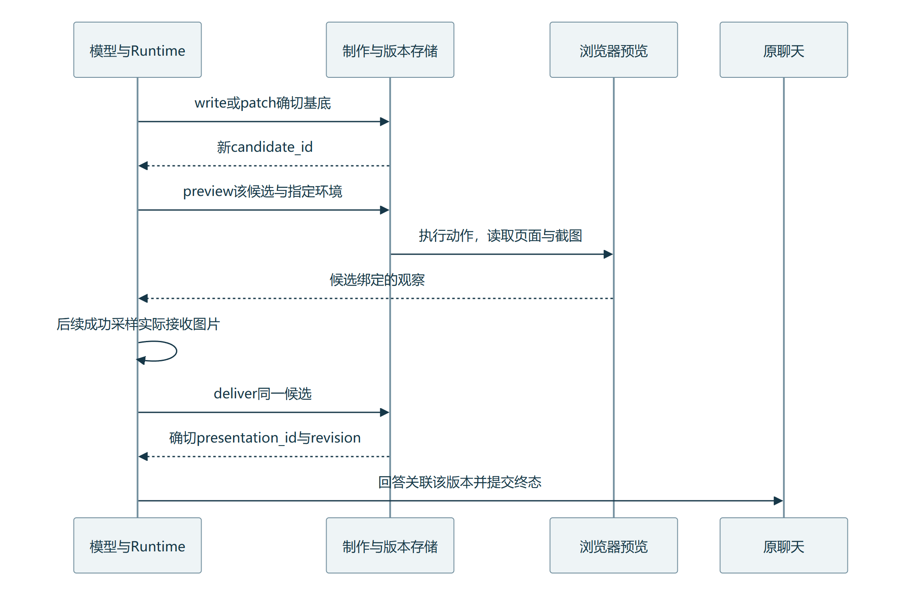

网络制作通过 [presentation_sandbox::Execution::run](../../../crates/server/src/presentation_sandbox.rs)取得资源许可，把Preview任务交给受控执行环境；本地制作则直接走浏览器端口。沙箱负责执行资源与边界，来源编译负责公开内容合同，二者都不代替数学核对。图中的后续观察也只证明图片进入了成功采样，不证明模型理解了每一处画面。

<a id="ch23-s16"></a>

#### 从反复扩容，转向可回读的确切版本

原问题进入反馈修订时，两次压缩都遇到 `Provider unfinished response: length`：输出达到16,384，尚未形成完整摘要。针对当时Catalog Flash档案扩大摘要预留后，后续请求竟然仍为16,384。查到的原因在实验装配：适配器把归档 `CatalogMatch` 改成 `ExplicitOverride`，专用容量没有生效。修正后实际原问题摘要输出25,916并完成，证明旧上限确实不足；此前各批请求仍按原配置保留。

这又暴露了持续输入的问题。[ADR-0155](../../adr/0155-goal-work-plan-and-version-centered-presentation-context.md)把改进放在当前缺陷和已保存版本上：Goal工作项记录剩余任务；指导变化在后续采样追加；有可靠落点的旧源码改用读取定位。此前各次扩容，包括后来65,536的摘要上限，是相应阶段的处理条件，不能把它们写成“只要继续扩窗口，制作就会可靠”。

当前 [ContextFragmentLedger::record_sampling](../../../crates/runtime/src/context_fragment.rs)仅在指导选择变化时追加新的 `sampling_guidance`，任务设计数据保留自身角色层次。[SavedAuthorCall](../../../crates/runtime/src/tool_result.rs)则先检查write/patch成功返回 `candidate_saved`，首次后续采样仍带完整调用和成功回执；观察之后，才在模型消息副本中把HTML与可读正文替换为 `saved_source`。最近补丁的edits保留到后继修改已保存并被观察，再收敛为已应用数量与读取入口。

这些条件共同保证“减少重复”有一个可操作的前提：模型能够读回当前候选的完整源码，原记录没有消失。它们不授予新的预览或交付资格，也不把上轮候选变成新Run的有效句柄。

确切版本的需要来自另一次真实偏离。EX12.4的feedback3修好了部分内容，但write没有填写 `based_on`，结果生成新对象revision 1，而非旧对象revision 2。当前[write分支](../../../crates/server/src/presentation_author.rs)在有演示follow-up回执时，要求 `based_on` 与回执确切引用一致；若用户确实要另建作品，须显式 `new_object=true`。来源、原参数与修订对象因而可以沿同一身份追踪。

这一修订自身又引出了EX13.6的恢复失败。早期 `redact_history` 无条件给旧调用加 `new_object:null`，旧消息字节改变，已安装检查点的来源身份随之失配。当前 [presentation_author.rs](../../../crates/runtime/src/presentation_author.rs)只在原调用有该字段时保留：

```rust
if let Some(choice) = value.get("new_object") {
    locator["new_object"] = choice.clone();
}
```

修复没有重造摘要来源。本轮直接执行旧历史字节回归，原先不含该字段的记录经过裁剪后保持一致。这个案例说明，可选字段的默认语义相同，不代表它可以无条件加入已经作为恢复依据的序列化记录。

<a id="ch23-s17"></a>

#### 独立修正如何成为真正交付

EX12.4曾在本地修正11项内容并通过三环境操作，状态明确记为 `local_verified_not_native_delivered`，版本引用为null。当时Provider 402阻止了原生完成；离线页面正确，不能代替产品中已交付版本正确。

[EX13.6](../../performance/presentation-context-ex13/ex13-6/README.md)随后从feedback5的原聊天、未完成Goal和检查点恢复，读取feedback3的确切revision 1。验收准备又发现静态推导保留旧读取量，于原11项补丁之外增加一项公式修正。当前运行重新发现工具、读取材料与源码，经过patch、原生preview、后续模型图片观察、review和deliver，最终交付同一对象revision 2，保留27个来源。

独立浏览器再对确切revision 2重放三环境、每环境七条路径，覆盖原值、读取减半、控件聚焦与四档实测汇算，共78张截图。内容与“原修正内容加补充公式”逐字段一致。成功接续有20次提供方调用；计入两次准备失败中的辅助调用，累计22次。它们属于这一份有限接续，不能混入此前25次运行的对照，也不能由截图数量推导学习效果。

这条链路给验收增加的核心条件，是每项观察都指向实际修改的候选、实际交付的版本，以及明确的用户要求。阶段已经切换、页面能够运行、离线补丁正确，都是可用证据；最终任务成功需要把它们接到同一份成果上。

<a id="ch23-s18"></a>

### 23.5 从单题修复到条件明确的回归

<a id="ch23-s19"></a>

#### 先修正“失败”的含义

前面的案例不断出现同一困难：当程序说一题失败时，产品、执行环境和评分程序究竟哪一部分需要改变？2026-09-26的 [CQ8](../../performance/source-delivery-cq8-20260926.md)把这个问题推进到了逐条论断。

一份历史长回答的公式已经存在于交付来源C4的后文，旧判断却将它当作没有交付。重新定位后，公式明确位于 C4.after 的 [7,89)。如果只看高亮正文，评委会漏读已交付材料；如果允许评委凭公共参考材料补齐，又会把实际没交付的依据当成已交付。两个方向都可能使改进建立在错误前提上。

当前 [task-quality-v2.mjs](../../../evals/semantic/task-quality-v2.mjs)先区分来源支持与定位，再让评委复制实际来源视图中的逐字依据。resolveV2Basis 接收 source_id、part、quote，在highlight、before或after中找唯一匹配，由程序计算UTF-16起止位置；不接受模型自己填写数值区间。语义判断仍由评委完成，确定性部分负责把判断落到可复查的原文。

这次修订同时保留了反例：高亮只有孤立术语时，前后文可以使支持成立，定位仍可能不满足；高亮已经表明具体定义或原则，对应公式紧随其后，则不能机械要求再挂一个独立公式来源。一条论断依赖两个互补前提，也要核对答案是否把读者引到两处依据。

历史记录中的第二版在原有十个人审判例上达到10/10一致；九个新增开发诊断中七个标签完全一致，另外两个仍有支持、定位或未知类别上的差异。两处差异没有把错误说法放行为有支持，却仍不能写成“九案全部正式校准通过”。那份长回答的公式误判得到纠正，其他缺引与全书否定仍在，整份答案没有因此改判通过。

当评分依据可以逐字核查后，CQ8三次自然回答的34条来源都能正确定位，但两次仍从局部材料推出全书否定。下一次实验因而不再追问“来源能否打开”，而是追问“什么使最后的范围表达失去约束”。

<a id="ch23-s20"></a>

#### 一个合理假设，为什么最后仍要撤回

[EV7](../../performance/agent-eval-ev7-20260926.md)先核对一个容易遗漏的事实：CQ8的范围正反例已经进入全部模型请求，失败也发生在普通业务循环，不是无工具收尾阶段。缺失提示注入和预算耗尽，不能解释这批症状。

剩下一个值得检验的假设：完成指导末尾笼统要求“证据不足就明确说明”，模型可能把用户未给出实施细节，混同为整本书没有支持材料。因此候选只替换这一条的首句，要求对尚未确立的具体结论说明缺失前提，并区分用户信息缺口和已读原文缺口。模型、工具、预算、原有范围例子及评分协议保持不变。这个解释在开跑前仍是假设，没有被写成已证实原因。

实验固定deepseek-v4-flash、temperature为0、每回合300秒，使用独立聊天和记忆。已有开发题两对、未用于调参的新题族两对，再加简单引文和必须保留不确定性的两个控制，共六对、十二份首次回答。新旧顺序按对交错；不因失败补跑，也不在看完输出后继续改这一个候选。

保留条件也先于结果确定：四对迁移题至少两对改善范围，不能以少答或拒答换改善；两题族范围失败数不能增加，关键内容与来源不能从旧版成功退化，两个控制均须满足要求。实际结果是：

| 对照任务 | 旧版与候选的关键差别 | 原记录判断 |
| --- | --- | --- |
| 开发题第一次 | 旧版范围合格；候选标题写“书中未给出”，正文又限定已读段落 | 未决 |
| 开发题第二次 | 旧版把具体团队情况说成书中没有；候选限定实际阅读范围 | 改善 |
| 新题族两次 | 两版均限定已读或已查范围 | 两对持平 |
| 简单引文 | 两版直接解释，零工具调用 | 控制通过 |
| 缺少参数 | 两版均保留比例未知；候选额外断言未读章节包含实施细节 | 保留新问题 |

四对迁移题只有一对明确改善，达不到预设门槛。即使把首对歧义按合格处理，改善数仍只有一对。缺参控制还说明，只检查答案有没有说“不确定”过于粗糙：模型可以保留数值未知，同时虚构另一章已经提供某些事实。

基线也并不完美。新题族的一份旧版答案遗漏了原反例的主动放开约束等前提，留下过强推论。记录保留这一点，没有为了撤回候选而把旧版描绘成完全正确。最终只撤回本次提示差异，恢复v7，保留此前CQ已有修复。当前 [FINISH_POLICY_REVISION](../../../crates/runtime/src/agent_prompt.rs)确实为v7；较早 [ADR-0137](../../adr/0137-stratified-reading-evals-and-diagnostic-improvement.md)中的“EV7待实施”已经被这份后续记录更新。

撤回也是完整的工程结果：它排除了当前条件下一个不值得保留的候选，留下十二份首次输出、退化和未决依据。它没有证明所有范围指导都无效；这批新题已经参与检验，后续再用它们也不能继续称为未见题。

<a id="ch23-s21"></a>

#### 同一个来源弹窗，为什么会支持两种不同判断

EV7还发生过一次值得单独解释的复核。候选说“这里读到的原文没有点名MSE”，交付来源C8的前文却包含MSE。只对照弹窗，似乎足以判定模型在说假话。

进一步检查实际工具正文，MSE并没有进入模型读到的正文，而是在来源视图自动展开的前文中出现。原句限定的是实际阅读范围，最终保留范围合格。这并不妨碍评委用完整交付视图判断答案有没有来源支持：一个问题问“读者收到了什么”，另一个问“本次模型看到了什么”，各自有对应记录。

这也是本章所有回归的共同要求。来源问题需要原回答、绑定和交付视图；阅读恢复需要动作与持久状态；构建恢复需要工作单元、候选失败和租约事实；演示修订需要确切版本与后续观察。保留与失败有关的条件，才能知道下一次通过是否回答了原问题。

确定性回归适合检查这些条件是否接对。它能够证明旧输入字节保留、过期交接换代、字段错误反馈抵达下一次生成，却不能代替真实模型对开放任务的表现。真实对照则要冻结题目、模型、提示、预算和判定，把首次失败、评分未决和撤回与成功一起保存。当前 [任务评分汇总](../../../evals/semantic/task-quality.mjs)也将产品交付与评分状态分别记录；已知必要项失败仍是失败，只有其余必要条件成立而判断缺失时，才保留任务未决。

<a id="ch23-s22"></a>

### 已知问题与本轮验证

截至2026-10-07，本章对历史失败与当前机制逐项回读。仍需要集中保留以下边界：

1. **来源与任务语义的边界。** 当前绑定和编译保证可解析的引用与公开表达合同，不保证每个论断都有充分支持，也不证明整个自然语言任务完成。LA7、EV4、CQ8、EV7的题集、评分版本和运行条件不同；历史失败不能直接当作今日同题仍失败，局部通过也不能扩展为当前整体效果提升。
2. **演示预览与字段提示仍有缺口。** 当前 [preview_contract_complete](../../../crates/server/src/presentation_author.rs)仍接受legacy预览路径，不是所有入口都强制三个环境；第17章已用定向用例确认该行为，本轮按代码回读。来源编译错误提示仍建议补patch.source_ref_ids，但Patch结构不接受这个字段。两者仍属当前实现，不能因为EX13.6的三环境验收成功而略去。
3. **恢复和发布有明确状态范围。** 保存重试复用内存中的原结果，进程退出后依据持久终态处理；多个领域文件与会话日志没有共同事务。构建发布的可捕获异常回滚不等于断电原子性。这些边界沿用第8、16、19章，不将本轮交接测试扩大成完整灾难恢复验证。
4. **来源修复的用途统计已经落后于当前协议。** 本轮发现Runtime发出的是source_answer_repair.v4，而 [requestPurpose](../../../evals/semantic/provider-recorder.mjs)只识别v3。用当前源码中的签名重放后，该请求归入unclassified，没有归入source_repair；样例7个tokens仍保留在未分类组。修复调用并未消失，但按用途分析会漏计这一类。后续改动应使分类与当前实际修复合同一致，并保留这个输入作为回归。
5. **流式用量缺失还会影响评测预算。** 第21章已确认记录器只对整包做JSON解析，不能提取SSE usage。本轮进一步沿 [agent-run.mjs](../../../evals/semantic/agent-run.mjs)实际支持的可选tokenLimit检查：本地固定SSE每次明确返回7个tokens，设上限为1，第一次之后第二次请求仍被放行，记录用量为两个null。报告的measuredUsage正确保留未知，但请求前预算相加把缺失值按0处理，因而不能据此宣称实验累计用量受到硬限制。后续需提取受支持流式用量，并明确未知时不能确认剩余预算；本轮只记录问题。EX13.6独立接续脚本的费用预留规则是另一条路径，不能用来替这份代理证明预算有效。

本轮直接运行当前仓库中六个Core构建用例与一个Runtime历史裁剪用例，均通过。Core覆盖完整输入后才开始语义尝试、冻结输入复用、过期代次接续、字段错误反馈、同一invocation换发和有限分段选择；Runtime覆盖旧记录没有new_object时保持原字节。Core另91项、Runtime另460项按名称未选中。

另两项本地固定响应重放分别确认上述用途分类与流式预算缺口；断言成立表示问题复现，不能列为功能正确。原始命令、输出与书稿核对保存在[第23章验证记录](../SOURCES.md#%E7%AC%AC-23-%E7%AB%A0%E7%BB%AD%E5%86%99%E9%AA%8C%E8%AF%81%E8%AE%B0%E5%BD%95)。本轮没有调用真实模型、Embedding或浏览器，没有重跑前章Server矩阵，没有新增产品费用、容量或成功率实测，也没有修改产品实现和测试。

<a id="ch23-s23"></a>

### 面试时怎样回答

**问：为什么100%召回仍不能证明Agent完成了任务？**

答：召回只回答预设证据是否进入了可观察范围。LA7的必要证据锚组召回达到100%，Agent问答成功仍只有15/24，因为引文组织、来源绑定、内容要求或动作仍可能失败。要把搜索命中、实际读取、支持、定位和任务动作分开测量，才能知道下一项改动应该放在哪里。

**问：你会怎样判断一次失败来自产品还是评测？**

答：先保留原任务和首次输出，再沿发生差异的环节核对。LA10中，来源打开后没有保存阅读位置是产品问题；笔记已写入而脚本等错接口是验收问题。CQ8中，后文公式已经交付却被判为缺失，也是评分问题。修正判定依据之后，原答案里其他失败仍要保留。

**问：客户端超时后，为什么不能直接再生成一次？**

答：客户端超时不证明服务端没有启动。9月30日的构建记录显示，启动事实在120秒之后已经落盘。应先查持久交接与租约：输入交付未完成、生成失联和候选被写入器拒绝是三种状态。过期交接可以在同一语义尝试下增加代次；只有明确的候选失败才应携带相应字段反馈进入下一次语义尝试。

**问：输出放不下时，项目做了什么有依据的改变？**

答：BSR7需要114个重点和44个宏观引用，候选容量只有1981 tokens，极短摘要后的估算下界仍为2228。这个矛盾不能靠继续缩短文字解决。改动把章节选择拆成有持久语义状态的48、48、18个重点，再交最终摘要，由Core注入已接纳引用并完成原校验；没有通过删重点伪造完整交付。

**问：一份演示预览通过后，还要验证什么？**

答：先确认观察属于最新候选，图片确实进入后续成功采样，最终交付的是同一对象的确切版本，再按用户任务检查正文、交互和计算。EX12曾经进入review却漏练习，减半控件更新却保留旧摘要；EX13.6才把补丁、三环境操作和原生revision 2接在一起。版本与执行正确，是内容正确的必要基础。

**问：提示实验没有改善，怎样讲出工程价值？**

答：说明假设、唯一变量、冻结的保留条件与实际结果。EV7六对十二份首次回答中，四对迁移题只有一对明确改善，还留下控制题的新断言问题，最终恢复v7。价值在于可复查地撤回不足以保留的改动，并明确后续要换什么假设；不能把一次局部好转包装成整体成功率提高。

**问：费用记录缺失时能否用请求数补算？**

答：请求数、耗时和Token各有分母。当前记录器不能从SSE提取usage，报告应保留未知；本轮还确认缺失值使可选Token上限不能可靠阻止后续请求。可以报告实际请求数和等待时间，但没有完整用量及当次计价条件，就不能声称模型费用下降。

失败为设计增加的，是更准确的责任和更具体的验收条件。下一章进入[第24章：从项目理解到面试表达](#ch24)，把本书已经核实的机制、取舍和结果组织成能接受追问的表述。


---

<a id="ch24"></a>

## 第 24 章 从项目理解到面试表达

前二十三章已经把材料、构建、阅读、状态、宿主和质量证据连接起来。到了面试现场，问题会换一种形式：用三分钟介绍项目；从白板画出一次请求；解释为什么没有直接使用现成的检索问答；说明数据在失败后怎样恢复；最后讲清哪些结果已经得到验证。

困难不在于记住更多模块名字。一段很长的功能介绍，可能仍然没有说清用户需要完成什么；一张完整的组件图，也可能解释不了模型等待时读者为何还能操作。真正能经受追问的表述，需要把任务、责任、取舍和证据放在同一条因果链上。

本章回答：**怎样准确讲出项目价值、技术难点与可验证结果？** 前四节将已核实的项目事实组织成口述、白板和条件变化题；最后一节解释结果应当怎样表达。这里的变化题是设计分析，历史实验仍保留各自条件。

<a id="ch24-s1"></a>

### 24.1 三分钟项目介绍

<a id="ch24-s2"></a>

#### 先让对方理解读者要做什么

“这是一个使用Rust、TypeScript、知识图谱和MCP的Agent项目”，可以描述技术组成，却没有交代为什么需要这些组成。听者还不知道它服务一次检索、一次长任务，还是长期阅读；后续也就很难判断持久化、构建恢复和多用户隔离是否必要。

更有用的起点是一次阅读：读者选中一段难懂的原文，希望解释它与前文的关系，打开依据，保存笔记，稍后从原聊天继续。有些问题需要跨章查证，有些需要可操作的演示，有些只是把已经理解的结论留在正确位置。项目要使这些动作共享材料身份，同时保留各自的状态和结果。

[项目入口](../../../README.md)用“将长文整理为可定位、可关联的知识底座，支持AI按需查证与持续阅读”概括目标。第2章进一步解释了准备材料与使用材料的时间分工，第3章说明公共材料、私人状态和阅读现场的归属。这三个事实足以构成介绍的开头，不必先枚举全部工具。

<a id="ch24-s3"></a>

#### 一段能够继续展开的口述

下面是一段按三分钟组织的项目整体介绍，具体术语可随听者背景展开：

> Understand Book面向长文和书籍的持续阅读。读者可以围绕选区提问、追溯原文来源、保存笔记，也可以要求制作可交互的解释，再在原聊天里继续修订。它需要完成的不只是返回一段文字，还包括把依据、阅读动作和后续状态接在一起。
>
> 整体分成构建和阅读两个阶段。构建侧用TypeScript组织原文定位、语义抽取和全书结构，模型提出候选，由程序按合同接纳并发布可复用材料。阅读侧用Rust加载材料，Resident Agent根据问题选择工具、读取原文和组织回答；Vue提供阅读界面，本地桌面由Tauri承载，也有Linux多人阅读入口。
>
> 一个核心设计是把找到线索、实际读到原文和交付来源分开。图谱或检索可以帮助选择位置，引用则要在本轮已经观察的原文范围内匹配。回答编译把模型表述与真实绑定连接起来，读者才能打开相应依据。
>
> 另一个难点是长任务中的状态。一次运行固定原用户、材料、聊天和提问现场，模型等待放在共享状态锁外；工具执行时再进入正确的权威状态。最终回答、来源和效果进入会话日志，保存失败与模型执行失败分别处理，重试保存复用原结果。
>
> 项目也把评测作为设计的一部分。召回、来源支持、定位、动作和完整任务成功分开观察。历史实验并没有证明图谱在所有任务上优于简单检索，提示改动也有未达到保留条件而撤回的记录。因此，讲结果时需要说明任务、模型、预算和判定条件，再讨论哪项机制确实解决了哪类失败。

这段介绍依次回答了任务、分工、两项难点和验证方式。它没有靠增加功能数量争取可信度，而是给后续追问留下了入口：来源怎样限定已观察范围，状态怎样避免串到新窗口，保存失败怎样继续，实验为什么允许撤回。

口述中的技术事实分别可回到[构建编排](../../../packages/core/src/build-orchestrator.ts)、[Book加载](../../../crates/read-tools/src/lib.rs)、[运行循环](../../../crates/runtime/src/orchestrator.rs)、[运行归属](../../../crates/server/src/run_scope.rs)和[会话提交](../../../crates/server/src/session_runtime.rs)。桌面与多人组合见第20章；失败与实验见第23章。现场不必报出这些文件名，但准备时应能沿它们回答下一层问题。

<a id="ch24-s4"></a>

#### 岗位不同，展开的同一条线也不同

AI Agent方向更值得展开“下一次采样依据什么作决定”。可以从实际原文、工具发现、进展停止和活动上下文出发，解释模型选择与确定性接纳如何配合，再用来源或演示失败讨论开放语义的边界。

后端架构方向更值得展开“谁有权把结果变成事实”。可以从固定Run归属、按操作访问状态、准入与模型许可、持久日志和恢复分支出发，解释并发、重试与发布。两种介绍使用同一项目事实，只是深入的责任不同。

若听者只给一分钟，保留读者任务、构建与阅读分工，以及一个最能解释清楚的技术难点。若给十分钟，就沿这个难点进入源码条件和真实失败。把开场压缩成结论，再在追问中展开，比在开场塞入所有细节更容易维持准确性。

<a id="ch24-s5"></a>

### 24.2 从白板画出架构和一条请求链

<a id="ch24-s6"></a>

#### 先画材料怎样被交付，再画状态归谁

白板的第一条边界可以从材料开始：左边是尚在变化的构建工作，右边是读者正在消费的已接纳成果。构建执行器生成候选，Core决定是否接纳、怎样继续和何时发布；阅读进程加载成果，不要求原执行器继续在线。

第二条边界放在读时内部：公共Book可以共享，用户的聊天和笔记归私人状态，窗口的位置与选中聊天归阅读现场，一次Run持有固定任务归属。不同生命周期画在不同位置，才能继续解释两个窗口或两位读者。

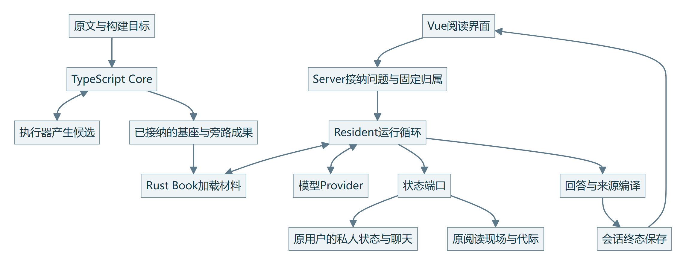

这是一张职责图，箭头没有承诺每条边都是HTTP请求。当前跨语言主边界是材料文件，Rust内部还有共享对象与端口调用；具体部署再补本地Host、网络准入、发布库和资源许可。[第2章](#ch02)与[第19章](#ch19)分别展开这两层。

如果被问到MCP，可以把它接在共同Book能力旁边。当前外部调用方拥有自己的Agent循环，内置Resident拥有自己的Run、Goal和私人状态访问路径。Book MCP的Visitor分派没有私人Reader、Memory写入口；不能因为两者都叫“调用工具”，就把控制权和用户状态画成同一份。入口见[第10章](#ch10)与[MCP分派](../../../crates/server/src/mcp.rs)。

<a id="ch24-s7"></a>

#### 沿“解释这里并记下关键前提”走一遍

设读者在材料A、聊天C、现场W中选中一段原文，请求：“解释它与前文的关系，把关键前提保存为笔记。”这是用于串联机制的场景，下面描述当前路径的职责，不冒充本轮执行过的模型记录。

接纳时先验证请求和选区，建立确切回合。`RunScope`保存原用户、Book、存在时的发布引用、聊天、回合、现场代际和提问输入；`PreparedAgentChat`带上本轮需要的消息与任务信息。本地由[prepare_agent_chat](../../../crates/server/src/lib.rs)和协调器接续，网络入口还通过[RunAdmissions](../../../crates/server/src/run_admission.rs)持久记录准备与派发状态。二者复用执行核心，不等于拥有相同的排队机制。

进入模型循环后，先看已验证选区是否足够。需要前文时，模型选择定位和原文读取工具；Registry与暴露计划决定当前可以调用什么，工具回执说明实际发生了什么。模型返回一个候选位置，不会自动让这一整节进入已观察证据。

来源形成时，最值得在白板旁写出的代码只有两行，来自[TurnEvidenceLedger::prepare_present](../../../crates/runtime/src/orchestrator.rs)：

```rust
let observed = self.observed_intervals(book);
let mut matches = book.match_source_quote(quote, &observed)?;
```

这段之前已经解析参数并拒绝空引文。匹配范围被限定为当前已观察区间；随后唯一匹配才解析来源，零匹配与多匹配分别反馈缺少匹配和歧义。回答编译继续检查公开标记与本轮绑定。它使读者能从回答回到原文，但“这段原文是否充分支持推论”仍是需要语义判断的问题。

保存笔记则走另一条权威路径。模型提供内容和目标，状态端口检查原用户与原任务，再调用实际私人存储。网络侧[NetworkRunPort::private](../../../crates/server/src/workspace_registry.rs)的核心顺序是：

```rust
self.authorized()?;
let user = self.user.lock().unwrap();
self.scope.check_user(&user)?;
operation(&self.scope.private_user(&user))
```

这里的锁只覆盖相应操作，不覆盖整段Provider等待。需要导航等现场动作时，还要检查现场代际及相关现场条件；不能将私人写入入口的成功推成任意旧Run都能控制当前窗口。归属检查具体展开在[第3章](#ch03)和[第18章](#ch18)。

最后，模型返回的文字经过来源编译与必要修复，Server整理实际效果和终态。当前JSONL路径把相应来源、成果关联和结束事件保存到原聊天，再用保存后的视图完成公开终态。模型流中的文字、可公开草稿和持久答案因此是三个时刻；第12章给出的[流式交付与保存路径](#ch12)是这张图的最后一段。

读者随后点击来源，是一个新的显式Reader操作，来源绑定提供原文位置，服务端执行跳转并保存相应状态。稍后继续聊天，又是根据已保存消息、目标与当前输入开始下一次Run。不要把这两个后续操作画成前一个模型请求天然完成的副作用。

<a id="ch24-s8"></a>

#### 在白板上增加一次正常变化

现在让另一个窗口在模型等待期间翻页。公共Book仍可共享；它的Reader现场独立，原Run的输入没有被改写。如果原现场自身被重新绑定，旧Run的现场动作可能得到`WORKSPACE_STALE`；仍具有效归属与授权的原书私人写入，则有自己的检查范围。

再让终态保存失败。网络服务可以用内存中原来的`FinishedRun`重试保存，避免重新执行已经发生的笔记操作。如果进程已经退出，就不能假装那份未保存结果还存在；恢复代码依据持久事实区分已保存终态、尚未领取和执行不明的任务。当前`claimed`且没有终态的工作按中断收口，而不是自动再次运行。相关分支分别位于[retry_save与recover](../../../crates/server/src/run_admission.rs)。

这两次条件变化已经足以检验一张架构图是否有用。能否回答“这份结果回到哪个聊天”“这次导航还可不可以做”“重试是否会重新问模型”，比能否记住所有目录名更能说明理解程度。

<a id="ch24-s9"></a>

### 24.3 关键设计的短答与深入追问

<a id="ch24-s10"></a>

#### 为什么需要Agent，简单检索回答能不能做

短答可以从任务开始：**单次解释需要保留简单检索基线；持续阅读还包含按需补读、导航、保存、制作和跨回合继续，Agent承担的是围绕当前任务选择与接续这些动作。**

深入时，将“能力范围”与“问答效果”分开。一次普通Chunk检索可以得到相关段落并生成很好的答案；增加图谱和多轮循环，会增加定位入口与动作能力，也会增加调用、上下文和交付失败的机会。是否值得，要看目标任务，而不能由组件数量判断。

历史[LA9-v2同环对照](../../LA7-LA10%E5%AE%9E%E6%96%BD%E4%B8%8E%E9%AA%8C%E6%94%B6.md)让Text、Tree、Graph使用共同循环和冻结预算，完整成功分别为10/24、11/24、9/24。它与“图谱可以提供跨章线索”不矛盾：线索能力存在，不保证任务整体收益。这个结果也解释了为什么应将原文寻址保留下来，同时让语义召回和具体消费者分别接受效果检验。

若被追问“现在会不会直接删掉图谱”，可以继续回答：先明确受影响消费者和用户任务，再比较改动是否保持来源、结构阅读与教学需要。第6章的构建候选召回、第10章的读时工具、第21章的产品对照有不同对象；不能把一个问答实验的结论直接传播为全部结构都应删除。

<a id="ch24-s11"></a>

#### 来源机制怎样约束模型，剩下什么问题

短答是：**模型提交连续引文，运行时在本轮已观察原文中定位并分配来源身份，回答编译只接受已有绑定；来源支持与答案语义继续单独评估。**

可以立即给出一个反例：引文准确地引用了一个条件命题，答案却省略条件、写成普遍结论。位置完全正确，表达仍然可能不成立。项目把来源支持和定位拆成两个判断，正是为了看见这种差异。[resolveV2Basis](../../../evals/semantic/task-quality-v2.mjs)让评分依据落到实际交付视图中的逐字片段，不能用公共参考替回答补交来源。

再进一步，模型声称“本次读到了什么”，应对照实际工具正文；读者“从来源弹窗收到了什么”，则可以包含自动展开的前后文。第23章的MSE复核给出了真实例子。把这两种观察混起来，既可能误判答案，也可能高估模型已经取得的证据。

因此，面试中的准确表达应当落在具体机制上：“限制来源身份与观察范围，并使判断可以回查。”是否减少某类语义错误，需要相应对照；合法引用本身不是无幻觉保证。

<a id="ch24-s12"></a>

#### 多个Agent为什么不会只靠彼此报完成推进构建

短答是：**执行器提出语义候选，Engine读取持久状态、接纳成果、计算后续动作；子执行器结束、候选提交成功和整个计划完成分属不同状态。**

当前[nextAutomaticBuildAction](../../../packages/core/src/build-orchestrator.ts)跳过已关闭阶段，处理必要准备与尚未完成的工作，待工作就绪后进入阶段收口。候选是否成立由相应writer检查；发布还要核对正式文件和阶段质量。根Agent不需要通过整理子Agent的自然语言汇报，重新发明一份成果账本。

构建恢复能够说明这项分工的收益。完整输入尚未交付时，不能记为模型生成失败；租约过期接管时，可以维持语义尝试、增加执行代次；写入器明确拒绝候选后，下一次生成才需要相应错误反馈。[nextAutomaticBuildExecutionIdentity](../../../packages/core/src/automatic-build-task-store.ts)中的两个计数正对应这些事实。

如果面试官把它概括成“所以任务恰好执行一次”，应把结论收回到实际合同：重复交接、候选接纳和结果重放分别有身份与状态规则；它们没有把所有外部动作变成一个跨系统事务。能解释失联时已经知道什么、还不知道什么，以及哪一步允许继续，才是恢复设计的重点。

<a id="ch24-s13"></a>

#### 持续运行怎样避免只是在不断消耗上下文

短答是：**任务进展、单次上下文容量和累计用量分别处理。普通Resident默认没有固定采样轮数上限，有实际进展才继续；活动请求通过预算与压缩控制大小，累计用量单独记录。**

`OuterConfig`的默认`max_turns=None`已经替代早期十二轮硬闸；当前[ProgressPhaseGuard](../../../crates/runtime/src/orchestrator.rs)观察实际状态变化。读到新的有效材料、完成动作或推进制作状态，与换一种说法重复“我继续”有不同后果。

容量则回到[ActiveContextBudget::from_plan](../../../crates/runtime/src/auto_compaction.rs)：本次估计输入加输出预留和安全余量，决定高水位与是否装得下。摘要安装成功之后，才把活动上下文推进到新状态；持久交互记录承担另一项责任。将累计十轮输入相加，再与一次模型窗口比较，会把费用口径和空间口径混淆。

工作计划还需要与完成要求分开。一个Goal工作项自报完成，不能替代真正交付演示；当前[goal_turn_delivered](../../../crates/server/src/lib.rs)会检查通用交付条件，但Content分支不逐条证明开放语义。因此，“长期目标已经建立”不等于系统有一个能够证明任意任务正确的完成判定器。

<a id="ch24-s14"></a>

#### 后端最关键的并发与恢复取舍是什么

短答是：**固定输入用于解释原问题，权威状态用于承接实际操作；模型等待在状态锁外，持久化确认与公开完成保持明确顺序。**

如果整轮持有共享状态，远程模型等待会阻塞读者操作；如果复制所有状态后最后整体写回，又可能覆盖等待期间的新变化。项目通过`RunScope`和状态端口把访问拆到具体操作上。代价是每次操作需要判断自己的归属和现场条件，保存失败也要保留中间事实。

JSONL解决的是聊天事实如何追加、重建与确认。[SessionLog::append_with](../../../crates/server/src/session_log.rs)在接受相同事件重试时核对序号和内容；遇到不确定写入时对照原字节，成功确认后才推进投影。这解释了“同一条记录可以安全重试”的实际范围。原文笔记、教学事件、SQLite准入与会话日志仍各有存储边界，不能只因为其中使用了SQLite就宣称整轮原子提交。

这里也能自然接到多人服务：同一用户共享一份私人权威状态，不同现场持有各自Reader；运行份额与每次模型调用的许可分别分配。下一节就通过改变这些条件，判断当前机制还能承担多少工作。

<a id="ch24-s15"></a>

### 24.4 改变规模、模型和使用条件后的设计判断

<a id="ch24-s16"></a>

#### 材料扩大十倍，先问哪一种工作变多

这是条件变化分析。设材料长度扩大十倍，读者问题分布保持近似。一次全书构建需要处理更多原文和候选；一次局部解释却未必需要十倍上下文。构建准备、材料加载、候选检索与单次阅读应分别分析。

当前[Book::new](../../../crates/read-tools/src/lib.rs)持有UTF-16原文及位置、节点索引，已加载材料的内存与加载成本会受规模影响。构建侧还需要看工作单元是否仍符合输入预算，候选目录和归并是否出现更大的阶段工作。若失效发生在候选提交容量，增加模型上下文甚至未必触及限制；第23章的114个重点选择就是实例。

此时合理的下一步，是对真实大材料定位成本主要落在哪里：加载、序列化、阶段描述重建、检索还是模型处理。已有局部成果如何复用，要依据当前输入与合同匹配；改变原文后怎样迁移旧位置、私人批注和教学证据，则属于另一组身份问题。[ADR-0146](../../adr/0146-portable-build-workspaces-and-incremental-book-updates.md)当前只把U1—U2搬迁续建列为已实现，后续增量更新不能被提前说成产品已有能力。

因此，回答“十倍规模怎么办”不必先承诺换数据库。先区分变大的对象、对应预算和失效条件，才能决定分页、按需加载、减少重复处理或重新分解工作是否解决实际问题。

<a id="ch24-s17"></a>

#### 用户变多，模型许可怎样成为约束

多人系统不能只数HTTP连接。一个Run可能先后进行若干次业务采样、综合和压缩；模型许可控制实际调用，而活动Run份额控制同时推进的任务。当前[LimitedAdapter::call](../../../crates/server/src/service_limits.rs)在每次调用前取得许可，调用返回后释放；模型请求的用户轮转也不等于为每个任务承诺最长等待时间。

用一个**教学容量算例**分析这条边界。设每分钟接纳$\lambda$个任务，每任务平均发生$n$次模型调用，每次占有模型许可的平均时长为$\tau$秒，可用模型槽位为$K$。为单独分析模型许可，假设活动Run数量、用户份额和上游服务没有更低的容量限制，也忽略本地处理和制作等待。

每分钟需要的许可时间与可提供时间分别是：

$$
D=\lambda n\tau,\qquad A=60K,\qquad \rho=\frac{\lambda n\tau}{60K}.
$$

$D$与$A$的单位都是“许可秒/分钟”。这里的$\tau$从已经取得许可开始计时，不包含此前排队；如果直接使用含资源等待的模型活动墙钟时间，会把等待再算成服务需求。

假设许可配置为8，每分钟6个任务，每次调用占用12秒，则有：

| 教学条件 | 每分钟模型调用需求 | 许可时间需求 | 可提供许可时间 | 比例 |
| --- | ---: | ---: | ---: | ---: |
| 每任务平均5次调用 | 30次 | 360许可秒 | 480许可秒 | 75% |
| 每任务平均10次调用 | 60次 | 720许可秒 | 480许可秒 | 150% |

理想情况下，这8个槽位每分钟最多完成$8\times60/12=40$次调用。第二行每分钟需要60次调用，持续到达便会累积未完成工作。用户轮转能改变由谁先取得机会，不能把480许可秒变成720许可秒；扩大排队长度同样不会增加处理能力。

第一行也不能推出P95等待为零。请求可能集中到达，调用时长可能波动，不同用户还有各自份额。这个算例只回答平均工作量是否超出假设容量。项目当前默认模型槽位为2；表中8是明确选取的教学配置，并非默认值或实测承载结论。

由此可以给出有条件的扩容回答：先分解准入排队、模型许可等待、Provider调用、制作与存储时段。确认瓶颈后，再考虑调整相应容量，或者减少没有推进任务的额外调用。增加槽位还需受上游限额、实际费用与本地资源约束。

<a id="ch24-s18"></a>

#### 更换便宜模型，为什么不能只比较单价

同一个任务换模型后，可能改变工具协议可靠性、需要的补读次数、候选拒绝次数、输出长度和压缩频率。上表中每任务调用从5次变成10次，就说明更低的单次价格并不能单独解释系统占用与总费用。

当前[Provider适配](../../../crates/runtime/src/lib.rs)具有Native和ReAct等协议路径，模型运行配置又影响请求容量与输出安排。协议适配只解决调用表达和解析，不能证明两个模型能够以相同质量完成同一任务。

实际比较应保持材料、任务、工具权限与判定条件一致，记录自然运行的完整结果，再分析多出来的调用发生在哪个环节。来源交付、恢复和演示这样的任务，还需要对应成果与状态。如果用量缺失，就保留未知；第23章已确认当前评测代理不能从SSE提取usage，不能用请求数冒充实际Token账单。

更大窗口也需要同样判断。它增加可容纳输入，不会自动消除重复源码、过时指导或缺少交付对象的问题。第17、23章的演示路径将已保存源码改为可回读定位，并按候选跟踪观察，是对输入与状态责任的处理；窗口扩大只能改变其中的容量条件。

<a id="ch24-s19"></a>

#### 从单主服务走向多个写入实例，会改变什么

当前[ServiceWriter](../../../crates/server/src/control_store.rs)用服务根的操作系统锁维持单写者，私人状态与调度也有进程内权威。它可以支持当前多人使用，但不能直接推出两个服务实例同时写同一根目录的正确性。

若明确需要多实例共同写入，首先变化的是权威：谁领取任务、谁判断执行仍然有效、谁发布聊天顺序、谁持有用户写入责任，以及观察连接怎样找到原Run。共享一个数据库连接地址，不能自动回答所有领域文件和内存对象的归属。

可以分析按用户分区写入、把权威状态迁入事务存储、建立带租约的任务执行及独立观察路由等备选方向。这些属于未来方案分析。是否需要它们，应由容量、可用性和故障恢复目标决定；当前章节没有把任一方案写成已经实现的部署能力。

回答到这里，对条件变化的判断已经具备完整链条：先找出失效的原假设，再指出受影响的责任，最后提出能够验证的新边界。技术名词只在承担了这项责任之后才有意义。

<a id="ch24-s20"></a>

### 24.5 结果依据与已知边界

<a id="ch24-s21"></a>

#### 让每一个结果带上它真正的分母

“召回达到100%”“恢复测试通过”“成功制作了演示”都是可以成立的话，但单独出现时，听者不知道被证明的是什么。需要补上的通常不是更多修饰，而是任务、条件、观察对象与结果。

例如，LA7的100%属于必要证据锚组召回；同一批共享问答中的Agent完整成功为15/24。准确表述可以是：“在2026-09-08的这份固定题集中，必要证据已覆盖，交付仍在来源组织和完整要求上失败，因此改进继续沿交付链定位。”这句话把两个指标放回各自位置，也给出了下一项工作的理由。依据见[LA7记录](../../LA7-LA10%E5%AE%9E%E6%96%BD%E4%B8%8E%E9%AA%8C%E6%94%B6.md)。

固定输入回归又有另一种表达。第23章在2026-10-07实际运行六个Core用例和一个Runtime用例，验证冻结输入、过期交接、字段反馈、分段选择及旧历史字节等行为。它能支持“这些明确分支在相应夹具下通过”，不能支持“真实模型成功率提高”。测试名称、实际选择和输出保存在[第23章验证记录](../SOURCES.md#%E7%AC%AC-23-%E7%AB%A0%E7%BB%AD%E5%86%99%E9%AA%8C%E8%AF%81%E8%AE%B0%E5%BD%95)。

在本书中，下面几种表述分别具有可追查的落点：

| 要表达的结果 | 所需的具体依据 | 能够回答的问题 |
| --- | --- | --- |
| 当前代码把来源限制在已观察区间 | 实际调用路径、引文合同和编译分支 | 今天怎样处理这类输入 |
| 过期交接在同一语义尝试下换代 | 当前用例的受控时间、初始状态、输出与断言 | 指定恢复分支是否按合同推进 |
| 某次演示完成同对象revision 2 | 原问题、候选与预览、后续采样、交付引用及实际页面 | 这份成果是否承接了该次修订 |
| 某候选不值得保留 | 冻结假设、对照条件、首次结果和事前保留门槛 | 为什么接受或撤回这一次改动 |
| 模型调用产生多少费用 | 完整有效用量、当次计价条件和范围 | 在这个口径下实际花费多少 |

同一份记录可以支持多项判断，但不能补出自己没有观察的量。执行进程耗时不是模型推理时间，活动耗时可能包含许可等待，候选Token估算不是Provider账单，截图数也不是学习效果。计量名与分母清楚以后，数据才真正进入工程讨论。

<a id="ch24-s22"></a>

#### 一个负结果怎样成为有价值的项目案例

面试中的案例不必以“指标提升”结尾。EV7适合解释如何在效果不够时结束一次改动：它有明确的范围表达假设，只改一个提示条目，冻结六对十二份首次回答；四对迁移题只有一对明确改善，两对持平，一对未决，最后恢复v7。

可直接这样表达：

> 2026-09-26的EV7实验检查一项范围提示改动。候选必须在四对迁移题中至少改善两对，同时保持内容、来源和控制题要求。实际只有一对明确改善，控制题还出现未经核实的章节断言，因此撤回候选，保留原有来源修复。这个结果说明该次改动没有达到保留条件，后续需要另立假设。

这段话的价值在于能继续回答追问：假设从哪条失败轨迹形成，为什么是单变量，未决样本怎样处理，撤回后留下什么。原始依据在[EV7报告](../../performance/agent-eval-ev7-20260926.md)，当前[完成指导版本](../../../crates/runtime/src/agent_prompt.rs)仍为v7。这里的“实验完成”与“产品效果提高”具有不同含义。

相应地，正结果也应保持范围。EX13.6确实接续原聊天，完成同一演示对象revision 2，并对确切版本重放浏览器路径；它支持那份内容、版本和操作的验收。[该记录](../../performance/presentation-context-ex13/ex13-6/README.md)并没有把所有书籍、所有模型或长期教学效果纳入同一次证明。

<a id="ch24-s23"></a>

#### 把准备材料组织成能回查的路径

实际练习时，可以选一条请求链连续讲述，再由一个失败进入设计取舍，最后改变一个条件。这样，同一份理解就能回答产品、Agent、后端和评测四类问题。

例如，从“解释选区并保存笔记”开始，解释来源为何要求本轮观察；转入“保存失败后怎样继续”，说明原结果重试与执行不明的区别；最后加上“另一窗口切换了材料”，解释私人状态和阅读现场为什么有不同有效性条件。这是一段相互依赖的推导，不需要临时拼接互不相干的术语。

下表保留最短的回查路线，适合发现哪一层尚未讲清时返回原章：

| 面试中需要展开的问题 | 先回到哪些章节 | 应能继续说明的事实 |
| --- | --- | --- |
| 项目解决什么，为什么分成构建与阅读 | [第1章](#ch01)、[第2章](#ch02)、[第3章](#ch03) | 用户任务、材料交付、公共与私人归属 |
| 原文、语义候选与全书结构怎样连接 | [第4章](#ch04)、[第5章](#ch05)、[第6章](#ch06) | 坐标单位、来源范围、候选选择和消费边界 |
| 执行器失联或候选失败后怎样继续 | [第7章](#ch07)、[第8章](#ch08)、[第23章](#ch23) | 输入交接、语义尝试、租约代次、接纳与发布 |
| 一次有依据的Agent回答怎样形成 | [第9章](#ch09)、[第10章](#ch10)、[第11章](#ch11)、[第12章](#ch12) | 工具选择、实际观察、活动上下文、公开与持久终态 |
| 持续任务与长期阅读保存什么 | [第13章](#ch13)、[第14章](#ch14)、[第15章](#ch15)、[第16章](#ch16) | Goal、现场、私人事实、日志和恢复分工 |
| 演示为什么需要候选与确切版本 | [第17章](#ch17)、[第23章](#ch23) | 预览、后续观察、交付、现场与继续修订 |
| 多窗口、多用户与部署如何衔接 | [第18章](#ch18)、[第19章](#ch19)、[第20章](#ch20) | 状态权威、调度与许可、单写者、发行组合 |
| 怎样解释收益、退化与重新设计条件 | [第21章](#ch21)、[第22章](#ch22)、[第23章](#ch23) | 指标口径、对照条件、真实失败、撤回与架构约束 |

练习的判断可以很具体：如果去掉某个组件，你能否指出哪项任务或状态合同会受影响；如果一个结果未达预期，你能否找到它对应的输入和实际输出；如果换一个条件，你能否说明原结论为什么仍成立或为什么需要重验。答不出时，返回相应请求链，而不必先记更多口号。

<a id="ch24-s24"></a>

### 已知边界与本轮验证

本章以2026-10-07实际回读的工作区组织项目表达，HEAD为4e0b68e。跨章引用保留原有读取日期；本章的回查索引不表示前二十三章已按一个新基线全部重审。

- **机制保证的范围。** 已观察来源与编译不证明每项语义正确；通用Goal完成条件不等于逐条内容验收。普通Resident默认持续执行也没有累计费用与总时长硬保证。
- **运行与恢复的范围。** 现场有效性和私人数据归属分别判断；领域存储、SQLite准入与会话日志没有共同事务。当前单主服务与进程内权威不能直接外推多实例写入；书籍增量迁移也不能由已完成的搬迁续建推得。
- **数据与表达的范围。** LA7、LA9、EV7与EX13.6保留各自任务、模型和条件。第23章记录器的用途错分及SSE用量缺口未在本轮修复；未知用量继续保持未知。三分钟口述稿未做真人计时，容量计算为教学模型，不是服务压测。
- **实际核对范围。** 本轮核对新增链接、关键实现符号、两段源码摘录、容量算例和历史数字，并核对相邻导航及书稿改动范围。没有新增行为疑问需要重复运行前章产品用例；本轮未运行产品测试、真实模型、Embedding或浏览器。具体依据与结果见[第24章验证记录](../SOURCES.md#%E7%AC%AC-24-%E7%AB%A0%E7%BB%AD%E5%86%99%E9%AA%8C%E8%AF%81%E8%AE%B0%E5%BD%95)。

能够清楚解释一个项目，最终表现为能把一句判断展开成真实链路：读者要完成什么，系统掌握哪些事实，哪条边界使下一步成立，以及怎样从结果发现原判断需要修订。这也是本书从第一次阅读请求一直保留到最后的主线。

实际查阅时，可以用[附录A](#app-a)确认术语，[附录B](#app-b)追踪源码，[附录C](#app-c)核对字段与单位；决策、实验和面试问题分别见[附录D](#app-d)、[附录E](#app-e)和[附录F](#app-f)。


---

<a id="app-a"></a>

## 附录 A 术语与状态归属

读到一个术语时，先问它标识什么、由谁修改、能保留多久。本附录把全书中容易混用的词放回这些问题中；具体控制流仍由相应章节展开。项目领域定义见[CONTEXT](../../../CONTEXT.md)，实现依据和读取日期见[资料索引](../SOURCES.md)。

<a id="app-a-s1"></a>

### 材料与位置

| 术语 | 本书中的含义 | 展开位置 |
| --- | --- | --- |
| 内容基座、Book | 原文定位与公开知识成果构成可消费材料；读时Book加载正文、基座及相应旁路成果 | [第2章](#ch02) |
| book_id | 内容基座身份，搬迁目录与内容改版是不同问题 | [第3章](#ch03) |
| 发布、PublishedBookRef | 一次确切的不可变发布，由book_id和publication_id共同标识 | [第19章](#ch19) |
| LID | 材料内部有层级、有顺序的位置路径；与材料身份共同解释，深度不固定 | [第4章](#ch04) |
| Span、UTF-16区间 | 规范原文的半开区间[start, end)，下标单位为UTF-16 code unit | [第4章](#ch04) |
| 语义图 | 概念、实体、断言及其关系；其锚点帮助寻找原文 | [第5章](#ch05) |
| BookStructure | 全书阅读结构，公开spine、key_stops、throughlines等成果 | [第6章](#ch06) |
| 旁路成果、sidecar | 随材料提供的补充能力文件；其存在、有效性和发布就绪分别判断 | [第8章](#ch08) |

原文坐标以[Span与LidNode](../../../crates/base-schema/src/lib.rs)为基础；确切发布见[PublishedBookRef](../../../crates/server/src/published_library.rs)。同名LID可以出现在不同材料中，当前位置也不能替代原问题使用的材料版本。

<a id="app-a-s2"></a>

### 构建工作与执行身份

| 术语 | 它承担的责任 | 展开位置 |
| --- | --- | --- |
| 窗口、window | 为抽取组织的一段材料范围，保留原文层级与预算约束 | [第4章](#ch04) |
| 模型输入片、model input slice | 从规范原文派生的单次模型输入，区分core覆盖与上下文重叠，不创建新的LID | [第7章](#ch07) |
| 工作单元、work unit | 按阶段合同可独立派发、提交和接纳的工作 | [第7章](#ch07) |
| 派发、dispatch | 将当前有效待办组织给执行器；历史派发列表不自动等于当前待办 | [第7章](#ch07) |
| 交接、handoff | 把执行责任和可取得的输入交给执行器；交接建立与完整输入交付有先后 | [第23章](#ch23) |
| 候选、candidate | 模型提出的待接纳结果；writer仍需检验字段、范围与相应合同 | [第5章](#ch05) |
| semantic_attempt | 在工作单元、输入和策略范围内的一次语义生成尝试 | [第8章](#ch08) |
| lease_epoch | 执行租约代次，区分同一语义尝试下的接管和继续 | [第8章](#ch08) |
| 候选纠错反馈 | 同范围内可定位字段错误的有界反馈，帮助下一次生成纠正格式 | [第23章](#ch23) |
| 收口、发布 | 根据正式成果和阶段条件确认完成，再形成读者能够加载的文件与发布事实 | [第8章](#ch08) |

实现入口分别是[模型输入片](../../../packages/core/src/model-input-slice.ts)、[执行器会话](../../../packages/core/src/automatic-build-executor-session.ts)、[尝试与执行身份](../../../packages/core/src/automatic-build-task-store.ts)和[成果发布](../../../packages/core/src/automatic-build-publication.ts)。排查构建停滞时，应先确定失败发生在这些责任中的哪一项。

<a id="app-a-s3"></a>

### 读者、聊天、现场与运行

| 术语 | 所有者与生命周期 | 展开位置 |
| --- | --- | --- |
| 用户私人状态 | 归读者所有，包含相应书籍的聊天、笔记、学习事实及跨书画像 | [第3章](#ch03)、[第15章](#ch15) |
| 阅读现场、ReaderWorkspace | 一个窗口或现场的Book、Reader与选中聊天等状态；重新绑定会改变其代际 | [第18章](#ch18) |
| 聊天、chat session | 连续追问与目标、来源和成果关联的持久归属 | [第16章](#ch16) |
| 回合、turn | 一条被接纳的用户输入及其消息、活动和终态事实 | [第12章](#ch12) |
| Resident Run | 一次读者消息触发的完整Agent过程，可包含多次模型请求与工具调用 | [第9章](#ch09) |
| RunScope | 固定原用户、材料、聊天、回合、现场与输入的运行归属 | [第18章](#ch18) |
| Activity | 实际模型请求、工具或动作的执行记录；用于观察发生了什么 | [第21章](#ch21) |
| Effect | 系统整理的领域操作效果，用于结果展示与会话关联 | [第16章](#ch16) |
| Goal | 跨回合保留的任务要求与工作判断；工作计划描述推进情况 | [第13章](#ch13) |
| TutorSession、学习事实 | 有依据的教学过程及评估、纠正等私人学习记录 | [第13章](#ch13)、[第15章](#ch15) |

[RunScope](../../../crates/server/src/run_scope.rs)的check_user与check_scene提供了具体分界：原私人数据归属和当前现场有效性需要分别判断。[会话事件](../../../crates/server/src/session_event.rs)则将这些事实留在原聊天。运行结束、工具成功、效果被记录和任务完整成功具有不同判据。

<a id="app-a-s4"></a>

### 证据、来源与演示

| 术语 | 本书中的含义 | 展开位置 |
| --- | --- | --- |
| 召回线索、locator | 帮助决定去哪里读取的位置或候选 | [第6章](#ch06)、[第9章](#ch09) |
| 已观察证据 | 本轮取得并进入证据账本的规范原文，包含合法选区与相应读取结果 | [第9章](#ch09) |
| TurnEvidenceLedger | 管理本轮观察区间与来源绑定的运行内账本 | [第12章](#ch12) |
| source_ref_id、来源引用 | 运行时分配的来源身份，连接标签、预览与原文范围 | [第12章](#ch12) |
| 回答草稿 | 通过当前公开规则但仍可能变化的展示内容 | [第12章](#ch12) |
| 持久回答 | 已进入相应聊天终态保存路径的回答与关联事实 | [第16章](#ch16) |
| 演示候选 | 制作过程中待预览、观察与交付的内容对象 | [第17章](#ch17) |
| PresentationRef | presentation_id与revision组成的确切演示版本引用 | [第17章](#ch17) |
| 预览回执与后续观察 | 预览报告工程结果，后续模型采样实际接收截图等观察；两者共同参与交付条件 | [第23章](#ch23) |

来源相关类型与实际调用位于[orchestrator.rs](../../../crates/runtime/src/orchestrator.rs)；演示制作合同位于[presentation_author.rs](../../../crates/runtime/src/presentation_author.rs)。同样叫candidate，构建候选与演示候选属于不同流程，引用时应带上所属任务。

<a id="app-a-s5"></a>

### 容量、费用与恢复

| 术语 | 计量或恢复对象 | 展开位置 |
| --- | --- | --- |
| 活动上下文 | 本次Provider请求实际携带的输入投影 | [第11章](#ch11) |
| 活动上下文预算 | 模型窗口扣除输出预留和安全余量后可容纳的输入 | [第11章](#ch11) |
| 压缩检查点 | 用于继续任务的历史摘要与覆盖依据；原始持久消息继续保留 | [第11章](#ch11) |
| 累计usage | 已发生请求的用量记录，属于调用与费用观察 | [第21章](#ch21) |
| 活动Run份额 | 同时推进的任务数量约束 | [第19章](#ch19) |
| 模型许可 | 每次Provider调用占用的资源机会，等待和占用分别计时 | [第19章](#ch19) |
| 保存重试 | 使用原FinishedRun或已保存终态补齐提交；不同于重新执行工具 | [第16章](#ch16) |
| 观察恢复 | 用快照与后续事件接回当前运行展示；不拥有模型执行生命周期 | [第18章](#ch18) |

容量见[ActiveContextBudget](../../../crates/runtime/src/auto_compaction.rs)，许可见[service_limits.rs](../../../crates/server/src/service_limits.rs)，保存恢复见[run_admission.rs](../../../crates/server/src/run_admission.rs)。

<a id="app-a-s6"></a>

### 使用边界

本附录于2026-10-08回读相关定义与入口，既有行为验证沿用各章原日期。Effect为空不总能推出没有私人副作用，第18章已经记录相应失败组合；合法来源、结构接纳、Goal工作项完成和预览通过也各有语义边界。具体问题集中在原章与[SOURCES](../SOURCES.md)，术语索引不重新裁定历史实验。

继续查找实际调用，可进入[附录B：源码阅读路线](#app-b)；字段与输入形状见[附录C](#app-c)。

返回[全书入口](../README.md)。


---

<a id="app-b"></a>

## 附录 B 源码阅读路线

面对大型文件，最有效的起点通常是一条输入和它应该形成的结果。本附录给出按责任组织的选读路线；每行依次列出起点、接续文件和需要带走的判断。它是阅读导航，文件排列不代表每两项之间都有直接函数调用。

<a id="app-b-s1"></a>

### 从原文到可消费材料

| 需要回答的问题 | 选读顺序与关键符号 | 读完应能解释 |
| --- | --- | --- |
| 一个段落如何取得稳定位置 | [md-adapter.ts](../../../packages/core/src/md-adapter.ts)的markdownToBlocks → [segment.ts](../../../packages/core/src/segment.ts)的segment → [base-schema](../../../crates/base-schema/src/lib.rs)的Span、LidNode | 规范正文、层级路径与UTF-16区间怎样对齐；见[第4章](#ch04) |
| 过大的原文怎样进入模型 | [window.ts](../../../packages/core/src/window.ts) → [model-input-slice.ts](../../../packages/core/src/model-input-slice.ts)的routeModelInputSlices、validateModelInputSliceCoverage → [model-input-renderer.ts](../../../packages/core/src/model-input-renderer.ts) | 原LID、core覆盖、overlap与实际输入预算的关系；见[第7章](#ch07) |
| 全书结构如何从候选形成 | [book-structure.ts](../../../packages/core/src/book-structure.ts)的公开类型 → [book-structure-generation.ts](../../../packages/core/src/book-structure-generation.ts) → [book-structure-planning.ts](../../../packages/core/src/book-structure-planning.ts) | 模型工作与spine、key_stops、throughlines成品的区别；见[第6章](#ch06) |
| 谁决定构建下一步 | [build-orchestrator.ts](../../../packages/core/src/build-orchestrator.ts)的nextAutomaticBuildAction → [automatic-build-executor-session.ts](../../../packages/core/src/automatic-build-executor-session.ts) → [automatic-build-task-store.ts](../../../packages/core/src/automatic-build-task-store.ts)的nextAutomaticBuildExecutionIdentity | 准备、派发、交接、候选失败和当前待办如何连接；见[第7章](#ch07)与[第23章](#ch23) |
| 成功记录怎样变成可发布成果 | [automatic-build-publication.ts](../../../packages/core/src/automatic-build-publication.ts)的publishAutomaticBuildArtifactSet、hasCommittedAutomaticBuildPublication → [read-tools](../../../crates/read-tools/src/lib.rs)的Book::load → [published_library.rs](../../../crates/server/src/published_library.rs) | 正式文件、发布回执与读时加载分别检验什么；见[第8章](#ch08) |

走第一条路线时，可以先用第4章的教学原文标出位置，再检查当前LidNode字段；走恢复路线时，则先写出失败发生前最后一个已经确认的事实。这样读源码，能避免把一份完成日志当成正式成果，也能避免把失联当成模型生成失败。

<a id="app-b-s2"></a>

### 从读者问题到完成回答

| 需要回答的问题 | 选读顺序与关键符号 | 读完应能解释 |
| --- | --- | --- |
| 提问携带了哪一刻的材料与现场 | [App.vue](../../../packages/web/src/App.vue)的submitAgentMessage → [Server](../../../crates/server/src/lib.rs)的prepare_agent_chat → [run_scope.rs](../../../crates/server/src/run_scope.rs)的capture | 选区、聊天、现场与Provider如何成为原问题的固定输入；见[第3章](#ch03) |
| 一项工具能力如何进入模型请求 | [book-tool-contracts](../../../crates/book-tool-contracts/src/lib.rs) → [tool_registry.rs](../../../crates/runtime/src/tool_registry.rs) → [orchestrator.rs](../../../crates/runtime/src/orchestrator.rs) | 共同合同、暴露、发现、参数接纳和分派的责任；见[第10章](#ch10) |
| 线索怎样成为读者能打开的来源 | [read-tools](../../../crates/read-tools/src/lib.rs)的text、match_source_quote → [orchestrator.rs](../../../crates/runtime/src/orchestrator.rs)的TurnEvidenceLedger、compile_agent_answer、deliver_agent_answer → [Server](../../../crates/server/src/lib.rs)的route_agent_source_open | 实际读取、来源绑定、答案编译和后续Reader动作的差别；见[第9章](#ch09)与[第12章](#ch12) |
| 长任务怎样继续而不把所有历史反复发送 | [context_fragment.rs](../../../crates/runtime/src/context_fragment.rs) → [tool_result.rs](../../../crates/runtime/src/tool_result.rs) → [auto_compaction.rs](../../../crates/runtime/src/auto_compaction.rs) → [orchestrator.rs](../../../crates/runtime/src/orchestrator.rs)的ProgressPhaseGuard | 当前活动投影、压缩安装与真实进展分别改变什么；见[第11章](#ch11) |
| 制作演示怎样接续到确切版本 | [presentation_author.rs](../../../crates/runtime/src/presentation_author.rs)的AuthorRequest → [presentation_sandbox.rs](../../../crates/server/src/presentation_sandbox.rs) → [orchestrator.rs](../../../crates/runtime/src/orchestrator.rs) | 候选、预览、后续观察、交付与继续修订的连接；见[第17章](#ch17) |

同一条来源链有两个容易混在一起的终点：模型完成来源编译，读者随后打开来源。阅读时要继续追到后者的真实状态操作，而不能停在回答里出现一个来源标记。

<a id="app-b-s3"></a>

### 从状态操作到持久恢复

| 需要回答的问题 | 选读顺序与关键符号 | 读完应能解释 |
| --- | --- | --- |
| 模型等待期间怎样操作读者状态 | [agent_run.rs](../../../crates/server/src/agent_run.rs)的PreparedAgentChat、FinishedRun → [workspace_registry.rs](../../../crates/server/src/workspace_registry.rs)的NetworkRunPort → [run_scope.rs](../../../crates/server/src/run_scope.rs)的check_user、check_scene | 固定输入和实时权威的分工，以及私人数据与现场动作的不同条件；见[第18章](#ch18) |
| 聊天怎样追加并恢复 | [session_event.rs](../../../crates/server/src/session_event.rs) → [session_log.rs](../../../crates/server/src/session_log.rs)的append_with → [session_runtime.rs](../../../crates/server/src/session_runtime.rs) | 事件、投影、不确定写入与确认顺序；见[第16章](#ch16) |
| 已接纳但中断的请求怎样处理 | [run_admission.rs](../../../crates/server/src/run_admission.rs)的complete_preparation、recover、save_finished、retry_save → [service_limits.rs](../../../crates/server/src/service_limits.rs) | 排队、领取、原结果保存重试与执行不明之间的区别；见[第19章](#ch19) |
| 任务进展和学习记录怎样跨轮保留 | [goal.rs](../../../crates/runtime/src/goal.rs) → [Server](../../../crates/server/src/lib.rs)的goal_turn_delivered → [memory](../../../crates/memory/src/lib.rs) | 工作判断、交付条件、私人记忆与学习事实分别保存什么；见[第13章](#ch13)与[第15章](#ch15) |
| 多人服务怎样维持权威与份额 | [multi_user_host.rs](../../../crates/server/src/multi_user_host.rs) → [workspace_registry.rs](../../../crates/server/src/workspace_registry.rs) → [service_limits.rs](../../../crates/server/src/service_limits.rs) → [control_store.rs](../../../crates/server/src/control_store.rs) | 用户、现场、模型许可和服务根单写者的作用范围；见[第19章](#ch19) |

<a id="app-b-s4"></a>

### 从观察记录到效果判断

先沿[运行事件](../../../crates/runtime/src/run_events.rs)与[服务观测](../../../crates/server/src/observability/mod.rs)确认活动来自哪里，再读[provider-recorder.mjs](../../../evals/semantic/provider-recorder.mjs)的请求记录和用量口径。效果判断接到[agent-core.mjs](../../../evals/semantic/agent-core.mjs)、[task-quality-v2.mjs](../../../evals/semantic/task-quality-v2.mjs)及[diagnostic-core.mjs](../../../evals/semantic/diagnostic-core.mjs)。对应讲解是[第21章](#ch21)与[第23章](#ch23)。

这条路线至少要保留三个对象：真实运行、用于评分的证据、最终判定。修改评分依据不能改写原回答，诊断复跑也不能替换首次失败。历史报告入口集中在[附录E](#app-e)。

<a id="app-b-s5"></a>

### 阅读范围

本轮回读了附录所需的类型、入口和关键分支；没有沿每一条路线重新执行产品。源码后续变化时，先判断改动影响哪一项责任，再回到相关章节与SOURCES修订。旧章节记载的问题和实验结论保留其原验证范围。

返回[全书入口](../README.md)，或继续查[附录C：数据与接口速查](#app-c)。


---

<a id="app-c"></a>

## 附录 C 数据与接口速查

本附录围绕“拿到一个值以后应当怎样解释它”组织合同。字段表只列理解全书所需的部分，完整定义以链接中的当前类型为准。示例中的LID、文字和候选ID是教学输入，实际调用仍需要存在的材料、已观察证据或有效候选。

<a id="app-c-s1"></a>

### 身份与坐标

| 值或字段 | 作用域 | 使用时需要同时知道什么 |
| --- | --- | --- |
| book_id | 内容基座 | 它对应的原文与定位成果 |
| publication_id | 一次不可变发布 | 所属book_id |
| lid | 材料内部层级位置 | 所属材料，且按数值路径比较顺序 |
| workspace_id、workspace_generation | 阅读现场及其代际 | 原Run固定的现场归属和当前有效性 |
| chat_session_id、turn_id | 聊天与被接纳回合 | 原用户和材料 |
| work_unit_id、semantic_attempt、lease_epoch | 构建工作、语义尝试与执行代次 | 相应输入与策略范围 |
| source_ref_id | Runtime分配的来源身份 | 已保存或本轮有效的来源绑定 |
| presentation_id、revision | 确切演示版本 | 用户、材料及相应访问入口 |
| SessionEvent.seq | 某聊天日志中的顺序 | 所属聊天，不是SSE游标 |

来源分别是[RunScope](../../../crates/server/src/run_scope.rs)、[构建执行身份](../../../packages/core/src/automatic-build-task-store.ts)、[来源与回答类型](../../../crates/runtime/src/orchestrator.rs)、[演示类型](../../../crates/runtime/src/presentation.rs)和[会话事件](../../../crates/server/src/session_event.rs)。

确切发布的实际定义来自[PublishedBookRef](../../../crates/server/src/published_library.rs)：

```rust
pub struct PublishedBookRef {
    pub book_id: String,
    pub publication_id: String,
}
```

在本地Reader中，RunScope.publication可以为空；网络发布入口的确切发布引用不能直接套到所有本地材料打开方式。

[Span](../../../crates/base-schema/src/lib.rs)的实际定义很短：

```rust
pub struct Span {
    pub start: usize,
    pub end: usize,
}
```

字段形状之外，还必须保留坐标的参照系：

| 范围 | 单位与原点 | 解释 |
| --- | --- | --- |
| LidNode.span | 全部规范原文的UTF-16半开区间 | 将一个节点映射回source.txt |
| SourceSelectedRange.range | 指定LID正文内部的UTF-16半开区间 | 表达节点中的选中部分 |
| SourceExcerpt.highlight | 返回excerpt.text内部的UTF-16半开区间 | 让界面高亮本次展示片段 |
| 模型Token估算 | 相应估算器的输入或输出计量 | 用于预算，不作为字符串下标 |

三种原文范围可在[read-tools](../../../crates/read-tools/src/lib.rs)的match_source_quote与resolve_source相关路径中对照。教学字符串`A中B`有3个UTF-16单位、5个UTF-8字节；`中`在前一种坐标中为[1, 2)，在后一种中为[1, 4)。若该段全局Span从120开始，局部UTF-16的[1, 2)对应全局[121, 122)。这些是坐标算例，不是书中某个真实节点的数据。

<a id="app-c-s2"></a>

### 公开材料与私人事实

| 对象 | 主要内容 | 权威与读取入口 |
| --- | --- | --- |
| source.txt、base.json | 规范原文、book_id、lid_nodes、graph_nodes、graph_edges | [ReadOnlyBase](../../../crates/base-schema/src/lib.rs)、[Book::load](../../../crates/read-tools/src/lib.rs) |
| book_structure.json等sidecar | 随材料提供的结构或专项阅读能力 | Book::load分别解析；各类缺失与无效处理按相应合同 |
| 构建候选及发布回执 | 待接纳生成结果、正式成果发布事实 | [执行器会话](../../../packages/core/src/automatic-build-executor-session.ts)、[发布](../../../packages/core/src/automatic-build-publication.ts) |
| 会话JSONL | 接纳、消息、来源、效果、目标及终态等顺序事件 | [SessionEvent](../../../crates/server/src/session_event.rs)、[SessionLog](../../../crates/server/src/session_log.rs) |
| 私人笔记、画像与学习记录 | 原用户的持续状态 | [Memory](../../../crates/memory/src/lib.rs)及Server的私人状态端口 |
| 演示版本与现场 | 已保存版本及其运行、继续修订所需信息 | [presentation_sandbox.rs](../../../crates/server/src/presentation_sandbox.rs)与演示合同 |

当前SessionEvent的封套包含version、seq、at、可选turn_id，以及展开后的kind和payload。`sources.bound`保存来源绑定，`effect.delivered`保存相应效果关联，`turn.finished`保存终态；具体顺序由提交路径决定，不能手工拼出一个“看似完整”的日志代替业务操作。

<a id="app-c-s3"></a>

### Book工具：先辨认入口，再看参数

[book-tool-contracts](../../../crates/book-tool-contracts/src/lib.rs)为共同Book能力维护类型和不同表面的别名。以Text为例：

| 表面 | 名称 | 责任 |
| --- | --- | --- |
| Resident | book.text | 内置Agent读取已定位原文 |
| MCP | book_text | 外部调用方读取共同Book能力 |
| REST分派别名 | text | 由相应HTTP路由映射到合同 |

这里的REST别名不是完整URL。本地与多人宿主仍有各自路由、材料选择和权限上下文。外部MCP调用也不会因此取得Resident私人状态写入入口。

TextInput接收一个起点lid与可选end_lid。下面分别表示一个位置和一个包含终点的LID范围：

```json
{"lid":"1.2"}
```

```json
{"lid":"1.2","end_lid":"1.4"}
```

LID范围的“包含终点”与字符串Span的“半开区间”针对不同对象。调用前要确认材料里确实存在这些位置；当前反向Text范围的边界见[第10章](#ch10)。

<a id="app-c-s4"></a>

### 来源交付：引文是输入，来源身份是结果

当前SourcePresentArgs只声明quote，并拒绝未知字段。模型提交的形状是：

```json
{"quote":"这里填写本轮已经观察到的连续原文"}
```

[TurnEvidenceLedger::prepare_present](../../../crates/runtime/src/orchestrator.rs)先处理参数，再让Book在已观察区间匹配；成功后产生source_ref_id、label和preview。模型不能通过额外填写lid或source_ref_id来指定一份尚未观察的来源。

回答的结构化展示由AgentAnswerView连接：

| 对象 | 当前关键字段或变体 | 用途 |
| --- | --- | --- |
| SourceBinding | source_ref_id、book_id、evidence_range、label_snapshot、preview_snapshot等 | 保留原文绑定与展示依据 |
| AgentAnswerView | parts、sources | 组织公开回答 |
| AgentAnswerPart::Markdown | text | 展示正文 |
| AgentAnswerPart::Sources | source_ref_ids | 展示已有来源引用 |
| AgentAnswerPart::Presentation | presentation_id、revision | 关联确切演示版本 |

来源身份正确以后，仍需判断它是否支持主张，以及任务要求是否全部交付。相关失败与评分口径见[第12章](#ch12)、[第21章](#ch21)和[第23章](#ch23)。

<a id="app-c-s5"></a>

### 演示：制作操作与版本身份

[AuthorRequest](../../../crates/runtime/src/presentation_author.rs)按operation选择变体并拒绝未知字段。下表是字段选读，不能替代完整请求定义：

| operation | 关键输入 | 对应阶段 |
| --- | --- | --- |
| prepare | phase、needs及可选framework、focus | 组织本轮制作指导 |
| write | title、html、readable_content及相应资源、来源、状态字段 | 建立或修订候选 |
| read、search | reference或candidate_id，以及文件、范围或查询 | 回读版本或候选内容 |
| patch | reference或candidate_id、edits，以及合同允许的元数据 | 对已有内容作局部修订 |
| preview | candidate_id及相应视口、动作 | 获取候选的工程预览 |
| deliver | candidate_id | 在交付条件满足后形成确切版本引用 |

最短的交付请求形状是：

```json
{"operation":"deliver","candidate_id":"candidate-from-this-run"}
```

这个对象可解析，不代表候选存在或交付条件成立。当前Patch变体没有source_ref_ids字段，补充完整来源列表需要按Write合同处理；第17章记录的错误提示与字段合同不一致问题仍应保留。

<a id="app-c-s6"></a>

### 默认配置与单位

以下值来自2026-10-08回读的[ServiceLimits::default](../../../crates/server/src/service_limits.rs)，用于解释默认约束，不表示实测容量：

| 字段 | 默认值 | 约束对象 |
| --- | ---: | --- |
| active_runs / user_active_runs | 4 / 1 | 服务 / 单用户活动任务 |
| queued_runs / user_queued_runs | 20 / 4 | 服务 / 单用户排队任务 |
| model_slots / user_model_slots | 2 / 1 | 服务 / 单用户模型调用许可 |
| preview_slots / plot_slots / animation_slots | 1 / 1 / 1 | 三类制作资源各自的许可 |
| event_bytes | 256 × 1024 | 事件缓冲的字节预算 |

普通Resident的[OuterConfig](../../../crates/runtime/src/orchestrator.rs)默认max_turns=None，旧token_budget字段不再充当活动上下文停机闸。活动容量见[ActiveContextBudget::from_plan](../../../crates/runtime/src/auto_compaction.rs)，累计用量与费用口径见第21章。

<a id="app-c-s7"></a>

### 合同边界

本附录核对类型、当前字段与示例形状，没有执行真实HTTP、MCP、模型或浏览器调用。字段接纳、业务授权、语义正确和持久成功分别由各自路径处理；会话JSONL、准入SQLite和领域存储没有共同事务。完整调用分析回到相应正文，运行与验证入口见[附录E](#app-e)。

返回[全书入口](../README.md)。


---

<a id="app-d"></a>

## 附录 D 决策与演进索引

ADR适合回答“当时面对什么约束，为什么这样选择”。判断今天已经具备什么能力，还需要追到当前实现与后续验收。本附录按影响的机制选取重要决策，保留历史日期，并指出哪些后续材料改变了早期表述。

<a id="app-d-s1"></a>

### 材料与构建边界

| 决策 | 当时确定的责任 | 阅读时接续到哪里 |
| --- | --- | --- |
| [ADR-0021](../../adr/0021-%E5%AE%9E%E7%8E%B0%E6%8A%80%E6%9C%AF%E6%A0%88-%E9%A2%84%E6%9E%84%E5%BB%BAts-%E8%AF%BB%E6%97%B6%E5%90%8E%E7%AB%AFrust-%E5%89%8D%E7%AB%AF%E5%BE%85%E5%AE%9A-%E5%9F%BA%E5%BA%A7schema-rust%E6%9D%83%E5%A8%81ts-rs%E7%94%9F%E6%88%90.md)，2026-06-22 | TypeScript构建、Rust读时，以及Rust定义基座类型并生成TS类型 | “前端待定”是历史状态；当前Vue与Tauri见[第20章](#ch20)，材料边界见[第2章](#ch02) |
| [ADR-0100](../../adr/0100-budget-routable-model-work-units-and-truthful-build-recovery.md)，2026-08-02 | LID保留原文身份，超限正文通过模型输入片路由 | [model-input-slice.ts](../../../packages/core/src/model-input-slice.ts)与[第7章](#ch07)；上游窗口覆盖仍有独立责任 |
| [ADR-0101](../../adr/0101-deterministic-prebuild-protocol-ownership-and-codex-semantic-boundary.md)，2026-08-08 | 封闭输入与版本合同能够唯一决定的工作交给Engine | [build-orchestrator.ts](../../../packages/core/src/build-orchestrator.ts)和[执行器会话](../../../packages/core/src/automatic-build-executor-session.ts)；模型仍承担语义候选生成 |
| [ADR-0125](../../adr/0125-candidate-validation-feedback-and-bounded-retry.md)，2026-09-12 | 可定位的候选字段格式错误允许原策略纠正 | [task-store](../../../packages/core/src/automatic-build-task-store.ts)的readAutomaticBuildCandidateRetryFeedback；证据不足与策略合同变化保持不同恢复要求，见[第23章](#ch23) |
| [ADR-0146](../../adr/0146-portable-build-workspaces-and-incremental-book-updates.md)，2026-09-29设计、10-01更新状态 | 分开工作区位置、内容版本与复用依据 | 记录明确U1—U2搬迁续建完成、U3—U11待实施；[第8章](#ch08)区分已实现续建与后续增量迁移 |
| [ADR-0149](../../adr/0149-%E6%9E%84%E5%BB%BA%E6%9C%9F%E8%AF%AD%E4%B9%89%E5%80%99%E9%80%89%E5%8F%AC%E5%9B%9E%E4%B8%8ECore-owned-Embedding-Provider.md)，2026-09-30设计、10-01阶段记录 | 在限定构建消费者中引入语义候选召回，Embedding由Core管理 | 记录保留SR6两轮真实Gold未达发布门槛、默认词法路径；排名、对象身份与来源质量在[第6章](#ch06)、[第22章](#ch22)分别解释 |

这些决策共同形成一条分工：程序准备和检验可确定的材料、输入与身份，模型在合同内提出需要语义判断的内容。准备成功、候选接纳和用户任务成功分别需要自己的依据。

<a id="app-d-s2"></a>

### 运行、来源与持续执行

| 决策 | 当时确定的责任 | 后续解释 |
| --- | --- | --- |
| [ADR-0086](../../adr/0086-runtime-owned-user-visible-source-references.md)，2026-07-20 | Runtime拥有普通用户可见来源的呈现权威 | 当前quote接口和实际绑定路径见[orchestrator.rs](../../../crates/runtime/src/orchestrator.rs)及[第12章](#ch12)，不能照抄早期工具参数 |
| [ADR-0091](../../adr/0091-model-aware-agent-request-tool-exposure-and-active-context-budget.md)，2026-07-23 | 模型运行配置、请求计划、按需工具和活动上下文分别负责 | [ActiveContextBudget](../../../crates/runtime/src/auto_compaction.rs)限制单次请求容量；其中早期轮数安排还需接ADR-0150 |
| [ADR-0127](../../adr/0127-resident-agent-streaming-and-runtime-activity.md)，2026-09-13接受、09-14历史验收 | Run拥有执行生命周期，流式事件观察运行，等待离开共享状态锁 | 当前多人权威与保存恢复见[第18章](#ch18)、[第19章](#ch19)；历史单宿主阶段不限定后续所有入口 |
| [ADR-0150](../../adr/0150-resident-unbounded-tool-loop-and-progress-stops.md)，2026-09-30 | 普通Resident默认持续执行，按实际进展与失败停止 | 当前OuterConfig.max_turns=None与ProgressPhaseGuard见[orchestrator.rs](../../../crates/runtime/src/orchestrator.rs)；显式有限调用和历史实验预算保持各自条件 |
| [ADR-0152](../../adr/0152-resident-linear-jsonl-session-log.md)，2026-10-01 | 一聊天一份顺序JSONL，派生状态由事件折叠 | [SessionLog](../../../crates/server/src/session_log.rs)与[第16章](#ch16)；旧聊天原样保留、未自动导入，其他领域存储仍独立提交 |
| [ADR-0155](../../adr/0155-goal-work-plan-and-version-centered-presentation-context.md)，2026-10-02 | Goal保存任务进展，演示围绕候选与确切版本组织指导和源码上下文 | 后续状态已包含EX13.6原生接续完成；[第17章](#ch17)与[第23章](#ch23)保留工程预览、表示正确和完整交付的区别 |

一项新决策往往只替换早期方案的一部分。例如，追加日志改变聊天事实的持久化方式，并没有合并所有私人存储；默认取消十二轮上限，也没有把累计费用和总时长变成有保证的额度。

<a id="app-d-s3"></a>

### 评测怎样反过来改变决策

[ADR-0137](../../adr/0137-stratified-reading-evals-and-diagnostic-improvement.md)于2026-09-25接受，按必要理解操作区分L1定位提取、L2解释与局部推导、L3多证据整合和L4情境诊断与迁移；单轮、多轮和跨会话作为另一条维度。

该ADR顶部仍写EV7待实施。后续[EV7原始记录](../../performance/agent-eval-ev7-20260926.md)已经给出六对十二份首次回答、事前保留门槛及候选撤回。当前[agent_prompt.rs](../../../crates/runtime/src/agent_prompt.rs)中的完成指导为v7。因此，查阅时应保留下面这条时间关系：

| 材料 | 能回答什么 |
| --- | --- |
| ADR-0137 | 为什么分层、怎样建立诊断与对照责任 |
| EV7冻结方案与配对结果 | 那一次提示候选在什么条件下被保留或撤回 |
| 当前完成指导与调用装配 | 今天实际使用哪个版本 |
| [第21章](#ch21)、[第23章](#ch23) | 怎样连起量尺、真实失败、当前问题与工程取舍 |

实验撤回不撤销此前已经成立的来源修复，也不证明所有范围提示都无效。它只结束了这一项冻结假设下的候选。

<a id="app-d-s4"></a>

### 什么变化值得回到决策

[第22章](#ch22)已经按真实约束讨论了重新判断的条件。实际维护时，可以从三类变化开始：原任务变了，原规模或共享方式变了，或者原验收依据被新证据推翻。例如，多实例共同写入会改变单写者权威；正文改版会触及位置与私人记录迁移；完整交付持续失败则要求定位到实际读取、来源支持、动作或终态中的具体环节。

先说明哪一个原假设不再成立，再提出需要改变的责任。这样才能判断需要的是局部修正、新的实验，还是重新划定架构边界。

<a id="app-d-s5"></a>

### 依据范围

本附录于2026-10-08回读上述ADR状态、后续记录与关键实现入口；不修改历史ADR，也不重新宣布其所有阶段验收通过。历史文档中的待定项、已实现部分和未达到的门槛按各自日期保留。完整依据见[资料索引](../SOURCES.md)，实际运行与结果记录见[附录E](#app-e)。

返回[全书入口](../README.md)。


---

<a id="app-e"></a>

## 附录 E 运行、验证与实验入口

想确认一项机制时，先选择能够区分两种解释的最小运行。若问题是“记录器能否读取SSE用量”，固定响应足以回答；若问题是“换一种检索能否改善完整任务”，则需要保留真实任务、模型、程序、预算和评分条件。两者不应使用同一套成功表述。

本附录把项目入口、此前已经执行的书稿验证和历史实验放在可回查的位置。本轮仅核对文档、脚本入口与引用，没有执行这里列出的产品命令。

<a id="app-e-s1"></a>

### 本地工作入口

下面命令以仓库根目录为当前目录。依赖与运行环境应采用项目已有配置；产物、服务或模型调用是否发生，由对应脚本决定。

| 目的 | 命令或入口 | 实际作用 |
| --- | --- | --- |
| 准备最小演示材料 | pnpm demo:prepare | [create.ts](../../../examples/quickstart/create.ts)从示例Markdown生成quickstart-demo材料，语义图为脚本构造 |
| 启动Web开发界面 | pnpm --filter @understand-book/web dev | [Web脚本](../../../packages/web/package.json)启动Vite；阅读服务仍需另行提供 |
| 构建Web | pnpm build | [根脚本](../../../package.json)转到Web构建，包含类型检查与Vite产物 |
| 检查Core类型 | pnpm --filter @understand-book/core typecheck | [Core脚本](../../../packages/core/package.json)执行tsc --noEmit |
| 运行记录器既有单元用例 | node --test evals/semantic/provider-recorder.test.mjs | [用例](../../../evals/semantic/provider-recorder.test.mjs)针对本地评测记录器；通过不自动覆盖当前生产签名或所有流格式 |
| 运行演示历史字节的定向用例 | cargo test -p runtime ex13_redaction_preserves_pre_new_object_history_bytes | [Runtime用例](../../../crates/runtime/src/presentation_author.rs)检查裁剪保留旧调用字节；第23章曾实际运行，非本轮执行 |

这些命令有不同产物：材料准备会写示例目录，Web构建会写发行文件，Rust测试会产生编译产物并可能触发类型导出。当前书稿工作只把它们列为入口。

桌面安装、插件配置、Linux release、迁入和恢复涉及具体运行组合，应沿[第20章](#ch20)读取真实脚本及前置条件。将一段启动命令复制到另一台机器，不能代替版本、材料、私人数据和环境的匹配。

<a id="app-e-s2"></a>

### 效果评测入口与运行条件

| 入口 | 负责的问题 | 运行前必须辨认的条件 |
| --- | --- | --- |
| [evals/semantic/run.mjs](../../../evals/semantic/run.mjs)，根脚本eval:semantic | 语义相关评测入口 | 本次数据、模式、输出目录与Provider配置 |
| [agent-run.mjs](../../../evals/semantic/agent-run.mjs)，根脚本eval:agent | 真实产品回合、共同任务或显式选择的评测协议 | 题集与协议参数、Book目录、程序版本、模型、预算、独立私人状态 |
| [quality-run.mjs](../../../evals/semantic/quality-run.mjs)，根脚本eval:quality | 从已有运行形成质量评估 | historical-v2、task-v1、task-v2是不同协议；默认值不能代替本次选择 |
| [task-quality-v2.mjs](../../../evals/semantic/task-quality-v2.mjs) | 以实际交付片段建立当前评分依据 | 引文在何种视图中定位，支持与位置分别怎样判断 |
| [diagnostic-core.mjs](../../../evals/semantic/diagnostic-core.mjs) | 单题诊断与干预的结构依据 | 干预改变哪一个变量，比较哪些固定结果 |
| [provider-recorder.mjs](../../../evals/semantic/provider-recorder.mjs) | 保存请求、响应与可测用量 | 用途分类与usage完整性是否适合本次Provider响应 |

agent-run会读取本地配置并执行真实产品与模型请求，quality路径的不同子命令也有不同外部调用范围。因此，研究旧报告时应先阅读原始文件；不要为了查看一个分数直接启动整批评测。

要形成新的对照，先固定待判断的问题。保留同一材料与任务要求，写明程序和工作区、模型与采样设置、可用工具、停止条件、评分协议、执行顺序和不完整结果的处理方式。首次失败、超时和未决都属于结果；追加试跑应拥有自己的记录，不能覆盖原样本。

<a id="app-e-s3"></a>

### 历史实验从哪里查

| 材料 | 主要观察对象 | 本书采用的结论范围 |
| --- | --- | --- |
| [LA1—LA6](../../LA1-LA6%E5%AE%9E%E6%96%BD%E4%B8%8E%E9%AA%8C%E6%94%B6.md) | 证据、来源、交付和恢复的阶段问题 | 用于解释失败与早期修复，当前机制另回读实现 |
| [LA7—LA10](../../LA7-LA10%E5%AE%9E%E6%96%BD%E4%B8%8E%E9%AA%8C%E6%94%B6.md)，2026-09-08批次 | 产品共同任务、Text/Tree/Graph同环对照及动作 | LA7与LA9-v2分开；接入探针、配置无效首批和独立修复不拼接成绩 |
| [EV3—EV4](../../performance/agent-eval-ev3-ev4-20260925.md) | 人工校准与分层题集 | 区分评分依据与真实产品回答 |
| [EV5—EV6](../../performance/agent-eval-ev5-ev6-20260925.md) | 首个单题诊断与干预 | 只解释固定题目及其对照条件 |
| [CQ8](../../performance/source-delivery-cq8-20260926.md) | 来源交付及范围表达 | 开发结果与人审校准分开；完整来源不自动消除过强推论 |
| [EV7](../../performance/agent-eval-ev7-20260926.md) | 范围提示的单变量对照 | 六对十二份首次回答，候选未达到门槛而撤回 |
| [2026-09-30构建恢复](../../performance/build-control-recovery-20260930.md) | 输入、交接、恢复与准备 | 历史耗时对应记录中的程序和阶段；当前流程按源码判断 |
| [BSR7](../../performance/book-structure-bsr7.md) | 特定BookStructure成果及后续选择 | 各消费者、所选成果和计量口径分别保留 |
| [SR6](../../performance/semantic-retrieval-20260930.md) | 构建期语义召回及Gold验收 | 排名改善与完整验收未通过同时记录 |
| [EX12.4](../../performance/presentation-staged-authoring-ex12-4.md) | 分阶段制作、反馈与完整展开 | 局部制作结果与尚未闭合的原生验收分开 |
| [EX13.6](../../performance/presentation-context-ex13/ex13-6/README.md) | 原聊天继续修订、确切版本及浏览器操作 | 支持该次同对象revision 2交付，不外推所有模型或长期学习效果 |

时间接近不等于实验条件相同。原始记录中的模型、程序、预算、题集和评分版本决定比较边界，表中日期只是查找入口。

<a id="app-e-s4"></a>

### 怎样复用本书已经完成的验证

各章SOURCES记录了源码阅读、现有用例实际执行、固定响应重放和教学计算。需要再次判断同一分支时，先看输入、断言和输出能否回答当前问题；只有代码变化、先前失败或新条件改变结论时，才需要补跑。

| 已有记录 | 可以直接查什么 |
| --- | --- |
| [第16章验证](../SOURCES.md#%E7%AC%AC-16-%E7%AB%A0%E7%BB%AD%E5%86%99%E9%AA%8C%E8%AF%81%E8%AE%B0%E5%BD%95) | 会话事件、日志追加、原事件重试与恢复 |
| [第17章验证](../SOURCES.md#%E7%AC%AC-17-%E7%AB%A0%E7%BB%AD%E5%86%99%E9%AA%8C%E8%AF%81%E8%AE%B0%E5%BD%95) | 演示候选、预览、确切版本与源码投影 |
| [第18章验证](../SOURCES.md#%E7%AC%AC-18-%E7%AB%A0%E7%BB%AD%E5%86%99%E9%AA%8C%E8%AF%81%E8%AE%B0%E5%BD%95) | 等待期间操作、归属、取消和观察恢复 |
| [第19章验证](../SOURCES.md#%E7%AC%AC-19-%E7%AB%A0%E7%BB%AD%E5%86%99%E9%AA%8C%E8%AF%81%E8%AE%B0%E5%BD%95) | 多人准入、许可、保存恢复；含三项旧MU4夹具失败 |
| [第20章验证](../SOURCES.md#%E7%AC%AC-20-%E7%AB%A0%E7%BB%AD%E5%86%99%E9%AA%8C%E8%AF%81%E8%AE%B0%E5%BD%95) | 发行脚本、迁入恢复及替身路径失败后的单项补验 |
| [第21章验证](../SOURCES.md#%E7%AC%AC-21-%E7%AB%A0%E7%BB%AD%E5%86%99%E9%AA%8C%E8%AF%81%E8%AE%B0%E5%BD%95) | 活动、观测、评分和SSE记录器问题 |
| [第22章验证](../SOURCES.md#%E7%AC%AC-22-%E7%AB%A0%E7%BB%AD%E5%86%99%E9%AA%8C%E8%AF%81%E8%AE%B0%E5%BD%95) | 进展停止、活动容量、工作计划及检索准备 |
| [第23章验证](../SOURCES.md#%E7%AC%AC-23-%E7%AB%A0%E7%BB%AD%E5%86%99%E9%AA%8C%E8%AF%81%E8%AE%B0%E5%BD%95) | 交接、冻结输入、候选反馈、分段选择和两项记录器问题复现 |
| [第24章验证](../SOURCES.md#%E7%AC%AC-24-%E7%AB%A0%E7%BB%AD%E5%86%99%E9%AA%8C%E8%AF%81%E8%AE%B0%E5%BD%95) | 口述依据、源码摘录、历史数字与教学容量计算；没有新增产品测试 |

核对程序可能依赖当时保存的书稿副本、临时驱动或运行条件，它们用于解释那次结果，不应直接当作永远适用的全库测试入口。过去运行过某项测试，也不代表本次运行过。

<a id="app-e-s5"></a>

### 已知计量边界

当前记录器仍只识别旧来源修复签名，生产v4可能被计为unclassified；整包JSON解析不能提取SSE中的usage，缺失时总量保持未知。第23章的固定响应同时证明可选Token上限在这种缺失条件下未阻止后续请求。这里保留问题，没有补零、估造费用或重新运行模型。

模型活动耗时、Provider服务时间、资源等待、整轮墙钟时间和页面首片段是不同量；工具预览和浏览器操作也不等于学习效果。本书的教学公式说明数量关系，不能替代同条件实测。

返回[全书入口](../README.md)，或进入[附录F：章节与面试问题对照](#app-f)。


---

<a id="app-f"></a>

## 附录 F 章节与面试问题对照

面试准备可以从一条完整请求开始：读者提出什么要求，系统取得哪些事实，谁执行动作，结果保存到哪里。下表帮助你在追问出现时回到对应章节。每行的回答主线来自正文，条件变化题则要求重新判断原假设是否仍成立。

<a id="app-f-s1"></a>

### 第一篇：项目全貌

| 章节 | 典型问题 | 回答主线 | 条件变化追问 |
| --- | --- | --- | --- |
| [第1章](#ch01) | 项目解决什么问题？ | 从选区解释、跨章查证、笔记和继续阅读串起任务，说明交付包括依据与状态 | 回答很流畅，但没有保存要求的笔记，任务完成了吗？ |
| [第2章](#ch02) | 为什么区分构建与阅读？ | 可复用材料先形成，问题相关的证据选择与动作在读时完成；分析准备与使用的成本 | 一本书只问两次，还需要完整构建吗？ |
| [第3章](#ch03) | 多窗口共享什么，固定什么？ | 公共材料、私人状态、阅读现场和Run分别归属；原问题固定材料与聊天 | 等模型时原窗口重新绑定材料，哪些操作仍有效？ |

<a id="app-f-s2"></a>

### 第二篇：构建与恢复

| 章节 | 典型问题 | 回答主线 | 条件变化追问 |
| --- | --- | --- | --- |
| [第4章](#ch04) | 为什么不直接用模型分块编号定位？ | 原文位置服务读取、引用和批注，模型输入预算改变时位置身份仍应稳定 | 分区正确，但窗口漏掉一个超长叶子，会出现什么结果？ |
| [第5章](#ch05) | 有真实锚点，为什么知识仍可能错误？ | 结构接纳证明位置和合同；概念合并、关系与解释仍有语义判断 | Pass2只有目标LID却没读目标正文，能否证明关系成立？ |
| [第6章](#ch06) | 图谱之外为什么还要全书结构？ | 关联线索与阅读路线解决不同任务；候选召回、身份接纳与公开结构分别形成 | 召回排名提高，为什么还可能不能发布？ |
| [第7章](#ch07) | 输入装得下，为什么执行仍可能失败？ | 分析工作单元、聚合输入、候选输出和交接通道的独立约束 | 把并行执行器数量翻倍，哪个条件决定是否更快？ |
| [第8章](#ch08) | 中断后怎样避免全部重做？ | 回到当前输入、策略和成果匹配，区分尝试、租约、提交与发布事实 | 有完成日志但正式文件缺失，能否跳过工作？ |

<a id="app-f-s3"></a>

### 第三篇：Agent运行

| 章节 | 典型问题 | 回答主线 | 条件变化追问 |
| --- | --- | --- | --- |
| [第9章](#ch09) | 一次有依据的回答怎样形成？ | 定位线索、读取原文、证据账本、来源和解释逐步连接 | 检索命中某节，是否等于本轮已经读过整节？ |
| [第10章](#ch10) | 工具发现、授权和执行有什么关系？ | 共同合同定义能力，暴露决定可见入口，具体分派与状态端口执行操作 | 外部MCP能读Book，是否也能写Resident私人笔记？ |
| [第11章](#ch11) | 长任务怎样在有限窗口里继续？ | 请求计划、活动片段、工具结果投影、检查点安装与进展停止分别负责 | 累计Token超过窗口，但本次请求仍装得下，应怎样判断？ |
| [第12章](#ch12) | 怎样交付带来源的流式回答？ | Provider片段进入公开编译；草稿、来源绑定与持久终态有明确时序 | 草稿已经显示，最终修复或保存失败时能否报告完成？ |
| [第13章](#ch13) | 跨回合目标怎样保持连续？ | Goal保存要求与工作判断，Tutor连接有依据的教学过程，交付另有条件 | 工作项标为完成，但指定演示没有交付，应该信哪项事实？ |

<a id="app-f-s4"></a>

### 第四篇：阅读与私人状态

| 章节 | 典型问题 | 回答主线 | 条件变化追问 |
| --- | --- | --- | --- |
| [第14章](#ch14) | 阅读器怎样表达“这一段”？ | 文字与页面锚点连接规范正文、选区和窗口；迟到结果需要正确现场 | 旧预加载在跳到另一章以后返回，会污染哪里？ |
| [第15章](#ch15) | 长期记忆为什么需要纠正与治理？ | 笔记、画像、学习事实有不同来源、状态与适用范围，跨书使用另行判断 | 用户撤回偏好或事实过期，哪些投影需要改变？ |
| [第16章](#ch16) | 怎样保存会话并处理不确定写入？ | 按聊天追加事件并折叠投影，重试核对原事件，恢复依据持久事实 | 工具副作用已发生但终态不明，为什么不能直接再执行？ |
| [第17章](#ch17) | 一份交互演示怎样成为可交付版本？ | 制作候选、预览、后续观察和确切引用连接；修订回到原版本与现场 | 浏览器能运行，但图中关系表达错误，工程预览证明了什么？ |

<a id="app-f-s5"></a>

### 第五篇：宿主、多人服务与评测

| 章节 | 典型问题 | 回答主线 | 条件变化追问 |
| --- | --- | --- | --- |
| [第18章](#ch18) | 模型等待时读者为什么还能操作？ | 长等待离开共享状态锁，状态端口按操作进入原权威，现场变化单独检查 | 取消令牌已经设置，阻塞I/O会立即结束吗？ |
| [第19章](#ch19) | 多用户隔离和公平调度怎样实现？ | 固定发布与用户归属、现场隔离、持久准入、Run份额与模型许可配合 | 用户轮转是否能保证最长等待时间？ |
| [第20章](#ch20) | 桌面、插件和Linux如何形成可用组合？ | 区分程序、执行协议、公共材料、私人数据与环境，按各自归属安装维护 | 备份数据恢复成功，是否等于入口和所有运行时已恢复？ |
| [第21章](#ch21) | 怎样证明改进有效且成本可解释？ | 活动、用量与效果分开，保留真实输入、首次结果和评分依据 | 用量缺失、评分未决或程序变了，应怎样报告比较？ |

<a id="app-f-s6"></a>

### 第六篇：判断与表达

| 章节 | 典型问题 | 回答主线 | 条件变化追问 |
| --- | --- | --- | --- |
| [第22章](#ch22) | 为什么选择当前架构，何时重新讨论？ | 把语言、材料、上下文、存储与权威放回当时约束，用后续证据修订判断 | 单主服务改成多实例共同写入，原保证在哪一步失效？ |
| [第23章](#ch23) | 哪些失败实际改变了设计或验收？ | 沿任务、症状、定位、改动、当前机制和回归条件解释案例 | 提示改动被撤回，仍留下了什么工程认识？ |
| [第24章](#ch24) | 怎样在有限时间内准确介绍项目？ | 从用户任务到两项难点，再以一条请求链、一个失败和条件变化展开 | 材料、用户或模型条件变化后，哪个原结论需要重新验证？ |

<a id="app-f-s7"></a>

### 把多章知识组织成一次回答

准备AI Agent方向时，可沿第9—13章串起一次请求，再用第17章解释制作与版本，最后用第21、23章回答效果怎样判断。关键是说清模型在每次采样前实际知道什么，哪一步由程序决定，哪一步仍需要语义判断。

准备后端架构方向时，可由第3章的归属进入第16、18、19章：问题如何被接纳，模型等待时谁能修改状态，结果怎样回到原聊天，保存不明时怎样恢复。再用第20章说明这些权威如何部署到真实目录和进程。

构建方向可以从第4章的一段原文走到第8章发布，再用第23章的交接与候选失败说明恢复。检索与评测方向则连接第6、21、22章，保留不同消费者和不同实验的分母。

练习时先讲清一个当前机制，再选择一条真实失败解释它为何重要，最后改变一个条件。源码选读见[附录B](#app-b)，结果依据见[附录E](#app-e)。历史成功、固定响应通过、源码推导与教学假设沿用正文标记，不将它们拼成一项新的实测成果。

返回[全书入口](../README.md)。
