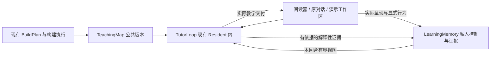

# Tutor 全局模式、教学预构建与演示工作区切片方案

日期：2026-09-29。状态：T0–T12 已实现；[T5A 大材料教学预构建](#t5a-大材料教学预构建) 实施中（4/5），T13 待实施。T1–T2 见 [工作区与控制验收](performance/tutor-t1-t2-20260929.md)，T3–T5 见 [教学基座验证与限制](performance/tutor-t3-t5-20260929.md)。T6–T8 见 [交付、教学循环与行为记录](performance/tutor-t6-t8-20260929.md)，T9–T12 见 [判定、证据与理解视图](performance/tutor-t9-t12-20260929.md)。

决策入口：[ADR-0141 全局控制与会话](adr/0141-global-tutor-control-and-session-ownership.md)、[ADR-0142 公共教学基座](adr/0142-grounded-teaching-map-and-whole-source-readiness.md)、[ADR-0143 教学事实与证据](adr/0143-teaching-trace-assessment-and-learning-evidence.md)、[ADR-0144 演示工作区](adr/0144-shared-presentation-conversation-workspace.md)。术语以 [CONTEXT](../CONTEXT.md) 为准。

2026-10-09 接续：[ADR-0158](adr/0158-book-structure-ready-tutor-and-optional-teaching-assets.md) 与 [Tutor 预构建不阻塞教学方案](切片方案-Tutor预构建不阻塞教学.md) 已接受，T14 文档、T15 共享合同、T16 来源教学、T17 使用观察和反馈适配、T18 连续使用与界面已完成，T19 待实施；Server 启动、回合和本机/发布界面已接通新准入。本文保留 T0–T13 的原实现与设计背景；下文“整份正式资产就绪才进入 TutorLoop”及强制对象绑定以新方案为准，原对象构建、交付与证据质量规则继续有效。

## 0 对齐确认单

**FrozenIntent**：以应用级 Tutor 开关连接阅读、聊天和交互演示，基于有来源依据的公共教学基座与私人学习证据持续教学；用户能在演示页内操作、提问、查看回答、继续学习。正式教学有可回放依据，普通阅读与富呈现独立可用。

**确认依据与 RiskReceipt**：用户已确认完整 Tutor 流程及教学预构建方法，并于本轮明确授权“可以，那就落adr和切片方案吧”。按已确认的整体方案收敛公共/私人所有权、预构建成本与就绪门槛、实际帮助条件与学习判断之间的边界。本次交付为设计文档，实施进度按下表记录。

**ChangeType**：`[模型扩展] [边界重构]`。

| 术语 | 状态 | 收敛含义 |
| --- | --- | --- |
| TeachingMap、LearningObject、ReasoningEpisode、ReasoningPattern | EXISTING | 公共对象、关系与有来源的认知素材 |
| 正式学习就绪、LearningObjectRef | BOUNDARY_CHANGE | 四类资产共同就绪；对象身份与内容修订分开，关键关系共用正式身份 |
| LearningMemory、TutorSession、TutorSessionMode | BOUNDARY_CHANGE | 私人控制与证据；一个当前会话；教法与全局开关分开 |
| TutorControl、演示工作区 | NEW | 应用级显式教学控制；当前演示与原对话的共同交互空间 |
| TutorLoop、TeachingMove、ResolvedInteractionIntent、LearnerContext | EXISTING | 现有 Resident 内有界、依现场选择的教学循环 |
| AgentPresentation、PresentationState、TutorPresentation、TutorInteraction | EXISTING | 内容版本、浏览器现场、实际教学交付、类型化用户行为分别表达 |
| InteractionTrace、AssessmentContract、ResponseAssessment、LearningEvidence | EXISTING | 事实、预先冻结的评分合同、题目判定、解释性学习证据分别表达 |
| PathProgress、LearnerKnowledgeState、User Understanding Space | EXISTING | 证据驱动的私人投影，无依据保持未知 |
| ResidentGoal、ProfileFact、BuildPlan | EXISTING | 分别拥有聊天交付任务、稳定画像、已确认构建范围与预算 |

领域对齐完成；上述术语均有确定归属与定义，剩余字段命名和局部布局由实施切片按本合同细化。

## 1 当前基础与交付顺序

当前 [AgentPresentation](../packages/web/src/components/AgentPresentation.vue) 支持同一实例展开、现场保存、追问与显式恢复，[PresentationFollowUp](../crates/runtime/src/presentation.rs) 保存确切版本及不可变现场回执。T1 将原聊天的 transcript/composer 显示在演示旁；[服务端追问入口](../crates/server/src/presentation_api.rs) 仍要求回执属于当前书的活动聊天，跨聊天教学引用由 T6 的显式 teaching_ref 扩展。

[Build Workbench](../packages/core/src/build-workbench.ts) 已有 Pass1、profile sidecar、可选 Pass2 与 BookStructure 的阶段依赖；T3–T5 已接入小材料的正式对象、重点认知素材与正式学习发布阶段，T5A 补齐大材料构建。[Memory](../crates/memory/src/lib.rs) 保留私人画像和阅读记录，新增 [learning.rs](../crates/memory/src/learning.rs) 持有 TutorControl/TutorSession 的 SQLite 事件及投影；T6 的 teaching.rs 追加 Trace，T11 已接通正式 Evidence 闭环。

| 切片 | 状态 | 产出 | 直接依赖 |
| --- | --- | --- | --- |
| T0 | 已完成 | ADR、术语、Grill 收敛与本方案 | 已确认设计 |
| T1 | 已完成 | 同一演示内继续原对话 | T0、现有 RP 能力 |
| T2 | 已完成 | learning.db、全局控制与会话生命周期 | T0 |
| T3 | 已实现 | 正式对象、关系与身份合同及构造 | T0、现有公共资产 |
| T4 | 已实现 | 按目标和缺口构造重点认知素材 | T3 |
| T5 | 已实现 | 构建 DAG、质量验收与正式就绪发布 | T3、T4 |
| T5A | 实施中（4/5） | 大材料分块构造、跨块对齐、有界认知/审阅与整份发布 | T3、T4、T5 |
| T6 | 已实现 | 实际交付 Trace 与跨聊天教学引用 | T2 |
| T7 | 已实现 | Resident 内首个可连续的 TutorLoop | T2、T5、T6 |
| T8 | 已实现 | 演示页类型化教学行为与帮助记录 | T1、T6、T7 |
| T9 | 已实现 | 冻结评分合同与封闭题判定 | T8 |
| T10 | 已实现 | 开放回答的有依据判定 | T9 |
| T11 | 已实现 | 学习证据与可回放状态投影 | T6、T9、T10 |
| T12 | 已实现 | 有界 LearnerContext、理解空间及反馈适配 | T7、T11 |
| T13 | 待实施 | 含大材料的真实构建与完整学习体验验收 | T1–T12、T5A |

T1–T12 已完成原有工作区、控制、公共基座、持续教学、判定、证据与适配。当前 Tutor 使用体验按新方案 T15 → T16 → T17 → T18 → T19 推进；T5A → T13 保留为完整教学预构建与其消费质量的验收链，不再阻塞 Tutor 使用体验的实现和验收。

## 2 三个领域与所有权



| 边界 | 权威内容 | 现有模块接点 |
| --- | --- | --- |
| TeachingMap | 来源版本、正式对象、关系、认知素材、覆盖与发布回执 | `packages/core`、现有只读书籍访问、构建 artifact 发布 |
| LearningMemory | ProfileFact、全局控制、会话事件、Trace、Assessment、Evidence | `crates/memory`、现有读者私有目录与 Server 状态端口 |
| TutorLoop | 当前观察、动作选择、素材组合、反馈使用 | `crates/runtime` 的 RunContext、工具发现、原有 Resident 循环 |
| Reader 与演示宿主 | 真实视口、页面版本、当前现场、用户操作和可见交付 | `packages/web`、`crates/server` 的 presentation 与 Reader 入口 |

LearningMemory 是逻辑边界。已有稳定画像继续由 `memory.json` 持有；`learning.db` 与其同属当前读者的私有目录，保存全局控制、会话及动态学习数据。公共教学产物只进入书籍版本化资产。聊天消息保留内容与教学引用，不能代替学习存储；聊天压缩不会删除或改写学习事实。

Trace 与 Evidence 采用追加记录；对判断的修订以新版本/替代关系表达。会话当前状态、PathProgress 与 LearnerKnowledgeState 可按事件/证据重建。SQLite 内一次生命周期操作与对应事件一起提交；网络或 UI 重试通过既有操作身份返回同一结果，避免重复作答、重复帮助或重复证据。ProfileFact 不迁移到新库。

## 3 全局控制与教学会话

最小合同表达职责，具体序列化名字由 T2 固定：

```text
TutorControl = { enabled, revision, current_tutor_session_id? }
TutorSession = {
  id, revision, status: active | paused | ended,
  user_intent: { text, explicit_constraints },
  current_focus: { interpretation, target_object_refs, capability_targets },
  material_scope: [{ source_id, scope_refs, role: primary | supporting }],
  default_teaching_intent?, path_instance_ref?, progress_ref?
}
TurnTeachingBinding = {
  tutor_session_id, session_revision, control_revision,
  applicability: in_scope | supporting | outside,
  resolved_interaction_intent, intent_origin, teaching_map_revision_refs
}
```

`default_teaching_intent` 使用有界交互意图表示已经明确的会话教法；用户尚未设置时为空，按已确认偏好或中性教学选择处理。它不要求用户在进入前完成模式配置。首版一个 current 指针，最多一个 active 会话；历史可保持 paused 或 ended，恢复历史是显式操作并留下事件。

全局按钮放在应用顶栏，Reader、聊天及演示工作区显示同一状态。首次使用关闭，持久化后跨导航与重启恢复。`enabled` 是用户意图，当前是否能开始教学由有效会话和 readiness 投影，不能把“准备中”偷偷保存成关闭。

| 用户动作或当前条件 | 确定行为 |
| --- | --- |
| 开启；存在适用的暂停会话且材料就绪 | 恢复当前会话，从已保存进度继续 |
| 开启；无会话，当前有就绪材料 | 根据当前阅读/问题建立暂定焦点，交付一个起步动作，用户可直接纠偏 |
| 开启；当前无材料 | 保留开启状态，选择材料后再开始；不建立空学习目标 |
| 开启；必需资产未就绪 | 显示尚需准备的内容；普通阅读和问答继续，构建入口沿用已确认计划与预算 |
| 关闭 | 当前会话暂停，停止后续教学动作；保留既有事实、回答、草稿、进度和页面现场 |
| “这次直接讲解” | 当前回合采用直接解释，保留全局开关与会话默认教法 |
| 暂停/结束一次学习 | 保存对应会话事件；全局开关保持原值，结束后等待新的学习请求或显式继续入口 |
| 明确开始另一项学习任务 | 暂停原当前会话，创建或切换目标会话；已明确的用户方向直接采用 |
| 翻页、换演示、临时查另一本书 | 只改变阅读/参考现场，不自行建立新目标或结束当前学习 |
| 新聊天或聊天压缩 | 当前 TutorSession 继续存在；新回合按其真实请求判定是否适用 |

材料范围表达来源身份、段落/章节范围及主材料/辅助材料角色，学习意图不等于来源列表。Agent 在当前意图内补背景、换例子与调整焦点；最终目标、要求达到的能力深度或持续任务改变时，由用户表达或接受。范围外普通请求不继承会话教法，也不结束当前学习。

消息预提交保存教学关联，运行使用该回合冻结视图。控制变化影响后续动作：关闭或显式切换会停止旧会话的自动推进，并在交付/教学状态写入前重新确认有效归属。已接纳的交付、用户动作和判定可保留，不能因关闭抹掉；不再追加下一题。普通解释或用户明确要求的页面制作继续沿原 Resident 取消语义，布局切换不取消运行。

跨材料正式学习目标必须引用相应已就绪 TeachingMap；尚未就绪的另一材料可作普通来源查阅，不据此建立该材料的正式能力判断。准备任务完成只更新 readiness；用户仍在适用现场时可继续先前明确的学习请求，离开后通过“继续学习”入口恢复，不能因后台完成而抢占另一项对话。

## 4 演示工作区的完整交互

桌面展开后约三分之二为演示、三分之一为对话，可调整分隔比例，两个区域独立滚动。窄屏优先展示演示，讨论按需展开；输入时保留压缩的提问现场摘要，打开工作区不自动唤起键盘。应用级 Tutor 按钮始终可访问。

工作区是原对话的另一个视图。消息、运行活动、输入草稿和发送入口由共同宿主持有；打开时滚到该演示相关回合，更早历史仍可访问。对话中的其他演示先显示引用卡，显式选择后替换工作区内容，不嵌套另一套完整工作区。收起回到原对话对应位置。

```text
操作演示
  → 输入问题（可带选中文字/对象）
  → 发送时同步采集，保存确切 PresentationFollowUp
  → 消息附带现场摘要与版本，提交到同一对话的 Resident run
  → 回答/活动在工作区对话区出现
  → 继续操作、继续追问，或显式打开新版本
```

绑定卡说明问题所指版本、参数或步骤，发送前可以移除绑定而成为普通聊天。保存失败时保留草稿，明确失败原因并允许重试；不能静默改用最新现场或无绑定发送。发送后用户可继续拖动、切换步骤，已经发出的现场不变。

“定位到演示”只突出相关对象或步骤位置；“回到提问时”才恢复保存现场，恢复前沿现有保存路径保留当前现场。来源先原地预览，显式进入原文时保留演示返回点。要求修改内容时，新版本以结果卡交付，用户点击后切换；旧消息、旧答案与旧快照保持其原版本。

优先保持同一 iframe/演示核心实例，内嵌与展开只改变宿主布局。必须重建时复用现有异步 restorer 和现场保存合同；实例切换、窄屏键盘与恢复失败不丢失同一应用会话内的草稿。不额外承诺尚未实现的跨应用重启草稿恢复。

普通工作区仍绑定内容所属聊天。TutorSession 跨聊天续学时，当前消息可携带明确的旧内容/旧教学交付引用，经服务端读取原归属内容和快照，再在当前聊天产生新回应；不改写旧 PresentationFollowUp 的 session_id，也不把旧回答伪装成当前聊天交付。

## 5 正式对象与关系构造

公共基座分为四类：可信原文与锚点；整份材料的结构、主题线和重点入口；正式对象及有依据的关系；重点入口所需认知素材。前三类提供定位与语义参照，第四类保留足以展开重点的认知链。

```text
LearningObjectRef = { source_id, object_id }
LearningObjectRevision = {
  ref, object_revision, teaching_map_revision,
  meaning, kind, source_bindings, aliases,
  participants_and_roles?, conditions?, component_refs?
}
TeachingPrerequisite = {
  target: { object_ref, capability },
  prerequisite: { object_ref, capability },
  conditions, source_bindings
}
```

构造按以下步骤推进：

1. 使用 Pass1、sidecar discourse/formula semantics、BookStructure 及计划内 Pass2 提供候选，沿来源锚点读取必要原文。
2. 判断内容含义与成立条件；同义表达可以归并，同名异义或有实质条件差异的内容分别表达。章节标题、节点名和文本相似度只用于召回。
3. 按需独立追踪且会影响教学选择的理解内容确定粒度；识别、解释、应用属于能力轴，题目和提示属于活动条件，均不据此复制对象。
4. 对可学习关系保存参与对象、各自角色、具体关系含义、条件与依据；与已有断言表达同一内容时复用同一正式身份，图连线引用该对象。导航联系和材料顺序保留结构身份。
5. 校验字段、来源可解析性与引用完整性后，系统为新对象分配稳定 ID；重跑和普通内容修订复用已确认身份。实质拆分/合并建立新身份及显式对应，原对象和历史证据仍可解释。

对象 ID 在来源内稳定，修订另行编号。跨书同名对象首先保持各自来源身份；只有明确语义对应才可用于跨材料教学推断，推断保留原证据及对应依据，不复制成另一对象的直接观察。首版可以跨书引用和阅读，无须先建全局概念合并器。

前置依赖必须区分目标能力和前置能力。例如直观解释导数与从极限独立推导导数，前置要求不同。公共关系描述内容条件；用户是否已经具备能力来自私人证据，未知不能自动判为欠缺，也不能沿包含关系推导整体掌握。

## 6 重点认知素材的预构建方法

默认以 `BookStructure.key_stops` 为 ReasoningTarget，结合结构单元和主题线检查重点覆盖。目标之外的有来源 claim、公式或具体问题可按需展开；新增素材仍经过相同来源和版本接纳，不改变整份材料首次就绪的单位。

按内容选择素材形态：定义保留边界、条件及正反例；论证构造 ReasoningEpisode；方法保留步骤、依赖和约束；比较保留比较轴和成立条件；因果解释保留机制及证据。ReasoningPattern 用于可复用的组织方式，不把所有内容塞进论证模板。

```text
construct_material(target, accepted_assets, budget):
  read target source and its necessary local context
  establish what the material must explain
  while an important definition / premise / evidence / connection is missing:
    retrieve linked candidates and relevant unlinked discourse fragments
    inspect bounded summaries and exact source previews
    select and reread only the necessary original passages
    add grounded steps and explicit source bindings
    stop if the chain is sufficient or a genuine source gap is established
    if the work budget ends first: persist incomplete work for resume
  return grounded material + source gaps + coverage receipt
```

已有图连接只是检索入口，还要按缺口查找未连接的定义、条件、反例、公式解释或论证片段。候选检索返回标识和短摘要；预览返回有界精确原文；被选中的片段才进入构造上下文。检索、原文读取、上下文组装分别计入预算，避免把整章或所有命中一次塞进提示词。

ReasoningEpisode 的停止点是解释目标所需的最小充分链。材料自身跳过论证、前提缺失或条件未交代时保留具体缺口；Agent 的补充解释单独标注为假设或扩展。预算不足、任务中断、尚未读完候选不能写成“作者没有提供依据”。

例：某公式 key_stop 需要解释符号定义、适用条件与中间变换。现有 sidecar 给出符号，BookStructure 给出章节入口；先回读公式及条件，再检索未连接的前置定义。若必要连接在原文中，纳入步骤；原文确未给出时保留该连接缺口。以后让用户辨析“缺少什么条件”可以产生有效表现；要求用户证明这条缺失推论则不能预设唯一正确答案。

预构建结果是公共可复用素材。用户目标可以决定已批准工作的优先级，但不改写来源内容；具体课程顺序、问题、提示、动画与富文本页面由读时 Agent 结合当前需求选择或制作。

## 7 构建接入、质量与版本发布

在现有 BuildPlan/DAG 内增加三项正式学习职责；阶段名由 T5 固定到合同：

```text
可信原文 → Pass1 → profile sidecar → BookStructure
                        └→ Pass2（计划内可选）
  已接纳的上述资产 → formal_objects → cognitive_materials → teaching_publish
```

正式对象构造消费所需的已接纳版本。计划启用 Pass2 时按依赖消费其结果，未启用时仍须用其他资产和定向原文查找完成必需关系。工作拆分沿现有 work unit、handoff、预算、接纳与恢复；原有构建控制器负责派发，新增语义阶段不拥有另一个执行器循环。

| 资产类别 | 覆盖义务与验收结果 |
| --- | --- |
| 可信来源 | 整份材料已通过现有来源门槛；引用指向确切来源版本与可解析锚点 |
| 结构与入口 | spine 单元、主题线及 key_stops 覆盖整份材料；缺段或未处理单元明确阻止发布 |
| 对象与关系 | 各结构单元完成候选整理，保留正式引用或有来源说明的适当空结果；角色、条件与前置能力可追溯 |
| 认知素材 | 每个必需 key_stop 有适用素材及来源；真实来源缺口随素材保存，待处理工作不冒充空结果 |

确定性接纳检查字段、引用、版本一致性、重复身份、覆盖义务与未完成任务。独立语义抽样直接回读来源并对照产物，覆盖各主题/结构区域的样本，重点检查定义和条件遗漏、误归并、关系依据及论证连接；审阅者不能只看生成摘要或生成者的自评分。

发现错误后修复相应对象/素材并重验受影响范围；多个样本暴露相同原因时才扩大该类型的覆盖审阅。抽样是成本有界的错误发现机制，不能证明整本绝无语义错误，也不替代用户阅读时纠正来源解释。

发布回执绑定 `source_version + teaching_map_revision + required_coverage + accepted_artifact_refs + quality_report`。四类义务满足后才切换可见的已发布教学版本；准备中或失败的候选不取代旧版。原文可读、构建进度、正式就绪分别展示。原来源已变化而没有对应就绪版本时，新正式活动等待更新，仍可使用普通阅读入口。

活动开始时绑定教学版本，进行中的题面、评分合同和证据不随后台发布变化。后续动作可采用新的就绪版本；继续旧活动时须能够读取当时的依据，不能用新原文悄悄替换。来源无法回读时显示具体不可用状态并暂停依赖它的判定。

全局 Tutor 开关不会自动扩大构建范围或预算。已有确认涵盖必需工作时继续执行；新增加的昂贵工作通过现有构建计划入口呈现具体范围和成本，沿 [ADR-0093](adr/0093-intent-confirmed-progressive-prebuild-and-reader-private-goal-artifacts.md) 处理。

## 8 教学交付、判题与私人证据

```text
实际交付 TutorPresentation + 已暴露帮助 + 用户动作
  → InteractionTrace
  → 可判题时：预先冻结的 AssessmentContract → ResponseAssessment
  → LearningEvidence
  → PathProgress / LearnerKnowledgeState / 用户理解空间
  → 下一回合有界 LearnerContext
```

**交付与行为合同。** 一个 TeachingMove 可组合聊天文字、来源与演示，一张演示可服务多个动作。TutorPresentation 保存实际展示的内容、来源身份、回答方式及帮助条件；AgentPresentation 是其中可能采用的内容版本，PresentationState 是对应浏览器观察。

```text
TeachingDelivery = {
  tutor_session_ref, move_id, activity_id?, turn_ref,
  target_object_refs, capability_targets, teaching_map_revision_refs,
  actual_text_or_content_refs, presentation_ref?, saved_state_ref?,
  available_response_actions, assessment_contract_ref?, assistance_refs
}
LearnerAction = {
  action_id, activity_id, delivery_ref,
  action: submit | revise | request_hint | reveal | skip | self_report,
  response?, presentation_ref?, saved_state_ref?
}
InteractionTraceEvent = {
  event_id, session_ref, causal_refs, occurred_at,
  kind, actual_payload_or_durable_ref
}
```

正式活动的宿主控件发送 LearnerAction；页面脚本负责视觉和局部计算，不直接写入 Assessment 或掌握状态。滑块、动画播放等保留现场观察，不自动生成评分或能力结论；明确提问、提交、提示和步骤边界才触发相关保存与运行。

Trace 区分内容已保存、回答已提交、界面实际展示及用户动作。只有真实挂载/展示的交付才能作为用户已接触材料的依据；已生成但未采用的候选不计入。宿主提交实际内容引用和观察回执，重复回执不产生重复事件；网页没有连接时不得宣称用户看到了新题。

请求提示与提示实际展示是两件事。帮助记录累积到同一 activity：回退画面、重开页面、新聊天或关闭再开启 Tutor，都不能抹掉已经展示的答案。普通模式中对同一活动的直接解答也保留帮助事实；暂停时接纳这类事实不表示自动教学仍在运行。后续新的独立回忆活动可以产生新证据，旧帮助只作为相关历史条件保留。

**评分合同。** T9 在活动交付前冻结 AssessmentContract：确切题面/版本、对象与能力轴、判定类型、答案键或原子 rubric、来源与允许规则、部分正确及不确定策略、反馈和答案揭示条件、评估器版本。答案键由宿主持有，揭示前不送入可见页面或普通回答上下文。

封闭题按键值、集合、步骤或已知计算关系确定性判定；开放回答按原子标准逐项给出支持/不支持/无法确定及引用，再检查项目完整性、来源引用与合同一致性。原子标准包括必要条件、允许的等价表达和可接受的不足；不能把语言流畅当正确。自评只记录用户自述。

ResponseAssessment 区分 `correct / partial / incorrect / uncertain / unassessed`。内容或来源不足以判定为 uncertain；尚未执行、运行失败等为 unassessed。对改答分别保存尝试与各自帮助条件；用户跳过不自动计为错误，来源未闭合时暂停依赖该推论的评分。

**证据与投影。** LearningEvidence 引用精确 Trace 与可用 Assessment，记录对象、能力轴、assistance、attempts、context、解释依据、解释器版本及替代关系。无评分的解释、辨析或个人理解也可产生有依据的证据；简单阅读、停留或好感不能生成能力判断。不会把“看了提示后答对”改写为“独立掌握”。

PathProgress 表达当前路径已发生的推进及帮助条件；LearnerKnowledgeState 按对象与能力轴汇总相关证据，不以统一布尔值覆盖原记录。投影保存 `estimator_version + evidence_watermark + teaching_map_revision_refs`；中断可恢复，重建后同版本/同证据得到同结果，陈旧投影对 Agent 明示新鲜度。

User Understanding Space 综合呈现公共对象及关键关系、用户原话、相关实际表现与可修正理解假设。纠正某次系统判断会产生新的解释记录，保留原事件；无证据显示未知。公共关系不会直接填充用户能力，私人解释也不会成为公共知识。

## 9 Resident 中的 TutorLoop

```text
on_user_request(request, optional_scene_receipt):
  resolve ordinary request and its exact source/scene references
  read persisted TutorControl and applicable TutorSession
  start/resume a session only when the explicit enable/start/continue action permits it
  if disabled, no active session, or outside session scope: use ordinary Resident behavior
  if required TeachingMap is not ready: report preparation state; keep ordinary behavior
  freeze session/control/map refs and bounded LearnerContext
  resolve intent: current explicit request > session default > confirmed preference > neutral
  Agent selects or composes one bounded TeachingMove
  use existing source, presentation authoring and delivery capabilities
  record actual delivery and explicit learner actions
  assess only when a frozen contract applies
  derive evidence and refresh relevant projections
  choose a next move only while the same teaching context is still active
```

每回合自动提供稳定环境说明及精简现场：当前用户意图、会话焦点与材料、全局状态、就绪版本、正在看的内容和已提交现场、相关学习状态及新鲜度。较长原文、认知素材、历史 Trace 和其他对象状态按需读取；表现判断必须取到具体呈现、帮助和用户回应。

顶栏开启、开始学习和继续学习同样是用户动作入口，按 §3 解析为本轮请求并记录生效原因；readiness 更新本身不生成新的学习请求，继续等待中的明确请求仍按 §3 检查当前现场与用户控制。这样无须用户另发一句聊天才能启动，也不会在用户结束会话后凭页面重渲染重开教学。

首个动作可以是观察、对比、例子、来源定位、局部解释或问题。GuidedInquiryPolicy 仅在当前意图与目标适合时让用户先预测、辨析或重建；不规定全程提问，也不以连续题目代替理解。直接讲解请求优先采用，并如实记录已提供的帮助。

运行、取消、工具发现、活动展示和用量沿用 Resident。PathPlanner、ContextBuilder、Estimator 是该边界内的函数职责；不会按名词数量新增顶层服务。自动推进以实际反馈和用户控制为边界，不因 idle、参与度或一次回答擅自结束会话。

## T1 同一演示内继续原对话

**实施结果**：已完成。App 保留工作区选择和共同草稿；RightRail 复用原 transcript/composer，同一 iframe 展开/收起，窄屏讨论切换；绑定卡读取确切快照，显式恢复先保存当前现场，新版本点击后打开。历史 API 已投影原回执。实际验证见 [T1–T2 记录](performance/tutor-t1-t2-20260929.md)。

**输入 → 产出**：现有 RP 版本、现场回执及聊天状态 → 演示/对话共同工作区、绑定卡、显式恢复与换版。所有权落在 `App.vue` 的共同会话状态；可按职责提取共享 transcript/composer，`AgentPresentation` 只持有内容实例和局部观察。

**主要位置**：`packages/web/src/App.vue`、`components/RightRail.vue`、`components/AgentPresentation.vue`、`presentation-host.ts`、`presentation.css`，现有 `api.ts` 和聊天运行状态。只有确需改变 API 时才触及 Server；不复制另一套消息存储。

**完成判据**：真实浏览器内操作→提问→同屏得到回答；发送后改变参数仍回答原快照；缩放、窄屏输入、打开来源再返回保留现场与草稿；新版本等待显式打开；收起/展开不重建正在运行的页面。保存失败保留草稿并显示失败。扩展现有 `AgentPresentation.test.ts`、`RightRail.test.ts` 与 Playwright presentation-follow-up/recovery 场景，定位失败后修正状态所有权或恢复路径。

## T2 全局控制、私人存储与教学会话

**实施结果**：已完成。Memory 的 SQLite 库按事件/revision 保存控制与会话，使用同一私有目录与权限入口；Server 提供状态/动作 API，Web 顶栏和演示工作区共享控制，失败保留原状态并复用操作身份重试。T2 阶段开启只保存用户意图；T5 接入独立就绪读取，T7 已让显式开启/开始/继续在素材就绪时进入 Resident 教学回合。实际验证见 [T1–T2 记录](performance/tutor-t1-t2-20260929.md)。

**输入 → 产出**：§3 生命周期及现有 Memory 私有目录 → SQLite 学习存储、全局状态读写、独立会话 API 与顶栏开关。按事件与 revision 保存会话；首版 UI 可展示“已开启，教学准备中”，尚未接入的 TutorLoop 不伪装成功运行。

**主要位置**：在 `crates/memory/src/` 增加学习存储与会话模块，`crates/memory/Cargo.toml` 增加实际 SQLite 依赖；Server `host.rs` 及状态/API 接入；Web `TopBar.vue`、`App.vue` 和 `api.ts`。类型沿现有生成方式共享，长期 ProfileFact 路径保留。

**完成判据**：用真实临时数据库验证开启/关闭、重启、显式切换、暂停/恢复/结束、单一 current 约束及事件回放；存储失败时 UI 不宣称保存成功。跨 Reader/聊天/演示显示同一状态；普通问答不受“未就绪”阻塞，翻页和新聊天不自动改目标。现有画像回归继续通过。

## T3 正式对象与关系构造

**实施结果**：`teaching-map.ts` 接纳来源绑定的语义提案，分配稳定身份，保存内容修订、能力前置及显式拆并；图边引用关系。完整小材料覆盖同义、同名异义、条件关系和复合对象，已对照原文判读。正式对象任务接入既有执行协议，当前大小边界见 §11。

**输入 → 产出**：已接纳 Pass1/sidecar/BookStructure 与来源 → 正式对象和关系合同、身份分配及语义整理入口，可由既有执行协议调用；小型全材料夹具验证产物，无需重跑整套来源抽取。

**主要位置**：`packages/core/src/` 新增 TeachingMap 对象合同与构造模块，复用 `book-structure.ts`、`book-structure-evidence.ts`、sidecar 和 `merge.ts` 的候选能力；在 `agents/` 增加有界语义任务说明。既有候选图仍保留自身用途。

**完成判据**：夹具覆盖同义归并、同名异义、条件不同的关系、复合对象、能力轴不另造身份、图边引用正式关系、来源缺失拒绝接纳；同一已接纳输出恢复后身份不变，实质拆并保留旧引用。语义样本必须对照真实来源人工/独立判读，不能只验证字段合法。失败定位到归并规则或输入包后定向修正。

## T4 重点认知素材构造

**实施结果**：`cognitive-materials.ts` 按 key_stops 执行有界检索、预览、全文读取和素材接纳；每步持久化，可恢复用量和已读原文。真实缺口保留检索/读取证据；预算中断保持未完成，方法素材无需推理链。原文按完整 LID span 读取，未使用截短 excerpt 代替全文。

**输入 → 产出**：正式对象、key_stops、discourse 与原文 → 有来源的定义/比较/方法素材及 ReasoningEpisode，带覆盖回执、真实缺口或可恢复的未完成状态。

**主要位置**：`packages/core/src/` 新增认知素材生成与材料合同，复用 `book-structure-generation.ts`、`book-structure-evidence.ts` 和来源读取职责；`agents/` 增加相应任务说明。检索、预览和读取使用明确的输入输出预算。

**完成判据**：至少包含“必要定义未被图连上”“作者省略连接”“预算在必要读取前耗尽”“内容是方法而非论证”四种来源样本；能补到未连接定义，真实来源缺口可回读，耗尽预算保持 incomplete，方法不强制生成虚假推理链。每种失败修正对应检索、停止或素材选择规则。

## T5 构建接入与正式学习发布

**实施结果**：三个阶段接入 BuildPlan/DAG、generation work unit、现有执行器与原子发布；Pass2 仍可选。独立来源审阅失败阻止发布，修正轮保留旧身份；不可变版本和 readiness 一同发布。Server/Reader 分别表达阅读、教学就绪和全局开关。小材料完成启用/停用 Pass2、恢复及拒绝发布路径；预算确认、取消、阅读状态回归通过。证据范围见 [验证记录](performance/tutor-t3-t5-20260929.md)。

**输入 → 产出**：T3/T4 可接纳产物 → 三项职责接入现有 BuildPlan、DAG、work unit 与版本发布，独立读取正式 readiness，Reader 显示准备与可开始状态。

**主要位置**：`packages/core/src/build-workbench.ts`、`build-orchestrator.ts`、`build-intent*.ts`、`stage-work-unit.ts` 及实际 automatic-build 接纳/发布模块；按需调整 `skills/build/automatic-build.ts`、`automatic-build-driver.ts` 的阶段投影，不改变宿主 handoff 协议；Server/Reader 增加正式就绪投影。

**完成判据**：执行一个真实小型整份材料构建，启用/未启用 Pass2 均能按各自计划运行；缺必需产物、覆盖未完成、来源错版或抽样错误不能发布；修复后恢复不重复已接纳工作。来源有明确缺口仍可发布受限素材，预算中断不能冒充就绪。已有原文阅读、构建预算确认与取消回归通过。

## T5A 大材料教学预构建

**状态与依赖**：实施中，前四项代码已实现并通过针对性测试，真实长材料验收待完成；[实现记录](performance/tutor-t5a-20260929.md) 保存进度及验证。依赖 T3、T4、T5，完成后进入 T13。遵循 [ADR-0142](adr/0142-grounded-teaching-map-and-whole-source-readiness.md) 的对象身份、来源依据与整份就绪合同。

**输入 → 产出**：可信完整来源与已接纳的 Pass1、profile sidecar、BookStructure、计划内可选 Pass2 → 可恢复的局部候选、跨块对齐结果、正式对象与认知素材、独立来源审阅及整份 TeachingMap 发布回执。每次语义任务的输入与输出均有界，整份覆盖完成后发布正式教学版本。

**实现边界**：对象输入超限进入局部候选与跨块对齐；认知与审阅使用有界读取上下文，完整历史持久化；修复按失败样本和依赖定位受影响任务。每次实际模型输入仍受 6,000 估算 token 上限约束。单项不可分内容超限时保持未完成；真实模型质量与整份长材料体验由最后的验收步骤确认。已有身份、来源校验、构建预算、接纳、恢复和原子发布继续承担原职责。

```text
已接纳公共资产 + 来源范围
  → 有界局部对象候选 + 范围覆盖
  → 分批跨块语义对齐 / 关系补全
  → 代码组装正式对象与稳定引用
  → 按 key_stop 选择对象与原文，逐步构造认知素材
  → 有界独立来源审阅 ⇄ 修复受影响任务
  → 整份覆盖验收 → 发布 TeachingMap 与 readiness
```

**主要位置**：`packages/core/src/teaching-build.ts`、`teaching-map.ts`、`cognitive-materials.ts` 及相应测试；任务拆分接入 `build-orchestrator.ts`、`stage-work-unit.ts`、`teaching-policy.ts` 和现有 automatic-build 派发、接纳、关闭与质量入口；`agents/` 的教学任务合同与 `skills/build/automatic-build.ts` 同步实际任务形态。复用 `model-input-slice.ts` 的来源范围切分，以及 BookStructure 的有界路由、归并和覆盖能力。Server/Reader 验证最终版本及 readiness 消费。

**切片内接续点**：按以下顺序实施；每步的任务、接纳产物与覆盖结果落入现有构建工作区，测试及实际证据写入 `docs/performance/`，由这些文件恢复下一步。

| 步骤 | 输入 → 产出 | 完成判据 |
| --- | --- | --- |
| 1. 局部候选与范围覆盖 | 来源、相关结构与候选 → 多个有界对象候选任务、范围覆盖回执 | 按完整序列化输入计算预算；候选元数据或单条长 LID 过大时继续拆分。每个来源核心范围恰好覆盖一次，邻接上下文可重叠；无独立对象的范围保留有来源的说明。超限来源能派发多个任务，断点恢复复用已接纳产物。 |
| 2. 跨块对齐与正式组装 | 局部候选、结构/主题线和来源线索 → 对齐决策、关系及正式引用 | 局部候选使用临时键；按需召回跨块候选并回读来源，完成同义、同名异义和条件关系判断。各批决策解析到一致引用，由代码组装全量对象与覆盖；任务及候选目录按需分页，归并输出保持有界。重跑身份稳定，修订与实质拆并沿 T3 合同保存。 |
| 3. 有界认知构造 | 正式对象、目标与已保存工作 → 每个必需 key_stop 的素材 | 当前输入只含目标相关对象、必要原文及待解决缺口；完整读取记录留在持久化状态。长 LID 支持片段读取，引用的读取依据精确到实际片段。跨块、未连边的必要定义可以检索并读到；多步恢复保留累计用量，预算中断仍为 incomplete。 |
| 4. 来源审阅与定向修复 | 待审对象/素材、对应来源和依赖 → 审阅回执、受影响任务及发布版本 | 审阅按样本和必要来源上下文组装，过大时继续拆成明确审阅义务；覆盖结构区域、关系/复合对象、素材形态、缺口及空结果。失败定位到相应对象或素材，按依赖重验受影响任务；未受影响的接纳产物可复用。缺块、未解引用、必需任务未完成或审阅失败均阻止发布。 |
| 5. 真实长材料构建 | 一份完整、原始教学输入实测超限的真实来源 → 模型构建、恢复、发布与 Reader 就绪记录 | 使用真实模型完成局部候选、跨块对齐、认知素材和独立来源审阅；验证一次中断续跑与一次定向修复。保留来源判读、任务大小、实际用量、等待时间和复用任务记录，Reader 能读取发布版本及代表性对象/素材。该来源交给 T13 继续完整体验验收。 |

**语义样本**：将既有平均速率材料的定义与后续推导分置不同构造块，保留等距离调和平均和等时间算术平均的不同条件；同名“速度”的路程量与位移量分别表达。来源判读还覆盖长段落末尾的必要定义、无候选图边的跨块前提及作者确实省略的连接。真实长材料另保留独立的来源对照记录。

**完成判据**：上述五步全部完成，所有实际派发输入、输出额度与传输均满足既有预算合同；完整来源、对象、重点认知素材和审阅义务全部接纳后才发布。技术书籍与论文入口、小材料以及 Pass2 启用/停用路径通过受影响的回归；已发布旧版本和旧学习对象引用在构建中断、修复及新版本发布后仍可回读。真实模型完成大材料预构建与 Reader 就绪验证，完整教学交互由 T13 验收。

**验证入口**：扩展 `packages/core/test/teaching-map.test.ts`、`cognitive-materials.test.ts`、`teaching-build.test.ts`，新增路由用例覆盖多块、单条长 LID、跨块对齐、认知上下文增长和审阅超限；按实际接点运行 work unit、派发、恢复与发布测试。失败分别回到范围路由、语义对齐、上下文选择或依赖修复职责；Server/Reader 定向验证发布版本和正式就绪。

## T6 实际交付 Trace 与跨聊天引用

**实施结果**：追加 teaching_trace 保存冻结归属、候选选择、已交付消息、可见展示、显式行为和实际帮助。正式活动保留原版本内容、来源绑定及提交现场；操作身份去重，历史已落盘而 Trace 失败可补写，关闭不抹去事实。显式 teaching_ref 可跨聊天读原版本，压缩/重开不改绑，原素材不可用则报错。 验证见 [T6–T8 记录](performance/tutor-t6-t8-20260929.md)。

**输入 → 产出**：T2 存储、现有对话/呈现回执 → 追加式 Trace、可回读实际交付、精确会话/回合/内容关联和有归属的跨聊天教学读取。

**主要位置**：`crates/memory` 学习事件模块，`crates/runtime/src/run_context.rs`、`presentation.rs`，Server 回合准备/完成与 `presentation_api.rs`、`presentation_store.rs`，Web 宿主交付/操作回执。TutorPresentation 通过引用或必要不可变快照保持证据可读，不依赖聊天摘要。

**完成判据**：真实 DB 与 Server 测试区分候选、持久化、消息交付和界面展示；重复回执只记一次，未挂载候选不成为“已看过”。另一聊天通过明确教学引用读取旧版/旧现场，普通错误归属仍拒绝；压缩聊天后证据能回读。关闭、重开后同一活动的答案暴露仍存在；源读取失败明确返回，不替换成最新版本。

## T7 Resident 内首个连续教学循环

**实施结果**：原 Resident 新增 tutor.step 的素材、Trace、动作选择与范围外退出能力；每轮冻结控制/会话/素材版本，读正式对象和真实原文后选择动作。用户回应进入下一轮；当前直接讲解优先于默认引导。普通聊天保持原工具集，关闭只允许显式旧引用只读，未就绪继续普通请求。已执行固定两轮及真实模型两轮，语义限制见 §11。 验证见 [T6–T8 记录](performance/tutor-t6-t8-20260929.md)。

**输入 → 产出**：T2 控制/会话、T5 已发布素材、T6 事实 → 原 Resident 上的教学上下文与能力入口、一个动作到真实反馈再到后续动作的最小闭环。

**主要位置**：`crates/runtime/src/run_context.rs`、`agent_prompt.rs`、`tool_registry.rs`、`tool_exposure.rs`、`orchestrator.rs` 及新教学职责模块；Server `prepare_agent_chat`、`agent_run.rs`。初期无学习证据的能力保持未知，不能用模型猜测填满状态。

**完成判据**：就绪材料＋全局开启→暂定目标→一次有依据的解释/观察动作→用户回应→调整局部讲法；“直接讲解”覆盖本轮教法；关闭后不再自动推进，普通制作不因布局变化被取消。明确新目标才切换会话，缺 readiness 则说明准备状态。使用固定模型响应测试分支，再用真实模型证明来源读取与动作选择接通。

## T8 演示页的正式教学行为

**实施结果**：宿主 TutorActivities 提供提交、改答、提示、直接讲解、跳过和自评；同页活动独立关联。页面请求仅聚焦宿主控件，动作冻结现场，帮助内容保留在服务端直至显式请求，实际可见后才记帮助展示。失败重试沿用原操作与现场，重开/切换模式保留帮助历史，页面计算不判题。 验证见 [T6–T8 记录](performance/tutor-t6-t8-20260929.md)。

**输入 → 产出**：T1 工作区、T6 Trace、T7 动作交付 → 提交/改答/提示/揭示/跳过等宿主行为合同，活动与版本/现场绑定。完成后承接原 RP8 的呈现与行为接入部分。

**主要位置**：`crates/runtime/src/presentation.rs` 与教学交互类型、Server 教学 API，Web `presentation-bridge.js`、`AgentPresentation.vue` 及宿主控件。自由 HTML/CSS/JS、Konva 和局部动画沿用当前制作能力。

**完成判据**：同页两个教学动作各自绑定，跨聊天回答仍指向原活动；拖动仅改现场，提交才产生显式行为；页面所报“正确”不能进入判定。提示请求失败不计已展示，真实揭示后回退/重开/关开 Tutor 仍记录帮助；未就绪或已暂停活动显示实际状态，普通演示照常工作。

## T9 评分合同与封闭题判定

**实施结果**：集合选择题按冻结键确定性判定，开放题冻结原子 rubric；来源正文、对象修订、活动与能力在选择阶段一同保存，交付和普通历史剥离私有规则。正式提交分别保存尝试与帮助条件，判定失败不生成错误成绩，评分持久化独立于 Trace。详细反馈实际可见后也计入后续尝试的帮助条件。

**输入 → 产出**：类型化活动 → 交付前冻结 AssessmentContract、宿主持有答案键、确定性 ResponseAssessment 和反馈揭示。

**主要位置**：Runtime/Memory 教学合同与评估职责、Server 活动准备/提交，Web 可用行为与反馈。判题先实现真实需要的封闭题型，不预建穷举题库框架。

**完成判据**：单选、集合或确定计算等至少一个完整真实活动从出题到判定可运行；交付后改标准被拒绝，旧版回答不能按新版键评分；partial、改答、跳过、揭示后的正确、重复提交各有确定结果；评估失败为 unassessed，不能写成错误或直接掌握。未揭示答案不出现在客户端交付数据中。

## T10 开放回答的有依据判定

**实施结果**：Resident `tutor.step assess` 在原运行内调用一次隔离评估，计入次数/用量并沿用取消和上下文预算；评估包只含冻结合同、原回答与来源。逐项完整性和引用由确定性规则接纳；缺项、错引、格式失败保留 unassessed，语义或来源不足为 uncertain。真实模型三组来源样本通过，依据与用量见本轮记录。

**输入 → 产出**：T9 冻结合同 → 原子 rubric 语义评估、逐项证据与确定性接纳，形成可解释的开放回答 Assessment。

**主要位置**：Runtime 评估器职责、原有模型调用与取消/预算入口、Memory Assessment 记录；来源读取复用当前可信接口。评估不另开无预算模型循环。

**完成判据**：固定来源样本覆盖等价正确表达、缺必要条件、部分成立、来源不足与模型输出不全；每项判定可回读回答片段和来源，缺项或错引拒绝接纳并保留 unassessed。语义不足标 uncertain，自评不提升为客观成绩。真实模型样本由独立来源判读核对，不用生成者自评替代答案依据。

## T11 学习证据与投影重建

**实施结果**：learning.db 保存版本化 LearningEvidence，按对象版本与能力区分独立、帮助后和改答表现；不设统一掌握布尔值。固定合同结果确定性提取条件化证据，未评分来源辨析接纳模型的有引用解释，自评保留主观身份。知识/路径投影记录解释器版本、证据水位与素材版本集合，事务重建；纠正用替代记录保存，中断可续建，旧活动不改绑新版。

**输入 → 产出**：精确 Trace、可用 Assessment → 版本化 LearningEvidence、PathProgress、LearnerKnowledgeState，带证据水位及回放入口。

**主要位置**：`crates/memory` 的证据/投影模块，Runtime 证据解释职责及 Server 查询入口。解释模型提出有引用的证据候选，合同检查后保存；同版本状态聚合与回放采用确定规则。

**完成判据**：独立正确、提示后正确、多次改答、未判定、无评分但有来源辨析、纯浏览等输入产生不同且可解释的结果；不会由关系端点或阅读时间推出能力。清空投影后由保留 Evidence 重建相同结果；修订解释、处理中断与旧对象版本仍可回放，失败修正证据提取或聚合职责而不篡改 Trace。

## T12 学习上下文、理解空间与反馈适配

**实施结果**：每轮从当前焦点或原活动提取至多六项相关表现，保留帮助、改答、用户纠正和新鲜度，细节分页读取；新版对象不继承旧修订成绩。学习会话内的“我的理解”显示对象、能力、原话、系统解释及依据，支持历史分页和纠正失败原操作重试。新解释进入下轮，公共 Map 不变；直接讲解继续优先。

**输入 → 产出**：T11 私人投影与 T7 循环 → 每轮有界 LearnerContext、可查看依据的理解空间，以及使用新证据调整下一动作的闭环。

**主要位置**：Runtime `profile_context.rs`、`context_fragment.rs`、教学上下文职责；Memory 投影查询；Web 现有学习/画像入口的独立理解视图。用户看到对象、能力表现、帮助条件、依据及可纠正解释，不暴露内部存储标识作为产品文案。

**完成判据**：只取当前目标相关资料，超预算详情通过按需读取；旧投影显示新鲜度，未知不会被补成低水平。同一对象的独立与有提示表现可区分，个人原话和系统理解假设可区分；纠正后下轮采用新解释，公共 TeachingMap 保持来源事实。直接讲解请求仍优先于适配策略。

## T13 真实构建与完整学习验收

**范围更新（2026-10-09）**：本节保留完整教学预构建与已有资料消费的质量验收。Tutor 在缺少预构建资料时的可用性、连续学习及资料后续接入，由 [新方案 T19](切片方案-Tutor预构建不阻塞教学.md#t19-真实体验验收) 验收，不依赖 T5A/T13 完成。

**输入 → 产出**：T1–T12、T5A → 两类真实材料的预构建产物、Windows/Tauri 与 Linux 支持入口的完整体验记录、已知限制及实际成本。一本结构完整的书籍和一篇论文分别验证全局结构与公式/论证场景，其中至少一份复用 T5A 的真实长材料及其构建证据，保留素材与判读依据。

**主要位置**：现有 core 构建测试、Rust Server/Memory 集成测试、Web Playwright 场景及 `docs/performance/` 下本切片证据记录；不修改既有验收结果来冒充本次通过。

**完成判据**：普通阅读→开启/准备→正式学习→演示内提问→提示或直接讲解→有条件的判断→关闭→重启/新聊天续学全程可追溯。另验一次中途切换目标、一次新版本显式打开、一次来源缺口和一次真实存储/评估失败；逐项检查该失败是否产生应有状态。记录预构建和读时等待/用量，修复具体失败后只重跑受影响路径。

## 10 验证入口与接续约定

下列为实施时可用的现有命令入口，不表示当前文档任务已运行这些代码测试。每次选择对应测试文件或 Rust 测试名；新增用例随所属切片提交。

| 变更 | 验证入口 | 要发现的失败与后续动作 |
| --- | --- | --- |
| core 对象/素材/构建 | `pnpm --filter @understand-book/core exec vitest run test/<对应文件>.test.ts` | 来源、覆盖、接纳或恢复不符 → 修复该职责后重跑对应夹具 |
| Memory 持久化 | `cargo test -p memory <测试名>` | 真实 DB 写入/重放不一致 → 修复事务或投影逻辑 |
| Runtime/Server | `cargo test -p runtime <测试名>`、`cargo test -p server <测试名>` | 会话归属、取消、判定或证据绑定错误 → 修复对应入口 |
| Web 组件 | `pnpm --filter @understand-book/web exec vitest run src/components/<对应文件>.test.ts` | 状态所有权/草稿/控件状态错误 → 修复共享宿主 |
| 浏览器交互 | `pnpm --filter @understand-book/web exec playwright test playwright/<对应文件>.spec.ts` | 实例、实际呈现、滚动/窄屏或回复归属错误 → 根据浏览器证据修复 |
| 跨层类型 | 对实际改动包运行 `typecheck`；共享 Rust 类型沿现有生成流程验证 | 接口两端字段漂移 → 修正权威类型并重新生成 |

接手从本页状态表读取第一个未完成切片，再读对应 ADR 与所列实际文件。开始切片时说明本次输入、产出与完成判据；完成后更新状态、补入验证证据及 `docs/代码链路.md`，实际模块边界改变时更新 `docs/架构.md`。每次只实现当前切片必要的合同和行为，未来切片的状态保持待实施。

T0 文档验收：新增/修改的本地链接与标题锚点、ADR 编号唯一性、T0–T13 依赖及详情完整性、差异空白检查通过。当前只修改文档，实施测试留在对应切片执行。

## 11 已知限制

T1–T12 已接通工作区、控制、公共教学基座、Trace、TutorLoop、显式活动、冻结判定、Evidence 和理解空间。封闭题首版支持集合选择（单选是单元素集合），未建排序/匹配/计算题框架。无合同或评估失败的回答为 unassessed；无客观证据的能力保持 unknown，未评分来源辨析保留可纠正观察身份。T13 的完整书籍/论文与 Windows/Tauri、Linux 体验验收仍待实施。

T7 真实模型两轮已读源并选择动作，但一次讲解把时间÷距离说成无意义量；该量可以表示配速。这是实际语义错误，接线通过不代表讲解质量通过完整验收。详情见 [T6–T8 记录](performance/tutor-t6-t8-20260929.md)。

每次教学输入受 6,000 估算 token 上限约束；T5A 已接入对象分块、跨块对齐、有界认知/审阅和依赖定向修复。单个不可切分来源或单项对象/审阅内容超限仍保持未完成。提高认知读取额度不会绕过输入上限。[T5A](#t5a-大材料教学预构建) 负责分块、跨块对齐、有界认知/审阅、定向修复及真实长材料构建，当前已完成前四项代码任务。现有验证使用完整小来源、长来源夹具与真实接纳/发布路径，完整书籍/论文的教学交互及安装包体验留在 T13。

来源抽样和开放回答的语义判读均有误差，系统通过保留依据、不确定状态、用户纠正和可重建投影表达这种限制。固定测试通过证明具体合同路径，完整教学适配的可用性仍须由 T13 的真实交互证明。

跨书同义自动对齐、多个同时活跃教学会话及尚不存在的跨重启草稿恢复不属于首版完成条件；需要这些能力时按实际产品用法扩展相应边界。
