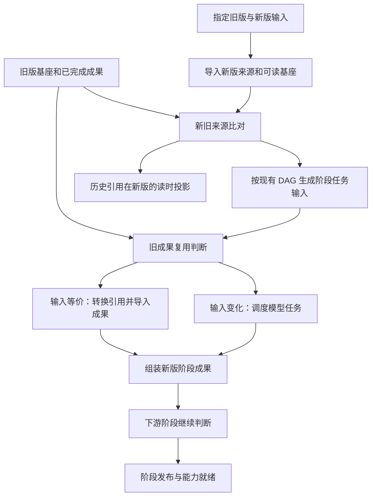

# 工作区搬迁与书籍增量更新切片方案

日期：2026-09-29，进度更新于 2026-10-01。状态：U0 文档已交付；U1–U2 已实现并通过定向验证；U3–U11 待实施。决策入口：[ADR-0146](adr/0146-portable-build-workspaces-and-incremental-book-updates.md)。

## 0 已确认范围

**FrozenIntent**：工作区搬迁后继续利用已完成成果；书籍内容更新后生成独立新版，复用输入等价的成果并重建受影响任务；保留旧版原文、历史引用及私人记录的真实归属。

**确认依据**：用户确认“搬目录不损失已完成成果，内容更新按实际依赖重算，执行中的任务状态独立处理”，在阅读更新架构与现有限制后授权先交付 ADR 和切片方案。2026-10-01 用户进一步授权“阅读 checkpoint，实现 U1–U2，完成后刷新 checkpoint”。

**RiskReceipt**：已说明位置编号会随插段变化、复用不能只删路径检查，以及全书输入任务仍可能整体重算。用户在这些说明之后确认落档。**ChangeType**：`[边界重构] [模型扩展]`。

| 术语 | 状态 | 定义与归属 |
| --- | --- | --- |
| 构建工作区 | BOUNDARY_CHANGE | 已导入来源、阶段成果与续建进度所在位置；可搬迁 |
| 书籍版本 | EXISTING | 某一份确定内容形成的独立基座，以 book_id 寻址 |
| 构建侧增量 | BOUNDARY_CHANGE | 以旧成果为计算缓存生成新版，复用由完整任务输入决定 |
| 新旧段落对应 | NEW | 指定两版正文中段落的确定对应及内容变化状态 |
| 记忆迁移 | BOUNDARY_CHANGE | 保留原记录，在新版消费有依据的历史引用投影 |
| LearningObjectRef | EXISTING | 正式学习对象身份；跨版对应独立于私人证据记录 |

领域边界已对齐。字段名称由相应实现切片固定，不能改变本方案的身份与引用语义。

## 1 设计时的实现依据（2026-09-29）

| 当前行为 | 源码接点 | 对更新的影响 |
| --- | --- | --- |
| 产物与策略身份比较包含 workspace_dir、book_id、整书 input_fingerprint | [semantic-artifact.ts](../packages/core/src/semantic-artifact.ts)、[automatic-build-policy-generation.ts](../packages/core/src/automatic-build-policy-generation.ts) | 搬迁或局部内容变化可排除未变成果 |
| 执行回执和租约也使用完整 target | [automatic-build-task-store.ts](../packages/core/src/automatic-build-task-store.ts) | 成果复用与在途执行归属须分别处理 |
| 技术书工作区优先读取仍存在的外部源文件，并检查与 source.txt 一致 | [build-orchestrator.ts](../packages/core/src/build-orchestrator.ts) | 原文件修改会阻断原快照续建 |
| LID 来自子节点顺序，窗口编号为顺序编号 | [segment.ts](../packages/core/src/segment.ts)、[window.ts](../packages/core/src/window.ts) | 插段、删段、移动章节均可能改变坐标 |
| Pass1 输入包含原文与 LID 前缀 | [pass1-input.ts](../packages/core/src/pass1-input.ts)、[build-resume.ts](../packages/core/src/build-resume.ts) | 输入文本直接比较无法识别仅坐标改变的等价任务 |
| Pass2 已有确定性候选和工作包生成 | [pass2-orchestrate.ts](../packages/core/src/pass2-orchestrate.ts) | 可重新生成新版工作包，再复用未变模型结果 |
| BookStructure 已有局部贡献和关系任务 | [book-structure-materialization.ts](../packages/core/src/book-structure-materialization.ts)、[book-structure-relation-routing.ts](../packages/core/src/book-structure-relation-routing.ts) | 更新沿现有结构组装路径实施 |
| 教学正式对象任务消费全书 source、structure 与候选 | [teaching-map.ts](../packages/core/src/teaching-map.ts)、[teaching-build.ts](../packages/core/src/teaching-build.ts) | 当前不能宣称教学层已有局部增量 |

这些是源码核对结果，未作为端到端运行验收。ADR-0019 中“插入不致块漂移”、目录不变即可跳过 Pass2、仅按旧长程边传播等具体方案由 ADR-0146 替换。

## 2 身份与存储边界

| 对象 | 拥有的事实 | 判定边界 |
| --- | --- | --- |
| 工作区位置 | 当前文件的读取位置 | 只参与 IO 与本次运行寻址 |
| 书籍版本 | 正文、附件、LID、版本来源与公开成果 | 搬迁保持 book_id；内容改版使用新 book_id |
| 任务输入与抽取规则 | 模型实际消费的正文、上下文、候选、来源材料和语义合同 | 决定计算结果是否可复用 |
| 执行身份 | 本次运行、租约、任务领取、提交归属 | 决定哪个执行器能完成哪次任务 |

`currentArtifactMatches` 与 `canReuseFromPrevious` 是两种职责：前者仍要求当前产物归属当前版本；后者在旧版身份下读取旧成果，再决定能否导入新版。它们是设计职责名，不要求创建通用包装层。不能把删除所有 sameTarget 条件作为实现。

工作区内部引用采用相对位置。外部原文件路径用于来源展示及用户选择更新输入；继续构建使用已导入快照。规范正文、PDF 及必要的本地资源应随工作区一起可用。搬迁后的新运行从已提交成果继续；旧 executor 的在途提交仍归旧运行，不能被当作新运行提交接受。

新版通过来源元数据关联前一版，运行时从书库解析其位置。首版复用显式选定的前一版本，不依赖扫描所有书籍。新版将采用的结果物化到自身目录，正常读取无需跨目录拼装。

```text
.understand-book/
  book-old/                     旧版公开基座与构建成果
  book-new/
    source.txt                  新版规范正文
    source_manifest.json        来源、附件、前一版关联
    lid_migration_map.json      新旧段落对应
    base.json                   新版基座
    ...                         新版公开 sidecar
    .build/                     本版任务、复用来源与续建进度
```

全书来源指纹继续标识输入版本、引用与 readiness；逐任务输入摘要继续服务昂贵模型调用的复用。差异计算直接读取已有正文和结构。复用来源记录放进现有产物/回执体系，不另设重复状态账本。

## 3 更新路径



现有书籍入口增加“更新内容”，请求显式包含旧版与新输入。沿用 Build Workbench 的来源处理和现有 BuildPlan 的范围、Pass2 选择及预算确认；迁移到新来源时生成新版计划，不把旧计划的来源漂移错误当作更新操作。

新旧规范内容、附件和适用规则均未变时，复用同版或继续原构建；新输入路径不同本身不产生改版。正文或实际附件变化则形成新版。仅 PDF 排版变化但规范正文相同的情况，重新建立 PDF 相关能力，文字语义任务仍可复用。

初始预览展示确定的正文变化和当前可知的任务复用范围。下游候选依赖上游模型结果时，使用已有估算与剩余工作投影，结果就绪后细化任务；预览不能把尚不可知的最终模型调用数写成确定值。

新版基础来源就绪即可普通阅读；深度语义与正式学习分别等待自身阶段完成。更新中断保留新版工作区，重启从已经提交的成果继续。完成后提供版本切换，不替换活动聊天与历史消息的来源绑定。

## 4 段落对应与工作单元

先按当前导入和切分规则生成新版结构，再比较两版已存在的正文。对齐综合章/节结构、段落类型、原文与已确定的前后锚。重复段落只能在证据足以唯一确定时匹配；移动章节可保留原文对应，但章节上下文变化仍进入任务输入比较。

```text
diffSources(old, next) -> {
  old_to_new: old_lid ->
    unchanged(new_lid) | modified(new_lid) | removed | unresolved,
  added: new_lid[]
}
```

`unchanged` 表示对应原文与相关源材料等价，不表示所有依赖该段的抽取任务均可复用。`modified` 只在段落对应确定但内容不同的情况下使用；大段改写且无法确认对应时使用 `unresolved`。映射包含旧版和新版身份，并由两版源内容约束。

LID 保持版内坐标，不增加另一套公开引用锚。窗口根据新版实际预算规则重算，通过映射后的有序内容范围寻找旧任务，不以相同 window_id 推断等价。窗口边界改变后，联合抽取结果不能随意拆成若干段再拼成新窗口成果。

编号重绑由各类产物的结构化字段处理，包括段落、章节、窗口以及确实派生于这些位置的节点/关系引用；所有相互引用应一致转换。自由文本里存在无法可靠解释的旧编号时，该成果重建。用于比较的归一化只能消除已证实的身份重命名，正文、顺序、结构含义和实际上下文保持可比较。

## 5 复用判定与执行接入

```text
for stage in confirmed_plan.stage_order:
    inputs = buildCurrentStageInputs(current_source, accepted_upstream)
    for task in inputs:
        previous = findPreviousTask(task, source_correspondence)
        if completeInputEquivalent(previous, task)
           and extractionContractApplicable(previous, task)
           and resultReferencesConvertible(previous, task):
            adoptIntoCurrentVersion(previous, task)
        else:
            executeThroughExistingScheduler(task)
    assembleAndPublishCurrentStage()
```

完整输入包含模型使用的上下文及工具读取结果，不能仅以输出中的 evidence_lids 作为依赖。目录、候选选择或检索参与的任务，先对新版重算对应输入；认知素材的多步检索要以新版响应逐步判断，无法重现完整依赖时重做该任务。

抽取规则比较保留内容 profile、prompt、输出语义合同等实际影响成果适用性的条件。运行目录、调度序号、传输往返与并发记录属于执行事实。若预算或路由变化改变实际任务范围，按新输入判断；旧结果仍满足当前语义与质量要求时，不因执行现场不同而重做。

读取旧成果时保留其版本、输入与生成来源；采用后生成新版绑定，标明来自哪个旧版本和旧任务。复用沿当前 writer、引用约束和阶段关闭流程完成，不伪造模型调用或 executor 回执。新运行只创建自己需要的执行记录。

## 6 各阶段的更新规则

| 阶段 | 更新行为 | 复用必须覆盖的输入 |
| --- | --- | --- |
| 来源与 LID | 确定性重算新版基础；按文件实际变化处理 PDF 映射和附件 | 正文、来源类型、实际附件及来源规则 |
| Pass1 | 按完整窗口或已定义工作单元复用、重绑或重抽 | 全部正文、顺序、结构上下文和抽取规则 |
| profile sidecar | 沿本阶段工作单元判断 | 正文、公式/篇章输入及 profile 规则 |
| metadata / lexicon | 沿实际全书或分组输入判断 | 所读来源、分组内容与选取结果 |
| Pass2 | 用当前全量构建相同的确定性规则生成新版候选，再比较任务 | 来源窗口正文、节点、篇章、公式、候选两端证据及关系合同 |
| BookStructure | 复用未变局部贡献；重算变化的索引选择、关系与必要汇总 | 局部材料、当前成员、候选、关联证据和输入顺序 |
| 阅读导读 | 当前依赖就绪后重新判断与发布 | 所消费的结构和 profile 成果 |
| 正式对象 / 认知素材 | 按现有输入粒度处理，显式带入跨版对象对应 | 全书对象输入，或目标、工具观察及所需材料 |
| 正式学习发布 | 对当前版覆盖和成果关闭 | 当前版正文、结构、对象、素材与审阅成果 |

Pass2 的“候选生成重算”是确定性计算，不等于全量模型调用。新增节点可能带来新候选；节点集合未变但原文从“有效”改为“无效”也必须使读取该证据的任务变化。更新不会额外放弃当前新建流程本会产生的候选。

各阶段以本次有效贡献重新组装完整文件。删除的段落、窗口、对象贡献及悬空关系退出新版；同一成果不会因重试被重复追加。原子发布继续使用现有实现，不让旧版读取混合新旧内容。

## 7 发布、阅读数据与教学身份

新版阅读就绪、语义构建完成与正式学习就绪分别表达，沿用当前能力门槛。新版断点、失败和继续执行均在新版工作区保存，旧版公开基座保持原状。

旧笔记、高亮和问答保留原始 `(book_id, lid)` 及引用文本。新版 recall 通过对应关系返回派生定位和来源状态；改字标记需复核，删除或对应不明保留历史入口。连续改版可以组合版本对应关系，但中间任一步出现内容变化或不确定性，都不能被后续映射抹掉。PDF 的页/区域位置必须来自新版 PDF 映射，不能复用旧坐标。原阅读位置和会话历史保留在原版，用户显式切换时产生新版现场。

教学对象对应独立于段落对应：相同段落不必然表达相同对象，同名对象也不证明等价。新版对象拥有新版来源引用，公共对应表达等价、修订、拆分、合并、移除或未确定；私人证据保持原始 LearningObjectRef。读时按关系提供历史证据及适用范围，不能把跨版采用本身解释为新增掌握证据。

## 8 实施顺序与进度

| 切片 | 状态 | 产出 | 依赖 |
| --- | --- | --- | --- |
| U0 | 文档已交付 | ADR、术语修订与本方案 | 用户已确认架构 |
| U1 | 已实现 | 工作区内来源快照与搬迁寻址 | U0 |
| U2 | 已实现 | 搬迁后的成果复用和执行归属分离 | U1 |
| U3 | 待实施 | 新旧正文、段落及章节对应 | U0 |
| U4 | 待实施 | 新版导入与现有计划入口 | U1、U3 |
| U5 | 待实施 | Pass1 跨版复用和结构化重绑 | U2、U4 |
| U6 | 待实施 | profile、metadata、lexicon 更新 | U5 |
| U7 | 待实施 | Pass2、BookStructure 和导读更新 | U6 |
| U8 | 待实施 | 新版能力发布和更新工作台 | U4–U7 |
| U9 | 待实施 | 历史阅读记录的跨版投影 | U3、U8 |
| U10 | 待实施 | 教学对象对应与学习证据延续 | U7–U9、现有教学基座 |
| U11 | 待实施 | 真实材料与正式入口验收 | U1–U10 |

U1–U2 是首个用户可见交付：搬目录后保留计算成果。完整内容更新以 U8 为公共构建交付，私人阅读数据及教学延续分别以 U9、U10 为准。每步成果与验证记录独立落盘；以下文件名为当前接点或明确标注的拟新增文件。

## U1 工作区内来源快照与搬迁寻址

**实施结果（2026-10-01）**：真实 Markdown / EPUB 导入后搬迁，外部原文件编辑、删除不改变任务输入；内部图片收口保留；paper 搬迁后完成可信混合基座。EPUB 包和规范正文身份分离，旧包缺失时沿已有 LID 树读取正文。详见 [U1–U2 验证记录](performance/workspace-u1-u2-20261001.md)。

**输入 / 产出**：当前 Markdown、EPUB 和 paper 工作区 → 通过工作区内规范正文及必要附件恢复来源；外部导入路径保留来源信息。

**接点**：[build-orchestrator.ts](../packages/core/src/build-orchestrator.ts)、[source-manifest.ts](../packages/core/src/source-manifest.ts)、[workbench-stage-runner.ts](../packages/core/src/workbench-stage-runner.ts) 及其现有导入调用点。

**完成判据**：将真实生成的最小工作区复制到新目录，原始输入移走或编辑后，续建仍读取原快照；显式更新才消费新输入。EPUB 不能将原始压缩包字节身份与规范正文身份混为同一输入；paper 内部附件能够解析。先用入口测试复现当前失败，再修正解析链。

## U2 搬迁后的成果复用和执行归属分离

**实施结果（2026-10-01）**：部分完成工作区经正式调度入口恢复，完成项不重调，旧租约提交被拒绝；连续搬迁保留 Pass1 / profile 完成状态，BookStructure 局部及关系成果经原关闭流程发布。策略、冻结任务、质量报告及关闭回执均已接入。详见 [U1–U2 验证记录](performance/workspace-u1-u2-20261001.md)。

**输入 / 产出**：带有效已完成成果的搬迁工作区 → 已完成任务保持可采用，剩余任务在新执行中继续。

**接点**：[semantic-artifact.ts](../packages/core/src/semantic-artifact.ts)、[automatic-build-policy-generation.ts](../packages/core/src/automatic-build-policy-generation.ts)、[automatic-build-task-store.ts](../packages/core/src/automatic-build-task-store.ts)、[build-orchestrator.ts](../packages/core/src/build-orchestrator.ts)；追踪实际经过的 policy、generation、stage close 与 publication 分支。

**完成判据**：经真实构建入口恢复一个含已完成与未完成任务的工作区；搬迁不新增已完成任务的模型调度，原运行的迟到提交不能写入新运行。跨书且输入不同的成果仍不能被采用。旧文件保持原归属，采用后的当前产物通过现有关闭流程。仅修改一个比较函数的单测不能算本切片完成。

## U3 新旧来源对应

**输入 / 产出**：两版规范正文及结构 → 指定版本间的段落对应和新增集合。

**接点**：拟新增 `packages/core/src/source-diff.ts` 及 `packages/core/test/source-diff.test.ts`；复用 [segment.ts](../packages/core/src/segment.ts)、[window.ts](../packages/core/src/window.ts) 输出。

**完成判据**：固定夹具覆盖改字、插段、删段、章节移动和重复段落；确定相同内容产生正确的新 LID，对应不明不强行配对。对应关系驱动窗口查找，不让相同顺序编号掩盖不同正文。复杂度与比较范围围绕实际材料设计，不预设树形摘要存储。

## U4 新版导入与构建计划

**输入 / 产出**：旧版、新来源、既有构建范围 → 新版来源基座、前一版关联、段落对应与新版 BuildPlan。

**接点**：拟新增 `packages/core/src/build-update.ts`；接入 [build-workbench.ts](../packages/core/src/build-workbench.ts)、[build-capability.ts](../packages/core/src/build-capability.ts)、[build-orchestrator.ts](../packages/core/src/build-orchestrator.ts)、[automatic-build.ts](../skills/build/automatic-build.ts) 和现有宿主构建入口。

**完成判据**：同内容不同路径不创建内容改版；真实正文/附件变化生成独立新基座，旧版可继续读取。新版计划保留已选择的阶段范围，旧计划不被静默改写。重启后通过已有新版工作区继续更新，不重复创建另一个新版；新版来源导入失败不影响旧基座。

## U5 Pass1 复用与引用重绑

**输入 / 产出**：新版 Pass1 工作单元、旧成果及对应关系 → 新版可关闭的 Pass1 成果。

**接点**：[pass1-input.ts](../packages/core/src/pass1-input.ts)、[build-resume.ts](../packages/core/src/build-resume.ts)、[semantic-artifact.ts](../packages/core/src/semantic-artifact.ts)、[build-orchestrator.ts](../packages/core/src/build-orchestrator.ts)、[stage-work-unit.ts](../packages/core/src/stage-work-unit.ts)。

**完成判据**：修改一窗只重抽输入发生变化的工作单元；插段后的未变完整窗口可通过确定重绑采用；变更未被引用但实际读过的上下文会触发重抽。窗口范围变化不会通过拆取联合结果冒充完整新抽取；复用结果的节点、边和引用共同闭合，统计区分真实生成与复用。

## U6 Profile、元数据与词汇成果更新

**输入 / 产出**：新版局部基座 → 正确归属新版的篇章、公式、元数据和词汇成果。

**接点**：[profile-sidecar-build.ts](../packages/core/src/profile-sidecar-build.ts) 与 [build-orchestrator.ts](../packages/core/src/build-orchestrator.ts) 中各 profile 的实际工作单元路由及 writer。

**完成判据**：修改公式或篇章证据使相应任务变化；未变工作单元不调模型；只改一种抽取规则不会无理由重做其他阶段。全书元数据输入发生变化时如实重做；删除源内容后不会在新版 sidecar 中保留失去来源的条目。

## U7 跨段关系与全书结构更新

**输入 / 产出**：新版上游成果 → 当前候选、关系、结构和阅读导读。

**接点**：[pass2-orchestrate.ts](../packages/core/src/pass2-orchestrate.ts)、[pass2-build.ts](../packages/core/src/pass2-build.ts)、[book-structure-relation-routing.ts](../packages/core/src/book-structure-relation-routing.ts)、[book-structure-materialization.ts](../packages/core/src/book-structure-materialization.ts)、[build-orchestrator.ts](../packages/core/src/build-orchestrator.ts)。

**完成判据**：新增内容产生当前候选规则应发现的新候选；保持节点名称但反转证据结论会重做相关关系任务；未变工作包复用。删除局部贡献后结构与关系输出没有遗留引用，重复关闭不重复累计。对同一新版进行冷构建与更新时，确定性候选和任务覆盖应一致；模型文本结果不要求逐字相同。

## U8 新版发布与更新工作台

**输入 / 产出**：已采用及新生成成果 → 可继续、可查看进度、可切换版本的正式更新路径。

**接点**：[automatic-build-publication.ts](../packages/core/src/automatic-build-publication.ts)、[automatic-build-close.ts](../packages/core/src/automatic-build-close.ts)、[build-workbench.ts](../packages/core/src/build-workbench.ts)、[BuildWorkbenchPane.vue](../packages/web/src/components/BuildWorkbenchPane.vue)、[api.ts](../packages/web/src/api.ts) 和 Server 现有工作台路由。

**完成判据**：从正式入口选择新版文件并完成更新；中断重启后采用已有进度。工作台展示真实变化范围、复用/待建数量与阶段状态；新正文就绪可读，教学未就绪时不能误报。当前旧版阅读不被后台发布替换；切换后新版全部公开引用能解析到新版来源。

## U9 历史阅读记录投影

**输入 / 产出**：历史 note/highlight/qa、版本对应链 → 新版可见的历史记录及来源状态。

**接点**：[crates/memory/src/lib.rs](../crates/memory/src/lib.rs)、[crates/read-tools/src/lib.rs](../crates/read-tools/src/lib.rs)、现有 recall 与 Reader 展示入口。

**完成判据**：内容等价、改字、删除及对应不明分别出现准确定位/提示；旧记录与引用内容不被改写。连续两次更新不抹掉中间的来源变化；PDF 使用新映射而非旧页坐标。原版会话与阅读位置可继续使用，跨版投影不重复写入私人记录。

## U10 教学对象对应与私人证据延续

**输入 / 产出**：新旧 TeachingMap、已确定来源对应与历史学习证据 → 显式公共对象对应及读时历史证据视图。

**接点**：[teaching-map.ts](../packages/core/src/teaching-map.ts)、[teaching-build.ts](../packages/core/src/teaching-build.ts)、[crates/server/src/teaching.rs](../crates/server/src/teaching.rs)、[crates/memory/src/learning.rs](../crates/memory/src/learning.rs) 及现有教学证据消费链。

**完成判据**：对象等价、含义修订、拆分/合并、移除及未确定均有明确处理；跨来源对象对应不能通过替换 source_id 绕过现有身份要求。历史证据引用不变，已修订对象不会自动获得旧版掌握结论。新版正式学习发布依赖当前全书覆盖；当前全书输入任务的重算成本如实显示。

## U11 真实材料与正式入口验收

**输入 / 产出**：前述能力与一份实际构建材料 → 可复查的搬迁、改版、恢复及阅读证据。

**执行**：在独立材料副本上先完成一次构建，再搬目录、修改局部正文、插入/删除段落并再次更新；覆盖一次中断恢复和一次旧笔记定位。通过真实正式入口执行，并记录实际模型调用与复用数量；需要更新教学材料时同时覆盖正式学习门槛和历史证据归属。

**完成判据**：用户可从已搬迁工作区继续、从旧版发起更新、打开新版及查看历史来源。调用记录能说明哪些任务复用、哪些任务因输入变化执行；没有把全量重建包装成增量。失败时保留具体工作区与阶段证据，修正相应切片后只重跑受影响的验收。

## 9 验证与交接约定

每次运行先指出要检测的具体失败，以及失败后应修改的接点。实施切片以生产输入构造和真实 reader/writer 为主，模型边界可用固定候选验证调度、引用与发布；真实模型成本及用户体验由 U11 验收。相关测试通过后，不为同一结论反复扩大检查。

每片完成时更新本文件进度和 `docs/代码链路.md`，结构真正改变时更新 `docs/架构.md`。验证记录包含所用输入、入口、实际执行结果与剩余限制。下一次实施从 U3 的新旧来源对应开始，不需要重做架构访谈。

## 10 已知问题与限制

- 当前窗口为贪心装箱，局部编辑可能改变同章后续窗口边界；复用粒度取决于完整任务输入，没有固定“一段只影响一窗”的保证。
- 当前部分教学任务读取全书或全体对象；完整更新首先保证这些任务正确重算，进一步缩小输入粒度以真实成本为依据。
- 重复正文、大范围改写或无法可靠转换的自由文本引用可能降低复用率；未确定对应的内容按任务重建。
- PDF 排版改变需重新建立视觉映射；正文相同只足以支持文字语义成果的复用。
- 只有最终公开基座、缺少可验证抽取输入与中间成果的旧工作区，能够作为阅读历史保留，但可采用的模型成果可能较少。
- 新版构建与旧引用投影是不同交付层次；在 U9/U10 完成前，不能宣称笔记与学习状态已经自动跨版延续。
