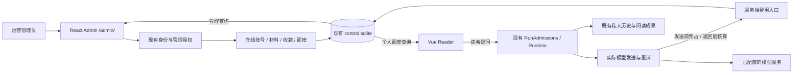
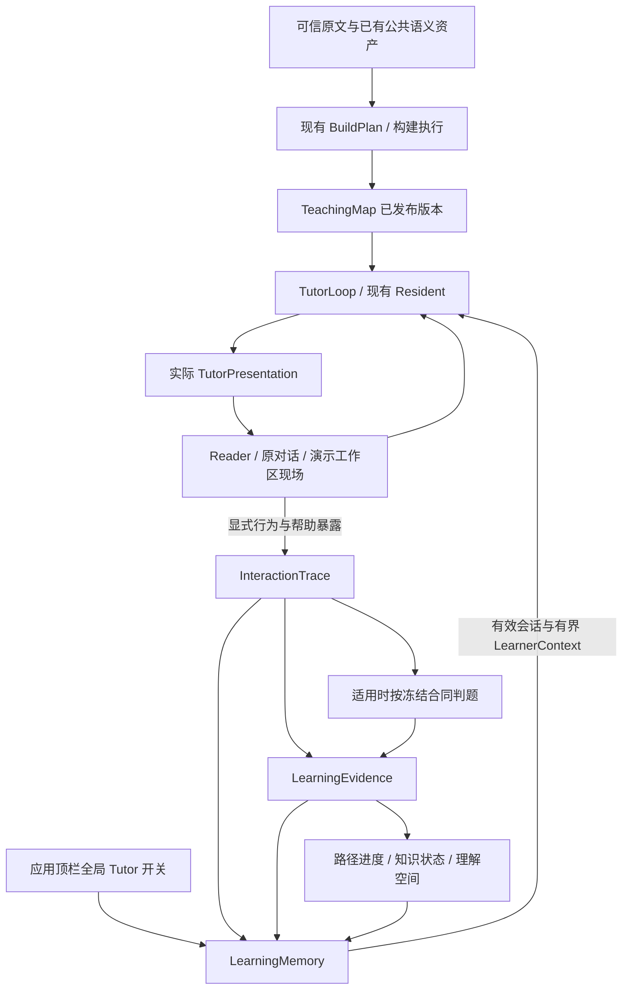

# 架构

## 邮箱账号与一次性内测码（INV1–INV9 已发布）

依据 [ADR-0159](adr/0159-email-accounts-and-single-use-beta-invites.md)，`ControlStore::open` 在既有 `ServiceWriter` 下将新库和 schema 1–8 顺序升级到 schema 9。`control_schema.sql` 保存可空账号邮箱及验证时间，`account_registration.sql` 保存邮箱唯一索引、内测码批次、内测码状态和注册/绑定/重置请求；升级步骤在同一事务内添加邮箱列、安装表和约束并更新版本。

```text
ServiceWriter → ControlStore::open → control.sqlite (schema 9)
  users ← invite_batches(actor) ← beta_invites(actor, operation_id)
  users ← beta_invites(used_by) / registration_requests(completed_user_id)
  beta_invites ← registration_requests(invite_id)
  users ← email_binding_requests / password_reset_requests(owner_user_id)
```

邮箱绑定原有 `user_id`；私人目录、材料授权、收款和额度继续按原身份归属。待完成申请允许共享邮箱和内测码，完成申请清除密码处理结果和验证码，保留完成账号回执。INV4 注册、INV5 邮箱登录、INV6 首次绑定、INV7 密码管理及 INV8 Reader 账号界面已实现；INV9 候选部署、真实收信、生产升级及公网复核已通过，实施顺序及验收见[切片方案](切片方案-邮箱账号与一次性内测码.md)。

INV2：`/admin/invites` → `multi_user_host` 当前管理员/Origin/CSRF → `admin_api` → `beta_invites` 中的 `AdminStore` 方法 → 同一控制库事务。`invite_batches(actor, operation_id)` 与全部随机码原子提交，同号同数量回查原批次；批次和列表读取当前状态及使用账号邮箱。`InviteJournal` 独立保存当前管理员未确认的发码操作号与数量，超时/刷新后先 GET 回查，404 后才以原号 POST；界面按四组五位显示和复制。停用事务拒绝已使用码，重试已停用码返回首次停用状态。依据 [ADR-0159 §1](adr/0159-email-accounts-and-single-use-beta-invites.md#1-内测注册资格)。

INV3：`multi_user_host::start` → `Site` 可信 HTTPS Origin + 邮件环境配置 → 一个共享 `AccountMail` → Resend HTTP API。账号处理器的接入合同是 `reserve(email) → 业务请求事务提交、解锁 → MailSend.verification/password_reset`；发送对象不带数据库或限流锁，邮件模块不修改账号请求。注册/绑定/恢复共用单邮箱 60 秒和全局滚动每分钟 60 次限额，网络及 DNS 有限等待，发送不自动重试。邮件中的站点地址只取 `Site`，重置令牌位于 URL 片段；接收页和最终 POST 已由 INV7/INV8 接入。错误只暴露固定状态，超时/连接中断保留结果未知语义。模板、凭据生成与接入合同见[INV3 实施结果](切片方案-邮箱账号与一次性内测码.md#7-实施切片)，决策依据 [ADR-0159 §2/§5](adr/0159-email-accounts-and-single-use-beta-invites.md)。

INV4：三个精确公开端点 `/api/auth/register/{start,resend,complete}` → `Site` Host/Origin 校验 → `Authorization.registration` → `Registration` 持有的 `ControlStore`，沿用同一个 `ServiceWriter`。开始申请在锁外处理密码；开始/重发预留共享邮件额度、提交申请并解锁后才发送。完成申请以 SQLite immediate 事务串行确认邮箱和内测码，复用 `auth::write_password` 创建普通账号、写已验证邮箱、核销码并清除临时凭据；成功回执不建立会话。错误计数持久化，已完成申请在有效期内重复提交返回原回执；过期申请由下一次成功开始注册时清理。材料和额度仍由后台单独开通。依据 [ADR-0159 §2/§4](adr/0159-email-accounts-and-single-use-beta-invites.md)，接口与错误码见 [INV4 实施结果](切片方案-邮箱账号与一次性内测码.md#7-实施切片)。

INV5：登录邮箱经 `account_mail::normalize_email → AuthService::login` 解析为原 user_id，再复用账号尝试预算、密码与会话。Host 的 login/me 返回服务端实际身份和已验证 email；Reader/后台/内置壳展示邮箱，所有私人数据和管理目标仍取 user_id。后台账号查询同时匹配邮箱，决策见 [ADR-0159 §3](adr/0159-email-accounts-and-single-use-beta-invites.md#3-邮箱与账号身份)。

INV6：Reader `AccountSettings` → `networkFetch` → Host Cookie/Origin/CSRF + `Capability::EmailBinding` → `Authorization.email_binding` → `EmailBinding`。开始验证当前密码后，同一控制库事务复查 Principal、auth_epoch 和邮箱唯一；保存申请并释放锁后通过共享 AccountMail 发信。完成事务只更新原账号邮箱和申请 used_at；回滚覆盖两项写入。成功以 `profile-changed` 刷新各窗口邮箱，当前 Reader 不重建工作区和草稿。请求生命周期、错误和验证见 [INV6 实施结果](切片方案-邮箱账号与一次性内测码.md#7-实施切片)。

INV7：`AccountPassword` 经 Host 精确公开 forgot/reset 或已登录改密能力进入；当前密码验证和新凭据计算在锁外，事务复查原会话/凭据或令牌/epoch 后复用 `write_password`，同次撤销全部会话并消费重置令牌。找回在事务中替换原账号请求，解锁后使用共享 AccountMail 发送，成功清 Cookie。依据 [ADR-0159 §5](adr/0159-email-accounts-and-single-use-beta-invites.md#5-自助密码管理)。

INV8：`NetworkApp → AccountAccess / AccountSettings → PasswordChange → networkFetch`；`?account=register|forgot-password|reset-password` 可直接打开账号页面。邮件片段令牌读取后立即移出地址栏，只留页面内存，最终 POST 才改密。成功经 `forgetNetwork + changed` 清理当前及其他 Reader/后台身份；绑定仍使用不重建工作区的 `profile-changed`。注册申请和所有表单凭据仅存内存，完整流程及验收见 INV 方案第 7–8 节。
## 运营后台与账号额度（后台、预占结算与费用停止已实现）

[ADR-0156](adr/0156-reader-admin-and-account-allowance.md) 在现有 Linux 多人服务内增加在线运营管理、人工收款和账号费用授权。ADM1–ADM3 已建立数据、管理员身份、在线账号/材料管理与人工收款/额度业务；ADM4 已完成费率与实际发送端口；ADM5 已完成持久预占、结算、人工核算和恢复；ADM6 已完成费用停止、保存与显式继续；ADM7a/ADM7b 已完成后台与真实管理页面；ADM8 已完成读者额度界面；ADM9 已接通运营汇总与回访；ADM10 已完成旧库迁入、实际备份恢复、同版 Linux 发布及首批配置（[运行单](运营后台-ADM10发布运行单.md)）；具体数据、接口和验收见[切片方案](切片方案-运营后台与账号额度.md)。下图为完整目标结构。

现有 `ControlStore::open` 顺序升级到 schema 9，`admin_schema.sql` 持有运营回执、额度期、收款、调整和逐次调用记录，`charge_settlement.sql` 追加发送回执与人工核算事实；`account_allowance.rs` 分别表达整数分与整数 `micro_cny`。`manage_reader grant-admin/revoke-admin` 经同一 `ServiceWriter` 离线修改角色，`AuthService` 结合当前角色与会话判定管理员。新表初始为空，旧账号默认普通读者。

ADM2：`multi_user_host::dispatch` → Cookie/Origin/CSRF → 当前 `ReaderAdmin` → `admin_api` 类型化目标与参数 → `AdminStore` 的同一 SQLite 事务（账号/材料变更 + 操作回执）。密码处理共用 `auth` 的 Argon2 与事务写入口；计算在数据库锁外。停用在提交时持久标记运行取消，随后 `RunAdmissions::cancel_disabled_user` 通知活动令牌，排队与恢复沿既有 JSONL 终态写入口。普通路由继续按原 Principal 解析私人对象，管理路由不创建目标读者现场。管理查询仅读取账号、发布引用和回执；分页默认 50、最多 100。请求字段与密码重试规则见[方案第 6 节](切片方案-运营后台与账号额度.md#6-持久化与接口)。

ADM3：`AdminStore::apply` → `allowance_admin::Mutation` → 同事务提交操作回执、收款/更正、额度调整与 revision；`account_allowance::balance` 从已授予、已扣减、在途和待核算金额计算实际余额。`receipt_corrections.sql` 以 schema 6 保留追加更正，原收款不变。

ADM4：`RunAdmissions::run_one` 固定 ReaderRun → `ObservedAdapter` 传递目的 → Native/ReAct 最终请求 → 每次实际发送的 `ModelSpendPort::before_send/after_send`。`model_rates` 从绝对适用区间选择独立费率快照，估价包含最终正文、工具和图片；报告只含本次最后用量。具体调用清单和合同见[ADM3–ADM4 实现](运营后台-ADM3-ADM4实现.md)。

ADM5：`Authorization::new` 装载 `<service-root>/model-rates.json` 并恢复费用状态 → `RunSpendPort` 逐次检查账号/材料、额度期并提交 reserved/sent → 锁外 HTTP → `ModelSpendStore` 按原快照结算或 pending。`charge_admin` 与原 `AdminStore::apply` 在同事务中追加核算事实、差额及操作回执；账号免扣保留未知供应商成本。费用事实先于且独立于回答保存。费用恢复与费率错误阻止模型发送，普通阅读继续可用；详情、个人额度与调用查询不建立私人阅读现场。完整字段和恢复合同见[ADM5 实现](运营后台-ADM5实现.md)。

ADM6：费用端口的 `SpendStop` → `AdapterError.spend_stop` → 外层/内部模型路径直接退出 → 宿主保留工具结果并关闭未执行尾部 → 既有历史与 Goal 同次保存。费用不足保持 Goal open；保存失败显示 `TURN_UNSAVED` 并另保留 execution_error。补额后经原显式继续入口建立新 Run/call，恢复账目与 retry-save 均不执行模型/工具。见 [ADM6 实现](运营后台-ADM6实现.md)。

ADM7：Reader 的管理能力入口 → 新标签页 `/admin/` → 独立 React/TanStack 身份与查询 → 原 Rust 管理 API。两端通过原认证通知频道刷新身份；后台以会话 epoch 取消查询、清缓存并拒绝旧响应。操作日志在发送前保存原操作号与非密码参数，未知结果先查回执，业务写入仅由显式确认触发。用户列表从数据库投影额度/筛选/分页；费用事实与 ReaderWorkspace 保持原归属。Reader 构建后装配 Admin 到同一 `dist-multi/admin`，Nginx 页面回退与资源 404 分开，见 [ADM7 合同](运营后台-ADM7实现.md)。

ADM8：`NetworkApp` 账号入口或 `RightRail` 费用停止 → `AccountAllowance` 对话框 → 原 `networkFetch` → 个人额度与分页调用查询。界面分列可用、已用与未知占用；`spendNotice` 从最终回合或未保存错误投影 ADM6 原因。`network-context` 在身份内存中按运行保留可恢复草稿，跨首次建聊天的 Reader 重建衔接；身份变化清空。补额与查询不运行模型，继续仍沿原 Goal/新 Run 入口。见 [ADM8 合同](运营后台-ADM8实现.md)。

ADM9：成功打开/恢复材料与有效提问 → `admin_usage_events` 最小元数据；保存终态且满足原交付判定 → 以 Run 为键记录完成事实。`admin_usage` 在同一读事务按香港日期聚合使用/回访、费用与收款，并提供任务分页和调用钻取；`/admin/usage` 与账号详情使用相同口径。报表仅读元数据与费用表，聊天删除不删除运营事实；schema 8 不补造历史活动。见 [ADM9 合同](运营后台-ADM9实现.md)。



前端选型见 [ADR-0156 §9](adr/0156-reader-admin-and-account-allowance.md#9-后台前端选型)：`apps/admin` 基于 shadcn-admin，独立构建到 `/admin/`；`packages/web` 保持 Vue Reader 并提供个人额度。现有 Nginx 提供两套静态资源，使用同一 release 的 `dist-multi` 与其 `admin/` 子目录；同源 Cookie、CSRF 和全部 `/api/...` 仍进入现有 Rust 多人服务。ADM7a/ADM7b 已接入后台入口、登录和真实管理页面；两端各自维护页面状态，沿用已有跨标签页身份通知。

管理入口复用服务内 `ServiceWriter` 和账号、材料授权方法；费用数据与付款事实分别持有，逐次调用账目不等待整轮历史保存。Runtime 通过最小费用端口报告实际发送，服务端负责账号归属、费率、额度与短事务；观测后端保持可关闭的派生投影。

费用不足结束本轮并保留未完成目标，补额度后由读者显式继续；未知发送保留费用占用，恢复不重放模型或工具。该设计扩展 ADR-0150 的费用授权边界，尚未改变当前线上行为。

## 选书封面

EPUB 导入由 `epub-cover.ts` 读取原书封面声明，`buildAssetManifest` 保存图片及可选 `cover` 元数据；发布书包同时复制该图片。本地书库与已授权发布书库由 `book_cover.rs` 投影封面来源，选书阶段无需载入书籍正文。网络图片与 PDF 使用现有发布版本资源地址及授权，本地通过书库目录对应的封面端点读取。共用 `BookCover.vue` 显示图片或调用 `pdf-cover.ts` 按需渲染 PDF 第一页；无可用图像时显示书名封面。行为与验证见[选书封面](选书封面.md)。

`EPUB → 封面资源 → 书库封面地址 → 选书卡片`；`PDF 原文件 → 书库 PDF 地址 → 浏览器首页缩略图 → 选书卡片`。

Reader 启动以正文视口就绪为可见条件，聊天历史、画像、阅读配置、标注与论文投影独立加载。材料清单、资源、来源身份和 PDF 信息并行获取；网络首屏使用创建/恢复工作区已返回的 Reader 状态。保存为文字模式时 PDF 不阻挡显示，默认 PDF 模式等待映射就绪。网络只读请求绕过浏览器写队列和 revision 预读，服务端仍校验用户、材料授权、generation 与 attachment；写操作继续串行 CAS。书籍 manifest 携带目录标题首行；历史展示通过共享证据范围校验后的轻量来源标签投影完成，完整预览和上下文在打开来源时生成。阅读布局的上下文按书标识，首次恢复聊天不重放焦点；异步历史结果按启动请求归属回填。实现与对照见[工作区启动修复](performance/workspace-startup-root-cause-20260929.md)与[Linux 首屏修补](performance/linux-reader-layout-startup-20261001.md)。

Tutor 的 T1–T12 已实现演示工作区、私人控制/会话、公共教学基座、交付 Trace、TutorLoop、宿主活动、冻结判定、学习证据和理解视图。三个领域保持 TeachingMap、LearningMemory、TutorLoop，沿用现有构建执行、Resident 与富呈现能力；实施入口为 [T0–T13 切片方案](切片方案-Tutor全局模式与教学闭环.md)，当前数据流见本页末尾 Tutor 架构。

[ADR-0137](adr/0137-stratified-reading-evals-and-diagnostic-improvement.md) 已接受阅读评测分层与诊断闭环设计，EV0–EV7 待实施，见[切片方案](切片方案-Agent分层评测与诊断闭环.md)。本地评测持有冻结任务要求、逐项评分和实验记录；生产仍持有运行、交付、Reader/Memory 与 Goal 事实。四层理解任务与交互条件独立，产品结果和评分状态分列；充分证据与共同回答器实验独立于产品成绩。LangSmith 继续是可选投影，评测不接管 Goal、AssessmentContract 或学习状态。

Resident Agent 已接入 [ADR-0127](adr/0127-resident-agent-streaming-and-runtime-activity.md) 的独立运行、事实活动、SSE 与前端时间线：回合独立持有运行数据，Reader/Memory 按操作访问，模型在锁外等待，统一取消与持久终态。正文仍整体定稿；实施状态与验证见 [AS0–AS9 切片方案](切片方案-Resident-Agent流式回答与运行活动.md)。

[ADR-0130](adr/0130-agent-rich-presentation-and-read-time-authoring.md) 为普通回答、交互讲解、教具和持续内容增加通用呈现与读时制作能力。RP1 已新增 Runtime 的 `PresentationPreviewPort` 与 Server 的 `BrowserPreview`：候选 HTML + 操作 + 既有取消令牌 → 独立 Edge/Chromium → 每步截图、布局、控件状态及错误 → 停止进程并清理 profile。Server/Tauri 共用安装探针入口；Windows/Tauri 与 Linux 服务账户实机均已验证，Linux XDG 配置/缓存归入预览临时目录。内容存储已按 RP2 实现，富回答与来源已按 RP3 接入，Resident 制作已按 RP4 接通，现场保存与追问已按 RP5 接通，持续编辑与恢复已按 RP6 接通，完整体验已按 RP7 在 Windows/Tauri 与 Linux 通过真实模型生成、持续修改、现场追问和重开验收，见 [RP7 记录](performance/agent-presentation-rp7-20260917.md)，见 [切片方案](切片方案-Agent富呈现与读时内容制作.md) 与 [RP1 记录](performance/agent-presentation-rp1-20260916.md)。

## 组件图

EX12.3 长页观察：`preview(actions: scroll {y})` → BrowserPreview 即时滚动顶层文档 → 按实际阅读位置捕获 DOM 可见文字、layout 和截图 → Author 回执／图片说明绑定 candidate、environment、step、action 与 scroll → Runtime 预算投影保留位置和问题、历史保留定位参数。`read_selector` 的完整 reading 也携带实际 scroll；候选交付仍依赖三环境回执和后续图片观察。合同依据 [ADR-0154](adr/0154-presentation-global-framework-and-staged-authoring.md)，证据见 [EX12.3](performance/presentation-staged-authoring-ex12-3.md)。

EX13.1 指导数据流：`skills/presentation/{SKILL,engineering,capabilities}.md`、`phases/` 与 `references/` → `agent_prompt::presentation` 编译 `ex13.v2` 资产 → `build_sample_request` 分开共同模块和当前选择 → 共同模块进入 `AgentRequestPlan.instructions`，phase/reference 变化进入 `ContextFragmentLedger` 的原采样锚点。每次采样追加当前 phase/needs 标识和 user 角色的设计数据；旧指导保留原位置，最新选择生效。交付清除设计并使指导失效；后续合法制作重新启用。压缩保留当前回合后缀与指导锚点，同次重建不重复注入；相同消息位置的新决策仍得到完整状态。普通短答不加载呈现指导。依据 [ADR-0155 §3](adr/0155-goal-work-plan-and-version-centered-presentation-context.md#3-指导组装与缓存)，验证见 [EX13.1](performance/presentation-context-ex13/ex13-1/README.md)。

`presentation.author.prepare` → Runtime 完整替换阶段／framework／focus／needs → 下一次采样投影 `presentation.authoring_context` 任务数据。设计文本以 user 角色进入现有请求片段，不进入 system 指令或历史持久规划；历史压缩后仍取当前运行记录。prepare 独立成批，等价提交不增加进展；交付成功、取消清除记录，新 Run 不恢复旧记录。原宿主 write/patch、图片观察和 deliver 合同保持生效，prepare 不创建候选或授予来源。依据 [ADR-0154](adr/0154-presentation-global-framework-and-staged-authoring.md)，验证见 [EX12.2 记录](performance/presentation-staged-authoring-ex12-2.md)。

EX11.3–5 数据流：`presentation.author.render_animation` → 独立 Manim 0.21.0/Cairo 进程 → PyAV 解码、元数据与代表帧 → 本回合动画引用 → `write.asset_refs` → `PresentationContent.animation_assets` 随不可变版本保存。场景源码/JSON 保留在 `content_files`；Author read 仅返回媒体元数据，源码仍按需分页。基准修订显式复用动画引用。动画字节与文本分开计量，依赖与取消见 [Manim 部署](Manim-部署.md)，设计依据 [EX11 §6–7](切片方案-EX11-Konva通用能力与局部动态演示.md#6-manim-局部短片段的生产路径)。

同版动画 → Server `preview_document` / Web `presentationDocument` 装配 data URL 与 `media-src data:` → 共享 `presentation-media.js` 管理播放互斥、离屏/隐藏暂停、动态视频加入/移除。Reader 先恢复原生控件，等待页面 restorer 完成，再认证公开文本、开放捕获；期间不保存默认现场，失败沿错误展示及重试入口处理。同步 state reader 继续用于保存和追问。`AgentPresentation` 展开面板可整体滚动，iframe 最小 160px，保存提示在正常文档流内。证据见 [EX11.3–5 实施报告](performance/explorable-explanation-ex11-3-5-20260928.md)。

Resident Goal 的 G0–G5 已接入，决策见 [ADR-0136](adr/0136-resident-goal-lifecycle-and-delivery-completion.md)，验证见 [G0–G3 记录](performance/resident-goal-g0-g3-20260925.md)与 [G4–G6 记录](performance/resident-goal-g4-g6-20260925.md)：`AgentChatSession.goals` 与 `AgentChatTurn.goal_ref` 持有跨 Run 的任务 → `prepare_agent_chat` 绑定本次请求及选中对象 → `RunContext.goal` 为本轮采样提供持久任务快照 → `goal.update` 更新解释或工作焦点并立即提交 → `agent.resident_goal` 动态片段投影目标、实际正文与页面结果 → `finalize_agent_turn` 核对实际页面/Reader 结果并同历史提交 Goal 状态。一次 Run 停止不等于 Goal 完成；Reader 已有继续与取消入口。G6 已有章节自然请求交付，其余自然场景与发布验收保留原记录的未完成状态。TutorSession 的私人生命周期已由 T2 实现，TutorLoop 已由 T7 接入 Resident；Goal 不依赖它们。

EX13.2 源码投影沿用 `ActiveToolResultLedger`：write/patch 成功回执 → 首次采样保留完整调用 → 后续模型消息中以候选读取定位代替 html/readable_content；最近 patch 的 edits 保留到明确后继被成功采样。账本与候选读取同属当前运行，结果正文淘汰、压缩都不改变原始记录和工具配对；来源及预览/交付资格仍由原路径持有。依据 [ADR-0155 §4](adr/0155-goal-work-plan-and-version-centered-presentation-context.md#4-历史裁剪与版本修订)，验证见 [EX13.2](performance/presentation-context-ex13/ex13-2/README.md)。

EX13.3 工作计划：`goal.update(operation=working)` → `ResidentGoal::apply_update` 原子更新工作项 → 原 `persist_goal / GoalUpdated` 保存 → `SessionLog` 重放或同聊天新运行装入 `RunContext.goal` → 每次 `agent.resident_goal` 投影；最终状态与计划随 `TurnFinished` 一起提交。旧数据缺 items 时为空列表，省略更新保留，空列表清空，相同更新不增加 revision。压缩和 framework 修改不改写要求或计划，工作项完成不替代实际交付。指导 `ex13.v1` 分开任务、进度和解释设计。依据 [ADR-0155 §2](adr/0155-goal-work-plan-and-version-centered-presentation-context.md#2-工作计划所有权)，验证见 [EX13.3](performance/presentation-context-ex13/ex13-3/README.md)。

EX13.4 修订入口：已验证 receipt → `follow_up_context` 投影确切版本、完整现场、假设与内容定位 → `presentation.author.read/search(file="readable_content" 或实际源码文件)` 按需取得可分页文本 → `write.based_on` 或 `patch` → 原预览/交付路径追加同对象 revision。receipt 写入缺基底时返回参数错误；`write.new_object=true` 显式新建独立对象，其当前运行候选可继续 patch。指导资产当前为 `ex13.v2`。依据 [ADR-0155 §4](adr/0155-goal-work-plan-and-version-centered-presentation-context.md#4-历史裁剪与版本修订)，验证见 [EX13.4](performance/presentation-context-ex13/ex13-4/README.md)。

EX13.5 摘要请求：完整 `CompactionRequest` → `generation_input` 的来源与约束投影 → 固定 system + user → 严格校验；首次拒绝仅在 user 后追加诊断，预算计入完整尾部，最多修复一次。运行时版本、历史修订号和原文保留 ID 不再发送给模型，检查点仍使用原合同验证与恢复。来源身份、覆盖规则、输出预留和压缩水位保持。依据 [ADR-0155 §5](adr/0155-goal-work-plan-and-version-centered-presentation-context.md#5-摘要与效果验证)，录制及 Native/ReAct 本地 HTTP 验证见 [EX13.5](performance/presentation-context-ex13/ex13-5/README.md)。

**当前状态**：[EX13](切片方案-EX13-Goal工作计划与演示修订上下文.md) 的 EX13.0–EX13.6 已完成；同对象 revision 2 已通过原生交付和三环境内容验收。旧历史裁剪不补入缺失的 new_object 字段，保持检查点来源身份。本轮未部署，下一片为 EX12.5 Reader 连续使用。

开发工具新增独立的[代码与文档只读 MCP](代码只读MCP.md)：`ChatGPT → Secure MCP Tunnel → packages/code-mcp/server.mjs → ProjectRepository → 获准的当前工作文件/Git 差异`。`policy.mjs` 统一列表、搜索、读取与差异的文件范围；它与书籍访问、Reader 和 Executor 的数据及操作边界独立。stdio 服务与本机客户端已验证；ChatGPT 隧道接入待账号侧配置。

RP6 数据流：当前现场回执或近期已交付引用 → `presentation.author.read` 分段按需读旧代码 → `write.based_on` 固定基准版本、保留来源、按状态合同接纳兼容参数 → 原预览/交付路径产生新修订。历史引用保持不变。`presentation.read` → 指定版本最后现场或确切回执 → `PresentationView` → 内容装配传入 `restoredState` → 页面初始化后恢复控件、自定义参数与步骤 → 重新计算与原语义核对。重开只读取私有版本/现场；完整代码不进入后续普通对话历史。合同与验证见 [RP6 记录](performance/agent-presentation-rp6-20260917.md)。

RP5 数据流：`presentation-bridge` 同步采集控件/自定义参数/可见结果 → `AgentPresentation` 串行保存 → `/agent/presentation.state.save` 核对已交付版本并写入私有不可变现场 → 返回 `PresentationFollowUp` → `RightRail` / `App` 的既有运行入口 → `prepare_agent_chat` 按回执冻结上下文、预提交用户回合与现场引用 → 原 Resident 主循环。现场按版本递增修订，后续改变不会替换已发出的快照；高频 input 不触发保存或模型。来源仍用 RP3 编译与 Reader 操作，恢复页面现场已按 RP6 接入。合同见 [方案 §7](切片方案-Agent富呈现与读时内容制作.md#rp5-已实现合同)，验证见 [RP5 记录](performance/agent-presentation-rp5-20260917.md)。

RP4 数据流：Resident `tool.search(presentation_authoring)` → `presentation.author` → `RuntimeStatePort` 短借用 AppState 写入候选 → 锁外 `BrowserPreview` 排练与语义编译 → 截图进入下一次模型采样 → 修正或保存版本 → Runtime 追加固定引用 → 原有历史提交。截图只驻留本轮，生成代码保存在私有候选/版本；运行活动、预算、取消沿用主循环。实现位于两侧 `presentation_author.rs`、`run_context.rs`、`agent_run.rs`，native/react 的临时视觉投影位于 Runtime `lib.rs`。边界与证据见 [ADR-0130](adr/0130-agent-rich-presentation-and-read-time-authoring.md) 和 [RP4 记录](performance/agent-presentation-rp4-20260917.md)。

ED2 静态图数据流：已发现的 `presentation.author(render_plot)` → Server 临时 Python/Matplotlib 进程产出 SVG + PNG → PNG 进入下一次模型采样 → `write.asset_refs` 将 SVG、复绘代码和输入装入原候选 `content_files` → 同一资源分别由 BrowserPreview 与 Reader 装配 → 原预览、交付、历史版本与重开。`RuntimeStatePort` 只持有本轮未选中图，取消不覆盖任何已交付版本；宿主依赖见 [ED1–ED2 验收记录](performance/agent-presentation-ed1-ed2-20260925.md)。

ED3/ED4 数据流：`presentation.author` 进入可见工具集时，`policy_modules_for_tools` 从 `skills/presentation/SKILL.md` 载入短表达说明；普通回答不载入。`preview_document` 的每张真实截图保留候选、环境、步骤和状态，失败及部分完成也进入 `RunContext`；下一次 `AgentRequestPlan.preview_images` 在上下文预算内携带图片，省略的候选/环境以宿主消息明示。可交付资格仍来自完整环境回执及之后的一次模型采样，图片本身不授予资格。Native Provider 的私有续接字段随 assistant 消息持久化，有工具调用和终答均按原模型回放；公开回答、记忆与压缩素材只使用正文。自然请求对照与真实模型观察见 [ED3–ED4 记录](performance/agent-presentation-ed3-ed4-20260925.md)。

RP3 数据流：已提交回答的固定引用 → `presentation_api` 验证回合/会话归属 → `PresentationView` → `AgentPresentation` 独立 iframe。内容装配/共同样式/宿主桥分别位于 `presentation-document.ts`、`presentation.css`、`presentation-bridge.js`；内嵌与展开保留同一页面。静态语义及动态 DOM 观察 → `compile_presentation_text` → 既有回答编译器 → 允许显示或明确失败；绑定来源 → 既有来源弹窗和 Reader 导航。制作工具已按 RP4 完成，现场保存与后续追问已按 RP5 接入，合同及证据见 [RP3 记录](performance/agent-presentation-rp3-20260917.md)。

ED1 把首次加载与后续校验分开；后续语义变化的旧画面由 bridge 局部保留，原 Server 编译器仍作准入判定。现场快照等确切修订接受后采集；宿主提示与 iframe 高度不依赖内容自身撑大的父容器。见 [ED1–ED2 验收记录](performance/agent-presentation-ed1-ed2-20260925.md)。

RP2 增加 `runtime::presentation` 私有内容/候选/版本合同与 `server::presentation_store`。制作回合 → 私有不可变候选 → 不可变内容版本 → `finalize_agent_turn` 核对归属及版本存在 → AgentHistory 原子提交固定引用；旧版与完整资产按需读回。存储根由既有私有历史路径派生，Reader/Server 沿用单宿主权威状态借用；来源编译和界面挂载已按 RP3 接入，Resident 预览调用已按 RP4 接入。边界依据 [ADR-0130 §4](adr/0130-agent-rich-presentation-and-read-time-authoring.md#4-内容与交互的延续)，合同及失败行为见[切片方案 §7](切片方案-Agent富呈现与读时内容制作.md#7-定向验证与失败处理)。

```text
Web App
  -> api.ts
      -> /book/library
      -> /book/open
      -> /book/create
      -> /book/build_workbench
      -> /build_workbench/input.import
      -> /build_workbench/job.create
      -> /build_workbench/job.start
      -> /build_workbench/job.resume
      -> /build_workbench/job.event.append
      -> /build_workbench/decision.resolve
      -> /build_workbench/permission.resolve
      -> /build_workbench/sidecar_plan.confirm
      -> /book/source_manifest
      -> /book/pdf_source_map
      -> /book/pdf/original
      -> /reader/pdf_selection.resolve
      -> /reader/pdf_ranges.project
      -> /reader/paper_minimap.state
      -> /reader/paper_minimap.localize
      -> /reader/paper_minimap.apply

Server
  -> presentation_store [ADR-0130 / RP2]
      -> runtime::presentation::{PresentationCandidate, AgentPresentation, PresentationRef}
      -> private agent-history.presentations/{candidates,versions,states} immutable JSON
      -> finalize_agent_turn -> validate saved reference -> atomic AgentHistory commit
  -> presentation_preview::BrowserPreview [ADR-0130 / RP1]
      -> runtime::PresentationPreviewPort + CancellationToken
      -> isolated Edge/Chromium process -> CDP execution / input / PNG / DOM observations
      -> bounded stop and temporary profile cleanup
  -> book_dir artifacts
      -> paper.md / paper.pdf
      -> .build/input/manifest.json
      -> .build/source-reconciliation/report.json
      -> .build/source-reconciliation/alignment-evidence.json
      -> source_manifest.json / pdf_source_map.json / pdf_selection_map/*
      -> .build/jobs/*.json
      -> .build/sidecar-plan/*
      -> .build/automatic-build/v2/tasks/<stage>/<work-unit>/attempts/<n>/{lease,execution,start,heartbeat,input-observation,usage,candidate,validation,submission,receipt,failure,result,reset,metrics}.json + heartbeats/*.json + submit-revisions/*.json
      -> .build/automatic-build/v4/tasks/book_structure/<policy-set>/<work-unit>.json
      -> .build/automatic-build/v3/artifacts/book_structure/<policy-set>/<work-unit>.json
  -> Book / Reader / MemoryStore

Codex plugin executor bootstrap distribution `[ADR-0102]`
  -> thin plugin publishes build skill,executor-only fallback skill,registration skill/script,and a versioned custom-agent TOML asset
      -> no top-level agents/ or .codex/agents/ claim implicit host registration
  -> explicit registration atomically creates an absent personal/project understand_book_executor role
      -> identical bytes are idempotent;different user-owned bytes fail closed without overwrite
  -> agents/automatic-build-dispatch-executor.md is the canonical bootstrap body
      -> project agent,root/release asset templates,and root/release fallback skills are byte/digest-gated projections
  -> root SPAWN_EXECUTORS provider order is registered custom agent -> executor skill fallback -> bounded bootstrap_unavailable
      -> custom-agent path activates no skill;fallback activates only understand-book-executor;neither path activates the root build skill
  -> versioned cachebuster binds marketplace source,published thin snapshot,and installed plugin cache

Core intent/plan contract `[ADR-0093]`
  -> build-intent.ts owns BuildIntentV1/BuildPlanV1/BuildDecisionScopeV2 schemas
  -> recursively sorted canonical JSON + SHA-256 bind intent and confirmed plan identity
  -> source/profile/recipe/scope/artifact/dependency/reuse/budget changes invalidate plan_digest
  -> status transitions and LID/profile/path-safe validators fail closed
  -> estimate,time,status,and confirmation source remain outside plan identity
  -> pure contract only:no storage,provider call,build claim,or public semantic fingerprint change

Core intent/plan V2 contract `[ADR-0094]`
  -> build-intent-v2.ts owns BuildIntentV2/BuildPlanV2 without changing V1 canonical bytes or digest semantics
  -> goal-directed intents no longer carry a fixed desired_artifacts enum;zero to many validated Blueprint selections are legal
  -> every private plan artifact freezes the complete ArtifactBlueprintV1 snapshot plus its canonical blueprint_digest
  -> plan_digest binds the full snapshot,dependency closure,reuse/create/excluded sets,and one budget identity
  -> V1 readers continue through fixed system-preset adapters;all newly drafted selections use V2

Core ArtifactBlueprint contract `[ADR-0094]`
  -> artifact-blueprint.ts owns ArtifactBlueprintV1,the restricted schema DSL,and schema-value validation
  -> every object,array,string,number,enum,routing list,and artifact payload limit is explicitly bounded
  -> unknown fields,$ref,recursion,regex,functions,remote schemas,and schema complexity overflow fail closed
  -> canonicalBuildJson + SHA-256 bind the complete validated Blueprint snapshot independent of object key order
  -> one deeply frozen system Registry maps timeline,concept_map,comparison_table,and argument_map to versioned presets
  -> comparison dimensions remain lossless through deterministic name + canonical value_json records;the v1 accepted adapter remains AA4-owned

Generic ArtifactInstance v2 acceptance `[ADR-0094]`
  -> intent-artifact.ts owns ArtifactInstanceV2,task envelope v2,candidate v2,accepted v2,and the deterministic Blueprint-driven gate
  -> V2 plans use their frozen Blueprint snapshot;V1 plans adapt only through the four fixed system presets
  -> every new candidate and accepted body uses records/relations plus blueprint_digest;there is no second legacy generator
  -> the gate recompiles the current task before commit,then checks exact identity,schema,IDs,relation endpoints,LID evidence,scope,limits,and payload digest
  -> intent-artifact-mailbox.ts writes task-owned attempts,private failure or immutable accepted v2,and one bounded body-free receipt
  -> intent-artifact.ts + intent-artifact sidecar validate accepted v1 payload digests and project them read-only through preset adapters without rewriting history
  -> Server intent_build_store.rs rereads disk and recomputes intent,plan,Blueprint,and payload digests before exposing the current active overlay

User-private ArtifactBlueprint Registry `[ADR-0094]`
  -> artifact-blueprint-registry.ts stores immutable user_private candidate snapshots below the host-selected private root
  -> candidate identity is blueprint_id + blueprint_version;same identity with a different canonical digest fails closed
  -> retirement and usage are separate create-only events,so retiring a candidate never mutates a Blueprint already frozen in a Plan
  -> every directory/file is path-safe,size-bounded,and rejected when symlinked,outside private_root,malformed,or digest-inconsistent
  -> list/get resolve system presets before user candidates;missing private matches may use a validated,unpersisted one_off Blueprint
  -> intent-blueprint.ts + packaged intent.blueprint expose strict stdin-only canonical JSON commands without paths,goals,or artifact instances in results

Reader-private intent artifact store `[ADR-0093]`
  -> server::intent_build_store owns private root,index,intent/plan revisions,and active overlay pointer
  -> default root is <home>/.understand-book/private/build-intents;absolute UNDERSTAND_BOOK_PRIVATE_DIR may override it
  -> ReaderPrivateStorageGate rejects symlinks/non-directories and enforces current-user directory/file permissions
  -> path-safe book/intent/plan ids and atomic JSON replacement keep user text out of path construction
  -> redacted inspection returns ids,revisions,status,digests,and source fingerprints but never user_goal or artifact bodies
  -> hard delete removes intent,referencing plans,active pointer,and all private artifact bodies for that intent
  -> no fallback to memory.json,book directory,Workbench job,or public semantic artifacts

Build capability registry and deterministic compiler `[ADR-0093/0098]`
  -> build-capability.ts freezes public.standard_deep plus four reader-private Sidecar capabilities
  -> technical_learning/paper standard closures derive in stable topological order from BUILD_STAGE_DAG
  -> pass2=enabled|disabled selects one of two exact closures;BookStructure depends on profile_sidecar and treats Pass2 as optional enrichment
  -> sidecar-plan contracts are cloned into immutable registry entries with lid_required evidence
  -> read_now emits no plan;standard_deep emits the user-confirmed public closure;goal_directed emits only declared private artifacts and dependencies
  -> orchestrator freshness inspection is read-only and binds target,stage,and current policy into canonical SHA-256
  -> compiler deterministically classifies reuse/create/excluded and emits conservative estimate inputs without running tasks or models

Rust PDF runtime dual-read `[ADR-0082]`
  -> read-tools loads pdf_source_map.v1 or v2;unknown versions and invalid v2 precision/span contracts make only PDF topology unavailable
  -> server pairs source/selection map versions and rechecks book_id/config_hash/capability before every map, selection, or range request
  -> v1 selection shards keep their existing behavior;the adapter does not infer v2 precision from legacy regions
  -> v2 char_exact permits resolved selection/exact range projection
  -> v2 partial returns exact character subranges with partial status;region_exact and unmapped never authorize character operations
  -> raw PDF text missing from v2 exact hits keeps a mixed selection partial or unresolved

Core hybrid alignment v2 production `[ADR-0082]`
  -> source-alignment-evidence.ts: final-source/PDF/config-bound reconciliation unit hints
  -> md-adapter.ts supplies parser-proven paragraph/list-item alignment contexts beside the LID block stream
  -> hybrid-alignment-v2.ts: versioned bounded semantic unit former -> unique monotonic locator -> per-child precision projector
      -> only one source context may be shared;24 children / 1,200 UTF-16 / 240 searchable tokens cap every multi-child unit
      -> oversized single leaves remain isolated diagnostics;coverage,boundary,or guard errors fail the adaptation audit
  -> text/code exact occurrences form one unique maximum monotonic non-overlapping anchor chain
      -> adjacent proven anchors define exclusive child-local PDF key intervals
      -> one unresolved child may use local LCS;shared unresolved intervals and ambiguous chains fail closed
      -> child failure never advances a shared cursor or changes a sibling interval
  -> detects single-column pages before ordering short headings and wide body lines;stable two-column pages split PDF.js merged lines and read each column deterministically
  -> workbench-stage-runner.ts requires the current evidence artifact and rechecks actual PDF/evidence hashes before building
  -> hybrid-foundation-v2.ts: schema-valid v2 maps/report/manifest + disk writer/reader/validator + separate integrity and versioned quality policy
  -> duplicate region/character owners discard every conflicting LID projection before artifact generation
  -> emits char_exact/region_exact/partial/unmapped only;partial shards contain only proven exact character subranges
  -> degraded quality is readable but precision-gated;production builds write only v2

Core Markdown structural adaptation `[ADR-0008/0029]`
  -> md-adapter.ts parses CommonMark + GFM + math into a positioned mdast
  -> JavaScript UTF-16 parser offsets are preserved as the canonical source/LID coordinate space
  -> heading,list item,fenced/indented code,Markdown/HTML table,image,and inline/display formula project from AST node roles
  -> malformed nested math and unfenced code produce source-review proposals only;the adapter never rewrites canonical source
  -> segment.ts consumes the ordered non-overlapping SourceBlock stream and partition.ts proves complete non-whitespace coverage
  -> run-markdown-structure-audit.ts compares candidate leaf spans/kinds/LIDs to an explicit validated baseline without storing source text

Hybrid foundation atomic application `[ADR-0082]`
  -> candidate is fully schema/integrity/hash validated before official paths move
  -> one per-book lock serializes application and startup recovery
  -> revision journal records old/new hashes,semantic graph digests,and move phase for 5 files + pdf_selection_map/
  -> normal failure and next-run recovery inspect official/stage/backup hashes instead of trusting an in-memory rename index
  -> unvalidated transactions restore the exact old set;validated complete-new transactions may commit
  -> repeated identical candidates are no-op;successful backups remain under the transaction directory

MemoryStore `[ADR-0075]`
  -> backfill.rs: explicit historical range/progress reducer + candidate ownership
  -> document.rs: MemoryDocument v3 envelope + v2/bare migration + schema/revision validation
  -> governance.rs: resident governance reducer + replay receipts + collection-rule gate
  -> lib.rs: Record create-only Note save/recall/delete/replace/reanchor/promote and raw activity helpers
  -> markdown.rs: revision-tagged profile Markdown v2 rendering,pair materialization,and derived status
  -> operation.rs: atomic typed MemoryOp + protected explicit profile evidence
  -> profile.rs: typed ProfileFact ledger,reducer,evidence exclusions,and resolver
  -> projection.rs: bounded five-section ReaderProfileSnapshot projection + canonical serialization
  -> reading_state.rs: BookReadingState raw engagement/read-count reducer + legacy projection
  -> review.rs: durable ReviewState/ReviewJob state machine + watermark reconciliation
  -> global_consolidation.rs: affected-key ledger clustering + global promotion reverse reconciliation
  -> memory.json: single reader-private truth source
  -> reader-profile.md / reading-handbook.md: best-effort one-way views

Runtime profile context `[ADR-0075]`
  -> profile_context.rs: projection_revision + request-keyed in-process snapshot cache
  -> server AppState: resident-only cache;visitor/MCP paths never read it
  -> orchestrator.rs: one frozen snapshot is inserted only into each provider request copy

Runtime turn ownership `[ADR-0127 / AS1–AS8]`
  -> run_context.rs: RunContext owns messages, frozen model/config and evidence/locator/progress/exposure ledgers
  -> ResidentStatePort scopes deterministic Reader/Memory operations; Book model calls execute outside those borrows
  -> synchronous entry uses BorrowedResidentState; host uses operation-scoped RuntimeStatePort over current AppState
  -> RunContext retains executed effects/trace on errors; only actual Agent navigation contributes a Goto effect
  -> CancellationToken gates model purposes and each next tool; Native/ReAct also check before HTTP transport retry
  -> cancelled partial batches close missing tool replies with cancellation receipts,without dispatch or synthetic activity
  -> run_events.rs owns model/tool activity facts, scoped purpose/parent, and a live sink; AgentRunSummary persists the same activities on success, error and cancellation
  -> provider_stream.rs reads SSE into text/tool/usage/finish observations and a complete result; all Native/ReAct entrypoints and production wrappers share this path
  -> answer_stream.rs projects complete sentence/paragraph prefixes through the existing source/provenance compiler; only top-level structured answer/final fields enter public drafts
      -> each sampling owns a message identity; tool requests discard that candidate, source repair replaces its revision
      -> append carries plain-text growth; source structure changes use replace; final full compilation still owns canonical delivery
  -> AnswerProjector registers private verified bindings before public patches; only currently published draft refs resolve during a run, then durable bindings take over
  -> Reader revision advances on state writes; RuntimeStatePort publishes actual changes and step-owned effects without replaying writes in observers
  -> messages are explicitly passed to the fixed session/turn commit

Runtime Agent request governance `[ADR-0091/0113]`
  -> model_runtime.rs: turn-frozen ModelRuntimeProfile + provider-neutral AgentRequestPlan
      -> base instruction asset + selected versioned policy asset refs compose one sampled instruction string
  -> context_fragment.rs: keyed latest-revision dynamic context projected without durable writeback
  -> tool_registry.rs: one typed registration per callable handler,with schema/alias/handler hard gates
  -> tool_exposure.rs: profile/permission/evidence/model-budget direct/deferred/hidden projection
      -> turn_intent_classifier.v1 matches only the frozen ExplicitGuidedRead phrase set;explicit negation wins and classification performs no LID resolution or dispatch
      -> tool_exposure seeds the explicit ReaderRead/StructuralIndex/NavigationPlan/ReaderWrite capability list before the first pre-turn request and budget projection
          -> ReaderWrite candidates additionally require Navigate + LocatedLid,so only reader.gotoLid joins guided reading;unrelated Reader mutations stay deferred
      -> ordinary non-guided sampling exposes at most 8 direct schemas,including metadata-only tool.search
      -> guided-read seeding changes only the turn-local activation set;profile,permission,hidden,and schema-budget gates remain authoritative
      -> one search activates at most 6 deferred registrations for the next sampling only
      -> hidden registrations are neither searchable nor callable;sampled visibility is rechecked before dispatch
      -> GR3 deterministic fixture records AgentRequestPlan and consumes BookStructure/guide path/guided frontier before candidate text self-check
          -> matched guided read has no discovery,one route-member goto,one merged Goto effect,and a current+new-stop synthesize set;plain summary has no goto
  -> agent_prompt.rs: base identity + evidence/source/discovery/navigation/Reader/paper/memory/profile/finish policies
      -> resident-agent.policy.evidence-routing@v4 requires unlocated section/document work to obtain book.structure,copy at most six representative returned LIDs exactly,and stop derived-LID retries after provenance/recovery errors;StructuralIndex is an evidence plan,not source evidence
      -> resident-agent.policy.source-delivery@v5 requires Agent-selected bindings for requested citations;the compiler normalizes only unambiguous bound suffix markers and the one repair retains the standard syntax
      -> resident-agent.policy.tool-discovery@v5 exposes a bounded capability directory,including the memory_read/explain contract for saved notes and highlights;the model proposes semantic need fields but cannot claim Runtime authority
      -> resident-agent.policy.navigation@v4 enters every Resident business sample exactly once;all other modules remain gated by the current sampled tool surface
          -> guided reads serialize Reader state -> BookStructure -> guide path,then read the exact selected target before the sole goto
      -> policy_modules_for_tools is consumed only by the Resident build_sample_request path;compaction and MCP visitor prompts remain separate
      -> sufficient quoted evidence may finish with zero tools;Runtime owns successful-query QA observation
  -> tool_exposure.rs: tool_exposure_plan.v2 keeps book.structure on the read-only Direct surface and hides source.present until current-turn source evidence exists
  -> tool_registry.rs: 31 Resident ToolRegistration entries each project one versioned tool_routing_card.v1
      -> card description/provides/scopes/operations/use/avoid/effect/preconditions/profiles/cost stay discovery metadata;CR4 consumes precise provides only for the ExplicitGuidedRead activation seed
      -> Book cards reuse BookToolContract description/use_when/do_not_use_when;ToolRegistry::try_new fails closed on empty/drifted cards and ReaderWrite cards without effect,permission,or explicit-intent preconditions
      -> capability_migration maps every handler from frozen LegacyToolCapability audit labels to precise SourceRead/LexicalLocate/SemanticEvidence/StructuralIndex/Synthesis/NavigationPlan/ReaderRead/ReaderWrite plus domain-specific capabilities
      -> ToolRegistration.capabilities remains only the deserialize-only tool.search.v1 receipt authority;card.provides is the precise ontology authority
  -> tool_exposure.rs: tool.search.v2 parses one closed CapabilityRequestV2 and applies capability/scope/operation/effect/profile/permission/hidden filters before any text score
      -> artifact-tools::score_weighted_text_fields provides versioned NFKC/full-casefold,CJK grams,field weights,and stable lexical ordering only inside the legal candidate set
      -> ToolSearchOutcomeV2 reports matched fields/terms/capabilities,effect,preconditions,and current/next-sampling visibility;only deferred matches activate the next sampling,and zero-hit is inert
      -> stamp_task_need copies semantic request fields but stamps evidence/profile/permissions/authorized effect only from the frozen Runtime context and explicit turn seed
      -> resolve_capabilities emits matched/unmet/blocked CapabilityPlan state;model-supplied authority fields fail the closed schema and ReaderWrite remains permission plus explicit-intent gated
  -> orchestrator.rs: TurnEvidenceLedger owns the live EvidenceState supplied to each discovery call;AgentRequestAudit stores bounded capability_request_audit.v1 entries without raw task text
  -> orchestrator.rs: TurnLocatorLedger separately owns current-turn LID provenance and never upgrades a locator into source evidence
      -> turn start seeds only current user-explicit LIDs,verified selection ranges,and the current Reader anchor
      -> structure/search/concept/query/context project only their contract-declared LID fields;newly admitted TurnEvidenceLedger ranges add VerifiedEvidence origin
      -> every book.text lid/end_lid is checked against the batch-start snapshot;blind existent LIDs fail with LID_PROVENANCE_REQUIRED before Book dispatch
      -> tool-result locators and the latest Reader anchor merge deterministically only after the whole batch;the resulting authorized-LID set participates in no-progress fingerprints
      -> source.present continues to read only TurnEvidenceLedger,so locator-only structure/context results cannot become citations
  -> orchestrator.rs: TurnEvidencePlanLedger separately owns current-turn section/document synthesis planning
      -> verified user evidence seeds the plan directly;successful structure/search/query results add bounded plan origins only after the whole batch
      -> section/document TaskNeed marks broad synthesis independently of the concrete lid count
      -> book.synthesize checks batch-start evidence-plan,evidence state,and locator snapshots before Book dispatch;unplanned broad or multi-LID calls fail with EVIDENCE_PLAN_REQUIRED
      -> selection multi-LID and passage single-LID requests retain zero-structure paths when user evidence or narrow scope already supplies the required topology
  -> orchestrator.rs: LID_NOT_FOUND recovery remains a TurnLocatorLedger state transition
      -> the bounded error receipt adds required_capability=structural_index without changing the underlying Book error
      -> batch-end observation blocks later blind book.text/book.synthesize calls with LID_RECOVERY_REQUIRED before Book dispatch
      -> a legal locator-producing result clears the block only for the next sampling,so same-batch structure cannot authorize or recover a read
  -> orchestrator.rs: TurnProgressLedger owns the Runtime-derived monotonic ProgressPhase
      -> locator,evidence,successful synthesis,and final-answer events advance UNLOCATED -> LOCATED -> EVIDENCE_READY -> SYNTHESIZED -> FINAL without Provider authority
      -> the progress signature also covers newly activated capabilities,artifact/Memory/Reader revisions,and emitted effects
      -> two consecutive unchanged model-tool batches arm ProgressPhaseGuard;locator errors retain one bounded locator/read recovery batch,then exhausted recovery enters tools-disabled finalization without another ordinary sample
      -> the first successful consumption of each routing-card capability joins completed_capabilities;this prevents a legal guided-read chain from false-stalling while failed calls,blind parameter churn,and later reuse of the same capability earn no progress
  -> orchestrator.rs [ADR-0150]: OuterConfig defaults to no sampling-count limit;task completion,active-context management,cancellation,and actual no-progress control execution
      -> an explicitly supplied max_turns remains a separate finite run limit;only those requests show a sampling countdown
      -> a text-only final answer with an unmet delivery obligation joins ProgressPhaseGuard as an unchanged batch;real tool progress resets the streak,and repeated missing delivery returns incomplete + AGENT_NO_PROGRESS
  -> orchestrator.rs: exhausted no-progress recovery or an explicit run budget reserves one tools-disabled finalization sampling
      -> Runtime rebuilds the current request with every registered tool excluded and a finalization_sampling.v1 dynamic instruction,including active-context fit/compaction checks
      -> a valid finalization answer is delivered as incomplete with TURN_LIMIT_EXCEEDED or AGENT_NO_PROGRESS;native or textual tool invocation fails with FINALIZATION_TOOL_PROTOCOL_VIOLATION instead of re-entering dispatch
  -> orchestrator.rs/server/lib.rs/RightRail.vue: TraceStep projects an optional 1-based model_tool_loop across the Runtime/HTTP/Web boundary
      -> parallel calls from one sampled batch share the loop ordinal;legacy history may omit it,Server preserves distinct loop/capacity/protocol/evidence code-category pairs,and Web displays max loop ordinal separately from trace length/tool-call count
  -> orchestrator.rs: canonical tool-call fingerprint + progress signature
      -> evidence,authorized locator set,activated tools,Reader state,or Memory revision permit a legitimate later retry
      -> same arguments at the same progress state return AGENT_NO_PROGRESS for every registered tool
  -> tool_result.rs: raw handler JSON -> typed bounded ToolResultEnvelope provider projection
      -> tool-specific projectors preserve valid JSON and emit explicit cursor/next/refine continuations
      -> fresh model_body survives the next sample;old sampled bodies become receipt-only only under 48 KiB pressure
      -> durable messages and trace digests keep raw results;only projected whitelisted content enters evidence state
  -> compaction.rs: complete-turn sources -> model CompactionDraft -> validated Runtime checkpoint
      -> current user/verified selection/incomplete tool pairs remain a verbatim raw suffix
      -> source coverage,reference whitelist,supersession,open-state,history/window identity,and token reduction fail closed
      -> oversized input chunks only at full-turn boundaries,then expands merge coverage back to every original source
      -> provider order is base -> current fragments -> synthetic checkpoint -> raw/new suffix
  -> auto_compaction.rs: each planned sampling computes active input + output reserve + safety margin
      -> profile high water triggers pre-turn compaction before appending the new user Message
      -> tool-result pressure triggers mid-turn compaction while the current user/tool pair remains raw
      -> stopped-run finalization performs the same physical-fit check with zero tool schemas and may compact before its sole reserved sample
      -> successful install rebuilds the request and continues the same business turn
      -> cumulative billed usage remains telemetry;physical fit,explicit run limits,and exhausted no-progress recovery stop execution
  -> orchestrator.rs: compaction generation/install is outside Tool trace,request audit,and business turn count
      -> COMPACTION_FAILED,ACTIVE_CONTEXT_EXHAUSTED,and TURN_LIMIT_EXCEEDED remain distinct
  -> Server AgentChatSession persists the checkpoint through an atomic sink;durable Message history is unchanged
      -> RightRail maps each typed stop separately;legacy CONTEXT_BUDGET_EXCEEDED remains readable
  -> Native/ReAct adapters consume the same AgentRequestPlan;neither adapter owns a business tool list
      -> unknown model capabilities do not inherit guessed continuation or remote-compaction support
      -> Native/ReAct/local/remote compaction candidates enter one CompactionDraft schema and validator
      -> ReAct call examples are generated only from the current sampled tool surface;no-tool plans forbid calls
  -> guided_read_replay.rs: privacy-bounded guided_read_route_replay.v1 receipt + offline release verifier
      -> full Tool bodies are consumed only in memory to recover observed guide/frontier LIDs;the receipt retains hashes,names,LID summaries,and Goto/answer summaries
      -> the ignored real-provider gate records one AgentRequestPlan stream,derives both Native/ReAct projection digests,and rejects early stop,route drift,private tools,or non-unique Goto
  -> semantic_release.rs: CR10 privacy-bounded semantic_release_receipt.v1 + semantic_release_bundle.v1
      -> each case hashes prompt/instructions/tool schemas/answer and retains only bounded tool/LID summaries,Reader effects,blind-read count,Runtime-derived phase transitions,and loop result
      -> per-scenario verifiers keep document overview structural-first,selection local-only,literal lexical-first,guided unique-Goto,and negated overview navigation-free
      -> the bundle requires five digest-unique bilingual overview rewrites plus one selection/literal/guided/negated case,and binds the guided case to the stronger guided_read_route_replay.v1 verifier
  -> verified selection answer continuity [ADR-0135]
      -> server-resolved selection text is current evidence;raw client quote remains untrusted provenance
      -> the same AgentRequestPlan loop retains the reader profile,history,and eligible reading/presentation tools
      -> source authorization and delivery checks remain in force;ordinary loop budget and no-progress rules decide when to stop

Runtime memory policy `[ADR-0075]`
  -> ProfileManifest.memory_policy:shared policy ID + version contract
  -> memory_policy.rs:MemoryPolicyRegistry resolves exact ID/version or selects NeutralMemoryPolicy
  -> missing/mismatched policy marks the rebuildable ProfileStateEnvelope orphaned
  -> NeutralMemoryPolicy projects only read_lids + raw per-LID qa/note/highlight activity
  -> TechnicalLearningMemoryPolicy derives ConceptActivity from durable read counts
  -> QA activity yields only evidence-backed Provisional NeedsReview hypotheses
  -> confirmed user statements may mark UserConfirmedUnderstood;goal/prerequisite/preference become typed hints
  -> profile snapshot ranks explicit explanation preferences before inferred facts within the book budget [ADR-0135]
  -> resident base instructions apply relevant preferences to answer depth and format;verified source remains the factual basis [ADR-0135]
  -> PaperMemoryPolicy combines guide IDs/LIDs with private activity and explicit paper preferences
  -> paper mode/stage require confirmed UserStated choices;question/term/facet state never means understanding
  -> derived state/candidates remain in-process and never write MemoryDocument

Runtime review execution `[ADR-0075]`
  -> memory_review.rs: immutable ReviewInput + structured extractor/parser + ReviewExecutor/Factory
  -> HistoricalBackfillInput adapts exactly one frozen turn and drops non-effect intent telemetry
  -> server ReviewCoordinator: provider config snapshot + serial execution gate
  -> provider hot reload updates main resident adapter and future review executor config

PdfReaderPane
  -> pdfjs-dist worker
  -> canvas pages + text layer
  -> native selection geometry capture
  -> exact-only user Highlight/Note overlay

App-owned usePdfSelectionDraft
  -> request ID / resolve race / action phase
  -> fixed selection toolbar
  -> explicit Highlight / Note / Ask AI

App-owned PDF annotation projection
  -> memory.recall authoritative records
  -> one batched pdf_ranges.project request
  -> exact glyph strokes / exact terminal markers
  -> shared NoteCard desktop popover / mobile bottom sheet

App-owned Note placement controller `[ADR-0083]`
  -> note-placement.ts owns one draft/record session:PLACING -> SAVING -> RECONCILING
  -> App captures book,surface,and source fingerprint only after that surface capability is ready
  -> ReaderPane resolves exact data-lid;PdfReaderPane resolves one eligible actual region from Pointer Events
  -> api.ts sends placement-only save/reanchor/promote;Server revalidates source/map and derives anchor,citations,and mem_id
  -> authoritative recall resolves disconnects;late responses cannot update a newly opened book
  -> current lid_block projects only in Markdown;current pdf_region only in PDF;legacy/stale stays side-list-only

Structured AskQuote provenance
  -> markdown-source-map.ts aligns canonical Markdown UTF-16 coordinates with the fully rendered semantic DOM
      -> DOM selection may emit multiple ordered non-overlapping ranges for one LID,skipping Markdown-only syntax
      -> inline KaTeX is one semantic atom;decoded entities,escapes,and renderer-only line-break whitespace remain source-addressable
  -> App rebuilds resolved_quote from those canonical ranges,keeps DOM-recovered Markdown as raw/display quote,and sends both with lid/ranges/status metadata
  -> stored source ranges project back onto the complete rendered DOM before <mark> wraps text/KaTeX;Markdown is never rendered from range-sliced fragments
  -> Server validates book order + UTF-16 ranges + first LID
  -> Server rebuilds resolved quote from canonical book text
  -> runtime user prompt separates citation candidates from unverified raw text
  -> legacy lid/quote history remains readable

Runtime answer delivery `[ADR-0086][ADR-0087]`
  -> current/ historical public text and typed evidence bodies form public provenance
  -> selection,tool,and runtime structure fields form internal locator provenance
  -> optional source.present binds only current-turn evidence to opaque source refs
  -> one provenance-aware compiler emits AgentAnswerView or structured violations
  -> one isolated rewrite repair may replace the answer;the same compiler remains authoritative

Provider history projection `[ADR-0087]`
  -> durable AgentChatSession.messages remains the full resident transcript
  -> the last User message separates completed history from the active tool loop
  -> completed Tool bodies become typed receipts only in the Provider request copy
  -> active-turn Tool results remain full;Native/ReAct keep matching call IDs
  -> AgentChatTurn privately persists delivery diagnostics;public views omit them

PaperMinimap
  -> hybrid foundation writeback preserves the owned semantic graph for same-LID candidates
  -> deterministic regions/landmarks/evidence-backed relations + ReaderPaperMinimapState
  -> relation-aware skim/abstract/deep lens with fixed 5/4/3 budgets
  -> truthful unavailable/degraded/empty display states + disposable Chinese labels
  -> region/landmark navigation events;PDF geometry remains authoritative
```

## 数据流

```text
ArtifactBlueprint v1 validation and system lookup `[ADR-0094]`
  -> validateArtifactBlueprintV1(candidate)
      -> reject non-plain JSON,unknown nodes,cycles,and depth/node/list overflow
      -> validate closed record/relation schemas and explicit primitive/container bounds
      -> resolve search_fields and summary_fields against declared schema paths
      -> require per-record LID evidence policy and positive bounded instance limits
  -> computeArtifactBlueprintDigest(validated snapshot)
      -> recursively key-sorted canonical JSON
      -> lowercase SHA-256 digest
  -> SYSTEM_ARTIFACT_BLUEPRINT_REGISTRY_V1
      -> deep-frozen timeline | concept_map | comparison_table | argument_map entries
      -> fixed golden digests and legacy payload-to-record/relation compatibility fixtures
```

```text
Two-layer ArtifactBlueprint Registry lifecycle `[ADR-0094]`
  -> intent.blueprint command on stdin
      -> exact command keys + bounded ArtifactBlueprintV1 validation
      -> private_root real-directory and descendant/symlink checks
  -> upsert(user_private candidate)
      -> create-only candidates/<blueprint_id>/<blueprint_version>.json
      -> same digest is idempotent;different digest at the same identity is a conflict
  -> retire | record_use
      -> create-only retirement or usage event;candidate snapshot remains readable
  -> list | get | resolve
      -> system preset first -> active user_private candidate -> validated one_off fallback
      -> retired candidates remain inspectable but cannot enter a new Plan
```

```text
Memory persistence v3 `[ADR-0083]`
  -> MemoryStore::open(path)
      -> missing file: empty in-memory MemoryDocument v3 at revision 0
      -> legacy bare Vec<Record>: preserve Record order/fields,wrap at revision 1,
         commit v3 through the atomic writer before returning
      -> v2 object: preserve profile/review/governance and revisions,set note_placement=null,
         then atomically commit v3 before returning
      -> v3 object: validate schema_version and projection_revision <= document_revision
  -> save_note | reanchor | promote | replace | delete
      -> new Note requires exactly one selection_context | note_placement
      -> save_note returns CREATED | EXISTING;EXISTING is zero mutation
      -> reanchor atomically changes placement,anchor,citations,and content-addressed mem_id
      -> promote changes only layer;replace inherits placement unless explicit selection reselection is supplied
      -> clone current MemoryDocument as a candidate
      -> mutate candidate records and increment document/projection revisions together
      -> write + fsync temporary document
      -> move old truth to backup,install candidate,and roll back backup on switch failure
      -> replace in-memory document only after disk commit succeeds
      -> refresh derived Markdown best-effort;view failure never rolls back truth
```

```text
Asynchronous read ledger `[ADR-0106]`
  -> reader.goto/scroll 持 AppState 锁更新 viewport
      -> 只向 MemoryStore 登记 {book_id,lid,touch_count,last_seen}
      -> 导航响应不等待 MemoryDocument 写盘
  -> Host 等待 250ms 导航静默期
      -> 锁定同一个 AppState/MemoryStore
      -> 全部待持久 LID 合并进一个 candidate，只做一次原子提交与画像投影
      -> 提交失败保留原批次并重置重试静默期
  -> 切书与桌面有序退出强制尝试冲刷
  -> Note/Highlight/QA 等显式记忆继续同步原子提交
```

```text
Reader-private storage gate `[ADR-0075][ADR-0076]`
  -> production hosts call MemoryStore::open_private(host-selected path)
      -> ReaderPrivateStorageGate creates and verifies the private directory before reading
      -> Windows installs a protected current-user-only DACL;Unix applies directory 0700/file 0600
      -> existing files and every MemoryDocument/Markdown temporary file are secured before use
      -> permission enforcement or verification failure returns one typed diagnostic
  -> host converts that failure to MemoryStore::unavailable
      -> empty ledger and stale Profile status expose the diagnostic without private values
      -> session/history reads,review resume,and historical backfill scheduling stay disabled
      -> explicit Memory/Profile writes fail closed;visitor MCP never opens resident memory
      -> reader goto/scroll continue without the durable read ledger
  -> business code depends only on available/unavailable,not Windows ACL or Unix mode details
      -> a mobile host can inject its app-private support directory and platform file-protection gate
      -> application encryption,account sync,and mobile background lifecycle remain separate work
```

```text
Profile Markdown projection `[ADR-0040][ADR-0075][ADR-0076]`
  -> render_reader_profile_md / render_handbook_md
      -> first line tags profile-markdown.v2 + source projection_revision
      -> include only Confirmed/Provisional facts,partitioned into Global and Book scopes
      -> preserve fact_id,status,source,applicability,and deterministic semantic-key ordering
      -> replace every Sensitive payload value with one fixed redaction marker
      -> keep read/qa/note/highlight as raw per-LID counts;internal profile evidence is not activity
      -> QA questions and context remain inspectable only after shared privacy redaction
  -> every successful projection mutation commits MemoryDocument truth first
      -> Record,MemoryOp,governance,review,and direct ProfileFact lifecycle paths refresh best-effort
      -> a Markdown failure never changes the committed document or its revisions
  -> write_profile_files stages and fsyncs both complete files before switching either target
      -> existing targets move to backups until both installs succeed
      -> a switch failure restores already installed targets;partial/truncated files are never accepted
      -> interrupted backups are recovered on the next materialization attempt
  -> profile_markdown_projection_status reads files without persisting status
      -> matching marker = current;different/missing marker = stale
      -> absent path = missing;read/UTF-8/path failure = unreadable
      -> document-only mutations keep the same projection_revision and byte-identical files
  -> Markdown is never parsed as mutation input and never becomes a second truth source
```

```text
Profile fact ledger `[ADR-0075]`
  -> create_profile_fact
      -> validate typed payload/scope/applicability/evidence/sensitivity
      -> derive status from source x scope trust matrix
      -> normalize evidence order and assign stable content-addressed fact_id
      -> ProfileFactCapture records current_interaction vs historical_backfill independently of source
      -> legacy facts default to current_interaction;their existing identity algorithm remains unchanged
  -> confirm | expire
      -> enforce Pending/Provisional/Confirmed lifecycle transitions
  -> correct
      -> require user_stated replacement,mark old fact Superseded,and link supersedes
  -> forget
      -> physically remove target value,store only content-free evidence hashes,
         strip shared excluded evidence,and remove inferred facts left without evidence
  -> resolve_profile_facts
      -> exclude Pending/Superseded/Expired/out-of-scope/out-of-applicability facts
      -> choose deterministically by Book over Global,specific applicability,
         correction/statement/inference authority,status,recency,and fact_id
```

```text
Profile governance transaction `[ADR-0076]`
  -> typed action carries operation_id + expected_document_revision
      -> an exact successful replay returns its content-free receipt before revision checks
      -> operation_id reuse with different content conflicts
      -> every unseen stale request conflicts without changing memory or disk
  -> remember/correct/forget reuse the MemoryOp reducer candidate
  -> confirm/reject enforce the ProfileFact lifecycle;change-scope creates a UserStated successor
  -> add/remove CollectionRule changes document_revision only
  -> business candidate + content-free receipt commit in one MemoryDocument v2 transaction
  -> deterministic CollectionRule matcher guards automatic review and new global promotion capture
      -> current explicit remember is a one-time exception and does not remove the rule
      -> facts/promotions that predate a rule remain until their own evidence/lifecycle invalidates them
```

```text
Resident profile governance HTTP `[ADR-0075][ADR-0076]`
  -> GET /profile/memory
      -> projects one frozen ReaderProfileSnapshot for the current book
      -> exposes Global + current-book facts only;Pending candidates are a separate collection
      -> evidence is joined only from those visible facts;other-book evidence never crosses the boundary
      -> collection rules are visible only when unscoped,Global,or scoped to the current book
      -> status carries document/projection revisions and process-local sensitive-confirmation state
  -> POST /profile/memory/apply
      -> accepts the generated ProfileGovernanceMutationRequest discriminated union
      -> binds Book scope and content-profile applicability to the resident current-book context
      -> maps every action to ProfileGovernanceMutation;MemoryStore remains the revision/replay authority
      -> Normal mutations return a generated ProfileGovernanceResponseView with content-free outcome IDs
      -> Sensitive remember/correct first probes replay/conflict without acknowledgement
          -> unseen valid request is held only in AgentHistory.pending_governance_mutations with serde(skip)
          -> exact next-message acknowledgement is server-owned and commits the original mutation
          -> cancellation,session deletion,or non-internal conflict discards the pending plaintext
          -> an exact retry after confirmation resolves through the durable governance receipt
  -> ts-rs exports JSON-compatible number revisions and the same request/response union to Web
  -> visitor MCP exposes neither profile routes nor resident pending state
```

```text
Web profile governance surface `[ADR-0075][ADR-0076]`
  -> App.vue owns one resident ProfileMemoryState view and keeps its loading/error domain separate from reading
      -> reader initialization,chat completion,and session boundaries refresh the view
      -> opening the Profile tab performs an explicit refresh without blocking the reader
  -> every UI mutation carries the currently rendered document_revision and allows one request in flight
      -> success refreshes from GET /profile/memory;the component never patches ledger state locally
      -> a 409 refreshes the latest state and asks the user to retry;side-effecting intent is never auto-replayed
  -> ProfileMemoryPanel centralizes Pending review,sensitive confirmation,review status,and collection rules
      -> Book/Global tabs expose only the server-filtered scopes and evidence links
      -> correction,scope change,forget,confirm/reject,and rule changes emit the generated typed action union
      -> destructive forget requires an explicit local confirmation
  -> explicit historical backfill has a separate resident view/loading/error domain inside the same panel
      -> user selects one current-book session and an inclusive displayed turn range before start
      -> App converts the displayed start to from_turn_exclusive and never infers an opt-in from old history
      -> queued/running jobs alone schedule polling;terminal/no jobs leave no timer or background request loop
      -> cancel/retry/clear refresh the durable job view and the Pending candidate projection
  -> OuterOutcome memory_updates stay as quiet inline status rows
      -> remembered undo emits forget;corrected undo emits a new correction to the superseded value
      -> neither path edits or deletes history outside the governance reducer
  -> ProfileUsageTrace remains collapsed by default;its JSON revision is generated as a Web number
  -> sensitive confirmation uses the server-owned exact acknowledgement through resident chat
      -> the visible turn label does not expose the protocol phrase
  -> stale/review/transport errors remain inside the Profile rail and never cover the reading surface
```

```text
Event-driven global consolidation `[ADR-0075]`
  -> every fact-producing review/profile/MemoryOp mutation collects only changed semantic keys
      -> clone one MemoryDocument candidate
      -> reconcile_global_promotions scans ledger facts for those keys only
      -> never scans AgentHistory/transcripts and never calls a model
  -> exact payload + applicability clusters are eligible only when
      -> active Normal built-in AgentInferred/UserStated Book facts span at least two books
      -> their certificate contains at least three distinct EvidenceRefs
  -> eligible cluster creates one AgentInferred Global candidate
      -> trust matrix fixes its initial status at Pending;it never auto-confirms
      -> certificate chooses cross-book evidence and stores IDs only in GlobalPromotionState
      -> completed affected-key GlobalConsolidationJob records source revision;completed history is capped at 128
  -> confirmation activates the candidate on the next snapshot where no Book fact overrides it
  -> rejection/expiry remains inactive while the same evidence basis survives
  -> correction/expiry/forget/evidence exclusion reruns the affected key and removes stale candidates
  -> collection rules block only new matching clusters;preexisting candidates still reverse-reconcile by evidence
  -> source mutation,promotion index,job record,and projection revision commit atomically
  -> consolidation lives in memory truth ownership,not a second runtime executor
```

```text
Durable profile review state `[ADR-0075]`
  -> MemoryDocument.review_state is a typed ReviewState; legacy/empty `{}` remains readable
  -> one-time historical_baseline_initialized migration
      -> first upgraded startup records then-current AgentHistory ordinals without creating jobs
      -> later resident turns still reconcile from that baseline;existing review state is never skipped
  -> reconcile_review_jobs(session cursors)
      -> compare latest resident user ordinal with reviewed_through watermark
      -> preserve running/retryable immutable ranges and fill only the uncovered tail
      -> merge an unclaimed queued tail and derive its ID from session/book/range content
      -> repeated reconciliation with the same cursors performs no document commit
  -> resume_review_jobs
      -> atomically recover every interrupted Running job to Queued
      -> run the same missing-range reconciliation before returning
  -> claim -> Running; Running -> Retryable | Completed; Completed is terminal
  -> completing a job advances its session watermark in the same MemoryDocument commit
  -> fact candidates matching a CollectionRule are omitted while the job still completes its watermark
  -> pure job/error/watermark changes increment document_revision only;
     fact-producing review commits also advance projection_revision
  -> persisted jobs must have content-addressed IDs, contiguous active ranges,
     monotonic completed watermarks, and status-consistent retry metadata
  -> this M2.1 layer is a pure durable reducer; it starts no worker and calls no provider
```

```text
Explicit historical profile backfill state `[ADR-0075][ADR-0076]`
  -> no HistoricalBackfillJob exists until a resident user explicitly selects a session turn range
  -> start freezes session_id,book_id,and (from_turn_exclusive,to_turn_inclusive]
      -> content-addressed job ID makes the same start idempotent
      -> uncleared ranges for one session may not overlap
  -> Queued -> Running -> Completed
               |     -> Retryable -> Queued
               -> Cancelled -> Queued
      -> restart changes only interrupted Running jobs to Queued;it never schedules or scans history
  -> each successful reducer commit accepts exactly processed_through + 1
      -> evidence must cite only that selected resident turn and the frozen session
      -> collection rules run before insertion
      -> source remains UserStated or AgentInferred while capture is HistoricalBackfill
      -> initial status is always Pending;no candidate enters ReaderProfileSnapshot before confirmation
      -> candidate facts,job progress,and terminal status commit in one MemoryDocument transaction
  -> cancel/failure retain processed_through and candidate IDs;retry cannot revisit completed turns
  -> clear removes the job plus Pending/Expired candidates,while Confirmed/Superseded facts remain
  -> forget remains the only hard-delete path for confirmed facts
      -> evidence exclusions remove unsupported backfill dependents and scrub every job candidate link
  -> reopen validation checks frozen ranges,status/progress consistency,and candidate fact capture/session links
```

```text
Resident historical backfill execution `[ADR-0075][ADR-0076]`
  -> GET /profile/backfill
      -> lists only current-book resident session summaries and current-book durable jobs
      -> exposes frozen bounds,processed/total turns,status,attempts,candidate IDs,and content-free errors
  -> POST /profile/backfill/start|cancel|retry|clear
      -> start derives book_id from the selected AgentHistory session and rejects out-of-range bounds
      -> routes mutate only MemoryStore;they never call a provider while holding AppState
  -> ReviewCoordinator scheduler sees no backfill work until an explicit durable job exists
      -> Queued/Running jobs for the loaded book take one turn per scheduler tick
      -> copy exactly processed_through + 1 from the frozen session before releasing AppState
      -> call the existing structured ReviewExecutor behind the shared serial provider gate
      -> commit only fact candidates through commit_historical_backfill_turn;intent observations are discarded
      -> cancellation/clear during the model call makes the returned turn a no-op
      -> provider/input failure persists Retryable + error without advancing progress
  -> startup requeues only interrupted explicit Running jobs;Cancelled/Retryable require user retry
  -> current-book filtering prevents applying the loaded book's content profile to another book's history
  -> generated TS contracts and api.ts feed the ProfileMemoryPanel explicit session/range/job controls
  -> MCP/visitor tool dispatch has no profile backfill command or private state access
```

```text
Explicit profile MemoryOp `[ADR-0075]`
  -> remember/correct
      -> validate typed built-in payload
      -> shared privacy classifier evaluates both evidence text and normalized payload
      -> Secret is rejected before mutation;Normal can upgrade to Sensitive but never downgrade
      -> Sensitive requires explicit local-plaintext acknowledgement
      -> derive operation-scoped internal profile_evidence Record
      -> build Confirmed user_stated ProfileFact with MemoryRecord evidence
      -> commit evidence + fact/supersession in one MemoryDocument revision
      -> public memory.save/replace/delete/recall cannot forge,change,delete,or expose evidence
  -> forget
      -> find the target's complete correction/supersession component
      -> remove every fact value and referenced internal evidence record in one commit
      -> strip excluded evidence from remaining facts and remove unsupported inference dependents
      -> retain only sorted content-free evidence exclusions
  -> failed atomic persistence leaves in-memory fact/evidence/revisions unchanged
```

```text
Foreground MemoryIntentGate `[ADR-0075]`
  -> deterministic phrase scan on the resident user message
      -> miss returns NoIntent with zero structured model calls
      -> Secret request is rejected before any model sees it
  -> hit calls one structured extractor with bounded active fact candidates
      -> extractor output must match scanned remember/correct/forget intent
      -> default scope is current Book;Global requires an explicit cross-book marker
      -> built-in payload/applicability fields are validated against current context
      -> correct/forget target must be an exact candidate ID,unique semantic key,or sole candidate
      -> ambiguous/missing target returns a deterministic clarification decision
  -> shared memory privacy classifier rechecks extracted payload
      -> Sensitive yields a next-message plaintext confirmation decision
      -> Secret yields a content-free rejection
  -> decision layer itself does not mutate memory,hold pending state,or invoke the main agent
  -> resident POST /agent/chat owns the foreground transaction
      -> stable operation ID derives from session + turn ordinal + exact user message
      -> Normal Apply commits before snapshot projection,so the same main-agent turn sees the fact
      -> operation/clarification/cancellation result is ephemeral system data across the tool loop
      -> operation result and snapshot never enter messages or AgentHistory
      -> Secret returns a local content-free outcome with zero extractor/main-agent calls
  -> Sensitive pending is keyed by resident session in AgentHistory serde(skip) state
      -> exact next message confirms local plaintext and commits without a second extraction
      -> any other next message cancels pending before processing that message normally
      -> internal commit failure restores pending for retry;process restart intentionally discards it
  -> POST /profile/memory/apply accepts typed remember/correct/forget UI actions
      -> server binds current book,validates scope/applicability,and clears forged acknowledgement
      -> Normal applies directly;Sensitive joins the same next-message pending path
  -> visitor/MCP paths do not enter either resident route
```

```text
Resident agent turn durability `[ADR-0075][ADR-0127 / AS2–AS8]`
  -> host RunCoordinator reserves one run slot before preparing POST /agent/chat or POST /agent/runs; a second run gets AGENT_RUN_BUSY + turn_id
  -> agent_stream.rs maintains live snapshots plus a 256 KiB byte-bounded event ring; dedicated SSE writers flush outside AppState/buffer locks
  -> GET run/events observes only; cursor replay or atomic snapshot restores state, persisted turns reconstruct terminal snapshots
  -> Web useAgentRun owns observation and connection state; agent-run-state merges sequenced events and snapshots
      -> App projects the current run into chat/history; RightRail and AgentActivities show the same step tree in chat and trace
      -> draft snapshots materialize append/replace/discard; Web batches updates per animation frame and retains completed rendered blocks
      -> only after history commit does the stream finalize the canonical answer; failed/cancelled/unsaved results discard the draft
      -> reader.changed/effect.created snapshots synchronize current state with book/session/revision/effect identity; manual viewport boundaries prevent stale navigation, terminal refresh does not reset the viewport
      -> explicit persisted terminals stop waiting; disconnect only reconnects observation, never creates a second run
  -> Reader usage.event freezes its book/plan/store request under AppState, then waits for the metrics Core process outside the lock
  -> PreparedAgentChat shares Arc<Book> and fixes session/turn,selection and message ownership
  -> POST /agent/chat validates transport fields and selection provenance without a provider
  -> explicit Secret memory input is deterministically rejected before history persistence;
     it also cancels any process-local exact-next-message Sensitive pending operation
  -> every other accepted resident message receives
      -> stable 1-based user_turn_ordinal within its AgentChatSession
      -> stable turn_id derived from session_id + ordinal
      -> PendingAssistant status with exact user text and structured question provenance
  -> precommit_agent_turn clones AgentHistory, atomically writes the candidate, then swaps memory
      -> write failure leaves live history/messages unchanged and performs zero provider calls
  -> only after durable precommit may MemoryIntentGate or the main resident provider run
      -> prepare input under AppState lock -> evaluate outside lock -> apply to current authoritative MemoryStore
      -> Runtime query/synthesize,selection completion,compaction and source repair use the same lock-free model boundary
  -> provider/business success atomically replaces PendingAssistant with Completed + OuterOutcome
  -> provider/business failure atomically replaces it with Failed + typed ToolError fields
  -> cooperative stop replaces it with Cancelled + typed cancellation error; completed actions remain saved
      -> completed,failed,cancelled store independent run_summary effects/trace; old missing summaries remain unrecorded
      -> final commit receives run-owned messages and updates only its fixed session/turn
      -> a finalization write failure leaves durable PendingAssistant intact and retains the latest UnsavedRun in the coordinator
      -> startup alone converts prior-process pending turns to failed(INTERRUPTED); GET never performs recovery writes
  -> legacy turns without identity/status deterministically migrate by session order;
     repeated loads derive the same turn_id and preserve the old completed outcome shape
  -> startup AgentHistory loading is fail-fast before default session,watermark,coordinator,bind,or workers
      -> no configured path or no history/backup creates a new empty history
      -> recovery/read/decode/migration/validation failures include path + stage and preserve source bytes
  -> GET /agent/history is a pure projection over the current book's existing sessions
      -> it never creates a session,changes messages,or invokes persistence
  -> new/select,book handoff,deleting the active session,and shutdown cancel and wait through the same coordinator
      -> the run slot survives until execution,terminal persistence and review notification exit; waits never hold AppState
      -> deleting another session does not stop the run; terminal commit preserves that deletion
  -> new/select/delete and book handoff mutate an AgentHistory clone
      -> validate + atomic file replacement succeeds before live history/messages/book are replaced
      -> write failure leaves both durable bytes and live state unchanged
  -> agent-history.json uses same-directory temp + backup + fsync snapshot replacement
  -> M2.2 creates no ReviewJob; M2.3 consumes these stable resident ordinals after turn commit
```

```text
Resident answer delivery `[ADR-0086][ADR-0087]`
  -> POST /agent/chat appends the current structured User message to durable messages
  -> AnswerProvenanceLedger reads only named channels
      -> public:current/historical user-visible text + completed assistant text + typed evidence body
      -> internal:selection candidates + allowlisted tool args/results + runtime locator context
      -> arbitrary JSON and the full book LID set are never generic provenance scanners
  -> optional book evidence -> turn evidence ledger -> source.present -> opaque current-turn ref
  -> provider final candidate -> compile_agent_answer
      -> explicit LID/node wording always rejects
      -> internal-only locator naturalization rejects
      -> public/internal literal collision without explicit internal wording is allowed
      -> unknown ordinary numbers and versions remain unchanged
  -> invalid candidate -> exactly one isolated repair request
      -> input is original question,candidate,structured issues,and allowed ref/label/preview only
      -> the model may rewrite the full answer;repaired output must pass the same compiler
      -> tool call,unknown marker,or second violation -> generic failure
  -> OuterOutcome carries diagnostics with serde/TS skip
  -> finalize_agent_turn takes diagnostics into private AgentChatTurn storage
      -> failed delivery is normalized before persistence to one generic answer/view + no warning
      -> AgentChatTurnView,history REST,Provider messages,and trace never expose diagnostics
```

```text
Provider history read projection `[ADR-0087]`
  -> before each adapter.chat,clone durable messages
  -> last Role::User index is the completed-history boundary
  -> before boundary,each assistant tool call keeps id/name and only top-level locator args
  -> matching Tool result becomes historical_tool_receipt.v1
      -> tool + locator args + ok/error/legacy status + error code
      -> evidence accepted by the existing turn ledger + source refs
      -> full-result FNV-1a opaque digest and byte count;never the trace's text digest
      -> no result body and no raw fallback when legacy parsing fails
  -> at/after boundary,tool calls and results remain byte-for-byte full for current reasoning
  -> profile/ephemeral systems are inserted only after projection
  -> AgentHistory messages,public history,trace UI,and selection injection remain unchanged
```

```text
Resident review job enrollment `[ADR-0075]`
  -> agent_history_review_cursors projects one cursor per resident AgentChatSession
      -> session_id + book_id + latest durable 1-based user ordinal
      -> Completed,Failed and Cancelled turns enqueue immediately after their history finalize commit
      -> startup marks crash-left PendingAssistant as interrupted before enrolling review work
  -> reconcile_agent_history_review_jobs passes all cursors to MemoryStore's M2.1 reducer
      -> normal and provider-failed turns end in a contiguous queued range after watermark
      -> repeated calls are document no-ops once every ordinal is covered
  -> runtime-owned start/exit notifications drive review idle scheduling; the scheduler waits while Resident is active
      -> cancelled review input carries Cancelled status and no successful assistant answer
  -> cross-file ordering is history commit first, ReviewState commit second
      -> history success + ReviewState failure returns an error but keeps the durable turn
      -> new-chat/book-open/workbench-switch boundaries scan cursors before switching
         and reconstruct the one missing content-addressed job
  -> no claim or extraction occurs in M2.3; jobs remain Queued for the M2.4 executor
  -> visitor/MCP/build-workbench interactions produce no AgentChatTurn and cannot enqueue jobs;
     a workbench book switch may only reconcile pre-existing resident turns
```

```text
Independent review execution `[ADR-0075]`
  -> RunningServer::run_one_review enters ReviewCoordinator's serial gate
  -> short AppState lock
      -> choose one Queued/Retryable job and atomically claim it Running
      -> copy the exact contiguous AgentHistory range into immutable ReviewInput
      -> reject missing/gapped history and persist Retryable error before unlock
  -> unlock AppState before ReviewExecutorFactory::create/ReviewExecutor::execute
      -> a blocked review model cannot block local reader routes from acquiring state
      -> serial gate remains held, so a second review execution cannot overlap
      -> each run snapshots the latest ProviderConfig; hot reload affects the next run
  -> short AppState lock after execution
      -> provider failure persists Retryable + REVIEW_EXECUTOR_FAILED
      -> validated success atomically commits facts/observations + Completed + watermark
      -> validation/commit failure leaves the result transaction unchanged,then persists Retryable
  -> M2.6 owns automatic scheduling/backoff/drain;manual run_one_review remains the execution seam
```

```text
Incremental profile extraction `[ADR-0075]`
  -> ProviderReviewExecutor serializes one immutable ReviewInput
      -> exact resident session/book/range + content profile
      -> each turn carries stable ID/ordinal,exact user text,and optional assistant context
      -> assistant text is explicitly context-only and cannot be cited as evidence
  -> structured parser accepts bounded CandidateFact[] + IntentObservation[]
      -> every item needs an exact quote contained in a cited job-local user turn
      -> unknown/assistant/visitor turn IDs and forged quotes reject the whole output
      -> candidate_id derives from normalized typed fact content;provider cannot choose IDs
      -> ambiguous Global is deterministically downgraded to current Book
      -> explicit user_stated derives Confirmed;book inference Provisional;global inference Pending
      -> shared privacy classifier can only upgrade risk;Secret/Sensitive background output is rejected
      -> applicability is Any or the exact current content profile
  -> MemoryStore::commit_review_result revalidates the trust boundary
      -> evidence must be Turn refs from the claimed resident job's complete eligible ID set
      -> Book scope must equal the job book;excluded evidence and duplicate candidates reject atomically
      -> build ProfileFact through the shared profile reducer and derive content-addressed fact IDs
      -> build content-addressed IntentObservation records inside ReviewState only
      -> append new values + mark job Completed + advance session watermark in one MemoryDocument commit
      -> retry after a completed commit is a document no-op,so crash recovery cannot duplicate values
      -> persistence failure leaves facts,observations,job,watermark,and both revisions unchanged
  -> IntentObservation never enters resolve_profile_facts/snapshot and never triggers an action
```

```text
Review scheduling and stale degradation `[ADR-0075]`
  -> ReviewClock + ReviewSchedule are deterministic timing seams
      -> resident turn finalize/reconcile completes before note_resident_activity
      -> max per-session unreviewed ordinal >= 8 requests an immediate scheduler tick
      -> otherwise the first tick at last resident activity + 60 seconds drains ready queued jobs
      -> startup explicitly requests one run after resume_review_jobs reconstructs durable gaps
      -> Retryable jobs run only when numeric next_attempt_at <= clock time
  -> retry policy is durable exponential backoff
      -> attempt 1 waits 1 second,then doubles to a 60-second cap
      -> provider/unconfigured/parser/input failures claim first,then persist Retryable + typed error
      -> one failed job does not prevent other ready queued jobs in the same drain from running
  -> start_server before accepting API work
      -> load/migrate AgentHistory and MemoryDocument
      -> resume Running to Queued and reconcile history ordinal - watermark gaps
      -> request startup execution when any non-Completed job remains
      -> run one scheduler worker;the existing ReviewCoordinator serial gate remains authoritative
  -> boundary drain for new/select/book open/create/workbench import
      -> short-lock reconcile history gaps before starting the drain
      -> detached executor drains ready work without holding AppState
      -> request waits at most UNDERSTAND_BOOK_REVIEW_DRAIN_TIMEOUT_MS (default 10 seconds)
      -> timeout records durable REVIEW_DRAIN_TIMEOUT and lets the boundary request continue
      -> RunningServer::drain_review_boundary is the context-compression integration hook
      -> normal shutdown does not depend on a last-second network call;durable jobs resume next start
  -> stale snapshot projection
      -> current-book unresolved review + durable last_error => ProfileStatus::Stale
      -> ledger facts remain the last-good snapshot source
      -> AgentHistory turns after each session watermark become PendingTurnRef
      -> shared privacy classifier excludes Secret/Sensitive pending text
      -> snapshot pending_context budget deterministically bounds injected text
      -> GET /profile/memory exposes pending job count + typed review error
      -> successful completion clears last_error only after every job is Completed,then returns Current
```

```text
Profile usage and resident state `[ADR-0075]`
  -> every OuterOutcome carries ProfileUsageTrace
      -> snapshot_revision + injected_fact_ids come directly from the frozen snapshot
      -> claimed_used_fact_ids/influences start empty;runtime never infers usage
  -> optional resident-only profile.mark_used telemetry tool
      -> validates the complete call before mutation
      -> every claimed ID must belong to injected_fact_ids
      -> accepted calls union IDs/influences deterministically across the tool loop
      -> invalid/non-injected IDs return a tool error and add no claims
      -> never reads or mutates MemoryDocument
  -> OuterOutcome.memory_updates contains typed operation state + IDs only
      -> values remain in the snapshot/governance state rather than update notifications
  -> GET /profile/memory builds a read-only resident view
      -> document/projection revision + current/stale + sensitive-pending boolean
      -> exact five-section snapshot used by the resident path
      -> sorted typed ledger fact views + evidence references/internal explicit evidence text
      -> pending sensitive operation value is never serialized
  -> ts-rs exports OuterOutcome/usage/update/state views;Web api.profileMemory is typed
  -> MCP tool list contains no profile surface
```

```text
Reader profile snapshot projection `[ADR-0075]`
  -> ProfileContextCache::snapshot(store,request)
      -> key by projection_revision + book/profile/subtype/domain/time + section inputs/budgets
      -> same key reuses the in-process snapshot;any projection mutation rebuilds it
  -> MemoryStore::project_reader_profile_snapshot
      -> resolve active facts and reject Pending/Superseded/Expired/mismatched applicability
      -> exclude unvalidated Extension payloads;paper choices use built-in typed preferences
      -> partition Global+Any / applicable Global / current Book / profile / pending
      -> sort by applicability,authority,status,recency,fact_id
      -> greedily keep whole canonical items within each independent deterministic budget
  -> ReaderProfileSnapshot::to_prompt_data
      -> JSON-escape values and label the envelope as read-only data
      -> current user instruction remains higher priority
  -> POST /agent/chat
      -> resolve ProfileManifest memory policy from current book/profile/time before resident run
      -> exact policy or Neutral fallback emits typed candidates into SnapshotRequest
      -> technical_learning adds activity,hypothesis,and reading-hint candidates without claiming mastery
      -> paper adapts only guide IDs/evidence LIDs;public metadata,claims,and question text stay in sidecars
      -> Core still supplies confirmed global/book facts,canonical serialization,and budgets
      -> clone one cached snapshot for the whole tool loop
      -> each adapter.chat request inserts the snapshot after leading system messages
      -> persistent messages and AgentHistory receive only user/assistant/tool messages
      -> a memory mutation inside the loop is visible from the next user turn,not mid-loop
  -> headless runtime chat builds the same per-turn snapshot without a cross-turn cache
  -> visitor/MCP/book-workbench paths never assemble or inject reader-private snapshots
```

```text
Resident per-turn resource port `[AA5]`
  -> Server freezes external read-only inputs once before entering the Resident loop
      -> context fragments
      -> initial canonical evidence ranges
      -> profile memory update receipts
  -> ResidentTurnResources implements ResidentTurnResourcePort
      -> Runtime consumes borrowed slices and clones only into its turn-local ledgers/outcome
      -> Runtime has no private-store dependency and cannot reload resources mid-turn
  -> run_with_turn_resources_and_checkpoint_sink is the canonical Server entry
      -> legacy context-fragment wrappers adapt to the same port without changing callers
      -> default empty resources preserve provider messages,tool schemas,effects,sources,history,and request audit
  -> ArtifactToolSession remains a later port extension;AA5 registers no artifact tool or handler
```

```text
Book reading state `[ADR-0075]`
  -> MemoryStore::derive_book_reading_state(book_id)
      -> read records preserve ordered read_lids
      -> read/qa/note/highlight records reduce to per-LID EngagementSignals
      -> read_count,qa_count,note_count,highlight_count,last_seen_at remain raw behavior facts
  -> TechnicalLearningMemoryPolicy
      -> read_count=1 means Encountered;read_count>1 means Revisited
      -> qa_count>0 emits Provisional NeedsReview with BookLocation evidence
      -> only a confirmed UserStated understood_concept fact means UserConfirmedUnderstood
      -> Goal,requested_prerequisite,and ExplanationPreference facts emit typed read-only hints
      -> current user instruction remains above every projected hint
  -> runtime guided_route_from / unvisited_back
      -> consume read_lids + engagement_by_lid with the existing deterministic ordering
      -> do not infer difficulty,mastery,novice/expert,or global profile facts
  -> LegacyReaderProfileProjection
      -> exposes focus_lids + puzzle_heat only as a compatibility view
      -> BookReadingState serialization and legacy Markdown remain byte-compatible in M0
```

```text
Book library
  -> GET /book/library lists trusted reader workspaces + manifest-backed drafts
  -> POST /book/open switches to an existing reader/workbench workspace
  -> POST /book/create with book_id + paper.md + paper.pdf
      -> server validates an ASCII-safe id and resolves it under library root
      -> reject existing directories; never overwrite another workspace
      -> write draft inputs + .build/input/manifest.json through the import gate
      -> switch the active single-book workspace to Build Workbench
```

```text
App init
  -> GET /book/build_workbench
  -> readiness.route == workbench
      -> render BuildWorkbenchPane
  -> readiness.route == reader
      -> load reader manifest/state
      -> load source_manifest + pdf_source_map
      -> render PdfReaderPane when PDF capability is usable
```

```text
Workbench input import
  -> user uploads or selects paper.md + paper.pdf
  -> POST /build_workbench/input.import
  -> write draft workspace paper.md / paper.pdf
  -> write .build/input/manifest.json with sha256 + config hash
  -> GET /book/build_workbench includes current input fingerprint
```

```text
Build controller lifecycle
  -> POST /build_workbench/job.create
      -> reuse same-fingerprint incomplete job or create .build/jobs/<job_id>.json
      -> mark different-fingerprint jobs stale_input
      -> stale_input jobs remain history, but their pending decisions/permissions are not current gates
  -> POST /build_workbench/job.start / job.resume
      -> update active_run + append event
  -> POST /build_workbench/decision.resolve / permission.resolve
      -> update pending request + append event
  -> GET /book/build_workbench re-reads job files and artifact gates
```

```text
Executor adapter skeleton
  -> POST /build_workbench/job.start with adapter_mode
  -> write .build/executor-runs/<run_id>/contract.json + prompt.md
  -> fake_success/fake_failure/fake_permission update job events only
  -> no browser shell execution and no trusted artifact write
```

```text
Deterministic stage runner (PH17)
  -> POST /build_workbench/job.start adapter_mode=builtin
      -> server writes fixed stage contract + PID + stdout/stderr paths
      -> shell=false resolves the runner command without trusting a compile-time source path
          -> packaged Reader: spawn sibling understand-book-build.exe workbench-stage
          -> source checkout: fall back to node + tsx + skills/build/workbench-stage-runner.ts
      -> compiled sidecar embeds DOMMatrix + pdf.worker for PDF text extraction
          -> source_reconciliation/hybrid_foundation run inside the Bun executable
          -> projection stages re-enter the same executable through run-script
      -> runner reads only .build/input/manifest.json + durable job
      -> source_reconciliation or hybrid_foundation calls core deterministic APIs
      -> PH8 projection stages use paper_projection_chain_plan fixed commands
         and reject/restore any source.txt/source_manifest mutation
      -> hybrid_foundation writes a fully validated isolated candidate,then uses the journaled per-book artifact applier
      -> runner atomically writes other stage artifacts and job lifecycle events
  -> GET /book/build_workbench re-runs artifact/hash/schema gates
      -> readiness.route=reader reloads Book/Reader from accepted artifacts
         when latest durable job event revision has not been loaded yet
  -> runner refreshes durable heartbeat while active
      -> stale heartbeat becomes interrupted + recoverable failure summary
      -> job.resume launches a new run id from the persisted stage
  -> snapshot operations exposes stale/interrupted/failed warnings
  -> permission.resolve appends independent bounded audit history
  -> persistence bounds: 20 jobs / 200 events per job / 200 permission audits
```

```text
Sidecar planning extension
  -> POST /build_workbench/sidecar_plan.draft with request + bounded scope
  -> server runs fixed skills/build/sidecar-plan.ts (shell=false)
  -> plan/form draft remains untrusted until existing confirm endpoint writes build spec
```

```text
Interactive Workbench UI
  -> BuildWorkbenchPane emits create/start/resume/decision/permission actions
  -> App calls build controller APIs and replaces build_workbench_snapshot.v1
  -> pending user gates are projected only from non-stale jobs
  -> first source_reconciliation=done + hybrid_foundation=missing snapshot per book
      -> auto-select hybrid_foundation as the next stage
      -> keep the start button usable when the current ready job has no live pending gate
  -> optional polling re-reads /book/build_workbench
  -> readiness.route=reader only unlocks the explicit "enter reader" command
      -> completing a stage while Workbench is visible does not navigate automatically
      -> App stores Workbench/reader selection per book in browser sessionStorage
      -> a new browser session defaults a trusted book to reader
      -> an untrusted book always returns to Workbench regardless of stored selection
  -> reader TopBar exposes an explicit return to Workbench for manifest-backed paper workspaces
```

```text
Source reconciliation review `[ADR-0063]` `[ADR-0065]` `[ADR-0082]`
  -> paper.md remains immutable draft/provenance input
  -> canonicalizePaperMarkdown unwraps only presentation-only text div chains
      -> canonical Markdown is the shared block/span/review-draft baseline
      -> image, table, mixed-child and unknown HTML remain unchanged
      -> trusted source applies existing safe encoding/hyphen repairs after reconciliation
  -> v4 comparison merges inline-formula fragments into paragraph units
  -> LaTeX/Unicode/HTML/layout equivalents pass without human review
      -> balanced LaTeX groups remove presentation wrappers without evaluating formula semantics
      -> strict comparison preserves operators; a fractionless PDF-extraction variant preserves operand order
      -> math-like PDF lines may drop only a terminal parenthesized equation number
  -> only residual content differences enter report.unresolved
      -> Markdown paragraph context
      -> PDF page/line context + replacement candidate
      -> first differing token + explicit review question
  -> monotonic misses may use a whole-PDF anchor only when it clears the trust threshold
      -> high-confidence out-of-order evidence is shown for review, never auto-trusted
      -> low-confidence global hits cannot replace the nearby PDF context
      -> fuzzy candidates never move the monotonic cursor; only deterministic forward anchors can resynchronize
  -> GET /book/build_workbench exposes current source_review report/draft/decisions
  -> BuildWorkbenchPane mounts one SourceReviewWorkspace before other build controls
      -> one active unresolved block at a time
      -> desktop: original PDF page | rendered Markdown | extracted PDF text
      -> narrow viewport: the same three sources behind a segmented tab control
      -> SourceReviewPdfPage fetches /book/pdf/original and renders pdf_page_index
          -> trusted reader: source_manifest.original_pdf.path
          -> draft workbench: validated input manifest inputs.paper_pdf.path
      -> persisted active decision advances to the next undecided block
      -> only evidence-backed actions remain available
      -> individual LLM analysis calls POST /build_workbench/source_review.analyze
          -> suggestion is ephemeral until the user applies it as manual_edit
      -> one-click bulk LLM uses source-review-batch.ts as a sequential browser orchestrator
          -> derive SourceReviewLoad from unresolved count + report summary before target selection
          -> overload := count >= 100, or count >= 20 with unresolved >= 30% / unmatched >= 15%
          -> overload returns no batch targets, hard-rejects direct runner calls, and leaves individual evidence visible
          -> overloaded unresolved blocks are projected into stable PDF-page review groups
              -> blocks without a page remain isolated; report.unresolved stays atomic and unchanged
              -> an explicit page confirmation writes existing accept_markdown decisions sequentially
              -> each successful write is durable; retry skips resolved blocks after a later failure
          -> the click itself authorizes immediate per-block manual_edit decisions
          -> valid non-uncertain suggestion with confidence >= 0.8 persists immediately
          -> provider/contract/low-confidence/uncertain failures remain for individual review
          -> partial successes are durable and are not rolled back when a later block fails
  -> POST /build_workbench/source_review.resolve writes keep-Markdown/PDF/manual decisions
  -> partial current decisions remain needs_user; stale block decisions are discarded
  -> ready_for_rerun means every current unresolved block has an evidence-usable decision
      -> report.unresolved and readiness reasons still describe the old report until rerun
      -> UI presents that state as "review complete, waiting to rerun source reconciliation"
  -> completed decisions build reviewed-draft.md and trigger exactly one deterministic rerun
      -> unresolved == 0 means deterministic trusted; no acceptance override is written
      -> residual unresolved remains in report.json as diagnostics and is not deleted or requeued
      -> normalized reviewed draft becomes stage source.txt with report.acceptance
         mode=manual_override, policy=single_review_then_override_v1
      -> the same fingerprint is terminal: no repeated source review or automatic rerun
  -> source accepted := deterministic trusted OR valid manual_override
      -> accepted marks source_reconciliation done and unlocks hybrid/projection stages
      -> source hash, manifest, schema, LID and downstream artifact gates remain unchanged
      -> Core, Server and Web require exact mode/policy, nonblank accepted_at,
         residual_unresolved_count == current unresolved length, and positive integer decision_count
      -> missing/invalid provenance is not accepted; stale input fingerprint still wins over acceptance
  -> accepted final source writes alignment-evidence.json beside source.txt
      -> fingerprint binds final source SHA-256 + PDF SHA-256 + reconciliation config hash + evidence policy version
      -> every ordered reconciliation unit records final source span, PDF page/line spans and verified/format_equivalent/reviewed_hint/unmapped
      -> deterministic matches may be verified/format_equivalent; every user-decided interval is capped at reviewed_hint
      -> source/PDF/config mismatch rejects the entire evidence artifact; no per-unit stale reuse
  -> server reports ready_for_rerun=false after manual_override
      -> Web closes the review workspace and shows retained residual count + terminal provenance
```

```text
Reviewed source replacement `[ADR-0019]` `[ADR-0020]`
  -> frozen adaptation baseline supplies every PDF-A011 baseline LID
  -> positioned Markdown structure audit supplies every malformed-math/unfenced-code proposal
  -> reviewed_source_repair_plan.v1 must account for both sets exactly once
      -> intentional_source_difference preserves the reviewed original Markdown
      -> reviewed_repaired names one non-overlapping repair and one hash-bound evidence source
      -> accepted evidence is original Markdown, official paper source, or explicit manual confirmation
      -> approximate PDF text and model output cannot write canonical source
  -> official LaTeX content is selected by a unique content hash, then rendered inside the declared old source span
  -> candidate parser must report zero pending proposals and a complete source partition
  -> candidate base uses an independent book_id;the old source/base/memory remain read-only
  -> deterministic LID migration
      -> unchanged source span/content becomes stable
      -> changed candidate leaves require overlap with an explicit predecessor/repair interval and become content_drift
      -> unused old leaves become removed
      -> candidate leaves with no predecessor, duplicate targets, or nearest-neighbor guesses fail closed
  -> source/base/lid_migration_map/report are written only to an isolated candidate directory
      -> later atomic release remains owned by PR20
```

```text
Hybrid alignment v2 production
  -> final source.txt + current source_alignment_evidence.v1 + PDF text geometry
  -> runHybridFoundation hashes the actual PDF/evidence and rejects missing or stale evidence
  -> formHybridAlignmentUnits keeps LID partitioning and groups adjacent text/formula only inside one parser-proven source context
      -> hybrid_alignment_unit_policy.v1 caps multi-child search at 24 children / 1,200 UTF-16 / 240 searchable tokens
      -> heading,list-item,code,table,image,display-formula,caption,and paragraph boundaries stop propagation
      -> auditHybridAlignmentUnits proves leaf coverage,boundary closure,and zero oversized multi-child units for snapshot and PR8 gate
  -> locateHybridAlignmentUnits accepts only one exact forward token occurrence
      -> fingerprint-bound evidence narrows the candidate set but is revalidated against text
      -> repeated and backward-only candidates remain unmapped
  -> projectHybridAlignmentChildren assigns each child independently
      -> positioned Markdown display segments carry prose/heading/list-item/code roles and source spans
      -> pdf_display_token_policy.v1 removes structural markers only through parser roles;prose glyph equivalence never applies to code
      -> apostrophe/quote,limited hyphen,and NFKC ligature equivalence are versioned;missing punctuation and minus substitutions remain material
      -> formula spans enter latex-utensils positioned AST instead of command-string deletion
          -> formula_source_ast.v1 preserves transparent wrapper,layout,script relation,glyph transform,and unknown nodes
          -> only closed wrappers with complete visible token spans feed the simple formula projector
          -> transforms,unknown commands,nested delimiters,and parser recovery remain non-projectable
      -> all text/code exact candidates first select one unique global monotonic anchor chain
      -> local LCS is bounded by neighboring anchors and cannot be shared by multiple unresolved children
      -> text needs a monotonic character projection for char_exact
      -> formula needs unique same-page same-column text bounds for region_exact
      -> cross-page/weakly bounded formula is partial;ambiguous or absent evidence is unmapped
  -> writeHybridFoundationV2ArtifactSet emits the isolated five-file + selection-directory candidate
      -> source map and alignment report carry one display-token policy version inside the shared config contract
      -> alignment config hash also binds the formula-source AST policy version
      -> validateHybridFoundationV2ArtifactSet recomputes schema,identity,fingerprints,integrity,quality,page bounds,ownership and shard hashes
      -> char_exact and proven exact portions of partial may own selection characters;region_exact/unmapped may not
  -> applyHybridFoundationArtifactSet switches the validated candidate under a per-book lock and revision journal
      -> a complete v1 set is migrated only by an explicit hybrid stage rerun;runtime dual-read remains available
  -> Server accepts legacy v2 artifacts with no display-token field but rejects every explicitly unknown policy version
```

```text
Note body placement `[ADR-0083]`
  -> unquoted Agent answer excerpt
      -> App creates one frontend-only NotePlacementDraft bound to book,surface,and source fingerprint
      -> before an eligible target PointerEvent,memory mutation count remains zero
  -> Markdown target
      -> ReaderPane accepts only the actual event path's live `[data-lid]` content block
      -> App submits lid_block;no selected/top/nearest fallback enters the payload
  -> PDF target
      -> PdfReaderPane converts the actual pointer point to PDF user space
      -> resolver accepts v1 word_mapped or v2 char_exact/region_exact,normalizes same-LID overlap,
         and rejects fallback,partial,unmapped,or cross-LID ambiguity
      -> App submits source/map/page/region identity without a persisted bbox
  -> Server rechecks current canonical source fingerprint and PDF map/region precision when applicable
      -> derives canonical anchor,citations,and mem_id before create or atomic reanchor
  -> explicit failure returns to PLACING;transport uncertainty enters RECONCILING and rereads original-book truth
  -> reload projects valid lid_block to Markdown NoteCard and valid pdf_region to an exact object marker
      -> source/map/region/LID stale and legacy records remain editable in the Notes list without guessed inline position
```

```text
PDF reader
  -> GET /book/pdf/original
  -> pdfjs-dist renders lazy page canvas/text layer
  -> pdf_source_map supports page navigation/click hit only;automatic regions stay invisible
  -> user PDF selection
      -> PdfReaderPane emits raw quote + PDF rects + screen rect + request ID
      -> App-owned usePdfSelectionDraft calls POST /reader/pdf_selection.resolve
      -> Server intersects only selection-shard glyph assignments;region overlap cannot create source evidence
      -> formula selections load the complete assignment catalog for each selected formula LID
          -> display text,source order,and every internal non-whitespace glyph must agree
          -> a contiguous complete sub-formula maps to its own canonical source span
          -> missing glyph,changed variable,multi-character assignment,or ambiguous owner fails closed
      -> raw/canonical one-sided whitespace is recoverable only inside an otherwise exact glyph chain
      -> stale response is discarded
      -> resolved shows Highlight/Note/Ask AI/Translate;partial and unresolved consume Server diagnostics and keep restricted actions
      -> material_or_ambiguous | insufficient_visible_evidence | no_source_glyph are capability reasons,not Web recovery rules
      -> explicit successful action clears the native selection
  -> user annotation LID/range
      -> POST /reader/pdf_ranges.project consumes char-level pdf_selection_map shards
      -> resolve and project share the formula assignment catalog and recovery classifier
      -> exact requires complete target coverage plus the same-chain terminal source glyph
      -> exact | partial | unmapped + capability diagnostic + glyph rects + exact-only terminal rect
      -> App rejects stale/mismatched and all non-exact projections
      -> adjacent same-line glyphs merge without spanning columns or lines
      -> exact Highlights become non-intercepting strokes
      -> exact final Note ranges become aggregated collision-laid-out markers
      -> desktop opens one bounded popover;mobile opens one safe-area bottom sheet
      -> edit uses memory.replace;delete/reselect refresh from authoritative recall
      -> partial/unmapped/ordinary Notes stay manageable in the side list only
  -> explicit Ask AI
      -> creates existing cross-LID AskDraft and focuses the agent input;does not send
      -> POST /agent/chat sends the user's question unchanged plus structured question_quote
      -> Server rejects incomplete, unordered, overlapping, unknown-LID or forged provenance
      -> selection_provenance.v1 prompt exposes only ranges[].lid + canonical resolved_quote as citation candidates
      -> raw_quote is labeled unverified and cannot widen book evidence/memory citation/PDF geometry gates
      -> structured history round-trips;legacy lid/quote turns omit all new fields
```

```text
Paper minimap
  -> hybrid foundation candidate apply
      -> candidate owns source/LID/PDF foundation;official base owns semantic graph
      -> same ordered LID identity is required before merging
      -> every graph anchor and edge endpoint is validated against the candidate LIDs
      -> per-book lock + revision journal preserve the graph digest across the complete artifact-set switch
      -> each rename/validation failure rolls back by old/new hashes;startup recovery yields only complete old or complete validated-new state
  -> Book::paper_minimap
      -> exact heading regions
      -> deterministic structured-abstract paragraph run when no explicit Abstract section exists
      -> flattened subsections inherit only an explicit standalone major heading context
      -> BookStructure roles remain landmarks and never overwrite region kind
      -> graph/Pass2 relations require existing endpoints and evidence LIDs
  -> POST /reader/paper_minimap.state
      -> deterministic base + reader state + mode lens
      -> local membership uses numeric LID span,not shared PDF pages
      -> eligible evidence edges are packed before ranked landmark fill
      -> no eligible edge returns an empty relation list;no edge is synthesized
  -> PaperMinimap Web projection
      -> arguments unavailable: unavailable + backend reason
      -> arguments degraded with relations:render relations + partial warning
      -> available/degraded without an eligible edge:current mode has no evidence-backed relation
      -> missing abstract focus and unknown deep region have distinct local-structure states
  -> first base fingerprint in the Web session
      -> POST /reader/paper_minimap.localize
      -> user-local paper-minimap-localizations.json cache lookup
      -> cache miss calls the configured Provider once with bounded structured labels
      -> validate exact IDs + nonempty bounded text
      -> valid labels cache by book_id + book_version + base fingerprint
      -> Provider/cache/output failure returns deterministic Chinese fallback
  -> scroll and map navigation
      -> never call the localization endpoint again for the same fingerprint
      -> normalize visible PDF pages to the minimap page domain
      -> resolved leaf PDF mapping suppresses source-preview fallback
  -> damaged semantic graph recovery
      -> rebuild Pass1 local graph and replay Pass2 gate in an isolated copied workspace
      -> validate source/PDF/selection/reconciliation hashes,LID identity,anchors,and accepted edges
      -> atomically replace only base.json,long_range_candidates.json,and pass2_audit.json
      -> retain a timestamped rollback backup;never restore the whole foundation from history
```

```text
Paper memory policy `[ADR-0075]`
  -> ProfileManifest.memory_policy == paper_memory_v1
  -> Book::paper_reading_guide(default lens)
      -> PaperPolicyContext retains question IDs,evidence LIDs,and term keys only
      -> discard question text,focus,metadata,claim content,glosses,and answer instructions
  -> PaperMemoryPolicy + current BookReadingState + resolved paper facts
      -> confirmed UserStated paper_reading_mode/stage become ExplicitChoice
      -> read/qa/highlight on question evidence means Explored;note means UserReflected activity
      -> term engagement and method/claim/evidence/limitation attention retain BookLocation evidence
      -> no behavior or AgentInferred fact advances mode/stage
  -> paper_hint candidates use ContentProfile(paper)
      -> technical_learning resolver excludes the original paper facts and every paper hint
      -> projection is process-local and does not copy sidecar truth into memory.json
```

```text
Intent/plan Core contract `[ADR-0093]`
  -> validate BuildIntentV1 against path-safe ids,known profile version,and explicit LID/section scope
  -> intent_digest = SHA-256(canonical identity without time/status)
  -> validate BuildPlanV1 against recipe/private boundary,unique artifacts,budget,and exact digest
  -> plan_digest = SHA-256(source/profile/recipe/intent/dependency/artifact/reuse/budget identity)
  -> legal transition map advances draft/confirmed/completed/superseded/stale/deleted states
  -> IP1 stops at the pure module boundary;IP2 owns private persistence and IP4 owns execution gating
```

```text
Blueprint-aware intent/plan compilation and confirmation `[ADR-0094]`
  -> Runtime structured Planner receives raw goal plus bounded scope and schema-only Registry summaries
      -> choose zero to sixteen listed system/user-private Blueprints,or emit one bounded one_off Blueprint draft
      -> strict candidate validation rejects unknown Registry identities,replacement snapshots,and out-of-book scope
  -> Server resolves every selection through intent.blueprint against the reader-private Registry
      -> Core validates the full snapshot and canonical digest before compiling BuildIntentV2/BuildPlanV2
      -> compileBuildModeV2 preserves the existing public dependency-closure rules and freezes snapshot + digest + budget
  -> confirmation reloads the stored draft and re-resolves each non-historical Registry identity
      -> snapshot or digest drift returns BUILD_PLAN_BLUEPRINT_DRIFT / needs_user before any lifecycle write
      -> exact plan_id + plan_digest advances intent and plan once;one_off snapshots revalidate from the frozen draft
  -> validateBuildIntentAny/validateBuildPlanAny keep persisted V1 readable without recomputing its digest
```

```text
Reader-private IntentArtifactStore `[ADR-0093]`
  -> resolve absolute override or home-owned default root;never fall back to cwd
  -> ReaderPrivateStorageGate recursively verifies real paths and tightens ACL/POSIX permissions
  -> write intent/plan revision through create-new private temp + sync + rename + protected final file
  -> per-book private index exposes only redacted identity/status fields and an optional active overlay reference
  -> plan intent references must exist in the same book and share source_fingerprint
  -> hard delete removes private intent/plan/artifact bodies before committing the redacted index update
  -> IP2 remains storage-only;IP5 owns resident authorization/API and IP7 owns candidate execution
```

```text
Capability registry and BuildPlan compiler `[ADR-0093/0098]`
  -> structured mode + BuildIntentV1 -> exact registry selection;unknown/custom-auto selection fails closed
  -> public.standard_deep + pass2 choice -> current BUILD_STAGE_DAG -> stable semantic closure
  -> disabled omits public.pass2 and records it in excluded;enabled invalidates an otherwise fresh BookStructure when Pass2 must be rebuilt
  -> orchestrator snapshot -> read-only canonical freshness records -> reuse versus create classification
  -> private capability -> cloned Sidecar output schema + lid_required + foundation.lid dependency
  -> estimate input records missing public stages/private capabilities/reuse;no-history plan reports confidence=none
  -> attachBuildPlanDigest validates the complete draft and freezes its target/budget identity
  -> IP3 does not persist,confirm,claim,execute,or inject raw goal into public extraction policy
```

```text
Confirmed BuildPlan execution gate `[ADR-0093/0098]`
  -> automaticBuildNext requires one valid confirmed BuildPlan before any task/lease/dispatch write
  -> target book/source/profile and current plan digest must match exactly;drift returns needs_user
  -> standard_deep executes the exact profile DAG closure for its confirmed Pass2 choice;goal_directed executes only a stable dependency-closed subset
  -> reuse entries bind read-only stage freshness digests;stale reuse cannot silently become create
  -> public execution always retains the full extraction policy and existing per-stage preflight acceptance
  -> plan preflight binds plan_id/revision/plan_digest so a stage acceptance cannot be replayed under another plan
  -> aggregate plan budget combines exact recorded tokens with the larger of remaining plan estimate/current stage forecast
  -> budget overflow returns a resumable digest receipt before claim;private artifact execution remains owned by IP7
  -> read-only plan inspection may describe missing-plan work,but it cannot advance or persist execution state
```

```text
Codex plugin one-command prebuild
  -> $understand-book-build <target>
  -> before standard_deep planning,ask whether to run Pass2 and bind pass2=enabled|disabled into the persisted plan closure
  -> automatic-build.ts resolves target
      -> paper: explicit workspace/book id or unique input path/hash match
          -> BuildTargetRefV2 binds workspace/book/profile/input fingerprint
          -> workspace source.txt resolves back to its containing workspace;incomplete identity fails closed
          -> require Workbench source reconciliation + hybrid foundation trust
          -> same-LID Workbench hybrid foundation reruns preserve and validate the owned semantic graph
          -> changed-LID foundations discard the incompatible graph and require semantic rebuild
      -> Markdown/EPUB: derive technical_learning workspace from source
  -> buildAutomaticBuildSnapshot recomputes artifact/hash/schema status from disk
      -> after profile_sidecar closes,Pass2 and BookStructure states are both materialized;missing pass2_audit.json supplies zero long-range edges instead of blocking structure work
      -> an enabled plan filters execution in stable order through Pass2 first;the disabled closure filters Pass2 out and advances directly to BookStructure
      -> unchanged stage routers retain their V2/V3 compatibility descriptors;active BookStructure alone emits WorkUnitDescriptorV4 under book_structure_unit.v2
      -> executor-transport.ts owns executor_transport_profile.v2,the canonical response packer,and candidate_transport_contract.v1;the active BookStructure router measures every final chunk envelope against token,UTF-8 byte,envelope-reserve,and chunk-count caps
      -> model-input-budget.ts owns model_execution_budget_proof.v2;BookStructure V4 intersects stage/context fit with verified prompt+input transport packs and candidate request token/byte limits without persisting prompt,input,or candidate bodies
      -> automatic_build_work_unit.v4 binds semantic projection or child artifacts to the execution proof and policy-set task binding;V2/V3 readers and non-BookStructure production routers remain compatible
      -> automatic-build-executor-session.ts owns the public automatic_build_executor_session.v3 carrier;current public recovery dispatches issue V4 records directly while historical V3 and legacy V1/V2 records remain read only
          -> executor.open revalidates the public dispatch and freezes exact prompt/input bytes behind one opaque generation_input_ref;the private input object is create-only while delivery receipts remain body-free
          -> DELIVER_INPUT returns a segment manifest and input.next.v4 request;input.next emits an ordinal-contiguous INPUT_BATCH within the 64 KiB tested carrier tier,and the next request acknowledges only the preceding non-final batch [ADR-0116 §3]
          -> replay of one unconfirmed request is byte-identical;reopen projects the first unconfirmed batch without creating task lease,execution.json,start.json,or semantic attempt
          -> generation.start.v3 accepts only the final batch ordinal,confirms the final batch,creates one body-free grant,and remains the sole transition into current dispatch/recovery/lease inspection before advance/claim/start
          -> accepted public start revalidates the current dispatch/work unit/task binding,reuses the create-only generation input bytes,and records the delivered-byte observation without another stage renderer [ADR-0116 §4]
          -> accepted private start revalidates current intent,plan,task,Blueprint,and complete output contract against the frozen task bytes,then reuses the create-only generation material without a second private material render [ADR-0116 §4]
          -> the frozen input still passes the existing lease binding check;only a current recovery identity with the same active lease can replay the create-only start byte-identically after response loss
          -> expired or stale start returns typed stale_generation_session before candidate mutation;terminal or advanced dispatch truth returns a candidate-free DONE projection instead of the historical GENERATE response
          -> a current replacement V4 ref obtains independent open/delivery/grant/task-session/sink identities,claims the next lease epoch under the same semantic attempt,and leaves the expired epoch records byte-identical
          -> accepted start create-only issues one candidate_sink_ref bound to the delivery session,generation grant,task identity,lease epoch,semantic attempt,and output schema
          -> public/private output contracts issue V3 with candidate-value and complete serialized-request token/UTF-8 byte budgets;the value budget deducts the fixed V3 submit envelope and remains outside semantic artifact freshness
          -> executor.submit_candidate first validates fixed version/session/sink fields and resolves the current task,then measures the complete canonical request;owned token/byte overflow writes transport/candidate_request_too_large/generation with writer_started=false and no candidate/submission/artifact,while an unowned request writes no task
          -> a within-budget submit accepts only a closed JsonValue;Core rejects host objects,aliases/cycles,non-finite numbers and depth/node overflow,then serializes canonical UTF-8 once into the current attempt's create-only private mailbox
          -> candidate content identity still decides idempotent replay;Schema,evidence,writer,quality,receipt,and artifact publication remain the existing downstream chain
          -> proof-bound Pass1 generation candidates call the existing Core writer in the current deterministic build process,avoiding one Sidecar/TSX writer process while retaining the private attempt candidate copy and synchronous durable commit;other stage writers remain process-backed [ADR-0116 §5]
          -> a successful current V4 submit returns candidate-free DONE directly from its durable task receipt so the old recovery generation cannot reopen after commit;historical V3 handoffs retain their read-only reopen behavior
          -> candidate bodies,paths,and schema source values never enter tool results,root projection,or general logs
          -> automatic_build_failure_diagnostic.v3 separates schema,evidence,provider,executor,transport,budget,and internal categories across input_delivery,generation,candidate_sink,and artifact_writer;unknown executor reports retain only an allowlisted executor_failed plus reported-code digest
          -> input delivery and candidate-sink faults remain nonterminal to the semantic attempt;artifact_writer diagnostics require persisted submission and writer-start metrics before result.json can close the attempt
          -> build-executor-tool-contract.ts owns the cycle-free exact-four identity;build-executor-tool-adapter.ts owns the closed root-shared schema and reports caller_role_authenticated=false
          -> root and published plugin .mcp.json register one required=false Executor server through byte-identical start-build-executor-mcp.cmd launchers;the launchers resolve UNDERSTAND_BOOK_BUILD_EXE or Setup InstallDir and pass only Bootstrap V3 plus Session V3 [ADR-0115 §1-§4]
          -> build-executor-mcp.ts serves one thread-owned stdio connection whose non-serializable capability binds the first handoff and every derived session/input/grant/sink ref;parent and child do not share that connection
              -> each exact-four tools/call emits one body-free stderr timing sample after the complete JSON-RPC response line is serialized;the reduced-trace performance join pairs raw outer wall time with the connection-local ordinal and rejects cross-child or negative-residual evidence [ADR-0116 §2]
              -> timing v2 partitions successful generation.start into current-state/claim,input-render-or-reuse,persist/response and committed submit_candidate into candidate-gate,writer/commit,next-work-prepare;protocol-level DONE retryable_failure/interrupted results remain normal RPC responses but are timing bounded_error and never fabricate unentered writer phases
              -> isolated M1 fixed evidence uses a test-only launcher wrapper to keep one stderr JSONL per MCP process;single-child trace ownership supplies the thread id,strict JSONL parsing rejects semantic fields,and `--m1-only` persists operation/overall server-outer-residual totals without weakening the independent parallel R7 gate
              -> M2 runs a separate test-only exact-two carrier MCP from an isolated Codex 0.149 home;direct child calls and functions.exec nested calls must advance 8/16/32/64 KiB only after exact response bytes,tail closure,and ack agree,then persist payload-free passing-tier evidence without changing the production transport profile [ADR-0116 §1]
              -> A1 keeps Session V3 and exact-four unchanged and probes only the dedicated role instruction;the programmatic variant fails closed before any Executor MCP because functions.exec is unavailable under shell_tool=false
              -> A2 keeps exact-four and direct model delivery,combines contiguous chunks into bounded INPUT_BATCH results,and moves final ordinal confirmation into generation.start;the frozen 5-chunk Codex 0.149 median changes 9 calls to 4 while preserving one attempt and one commit [ADR-0116 §3]
              -> automatic-build-observation.ts reads snapshot descriptors plus active lease/start records into body-free remaining-work rows by stage/kind;terminal counts come from task truth,never Executor session counts [ADR-0116 §6]
              -> R7 list_agents wall time supplies observed_at_ms + live_slots,and the fourth spawn wall time closes the real refill boundary;the slot projection emits body-free cause intervals/bounds,while an unverifiable S2 tail A/B leaves production dispatch unchanged [ADR-0116 §6]
          -> the three understand_book_executor Agent assets are byte-identical role-only projections with no local mcp_servers;they inherit shared registration from the parent configuration
          -> R6 closes source,compiled Sidecar,thin-plugin,and launcher parity with role-only,root-shared,exact-four,caller_role_authenticated=false,and direct file/field/execution checks;installed trace and guarded real recovery remain R7-R8 gates
      -> Pass1 descriptor maps one-to-one to the legacy numeric window artifact
      -> Pass1 fragment/stitch reduction keeps the complete graph in verified engine-side child artifacts
          -> stitch model input carries a proof-bound `{id,type,name}` boundary projection instead of the complete graph
          -> groups are packed by rendered input budget under the eight-child ceiling; a non-reducing pair fails closed
          -> final artifacts deterministically merge every child node/edge and accept model edges only across adjacent projections
          -> unsplittable stitch recovery requests policy migration rather than executor expansion
      -> deterministic_skip is accounted completion,never a fabricated empty model artifact
      -> paper_metadata_candidate.v2 scans front matter,bibliography,identifier,dataset/code/funding signals
          -> structured numbered references are joined across LID/window boundaries and merged deterministically at close
          -> only ambiguous reference groups and strong field signals become model-eligible packets
          -> no-signal and deterministic-only windows remain audited descriptors but never enter lease/mailbox execution
      -> paper_lexicon_cluster.v4 normalizes term/acronym/method/dataset/metric candidates before model work
          -> all surface forms and real occurrence/definition LIDs for one normalized key form one cluster
          -> parameterized metric symbols and clause predicates are separated before routing;the prompt copies exact surface forms
          -> direct/fragment/reduce/skip work units carry one stage-policy/router/prompt scope digest;successor IDs cannot reuse legacy task or artifact paths
          -> one oversized cluster regroups whole LIDs first,then routes an oversized LID through source-hash-bound exact-cover slices
          -> fragment artifacts retain only local occurrence evidence;all fresh fragment payload/hash bindings unlock one lexicon reducer
          -> the reducer depends on ordered child artifact hashes and emits zero or one final entry before full cluster occurrences are restored
          -> the Writer gates entries independently:unique source-backed clause-prefix repairs or exact matches commit,while rejected rows become body-free warning counts and cannot block the stage
          -> a V2 successor claim create-only freezes its full policy under policies/paper_lexicon/<policy-digest>.json;the legacy single-file lock,attempts,and artifacts remain read-only
          -> an unsafe minimal input returns model_input_unsplittable;no-candidate windows remain skip descriptors and v2 artifacts are never v3 completion evidence
      -> profile_sidecar_semantic_units.v2 splits discourse and formula ownership
          -> eligible paragraph LIDs are grouped under size/token bounds;headings,code,and fragments never receive discourse labels
          -> each grounded formula packet binds its formula LID to nearby explanatory paragraph evidence
          -> bare variables,footnotes/pages,text decoration,bibliography fragments,and ungrounded formulas are deterministic skips
          -> discourse packets may emit only discourse_items;formula packets may emit only formula_semantics
          -> close merges both artifact kinds into the unchanged Reader discourse/formula sidecar schemas
      -> book_structure_unit.v2 is the active BookStructure production router after profile_sidecar
          -> renderBookStructureModelInput preserves fitting whole-unit and whole-stitch bytes;each V4 descriptor binds the exact input hash,transport proof,prompt/policy fingerprint and policy-set task binding
          -> an oversized unit becomes contiguous leaf-core fragments plus typed graph/discourse/formula/pass2 shards;core coverage is exact and duplicated context never counts toward coverage
          -> an indivisible oversized leaf,auxiliary item,unit card or reducer child returns a body-free structured routing block;no input is truncated or silently omitted
          -> frozen book_structure_generation_task.v1 records exact input,allowed evidence,parent hash,source range and output role before claim;input replay must reproduce the descriptor hash
          -> only fresh V3 generation envelopes with matching target,input proof,policy set,child artifact hashes and evidence may feed a reducer
          -> bounded unit reducers form deterministic levels until exactly one existing BookStructureUnitArtifact remains per original unit
          -> all unit cards take the same whole-or-fragment path through bounded stitch reducers until exactly one existing BookStructureStitchArtifact remains
          -> quality routing counts public unit/final-stitch contributors rather than fragment cardinality;transactional close alone publishes the unchanged book_structure.json schema and LID identity
          -> exact legacy adoption is considered only on a fitting whole path and requires byte/prompt/schema/quality identity;the 317,247-byte incident unit necessarily rebuilds through fragments
      -> work_units/pending_work_units are planner truth;pending_tasks/task_bindings remain AP16 compatibility projections
      -> selected descriptor is copied unchanged into the executor envelope and its binding into the lease
      -> Pass1 closed requires all fresh artifacts to reconstruct the exact base graph nodes and local edges
      -> metadata/file existence alone cannot make a missing or stale semantic graph green
  -> automaticBuildPlan performs read-only preflight before model work
      -> plan reports complete descriptor accounting,cost/input-token distributions,outliers,and a versioned output-token interval
      -> quality profile,policy digest,budget limits,and requested worker count are explicit plan identity
      -> plan digest excludes mutable pending progress and observational exact-usage history,so resume preserves the accepted identity
      -> native/executor exact usage remains a separate optional metric;descriptor estimates never become billing truth
      -> plan and unaccepted next create no task,attempt,lease,or model/provider call
      -> budget overflow returns needs_user(budget_exceeded);missing acceptance returns preflight_required
      -> changed descriptor/policy/quality/budget/worker request returns plan_changed and requires a new preflight
      -> accepted plans schedule by cumulative descriptor cost,then persist a create-only acceptance immediately before claim
      -> the full pending descriptor order is also projected into deterministic executor dispatch manifests
          -> pass1 uses 4 units/50k tokens/40m;sidecar formula uses 8/4k/40m;sidecar discourse uses 4/6k/40m
          -> every manifest has one target,stage,policy,and kind;other semantic kinds remain one unit per dispatch
          -> dispatch plan digest excludes live available slots;slots select only this round's manifest ids
          -> dispatch identity never enters work-unit descriptors,policy fingerprints,or artifact expectations
          -> planning remains read-only and creates no task,attempt,lease,or dispatch runtime state
          -> the accepted full plan persists before the default v2_dispatch handoff launches one executor per selected manifest
          -> dispatch_run_id separates repeated execution cycles while the deterministic planner dispatch_id remains unchanged
          -> the run directory create-only persists automatic_build_dispatch_executor_handoff.v1 with one complete control prompt and one envelope
          -> executor_handoff exposes only path,SHA-256,and byte length;Codex spawn_agent sends this bounded ref instead of inlining the full prompt/envelope
          -> same-run replay must reproduce identical handoff bytes;missing,oversized,or conflicting bytes fail closed before executor launch
          -> handoff prompt SHA is transport integrity only;semantic policy freshness continues to hash the unchanged extractor prompt bytes
          -> dispatch.next derives append-only progress from canonical task receipts and claims at most the first unfinished unit
          -> each dispatch has at most one active task lease;later manifest units have no task state until the current task is terminal
          -> semantic task failure advances within the manifest;executor interruption writes a bounded receipt and leaves the suffix pending
          -> dispatch.finish aggregates hashes and terminal states only,with a 16 KiB cap and no candidate body
          -> a free slot refills from the persisted original plan after excluding active and finished dispatch runs
          -> automatic_build_protocol.v2_dispatch is the production default for new claims
          -> automatic_build_protocol.v2 remains a readable explicit rollback for one-task-per-executor continuation;rollback rewrites neither task state nor artifacts
      -> preflight separates lifetime,remaining,and scheduled cost;execution gates use remaining work
          -> max_batch_score is the largest actual dispatch score and max_parallel_cost is the selected parallel dispatch sum
          -> exact performance history matches stage/kind/router/model/reasoning effort/harness release before contributing P50/P95
          -> matched P95 drives a 15..60 minute adaptive run TTL;missing matches retain the 30 minute bootstrap TTL
          -> wall-clock and confidence conclusions bind a separate preflight evaluation digest,not artifact or descriptor identity
          -> an explicit wall budget with insufficient confidence or exceeded limits returns needs_user before any claim
          -> completed workers refill from the next manifest immediately without waiting for slower active dispatches
      -> available_agent_slots is live harness capacity and does not mutate the accepted plan digest
      -> max_workers=min(requested,available,3,max_batch_score/max_parallel_cost capacity)
      -> zero live slots returns executor_unavailable without task state;slot shrink only lowers the next batch
      -> each selected unit retains its own lease,mailbox,execution identity,and metrics files;there is no shared concurrent JSON RMW
      -> one action carries at most three executor envelopes and a 3*4096-byte receipt aggregation contract
      -> root verifies each executor_handoff ref,starts the dedicated subagent with a short path+digest call,waits only for bounded receipts,never candidate payloads,then replans against current slots
  -> nextAutomaticBuildAction selects only the first unfinished stage
      -> extract: run deterministic input command
          -> next atomically claims create-only lease.json and task-local execution.json;active competitors receive waiting
          -> attempts/<n> remains the monotonic physical compatibility container
          -> execution identity separates semantic_attempt,lease_epoch,and submit_revision
          -> automatic_build_attempt_scope.v1 binds target,stage,work unit,input/proof/policy-set,and policy fingerprint into one canonical digest
          -> physical attempts remain globally monotonic while semantic_attempt is counted only inside that complete policy scope
          -> expiry advances only lease_epoch;terminal semantic failure advances semantic_attempt and resets lease_epoch
          -> the third same-scope terminal semantic failure returns retry_exhausted;another policy scope starts at semantic_attempt 1 without rewriting old history
          -> lease epoch overflow returns executor_instability and never consumes a semantic retry
          -> historical task directories without execution.json are inferred read-only and labeled legacy_inferred
          -> pending task binding carries deterministic input_hash + stage ExtractionPolicyFingerprintV1
          -> metadata/lexicon/profile-sidecar schema versions come from the extractor contract registry
          -> profile-sidecar field contracts project required/nullable,enum,bounds,and profile hints into both writer Zod and generated Markdown
          -> sync-extractor-contracts --check is read-only;--write replaces exactly one marker block per prompt and fails before writing on missing/duplicate markers
          -> profile_sidecar_policy.v2 binds the corrected raw prompt hash;Node release members and the packaged Sidecar validate the same bytes before a new policy generation can claim work
          -> new failures persist an allowlisted V3 category/code/phase/pointer/expected/digest while V2 remains read-only compatible;candidate,message,source,and private path stay outside the recovery branch
          -> executor reports,candidate-sink errors,extractor diagnostics,and writer catches use separate code-owned mappers;only a persisted writer-start fact can produce artifact_writer/internal/writer_failed
          -> contract or generated prompt change mutates the AP7 policy fingerprint and reopens only that stage
          -> first V2 claim freezes a create-only stage policy lock;paper_lexicon successor generations use their policy-digest lock instead of rewriting the legacy single-file lock
          -> new claim writes a reserved lease v2 with an independent 10 minute bootstrap deadline;historical lease v1 stays read-only compatible
          -> the first leased input side effect create-only writes start.json and begins an independent 30 minute running deadline
          -> lease token binds target/stage/work-unit/physical-attempt/input/policy;heartbeat may extend only a matching nonterminal running lease before expiry
          -> root hands only one code-issued opaque_handoff_ref to one specialized Codex subagent;the ref carries no input or authorization
          -> plugin-owned shared registration exposes the exact-four Executor tools to parent and inherited child configuration;the protocol permits only the specialized child,while caller role is not authenticated [ADR-0115 §1-§4]
          -> protocol-doctor validates role text,plugin MCP and launcher projections,connection direct fields,and explicit policy generations without claiming static root zero-call evidence
          -> the root build projection prohibits probing or calling each shared Executor tool before orchestration and at hard boundaries;role registration compares current/known-predecessor full text,backs up original predecessor bytes create-only,and never writes transport into Agent TOML
          -> the dedicated child's thread-owned stdio connection opens Session V3,delivers bounded ordinal chunks,accepts one generation grant,and creates semantic attempt 1 only at generation.start
          -> pre-session tool/schema rejection returns bounded MCP error V2 as bootstrap/protocol_incompatible with the selected operation phase;once Session execution begins,typed stale/lease/sink/writer errors retain their allowlisted source and every unknown or post-response failure becomes internal/executor_internal without message inspection
          -> the dedicated child produces one strict JsonValue and submits it through executor.submit_candidate;no candidate source,path command,or shell fallback exists on V3
          -> no historical handoff is superseded or rewritten;new public recovery refs use a V4 record bound to current work-unit/attempt/epoch while Session protocol remains V3
          -> semantic input and candidate remain only in allowlisted dedicated-child tool interactions and code-owned private state;root receives bounded lifecycle/durable projections
          -> legacy V1/V2 sessions remain read-only state;new V3 dispatch never falls back or rewrites the old policy generation
          -> every accepted running heartbeat also appends a task-local observation while heartbeat.json remains the latest expiry snapshot
          -> no dedicated executor returns needs_user(executor_unavailable);root never relays candidate JSON
          -> legacy-submit remains maintenance-only compatibility and is absent from normal next plans
          -> strict submit accepts only the current physical-attempt candidate path,records a create-only submit revision,and invokes the deterministic stage writer
          -> proof-bound V3 writers copy shadow candidates under task-private attempts/<physical-attempt>/<candidate-sha>/candidate.json;BookStructure V4 instead reopens its frozen task and validates the closed candidate/evidence contract before create-only generation write
          -> compatibility writers retain SemanticArtifactEnvelopeV2;proof-bound V3/V4 generation writes SemanticArtifactEnvelopeV3 with proof and policy-set identity
          -> every envelope binds BuildTargetRefV2,input hash,policy fingerprint,payload hash,and executor/attempt provenance;V3 additionally binds proof and policy-set digests
          -> automatic snapshot accepts only the matching envelope generation as fresh;legacy v1 remains readable but policy_fresh=false
          -> public base/metadata/lexicon/sidecar/book-structure artifacts remain unchanged
          -> bounded receipt contains hashes/counts but no candidate payload
          -> same candidate hash replays the receipt without rerunning writer;changed bytes and path escape fail closed
          -> input wrapper records exact stdout bytes and input timing in the leased attempt directory
          -> lifecycle metrics rebuild from the lease/start/heartbeat/failure/submission/receipt/metrics union,so missing metrics cannot hide leases or failures
          -> phase summaries separate unavailable dispatch wait,reserve wait,running executor,writer,and unobserved intervals
          -> model,reasoning effort,and harness release remain explicit unavailable values with independent coverage when no receipt proves them
          -> optional usage.json keeps native/executor-reported tokens separate from versioned estimates
          -> absent usage remains source=unavailable with no exact token fields;artifact submission is still valid
          -> committed and failed receipts persist per-attempt metrics;no concurrent shared JSONL is written
          -> writer/gate failure first persists submission/writer-start facts,then writes a phase-matching failure.json plus result.json(outcome=failure) and returns the canonical retryable receipt;executor/input/sink failures cannot be reclassified as writer failure
          -> metrics/close recomputes a stable stage summary and digest from attempt directories
          -> generated terminal commands carry explicit attempt + event IDs
          -> success/failure are create-only per-attempt events;replay is idempotent and audit remains
          -> legacy reset.json remains read-only compatible;record-attempt reset rejects every V3 scoped task
          -> legacy attempts.json is read-only compatibility input and is never rewritten
          -> automatic-build-attempt-recovery.ts owns the strict recovery boundary/receipt schema;task-store alone validates and create-only writes attempts/<n>/recovery.json
          -> a recovery receipt binds current scope,exhausted semantic attempt,the authoritative failure.json receipt SHA,diagnostic digest,and the exact driver decision request;task-store cross-checks receipt target/scope/diagnostic against result.json and tolerates an unpaired receipt only inside the event-write path
          -> scope change performs a clean replan with no reset/recovery file;same-scope recovery is limited to allowlisted transient provider failures and opens exactly one new semantic attempt
          -> schema/evidence/budget/internal/non-transient-provider failure returns recovery_not_satisfied with zero decision/task mutation
          -> stale invocation,plan,scope,terminal SHA,or diagnostic digest fails closed;an identical receipt replay is idempotent and conflicting content never overwrites
          -> quality-gate and executor-instability recovery remain reason-specific and cannot enter the semantic receipt branch
          -> retry_exhausted or executor_instability returns needs_user;no --allow-partial fallback
      -> close_stage: deterministic batch/projection gate
          -> semantic stages first build automatic_build_stage_quality_report.v1 from the exact v2 artifact set
          -> integrity requires complete eligible accounting,one policy generation,no legacy/stale payload,and an artifact-set digest
          -> quality is evaluated separately against the selected profile floor and a hash-bound CC0 goldset descriptor
          -> denominators are versioned router-eligible units,never all leaf LIDs or model self-scores
          -> integrity failure or quality_below_floor returns needs_user and leaves the public set untouched
          -> legacy audit classifies source freshness,shape,and policy gaps without modifying v1 files
          -> legacy_resume stays on the frozen production v1 contract and can never claim v2 completeness
          -> v2_rebuild copies an immutable audit-digest snapshot before any v2 claim;no legacy artifact is deleted
          -> complete public candidates publish through a stage transaction with promotion rollback and content-addressed receipt
          -> paper Pass1 preserves the Workbench source manifest and PDF maps
          -> graph mismatch reopens Pass1 and deterministically rewrites only the semantic projection
          -> PaperReadingGuide uses the TypeScript projection gate; build-time does not invoke Cargo
          -> Rust read-tools remains the read-time projection and CI parity reference
      -> done: every applicable stage is closed
  -> production release contract `[AP16]`
      -> automatic_build_release.v2 makes automatic_build_protocol.v2_dispatch the default for new claims
      -> automatic_build_release.v1 remains the frozen historical contract with automatic_build_protocol.v2 as its default
      -> automatic_build_protocol.v2 remains readable and explicitly selectable for rollback without task-state or artifact migration
      -> automatic_build_protocol.v1 remains an explicit legacy migration protocol,never an implicit completion path
      -> Node/tsx and packaged Bun sidecar emit recursively key-sorted compact canonical JSON for plan,next,dispatch,lease,receipt,and protocol-doctor output
      -> parity tests compare raw bytes and redact only random lease-token secrets when comparing equivalent claimed runs
      -> protocol-doctor is read-only and reports release capability,stage freshness,pending dispatches,attempt identity provenance,and artifact protocol coverage
      -> release assertion requires root/public/installed-cache build skill hashes to match the versioned plugin cachebuster
      -> the primary automatic-build release fixture is the exact thin plugins/understand-book snapshot and asserts agents/ is absent
      -> packaged doctor,accepted next,handoff+manifest inspection,first claim,and bounded interruption run against that thin root before Windows packaging
      -> automatic public projections use a canonical reproducible artifact timestamp
          -> semantic/public hashes and content-addressed publication transactions are replay-stable
          -> operational wall clock remains only in lease,attempt,mailbox,metrics,and usage receipts
      -> zero-candidate pass2_candidate_batch descriptors are no_long_range_candidates deterministic skips
          -> scheduler,preflight,and quality share 0 eligible / N skipped accounting
          -> no empty model task or fake artifact is created to satisfy integrity
      -> packaged release requires two clean real-paper replays with equal policy/artifact/quality/publication/public hashes
      -> release also requires unchanged source workspace,no root candidate relay,no shared attempts ledger,and plugin/Setup validation
  -> process/machine interruption
      -> invoke the same skill again
      -> each newly written executor_interrupted dispatch receipt carries only allowlisted code,deterministically derived phase/reporter/command role,ordinal/work-unit ref,and timestamp
      -> before-first-claim and between-task interruption consume no semantic attempt or lease epoch;reserved/running recovery advances only lease epoch for the same semantic attempt
      -> historical v1 interruption receipts without the optional diagnostic remain readable;raw stderr,stack,command,input,and candidate data are rejected
      -> unexpired heartbeat keeps the current physical attempt leased
      -> expired lease remains audit evidence and exactly one competitor creates the next lease epoch
      -> stale lease tokens cannot run input/write/terminal commands
      -> disk artifacts,execution identity,attempt events,and leases determine pending work;conversation memory is irrelevant
```

```text
Canonical Book tool contracts and deterministic text location `[ADR-0088]`
  -> book-tool-contracts owns logical tool ID + typed input + JsonSchema + validator
      -> FT2 implemented:Resident projects book.* ToolSpec aliases and typed dispatch from the registry
      -> Resident deliberately has no manifest alias;the internal defensive manifest branch is not model-visible
      -> all canonical input objects are closed;schemars refs/nullable wrappers normalize once at the registry boundary
      -> FT3 implemented:REST maps transport fields into the same canonical input;legacy text `end` maps to `end_lid`
      -> FT3 implemented:MCP projects book_* inputSchema and typed dispatch through a readonly capability filter
      -> surface names and prompt policy may differ;required/enum/default/validation may not drift
  -> book.search_text reaches read-tools::Book::search_text over canonical source.txt + base.json leaf spans
      -> FT6 implemented:registry projects Resident book.search_text,MCP book_search_text,and REST GET /book/search_text to the same typed execution path
      -> REST alone decodes flat transport scope fields;MCP remains Tier 1 readonly and creates no visitor session
      -> FT4 implemented:exact UTF-16 scan computes the complete lexical occurrence set
      -> leaf spans are ordered and non-overlapping;only Unicode-whitespace source gaps are valid
      -> global match ranges retain gap text while per-leaf ranges contain only non-empty leaf intersections
      -> FT5 implemented:versioned NFKC/full non-Turkic case-fold/whitespace scan keeps provenance back to original UTF-16 ranges
      -> normalization semantics bind crate and Unicode-data versions into the request digest;dependency upgrades cannot silently reuse cursors
      -> every occurrence keeps global and per-leaf UTF-16 ranges;parent/child spans never double count
      -> public search runs two passes:first aggregate complete totals/section counts,then materialize only the requested page
      -> stable cursor pages that fixed set;peak occurrence storage is bounded by page_size rather than total matches
      -> source revision or request mismatch invalidates the cursor instead of returning partial success
  -> Resident location workflow
      -> LOCATE(search_text) -> VERIFY(text) -> EXPAND(context/concept) -> REASON(query/synthesize)
      -> location-only claims may cite verified occurrence ranges
      -> semantic interpretation rereads source;lexical exhaustive never claims semantic exhaustive
      -> FT7 implemented:turn ledger types evidence as source_text or literal_occurrence;search never upgrades itself to semantic evidence
      -> repeated request/cursor is AGENT_NO_PROGRESS;provider history retains locator args + opaque digest,not occurrence excerpts
  -> FT8 release evidence
      -> quantification-essence exact formula replay freezes 32 current-revision occurrences and first LID 1.10.3.10
      -> Resident scripted first/all/layered flows,MCP five-page cursor replay,and DeepSeek-v4-pro no-ambiguous-loop run cover the execution surfaces
      -> 5 MiB release fixture p95 < 1 second;workspace Rust/TS tests and Web production build are release gates
```

```text
Deterministic `book.concept` candidate recall `[ADR-0097]`
  -> book-tool-contracts owns `ConceptInput {query,anchor_lid?,limit?}`
      -> query is required and bounded to 4096 Unicode scalar values
      -> limit defaults to 12 and is bounded to 1..=50;input objects reject unknown fields
      -> logical result contract is `book_concept.v2`;legacy `{name} -> Concept` is rejected
  -> read-tools::Book::concept_candidates owns the only v2 matcher/ranker
      -> whole-book graph candidates are only concept/entity nodes;paper terms and claims stay outside
      -> exact label > label token > approximate label > occurrence text;weak repetitions cannot cross a tier
      -> peers sort by query coverage,distinct matched terms,optional anchor distance,then node_id
      -> output retains deduplicated document-order occurrences plus at most two 180-character previews
      -> zero candidates remain `CONCEPT_NOT_FOUND`;node_id is output identity,never a query address
  -> Resident `book.concept`,REST `GET /book/concept`,and MCP `book_concept`
      -> project the same canonical schema and call the same read-tools kernel
      -> exact names remain discoverable as first-tier candidates but the response is always a candidate set
      -> no surface constructs a Provider or falls back to book.search_text/book.query
  -> outer Agent selects one or more candidates from the full user question
      -> Agent must call book.text on returned occurrences before making source-grounded semantic claims
      -> book.query keeps its ReferentCatalog,PlanGate,probe,binding,and failure semantics unchanged
```

```text
Plugin-provided current-book Book MCP `[ADR-0089]`
  -> .codex-plugin/plugin.json points to plugin-root .mcp.json
      -> Codex owns plugin enablement and per-tool policy
      -> transport command stays in the plugin;no duplicate user [mcp_servers] config
  -> plugin-root scripts/start-book-mcp.cmd
      -> UNDERSTAND_BOOK_MCP_BIN is the explicit development/portable override
      -> otherwise HKCU/Software/UnderstandBook/InstallDir resolves Setup-owned book-mcp.exe
      -> missing install/binary fails before protocol startup with an actionable diagnostic
  -> book_mcp resolves exactly one book at process startup
      -> positional book_dir -> UNDERSTAND_BOOK_DIR -> resident session current_book_dir
      -> an invalid explicit source fails closed;the process never guesses among library books
      -> Reader book changes become visible only to a newly started MCP process/new Codex thread
  -> AppState uses MemoryStore::unavailable and the existing readonly MCP capability filter
      -> only the session routing pointer is read for default binding
      -> resident memory/profile/history/provider settings remain outside the visitor surface
      -> book-tool-contracts remains the only schema/validator/alias source
  -> Windows release
      -> build-book-mcp.mjs compiles release server::book_mcp and stages the Tauri target-triple binary
      -> Tauri externalBin installs it as book-mcp.exe beside UnderstandBook.exe
      -> plugin parity covers manifest/.mcp.json/launcher;stdio smoke starts through the manifest command
```

```text
Referent-first book.query `[ADR-0077]`
  -> resident tool / REST / MCP / CLI submit BookQueryRequest
      -> query + intent + targets + obligations + anchor_lid are all required
      -> legacy {q,anchor_lid} and incomplete plans return typed invalid_plan before retrieval
      -> document-level questions remain on structure/guide + synthesize
      -> current-passage questions remain on text/context or known-LID synthesize
  -> validated explicit-referent request
      -> Book::referent_catalog(anchor_lid) builds a process-local routing catalog
          -> technical books use graph Concept/Entity names, IDs, and occurrence text
          -> papers prefer paper lexicon term/aliases/acronym and merge graph only on compatible label + shared LID
          -> RecallStrength -> lexical score -> anchor peer tie-break;Top-12 is split fairly across targets
          -> preview caps aliases/excerpts and centers long excerpts on the real lexical match
      -> one structured PlanGate + Resolver call
          -> every candidate is direct_match | semantic_match | plausible | reject
          -> exactly one strong candidate and all peers rejected freezes the binding
          -> multiple viable candidates return ambiguous;one plausible or none returns unresolved
          -> unresolved may issue <=3 lexical probes and replace its Top-K once;no loop or append
          -> resolver input contains candidate-owned previews,never unrelated anchor-neighbor text
      -> target-first source evidence
          -> defined_at/occurrences from frozen bindings only;anchor sorts peers but cannot add scope
          -> QueryBudgets v1 caps 3 seeds/target,12 LIDs,16000 chars,one expansion,and one mandatory overflow
          -> full Book::text(LID) is reread;preview/gloss/sidecar/model supplement cannot satisfy evidence
      -> structured semantic support assessment
          -> model judges every obligation supported | uncertain | unsupported without a relationship rule table
          -> program requires exactly one assessment/obligation and exact CRLF-normalized source quotes
          -> all supported = complete;some = partial;none = insufficient
      -> query_run returns response + QueryAudit
          -> response JSON alone becomes the tool message and next model input
          -> audit is attached only to TraceStep.query_audit and persists inside AgentHistory
          -> audit records request,candidate counts,short fit verdicts,probes,selected round/rank,bindings,evidence budgets,expansion/overflow reasons,model calls,assessments,and gates
          -> RightRail expands the typed audit;legacy trace without query_audit remains readable
  -> typed goldset and fixed replay
      -> each GoldItem freezes BookQueryRequest + expected binding/status/citation LIDs
      -> runtime goldset reports binding/status/citation structure and actual audit costs;no model self-score
      -> goldset-topk changes only candidate K across 5/8/12/20;all evidence budgets stay fixed and default K remains 12
```

## 阅读笔记与分享（设计已接受，待实现）

RN1–RN4 扩展现有私人笔记，随后 RS1–RS3 接入图片分享。当前代码仍使用原选区／正文放置准入，以下为待实施的数据流：

```text
原文选区／已交付回答／保存的演示现场
  → 统一笔记编辑草稿（固定关联，收起可续）
  → 私人 memory：用户文字、保留片段、主要关联
  → Notes／正文批注／回顾：同一记录的查看与编辑
  → 笔记关联解析 → 原文／原回答／原演示版本与现场

私人演示存储：不可变版本、现场和必要资源
  ← 笔记保留关系；删除原聊天后仍由已存笔记解析
  → 同版本定位／显式恢复／绑定原现场的当前对话追问

用户选定笔记内容 → 页面内分享草稿 → 同一排版结果 → 预览与 PNG
```

笔记由 memory 持有，演示内容由原私人演示存储持有；保存笔记建立确切关联，读取依据扩展到已存笔记。用户文字、原文与助手摘录保持各自身份，正文显示位置另沿既有精确选区或显式放置表达。RightRail 主列表、Markdown 批注、PDF NoteCard 与演示工具栏共用笔记编辑和详情；分享组件只处理读者选中的派生输出。归属与取舍见 [ADR-0160 §7–§10](adr/0160-reading-share-images-and-calm-surfaces.md#7-笔记内容与关联)，接口和验收见 [RN／RS 切片](切片方案-阅读分享与安静呈现.md#5-实施顺序与接手方式)。

## 决策索引

- 阅读笔记、分享图与安静呈现：设计已接受，功能待实施；笔记关联、演示留存、草稿、内容身份、图片导出及回顾／接续规则见 [ADR-0160](adr/0160-reading-share-images-and-calm-surfaces.md)，实施顺序为 [RN1–RN4 → RS1–RS8](切片方案-阅读分享与安静呈现.md#5-实施顺序与接手方式)。

| Tutor 边界 | 决策依据 |
| --- | --- |
| LearningMemory：应用级开关、单一当前会话、私人学习存储 | [ADR-0141](adr/0141-global-tutor-control-and-session-ownership.md) |
| TeachingMap：正式对象关系、重点素材与整份材料就绪 | [ADR-0142](adr/0142-grounded-teaching-map-and-whole-source-readiness.md) |
| TutorLoop：实际交付、冻结判题合同、证据与状态投影 | [ADR-0143](adr/0143-teaching-trace-assessment-and-learning-evidence.md) |
| Reader/呈现宿主：原对话工作区、发送现场与显式换版 | [ADR-0144](adr/0144-shared-presentation-conversation-workspace.md) |

```text
Windows desktop distribution
  -> currentUser NSIS installs UnderstandBook.exe + web assets + understand-book-build.exe
  -> explicit consent invokes verified Codex CLI marketplace add + plugin add
      -> PATH first, then OpenAI/Codex/bin/*/codex.exe
      -> ownership receipt controls uninstall; failure leaves Reader installed and plugin pending
      -> same-source Setup-owned retry runs marketplace upgrade
      -> source change removes/re-adds only a receipt-owned marketplace, with rollback to its prior source on failure
      -> same-name external marketplace conflict remains untouched and returns manual recovery guidance
  -> UnderstandBook.exe starts server::host on a random loopback port
      -> in-memory no-book bootstrap opens the library before content requests
      -> user library root is atomically persisted in LocalAppData settings
          -> selection switches scan/create root without moving the active book or copying truth
      -> Provider metadata + plaintext API Key share the user settings JSON
          -> deterministic validation, then in-process AppState.adapter replacement
          -> status IPC returns only configured=true/false, never the stored API Key
      -> Tauri ACL explicitly allows library, Provider, and plugin Settings commands
  -> $understand-book-build invokes the installed Bun sidecar
      -> published root skill retains semantic goal/Blueprint planning and exact user confirmation,then drives only the four build.step actions
          -> SPAWN_EXECUTORS fills live_by_slot up to live capacity;public launches carry opaque_handoff_ref + stable dispatch_slot_ref,reader-private launches use their ref as the local slot key
              -> the first owned child terminal moves its ref to completed_refs,releases only its slot,and triggers an immediate build.step reread while every other live slot remains owned
              -> a zero-call missing tool/startup boundary alone projects bootstrap_unavailable;an observed MCP error V2 preserves status/category/code/phase,while every lifecycle final remains an observation and never overrides durable task,receipt,progress,or current-recovery truth
              -> a changed recovery ref for a still-live dispatch slot cannot start a second child;after slot release the current ref can start exactly once
              -> advertised agent_type=understand_book_executor is selected explicitly with only the opaque ref payload
              -> otherwise the default subagent is told to activate only $understand-book-executor with the same opaque ref
              -> if neither provider is advertised,root launches no generic worker and reports bounded bootstrap_unavailable
          -> custom agent and fallback skill both carry the complete canonical V2 executor wrapper before consuming the ref `[ADR-0102]`
              -> wrapper accepts only the code-issued opaque ref and loops executor.open / input.next / generation.start / submit_candidate across DELIVER_INPUT|INPUT_CHUNK|GENERATION_GRANT|GENERATE|WAIT|DONE `[ADR-0114]`
              -> no candidate source or path submit exists;subagent final remains bounded lifecycle state
      -> build.step routes bounded create/step stdin envelopes through automatic-build-driver.ts `[ADR-0101]`
          -> create-only invocation state binds target,confirmed BuildPlan,quality,budget,and concurrency inputs
          -> each step rereads protocol/plan/dispatch/private-artifact receipt truth,performs close + replan internally,and stops at SPAWN_EXECUTORS/WAIT/NEEDS_USER/DONE
          -> automatic-build persists each public dispatch handoff;after public done,the driver prepares/resumes private artifact attempts from current Intent/Plan/source and mailbox state
          -> Driver persists V2 public projections by complete recovery identity;historical V1 projections remain readable but are never returned as current
          -> public V4 handoffs bind current recovery identity in addition to target,owner,path,hash,and length;private task handoffs keep their existing record contract
          -> root receives only opaque locators;it uses dispatch_slot_ref for ownership but passes only opaque_handoff_ref to the child,never internal identity,commands,paths,digests,receipts,or semantic bodies
          -> executor.open consumes one closed tool request plus the process-private child connection capability
              -> public branch re-resolves current target and revalidates publish marker,realpath/symlink,file/hash/length,UTF-8/JSON,prompt,manifest,and dispatch identity before any task claim
              -> terminal receipt projects DONE;an active V4 ref must match the current recovery identity before it atomically creates/reuses one body-free delivery session without task attempt
              -> input.next advances only a contiguous receipt prefix;the final receipt issues a grant at attempt 0;generation.start validates current task/recovery/active lease before replay or replacement and never returns stale candidate-bearing state
              -> submit_candidate resolves the current task before complete-request admission;owned oversize closes a candidate-free retryable failure before writer start,otherwise it validates one closed JsonValue into the canonical mailbox,invokes the existing writer,and a current V4 generation terminates from that durable task receipt before Root rereads the next recovery ref
              -> semantic failure,heartbeat recovery,and executor interruption remain separate durable paths;root never receives candidate bodies,commands,or mailbox paths `[ADR-0101]`
              -> private branch revalidates task/attempt/current Intent/Plan/source/LID/Blueprint identity,then resumes through the same V2 delivery/grant/sink boundary
              -> private submit/failure writes only task-owned accepted or retryable-failure state;driver skips accepted siblings and issues a new opaque ref only for the retry attempt
      -> embedded prompts + deterministic next/input/write/close/attempt commands
      -> Workbench builtin stages use the same sidecar through workbench-stage/run-script
      -> Codex supplies semantic subagents; disk artifacts remain resume truth
```

```text
Resident BuildIntent control plane `[ADR-0093]`
  -> AppState.intent_store_root is Some only for the resident host
      -> visitor Book MCP and MCP tests bind None;no private route or body is projected
  -> POST /build_intent/draft
      -> read_now and standard_deep skip Provider entirely
      -> goal_directed sends raw goal plus bounded schema-only Registry summaries to Runtime structured completion
          -> strict Blueprint/current-book scope gate returns a V2 candidate without raw goal
      -> goal-directed draft enters compile_candidate_draft;Server freezes current context,resolves listed/private/one-off selections through stdin-only intent.blueprint,and rechecks context before persistence
      -> stdin-only intent.plan is the only deterministic V2 Core compiler and freezes full Blueprint snapshots
      -> draft intent/plan bodies live under the reader-private root
  -> POST /build_intent/edit
      -> accepts plan_id + optional raw goal/budget only;browser-supplied candidate is rejected before Provider or store access
      -> Provider produces a fresh strict V2 candidate,then the same compile_candidate_draft gate rejects unknown capability and out-of-book scope
      -> content revision increments while plan/intent IDs remain stable
  -> POST /build_intent/confirm
      -> reload current private draft and compare exact plan_id + plan_digest
      -> re-resolve current Registry snapshots;retirement or byte/digest drift returns needs_user before a write
      -> Core owns legal intent/plan transition;store permits only identity-preserving lifecycle updates
      -> a confirmed goal plan atomically selects its resident active-overlay pointer
  -> reject/estimate/status
      -> reject supersedes the draft;estimate returns the frozen plan estimate
      -> status exposes only id/revision/status/digest;never user_goal or artifact body
  -> BuildDecisionRequestV2
      -> build_intent_plan uses build_plan scope
      -> legacy Workbench V1 decisions remain stage-scoped readonly projections
  -> IP4 execution remains a separate confirmed-plan and per-stage preflight gate
```

```text
Reader BuildIntent experience `[ADR-0093]`
  -> trusted Reader becomes available without an intent or semantic plan
  -> TopBar explicit BuildIntent icon opens an App-owned supplemental pane
      -> opening reads only redacted resident status;it does not call a model
      -> read-now/standard-deep/goal-directed remain an explicit segmented choice
      -> draft/edit requests are sent only by the pane action
      -> the Web contract has no candidate input;Server also rejects an unknown candidate field before Provider/store work
      -> any local mode/goal edit invalidates the displayed confirmation identity
      -> confirm posts the exact plan_id + plan_digest currently rendered
      -> response-only planning_source labels Reader Provider,deterministic,or stored-plan projection without entering selection/plan identity
      -> V2 plan cards show only Blueprint name,purpose,shape,key fields,reuse origin,and bounded cost
      -> raw schema,digest,goal internals,and private Registry paths remain absent;V1 labels keep their prior projection
  -> pane lifecycle is independent from Reader lifecycle
      -> no route switch,modal backdrop,Reader loading gate,or hidden auto-confirm
      -> resident request errors remain inside the pane
      -> desktop uses a bounded side drawer;mobile uses a bounded bottom sheet
      -> underlying PDF/text Reader stays visible and scrollable
  -> Workbench remains a separate advanced-build surface
      -> ordinary Reader labels never expose pass/executor/lease/adapter terminology
```

```text
Reader-private Blueprint-driven artifact acceptance `[ADR-0094]`
  -> confirmed goal-directed BuildIntentAny + BuildPlanAny
      -> Core validates matching V1/V1 or V2/V2 contract versions,current source/profile,and exact intent/plan identity
      -> V2 private artifacts retain their confirmed Blueprint snapshot;V1 private artifacts adapt to the four immutable system presets
      -> compileIntentArtifactTasks emits only intent_artifact_task_envelope.v2 with Blueprint,blueprint_digest,output contract,and resolved LID scope
      -> driver privately opens task-owned attempts and issues one opaque_handoff_ref per runnable artifact;root receives no task/artifact identity,path,LID list,receipt,or private root
  -> executor returns intent_artifact_candidate.v2 containing ArtifactInstanceV2
      -> executor.open resolves the opaque ref,atomically revalidates current task/attempt/Intent/Plan/source/LID/Blueprint identity,and returns only GENERATE or bounded DONE
      -> acceptIntentArtifactCandidate recompiles the task from current Intent/Plan/source/scope before comparing the stored envelope byte-semantically
      -> candidate/task/source/intent/plan/artifact/Blueprint identities must match exactly
      -> each record/relation data object passes the frozen restricted schema;IDs are unique and relation endpoints resolve
      -> each record/relation has at least one current,in-scope LID;record,relation,and recursive text limits remain bounded
      -> all new commits are intent_artifact_accepted.v2;gate rejection writes only a private failure and opens no accepted path
  -> mailbox and V1 compatibility remain one-way
      -> task-owned candidate/accepted/receipt hashes are reread before a committed receipt is returned
      -> accepted v1 verifies its original payload_digest,then maps through the fixed preset to a stable v2 instance only for read/skip decisions
      -> historical accepted v1 bytes and digest never change;V2 Plan rejects an accepted v1 body
      -> a V1 Plan may finish through the new v2 generator using the fixed preset blueprint_digest
  -> Rust owns current active-overlay reread
      -> read_active_overlay_artifacts reloads index,Intent,Plan,and accepted.json for the current book/source on every read
      -> canonical identity recomputation checks intent_digest and plan_digest from disk,not the redacted index cache
      -> each V2 plan recomputes blueprint_digest from its stored snapshot;each accepted v2 recomputes payload_digest from ArtifactInstanceV2
      -> serde_json arbitrary_precision preserves canonical large/fractional number bytes shared with Core;numeric drift cannot bypass the digest gate
      -> V1 Plan can read verified v1 or new v2 preset output;V2 Plan reads only v2 accepted output
  -> Reader consumes only GET /build_intent/artifacts
      -> pending remains body-free;pending/accepted both carry only title,purpose,shape,and summary_fields from the verified Blueprint display projection
      -> accepted additionally contains only the current active payload and compatibility label;V1 payload bytes remain legacy while V2 stays ArtifactInstanceV2
      -> browser has no prepare/submit/fail endpoint wrapper and never receives goal,task path,candidate,failure,or historical overlay
      -> full Blueprint schema,digest,Registry path,and private execution state do not enter the display projection
```

```text
Reader generic artifact projection `[ADR-0094,AA10]`
  -> IntentArtifactPanel normalizes accepted payloads at the display boundary
      -> legacy v1 timeline/concept_map/comparison_table/argument_map retain their established visual branches
      -> the same four system presets arriving as ArtifactInstanceV2 map records/relations back into those visual branches
      -> custom ArtifactInstanceV2 uses Blueprint shape to select collection,table,graph,sequence,or document
  -> Blueprint summary_fields order visible values before deterministic top-level fallback fields
      -> missing declared fields fall back to present data;empty records render an explicit empty-field state
      -> unknown runtime shapes fail soft to collection with a visible degradation note
      -> nested/primitive values use bounded textual projection;no Blueprint code or custom renderer executes
  -> every record/relation evidence_lids button emits cite then Reader goto
      -> payload/plan/Blueprint digests,record ids,and private path/goal fields are never rendered
      -> panel clips page-level horizontal overflow;tables own local horizontal scrolling and long values wrap on desktop/mobile
```

```text
ArtifactAccessSnapshot and bounded list/read `[ADR-0095 §8,AA6]`
  -> IntentArtifactStore::read_active_overlay_state
      -> reopens current index,Intent,Plan,and accepted.json through the AA4 canonical reread gate
      -> pending artifacts remain Reader-only body-free projections;history/candidate/failure/path never become snapshot inputs
      -> accepted v1 maps through the four fixed preset records/relations;accepted v2 parses strict ArtifactInstanceV2
      -> V2 routing/search/summary metadata comes from the digest-verified frozen Blueprint;V1 uses fixed preset metadata
  -> ArtifactAccessSnapshot::new(scope,accepted artifacts)
      -> overlay revision binds book,source,plan identity,and the ordered accepted payload set
      -> artifact refs bind the revision;record/relation refs bind book,source,artifact,Blueprint,and unchanged payload
      -> search fields,weights,analyzers,and summary fields freeze in the same snapshot for AA7 without a store reread
  -> ArtifactAccessSnapshot::list/read
      -> list exposes only bounded Routing Cards with opaque artifact refs and revision-bound cursors
      -> read exposes opaque record/relation refs,data,and evidence LIDs;field selection uses JSON Pointer keys
      -> list is 20 default/50 max/64 KiB;read is 3 max/12 KiB;relations are same-page,32 max,and explicitly truncated
  -> Server owns snapshot construction;Runtime has no Server dependency
      -> AA6 registers no Resident or MCP tool and implements no search path
```

```text
Deterministic artifact search `[ADR-0095 §5,AA7]`
  -> validate_artifact_search_input
      -> closed query/artifact_refs/anchor_lids/limit/cursor schema;query is 512 chars max,filters are bounded and unique,limit is 3 max
      -> cursor request identity binds overlay revision,normalization version,normalized query,artifact filter,and anchors
  -> ArtifactAccessSnapshot::search
      -> only Routing Card positives and frozen Blueprint search_fields enter the matcher;opaque/internal identity,evidence LID text,and undeclared data fields are never indexed
      -> versioned NFKC + full casefold + whitespace collapse feeds exact/bounded phrase,compact substring,English token,and Chinese bi/tri-gram stages
      -> record matches and relation-field endpoint matches merge field weight,query coverage,and hierarchical LID anchor overlap into an integer score
      -> normal zero hits alone unlock a bounded one-edit fallback for at most four ASCII query terms and 64 field terms
      -> score ties close on frozen artifact/record order;matched_fields/matched_terms expose the lexical reason without exposing internal IDs
  -> bounded projection
      -> at most three hits and 12 KiB per page;full records degrade to Blueprint summary_fields with truncated=true
      -> a summary that cannot fit fails with ARTIFACT_RESULT_TOO_LARGE;continuation resumes the same stable candidate order
  -> shared crate only
      -> AA7 adds no Runtime/Server private-store dependency and registers no Resident or MCP tool;AA8/AA9 own transport exposure
```

```text
Book MCP static artifact exposure `[ADR-0095 §7,AA8]`
  -> tools/list
      -> always appends artifact_list,artifact_search,and artifact_read after the canonical Book tool contracts
      -> all three schemas come from artifact-tools and deny unknown fields;there is no artifact_write alias
  -> BookMcpArtifactReadPort
      -> startup binds one resolved book directory,book id,and same-OS-user private root without enabling AppState.intent_store_root
      -> every call reloads the bound Book,checks the book id,and derives the current source fingerprint from source.txt
      -> IntentArtifactStore::read_active_artifact_access_snapshot then reopens current index,Intent,Plan,and accepted bodies through the AA4 gate
  -> MCP dispatch
      -> validates the closed input before private-store access,then executes list/search/read only through the shared ArtifactAccessSnapshot
      -> no port or no active accepted overlay returns ARTIFACT_OVERLAY_UNAVAILABLE;changed snapshot identity rejects old refs/cursors
      -> ToolResult contains only bounded artifact contract data;memory,profile,history,Provider,Intent,Plan,raw goal,and private paths remain unreachable
```

```text
Resident artifact routing and staged exposure `[ADR-0095 §3/§6,AA9]`
  -> POST /agent/chat durable-precommits the user turn,then freezes external read resources once
      -> freeze_resident_artifact_snapshot reopens the reader-private store against the current book id and source fingerprint
      -> only a canonically verified active + accepted ArtifactAccessSnapshot enters ResidentTurnResources
      -> absent store/unavailable overlay/replan conflict becomes NO_OVERLAY;other corruption remains an explicit error
  -> ArtifactToolSession owns one turn-local overlay state machine
      -> explicit no-artifact/source-only instructions force NO_OVERLAY and inject no routing fragment
      -> ROUTABLE injects one sensitive,turn-frozen artifact_routing_cards.v1 fragment containing bounded Routing Cards and routing rules,never accepted record bodies
      -> NO_OVERLAY hides list/search/read
      -> ROUTABLE keeps list Deferred,makes search Direct,hides read,and moves book.synthesize to Deferred without exceeding eight Direct tools
      -> one initial search is consumed before validation/dispatch;zero hits or search failure cannot be rewritten and retried
      -> SEARCH_HIT hides search and makes read Direct for the next sampling;read continuation keeps that state,while a completed read restores book.synthesize
  -> shared artifact-tools contracts remain the only executor
      -> Runtime registry validates the same list/search/read schemas and dispatches against the frozen snapshot without a Server dependency
      -> artifact ToolResult bodies are bounded for the active turn,then durable messages retain only historical_tool_receipt.v1
      -> artifact calls never enter TurnEvidenceLedger;source.present accepts only later canonical Book evidence
      -> request audit and private trace digests expose neither Routing Card fragments nor artifact record bodies to public history
```

```text
AA11 real-book access and release audit `[ADR-0094,ADR-0095,AA11]`
  -> smoke-artifact-access.mjs creates one OS-temporary audit root
      -> copies only trusted real-book foundation files for one technical_learning book and one paper book
      -> creates isolated library,reader-private Registry,and intent artifact stores;cleanup is path-guarded to the named temporary root
  -> Core constructors and gates create the replay matrix
      -> accepted v1 comparison payload exercises the immutable preset adapter
      -> accepted v2 one-off collection + system timeline exercise generic Blueprint and preset reuse
      -> an unaccepted concept-map task proves pending entries never enter ArtifactAccessSnapshot
  -> packaged/current release surfaces consume the same on-disk state
      -> packaged sidecar resolves one-off and system-first Registry contracts;current Desktop stdin controller projects body-free plan summaries
      -> packaged plugin Book MCP statically lists artifact tools and rereads snapshot per call
      -> Resident Server freezes one snapshot per turn while Reader HTTP rereads the current overlay
  -> deterministic release assertions
      -> Reader,Resident,and MCP agree on two current accepted artifacts for each book;private goal/path/body sentinels remain absent
      -> replan invalidates old refs,source mutation conflicts,and hard delete/no-overlay becomes unavailable
      -> a related Resident turn uses one search/read then refetches book.text and source.present;unrelated and explicit source-only turns use zero artifact tools
      -> audit JSON records per-book LID count,turn/token/wall-clock/MCP call statistics and one aggregate pass/fail release_gate
```

```text
Intent replan and migration `[ADR-0093]`
  -> every legal resident control request reconciles stored plan source identities first
      -> draft/confirmed/completed plans on an old source transition to stale_source through Core
      -> an unconfirmed stale draft cannot pass confirm
      -> active overlay clears before any stale body can be projected
      -> the next goal draft increments revision and links supersedes_intent_id to the latest stale intent
  -> confirming a replacement is ordered
      -> persist the new confirmed intent/plan bodies
      -> transition the prior active private selection to superseded without changing its digest
      -> switch the active pointer to the new goal,or to none for standard_deep
  -> public build execution remains independent
      -> freshness comes from the existing automatic-build snapshot and policy inspector
      -> replan classifies fresh public stages as reuse and never adds intent to public fingerprints
      -> private replan/delete does not rewrite or cancel public v2 tasks;in-flight execution keeps its stored policy
  -> hard delete owns the complete private subtree
      -> remove intent,referencing plans,accepted bodies,attempts,candidates,receipts,and active pointer
      -> retain public artifacts,automatic-build tasks,and superseded sibling intents
  -> legacy compatibility is explicit
      -> only legacy-plan maps a one-command full build plus explicit --pass2 choice to confirmed standard_deep
      -> confirmation_source is explicit_legacy_command and the plan re-enters the normal IP4 gate
      -> open/import/resume and SidecarPlan have no top-level intent mapping
```

```text
Reader-private usage ledger and ablation `[ADR-0093]`
  -> canonical execution facts remain owned by their existing stores
      -> automatic task attempt files own exact/estimated usage and terminal status
      -> private artifact accepted.json owns accepted body and acceptance identity
      -> the usage ledger is a body-free product-event projection,not resume truth
  -> intent_build_usage_event.v1 is append-only
      -> one create-only JSON file per event under the reader-private book root
      -> exact duplicate IDs are idempotent;conflicting bodies and malformed entries fail closed
      -> plan/artifact refs contain only stable IDs,revisions,digests,types,and confirmation source
      -> raw goal,artifact body,LID/quote,user profile,model,harness,and task paths are absent
  -> event ownership is split by authority
      -> Server emits read-now/confirmed plan selection and accepted private artifacts
      -> authorized controllers submit attempt cost or bridge existing automatic task metrics
      -> Reader may emit only reader_ready,artifact_opened,and artifact_cited
      -> citation records artifact identity/count separately from the existing LID goto action
  -> deterministic replay receives an explicit as_of clock
      -> always returns read_now,standard_deep,and goal_directed slots
      -> estimates stay separate from all terminal attempt costs
      -> retry/failure/needs-user/cancelled attempts accumulate instead of being overwritten
      -> first-readable/first-goal-artifact and seven-day accepted/opened/cited rates are reproducible
      -> per-artifact-type costs answer consumption economics without reading artifact bodies
  -> lifecycle and privacy remain aligned
      -> source/replan changes do not rewrite historical event files
      -> hard delete removes every event whose plan ref binds the deleted intent
      -> Visitor and Book MCP still have no private root or usage route
      -> reports never authorize work and never replace BuildPlan or artifact gates
```

```text
Codex/Reader shared build intent `[ADR-0093/IP11]`
  -> Codex resolves installed UnderstandBook.exe and build sidecar separately
      -> raw goal enters only the strict 64 KiB Desktop stdin envelope
      -> argv carries only --codex-build-intent;stdout is a Core body-free projection
      -> provider failures are scrubbed before stderr
  -> Desktop opens a short-lived resident controller without starting the Reader server
      -> target must resolve inside the Reader library or exact external-workspace registry
      -> Book::load proves the immediately readable foundation before any goal plan exists
      -> memory/profile/history are unavailable while the normal private intent root stays enabled
  -> Server and Reader share one revisioned BuildIntent/BuildPlan lineage
      -> draft persists raw goal only in reader-private intent storage
      -> Codex projection carries scope,artifacts,reuse/create/excluded,estimate,budget,and exact digest
      -> status rereads current disk state;confirmation records codex_conversation only for that digest
      -> Reader replan/source drift invalidates the Codex continuation rather than forking a store
  -> execution reuses existing authorities
      -> private build_plan_path enters the BP8 public automatic-build exact gate
      -> public closure remains goal-agnostic and reuses fresh canonical artifacts
      -> IP7 prepares opaque task paths only after confirmation and public completion
      -> dedicated executors own private task/candidate bodies;root receives bounded receipts
  -> recovery remains disk-derived
      -> automatic tasks resume from v2 dispatch/lease/mailbox state
      -> private pending attempts resume in place and failures open bounded new attempts
      -> accepted body/candidate/receipt hashes are revalidated before omission from the next handoff
      -> Reader asynchronously projects the same active accepted overlay
```

- Build Workbench / PDF-first reader: [ADR-0063](adr/0063-paper-pdf-first-reconciled-source-build-workbench.md)。
- 混合阅读基座语义单元对齐、质量分级与降级 Reader: [ADR-0082](adr/0082-hybrid-foundation-semantic-unit-alignment-and-degraded-reader.md)。
- Paper Markdown deterministic canonicalization: [ADR-0081](adr/0081-deterministic-paper-markdown-canonicalization.md)。
- Grill traceability gate: [ADR-0064](adr/0064-paper-pdf-first-grill-traceability-gate.md)。
- 单次复核重跑后的人工终裁: [ADR-0065](adr/0065-manual-source-override-after-single-review-rerun.md)。
- Reader trust 与界面选择解耦: [ADR-0066](adr/0066-reader-trust-separate-from-surface-selection.md)。
- Codex plugin 一命令预构建: [ADR-0067](adr/0067-codex-plugin-one-command-prebuild.md)。
- Executor 有界语义传输、generation grant 与候选提交边界: [ADR-0114](adr/0114-bounded-executor-semantic-transport-and-code-owned-candidate-submission.md)。
- Codex harness 推理与持久化 sidecar task mailbox: [ADR-0084](adr/0084-codex-harness-inference-and-durable-sidecar-task-mailbox.md)。
- 阶段专属工作单元与策略绑定工件: [ADR-0085](adr/0085-stage-specific-work-units-and-policy-bound-artifacts.md)。
- Windows Reader + Codex plugin 分发: [ADR-0068](adr/0068-windows-desktop-reader-and-codex-plugin-distribution.md)。
- 用户选择桌面书库根目录: [ADR-0069](adr/0069-user-selected-desktop-library-root.md)。
- 桌面 Provider 设置与热加载: [ADR-0070](adr/0070-desktop-provider-settings-and-hot-reload.md)。
- Agentic paper minimap 只读基座与用户 overlay: [ADR-0072](adr/0072-agentic-paper-minimap-readonly-projection-and-user-overlays.md)。
- 论文地图中文显示缓存: [ADR-0073](adr/0073-paper-minimap-chinese-display-cache.md)。
- PDF 选区显式动作与 exact-only 用户标注: [ADR-0074](adr/0074-pdf-selection-actions-and-exact-user-annotation-projection.md)。
- 无引用来源 Note 显式正文放置: [ADR-0083](adr/0083-unquoted-note-explicit-body-placement.md)。
- Runtime 拥有的证据化可靠画像记忆: [ADR-0075](adr/0075-runtime-owned-evidence-backed-profile-memory.md)。
- 画像治理与历史回填 ownership: [ADR-0076](adr/0076-profile-governance-and-backfill-ownership.md)。
- Referent-first query 与结构证据闸: [ADR-0077](adr/0077-referent-first-query-and-structural-evidence-gates.md)。
- Runtime 用户可见来源引用: [ADR-0086](adr/0086-runtime-owned-user-visible-source-references.md)。
- 来源感知回答交付与紧凑 Provider 历史: [ADR-0087](adr/0087-provenance-aware-answer-delivery-and-compact-provider-history.md)。
- 确定性全文 occurrence 定位与 Book 工具契约单源: [ADR-0088](adr/0088-deterministic-text-occurrence-search-and-canonical-book-tool-contracts.md)。
- Plugin-provided current-book Book MCP 与 Setup sidecar: [ADR-0089](adr/0089-plugin-provided-current-book-mcp-and-setup-sidecar.md)。
- 确定性预构建协议所有权与 Codex 语义边界: [ADR-0101](adr/0101-deterministic-prebuild-protocol-ownership-and-codex-semantic-boundary.md)。
- Dedicated executor bootstrap 角色隔离与发布: [ADR-0102](adr/0102-dedicated-executor-bootstrap-role-isolation-and-distribution.md)。
- 抽取契约一致性、策略作用域尝试与守卫恢复: [ADR-0103](adr/0103-extractor-contract-coherence-and-policy-scoped-retry-recovery.md)。
- 前端 REST 边界: [ADR-0028](adr/0028-前端切片架构-vue-localhost-server-crate-tinyhttp同步-rest命令面1对1投影-不引epub框架-连续正文lid隐形-无页码寻址.md)。

```text
Codex-authored build planning contract `[ADR-0096,CB1]`
  -> Core buildPlanningContextV1 and Runtime build_planning_context_v1 are pure mirrors
      -> target binds book/source/profile; scope catalogs use deterministic 128-item samples plus full counts
      -> Blueprint summaries are canonicalized by source/identity/version/digest and bounded to 128 entries
      -> candidate contract freezes v2 candidate, 16 artifacts, five data shapes, and ArtifactBlueprint v1
      -> SHA-256 context_digest covers the canonical body; TS/Rust share one golden fixture
  -> codex_build_intent_command.v2 is a strict stdin-only envelope
      -> planning.context accepts no goal; draft.candidate binds goal + context digest + strict candidate
      -> status/confirm/reject/artifact operations retain the existing authority boundaries
  -> codex_build_intent_result.v2 is exactly one bounded success or redacted structured error
      -> phase and retryability remain machine-readable; raw goal/candidate values are redactable inputs
      -> CB1 defines contracts only: no provider, private store, BuildPlan compiler, or v1 identity changes
  -> Reader planning.context `[CB2]`
      -> trusted Desktop controller rereads source/profile/LID + section catalog and current Registry summaries
      -> the operation skips active-source lifecycle synchronization and accepts an empty input only
      -> repeated inspect is byte-stable and leaves private files/store_revision unchanged
      -> Reader HTTP, Visitor, and Book MCP expose no planning-context route
  -> shared candidate compiler `[CB3]`
      -> Reader provider and Codex are candidate producers only
      -> compile_candidate_draft freezes context,validates scope,resolves every Blueprint,and invokes one Core draft compiler
      -> a final context reread must retain the same digest before IntentArtifactStore persistence
      -> Codex draft.candidate never calls the Reader adapter and cannot supply plan ids or digests
      -> stale context returns BUILD_PLANNING_CONTEXT_DRIFT with no intent/plan revision
  -> Desktop v2 result boundary `[CB4]`
      -> argv carries only --codex-build-intent;one stdin envelope produces exactly one stdout result
      -> success and controlled failure use codex_build_intent_result.v2;stderr never becomes protocol body
      -> error phase/retryability stay structured while goal,candidate,and path values are redacted
      -> harness separately preserves exit code,signal,and timed_out/spawn_failed termination class
  -> Codex-owned plugin planning `[CB5]`
      -> planning.context is the capability probe and sends no goal
      -> current Codex alone maps user semantics plus bounded scope/Registry contract to candidate.v2
      -> draft.candidate sends goal + context digest + candidate over protected stdin;Reader adapter remains unconfigured
      -> context drift discards the old candidate and replans;old Desktop becomes CODEX_BUILD_INTENT_V2_REQUIRED without v1 fallback
      -> Reader response.v1 wraps the redacted codex_build_intent_plan.v2 projection for exact user confirmation
      -> status/confirm then hand the unchanged reader-private build_plan_path to the existing automatic-build/artifact loops
  -> Reader UI fallback parity `[CB6]`
      -> REST draft/edit are closed raw-goal inputs;candidate remains available only to the trusted stdin controller
      -> Reader Provider is a candidate producer only and every initial/edit goal draft enters compile_candidate_draft
      -> fixed goal/candidate/target/budget/time yields the same intent_id,intent_digest,plan_id,and plan_digest as Codex v2
      -> Provider failure returns BUILD_INTENT_PROVIDER_ERROR and leaves store_revision unchanged;there is no default artifact plan
      -> planning_source is response-only display metadata,so draft/confirm/reject UI provenance cannot perturb plan identity
```

## Executor 零调用启动恢复

专用角色使用固定的完整 MCP 名称映射。Root 对所拥有 public dispatch 的 `bootstrap_unavailable` 终态向 `build.step` 提交 `bootstrap_failure.opaque_handoff_ref`；精确的 `session/connection_terminal/open` 或 `session/handoff_ref_mismatch/open` 则提交互斥字段 `executor_open_failure`，保留原诊断。Driver 校验 invocation 的发行记录，Executor registry 再核对从未 open 和当前恢复身份，随后在 dispatch run 下写入幂等的启动失败记录。

恢复身份 V2 在既有五元组上加入 `bootstrap_epoch`；V1 记录原样可读，无失败的路径保持原身份。失败记录推进 bootstrap epoch，V4 handoff 和 Driver projection 因此取得新 ref；dispatch slot、semantic attempt、lease epoch 与 accepted artifact 身份均不变。重复/陈旧上报和已 open 的 ref 不会消耗新的启动代际。

```text
zero-call bootstrap terminal OR precise unopened connection refusal
  -> build.step(bootstrap_failure OR executor_open_failure)
  -> verify issued ref + durable unopened/current state
  -> append bootstrap failure for this recovery generation
  -> issue replacement ref in the same dispatch slot
  -> third failure: NEEDS_USER(executor_bootstrap_failed)
  -> retry_bootstrap decision after repair: authorize the next ref
```

决策见 [启动恢复修复](修复-executor-bootstrap-20260907.md)。这个控制面通道不接受 semantic candidate 或 task completion 状态。

Driver 在选中 dispatch 后同时返回同 run 已准备且未结束的当前引用，使尚未 open 的兄弟 child 不会挡住空槽替补。Root 按 dispatch slot 维护当前 child 所有权，按 ref 保留完成集合；每个新 ref 创建新的 child 和连接。终态到达后先消费已经送达的其他终态，再按当前空槽补位；Driver 调用期间到达的终态在返回后入账。失败观察按 ref 排队，每次上报一项；NEEDS_USER 保留已发送项和未发送项，恢复后幂等重报。旧 child 的重复终态不能释放替补 child 的槽位。连接拒绝的精确分类同时由协议自检与 MCP 验证；旧 `protocol_incompatible` 仍保持人工安装/恢复边界。见 [ADR-0121 §4–§5](adr/0121-bounded-build-state-reads-and-executor-lifecycle.md)。

## 构建控制面的准备与读取

```text
snapshot / plan -> derive current descriptors + inspect existing policy/receipt facts (read only)
  -> preparation_required -> confirmed Driver/Next -> prepareAutomaticBuildSnapshot(stage)
  -> existing policy locks + migration receipts + exact adoption -> refresh pending/budget
prepared build.step -> one snapshot per pure decision segment -> plan/budget/next
  -> legacy audit reuses that snapshot; migration reads live leases only
  -> budget reads token usage; dispatch receipt recovery reads one task's attempts
  -> preparation/recovery/claim/close transition -> refresh affected state
Executor operation -> current published dispatch/owner/recovery/lease
  -> frozen current task + current semantic policy + binding + output contract
  -> reducers: accepted child artifacts; BookStructure: current unit/stitch projection
  -> frozen delivery -> start / durable submit
```

`preparation_required` 是从既有文件派生的内部状态，不新增持久格式。旧产物接管由显式准备执行，冲突返回既有 recovery envelope；Driver 在原计划授权门后执行准备，并重新计算预算。完整 snapshot 保持阶段屏障，Executor 的 scoped stage 读取只重建当前任务实际依赖的投影。

Pass1/sidecar 的 frozen task 直接提供 descriptor，source 任务不会因其他单元提交而重新规划；归约任务重验 accepted children。领取下一任务时，若前一任务刚失败，只追加该失败任务的定向读取，继续执行重试耗尽与策略检查。BookStructure unit 读取限定当前 parent，stitch 保留全局真实依赖。paper metadata/lexicon 的现有路由与 Pass2 当前窗口仍读取所需 source/catalog，跳过无关 Pass1/sidecar routing。Driver 每次检查安装合同，历史 attempt 审计只由显式 protocol doctor 执行。决策见 [ADR-0121 §1–§3](adr/0121-bounded-build-state-reads-and-executor-lifecycle.md)。

构建控制面的候选发布门由 `assert-plugin-release`、Node/compiled parity、T7 stdio/真实宿主 smoke 和 V1 compiled recovery 组成。真实宿主采用隔离安装；六个单引用 child 由 Root 三槽补位。临时计时转发器只保存首次 opaque ref 的连接对应信息，用于与线程轨迹直接配对；公开输出保存计时与 child 身份。它不参与生产调度、语义身份或持久结果。验收与限制见 [V1](performance/understand-book-v1-release.md)。

## Reviewed foundation 版本发布

```text
PR10 approved source/base/migration + old trusted PDF/book
  -> verify immutable source/base/PDF/migration/review hashes
  -> run PR11-PR18 owner audits on the approved inputs
  -> build candidate A and B with one fixed release config
      -> require identical artifact-set digest and V2 integrity
      -> require PR8 baseline/current coverage closure
      -> reject unknown projection reasons, wrong page/column,
         duplicate region/selection owners, and material mismatch upgrades
  -> semantic graph version migration
      -> require a distinct book_id and explicit migration for every old anchor
      -> migrate only stable anchors whose target LID exists
      -> drop content_drift/removed anchors, empty nodes, and dangling edges
  -> hidden sibling publication directory
      -> copy hash-verified PDF/migration/review support files
      -> existing per-book lock + revision journal applies the six foundation artifacts
      -> validate the complete staged book and its digest
      -> rename the complete directory to the new book_id
  -> library exposes old and reviewed versions independently
```

发布单元是独立 book version，不是对旧目录的 in-place 升级。这样旧 `source.txt`、semantic graph、selection shards 与记忆引用继续按旧 `book_id` 可读；新图只继承 migration map 证明为 `stable` 的 anchor。任何 `content_drift`、removed、未知 migration status、缺 target LID、多 source LID 合并或双构建差异均在 rename 前失败。PR20 实例的双 digest 为 `cc056062...3e19e9`，事务 `release-cc056062004a7d8a` 在 revision 12 committed 后发布；旧 artifact/graph digest 前后相同。

## 独立语义评测与外部演示

`evals/semantic` 位于生产运行时之外，读取已有只读基座，通过独立服务实例调用真实的 `book.context`、`book.text` 与 Reader 接口。比较固定检索控制器，共用回答模型和原文预算，不改变生产 Agent 规划行为。范围与公开产物决策见 [语义评测工作记录](semantic-eval-worklog.md)。

EV5–EV6 在原始产品运行之外增加本地诊断支路。EV5 的诊断 Provider 记录器在前两次模型采样给出固定的定位与读取工具选择，生产 Server 仍执行 `book.search_text → book.text`、证据接纳、来源绑定和实际终答；EV6 则只读已存产品请求，从实际进入模型的 canonical 正文建立两组原书顺序的集合，交给同一回答器和正文预算。两支结果进入独立的私有评分包，不回写产品 `run.json` 或旧质量报告。评委协议与诊断分账由 [ADR-0137](adr/0137-stratified-reading-evals-and-diagnostic-improvement.md) 约束。

`task-v2` 是本地评测独立版本：从产品保存的来源视图导出匿名高亮和前后文，语义要求、精确要求与来源支持/定位分别判定。评测只读交付事实；公共核验材料不能补作引用。人审校准按协议、评委、family/层级/交互条件批准，旧 `task-v1` 报告保持原样。生产 Runtime 的 `source.present({quote})` 只接受连续原文：TurnEvidenceLedger 合并本轮观察区间，Book 在这些区间内精确定位并计算 LID/UTF-16 范围；只归一首尾空白与换行格式，重复位置消歧，未观察文本不绑定。旧来源按保存的摘要继续解析；新跨节点引文保留原书间隔。评测的分判不改变生产证据账本所有权。

```text
冻结题目 ─问题→ Chunk BM25 / LID BM25 + book.context
                           → 预算内原文 → 共同回答器 → 程序绑定引文
冻结金标准 ──────────────────────────────────────→ 确定性判分
                                                      ↓
来源任务 → reader.goto / reader.state / book.text → 逐题用量与耗时
笔记/高亮/位置 → 隔离记忆 → 退出服务 → 新进程 → 恢复检查（单列）
                                                      ↓
                           本地 run.json → 无原书片段的 summary.json / report.md
```

公开入口是根 README；`examples/quickstart` 提供原创小材料与预设样例图，经真实 Markdown 分段器生成可读基座。截图来自生产前端和独立演示记忆，展示实际笔记与高亮，不生成伪造问答。演示不参与语义评测，也不代表完整模型预构建质量。

完整 Agent 评测走独立的生产 `/agent/chat`：问题 → Runtime 自主选择工具 ↔ 工具结果 → 来源编译与自然回答。模型请求经测试专用透明转发器计量；它不改写请求或生产工具面。回答事后进入独立标注器，金标准与程序核对只在判分阶段使用。来源动作由 Agent 执行，重启恢复由新进程和空聊天中的 Agent 接续。固定检索消融保留为另一条实验链，不再代表完整 Agent。两条链共用本地原文，公开报告均移除原文片段与私有请求。范围决策见[完整评测工作记录](agent-loop-eval-worklog.md)，复现见[完整协议](../evals/semantic/AGENT_EVAL.md)。

## Linux 单用户阅读宿主（LX2–LX7）

部署边界见 [ADR-0122](adr/0122-linux-reader-host-and-source-deployment.md)，操作入口见 [数据迁入与服务配置](Linux阅读器数据迁入.md)。

公网入口改为独立端口：浏览器 → Nginx 8080 单账户认证 → loopback Reader。80 端口继续服务原程序；云侧端口设置完成后，公网匿名 401、认证 API 200 已通过。源码、Reader 模式和私有数据所有权不变。运行方式见 [部署说明](Linux阅读器部署.md)。

```text
systemd -> start-reader.sh -> server --reader-only
  -> ServerHostConfig -> AppState.services.desktop_host=false / reader_only=true
  -> SPA + REST -> 已有就绪判定（跳过构建恢复与记录清理）
  -> 阅读器 / 书库 / 私有数据
  -> intent.metrics：Node --import tsx，30 秒上限
  -> host_lifecycle：当前模型调用有界，停止后拒绝下一次调用
SIGINT/SIGTERM -> 主线程 shutdown -> 停止接单与后台队列 -> 在途结束 -> 已读账本冲刷
```

Tauri 两个启动分支声明桌面宿主并保留预构建；既有独立 server 和 Windows `start.bat` 默认保留工作台。桌面能力与纯阅读模式分别控制，不从操作系统推导。服务环境固定书库、memory 和 private 目录；迁入脚本仅调整会话和书库索引的已知目录字段，成果沿用既有相对文件布局。

LX7 的正式操作见 [部署说明](Linux阅读器部署.md)。Tauri 自动监听使用 49152–65535 内可用的 loopback 端口；HTTP 直接接管已绑定 socket。论文地图中文标签按当前书/地图复用前端在途请求，服务端在 Reader 状态锁外调用 Provider，结果只用短暂缓存锁合并持久记录；正文与 PDF 可以先显示。带读的 guide-path、frontier 与 route 结果进入 Runtime 的位置来源账本，授权后续实际读取，正文证据账本仍单独消费读取结果。


## LA1–LA6 阅读动作与可靠交付

决策索引：[ADR-0123](adr/0123-lid-foundation-and-reliable-agent-completion.md)；实现与验证见 [LA1–LA6](LA1-LA6实施与验收.md)。

```text
当前用户原文 -> 去除引文/代码并确认具体动作
  -> ToolExposureState 保存导航/笔记/高亮范围
  -> 预激活与 discovery + 宿主权限 -> 同一范围约束 dispatch
  -> Reader effect -> memory 持久化；导航改变 top_lid 后 Server 保存 session
已绑定来源 -> 明确句后标记规范化 -> 原编译器 -> 至多一次来源修复
错误定位 -> 一次有界 locator/合法回读恢复 -> 实际新增状态才继续
无进展且恢复用尽 -> 一次 tools-disabled finalization -> 完成协议或持久 failed 状态
```

带读原有布局/小地图 discovery 与 reducer 策略保持；普通导航不获得笔记或高亮权限。指定原句的高亮复用 Reader 段内 UTF-16 范围存储，匹配缺失/重复返回错误。概念候选位置进入 locator，预览不充当正文 evidence；新来源绑定计为交付进展。来源规范化不为答案选择证据。

## LA8–LA10 实验访问与连续阅读

实验是同一生产 Agent 的内存读视图：显式实验启动环境 → Book 视图 → Registry 收窄 → 共同外层循环/证据账本/来源编译。Text 仅原文与词法；Tree 增加 canonical 章节拓扑和邻接；Graph 增加概念和语义关系。三组都关闭 query/synthesize 以及 profile、memory、artifact、sidecar 等隐式入口；原始书库和生产默认不变。确定性树替代实验中的模型 BookStructure，不另造 Agent。

正文预算在工具结果投影后、证据观察前执行，重复和重叠区间只计算一次唯一正文；累计 Token 由测试转发器的实际 Provider usage 判定，Runtime 使用共同终答预留。缺失 usage 和在途超额在报告中保留。输出上限由 AgentRequestPlan 显式传到两种适配器及来源修复。

连续阅读链为 Markdown 精确选区 → Server 已验证 evidence → 回答来源弹窗 → 用户显式 open → Reader 位置及 session 持久化 → Note 既有持久格式 → 新进程/空聊天恢复。source.resolve 不导航，source.open 在成功改变位置后保存会话。行为证据及限制见 [LA7–LA10 验收](LA7-LA10实施与验收.md)。

## 候选字段纠错与耗尽恢复

决策：[ADR-0125](adr/0125-candidate-validation-feedback-and-bounded-retry.md)。

```text
writer 字段格式失败 -> failure/result 持久诊断
  -> 相同工作单元与输入/策略范围 -> 下一执行器 GENERATE.retry_feedback
  -> 执行器按现有 schema 生成完整候选 -> 原 writer 校验 -> 提交或记录失败
三次自动尝试耗尽 -> confirm_candidate_retry -> 用户确认
  -> 终态绑定 recovery 收据 -> 一次新语义尝试
```

反馈只交付给专用执行器，生成响应冻结后原样重放；主任务仅接收类别、阶段和恢复动作。恢复请求绑定的失败身份保持稳定，旧恢复建议由当前代码重新判断。无法定位的格式错误、证据错误和内部错误继续走原恢复边界。


## 旧批次补位与执行入口终态

依据 [ADR-0126](adr/0126-dispatch-refill-uses-current-pending-work.md)。当前计划的待办由既有成果验证产生；复用历史批次时，未建立派发记录且包含非当前待办成员的批次不再派发，其剩余成员继续由当前计划组织。已经建立的派发使用原进度和终态收据。

准备执行入口时发现派发已终态，形成原有派发完成记录并继续调度；入口发布或重放期间刚完成则返回短暂 WAIT，由下一步重新协调状态。异常入口保存本地有界诊断，向主任务返回无恢复选项的 NEEDS_USER/build_engine_failed。主任务只得到诊断编号，原始错误及堆栈留在 driver registry 的 diagnostics 目录。

## 主任务调用诊断与恢复

依据 [ADR-0128](adr/0128-root-guided-executor-call-correction.md)。

```text
executor.open 无效字段 -> MCP invalid_arguments + field（绑定前拒绝）
失败 child -> build.diagnose-child -> 本地 rollout 的所属关系与完成 MCP 控制事件
  -> Root 保留实际诊断并比较原派发 ref
  -> live + unbound：同 child 纠正 open
  -> terminal / 不可继续：build.step.open_call_correction
     -> invocation 派发归属、open/lease/current 检查
     -> 持久原诊断 + 既有 bootstrap 代际 -> 同 slot 新 ref、新 child
```

读取器位于 Core 的 `build-executor-call-diagnostics.ts`，通过 Build Engine 的 `build.diagnose-child` 命令投影最后失败 open 与最多 16 个操作名。它不把原始 rollout 交给主任务；缺少本地记录、归属或结构化调用证据时返回证据缺口。版本化纠错观察与工具实际错误分别保存，语义尝试与成果复用身份沿用原路径。正常成功 child 无新增历史读取。

打包入口在导入读取器前设置 `build-child-diagnostic.ts` 脚本上下文，避免依赖的独立 CLI 入口误执行。R4 已验证实际 Root 受限读取、原 child 纠正和 Driver 同槽新 child 恢复，日常安装记录见 [R4 验收](performance/understand-book-r4-release.md)。

## BookStructure 追加物化与关系任务

依据 [ADR-0129](adr/0129-append-book-structure-and-reconcile-relations.md)。A1–A4 的生产源码使用以下链路：

```text
章节卡片 / 单元内 reduction
  -> 当前 stitch fragments（输入与局部策略沿用 v4）
  -> materializeBookStructureContributions（core 归属、公共 ID、引用重写）
  -> 固定有界索引 tiles，覆盖同块和跨块组合
  -> relation_selection 独立产物 -> 去重成员对
  -> relation_delta 按固定顺序生成、提交并应用
  -> 内存中的完整三清单 -> 原子发布 -> 匹配公共字节和既有发布收据 -> closed
```

`book-structure-materialization.ts` 只接收当前冻结任务下的有效贡献，按来源工作单元排序后分配 `stop-<source ordinal>-<local ordinal>` 和 `line-<source ordinal>-<local ordinal>`；局部 ID 按字典顺序登记，原书顺序决定 spine。相同段落的不同重点保留，context spine 不参与 core 覆盖；同一来源存在冲突版本或缺少 core 单元时拒绝物化。来源替换通过当前集合撤出旧版本，公共映射由固定集合重建。

`book-structure-relation-routing.ts` 从局部主题与骨架构建带证据的索引，按执行预算拆分固定 tiles，并覆盖跨块组合。模型选择相关组，程序按成员身份拆成去重条目对；关系输入只包含选中的条目与引用范围。`book-structure-relations.ts` 验证四类增量，保留主题成员映射，后续重叠任务接收最新成员与概括。索引和关系成果沿用 generation task/artifact/receipt，不建立新的事件存储。

`build-orchestrator.ts` 取消生产 fragmented stitch 后的递归 reduction。小书的单次 whole stitch 仍保留；单元内 reduction 不变。质量关闭将局部贡献和关系增量作为公共贡献，索引选择作为依赖覆盖；合法空 delta 是明确的无变化结果。`book-structure-batch.ts` 从当前 snapshot 取得物化结果，沿用原子发布，最终文件不进入模型输入通道。关闭前检查精确单元覆盖、引用不被删除、公共文件内容及对应提交收据。

Executor 的阶段重读以 `parent_unit_lid` 判断单章范围；`stitch` 下的关系任务读取完整实际依赖。Root `build.step` 仅增加局部/选择/关系计数与发布状态，不投影候选。构建后的程序仅位于仓库产物目录；日常安装由 A6 后续收口。

A5 沿用局部 v4 策略及既有 policy-generation/task-store，关系策略单独加入。当前 artifact 重读控制来源当前性；旧 reduce 保留历史。局部缺少或重复 core 时，`BookStructureContributionCoverageError` 将具体来源及 LID 交给路由层，转为 `source_slice_coverage_invalid` 恢复状态，公共文件保持可读。原 invocation 的用户 BuildPlan 与内部派发计划分离；用户计划实际变化才走 Driver 的 `confirm_current` 授权。实书准入与具体缺项见 [A5 验收](performance/understand-book-a5-release.md)。

## 移动阅读工作区投影与恢复（MW1–MW9）

设备侧呈现不新增后端布局真相，也不复制 Reader/Agent 业务树：

```text
ReaderLayoutState + 当前书/会话身份
                 + 容器/VisualViewport/输入保护/本地显示偏好
  -> workspace-layout.resolveWorkspace（纯投影）
  -> ReaderWorkspace（single / compare / wide、目录抽屉、稳定默认 slot）
  -> 既有 LeftRail + ReaderPane|PdfReaderPane + RightRail 同一实例
```

`useViewportEnvironment` 只拥有设备侧尺寸和编辑现场；ResizeObserver、VisualViewport 与 focus/composition 监听均随组件生命周期清理。投影不调用 `reader.layout.apply`、goto 或 Agent API。正式 slot 只注册当前确有宿主的 structure_map 与 agent；RightRail 的成果、画像、轨迹、公式、笔记仍是本地内容标签。

手机单区域问答以消息列表占满剩余高度：阅读工具和教学管理按需打开，辅助标签从底部“更多”进入，历史/回顾/全屏从问答“操作”进入。`RightRail` 保持同一消息与演示实例，输入框在 44–120px 内随草稿增长。键盘期间，`app-viewport-height` 将 VisualViewport 的高度/偏移交给根容器和问答全屏，并暂时收起次要导航；`useViewportEnvironment` 单独记录布局视口高度，避免根容器缩短后丢失输入优先状态。键盘关闭清除临时几何，缩放不触发键盘布局。实现与验收见 [手机问答修复](performance/mobile-qa-20261003.md)。

Markdown 选择与来源往返的连续性链为：

```text
document.selectionchange
  -> useReaderSelection（当前 Reader 根、排除编辑控件、克隆并去重）
  -> App.selectionRanges + rangeToMarkdown
  -> 绑定当前书/会话的冻结 SelectionContext
  -> Ask / Note / Highlight 既有写入入口

RightRail 来源预览(resolve，无导航)
  -> 打开前冻结 turn id + Markdown LID/相对 top
  -> agentSourceOpen（一次权威导航）
  -> 成功后返回点入有界栈
  -> 显式返回：恢复阅读锚点 -> 原 Agent turn
```

切书/切会话使旧选区、返回点和恢复代际失效；用户真实滚动取消尚未完成的自动恢复。`VITE_MOBILE_WORKSPACE=0` 只回退设备侧呈现，不生成第二实例或回写业务状态。

PDF 几何与返回链为：

```text
PdfReaderPane 实际容器 ResizeObserver + DPR + source identity
  -> 捕获 source-bound page/ratio anchor
  -> 新 render generation；取消旧任务并拒绝迟到提交
  -> planPdfRenderResidency（最近页最多 5 张、backing pixels 总计最多 12,000,000）
  -> 同代 canvas + text layer + annotation projection
  -> 恢复页内锚点；零尺寸只等待，不生成无效几何
```

RP 宿主只保留一个 iframe browsing context。父容器尺寸控制内嵌高度与低高度展开；桥接消息用当前 `contentGeneration` 绑定最小 `editing-focus` 布尔信号，宿主仅在当前 frame、可见且实际聚焦时把它并入视口输入状态，失焦、隐藏、版本切换和卸载都会清除。现场追问继续先保存回执再进入既有 Agent 入口。

Resident 预览支持旧 `width` 与显式 `viewport {width,height,input}` 两种不歧义合同。显式新合同要求同一候选取得 `narrow-content`、`short-content`、`desktop-content` 三份干净回执后才可交付；CDP 在请求的内容容器宽高内分别派发真实 touch 或 mouse，并返回执行、几何、控件可达性与语义不匹配的分类反馈。回执只绑定候选和环境，不是真机证明；运行恢复已由 MW7 接入，认证后入口、真机和发布证据仍属于 MW8。

Resident 运行恢复与未知提交链为：

```text
已知 turn + visibility/pageshow/online
  -> 合并 agentRun(turn_id) 快照核对
  -> book/session/turn + last_seq 门禁
  -> 同一 EventSource 续接；终态最多通知一次
  -> 401/403 关闭订阅等待既有入口认证
  -> 404 标为 interrupted，不重新 POST

创建 POST 响应未知
  -> 保留本地“待核对”记录 + 提交前 turn 集合
  -> Agent history 出现同会话新 turn 才确认已接受
  -> 无证据时保持未知，不自动重提
```

阅读表面是设备侧偏好，不是 PDF 能力或后端布局状态：

```text
book_id + source_fingerprint + local preference
  + pdfReaderAvailable capability
  -> activeReaderSurface = markdown | pdf
  -> 同一 App 中挂载 ReaderPane 或 PdfReaderPane
  -> 笔记落点 / 选区 / 来源返回读取当前表面
```

偏好只写本机 `localStorage`；PDF 能力不可用时临时降级 Markdown，不覆写原偏好。切换使用规范 LID 或 source-bound PDF 页内锚点；没有映射时提示并保留可验证位置，不以相似文本猜测。MW8 当前只有本地定向证据，真实 iPhone、认证后 Linux、发布与回滚状态见对应报告。

## Resident、预构建与评测派生观测（LS0–LS6、LS8–LS9）

Resident 运行时仍是唯一执行与交付权威。`runtime::observation` 只定义 `ub_observation.v1` 中立 metadata 合同；Server 的 `observability::policy/mapping/lifecycle` 从现有 `RunEvents` 与保存结果投影，`ObservabilityRuntime` 拥有宿主级有界内存队列、可选持久 spool 和唯一 LangSmith HTTP worker。`RunEventFanout` 只复制类型化 `RuntimeEvent`；答案 patch、source binding 和 effect 完整对象继续只进入 `RunStream`。依赖与边界见 [ADR-0134](adr/0134-optional-langsmith-observability-and-evaluation.md)。

```text
Resident Run
  -> RunEvents（模型/工具事实，单调耗时）
  -> RunEventFanout
       -> RunStream（完整 UI 活动、答案、来源、effect）
       -> policy + mapping（仅允许列表 metadata、UUIDv7 身份）
  -> finalize_agent_turn（业务交付判定 + 历史保存尝试）
  -> lifecycle root finish（execution / delivery / persistence）
  -> BoundedQueue（父创建依赖、revision、有界丢弃）
  -> 可选 Spool（过滤后原子写、目标 epoch、整 trace 淘汰）
  -> LangSmith POST /runs、PATCH /runs/{id}
```

发送状态机为 `off | config_error | active -> queued -> sent | retrying | dropped`，不进入业务错误；run 创建状态为 `pending -> confirmed | abandoned`，父未 confirmed 不发送子节点或 PATCH。worker 在发送前持久化允许列表 payload；重启按观测时间恢复，未闭合根只补 `interrupted / last_observed / unknown`，根终态排在子记录之后并在确认后清理整棵 trace。目标 project/endpoint/workspace 改变时默认隔离旧 epoch，只有显式 `replay` 或 `drop` 才处理旧记录；active、stale 与 quarantine 共享容量和保留期上限，关闭模式清理本项目拥有的未发 spool 文件。`RunningServer::wait/shutdown` 在两秒总预算内收口 worker。关闭、配置错误、401/403、429、断网、队列满或 payload 超限都不重跑模型、工具或 Reader/Memory effect。安全状态经 `GET /observability/status` 读取，不含 endpoint、凭据或内容。

多用户 Linux 宿主由 `multi_user_host::start` 从环境初始化同一个 `ObservabilityRuntime`，交给 `RunAdmissions` 持有。正式 `run_one` 为受理后的模型执行创建 `ObservationRun`，经 `RunEventFanout` 同时传递 UI 与观测事件，沿用该 run 的计时锚点，并在 `save_finished` 后依据执行、取消和实际保存结果结束根记录。`RunningMultiUserServer::shutdown` 在运行收尾后关闭观测 worker；运维验证通过宿主的 `observability_status()` 读取状态。隔离验收程序 `formal_observability_canary` 走此宿主的登录、工作区、问答受理和保存入口，用模拟模型验证本地记录与云端标准用量。

自动压缩的持久化投影只在消息副本上执行。未满足压缩条件、已有检查点已覆盖、摘要生成失败或检查点安装失败时，活动历史保持不变；成功安装后才提交清理后的消息和新检查点。因此持久历史中的源码清理不会由一次未执行压缩的预检查提前改变后续模型请求的前缀。

预构建不接入上述 Resident 执行树，也不新增实时总线。显式诊断调用从指定 target/stage 的既有持久回执只读形成 `ub_prebuild_observation.v1`；每个真实物理 attempt 保留 semantic attempt、lease epoch、submit revision 与 scope 身份，随后由独立 exporter ledger 复用 LangSmith run ID。缺失或矛盾时间保持 unavailable，任务级回执只建 chain run，不伪造内部 LLM span。

```text
Automatic Build durable receipts（只读）
  -> readPrebuildProjection（指定 target + stage + source revision）
  -> ub_prebuild_observation.v1（durable_receipts、无 prompt/candidate）
  -> FileExportLedger（独立路径：identity -> run ID / confirmed revision）
  -> LangSmith SDK createRun / updateRun
```

该路径不修改 lease、receipt、candidate、retry boundary、release gate 或任务目录；SDK/网络失败只返回导出结果，不进入构建控制面。依赖与边界见 [ADR-0134](adr/0134-optional-langsmith-observability-and-evaluation.md) §2、§6。

评测桥接先将现有 Agent/ablation/quality 报告适配为 `ub_eval_export.v1`，每个 system/variant 独立成实验但共享 comparison group、dataset revision 与 case/repetition。产品重复身份与 Judge 的 A/B 顺序分离；product_failed、unscorable、unknown、not_applicable 继续是分类值，不补成数值零。更新后的 runner 只为未来产品调用记录 UTC 区间，旧 elapsed-only 报告保持本地。

```text
agent-run + quality report/jobs（只读）
  -> adaptLocalEvaluation（系统拆包、允许列表、旧时间保持 elapsed_only）
  -> ub_eval_export.v1
  -> consent(group + revision + systems + fields)
  -> 全组 timing gate（experiment/rows 均 recorded 且区间包含）
       -> 不满足：unsupported_missing_timing，零网络
       -> 满足：FileEvalImportLedger（case/repetition -> 跨实验 row UUID）
  -> POST /api/v1/datasets/upload-experiment（每系统一个实验）
  -> confirmed | rejected | uncertain（不重跑产品/Judge）
```

同一导入命令不重发已 confirmed 或 uncertain 的实验；多实验上传不是事务，部分成功只报告 incomplete。评测包中的 permitted records 仅接受有界原语，答案、参考证据、Judge 理由、私有路径和 Provider 请求不由旧格式 adapter 带入。依赖与边界见 [ADR-0134](adr/0134-optional-langsmith-observability-and-evaluation.md) §5、§7。

## 构建宿主合同与 DSH 标准构建（DH1–DH6 分发）

分发链：`build-dsh-prebuild-release.mjs` → DSH tarball（入口、内嵌角色/合同、bundle 配置）+ 独立 Windows Engine → Desktop 官方插件管理 → `resolvePluginConfig` → 控制 capabilities 与 MCP 初始化 → 根工具注册。插件打包将 DSH peers 保留为 external，运行时由宿主官方解析器提供；不分发第二份 Engine npm 运行时。卸载先收尾 control/child/连接，再注销专用 preset。安装及故障证据见 [DH6 安装报告](performance/dsh-dh6-install-20260926.md)。

`build-executor-tool-contract.ts` 拥有四工具 schema 与封闭请求校验。Codex 适配器与 DSH 的 `executor-tools.ts` 消费同一合同；DSH 仅投影合法工具名，并在转发前核对真实 child 对象。`build-executor-connection-state.ts` 独立拥有 V3 ref/phase/ordinal 状态，原 bootstrap 入口组合版本检查后进入该状态机。Codex 的注册、TOML 与共享连接事实分别留在 `codex-build-executor-contract.ts` 和 `codex-build-doctor.ts`。

`automaticBuildEngineContract` 检查公共 release、抽取 prompt 与 handoff 准备；原 Codex doctor 组合这个公共结果与自身资产检查，保留 V3 输出。DSH 正式源码入口 `packages/dsh-plugin/src/index.ts` 注册准备确认与继续运行两个根工具。`build-control.ts` 直接调用真实根的问答服务；Engine 保存计划确认、根身份和模型快照，再驱动确认的 1–3 个执行器。原生 spawn → 创建窗口绑定 → 专用 preset/Native 四工具 → 独占 stdio → 有界终态 → dispose；卸载取消并等待在途准备、child 和连接。设计依据：[ADR-0138](adr/0138-multi-harness-prebuild-and-deepseek-harness-adapter.md)；实际验收：[DH 兼容记录](performance/dsh-prebuild-compatibility-20260925.md)。

Engine 用 `build-execution-profile.ts` 解析固定 profile 身份。旧 V1 invocation 仍是 Codex legacy，V2 显式绑定配置；DSH 分支额外要求确认记录与模型快照。DSH 实际发行 handoff V5、manifest/delivery/session V4、transport V3 和 generation-start V3，初始化协商由 `dsh-build-executor-contract.ts` 固定。旧入口拒绝这些新分支；私有 V4 decoder 保留，DSH 私有计划仍在运行前拒绝。分片、批打包和候选合同从传入配置/已读记录取值，旧磁盘形状保持。

DSH `executor-model-boundary.ts` 在 child 作用域拦截完整模型请求，累计历史、角色和工具 schema 一并计量，保留输出与安全余量。达到上限或冻结模型配置改变时，在 Provider 工作之前给出有界失败码；不裁剪请求。该检查是实际输入门，Provider 声明窗口与估算 token 的误差仍须在运行配置中保留余量。


Engine 执行配置由 invocation 边界选择，沿 plan/snapshot、preflight、dispatch/lease、session 及 BookStructure 路由传递；缺省旧入口仍选择 Codex registry。BookStructure 的单元、归约、拼接修补和关系分析共用调用方传入的传输限制；迁移与质量校验使用相同配置。DH2a 保持 Codex 旧行为，DH2b 在同一条配置链启用 DSH 公共标准闭包。

DSH 的模型配置由 `executor-runtime.ts` 从宿主实际模型资料解析为 `build_executor_model_runtime.v1`：显式 provider/model、已物化的 reasoning、输出上限、上下文窗口及安全余量。该封闭数据合同位于 Core，无 DSH 依赖。invocation 持久保存快照，`executor-host.ts` 复制冻结后派生 `agentOptions` 并自动安装模型输入门；后续调用不受父会话切换模型影响。

准备阶段只把 Engine 的控制投影显示给人，完整 snapshot 中的生成输入不进入根上下文。正常让出与硬取消均保留 invocation；只有 Engine DONE 表示计划完成。单任务失败后，驱动把已有失败次数计入转换状态，避免待办集合不变时重用已完成分发的时间。安装态脚本模型已跑通取消恢复与候选修正，人工取消补验及独立发布范围见兼容记录。


DH5 并发控制链：`prepare.v2(max_parallel)` → invocation V2 → `dsh_build_controller.v1.acquire` → Engine 四动作 → slot/launch/handoff 精确绑定 → 首个 terminal 后清理、记录 observation、重新 step。Engine 可以重放 active dispatch；插件跳过自己仍拥有的 slot，不重复 spawn。到让出上限或 NEEDS_USER 时停止补位，全部收尾并消费观察后重新读取边界。

Engine registry 中 `dsh-controllers` 保存前台 controller 的 PID 与启动身份，`dsh-observations` 保存封闭宿主事实。前者只排除同 invocation 的并行 controller；工作区任务归属和业务恢复仍由既有 dispatch/lease/attempt 所有。宿主原生 spawn 不提供空闲配额 API，插件按实测三执行器上限减去 Agent 注册表和在途创建占用，显式返回保守容量来源。`dsh-executor-observation.ts` 只定义允许的控制字段，Core 不依赖 DSH。协议与取舍见 [ADR-0138 §8](adr/0138-multi-harness-prebuild-and-deepseek-harness-adapter.md#8-重试取消失联与跨宿主接手)。

## 构建进度投影

Codex 原生子代理完成后的控制请求通过 `build.refill` 合并：终止 child 身份 + 现有槽位记录 → 释放对应所有权 → 按宿主与 invocation 上限计算空位 → 一次 `build.step` → 返回更新记录与 `ready_executors`。实现位于 `skills/build/automatic-build-refill.ts`；Driver 校验既有业务控制字段，sidecar 提供 stdin 命令入口。主 Agent 随后通过原生 spawn 启动返回引用。宿主终止信号仅释放容量，业务完成仍由持久回执决定。正常完成路径不查询完整 Agent 列表，恢复聊天时才重建缺失记录。

已确认 BuildPlan 的阶段路线 + 当前 Snapshot + 当前阶段 Preflight → `projectAutomaticBuildProgress` → `build.step.build_progress` → 主 Agent 的进度汇报。投影复用 Driver 本次读取，不新增状态存储或规划调用；它只含控制状态与计数，不携带语义内容。四种正常动作共用该出口，整体完成仍由 Engine `DONE` 决定，公开阶段完成不替代私有成果收尾。

已发现任务按已接纳、未接纳、跳过统计；依赖未就绪的阶段省略数量。当前阶段的规划批组与原生子代理启动次数分别解释；无历史匹配时隐藏内部默认耗时，有匹配时只给阶段服务耗时。依赖阶段估算与含派发间隔的全程 ETA 留待后续切片。决策及边界见 [ADR-0140](adr/0140-codex-native-subagent-refill-boundary.md)。

## 页面计算结果到解释文字

`presentation.author.preview(read_selector, actions)` → Server 构造与 Reader 相同初始状态的预览文档并保留 state reader → Chromium 执行最终动作 → 同次捕获指定区域文字、实时页面状态、原生控件和可用 scene → 绑定 candidate/environment/action_step → Runtime `project_selected_result` 完整传入模型 → 模型按原参数、步号和精度解释。

原有语义/来源/布局审查仍覆盖完整观察，截图仍供模型检查。结果读取超过 8 KiB 或结果与回执合计超出模型预算时，明确要求缩小范围，不保留半条数值上下文。方法实验与工程能力分别验收；决策见 [ADR-0139 §12](adr/0139-explorable-explanation.md#12-页面计算结果回读)，证据见 [结果读取报告](performance/explorable-explanation-ex2-result-read-20260927.md)。


## Presentation 固定库供给（EX11.1）

`AuthorRequest.libraries` → Server `presentation_libraries::assemble` → 不可变候选的 `libraries/konva-10.7.0.min.js`、许可和短 script 引用 → Author preview 内联 / Reader `presentationDocument` 内联 → 浏览器执行。资源使用保存版本的内容，重开不读取当前宿主版本。

Provider 原始工具参数不经装配改写。Author read 返回页面短引用和库元数据，托管资源路径不返回正文；based_on 修订移除旧托管引用并按本次 libraries 重新选择依赖。资源正文计入现有 1 MiB 文本上限。设计依据：[ADR-0139 §14](adr/0139-explorable-explanation.md#14-通用制作与局部动态演示) 与 [EX11 §4](切片方案-EX11-Konva通用能力与局部动态演示.md#4-正式-konva-供给与制作合同)。

EX11 的源码 read 经过 Runtime 输出预算时保留连续前缀并重算字符续读位置；不会在可编辑 HTML 中插入通用截断占位符。版本库 read 仍只返回元数据。

EX11.8 的局部修订沿原 Author 和不可变候选生命周期：`reference / 本轮 candidate_id → search 定位 → read 全文或范围 → patch 唯一原文替换 → 新 candidate_id → 三视口 preview → deliver`。Server `presentation_source` 只处理字符范围、字面搜索和顺序原子替换；所属会话、追问版本、冻结现场参数继承、语义验证和存储仍由既有 Author/Store 负责。patch 保留其余内容与版本资源，资源选择变化继续走 write。

Runtime `ActiveToolResultLedger::project_result` 先投影本次实际返回，再按实际正文大小腾出空间。源码读取可使用现有 48 KiB 活跃工具结果总预算；其他操作沿原单次上限，未采样结果仍保留。只有返回超过预算才缩短连续源码或删去搜索末尾的完整命中，并给出准确续读位置。全历史压缩机制独立运行。工程验证和真实模型验收边界见 [EX11.8 报告](performance/explorable-explanation-ex11-8-20260929.md)。

## 调用成本与模型续接

Resident Agent 请求流：固定指令与冻结片段 → 历史投影/压缩检查点 → 当前回合消息 → 本次运行状态快照 → 模型采样 → 完整工具结果组 → 下一份状态快照。`ContextFragmentLedger` 在运行内保留状态锚点，`AgentHistory` 只保存持久消息；压缩保留当前回合后缀，状态锚点仍然有效。

`NativeAdapter` 接收续接字段 → `AssistantTurn` → `Message.provider_continuation` → 私有历史保存/重载 → 原模型请求回放。旧历史或模型切换造成的缺口以前的 assistant/tool 消息投影为带原角色的历史上下文，完整正文保留；后续可续接消息正常回放。

压缩的 `CompletionRequest` 独立携带 16K 输出上限与 DeepSeek low 思考强度，Native/ReAct 通过既有结构化请求路径发送。模型能力档案保留 96K 应用压缩阈值。决策与验证见 [调用成本与 DeepSeek 适配](计划-调用成本与DeepSeek适配.md)。

## Tutor 架构（T1–T12 已实现）

公共 TeachingMap 保存来源版本、正式学习对象及关系、重点认知素材和就绪回执。私人 LearningMemory 在既有 memory.json 中保留稳定画像，在 learning.db 中保存全局 TutorControl、独立 TutorSession、追加 Trace、Assessment、Evidence 与可重建投影。TutorLoop 接入当前 Resident，读取有界现场，选择一个 TeachingMove，再根据真实反馈继续。



预构建复用 Pass1、sidecar、BookStructure 和计划内 Pass2，再做正式对象整理、重点素材构造与质量发布；阅读就绪与正式学习就绪分别表达。全局开关关闭时暂停持续教学并保留已发生事实，普通阅读、问答和演示继续可用。会话跨聊天与重启，材料切换不自动改变学习意图。

演示工作区沿用原对话、内容实例和不可变现场回执；发送冻结问题时的版本与现场，回答原地展示，新版本等待显式打开。正式提交、提示与揭示由宿主持有活动语义，浏览器观察本身不成为学习判断。详细合同、依赖和验收见 [Tutor 切片方案](切片方案-Tutor全局模式与教学闭环.md)。

当前 T1 数据流：`App.presentationWorkspace + agentInput + chat + Resident run` → `RightRail` 将原 transcript/composer 投影到演示旁 → `AgentPresentation.followUp` 同步采集并保存现场 → 原发送入口 → 回答在同一 transcript 展示。内嵌与展开保持 iframe；新版本在工作区内先显示引用卡，用户选择后才挂载。`PresentationSceneCard` 按不可变回执读取摘要；显式恢复先保存当前现场，再读取指定快照。来源正文往返沿原 Reader 返回点暂收/恢复演示。依据：[ADR-0144](adr/0144-shared-presentation-conversation-workspace.md)。

当前 T2 数据流：`TopBar/演示 TutorControl → App.useTutorControl → /tutor/state 或 /tutor/mutate → MemoryStore::learning_store → learning.db`。学习库与既有 memory.json 同目录；`tutor_events` 追加显式动作、操作身份、revision 和时间，`tutor_projection` 保存当前控制与会话状态。写事务一起提交事件和投影，重试同一操作返回原回执；投影可从事件重建。最多一个 active 会话，关闭会暂停；用户显式恢复可切换到历史会话，聊天和书籍导航不修改它。类型从 Memory 的 ts-rs 合同生成。依据：[ADR-0141](adr/0141-global-tutor-control-and-session-ownership.md)。

T2 保存控制与会话生命周期，T5 单独读取当前材料 readiness。T7 的显式开启、开始或继续入口在当前材料就绪后创建/恢复适用会话并调用原聊天运行；翻页、切书和读取 readiness 不启动教学。未就绪时继续普通问答。既有 ProfileFact 保持原存储，只有已确认的讲解偏好作为弱默认输入。

当前 T3–T5 数据流：`已接纳 Pass1/sidecar + BookStructure + 完整来源 span → formal_objects → cognitive_materials → teaching_publish → teaching/versions/<revision>/map.json + teaching_readiness.json`。`teaching-map.ts` 管身份/修订/拆并，`cognitive-materials.ts` 管有界读取与素材覆盖，`teaching-build.ts` 使用现有 generation、lease、writer 和发布事务。独立来源抽样是单独 work unit；失败与预算中断不发布，真实来源缺口随版本保留。Server 的 `/tutor/readiness` 与工作台共用来源版本检查，Web 就绪读取独立于私人控制。设计依据为 [ADR-0142](adr/0142-grounded-teaching-map-and-whole-source-readiness.md)，小材料验证边界见 [实现记录](performance/tutor-t3-t5-20260929.md)。T5A 在整份对象输入超限时进入 `teaching-object-fragments.ts → teaching-object-alignment.ts → 正式对象`：局部范围恰好覆盖来源，完整候选账本持久化，模型逐项查询与对齐，代码重写全量引用并沿用原身份接纳合同。认知通过目标对象分页、范围读取与持久化笔记维持有界输入；独立来源审阅覆盖样本全部必要范围后作最终判断。修复按来源单元、认知目标与审阅样本更新，未受影响产物复用；真实模型长材料验收待执行，见 [T5A 记录](performance/tutor-t5a-20260929.md)。

当前 T6–T8 数据流：`App.tutorAction → /tutor/start → prepare_agent_chat/teaching::prepare → RunContext.tutor → Resident tutor.step → finalize_agent_turn_completed → teaching::record_delivery → teaching_trace`。`TeachingBinding` 冻结 TutorSession/control revision、来源/素材版本、聊天和回合；`TeachingMove` 冻结正式对象、能力、意图依据、题面和可用行为。正文成功落盘后记 MessageDelivered，实际可见宿主再提交 Displayed；候选与失败回合不计展示。已交付消息的 Trace 写入失败由 activities 读取补记，后续暂停不抹去该事实。

`TutorActivities → AgentPresentation.teachingSnapshot → 原不可变现场回执 → /tutor/action` 追加活动行为，`request_hint/reveal → HelpDelivered → 可见帮助确认 → HelpDisplayed` 保存帮助条件。浏览器计算不产生评分；无合同的回答保持 unassessed。一个页面可关联多个独立动作；页面桥只请求聚焦宿主控件。显式 teaching_ref 绑定原交付与现场，跨聊天读回仍检查原来源/版本；关闭时只读 Trace。近期上下文使用摘要，细节每次读取至多 8,000 字符。依据见 [ADR-0143](adr/0143-teaching-trace-assessment-and-learning-evidence.md)。

当前 T9–T10 数据流：`TeachingMove.assessment → Server select 冻结题面/对象修订/来源正文/规则 → 私有 MoveSelected → 正式提交 → teaching_assessments`。集合题由 `memory::assessment::assess_closed` 判定，开放题由 Resident `tutor.step assess → runtime::tutor::evaluate → accept_open` 单次隔离评估。评估使用原运行的次数、用量、取消和模型预算，不持有 AppState 锁；普通 Provider 历史及公开 trace 去掉私有键与帮助参数。只把接纳后的状态和条件化证据交回教学循环；详细反馈按冻结揭示策略提供，实际可见时记录 HelpDisplayed。

当前 T11–T12 数据流：`精确行为 + 可用 Assessment → learning_evidence → learner_projection → learner_context / UnderstandingSpace`。`memory::learning_evidence` 保存追加解释、替代关系、对象/素材版本及帮助/尝试条件；确定性聚合区分独立、帮助后、改答后的表现。原始 Trace 不参与覆写，投影通过事务重建，修订旧解释不回退较新活动进度。Server 在接纳后及下一轮补齐中断的 Evidence，只有水位或解释器变化才刷新投影；模型可为未评分来源辨析提议带回答与原文引用的解释。

`TutorPanel → UnderstandingSpace → /tutor/understanding/evidence/evidence-list/correct` 提供对象、能力、原话、系统解释、帮助条件和完整解释历史。纠正追加新版本并令该次判断保持不确定；下一回合按当前对象版本注入至多六项相关表现，正文和历史按需读取。公共 TeachingMap 不接受私人纠正写入，无证据显示未知。验证范围见 [T9–T12 记录](performance/tutor-t9-t12-20260929.md)。

## 用户权威状态与服务配置（MU1a）

MU1a 将本地私人权威归入 UserRuntime；MU1b 后 Host 组合 `AppState { services: ServiceState, user: UserRuntime, workspace: ReaderWorkspace, ... }`。启动时把已加载的私人对象移动到固定本地身份 `local` 的 UserRuntime，后台已读冲刷、画像复核、Tutor 与 Resident 使用同一个用户对象。结构依据：[ADR-0147 §1](adr/0147-linux-multi-reader-service-without-redis.md)；阶段边界与基线：[MU0/MU1a 记录](performance/linux-multi-reader-mu0-20260930.md)。

```text
ServerHostConfig -> start_server_with_memory_path
  -> ServiceState { desktop_host, reader_only, library_root, adapter }
  -> UserRuntime(local)
       -> MemoryStore（画像 / 笔记 / 已读 / review job）
       -> AgentHistory + history_path（聊天 / Goal / 回合 / 临时确认）
       -> ProfileContextCache
       -> learning_store() -> 原 memory.json 相邻 learning.db
       -> presentation_root() -> 原 history_path.with_extension(presentations)
       -> intent_store() -> 原 intent_store_root
  -> ReaderWorkspace 的 Book / Reader / messages / session_path

Host / RunStatePort / ReviewCoordinator / read-ledger worker
  -> 同一 Arc<Mutex<AppState>> 的短借用 -> user 权威对象
  -> Resident / review / translation / localization 的模型调用在 Host 状态锁外
  -> 原聊天终态提交 / 原文件格式

Book MCP -> UserRuntime::visitor（无 Resident 身份）
  -> 原 unavailable MemoryStore + 空 History + 无私人写根
  -> 独立 VisitorSessions + accepted artifact 只读端口
```

ServiceState 保留 Provider 热更新、库根修改和原宿主能力。私人演示仍经当前 Book/session/turn 检查再访问用户根；没有改变私人路径、学习 schema、聊天选择、停机和单槽调度。UserRuntime 不提供 Clone，也未引入每请求重开 Memory 的入口。

MU1b/MU1c 的现场归属与 Run 端口见下节。AppState 仍是本地宿主组合，部分同步模型旁路沿原锁边界，见 MU0 已知限制；用户注册表和显式路径见 MU2，身份验证与网络现场由 MU4/MU5 启用。

## 阅读现场归属（MU1b）

`AppState { services, user, workspace: ReaderWorkspace }` 显式组合本地现场。Book、book_dir、Reader、messages、selected_chat、generation、session_path、工作台加载版本和活动流均归现场。聊天新建/选择/删除在历史成功提交后更新现场；切书/工作台重载和聊天变更使 generation 增加。

持久 `AgentHistory.active_by_book` 沿原格式作为本地启动和切书恢复提示；实时历史投影、预提交、Goal、画像确认与演示追问使用 `selected_chat`。两个内存现场借用同一个 UserRuntime，选择互不覆盖；网络多现场入口与跨现场删除清理由 MU5 实现。依据：[ADR-0147](adr/0147-linux-multi-reader-service-without-redis.md)。

## Run 固定输入与受限端口（MU1c）

```text
prepare_agent_chat（短借用用户与现场）
  -> Pending Turn + 原聊天
  -> RunScope { user, workspace ID/generation, chat/turn, Book Arc/目录, provider_binding }
  -> ReaderInputSnapshot + 已验证问题选区 + 固定演示追问回执
模型等待（锁外）
  -> submit_private：原用户 Memory；不依赖当前现场
  -> read_live_reader：同 ID/generation/聊天才读取，否则 WORKSPACE_STALE
  -> apply_reader：同代次才操作，否则 not_applied
  -> PrivateBookContext：原 Book/目录/聊天 + 同一用户 Learning/Presentation
终局
  -> 原 History 及教学交付；SSE 用原 Book 投影
  -> 仅同代次现场更新 messages/阅读位置
```

Runtime 的初始地图、带读选中项与定位锚点消费冻结输入；后续 locator 和无进展判断只读取受限实时端口，失效时不借新现场补全原问题。注释类工具分别保存记录与应用现场选择，原书笔记/高亮可保存而新 Reader 不受影响。UserRuntime 未被复制，等待期间不持 Host 状态锁。

依据：[ADR-0147 §5](adr/0147-linux-multi-reader-service-without-redis.md)；验收与限制：[MU1b/MU1c 记录](performance/linux-multi-reader-mu1bc-20260930.md)。本片绑定本地原 Book/目录，不声明已实现 MU3 的不可变 publication_id。

## 用户私人路径与服务数据库（MU2）

```text
可信本地 service-root
  -> ServiceWriter::acquire（service.lock OS 独占锁）
  -> ControlStore（control.sqlite，schema 1，WAL/FULL/FK，busy 5 秒）
  -> UserRegistry::get(owner)
       -> users/<owner>/memory 与 private 的 UserStoragePaths
       -> 唯一 Arc<Mutex<UserRuntime>>，相同 owner 返回同一对象
       -> Memory / History / Learning / Presentation / Intent / 私人统计
闲置回收
  -> 最后一次 get 超过 30 分钟 + 无外部句柄 + 无未结束回合/复核/有效确认
  -> 冲刷 pending reads + 保存 History -> 释放实例
```

注册表最多常驻 10 个用户，分配新实例前回收符合条件的旧实例，无可回收容量返回明确错误。未知用户、路径故障、损坏文档或不兼容 schema 均停止该次加载。私人路径不读环境；本地 `local` 和 MCP `visitor` 保留原显式适配入口。网络身份及 ReaderWorkspace 挂接由 MU4/MU5 接入该注册表。

写入者锁覆盖服务及维护工具；Memory 与其打开的 Learning 连接持有同一锁租约，所有存储连接释放前不允许下一写入者。服务库六张基础表只持元数据，复合外键约束现场 owner；接单唯一键为 owner+request、owner+turn。登录、书库发布和接单转换在后续切片实现。Learning 保持 DELETE journal 和已有六张业务表，为已知无版本数据库登记 schema/application ID，未知版本或其他数据库拒绝写入。

后台已读任务与 ReviewCoordinator 捕获明确 owner，在读写私人状态及模型返回后核对；每个 coordinator 的运行布尔值、串行门和复核计划只服务该 owner。模型等待仍在状态锁外，提交基于当前权威 Memory。

敏感候选保留在内存，确认身份与 10 分钟期限也不序列化。RunScope 冻结该次操作 ID；使用时已丢失、过期或被替换则返回需要重新确认，原确认不消费新操作。Linux 文件提交同步内容及目录项；Intent 使用一次原子替换，Memory/History 保留原备份恢复合同。实现、测试证据与跨平台耐久限制见 [MU2 记录](performance/linux-multi-reader-mu2-20260930.md)，决策依据 [ADR-0147 §4/§6](adr/0147-linux-multi-reader-service-without-redis.md)。


## 不可变发布与资源绑定（MU3）

```text
管理员离线 publish_book（与服务共用 ServiceWriter 独占根）
  -> library/staging 临时包：复制加载依赖 / 附件本地化
  -> Book::load + 既有构建 readiness + 来源/PDF/教学合同
  -> 原子目录 rename -> 在最终目录封存文件与目录
  -> 同一 SQLite 事务：book_publications + book_defaults
已认证调用者（HTTP 身份接入归 MU4）
  -> PublishedLibrary::list/load/read/asset/open_workspace
  -> book_grants + enabled user（命中 Book 缓存也核对）
  -> ReaderWorkspace.publication -> RunScope.publication
  -> AgentChatTurn.published_book_ref -> 原发布历史来源
```

`control.sqlite` schema 2 新增 book_defaults；既有 schema 1 只创建该表并升版本，保留其他表。发布清单保存完整文件路径/长度、已有 source_fingerprint、能力版本、构建与教学 readiness。目录就位并封存后才登记；失败或崩溃遗留的未登记目录不可列出/读取，不自动删除旧包。跨父目录移动在目录仍可写时执行，满足 Linux 普通服务用户的 rename 权限；封存仍先于登记，见 [MU10 验收](Linux多人阅读-MU10验收.md)。新默认不改变既有授权、现场或 Run；历史缺失确切绑定时拒绝猜测最新版。依据：[ADR-0147 §3/§4](adr/0147-linux-multi-reader-service-without-redis.md)。

PublishedLibrary 是服务共享的容量入口，缺省 20 个存活 Book、2 GiB 计费上限。每个 Book 的预算以加载结构的保守估算计费；Weak<Book> 跟踪缓存、现场、Run 和未保存结果的引用，LRU 去掉缓存强引用后仍存活的对象继续计数。预算满先释放缓存，仍被引用则拒绝新加载。计费不是进程 RSS，Linux 4 GiB RSS 门槛仍归 MU10。

正文/PDF/图片/映射响应以 `/api/books/<book_id>/publications/<publication_id>/...` 和完整引用寻址。资源只允许清单中声明的图片和原始 PDF；JSON/正文沿确定性 Book 端点，Host 将 `/books/` 识别为 API。当前本地 Host 的工作目录适配保持；多人 Host 在 MU4/MU5 挂接服务书库与用户现场。

注册表写 SQLite；地图本地化写 `shared-cache/<publication_id>/paper-minimap-localizations.json`，同路径生成合并为一次 Provider 请求，文件提交仍持短缓存写锁。纯内容缓存不消费私人画像或问题。位置与覆盖层写用户 session 根；统计沿用户 private 根。发布绑定阻止构建/目录式切书，工作台 GET 返回冻结 readiness，不运行维护写入。服务根权限只整理根本身，用户私人树独立整理，重启不改写封存目录权限。

测试与平台限制见 [MU3 验收](performance/linux-multi-reader-mu3-20260930.md)。

## 应用登录与统一授权（MU4）

```text
server --multi-user <root> --origin https://…
  -> Host::start_multi_user_server（loopback，显式模式）
  -> ServiceWriter / UserRegistry / AuthService / PublishedLibrary
  -> multi_user_host::dispatch
       -> 配置 Host/Origin -> Cookie/有效会话 -> CSRF -> 单一 capability 白名单
       -> Principal -> AuthorizedContext -> UserRegistry::get
       -> 当前用户 History / 原聊天已交付 Presentation
       -> PublishedLibrary::authorize/read/asset（资源固定 publication）
       -> reader_workspaces 按 owner 读取元数据
       -> AuthorizedObservation -> 原 RunStream 的 SSE 传输
            -> 每批事件发送前重新验证会话与材料 -> 撤销后结束分块响应
离线管理（服务停写，共用 ServiceWriter）
  -> manage_reader：Argon2id 密码、禁用/启用、会话撤销
  -> publish_book：import/default/grant/revoke
```

AuthSession 沿 schema 2 既有表保存令牌摘要、owner、auth_epoch 和 12 小时有效期；改密/禁用/撤销提升 epoch 并删除相关会话。每账号最多 8 个会话；登录全站每分钟 60 次、每账号 5 次，哈希同时最多 1 个。哈希不持服务数据库锁。无新 schema、角色体系或匿名用户适配。

多人 Host 和本地 AppState 在可信入口处分开；前者不借用后者的当前 Book、私人路径、RunCoordinator 或静态目录兜底。MU0 的 Host 旁路、旧别名、资源和管理入口都先经过同一认证/能力解析。公开登录壳内置于 Server；账号切换清空页面数据，异步身份/目录结果按页面代次失效。现有 Vue Reader 的多人接入仍由 MU8 实施。

AuthorizedContext 限定一个 UserHandle，外部 chat/turn/workspace 标识在 owner 范围内查找。私人演示使用原 turn 的 PublishedBookRef 构造 PrivateBookContext；物理文件沿该用户根，已交付和版本检查复用 presentation_api。资源 GET/HEAD/Range/条件请求先授权，成功响应与错误均 no-store。原文资源重读和 SSE 观察在撤销材料权限后停止，既有私人历史保留原归属。

MU4 建立已保存回合观察；MU5 接入现场挂接，MU6a–MU6b 接入持久接单、单槽执行、取消和删除，见后续两节。未启用的操作明确拒绝，不进入本地旧路径。依据：[ADR-0147 §2](adr/0147-linux-multi-reader-service-without-redis.md)；运行方式与边界：[MU4 候选入口](Linux多人阅读-MU4候选入口.md)；验证：[MU4 记录](performance/linux-multi-reader-mu4-20260930.md)。

## 网络阅读现场与用户级 Tutor（MU5）

```text
Cookie / CSRF / capability -> AuthorizedContext
  -> 同一 UserHandle 短借用
  -> WorkspaceRegistry(owner, workspace_id)
       -> owner + 原发布授权 -> 有界 ResidentWorkspace
       -> attachment + generation + expected_revision
       -> 原 Reader 命令 / 聊天选择 / 演示回执
       -> control.sqlite checkpoint CAS -> 更新内存现场
  -> 用户 learning.db：原 TutorMutation operation_id / expected_revision

NetworkRunPort（供 MU6 接单后的执行接入）
  -> 固定 RunScope + UserHandle + WorkspaceHandle
  -> 原材料重新授权 -> submit_private -> 原用户 Store
  -> check_scene -> read_live_reader
  -> check_scene + effect_revision -> apply_reader / restore_presentation
  -> 原 TeachingBinding 的 Tutor 控制与会话 revision -> 教学提交
```

`Authorization` 增加服务唯一 `WorkspaceRegistry`，不组合或借用本地 AppState。锁序为用户 → 注册表 → 指定现场 → 书库；模型执行不属于这些临界区。用户 Memory/History/Learning 未按窗口复制，所有 Book 经原 PublishedLibrary 容量入口取得。依据：[ADR-0147 §5/§7](adr/0147-linux-multi-reader-service-without-redis.md)。

常驻现场每用户最多 4、全局 20。闲置 15 分钟且没有外部运行句柄或未结接单时卸载；分配前和 Host 每 60 秒回收。脱离主挂接的现场可立即释放；运行句柄或 preparing/queued/claimed 接单保留占位。卸载只释放 Reader/Book，持久聊天、学习记录与检查点保留。重载固定原发布并换代。

服务库 schema 3 增加 `checkpoint_seq`；已知 schema 1/2 短事务升级，未知版本拒绝。检查点 v1 保存 Reader 位置/布局/地图与当前演示回执，不保存待接受提案或运行状态。提交序列用于新现场“继续阅读”，不会推送到其他窗口；普通操作只更新 revision。切书、选聊天、接管、主挂接退出及重载更新 generation。已删除聊天在后续访问时清除选择并换代。

普通重复挂接分叉；显式接管使旧 Reader 端口失效。附属演示页由父现场验证已交付的原聊天/回合/发布，取得有限的附属 attachment。演示状态继续由私人不可变回执持有，当前回执由各现场独立选择。用户后来修改 Reader 或演示后，旧 Run 实时读取仍可用，晚到效果返回未应用；原材料私人提交保持有效。完整接单和终局接线归 MU6，浏览器实例管理归 MU8。

接口、参数与恢复规则见 [MU5 现场接口](Linux多人阅读-MU5现场接口.md)，验证和平台限制见 [MU5 验收](performance/linux-multi-reader-mu5-20260930.md)。

## 持久接单与单槽运行生命周期（MU6a–MU6b）

```text
授权 Host / 旧 agent/chat
  -> RunAdmissions(owner, client_request_id)
       -> 直接比较规范化字段 / 同聊天与现场占位 / 有界接单
       -> control preparing
       -> 私人 History：Pending Turn + FrozenTurn v1
       -> 私人 Learning：原教学准备事件 ID + 原载荷 -> 完成标记
       -> control queued -> HTTP 202
  -> 单执行 worker：queued CAS claimed，固定原 Provider / Book / RunScope
       -> UserStatePort(NetworkUserPort) + ResidentStatePort(NetworkRunPort)
       -> 共享 execute_model / run_precommitted_with_ports
       -> 私人 History 终态 -> 教学交付事实 / 复核游标 -> control settled
```

本地入口沿同一输入校验、Pending Turn、模型执行和用户级终态核心；网络入口直接借用真实 UserRuntime 与受限现场端口。`FinishedRun` 留存确切结果、消息和运行摘要；未保存时保留原 UserHandle、RunScope/Book 和结果，占位继续有效。模型调用不持用户或服务元数据锁。单槽控制与取消共用 RunAdmissions 状态锁；删除占位和领取也经过这一边界，私人 Store 始终是业务权威。

FrozenTurn 保存原问题、消息前缀、引用、Reader 快照、任务、教学准备事件及运行绑定。Provider 凭据保留在服务配置；临时敏感确认只保存身份。恢复 preparing 只补缺少的原回执；queued 输入完整才可领取；claimed 从不自动重放。已保存终态补齐教学交付和复核游标后修复索引；丢失内存的未保存执行记中断。教学交付恢复只读取私人事实和演示版本，不依赖当前 Book 或 Tutor 开关。

已接单回合固定原用户、原聊天和原发布。工作现场已换代时，执行仍可提交原材料的私人事实，Reader 端口拒绝旧效果。活动观察复用原 RunStream，逐批验证观察者会话和材料权限；退出观察不改变回合归属。执行本身在工具/模型边界重新检查用户启用状态和材料授权。

排队取消先持久化取消标记，领取 CAS 只接受未取消回合；已领取则协作退出，已提交私人事实保留。终态写入失败仍占用聊天/现场，`retry-save` 只重做持久化。删除先占位并确认无未结回合，再保存 History、关闭旧键并清除全部相关现场/演示/附属状态；中断后的残留选择沿 MU5 懒修复清除。

服务库 schema 4 增加 `cancel_requested / key_closed / unsaved`，支持已知 schema 1–3 的短事务升级。固定执行槽 1、未结接单每用户 4/全局 20；按接单顺序领取。公平调度和统一资源限制归 MU6c，跨重启观察协议归 MU6d。接口见 [MU6 运行接口](Linux多人阅读-MU6运行接口.md)，证据与已知限制见 [MU6a–MU6b 记录](performance/linux-multi-reader-mu6ab-20260930.md)。


## 用户公平调度、模型许可与观察生命周期（MU6c–MU6d）

```text
service-limits.json -> ServiceLimits -> UserRegistry / WorkspaceRegistry / PublishedLibrary
                                   -> RunAdmissions / Resources / HTTP 请求与观察
queued -> 用户轮转 + 领取准备占位 -> CAS claimed -> 有界 worker
       -> LimitedAdapter（所有可达模型目的共用）
            -> 用户轮转等待 -> 单次 Model Permit -> 实际调用退出 -> 释放
       -> History + usage -> settled / unsaved
GET events -> AuthorizedObservation + 连接许可 -> 同一 queued/active RunStream
           -> epoch:sequence -> 补事件或原子替换快照
重启 / 终态缓存释放 -> History 重建 + 新 epoch + live_buffer_reset
```

模型槽与 Run 份额独立，工具执行不持父模型许可；预览/绘图/动画分别拥有独立资源池，网络制作须通过 MU7 执行器探针。模型调用既有业务目的、私人 Store 和终态入口不变；新增容量层只管理运行许可。实际 usage 保存在原回合的可选 summary 字段，公网状态只暴露 usage 投影，不暴露内部 trace。

默认活动 Run 全局 4/每用户 1，实际模型全局 2/每用户 1；未结接单全局 20/每用户 4。旧同步 chat 的等待响应单独限额，超额返回同一已接单 turn 的 202。停服停止领取并取消活动运行，等待同步响应线程退出后冲刷所有常驻用户已读记录。

非终局流存在接单对象的有限映射中，完成后移除；已有观察者持有同一流直到发送结束。重连已移除流时从 History 重新构造快照，使用新的观察 epoch，不把旧序号冒充新事件。慢观察者不持业务锁或固定服务数据根；连接退出前占用观察许可，Agent 发布只写有界内存。排队取消/准备失败/终态未保存均通知原观察流。

模型调用次数与累计 Token 只作为用量记录，不触发服务层停机，也不缩减后续单次请求的输出额度；所有目的继续共享并发、取消与授权边界。任务完成和实际停止条件沿 [ADR-0150 §3](adr/0150-resident-unbounded-tool-loop-and-progress-stops.md#3-多人服务模型调用与用量)。配置与接口精确定义见 [MU6 运行接口](Linux多人阅读-MU6运行接口.md)，依据 [ADR-0147 §5/§6](adr/0147-linux-multi-reader-service-without-redis.md)，原容量和观察测试见 [MU6c–MU6d](performance/linux-multi-reader-mu6cd-20260930.md)。


## MU7 受限制作与私人产物（2026-09-30）

网络 Run 沿原授权上下文访问唯一用户私人权威，复用本地的候选/预览/交付协议。新增 `presentation_sandbox` 将生成 Python、Manim 和 Chromium 放入每任务独立的非特权命名空间与 systemd cgroup；只读授权输入进入，有限 JSON 返回，宿主私人目录与凭据不进入任务。缺配置或实际探针失败时，后端关闭全部网络制作操作，能力状态由 `/api/auth/me` 返回。

```text
NetworkRunPort -> 原用户/发布材料复验 -> AuthorSession
  私人读写 -> UserRuntime -> PresentationStore（候选/版本/状态累计限额）
  渲染 -> Preview / Plot / Animation 独立许可
       -> systemd 单元 + bubblewrap -> 固定 worker -> 输出验证
       -> 停止整棵进程树 -> 读取有限结果 -> 释放许可
服务重开 -> 回收本实例遗留单元与输入 -> 实际浏览器探针 -> capability
生成 iframe -> 原 WindowProxy + 每次装载新通道 + schema -> 原组件上下文
```

浏览器的线程数和稀疏内存文件有不同于绘图/动画的要求：预览允许 256 个进程/线程，避免用单文件大小限额误杀 Chromium 的 16 GiB 稀疏 memfd；实际内存、工作盘、时间与返回数据仍有独立硬边界。配置和限额见 [MU7 接口](Linux多人阅读-MU7受限制作.md)，实机与本地证据见 [MU7 记录](performance/linux-multi-reader-mu7-20260930.md)。账号切换后的页面生命周期归 MU8，生产部署归 MU11。


## MU8 浏览器用户与阅读现场（2026-09-30）

多人构建从 `NetworkApp` 登录并取得当前授权目录；`network-context` 持有身份与具体工作区。`sceneKey` 按用户生命周期、workspace、generation 与发布隔离请求及聊天子树；`readerKey` 在同材料的新建、选择聊天命令成功后保留阅读应用实例与布局，换书、换账号及恢复连接换代仍重建应用。App 与 Tutor 控制绑定阅读实例，聊天组件绑定当前现场；API 在发送与返回时继续核对完整场景，旧响应拒收。页面退出清除私人 UI 与待核对载荷；设备偏好按用户命名空间读取。

普通标签页恢复或 fork 独立工作区。显式附属演示获得 linked attachment，仍与父页共用原聊天和现场；父页换代即失效。演示恢复读取工作区回执，另一窗口打开旧回答不会恢复用户级最新滑块。

提交前持久化原请求键与完整绑定，恢复先 GET 接单、显式重试才 POST 原请求。运行描述保留原现场，观察采用 opaque epoch 游标；跨重启重置快照替换活动缓存。Reader 效果只作用原代次，私人回答仍归原聊天。

网络 Reader 的 memory、画像、来源、Tutor 与 Goal 操作直接借用原 UserRuntime 和 ReaderWorkspace；不建立第二份私人权威。工作区检查点写事务提前获得 SQLite 写权，适应登录与 Run 保存并发。构建入口、协议与验证边界见 [MU8 前端连续性](Linux多人阅读-MU8前端连续性.md)。

## 阅读排版与段内连续性（RE1–RE2）

依据 [ADR-0148](adr/0148-reader-typography-annotations-and-motion.md)。`network-context.readerPreferenceOwner` 从既有 MU 身份提供用户命名空间；本地沿 Server 的 `local` 用户。`useReaderTypography` 拥有当前显示偏好与面板状态，`reader-typography` 负责纯参数、存储、样式和保留字符的中文间距包装。身份切换同步清理旧内存状态；Book、Memory、布局和 workspace 权威保持原归属。

```text
TopBar 阅读设置 → ReaderTypographyPanel → useReaderTypography
  → 当前用户 localStorage + App 外观变量
  → ReaderPane 请求字体 → 就绪且无拖选/IME 时应用
  → 原 MU 现场 + 本地恢复代次仍有效 → 恢复来源字符与视口偏移
```

正文/UI/代码/公式各自控制排版；Noto SC 双字体和 OFL 许可随构建分发，PDF 原版保留几何。`reader-text-anchor` 沿既有 DOM/source map 保存 LID、UTF-16 字符范围及原字符，恢复使用真实 DOM Range；无法取文本位置的对象保留段落锚点。原来源返回和缓冲追加消费扩展锚点。滚动、显式导航、现场换代和卸载取消旧重排恢复；纯显示变化不调用布局命令，不更换组件 key。

实现、字体资源、验证和平台限制见 [RE1–RE2 记录](performance/reader-re1-re2-20260930.md)。RE3–RE4 的批注与来源往返见下节。


## 正文批注与来源往返（RE3–RE4）

依据 [ADR-0148 §3–§5](adr/0148-reader-typography-annotations-and-motion.md)。MemoryRecord、已验证引用和 Note placement 仍由原命令维护；显示层不新增持久记录。

```text
App.visibleNotes / highlightCardsOf → ReaderPane 段侧计数标记
  → AnnotationPreview（正文流外，一个活动预览）
  → App 原编辑器 / 删除 / 放置命令 → refreshAnnotations → Reader + Notes
  → RightRail.showMemory → 展开并聚焦同一记录
  → 来源预览 → doGoto → 原 readingContinuity 返回栈 → 阅读读位 / Notes 记录 / 回答
```

标记位于 `.prose` 之外，引用位置消费现有 source map，组内切换保留触发点；预览使用 Teleport，长内容独立滚动。原句滚出、缓冲回收、记录 ID 替换、Reader 隐藏与现场失效关闭只读预览；编辑草稿由 App 的既有编辑器持有。

返回点新增原区域及可选 mem_id，仍绑定完整 workspaceContextKey。窄屏切到伴读区前捕获段内锚点，隐藏期间借用该可见锚点；返回时沿原加载路径恢复。来源预览的请求代次拒收已关闭或被取代的内容；导航消费本地恢复代次与 MU 现场绑定。

共享 CSS 时长控制按钮、批注、来源、目录与标签；短暂定位强调只有显示状态，原生键盘滚动直接跟随输入。减少动态效果关闭过渡、位移与加载旋转，保留文字状态和静态定位提示。详见 [实现与验证](performance/reader-re3-re4-20260930.md)。
## 专注呈现与 PDF 表面返回（RE5–RE6）

依据 [ADR-0148](adr/0148-reader-typography-annotations-and-motion.md)。`ReaderWorkspace` 的专注入口在同一 slot 树上保存原设备呈现/前景，再使用已有 `focus` 投影选择正文；退出恢复原选择。`workspaceContextKey` 限定临时返回状态，正式布局、revision 与 MU workspace 仍由原控制面持有。

显示切换前，App 捕获来源字符与视口偏移；连续显示切换保持同一字符，用户交互、新导航或场景变化后重新捕获。恢复继续消费 `readingContinuity` 的取消代次。Reader、聊天与演示保持原实例。

PDF ↔ Markdown 沿既有表面切换生命周期。App 暂存 `PdfReadingAnchor`（来源身份、页内比例、水平位置、倍率），切回 PDF 时交给 `initialReadingAnchor`；原版加载完成后核对来源并恢复，新的用户意图取消初始恢复。PDF.js 仍统一决定画布和文字层缩放，批注仍由原几何投影；正文排版参数只作用重排正文。验证与正式平台边界见 [RE5–RE6](performance/reader-re5-re6-20260930.md)。

## 离线迁入、备份与恢复（MU9）

依据 [ADR-0147 §9](adr/0147-linux-multi-reader-service-without-redis.md)，`reader_maintenance` 与服务及离线管理共用 ServiceWriter。正常 acquire 在取得锁后检查 `maintenance.json`；只有维护模块的续接入口可在持锁时处理未完成根。

```text
显式计划 → preview（只读 control schema / 文件清单 / 发布和位置映射）
  → migrate --stopped → 固定 operation + 启动拦截
  → SQLite Backup API + 同恢复点文件副本 → 封存 snapshot
  → 指定 users/<owner>：原 Memory / Learning / 演示 / 私人成果
       History 补确切 publication；session 结构化目录映射
  → 单一控制库事务：授权 + MU5 阅读检查点 → 完成记录 → 放开启动

停服 service root → backup → 不可覆盖的 snapshot
  → restore 到独立新根 → 重定位发布目录列 → 原 MU6 恢复
  → export-user 到独立旧程序根（拒绝未结接单，只含一个账号）
```

复制与元数据提交可重复核对和续接；已写文件按内容比较，计划或目标冲突立即停止。备份包括旧书库、外部映射材料和未知辅助文件；未知私人文件在 dry-run 列出供明确审核。原 ID、事实、正文和数据版本保留；私人格式升级仍由既有读取器执行，预验证仅在副本发生。服务 control schema 保持 4，不引入新的业务权威。

操作入口、恢复点与平台边界见 [MU9 说明](Linux多人阅读-MU9迁移恢复.md)；定向验证及真实文件 / SQLite 恢复见 [MU9 记录](performance/linux-multi-reader-mu9-20260930.md)。

## Linux 发布组合（MU11）

依据 [ADR-0147](adr/0147-linux-multi-reader-service-without-redis.md)，一个 release 目录同时承载 Server、离线管理 / 维护工具、受限制作执行器和独立网络 Web。`build-multi-reader.sh` 写成功构建收据；`start-reader.sh` 按显式模式启动。systemd 用普通用户运行 loopback 后端，Nginx 提供同源 HTTPS 静态入口及受控 API / SSE；生产数据、恢复点与旧单读者根独立。普通用户未配置受限执行器时制作 capability 关闭。

备份只收紧新快照目录权限，保持共享父目录权限；恢复根通过原接单与确切发布绑定重开。多人新写入导出为单账号根后，由指定旧 release 验证可读性，再决定回滚入口。运行参数、真实机器证据与开放限制见 [MU11 运行单](Linux多人阅读-MU11发布运行单.md) 和 [MU11 记录](performance/linux-multi-reader-mu11-20261001.md)。

2026-10-01，MU11 生产实例已按上述组合上线，公网 IP 使用可信短期证书与 systemd 定时续期；旧 HTTP 入口重定向，多人实例独立承载原账号资料。受限制作运行时与同 release worker 已配置，专用宿主账号经 polkit 获得 systemd manage-units 权限，生成任务仍以 nobody 在原沙箱内执行；实机探针和四组 MU7 验收通过，现网制作已开启。新现场的聊天选择保持独立，历史入口明确按材料显示。现网目录、运行状态、数据归属与回退入口见 [现网运行说明](Linux多人阅读-现网运行说明.md)。

## 可搬迁来源与构建成果（U1–U2）

依据 [ADR-0146](adr/0146-portable-build-workspaces-and-incremental-book-updates.md)，来源导入形成工作区快照；外部路径保留来源信息，后续工作从内部文件寻址。

```text
Markdown 导入 → source.txt + 内部图片/PDF → loadBookSource
EPUB 导入 → source.epub + source.txt + 内部图片 → loadBookSource
旧 EPUB 无包 → source.txt + base.json 的既有 LID 树 → loadBookSource
Paper 导入 → 内部 paper.md / paper.pdf → reconciliation → 可信 source.txt / PDF maps

搬迁工作区 → 同 book/source/profile 的成果、策略和质量证据
            → 冻结任务在内存中绑定当前位置 → 只调度剩余任务
            → 当前 writer → 质量门禁 → 阶段关闭 → 公开成果
旧 executor / lease → 保持旧位置归属，不能提交至新运行
```

`book-source.ts` 供 Core 和构建 CLI 共享来源读取。语义结果读取比较完整任务输入和抽取合同，存储寻址仍使用当前位置；旧信封及冻结记录保持原值。复制来的执行目录保留序号但不延续当前租约/重试额度。关闭回执按发布事务与已有 freshness identity 保存，发布内容相同而现场不同可以各自留存有效关闭记录。

实施边界、旧 EPUB 缺包限制和验证见 [U1–U2 记录](performance/workspace-u1-u2-20261001.md)；内容改版与跨版重绑仍由 U3–U10 实施。

## 网络阅读传输（MU13）

浏览器与 Nginx 使用 HTTP/2，材料和工作区 JSON 在原授权路径内压缩；HTML 与 API 仍不缓存，SSE 不参与 JSON 压缩。文字首屏沿既有清单 → 段正文的数据流加载。PDF 首次就请求限定字节区间，`pdfRangeSource` 将首块和总长度交给 PDF.js 的分段传输接口；后续区间仍经用户、发布版本授权，由 Nginx 从具备已知长度的 PDF 响应中裁出。旧本地端点返回完整 200 时直接使用完整字节。现网根因对照、验证与回退见 [MU13 记录](performance/linux-reader-refresh-root-cause-20261001.md)。

## 阅读器启动与加载显示

入口 HTML 内嵌无文字书页动画与其样式，正式样式以 preload 提前下载；`main.mountReader` 将预加载链接转为样式表并等待加载结束后挂载 Vue。`LoadingAnimation` 接续 `NetworkApp` 的身份恢复、初始书架、阅读回顾打开及 `App` 的工作区加载状态；正文就绪立即切入 Reader，历史与画像仍按已有路径后台加载。动画每轮 1.85 秒，减少动态效果时保留静态书页。设计与验收见[加载动画](design/reader-loading-20261009.md)。

## 构建期语义召回基础能力（SR1–SR3）

依据 [ADR-0149](adr/0149-构建期语义候选召回与Core-owned-Embedding-Provider.md)，Core 拥有独立于 Harness 的异步 EmbeddingProvider 合同与当前对象目录的确定性一跳投影。

```text
当前 proposal + previous 有效引用
  → semantic-retrieval：确定性投影、完整词法字段
  → 显式 prepareSemanticRetrieval
      → semantic-retrieval-cache：provider/projection/text 对应向量复用
      → embedding-provider：实际 tokenizer 限制、异步 document/query、取消与 usage
      → brute-force cosine + exact/alias + lexical 融合
  → PreparedRetrieval：直接比较 records/request/policy/provider，稳定结果序列
  → objectAlignmentInput(..., prepared)：当前目录摘要 + match_reasons + 分页
  → advanceObjectAlignment：search 只记请求；inspect/read 保持；resolve/identity 清空
```

向量保存在 `.build/semantic-retrieval/cache.json`，单次替换同时保存身份、投影版本、记录映射与向量。已准备序列可独立序列化；缓存删除不删除教学 action、冻结任务或正式对象。只有显式准备函数调用 Provider，页渲染和 action 接纳不调用。

SR3 接点消费调用方传入的准备记录。实施、真实本地样本及规模数据见 [SR1–SR3 记录](performance/semantic-retrieval-sr1-sr3-20261001.md)。

## 计划授权与检索准备（SR4a）

依据 [ADR-0149](adr/0149-构建期语义候选召回与Core-owned-Embedding-Provider.md)，BuildPlan 的 retrieval selection/数据范围/额度进入既有计划身份。

```text
ordinary snapshot / plan / remaining-work
  → teaching-build：当前目录与请求 → 比较持久准备依赖
      → 有效页 → alignment 模型任务
      → 缺失页 → preparation_required + 当前缺失文档/query 数

CLI next / host 异步控制调用
  → prepareAutomaticBuildSnapshot({authorization})：确认计划、当前阶段、配置
  → automatic-build-retrieval：缓存 miss/实际 token 与剩余额度
      → 每次请求预留 → EmbeddingProvider → 实际 usage/失败/取消
      → .build/teaching/retrieval.json：准备页、调用记录、失败原因
  → teaching-build 重新路由 → 下一模型任务 → 确定性 writer
      → search 只保存请求 → 下一次获授权准备
```

检索记录独立于可再生向量缓存，失败保留已接纳模型 action 和读取范围；token 预留与已知实际用量分别进入预算判断。Provider 由 host 注入，不由 Harness 推断。无 retrieval 选择的既有任务保留本地检索路径；生产 adapter/配置面与 host/driver 注入属于 SR5。[SR4a 实施与测试](performance/semantic-retrieval-sr4a-20261001.md)。

## 模型 Action 与当前 Core 状态（SR4b）

依据 [ADR-0149 §5](adr/0149-构建期语义候选召回与Core-owned-Embedding-Provider.md)，模型复用以实际输入与语义合同为准，完整 Core 状态独立恢复。

```text
当前 fragments + previous → alignment v3 ledger
  → 当前检索准备 → 实际 rendered input → 查找已接纳 action
      → 非终态：当前 ledger 重放 + 当前 Core gate
      → finish：proposal/previous/source 相同 → 原正式结果
                依赖变化 → 待关闭物化 → 原接纳规则 → 保存物化结果 → 发布

freeze：原 task.json（模型输入不改写）+ task.json.current.json（当前执行状态）
input bridge → 原冻结输入；writer bridge → 当前执行状态 + 模型 action
```

原 artifact 保存 action 和当时后状态；路由不使用旧后状态覆盖当前目录。Finish 结果恢复直接比较依赖，变更后的结果由 `.materialized.json` 保持重复关闭/发布重试的身份稳定。向量缓存删除不影响这些记录。内部状态/任务标识升 v3；action schema、prompt、generation 及正式成品合同保持。[SR4b 实施与验证](performance/semantic-retrieval-sr4b-20261001.md)。

## 本地 Adapter 与前台确认（SR5）

依据 [ADR-0149 §2/§6](adr/0149-构建期语义候选召回与Core-owned-Embedding-Provider.md)，宿主配置位置与计划授权分别保存。

```text
宿主 UNDERSTAND_BOOK_EMBEDDING_CONFIG → 本地 runtime/model 位置
  → metadata 预览 → BuildPlan 新 revision 草稿 → 展示范围/模型/额度 → 明确确认
  → Codex build.step / DSH prepare_and_confirm → invocation
  → 原 driver 授权门禁 → 异步检索 preparation
      → 缺失准备时 open_provider → 本地 MiniLM → 每次尝试预留/usage → dispose
      → 返回准备页 → 原 dispatch / model action / writer
```

`build-retrieval-config.ts` 生成并投影配置；`local-embedding-provider.ts` 只加载已有本地权重，运行库版本和模型 metadata 进入向量身份。运行位置不写入计划、任务或缓存。`callEmbedding` 的有限瞬时重试逐次计入既有额度。`automaticBuildStepTransitions` 共用原控制流，生产异步驱动等待准备，原同步调用保留待准备边界；refill 和 DSH controller 保持各自容量/所有权规则。DSH 用户确认框采用 Engine 生成的完整配置，配置与 Harness 独立。

普通读取、candidate writer 与有效页复用不打开模型。配置变化要求新计划确认，provider 失败/取消保留已接纳 action 并允许补缺。配置、真实取消恢复用量、非抢占式 CPU 取消及 SR6 限制见 [SR5 记录](performance/semantic-retrieval-sr5-20261001.md)。

## 语义召回质量验收（SR6）

`evals/semantic-retrieval/sr6-run.ts` 在生产路径之外驱动三份独立 Gold ledger：相同模型/prompt → 实际 alignment input → 单个 action → Core 读取/引用/身份 gate → 完整 finish。B/C 共用正式词法实现，C 的向量调用受同一 confirmed BuildPlan 约束。调用预留、原始响应、接纳结果与未知 usage 均持久化；改变实验推理模式产生独立对照轮，已用额度继续累计。

固定 query 排名与真实 Agent 身份质量分别统计。发布判定读取实际接纳身份和预先冻结的 Gold 标签；缺少三组完成结果或真实长材料证据时保持 lexical_only。长材料草稿仍由正式 Engine 生成，实验代码不把 Gold finish 当作 Reader 就绪。[SR6 实施和验收记录](performance/semantic-retrieval-20260930.md)。

## BookStructure 候选与章节引用选择（BSR1–BSR2）

当前有效 generation task/artifact → `readStructureCandidateCatalog` → `collectStructureCandidates` → 持久候选目录。
Canonical source 的标题 + 已接纳章节概述/前言 → `acceptStructureOutline` → 可修订框架。
`structureChapterInput` 交付完整可分页索引与定点材料 → `applyStructureChapterAction` 记录实际交付 → `acceptStructureChapterSelection` → `materializeStructureChapterSelections`。

候选身份由贡献和原 local ID 派生；章节选择保留全部已选内容，spine 仅引用宏观路线子集。索引预览不增加正文证据，新增解释只引用已展开的锚定候选或原文。真实标题由 Core 传递，LID 原样作为身份。公共三清单不增加新字段；构建期 unit_titles 元数据在关系输入中提供显示标题。局部实验由 `evals/book-structure/chapter.ts` 准备输入，`chapter-subagent.ts` 以文件交付和语义提交适配独立 Codex subagent，共用 Core 接纳与物化；保存每步状态并可确定性重放。正式 Engine 新工作单元与恢复发布已由 BSR5 接入，见下节。决策见 [ADR-0151 §1–§2、§5–§7](adr/0151-book-structure-global-outline-and-semantic-retrieval.md)，局部验收见 [Codex 对照](performance/book-structure-bsr2-codex.md)。

## BookStructure 检索与主题工作（BSR3–BSR4）

`projectStructureRetrieval` 将可用的章节问题、章卡概述及候选含义／条件／已有别名变为短投影，完整词法字段与证据位置另存。`prepareStructureRetrieval` 使用 SR Provider、缓存算法和融合排序，真实投影版本贯穿准备依赖、缺项估计和排名；结构缓存放在 `.build/semantic-retrieval/book-structure/cache.json`，T5A 仍用原缓存槽。翻页切分已有准备，普通主题输入和接纳不调用 Provider。

全部章节概述与候选索引 → `planStructureThemes` → 每问题一个工作集 → `structureThemeInput` 搜索／展开 → `applyStructureThemeAction` 接纳阶段发展与双端依赖解释 → `reconcileStructureThemes` 一次有限目录调整 → `materializeStructureThemes` 组装 throughlines、显式主题选点及 depends_on。

主题任务始终携带紧凑全局目录，成员数不会展开为两两关系任务。搜索预览不授予证据，阶段引用来自实际 inspect/read；共同主题不自动产生依赖。程序检查两端交付与引用，语义是否真的构成前置由生成者判断并在真实原文对照中验收。主题补选保留章节已选点；合并保留成员和依赖；未解决目录问题保持 incomplete。具体原文审阅问题可通过 `reopenStructureTheme` 定点重开，携带原结果并保留其他主题，修订后恢复已收敛状态。`evals/book-structure/themes.ts` 冻结相同材料、prompt、预算和共享初始目录，独立 B/C 生成者仅改变词法／混合检索；保存动作、修订事件、真实 embedding 用量及可重放的交付。BSR4 真实四主题对照通过，未证明语义整体收益，默认保持词法。正式 Engine 路由、BuildPlan 消费者范围和发布已由 BSR5 接入。决策见 [ADR-0151 §3–§4](adr/0151-book-structure-global-outline-and-semantic-retrieval.md)，验收见 [BSR3–BSR4](performance/book-structure-bsr3-bsr4.md)。

## Resident 会话日志、领域关联、成果处置与阅读回顾（JL0–JL9）

`session_event` 定义私人事件与纯投影，`session_log` 拥有单文件追加／恢复，`session_store` 拥有每读者的文件集合及独立选择元数据。`UserRuntime.agent_history` 继续供现有公开历史投影读取；`agent-sessions/` 由启动路径直接创建或打开并折叠一次，会话列表请求直接读取内存。

```text
host / UserRuntime::open_service
  -> load_chat_storage
     -> 创建或打开 agent-sessions/: SessionStore -> SessionLog -> SessionProjection
     -> 旧 agent-history.json 原样保留，不参与加载
本地历史管理 / 服务 workspace chat 操作
  -> SessionStore create / select / delete
  -> 当前用户内存历史 + 独立 agent-chat-selection.json
私人 Presentation -> 原 agent-history.presentations（位置不变）
准入 -> 本会话 turn.accepted（FrozenTurn<HistoryPosition>）
     -> 原教学回执 -> turn.prepared -> 控制库 queued -> claimed
runtime 完整消息／工具阶段 -> RunCheckpointSink.persist_progress
     -> session_runtime -> SessionStore.append -> flush/sync_all -> 增量内存投影
压缩 -> 可持久化消息生成 checkpoint -> checkpoint.installed
运行结束 -> turn.finished（含必要后缀修订）-> 教学交付／ReviewJob 对账
原教学回执 -> teaching.linked；实际 reader 操作 -> effect.delivered
已接纳回答 -> sources.bound + 有效 Presentation 版本的 effect.delivered
成果按钮 -> effect_disposition::start -> effect.disposition_started
         -> 原 memory／Reader 命令及现场持久化 -> effect.disposed -> 历史回执投影
重启 -> 原位置恢复 queued 输入；claimed／本地 pending 记中断并关闭无结果工具调用
本次阅读回顾 -> GET /agent/history/recap -> SessionLog.at(through_seq)
             -> session_recap.project 四区事实 + 原 turn/seq 证据
             -> 原用户／publication 只读解析当前可用性 -> SessionRecap 面板
条目点击 -> 原回合／已绑定来源／实际对象／明确 Presentation 版本
```

`session_runtime` 负责现有运行循环的持久边界：仅追加变化消息／活动，先清理内部工具内容，再保存。运行端使用冻结位置的原始消息及该位置的 checkpoint，由既有 runtime 统一投影。不确定写入先精确补存原事件，不能跳过它执行下一次副作用。持久聊天仅通过日志写入，旧快照保存入口拒绝写入。事件位置独立于 SSE 水位；完成事件与必要的失败截断共同提交，读取只恢复事实。

`AgentChatTurn.domain` 保存原阅读现场、TutorSession/revision/receipt 引用以及稳定成果与处置状态。成果正文继续由原领域持有；来源、教学及成果事件保留原事件位置。`effect_disposition` 在用户原聊天／publication 范围解析成果，沿原现场及 revision 合同执行 keep/undo/dismiss；网络路由在记录成功前持久化 workspace checkpoint。相同处置只读原回执；缺回执仅以可证明的原／结果对象对账，否则保持待核对。前端 `effect-disposition.ts` 与 runtime 使用同一成果身份规则，`App.vue` 从历史回执恢复状态。

`session_recap` 固定读取已提交日志前缀；问题、来源、成果及待继续项不含原始模型消息或协议续接字段。来源和成果的当前可用性沿原引用解析，后来的删除／权限撤销不改写截点内的处置事实。回顾不存第二份事实、不调用模型或工具、不写学习记录；`SessionRecap.vue` 打开和刷新只读，切换聊天销毁旧投影。点击条目后复核当前可用性；跨发布跳转由 `NetworkApp` 打开明确原发布、选择原聊天，再由 `App/RightRail` 定位原条目。设计依据：[ADR-0153](adr/0153-session-reading-recap.md)。

笔记／标注的成功保留可接一次撤销，操作目标取保留回执中的结果对象；日志保留两次处置的独立事件，当前投影记录最新处置，回顾按截点折叠整条证据。演示公开读取与来源解析同时认可终态答案及已提交的交付事件，终态保存中断不阻断已交付原版本的回看。

演示展开后，`RightRail` 接纳 `AgentPresentation` 的工具栏，内容区域按实际栏高填满剩余空间；50%–150% 缩放由桥接消息作用于同一 iframe，说明按需打开。`source-chip.js` 供阅读端与制作预览共用短标题和引用编号，完整来源路径留在弹窗。`read-tools` 从规范化正文连续截取完整边界块，来源解析同时返回 `excerpt.text` 与 UTF-16 高亮范围；`SourceExcerpt.vue` 在普通弹窗和附属窗口共用 Markdown／KaTeX 渲染，再沿原文映射高亮。详见[演示缩放与来源阅读修复](修复方案-演示缩放与来源阅读.md)。

启动只读取新日志：旧控制库聊天选择由 `WorkspaceRegistry` 清除，找不到对应新回合的旧准入请求由 `RunAdmissions` 关闭；新日志未认领 queued 才可续行。`reader_maintenance` 的递归快照同时包含会话日志、选择／选择恢复备份、原 Memory／Learning／Presentation 存储，恢复保持原对象身份和引用。导入事件及 Imported 冻结片段分支已删除。设计依据：[ADR-0152](adr/0152-resident-linear-jsonl-session-log.md)；合同与验证：[实施方案 §16](切片方案-会话JSONL与阅读回顾.md)。

## BookStructure 正式整理与恢复（BSR5）

`routeBookStructureProductionStage` 在技术书前段成果完整后读取当前候选目录，调用 `routeStructureOrganization` 产生框架、章节、主题规划、主题动作和目录收敛五类 V4 工作单元。paper 保持既有路线。任务复用绑定实际渲染交付；Core 上下文不进入模型正文。generation 回执只保存动作，恢复在当前目录重放；writer 再读取当前任务，拒绝来源或实际交付变化，保留未展示候选和其他已接受动作。

检索 selection 明确结构、正式对象或组合消费者。获授权异步准备检查范围、reachable stage、配置及预算，使用对应投影和缓存；两个 host 传入实际阶段。普通路由和写入仅读取准备结果。任务保留所用 selection，使旧保存配置不干扰新的词法交付。

已接受章节引用与主题结果确定性物化为原三清单，沿用发布事务及关闭凭据。覆盖、候选、章节、主题与发布状态分列；发布状态是观察值，不改变质量证据身份。旧回执和旧成品保留至新整理完整发布。技术书前段现由下述 BSR6 路线提供；详见 [BSR5 验证](performance/book-structure-bsr5.md)。

## BookStructure 新书候选发现（BSR6）

技术书的 canonical 标题、小节目录及少量原文概述 → `structureSourceOutline` → 已接纳暂定全书框架 → 自然小节内的完整叶节点 core 分块 → `book-structure-discovery-extractor` → 独立片段候选与锚定概述 → 程序累计目录／概述 → BSR5 章节引用选择与主题工作 → 确定性物化与发布。paper 保留原有路由。

发现输入从每个 canonical span 读取完整正文，超过旧预览长度的段落不截断。一个自然小节过长时由现有预算和辅助材料分片机制继续拆分；叶节点 core 仍完整且唯一。标题计入覆盖身份，证据范围只授予实际交付正文；全书框架只是方向提示。每个候选保存独立 local ID、含义、适用条件、教学理由和来源，同一 LID 的不同机制不会按位置合并。

已接纳片段按当前 generation 独立落盘，`readStructureCandidateCatalog` 直接消费原候选。`accumulateStructureDiscovery` 只拼接锚定概述，为后续整理提供章节入口，不生成候选归并任务。写入时重新检查当前发现输入；版本变化保留历史任务和失败记录。发现进度分别呈现片段、实际已接纳 core 叶节点和候选数；发布入口要求每章全部覆盖片段均已贡献。CLI、opaque executor 与 bundle 注册同一发现 prompt。实现与真实前段证据见 [BSR6 报告](performance/book-structure-bsr6.md)。

## BookStructure 全书执行、分页与阶段发布（BSR7，已完成）

全书实验复用有效 source、profile/base/discourse/formula 公共成果，在独立工作区通过正式 Core 任务冻结、当前输入接纳、检索准备、质量和 Engine 发布。三个独立生成代理按章节消费相同全书框架下的自然小节任务，章节 session 隔离文件和响应，共享总提交上限与首个交付时间；程序仍累计全部候选。发现完成后才进入章节引用选择与主题整理。

主题初始规划消费章节已选宏观路线种子，完整候选保留在检索目录；正式章节候选索引与章节／主题原文索引按 64 条分页，稳定全局索引用于读取，章内原文页偏移独立表示。候选 inspect 同时提供其证据原文位置，浏览目录不扩张证据范围。章节及主题 generation v2 保留旧冻结与局部实验重放。发现概述必需条件按 core 实际正文判断，纯标题 core 的图谱正文上下文不会触发误拒绝。

规划阶段交付完整章节摘要和问题、全部宏观种子引用及32字候选导航预览，不重复章节小节目录与引用账本；种子规划输入使用紧凑JSON，旧无种子输入保留原排版与重放字节。主题检索与inspect仍读取完整候选条件、正文和来源。原文审阅的具体章节遗漏通过Core持久修订请求重开该章选择，保留初选与完整已浏览／已交付证据账本，沿原动作合同和writer重新接纳。旧pending可先提交，新修订有独立任务身份；保存响应重放在首次修订前恢复原请求，不重新发现全章。

本轮14单元已完成946个章节重点和345个宏观重点的来源验收；端边云协同章以正式修订排除一处将5.47GB总读取误标为权重读取的候选，并在锚定章节摘要中保留正确比较基线及条件。修订后的完整主题规划由正式Core reader交付，估算输入19304，低于20000上限，见 `docs/performance/book-structure-bsr7-20261002/theme-plan-full-capacity.json`。真实C/B均已由正式next确认生成完成，各有14单元及11条主线；C成品956重点、49主题阶段、9依赖、10主题补点，B为948重点、47阶段、7依赖、2补点。两组共享806次提交，主题新增C39次／B46次均接纳，共891次，含历史7次拒绝。

三个正式主题修订请求均已生成完成，分别纠正B预算主题的kernel时间及有效吞吐口径、C预算主题的附近工作站／云端称谓。C/B最终来源验收全部通过、未解决问题为0；unit14误标候选未回流。两组真实fresh重放通过：C838个接纳步骤，B799个共享接纳步骤加46个主题步骤，共845；输入、候选、结构一致，full quality通过，9111叶节点完整覆盖，重放模型及Provider调用均为0。两组Engine发布回执均为 `closed`。

长章引用选择超过已标定candidate容量时，Core持久选择接续在已接受动作边界启用独立 `structure_chapter_selection` 合同；边界前仍按旧任务重放。生成者每次提交至多48个完整重点引用，最终提交摘要和宏观路线，Core注入已接纳草稿后执行原选择与来源门禁。新draft省略已交付的重复候选页，显式browse仍交付请求页；最后一次inspect/read与完整seen/evidence账本保留，后续原文修订也使用该有限交付合同。实验记录选择接续、分段动作和故障修复恢复点；失败及既有计时／额度保留。正式CLI、dispatch及sidecar共同注册专用提示资产。

主题来源审阅发现的具体问题通过 `requestStructureThemeRevision` 写入 `.build/automatic-build/book-structure-theme-revisions.json`，请求为 `{id,theme_ref,issue}`。路由先按原合同重放全部原主题和一次初始目录收敛，再依次调用已有 `reopenStructureTheme` 定点重开；其他主题、已浏览／已inspect／证据账本保留。旧pending、任务、prompt及输入不变，修订任务才包含 `revision_request`，身份为 `structure:theme:revision:ID:ordinal`，沿用 `structure_theme` kind、提示资产与retrieval；修订后直接应用结果，不再进行第二次全目录收敛。保存响应重放在首次修订前恢复正式请求。

成品包含25个正式提示资产；接入主题修订后的新sidecar已通过Node/Bun parity、T7、plugin-release及release-config，插件版本为 `0.1.0+codex.20261003012800`。完整NSIS构建与导出完成，`dist/UnderstandBookSetup-BSR7-20261002.exe` 为63177800字节。新三个exe及web已安装于 `E:/allwork/Understand Book`，插件实际 `installed=true/enabled=true`；CLI add遇Windows缓存访问拒绝后，以完整published插件复制至对应新版本cache，旧版本及市场保留，实际方式见 `plugin-installation.json`。

C为本轮主交付，已复制到 `E:/allwork/download/agent/lifebook/versions/bsr7-20261002/.understand-book/ai-infra-book-complete`，原书保留。新位置成品quality及integrity通过；Reader经 `POST /book/open` 加载并保存 `current_book_dir`，本任务启动的Reader重启后选中新书。新已安装Book MCP的显式目录及Reader默认目录两入口均完整验证14单元／956重点／345宏观／11主线，unit12为117重点／44宏观，模型调用为0。

`buildAutomaticBuildSnapshot` 的 stage 选项复用自然阶段 focus；BookStructure 关闭的 wrapper、CLI、batch 和 Core 采用当前阶段快照，继续执行来源、输入、质量、完整贡献覆盖、发布回执和新鲜度检查。因此没有上游新抽取历史的有效公共前置成果也可用于当前结构发布；普通全书调度仍按依赖推进。完成证据见 [BSR7报告](performance/book-structure-bsr7.md)。

**已知限制**：当前聊天既有Book MCP连接仍返回 `unavailable`／`book_structure.json not attached`，旧连接尚未附着新书；新安装MCP显式目录和Reader默认目录的新进程均已通过验证。模型usage未知，独立生成者查询／动作不同，比较不证明因果费用或提速；产品默认检索模式保留。


## 2026-10-09 工具参数契约

Resident 在公布 ToolSpec 时通过 runtime::tool_schema::complete_spec 补全按操作分支的字段与条件约束，Reader 命令和评分合同复用实际类型生成 schema。可选 null 与实际反序列化保持一致；Goal 禁止忽略未知字段。tool_registry 校验结果在 orchestrator 调度处理器前生效，错误返回模型以便修正。共同 Book/Artifact 合同同时供 Resident 与 MCP 使用；工具权限与无进展停止策略保持原语义。验收见 [工具参数契约修复与发布](performance/tool-contracts-20261009/README.md)。


## 2026-10-09 LangSmith 完整输入输出

Runtime RunEvents 通过显式选择的内容回调捕获模型请求／响应和工具参数／结果，RunEventFanout 只向观测端转发正文。ObservabilityRuntime 的 full 模式将正文写入 LangSmith inputs/outputs，原公共 RunActivity 与 ub_observation.v1 继续承载元数据。正式多用户与单用户入口均传入根输入，终态带最终结果；后续证据补写省略内容字段。配置和投影位置为 crates/server/src/observability/{config,mod,queue}.rs，模型通路为 runtime/{run_events,provider_stream}.rs。测试、发布与回退见 [完整追踪验收](performance/langsmith-full-20261009/README.md)。


## Tutor 基础成品准入与目标合同（T15）

`tutor_api::tutor_source_readiness` 将已有原文、Pass1 基座、discourse 与 BookStructure 的可用性投影为 Tutor 可用就绪；正式地图、对象、素材通过 `teaching_assets` 单独提供可用状态和引用。构建继续执行原有阶段合同；读时准入不要求 close/publication 回执，Pass2 和私有构建任务状态不参与准入。

本机工作区或只读发布目录 → 已有 Pass1 基座、discourse、BookStructure → `tutor_prerequisites` → Tutor 就绪投影。2026-10-09 改为直接检查公开成品，发布时保存的 `PublicationManifest.tutor_readiness` 不再决定准入；旧发布无需私有构建目录、重建或重新导入。匹配当前来源的已有 `teaching_assets` 继续提供可选资料引用。

Memory 的 `TeachingTarget` 持有学习焦点、期望表现、能力、来源版本与范围及可选正式对象修订，Runtime 的 `TeachingMove.target` 引用该合同；`TeachingBinding.map_revision` 可缺省。LearningStore 继续追加保存原事件，旧地图/对象引用不迁移。设计依据：[ADR-0158](adr/0158-book-structure-ready-tutor-and-optional-teaching-assets.md)；验证：[T15](performance/tutor-t15-20261009.md)。

## 同一 Resident 的来源教学（T16）

`start_request/freeze_prepare → tutor_source_readiness → LearnerContext → Resident 原文读取 → tutor.step select → 已提交回答 → MessageDelivered → 下一轮 current_target/recent_facts`。Server 启动和回合准备消费基础成品就绪；旧 `source_readiness` 保留教学资产完整状态，界面 readiness 自 T18 起消费独立 Tutor 可用就绪。

发布地图沿不可变修订读取；无地图时，已接纳的独立 `formal_objects.json/cognitive_materials.json` 在准备阶段保存为私人 TurnBound 资料快照，仅有界对象摘要进入模型上下文，正文由 `material` 按需读取。可选资料缺失不阻止来源教学。目标范围与本轮实际来源读取按 UTF-16 区间核对，搜索命中位置不替代原文证据，正式对象附加当时修订并要求实际读取。当前回合继续使用快照，后续回合读取当前接纳资料。

交付沿既有 `record_user_delivery` 保留目标、内容、引用和帮助条件；来源教学的活动状态与显式回读校验原来源，地图仅在实际绑定时检查。LearnerContext 在无对象时仍提供请求、会话意图与约束、已确认背景/偏好、最近交付目标与真实反馈，正式对象投影按可用性补充。普通使用分析和无对象评分由 T17 接续。验证见 [T16](performance/tutor-t16-20261009.md)。

## 普通使用驱动的理解接续（T17）

Reader/Memory 阅读账本、SessionLog 对话及 PresentationStore 版本/现场 → `usage_facts` 保存原归属的 UsageObserved 引用与当时快照 → LearnerContext 最近事实、未解释引用及当前理解 → 同一 Resident `evidence` → `select.interpretation_refs` → 实际交付 → 后续使用事实。记录入口和 Tutor 开关维持原生命周期；关闭期间不启动分析，重新开启按来源和近期相关记录取用。演示回读只解析已提交回答中的版本与确切现场，待用候选不成为接触依据。

LearningEvidence 增加 `nature/target/fact_refs/teaching_implication`，沿既有追加账本保存；`supersedes` 解析当前判断，纠正保存原话。冻结输入不重写，新解释通过工具结果参与本轮动作，以后回合重新读取当前视图。理解空间同时呈现暂定理解与实际活动表现。原始对话、阅读及演示仍由各自存储持有，没有新增用户能力档案或后台模型循环。

`实际交付目标 → 冻结评分合同 → 正式作答与已展示帮助 → ResponseAssessment → LearningEvidence` 支持无地图/无对象；现有对象路径保留确切修订。对象级投影跳过理解假设和无对象证据；独立、帮助后和改答条件仍分别聚合，历史证据按原合同保留。依据：[ADR-0158](adr/0158-book-structure-ready-tutor-and-optional-teaching-assets.md)；验证：[T17](performance/tutor-t17-20261009.md)。

## Tutor 界面与发布接续（T18）

本机 `/tutor/readiness` 和授权发布 `tutor_readiness` → `readiness_view` → TutorControl / TutorPanel → 既有 `tutor/start` → Resident 回合。外部视图区分必要基座就绪与 `teaching_assets`，不发送内部接纳回执。界面切书后按当前来源显示会话归属；开始、恢复、暂停及新聊天继续使用原持久控制和会话。

现有发布选择 → 精确授权的 PublishedBook → 下轮 `freeze_prepare` 读取当前可用资料；已准备回合仍持有原 scope。已交付活动从 MessageDelivered / MoveSelected 读取冻结目标、引文、帮助和评分合同，反馈只核对原来源版本，无需在新发布目录读取旧地图。相关理解和用户纠正沿 LearningMemory 恢复。依据：[ADR-0158](adr/0158-book-structure-ready-tutor-and-optional-teaching-assets.md)；验证：[T18](performance/tutor-t18-20261009.md)。
